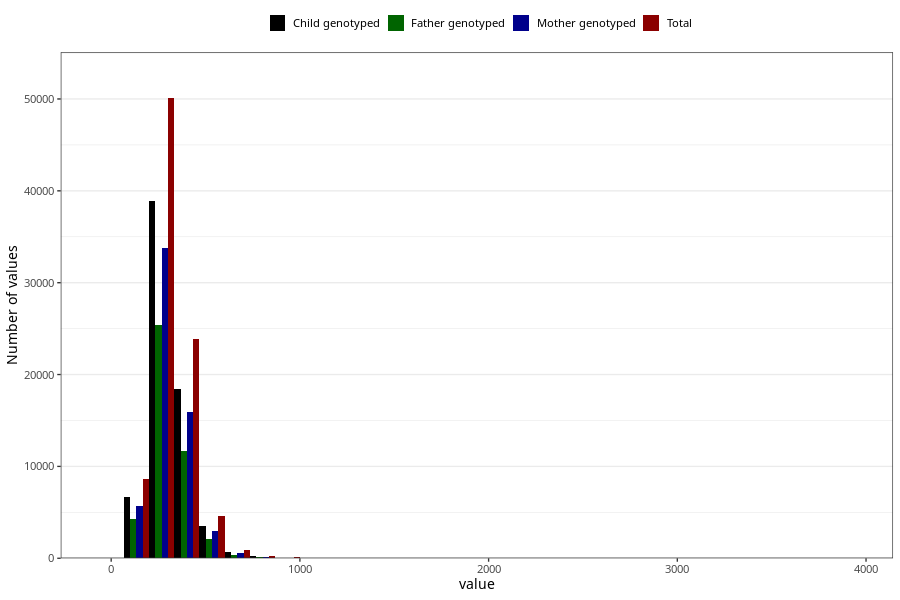

# tot_carb
Variable mapping to questionnaire: q2, question TOT_KARB.
.
- Number of values:

| Value | Total | Child genotyped | Mother genotyped | Father genotyped |
| ----- | ----- | --------------- | ---------------- | ---------------- |
| Missing | 24927 | 14790 | 12674 | 6238 |
| 0 | 1 | 1 | 1 |0 |
| 0.2 | 1 | 1 | 1 |1 |
| 2.88 | 1 | 1 | 1 |0 |
| 4.02 | 1 | 1 | 1 |1 |
| 6.71 | 1 | 1 | 0 |1 |
| 9.47 | 1 | 1 | 1 |1 |
| 16.67 | 1 | 0 | 0 |0 |
| 19.39 | 1 | 0 | 0 |0 |
| 34.35 | 1 | 1 | 1 |0 |
| 34.37 | 1 | 1 | 1 |1 |
| 36.9 | 1 | 0 | 0 |0 |
| 40.29 | 1 | 1 | 1 |1 |
| 43.85 | 1 | 0 | 0 |0 |
| 44.36 | 1 | 1 | 0 |0 |
| 47.33 | 1 | 1 | 1 |1 |
| 49.95 | 2 | 2 | 0 |0 |
| 50.14 | 1 | 1 | 0 |1 |
| 54.66 | 1 | 1 | 0 |0 |
| 55.29 | 1 | 1 | 1 |1 |
| 55.64 | 1 | 1 | 0 |0 |
| 55.95 | 1 | 1 | 1 |1 |
| 56.32 | 1 | 1 | 0 |0 |
| 56.87 | 1 | 0 | 0 |0 |
| 57.71 | 1 | 1 | 0 |0 |
| 57.81 | 1 | 0 | 0 |0 |
| 58.74 | 1 | 0 | 0 |0 |
| 62.28 | 1 | 0 | 0 |0 |
| 63.4 | 1 | 0 | 0 |0 |
| 65.01 | 1 | 1 | 0 |0 |
| 66.42 | 1 | 1 | 1 |0 |
| 67.74 | 1 | 1 | 0 |1 |
| 69.26 | 1 | 1 | 1 |1 |
| 69.27 | 1 | 1 | 1 |1 |
| 69.31 | 1 | 0 | 0 |0 |
| 69.38 | 1 | 1 | 0 |0 |
| 70.6 | 1 | 0 | 0 |0 |
| 70.8 | 1 | 1 | 1 |1 |
| 70.95 | 1 | 1 | 1 |1 |
| 72.96 | 1 | 0 | 0 |0 |
| 73.15 | 1 | 1 | 0 |0 |
| 73.37 | 2 | 1 | 1 |1 |
| 74.66 | 1 | 0 | 0 |0 |
| 75.11 | 1 | 1 | 0 |0 |
| 75.46 | 1 | 1 | 1 |1 |
| 76.48 | 1 | 0 | 0 |0 |
| 76.67 | 1 | 1 | 1 |1 |
| 76.81 | 1 | 0 | 0 |0 |
| 77.11 | 1 | 0 | 0 |0 |
| 77.64 | 1 | 1 | 1 |1 |
| 78.05 | 1 | 0 | 0 |0 |
| 78.61 | 1 | 1 | 1 |0 |
| 78.92 | 1 | 1 | 1 |1 |
| 78.99 | 1 | 1 | 0 |1 |
| 79.32 | 1 | 1 | 1 |1 |
| 79.52 | 1 | 1 | 0 |0 |
| 80.15 | 1 | 1 | 1 |1 |
| 80.18 | 1 | 1 | 1 |0 |
| 80.63 | 1 | 1 | 1 |0 |
| 81.45 | 1 | 1 | 1 |1 |
| 83.11 | 1 | 1 | 1 |0 |
| 83.23 | 1 | 1 | 1 |0 |
| 83.45 | 1 | 1 | 1 |1 |
| 83.59 | 1 | 0 | 0 |0 |
| 83.66 | 1 | 1 | 1 |1 |
| 83.85 | 1 | 1 | 1 |1 |
| 84.02 | 1 | 0 | 0 |0 |
| 84.09 | 1 | 1 | 1 |0 |
| 85.25 | 1 | 1 | 1 |1 |
| 85.55 | 1 | 1 | 0 |0 |
| 85.57 | 1 | 1 | 1 |0 |
| 85.82 | 1 | 1 | 1 |1 |
| 86.32 | 1 | 0 | 0 |0 |
| 86.41 | 1 | 1 | 0 |0 |
| 86.57 | 1 | 1 | 1 |0 |
| 87.02 | 1 | 1 | 1 |1 |
| 87.47 | 1 | 1 | 1 |0 |
| 87.9 | 1 | 0 | 0 |0 |
| 88.04 | 1 | 1 | 0 |0 |
| 88.67 | 1 | 1 | 0 |0 |
| 88.86 | 1 | 0 | 0 |0 |
| 89.05 | 1 | 1 | 0 |1 |
| 89.36 | 1 | 1 | 1 |1 |
| 89.53 | 1 | 1 | 1 |1 |
| 89.54 | 1 | 1 | 1 |1 |
| 89.64 | 1 | 1 | 1 |1 |
| 89.67 | 1 | 1 | 0 |0 |
| 89.85 | 1 | 1 | 0 |0 |
| 90.12 | 1 | 0 | 0 |0 |
| 90.14 | 1 | 0 | 0 |0 |
| 90.52 | 1 | 1 | 1 |1 |
| 90.81 | 1 | 1 | 1 |1 |
| 90.87 | 1 | 1 | 1 |1 |
| 91.1 | 1 | 1 | 1 |0 |
| 91.11 | 1 | 1 | 1 |1 |
| 91.13 | 1 | 1 | 1 |1 |
| 91.25 | 1 | 1 | 1 |1 |
| 91.35 | 1 | 1 | 1 |1 |
| 91.48 | 1 | 1 | 0 |0 |
| 91.74 | 1 | 0 | 0 |0 |
| 91.88 | 2 | 0 | 0 |0 |
| 92.03 | 1 | 1 | 0 |0 |
| 92.14 | 1 | 1 | 1 |1 |
| 92.29 | 1 | 1 | 1 |1 |
| 92.4 | 1 | 1 | 1 |1 |
| 92.43 | 1 | 1 | 1 |1 |
| 93.31 | 1 | 0 | 0 |0 |
| 93.39 | 1 | 1 | 1 |1 |
| 93.4 | 1 | 0 | 0 |0 |
| 93.55 | 1 | 1 | 0 |0 |
| 93.57 | 2 | 1 | 1 |1 |
| 93.78 | 1 | 1 | 1 |1 |
| 93.89 | 1 | 1 | 1 |1 |
| 93.9 | 1 | 0 | 0 |0 |
| 94 | 1 | 1 | 0 |0 |
| 94.37 | 1 | 1 | 0 |0 |
| 94.38 | 2 | 0 | 0 |0 |
| 94.46 | 1 | 1 | 1 |1 |
| 94.92 | 1 | 1 | 1 |1 |
| 94.95 | 1 | 0 | 0 |0 |
| 95.28 | 1 | 1 | 1 |1 |
| 95.31 | 1 | 0 | 0 |0 |
| 95.78 | 1 | 1 | 1 |0 |
| 95.84 | 1 | 0 | 0 |0 |
| 95.96 | 1 | 1 | 1 |0 |
| 96.03 | 1 | 1 | 0 |0 |
| 96.08 | 1 | 1 | 1 |0 |
| 96.3 | 1 | 1 | 1 |1 |
| 96.51 | 1 | 1 | 1 |1 |
| 96.52 | 1 | 1 | 1 |0 |
| 96.66 | 1 | 1 | 1 |1 |
| 96.86 | 1 | 1 | 1 |1 |
| 97.01 | 1 | 1 | 1 |1 |
| 97.4 | 1 | 1 | 1 |1 |
| 97.47 | 1 | 1 | 1 |0 |
| 97.56 | 1 | 1 | 1 |0 |
| 97.59 | 1 | 1 | 1 |1 |
| 97.95 | 1 | 0 | 0 |0 |
| 98.08 | 1 | 1 | 1 |0 |
| 98.27 | 1 | 0 | 0 |0 |
| 98.44 | 1 | 1 | 1 |0 |
| 98.47 | 1 | 1 | 1 |1 |
| 98.49 | 1 | 0 | 0 |0 |
| 98.66 | 1 | 1 | 1 |1 |
| 98.69 | 1 | 1 | 1 |1 |
| 98.87 | 2 | 1 | 1 |0 |
| 99.14 | 1 | 0 | 0 |0 |
| 99.18 | 1 | 0 | 0 |0 |
| 99.27 | 1 | 1 | 0 |0 |
| 99.65 | 1 | 0 | 0 |0 |
| 99.74 | 1 | 1 | 1 |0 |
| 99.75 | 1 | 0 | 0 |0 |
| 99.84 | 1 | 0 | 0 |0 |
| 99.93 | 1 | 0 | 0 |0 |
| 99.98 | 1 | 1 | 1 |1 |
| 100.03 | 1 | 1 | 0 |0 |
| 100.07 | 1 | 0 | 0 |0 |
| 100.09 | 1 | 1 | 1 |0 |
| 100.23 | 1 | 0 | 0 |0 |
| 100.57 | 1 | 1 | 1 |1 |
| 100.68 | 1 | 1 | 1 |1 |
| 100.91 | 1 | 1 | 1 |1 |
| 100.92 | 1 | 0 | 0 |0 |
| 100.95 | 1 | 0 | 0 |0 |
| 101.02 | 1 | 1 | 1 |1 |
| 101.09 | 1 | 1 | 1 |1 |
| 101.14 | 1 | 1 | 0 |0 |
| 101.19 | 1 | 1 | 1 |1 |
| 101.37 | 1 | 0 | 0 |0 |
| 101.44 | 1 | 1 | 1 |1 |
| 101.54 | 1 | 1 | 1 |1 |
| 101.56 | 1 | 1 | 1 |1 |
| 101.74 | 1 | 1 | 0 |0 |
| 101.81 | 1 | 1 | 1 |1 |
| 101.87 | 1 | 0 | 0 |0 |
| 101.89 | 1 | 0 | 0 |0 |
| 101.9 | 1 | 1 | 1 |0 |
| 101.97 | 1 | 1 | 1 |0 |
| 102.09 | 1 | 1 | 1 |0 |
| 102.22 | 1 | 1 | 1 |1 |
| 102.3 | 1 | 1 | 1 |1 |
| 102.37 | 1 | 1 | 1 |1 |
| 102.5 | 1 | 1 | 0 |0 |
| 102.6 | 1 | 1 | 1 |1 |
| 102.77 | 1 | 0 | 0 |0 |
| 102.8 | 1 | 0 | 0 |0 |
| 102.84 | 1 | 1 | 1 |1 |
| 102.88 | 1 | 1 | 1 |1 |
| 102.98 | 1 | 1 | 1 |1 |
| 103.07 | 1 | 1 | 1 |1 |
| 103.09 | 1 | 1 | 1 |1 |
| 103.12 | 1 | 0 | 0 |0 |
| 103.17 | 1 | 1 | 1 |0 |
| 103.35 | 1 | 0 | 0 |0 |
| 103.47 | 1 | 1 | 1 |0 |
| 103.63 | 1 | 1 | 1 |1 |
| 103.68 | 1 | 1 | 1 |1 |
| 103.73 | 1 | 1 | 1 |0 |
| 104.03 | 1 | 1 | 1 |1 |
| 104.08 | 1 | 1 | 1 |1 |
| 104.1 | 1 | 1 | 1 |1 |
| 104.11 | 1 | 1 | 1 |0 |
| 104.14 | 1 | 1 | 1 |1 |
| 104.27 | 1 | 1 | 0 |0 |
| 104.43 | 1 | 1 | 1 |0 |
| 104.48 | 1 | 0 | 0 |0 |
| 104.55 | 1 | 1 | 1 |1 |
| 104.71 | 1 | 0 | 0 |0 |
| 104.72 | 1 | 1 | 1 |1 |
| 104.93 | 1 | 1 | 1 |1 |
| 104.96 | 1 | 1 | 1 |1 |
| 105.08 | 1 | 0 | 0 |0 |
| 105.24 | 1 | 0 | 0 |0 |
| 105.26 | 1 | 1 | 1 |1 |
| 105.42 | 1 | 0 | 0 |0 |
| 105.45 | 1 | 1 | 0 |0 |
| 105.54 | 1 | 0 | 0 |0 |
| 105.62 | 1 | 0 | 0 |0 |
| 105.85 | 1 | 1 | 1 |1 |
| 105.89 | 1 | 1 | 1 |1 |
| 105.92 | 1 | 0 | 0 |0 |
| 105.96 | 1 | 1 | 1 |1 |
| 105.97 | 1 | 1 | 0 |1 |
| 106.23 | 1 | 1 | 1 |1 |
| 106.33 | 1 | 1 | 1 |1 |
| 106.37 | 1 | 1 | 1 |1 |
| 106.47 | 1 | 0 | 0 |0 |
| 106.74 | 1 | 1 | 1 |0 |
| 106.83 | 1 | 0 | 0 |0 |
| 106.89 | 1 | 1 | 1 |1 |
| 107.19 | 1 | 1 | 0 |0 |
| 107.21 | 1 | 1 | 1 |1 |
| 107.34 | 1 | 1 | 1 |1 |
| 107.42 | 1 | 1 | 1 |0 |
| 107.57 | 1 | 0 | 0 |0 |
| 107.6 | 1 | 1 | 0 |0 |
| 107.61 | 1 | 1 | 1 |0 |
| 107.64 | 1 | 1 | 1 |1 |
| 107.67 | 1 | 1 | 1 |1 |
| 107.69 | 1 | 1 | 1 |1 |
| 107.7 | 1 | 1 | 1 |1 |
| 107.9 | 1 | 1 | 1 |0 |
| 107.94 | 1 | 0 | 0 |0 |
| 108 | 1 | 1 | 1 |1 |
| 108.01 | 1 | 1 | 0 |1 |
| 108.17 | 1 | 1 | 1 |1 |
| 108.2 | 1 | 1 | 1 |1 |
| 108.21 | 1 | 1 | 1 |1 |
| 108.3 | 1 | 0 | 0 |0 |
| 108.43 | 1 | 1 | 1 |0 |
| 108.48 | 1 | 0 | 0 |0 |
| 108.64 | 1 | 1 | 1 |1 |
| 108.67 | 1 | 1 | 1 |0 |
| 108.75 | 1 | 0 | 0 |0 |
| 108.78 | 1 | 0 | 0 |0 |
| 108.91 | 1 | 1 | 1 |1 |
| 108.92 | 1 | 0 | 0 |0 |
| 108.93 | 1 | 1 | 1 |1 |
| 109.1 | 1 | 0 | 0 |0 |
| 109.18 | 1 | 0 | 0 |0 |
| 109.3 | 1 | 0 | 0 |0 |
| 109.37 | 1 | 0 | 0 |0 |
| 109.51 | 1 | 1 | 0 |0 |
| 109.59 | 1 | 1 | 1 |1 |
| 109.64 | 1 | 1 | 1 |1 |
| 109.68 | 1 | 1 | 1 |1 |
| 109.77 | 1 | 1 | 1 |1 |
| 109.78 | 1 | 1 | 1 |1 |
| 109.96 | 1 | 1 | 1 |1 |
| 110.05 | 1 | 1 | 1 |1 |
| 110.09 | 1 | 1 | 1 |1 |
| 110.21 | 1 | 1 | 1 |1 |
| 110.22 | 1 | 1 | 0 |0 |
| 110.32 | 1 | 1 | 1 |0 |
| 110.4 | 1 | 1 | 1 |1 |
| 110.49 | 1 | 1 | 0 |0 |
| 110.55 | 1 | 1 | 1 |1 |
| 110.56 | 2 | 2 | 2 |2 |
| 110.57 | 1 | 1 | 1 |1 |
| 110.64 | 1 | 1 | 1 |1 |
| 110.68 | 1 | 1 | 0 |0 |
| 110.76 | 1 | 1 | 0 |1 |
| 110.84 | 1 | 1 | 1 |1 |
| 110.92 | 2 | 1 | 0 |0 |
| 110.95 | 1 | 1 | 1 |1 |
| 111.02 | 1 | 0 | 0 |0 |
| 111.15 | 1 | 1 | 1 |1 |
| 111.2 | 1 | 0 | 0 |0 |
| 111.22 | 1 | 0 | 0 |0 |
| 111.3 | 1 | 0 | 0 |0 |
| 111.34 | 1 | 1 | 1 |1 |
| 111.49 | 1 | 1 | 1 |0 |
| 111.53 | 1 | 1 | 1 |0 |
| 111.55 | 1 | 1 | 1 |1 |
| 111.64 | 1 | 1 | 1 |0 |
| 111.73 | 1 | 1 | 1 |1 |
| 111.84 | 1 | 1 | 1 |1 |
| 111.93 | 1 | 1 | 1 |0 |
| 111.98 | 1 | 0 | 0 |0 |
| 112.07 | 1 | 0 | 0 |0 |
| 112.2 | 1 | 1 | 1 |1 |
| 112.27 | 1 | 0 | 0 |0 |
| 112.34 | 1 | 1 | 1 |1 |
| 112.54 | 1 | 0 | 0 |0 |
| 112.58 | 1 | 1 | 0 |0 |
| 112.59 | 1 | 1 | 1 |1 |
| 112.7 | 1 | 0 | 0 |0 |
| 112.74 | 2 | 2 | 2 |2 |
| 112.89 | 1 | 1 | 1 |1 |
| 113.06 | 1 | 1 | 1 |1 |
| 113.34 | 1 | 1 | 1 |1 |
| 113.36 | 1 | 1 | 1 |1 |
| 113.46 | 1 | 1 | 1 |1 |
| 113.5 | 1 | 1 | 1 |0 |
| 113.6 | 1 | 1 | 1 |0 |
| 113.61 | 1 | 1 | 1 |1 |
| 113.65 | 1 | 1 | 0 |0 |
| 113.67 | 1 | 1 | 1 |1 |
| 113.7 | 1 | 1 | 0 |1 |
| 113.71 | 1 | 1 | 1 |1 |
| 113.89 | 2 | 1 | 1 |0 |
| 113.99 | 1 | 1 | 1 |0 |
| 114.02 | 1 | 1 | 1 |1 |
| 114.14 | 1 | 1 | 1 |1 |
| 114.15 | 2 | 2 | 2 |2 |
| 114.47 | 1 | 1 | 1 |0 |
| 114.48 | 1 | 1 | 1 |0 |
| 114.5 | 1 | 1 | 1 |1 |
| 114.51 | 1 | 1 | 1 |0 |
| 114.53 | 1 | 1 | 1 |1 |
| 114.55 | 1 | 0 | 0 |0 |
| 114.56 | 1 | 1 | 1 |1 |
| 114.62 | 1 | 1 | 1 |0 |
| 114.76 | 1 | 1 | 1 |1 |
| 114.79 | 1 | 1 | 1 |1 |
| 114.84 | 1 | 1 | 1 |0 |
| 114.91 | 1 | 1 | 1 |0 |
| 114.92 | 1 | 0 | 0 |0 |
| 114.94 | 1 | 1 | 1 |1 |
| 114.95 | 1 | 0 | 0 |0 |
| 114.96 | 1 | 1 | 1 |1 |
| 115.02 | 1 | 1 | 1 |0 |
| 115.03 | 1 | 1 | 1 |0 |
| 115.04 | 1 | 1 | 0 |0 |
| 115.07 | 1 | 1 | 1 |1 |
| 115.15 | 1 | 1 | 0 |0 |
| 115.16 | 1 | 1 | 1 |1 |
| 115.27 | 1 | 0 | 0 |0 |
| 115.33 | 1 | 1 | 1 |1 |
| 115.36 | 1 | 1 | 1 |1 |
| 115.38 | 1 | 1 | 0 |0 |
| 115.47 | 1 | 1 | 0 |0 |
| 115.57 | 1 | 0 | 0 |0 |
| 115.71 | 1 | 1 | 0 |0 |
| 115.76 | 1 | 1 | 1 |0 |
| 115.8 | 1 | 0 | 0 |0 |
| 115.81 | 2 | 1 | 0 |1 |
| 115.88 | 1 | 1 | 1 |1 |
| 116.06 | 1 | 1 | 1 |0 |
| 116.13 | 1 | 1 | 1 |1 |
| 116.22 | 1 | 1 | 1 |0 |
| 116.23 | 1 | 0 | 0 |0 |
| 116.3 | 2 | 1 | 0 |0 |
| 116.41 | 2 | 2 | 2 |1 |
| 116.42 | 1 | 1 | 1 |1 |
| 116.45 | 2 | 1 | 0 |1 |
| 116.48 | 1 | 0 | 0 |0 |
| 116.64 | 1 | 1 | 1 |1 |
| 116.68 | 1 | 1 | 0 |0 |
| 116.7 | 2 | 2 | 1 |1 |
| 116.75 | 1 | 1 | 1 |1 |
| 116.78 | 1 | 1 | 1 |0 |
| 116.82 | 1 | 1 | 1 |1 |
| 116.87 | 1 | 1 | 1 |0 |
| 116.89 | 1 | 1 | 1 |0 |
| 116.9 | 2 | 1 | 1 |1 |
| 117.06 | 1 | 1 | 1 |0 |
| 117.12 | 1 | 0 | 0 |0 |
| 117.23 | 1 | 1 | 1 |1 |
| 117.4 | 1 | 0 | 0 |0 |
| 117.45 | 1 | 1 | 1 |1 |
| 117.48 | 1 | 0 | 0 |0 |
| 117.65 | 1 | 1 | 1 |1 |
| 117.9 | 2 | 1 | 1 |1 |
| 117.98 | 1 | 1 | 0 |0 |
| 118.07 | 1 | 0 | 0 |0 |
| 118.08 | 2 | 2 | 2 |2 |
| 118.22 | 1 | 1 | 1 |1 |
| 118.25 | 1 | 1 | 1 |1 |
| 118.28 | 2 | 2 | 1 |0 |
| 118.3 | 1 | 1 | 0 |0 |
| 118.48 | 1 | 0 | 0 |0 |
| 118.49 | 1 | 1 | 1 |1 |
| 118.58 | 1 | 0 | 0 |0 |
| 118.7 | 1 | 1 | 1 |0 |
| 118.74 | 1 | 1 | 0 |1 |
| 118.77 | 1 | 1 | 1 |0 |
| 118.81 | 1 | 1 | 1 |1 |
| 118.84 | 2 | 1 | 1 |1 |
| 118.85 | 2 | 2 | 2 |1 |
| 118.86 | 1 | 1 | 1 |1 |
| 118.9 | 1 | 0 | 0 |0 |
| 118.91 | 1 | 0 | 0 |0 |
| 119 | 1 | 1 | 1 |0 |
| 119.02 | 1 | 0 | 0 |0 |
| 119.04 | 1 | 0 | 0 |0 |
| 119.23 | 1 | 1 | 0 |0 |
| 119.38 | 1 | 1 | 1 |1 |
| 119.43 | 2 | 1 | 1 |1 |
| 119.45 | 2 | 2 | 2 |2 |
| 119.51 | 1 | 1 | 1 |0 |
| 119.53 | 1 | 1 | 1 |0 |
| 119.56 | 1 | 1 | 1 |1 |
| 119.58 | 1 | 1 | 1 |0 |
| 119.64 | 1 | 0 | 0 |0 |
| 119.65 | 1 | 1 | 1 |1 |
| 119.66 | 1 | 1 | 1 |1 |
| 119.74 | 1 | 1 | 1 |1 |
| 119.81 | 1 | 1 | 0 |0 |
| 119.83 | 1 | 1 | 1 |0 |
| 119.9 | 1 | 1 | 1 |0 |
| 119.99 | 1 | 1 | 0 |1 |
| 120.03 | 2 | 2 | 1 |1 |
| 120.11 | 2 | 2 | 2 |2 |
| 120.25 | 1 | 1 | 0 |0 |
| 120.28 | 2 | 2 | 2 |1 |
| 120.33 | 1 | 1 | 1 |1 |
| 120.34 | 1 | 1 | 1 |1 |
| 120.37 | 1 | 1 | 1 |1 |
| 120.39 | 2 | 1 | 1 |1 |
| 120.52 | 1 | 1 | 1 |1 |
| 120.59 | 1 | 0 | 0 |0 |
| 120.68 | 2 | 0 | 0 |0 |
| 120.7 | 1 | 0 | 0 |0 |
| 120.81 | 1 | 1 | 1 |0 |
| 120.84 | 2 | 2 | 2 |1 |
| 120.86 | 1 | 1 | 1 |1 |
| 120.94 | 1 | 1 | 0 |0 |
| 121.13 | 1 | 1 | 1 |1 |
| 121.19 | 2 | 2 | 2 |1 |
| 121.22 | 1 | 0 | 0 |0 |
| 121.24 | 2 | 1 | 1 |0 |
| 121.26 | 2 | 2 | 2 |2 |
| 121.32 | 1 | 1 | 1 |1 |
| 121.35 | 1 | 0 | 0 |0 |
| 121.47 | 1 | 1 | 1 |1 |
| 121.48 | 3 | 3 | 1 |0 |
| 121.52 | 2 | 2 | 2 |1 |
| 121.57 | 1 | 1 | 1 |1 |
| 121.58 | 1 | 1 | 1 |1 |
| 121.6 | 1 | 1 | 1 |0 |
| 121.61 | 1 | 1 | 0 |0 |
| 121.62 | 1 | 1 | 1 |1 |
| 121.63 | 1 | 1 | 1 |1 |
| 121.64 | 1 | 1 | 1 |1 |
| 121.67 | 1 | 1 | 1 |1 |
| 121.77 | 1 | 1 | 0 |1 |
| 121.78 | 1 | 1 | 1 |0 |
| 121.8 | 1 | 1 | 1 |1 |
| 121.88 | 1 | 1 | 1 |1 |
| 121.89 | 1 | 1 | 1 |1 |
| 121.91 | 2 | 2 | 2 |2 |
| 121.96 | 1 | 1 | 1 |0 |
| 122.05 | 1 | 0 | 0 |0 |
| 122.07 | 1 | 1 | 1 |1 |
| 122.1 | 1 | 1 | 1 |0 |
| 122.11 | 1 | 1 | 0 |0 |
| 122.18 | 1 | 0 | 0 |0 |
| 122.19 | 2 | 2 | 1 |0 |
| 122.27 | 2 | 2 | 2 |2 |
| 122.37 | 1 | 1 | 1 |1 |
| 122.39 | 1 | 1 | 1 |1 |
| 122.41 | 1 | 1 | 1 |0 |
| 122.48 | 1 | 1 | 1 |0 |
| 122.49 | 1 | 1 | 1 |1 |
| 122.5 | 1 | 1 | 1 |1 |
| 122.62 | 1 | 0 | 0 |0 |
| 122.68 | 1 | 1 | 1 |1 |
| 122.69 | 1 | 1 | 1 |1 |
| 122.74 | 1 | 1 | 1 |1 |
| 122.79 | 1 | 1 | 1 |1 |
| 122.81 | 1 | 1 | 0 |0 |
| 122.82 | 1 | 0 | 0 |0 |
| 122.85 | 1 | 0 | 0 |0 |
| 122.88 | 1 | 1 | 1 |1 |
| 122.91 | 1 | 1 | 1 |1 |
| 122.94 | 2 | 2 | 2 |2 |
| 122.98 | 1 | 0 | 0 |0 |
| 123.08 | 1 | 0 | 0 |0 |
| 123.17 | 1 | 1 | 1 |1 |
| 123.27 | 1 | 1 | 0 |1 |
| 123.29 | 1 | 1 | 1 |1 |
| 123.3 | 1 | 1 | 0 |0 |
| 123.37 | 1 | 1 | 1 |0 |
| 123.43 | 1 | 1 | 1 |0 |
| 123.56 | 1 | 1 | 1 |0 |
| 123.57 | 1 | 1 | 0 |0 |
| 123.61 | 1 | 1 | 1 |1 |
| 123.72 | 1 | 0 | 0 |0 |
| 123.73 | 1 | 0 | 0 |0 |
| 123.78 | 1 | 1 | 1 |1 |
| 123.82 | 1 | 1 | 1 |1 |
| 123.86 | 1 | 1 | 0 |0 |
| 123.92 | 1 | 1 | 1 |1 |
| 123.96 | 3 | 1 | 1 |1 |
| 123.97 | 1 | 1 | 0 |0 |
| 124.06 | 2 | 2 | 2 |2 |
| 124.11 | 1 | 1 | 1 |1 |
| 124.2 | 1 | 1 | 0 |0 |
| 124.21 | 1 | 1 | 1 |1 |
| 124.25 | 1 | 1 | 1 |1 |
| 124.27 | 1 | 1 | 1 |1 |
| 124.3 | 2 | 0 | 0 |0 |
| 124.36 | 2 | 2 | 2 |1 |
| 124.38 | 2 | 2 | 2 |1 |
| 124.4 | 1 | 1 | 1 |1 |
| 124.43 | 1 | 0 | 0 |0 |
| 124.54 | 1 | 1 | 0 |0 |
| 124.6 | 1 | 1 | 1 |1 |
| 124.68 | 1 | 1 | 1 |1 |
| 124.69 | 1 | 1 | 1 |1 |
| 124.74 | 1 | 1 | 1 |1 |
| 124.81 | 2 | 1 | 1 |0 |
| 124.84 | 1 | 0 | 0 |0 |
| 124.89 | 1 | 0 | 0 |0 |
| 124.92 | 1 | 0 | 0 |0 |
| 124.99 | 1 | 1 | 1 |1 |
| 125 | 1 | 0 | 0 |0 |
| 125.01 | 1 | 0 | 0 |0 |
| 125.02 | 1 | 1 | 0 |0 |
| 125.09 | 1 | 1 | 1 |1 |
| 125.11 | 2 | 1 | 1 |1 |
| 125.12 | 1 | 1 | 1 |0 |
| 125.15 | 1 | 1 | 0 |1 |
| 125.19 | 1 | 0 | 0 |0 |
| 125.25 | 1 | 0 | 0 |0 |
| 125.27 | 1 | 1 | 1 |1 |
| 125.28 | 1 | 0 | 0 |0 |
| 125.35 | 2 | 2 | 2 |2 |
| 125.4 | 1 | 1 | 1 |1 |
| 125.6 | 1 | 0 | 0 |0 |
| 125.66 | 1 | 1 | 1 |0 |
| 125.69 | 1 | 1 | 1 |1 |
| 125.76 | 1 | 1 | 1 |0 |
| 125.77 | 1 | 1 | 1 |0 |
| 125.78 | 2 | 1 | 0 |0 |
| 125.79 | 1 | 1 | 1 |1 |
| 125.8 | 1 | 1 | 1 |1 |
| 125.82 | 1 | 1 | 1 |1 |
| 125.83 | 1 | 1 | 0 |1 |
| 125.87 | 1 | 1 | 1 |1 |
| 125.89 | 1 | 1 | 1 |0 |
| 125.91 | 2 | 2 | 1 |1 |
| 125.99 | 1 | 1 | 1 |1 |
| 126 | 2 | 2 | 2 |2 |
| 126.07 | 2 | 2 | 2 |2 |
| 126.08 | 1 | 0 | 0 |0 |
| 126.09 | 1 | 1 | 0 |0 |
| 126.11 | 1 | 1 | 1 |1 |
| 126.16 | 1 | 0 | 0 |0 |
| 126.18 | 1 | 1 | 1 |0 |
| 126.28 | 1 | 1 | 1 |0 |
| 126.46 | 1 | 1 | 1 |0 |
| 126.49 | 1 | 1 | 0 |0 |
| 126.51 | 1 | 1 | 1 |1 |
| 126.54 | 2 | 1 | 0 |0 |
| 126.56 | 2 | 1 | 1 |1 |
| 126.61 | 1 | 0 | 0 |0 |
| 126.65 | 1 | 0 | 0 |0 |
| 126.67 | 1 | 1 | 1 |1 |
| 126.71 | 1 | 1 | 0 |0 |
| 126.72 | 1 | 1 | 1 |0 |
| 126.73 | 1 | 1 | 0 |0 |
| 126.75 | 1 | 1 | 1 |1 |
| 126.78 | 2 | 2 | 1 |1 |
| 126.8 | 1 | 1 | 1 |1 |
| 126.83 | 2 | 2 | 1 |2 |
| 126.86 | 1 | 1 | 1 |1 |
| 126.89 | 1 | 0 | 0 |0 |
| 126.91 | 2 | 1 | 1 |1 |
| 126.92 | 1 | 1 | 1 |1 |
| 127 | 1 | 1 | 1 |0 |
| 127.03 | 1 | 1 | 1 |0 |
| 127.04 | 1 | 1 | 1 |1 |
| 127.05 | 1 | 1 | 0 |1 |
| 127.08 | 1 | 1 | 1 |0 |
| 127.11 | 1 | 1 | 0 |0 |
| 127.13 | 1 | 1 | 1 |1 |
| 127.15 | 1 | 1 | 1 |1 |
| 127.18 | 1 | 1 | 1 |0 |
| 127.21 | 1 | 0 | 0 |0 |
| 127.23 | 1 | 1 | 0 |0 |
| 127.24 | 1 | 1 | 1 |1 |
| 127.25 | 1 | 1 | 1 |1 |
| 127.28 | 2 | 1 | 0 |0 |
| 127.31 | 1 | 1 | 1 |1 |
| 127.35 | 1 | 0 | 0 |0 |
| 127.4 | 1 | 1 | 1 |0 |
| 127.41 | 1 | 1 | 1 |1 |
| 127.42 | 1 | 1 | 1 |1 |
| 127.44 | 1 | 0 | 0 |0 |
| 127.45 | 1 | 1 | 1 |0 |
| 127.48 | 1 | 0 | 0 |0 |
| 127.49 | 1 | 0 | 0 |0 |
| 127.5 | 1 | 1 | 0 |0 |
| 127.58 | 1 | 1 | 1 |1 |
| 127.59 | 1 | 1 | 0 |0 |
| 127.63 | 1 | 0 | 0 |0 |
| 127.65 | 2 | 2 | 2 |1 |
| 127.68 | 1 | 1 | 1 |1 |
| 127.7 | 1 | 1 | 0 |0 |
| 127.71 | 1 | 0 | 0 |0 |
| 127.73 | 1 | 1 | 1 |1 |
| 127.78 | 1 | 1 | 0 |0 |
| 127.81 | 1 | 1 | 1 |1 |
| 127.85 | 1 | 1 | 1 |1 |
| 127.86 | 1 | 0 | 0 |0 |
| 127.9 | 1 | 1 | 1 |1 |
| 128.04 | 1 | 1 | 1 |1 |
| 128.06 | 3 | 3 | 1 |1 |
| 128.07 | 1 | 1 | 1 |0 |
| 128.15 | 2 | 2 | 2 |1 |
| 128.16 | 1 | 1 | 1 |1 |
| 128.17 | 1 | 0 | 0 |0 |
| 128.2 | 1 | 1 | 1 |1 |
| 128.35 | 2 | 2 | 1 |1 |
| 128.38 | 1 | 1 | 1 |0 |
| 128.44 | 1 | 1 | 0 |0 |
| 128.51 | 1 | 1 | 1 |1 |
| 128.52 | 2 | 1 | 1 |1 |
| 128.55 | 1 | 1 | 1 |1 |
| 128.59 | 1 | 1 | 1 |1 |
| 128.66 | 1 | 1 | 0 |0 |
| 128.67 | 2 | 2 | 1 |1 |
| 128.74 | 1 | 1 | 1 |1 |
| 128.75 | 1 | 1 | 0 |0 |
| 128.76 | 2 | 2 | 0 |0 |
| 128.83 | 1 | 1 | 0 |0 |
| 128.84 | 1 | 0 | 0 |0 |
| 128.86 | 1 | 1 | 1 |0 |
| 128.95 | 1 | 1 | 0 |0 |
| 128.99 | 1 | 1 | 1 |1 |
| 129.08 | 1 | 1 | 1 |0 |
| 129.09 | 1 | 1 | 1 |1 |
| 129.14 | 1 | 1 | 1 |0 |
| 129.19 | 1 | 1 | 1 |0 |
| 129.21 | 1 | 1 | 1 |1 |
| 129.25 | 1 | 1 | 1 |1 |
| 129.28 | 2 | 1 | 1 |0 |
| 129.3 | 1 | 1 | 1 |1 |
| 129.31 | 1 | 1 | 1 |0 |
| 129.32 | 1 | 1 | 1 |1 |
| 129.45 | 1 | 1 | 1 |0 |
| 129.5 | 1 | 1 | 1 |0 |
| 129.54 | 1 | 1 | 1 |1 |
| 129.55 | 1 | 0 | 0 |0 |
| 129.58 | 1 | 1 | 1 |1 |
| 129.59 | 1 | 1 | 0 |1 |
| 129.61 | 1 | 1 | 1 |1 |
| 129.67 | 1 | 1 | 1 |0 |
| 129.7 | 1 | 0 | 0 |0 |
| 129.74 | 1 | 1 | 1 |0 |
| 129.76 | 1 | 1 | 1 |0 |
| 129.78 | 1 | 1 | 0 |1 |
| 129.79 | 1 | 1 | 0 |0 |
| 129.83 | 1 | 0 | 0 |0 |
| 129.89 | 1 | 0 | 0 |0 |
| 129.92 | 2 | 1 | 1 |1 |
| 129.99 | 1 | 0 | 0 |0 |
| 130.07 | 2 | 2 | 1 |0 |
| 130.18 | 1 | 1 | 0 |0 |
| 130.22 | 1 | 1 | 1 |1 |
| 130.23 | 1 | 0 | 0 |0 |
| 130.25 | 1 | 1 | 1 |0 |
| 130.26 | 1 | 1 | 1 |0 |
| 130.27 | 1 | 0 | 0 |0 |
| 130.37 | 1 | 1 | 1 |1 |
| 130.46 | 1 | 1 | 0 |1 |
| 130.47 | 1 | 1 | 1 |1 |
| 130.52 | 1 | 1 | 1 |1 |
| 130.57 | 2 | 1 | 1 |1 |
| 130.58 | 1 | 1 | 1 |1 |
| 130.7 | 1 | 0 | 0 |0 |
| 130.71 | 1 | 1 | 1 |0 |
| 130.76 | 1 | 1 | 1 |0 |
| 130.79 | 1 | 1 | 1 |1 |
| 130.82 | 1 | 0 | 0 |0 |
| 130.88 | 1 | 0 | 0 |0 |
| 130.96 | 1 | 1 | 0 |0 |
| 130.98 | 1 | 1 | 1 |0 |
| 131.04 | 1 | 1 | 0 |1 |
| 131.07 | 1 | 1 | 1 |1 |
| 131.08 | 2 | 2 | 2 |2 |
| 131.09 | 1 | 1 | 1 |1 |
| 131.1 | 1 | 1 | 1 |0 |
| 131.21 | 2 | 1 | 0 |0 |
| 131.24 | 2 | 1 | 1 |1 |
| 131.25 | 1 | 1 | 1 |1 |
| 131.28 | 1 | 1 | 1 |0 |
| 131.34 | 1 | 1 | 0 |0 |
| 131.35 | 1 | 0 | 0 |0 |
| 131.44 | 1 | 0 | 0 |0 |
| 131.52 | 2 | 2 | 2 |2 |
| 131.55 | 1 | 1 | 1 |1 |
| 131.63 | 2 | 2 | 1 |0 |
| 131.66 | 2 | 2 | 2 |2 |
| 131.67 | 1 | 1 | 0 |1 |
| 131.68 | 2 | 2 | 2 |1 |
| 131.75 | 1 | 0 | 0 |0 |
| 131.81 | 1 | 1 | 1 |1 |
| 131.83 | 1 | 0 | 0 |0 |
| 131.84 | 1 | 1 | 1 |1 |
| 131.87 | 1 | 1 | 1 |1 |
| 131.91 | 1 | 0 | 0 |0 |
| 131.95 | 1 | 1 | 1 |1 |
| 131.97 | 1 | 1 | 1 |1 |
| 131.98 | 1 | 1 | 1 |0 |
| 132.02 | 1 | 1 | 1 |1 |
| 132.04 | 2 | 1 | 1 |1 |
| 132.08 | 1 | 1 | 1 |1 |
| 132.1 | 2 | 2 | 2 |1 |
| 132.13 | 1 | 1 | 0 |1 |
| 132.17 | 1 | 1 | 1 |1 |
| 132.19 | 1 | 0 | 0 |0 |
| 132.2 | 1 | 1 | 0 |0 |
| 132.21 | 1 | 0 | 0 |0 |
| 132.27 | 1 | 1 | 1 |1 |
| 132.35 | 2 | 2 | 2 |2 |
| 132.36 | 1 | 1 | 1 |1 |
| 132.39 | 1 | 0 | 0 |0 |
| 132.45 | 1 | 1 | 1 |0 |
| 132.5 | 2 | 1 | 1 |0 |
| 132.51 | 1 | 1 | 1 |0 |
| 132.54 | 1 | 1 | 0 |0 |
| 132.58 | 1 | 1 | 1 |1 |
| 132.62 | 2 | 0 | 0 |0 |
| 132.63 | 1 | 1 | 1 |1 |
| 132.67 | 1 | 1 | 1 |0 |
| 132.68 | 1 | 1 | 0 |0 |
| 132.71 | 1 | 1 | 1 |1 |
| 132.74 | 2 | 0 | 0 |0 |
| 132.75 | 1 | 1 | 1 |0 |
| 132.78 | 1 | 1 | 1 |1 |
| 132.84 | 1 | 1 | 1 |1 |
| 132.85 | 1 | 0 | 0 |0 |
| 132.86 | 2 | 2 | 2 |2 |
| 132.89 | 1 | 1 | 1 |1 |
| 132.98 | 1 | 1 | 1 |0 |
| 133.02 | 1 | 0 | 0 |0 |
| 133.04 | 1 | 1 | 1 |1 |
| 133.06 | 1 | 1 | 1 |1 |
| 133.08 | 2 | 0 | 0 |0 |
| 133.13 | 2 | 2 | 0 |1 |
| 133.14 | 1 | 1 | 1 |1 |
| 133.15 | 1 | 0 | 0 |0 |
| 133.16 | 1 | 1 | 1 |1 |
| 133.17 | 1 | 1 | 1 |1 |
| 133.19 | 1 | 1 | 1 |1 |
| 133.2 | 1 | 0 | 0 |0 |
| 133.27 | 1 | 1 | 0 |0 |
| 133.28 | 1 | 0 | 0 |0 |
| 133.3 | 1 | 1 | 1 |0 |
| 133.31 | 1 | 1 | 1 |0 |
| 133.33 | 1 | 1 | 1 |0 |
| 133.34 | 1 | 1 | 1 |1 |
| 133.42 | 1 | 1 | 1 |0 |
| 133.45 | 1 | 1 | 1 |1 |
| 133.46 | 1 | 1 | 1 |1 |
| 133.47 | 1 | 0 | 0 |0 |
| 133.5 | 1 | 1 | 1 |1 |
| 133.54 | 1 | 1 | 0 |0 |
| 133.55 | 1 | 1 | 1 |0 |
| 133.61 | 1 | 1 | 1 |1 |
| 133.72 | 1 | 1 | 1 |1 |
| 133.73 | 2 | 1 | 1 |1 |
| 133.75 | 1 | 0 | 0 |0 |
| 133.78 | 1 | 1 | 1 |0 |
| 133.82 | 4 | 4 | 4 |4 |
| 133.83 | 1 | 0 | 0 |0 |
| 133.86 | 1 | 1 | 1 |1 |
| 133.89 | 1 | 1 | 1 |1 |
| 133.94 | 1 | 1 | 1 |1 |
| 133.96 | 1 | 0 | 0 |0 |
| 134.01 | 1 | 1 | 1 |0 |
| 134.02 | 1 | 1 | 1 |0 |
| 134.03 | 1 | 1 | 1 |1 |
| 134.1 | 1 | 1 | 1 |1 |
| 134.15 | 1 | 0 | 0 |0 |
| 134.16 | 1 | 1 | 0 |0 |
| 134.21 | 1 | 0 | 0 |0 |
| 134.24 | 1 | 1 | 1 |1 |
| 134.3 | 1 | 0 | 0 |0 |
| 134.32 | 1 | 1 | 1 |1 |
| 134.34 | 1 | 1 | 1 |0 |
| 134.35 | 3 | 1 | 1 |1 |
| 134.4 | 2 | 1 | 1 |1 |
| 134.45 | 1 | 1 | 1 |1 |
| 134.54 | 1 | 1 | 1 |0 |
| 134.55 | 1 | 1 | 1 |1 |
| 134.6 | 2 | 2 | 1 |1 |
| 134.62 | 1 | 0 | 0 |0 |
| 134.63 | 1 | 1 | 1 |1 |
| 134.65 | 1 | 1 | 1 |1 |
| 134.75 | 2 | 1 | 0 |0 |
| 134.79 | 1 | 1 | 0 |0 |
| 134.81 | 1 | 1 | 1 |0 |
| 134.83 | 1 | 0 | 0 |0 |
| 134.92 | 1 | 0 | 0 |0 |
| 134.93 | 1 | 1 | 1 |1 |
| 134.94 | 2 | 2 | 1 |1 |
| 134.96 | 1 | 1 | 1 |1 |
| 135.1 | 1 | 1 | 1 |0 |
| 135.21 | 1 | 1 | 0 |0 |
| 135.23 | 1 | 0 | 0 |0 |
| 135.31 | 1 | 1 | 1 |1 |
| 135.33 | 1 | 1 | 0 |0 |
| 135.34 | 1 | 1 | 1 |0 |
| 135.35 | 2 | 1 | 1 |1 |
| 135.37 | 1 | 1 | 0 |0 |
| 135.4 | 1 | 1 | 1 |1 |
| 135.42 | 1 | 0 | 0 |0 |
| 135.45 | 1 | 1 | 1 |1 |
| 135.48 | 1 | 1 | 1 |1 |
| 135.49 | 1 | 1 | 0 |0 |
| 135.59 | 1 | 0 | 0 |0 |
| 135.61 | 2 | 2 | 2 |2 |
| 135.63 | 1 | 1 | 1 |0 |
| 135.65 | 1 | 1 | 1 |0 |
| 135.69 | 1 | 0 | 0 |0 |
| 135.76 | 1 | 1 | 1 |1 |
| 135.78 | 1 | 1 | 1 |0 |
| 135.83 | 1 | 1 | 1 |0 |
| 135.84 | 1 | 1 | 1 |0 |
| 135.89 | 1 | 0 | 0 |0 |
| 135.93 | 1 | 1 | 1 |1 |
| 135.95 | 1 | 1 | 0 |0 |
| 135.99 | 1 | 1 | 0 |0 |
| 136.12 | 2 | 2 | 2 |2 |
| 136.15 | 1 | 0 | 0 |0 |
| 136.16 | 2 | 0 | 0 |0 |
| 136.17 | 1 | 1 | 1 |1 |
| 136.18 | 1 | 0 | 0 |0 |
| 136.23 | 2 | 2 | 2 |2 |
| 136.25 | 1 | 1 | 1 |1 |
| 136.27 | 1 | 0 | 0 |0 |
| 136.35 | 2 | 2 | 2 |1 |
| 136.37 | 1 | 1 | 0 |0 |
| 136.38 | 1 | 0 | 0 |0 |
| 136.42 | 1 | 1 | 0 |0 |
| 136.44 | 1 | 1 | 1 |1 |
| 136.51 | 1 | 1 | 1 |1 |
| 136.52 | 1 | 0 | 0 |0 |
| 136.55 | 1 | 1 | 1 |1 |
| 136.6 | 1 | 1 | 1 |1 |
| 136.64 | 1 | 1 | 1 |1 |
| 136.65 | 1 | 1 | 1 |1 |
| 136.67 | 2 | 2 | 2 |1 |
| 136.68 | 2 | 0 | 0 |0 |
| 136.69 | 1 | 1 | 1 |0 |
| 136.71 | 1 | 1 | 1 |1 |
| 136.72 | 1 | 1 | 0 |0 |
| 136.75 | 1 | 1 | 1 |0 |
| 136.76 | 1 | 0 | 0 |0 |
| 136.8 | 1 | 1 | 1 |1 |
| 136.9 | 1 | 0 | 0 |0 |
| 136.92 | 1 | 1 | 1 |1 |
| 136.93 | 1 | 1 | 1 |1 |
| 136.96 | 2 | 1 | 1 |1 |
| 137 | 1 | 1 | 1 |1 |
| 137.01 | 1 | 1 | 1 |1 |
| 137.02 | 1 | 1 | 1 |0 |
| 137.06 | 1 | 1 | 1 |0 |
| 137.07 | 1 | 1 | 1 |1 |
| 137.12 | 1 | 1 | 1 |1 |
| 137.13 | 1 | 1 | 1 |1 |
| 137.15 | 2 | 1 | 1 |1 |
| 137.18 | 1 | 1 | 1 |0 |
| 137.19 | 1 | 0 | 0 |0 |
| 137.21 | 1 | 1 | 0 |0 |
| 137.27 | 1 | 0 | 0 |0 |
| 137.28 | 1 | 1 | 1 |1 |
| 137.3 | 1 | 1 | 1 |0 |
| 137.34 | 1 | 1 | 1 |1 |
| 137.35 | 1 | 0 | 0 |0 |
| 137.38 | 1 | 1 | 1 |0 |
| 137.48 | 1 | 0 | 0 |0 |
| 137.5 | 1 | 1 | 1 |0 |
| 137.52 | 1 | 1 | 1 |1 |
| 137.56 | 1 | 0 | 0 |0 |
| 137.58 | 1 | 1 | 1 |1 |
| 137.6 | 2 | 2 | 2 |2 |
| 137.63 | 1 | 1 | 1 |0 |
| 137.65 | 2 | 1 | 1 |1 |
| 137.68 | 1 | 1 | 0 |0 |
| 137.7 | 1 | 1 | 1 |1 |
| 137.74 | 1 | 0 | 0 |0 |
| 137.76 | 1 | 1 | 1 |1 |
| 137.79 | 1 | 0 | 0 |0 |
| 137.8 | 1 | 0 | 0 |0 |
| 137.81 | 1 | 1 | 1 |0 |
| 137.82 | 1 | 1 | 1 |0 |
| 137.84 | 2 | 2 | 2 |1 |
| 137.9 | 2 | 0 | 0 |0 |
| 137.91 | 1 | 1 | 1 |1 |
| 137.92 | 1 | 1 | 1 |1 |
| 137.95 | 1 | 1 | 1 |1 |
| 137.99 | 1 | 0 | 0 |0 |
| 138.03 | 1 | 1 | 0 |0 |
| 138.05 | 1 | 0 | 0 |0 |
| 138.12 | 3 | 1 | 0 |0 |
| 138.13 | 1 | 1 | 1 |1 |
| 138.24 | 3 | 1 | 1 |1 |
| 138.27 | 1 | 1 | 1 |1 |
| 138.29 | 1 | 1 | 1 |0 |
| 138.34 | 1 | 1 | 1 |1 |
| 138.35 | 2 | 0 | 0 |0 |
| 138.36 | 2 | 2 | 2 |2 |
| 138.46 | 1 | 1 | 0 |1 |
| 138.49 | 1 | 0 | 0 |0 |
| 138.52 | 1 | 1 | 1 |1 |
| 138.53 | 2 | 1 | 1 |1 |
| 138.58 | 1 | 1 | 1 |0 |
| 138.59 | 1 | 0 | 0 |0 |
| 138.6 | 1 | 1 | 0 |1 |
| 138.65 | 1 | 1 | 1 |1 |
| 138.67 | 1 | 1 | 0 |0 |
| 138.68 | 1 | 0 | 0 |0 |
| 138.69 | 1 | 0 | 0 |0 |
| 138.71 | 1 | 1 | 0 |0 |
| 138.73 | 1 | 1 | 1 |1 |
| 138.75 | 1 | 1 | 1 |1 |
| 138.78 | 1 | 0 | 0 |0 |
| 138.8 | 1 | 1 | 1 |1 |
| 138.81 | 1 | 1 | 1 |0 |
| 138.82 | 1 | 0 | 0 |0 |
| 138.86 | 1 | 1 | 1 |1 |
| 138.87 | 1 | 0 | 0 |0 |
| 138.88 | 3 | 2 | 2 |1 |
| 138.91 | 2 | 2 | 2 |1 |
| 138.92 | 2 | 1 | 1 |0 |
| 138.98 | 1 | 1 | 1 |1 |
| 139 | 1 | 1 | 1 |1 |
| 139.07 | 1 | 1 | 1 |0 |
| 139.1 | 1 | 0 | 0 |0 |
| 139.13 | 1 | 1 | 1 |0 |
| 139.16 | 1 | 1 | 1 |0 |
| 139.21 | 1 | 1 | 1 |1 |
| 139.23 | 1 | 0 | 0 |0 |
| 139.26 | 1 | 1 | 1 |1 |
| 139.27 | 1 | 0 | 0 |0 |
| 139.33 | 1 | 0 | 0 |0 |
| 139.38 | 1 | 1 | 1 |0 |
| 139.39 | 1 | 0 | 0 |0 |
| 139.42 | 1 | 1 | 1 |1 |
| 139.43 | 1 | 1 | 1 |1 |
| 139.52 | 1 | 0 | 0 |0 |
| 139.53 | 2 | 1 | 1 |1 |
| 139.55 | 1 | 1 | 1 |1 |
| 139.57 | 1 | 1 | 1 |1 |
| 139.6 | 1 | 0 | 0 |0 |
| 139.61 | 3 | 3 | 3 |2 |
| 139.65 | 1 | 1 | 0 |0 |
| 139.7 | 1 | 1 | 1 |0 |
| 139.71 | 2 | 0 | 0 |0 |
| 139.72 | 1 | 1 | 1 |1 |
| 139.73 | 1 | 0 | 0 |0 |
| 139.75 | 1 | 1 | 1 |1 |
| 139.79 | 1 | 1 | 1 |0 |
| 139.85 | 1 | 0 | 0 |0 |
| 139.88 | 2 | 2 | 2 |1 |
| 139.93 | 3 | 3 | 3 |3 |
| 139.99 | 3 | 3 | 3 |3 |
| 140.01 | 2 | 2 | 2 |2 |
| 140.06 | 1 | 1 | 1 |0 |
| 140.09 | 1 | 1 | 1 |1 |
| 140.1 | 2 | 2 | 2 |1 |
| 140.17 | 2 | 2 | 1 |1 |
| 140.18 | 1 | 1 | 1 |1 |
| 140.26 | 1 | 0 | 0 |0 |
| 140.28 | 1 | 1 | 1 |1 |
| 140.3 | 3 | 2 | 2 |2 |
| 140.31 | 1 | 1 | 1 |1 |
| 140.33 | 1 | 1 | 1 |1 |
| 140.39 | 1 | 1 | 1 |1 |
| 140.4 | 1 | 1 | 1 |1 |
| 140.41 | 1 | 1 | 1 |0 |
| 140.42 | 1 | 0 | 0 |0 |
| 140.43 | 1 | 0 | 0 |0 |
| 140.45 | 1 | 1 | 0 |0 |
| 140.46 | 1 | 1 | 1 |1 |
| 140.5 | 1 | 1 | 1 |1 |
| 140.51 | 2 | 2 | 2 |2 |
| 140.52 | 1 | 1 | 1 |1 |
| 140.54 | 1 | 1 | 0 |1 |
| 140.56 | 2 | 2 | 2 |2 |
| 140.57 | 1 | 0 | 0 |0 |
| 140.62 | 1 | 0 | 0 |0 |
| 140.66 | 1 | 1 | 1 |0 |
| 140.67 | 1 | 1 | 1 |1 |
| 140.72 | 1 | 1 | 1 |1 |
| 140.73 | 2 | 1 | 1 |1 |
| 140.74 | 1 | 1 | 1 |1 |
| 140.79 | 1 | 1 | 1 |1 |
| 140.83 | 3 | 1 | 1 |0 |
| 140.87 | 1 | 0 | 0 |0 |
| 140.92 | 1 | 1 | 1 |1 |
| 140.93 | 1 | 1 | 1 |1 |
| 140.98 | 2 | 1 | 1 |1 |
| 140.99 | 1 | 1 | 1 |0 |
| 141.03 | 1 | 1 | 1 |1 |
| 141.04 | 1 | 1 | 1 |0 |
| 141.1 | 1 | 1 | 1 |1 |
| 141.12 | 2 | 0 | 0 |0 |
| 141.2 | 2 | 1 | 1 |1 |
| 141.21 | 1 | 0 | 0 |0 |
| 141.32 | 1 | 1 | 1 |1 |
| 141.33 | 1 | 1 | 1 |1 |
| 141.37 | 2 | 1 | 0 |1 |
| 141.42 | 2 | 2 | 2 |2 |
| 141.43 | 1 | 1 | 0 |0 |
| 141.48 | 2 | 1 | 1 |0 |
| 141.49 | 1 | 1 | 1 |0 |
| 141.56 | 2 | 2 | 2 |1 |
| 141.69 | 2 | 1 | 1 |1 |
| 141.71 | 2 | 1 | 1 |1 |
| 141.73 | 1 | 1 | 1 |1 |
| 141.79 | 1 | 1 | 1 |0 |
| 141.83 | 1 | 1 | 1 |0 |
| 141.86 | 1 | 1 | 1 |1 |
| 141.87 | 1 | 1 | 1 |1 |
| 141.92 | 1 | 1 | 1 |1 |
| 141.97 | 1 | 1 | 1 |1 |
| 142 | 1 | 1 | 1 |1 |
| 142.02 | 2 | 1 | 1 |1 |
| 142.06 | 2 | 2 | 2 |2 |
| 142.08 | 1 | 1 | 1 |0 |
| 142.15 | 1 | 0 | 0 |0 |
| 142.2 | 2 | 2 | 1 |0 |
| 142.24 | 1 | 1 | 1 |1 |
| 142.27 | 1 | 0 | 0 |0 |
| 142.32 | 1 | 1 | 1 |1 |
| 142.37 | 1 | 1 | 0 |0 |
| 142.4 | 1 | 1 | 1 |0 |
| 142.41 | 1 | 0 | 0 |0 |
| 142.45 | 2 | 1 | 1 |1 |
| 142.46 | 1 | 1 | 1 |1 |
| 142.5 | 1 | 1 | 1 |0 |
| 142.51 | 2 | 2 | 2 |1 |
| 142.56 | 1 | 1 | 1 |0 |
| 142.57 | 1 | 1 | 1 |1 |
| 142.61 | 1 | 1 | 1 |1 |
| 142.62 | 2 | 2 | 2 |1 |
| 142.66 | 2 | 1 | 1 |1 |
| 142.67 | 1 | 1 | 1 |1 |
| 142.69 | 3 | 2 | 2 |2 |
| 142.72 | 1 | 1 | 1 |1 |
| 142.74 | 1 | 1 | 1 |1 |
| 142.75 | 1 | 1 | 1 |1 |
| 142.76 | 1 | 1 | 1 |1 |
| 142.78 | 1 | 0 | 0 |0 |
| 142.79 | 1 | 1 | 1 |1 |
| 142.84 | 1 | 1 | 1 |0 |
| 142.86 | 1 | 1 | 0 |0 |
| 142.88 | 1 | 1 | 1 |1 |
| 142.92 | 1 | 1 | 1 |1 |
| 142.94 | 1 | 1 | 1 |1 |
| 142.96 | 2 | 1 | 1 |0 |
| 143.05 | 1 | 0 | 0 |0 |
| 143.06 | 1 | 1 | 0 |0 |
| 143.09 | 4 | 4 | 2 |0 |
| 143.11 | 1 | 0 | 0 |0 |
| 143.21 | 2 | 1 | 1 |1 |
| 143.23 | 1 | 1 | 1 |1 |
| 143.25 | 3 | 1 | 1 |1 |
| 143.27 | 1 | 1 | 1 |1 |
| 143.29 | 1 | 1 | 1 |0 |
| 143.3 | 1 | 1 | 1 |1 |
| 143.31 | 1 | 1 | 0 |0 |
| 143.32 | 1 | 1 | 0 |0 |
| 143.33 | 1 | 1 | 0 |0 |
| 143.34 | 1 | 0 | 0 |0 |
| 143.37 | 1 | 1 | 0 |1 |
| 143.38 | 4 | 2 | 1 |1 |
| 143.39 | 2 | 2 | 2 |1 |
| 143.4 | 1 | 0 | 0 |0 |
| 143.41 | 2 | 2 | 2 |1 |
| 143.42 | 1 | 0 | 0 |0 |
| 143.45 | 2 | 2 | 1 |1 |
| 143.46 | 1 | 1 | 1 |1 |
| 143.48 | 1 | 0 | 0 |0 |
| 143.54 | 1 | 1 | 1 |1 |
| 143.55 | 1 | 1 | 0 |0 |
| 143.58 | 1 | 1 | 1 |0 |
| 143.59 | 1 | 1 | 1 |1 |
| 143.6 | 1 | 0 | 0 |0 |
| 143.65 | 1 | 1 | 1 |0 |
| 143.67 | 1 | 1 | 0 |0 |
| 143.7 | 1 | 1 | 1 |1 |
| 143.72 | 1 | 1 | 1 |0 |
| 143.75 | 2 | 2 | 1 |1 |
| 143.78 | 4 | 2 | 2 |2 |
| 143.81 | 1 | 1 | 1 |1 |
| 143.82 | 1 | 1 | 0 |0 |
| 143.86 | 1 | 1 | 1 |1 |
| 143.92 | 2 | 1 | 1 |1 |
| 143.93 | 2 | 2 | 1 |1 |
| 143.94 | 1 | 1 | 1 |1 |
| 143.95 | 1 | 1 | 1 |0 |
| 144 | 1 | 1 | 1 |1 |
| 144.01 | 3 | 2 | 2 |1 |
| 144.03 | 1 | 1 | 1 |0 |
| 144.04 | 2 | 1 | 1 |0 |
| 144.07 | 1 | 1 | 0 |0 |
| 144.08 | 1 | 1 | 1 |1 |
| 144.09 | 1 | 1 | 1 |0 |
| 144.1 | 1 | 1 | 1 |1 |
| 144.11 | 1 | 1 | 1 |1 |
| 144.12 | 2 | 2 | 1 |1 |
| 144.13 | 1 | 1 | 0 |0 |
| 144.17 | 2 | 1 | 1 |1 |
| 144.2 | 1 | 0 | 0 |0 |
| 144.21 | 1 | 0 | 0 |0 |
| 144.22 | 1 | 1 | 1 |1 |
| 144.23 | 1 | 0 | 0 |0 |
| 144.24 | 1 | 1 | 1 |1 |
| 144.25 | 2 | 1 | 0 |0 |
| 144.27 | 1 | 1 | 1 |1 |
| 144.28 | 1 | 1 | 0 |0 |
| 144.31 | 1 | 1 | 1 |0 |
| 144.33 | 3 | 3 | 3 |2 |
| 144.35 | 2 | 2 | 2 |1 |
| 144.36 | 1 | 0 | 0 |0 |
| 144.37 | 2 | 2 | 2 |0 |
| 144.38 | 1 | 0 | 0 |0 |
| 144.39 | 2 | 0 | 0 |0 |
| 144.44 | 1 | 1 | 0 |0 |
| 144.46 | 2 | 1 | 0 |0 |
| 144.47 | 1 | 1 | 1 |1 |
| 144.5 | 1 | 0 | 0 |0 |
| 144.52 | 1 | 1 | 1 |1 |
| 144.54 | 1 | 1 | 1 |1 |
| 144.56 | 1 | 1 | 0 |0 |
| 144.58 | 1 | 1 | 0 |0 |
| 144.62 | 1 | 0 | 0 |0 |
| 144.64 | 1 | 1 | 1 |1 |
| 144.66 | 1 | 0 | 0 |0 |
| 144.67 | 1 | 1 | 1 |1 |
| 144.68 | 1 | 0 | 0 |0 |
| 144.69 | 1 | 1 | 1 |0 |
| 144.71 | 1 | 1 | 0 |0 |
| 144.78 | 1 | 0 | 0 |0 |
| 144.79 | 1 | 0 | 0 |0 |
| 144.82 | 1 | 0 | 0 |0 |
| 144.84 | 2 | 2 | 1 |1 |
| 144.88 | 1 | 1 | 1 |1 |
| 144.91 | 2 | 2 | 2 |1 |
| 144.92 | 1 | 1 | 1 |1 |
| 144.95 | 1 | 1 | 1 |1 |
| 144.97 | 1 | 1 | 1 |1 |
| 144.99 | 1 | 0 | 0 |0 |
| 145.02 | 2 | 0 | 0 |0 |
| 145.05 | 1 | 1 | 1 |1 |
| 145.06 | 1 | 1 | 1 |1 |
| 145.07 | 1 | 1 | 1 |1 |
| 145.08 | 1 | 1 | 1 |1 |
| 145.09 | 1 | 1 | 1 |1 |
| 145.1 | 2 | 0 | 0 |0 |
| 145.12 | 1 | 0 | 0 |0 |
| 145.17 | 1 | 1 | 1 |1 |
| 145.19 | 1 | 1 | 1 |1 |
| 145.21 | 1 | 1 | 1 |1 |
| 145.24 | 1 | 1 | 0 |0 |
| 145.25 | 1 | 0 | 0 |0 |
| 145.3 | 1 | 1 | 1 |0 |
| 145.31 | 1 | 1 | 1 |0 |
| 145.32 | 2 | 1 | 1 |1 |
| 145.34 | 1 | 0 | 0 |0 |
| 145.36 | 1 | 1 | 1 |1 |
| 145.37 | 1 | 0 | 0 |0 |
| 145.38 | 2 | 1 | 0 |0 |
| 145.39 | 1 | 1 | 1 |0 |
| 145.4 | 1 | 0 | 0 |0 |
| 145.43 | 2 | 1 | 1 |1 |
| 145.44 | 1 | 1 | 1 |1 |
| 145.46 | 2 | 1 | 1 |0 |
| 145.49 | 1 | 1 | 1 |0 |
| 145.5 | 1 | 1 | 1 |1 |
| 145.51 | 1 | 0 | 0 |0 |
| 145.53 | 1 | 1 | 0 |1 |
| 145.59 | 1 | 1 | 0 |1 |
| 145.63 | 3 | 3 | 2 |2 |
| 145.65 | 1 | 1 | 1 |0 |
| 145.67 | 2 | 1 | 1 |1 |
| 145.68 | 1 | 1 | 1 |1 |
| 145.72 | 1 | 1 | 0 |0 |
| 145.74 | 1 | 1 | 1 |1 |
| 145.76 | 1 | 0 | 0 |0 |
| 145.77 | 1 | 1 | 1 |0 |
| 145.79 | 1 | 1 | 1 |1 |
| 145.81 | 2 | 2 | 2 |1 |
| 145.82 | 1 | 1 | 1 |1 |
| 145.83 | 2 | 2 | 2 |2 |
| 145.85 | 2 | 2 | 1 |1 |
| 145.86 | 2 | 2 | 1 |1 |
| 145.9 | 1 | 0 | 0 |0 |
| 145.92 | 1 | 1 | 1 |1 |
| 145.93 | 1 | 0 | 0 |0 |
| 145.97 | 1 | 1 | 1 |0 |
| 146.02 | 2 | 2 | 2 |2 |
| 146.07 | 2 | 1 | 1 |1 |
| 146.09 | 1 | 1 | 1 |1 |
| 146.1 | 1 | 0 | 0 |0 |
| 146.11 | 1 | 1 | 1 |1 |
| 146.12 | 2 | 1 | 1 |0 |
| 146.16 | 1 | 1 | 1 |1 |
| 146.17 | 1 | 1 | 1 |0 |
| 146.18 | 2 | 0 | 0 |0 |
| 146.2 | 1 | 1 | 1 |0 |
| 146.24 | 1 | 0 | 0 |0 |
| 146.26 | 1 | 1 | 0 |1 |
| 146.27 | 1 | 1 | 1 |1 |
| 146.29 | 1 | 1 | 0 |0 |
| 146.34 | 1 | 1 | 1 |1 |
| 146.35 | 1 | 1 | 1 |1 |
| 146.36 | 1 | 0 | 0 |0 |
| 146.37 | 2 | 0 | 0 |0 |
| 146.42 | 1 | 1 | 1 |1 |
| 146.45 | 1 | 0 | 0 |0 |
| 146.5 | 1 | 0 | 0 |0 |
| 146.51 | 1 | 0 | 0 |0 |
| 146.59 | 2 | 2 | 2 |1 |
| 146.62 | 2 | 2 | 2 |1 |
| 146.64 | 1 | 0 | 0 |0 |
| 146.66 | 1 | 0 | 0 |0 |
| 146.67 | 2 | 2 | 2 |0 |
| 146.68 | 1 | 0 | 0 |0 |
| 146.69 | 1 | 0 | 0 |0 |
| 146.7 | 1 | 1 | 1 |1 |
| 146.73 | 1 | 1 | 1 |1 |
| 146.8 | 2 | 2 | 2 |1 |
| 146.83 | 1 | 0 | 0 |0 |
| 146.85 | 1 | 1 | 1 |1 |
| 146.86 | 1 | 1 | 1 |1 |
| 146.87 | 1 | 1 | 1 |0 |
| 146.9 | 1 | 0 | 0 |0 |
| 146.92 | 1 | 1 | 1 |0 |
| 146.96 | 1 | 1 | 1 |1 |
| 146.97 | 1 | 1 | 1 |0 |
| 147.04 | 2 | 2 | 2 |1 |
| 147.05 | 3 | 3 | 2 |2 |
| 147.06 | 1 | 1 | 1 |1 |
| 147.08 | 1 | 1 | 1 |1 |
| 147.09 | 2 | 1 | 1 |1 |
| 147.11 | 1 | 1 | 1 |1 |
| 147.18 | 1 | 1 | 1 |1 |
| 147.22 | 1 | 1 | 1 |0 |
| 147.24 | 1 | 1 | 1 |0 |
| 147.25 | 1 | 1 | 1 |1 |
| 147.29 | 1 | 1 | 1 |1 |
| 147.33 | 2 | 1 | 1 |0 |
| 147.35 | 1 | 1 | 1 |0 |
| 147.38 | 1 | 0 | 0 |0 |
| 147.41 | 2 | 2 | 2 |1 |
| 147.42 | 1 | 1 | 1 |1 |
| 147.43 | 2 | 2 | 1 |0 |
| 147.44 | 1 | 0 | 0 |0 |
| 147.47 | 3 | 2 | 2 |1 |
| 147.49 | 1 | 1 | 1 |0 |
| 147.5 | 1 | 1 | 1 |1 |
| 147.51 | 2 | 2 | 1 |1 |
| 147.54 | 1 | 1 | 1 |0 |
| 147.57 | 2 | 1 | 1 |1 |
| 147.59 | 1 | 1 | 1 |1 |
| 147.61 | 1 | 1 | 1 |1 |
| 147.63 | 1 | 1 | 0 |0 |
| 147.65 | 1 | 1 | 1 |0 |
| 147.66 | 2 | 1 | 1 |1 |
| 147.67 | 1 | 1 | 1 |1 |
| 147.68 | 1 | 1 | 1 |1 |
| 147.71 | 1 | 1 | 0 |0 |
| 147.72 | 1 | 1 | 1 |0 |
| 147.73 | 1 | 1 | 1 |1 |
| 147.74 | 1 | 1 | 1 |0 |
| 147.76 | 2 | 1 | 1 |1 |
| 147.77 | 1 | 0 | 0 |0 |
| 147.78 | 1 | 0 | 0 |0 |
| 147.8 | 1 | 1 | 1 |1 |
| 147.81 | 1 | 0 | 0 |0 |
| 147.82 | 1 | 1 | 1 |0 |
| 147.85 | 1 | 1 | 1 |1 |
| 147.86 | 1 | 0 | 0 |0 |
| 147.87 | 1 | 1 | 1 |1 |
| 147.9 | 1 | 1 | 1 |0 |
| 147.91 | 3 | 3 | 2 |2 |
| 147.92 | 1 | 1 | 1 |0 |
| 147.97 | 1 | 0 | 0 |0 |
| 148.02 | 2 | 2 | 2 |2 |
| 148.06 | 3 | 3 | 2 |1 |
| 148.07 | 1 | 1 | 0 |0 |
| 148.12 | 1 | 1 | 1 |1 |
| 148.17 | 1 | 1 | 0 |0 |
| 148.18 | 2 | 2 | 1 |0 |
| 148.19 | 1 | 1 | 0 |0 |
| 148.24 | 1 | 1 | 1 |0 |
| 148.25 | 2 | 1 | 1 |1 |
| 148.28 | 1 | 1 | 1 |0 |
| 148.29 | 1 | 0 | 0 |0 |
| 148.31 | 1 | 1 | 1 |1 |
| 148.32 | 1 | 0 | 0 |0 |
| 148.35 | 1 | 1 | 1 |1 |
| 148.37 | 1 | 1 | 1 |1 |
| 148.4 | 1 | 1 | 1 |1 |
| 148.44 | 1 | 1 | 1 |0 |
| 148.45 | 1 | 0 | 0 |0 |
| 148.51 | 2 | 1 | 0 |0 |
| 148.52 | 2 | 2 | 2 |2 |
| 148.54 | 1 | 1 | 0 |0 |
| 148.56 | 1 | 1 | 1 |1 |
| 148.57 | 2 | 0 | 0 |0 |
| 148.58 | 1 | 1 | 1 |0 |
| 148.59 | 1 | 1 | 0 |0 |
| 148.6 | 1 | 1 | 1 |1 |
| 148.63 | 1 | 1 | 1 |1 |
| 148.65 | 1 | 1 | 1 |1 |
| 148.68 | 1 | 1 | 1 |1 |
| 148.69 | 1 | 1 | 1 |1 |
| 148.7 | 2 | 1 | 1 |0 |
| 148.75 | 1 | 1 | 1 |1 |
| 148.76 | 2 | 2 | 1 |2 |
| 148.78 | 1 | 1 | 1 |1 |
| 148.8 | 1 | 1 | 1 |0 |
| 148.81 | 1 | 0 | 0 |0 |
| 148.83 | 1 | 1 | 1 |0 |
| 148.84 | 1 | 1 | 1 |0 |
| 148.87 | 1 | 0 | 0 |0 |
| 148.89 | 1 | 1 | 1 |0 |
| 148.94 | 1 | 1 | 1 |1 |
| 148.95 | 1 | 0 | 0 |0 |
| 148.98 | 2 | 2 | 2 |2 |
| 149.01 | 2 | 1 | 1 |0 |
| 149.02 | 1 | 1 | 1 |1 |
| 149.03 | 1 | 1 | 1 |1 |
| 149.04 | 1 | 0 | 0 |0 |
| 149.06 | 1 | 0 | 0 |0 |
| 149.09 | 1 | 1 | 0 |0 |
| 149.1 | 1 | 1 | 1 |1 |
| 149.11 | 2 | 2 | 2 |1 |
| 149.15 | 2 | 2 | 1 |2 |
| 149.17 | 1 | 1 | 1 |1 |
| 149.18 | 1 | 1 | 1 |0 |
| 149.19 | 1 | 0 | 0 |0 |
| 149.22 | 2 | 1 | 1 |1 |
| 149.24 | 1 | 1 | 1 |0 |
| 149.26 | 1 | 1 | 1 |1 |
| 149.28 | 2 | 2 | 2 |0 |
| 149.34 | 1 | 1 | 1 |0 |
| 149.36 | 1 | 0 | 0 |0 |
| 149.38 | 1 | 1 | 0 |0 |
| 149.39 | 1 | 1 | 1 |1 |
| 149.4 | 2 | 1 | 1 |0 |
| 149.43 | 1 | 0 | 0 |0 |
| 149.46 | 2 | 1 | 1 |0 |
| 149.47 | 1 | 1 | 1 |1 |
| 149.48 | 1 | 0 | 0 |0 |
| 149.51 | 1 | 1 | 1 |1 |
| 149.53 | 1 | 1 | 0 |0 |
| 149.54 | 1 | 0 | 0 |0 |
| 149.56 | 1 | 1 | 1 |1 |
| 149.62 | 1 | 0 | 0 |0 |
| 149.63 | 2 | 2 | 2 |1 |
| 149.67 | 1 | 1 | 1 |1 |
| 149.69 | 1 | 1 | 0 |0 |
| 149.73 | 1 | 1 | 0 |0 |
| 149.74 | 1 | 0 | 0 |0 |
| 149.79 | 2 | 2 | 2 |0 |
| 149.8 | 2 | 2 | 1 |1 |
| 149.81 | 1 | 0 | 0 |0 |
| 149.82 | 2 | 2 | 2 |0 |
| 149.83 | 4 | 4 | 4 |4 |
| 149.86 | 1 | 1 | 1 |1 |
| 149.89 | 1 | 1 | 1 |1 |
| 149.9 | 1 | 1 | 1 |1 |
| 149.91 | 1 | 1 | 1 |1 |
| 149.94 | 2 | 1 | 1 |1 |
| 149.95 | 1 | 1 | 0 |1 |
| 149.96 | 1 | 1 | 0 |1 |
| 149.99 | 1 | 1 | 1 |1 |
| 150 | 2 | 0 | 0 |0 |
| 150.01 | 1 | 1 | 1 |1 |
| 150.02 | 2 | 2 | 2 |0 |
| 150.06 | 1 | 0 | 0 |0 |
| 150.07 | 1 | 1 | 1 |0 |
| 150.09 | 1 | 1 | 1 |1 |
| 150.1 | 1 | 1 | 1 |1 |
| 150.11 | 1 | 0 | 0 |0 |
| 150.13 | 1 | 0 | 0 |0 |
| 150.14 | 2 | 2 | 2 |2 |
| 150.16 | 1 | 1 | 1 |0 |
| 150.18 | 1 | 1 | 1 |1 |
| 150.2 | 1 | 0 | 0 |0 |
| 150.24 | 2 | 1 | 1 |0 |
| 150.25 | 1 | 1 | 1 |1 |
| 150.26 | 2 | 1 | 1 |0 |
| 150.27 | 2 | 1 | 1 |1 |
| 150.28 | 1 | 1 | 1 |1 |
| 150.3 | 1 | 1 | 1 |1 |
| 150.31 | 1 | 1 | 1 |1 |
| 150.34 | 1 | 1 | 1 |0 |
| 150.36 | 2 | 2 | 1 |0 |
| 150.37 | 1 | 1 | 0 |0 |
| 150.38 | 1 | 1 | 1 |1 |
| 150.41 | 2 | 1 | 0 |0 |
| 150.48 | 2 | 2 | 2 |2 |
| 150.49 | 1 | 0 | 0 |0 |
| 150.52 | 1 | 1 | 1 |0 |
| 150.58 | 2 | 2 | 1 |2 |
| 150.6 | 2 | 2 | 0 |0 |
| 150.64 | 2 | 2 | 2 |2 |
| 150.65 | 1 | 1 | 1 |1 |
| 150.67 | 2 | 2 | 2 |2 |
| 150.69 | 2 | 2 | 1 |1 |
| 150.71 | 1 | 1 | 1 |0 |
| 150.72 | 1 | 1 | 1 |1 |
| 150.73 | 1 | 1 | 0 |0 |
| 150.74 | 1 | 1 | 1 |1 |
| 150.75 | 2 | 2 | 2 |1 |
| 150.76 | 2 | 1 | 1 |1 |
| 150.78 | 1 | 1 | 1 |1 |
| 150.8 | 1 | 1 | 1 |1 |
| 150.82 | 3 | 2 | 2 |1 |
| 150.83 | 1 | 0 | 0 |0 |
| 150.86 | 1 | 1 | 1 |0 |
| 150.88 | 1 | 1 | 1 |1 |
| 150.9 | 1 | 1 | 1 |1 |
| 150.91 | 4 | 1 | 1 |1 |
| 150.92 | 1 | 1 | 1 |1 |
| 150.93 | 2 | 1 | 1 |1 |
| 150.94 | 2 | 2 | 2 |2 |
| 150.98 | 1 | 1 | 1 |0 |
| 150.99 | 1 | 1 | 1 |1 |
| 151 | 1 | 1 | 1 |1 |
| 151.01 | 2 | 1 | 0 |1 |
| 151.04 | 1 | 1 | 0 |0 |
| 151.05 | 1 | 1 | 1 |1 |
| 151.08 | 1 | 0 | 0 |0 |
| 151.11 | 4 | 4 | 4 |4 |
| 151.12 | 1 | 0 | 0 |0 |
| 151.16 | 1 | 1 | 1 |1 |
| 151.17 | 1 | 1 | 1 |1 |
| 151.18 | 1 | 0 | 0 |0 |
| 151.2 | 2 | 2 | 1 |1 |
| 151.23 | 1 | 0 | 0 |0 |
| 151.26 | 1 | 1 | 1 |1 |
| 151.34 | 2 | 2 | 2 |0 |
| 151.35 | 1 | 0 | 0 |0 |
| 151.36 | 2 | 2 | 2 |2 |
| 151.39 | 2 | 2 | 1 |1 |
| 151.43 | 2 | 2 | 1 |1 |
| 151.46 | 1 | 1 | 1 |1 |
| 151.47 | 1 | 1 | 1 |1 |
| 151.48 | 1 | 1 | 1 |1 |
| 151.5 | 1 | 1 | 1 |1 |
| 151.52 | 1 | 1 | 1 |0 |
| 151.57 | 1 | 1 | 1 |1 |
| 151.59 | 1 | 1 | 1 |1 |
| 151.6 | 1 | 1 | 1 |1 |
| 151.62 | 2 | 2 | 2 |2 |
| 151.64 | 1 | 1 | 1 |1 |
| 151.65 | 1 | 1 | 1 |1 |
| 151.69 | 1 | 1 | 1 |0 |
| 151.71 | 1 | 1 | 1 |1 |
| 151.72 | 1 | 1 | 1 |1 |
| 151.73 | 1 | 1 | 1 |0 |
| 151.74 | 1 | 1 | 1 |0 |
| 151.75 | 2 | 2 | 1 |1 |
| 151.76 | 1 | 1 | 0 |0 |
| 151.77 | 1 | 1 | 1 |0 |
| 151.78 | 1 | 0 | 0 |0 |
| 151.8 | 1 | 1 | 1 |0 |
| 151.81 | 1 | 1 | 1 |0 |
| 151.84 | 1 | 0 | 0 |0 |
| 151.85 | 1 | 1 | 1 |1 |
| 151.86 | 1 | 1 | 1 |1 |
| 151.87 | 1 | 1 | 1 |0 |
| 151.88 | 1 | 0 | 0 |0 |
| 151.9 | 2 | 2 | 2 |2 |
| 151.91 | 1 | 0 | 0 |0 |
| 151.92 | 2 | 1 | 1 |0 |
| 151.94 | 2 | 2 | 2 |1 |
| 151.97 | 1 | 1 | 1 |1 |
| 151.99 | 2 | 2 | 2 |1 |
| 152 | 1 | 1 | 1 |1 |
| 152.01 | 2 | 1 | 1 |1 |
| 152.04 | 1 | 1 | 1 |0 |
| 152.06 | 1 | 1 | 1 |1 |
| 152.1 | 1 | 0 | 0 |0 |
| 152.14 | 1 | 1 | 1 |1 |
| 152.18 | 1 | 1 | 1 |1 |
| 152.19 | 1 | 1 | 1 |1 |
| 152.2 | 1 | 0 | 0 |0 |
| 152.22 | 1 | 1 | 1 |1 |
| 152.23 | 1 | 1 | 1 |1 |
| 152.28 | 1 | 1 | 1 |1 |
| 152.29 | 2 | 1 | 1 |1 |
| 152.31 | 3 | 2 | 2 |1 |
| 152.32 | 1 | 1 | 1 |1 |
| 152.34 | 1 | 1 | 1 |0 |
| 152.35 | 3 | 2 | 2 |0 |
| 152.41 | 1 | 1 | 1 |0 |
| 152.43 | 1 | 1 | 1 |1 |
| 152.47 | 1 | 1 | 1 |0 |
| 152.49 | 1 | 0 | 0 |0 |
| 152.53 | 2 | 1 | 0 |0 |
| 152.55 | 1 | 1 | 1 |1 |
| 152.56 | 2 | 1 | 1 |1 |
| 152.57 | 1 | 1 | 0 |1 |
| 152.63 | 1 | 1 | 1 |0 |
| 152.66 | 1 | 0 | 0 |0 |
| 152.67 | 1 | 0 | 0 |0 |
| 152.68 | 1 | 1 | 1 |1 |
| 152.69 | 1 | 0 | 0 |0 |
| 152.7 | 2 | 1 | 1 |1 |
| 152.71 | 1 | 1 | 1 |1 |
| 152.73 | 1 | 0 | 0 |0 |
| 152.77 | 2 | 2 | 1 |1 |
| 152.78 | 1 | 1 | 1 |1 |
| 152.79 | 1 | 1 | 1 |1 |
| 152.84 | 2 | 2 | 1 |2 |
| 152.85 | 2 | 2 | 2 |2 |
| 152.86 | 2 | 2 | 2 |2 |
| 152.88 | 2 | 2 | 2 |0 |
| 152.89 | 2 | 1 | 0 |0 |
| 152.9 | 3 | 2 | 2 |2 |
| 152.97 | 1 | 1 | 1 |1 |
| 152.98 | 1 | 1 | 0 |0 |
| 153 | 1 | 1 | 1 |0 |
| 153.07 | 2 | 2 | 2 |2 |
| 153.11 | 1 | 0 | 0 |0 |
| 153.13 | 1 | 0 | 0 |0 |
| 153.14 | 1 | 1 | 1 |0 |
| 153.16 | 1 | 1 | 1 |1 |
| 153.17 | 1 | 1 | 1 |0 |
| 153.2 | 1 | 1 | 1 |1 |
| 153.21 | 1 | 1 | 1 |1 |
| 153.22 | 2 | 1 | 1 |1 |
| 153.23 | 2 | 2 | 1 |1 |
| 153.28 | 2 | 2 | 2 |2 |
| 153.29 | 1 | 1 | 1 |1 |
| 153.3 | 1 | 0 | 0 |0 |
| 153.31 | 2 | 2 | 2 |2 |
| 153.32 | 1 | 1 | 1 |0 |
| 153.34 | 1 | 1 | 1 |1 |
| 153.36 | 3 | 2 | 2 |1 |
| 153.38 | 1 | 1 | 1 |1 |
| 153.41 | 2 | 1 | 1 |1 |
| 153.42 | 1 | 1 | 1 |1 |
| 153.44 | 1 | 1 | 0 |0 |
| 153.48 | 1 | 1 | 1 |0 |
| 153.51 | 1 | 0 | 0 |0 |
| 153.53 | 3 | 2 | 1 |1 |
| 153.55 | 1 | 1 | 1 |0 |
| 153.6 | 1 | 1 | 1 |1 |
| 153.63 | 2 | 2 | 2 |2 |
| 153.64 | 1 | 1 | 1 |0 |
| 153.67 | 2 | 1 | 1 |1 |
| 153.68 | 2 | 1 | 1 |0 |
| 153.7 | 1 | 0 | 0 |0 |
| 153.73 | 1 | 1 | 1 |1 |
| 153.74 | 2 | 1 | 0 |1 |
| 153.75 | 1 | 1 | 0 |0 |
| 153.76 | 1 | 1 | 0 |0 |
| 153.77 | 1 | 1 | 1 |1 |
| 153.78 | 1 | 1 | 1 |0 |
| 153.81 | 1 | 1 | 1 |1 |
| 153.83 | 1 | 1 | 0 |0 |
| 153.85 | 2 | 2 | 1 |0 |
| 153.86 | 1 | 1 | 1 |0 |
| 153.87 | 1 | 1 | 1 |0 |
| 153.88 | 1 | 1 | 1 |0 |
| 153.89 | 1 | 0 | 0 |0 |
| 153.9 | 1 | 1 | 1 |1 |
| 153.91 | 2 | 2 | 2 |1 |
| 153.93 | 2 | 2 | 2 |2 |
| 153.94 | 1 | 1 | 1 |1 |
| 153.97 | 1 | 1 | 1 |1 |
| 153.99 | 1 | 1 | 1 |0 |
| 154 | 1 | 0 | 0 |0 |
| 154.01 | 1 | 1 | 1 |1 |
| 154.02 | 1 | 1 | 1 |1 |
| 154.03 | 1 | 1 | 1 |1 |
| 154.04 | 1 | 1 | 1 |1 |
| 154.05 | 2 | 2 | 2 |2 |
| 154.06 | 1 | 1 | 1 |0 |
| 154.07 | 1 | 1 | 1 |1 |
| 154.09 | 1 | 0 | 0 |0 |
| 154.1 | 1 | 1 | 1 |0 |
| 154.12 | 2 | 2 | 2 |2 |
| 154.14 | 1 | 1 | 1 |1 |
| 154.15 | 1 | 0 | 0 |0 |
| 154.16 | 2 | 2 | 2 |0 |
| 154.17 | 2 | 1 | 1 |1 |
| 154.18 | 1 | 0 | 0 |0 |
| 154.19 | 1 | 0 | 0 |0 |
| 154.21 | 1 | 0 | 0 |0 |
| 154.24 | 1 | 1 | 0 |0 |
| 154.25 | 3 | 3 | 3 |2 |
| 154.28 | 1 | 1 | 0 |0 |
| 154.29 | 1 | 1 | 1 |1 |
| 154.3 | 1 | 0 | 0 |0 |
| 154.34 | 1 | 1 | 1 |0 |
| 154.35 | 1 | 1 | 1 |1 |
| 154.36 | 2 | 2 | 2 |1 |
| 154.37 | 2 | 2 | 1 |1 |
| 154.38 | 1 | 1 | 1 |1 |
| 154.39 | 1 | 1 | 1 |1 |
| 154.42 | 3 | 3 | 3 |3 |
| 154.45 | 1 | 1 | 1 |0 |
| 154.46 | 1 | 1 | 0 |0 |
| 154.47 | 2 | 1 | 1 |1 |
| 154.49 | 1 | 1 | 1 |1 |
| 154.5 | 1 | 1 | 1 |1 |
| 154.53 | 2 | 1 | 1 |1 |
| 154.54 | 1 | 1 | 1 |0 |
| 154.58 | 1 | 1 | 1 |1 |
| 154.59 | 3 | 3 | 3 |2 |
| 154.6 | 1 | 0 | 0 |0 |
| 154.61 | 3 | 1 | 1 |1 |
| 154.62 | 1 | 1 | 0 |0 |
| 154.67 | 1 | 1 | 1 |0 |
| 154.68 | 1 | 1 | 1 |1 |
| 154.69 | 1 | 1 | 1 |1 |
| 154.7 | 1 | 1 | 1 |0 |
| 154.71 | 3 | 3 | 2 |2 |
| 154.73 | 1 | 1 | 1 |0 |
| 154.77 | 2 | 1 | 1 |1 |
| 154.79 | 1 | 0 | 0 |0 |
| 154.8 | 2 | 2 | 2 |2 |
| 154.81 | 1 | 1 | 1 |0 |
| 154.82 | 2 | 2 | 2 |1 |
| 154.83 | 1 | 1 | 1 |1 |
| 154.84 | 1 | 1 | 0 |0 |
| 154.85 | 1 | 1 | 1 |1 |
| 154.86 | 1 | 1 | 1 |1 |
| 154.89 | 2 | 2 | 2 |1 |
| 154.9 | 1 | 1 | 1 |1 |
| 154.93 | 1 | 1 | 0 |0 |
| 155.01 | 1 | 1 | 1 |1 |
| 155.03 | 1 | 1 | 0 |0 |
| 155.04 | 1 | 1 | 1 |1 |
| 155.05 | 3 | 1 | 1 |1 |
| 155.08 | 2 | 0 | 0 |0 |
| 155.11 | 1 | 1 | 1 |0 |
| 155.12 | 1 | 0 | 0 |0 |
| 155.14 | 1 | 1 | 1 |1 |
| 155.15 | 1 | 1 | 1 |1 |
| 155.16 | 1 | 0 | 0 |0 |
| 155.19 | 2 | 1 | 0 |1 |
| 155.21 | 3 | 3 | 3 |3 |
| 155.25 | 2 | 0 | 0 |0 |
| 155.26 | 3 | 1 | 0 |0 |
| 155.27 | 1 | 1 | 1 |1 |
| 155.3 | 1 | 0 | 0 |0 |
| 155.31 | 1 | 1 | 1 |0 |
| 155.32 | 1 | 1 | 1 |1 |
| 155.34 | 1 | 1 | 1 |1 |
| 155.36 | 2 | 2 | 1 |1 |
| 155.4 | 1 | 1 | 1 |0 |
| 155.41 | 1 | 0 | 0 |0 |
| 155.43 | 1 | 0 | 0 |0 |
| 155.44 | 1 | 1 | 1 |1 |
| 155.45 | 1 | 0 | 0 |0 |
| 155.46 | 2 | 1 | 1 |1 |
| 155.47 | 2 | 2 | 1 |1 |
| 155.48 | 1 | 1 | 1 |0 |
| 155.49 | 1 | 1 | 1 |1 |
| 155.5 | 1 | 0 | 0 |0 |
| 155.51 | 1 | 1 | 1 |1 |
| 155.52 | 1 | 1 | 1 |1 |
| 155.53 | 2 | 1 | 1 |0 |
| 155.56 | 1 | 0 | 0 |0 |
| 155.62 | 1 | 1 | 1 |1 |
| 155.69 | 1 | 0 | 0 |0 |
| 155.71 | 1 | 1 | 1 |1 |
| 155.72 | 2 | 2 | 2 |2 |
| 155.75 | 1 | 1 | 1 |1 |
| 155.78 | 3 | 2 | 2 |2 |
| 155.79 | 1 | 1 | 1 |0 |
| 155.81 | 1 | 1 | 1 |0 |
| 155.82 | 1 | 1 | 1 |0 |
| 155.83 | 1 | 1 | 1 |1 |
| 155.84 | 2 | 2 | 2 |1 |
| 155.85 | 2 | 2 | 2 |2 |
| 155.87 | 1 | 0 | 0 |0 |
| 155.88 | 1 | 1 | 1 |0 |
| 155.92 | 2 | 2 | 2 |1 |
| 155.93 | 1 | 1 | 1 |1 |
| 155.97 | 1 | 1 | 1 |0 |
| 156 | 2 | 1 | 1 |1 |
| 156.01 | 2 | 1 | 1 |1 |
| 156.02 | 1 | 1 | 1 |1 |
| 156.03 | 1 | 0 | 0 |0 |
| 156.05 | 2 | 2 | 2 |2 |
| 156.07 | 1 | 1 | 1 |1 |
| 156.09 | 2 | 2 | 1 |1 |
| 156.11 | 1 | 1 | 1 |1 |
| 156.12 | 2 | 2 | 1 |1 |
| 156.16 | 1 | 1 | 1 |1 |
| 156.18 | 2 | 2 | 2 |2 |
| 156.2 | 1 | 1 | 1 |0 |
| 156.22 | 2 | 2 | 2 |1 |
| 156.26 | 1 | 1 | 1 |1 |
| 156.28 | 2 | 1 | 0 |0 |
| 156.3 | 1 | 1 | 1 |0 |
| 156.31 | 2 | 1 | 1 |1 |
| 156.32 | 2 | 2 | 0 |0 |
| 156.34 | 1 | 1 | 1 |0 |
| 156.35 | 1 | 1 | 0 |0 |
| 156.37 | 3 | 2 | 2 |2 |
| 156.41 | 1 | 1 | 1 |0 |
| 156.43 | 2 | 2 | 2 |2 |
| 156.44 | 2 | 1 | 1 |1 |
| 156.45 | 1 | 0 | 0 |0 |
| 156.46 | 1 | 1 | 1 |1 |
| 156.48 | 2 | 2 | 2 |2 |
| 156.49 | 1 | 1 | 1 |1 |
| 156.51 | 2 | 1 | 1 |0 |
| 156.52 | 2 | 1 | 1 |1 |
| 156.56 | 3 | 3 | 3 |1 |
| 156.57 | 1 | 1 | 1 |0 |
| 156.58 | 1 | 1 | 1 |1 |
| 156.6 | 1 | 1 | 1 |0 |
| 156.61 | 1 | 1 | 1 |1 |
| 156.62 | 2 | 2 | 2 |2 |
| 156.69 | 1 | 1 | 1 |1 |
| 156.7 | 1 | 1 | 1 |1 |
| 156.71 | 1 | 0 | 0 |0 |
| 156.8 | 1 | 1 | 0 |1 |
| 156.81 | 1 | 1 | 0 |0 |
| 156.82 | 1 | 0 | 0 |0 |
| 156.84 | 2 | 2 | 1 |1 |
| 156.85 | 2 | 2 | 2 |0 |
| 156.9 | 1 | 1 | 1 |1 |
| 156.92 | 1 | 1 | 1 |1 |
| 156.93 | 1 | 0 | 0 |0 |
| 156.94 | 2 | 0 | 0 |0 |
| 156.95 | 1 | 1 | 1 |1 |
| 156.98 | 3 | 2 | 1 |1 |
| 156.99 | 1 | 0 | 0 |0 |
| 157 | 1 | 1 | 1 |1 |
| 157.03 | 1 | 1 | 1 |1 |
| 157.04 | 2 | 2 | 2 |2 |
| 157.05 | 1 | 1 | 1 |1 |
| 157.06 | 1 | 1 | 1 |0 |
| 157.1 | 2 | 2 | 2 |0 |
| 157.11 | 1 | 0 | 0 |0 |
| 157.12 | 1 | 0 | 0 |0 |
| 157.13 | 2 | 2 | 2 |0 |
| 157.17 | 2 | 1 | 1 |1 |
| 157.19 | 2 | 2 | 1 |1 |
| 157.2 | 1 | 1 | 1 |0 |
| 157.21 | 1 | 1 | 1 |0 |
| 157.23 | 2 | 2 | 1 |1 |
| 157.24 | 1 | 1 | 1 |1 |
| 157.28 | 2 | 2 | 2 |2 |
| 157.29 | 1 | 1 | 1 |0 |
| 157.3 | 2 | 2 | 2 |1 |
| 157.31 | 1 | 1 | 0 |0 |
| 157.32 | 1 | 1 | 0 |0 |
| 157.33 | 1 | 1 | 1 |0 |
| 157.35 | 2 | 2 | 2 |1 |
| 157.36 | 1 | 1 | 1 |1 |
| 157.38 | 1 | 1 | 0 |0 |
| 157.39 | 1 | 1 | 1 |1 |
| 157.42 | 2 | 2 | 1 |0 |
| 157.43 | 1 | 1 | 0 |0 |
| 157.45 | 1 | 1 | 1 |1 |
| 157.46 | 2 | 2 | 2 |2 |
| 157.47 | 2 | 1 | 1 |1 |
| 157.49 | 1 | 1 | 0 |0 |
| 157.51 | 1 | 1 | 1 |1 |
| 157.52 | 4 | 2 | 2 |1 |
| 157.53 | 1 | 0 | 0 |0 |
| 157.55 | 2 | 1 | 1 |1 |
| 157.56 | 1 | 0 | 0 |0 |
| 157.59 | 2 | 2 | 1 |2 |
| 157.6 | 2 | 1 | 1 |0 |
| 157.61 | 2 | 1 | 1 |1 |
| 157.66 | 2 | 2 | 2 |0 |
| 157.67 | 2 | 2 | 2 |1 |
| 157.71 | 1 | 0 | 0 |0 |
| 157.72 | 3 | 1 | 1 |1 |
| 157.73 | 1 | 1 | 1 |0 |
| 157.76 | 1 | 1 | 1 |0 |
| 157.77 | 1 | 1 | 1 |1 |
| 157.78 | 2 | 1 | 1 |0 |
| 157.79 | 2 | 0 | 0 |0 |
| 157.8 | 1 | 1 | 1 |1 |
| 157.82 | 2 | 1 | 1 |0 |
| 157.84 | 1 | 0 | 0 |0 |
| 157.85 | 1 | 1 | 1 |1 |
| 157.87 | 1 | 1 | 1 |1 |
| 157.9 | 2 | 2 | 2 |2 |
| 157.93 | 1 | 1 | 0 |1 |
| 157.95 | 1 | 1 | 0 |0 |
| 157.96 | 1 | 1 | 1 |1 |
| 157.97 | 1 | 1 | 1 |0 |
| 157.99 | 1 | 1 | 1 |1 |
| 158.01 | 2 | 2 | 2 |1 |
| 158.02 | 1 | 1 | 1 |1 |
| 158.05 | 1 | 0 | 0 |0 |
| 158.06 | 1 | 1 | 1 |1 |
| 158.07 | 1 | 1 | 1 |0 |
| 158.09 | 1 | 0 | 0 |0 |
| 158.12 | 1 | 1 | 0 |0 |
| 158.13 | 3 | 3 | 2 |2 |
| 158.16 | 1 | 0 | 0 |0 |
| 158.19 | 1 | 1 | 1 |1 |
| 158.21 | 1 | 0 | 0 |0 |
| 158.22 | 1 | 1 | 1 |1 |
| 158.26 | 2 | 2 | 2 |1 |
| 158.27 | 2 | 1 | 0 |1 |
| 158.28 | 1 | 0 | 0 |0 |
| 158.29 | 3 | 3 | 3 |2 |
| 158.31 | 1 | 1 | 1 |0 |
| 158.32 | 2 | 2 | 2 |2 |
| 158.35 | 2 | 2 | 2 |1 |
| 158.36 | 2 | 2 | 2 |1 |
| 158.38 | 2 | 0 | 0 |0 |
| 158.42 | 1 | 1 | 1 |1 |
| 158.45 | 1 | 1 | 1 |0 |
| 158.47 | 1 | 1 | 1 |1 |
| 158.48 | 1 | 1 | 1 |1 |
| 158.49 | 2 | 2 | 1 |1 |
| 158.51 | 1 | 1 | 1 |1 |
| 158.52 | 2 | 2 | 1 |1 |
| 158.6 | 1 | 1 | 1 |1 |
| 158.61 | 1 | 0 | 0 |0 |
| 158.62 | 1 | 1 | 1 |1 |
| 158.63 | 1 | 1 | 1 |0 |
| 158.64 | 1 | 1 | 1 |1 |
| 158.65 | 1 | 1 | 1 |1 |
| 158.66 | 3 | 2 | 2 |2 |
| 158.67 | 2 | 1 | 1 |1 |
| 158.7 | 1 | 1 | 1 |1 |
| 158.71 | 1 | 1 | 1 |1 |
| 158.72 | 2 | 2 | 2 |2 |
| 158.73 | 1 | 1 | 1 |1 |
| 158.75 | 1 | 1 | 1 |1 |
| 158.77 | 2 | 2 | 2 |1 |
| 158.78 | 3 | 3 | 3 |2 |
| 158.79 | 2 | 1 | 1 |1 |
| 158.81 | 1 | 0 | 0 |0 |
| 158.85 | 2 | 0 | 0 |0 |
| 158.86 | 1 | 1 | 1 |1 |
| 158.88 | 1 | 1 | 1 |1 |
| 158.9 | 1 | 1 | 1 |0 |
| 158.92 | 2 | 1 | 1 |1 |
| 158.96 | 2 | 2 | 1 |1 |
| 158.98 | 1 | 1 | 1 |1 |
| 158.99 | 1 | 1 | 1 |1 |
| 159.02 | 2 | 2 | 1 |1 |
| 159.03 | 2 | 0 | 0 |0 |
| 159.04 | 2 | 2 | 2 |1 |
| 159.06 | 1 | 1 | 0 |0 |
| 159.07 | 1 | 1 | 0 |0 |
| 159.09 | 1 | 1 | 1 |1 |
| 159.1 | 2 | 2 | 2 |1 |
| 159.11 | 2 | 2 | 2 |2 |
| 159.12 | 1 | 1 | 1 |1 |
| 159.15 | 1 | 1 | 1 |1 |
| 159.16 | 1 | 1 | 1 |1 |
| 159.17 | 1 | 1 | 0 |0 |
| 159.18 | 2 | 1 | 1 |0 |
| 159.19 | 1 | 1 | 1 |0 |
| 159.2 | 2 | 2 | 2 |2 |
| 159.22 | 2 | 1 | 1 |1 |
| 159.23 | 1 | 1 | 1 |1 |
| 159.27 | 1 | 1 | 1 |0 |
| 159.28 | 1 | 0 | 0 |0 |
| 159.37 | 2 | 1 | 1 |1 |
| 159.38 | 1 | 0 | 0 |0 |
| 159.39 | 1 | 1 | 0 |0 |
| 159.4 | 1 | 0 | 0 |0 |
| 159.44 | 1 | 0 | 0 |0 |
| 159.45 | 3 | 2 | 2 |2 |
| 159.46 | 2 | 2 | 1 |0 |
| 159.47 | 2 | 2 | 2 |2 |
| 159.49 | 1 | 1 | 1 |1 |
| 159.5 | 1 | 1 | 1 |1 |
| 159.51 | 1 | 1 | 1 |1 |
| 159.52 | 1 | 1 | 1 |1 |
| 159.53 | 4 | 3 | 3 |1 |
| 159.55 | 3 | 3 | 3 |2 |
| 159.57 | 3 | 3 | 0 |1 |
| 159.58 | 1 | 1 | 0 |1 |
| 159.62 | 1 | 1 | 1 |0 |
| 159.63 | 1 | 1 | 1 |1 |
| 159.66 | 1 | 1 | 0 |0 |
| 159.68 | 1 | 1 | 1 |1 |
| 159.69 | 1 | 0 | 0 |0 |
| 159.7 | 4 | 3 | 3 |3 |
| 159.72 | 1 | 1 | 1 |1 |
| 159.73 | 2 | 1 | 1 |1 |
| 159.74 | 2 | 2 | 2 |0 |
| 159.76 | 2 | 2 | 1 |1 |
| 159.79 | 2 | 2 | 1 |0 |
| 159.81 | 1 | 1 | 0 |0 |
| 159.82 | 3 | 3 | 3 |1 |
| 159.83 | 1 | 1 | 1 |1 |
| 159.84 | 1 | 1 | 1 |1 |
| 159.85 | 3 | 2 | 2 |0 |
| 159.86 | 1 | 0 | 0 |0 |
| 159.89 | 1 | 1 | 1 |1 |
| 159.9 | 2 | 2 | 2 |2 |
| 159.91 | 4 | 3 | 3 |1 |
| 159.92 | 1 | 0 | 0 |0 |
| 159.95 | 1 | 1 | 1 |1 |
| 159.99 | 1 | 1 | 1 |0 |
| 160 | 2 | 2 | 2 |1 |
| 160.02 | 2 | 2 | 2 |1 |
| 160.03 | 2 | 2 | 1 |0 |
| 160.05 | 2 | 2 | 2 |1 |
| 160.09 | 1 | 1 | 1 |1 |
| 160.1 | 1 | 0 | 0 |0 |
| 160.14 | 1 | 0 | 0 |0 |
| 160.16 | 2 | 2 | 1 |0 |
| 160.17 | 1 | 1 | 1 |1 |
| 160.18 | 2 | 2 | 2 |2 |
| 160.19 | 1 | 0 | 0 |0 |
| 160.2 | 1 | 1 | 0 |0 |
| 160.23 | 2 | 1 | 1 |0 |
| 160.25 | 2 | 2 | 2 |2 |
| 160.26 | 6 | 3 | 1 |0 |
| 160.28 | 1 | 0 | 0 |0 |
| 160.29 | 2 | 1 | 1 |1 |
| 160.3 | 1 | 0 | 0 |0 |
| 160.31 | 2 | 2 | 1 |1 |
| 160.34 | 3 | 2 | 1 |0 |
| 160.35 | 1 | 0 | 0 |0 |
| 160.38 | 1 | 1 | 1 |0 |
| 160.39 | 1 | 1 | 1 |1 |
| 160.4 | 1 | 1 | 1 |1 |
| 160.41 | 1 | 0 | 0 |0 |
| 160.44 | 2 | 2 | 2 |1 |
| 160.45 | 1 | 1 | 1 |1 |
| 160.46 | 3 | 2 | 2 |0 |
| 160.47 | 2 | 2 | 2 |2 |
| 160.48 | 2 | 1 | 1 |1 |
| 160.49 | 1 | 1 | 1 |1 |
| 160.5 | 1 | 1 | 1 |1 |
| 160.51 | 2 | 2 | 1 |1 |
| 160.52 | 1 | 1 | 0 |1 |
| 160.54 | 1 | 1 | 0 |0 |
| 160.59 | 2 | 1 | 1 |1 |
| 160.63 | 1 | 1 | 1 |1 |
| 160.64 | 1 | 0 | 0 |0 |
| 160.65 | 1 | 0 | 0 |0 |
| 160.66 | 2 | 2 | 1 |0 |
| 160.69 | 1 | 1 | 0 |0 |
| 160.7 | 1 | 0 | 0 |0 |
| 160.75 | 1 | 1 | 1 |1 |
| 160.76 | 2 | 2 | 1 |1 |
| 160.78 | 1 | 0 | 0 |0 |
| 160.79 | 2 | 2 | 2 |0 |
| 160.82 | 2 | 2 | 2 |1 |
| 160.84 | 2 | 2 | 2 |1 |
| 160.87 | 1 | 1 | 1 |0 |
| 160.88 | 1 | 1 | 1 |1 |
| 160.9 | 2 | 1 | 1 |1 |
| 160.92 | 1 | 1 | 0 |0 |
| 160.93 | 2 | 2 | 2 |0 |
| 160.94 | 1 | 0 | 0 |0 |
| 160.95 | 1 | 0 | 0 |0 |
| 160.96 | 1 | 1 | 0 |0 |
| 160.97 | 1 | 1 | 1 |1 |
| 160.99 | 2 | 2 | 2 |2 |
| 161 | 2 | 2 | 0 |0 |
| 161.01 | 1 | 1 | 1 |0 |
| 161.02 | 1 | 0 | 0 |0 |
| 161.06 | 3 | 1 | 1 |0 |
| 161.07 | 1 | 1 | 1 |0 |
| 161.09 | 2 | 2 | 2 |0 |
| 161.1 | 1 | 1 | 1 |0 |
| 161.14 | 1 | 1 | 1 |1 |
| 161.16 | 1 | 1 | 1 |1 |
| 161.17 | 2 | 0 | 0 |0 |
| 161.18 | 2 | 2 | 1 |1 |
| 161.2 | 1 | 1 | 1 |1 |
| 161.22 | 3 | 2 | 2 |1 |
| 161.23 | 2 | 1 | 1 |1 |
| 161.26 | 2 | 2 | 2 |2 |
| 161.27 | 2 | 2 | 2 |0 |
| 161.28 | 4 | 4 | 4 |1 |
| 161.29 | 1 | 1 | 1 |0 |
| 161.3 | 1 | 0 | 0 |0 |
| 161.32 | 2 | 1 | 1 |1 |
| 161.34 | 3 | 3 | 3 |2 |
| 161.35 | 2 | 2 | 2 |2 |
| 161.36 | 2 | 2 | 2 |2 |
| 161.37 | 1 | 0 | 0 |0 |
| 161.38 | 1 | 1 | 1 |1 |
| 161.39 | 3 | 3 | 3 |2 |
| 161.41 | 2 | 2 | 2 |2 |
| 161.42 | 1 | 1 | 1 |1 |
| 161.43 | 1 | 1 | 1 |1 |
| 161.46 | 1 | 1 | 1 |0 |
| 161.47 | 2 | 1 | 1 |1 |
| 161.48 | 1 | 1 | 1 |1 |
| 161.49 | 1 | 1 | 1 |1 |
| 161.5 | 1 | 1 | 0 |0 |
| 161.52 | 2 | 2 | 2 |2 |
| 161.54 | 3 | 2 | 2 |0 |
| 161.56 | 1 | 1 | 1 |0 |
| 161.57 | 1 | 1 | 1 |1 |
| 161.58 | 1 | 1 | 0 |0 |
| 161.59 | 4 | 4 | 2 |0 |
| 161.6 | 1 | 1 | 1 |1 |
| 161.62 | 1 | 0 | 0 |0 |
| 161.64 | 1 | 1 | 1 |1 |
| 161.66 | 2 | 0 | 0 |0 |
| 161.68 | 1 | 1 | 1 |1 |
| 161.69 | 1 | 1 | 1 |0 |
| 161.7 | 1 | 1 | 1 |1 |
| 161.71 | 1 | 1 | 1 |1 |
| 161.72 | 2 | 0 | 0 |0 |
| 161.74 | 2 | 0 | 0 |0 |
| 161.75 | 5 | 3 | 2 |1 |
| 161.77 | 2 | 2 | 2 |2 |
| 161.78 | 1 | 1 | 1 |1 |
| 161.79 | 1 | 1 | 1 |0 |
| 161.8 | 1 | 0 | 0 |0 |
| 161.82 | 2 | 2 | 2 |2 |
| 161.84 | 1 | 1 | 1 |1 |
| 161.86 | 2 | 1 | 1 |1 |
| 161.92 | 1 | 1 | 1 |1 |
| 161.97 | 1 | 1 | 1 |1 |
| 161.99 | 3 | 2 | 2 |2 |
| 162.02 | 1 | 1 | 1 |0 |
| 162.03 | 2 | 2 | 2 |1 |
| 162.04 | 1 | 1 | 1 |0 |
| 162.05 | 1 | 1 | 1 |1 |
| 162.06 | 1 | 1 | 1 |1 |
| 162.08 | 1 | 0 | 0 |0 |
| 162.1 | 1 | 1 | 0 |0 |
| 162.12 | 1 | 0 | 0 |0 |
| 162.14 | 2 | 2 | 1 |1 |
| 162.15 | 2 | 2 | 2 |2 |
| 162.16 | 1 | 1 | 1 |1 |
| 162.17 | 2 | 1 | 0 |0 |
| 162.19 | 1 | 0 | 0 |0 |
| 162.2 | 1 | 1 | 1 |0 |
| 162.21 | 2 | 1 | 1 |0 |
| 162.22 | 1 | 1 | 1 |0 |
| 162.26 | 1 | 0 | 0 |0 |
| 162.27 | 1 | 1 | 1 |1 |
| 162.28 | 1 | 1 | 1 |1 |
| 162.29 | 1 | 0 | 0 |0 |
| 162.3 | 2 | 2 | 2 |2 |
| 162.31 | 1 | 0 | 0 |0 |
| 162.33 | 1 | 1 | 1 |1 |
| 162.35 | 1 | 1 | 1 |1 |
| 162.36 | 1 | 1 | 1 |1 |
| 162.37 | 1 | 1 | 1 |1 |
| 162.38 | 1 | 1 | 1 |1 |
| 162.39 | 1 | 1 | 1 |1 |
| 162.42 | 2 | 2 | 1 |1 |
| 162.43 | 1 | 0 | 0 |0 |
| 162.44 | 1 | 1 | 1 |1 |
| 162.45 | 1 | 1 | 1 |0 |
| 162.46 | 2 | 2 | 2 |2 |
| 162.47 | 1 | 1 | 1 |1 |
| 162.49 | 2 | 2 | 2 |2 |
| 162.5 | 1 | 1 | 1 |1 |
| 162.51 | 1 | 1 | 0 |0 |
| 162.53 | 2 | 1 | 1 |0 |
| 162.54 | 4 | 4 | 4 |3 |
| 162.56 | 1 | 1 | 1 |1 |
| 162.58 | 1 | 1 | 1 |1 |
| 162.59 | 2 | 2 | 2 |2 |
| 162.6 | 1 | 1 | 1 |1 |
| 162.61 | 2 | 0 | 0 |0 |
| 162.65 | 3 | 1 | 1 |1 |
| 162.68 | 1 | 1 | 1 |0 |
| 162.69 | 2 | 2 | 2 |2 |
| 162.7 | 1 | 1 | 1 |0 |
| 162.71 | 2 | 1 | 1 |1 |
| 162.72 | 3 | 2 | 2 |1 |
| 162.73 | 1 | 0 | 0 |0 |
| 162.74 | 2 | 1 | 1 |1 |
| 162.79 | 2 | 1 | 1 |0 |
| 162.81 | 1 | 0 | 0 |0 |
| 162.82 | 2 | 1 | 1 |1 |
| 162.83 | 1 | 1 | 1 |1 |
| 162.84 | 2 | 2 | 1 |1 |
| 162.85 | 2 | 2 | 2 |1 |
| 162.87 | 2 | 2 | 2 |0 |
| 162.88 | 3 | 3 | 2 |2 |
| 162.89 | 1 | 1 | 1 |0 |
| 162.9 | 3 | 2 | 2 |0 |
| 162.91 | 2 | 1 | 1 |1 |
| 162.95 | 1 | 1 | 1 |1 |
| 162.97 | 1 | 1 | 1 |0 |
| 163 | 1 | 1 | 1 |1 |
| 163.05 | 2 | 1 | 0 |0 |
| 163.06 | 1 | 1 | 1 |1 |
| 163.09 | 1 | 1 | 1 |1 |
| 163.1 | 2 | 2 | 2 |2 |
| 163.11 | 3 | 2 | 1 |2 |
| 163.12 | 1 | 1 | 1 |1 |
| 163.13 | 1 | 1 | 0 |0 |
| 163.14 | 1 | 0 | 0 |0 |
| 163.15 | 1 | 1 | 1 |0 |
| 163.19 | 1 | 1 | 1 |0 |
| 163.23 | 2 | 2 | 2 |1 |
| 163.24 | 4 | 3 | 2 |0 |
| 163.25 | 3 | 3 | 2 |2 |
| 163.26 | 3 | 3 | 3 |2 |
| 163.27 | 2 | 2 | 2 |2 |
| 163.28 | 1 | 0 | 0 |0 |
| 163.29 | 1 | 1 | 1 |0 |
| 163.3 | 1 | 1 | 1 |1 |
| 163.33 | 2 | 2 | 2 |2 |
| 163.34 | 1 | 1 | 1 |1 |
| 163.35 | 2 | 1 | 1 |0 |
| 163.36 | 1 | 1 | 1 |1 |
| 163.38 | 1 | 0 | 0 |0 |
| 163.39 | 1 | 1 | 1 |1 |
| 163.4 | 2 | 2 | 1 |1 |
| 163.41 | 1 | 1 | 1 |1 |
| 163.43 | 1 | 1 | 1 |1 |
| 163.44 | 2 | 0 | 0 |0 |
| 163.45 | 1 | 1 | 1 |1 |
| 163.46 | 1 | 1 | 1 |0 |
| 163.48 | 1 | 0 | 0 |0 |
| 163.5 | 1 | 1 | 1 |1 |
| 163.51 | 2 | 2 | 1 |1 |
| 163.53 | 3 | 2 | 1 |2 |
| 163.54 | 3 | 3 | 2 |2 |
| 163.56 | 1 | 1 | 1 |1 |
| 163.57 | 1 | 1 | 1 |1 |
| 163.58 | 1 | 1 | 0 |0 |
| 163.59 | 2 | 2 | 2 |1 |
| 163.62 | 1 | 0 | 0 |0 |
| 163.63 | 1 | 1 | 1 |1 |
| 163.67 | 3 | 1 | 1 |0 |
| 163.68 | 2 | 2 | 2 |1 |
| 163.69 | 2 | 0 | 0 |0 |
| 163.72 | 1 | 1 | 1 |0 |
| 163.76 | 2 | 2 | 2 |2 |
| 163.77 | 2 | 2 | 2 |0 |
| 163.8 | 1 | 1 | 1 |1 |
| 163.82 | 1 | 1 | 1 |1 |
| 163.83 | 1 | 1 | 1 |1 |
| 163.84 | 1 | 0 | 0 |0 |
| 163.86 | 1 | 1 | 1 |1 |
| 163.87 | 1 | 1 | 1 |1 |
| 163.89 | 1 | 1 | 1 |1 |
| 163.9 | 2 | 2 | 2 |2 |
| 163.94 | 1 | 0 | 0 |0 |
| 163.95 | 2 | 2 | 2 |2 |
| 163.97 | 2 | 1 | 0 |0 |
| 163.99 | 1 | 0 | 0 |0 |
| 164 | 1 | 1 | 1 |1 |
| 164.03 | 1 | 1 | 1 |1 |
| 164.04 | 1 | 1 | 0 |0 |
| 164.07 | 2 | 1 | 1 |1 |
| 164.09 | 1 | 1 | 1 |0 |
| 164.1 | 1 | 1 | 1 |0 |
| 164.11 | 1 | 1 | 0 |0 |
| 164.12 | 1 | 1 | 1 |1 |
| 164.13 | 1 | 0 | 0 |0 |
| 164.16 | 1 | 1 | 1 |1 |
| 164.17 | 2 | 2 | 2 |1 |
| 164.18 | 1 | 1 | 1 |1 |
| 164.21 | 1 | 1 | 1 |1 |
| 164.23 | 3 | 0 | 0 |0 |
| 164.27 | 1 | 1 | 1 |1 |
| 164.28 | 2 | 2 | 2 |2 |
| 164.29 | 2 | 2 | 2 |2 |
| 164.3 | 1 | 1 | 0 |0 |
| 164.31 | 1 | 1 | 1 |1 |
| 164.32 | 4 | 3 | 3 |2 |
| 164.33 | 1 | 1 | 1 |1 |
| 164.36 | 2 | 2 | 2 |2 |
| 164.38 | 1 | 1 | 1 |1 |
| 164.41 | 2 | 2 | 0 |1 |
| 164.43 | 1 | 1 | 1 |1 |
| 164.44 | 2 | 2 | 1 |1 |
| 164.45 | 2 | 2 | 2 |1 |
| 164.46 | 1 | 1 | 1 |1 |
| 164.47 | 1 | 1 | 1 |1 |
| 164.48 | 3 | 2 | 2 |2 |
| 164.49 | 1 | 1 | 1 |1 |
| 164.5 | 1 | 1 | 1 |1 |
| 164.51 | 1 | 1 | 1 |1 |
| 164.52 | 1 | 1 | 1 |0 |
| 164.54 | 1 | 1 | 1 |1 |
| 164.56 | 1 | 1 | 1 |1 |
| 164.57 | 2 | 1 | 0 |0 |
| 164.58 | 1 | 1 | 1 |1 |
| 164.59 | 1 | 0 | 0 |0 |
| 164.6 | 2 | 2 | 2 |1 |
| 164.63 | 2 | 1 | 1 |0 |
| 164.64 | 2 | 1 | 1 |1 |
| 164.65 | 2 | 0 | 0 |0 |
| 164.66 | 2 | 2 | 1 |1 |
| 164.67 | 3 | 1 | 1 |1 |
| 164.69 | 2 | 2 | 2 |2 |
| 164.74 | 2 | 1 | 1 |1 |
| 164.75 | 2 | 2 | 2 |1 |
| 164.77 | 1 | 1 | 1 |1 |
| 164.78 | 1 | 1 | 1 |1 |
| 164.79 | 1 | 0 | 0 |0 |
| 164.8 | 3 | 0 | 0 |0 |
| 164.81 | 1 | 1 | 1 |1 |
| 164.82 | 3 | 1 | 1 |1 |
| 164.83 | 3 | 1 | 1 |0 |
| 164.85 | 2 | 1 | 1 |1 |
| 164.86 | 1 | 1 | 1 |0 |
| 164.88 | 1 | 0 | 0 |0 |
| 164.89 | 2 | 1 | 1 |1 |
| 164.9 | 1 | 1 | 1 |1 |
| 164.91 | 1 | 1 | 1 |1 |
| 164.92 | 1 | 0 | 0 |0 |
| 164.95 | 1 | 1 | 1 |1 |
| 164.96 | 2 | 1 | 1 |1 |
| 164.97 | 2 | 2 | 1 |0 |
| 164.98 | 2 | 1 | 1 |0 |
| 165 | 4 | 2 | 2 |1 |
| 165.01 | 1 | 1 | 0 |0 |
| 165.02 | 1 | 1 | 1 |1 |
| 165.03 | 2 | 2 | 1 |1 |
| 165.04 | 2 | 0 | 0 |0 |
| 165.08 | 1 | 1 | 1 |0 |
| 165.11 | 1 | 1 | 1 |1 |
| 165.12 | 1 | 1 | 1 |0 |
| 165.13 | 1 | 1 | 1 |1 |
| 165.14 | 1 | 0 | 0 |0 |
| 165.15 | 1 | 1 | 0 |0 |
| 165.17 | 1 | 1 | 1 |1 |
| 165.18 | 3 | 2 | 2 |2 |
| 165.2 | 3 | 2 | 2 |2 |
| 165.21 | 3 | 3 | 3 |1 |
| 165.22 | 3 | 2 | 2 |1 |
| 165.24 | 1 | 1 | 1 |0 |
| 165.25 | 1 | 0 | 0 |0 |
| 165.26 | 1 | 1 | 1 |1 |
| 165.27 | 1 | 1 | 1 |1 |
| 165.28 | 1 | 0 | 0 |0 |
| 165.29 | 1 | 1 | 1 |1 |
| 165.32 | 2 | 2 | 1 |1 |
| 165.33 | 2 | 2 | 2 |2 |
| 165.38 | 1 | 0 | 0 |0 |
| 165.4 | 1 | 1 | 1 |0 |
| 165.42 | 1 | 1 | 1 |1 |
| 165.45 | 2 | 1 | 1 |1 |
| 165.46 | 3 | 2 | 2 |2 |
| 165.47 | 2 | 2 | 2 |2 |
| 165.48 | 2 | 1 | 1 |1 |
| 165.49 | 1 | 1 | 1 |1 |
| 165.5 | 1 | 0 | 0 |0 |
| 165.51 | 1 | 1 | 1 |1 |
| 165.52 | 2 | 2 | 1 |1 |
| 165.54 | 1 | 1 | 1 |1 |
| 165.55 | 1 | 1 | 1 |1 |
| 165.56 | 1 | 1 | 1 |1 |
| 165.57 | 3 | 3 | 2 |0 |
| 165.59 | 2 | 2 | 1 |1 |
| 165.6 | 2 | 1 | 1 |1 |
| 165.61 | 1 | 1 | 0 |0 |
| 165.62 | 1 | 1 | 0 |0 |
| 165.63 | 1 | 1 | 1 |0 |
| 165.64 | 1 | 1 | 1 |1 |
| 165.65 | 3 | 3 | 1 |1 |
| 165.66 | 1 | 1 | 1 |0 |
| 165.67 | 2 | 0 | 0 |0 |
| 165.69 | 1 | 1 | 1 |1 |
| 165.7 | 1 | 1 | 1 |1 |
| 165.72 | 1 | 1 | 1 |1 |
| 165.73 | 2 | 2 | 1 |1 |
| 165.76 | 1 | 0 | 0 |0 |
| 165.77 | 1 | 1 | 1 |0 |
| 165.79 | 2 | 0 | 0 |0 |
| 165.8 | 3 | 3 | 3 |1 |
| 165.82 | 3 | 2 | 2 |1 |
| 165.83 | 1 | 1 | 1 |1 |
| 165.84 | 3 | 3 | 2 |0 |
| 165.86 | 1 | 0 | 0 |0 |
| 165.88 | 1 | 0 | 0 |0 |
| 165.89 | 1 | 1 | 1 |0 |
| 165.9 | 2 | 2 | 2 |2 |
| 165.91 | 1 | 0 | 0 |0 |
| 165.95 | 1 | 1 | 0 |0 |
| 165.96 | 2 | 2 | 2 |1 |
| 165.97 | 1 | 1 | 1 |1 |
| 165.98 | 2 | 0 | 0 |0 |
| 165.99 | 1 | 1 | 1 |1 |
| 166 | 1 | 1 | 1 |0 |
| 166.02 | 2 | 2 | 1 |0 |
| 166.05 | 1 | 1 | 0 |0 |
| 166.07 | 1 | 0 | 0 |0 |
| 166.08 | 2 | 2 | 2 |2 |
| 166.09 | 1 | 0 | 0 |0 |
| 166.1 | 1 | 1 | 1 |1 |
| 166.11 | 1 | 0 | 0 |0 |
| 166.12 | 1 | 1 | 0 |0 |
| 166.13 | 3 | 2 | 2 |1 |
| 166.15 | 2 | 1 | 1 |1 |
| 166.16 | 1 | 0 | 0 |0 |
| 166.17 | 1 | 1 | 1 |1 |
| 166.18 | 1 | 1 | 1 |1 |
| 166.19 | 3 | 3 | 3 |2 |
| 166.22 | 1 | 0 | 0 |0 |
| 166.23 | 1 | 0 | 0 |0 |
| 166.26 | 3 | 3 | 2 |3 |
| 166.28 | 1 | 1 | 1 |0 |
| 166.29 | 1 | 1 | 1 |1 |
| 166.3 | 1 | 1 | 0 |0 |
| 166.33 | 3 | 3 | 3 |2 |
| 166.36 | 2 | 2 | 1 |1 |
| 166.37 | 2 | 2 | 1 |0 |
| 166.39 | 2 | 2 | 2 |2 |
| 166.41 | 1 | 1 | 1 |1 |
| 166.42 | 1 | 1 | 1 |0 |
| 166.43 | 2 | 2 | 2 |1 |
| 166.44 | 1 | 0 | 0 |0 |
| 166.46 | 1 | 1 | 1 |1 |
| 166.47 | 1 | 1 | 1 |1 |
| 166.49 | 2 | 0 | 0 |0 |
| 166.5 | 1 | 1 | 1 |0 |
| 166.51 | 1 | 1 | 1 |1 |
| 166.55 | 2 | 2 | 2 |2 |
| 166.56 | 1 | 1 | 1 |1 |
| 166.57 | 1 | 1 | 1 |1 |
| 166.58 | 1 | 1 | 1 |1 |
| 166.59 | 1 | 1 | 1 |1 |
| 166.61 | 1 | 1 | 1 |0 |
| 166.63 | 1 | 1 | 1 |1 |
| 166.65 | 3 | 2 | 2 |2 |
| 166.67 | 2 | 1 | 1 |1 |
| 166.68 | 2 | 2 | 1 |1 |
| 166.7 | 4 | 3 | 3 |2 |
| 166.71 | 1 | 1 | 1 |1 |
| 166.74 | 1 | 1 | 1 |1 |
| 166.77 | 1 | 1 | 1 |1 |
| 166.78 | 2 | 1 | 1 |1 |
| 166.79 | 1 | 1 | 1 |0 |
| 166.82 | 2 | 2 | 2 |1 |
| 166.84 | 2 | 2 | 2 |2 |
| 166.85 | 2 | 2 | 2 |2 |
| 166.86 | 2 | 2 | 2 |1 |
| 166.88 | 1 | 1 | 1 |0 |
| 166.89 | 1 | 1 | 1 |0 |
| 166.9 | 1 | 1 | 1 |1 |
| 166.93 | 1 | 1 | 1 |0 |
| 166.97 | 1 | 1 | 1 |1 |
| 166.98 | 2 | 1 | 1 |1 |
| 166.99 | 2 | 2 | 2 |1 |
| 167.01 | 3 | 2 | 2 |2 |
| 167.03 | 1 | 0 | 0 |0 |
| 167.04 | 2 | 2 | 1 |1 |
| 167.05 | 1 | 0 | 0 |0 |
| 167.07 | 1 | 1 | 1 |1 |
| 167.08 | 2 | 2 | 1 |0 |
| 167.09 | 1 | 1 | 0 |0 |
| 167.13 | 2 | 2 | 2 |2 |
| 167.15 | 3 | 2 | 2 |2 |
| 167.16 | 3 | 1 | 1 |1 |
| 167.17 | 2 | 2 | 1 |1 |
| 167.18 | 3 | 2 | 2 |2 |
| 167.19 | 3 | 2 | 2 |2 |
| 167.2 | 1 | 1 | 1 |1 |
| 167.22 | 1 | 1 | 1 |1 |
| 167.23 | 1 | 0 | 0 |0 |
| 167.24 | 1 | 1 | 1 |0 |
| 167.25 | 1 | 1 | 1 |1 |
| 167.26 | 2 | 2 | 2 |1 |
| 167.28 | 3 | 2 | 1 |1 |
| 167.3 | 1 | 1 | 1 |1 |
| 167.32 | 3 | 2 | 2 |2 |
| 167.33 | 2 | 2 | 2 |1 |
| 167.35 | 1 | 1 | 1 |1 |
| 167.36 | 1 | 1 | 1 |1 |
| 167.37 | 1 | 1 | 1 |1 |
| 167.38 | 1 | 0 | 0 |0 |
| 167.4 | 1 | 1 | 1 |1 |
| 167.41 | 3 | 1 | 1 |1 |
| 167.44 | 2 | 1 | 0 |0 |
| 167.45 | 1 | 1 | 1 |1 |
| 167.46 | 4 | 3 | 3 |3 |
| 167.47 | 1 | 1 | 1 |1 |
| 167.48 | 2 | 1 | 1 |1 |
| 167.51 | 2 | 2 | 2 |1 |
| 167.52 | 1 | 1 | 0 |0 |
| 167.53 | 1 | 1 | 0 |0 |
| 167.55 | 3 | 3 | 3 |3 |
| 167.56 | 2 | 1 | 1 |0 |
| 167.57 | 1 | 1 | 1 |1 |
| 167.58 | 1 | 0 | 0 |0 |
| 167.59 | 1 | 1 | 1 |1 |
| 167.6 | 1 | 1 | 1 |1 |
| 167.64 | 2 | 2 | 2 |2 |
| 167.66 | 3 | 2 | 2 |1 |
| 167.67 | 1 | 1 | 1 |1 |
| 167.68 | 3 | 1 | 1 |1 |
| 167.7 | 2 | 2 | 1 |1 |
| 167.71 | 3 | 3 | 2 |1 |
| 167.72 | 3 | 3 | 3 |2 |
| 167.73 | 2 | 2 | 1 |1 |
| 167.76 | 1 | 0 | 0 |0 |
| 167.77 | 1 | 1 | 1 |1 |
| 167.79 | 1 | 0 | 0 |0 |
| 167.81 | 3 | 2 | 2 |2 |
| 167.82 | 2 | 1 | 0 |0 |
| 167.83 | 1 | 1 | 1 |1 |
| 167.85 | 1 | 1 | 1 |1 |
| 167.86 | 2 | 2 | 1 |1 |
| 167.88 | 1 | 0 | 0 |0 |
| 167.89 | 1 | 1 | 1 |0 |
| 167.9 | 2 | 2 | 2 |2 |
| 167.92 | 1 | 0 | 0 |0 |
| 167.94 | 5 | 5 | 3 |4 |
| 167.95 | 2 | 2 | 2 |1 |
| 167.96 | 2 | 2 | 2 |2 |
| 167.99 | 2 | 2 | 2 |2 |
| 168 | 1 | 1 | 0 |0 |
| 168.01 | 2 | 2 | 1 |1 |
| 168.03 | 3 | 2 | 2 |1 |
| 168.05 | 3 | 3 | 2 |2 |
| 168.06 | 2 | 2 | 2 |2 |
| 168.07 | 2 | 2 | 2 |1 |
| 168.09 | 1 | 1 | 1 |0 |
| 168.1 | 1 | 1 | 1 |1 |
| 168.11 | 1 | 1 | 1 |1 |
| 168.12 | 1 | 1 | 1 |1 |
| 168.14 | 1 | 1 | 1 |1 |
| 168.15 | 2 | 2 | 2 |2 |
| 168.19 | 2 | 2 | 2 |2 |
| 168.21 | 1 | 1 | 1 |0 |
| 168.23 | 1 | 1 | 1 |1 |
| 168.25 | 3 | 1 | 1 |1 |
| 168.26 | 1 | 1 | 1 |1 |
| 168.27 | 3 | 3 | 1 |1 |
| 168.3 | 1 | 0 | 0 |0 |
| 168.31 | 3 | 2 | 2 |2 |
| 168.32 | 3 | 3 | 3 |1 |
| 168.34 | 1 | 1 | 1 |0 |
| 168.37 | 1 | 0 | 0 |0 |
| 168.38 | 1 | 1 | 1 |1 |
| 168.41 | 1 | 1 | 1 |1 |
| 168.43 | 3 | 0 | 0 |0 |
| 168.44 | 1 | 1 | 1 |0 |
| 168.45 | 1 | 1 | 0 |0 |
| 168.46 | 1 | 1 | 1 |1 |
| 168.47 | 1 | 0 | 0 |0 |
| 168.49 | 1 | 1 | 1 |0 |
| 168.51 | 1 | 0 | 0 |0 |
| 168.52 | 3 | 3 | 1 |0 |
| 168.53 | 1 | 0 | 0 |0 |
| 168.54 | 1 | 1 | 1 |0 |
| 168.56 | 1 | 1 | 1 |1 |
| 168.57 | 1 | 0 | 0 |0 |
| 168.58 | 2 | 1 | 1 |1 |
| 168.62 | 1 | 1 | 1 |1 |
| 168.63 | 1 | 1 | 1 |1 |
| 168.64 | 1 | 1 | 1 |1 |
| 168.65 | 2 | 0 | 0 |0 |
| 168.66 | 2 | 2 | 2 |2 |
| 168.67 | 1 | 1 | 1 |1 |
| 168.69 | 1 | 1 | 1 |1 |
| 168.72 | 4 | 2 | 1 |1 |
| 168.74 | 1 | 1 | 1 |1 |
| 168.76 | 1 | 1 | 0 |0 |
| 168.78 | 3 | 2 | 2 |1 |
| 168.81 | 4 | 2 | 2 |1 |
| 168.82 | 2 | 0 | 0 |0 |
| 168.86 | 4 | 4 | 4 |3 |
| 168.87 | 1 | 1 | 1 |0 |
| 168.88 | 1 | 1 | 0 |0 |
| 168.89 | 1 | 1 | 1 |1 |
| 168.92 | 2 | 1 | 0 |1 |
| 168.93 | 1 | 0 | 0 |0 |
| 168.95 | 1 | 1 | 0 |0 |
| 168.97 | 1 | 1 | 1 |1 |
| 168.99 | 1 | 0 | 0 |0 |
| 169.02 | 3 | 3 | 3 |2 |
| 169.03 | 3 | 2 | 2 |2 |
| 169.05 | 2 | 2 | 2 |2 |
| 169.06 | 1 | 1 | 1 |1 |
| 169.07 | 3 | 3 | 3 |2 |
| 169.08 | 2 | 2 | 2 |2 |
| 169.09 | 2 | 2 | 2 |1 |
| 169.1 | 1 | 1 | 1 |1 |
| 169.11 | 1 | 1 | 1 |1 |
| 169.12 | 1 | 0 | 0 |0 |
| 169.13 | 1 | 1 | 1 |0 |
| 169.14 | 2 | 2 | 0 |0 |
| 169.16 | 1 | 0 | 0 |0 |
| 169.18 | 1 | 1 | 1 |1 |
| 169.21 | 1 | 1 | 1 |1 |
| 169.22 | 2 | 2 | 2 |1 |
| 169.23 | 3 | 1 | 1 |1 |
| 169.24 | 1 | 0 | 0 |0 |
| 169.25 | 1 | 1 | 1 |1 |
| 169.27 | 2 | 0 | 0 |0 |
| 169.29 | 1 | 0 | 0 |0 |
| 169.31 | 1 | 1 | 1 |1 |
| 169.32 | 2 | 0 | 0 |0 |
| 169.33 | 3 | 2 | 1 |1 |
| 169.35 | 1 | 1 | 1 |1 |
| 169.37 | 1 | 0 | 0 |0 |
| 169.38 | 1 | 1 | 0 |0 |
| 169.39 | 2 | 2 | 2 |1 |
| 169.4 | 1 | 1 | 1 |1 |
| 169.41 | 1 | 1 | 1 |0 |
| 169.42 | 1 | 1 | 0 |0 |
| 169.43 | 1 | 0 | 0 |0 |
| 169.44 | 3 | 3 | 3 |3 |
| 169.45 | 2 | 1 | 1 |1 |
| 169.46 | 1 | 1 | 0 |0 |
| 169.48 | 1 | 0 | 0 |0 |
| 169.5 | 1 | 1 | 1 |1 |
| 169.51 | 1 | 0 | 0 |0 |
| 169.52 | 1 | 1 | 0 |0 |
| 169.53 | 2 | 1 | 1 |1 |
| 169.54 | 1 | 1 | 1 |1 |
| 169.55 | 2 | 1 | 1 |1 |
| 169.56 | 2 | 2 | 2 |1 |
| 169.58 | 1 | 0 | 0 |0 |
| 169.59 | 4 | 4 | 3 |2 |
| 169.62 | 1 | 1 | 1 |0 |
| 169.63 | 1 | 1 | 1 |1 |
| 169.64 | 2 | 2 | 2 |2 |
| 169.65 | 1 | 1 | 1 |1 |
| 169.66 | 3 | 2 | 2 |0 |
| 169.67 | 3 | 1 | 1 |1 |
| 169.68 | 1 | 1 | 1 |1 |
| 169.69 | 4 | 3 | 3 |2 |
| 169.7 | 1 | 1 | 1 |1 |
| 169.71 | 1 | 1 | 1 |1 |
| 169.72 | 1 | 1 | 1 |1 |
| 169.74 | 1 | 1 | 1 |0 |
| 169.75 | 1 | 1 | 1 |1 |
| 169.77 | 2 | 1 | 1 |1 |
| 169.79 | 1 | 0 | 0 |0 |
| 169.81 | 2 | 2 | 2 |2 |
| 169.82 | 1 | 1 | 1 |1 |
| 169.83 | 2 | 2 | 2 |0 |
| 169.85 | 2 | 2 | 2 |1 |
| 169.88 | 1 | 1 | 1 |1 |
| 169.89 | 4 | 2 | 1 |1 |
| 169.9 | 3 | 3 | 3 |3 |
| 169.92 | 1 | 1 | 1 |1 |
| 169.94 | 1 | 0 | 0 |0 |
| 169.95 | 2 | 1 | 1 |0 |
| 169.96 | 1 | 1 | 1 |1 |
| 169.98 | 3 | 3 | 0 |0 |
| 169.99 | 3 | 1 | 1 |1 |
| 170 | 3 | 3 | 0 |0 |
| 170.01 | 3 | 3 | 2 |2 |
| 170.04 | 1 | 1 | 1 |1 |
| 170.05 | 1 | 1 | 0 |0 |
| 170.06 | 1 | 0 | 0 |0 |
| 170.08 | 1 | 0 | 0 |0 |
| 170.09 | 1 | 1 | 1 |1 |
| 170.1 | 3 | 3 | 3 |3 |
| 170.11 | 4 | 3 | 3 |3 |
| 170.13 | 2 | 2 | 2 |2 |
| 170.14 | 2 | 2 | 2 |2 |
| 170.16 | 1 | 1 | 1 |1 |
| 170.17 | 2 | 2 | 2 |2 |
| 170.19 | 1 | 0 | 0 |0 |
| 170.2 | 3 | 3 | 3 |3 |
| 170.21 | 2 | 1 | 1 |1 |
| 170.22 | 4 | 4 | 3 |2 |
| 170.24 | 1 | 1 | 1 |1 |
| 170.25 | 1 | 1 | 1 |1 |
| 170.29 | 1 | 1 | 1 |1 |
| 170.31 | 1 | 0 | 0 |0 |
| 170.32 | 1 | 0 | 0 |0 |
| 170.33 | 1 | 1 | 1 |0 |
| 170.34 | 1 | 1 | 1 |1 |
| 170.35 | 3 | 2 | 1 |1 |
| 170.36 | 1 | 1 | 1 |1 |
| 170.38 | 2 | 2 | 1 |1 |
| 170.39 | 1 | 1 | 0 |0 |
| 170.4 | 4 | 0 | 0 |0 |
| 170.41 | 2 | 1 | 1 |1 |
| 170.43 | 1 | 1 | 1 |0 |
| 170.44 | 1 | 1 | 1 |1 |
| 170.45 | 2 | 1 | 0 |0 |
| 170.46 | 1 | 0 | 0 |0 |
| 170.47 | 1 | 1 | 1 |0 |
| 170.48 | 1 | 1 | 1 |0 |
| 170.49 | 1 | 0 | 0 |0 |
| 170.5 | 2 | 1 | 1 |0 |
| 170.52 | 1 | 1 | 1 |1 |
| 170.53 | 4 | 3 | 3 |3 |
| 170.54 | 1 | 1 | 1 |1 |
| 170.56 | 1 | 1 | 1 |1 |
| 170.57 | 2 | 1 | 1 |1 |
| 170.61 | 1 | 1 | 1 |1 |
| 170.62 | 2 | 1 | 1 |1 |
| 170.63 | 2 | 2 | 2 |0 |
| 170.64 | 2 | 2 | 2 |0 |
| 170.65 | 1 | 1 | 1 |1 |
| 170.66 | 3 | 1 | 1 |1 |
| 170.67 | 1 | 1 | 1 |1 |
| 170.71 | 1 | 1 | 1 |0 |
| 170.73 | 2 | 1 | 1 |1 |
| 170.74 | 2 | 2 | 2 |1 |
| 170.75 | 3 | 2 | 2 |1 |
| 170.79 | 1 | 1 | 1 |1 |
| 170.8 | 2 | 0 | 0 |0 |
| 170.81 | 2 | 2 | 2 |2 |
| 170.82 | 1 | 0 | 0 |0 |
| 170.83 | 1 | 1 | 1 |1 |
| 170.85 | 3 | 2 | 2 |0 |
| 170.86 | 1 | 1 | 1 |1 |
| 170.87 | 3 | 3 | 3 |1 |
| 170.88 | 1 | 1 | 1 |1 |
| 170.89 | 1 | 1 | 1 |1 |
| 170.9 | 1 | 1 | 1 |0 |
| 170.92 | 1 | 1 | 1 |1 |
| 170.93 | 1 | 1 | 0 |0 |
| 170.94 | 1 | 1 | 1 |1 |
| 170.96 | 2 | 2 | 2 |2 |
| 170.98 | 1 | 1 | 1 |0 |
| 171 | 2 | 1 | 1 |1 |
| 171.02 | 2 | 0 | 0 |0 |
| 171.03 | 1 | 1 | 1 |1 |
| 171.04 | 5 | 4 | 3 |3 |
| 171.06 | 2 | 1 | 1 |0 |
| 171.07 | 2 | 2 | 1 |1 |
| 171.09 | 2 | 2 | 2 |2 |
| 171.1 | 3 | 2 | 2 |2 |
| 171.12 | 1 | 0 | 0 |0 |
| 171.13 | 1 | 1 | 1 |1 |
| 171.14 | 3 | 2 | 2 |1 |
| 171.17 | 1 | 1 | 1 |1 |
| 171.18 | 3 | 2 | 2 |1 |
| 171.19 | 2 | 2 | 2 |2 |
| 171.2 | 1 | 1 | 1 |0 |
| 171.22 | 1 | 1 | 1 |1 |
| 171.23 | 3 | 3 | 3 |3 |
| 171.24 | 1 | 1 | 1 |1 |
| 171.26 | 1 | 0 | 0 |0 |
| 171.27 | 2 | 2 | 2 |1 |
| 171.28 | 3 | 3 | 3 |3 |
| 171.29 | 1 | 1 | 1 |0 |
| 171.3 | 3 | 3 | 3 |1 |
| 171.33 | 1 | 1 | 1 |1 |
| 171.34 | 1 | 0 | 0 |0 |
| 171.35 | 3 | 0 | 0 |0 |
| 171.36 | 3 | 3 | 3 |3 |
| 171.37 | 1 | 0 | 0 |0 |
| 171.38 | 1 | 1 | 1 |1 |
| 171.4 | 1 | 0 | 0 |0 |
| 171.42 | 2 | 2 | 2 |2 |
| 171.44 | 1 | 0 | 0 |0 |
| 171.46 | 3 | 1 | 1 |1 |
| 171.47 | 1 | 1 | 1 |0 |
| 171.48 | 1 | 0 | 0 |0 |
| 171.49 | 1 | 1 | 0 |0 |
| 171.5 | 2 | 1 | 1 |1 |
| 171.51 | 2 | 2 | 2 |1 |
| 171.53 | 1 | 1 | 0 |0 |
| 171.54 | 2 | 2 | 1 |0 |
| 171.58 | 1 | 1 | 0 |0 |
| 171.59 | 1 | 1 | 0 |0 |
| 171.6 | 4 | 2 | 1 |0 |
| 171.61 | 2 | 2 | 2 |2 |
| 171.62 | 1 | 1 | 1 |1 |
| 171.63 | 3 | 1 | 1 |1 |
| 171.64 | 1 | 1 | 1 |1 |
| 171.65 | 3 | 3 | 2 |1 |
| 171.67 | 2 | 2 | 2 |2 |
| 171.69 | 1 | 1 | 1 |1 |
| 171.7 | 1 | 1 | 1 |1 |
| 171.72 | 1 | 1 | 1 |1 |
| 171.73 | 1 | 1 | 1 |1 |
| 171.74 | 1 | 1 | 1 |1 |
| 171.75 | 1 | 0 | 0 |0 |
| 171.77 | 1 | 1 | 1 |0 |
| 171.78 | 1 | 1 | 1 |0 |
| 171.8 | 4 | 3 | 3 |2 |
| 171.81 | 2 | 2 | 2 |2 |
| 171.82 | 1 | 1 | 1 |1 |
| 171.83 | 1 | 0 | 0 |0 |
| 171.85 | 1 | 0 | 0 |0 |
| 171.86 | 1 | 1 | 1 |1 |
| 171.87 | 1 | 1 | 1 |0 |
| 171.88 | 1 | 1 | 0 |1 |
| 171.89 | 3 | 3 | 2 |1 |
| 171.9 | 1 | 1 | 1 |0 |
| 171.91 | 2 | 2 | 2 |1 |
| 171.93 | 1 | 1 | 1 |1 |
| 171.95 | 2 | 2 | 1 |1 |
| 171.96 | 2 | 2 | 1 |1 |
| 171.97 | 2 | 1 | 1 |1 |
| 171.98 | 1 | 1 | 0 |0 |
| 171.99 | 2 | 2 | 1 |1 |
| 172 | 1 | 1 | 0 |0 |
| 172.01 | 3 | 1 | 0 |1 |
| 172.03 | 1 | 1 | 1 |0 |
| 172.05 | 2 | 2 | 1 |1 |
| 172.07 | 1 | 1 | 1 |1 |
| 172.09 | 1 | 0 | 0 |0 |
| 172.1 | 1 | 0 | 0 |0 |
| 172.11 | 1 | 1 | 1 |0 |
| 172.12 | 1 | 1 | 1 |1 |
| 172.13 | 1 | 1 | 1 |1 |
| 172.14 | 2 | 2 | 2 |2 |
| 172.15 | 2 | 2 | 1 |2 |
| 172.17 | 3 | 2 | 2 |2 |
| 172.18 | 2 | 2 | 1 |1 |
| 172.19 | 3 | 1 | 1 |1 |
| 172.2 | 1 | 1 | 0 |0 |
| 172.21 | 4 | 2 | 1 |0 |
| 172.22 | 1 | 1 | 1 |1 |
| 172.23 | 1 | 1 | 1 |0 |
| 172.24 | 3 | 3 | 3 |2 |
| 172.25 | 1 | 1 | 0 |0 |
| 172.29 | 2 | 2 | 1 |1 |
| 172.3 | 1 | 1 | 1 |1 |
| 172.32 | 4 | 1 | 1 |1 |
| 172.34 | 2 | 1 | 0 |0 |
| 172.35 | 1 | 1 | 1 |0 |
| 172.37 | 4 | 3 | 3 |2 |
| 172.38 | 2 | 2 | 2 |1 |
| 172.39 | 1 | 0 | 0 |0 |
| 172.4 | 3 | 2 | 2 |2 |
| 172.41 | 3 | 3 | 2 |3 |
| 172.43 | 1 | 1 | 1 |1 |
| 172.44 | 4 | 4 | 3 |2 |
| 172.45 | 3 | 3 | 3 |3 |
| 172.51 | 4 | 3 | 3 |3 |
| 172.52 | 1 | 1 | 1 |0 |
| 172.54 | 2 | 1 | 1 |1 |
| 172.56 | 2 | 1 | 1 |1 |
| 172.57 | 1 | 1 | 1 |1 |
| 172.58 | 5 | 3 | 3 |2 |
| 172.59 | 1 | 1 | 1 |1 |
| 172.6 | 2 | 2 | 2 |1 |
| 172.61 | 1 | 1 | 0 |0 |
| 172.63 | 3 | 3 | 3 |3 |
| 172.64 | 2 | 1 | 1 |0 |
| 172.65 | 2 | 1 | 1 |1 |
| 172.66 | 2 | 2 | 0 |0 |
| 172.7 | 3 | 3 | 2 |0 |
| 172.71 | 1 | 1 | 1 |1 |
| 172.72 | 1 | 1 | 1 |1 |
| 172.73 | 1 | 1 | 1 |1 |
| 172.74 | 2 | 2 | 1 |1 |
| 172.77 | 2 | 2 | 2 |2 |
| 172.78 | 1 | 1 | 0 |0 |
| 172.79 | 1 | 1 | 0 |0 |
| 172.8 | 2 | 2 | 2 |1 |
| 172.81 | 1 | 1 | 1 |1 |
| 172.83 | 1 | 1 | 1 |1 |
| 172.84 | 1 | 1 | 1 |1 |
| 172.85 | 1 | 1 | 1 |1 |
| 172.86 | 1 | 1 | 1 |1 |
| 172.88 | 1 | 1 | 1 |1 |
| 172.89 | 1 | 1 | 1 |1 |
| 172.91 | 3 | 3 | 2 |2 |
| 172.92 | 2 | 2 | 2 |2 |
| 172.93 | 1 | 0 | 0 |0 |
| 172.94 | 1 | 0 | 0 |0 |
| 172.95 | 1 | 0 | 0 |0 |
| 172.97 | 2 | 2 | 2 |1 |
| 172.98 | 2 | 2 | 0 |0 |
| 172.99 | 1 | 1 | 1 |1 |
| 173 | 3 | 2 | 2 |2 |
| 173.02 | 3 | 3 | 3 |2 |
| 173.03 | 1 | 0 | 0 |0 |
| 173.04 | 2 | 1 | 1 |1 |
| 173.05 | 3 | 2 | 2 |2 |
| 173.06 | 2 | 2 | 2 |1 |
| 173.09 | 1 | 1 | 1 |1 |
| 173.1 | 4 | 4 | 2 |1 |
| 173.13 | 1 | 1 | 1 |1 |
| 173.15 | 1 | 1 | 1 |0 |
| 173.16 | 2 | 2 | 0 |1 |
| 173.17 | 1 | 0 | 0 |0 |
| 173.19 | 4 | 1 | 1 |1 |
| 173.2 | 2 | 1 | 1 |1 |
| 173.21 | 3 | 2 | 2 |1 |
| 173.24 | 1 | 1 | 1 |1 |
| 173.27 | 1 | 1 | 1 |1 |
| 173.3 | 2 | 1 | 1 |1 |
| 173.32 | 2 | 2 | 2 |2 |
| 173.33 | 1 | 1 | 1 |1 |
| 173.34 | 2 | 0 | 0 |0 |
| 173.36 | 1 | 1 | 1 |1 |
| 173.37 | 3 | 2 | 2 |2 |
| 173.38 | 1 | 1 | 1 |1 |
| 173.39 | 1 | 0 | 0 |0 |
| 173.4 | 1 | 1 | 1 |1 |
| 173.41 | 1 | 0 | 0 |0 |
| 173.42 | 1 | 1 | 1 |0 |
| 173.44 | 1 | 1 | 1 |0 |
| 173.46 | 1 | 0 | 0 |0 |
| 173.47 | 1 | 0 | 0 |0 |
| 173.48 | 3 | 3 | 2 |2 |
| 173.49 | 1 | 1 | 1 |1 |
| 173.51 | 2 | 1 | 1 |1 |
| 173.53 | 1 | 0 | 0 |0 |
| 173.54 | 2 | 2 | 1 |2 |
| 173.56 | 1 | 0 | 0 |0 |
| 173.58 | 1 | 0 | 0 |0 |
| 173.59 | 1 | 1 | 0 |1 |
| 173.6 | 2 | 2 | 1 |1 |
| 173.61 | 4 | 4 | 3 |2 |
| 173.62 | 4 | 4 | 4 |4 |
| 173.63 | 3 | 2 | 2 |1 |
| 173.64 | 2 | 2 | 1 |0 |
| 173.65 | 1 | 0 | 0 |0 |
| 173.68 | 2 | 1 | 0 |0 |
| 173.69 | 1 | 1 | 1 |1 |
| 173.71 | 1 | 1 | 1 |0 |
| 173.72 | 1 | 1 | 0 |0 |
| 173.74 | 1 | 0 | 0 |0 |
| 173.76 | 2 | 1 | 1 |1 |
| 173.77 | 2 | 1 | 1 |1 |
| 173.78 | 1 | 1 | 1 |1 |
| 173.8 | 3 | 3 | 3 |3 |
| 173.81 | 1 | 1 | 1 |1 |
| 173.82 | 2 | 2 | 2 |1 |
| 173.83 | 2 | 2 | 2 |2 |
| 173.84 | 2 | 2 | 2 |2 |
| 173.85 | 2 | 2 | 2 |2 |
| 173.86 | 2 | 1 | 1 |1 |
| 173.87 | 1 | 1 | 1 |1 |
| 173.88 | 1 | 1 | 1 |0 |
| 173.89 | 2 | 2 | 2 |1 |
| 173.9 | 3 | 1 | 1 |1 |
| 173.94 | 3 | 2 | 2 |1 |
| 173.95 | 1 | 0 | 0 |0 |
| 173.96 | 2 | 1 | 1 |1 |
| 173.97 | 2 | 2 | 2 |2 |
| 173.99 | 1 | 0 | 0 |0 |
| 174 | 1 | 1 | 1 |0 |
| 174.01 | 3 | 1 | 1 |1 |
| 174.02 | 3 | 3 | 3 |3 |
| 174.03 | 2 | 2 | 2 |2 |
| 174.04 | 1 | 1 | 1 |1 |
| 174.06 | 1 | 1 | 1 |0 |
| 174.07 | 3 | 2 | 2 |2 |
| 174.09 | 1 | 1 | 1 |0 |
| 174.11 | 1 | 0 | 0 |0 |
| 174.12 | 3 | 2 | 1 |2 |
| 174.13 | 1 | 0 | 0 |0 |
| 174.14 | 3 | 1 | 1 |1 |
| 174.16 | 1 | 1 | 1 |1 |
| 174.17 | 2 | 1 | 1 |1 |
| 174.19 | 1 | 1 | 1 |1 |
| 174.21 | 1 | 1 | 1 |1 |
| 174.22 | 1 | 1 | 1 |0 |
| 174.23 | 2 | 2 | 2 |2 |
| 174.24 | 2 | 2 | 2 |2 |
| 174.25 | 1 | 0 | 0 |0 |
| 174.26 | 1 | 0 | 0 |0 |
| 174.28 | 1 | 1 | 1 |1 |
| 174.29 | 2 | 1 | 1 |0 |
| 174.3 | 2 | 2 | 2 |2 |
| 174.31 | 2 | 2 | 1 |0 |
| 174.32 | 1 | 0 | 0 |0 |
| 174.36 | 2 | 2 | 1 |1 |
| 174.37 | 6 | 4 | 4 |3 |
| 174.38 | 3 | 2 | 2 |2 |
| 174.39 | 4 | 3 | 3 |1 |
| 174.4 | 1 | 1 | 1 |1 |
| 174.41 | 2 | 2 | 1 |1 |
| 174.42 | 2 | 2 | 2 |0 |
| 174.45 | 1 | 1 | 0 |0 |
| 174.46 | 1 | 1 | 0 |1 |
| 174.47 | 1 | 1 | 1 |1 |
| 174.48 | 4 | 4 | 2 |1 |
| 174.49 | 1 | 0 | 0 |0 |
| 174.5 | 4 | 3 | 3 |3 |
| 174.51 | 2 | 2 | 1 |1 |
| 174.52 | 2 | 2 | 2 |0 |
| 174.53 | 2 | 2 | 2 |2 |
| 174.55 | 3 | 3 | 2 |1 |
| 174.56 | 4 | 2 | 1 |1 |
| 174.57 | 1 | 1 | 1 |0 |
| 174.58 | 1 | 1 | 1 |1 |
| 174.59 | 3 | 2 | 1 |1 |
| 174.6 | 2 | 1 | 1 |0 |
| 174.61 | 4 | 3 | 1 |2 |
| 174.62 | 2 | 2 | 2 |2 |
| 174.64 | 2 | 2 | 2 |1 |
| 174.67 | 3 | 2 | 2 |2 |
| 174.68 | 3 | 3 | 3 |3 |
| 174.7 | 1 | 1 | 1 |1 |
| 174.71 | 1 | 1 | 1 |1 |
| 174.72 | 1 | 0 | 0 |0 |
| 174.73 | 3 | 3 | 2 |2 |
| 174.74 | 1 | 1 | 0 |0 |
| 174.78 | 2 | 2 | 1 |0 |
| 174.79 | 1 | 1 | 0 |0 |
| 174.8 | 1 | 1 | 1 |1 |
| 174.81 | 3 | 1 | 1 |1 |
| 174.82 | 2 | 2 | 1 |0 |
| 174.85 | 1 | 0 | 0 |0 |
| 174.86 | 3 | 1 | 1 |1 |
| 174.87 | 2 | 0 | 0 |0 |
| 174.88 | 1 | 1 | 0 |0 |
| 174.89 | 2 | 2 | 2 |2 |
| 174.9 | 2 | 0 | 0 |0 |
| 174.92 | 3 | 1 | 1 |0 |
| 174.93 | 2 | 2 | 2 |1 |
| 174.96 | 1 | 0 | 0 |0 |
| 174.97 | 1 | 1 | 1 |1 |
| 174.98 | 2 | 2 | 1 |1 |
| 175 | 4 | 3 | 3 |2 |
| 175.01 | 2 | 2 | 2 |2 |
| 175.02 | 2 | 2 | 2 |0 |
| 175.03 | 1 | 0 | 0 |0 |
| 175.04 | 2 | 2 | 1 |1 |
| 175.05 | 1 | 1 | 1 |1 |
| 175.06 | 1 | 1 | 1 |1 |
| 175.07 | 2 | 2 | 2 |1 |
| 175.08 | 3 | 3 | 3 |2 |
| 175.09 | 1 | 1 | 1 |1 |
| 175.1 | 1 | 1 | 1 |1 |
| 175.11 | 1 | 0 | 0 |0 |
| 175.12 | 3 | 3 | 1 |2 |
| 175.13 | 1 | 1 | 1 |0 |
| 175.14 | 1 | 1 | 1 |0 |
| 175.15 | 1 | 1 | 0 |0 |
| 175.17 | 2 | 1 | 1 |1 |
| 175.2 | 1 | 0 | 0 |0 |
| 175.21 | 2 | 1 | 0 |0 |
| 175.22 | 1 | 1 | 1 |1 |
| 175.23 | 3 | 3 | 3 |3 |
| 175.24 | 2 | 1 | 1 |1 |
| 175.25 | 1 | 1 | 1 |1 |
| 175.28 | 2 | 2 | 2 |2 |
| 175.29 | 1 | 0 | 0 |0 |
| 175.31 | 3 | 1 | 1 |1 |
| 175.32 | 2 | 2 | 2 |2 |
| 175.34 | 1 | 0 | 0 |0 |
| 175.35 | 2 | 2 | 2 |2 |
| 175.37 | 3 | 2 | 2 |1 |
| 175.38 | 1 | 1 | 1 |1 |
| 175.39 | 2 | 2 | 2 |2 |
| 175.42 | 4 | 4 | 3 |2 |
| 175.44 | 1 | 1 | 1 |1 |
| 175.45 | 4 | 4 | 4 |3 |
| 175.46 | 3 | 2 | 1 |1 |
| 175.47 | 1 | 1 | 1 |1 |
| 175.48 | 1 | 1 | 1 |1 |
| 175.49 | 4 | 1 | 1 |1 |
| 175.5 | 2 | 2 | 2 |0 |
| 175.51 | 1 | 1 | 1 |1 |
| 175.52 | 1 | 1 | 1 |0 |
| 175.53 | 1 | 1 | 1 |0 |
| 175.55 | 2 | 1 | 1 |1 |
| 175.56 | 3 | 0 | 0 |0 |
| 175.57 | 1 | 1 | 1 |0 |
| 175.58 | 2 | 1 | 1 |1 |
| 175.6 | 1 | 1 | 0 |0 |
| 175.62 | 2 | 2 | 0 |0 |
| 175.63 | 2 | 1 | 1 |1 |
| 175.64 | 2 | 1 | 1 |0 |
| 175.66 | 1 | 0 | 0 |0 |
| 175.67 | 1 | 1 | 1 |0 |
| 175.69 | 2 | 2 | 1 |0 |
| 175.7 | 1 | 1 | 1 |1 |
| 175.71 | 2 | 2 | 2 |2 |
| 175.72 | 2 | 2 | 2 |1 |
| 175.73 | 1 | 0 | 0 |0 |
| 175.75 | 2 | 1 | 1 |0 |
| 175.76 | 3 | 3 | 3 |3 |
| 175.78 | 1 | 1 | 1 |1 |
| 175.79 | 2 | 1 | 1 |1 |
| 175.8 | 1 | 0 | 0 |0 |
| 175.83 | 4 | 2 | 2 |1 |
| 175.84 | 2 | 1 | 0 |0 |
| 175.86 | 1 | 1 | 1 |1 |
| 175.87 | 4 | 3 | 3 |2 |
| 175.88 | 3 | 1 | 0 |0 |
| 175.89 | 3 | 2 | 2 |2 |
| 175.9 | 1 | 1 | 1 |1 |
| 175.91 | 4 | 4 | 2 |1 |
| 175.92 | 3 | 3 | 3 |2 |
| 175.93 | 1 | 1 | 1 |1 |
| 175.94 | 2 | 1 | 0 |0 |
| 175.96 | 1 | 1 | 0 |0 |
| 175.97 | 3 | 3 | 2 |2 |
| 175.98 | 1 | 1 | 1 |0 |
| 175.99 | 2 | 2 | 1 |0 |
| 176 | 1 | 1 | 1 |1 |
| 176.01 | 4 | 1 | 1 |1 |
| 176.03 | 1 | 1 | 1 |1 |
| 176.04 | 1 | 1 | 1 |0 |
| 176.05 | 2 | 2 | 2 |1 |
| 176.07 | 2 | 2 | 2 |2 |
| 176.09 | 3 | 2 | 2 |1 |
| 176.11 | 3 | 1 | 1 |1 |
| 176.14 | 1 | 0 | 0 |0 |
| 176.15 | 2 | 1 | 1 |1 |
| 176.17 | 1 | 1 | 0 |1 |
| 176.18 | 1 | 1 | 1 |1 |
| 176.2 | 2 | 1 | 1 |1 |
| 176.21 | 2 | 2 | 2 |1 |
| 176.22 | 2 | 2 | 1 |2 |
| 176.25 | 1 | 1 | 1 |1 |
| 176.26 | 3 | 3 | 3 |3 |
| 176.27 | 1 | 1 | 0 |0 |
| 176.28 | 1 | 0 | 0 |0 |
| 176.29 | 1 | 1 | 1 |0 |
| 176.3 | 1 | 0 | 0 |0 |
| 176.31 | 2 | 2 | 2 |2 |
| 176.32 | 2 | 2 | 1 |2 |
| 176.33 | 1 | 1 | 1 |1 |
| 176.34 | 1 | 1 | 1 |1 |
| 176.39 | 6 | 3 | 3 |3 |
| 176.42 | 1 | 1 | 1 |1 |
| 176.43 | 3 | 0 | 0 |0 |
| 176.44 | 3 | 2 | 2 |2 |
| 176.46 | 1 | 1 | 1 |1 |
| 176.47 | 1 | 0 | 0 |0 |
| 176.49 | 1 | 1 | 1 |1 |
| 176.5 | 4 | 4 | 3 |3 |
| 176.51 | 3 | 2 | 2 |2 |
| 176.52 | 1 | 0 | 0 |0 |
| 176.53 | 1 | 0 | 0 |0 |
| 176.54 | 1 | 1 | 1 |1 |
| 176.55 | 1 | 1 | 0 |0 |
| 176.56 | 1 | 1 | 1 |0 |
| 176.57 | 1 | 1 | 1 |1 |
| 176.58 | 2 | 2 | 2 |2 |
| 176.59 | 1 | 0 | 0 |0 |
| 176.6 | 1 | 1 | 1 |1 |
| 176.62 | 2 | 1 | 1 |1 |
| 176.63 | 2 | 2 | 2 |1 |
| 176.64 | 2 | 2 | 2 |0 |
| 176.67 | 1 | 0 | 0 |0 |
| 176.68 | 2 | 2 | 2 |1 |
| 176.69 | 1 | 1 | 1 |0 |
| 176.7 | 1 | 0 | 0 |0 |
| 176.71 | 2 | 2 | 2 |1 |
| 176.73 | 1 | 1 | 0 |0 |
| 176.74 | 3 | 2 | 2 |2 |
| 176.75 | 3 | 2 | 2 |0 |
| 176.76 | 4 | 3 | 3 |3 |
| 176.77 | 1 | 1 | 1 |1 |
| 176.78 | 4 | 2 | 2 |1 |
| 176.79 | 2 | 2 | 2 |2 |
| 176.8 | 1 | 1 | 1 |1 |
| 176.81 | 1 | 1 | 1 |1 |
| 176.82 | 1 | 1 | 1 |1 |
| 176.83 | 1 | 1 | 1 |1 |
| 176.84 | 4 | 3 | 2 |2 |
| 176.85 | 1 | 0 | 0 |0 |
| 176.86 | 2 | 2 | 1 |1 |
| 176.87 | 2 | 1 | 1 |1 |
| 176.88 | 1 | 0 | 0 |0 |
| 176.9 | 1 | 0 | 0 |0 |
| 176.91 | 4 | 3 | 2 |3 |
| 176.92 | 1 | 1 | 1 |1 |
| 176.93 | 3 | 2 | 2 |2 |
| 176.95 | 3 | 2 | 2 |2 |
| 176.96 | 2 | 2 | 1 |1 |
| 176.97 | 2 | 1 | 0 |1 |
| 176.98 | 4 | 3 | 2 |2 |
| 177 | 1 | 1 | 1 |0 |
| 177.01 | 2 | 2 | 2 |0 |
| 177.02 | 1 | 0 | 0 |0 |
| 177.04 | 6 | 5 | 1 |0 |
| 177.05 | 1 | 1 | 1 |1 |
| 177.07 | 1 | 1 | 0 |0 |
| 177.08 | 2 | 2 | 2 |2 |
| 177.09 | 2 | 2 | 2 |2 |
| 177.1 | 1 | 1 | 1 |1 |
| 177.12 | 4 | 2 | 2 |2 |
| 177.13 | 2 | 1 | 1 |0 |
| 177.15 | 1 | 1 | 1 |1 |
| 177.16 | 1 | 1 | 1 |1 |
| 177.17 | 4 | 3 | 2 |1 |
| 177.18 | 2 | 2 | 2 |1 |
| 177.19 | 2 | 0 | 0 |0 |
| 177.2 | 3 | 2 | 2 |1 |
| 177.22 | 1 | 1 | 1 |1 |
| 177.23 | 5 | 3 | 3 |2 |
| 177.24 | 3 | 3 | 3 |2 |
| 177.25 | 3 | 3 | 3 |2 |
| 177.27 | 1 | 1 | 1 |1 |
| 177.3 | 4 | 4 | 2 |2 |
| 177.32 | 1 | 1 | 1 |0 |
| 177.33 | 1 | 0 | 0 |0 |
| 177.34 | 2 | 2 | 2 |1 |
| 177.35 | 1 | 1 | 1 |1 |
| 177.36 | 2 | 2 | 1 |1 |
| 177.39 | 1 | 0 | 0 |0 |
| 177.4 | 1 | 1 | 0 |0 |
| 177.41 | 2 | 1 | 1 |1 |
| 177.42 | 1 | 1 | 0 |0 |
| 177.43 | 1 | 0 | 0 |0 |
| 177.45 | 4 | 3 | 3 |1 |
| 177.46 | 2 | 2 | 2 |2 |
| 177.47 | 2 | 2 | 2 |1 |
| 177.49 | 1 | 1 | 1 |1 |
| 177.5 | 1 | 1 | 1 |1 |
| 177.52 | 2 | 2 | 2 |1 |
| 177.53 | 1 | 1 | 1 |0 |
| 177.54 | 3 | 2 | 1 |2 |
| 177.55 | 3 | 3 | 2 |2 |
| 177.56 | 1 | 0 | 0 |0 |
| 177.57 | 1 | 1 | 1 |0 |
| 177.58 | 1 | 1 | 1 |1 |
| 177.59 | 2 | 1 | 1 |1 |
| 177.6 | 2 | 1 | 0 |0 |
| 177.61 | 1 | 0 | 0 |0 |
| 177.62 | 1 | 0 | 0 |0 |
| 177.63 | 1 | 1 | 1 |1 |
| 177.64 | 1 | 1 | 1 |0 |
| 177.65 | 1 | 1 | 0 |1 |
| 177.66 | 2 | 2 | 2 |2 |
| 177.67 | 2 | 1 | 1 |1 |
| 177.69 | 1 | 1 | 1 |1 |
| 177.7 | 1 | 1 | 1 |0 |
| 177.71 | 4 | 4 | 4 |4 |
| 177.73 | 4 | 2 | 2 |1 |
| 177.74 | 5 | 3 | 3 |3 |
| 177.76 | 1 | 0 | 0 |0 |
| 177.77 | 4 | 3 | 3 |3 |
| 177.78 | 2 | 1 | 1 |1 |
| 177.79 | 1 | 0 | 0 |0 |
| 177.8 | 2 | 2 | 2 |2 |
| 177.81 | 1 | 0 | 0 |0 |
| 177.82 | 2 | 2 | 2 |2 |
| 177.83 | 1 | 1 | 1 |1 |
| 177.84 | 2 | 1 | 1 |1 |
| 177.85 | 1 | 1 | 1 |1 |
| 177.88 | 1 | 1 | 1 |1 |
| 177.89 | 3 | 1 | 0 |1 |
| 177.91 | 2 | 2 | 2 |2 |
| 177.92 | 1 | 1 | 1 |1 |
| 177.93 | 1 | 1 | 1 |1 |
| 177.94 | 1 | 0 | 0 |0 |
| 177.95 | 1 | 1 | 1 |1 |
| 177.97 | 5 | 5 | 4 |3 |
| 177.98 | 2 | 2 | 2 |1 |
| 177.99 | 4 | 4 | 3 |3 |
| 178 | 2 | 1 | 1 |0 |
| 178.01 | 4 | 4 | 4 |4 |
| 178.02 | 2 | 1 | 1 |1 |
| 178.03 | 2 | 2 | 1 |0 |
| 178.04 | 1 | 1 | 1 |0 |
| 178.05 | 1 | 1 | 1 |0 |
| 178.06 | 3 | 2 | 1 |1 |
| 178.07 | 1 | 1 | 1 |1 |
| 178.08 | 1 | 1 | 1 |1 |
| 178.12 | 2 | 2 | 2 |2 |
| 178.13 | 1 | 1 | 1 |1 |
| 178.14 | 2 | 0 | 0 |0 |
| 178.15 | 1 | 0 | 0 |0 |
| 178.16 | 3 | 1 | 1 |1 |
| 178.17 | 2 | 2 | 0 |0 |
| 178.18 | 4 | 2 | 1 |1 |
| 178.2 | 1 | 1 | 1 |1 |
| 178.21 | 2 | 1 | 1 |1 |
| 178.22 | 1 | 1 | 1 |1 |
| 178.23 | 4 | 2 | 0 |0 |
| 178.25 | 4 | 3 | 3 |3 |
| 178.26 | 4 | 3 | 3 |3 |
| 178.27 | 1 | 0 | 0 |0 |
| 178.29 | 1 | 1 | 1 |1 |
| 178.31 | 2 | 1 | 1 |1 |
| 178.32 | 1 | 1 | 1 |0 |
| 178.35 | 3 | 3 | 3 |2 |
| 178.37 | 3 | 3 | 3 |3 |
| 178.38 | 1 | 1 | 0 |0 |
| 178.39 | 2 | 0 | 0 |0 |
| 178.4 | 2 | 2 | 2 |1 |
| 178.41 | 1 | 1 | 0 |0 |
| 178.43 | 4 | 3 | 3 |2 |
| 178.44 | 2 | 1 | 1 |1 |
| 178.45 | 1 | 1 | 1 |1 |
| 178.46 | 1 | 1 | 1 |1 |
| 178.47 | 2 | 2 | 2 |2 |
| 178.48 | 2 | 1 | 1 |0 |
| 178.49 | 1 | 1 | 1 |0 |
| 178.53 | 2 | 2 | 2 |1 |
| 178.54 | 1 | 1 | 1 |1 |
| 178.55 | 2 | 1 | 1 |1 |
| 178.57 | 1 | 1 | 1 |1 |
| 178.58 | 2 | 1 | 1 |0 |
| 178.6 | 1 | 1 | 0 |0 |
| 178.62 | 1 | 1 | 1 |1 |
| 178.63 | 2 | 1 | 0 |1 |
| 178.64 | 1 | 1 | 1 |1 |
| 178.65 | 1 | 1 | 1 |1 |
| 178.66 | 4 | 3 | 3 |2 |
| 178.67 | 2 | 2 | 2 |2 |
| 178.68 | 1 | 1 | 0 |0 |
| 178.69 | 3 | 2 | 2 |1 |
| 178.7 | 2 | 1 | 1 |0 |
| 178.71 | 4 | 4 | 4 |3 |
| 178.72 | 1 | 1 | 1 |1 |
| 178.73 | 1 | 1 | 1 |1 |
| 178.75 | 2 | 2 | 2 |2 |
| 178.76 | 1 | 1 | 1 |0 |
| 178.77 | 1 | 1 | 1 |0 |
| 178.78 | 1 | 0 | 0 |0 |
| 178.8 | 1 | 1 | 1 |1 |
| 178.81 | 3 | 3 | 3 |2 |
| 178.82 | 1 | 1 | 1 |1 |
| 178.83 | 2 | 2 | 1 |1 |
| 178.84 | 1 | 0 | 0 |0 |
| 178.85 | 1 | 1 | 1 |1 |
| 178.86 | 3 | 3 | 3 |3 |
| 178.87 | 4 | 3 | 2 |2 |
| 178.88 | 1 | 1 | 1 |1 |
| 178.9 | 2 | 1 | 1 |0 |
| 178.92 | 4 | 4 | 3 |3 |
| 178.93 | 2 | 2 | 1 |1 |
| 178.94 | 2 | 0 | 0 |0 |
| 178.95 | 2 | 0 | 0 |0 |
| 178.96 | 1 | 0 | 0 |0 |
| 179 | 1 | 1 | 1 |1 |
| 179.01 | 3 | 3 | 3 |2 |
| 179.04 | 3 | 3 | 2 |2 |
| 179.05 | 3 | 3 | 3 |3 |
| 179.06 | 1 | 1 | 1 |1 |
| 179.07 | 1 | 1 | 1 |1 |
| 179.08 | 2 | 1 | 1 |1 |
| 179.15 | 1 | 1 | 1 |1 |
| 179.17 | 1 | 1 | 1 |1 |
| 179.18 | 3 | 3 | 3 |2 |
| 179.19 | 2 | 2 | 0 |0 |
| 179.2 | 1 | 1 | 1 |0 |
| 179.22 | 2 | 1 | 1 |1 |
| 179.25 | 1 | 1 | 1 |0 |
| 179.27 | 1 | 1 | 1 |1 |
| 179.28 | 1 | 1 | 1 |0 |
| 179.29 | 1 | 0 | 0 |0 |
| 179.3 | 1 | 1 | 1 |1 |
| 179.32 | 2 | 1 | 1 |1 |
| 179.34 | 1 | 1 | 0 |0 |
| 179.35 | 1 | 1 | 1 |0 |
| 179.36 | 1 | 1 | 1 |1 |
| 179.38 | 1 | 1 | 1 |1 |
| 179.39 | 3 | 2 | 2 |2 |
| 179.4 | 1 | 1 | 1 |0 |
| 179.41 | 5 | 5 | 5 |4 |
| 179.42 | 3 | 3 | 3 |2 |
| 179.43 | 2 | 2 | 2 |1 |
| 179.45 | 1 | 1 | 1 |1 |
| 179.46 | 2 | 2 | 2 |1 |
| 179.47 | 4 | 3 | 3 |3 |
| 179.48 | 1 | 1 | 0 |0 |
| 179.51 | 2 | 2 | 2 |1 |
| 179.52 | 3 | 2 | 1 |1 |
| 179.54 | 2 | 1 | 0 |0 |
| 179.55 | 2 | 1 | 0 |0 |
| 179.57 | 1 | 0 | 0 |0 |
| 179.59 | 1 | 1 | 1 |0 |
| 179.6 | 2 | 2 | 2 |1 |
| 179.61 | 1 | 1 | 1 |1 |
| 179.62 | 1 | 1 | 1 |0 |
| 179.63 | 1 | 1 | 1 |1 |
| 179.64 | 2 | 1 | 1 |1 |
| 179.65 | 2 | 2 | 1 |1 |
| 179.67 | 2 | 2 | 1 |1 |
| 179.68 | 2 | 2 | 2 |2 |
| 179.69 | 2 | 2 | 2 |2 |
| 179.7 | 1 | 1 | 1 |0 |
| 179.71 | 1 | 1 | 1 |1 |
| 179.73 | 3 | 3 | 2 |2 |
| 179.74 | 1 | 1 | 0 |1 |
| 179.75 | 3 | 3 | 3 |1 |
| 179.76 | 1 | 1 | 1 |1 |
| 179.77 | 1 | 1 | 1 |1 |
| 179.78 | 2 | 1 | 1 |1 |
| 179.79 | 1 | 1 | 1 |1 |
| 179.8 | 3 | 3 | 2 |2 |
| 179.81 | 3 | 3 | 3 |2 |
| 179.82 | 1 | 1 | 1 |1 |
| 179.83 | 3 | 3 | 2 |2 |
| 179.85 | 1 | 1 | 1 |1 |
| 179.86 | 1 | 1 | 1 |0 |
| 179.87 | 2 | 1 | 1 |1 |
| 179.88 | 3 | 1 | 1 |1 |
| 179.9 | 4 | 3 | 3 |3 |
| 179.91 | 2 | 2 | 1 |2 |
| 179.92 | 1 | 1 | 1 |1 |
| 179.93 | 1 | 1 | 1 |1 |
| 179.94 | 1 | 1 | 1 |0 |
| 179.95 | 1 | 1 | 1 |0 |
| 179.96 | 1 | 1 | 1 |1 |
| 179.98 | 2 | 2 | 2 |1 |
| 180 | 1 | 0 | 0 |0 |
| 180.01 | 1 | 1 | 1 |0 |
| 180.02 | 2 | 2 | 2 |2 |
| 180.03 | 1 | 0 | 0 |0 |
| 180.04 | 3 | 3 | 3 |3 |
| 180.05 | 3 | 2 | 2 |1 |
| 180.06 | 1 | 1 | 1 |1 |
| 180.07 | 2 | 2 | 2 |1 |
| 180.08 | 3 | 2 | 2 |2 |
| 180.1 | 3 | 2 | 1 |1 |
| 180.12 | 1 | 1 | 1 |1 |
| 180.13 | 2 | 0 | 0 |0 |
| 180.14 | 1 | 0 | 0 |0 |
| 180.16 | 2 | 2 | 2 |2 |
| 180.17 | 1 | 1 | 1 |1 |
| 180.18 | 3 | 2 | 2 |2 |
| 180.21 | 5 | 4 | 4 |3 |
| 180.22 | 2 | 2 | 2 |2 |
| 180.23 | 1 | 0 | 0 |0 |
| 180.24 | 1 | 1 | 1 |0 |
| 180.26 | 2 | 2 | 2 |2 |
| 180.27 | 3 | 2 | 2 |2 |
| 180.28 | 3 | 2 | 2 |1 |
| 180.29 | 1 | 0 | 0 |0 |
| 180.31 | 1 | 1 | 1 |1 |
| 180.33 | 1 | 1 | 0 |0 |
| 180.34 | 1 | 1 | 1 |1 |
| 180.35 | 9 | 4 | 4 |4 |
| 180.36 | 2 | 2 | 2 |2 |
| 180.38 | 2 | 1 | 1 |0 |
| 180.39 | 1 | 0 | 0 |0 |
| 180.4 | 1 | 0 | 0 |0 |
| 180.41 | 2 | 2 | 2 |0 |
| 180.42 | 1 | 1 | 1 |1 |
| 180.44 | 1 | 1 | 1 |1 |
| 180.45 | 4 | 4 | 4 |3 |
| 180.46 | 2 | 2 | 1 |1 |
| 180.47 | 5 | 3 | 2 |2 |
| 180.49 | 1 | 0 | 0 |0 |
| 180.5 | 1 | 1 | 1 |1 |
| 180.51 | 5 | 3 | 2 |1 |
| 180.52 | 1 | 1 | 1 |1 |
| 180.53 | 1 | 0 | 0 |0 |
| 180.54 | 2 | 0 | 0 |0 |
| 180.55 | 2 | 2 | 2 |1 |
| 180.56 | 1 | 1 | 1 |1 |
| 180.59 | 4 | 4 | 3 |3 |
| 180.61 | 1 | 1 | 1 |0 |
| 180.62 | 1 | 1 | 1 |0 |
| 180.63 | 4 | 2 | 2 |2 |
| 180.64 | 1 | 1 | 1 |1 |
| 180.65 | 2 | 1 | 1 |0 |
| 180.66 | 1 | 1 | 1 |1 |
| 180.67 | 2 | 2 | 2 |0 |
| 180.68 | 2 | 2 | 1 |2 |
| 180.69 | 2 | 0 | 0 |0 |
| 180.7 | 1 | 1 | 1 |1 |
| 180.71 | 1 | 1 | 1 |1 |
| 180.72 | 5 | 4 | 4 |3 |
| 180.73 | 2 | 2 | 2 |1 |
| 180.74 | 2 | 1 | 1 |1 |
| 180.75 | 2 | 2 | 2 |2 |
| 180.76 | 3 | 2 | 2 |1 |
| 180.77 | 3 | 3 | 3 |3 |
| 180.78 | 1 | 1 | 1 |1 |
| 180.79 | 1 | 1 | 1 |1 |
| 180.8 | 2 | 2 | 2 |1 |
| 180.81 | 3 | 3 | 3 |2 |
| 180.82 | 1 | 1 | 1 |1 |
| 180.83 | 2 | 2 | 2 |2 |
| 180.84 | 1 | 0 | 0 |0 |
| 180.86 | 3 | 2 | 0 |0 |
| 180.87 | 2 | 2 | 1 |1 |
| 180.88 | 2 | 2 | 2 |2 |
| 180.89 | 1 | 1 | 1 |0 |
| 180.9 | 3 | 2 | 2 |1 |
| 180.92 | 2 | 1 | 1 |1 |
| 180.93 | 5 | 5 | 5 |5 |
| 180.94 | 3 | 3 | 2 |2 |
| 180.95 | 1 | 0 | 0 |0 |
| 180.96 | 1 | 1 | 1 |1 |
| 180.97 | 2 | 2 | 2 |1 |
| 180.99 | 1 | 0 | 0 |0 |
| 181.01 | 3 | 2 | 2 |2 |
| 181.02 | 2 | 1 | 1 |1 |
| 181.03 | 2 | 1 | 1 |1 |
| 181.04 | 2 | 1 | 1 |1 |
| 181.05 | 6 | 4 | 4 |1 |
| 181.06 | 1 | 1 | 1 |0 |
| 181.09 | 2 | 1 | 0 |0 |
| 181.1 | 3 | 2 | 2 |1 |
| 181.11 | 1 | 1 | 1 |1 |
| 181.13 | 1 | 0 | 0 |0 |
| 181.16 | 2 | 1 | 0 |0 |
| 181.17 | 2 | 1 | 1 |1 |
| 181.18 | 1 | 1 | 1 |1 |
| 181.19 | 1 | 1 | 1 |1 |
| 181.2 | 1 | 0 | 0 |0 |
| 181.21 | 1 | 1 | 1 |1 |
| 181.22 | 1 | 1 | 1 |1 |
| 181.23 | 2 | 2 | 1 |1 |
| 181.26 | 3 | 2 | 1 |0 |
| 181.27 | 2 | 2 | 1 |1 |
| 181.29 | 2 | 0 | 0 |0 |
| 181.3 | 2 | 2 | 2 |1 |
| 181.31 | 1 | 1 | 1 |1 |
| 181.32 | 1 | 1 | 1 |1 |
| 181.33 | 2 | 2 | 1 |1 |
| 181.34 | 2 | 2 | 2 |2 |
| 181.35 | 2 | 1 | 1 |1 |
| 181.36 | 2 | 1 | 1 |1 |
| 181.37 | 1 | 1 | 1 |1 |
| 181.38 | 2 | 1 | 1 |1 |
| 181.39 | 1 | 1 | 1 |1 |
| 181.4 | 3 | 3 | 3 |3 |
| 181.42 | 2 | 2 | 2 |2 |
| 181.43 | 2 | 1 | 1 |1 |
| 181.44 | 1 | 0 | 0 |0 |
| 181.45 | 1 | 1 | 0 |0 |
| 181.46 | 3 | 3 | 1 |0 |
| 181.47 | 2 | 2 | 1 |1 |
| 181.48 | 3 | 3 | 1 |1 |
| 181.49 | 1 | 1 | 1 |1 |
| 181.5 | 2 | 2 | 2 |2 |
| 181.51 | 1 | 1 | 1 |0 |
| 181.52 | 3 | 3 | 3 |3 |
| 181.54 | 1 | 1 | 1 |0 |
| 181.55 | 1 | 0 | 0 |0 |
| 181.56 | 1 | 1 | 0 |0 |
| 181.59 | 1 | 1 | 1 |1 |
| 181.6 | 1 | 1 | 0 |0 |
| 181.61 | 1 | 1 | 1 |0 |
| 181.63 | 1 | 0 | 0 |0 |
| 181.64 | 2 | 1 | 1 |0 |
| 181.65 | 1 | 0 | 0 |0 |
| 181.66 | 2 | 2 | 2 |0 |
| 181.67 | 1 | 1 | 0 |0 |
| 181.68 | 5 | 5 | 4 |2 |
| 181.69 | 1 | 1 | 1 |1 |
| 181.7 | 1 | 1 | 0 |0 |
| 181.71 | 1 | 0 | 0 |0 |
| 181.72 | 3 | 3 | 1 |1 |
| 181.74 | 1 | 0 | 0 |0 |
| 181.75 | 1 | 1 | 1 |1 |
| 181.76 | 1 | 1 | 1 |1 |
| 181.77 | 1 | 1 | 1 |1 |
| 181.78 | 3 | 3 | 3 |1 |
| 181.79 | 3 | 2 | 2 |0 |
| 181.81 | 1 | 1 | 1 |0 |
| 181.82 | 3 | 3 | 3 |3 |
| 181.83 | 1 | 1 | 1 |1 |
| 181.84 | 1 | 0 | 0 |0 |
| 181.86 | 1 | 1 | 1 |1 |
| 181.87 | 1 | 1 | 1 |1 |
| 181.88 | 1 | 1 | 1 |1 |
| 181.89 | 2 | 2 | 1 |2 |
| 181.91 | 3 | 2 | 2 |1 |
| 181.93 | 2 | 2 | 2 |2 |
| 181.94 | 2 | 2 | 2 |1 |
| 181.97 | 1 | 1 | 0 |0 |
| 181.99 | 2 | 2 | 1 |1 |
| 182 | 3 | 3 | 2 |1 |
| 182.01 | 2 | 2 | 2 |2 |
| 182.02 | 1 | 1 | 1 |1 |
| 182.03 | 2 | 2 | 2 |0 |
| 182.04 | 3 | 2 | 2 |2 |
| 182.05 | 2 | 2 | 2 |2 |
| 182.06 | 3 | 3 | 2 |2 |
| 182.1 | 1 | 1 | 1 |1 |
| 182.11 | 1 | 1 | 1 |0 |
| 182.12 | 2 | 2 | 2 |1 |
| 182.13 | 3 | 3 | 3 |2 |
| 182.14 | 2 | 2 | 2 |1 |
| 182.16 | 1 | 1 | 1 |0 |
| 182.17 | 2 | 1 | 0 |0 |
| 182.18 | 2 | 1 | 1 |0 |
| 182.19 | 3 | 1 | 1 |1 |
| 182.21 | 3 | 2 | 1 |1 |
| 182.22 | 5 | 3 | 2 |2 |
| 182.23 | 3 | 3 | 2 |2 |
| 182.24 | 6 | 3 | 3 |1 |
| 182.25 | 1 | 1 | 1 |1 |
| 182.27 | 6 | 6 | 6 |5 |
| 182.28 | 2 | 2 | 2 |1 |
| 182.29 | 2 | 2 | 1 |1 |
| 182.3 | 1 | 1 | 1 |0 |
| 182.31 | 1 | 1 | 0 |0 |
| 182.33 | 2 | 0 | 0 |0 |
| 182.36 | 2 | 2 | 1 |1 |
| 182.37 | 2 | 0 | 0 |0 |
| 182.38 | 2 | 2 | 2 |2 |
| 182.4 | 1 | 0 | 0 |0 |
| 182.41 | 1 | 1 | 1 |0 |
| 182.42 | 6 | 4 | 3 |1 |
| 182.43 | 3 | 3 | 2 |2 |
| 182.44 | 1 | 1 | 0 |0 |
| 182.47 | 1 | 1 | 1 |1 |
| 182.48 | 4 | 4 | 4 |4 |
| 182.49 | 2 | 2 | 2 |1 |
| 182.5 | 2 | 2 | 1 |2 |
| 182.51 | 2 | 1 | 0 |0 |
| 182.52 | 6 | 4 | 4 |1 |
| 182.53 | 3 | 2 | 2 |2 |
| 182.54 | 2 | 2 | 1 |1 |
| 182.55 | 2 | 1 | 1 |1 |
| 182.56 | 1 | 1 | 1 |1 |
| 182.57 | 2 | 1 | 1 |0 |
| 182.58 | 2 | 2 | 2 |1 |
| 182.59 | 1 | 0 | 0 |0 |
| 182.6 | 2 | 2 | 1 |1 |
| 182.66 | 4 | 3 | 2 |2 |
| 182.67 | 3 | 3 | 2 |1 |
| 182.68 | 3 | 3 | 3 |1 |
| 182.7 | 1 | 0 | 0 |0 |
| 182.71 | 2 | 2 | 2 |1 |
| 182.72 | 4 | 4 | 3 |4 |
| 182.73 | 1 | 0 | 0 |0 |
| 182.74 | 1 | 1 | 1 |1 |
| 182.75 | 2 | 1 | 1 |1 |
| 182.76 | 1 | 1 | 1 |0 |
| 182.77 | 2 | 2 | 2 |1 |
| 182.8 | 2 | 1 | 0 |0 |
| 182.83 | 2 | 1 | 1 |1 |
| 182.84 | 2 | 1 | 1 |1 |
| 182.85 | 3 | 1 | 0 |0 |
| 182.86 | 3 | 2 | 2 |0 |
| 182.87 | 2 | 1 | 1 |1 |
| 182.9 | 3 | 0 | 0 |0 |
| 182.91 | 1 | 1 | 1 |1 |
| 182.92 | 4 | 4 | 2 |1 |
| 182.95 | 3 | 3 | 3 |1 |
| 182.96 | 3 | 2 | 2 |2 |
| 182.97 | 2 | 2 | 1 |1 |
| 182.98 | 2 | 1 | 1 |1 |
| 182.99 | 1 | 1 | 1 |0 |
| 183 | 1 | 1 | 1 |0 |
| 183.01 | 3 | 2 | 2 |2 |
| 183.02 | 2 | 1 | 1 |0 |
| 183.03 | 4 | 0 | 0 |0 |
| 183.04 | 1 | 1 | 1 |1 |
| 183.05 | 4 | 4 | 4 |1 |
| 183.06 | 2 | 2 | 2 |0 |
| 183.07 | 1 | 1 | 1 |1 |
| 183.09 | 3 | 2 | 2 |2 |
| 183.1 | 1 | 1 | 1 |1 |
| 183.11 | 1 | 1 | 1 |1 |
| 183.12 | 2 | 2 | 2 |0 |
| 183.14 | 3 | 3 | 3 |2 |
| 183.15 | 2 | 1 | 1 |0 |
| 183.16 | 3 | 3 | 3 |2 |
| 183.17 | 1 | 0 | 0 |0 |
| 183.18 | 2 | 2 | 2 |2 |
| 183.19 | 1 | 1 | 1 |0 |
| 183.22 | 1 | 1 | 1 |1 |
| 183.23 | 1 | 1 | 1 |1 |
| 183.24 | 2 | 0 | 0 |0 |
| 183.25 | 3 | 2 | 2 |1 |
| 183.26 | 3 | 2 | 1 |2 |
| 183.27 | 1 | 1 | 1 |1 |
| 183.28 | 3 | 3 | 3 |2 |
| 183.29 | 3 | 2 | 1 |0 |
| 183.31 | 1 | 1 | 1 |1 |
| 183.32 | 2 | 1 | 1 |0 |
| 183.33 | 3 | 1 | 1 |0 |
| 183.34 | 1 | 1 | 1 |1 |
| 183.35 | 1 | 0 | 0 |0 |
| 183.36 | 2 | 1 | 1 |1 |
| 183.37 | 2 | 2 | 1 |1 |
| 183.38 | 1 | 0 | 0 |0 |
| 183.39 | 1 | 1 | 1 |1 |
| 183.4 | 1 | 1 | 1 |0 |
| 183.41 | 2 | 1 | 1 |1 |
| 183.42 | 3 | 3 | 3 |3 |
| 183.43 | 1 | 1 | 1 |1 |
| 183.44 | 2 | 2 | 2 |2 |
| 183.45 | 1 | 1 | 1 |0 |
| 183.46 | 1 | 1 | 1 |1 |
| 183.47 | 2 | 2 | 2 |2 |
| 183.48 | 3 | 3 | 3 |3 |
| 183.49 | 1 | 1 | 1 |1 |
| 183.5 | 1 | 1 | 0 |0 |
| 183.51 | 1 | 1 | 1 |1 |
| 183.53 | 2 | 2 | 1 |2 |
| 183.55 | 1 | 1 | 0 |0 |
| 183.56 | 4 | 1 | 1 |1 |
| 183.57 | 3 | 2 | 2 |2 |
| 183.59 | 2 | 2 | 2 |1 |
| 183.61 | 1 | 1 | 1 |1 |
| 183.62 | 4 | 4 | 4 |4 |
| 183.63 | 3 | 3 | 3 |1 |
| 183.65 | 1 | 1 | 1 |1 |
| 183.66 | 2 | 2 | 2 |2 |
| 183.67 | 3 | 2 | 2 |1 |
| 183.68 | 1 | 1 | 1 |0 |
| 183.69 | 2 | 1 | 1 |1 |
| 183.7 | 1 | 1 | 1 |0 |
| 183.72 | 1 | 1 | 1 |1 |
| 183.73 | 2 | 2 | 2 |2 |
| 183.74 | 2 | 1 | 1 |0 |
| 183.75 | 2 | 2 | 2 |2 |
| 183.76 | 2 | 2 | 1 |1 |
| 183.77 | 5 | 5 | 4 |2 |
| 183.78 | 3 | 3 | 2 |0 |
| 183.79 | 1 | 1 | 1 |1 |
| 183.8 | 1 | 1 | 1 |0 |
| 183.82 | 1 | 1 | 1 |1 |
| 183.83 | 1 | 0 | 0 |0 |
| 183.84 | 3 | 1 | 0 |0 |
| 183.86 | 2 | 1 | 1 |1 |
| 183.9 | 1 | 0 | 0 |0 |
| 183.91 | 3 | 1 | 0 |1 |
| 183.92 | 1 | 1 | 1 |1 |
| 183.95 | 1 | 1 | 1 |1 |
| 183.96 | 1 | 0 | 0 |0 |
| 183.97 | 1 | 1 | 1 |1 |
| 183.99 | 1 | 1 | 0 |0 |
| 184 | 1 | 0 | 0 |0 |
| 184.01 | 1 | 0 | 0 |0 |
| 184.02 | 4 | 3 | 3 |1 |
| 184.03 | 2 | 1 | 1 |0 |
| 184.04 | 1 | 1 | 1 |1 |
| 184.05 | 1 | 1 | 1 |0 |
| 184.06 | 4 | 2 | 2 |0 |
| 184.07 | 2 | 1 | 1 |1 |
| 184.08 | 1 | 1 | 1 |1 |
| 184.09 | 1 | 0 | 0 |0 |
| 184.1 | 3 | 3 | 2 |3 |
| 184.13 | 4 | 1 | 1 |0 |
| 184.14 | 2 | 2 | 2 |2 |
| 184.15 | 1 | 1 | 0 |0 |
| 184.16 | 3 | 1 | 0 |0 |
| 184.17 | 1 | 1 | 1 |0 |
| 184.18 | 2 | 1 | 1 |1 |
| 184.19 | 1 | 1 | 0 |0 |
| 184.2 | 5 | 3 | 3 |2 |
| 184.22 | 1 | 1 | 1 |0 |
| 184.24 | 1 | 1 | 1 |1 |
| 184.25 | 1 | 1 | 1 |1 |
| 184.26 | 2 | 1 | 1 |1 |
| 184.28 | 1 | 1 | 1 |0 |
| 184.29 | 3 | 1 | 1 |1 |
| 184.31 | 2 | 2 | 2 |2 |
| 184.32 | 2 | 1 | 1 |1 |
| 184.33 | 3 | 3 | 3 |0 |
| 184.34 | 2 | 2 | 1 |1 |
| 184.35 | 3 | 3 | 2 |1 |
| 184.36 | 1 | 1 | 1 |1 |
| 184.37 | 1 | 1 | 1 |1 |
| 184.38 | 2 | 1 | 1 |0 |
| 184.39 | 3 | 3 | 3 |3 |
| 184.41 | 2 | 1 | 1 |1 |
| 184.42 | 3 | 3 | 3 |2 |
| 184.43 | 2 | 1 | 1 |0 |
| 184.44 | 1 | 1 | 1 |1 |
| 184.45 | 1 | 1 | 0 |0 |
| 184.46 | 3 | 2 | 2 |2 |
| 184.47 | 1 | 0 | 0 |0 |
| 184.48 | 4 | 4 | 3 |3 |
| 184.51 | 1 | 1 | 1 |1 |
| 184.52 | 2 | 0 | 0 |0 |
| 184.53 | 2 | 2 | 2 |2 |
| 184.55 | 2 | 1 | 0 |0 |
| 184.56 | 2 | 1 | 1 |0 |
| 184.57 | 1 | 1 | 1 |1 |
| 184.59 | 1 | 1 | 1 |1 |
| 184.6 | 2 | 2 | 2 |1 |
| 184.61 | 2 | 1 | 1 |1 |
| 184.62 | 3 | 3 | 3 |3 |
| 184.63 | 5 | 5 | 5 |4 |
| 184.64 | 1 | 1 | 1 |1 |
| 184.65 | 2 | 2 | 2 |1 |
| 184.67 | 1 | 1 | 1 |1 |
| 184.68 | 2 | 2 | 2 |0 |
| 184.69 | 2 | 2 | 2 |2 |
| 184.7 | 4 | 2 | 2 |2 |
| 184.71 | 2 | 2 | 2 |2 |
| 184.74 | 2 | 2 | 1 |0 |
| 184.77 | 3 | 2 | 2 |2 |
| 184.78 | 2 | 2 | 2 |2 |
| 184.79 | 1 | 1 | 1 |1 |
| 184.81 | 3 | 2 | 1 |1 |
| 184.82 | 2 | 2 | 1 |1 |
| 184.83 | 2 | 1 | 1 |1 |
| 184.84 | 2 | 2 | 2 |2 |
| 184.85 | 1 | 1 | 1 |1 |
| 184.86 | 4 | 2 | 1 |1 |
| 184.87 | 2 | 2 | 2 |1 |
| 184.88 | 2 | 1 | 1 |1 |
| 184.89 | 5 | 5 | 5 |1 |
| 184.9 | 2 | 1 | 0 |1 |
| 184.91 | 2 | 2 | 2 |1 |
| 184.92 | 4 | 2 | 2 |2 |
| 184.94 | 1 | 1 | 1 |1 |
| 184.97 | 1 | 1 | 1 |0 |
| 184.98 | 2 | 2 | 2 |2 |
| 185.01 | 3 | 3 | 3 |2 |
| 185.02 | 7 | 5 | 5 |4 |
| 185.03 | 2 | 2 | 1 |0 |
| 185.04 | 1 | 1 | 1 |1 |
| 185.05 | 2 | 2 | 2 |2 |
| 185.06 | 3 | 3 | 3 |3 |
| 185.07 | 3 | 3 | 2 |3 |
| 185.08 | 2 | 2 | 2 |2 |
| 185.09 | 4 | 2 | 1 |0 |
| 185.1 | 3 | 3 | 3 |3 |
| 185.11 | 2 | 2 | 1 |1 |
| 185.13 | 1 | 1 | 0 |0 |
| 185.14 | 1 | 0 | 0 |0 |
| 185.16 | 1 | 1 | 1 |1 |
| 185.17 | 1 | 0 | 0 |0 |
| 185.19 | 1 | 1 | 0 |0 |
| 185.2 | 1 | 1 | 1 |1 |
| 185.21 | 1 | 1 | 1 |1 |
| 185.22 | 2 | 2 | 2 |0 |
| 185.23 | 1 | 0 | 0 |0 |
| 185.24 | 1 | 1 | 1 |0 |
| 185.25 | 1 | 1 | 1 |1 |
| 185.26 | 1 | 1 | 1 |1 |
| 185.27 | 1 | 1 | 1 |0 |
| 185.28 | 3 | 2 | 1 |1 |
| 185.29 | 4 | 4 | 4 |2 |
| 185.3 | 1 | 1 | 1 |1 |
| 185.31 | 3 | 3 | 3 |3 |
| 185.32 | 3 | 3 | 3 |3 |
| 185.33 | 2 | 1 | 1 |1 |
| 185.35 | 2 | 2 | 2 |2 |
| 185.36 | 3 | 2 | 2 |1 |
| 185.37 | 3 | 3 | 3 |3 |
| 185.38 | 1 | 1 | 0 |0 |
| 185.39 | 1 | 1 | 0 |0 |
| 185.4 | 2 | 2 | 2 |1 |
| 185.41 | 2 | 1 | 1 |1 |
| 185.42 | 1 | 1 | 1 |1 |
| 185.43 | 1 | 0 | 0 |0 |
| 185.44 | 2 | 2 | 2 |2 |
| 185.45 | 2 | 2 | 1 |1 |
| 185.46 | 3 | 2 | 1 |1 |
| 185.47 | 1 | 0 | 0 |0 |
| 185.48 | 1 | 1 | 0 |1 |
| 185.49 | 3 | 1 | 1 |1 |
| 185.5 | 2 | 1 | 1 |1 |
| 185.51 | 2 | 2 | 2 |1 |
| 185.52 | 2 | 1 | 1 |1 |
| 185.53 | 2 | 2 | 2 |2 |
| 185.54 | 2 | 2 | 2 |1 |
| 185.57 | 2 | 1 | 1 |1 |
| 185.58 | 6 | 3 | 2 |1 |
| 185.59 | 1 | 1 | 0 |0 |
| 185.6 | 1 | 0 | 0 |0 |
| 185.61 | 3 | 3 | 3 |2 |
| 185.62 | 2 | 1 | 1 |1 |
| 185.63 | 4 | 3 | 3 |2 |
| 185.64 | 2 | 2 | 2 |1 |
| 185.65 | 2 | 2 | 2 |1 |
| 185.66 | 1 | 1 | 0 |1 |
| 185.67 | 5 | 3 | 3 |1 |
| 185.69 | 2 | 2 | 1 |1 |
| 185.7 | 2 | 2 | 1 |1 |
| 185.71 | 1 | 1 | 1 |1 |
| 185.72 | 6 | 3 | 3 |2 |
| 185.73 | 1 | 1 | 1 |1 |
| 185.74 | 1 | 1 | 1 |1 |
| 185.75 | 1 | 1 | 1 |1 |
| 185.76 | 5 | 4 | 3 |2 |
| 185.77 | 1 | 1 | 1 |1 |
| 185.78 | 2 | 1 | 1 |1 |
| 185.8 | 2 | 0 | 0 |0 |
| 185.81 | 1 | 0 | 0 |0 |
| 185.83 | 1 | 0 | 0 |0 |
| 185.84 | 1 | 1 | 1 |1 |
| 185.86 | 3 | 3 | 3 |2 |
| 185.87 | 2 | 1 | 1 |1 |
| 185.88 | 3 | 2 | 1 |2 |
| 185.89 | 5 | 4 | 4 |4 |
| 185.9 | 3 | 3 | 3 |3 |
| 185.92 | 1 | 1 | 1 |0 |
| 185.93 | 2 | 1 | 1 |0 |
| 185.94 | 3 | 3 | 3 |3 |
| 185.95 | 1 | 0 | 0 |0 |
| 185.96 | 4 | 3 | 3 |2 |
| 185.97 | 1 | 1 | 1 |1 |
| 185.98 | 2 | 1 | 1 |1 |
| 185.99 | 3 | 1 | 1 |1 |
| 186 | 2 | 1 | 1 |1 |
| 186.01 | 2 | 2 | 1 |1 |
| 186.02 | 1 | 1 | 1 |1 |
| 186.04 | 4 | 4 | 3 |1 |
| 186.05 | 3 | 2 | 2 |1 |
| 186.06 | 4 | 2 | 2 |1 |
| 186.07 | 1 | 1 | 1 |0 |
| 186.08 | 1 | 1 | 1 |1 |
| 186.09 | 2 | 2 | 1 |1 |
| 186.1 | 1 | 0 | 0 |0 |
| 186.11 | 1 | 1 | 1 |1 |
| 186.13 | 5 | 4 | 4 |3 |
| 186.14 | 3 | 2 | 2 |2 |
| 186.15 | 3 | 2 | 2 |2 |
| 186.16 | 1 | 1 | 0 |1 |
| 186.17 | 1 | 1 | 1 |0 |
| 186.18 | 2 | 1 | 1 |1 |
| 186.19 | 1 | 1 | 1 |1 |
| 186.2 | 2 | 2 | 2 |2 |
| 186.21 | 1 | 1 | 1 |1 |
| 186.23 | 3 | 3 | 3 |3 |
| 186.24 | 5 | 3 | 3 |3 |
| 186.25 | 1 | 1 | 1 |1 |
| 186.26 | 1 | 1 | 1 |1 |
| 186.27 | 3 | 3 | 3 |3 |
| 186.28 | 3 | 2 | 2 |2 |
| 186.29 | 1 | 0 | 0 |0 |
| 186.31 | 3 | 3 | 3 |1 |
| 186.32 | 1 | 1 | 1 |1 |
| 186.33 | 2 | 2 | 2 |2 |
| 186.36 | 1 | 1 | 1 |0 |
| 186.39 | 1 | 1 | 1 |1 |
| 186.4 | 1 | 1 | 1 |1 |
| 186.42 | 2 | 2 | 2 |2 |
| 186.43 | 1 | 0 | 0 |0 |
| 186.44 | 1 | 1 | 1 |1 |
| 186.47 | 1 | 0 | 0 |0 |
| 186.49 | 2 | 2 | 2 |1 |
| 186.5 | 2 | 2 | 2 |2 |
| 186.52 | 1 | 1 | 1 |1 |
| 186.55 | 3 | 3 | 3 |2 |
| 186.57 | 1 | 1 | 1 |0 |
| 186.58 | 1 | 1 | 1 |1 |
| 186.59 | 3 | 2 | 2 |1 |
| 186.6 | 2 | 1 | 1 |1 |
| 186.61 | 2 | 2 | 2 |1 |
| 186.63 | 1 | 1 | 1 |1 |
| 186.64 | 1 | 1 | 1 |1 |
| 186.65 | 1 | 1 | 1 |1 |
| 186.66 | 3 | 2 | 2 |0 |
| 186.67 | 3 | 3 | 3 |3 |
| 186.68 | 1 | 0 | 0 |0 |
| 186.69 | 2 | 2 | 2 |2 |
| 186.71 | 2 | 1 | 1 |1 |
| 186.73 | 2 | 1 | 1 |0 |
| 186.74 | 2 | 1 | 0 |0 |
| 186.75 | 2 | 2 | 1 |1 |
| 186.76 | 2 | 2 | 1 |0 |
| 186.78 | 2 | 1 | 1 |0 |
| 186.8 | 1 | 1 | 1 |0 |
| 186.82 | 1 | 1 | 1 |1 |
| 186.84 | 2 | 0 | 0 |0 |
| 186.85 | 4 | 2 | 2 |2 |
| 186.87 | 4 | 2 | 0 |0 |
| 186.89 | 2 | 0 | 0 |0 |
| 186.9 | 1 | 0 | 0 |0 |
| 186.91 | 4 | 3 | 3 |1 |
| 186.92 | 1 | 1 | 1 |0 |
| 186.93 | 3 | 2 | 2 |2 |
| 186.94 | 4 | 4 | 3 |2 |
| 186.95 | 2 | 2 | 2 |2 |
| 186.96 | 2 | 2 | 2 |2 |
| 186.97 | 2 | 2 | 1 |0 |
| 186.98 | 2 | 1 | 1 |1 |
| 187 | 2 | 2 | 2 |1 |
| 187.01 | 1 | 0 | 0 |0 |
| 187.02 | 1 | 1 | 1 |1 |
| 187.03 | 2 | 1 | 0 |0 |
| 187.04 | 1 | 1 | 1 |1 |
| 187.05 | 3 | 3 | 2 |2 |
| 187.06 | 1 | 1 | 1 |1 |
| 187.07 | 3 | 2 | 2 |2 |
| 187.09 | 4 | 4 | 3 |2 |
| 187.1 | 3 | 3 | 2 |2 |
| 187.12 | 2 | 2 | 2 |2 |
| 187.13 | 3 | 3 | 3 |1 |
| 187.14 | 3 | 3 | 1 |2 |
| 187.15 | 2 | 1 | 0 |0 |
| 187.16 | 1 | 1 | 1 |1 |
| 187.17 | 1 | 1 | 1 |1 |
| 187.18 | 3 | 3 | 3 |2 |
| 187.19 | 5 | 5 | 3 |2 |
| 187.21 | 2 | 2 | 1 |2 |
| 187.22 | 2 | 2 | 2 |1 |
| 187.25 | 2 | 2 | 2 |1 |
| 187.26 | 4 | 4 | 4 |4 |
| 187.27 | 1 | 1 | 0 |0 |
| 187.28 | 1 | 0 | 0 |0 |
| 187.29 | 1 | 0 | 0 |0 |
| 187.31 | 2 | 1 | 1 |1 |
| 187.32 | 3 | 1 | 1 |1 |
| 187.33 | 1 | 1 | 0 |0 |
| 187.34 | 2 | 2 | 2 |0 |
| 187.35 | 1 | 0 | 0 |0 |
| 187.37 | 1 | 0 | 0 |0 |
| 187.39 | 1 | 1 | 1 |0 |
| 187.4 | 1 | 1 | 1 |1 |
| 187.41 | 3 | 3 | 3 |3 |
| 187.42 | 1 | 0 | 0 |0 |
| 187.45 | 3 | 3 | 3 |3 |
| 187.47 | 1 | 1 | 1 |1 |
| 187.5 | 1 | 1 | 1 |1 |
| 187.51 | 2 | 1 | 0 |0 |
| 187.52 | 1 | 1 | 1 |1 |
| 187.53 | 1 | 1 | 1 |1 |
| 187.54 | 3 | 3 | 2 |2 |
| 187.55 | 5 | 5 | 5 |2 |
| 187.56 | 3 | 2 | 2 |2 |
| 187.58 | 2 | 1 | 1 |0 |
| 187.59 | 2 | 2 | 2 |2 |
| 187.6 | 1 | 0 | 0 |0 |
| 187.61 | 3 | 2 | 2 |1 |
| 187.63 | 3 | 2 | 2 |1 |
| 187.64 | 3 | 3 | 3 |2 |
| 187.65 | 1 | 0 | 0 |0 |
| 187.66 | 1 | 1 | 0 |0 |
| 187.67 | 1 | 1 | 1 |1 |
| 187.68 | 1 | 1 | 1 |1 |
| 187.69 | 1 | 1 | 1 |1 |
| 187.7 | 1 | 1 | 1 |1 |
| 187.71 | 1 | 1 | 1 |0 |
| 187.72 | 2 | 2 | 2 |2 |
| 187.74 | 1 | 1 | 1 |1 |
| 187.75 | 2 | 2 | 2 |1 |
| 187.77 | 2 | 2 | 2 |1 |
| 187.79 | 2 | 1 | 1 |0 |
| 187.8 | 1 | 1 | 1 |1 |
| 187.81 | 1 | 0 | 0 |0 |
| 187.82 | 3 | 2 | 1 |1 |
| 187.83 | 1 | 1 | 1 |1 |
| 187.84 | 3 | 1 | 1 |1 |
| 187.86 | 4 | 4 | 4 |3 |
| 187.87 | 1 | 1 | 1 |1 |
| 187.88 | 4 | 3 | 3 |1 |
| 187.89 | 1 | 0 | 0 |0 |
| 187.9 | 3 | 2 | 1 |1 |
| 187.91 | 1 | 1 | 1 |0 |
| 187.92 | 2 | 2 | 0 |0 |
| 187.93 | 1 | 1 | 1 |1 |
| 187.94 | 1 | 1 | 1 |1 |
| 187.95 | 1 | 1 | 0 |0 |
| 187.96 | 2 | 1 | 1 |0 |
| 187.97 | 2 | 1 | 0 |0 |
| 187.99 | 3 | 2 | 1 |1 |
| 188 | 3 | 1 | 1 |1 |
| 188.01 | 3 | 2 | 1 |0 |
| 188.03 | 1 | 1 | 1 |1 |
| 188.04 | 2 | 1 | 1 |1 |
| 188.05 | 3 | 2 | 1 |1 |
| 188.06 | 2 | 1 | 0 |0 |
| 188.07 | 3 | 3 | 3 |2 |
| 188.08 | 2 | 2 | 2 |1 |
| 188.09 | 1 | 1 | 1 |1 |
| 188.11 | 2 | 2 | 2 |2 |
| 188.13 | 2 | 2 | 2 |1 |
| 188.14 | 1 | 0 | 0 |0 |
| 188.15 | 3 | 2 | 2 |1 |
| 188.16 | 3 | 1 | 1 |1 |
| 188.17 | 1 | 1 | 0 |0 |
| 188.19 | 3 | 1 | 1 |1 |
| 188.2 | 2 | 2 | 2 |2 |
| 188.21 | 1 | 1 | 1 |1 |
| 188.22 | 3 | 2 | 2 |1 |
| 188.23 | 2 | 2 | 2 |1 |
| 188.24 | 1 | 1 | 1 |1 |
| 188.25 | 2 | 2 | 2 |2 |
| 188.26 | 3 | 3 | 2 |2 |
| 188.27 | 1 | 1 | 1 |1 |
| 188.31 | 1 | 1 | 1 |1 |
| 188.32 | 4 | 4 | 4 |4 |
| 188.33 | 5 | 3 | 3 |2 |
| 188.34 | 1 | 1 | 0 |1 |
| 188.35 | 3 | 3 | 2 |2 |
| 188.36 | 2 | 0 | 0 |0 |
| 188.37 | 1 | 1 | 1 |1 |
| 188.38 | 3 | 3 | 3 |2 |
| 188.4 | 2 | 2 | 0 |0 |
| 188.41 | 1 | 1 | 1 |1 |
| 188.42 | 1 | 1 | 0 |0 |
| 188.43 | 1 | 1 | 0 |0 |
| 188.44 | 3 | 3 | 3 |2 |
| 188.45 | 1 | 1 | 0 |0 |
| 188.46 | 1 | 1 | 1 |1 |
| 188.48 | 2 | 2 | 0 |0 |
| 188.49 | 2 | 1 | 1 |1 |
| 188.5 | 2 | 2 | 1 |1 |
| 188.51 | 3 | 3 | 3 |2 |
| 188.52 | 2 | 1 | 0 |0 |
| 188.53 | 2 | 2 | 1 |0 |
| 188.54 | 1 | 1 | 1 |1 |
| 188.55 | 4 | 3 | 2 |2 |
| 188.56 | 8 | 5 | 5 |3 |
| 188.57 | 2 | 1 | 1 |1 |
| 188.58 | 1 | 1 | 1 |0 |
| 188.59 | 2 | 1 | 1 |1 |
| 188.6 | 2 | 2 | 2 |2 |
| 188.61 | 2 | 2 | 2 |1 |
| 188.63 | 5 | 5 | 4 |2 |
| 188.64 | 1 | 1 | 1 |1 |
| 188.65 | 2 | 1 | 1 |1 |
| 188.66 | 2 | 1 | 1 |1 |
| 188.67 | 2 | 1 | 1 |0 |
| 188.68 | 3 | 3 | 2 |2 |
| 188.7 | 1 | 0 | 0 |0 |
| 188.71 | 2 | 2 | 2 |1 |
| 188.73 | 3 | 2 | 2 |2 |
| 188.74 | 4 | 4 | 4 |2 |
| 188.75 | 1 | 0 | 0 |0 |
| 188.76 | 1 | 1 | 1 |1 |
| 188.78 | 1 | 1 | 1 |1 |
| 188.79 | 2 | 1 | 1 |1 |
| 188.8 | 3 | 3 | 3 |3 |
| 188.81 | 2 | 2 | 2 |1 |
| 188.82 | 2 | 0 | 0 |0 |
| 188.83 | 4 | 4 | 3 |3 |
| 188.84 | 4 | 4 | 4 |4 |
| 188.85 | 3 | 3 | 3 |2 |
| 188.87 | 3 | 3 | 3 |3 |
| 188.88 | 1 | 1 | 1 |1 |
| 188.89 | 1 | 1 | 1 |1 |
| 188.91 | 3 | 2 | 1 |1 |
| 188.92 | 1 | 1 | 0 |0 |
| 188.94 | 3 | 3 | 3 |3 |
| 188.95 | 1 | 1 | 1 |1 |
| 188.97 | 3 | 3 | 3 |2 |
| 188.98 | 2 | 1 | 0 |0 |
| 188.99 | 3 | 3 | 2 |2 |
| 189 | 1 | 1 | 1 |0 |
| 189.01 | 2 | 2 | 2 |2 |
| 189.02 | 3 | 2 | 2 |2 |
| 189.03 | 3 | 2 | 2 |1 |
| 189.04 | 2 | 2 | 1 |1 |
| 189.05 | 1 | 0 | 0 |0 |
| 189.07 | 2 | 2 | 2 |0 |
| 189.08 | 2 | 1 | 1 |0 |
| 189.09 | 4 | 4 | 4 |3 |
| 189.1 | 1 | 1 | 1 |1 |
| 189.11 | 1 | 0 | 0 |0 |
| 189.12 | 5 | 4 | 3 |1 |
| 189.13 | 1 | 1 | 0 |0 |
| 189.14 | 3 | 2 | 2 |2 |
| 189.16 | 2 | 2 | 2 |1 |
| 189.18 | 2 | 1 | 1 |0 |
| 189.19 | 2 | 2 | 2 |1 |
| 189.2 | 3 | 2 | 2 |2 |
| 189.22 | 2 | 1 | 1 |0 |
| 189.23 | 2 | 2 | 2 |0 |
| 189.24 | 3 | 3 | 3 |3 |
| 189.25 | 1 | 0 | 0 |0 |
| 189.26 | 3 | 1 | 1 |1 |
| 189.27 | 3 | 3 | 2 |1 |
| 189.28 | 1 | 1 | 1 |1 |
| 189.29 | 2 | 2 | 2 |2 |
| 189.3 | 4 | 2 | 2 |2 |
| 189.31 | 3 | 1 | 0 |0 |
| 189.34 | 6 | 5 | 4 |0 |
| 189.36 | 1 | 1 | 1 |1 |
| 189.38 | 1 | 0 | 0 |0 |
| 189.39 | 2 | 1 | 1 |1 |
| 189.41 | 2 | 2 | 1 |0 |
| 189.42 | 2 | 2 | 2 |2 |
| 189.43 | 2 | 2 | 2 |1 |
| 189.44 | 3 | 3 | 3 |2 |
| 189.45 | 2 | 2 | 2 |1 |
| 189.47 | 1 | 0 | 0 |0 |
| 189.48 | 4 | 3 | 3 |2 |
| 189.49 | 4 | 4 | 3 |2 |
| 189.5 | 2 | 2 | 2 |2 |
| 189.51 | 2 | 2 | 2 |2 |
| 189.52 | 2 | 1 | 0 |0 |
| 189.53 | 2 | 2 | 2 |1 |
| 189.54 | 5 | 3 | 3 |1 |
| 189.56 | 2 | 2 | 1 |1 |
| 189.57 | 3 | 3 | 3 |1 |
| 189.58 | 1 | 1 | 1 |1 |
| 189.59 | 1 | 1 | 1 |0 |
| 189.6 | 2 | 1 | 1 |1 |
| 189.61 | 2 | 2 | 1 |1 |
| 189.62 | 2 | 1 | 1 |1 |
| 189.63 | 2 | 2 | 2 |1 |
| 189.64 | 3 | 2 | 0 |0 |
| 189.66 | 4 | 4 | 4 |3 |
| 189.67 | 3 | 3 | 2 |2 |
| 189.68 | 2 | 0 | 0 |0 |
| 189.69 | 4 | 4 | 2 |1 |
| 189.7 | 2 | 2 | 2 |2 |
| 189.72 | 1 | 1 | 1 |1 |
| 189.73 | 2 | 2 | 2 |1 |
| 189.74 | 1 | 1 | 1 |1 |
| 189.76 | 6 | 6 | 5 |3 |
| 189.77 | 5 | 5 | 3 |3 |
| 189.78 | 4 | 4 | 4 |4 |
| 189.79 | 1 | 1 | 1 |1 |
| 189.8 | 3 | 3 | 3 |1 |
| 189.81 | 2 | 1 | 1 |1 |
| 189.82 | 1 | 1 | 1 |1 |
| 189.83 | 1 | 1 | 0 |0 |
| 189.84 | 1 | 1 | 1 |1 |
| 189.85 | 1 | 1 | 1 |1 |
| 189.86 | 1 | 1 | 0 |1 |
| 189.87 | 1 | 1 | 1 |1 |
| 189.88 | 1 | 1 | 1 |1 |
| 189.89 | 3 | 3 | 3 |2 |
| 189.9 | 2 | 2 | 2 |2 |
| 189.91 | 1 | 1 | 1 |1 |
| 189.93 | 1 | 1 | 1 |1 |
| 189.94 | 3 | 3 | 2 |3 |
| 189.95 | 2 | 1 | 1 |1 |
| 189.96 | 4 | 2 | 2 |2 |
| 189.98 | 1 | 1 | 1 |0 |
| 189.99 | 2 | 2 | 2 |2 |
| 190 | 5 | 3 | 3 |3 |
| 190.01 | 3 | 2 | 2 |2 |
| 190.02 | 1 | 0 | 0 |0 |
| 190.03 | 1 | 0 | 0 |0 |
| 190.04 | 4 | 2 | 2 |1 |
| 190.05 | 3 | 2 | 2 |1 |
| 190.06 | 1 | 1 | 1 |0 |
| 190.07 | 4 | 2 | 2 |1 |
| 190.09 | 1 | 1 | 1 |0 |
| 190.1 | 2 | 2 | 2 |1 |
| 190.12 | 2 | 2 | 1 |0 |
| 190.13 | 4 | 4 | 1 |1 |
| 190.16 | 2 | 2 | 2 |2 |
| 190.17 | 4 | 3 | 2 |2 |
| 190.18 | 1 | 1 | 1 |1 |
| 190.19 | 1 | 1 | 1 |1 |
| 190.2 | 1 | 1 | 1 |1 |
| 190.21 | 1 | 1 | 1 |1 |
| 190.22 | 4 | 3 | 3 |2 |
| 190.23 | 5 | 3 | 3 |3 |
| 190.24 | 1 | 1 | 0 |0 |
| 190.26 | 2 | 2 | 2 |1 |
| 190.27 | 2 | 2 | 2 |2 |
| 190.28 | 3 | 3 | 2 |1 |
| 190.3 | 1 | 1 | 1 |0 |
| 190.31 | 2 | 1 | 1 |1 |
| 190.32 | 3 | 2 | 2 |1 |
| 190.33 | 2 | 2 | 2 |2 |
| 190.35 | 3 | 2 | 2 |2 |
| 190.36 | 2 | 2 | 1 |1 |
| 190.37 | 1 | 1 | 1 |1 |
| 190.38 | 2 | 2 | 2 |2 |
| 190.4 | 1 | 1 | 1 |1 |
| 190.41 | 4 | 3 | 3 |3 |
| 190.42 | 3 | 2 | 0 |0 |
| 190.43 | 3 | 3 | 2 |1 |
| 190.44 | 2 | 2 | 2 |1 |
| 190.45 | 6 | 6 | 6 |6 |
| 190.46 | 3 | 2 | 2 |1 |
| 190.47 | 2 | 0 | 0 |0 |
| 190.48 | 2 | 2 | 2 |2 |
| 190.49 | 2 | 2 | 0 |0 |
| 190.51 | 1 | 1 | 0 |0 |
| 190.52 | 6 | 6 | 5 |2 |
| 190.53 | 2 | 2 | 2 |1 |
| 190.54 | 2 | 1 | 1 |1 |
| 190.56 | 4 | 2 | 1 |1 |
| 190.57 | 4 | 4 | 4 |4 |
| 190.58 | 3 | 1 | 1 |1 |
| 190.59 | 2 | 1 | 1 |1 |
| 190.6 | 3 | 2 | 2 |2 |
| 190.61 | 4 | 4 | 3 |0 |
| 190.62 | 2 | 0 | 0 |0 |
| 190.63 | 4 | 4 | 3 |3 |
| 190.64 | 2 | 2 | 1 |1 |
| 190.65 | 1 | 1 | 0 |0 |
| 190.66 | 3 | 2 | 2 |1 |
| 190.67 | 2 | 2 | 2 |2 |
| 190.68 | 2 | 2 | 2 |2 |
| 190.69 | 2 | 2 | 1 |0 |
| 190.7 | 4 | 2 | 2 |1 |
| 190.71 | 3 | 2 | 2 |2 |
| 190.72 | 1 | 1 | 1 |1 |
| 190.73 | 1 | 1 | 1 |1 |
| 190.74 | 1 | 1 | 1 |1 |
| 190.76 | 4 | 3 | 1 |1 |
| 190.78 | 4 | 4 | 3 |3 |
| 190.79 | 1 | 0 | 0 |0 |
| 190.8 | 2 | 2 | 2 |2 |
| 190.81 | 1 | 1 | 1 |1 |
| 190.83 | 1 | 0 | 0 |0 |
| 190.84 | 1 | 1 | 0 |1 |
| 190.85 | 2 | 1 | 1 |1 |
| 190.86 | 4 | 3 | 3 |1 |
| 190.87 | 3 | 2 | 1 |1 |
| 190.88 | 1 | 0 | 0 |0 |
| 190.89 | 4 | 3 | 3 |1 |
| 190.9 | 3 | 3 | 2 |1 |
| 190.91 | 3 | 3 | 3 |3 |
| 190.93 | 2 | 1 | 1 |1 |
| 190.95 | 2 | 1 | 0 |0 |
| 190.97 | 1 | 0 | 0 |0 |
| 190.99 | 2 | 2 | 1 |1 |
| 191 | 4 | 3 | 2 |2 |
| 191.01 | 2 | 1 | 1 |1 |
| 191.02 | 2 | 1 | 1 |0 |
| 191.03 | 2 | 2 | 2 |1 |
| 191.04 | 3 | 3 | 3 |3 |
| 191.06 | 2 | 1 | 1 |1 |
| 191.07 | 2 | 2 | 2 |2 |
| 191.08 | 2 | 1 | 1 |1 |
| 191.09 | 2 | 1 | 1 |1 |
| 191.1 | 3 | 3 | 3 |3 |
| 191.11 | 2 | 2 | 1 |0 |
| 191.12 | 4 | 3 | 3 |2 |
| 191.14 | 2 | 1 | 1 |1 |
| 191.15 | 2 | 2 | 0 |0 |
| 191.16 | 2 | 2 | 2 |0 |
| 191.17 | 2 | 2 | 2 |2 |
| 191.18 | 1 | 1 | 1 |1 |
| 191.19 | 2 | 1 | 1 |1 |
| 191.2 | 1 | 1 | 1 |1 |
| 191.21 | 1 | 1 | 1 |1 |
| 191.22 | 2 | 1 | 1 |1 |
| 191.23 | 1 | 1 | 1 |0 |
| 191.24 | 2 | 2 | 2 |1 |
| 191.26 | 1 | 1 | 1 |1 |
| 191.27 | 1 | 0 | 0 |0 |
| 191.28 | 3 | 3 | 1 |1 |
| 191.29 | 4 | 4 | 4 |3 |
| 191.3 | 2 | 2 | 2 |2 |
| 191.31 | 3 | 3 | 3 |2 |
| 191.33 | 1 | 0 | 0 |0 |
| 191.34 | 2 | 2 | 2 |1 |
| 191.35 | 1 | 1 | 1 |1 |
| 191.36 | 3 | 2 | 2 |2 |
| 191.37 | 2 | 0 | 0 |0 |
| 191.38 | 4 | 2 | 1 |1 |
| 191.39 | 1 | 1 | 1 |0 |
| 191.4 | 1 | 1 | 1 |1 |
| 191.41 | 2 | 1 | 1 |1 |
| 191.42 | 1 | 1 | 1 |1 |
| 191.43 | 1 | 1 | 1 |1 |
| 191.44 | 3 | 3 | 3 |1 |
| 191.46 | 1 | 1 | 1 |0 |
| 191.47 | 1 | 1 | 1 |0 |
| 191.48 | 1 | 0 | 0 |0 |
| 191.49 | 2 | 1 | 1 |1 |
| 191.5 | 6 | 5 | 4 |4 |
| 191.51 | 3 | 3 | 3 |1 |
| 191.52 | 1 | 0 | 0 |0 |
| 191.53 | 3 | 2 | 2 |2 |
| 191.54 | 1 | 1 | 1 |1 |
| 191.55 | 1 | 0 | 0 |0 |
| 191.56 | 1 | 1 | 1 |1 |
| 191.57 | 3 | 3 | 3 |1 |
| 191.58 | 3 | 2 | 2 |1 |
| 191.59 | 2 | 1 | 1 |0 |
| 191.6 | 2 | 2 | 1 |1 |
| 191.61 | 4 | 2 | 2 |2 |
| 191.62 | 5 | 4 | 4 |3 |
| 191.63 | 1 | 1 | 1 |1 |
| 191.64 | 5 | 4 | 4 |3 |
| 191.65 | 4 | 3 | 3 |3 |
| 191.66 | 1 | 1 | 1 |1 |
| 191.67 | 1 | 1 | 1 |0 |
| 191.68 | 2 | 2 | 0 |1 |
| 191.69 | 1 | 1 | 1 |1 |
| 191.7 | 2 | 2 | 2 |1 |
| 191.71 | 2 | 2 | 2 |1 |
| 191.72 | 1 | 1 | 1 |1 |
| 191.73 | 1 | 1 | 1 |1 |
| 191.74 | 2 | 2 | 1 |1 |
| 191.75 | 2 | 1 | 1 |0 |
| 191.76 | 4 | 4 | 4 |3 |
| 191.77 | 4 | 3 | 3 |1 |
| 191.78 | 2 | 2 | 1 |0 |
| 191.79 | 1 | 1 | 1 |1 |
| 191.8 | 3 | 3 | 3 |3 |
| 191.81 | 3 | 2 | 2 |1 |
| 191.83 | 3 | 2 | 2 |2 |
| 191.84 | 2 | 2 | 1 |1 |
| 191.85 | 2 | 1 | 0 |0 |
| 191.87 | 1 | 1 | 0 |0 |
| 191.88 | 4 | 4 | 4 |4 |
| 191.9 | 2 | 2 | 1 |1 |
| 191.92 | 2 | 1 | 1 |1 |
| 191.93 | 3 | 1 | 1 |0 |
| 191.94 | 4 | 4 | 4 |4 |
| 191.96 | 1 | 1 | 1 |1 |
| 191.97 | 3 | 2 | 2 |2 |
| 191.98 | 2 | 2 | 2 |2 |
| 191.99 | 1 | 1 | 1 |0 |
| 192 | 2 | 2 | 2 |2 |
| 192.01 | 2 | 2 | 2 |2 |
| 192.02 | 2 | 0 | 0 |0 |
| 192.03 | 2 | 1 | 0 |0 |
| 192.04 | 4 | 4 | 3 |1 |
| 192.05 | 1 | 1 | 1 |0 |
| 192.07 | 2 | 1 | 1 |1 |
| 192.08 | 2 | 2 | 1 |0 |
| 192.09 | 1 | 1 | 0 |0 |
| 192.1 | 1 | 0 | 0 |0 |
| 192.11 | 2 | 2 | 2 |2 |
| 192.12 | 1 | 0 | 0 |0 |
| 192.13 | 1 | 1 | 1 |1 |
| 192.14 | 1 | 0 | 0 |0 |
| 192.15 | 1 | 1 | 1 |0 |
| 192.16 | 2 | 2 | 2 |2 |
| 192.17 | 5 | 5 | 5 |4 |
| 192.18 | 1 | 1 | 1 |1 |
| 192.19 | 1 | 1 | 1 |1 |
| 192.2 | 1 | 1 | 1 |0 |
| 192.21 | 1 | 1 | 1 |1 |
| 192.22 | 1 | 1 | 1 |1 |
| 192.24 | 2 | 0 | 0 |0 |
| 192.25 | 1 | 1 | 1 |0 |
| 192.26 | 2 | 2 | 2 |1 |
| 192.28 | 3 | 2 | 1 |1 |
| 192.29 | 3 | 2 | 2 |2 |
| 192.3 | 1 | 1 | 1 |1 |
| 192.31 | 2 | 2 | 1 |1 |
| 192.32 | 1 | 1 | 1 |1 |
| 192.33 | 5 | 5 | 4 |4 |
| 192.34 | 2 | 0 | 0 |0 |
| 192.35 | 1 | 0 | 0 |0 |
| 192.36 | 2 | 1 | 1 |1 |
| 192.38 | 4 | 3 | 1 |1 |
| 192.39 | 2 | 1 | 1 |1 |
| 192.4 | 2 | 2 | 2 |2 |
| 192.41 | 3 | 2 | 2 |2 |
| 192.42 | 4 | 4 | 3 |2 |
| 192.43 | 3 | 1 | 1 |1 |
| 192.44 | 1 | 0 | 0 |0 |
| 192.45 | 3 | 1 | 1 |0 |
| 192.46 | 6 | 5 | 4 |4 |
| 192.47 | 1 | 0 | 0 |0 |
| 192.48 | 3 | 3 | 3 |1 |
| 192.49 | 4 | 3 | 3 |3 |
| 192.5 | 1 | 1 | 1 |0 |
| 192.51 | 2 | 0 | 0 |0 |
| 192.52 | 1 | 1 | 1 |1 |
| 192.53 | 1 | 0 | 0 |0 |
| 192.54 | 4 | 3 | 2 |2 |
| 192.55 | 1 | 1 | 1 |1 |
| 192.56 | 3 | 3 | 3 |2 |
| 192.57 | 1 | 1 | 1 |1 |
| 192.59 | 5 | 4 | 4 |4 |
| 192.6 | 3 | 1 | 1 |0 |
| 192.61 | 4 | 2 | 1 |1 |
| 192.62 | 4 | 4 | 4 |4 |
| 192.63 | 2 | 1 | 1 |1 |
| 192.64 | 2 | 2 | 2 |1 |
| 192.65 | 4 | 3 | 3 |2 |
| 192.66 | 4 | 4 | 2 |2 |
| 192.68 | 2 | 2 | 2 |1 |
| 192.7 | 1 | 1 | 1 |1 |
| 192.71 | 3 | 3 | 3 |2 |
| 192.72 | 3 | 3 | 3 |2 |
| 192.73 | 2 | 1 | 1 |1 |
| 192.74 | 1 | 1 | 0 |0 |
| 192.75 | 5 | 3 | 3 |2 |
| 192.77 | 1 | 1 | 1 |1 |
| 192.78 | 5 | 4 | 2 |2 |
| 192.8 | 2 | 2 | 2 |1 |
| 192.81 | 2 | 2 | 2 |2 |
| 192.82 | 3 | 1 | 1 |1 |
| 192.83 | 1 | 1 | 1 |1 |
| 192.84 | 5 | 2 | 2 |1 |
| 192.85 | 2 | 1 | 1 |1 |
| 192.86 | 3 | 3 | 3 |3 |
| 192.87 | 2 | 2 | 1 |1 |
| 192.88 | 3 | 3 | 1 |1 |
| 192.89 | 2 | 1 | 0 |1 |
| 192.9 | 1 | 1 | 1 |1 |
| 192.91 | 3 | 2 | 2 |0 |
| 192.92 | 2 | 2 | 2 |1 |
| 192.93 | 3 | 2 | 2 |1 |
| 192.95 | 3 | 3 | 3 |3 |
| 192.96 | 2 | 1 | 1 |0 |
| 192.97 | 2 | 2 | 2 |1 |
| 192.99 | 3 | 1 | 1 |1 |
| 193 | 1 | 1 | 1 |1 |
| 193.01 | 1 | 1 | 1 |1 |
| 193.03 | 1 | 1 | 1 |1 |
| 193.04 | 3 | 2 | 1 |1 |
| 193.05 | 2 | 2 | 2 |1 |
| 193.06 | 3 | 2 | 2 |2 |
| 193.08 | 3 | 2 | 2 |1 |
| 193.09 | 4 | 3 | 2 |3 |
| 193.1 | 3 | 2 | 1 |1 |
| 193.11 | 3 | 3 | 2 |1 |
| 193.12 | 2 | 1 | 0 |0 |
| 193.13 | 1 | 1 | 1 |0 |
| 193.14 | 1 | 1 | 0 |0 |
| 193.15 | 3 | 3 | 2 |2 |
| 193.16 | 3 | 3 | 3 |2 |
| 193.17 | 3 | 2 | 1 |2 |
| 193.21 | 2 | 1 | 0 |0 |
| 193.22 | 3 | 2 | 2 |1 |
| 193.23 | 3 | 0 | 0 |0 |
| 193.24 | 1 | 1 | 1 |1 |
| 193.26 | 2 | 2 | 2 |1 |
| 193.27 | 2 | 1 | 1 |0 |
| 193.29 | 2 | 2 | 1 |1 |
| 193.3 | 3 | 1 | 1 |1 |
| 193.31 | 6 | 4 | 4 |1 |
| 193.32 | 2 | 2 | 2 |1 |
| 193.33 | 3 | 3 | 2 |0 |
| 193.34 | 5 | 2 | 2 |2 |
| 193.35 | 4 | 3 | 2 |2 |
| 193.36 | 1 | 0 | 0 |0 |
| 193.37 | 2 | 2 | 2 |2 |
| 193.38 | 2 | 2 | 2 |2 |
| 193.39 | 5 | 4 | 3 |3 |
| 193.4 | 1 | 1 | 1 |1 |
| 193.41 | 5 | 5 | 4 |3 |
| 193.42 | 1 | 1 | 1 |1 |
| 193.43 | 2 | 2 | 2 |1 |
| 193.44 | 2 | 2 | 2 |0 |
| 193.45 | 2 | 1 | 1 |1 |
| 193.46 | 2 | 1 | 0 |0 |
| 193.47 | 4 | 4 | 4 |3 |
| 193.48 | 1 | 1 | 1 |0 |
| 193.49 | 3 | 2 | 2 |2 |
| 193.5 | 3 | 1 | 1 |1 |
| 193.51 | 3 | 3 | 2 |2 |
| 193.52 | 5 | 4 | 4 |4 |
| 193.53 | 3 | 3 | 2 |2 |
| 193.54 | 2 | 1 | 0 |0 |
| 193.55 | 1 | 1 | 1 |1 |
| 193.56 | 5 | 3 | 3 |3 |
| 193.57 | 2 | 2 | 2 |1 |
| 193.58 | 5 | 2 | 2 |1 |
| 193.59 | 1 | 0 | 0 |0 |
| 193.6 | 1 | 1 | 1 |1 |
| 193.61 | 2 | 2 | 1 |1 |
| 193.62 | 2 | 2 | 2 |2 |
| 193.63 | 2 | 2 | 0 |0 |
| 193.64 | 2 | 2 | 2 |2 |
| 193.65 | 3 | 3 | 2 |1 |
| 193.66 | 2 | 2 | 2 |1 |
| 193.67 | 1 | 0 | 0 |0 |
| 193.68 | 4 | 4 | 4 |2 |
| 193.69 | 6 | 4 | 4 |3 |
| 193.7 | 2 | 2 | 2 |2 |
| 193.73 | 3 | 2 | 2 |2 |
| 193.74 | 6 | 4 | 4 |4 |
| 193.75 | 3 | 2 | 2 |0 |
| 193.76 | 2 | 1 | 0 |1 |
| 193.77 | 3 | 3 | 3 |2 |
| 193.8 | 1 | 0 | 0 |0 |
| 193.81 | 3 | 1 | 1 |1 |
| 193.82 | 1 | 1 | 1 |1 |
| 193.83 | 1 | 1 | 0 |0 |
| 193.84 | 2 | 1 | 0 |0 |
| 193.85 | 4 | 2 | 2 |1 |
| 193.87 | 1 | 0 | 0 |0 |
| 193.88 | 2 | 2 | 1 |1 |
| 193.89 | 3 | 3 | 3 |3 |
| 193.91 | 4 | 4 | 4 |3 |
| 193.93 | 4 | 3 | 2 |2 |
| 193.94 | 5 | 5 | 5 |3 |
| 193.95 | 1 | 1 | 1 |1 |
| 193.96 | 1 | 1 | 1 |1 |
| 193.98 | 1 | 0 | 0 |0 |
| 193.99 | 1 | 1 | 0 |0 |
| 194 | 3 | 2 | 2 |1 |
| 194.01 | 1 | 1 | 0 |1 |
| 194.03 | 1 | 1 | 1 |0 |
| 194.04 | 2 | 2 | 2 |1 |
| 194.05 | 3 | 2 | 2 |2 |
| 194.06 | 2 | 1 | 1 |1 |
| 194.07 | 2 | 2 | 2 |1 |
| 194.08 | 1 | 0 | 0 |0 |
| 194.09 | 2 | 2 | 2 |2 |
| 194.1 | 3 | 2 | 1 |1 |
| 194.11 | 4 | 4 | 3 |2 |
| 194.12 | 3 | 3 | 3 |0 |
| 194.13 | 1 | 1 | 1 |1 |
| 194.14 | 4 | 2 | 2 |2 |
| 194.15 | 3 | 2 | 2 |0 |
| 194.16 | 2 | 2 | 2 |2 |
| 194.17 | 2 | 0 | 0 |0 |
| 194.18 | 1 | 1 | 1 |1 |
| 194.19 | 3 | 2 | 2 |2 |
| 194.2 | 2 | 2 | 1 |0 |
| 194.21 | 3 | 2 | 2 |0 |
| 194.22 | 1 | 1 | 1 |1 |
| 194.23 | 4 | 1 | 1 |1 |
| 194.24 | 3 | 2 | 2 |2 |
| 194.25 | 1 | 1 | 1 |1 |
| 194.26 | 2 | 2 | 2 |0 |
| 194.27 | 4 | 4 | 4 |2 |
| 194.28 | 3 | 3 | 3 |2 |
| 194.29 | 2 | 0 | 0 |0 |
| 194.31 | 2 | 1 | 1 |1 |
| 194.32 | 3 | 3 | 2 |1 |
| 194.34 | 2 | 1 | 1 |1 |
| 194.35 | 3 | 3 | 3 |2 |
| 194.36 | 1 | 1 | 0 |0 |
| 194.37 | 3 | 2 | 2 |1 |
| 194.38 | 3 | 1 | 1 |0 |
| 194.4 | 2 | 1 | 1 |1 |
| 194.41 | 4 | 3 | 2 |2 |
| 194.42 | 1 | 0 | 0 |0 |
| 194.43 | 1 | 1 | 1 |0 |
| 194.44 | 4 | 4 | 4 |3 |
| 194.45 | 1 | 1 | 1 |1 |
| 194.46 | 2 | 2 | 2 |1 |
| 194.47 | 3 | 2 | 2 |2 |
| 194.48 | 1 | 0 | 0 |0 |
| 194.49 | 2 | 1 | 1 |1 |
| 194.51 | 3 | 3 | 3 |1 |
| 194.52 | 5 | 2 | 1 |1 |
| 194.54 | 2 | 1 | 1 |1 |
| 194.55 | 1 | 1 | 1 |1 |
| 194.56 | 3 | 2 | 2 |1 |
| 194.57 | 1 | 1 | 1 |1 |
| 194.58 | 1 | 1 | 0 |0 |
| 194.59 | 4 | 4 | 3 |2 |
| 194.6 | 3 | 1 | 1 |0 |
| 194.61 | 3 | 2 | 2 |2 |
| 194.62 | 2 | 1 | 1 |0 |
| 194.63 | 2 | 2 | 1 |0 |
| 194.64 | 1 | 0 | 0 |0 |
| 194.65 | 3 | 3 | 1 |1 |
| 194.66 | 2 | 2 | 2 |2 |
| 194.67 | 1 | 1 | 0 |0 |
| 194.68 | 3 | 2 | 2 |1 |
| 194.69 | 2 | 2 | 2 |2 |
| 194.7 | 1 | 0 | 0 |0 |
| 194.71 | 2 | 1 | 1 |1 |
| 194.72 | 1 | 1 | 1 |1 |
| 194.73 | 1 | 1 | 1 |0 |
| 194.74 | 2 | 0 | 0 |0 |
| 194.75 | 2 | 2 | 2 |1 |
| 194.76 | 5 | 3 | 3 |3 |
| 194.77 | 2 | 2 | 1 |1 |
| 194.78 | 3 | 2 | 2 |2 |
| 194.79 | 1 | 0 | 0 |0 |
| 194.8 | 3 | 3 | 3 |2 |
| 194.82 | 1 | 1 | 0 |0 |
| 194.83 | 3 | 3 | 3 |2 |
| 194.84 | 2 | 2 | 1 |2 |
| 194.86 | 2 | 2 | 1 |1 |
| 194.87 | 1 | 1 | 1 |1 |
| 194.88 | 2 | 0 | 0 |0 |
| 194.89 | 1 | 1 | 1 |1 |
| 194.9 | 3 | 2 | 2 |1 |
| 194.93 | 3 | 3 | 3 |2 |
| 194.94 | 2 | 2 | 2 |1 |
| 194.95 | 3 | 2 | 2 |0 |
| 194.99 | 5 | 3 | 3 |2 |
| 195 | 3 | 3 | 3 |3 |
| 195.01 | 1 | 1 | 1 |1 |
| 195.03 | 1 | 1 | 1 |1 |
| 195.04 | 3 | 2 | 2 |2 |
| 195.05 | 1 | 0 | 0 |0 |
| 195.06 | 5 | 3 | 2 |2 |
| 195.07 | 4 | 4 | 3 |1 |
| 195.09 | 2 | 2 | 2 |2 |
| 195.1 | 2 | 2 | 2 |1 |
| 195.11 | 3 | 2 | 2 |2 |
| 195.12 | 3 | 1 | 1 |1 |
| 195.13 | 2 | 0 | 0 |0 |
| 195.14 | 1 | 1 | 1 |0 |
| 195.15 | 3 | 1 | 1 |0 |
| 195.17 | 2 | 1 | 1 |1 |
| 195.18 | 3 | 3 | 3 |2 |
| 195.19 | 5 | 5 | 5 |4 |
| 195.2 | 2 | 2 | 2 |2 |
| 195.21 | 1 | 1 | 1 |1 |
| 195.22 | 2 | 2 | 2 |2 |
| 195.23 | 1 | 0 | 0 |0 |
| 195.24 | 3 | 3 | 3 |1 |
| 195.25 | 2 | 2 | 1 |1 |
| 195.26 | 4 | 4 | 2 |0 |
| 195.27 | 3 | 1 | 1 |0 |
| 195.28 | 3 | 3 | 2 |2 |
| 195.29 | 6 | 4 | 4 |4 |
| 195.3 | 3 | 2 | 1 |1 |
| 195.31 | 3 | 3 | 2 |2 |
| 195.32 | 2 | 2 | 2 |2 |
| 195.33 | 4 | 4 | 3 |1 |
| 195.34 | 4 | 4 | 3 |1 |
| 195.36 | 3 | 1 | 1 |1 |
| 195.37 | 1 | 1 | 1 |1 |
| 195.38 | 1 | 1 | 1 |1 |
| 195.39 | 2 | 2 | 2 |2 |
| 195.4 | 1 | 1 | 1 |1 |
| 195.42 | 1 | 0 | 0 |0 |
| 195.43 | 2 | 2 | 2 |2 |
| 195.44 | 3 | 3 | 3 |3 |
| 195.45 | 2 | 1 | 1 |1 |
| 195.46 | 3 | 3 | 3 |2 |
| 195.47 | 5 | 5 | 4 |4 |
| 195.49 | 2 | 0 | 0 |0 |
| 195.5 | 2 | 2 | 2 |2 |
| 195.51 | 2 | 2 | 1 |1 |
| 195.52 | 2 | 1 | 1 |1 |
| 195.53 | 2 | 1 | 0 |1 |
| 195.54 | 2 | 1 | 1 |1 |
| 195.55 | 2 | 2 | 2 |2 |
| 195.56 | 3 | 2 | 2 |2 |
| 195.57 | 1 | 1 | 1 |1 |
| 195.58 | 1 | 1 | 1 |1 |
| 195.59 | 1 | 1 | 1 |1 |
| 195.6 | 3 | 2 | 2 |2 |
| 195.62 | 4 | 4 | 4 |3 |
| 195.63 | 4 | 4 | 2 |1 |
| 195.64 | 2 | 2 | 2 |2 |
| 195.65 | 2 | 2 | 2 |1 |
| 195.67 | 1 | 0 | 0 |0 |
| 195.68 | 1 | 1 | 1 |1 |
| 195.69 | 2 | 2 | 2 |1 |
| 195.7 | 2 | 1 | 1 |0 |
| 195.71 | 4 | 3 | 3 |3 |
| 195.72 | 6 | 3 | 3 |3 |
| 195.73 | 1 | 1 | 1 |0 |
| 195.74 | 4 | 4 | 3 |2 |
| 195.76 | 3 | 2 | 1 |2 |
| 195.77 | 3 | 3 | 3 |3 |
| 195.78 | 2 | 1 | 1 |0 |
| 195.79 | 2 | 1 | 1 |1 |
| 195.81 | 1 | 1 | 1 |1 |
| 195.82 | 4 | 4 | 4 |4 |
| 195.83 | 2 | 2 | 2 |2 |
| 195.85 | 2 | 1 | 1 |1 |
| 195.86 | 3 | 2 | 2 |2 |
| 195.87 | 1 | 1 | 1 |1 |
| 195.88 | 1 | 1 | 0 |1 |
| 195.89 | 1 | 1 | 1 |1 |
| 195.9 | 3 | 3 | 3 |1 |
| 195.94 | 1 | 1 | 1 |0 |
| 195.95 | 2 | 2 | 1 |1 |
| 195.96 | 2 | 1 | 1 |0 |
| 195.97 | 1 | 1 | 1 |1 |
| 195.98 | 1 | 0 | 0 |0 |
| 195.99 | 4 | 4 | 4 |3 |
| 196 | 4 | 2 | 2 |2 |
| 196.01 | 3 | 2 | 2 |1 |
| 196.02 | 2 | 1 | 1 |1 |
| 196.03 | 6 | 6 | 6 |5 |
| 196.04 | 1 | 1 | 1 |1 |
| 196.05 | 3 | 1 | 1 |1 |
| 196.06 | 1 | 1 | 1 |1 |
| 196.07 | 1 | 0 | 0 |0 |
| 196.08 | 1 | 0 | 0 |0 |
| 196.09 | 2 | 2 | 2 |2 |
| 196.1 | 1 | 1 | 1 |1 |
| 196.11 | 5 | 4 | 3 |1 |
| 196.12 | 3 | 2 | 1 |1 |
| 196.13 | 1 | 1 | 1 |1 |
| 196.14 | 2 | 1 | 1 |1 |
| 196.15 | 2 | 2 | 1 |1 |
| 196.17 | 3 | 1 | 1 |0 |
| 196.19 | 4 | 4 | 3 |4 |
| 196.2 | 2 | 2 | 2 |1 |
| 196.21 | 2 | 2 | 1 |0 |
| 196.22 | 3 | 3 | 3 |2 |
| 196.23 | 1 | 1 | 1 |1 |
| 196.24 | 1 | 1 | 1 |1 |
| 196.25 | 1 | 0 | 0 |0 |
| 196.27 | 1 | 0 | 0 |0 |
| 196.28 | 3 | 1 | 1 |1 |
| 196.29 | 2 | 1 | 1 |0 |
| 196.3 | 2 | 2 | 1 |1 |
| 196.31 | 3 | 1 | 1 |1 |
| 196.32 | 3 | 1 | 1 |1 |
| 196.33 | 2 | 2 | 2 |2 |
| 196.34 | 3 | 1 | 1 |1 |
| 196.35 | 2 | 2 | 2 |1 |
| 196.36 | 1 | 1 | 0 |0 |
| 196.38 | 3 | 3 | 1 |1 |
| 196.39 | 4 | 3 | 2 |2 |
| 196.4 | 3 | 2 | 2 |2 |
| 196.41 | 2 | 2 | 1 |1 |
| 196.42 | 3 | 3 | 3 |3 |
| 196.43 | 3 | 3 | 3 |3 |
| 196.44 | 1 | 1 | 1 |0 |
| 196.45 | 4 | 3 | 3 |2 |
| 196.46 | 3 | 3 | 2 |0 |
| 196.47 | 3 | 3 | 2 |1 |
| 196.48 | 1 | 1 | 1 |1 |
| 196.49 | 1 | 1 | 0 |0 |
| 196.51 | 3 | 3 | 3 |3 |
| 196.52 | 5 | 3 | 2 |1 |
| 196.53 | 3 | 3 | 3 |2 |
| 196.54 | 1 | 1 | 1 |1 |
| 196.55 | 1 | 1 | 0 |0 |
| 196.56 | 4 | 2 | 2 |2 |
| 196.57 | 2 | 2 | 2 |1 |
| 196.58 | 1 | 1 | 1 |0 |
| 196.59 | 2 | 2 | 1 |1 |
| 196.6 | 3 | 3 | 2 |1 |
| 196.61 | 5 | 4 | 3 |2 |
| 196.62 | 2 | 1 | 1 |1 |
| 196.63 | 2 | 0 | 0 |0 |
| 196.64 | 4 | 3 | 2 |1 |
| 196.65 | 1 | 1 | 1 |0 |
| 196.67 | 3 | 3 | 2 |2 |
| 196.68 | 2 | 2 | 2 |2 |
| 196.7 | 3 | 2 | 2 |1 |
| 196.71 | 1 | 1 | 1 |0 |
| 196.72 | 3 | 2 | 2 |2 |
| 196.73 | 1 | 1 | 1 |1 |
| 196.74 | 2 | 2 | 2 |1 |
| 196.75 | 2 | 1 | 1 |0 |
| 196.76 | 1 | 1 | 1 |1 |
| 196.77 | 1 | 1 | 1 |1 |
| 196.78 | 2 | 2 | 1 |1 |
| 196.79 | 1 | 1 | 1 |1 |
| 196.8 | 1 | 1 | 1 |1 |
| 196.81 | 1 | 1 | 1 |1 |
| 196.82 | 2 | 1 | 1 |1 |
| 196.83 | 1 | 1 | 1 |1 |
| 196.84 | 1 | 1 | 0 |0 |
| 196.85 | 1 | 1 | 1 |1 |
| 196.86 | 2 | 2 | 2 |1 |
| 196.87 | 5 | 4 | 3 |2 |
| 196.88 | 1 | 1 | 1 |0 |
| 196.89 | 3 | 2 | 2 |2 |
| 196.9 | 1 | 1 | 1 |1 |
| 196.93 | 1 | 1 | 1 |0 |
| 196.94 | 4 | 4 | 4 |3 |
| 196.95 | 4 | 3 | 3 |1 |
| 196.96 | 2 | 2 | 2 |2 |
| 196.97 | 1 | 1 | 1 |0 |
| 196.98 | 3 | 1 | 1 |0 |
| 196.99 | 5 | 5 | 4 |3 |
| 197 | 5 | 4 | 4 |4 |
| 197.01 | 2 | 2 | 1 |1 |
| 197.02 | 1 | 0 | 0 |0 |
| 197.03 | 2 | 2 | 2 |1 |
| 197.04 | 4 | 3 | 3 |3 |
| 197.05 | 4 | 3 | 3 |1 |
| 197.06 | 4 | 3 | 3 |2 |
| 197.08 | 1 | 0 | 0 |0 |
| 197.09 | 3 | 3 | 3 |2 |
| 197.1 | 4 | 4 | 4 |3 |
| 197.12 | 3 | 3 | 3 |2 |
| 197.13 | 2 | 1 | 1 |1 |
| 197.14 | 2 | 2 | 2 |2 |
| 197.15 | 4 | 3 | 3 |2 |
| 197.16 | 2 | 2 | 2 |1 |
| 197.17 | 3 | 1 | 1 |1 |
| 197.18 | 4 | 3 | 2 |1 |
| 197.19 | 1 | 0 | 0 |0 |
| 197.2 | 1 | 1 | 1 |1 |
| 197.21 | 2 | 2 | 2 |1 |
| 197.22 | 1 | 1 | 1 |1 |
| 197.23 | 2 | 2 | 1 |1 |
| 197.24 | 3 | 2 | 2 |2 |
| 197.25 | 1 | 1 | 0 |0 |
| 197.26 | 2 | 2 | 2 |1 |
| 197.28 | 6 | 6 | 5 |4 |
| 197.29 | 1 | 1 | 1 |0 |
| 197.3 | 4 | 4 | 3 |2 |
| 197.31 | 1 | 1 | 1 |1 |
| 197.32 | 1 | 1 | 1 |1 |
| 197.33 | 2 | 0 | 0 |0 |
| 197.35 | 3 | 3 | 3 |3 |
| 197.36 | 1 | 1 | 1 |1 |
| 197.37 | 3 | 1 | 1 |1 |
| 197.38 | 4 | 4 | 3 |3 |
| 197.4 | 1 | 1 | 1 |1 |
| 197.41 | 1 | 1 | 1 |1 |
| 197.42 | 4 | 4 | 3 |2 |
| 197.43 | 4 | 3 | 3 |3 |
| 197.44 | 2 | 1 | 1 |1 |
| 197.46 | 1 | 1 | 1 |1 |
| 197.48 | 2 | 1 | 1 |1 |
| 197.49 | 1 | 1 | 1 |1 |
| 197.5 | 7 | 4 | 3 |2 |
| 197.51 | 4 | 2 | 2 |1 |
| 197.52 | 1 | 1 | 1 |1 |
| 197.53 | 3 | 3 | 3 |2 |
| 197.54 | 1 | 0 | 0 |0 |
| 197.55 | 1 | 1 | 1 |1 |
| 197.56 | 3 | 3 | 3 |3 |
| 197.57 | 4 | 3 | 3 |3 |
| 197.58 | 6 | 6 | 5 |4 |
| 197.59 | 5 | 3 | 3 |3 |
| 197.6 | 1 | 1 | 1 |1 |
| 197.61 | 5 | 5 | 3 |1 |
| 197.63 | 2 | 1 | 1 |1 |
| 197.64 | 1 | 1 | 1 |1 |
| 197.66 | 2 | 0 | 0 |0 |
| 197.67 | 2 | 2 | 2 |1 |
| 197.68 | 1 | 0 | 0 |0 |
| 197.7 | 2 | 1 | 0 |0 |
| 197.71 | 2 | 2 | 2 |2 |
| 197.72 | 2 | 1 | 0 |0 |
| 197.73 | 1 | 1 | 1 |1 |
| 197.74 | 2 | 1 | 1 |1 |
| 197.75 | 2 | 1 | 1 |0 |
| 197.76 | 3 | 2 | 2 |1 |
| 197.77 | 2 | 1 | 1 |1 |
| 197.78 | 4 | 3 | 3 |1 |
| 197.79 | 3 | 3 | 3 |2 |
| 197.8 | 3 | 2 | 2 |1 |
| 197.81 | 3 | 3 | 1 |2 |
| 197.82 | 4 | 2 | 2 |2 |
| 197.83 | 2 | 1 | 1 |1 |
| 197.84 | 2 | 0 | 0 |0 |
| 197.85 | 3 | 2 | 2 |2 |
| 197.86 | 6 | 5 | 4 |3 |
| 197.88 | 2 | 1 | 1 |1 |
| 197.89 | 5 | 5 | 5 |2 |
| 197.9 | 2 | 1 | 0 |0 |
| 197.91 | 4 | 4 | 4 |4 |
| 197.92 | 3 | 2 | 2 |1 |
| 197.94 | 4 | 3 | 3 |2 |
| 197.95 | 1 | 0 | 0 |0 |
| 197.96 | 3 | 2 | 2 |2 |
| 197.97 | 2 | 2 | 2 |1 |
| 197.98 | 5 | 4 | 4 |4 |
| 197.99 | 7 | 7 | 6 |4 |
| 198 | 4 | 3 | 3 |3 |
| 198.01 | 3 | 2 | 2 |1 |
| 198.02 | 2 | 1 | 0 |0 |
| 198.03 | 1 | 1 | 1 |1 |
| 198.04 | 2 | 2 | 2 |2 |
| 198.05 | 4 | 3 | 2 |3 |
| 198.06 | 2 | 2 | 2 |2 |
| 198.07 | 2 | 2 | 2 |1 |
| 198.08 | 3 | 3 | 2 |1 |
| 198.09 | 3 | 2 | 1 |1 |
| 198.1 | 1 | 1 | 1 |0 |
| 198.11 | 4 | 3 | 3 |2 |
| 198.12 | 4 | 4 | 4 |3 |
| 198.13 | 1 | 1 | 0 |0 |
| 198.14 | 3 | 3 | 2 |2 |
| 198.15 | 5 | 5 | 4 |3 |
| 198.16 | 1 | 1 | 1 |1 |
| 198.17 | 3 | 0 | 0 |0 |
| 198.18 | 1 | 1 | 0 |0 |
| 198.19 | 3 | 2 | 0 |1 |
| 198.2 | 1 | 1 | 1 |0 |
| 198.21 | 4 | 2 | 1 |1 |
| 198.22 | 2 | 0 | 0 |0 |
| 198.24 | 5 | 4 | 3 |2 |
| 198.25 | 3 | 2 | 1 |1 |
| 198.27 | 2 | 2 | 1 |0 |
| 198.28 | 4 | 2 | 2 |1 |
| 198.29 | 1 | 1 | 1 |1 |
| 198.31 | 2 | 2 | 2 |2 |
| 198.32 | 1 | 1 | 1 |1 |
| 198.33 | 4 | 3 | 3 |3 |
| 198.35 | 3 | 3 | 3 |2 |
| 198.36 | 2 | 1 | 1 |1 |
| 198.37 | 2 | 2 | 2 |2 |
| 198.38 | 1 | 1 | 1 |1 |
| 198.39 | 3 | 3 | 3 |2 |
| 198.4 | 1 | 1 | 1 |1 |
| 198.41 | 2 | 2 | 2 |2 |
| 198.42 | 3 | 2 | 2 |0 |
| 198.44 | 3 | 1 | 1 |1 |
| 198.45 | 1 | 1 | 1 |1 |
| 198.46 | 5 | 4 | 4 |2 |
| 198.47 | 5 | 3 | 3 |3 |
| 198.48 | 1 | 0 | 0 |0 |
| 198.49 | 2 | 2 | 2 |2 |
| 198.5 | 3 | 3 | 3 |2 |
| 198.51 | 2 | 2 | 1 |0 |
| 198.52 | 3 | 3 | 2 |1 |
| 198.53 | 1 | 1 | 1 |1 |
| 198.54 | 1 | 1 | 1 |1 |
| 198.55 | 2 | 2 | 1 |0 |
| 198.56 | 3 | 2 | 2 |1 |
| 198.58 | 5 | 4 | 3 |1 |
| 198.59 | 3 | 1 | 1 |1 |
| 198.6 | 1 | 1 | 1 |1 |
| 198.61 | 5 | 4 | 3 |2 |
| 198.62 | 1 | 1 | 1 |1 |
| 198.63 | 1 | 1 | 1 |1 |
| 198.64 | 1 | 1 | 1 |0 |
| 198.65 | 3 | 3 | 3 |3 |
| 198.66 | 2 | 2 | 1 |1 |
| 198.67 | 2 | 1 | 1 |1 |
| 198.68 | 2 | 2 | 2 |1 |
| 198.7 | 4 | 3 | 2 |2 |
| 198.71 | 2 | 2 | 2 |1 |
| 198.72 | 2 | 2 | 1 |2 |
| 198.73 | 1 | 0 | 0 |0 |
| 198.74 | 1 | 0 | 0 |0 |
| 198.75 | 4 | 4 | 3 |3 |
| 198.76 | 2 | 1 | 1 |0 |
| 198.77 | 3 | 2 | 2 |2 |
| 198.78 | 4 | 4 | 4 |3 |
| 198.79 | 5 | 3 | 3 |2 |
| 198.8 | 4 | 1 | 0 |0 |
| 198.81 | 2 | 1 | 1 |1 |
| 198.82 | 3 | 1 | 1 |0 |
| 198.84 | 4 | 4 | 3 |3 |
| 198.85 | 1 | 0 | 0 |0 |
| 198.87 | 3 | 2 | 1 |2 |
| 198.89 | 2 | 2 | 2 |1 |
| 198.9 | 1 | 1 | 1 |1 |
| 198.91 | 4 | 2 | 1 |0 |
| 198.92 | 2 | 1 | 1 |1 |
| 198.93 | 1 | 1 | 0 |1 |
| 198.94 | 2 | 1 | 1 |1 |
| 198.95 | 4 | 4 | 4 |4 |
| 198.96 | 5 | 4 | 3 |2 |
| 198.98 | 4 | 3 | 3 |1 |
| 198.99 | 4 | 4 | 3 |3 |
| 199.01 | 3 | 3 | 3 |3 |
| 199.02 | 6 | 5 | 5 |5 |
| 199.03 | 3 | 2 | 2 |0 |
| 199.04 | 2 | 0 | 0 |0 |
| 199.05 | 1 | 1 | 1 |0 |
| 199.06 | 5 | 3 | 3 |3 |
| 199.07 | 2 | 2 | 2 |2 |
| 199.08 | 2 | 2 | 2 |2 |
| 199.09 | 4 | 4 | 4 |2 |
| 199.11 | 1 | 1 | 1 |0 |
| 199.12 | 2 | 2 | 2 |2 |
| 199.13 | 4 | 4 | 4 |2 |
| 199.14 | 2 | 1 | 1 |1 |
| 199.15 | 1 | 1 | 1 |0 |
| 199.16 | 5 | 3 | 3 |2 |
| 199.17 | 1 | 1 | 1 |1 |
| 199.18 | 2 | 2 | 2 |2 |
| 199.19 | 6 | 6 | 5 |4 |
| 199.2 | 4 | 2 | 0 |1 |
| 199.21 | 1 | 1 | 1 |1 |
| 199.22 | 2 | 2 | 2 |2 |
| 199.23 | 5 | 3 | 2 |1 |
| 199.24 | 2 | 2 | 1 |2 |
| 199.25 | 4 | 3 | 2 |1 |
| 199.26 | 2 | 2 | 2 |2 |
| 199.27 | 5 | 3 | 2 |1 |
| 199.28 | 2 | 2 | 2 |1 |
| 199.29 | 3 | 3 | 3 |2 |
| 199.3 | 1 | 0 | 0 |0 |
| 199.31 | 1 | 1 | 1 |1 |
| 199.32 | 4 | 3 | 2 |2 |
| 199.33 | 1 | 0 | 0 |0 |
| 199.34 | 3 | 3 | 3 |1 |
| 199.35 | 2 | 1 | 1 |0 |
| 199.36 | 2 | 1 | 1 |1 |
| 199.37 | 2 | 1 | 1 |1 |
| 199.38 | 1 | 1 | 1 |0 |
| 199.39 | 4 | 3 | 1 |0 |
| 199.4 | 2 | 1 | 1 |0 |
| 199.41 | 4 | 3 | 3 |3 |
| 199.42 | 3 | 3 | 2 |1 |
| 199.43 | 4 | 4 | 3 |2 |
| 199.44 | 3 | 1 | 1 |0 |
| 199.45 | 4 | 2 | 2 |1 |
| 199.46 | 3 | 1 | 1 |1 |
| 199.47 | 3 | 2 | 2 |2 |
| 199.48 | 3 | 3 | 3 |2 |
| 199.49 | 2 | 1 | 1 |1 |
| 199.5 | 4 | 3 | 2 |0 |
| 199.51 | 2 | 1 | 1 |1 |
| 199.52 | 2 | 2 | 1 |1 |
| 199.53 | 5 | 5 | 4 |4 |
| 199.54 | 2 | 2 | 1 |2 |
| 199.55 | 3 | 2 | 2 |2 |
| 199.56 | 3 | 3 | 2 |1 |
| 199.57 | 1 | 1 | 1 |1 |
| 199.58 | 4 | 4 | 3 |1 |
| 199.59 | 3 | 3 | 3 |1 |
| 199.6 | 5 | 3 | 3 |2 |
| 199.61 | 2 | 1 | 1 |1 |
| 199.62 | 4 | 4 | 2 |2 |
| 199.63 | 1 | 0 | 0 |0 |
| 199.64 | 2 | 2 | 2 |1 |
| 199.65 | 1 | 1 | 0 |0 |
| 199.66 | 3 | 3 | 3 |3 |
| 199.68 | 2 | 2 | 2 |2 |
| 199.69 | 2 | 1 | 1 |0 |
| 199.7 | 1 | 0 | 0 |0 |
| 199.71 | 1 | 1 | 1 |1 |
| 199.73 | 2 | 2 | 2 |2 |
| 199.74 | 1 | 1 | 1 |1 |
| 199.75 | 2 | 2 | 1 |2 |
| 199.76 | 3 | 3 | 3 |2 |
| 199.77 | 1 | 1 | 1 |1 |
| 199.78 | 3 | 3 | 1 |2 |
| 199.79 | 3 | 2 | 2 |2 |
| 199.8 | 6 | 6 | 4 |3 |
| 199.81 | 2 | 0 | 0 |0 |
| 199.82 | 4 | 2 | 2 |2 |
| 199.83 | 3 | 1 | 1 |1 |
| 199.84 | 1 | 0 | 0 |0 |
| 199.85 | 5 | 5 | 5 |3 |
| 199.86 | 2 | 1 | 1 |1 |
| 199.87 | 2 | 2 | 2 |1 |
| 199.88 | 3 | 3 | 3 |2 |
| 199.89 | 1 | 1 | 1 |1 |
| 199.9 | 3 | 3 | 3 |3 |
| 199.92 | 3 | 2 | 2 |1 |
| 199.93 | 2 | 2 | 1 |1 |
| 199.94 | 3 | 3 | 3 |2 |
| 199.95 | 2 | 2 | 1 |0 |
| 199.96 | 4 | 3 | 3 |2 |
| 199.97 | 1 | 0 | 0 |0 |
| 199.98 | 2 | 2 | 1 |1 |
| 199.99 | 2 | 1 | 1 |0 |
| 200.01 | 5 | 4 | 3 |3 |
| 200.02 | 5 | 5 | 5 |4 |
| 200.03 | 1 | 1 | 1 |0 |
| 200.04 | 1 | 1 | 1 |0 |
| 200.05 | 2 | 1 | 1 |1 |
| 200.06 | 2 | 2 | 1 |1 |
| 200.07 | 1 | 1 | 1 |1 |
| 200.08 | 5 | 5 | 5 |4 |
| 200.09 | 1 | 1 | 1 |1 |
| 200.1 | 3 | 2 | 1 |1 |
| 200.11 | 1 | 1 | 1 |0 |
| 200.12 | 3 | 3 | 3 |3 |
| 200.13 | 3 | 3 | 3 |3 |
| 200.14 | 1 | 1 | 1 |1 |
| 200.15 | 2 | 1 | 1 |0 |
| 200.17 | 2 | 2 | 2 |1 |
| 200.18 | 2 | 1 | 1 |1 |
| 200.2 | 3 | 3 | 2 |2 |
| 200.21 | 1 | 0 | 0 |0 |
| 200.22 | 1 | 0 | 0 |0 |
| 200.23 | 2 | 2 | 2 |2 |
| 200.24 | 6 | 4 | 4 |2 |
| 200.25 | 1 | 1 | 1 |0 |
| 200.26 | 4 | 4 | 2 |1 |
| 200.27 | 3 | 3 | 2 |2 |
| 200.28 | 3 | 1 | 1 |0 |
| 200.29 | 1 | 1 | 1 |0 |
| 200.3 | 2 | 2 | 2 |2 |
| 200.31 | 4 | 2 | 2 |1 |
| 200.32 | 2 | 2 | 2 |2 |
| 200.33 | 1 | 1 | 1 |1 |
| 200.34 | 4 | 4 | 3 |2 |
| 200.35 | 1 | 0 | 0 |0 |
| 200.36 | 2 | 2 | 2 |1 |
| 200.37 | 1 | 1 | 1 |1 |
| 200.38 | 2 | 2 | 2 |2 |
| 200.39 | 4 | 3 | 2 |2 |
| 200.41 | 4 | 3 | 3 |2 |
| 200.42 | 1 | 1 | 1 |1 |
| 200.43 | 3 | 2 | 2 |0 |
| 200.44 | 1 | 1 | 1 |1 |
| 200.45 | 6 | 4 | 4 |4 |
| 200.46 | 1 | 1 | 1 |1 |
| 200.47 | 2 | 1 | 1 |1 |
| 200.48 | 7 | 6 | 6 |3 |
| 200.49 | 2 | 2 | 1 |2 |
| 200.5 | 2 | 2 | 2 |1 |
| 200.51 | 3 | 3 | 3 |2 |
| 200.52 | 2 | 2 | 2 |1 |
| 200.53 | 1 | 1 | 1 |1 |
| 200.54 | 1 | 1 | 0 |0 |
| 200.55 | 3 | 2 | 2 |2 |
| 200.56 | 1 | 1 | 1 |1 |
| 200.57 | 4 | 3 | 2 |3 |
| 200.58 | 3 | 3 | 3 |2 |
| 200.59 | 2 | 2 | 2 |1 |
| 200.6 | 3 | 2 | 2 |2 |
| 200.61 | 3 | 2 | 2 |2 |
| 200.63 | 2 | 2 | 1 |2 |
| 200.65 | 1 | 0 | 0 |0 |
| 200.66 | 3 | 0 | 0 |0 |
| 200.67 | 2 | 1 | 1 |1 |
| 200.68 | 1 | 1 | 0 |1 |
| 200.69 | 5 | 3 | 2 |2 |
| 200.7 | 2 | 2 | 2 |2 |
| 200.71 | 1 | 1 | 1 |1 |
| 200.73 | 1 | 1 | 1 |1 |
| 200.74 | 1 | 1 | 1 |1 |
| 200.75 | 4 | 2 | 2 |2 |
| 200.77 | 2 | 2 | 2 |1 |
| 200.78 | 4 | 3 | 2 |2 |
| 200.79 | 1 | 1 | 1 |1 |
| 200.8 | 1 | 0 | 0 |0 |
| 200.81 | 1 | 0 | 0 |0 |
| 200.82 | 5 | 5 | 5 |3 |
| 200.84 | 1 | 1 | 1 |1 |
| 200.85 | 3 | 3 | 3 |1 |
| 200.86 | 1 | 1 | 1 |1 |
| 200.87 | 3 | 1 | 1 |1 |
| 200.88 | 9 | 9 | 9 |6 |
| 200.89 | 2 | 1 | 0 |1 |
| 200.91 | 4 | 4 | 4 |3 |
| 200.92 | 1 | 1 | 1 |1 |
| 200.93 | 4 | 3 | 3 |2 |
| 200.94 | 2 | 2 | 2 |1 |
| 200.95 | 1 | 1 | 1 |1 |
| 200.96 | 3 | 2 | 2 |2 |
| 200.97 | 2 | 0 | 0 |0 |
| 200.98 | 3 | 2 | 0 |0 |
| 200.99 | 4 | 3 | 3 |3 |
| 201 | 3 | 3 | 3 |3 |
| 201.01 | 2 | 1 | 1 |1 |
| 201.02 | 2 | 1 | 0 |0 |
| 201.03 | 4 | 4 | 4 |3 |
| 201.04 | 5 | 2 | 0 |1 |
| 201.05 | 4 | 4 | 3 |4 |
| 201.07 | 1 | 1 | 1 |1 |
| 201.08 | 1 | 1 | 1 |1 |
| 201.09 | 5 | 4 | 3 |1 |
| 201.1 | 2 | 2 | 2 |2 |
| 201.11 | 6 | 4 | 3 |3 |
| 201.12 | 2 | 2 | 1 |1 |
| 201.13 | 2 | 2 | 1 |2 |
| 201.15 | 3 | 2 | 2 |1 |
| 201.16 | 2 | 1 | 0 |0 |
| 201.17 | 2 | 1 | 1 |1 |
| 201.19 | 1 | 1 | 1 |1 |
| 201.2 | 1 | 1 | 1 |1 |
| 201.21 | 2 | 1 | 1 |1 |
| 201.24 | 1 | 1 | 1 |1 |
| 201.25 | 1 | 1 | 1 |1 |
| 201.27 | 3 | 2 | 2 |1 |
| 201.28 | 5 | 2 | 0 |0 |
| 201.29 | 2 | 2 | 2 |2 |
| 201.3 | 2 | 1 | 1 |1 |
| 201.31 | 1 | 1 | 1 |0 |
| 201.35 | 1 | 1 | 0 |0 |
| 201.36 | 1 | 1 | 1 |0 |
| 201.37 | 2 | 2 | 2 |2 |
| 201.39 | 1 | 1 | 0 |0 |
| 201.4 | 2 | 2 | 2 |2 |
| 201.41 | 5 | 3 | 3 |2 |
| 201.42 | 5 | 4 | 4 |3 |
| 201.43 | 2 | 2 | 2 |1 |
| 201.44 | 5 | 4 | 4 |1 |
| 201.45 | 4 | 3 | 2 |2 |
| 201.46 | 4 | 3 | 3 |2 |
| 201.47 | 1 | 1 | 1 |0 |
| 201.48 | 1 | 1 | 1 |1 |
| 201.49 | 1 | 0 | 0 |0 |
| 201.5 | 1 | 1 | 1 |1 |
| 201.51 | 3 | 3 | 3 |2 |
| 201.52 | 3 | 3 | 2 |2 |
| 201.53 | 3 | 2 | 2 |2 |
| 201.54 | 4 | 2 | 2 |1 |
| 201.55 | 1 | 1 | 1 |0 |
| 201.56 | 2 | 1 | 1 |1 |
| 201.57 | 6 | 4 | 4 |3 |
| 201.58 | 5 | 5 | 4 |4 |
| 201.59 | 2 | 2 | 2 |2 |
| 201.61 | 2 | 1 | 1 |0 |
| 201.62 | 1 | 1 | 1 |0 |
| 201.63 | 8 | 4 | 4 |2 |
| 201.64 | 2 | 2 | 1 |0 |
| 201.65 | 4 | 3 | 3 |2 |
| 201.66 | 2 | 1 | 1 |1 |
| 201.67 | 4 | 4 | 4 |2 |
| 201.69 | 2 | 2 | 2 |2 |
| 201.7 | 3 | 1 | 1 |1 |
| 201.71 | 3 | 3 | 1 |1 |
| 201.72 | 5 | 5 | 5 |5 |
| 201.74 | 2 | 1 | 1 |1 |
| 201.75 | 1 | 0 | 0 |0 |
| 201.76 | 2 | 0 | 0 |0 |
| 201.77 | 2 | 1 | 1 |1 |
| 201.78 | 2 | 1 | 0 |0 |
| 201.8 | 3 | 3 | 3 |2 |
| 201.82 | 1 | 1 | 1 |1 |
| 201.83 | 2 | 2 | 2 |1 |
| 201.84 | 2 | 2 | 2 |2 |
| 201.85 | 4 | 3 | 3 |3 |
| 201.86 | 1 | 1 | 1 |1 |
| 201.87 | 1 | 1 | 1 |1 |
| 201.88 | 2 | 1 | 1 |1 |
| 201.89 | 2 | 2 | 2 |2 |
| 201.9 | 3 | 1 | 1 |0 |
| 201.91 | 3 | 2 | 2 |1 |
| 201.92 | 3 | 2 | 2 |2 |
| 201.93 | 4 | 3 | 3 |1 |
| 201.94 | 6 | 6 | 4 |4 |
| 201.95 | 2 | 1 | 0 |0 |
| 201.97 | 2 | 1 | 1 |1 |
| 201.99 | 1 | 1 | 1 |1 |
| 202 | 3 | 2 | 2 |2 |
| 202.01 | 3 | 2 | 2 |2 |
| 202.02 | 2 | 0 | 0 |0 |
| 202.03 | 4 | 3 | 3 |1 |
| 202.04 | 5 | 4 | 4 |2 |
| 202.05 | 6 | 6 | 5 |2 |
| 202.07 | 5 | 3 | 3 |3 |
| 202.08 | 3 | 3 | 3 |3 |
| 202.09 | 6 | 5 | 3 |1 |
| 202.1 | 2 | 2 | 2 |2 |
| 202.11 | 4 | 3 | 3 |2 |
| 202.12 | 2 | 2 | 2 |1 |
| 202.13 | 2 | 2 | 2 |2 |
| 202.14 | 1 | 1 | 1 |0 |
| 202.15 | 2 | 2 | 2 |2 |
| 202.16 | 3 | 3 | 3 |3 |
| 202.17 | 3 | 3 | 3 |2 |
| 202.18 | 3 | 3 | 3 |2 |
| 202.19 | 3 | 2 | 1 |0 |
| 202.2 | 2 | 2 | 2 |1 |
| 202.21 | 2 | 2 | 2 |1 |
| 202.22 | 4 | 4 | 3 |2 |
| 202.24 | 3 | 2 | 2 |2 |
| 202.25 | 1 | 1 | 1 |1 |
| 202.26 | 3 | 2 | 2 |1 |
| 202.27 | 6 | 4 | 4 |4 |
| 202.28 | 3 | 2 | 2 |2 |
| 202.29 | 5 | 4 | 4 |2 |
| 202.3 | 1 | 0 | 0 |0 |
| 202.31 | 2 | 1 | 1 |1 |
| 202.32 | 1 | 1 | 1 |1 |
| 202.33 | 3 | 3 | 2 |2 |
| 202.34 | 4 | 4 | 4 |3 |
| 202.35 | 2 | 2 | 2 |2 |
| 202.36 | 2 | 1 | 1 |1 |
| 202.38 | 2 | 1 | 1 |1 |
| 202.39 | 3 | 1 | 1 |1 |
| 202.4 | 5 | 4 | 3 |3 |
| 202.41 | 2 | 2 | 1 |2 |
| 202.42 | 4 | 2 | 2 |1 |
| 202.43 | 3 | 3 | 3 |3 |
| 202.44 | 1 | 1 | 1 |0 |
| 202.45 | 4 | 2 | 1 |1 |
| 202.47 | 2 | 2 | 2 |1 |
| 202.48 | 2 | 2 | 2 |0 |
| 202.49 | 2 | 2 | 2 |0 |
| 202.5 | 4 | 3 | 3 |3 |
| 202.51 | 2 | 0 | 0 |0 |
| 202.52 | 1 | 1 | 1 |1 |
| 202.53 | 3 | 2 | 1 |1 |
| 202.54 | 4 | 3 | 3 |3 |
| 202.55 | 1 | 1 | 1 |1 |
| 202.57 | 1 | 1 | 1 |0 |
| 202.58 | 5 | 5 | 5 |2 |
| 202.6 | 2 | 2 | 2 |0 |
| 202.61 | 5 | 5 | 5 |4 |
| 202.62 | 1 | 1 | 0 |0 |
| 202.63 | 2 | 1 | 1 |1 |
| 202.66 | 1 | 1 | 1 |1 |
| 202.67 | 3 | 3 | 3 |3 |
| 202.69 | 2 | 2 | 2 |2 |
| 202.71 | 3 | 2 | 2 |0 |
| 202.72 | 4 | 3 | 3 |0 |
| 202.73 | 3 | 1 | 0 |0 |
| 202.74 | 2 | 2 | 1 |1 |
| 202.75 | 1 | 0 | 0 |0 |
| 202.76 | 5 | 3 | 3 |2 |
| 202.77 | 1 | 1 | 1 |1 |
| 202.78 | 2 | 1 | 0 |0 |
| 202.79 | 4 | 3 | 3 |3 |
| 202.8 | 2 | 1 | 1 |0 |
| 202.81 | 1 | 0 | 0 |0 |
| 202.82 | 1 | 1 | 1 |0 |
| 202.83 | 1 | 1 | 1 |1 |
| 202.84 | 6 | 5 | 5 |5 |
| 202.85 | 1 | 0 | 0 |0 |
| 202.86 | 4 | 1 | 1 |1 |
| 202.87 | 3 | 1 | 1 |0 |
| 202.88 | 2 | 1 | 0 |1 |
| 202.89 | 4 | 4 | 3 |3 |
| 202.9 | 2 | 1 | 1 |1 |
| 202.91 | 5 | 4 | 4 |4 |
| 202.92 | 2 | 2 | 2 |2 |
| 202.93 | 4 | 2 | 2 |2 |
| 202.94 | 3 | 1 | 1 |1 |
| 202.95 | 3 | 3 | 3 |3 |
| 202.96 | 6 | 5 | 5 |4 |
| 202.97 | 5 | 3 | 3 |2 |
| 202.98 | 5 | 4 | 3 |1 |
| 202.99 | 3 | 1 | 1 |1 |
| 203 | 4 | 4 | 4 |3 |
| 203.01 | 3 | 2 | 2 |1 |
| 203.02 | 1 | 1 | 0 |0 |
| 203.03 | 1 | 1 | 1 |1 |
| 203.04 | 4 | 3 | 3 |3 |
| 203.05 | 6 | 4 | 3 |3 |
| 203.07 | 5 | 4 | 4 |1 |
| 203.08 | 4 | 1 | 1 |1 |
| 203.09 | 2 | 2 | 2 |0 |
| 203.1 | 2 | 2 | 2 |2 |
| 203.11 | 2 | 1 | 1 |0 |
| 203.12 | 6 | 6 | 5 |4 |
| 203.13 | 4 | 2 | 2 |2 |
| 203.14 | 1 | 0 | 0 |0 |
| 203.15 | 2 | 2 | 2 |2 |
| 203.17 | 1 | 1 | 1 |1 |
| 203.18 | 3 | 3 | 3 |1 |
| 203.2 | 4 | 3 | 1 |1 |
| 203.21 | 4 | 3 | 2 |3 |
| 203.22 | 4 | 3 | 3 |3 |
| 203.23 | 3 | 2 | 2 |2 |
| 203.24 | 2 | 2 | 1 |1 |
| 203.25 | 1 | 0 | 0 |0 |
| 203.27 | 1 | 1 | 1 |1 |
| 203.28 | 1 | 1 | 1 |1 |
| 203.29 | 3 | 3 | 3 |1 |
| 203.3 | 4 | 3 | 3 |3 |
| 203.31 | 2 | 1 | 1 |0 |
| 203.32 | 2 | 2 | 2 |1 |
| 203.33 | 2 | 2 | 1 |1 |
| 203.34 | 3 | 3 | 3 |2 |
| 203.35 | 1 | 1 | 1 |1 |
| 203.36 | 1 | 1 | 1 |1 |
| 203.37 | 4 | 3 | 1 |2 |
| 203.38 | 5 | 4 | 4 |3 |
| 203.39 | 1 | 1 | 1 |1 |
| 203.4 | 1 | 1 | 1 |1 |
| 203.42 | 2 | 2 | 2 |2 |
| 203.44 | 4 | 4 | 3 |3 |
| 203.45 | 1 | 1 | 1 |1 |
| 203.46 | 5 | 3 | 2 |2 |
| 203.47 | 3 | 1 | 1 |1 |
| 203.48 | 3 | 2 | 2 |1 |
| 203.49 | 2 | 1 | 1 |1 |
| 203.5 | 1 | 1 | 1 |0 |
| 203.51 | 3 | 2 | 2 |2 |
| 203.52 | 2 | 1 | 1 |1 |
| 203.53 | 3 | 3 | 2 |2 |
| 203.54 | 2 | 2 | 2 |2 |
| 203.55 | 2 | 2 | 2 |2 |
| 203.56 | 3 | 2 | 2 |2 |
| 203.57 | 2 | 1 | 1 |1 |
| 203.58 | 4 | 3 | 3 |2 |
| 203.59 | 1 | 1 | 1 |1 |
| 203.6 | 4 | 2 | 1 |0 |
| 203.61 | 3 | 2 | 1 |1 |
| 203.62 | 4 | 4 | 4 |2 |
| 203.63 | 2 | 1 | 0 |0 |
| 203.64 | 2 | 1 | 0 |0 |
| 203.65 | 3 | 3 | 3 |1 |
| 203.66 | 4 | 4 | 4 |3 |
| 203.67 | 2 | 1 | 1 |1 |
| 203.68 | 2 | 2 | 2 |2 |
| 203.69 | 1 | 1 | 1 |1 |
| 203.7 | 4 | 3 | 2 |2 |
| 203.71 | 1 | 1 | 1 |1 |
| 203.73 | 4 | 4 | 4 |3 |
| 203.74 | 3 | 2 | 2 |2 |
| 203.75 | 2 | 1 | 1 |1 |
| 203.76 | 2 | 1 | 1 |1 |
| 203.77 | 3 | 2 | 1 |2 |
| 203.78 | 5 | 5 | 5 |1 |
| 203.79 | 1 | 1 | 1 |1 |
| 203.8 | 5 | 4 | 4 |2 |
| 203.81 | 7 | 6 | 5 |4 |
| 203.82 | 3 | 3 | 2 |2 |
| 203.83 | 3 | 3 | 2 |2 |
| 203.84 | 2 | 2 | 2 |1 |
| 203.86 | 4 | 4 | 3 |3 |
| 203.87 | 2 | 2 | 2 |2 |
| 203.88 | 4 | 3 | 3 |3 |
| 203.89 | 1 | 1 | 1 |1 |
| 203.9 | 3 | 1 | 1 |1 |
| 203.91 | 3 | 2 | 1 |0 |
| 203.92 | 1 | 1 | 1 |1 |
| 203.93 | 2 | 2 | 2 |2 |
| 203.94 | 1 | 1 | 0 |0 |
| 203.96 | 1 | 1 | 1 |1 |
| 203.97 | 4 | 3 | 3 |2 |
| 203.98 | 5 | 3 | 2 |1 |
| 203.99 | 2 | 1 | 1 |1 |
| 204 | 3 | 2 | 2 |1 |
| 204.01 | 5 | 5 | 4 |4 |
| 204.02 | 1 | 1 | 1 |1 |
| 204.03 | 2 | 2 | 2 |1 |
| 204.04 | 3 | 2 | 2 |0 |
| 204.05 | 4 | 3 | 3 |3 |
| 204.06 | 3 | 2 | 2 |1 |
| 204.07 | 2 | 1 | 1 |1 |
| 204.08 | 1 | 0 | 0 |0 |
| 204.09 | 1 | 1 | 1 |0 |
| 204.1 | 3 | 1 | 1 |1 |
| 204.11 | 2 | 2 | 2 |2 |
| 204.12 | 4 | 3 | 3 |2 |
| 204.13 | 4 | 2 | 2 |2 |
| 204.14 | 3 | 2 | 2 |1 |
| 204.15 | 2 | 2 | 1 |1 |
| 204.17 | 2 | 2 | 2 |2 |
| 204.18 | 6 | 4 | 3 |1 |
| 204.19 | 7 | 6 | 6 |5 |
| 204.2 | 2 | 2 | 1 |2 |
| 204.21 | 4 | 2 | 2 |0 |
| 204.23 | 2 | 2 | 2 |1 |
| 204.24 | 2 | 2 | 1 |0 |
| 204.25 | 3 | 2 | 2 |1 |
| 204.26 | 5 | 2 | 0 |0 |
| 204.27 | 2 | 1 | 1 |1 |
| 204.28 | 2 | 2 | 1 |2 |
| 204.29 | 1 | 1 | 1 |1 |
| 204.3 | 5 | 3 | 2 |1 |
| 204.31 | 1 | 1 | 0 |0 |
| 204.32 | 2 | 1 | 1 |1 |
| 204.34 | 3 | 3 | 3 |0 |
| 204.35 | 3 | 3 | 3 |2 |
| 204.36 | 3 | 3 | 3 |2 |
| 204.37 | 3 | 2 | 2 |1 |
| 204.38 | 5 | 3 | 3 |2 |
| 204.39 | 2 | 1 | 1 |1 |
| 204.4 | 5 | 4 | 3 |1 |
| 204.41 | 6 | 4 | 4 |3 |
| 204.42 | 2 | 1 | 1 |1 |
| 204.43 | 4 | 3 | 2 |2 |
| 204.44 | 4 | 3 | 3 |3 |
| 204.45 | 1 | 0 | 0 |0 |
| 204.46 | 4 | 4 | 4 |4 |
| 204.47 | 5 | 5 | 4 |3 |
| 204.48 | 1 | 1 | 0 |0 |
| 204.49 | 3 | 3 | 3 |3 |
| 204.5 | 2 | 2 | 1 |1 |
| 204.51 | 1 | 1 | 1 |1 |
| 204.52 | 1 | 1 | 1 |1 |
| 204.53 | 2 | 2 | 2 |0 |
| 204.54 | 2 | 1 | 1 |0 |
| 204.55 | 2 | 2 | 2 |2 |
| 204.56 | 1 | 1 | 0 |0 |
| 204.57 | 6 | 6 | 6 |4 |
| 204.58 | 2 | 0 | 0 |0 |
| 204.59 | 1 | 0 | 0 |0 |
| 204.6 | 3 | 2 | 1 |1 |
| 204.61 | 2 | 2 | 2 |1 |
| 204.62 | 4 | 4 | 4 |2 |
| 204.63 | 5 | 4 | 4 |3 |
| 204.64 | 4 | 3 | 1 |1 |
| 204.65 | 3 | 2 | 1 |1 |
| 204.66 | 2 | 2 | 2 |2 |
| 204.67 | 2 | 1 | 1 |1 |
| 204.68 | 5 | 3 | 3 |3 |
| 204.7 | 4 | 3 | 1 |1 |
| 204.71 | 2 | 1 | 1 |1 |
| 204.72 | 2 | 0 | 0 |0 |
| 204.73 | 4 | 2 | 2 |2 |
| 204.74 | 1 | 1 | 1 |1 |
| 204.75 | 1 | 0 | 0 |0 |
| 204.76 | 2 | 2 | 2 |1 |
| 204.78 | 4 | 3 | 2 |1 |
| 204.79 | 4 | 4 | 3 |2 |
| 204.8 | 2 | 1 | 1 |1 |
| 204.81 | 4 | 3 | 3 |2 |
| 204.82 | 6 | 4 | 3 |2 |
| 204.83 | 3 | 2 | 2 |2 |
| 204.84 | 2 | 2 | 2 |0 |
| 204.85 | 1 | 1 | 1 |1 |
| 204.86 | 1 | 1 | 1 |1 |
| 204.88 | 5 | 5 | 5 |3 |
| 204.89 | 2 | 2 | 1 |0 |
| 204.9 | 4 | 3 | 3 |1 |
| 204.91 | 4 | 2 | 2 |2 |
| 204.92 | 1 | 1 | 0 |0 |
| 204.93 | 7 | 7 | 6 |3 |
| 204.94 | 2 | 2 | 2 |2 |
| 204.95 | 2 | 2 | 2 |2 |
| 204.96 | 2 | 1 | 1 |1 |
| 204.97 | 4 | 4 | 3 |2 |
| 204.99 | 2 | 1 | 1 |0 |
| 205 | 4 | 4 | 4 |3 |
| 205.01 | 1 | 1 | 1 |1 |
| 205.02 | 4 | 3 | 3 |3 |
| 205.03 | 1 | 0 | 0 |0 |
| 205.04 | 3 | 2 | 2 |2 |
| 205.05 | 3 | 3 | 2 |1 |
| 205.06 | 1 | 1 | 1 |1 |
| 205.07 | 5 | 5 | 5 |3 |
| 205.08 | 3 | 2 | 2 |1 |
| 205.09 | 3 | 3 | 3 |2 |
| 205.1 | 1 | 1 | 1 |1 |
| 205.11 | 2 | 2 | 2 |2 |
| 205.12 | 5 | 4 | 3 |4 |
| 205.13 | 1 | 1 | 1 |1 |
| 205.14 | 1 | 1 | 1 |0 |
| 205.15 | 3 | 3 | 3 |1 |
| 205.16 | 4 | 4 | 4 |4 |
| 205.17 | 1 | 0 | 0 |0 |
| 205.18 | 5 | 3 | 3 |2 |
| 205.19 | 2 | 1 | 1 |1 |
| 205.2 | 5 | 4 | 4 |4 |
| 205.21 | 2 | 2 | 2 |2 |
| 205.22 | 2 | 1 | 1 |1 |
| 205.23 | 1 | 0 | 0 |0 |
| 205.24 | 4 | 2 | 1 |1 |
| 205.25 | 5 | 4 | 4 |3 |
| 205.27 | 8 | 7 | 6 |5 |
| 205.28 | 4 | 2 | 2 |0 |
| 205.29 | 2 | 0 | 0 |0 |
| 205.31 | 2 | 2 | 2 |2 |
| 205.32 | 3 | 3 | 3 |1 |
| 205.33 | 2 | 1 | 1 |1 |
| 205.34 | 3 | 2 | 2 |1 |
| 205.35 | 1 | 1 | 1 |0 |
| 205.36 | 1 | 0 | 0 |0 |
| 205.37 | 1 | 1 | 1 |0 |
| 205.38 | 2 | 1 | 1 |1 |
| 205.39 | 2 | 2 | 2 |1 |
| 205.4 | 3 | 1 | 1 |1 |
| 205.42 | 2 | 2 | 2 |1 |
| 205.43 | 3 | 3 | 3 |3 |
| 205.44 | 4 | 4 | 2 |3 |
| 205.45 | 5 | 5 | 4 |3 |
| 205.46 | 4 | 2 | 2 |2 |
| 205.47 | 2 | 1 | 1 |0 |
| 205.48 | 5 | 3 | 2 |0 |
| 205.49 | 1 | 0 | 0 |0 |
| 205.5 | 1 | 0 | 0 |0 |
| 205.51 | 3 | 3 | 3 |2 |
| 205.54 | 2 | 1 | 1 |1 |
| 205.55 | 3 | 2 | 1 |1 |
| 205.56 | 4 | 4 | 4 |2 |
| 205.57 | 3 | 2 | 0 |0 |
| 205.58 | 2 | 2 | 2 |2 |
| 205.59 | 2 | 2 | 2 |2 |
| 205.6 | 2 | 2 | 2 |2 |
| 205.61 | 2 | 2 | 2 |2 |
| 205.62 | 1 | 1 | 1 |1 |
| 205.64 | 2 | 1 | 1 |1 |
| 205.65 | 4 | 3 | 2 |2 |
| 205.66 | 4 | 4 | 4 |4 |
| 205.68 | 2 | 1 | 0 |0 |
| 205.69 | 6 | 4 | 4 |4 |
| 205.7 | 2 | 2 | 2 |1 |
| 205.71 | 2 | 2 | 1 |1 |
| 205.74 | 2 | 2 | 2 |2 |
| 205.75 | 4 | 4 | 4 |2 |
| 205.77 | 1 | 1 | 1 |0 |
| 205.79 | 2 | 2 | 2 |2 |
| 205.8 | 3 | 3 | 3 |2 |
| 205.81 | 4 | 4 | 4 |4 |
| 205.82 | 2 | 0 | 0 |0 |
| 205.83 | 1 | 1 | 1 |1 |
| 205.84 | 3 | 1 | 1 |1 |
| 205.85 | 1 | 1 | 1 |1 |
| 205.86 | 1 | 1 | 0 |0 |
| 205.87 | 1 | 0 | 0 |0 |
| 205.88 | 2 | 2 | 2 |1 |
| 205.91 | 4 | 2 | 2 |2 |
| 205.92 | 4 | 3 | 3 |3 |
| 205.93 | 3 | 3 | 3 |3 |
| 205.94 | 2 | 1 | 0 |0 |
| 205.95 | 3 | 3 | 3 |3 |
| 205.96 | 2 | 2 | 1 |0 |
| 205.97 | 3 | 2 | 2 |2 |
| 205.98 | 2 | 0 | 0 |0 |
| 205.99 | 2 | 2 | 2 |2 |
| 206 | 4 | 3 | 3 |3 |
| 206.01 | 2 | 2 | 2 |1 |
| 206.02 | 2 | 1 | 1 |1 |
| 206.03 | 4 | 4 | 2 |2 |
| 206.04 | 3 | 2 | 2 |2 |
| 206.05 | 9 | 6 | 5 |3 |
| 206.06 | 4 | 4 | 2 |2 |
| 206.07 | 4 | 3 | 3 |2 |
| 206.08 | 5 | 4 | 4 |2 |
| 206.09 | 4 | 3 | 3 |2 |
| 206.1 | 1 | 1 | 1 |1 |
| 206.12 | 1 | 1 | 0 |0 |
| 206.13 | 3 | 2 | 2 |1 |
| 206.14 | 4 | 3 | 3 |2 |
| 206.15 | 1 | 1 | 1 |1 |
| 206.16 | 3 | 2 | 2 |2 |
| 206.17 | 3 | 1 | 1 |1 |
| 206.18 | 5 | 4 | 4 |4 |
| 206.19 | 1 | 1 | 1 |1 |
| 206.2 | 2 | 2 | 1 |1 |
| 206.21 | 6 | 2 | 2 |2 |
| 206.22 | 2 | 2 | 2 |2 |
| 206.23 | 2 | 2 | 2 |1 |
| 206.24 | 2 | 2 | 2 |2 |
| 206.25 | 4 | 4 | 3 |1 |
| 206.26 | 2 | 2 | 1 |0 |
| 206.27 | 4 | 4 | 4 |2 |
| 206.28 | 2 | 2 | 2 |0 |
| 206.3 | 1 | 1 | 1 |0 |
| 206.31 | 3 | 3 | 3 |2 |
| 206.32 | 2 | 2 | 2 |2 |
| 206.33 | 2 | 2 | 1 |1 |
| 206.34 | 4 | 3 | 3 |2 |
| 206.35 | 3 | 3 | 3 |0 |
| 206.36 | 3 | 2 | 2 |1 |
| 206.37 | 1 | 1 | 1 |1 |
| 206.38 | 1 | 1 | 1 |1 |
| 206.39 | 3 | 2 | 2 |2 |
| 206.4 | 2 | 2 | 2 |1 |
| 206.41 | 2 | 1 | 1 |1 |
| 206.42 | 1 | 1 | 1 |1 |
| 206.43 | 2 | 1 | 0 |0 |
| 206.44 | 2 | 2 | 2 |0 |
| 206.45 | 1 | 0 | 0 |0 |
| 206.46 | 4 | 3 | 2 |1 |
| 206.47 | 2 | 2 | 1 |1 |
| 206.48 | 3 | 2 | 2 |1 |
| 206.49 | 3 | 2 | 2 |1 |
| 206.5 | 3 | 2 | 2 |2 |
| 206.51 | 2 | 2 | 1 |1 |
| 206.52 | 3 | 3 | 2 |2 |
| 206.53 | 4 | 4 | 4 |4 |
| 206.54 | 4 | 2 | 2 |2 |
| 206.55 | 1 | 1 | 1 |0 |
| 206.57 | 4 | 4 | 4 |2 |
| 206.58 | 1 | 1 | 1 |1 |
| 206.59 | 2 | 2 | 2 |0 |
| 206.6 | 2 | 0 | 0 |0 |
| 206.61 | 4 | 3 | 2 |2 |
| 206.62 | 2 | 2 | 2 |2 |
| 206.63 | 2 | 1 | 1 |1 |
| 206.64 | 3 | 3 | 3 |3 |
| 206.66 | 1 | 1 | 1 |1 |
| 206.68 | 2 | 1 | 1 |1 |
| 206.69 | 3 | 3 | 2 |2 |
| 206.7 | 2 | 1 | 1 |0 |
| 206.71 | 2 | 2 | 2 |2 |
| 206.72 | 2 | 1 | 1 |0 |
| 206.73 | 2 | 2 | 2 |1 |
| 206.74 | 2 | 2 | 2 |2 |
| 206.75 | 3 | 3 | 2 |0 |
| 206.76 | 5 | 4 | 2 |1 |
| 206.77 | 1 | 0 | 0 |0 |
| 206.78 | 2 | 0 | 0 |0 |
| 206.79 | 4 | 4 | 4 |1 |
| 206.8 | 5 | 4 | 4 |4 |
| 206.81 | 3 | 3 | 2 |2 |
| 206.82 | 2 | 1 | 1 |1 |
| 206.83 | 3 | 2 | 1 |1 |
| 206.84 | 5 | 4 | 2 |0 |
| 206.85 | 3 | 0 | 0 |0 |
| 206.86 | 1 | 1 | 1 |0 |
| 206.87 | 2 | 2 | 2 |1 |
| 206.88 | 4 | 4 | 3 |2 |
| 206.89 | 6 | 4 | 3 |2 |
| 206.9 | 1 | 1 | 0 |0 |
| 206.91 | 1 | 1 | 0 |1 |
| 206.92 | 3 | 1 | 1 |0 |
| 206.93 | 2 | 2 | 1 |0 |
| 206.94 | 3 | 3 | 3 |2 |
| 206.95 | 2 | 2 | 2 |2 |
| 206.96 | 5 | 4 | 2 |1 |
| 206.97 | 5 | 4 | 4 |2 |
| 206.98 | 4 | 3 | 2 |2 |
| 206.99 | 6 | 4 | 4 |1 |
| 207 | 1 | 0 | 0 |0 |
| 207.01 | 2 | 1 | 1 |0 |
| 207.02 | 1 | 1 | 1 |0 |
| 207.03 | 2 | 2 | 2 |1 |
| 207.04 | 1 | 1 | 1 |1 |
| 207.05 | 3 | 3 | 2 |2 |
| 207.06 | 2 | 2 | 2 |0 |
| 207.07 | 6 | 3 | 3 |3 |
| 207.08 | 3 | 3 | 3 |3 |
| 207.09 | 1 | 1 | 0 |0 |
| 207.1 | 4 | 4 | 3 |1 |
| 207.11 | 3 | 2 | 1 |1 |
| 207.12 | 3 | 1 | 1 |1 |
| 207.15 | 1 | 1 | 0 |0 |
| 207.16 | 5 | 4 | 4 |1 |
| 207.17 | 1 | 1 | 1 |1 |
| 207.18 | 4 | 2 | 1 |1 |
| 207.19 | 4 | 4 | 2 |2 |
| 207.2 | 2 | 2 | 1 |1 |
| 207.21 | 3 | 3 | 3 |2 |
| 207.22 | 4 | 1 | 1 |1 |
| 207.23 | 1 | 1 | 1 |0 |
| 207.24 | 5 | 2 | 2 |2 |
| 207.25 | 4 | 4 | 4 |3 |
| 207.26 | 1 | 1 | 1 |1 |
| 207.27 | 2 | 1 | 1 |1 |
| 207.28 | 6 | 4 | 4 |3 |
| 207.29 | 5 | 4 | 4 |3 |
| 207.3 | 2 | 2 | 2 |1 |
| 207.31 | 6 | 6 | 4 |5 |
| 207.32 | 4 | 2 | 2 |1 |
| 207.33 | 2 | 1 | 1 |1 |
| 207.35 | 7 | 6 | 6 |5 |
| 207.36 | 1 | 0 | 0 |0 |
| 207.38 | 1 | 1 | 1 |1 |
| 207.39 | 1 | 0 | 0 |0 |
| 207.4 | 6 | 4 | 4 |3 |
| 207.41 | 1 | 1 | 1 |1 |
| 207.42 | 3 | 2 | 2 |1 |
| 207.43 | 3 | 1 | 1 |1 |
| 207.45 | 2 | 1 | 1 |1 |
| 207.46 | 2 | 2 | 1 |1 |
| 207.47 | 3 | 3 | 3 |2 |
| 207.48 | 1 | 1 | 1 |1 |
| 207.49 | 4 | 1 | 1 |0 |
| 207.5 | 6 | 4 | 3 |4 |
| 207.51 | 1 | 1 | 1 |1 |
| 207.52 | 3 | 2 | 2 |2 |
| 207.53 | 1 | 1 | 1 |1 |
| 207.54 | 6 | 4 | 4 |3 |
| 207.56 | 5 | 5 | 5 |3 |
| 207.57 | 3 | 2 | 2 |1 |
| 207.59 | 2 | 2 | 1 |1 |
| 207.6 | 4 | 2 | 2 |2 |
| 207.61 | 5 | 3 | 3 |3 |
| 207.62 | 3 | 2 | 2 |1 |
| 207.63 | 1 | 1 | 1 |1 |
| 207.64 | 2 | 2 | 1 |1 |
| 207.65 | 1 | 1 | 1 |1 |
| 207.66 | 6 | 5 | 5 |5 |
| 207.67 | 4 | 3 | 3 |3 |
| 207.68 | 1 | 1 | 1 |0 |
| 207.69 | 1 | 1 | 1 |1 |
| 207.7 | 3 | 2 | 2 |0 |
| 207.71 | 3 | 2 | 2 |2 |
| 207.72 | 4 | 2 | 2 |1 |
| 207.73 | 2 | 2 | 1 |0 |
| 207.74 | 1 | 1 | 0 |0 |
| 207.75 | 6 | 5 | 4 |3 |
| 207.76 | 2 | 1 | 1 |1 |
| 207.77 | 4 | 4 | 3 |2 |
| 207.78 | 3 | 3 | 3 |3 |
| 207.79 | 2 | 2 | 2 |1 |
| 207.8 | 5 | 4 | 4 |4 |
| 207.81 | 5 | 5 | 5 |5 |
| 207.82 | 3 | 3 | 3 |2 |
| 207.83 | 3 | 3 | 3 |2 |
| 207.84 | 2 | 2 | 1 |1 |
| 207.85 | 4 | 4 | 4 |2 |
| 207.87 | 2 | 1 | 0 |0 |
| 207.88 | 2 | 2 | 1 |2 |
| 207.89 | 4 | 3 | 3 |3 |
| 207.9 | 1 | 1 | 1 |0 |
| 207.91 | 3 | 3 | 3 |2 |
| 207.92 | 2 | 1 | 1 |0 |
| 207.93 | 2 | 2 | 2 |1 |
| 207.95 | 3 | 3 | 1 |1 |
| 207.96 | 2 | 2 | 2 |2 |
| 207.97 | 1 | 0 | 0 |0 |
| 207.98 | 1 | 1 | 1 |1 |
| 207.99 | 3 | 2 | 2 |1 |
| 208.01 | 5 | 5 | 3 |4 |
| 208.02 | 5 | 4 | 3 |3 |
| 208.03 | 2 | 1 | 1 |1 |
| 208.05 | 1 | 1 | 1 |1 |
| 208.06 | 2 | 0 | 0 |0 |
| 208.07 | 2 | 2 | 2 |1 |
| 208.08 | 7 | 4 | 4 |2 |
| 208.09 | 2 | 2 | 2 |1 |
| 208.1 | 1 | 1 | 1 |0 |
| 208.11 | 1 | 1 | 1 |0 |
| 208.12 | 2 | 2 | 1 |1 |
| 208.13 | 1 | 1 | 1 |1 |
| 208.14 | 2 | 2 | 2 |0 |
| 208.15 | 3 | 3 | 3 |1 |
| 208.16 | 5 | 2 | 2 |1 |
| 208.17 | 2 | 1 | 0 |0 |
| 208.18 | 2 | 2 | 2 |2 |
| 208.19 | 2 | 2 | 2 |1 |
| 208.2 | 4 | 4 | 3 |1 |
| 208.22 | 2 | 1 | 1 |0 |
| 208.23 | 4 | 3 | 2 |2 |
| 208.24 | 1 | 0 | 0 |0 |
| 208.26 | 2 | 2 | 1 |2 |
| 208.27 | 2 | 0 | 0 |0 |
| 208.28 | 3 | 3 | 3 |2 |
| 208.29 | 1 | 0 | 0 |0 |
| 208.3 | 4 | 3 | 2 |2 |
| 208.31 | 2 | 2 | 1 |0 |
| 208.32 | 4 | 3 | 3 |3 |
| 208.33 | 2 | 2 | 1 |1 |
| 208.34 | 2 | 1 | 1 |1 |
| 208.35 | 2 | 2 | 2 |2 |
| 208.36 | 2 | 2 | 2 |2 |
| 208.37 | 3 | 2 | 2 |1 |
| 208.38 | 3 | 3 | 3 |3 |
| 208.39 | 2 | 2 | 2 |2 |
| 208.4 | 3 | 3 | 2 |1 |
| 208.41 | 5 | 1 | 1 |1 |
| 208.42 | 2 | 2 | 2 |1 |
| 208.44 | 5 | 3 | 3 |2 |
| 208.45 | 4 | 4 | 4 |3 |
| 208.46 | 1 | 1 | 1 |1 |
| 208.47 | 1 | 1 | 1 |1 |
| 208.48 | 2 | 2 | 2 |2 |
| 208.49 | 4 | 3 | 2 |1 |
| 208.5 | 7 | 5 | 4 |3 |
| 208.51 | 3 | 3 | 3 |2 |
| 208.52 | 4 | 3 | 3 |1 |
| 208.53 | 3 | 3 | 3 |1 |
| 208.54 | 3 | 3 | 3 |1 |
| 208.55 | 3 | 3 | 3 |2 |
| 208.56 | 3 | 2 | 1 |1 |
| 208.57 | 1 | 0 | 0 |0 |
| 208.58 | 2 | 2 | 2 |2 |
| 208.59 | 4 | 0 | 0 |0 |
| 208.6 | 4 | 4 | 4 |4 |
| 208.61 | 4 | 2 | 2 |2 |
| 208.62 | 5 | 4 | 2 |3 |
| 208.63 | 3 | 2 | 2 |2 |
| 208.64 | 2 | 2 | 2 |1 |
| 208.65 | 4 | 3 | 3 |3 |
| 208.66 | 5 | 4 | 4 |2 |
| 208.67 | 1 | 1 | 1 |1 |
| 208.69 | 5 | 5 | 2 |3 |
| 208.71 | 4 | 3 | 3 |3 |
| 208.72 | 2 | 0 | 0 |0 |
| 208.73 | 3 | 3 | 3 |3 |
| 208.75 | 2 | 2 | 2 |2 |
| 208.76 | 1 | 0 | 0 |0 |
| 208.77 | 1 | 1 | 1 |1 |
| 208.78 | 5 | 4 | 3 |2 |
| 208.79 | 2 | 2 | 1 |1 |
| 208.8 | 3 | 2 | 1 |1 |
| 208.81 | 2 | 1 | 1 |0 |
| 208.83 | 2 | 1 | 1 |0 |
| 208.84 | 6 | 6 | 5 |3 |
| 208.85 | 1 | 0 | 0 |0 |
| 208.86 | 1 | 1 | 1 |1 |
| 208.87 | 2 | 2 | 2 |1 |
| 208.88 | 2 | 2 | 2 |2 |
| 208.89 | 2 | 2 | 2 |2 |
| 208.9 | 3 | 3 | 3 |1 |
| 208.91 | 3 | 2 | 2 |1 |
| 208.92 | 3 | 3 | 3 |1 |
| 208.93 | 2 | 2 | 2 |1 |
| 208.94 | 1 | 1 | 1 |1 |
| 208.95 | 3 | 3 | 2 |2 |
| 208.96 | 2 | 2 | 2 |2 |
| 208.97 | 3 | 3 | 2 |1 |
| 208.98 | 1 | 0 | 0 |0 |
| 208.99 | 3 | 2 | 2 |2 |
| 209 | 5 | 4 | 4 |2 |
| 209.01 | 1 | 0 | 0 |0 |
| 209.02 | 2 | 2 | 0 |0 |
| 209.03 | 2 | 2 | 1 |0 |
| 209.04 | 5 | 3 | 3 |0 |
| 209.05 | 4 | 3 | 2 |3 |
| 209.06 | 1 | 1 | 1 |1 |
| 209.07 | 1 | 1 | 1 |1 |
| 209.08 | 1 | 1 | 1 |1 |
| 209.09 | 1 | 0 | 0 |0 |
| 209.1 | 5 | 5 | 4 |2 |
| 209.11 | 6 | 6 | 5 |5 |
| 209.12 | 1 | 1 | 1 |0 |
| 209.13 | 4 | 0 | 0 |0 |
| 209.14 | 2 | 2 | 2 |2 |
| 209.15 | 3 | 0 | 0 |0 |
| 209.16 | 4 | 4 | 4 |4 |
| 209.18 | 5 | 5 | 5 |2 |
| 209.19 | 3 | 3 | 3 |3 |
| 209.2 | 1 | 1 | 0 |0 |
| 209.21 | 3 | 2 | 2 |0 |
| 209.22 | 1 | 1 | 1 |1 |
| 209.23 | 2 | 2 | 2 |2 |
| 209.24 | 2 | 2 | 2 |2 |
| 209.25 | 3 | 3 | 3 |2 |
| 209.26 | 2 | 0 | 0 |0 |
| 209.27 | 1 | 1 | 1 |0 |
| 209.28 | 4 | 4 | 4 |2 |
| 209.29 | 2 | 2 | 2 |1 |
| 209.3 | 3 | 3 | 3 |1 |
| 209.31 | 2 | 2 | 2 |2 |
| 209.32 | 4 | 4 | 3 |3 |
| 209.33 | 4 | 4 | 4 |3 |
| 209.34 | 3 | 2 | 2 |2 |
| 209.35 | 1 | 0 | 0 |0 |
| 209.36 | 2 | 1 | 1 |1 |
| 209.37 | 1 | 1 | 1 |0 |
| 209.38 | 3 | 3 | 3 |1 |
| 209.39 | 4 | 3 | 2 |2 |
| 209.4 | 2 | 2 | 2 |1 |
| 209.41 | 1 | 0 | 0 |0 |
| 209.42 | 1 | 0 | 0 |0 |
| 209.43 | 2 | 2 | 2 |2 |
| 209.44 | 4 | 4 | 2 |2 |
| 209.45 | 5 | 2 | 2 |2 |
| 209.46 | 1 | 1 | 1 |0 |
| 209.47 | 3 | 3 | 2 |2 |
| 209.48 | 2 | 2 | 2 |2 |
| 209.49 | 1 | 1 | 1 |1 |
| 209.5 | 5 | 3 | 3 |2 |
| 209.51 | 2 | 1 | 1 |1 |
| 209.52 | 5 | 5 | 4 |2 |
| 209.53 | 3 | 2 | 0 |0 |
| 209.54 | 1 | 0 | 0 |0 |
| 209.55 | 1 | 0 | 0 |0 |
| 209.56 | 4 | 2 | 2 |0 |
| 209.57 | 3 | 3 | 3 |2 |
| 209.58 | 1 | 1 | 0 |1 |
| 209.59 | 2 | 2 | 1 |1 |
| 209.6 | 6 | 4 | 2 |4 |
| 209.61 | 2 | 2 | 2 |1 |
| 209.62 | 2 | 2 | 2 |2 |
| 209.63 | 1 | 1 | 1 |1 |
| 209.64 | 5 | 3 | 3 |2 |
| 209.65 | 4 | 3 | 2 |2 |
| 209.66 | 2 | 2 | 2 |2 |
| 209.69 | 1 | 1 | 1 |1 |
| 209.7 | 1 | 1 | 1 |0 |
| 209.73 | 4 | 3 | 2 |2 |
| 209.74 | 4 | 4 | 3 |1 |
| 209.75 | 4 | 3 | 2 |2 |
| 209.76 | 2 | 1 | 1 |1 |
| 209.77 | 2 | 2 | 2 |1 |
| 209.79 | 2 | 2 | 1 |1 |
| 209.8 | 4 | 3 | 2 |2 |
| 209.81 | 3 | 2 | 2 |1 |
| 209.82 | 2 | 2 | 2 |1 |
| 209.83 | 2 | 2 | 2 |0 |
| 209.84 | 2 | 2 | 2 |2 |
| 209.85 | 2 | 1 | 1 |1 |
| 209.86 | 3 | 2 | 2 |1 |
| 209.87 | 6 | 4 | 3 |4 |
| 209.88 | 3 | 3 | 3 |2 |
| 209.89 | 1 | 1 | 1 |1 |
| 209.9 | 3 | 2 | 2 |1 |
| 209.91 | 3 | 2 | 0 |0 |
| 209.92 | 2 | 2 | 2 |2 |
| 209.93 | 1 | 1 | 1 |0 |
| 209.94 | 4 | 3 | 3 |3 |
| 209.95 | 5 | 5 | 4 |3 |
| 209.96 | 2 | 2 | 2 |2 |
| 209.97 | 2 | 1 | 1 |1 |
| 209.98 | 5 | 4 | 3 |2 |
| 209.99 | 5 | 5 | 4 |3 |
| 210 | 2 | 2 | 1 |1 |
| 210.01 | 2 | 2 | 1 |0 |
| 210.02 | 3 | 2 | 2 |1 |
| 210.03 | 2 | 2 | 2 |0 |
| 210.04 | 2 | 2 | 2 |0 |
| 210.05 | 2 | 2 | 2 |2 |
| 210.06 | 1 | 1 | 1 |1 |
| 210.07 | 4 | 3 | 3 |2 |
| 210.08 | 4 | 2 | 1 |1 |
| 210.09 | 2 | 2 | 2 |2 |
| 210.1 | 6 | 5 | 4 |3 |
| 210.11 | 1 | 1 | 1 |1 |
| 210.12 | 2 | 2 | 1 |1 |
| 210.13 | 1 | 1 | 1 |0 |
| 210.14 | 3 | 2 | 2 |2 |
| 210.15 | 1 | 1 | 0 |0 |
| 210.16 | 4 | 4 | 4 |3 |
| 210.17 | 3 | 2 | 1 |1 |
| 210.18 | 2 | 2 | 2 |2 |
| 210.19 | 1 | 1 | 1 |1 |
| 210.2 | 3 | 2 | 2 |2 |
| 210.21 | 6 | 4 | 3 |2 |
| 210.22 | 6 | 4 | 3 |3 |
| 210.23 | 3 | 3 | 3 |1 |
| 210.24 | 1 | 1 | 1 |1 |
| 210.25 | 2 | 2 | 2 |1 |
| 210.26 | 3 | 3 | 2 |2 |
| 210.27 | 5 | 3 | 3 |3 |
| 210.28 | 2 | 2 | 2 |1 |
| 210.29 | 1 | 1 | 1 |1 |
| 210.3 | 2 | 2 | 2 |2 |
| 210.31 | 7 | 6 | 5 |5 |
| 210.32 | 3 | 2 | 2 |0 |
| 210.33 | 1 | 1 | 1 |0 |
| 210.34 | 2 | 1 | 1 |1 |
| 210.35 | 4 | 3 | 1 |1 |
| 210.36 | 1 | 1 | 1 |0 |
| 210.37 | 4 | 4 | 4 |4 |
| 210.38 | 2 | 2 | 2 |2 |
| 210.39 | 8 | 6 | 5 |3 |
| 210.4 | 1 | 1 | 1 |1 |
| 210.41 | 2 | 2 | 2 |1 |
| 210.42 | 2 | 1 | 1 |1 |
| 210.43 | 4 | 4 | 1 |1 |
| 210.44 | 3 | 3 | 2 |2 |
| 210.45 | 3 | 3 | 3 |3 |
| 210.46 | 5 | 3 | 1 |1 |
| 210.47 | 4 | 4 | 4 |3 |
| 210.48 | 3 | 3 | 3 |0 |
| 210.49 | 4 | 3 | 3 |3 |
| 210.5 | 3 | 3 | 2 |1 |
| 210.51 | 3 | 3 | 3 |2 |
| 210.52 | 3 | 2 | 2 |1 |
| 210.53 | 4 | 4 | 3 |3 |
| 210.54 | 2 | 2 | 1 |1 |
| 210.55 | 2 | 2 | 2 |1 |
| 210.56 | 2 | 2 | 1 |0 |
| 210.57 | 2 | 1 | 1 |1 |
| 210.58 | 5 | 1 | 1 |1 |
| 210.59 | 1 | 0 | 0 |0 |
| 210.6 | 2 | 1 | 1 |1 |
| 210.61 | 1 | 1 | 1 |1 |
| 210.62 | 1 | 1 | 1 |0 |
| 210.63 | 1 | 1 | 1 |1 |
| 210.65 | 3 | 3 | 2 |1 |
| 210.66 | 3 | 2 | 1 |0 |
| 210.67 | 2 | 2 | 2 |2 |
| 210.68 | 3 | 3 | 2 |1 |
| 210.69 | 4 | 2 | 2 |2 |
| 210.7 | 2 | 2 | 2 |1 |
| 210.71 | 2 | 2 | 1 |1 |
| 210.72 | 1 | 1 | 1 |1 |
| 210.73 | 2 | 2 | 2 |2 |
| 210.74 | 4 | 3 | 2 |2 |
| 210.75 | 3 | 2 | 0 |0 |
| 210.76 | 6 | 6 | 5 |5 |
| 210.77 | 3 | 3 | 3 |2 |
| 210.79 | 7 | 5 | 3 |3 |
| 210.8 | 1 | 1 | 1 |1 |
| 210.81 | 4 | 3 | 3 |2 |
| 210.82 | 1 | 0 | 0 |0 |
| 210.83 | 5 | 4 | 3 |2 |
| 210.84 | 6 | 4 | 4 |3 |
| 210.85 | 2 | 2 | 1 |2 |
| 210.86 | 2 | 2 | 2 |1 |
| 210.87 | 2 | 0 | 0 |0 |
| 210.88 | 1 | 1 | 1 |0 |
| 210.89 | 3 | 3 | 2 |1 |
| 210.9 | 5 | 5 | 5 |2 |
| 210.91 | 1 | 1 | 0 |0 |
| 210.93 | 3 | 2 | 1 |1 |
| 210.94 | 3 | 2 | 2 |2 |
| 210.95 | 2 | 2 | 2 |2 |
| 210.96 | 5 | 5 | 5 |3 |
| 210.97 | 3 | 3 | 3 |3 |
| 210.98 | 4 | 2 | 2 |1 |
| 210.99 | 4 | 3 | 3 |3 |
| 211.01 | 3 | 3 | 1 |1 |
| 211.02 | 3 | 2 | 2 |2 |
| 211.03 | 2 | 2 | 2 |2 |
| 211.04 | 5 | 4 | 4 |4 |
| 211.05 | 6 | 4 | 2 |2 |
| 211.06 | 3 | 3 | 2 |1 |
| 211.07 | 1 | 1 | 1 |0 |
| 211.08 | 3 | 2 | 2 |1 |
| 211.09 | 1 | 1 | 0 |0 |
| 211.1 | 5 | 5 | 4 |5 |
| 211.11 | 1 | 1 | 1 |1 |
| 211.12 | 3 | 2 | 1 |2 |
| 211.13 | 3 | 0 | 0 |0 |
| 211.14 | 1 | 1 | 1 |1 |
| 211.15 | 3 | 3 | 2 |3 |
| 211.16 | 2 | 2 | 2 |2 |
| 211.17 | 3 | 3 | 3 |0 |
| 211.18 | 4 | 1 | 0 |0 |
| 211.19 | 6 | 3 | 3 |3 |
| 211.2 | 1 | 1 | 1 |1 |
| 211.22 | 1 | 1 | 1 |0 |
| 211.23 | 5 | 3 | 3 |1 |
| 211.24 | 2 | 0 | 0 |0 |
| 211.25 | 3 | 3 | 3 |2 |
| 211.26 | 1 | 1 | 1 |0 |
| 211.27 | 5 | 2 | 2 |1 |
| 211.28 | 4 | 1 | 1 |0 |
| 211.29 | 3 | 2 | 2 |2 |
| 211.3 | 4 | 4 | 3 |3 |
| 211.31 | 2 | 2 | 2 |2 |
| 211.32 | 3 | 1 | 1 |0 |
| 211.33 | 4 | 4 | 3 |3 |
| 211.34 | 3 | 3 | 3 |2 |
| 211.36 | 1 | 1 | 1 |1 |
| 211.37 | 1 | 0 | 0 |0 |
| 211.38 | 1 | 0 | 0 |0 |
| 211.39 | 2 | 2 | 1 |0 |
| 211.41 | 3 | 1 | 1 |1 |
| 211.42 | 4 | 3 | 2 |2 |
| 211.43 | 4 | 3 | 3 |3 |
| 211.44 | 7 | 4 | 3 |3 |
| 211.45 | 2 | 2 | 2 |2 |
| 211.46 | 2 | 1 | 0 |0 |
| 211.47 | 3 | 1 | 1 |1 |
| 211.48 | 2 | 2 | 2 |1 |
| 211.49 | 5 | 4 | 4 |3 |
| 211.5 | 1 | 1 | 1 |1 |
| 211.51 | 1 | 1 | 1 |1 |
| 211.52 | 3 | 2 | 2 |2 |
| 211.53 | 2 | 2 | 1 |1 |
| 211.54 | 2 | 2 | 2 |2 |
| 211.55 | 3 | 1 | 1 |1 |
| 211.56 | 4 | 4 | 4 |3 |
| 211.57 | 3 | 1 | 1 |1 |
| 211.58 | 4 | 4 | 4 |3 |
| 211.59 | 4 | 4 | 4 |4 |
| 211.6 | 2 | 1 | 1 |1 |
| 211.61 | 1 | 1 | 1 |1 |
| 211.62 | 1 | 1 | 1 |0 |
| 211.63 | 5 | 3 | 2 |2 |
| 211.64 | 1 | 1 | 1 |0 |
| 211.65 | 2 | 1 | 1 |0 |
| 211.66 | 3 | 2 | 2 |2 |
| 211.67 | 3 | 1 | 1 |1 |
| 211.68 | 2 | 2 | 1 |1 |
| 211.69 | 6 | 6 | 6 |6 |
| 211.7 | 2 | 2 | 2 |2 |
| 211.71 | 1 | 1 | 1 |1 |
| 211.72 | 5 | 1 | 1 |0 |
| 211.73 | 8 | 3 | 2 |2 |
| 211.74 | 1 | 1 | 1 |1 |
| 211.75 | 2 | 1 | 1 |1 |
| 211.76 | 3 | 3 | 2 |1 |
| 211.77 | 3 | 2 | 2 |1 |
| 211.79 | 1 | 1 | 1 |1 |
| 211.8 | 3 | 2 | 1 |1 |
| 211.82 | 4 | 4 | 3 |3 |
| 211.83 | 3 | 1 | 1 |1 |
| 211.84 | 4 | 3 | 1 |1 |
| 211.85 | 6 | 3 | 3 |2 |
| 211.86 | 3 | 2 | 1 |1 |
| 211.87 | 4 | 3 | 2 |1 |
| 211.88 | 4 | 3 | 3 |2 |
| 211.89 | 5 | 3 | 3 |3 |
| 211.93 | 3 | 1 | 1 |0 |
| 211.94 | 3 | 3 | 3 |3 |
| 211.96 | 3 | 0 | 0 |0 |
| 211.97 | 1 | 1 | 0 |1 |
| 211.98 | 5 | 4 | 4 |2 |
| 211.99 | 1 | 0 | 0 |0 |
| 212 | 2 | 1 | 1 |1 |
| 212.01 | 1 | 1 | 1 |0 |
| 212.02 | 4 | 3 | 3 |3 |
| 212.03 | 4 | 4 | 4 |3 |
| 212.04 | 3 | 3 | 3 |1 |
| 212.05 | 2 | 1 | 1 |0 |
| 212.06 | 2 | 2 | 2 |1 |
| 212.07 | 4 | 4 | 3 |2 |
| 212.08 | 6 | 3 | 2 |2 |
| 212.09 | 1 | 1 | 1 |1 |
| 212.1 | 7 | 5 | 5 |5 |
| 212.11 | 7 | 6 | 6 |4 |
| 212.12 | 2 | 2 | 2 |2 |
| 212.13 | 3 | 3 | 3 |2 |
| 212.14 | 3 | 2 | 2 |1 |
| 212.15 | 5 | 4 | 4 |4 |
| 212.16 | 2 | 2 | 2 |1 |
| 212.17 | 1 | 0 | 0 |0 |
| 212.18 | 2 | 2 | 2 |1 |
| 212.19 | 6 | 2 | 2 |2 |
| 212.2 | 3 | 2 | 0 |0 |
| 212.21 | 5 | 5 | 4 |3 |
| 212.22 | 3 | 2 | 1 |1 |
| 212.23 | 4 | 4 | 3 |2 |
| 212.24 | 4 | 4 | 4 |3 |
| 212.25 | 2 | 2 | 2 |2 |
| 212.26 | 4 | 3 | 3 |2 |
| 212.27 | 3 | 2 | 1 |0 |
| 212.28 | 2 | 0 | 0 |0 |
| 212.29 | 2 | 2 | 1 |2 |
| 212.3 | 6 | 5 | 4 |4 |
| 212.31 | 3 | 1 | 1 |1 |
| 212.32 | 4 | 3 | 3 |2 |
| 212.33 | 3 | 2 | 2 |2 |
| 212.34 | 1 | 1 | 1 |1 |
| 212.35 | 2 | 2 | 2 |2 |
| 212.36 | 1 | 0 | 0 |0 |
| 212.37 | 3 | 2 | 2 |2 |
| 212.38 | 2 | 2 | 2 |2 |
| 212.39 | 1 | 1 | 1 |1 |
| 212.4 | 6 | 6 | 6 |4 |
| 212.41 | 6 | 3 | 2 |2 |
| 212.42 | 3 | 3 | 2 |2 |
| 212.43 | 4 | 3 | 3 |2 |
| 212.44 | 1 | 1 | 1 |1 |
| 212.45 | 1 | 1 | 1 |1 |
| 212.46 | 4 | 3 | 2 |2 |
| 212.47 | 6 | 4 | 3 |2 |
| 212.48 | 3 | 3 | 2 |0 |
| 212.49 | 4 | 4 | 4 |2 |
| 212.5 | 4 | 3 | 2 |2 |
| 212.51 | 4 | 2 | 1 |1 |
| 212.52 | 3 | 3 | 3 |2 |
| 212.53 | 3 | 3 | 3 |1 |
| 212.54 | 3 | 2 | 1 |1 |
| 212.55 | 1 | 1 | 1 |1 |
| 212.56 | 4 | 1 | 1 |0 |
| 212.57 | 3 | 3 | 3 |1 |
| 212.58 | 3 | 3 | 3 |3 |
| 212.59 | 1 | 1 | 1 |0 |
| 212.6 | 1 | 1 | 1 |0 |
| 212.61 | 3 | 3 | 2 |1 |
| 212.62 | 2 | 2 | 2 |2 |
| 212.63 | 1 | 1 | 1 |1 |
| 212.64 | 3 | 3 | 2 |1 |
| 212.65 | 4 | 4 | 3 |2 |
| 212.66 | 5 | 2 | 1 |2 |
| 212.67 | 4 | 3 | 2 |2 |
| 212.68 | 1 | 1 | 1 |0 |
| 212.69 | 2 | 0 | 0 |0 |
| 212.7 | 4 | 3 | 2 |2 |
| 212.71 | 2 | 2 | 2 |2 |
| 212.72 | 1 | 0 | 0 |0 |
| 212.73 | 1 | 0 | 0 |0 |
| 212.74 | 3 | 2 | 1 |1 |
| 212.75 | 3 | 1 | 0 |0 |
| 212.76 | 2 | 1 | 1 |1 |
| 212.77 | 3 | 3 | 3 |2 |
| 212.78 | 3 | 3 | 3 |2 |
| 212.79 | 3 | 3 | 3 |3 |
| 212.8 | 3 | 2 | 0 |1 |
| 212.81 | 1 | 0 | 0 |0 |
| 212.82 | 5 | 4 | 4 |3 |
| 212.83 | 2 | 2 | 1 |1 |
| 212.84 | 1 | 1 | 1 |1 |
| 212.85 | 2 | 1 | 1 |1 |
| 212.86 | 2 | 1 | 1 |1 |
| 212.87 | 3 | 3 | 3 |2 |
| 212.88 | 5 | 3 | 3 |3 |
| 212.89 | 3 | 3 | 2 |1 |
| 212.9 | 4 | 3 | 3 |2 |
| 212.91 | 5 | 3 | 3 |3 |
| 212.92 | 1 | 0 | 0 |0 |
| 212.93 | 3 | 2 | 2 |2 |
| 212.94 | 3 | 2 | 2 |2 |
| 212.95 | 1 | 0 | 0 |0 |
| 212.96 | 2 | 2 | 2 |1 |
| 212.97 | 1 | 1 | 1 |0 |
| 212.98 | 2 | 1 | 1 |1 |
| 212.99 | 3 | 2 | 1 |1 |
| 213 | 2 | 2 | 2 |1 |
| 213.01 | 2 | 2 | 2 |2 |
| 213.02 | 4 | 3 | 2 |2 |
| 213.04 | 2 | 2 | 2 |1 |
| 213.05 | 3 | 3 | 3 |3 |
| 213.07 | 4 | 1 | 1 |0 |
| 213.08 | 3 | 3 | 3 |1 |
| 213.1 | 1 | 1 | 0 |0 |
| 213.11 | 3 | 3 | 3 |3 |
| 213.12 | 4 | 4 | 4 |3 |
| 213.14 | 3 | 3 | 3 |3 |
| 213.15 | 3 | 3 | 3 |3 |
| 213.16 | 3 | 2 | 2 |2 |
| 213.17 | 3 | 3 | 3 |2 |
| 213.18 | 3 | 3 | 3 |1 |
| 213.19 | 2 | 2 | 1 |1 |
| 213.2 | 4 | 4 | 3 |2 |
| 213.21 | 2 | 2 | 1 |2 |
| 213.22 | 10 | 9 | 7 |8 |
| 213.23 | 7 | 4 | 4 |2 |
| 213.24 | 3 | 2 | 1 |1 |
| 213.25 | 3 | 3 | 3 |3 |
| 213.26 | 2 | 2 | 2 |0 |
| 213.27 | 3 | 2 | 2 |1 |
| 213.28 | 2 | 1 | 1 |1 |
| 213.29 | 3 | 2 | 2 |2 |
| 213.3 | 4 | 2 | 2 |2 |
| 213.31 | 4 | 4 | 3 |2 |
| 213.32 | 2 | 0 | 0 |0 |
| 213.33 | 3 | 2 | 2 |1 |
| 213.34 | 3 | 3 | 3 |2 |
| 213.36 | 3 | 3 | 2 |1 |
| 213.37 | 5 | 3 | 2 |2 |
| 213.38 | 4 | 1 | 1 |0 |
| 213.39 | 7 | 3 | 2 |2 |
| 213.4 | 6 | 4 | 4 |3 |
| 213.41 | 4 | 4 | 4 |4 |
| 213.42 | 5 | 4 | 4 |2 |
| 213.43 | 5 | 4 | 4 |4 |
| 213.44 | 2 | 1 | 1 |0 |
| 213.45 | 1 | 0 | 0 |0 |
| 213.46 | 4 | 4 | 3 |1 |
| 213.47 | 1 | 0 | 0 |0 |
| 213.48 | 2 | 1 | 1 |0 |
| 213.49 | 1 | 0 | 0 |0 |
| 213.5 | 1 | 1 | 1 |1 |
| 213.51 | 3 | 3 | 1 |1 |
| 213.52 | 2 | 1 | 1 |0 |
| 213.53 | 2 | 1 | 1 |1 |
| 213.54 | 4 | 3 | 2 |1 |
| 213.55 | 1 | 1 | 0 |0 |
| 213.56 | 7 | 7 | 7 |5 |
| 213.57 | 5 | 4 | 1 |2 |
| 213.58 | 4 | 3 | 3 |1 |
| 213.59 | 3 | 3 | 2 |1 |
| 213.6 | 7 | 6 | 6 |5 |
| 213.61 | 2 | 2 | 1 |1 |
| 213.62 | 2 | 2 | 2 |1 |
| 213.63 | 2 | 2 | 2 |2 |
| 213.64 | 2 | 0 | 0 |0 |
| 213.65 | 1 | 1 | 1 |1 |
| 213.66 | 5 | 5 | 3 |3 |
| 213.67 | 1 | 1 | 1 |1 |
| 213.68 | 2 | 1 | 1 |1 |
| 213.69 | 1 | 1 | 1 |1 |
| 213.7 | 2 | 2 | 2 |1 |
| 213.72 | 4 | 4 | 3 |2 |
| 213.74 | 4 | 4 | 4 |3 |
| 213.75 | 2 | 1 | 1 |1 |
| 213.76 | 5 | 3 | 3 |2 |
| 213.77 | 2 | 2 | 2 |2 |
| 213.78 | 2 | 1 | 1 |1 |
| 213.79 | 3 | 3 | 3 |1 |
| 213.8 | 2 | 1 | 1 |0 |
| 213.81 | 1 | 0 | 0 |0 |
| 213.82 | 1 | 1 | 1 |1 |
| 213.84 | 4 | 4 | 3 |3 |
| 213.85 | 6 | 3 | 2 |2 |
| 213.86 | 7 | 5 | 4 |3 |
| 213.87 | 1 | 1 | 1 |0 |
| 213.88 | 1 | 1 | 1 |0 |
| 213.89 | 4 | 3 | 3 |3 |
| 213.9 | 2 | 2 | 2 |2 |
| 213.91 | 3 | 3 | 3 |3 |
| 213.92 | 3 | 3 | 3 |3 |
| 213.93 | 3 | 3 | 3 |2 |
| 213.94 | 7 | 4 | 4 |4 |
| 213.95 | 2 | 2 | 1 |0 |
| 213.96 | 5 | 3 | 3 |3 |
| 213.97 | 5 | 5 | 5 |2 |
| 213.98 | 2 | 2 | 2 |0 |
| 213.99 | 2 | 2 | 1 |1 |
| 214 | 1 | 1 | 1 |1 |
| 214.01 | 4 | 3 | 3 |1 |
| 214.02 | 2 | 2 | 1 |1 |
| 214.04 | 1 | 1 | 1 |1 |
| 214.05 | 2 | 1 | 1 |0 |
| 214.06 | 1 | 0 | 0 |0 |
| 214.07 | 2 | 1 | 1 |1 |
| 214.08 | 4 | 2 | 1 |1 |
| 214.09 | 3 | 3 | 3 |3 |
| 214.1 | 3 | 2 | 2 |1 |
| 214.11 | 1 | 1 | 1 |1 |
| 214.12 | 2 | 2 | 2 |1 |
| 214.13 | 1 | 1 | 1 |1 |
| 214.14 | 4 | 4 | 2 |1 |
| 214.15 | 2 | 1 | 1 |0 |
| 214.16 | 1 | 1 | 1 |0 |
| 214.17 | 1 | 1 | 1 |1 |
| 214.18 | 3 | 3 | 2 |1 |
| 214.19 | 1 | 0 | 0 |0 |
| 214.21 | 1 | 1 | 1 |1 |
| 214.22 | 4 | 2 | 2 |2 |
| 214.23 | 2 | 2 | 1 |1 |
| 214.24 | 2 | 2 | 2 |0 |
| 214.25 | 2 | 2 | 1 |1 |
| 214.26 | 2 | 2 | 1 |0 |
| 214.27 | 1 | 1 | 1 |1 |
| 214.28 | 4 | 4 | 4 |2 |
| 214.29 | 3 | 1 | 1 |0 |
| 214.3 | 2 | 2 | 2 |1 |
| 214.31 | 4 | 3 | 3 |3 |
| 214.32 | 3 | 3 | 3 |1 |
| 214.33 | 2 | 2 | 2 |2 |
| 214.34 | 1 | 1 | 1 |1 |
| 214.35 | 1 | 0 | 0 |0 |
| 214.36 | 4 | 3 | 1 |1 |
| 214.37 | 3 | 3 | 3 |2 |
| 214.38 | 2 | 2 | 2 |2 |
| 214.39 | 4 | 3 | 2 |2 |
| 214.4 | 2 | 2 | 2 |1 |
| 214.41 | 5 | 3 | 2 |0 |
| 214.43 | 6 | 6 | 5 |3 |
| 214.44 | 2 | 2 | 1 |1 |
| 214.45 | 4 | 3 | 3 |3 |
| 214.46 | 2 | 2 | 2 |1 |
| 214.48 | 1 | 1 | 1 |1 |
| 214.49 | 2 | 2 | 2 |2 |
| 214.5 | 2 | 2 | 1 |2 |
| 214.51 | 3 | 3 | 3 |2 |
| 214.52 | 6 | 2 | 2 |1 |
| 214.53 | 2 | 1 | 1 |0 |
| 214.54 | 5 | 5 | 4 |4 |
| 214.55 | 3 | 3 | 3 |2 |
| 214.56 | 2 | 1 | 1 |1 |
| 214.58 | 3 | 3 | 1 |2 |
| 214.59 | 1 | 1 | 1 |1 |
| 214.6 | 2 | 1 | 1 |1 |
| 214.61 | 1 | 1 | 1 |0 |
| 214.62 | 3 | 2 | 1 |0 |
| 214.64 | 2 | 2 | 2 |2 |
| 214.65 | 6 | 4 | 4 |3 |
| 214.66 | 3 | 3 | 3 |2 |
| 214.67 | 1 | 1 | 1 |1 |
| 214.68 | 4 | 3 | 2 |1 |
| 214.69 | 2 | 0 | 0 |0 |
| 214.7 | 3 | 3 | 3 |1 |
| 214.71 | 5 | 2 | 2 |2 |
| 214.73 | 3 | 2 | 2 |1 |
| 214.74 | 7 | 6 | 6 |4 |
| 214.75 | 4 | 4 | 4 |4 |
| 214.76 | 3 | 2 | 2 |2 |
| 214.77 | 1 | 0 | 0 |0 |
| 214.78 | 4 | 4 | 4 |4 |
| 214.79 | 2 | 2 | 1 |1 |
| 214.8 | 2 | 2 | 2 |1 |
| 214.81 | 3 | 1 | 0 |1 |
| 214.82 | 2 | 2 | 2 |2 |
| 214.83 | 1 | 1 | 0 |0 |
| 214.84 | 2 | 1 | 1 |1 |
| 214.85 | 5 | 5 | 3 |3 |
| 214.86 | 2 | 2 | 2 |2 |
| 214.87 | 1 | 0 | 0 |0 |
| 214.88 | 2 | 1 | 1 |1 |
| 214.89 | 1 | 1 | 1 |1 |
| 214.9 | 2 | 2 | 1 |1 |
| 214.91 | 3 | 3 | 3 |2 |
| 214.92 | 3 | 3 | 3 |2 |
| 214.93 | 1 | 1 | 1 |0 |
| 214.94 | 2 | 1 | 1 |1 |
| 214.95 | 1 | 0 | 0 |0 |
| 214.96 | 2 | 2 | 2 |2 |
| 214.97 | 2 | 2 | 2 |2 |
| 214.98 | 3 | 3 | 2 |2 |
| 214.99 | 4 | 4 | 4 |4 |
| 215 | 1 | 1 | 1 |1 |
| 215.01 | 4 | 4 | 2 |2 |
| 215.02 | 4 | 4 | 2 |2 |
| 215.03 | 5 | 4 | 4 |3 |
| 215.04 | 8 | 6 | 5 |4 |
| 215.05 | 1 | 0 | 0 |0 |
| 215.06 | 4 | 2 | 1 |0 |
| 215.07 | 2 | 2 | 1 |2 |
| 215.08 | 1 | 1 | 1 |0 |
| 215.09 | 4 | 4 | 4 |4 |
| 215.11 | 2 | 2 | 1 |1 |
| 215.12 | 4 | 3 | 2 |1 |
| 215.13 | 4 | 3 | 3 |0 |
| 215.14 | 3 | 2 | 0 |0 |
| 215.15 | 2 | 2 | 1 |0 |
| 215.16 | 5 | 4 | 4 |3 |
| 215.17 | 2 | 2 | 1 |1 |
| 215.18 | 1 | 1 | 0 |0 |
| 215.2 | 4 | 3 | 3 |2 |
| 215.21 | 2 | 2 | 2 |2 |
| 215.22 | 4 | 2 | 2 |2 |
| 215.23 | 6 | 4 | 4 |3 |
| 215.24 | 6 | 5 | 5 |3 |
| 215.25 | 1 | 1 | 1 |1 |
| 215.26 | 5 | 5 | 5 |5 |
| 215.27 | 7 | 6 | 5 |6 |
| 215.28 | 1 | 1 | 1 |0 |
| 215.29 | 2 | 2 | 2 |1 |
| 215.3 | 1 | 0 | 0 |0 |
| 215.31 | 7 | 5 | 4 |3 |
| 215.33 | 5 | 3 | 3 |3 |
| 215.34 | 1 | 0 | 0 |0 |
| 215.35 | 1 | 1 | 1 |1 |
| 215.36 | 5 | 3 | 3 |1 |
| 215.37 | 5 | 5 | 5 |4 |
| 215.38 | 2 | 2 | 2 |1 |
| 215.39 | 4 | 3 | 3 |1 |
| 215.4 | 3 | 3 | 3 |3 |
| 215.41 | 4 | 3 | 3 |2 |
| 215.42 | 7 | 5 | 2 |1 |
| 215.43 | 2 | 1 | 1 |0 |
| 215.44 | 2 | 2 | 2 |2 |
| 215.45 | 2 | 2 | 2 |2 |
| 215.46 | 3 | 3 | 3 |3 |
| 215.47 | 3 | 3 | 3 |3 |
| 215.48 | 5 | 4 | 4 |3 |
| 215.49 | 4 | 1 | 1 |1 |
| 215.5 | 1 | 1 | 1 |1 |
| 215.51 | 2 | 2 | 2 |2 |
| 215.52 | 4 | 2 | 1 |1 |
| 215.53 | 4 | 3 | 2 |1 |
| 215.54 | 5 | 3 | 2 |2 |
| 215.55 | 2 | 1 | 1 |1 |
| 215.56 | 1 | 1 | 1 |1 |
| 215.58 | 3 | 3 | 1 |1 |
| 215.59 | 5 | 5 | 4 |4 |
| 215.6 | 1 | 1 | 1 |0 |
| 215.61 | 3 | 3 | 3 |2 |
| 215.62 | 2 | 2 | 1 |1 |
| 215.63 | 3 | 3 | 3 |3 |
| 215.64 | 1 | 1 | 1 |1 |
| 215.65 | 5 | 3 | 3 |3 |
| 215.66 | 2 | 0 | 0 |0 |
| 215.67 | 7 | 7 | 6 |6 |
| 215.68 | 1 | 1 | 0 |1 |
| 215.69 | 2 | 2 | 2 |2 |
| 215.7 | 3 | 3 | 3 |3 |
| 215.71 | 5 | 4 | 2 |1 |
| 215.72 | 3 | 2 | 2 |2 |
| 215.73 | 1 | 1 | 1 |0 |
| 215.74 | 1 | 1 | 1 |1 |
| 215.75 | 2 | 2 | 2 |2 |
| 215.76 | 3 | 2 | 1 |0 |
| 215.77 | 2 | 2 | 2 |1 |
| 215.78 | 3 | 1 | 1 |0 |
| 215.8 | 2 | 2 | 2 |1 |
| 215.81 | 1 | 1 | 1 |1 |
| 215.82 | 1 | 0 | 0 |0 |
| 215.83 | 4 | 3 | 3 |3 |
| 215.84 | 2 | 2 | 2 |2 |
| 215.85 | 1 | 0 | 0 |0 |
| 215.86 | 6 | 4 | 4 |2 |
| 215.87 | 1 | 1 | 1 |0 |
| 215.88 | 2 | 2 | 2 |2 |
| 215.89 | 7 | 4 | 4 |3 |
| 215.9 | 1 | 1 | 0 |0 |
| 215.91 | 3 | 3 | 2 |1 |
| 215.92 | 1 | 0 | 0 |0 |
| 215.93 | 5 | 4 | 3 |0 |
| 215.94 | 6 | 3 | 3 |3 |
| 215.95 | 6 | 5 | 3 |2 |
| 215.96 | 2 | 1 | 1 |1 |
| 215.97 | 5 | 4 | 4 |3 |
| 215.98 | 5 | 2 | 2 |1 |
| 215.99 | 6 | 4 | 3 |1 |
| 216 | 2 | 0 | 0 |0 |
| 216.01 | 4 | 3 | 2 |2 |
| 216.02 | 4 | 4 | 2 |2 |
| 216.03 | 5 | 3 | 3 |3 |
| 216.04 | 7 | 4 | 2 |1 |
| 216.05 | 3 | 2 | 2 |2 |
| 216.06 | 2 | 2 | 2 |2 |
| 216.07 | 2 | 1 | 1 |0 |
| 216.08 | 2 | 2 | 2 |2 |
| 216.09 | 1 | 1 | 1 |0 |
| 216.1 | 2 | 2 | 2 |2 |
| 216.11 | 3 | 2 | 2 |1 |
| 216.12 | 6 | 5 | 4 |3 |
| 216.13 | 3 | 2 | 2 |1 |
| 216.14 | 7 | 4 | 3 |3 |
| 216.15 | 3 | 3 | 1 |0 |
| 216.17 | 3 | 2 | 2 |1 |
| 216.18 | 6 | 3 | 3 |3 |
| 216.19 | 6 | 5 | 5 |5 |
| 216.2 | 5 | 5 | 5 |5 |
| 216.21 | 3 | 3 | 3 |2 |
| 216.22 | 5 | 3 | 3 |2 |
| 216.23 | 1 | 1 | 1 |1 |
| 216.25 | 6 | 4 | 4 |3 |
| 216.26 | 1 | 1 | 1 |0 |
| 216.27 | 2 | 1 | 1 |0 |
| 216.28 | 1 | 0 | 0 |0 |
| 216.29 | 3 | 3 | 1 |2 |
| 216.3 | 3 | 3 | 3 |2 |
| 216.31 | 4 | 4 | 2 |1 |
| 216.32 | 3 | 2 | 2 |1 |
| 216.33 | 4 | 3 | 2 |1 |
| 216.34 | 3 | 3 | 3 |2 |
| 216.35 | 3 | 2 | 2 |2 |
| 216.36 | 3 | 2 | 1 |1 |
| 216.37 | 2 | 1 | 1 |1 |
| 216.38 | 3 | 3 | 3 |2 |
| 216.39 | 3 | 3 | 3 |2 |
| 216.4 | 2 | 1 | 0 |0 |
| 216.41 | 6 | 5 | 4 |3 |
| 216.42 | 3 | 3 | 2 |2 |
| 216.43 | 3 | 3 | 2 |1 |
| 216.44 | 2 | 2 | 2 |1 |
| 216.45 | 2 | 1 | 1 |0 |
| 216.46 | 4 | 2 | 2 |1 |
| 216.47 | 4 | 3 | 3 |1 |
| 216.48 | 4 | 3 | 2 |1 |
| 216.49 | 2 | 1 | 1 |1 |
| 216.5 | 5 | 5 | 5 |5 |
| 216.51 | 2 | 1 | 1 |0 |
| 216.52 | 8 | 5 | 4 |4 |
| 216.53 | 6 | 6 | 5 |4 |
| 216.54 | 3 | 3 | 3 |2 |
| 216.55 | 2 | 2 | 2 |2 |
| 216.56 | 4 | 4 | 3 |1 |
| 216.57 | 1 | 1 | 1 |1 |
| 216.58 | 4 | 4 | 3 |2 |
| 216.59 | 2 | 2 | 2 |1 |
| 216.6 | 4 | 3 | 3 |1 |
| 216.61 | 2 | 2 | 2 |1 |
| 216.62 | 1 | 1 | 1 |1 |
| 216.63 | 2 | 2 | 2 |1 |
| 216.64 | 4 | 4 | 4 |4 |
| 216.65 | 6 | 4 | 3 |2 |
| 216.66 | 2 | 2 | 1 |2 |
| 216.67 | 6 | 5 | 5 |4 |
| 216.68 | 1 | 1 | 1 |1 |
| 216.69 | 4 | 4 | 3 |3 |
| 216.7 | 2 | 1 | 1 |1 |
| 216.71 | 3 | 2 | 2 |0 |
| 216.72 | 2 | 2 | 2 |1 |
| 216.73 | 3 | 2 | 2 |2 |
| 216.74 | 2 | 1 | 1 |0 |
| 216.75 | 5 | 5 | 5 |2 |
| 216.77 | 3 | 2 | 2 |2 |
| 216.78 | 3 | 3 | 3 |1 |
| 216.79 | 2 | 1 | 1 |1 |
| 216.8 | 2 | 1 | 1 |0 |
| 216.81 | 3 | 1 | 1 |1 |
| 216.82 | 6 | 4 | 3 |1 |
| 216.83 | 3 | 2 | 2 |2 |
| 216.84 | 5 | 4 | 3 |2 |
| 216.85 | 3 | 3 | 3 |3 |
| 216.86 | 3 | 3 | 3 |2 |
| 216.87 | 2 | 1 | 1 |1 |
| 216.88 | 5 | 2 | 1 |1 |
| 216.89 | 4 | 4 | 4 |4 |
| 216.9 | 2 | 2 | 0 |1 |
| 216.91 | 3 | 3 | 2 |1 |
| 216.92 | 1 | 1 | 1 |0 |
| 216.93 | 6 | 5 | 5 |4 |
| 216.94 | 3 | 3 | 3 |2 |
| 216.95 | 1 | 1 | 1 |1 |
| 216.96 | 5 | 4 | 2 |2 |
| 216.97 | 3 | 2 | 2 |1 |
| 216.98 | 4 | 3 | 2 |1 |
| 216.99 | 4 | 3 | 3 |2 |
| 217 | 2 | 2 | 2 |2 |
| 217.01 | 3 | 3 | 3 |2 |
| 217.02 | 4 | 3 | 1 |1 |
| 217.03 | 4 | 3 | 3 |3 |
| 217.04 | 3 | 1 | 1 |1 |
| 217.05 | 2 | 2 | 2 |2 |
| 217.06 | 2 | 2 | 2 |2 |
| 217.07 | 9 | 5 | 5 |5 |
| 217.08 | 3 | 3 | 1 |0 |
| 217.09 | 4 | 3 | 3 |2 |
| 217.1 | 3 | 3 | 2 |2 |
| 217.11 | 3 | 1 | 1 |0 |
| 217.12 | 3 | 3 | 3 |2 |
| 217.13 | 1 | 0 | 0 |0 |
| 217.14 | 3 | 3 | 3 |2 |
| 217.15 | 2 | 2 | 1 |1 |
| 217.16 | 3 | 2 | 2 |1 |
| 217.17 | 1 | 0 | 0 |0 |
| 217.18 | 3 | 3 | 2 |2 |
| 217.19 | 4 | 4 | 2 |2 |
| 217.2 | 4 | 3 | 3 |2 |
| 217.21 | 1 | 1 | 1 |1 |
| 217.22 | 6 | 4 | 3 |3 |
| 217.23 | 5 | 5 | 5 |4 |
| 217.24 | 3 | 3 | 3 |2 |
| 217.25 | 1 | 1 | 1 |1 |
| 217.26 | 4 | 3 | 2 |1 |
| 217.27 | 5 | 4 | 4 |4 |
| 217.28 | 2 | 2 | 2 |1 |
| 217.29 | 2 | 1 | 1 |1 |
| 217.3 | 1 | 0 | 0 |0 |
| 217.31 | 2 | 1 | 1 |1 |
| 217.32 | 2 | 2 | 2 |1 |
| 217.33 | 4 | 4 | 4 |4 |
| 217.34 | 2 | 2 | 2 |2 |
| 217.35 | 6 | 4 | 4 |3 |
| 217.36 | 5 | 5 | 4 |3 |
| 217.37 | 4 | 4 | 2 |2 |
| 217.38 | 8 | 7 | 7 |4 |
| 217.39 | 7 | 4 | 4 |2 |
| 217.4 | 3 | 3 | 3 |0 |
| 217.41 | 1 | 1 | 0 |0 |
| 217.42 | 2 | 2 | 2 |2 |
| 217.44 | 6 | 5 | 5 |5 |
| 217.45 | 3 | 2 | 2 |1 |
| 217.46 | 1 | 0 | 0 |0 |
| 217.47 | 4 | 4 | 4 |4 |
| 217.48 | 2 | 2 | 2 |2 |
| 217.49 | 2 | 1 | 0 |0 |
| 217.5 | 2 | 2 | 2 |1 |
| 217.51 | 2 | 1 | 1 |0 |
| 217.52 | 4 | 3 | 3 |2 |
| 217.53 | 3 | 3 | 1 |0 |
| 217.54 | 4 | 4 | 3 |1 |
| 217.55 | 5 | 4 | 3 |3 |
| 217.56 | 3 | 3 | 3 |3 |
| 217.57 | 4 | 3 | 3 |3 |
| 217.58 | 2 | 2 | 2 |1 |
| 217.59 | 3 | 1 | 1 |1 |
| 217.6 | 3 | 2 | 2 |1 |
| 217.61 | 3 | 2 | 2 |1 |
| 217.62 | 2 | 1 | 1 |0 |
| 217.63 | 2 | 2 | 2 |2 |
| 217.64 | 5 | 3 | 3 |1 |
| 217.65 | 2 | 1 | 1 |1 |
| 217.67 | 4 | 4 | 4 |3 |
| 217.68 | 3 | 2 | 2 |0 |
| 217.69 | 4 | 2 | 2 |2 |
| 217.7 | 4 | 4 | 4 |2 |
| 217.71 | 1 | 1 | 1 |1 |
| 217.72 | 2 | 1 | 1 |1 |
| 217.73 | 2 | 1 | 1 |1 |
| 217.74 | 5 | 5 | 5 |4 |
| 217.75 | 3 | 2 | 2 |1 |
| 217.77 | 3 | 3 | 2 |1 |
| 217.78 | 3 | 3 | 2 |2 |
| 217.79 | 8 | 7 | 5 |4 |
| 217.8 | 1 | 1 | 1 |0 |
| 217.81 | 2 | 2 | 1 |1 |
| 217.83 | 3 | 3 | 1 |2 |
| 217.84 | 3 | 1 | 1 |0 |
| 217.85 | 2 | 2 | 2 |2 |
| 217.86 | 4 | 4 | 4 |4 |
| 217.87 | 3 | 3 | 3 |2 |
| 217.88 | 1 | 1 | 0 |0 |
| 217.89 | 4 | 3 | 3 |3 |
| 217.9 | 3 | 2 | 2 |2 |
| 217.92 | 2 | 2 | 2 |2 |
| 217.93 | 3 | 3 | 3 |0 |
| 217.94 | 2 | 1 | 1 |0 |
| 217.95 | 3 | 2 | 1 |1 |
| 217.96 | 4 | 2 | 1 |1 |
| 217.97 | 2 | 1 | 1 |0 |
| 217.98 | 3 | 2 | 2 |1 |
| 217.99 | 8 | 7 | 7 |7 |
| 218 | 3 | 2 | 1 |0 |
| 218.01 | 3 | 2 | 2 |1 |
| 218.02 | 2 | 2 | 1 |1 |
| 218.03 | 2 | 2 | 2 |1 |
| 218.05 | 5 | 5 | 4 |4 |
| 218.06 | 1 | 1 | 1 |0 |
| 218.07 | 3 | 3 | 2 |2 |
| 218.08 | 2 | 1 | 1 |1 |
| 218.09 | 1 | 0 | 0 |0 |
| 218.11 | 2 | 2 | 2 |2 |
| 218.12 | 8 | 6 | 5 |5 |
| 218.13 | 1 | 1 | 1 |1 |
| 218.14 | 2 | 2 | 2 |2 |
| 218.15 | 6 | 5 | 3 |3 |
| 218.16 | 2 | 2 | 1 |1 |
| 218.17 | 2 | 2 | 2 |2 |
| 218.18 | 5 | 5 | 5 |4 |
| 218.19 | 3 | 1 | 1 |1 |
| 218.2 | 1 | 1 | 1 |1 |
| 218.21 | 3 | 2 | 2 |2 |
| 218.22 | 3 | 2 | 2 |2 |
| 218.23 | 3 | 3 | 3 |2 |
| 218.24 | 3 | 0 | 0 |0 |
| 218.25 | 2 | 1 | 1 |1 |
| 218.26 | 6 | 5 | 5 |4 |
| 218.27 | 4 | 4 | 4 |2 |
| 218.28 | 3 | 3 | 3 |3 |
| 218.29 | 7 | 6 | 3 |3 |
| 218.3 | 3 | 2 | 2 |2 |
| 218.31 | 3 | 2 | 2 |2 |
| 218.32 | 5 | 5 | 5 |3 |
| 218.33 | 3 | 3 | 3 |0 |
| 218.34 | 2 | 1 | 0 |0 |
| 218.35 | 3 | 3 | 3 |3 |
| 218.36 | 3 | 1 | 1 |1 |
| 218.37 | 5 | 2 | 1 |1 |
| 218.38 | 1 | 1 | 1 |1 |
| 218.4 | 3 | 2 | 2 |2 |
| 218.41 | 2 | 2 | 2 |2 |
| 218.42 | 2 | 2 | 2 |2 |
| 218.43 | 3 | 3 | 3 |3 |
| 218.44 | 4 | 4 | 3 |2 |
| 218.45 | 2 | 1 | 1 |1 |
| 218.46 | 4 | 3 | 2 |2 |
| 218.47 | 2 | 2 | 2 |1 |
| 218.48 | 3 | 2 | 2 |1 |
| 218.49 | 4 | 4 | 3 |1 |
| 218.5 | 2 | 2 | 2 |2 |
| 218.51 | 3 | 3 | 3 |2 |
| 218.52 | 3 | 3 | 2 |1 |
| 218.53 | 2 | 0 | 0 |0 |
| 218.54 | 2 | 2 | 1 |0 |
| 218.55 | 4 | 4 | 3 |2 |
| 218.56 | 7 | 2 | 2 |2 |
| 218.57 | 4 | 2 | 2 |1 |
| 218.58 | 3 | 2 | 0 |0 |
| 218.59 | 2 | 1 | 1 |0 |
| 218.6 | 3 | 3 | 3 |3 |
| 218.61 | 3 | 2 | 2 |2 |
| 218.62 | 3 | 2 | 2 |2 |
| 218.63 | 2 | 1 | 1 |1 |
| 218.64 | 3 | 1 | 1 |1 |
| 218.65 | 1 | 1 | 0 |1 |
| 218.66 | 5 | 3 | 2 |2 |
| 218.67 | 2 | 2 | 2 |2 |
| 218.68 | 6 | 6 | 4 |2 |
| 218.69 | 1 | 1 | 1 |1 |
| 218.7 | 3 | 2 | 2 |1 |
| 218.71 | 6 | 3 | 3 |3 |
| 218.72 | 1 | 1 | 0 |1 |
| 218.73 | 3 | 2 | 2 |2 |
| 218.74 | 3 | 2 | 1 |0 |
| 218.75 | 3 | 1 | 1 |1 |
| 218.76 | 2 | 1 | 1 |1 |
| 218.77 | 4 | 3 | 3 |3 |
| 218.78 | 1 | 1 | 1 |1 |
| 218.79 | 2 | 2 | 1 |0 |
| 218.8 | 6 | 6 | 5 |5 |
| 218.81 | 1 | 1 | 1 |1 |
| 218.82 | 6 | 4 | 4 |2 |
| 218.83 | 2 | 2 | 2 |1 |
| 218.84 | 4 | 4 | 4 |3 |
| 218.85 | 6 | 6 | 6 |3 |
| 218.86 | 5 | 5 | 3 |3 |
| 218.87 | 2 | 0 | 0 |0 |
| 218.88 | 2 | 2 | 2 |0 |
| 218.89 | 1 | 0 | 0 |0 |
| 218.9 | 5 | 5 | 4 |2 |
| 218.91 | 3 | 3 | 3 |1 |
| 218.92 | 3 | 2 | 1 |1 |
| 218.93 | 6 | 3 | 3 |2 |
| 218.94 | 4 | 4 | 2 |2 |
| 218.95 | 3 | 1 | 0 |1 |
| 218.96 | 2 | 2 | 2 |0 |
| 218.97 | 2 | 2 | 2 |2 |
| 218.98 | 2 | 1 | 1 |1 |
| 218.99 | 1 | 1 | 1 |1 |
| 219.01 | 2 | 2 | 2 |2 |
| 219.02 | 4 | 4 | 3 |1 |
| 219.03 | 1 | 1 | 1 |1 |
| 219.04 | 4 | 4 | 4 |3 |
| 219.06 | 3 | 2 | 1 |1 |
| 219.07 | 4 | 4 | 3 |0 |
| 219.08 | 7 | 6 | 5 |2 |
| 219.09 | 1 | 0 | 0 |0 |
| 219.1 | 6 | 6 | 6 |4 |
| 219.11 | 2 | 2 | 2 |0 |
| 219.12 | 5 | 3 | 2 |2 |
| 219.13 | 6 | 5 | 5 |5 |
| 219.14 | 4 | 4 | 3 |2 |
| 219.15 | 4 | 2 | 2 |1 |
| 219.17 | 5 | 5 | 5 |3 |
| 219.18 | 5 | 2 | 2 |1 |
| 219.19 | 3 | 3 | 3 |2 |
| 219.2 | 2 | 2 | 2 |2 |
| 219.21 | 5 | 3 | 3 |3 |
| 219.22 | 3 | 2 | 1 |1 |
| 219.23 | 8 | 7 | 5 |5 |
| 219.24 | 2 | 2 | 2 |1 |
| 219.25 | 6 | 5 | 5 |4 |
| 219.26 | 3 | 3 | 3 |2 |
| 219.28 | 1 | 1 | 1 |1 |
| 219.29 | 2 | 2 | 2 |1 |
| 219.3 | 1 | 1 | 1 |1 |
| 219.31 | 2 | 2 | 2 |1 |
| 219.32 | 6 | 4 | 3 |2 |
| 219.33 | 5 | 3 | 2 |2 |
| 219.34 | 4 | 3 | 3 |1 |
| 219.35 | 1 | 1 | 1 |0 |
| 219.36 | 1 | 1 | 1 |1 |
| 219.37 | 4 | 4 | 4 |1 |
| 219.38 | 3 | 2 | 2 |2 |
| 219.39 | 3 | 3 | 3 |2 |
| 219.4 | 1 | 1 | 1 |1 |
| 219.41 | 2 | 2 | 2 |2 |
| 219.42 | 6 | 5 | 4 |3 |
| 219.43 | 2 | 2 | 2 |2 |
| 219.44 | 5 | 5 | 5 |4 |
| 219.45 | 2 | 1 | 1 |1 |
| 219.46 | 3 | 3 | 1 |0 |
| 219.47 | 1 | 1 | 1 |1 |
| 219.48 | 1 | 1 | 1 |1 |
| 219.49 | 2 | 2 | 2 |1 |
| 219.5 | 1 | 1 | 1 |0 |
| 219.51 | 3 | 3 | 2 |3 |
| 219.52 | 1 | 1 | 1 |1 |
| 219.54 | 2 | 2 | 2 |2 |
| 219.55 | 5 | 4 | 4 |3 |
| 219.56 | 2 | 2 | 2 |2 |
| 219.57 | 2 | 1 | 0 |0 |
| 219.58 | 4 | 2 | 2 |0 |
| 219.6 | 2 | 2 | 2 |2 |
| 219.61 | 3 | 2 | 2 |1 |
| 219.62 | 1 | 0 | 0 |0 |
| 219.63 | 5 | 3 | 1 |0 |
| 219.64 | 3 | 2 | 2 |1 |
| 219.65 | 4 | 4 | 3 |3 |
| 219.66 | 3 | 1 | 1 |1 |
| 219.67 | 6 | 5 | 5 |3 |
| 219.68 | 6 | 5 | 4 |3 |
| 219.69 | 1 | 1 | 1 |1 |
| 219.7 | 4 | 4 | 4 |1 |
| 219.71 | 3 | 1 | 1 |1 |
| 219.72 | 2 | 2 | 2 |1 |
| 219.73 | 4 | 4 | 4 |4 |
| 219.74 | 4 | 4 | 3 |1 |
| 219.75 | 3 | 2 | 1 |1 |
| 219.76 | 5 | 4 | 3 |3 |
| 219.77 | 3 | 2 | 1 |2 |
| 219.78 | 4 | 3 | 3 |3 |
| 219.79 | 4 | 1 | 1 |1 |
| 219.8 | 2 | 2 | 2 |2 |
| 219.81 | 1 | 1 | 1 |1 |
| 219.82 | 2 | 2 | 2 |1 |
| 219.83 | 3 | 3 | 1 |1 |
| 219.84 | 2 | 2 | 2 |2 |
| 219.85 | 2 | 0 | 0 |0 |
| 219.86 | 1 | 1 | 1 |0 |
| 219.87 | 3 | 2 | 2 |2 |
| 219.88 | 3 | 2 | 2 |2 |
| 219.89 | 3 | 3 | 3 |1 |
| 219.9 | 4 | 4 | 3 |3 |
| 219.91 | 3 | 3 | 2 |2 |
| 219.93 | 3 | 3 | 2 |2 |
| 219.94 | 3 | 3 | 3 |2 |
| 219.95 | 1 | 1 | 1 |1 |
| 219.97 | 2 | 2 | 2 |2 |
| 219.98 | 4 | 1 | 1 |0 |
| 219.99 | 4 | 4 | 3 |2 |
| 220 | 3 | 3 | 3 |3 |
| 220.01 | 3 | 2 | 2 |1 |
| 220.02 | 3 | 2 | 2 |2 |
| 220.03 | 4 | 4 | 4 |4 |
| 220.04 | 3 | 3 | 3 |3 |
| 220.05 | 4 | 2 | 2 |2 |
| 220.06 | 2 | 1 | 1 |0 |
| 220.07 | 4 | 4 | 3 |3 |
| 220.08 | 1 | 0 | 0 |0 |
| 220.09 | 6 | 6 | 5 |4 |
| 220.1 | 2 | 2 | 1 |0 |
| 220.11 | 7 | 5 | 5 |4 |
| 220.12 | 1 | 1 | 1 |1 |
| 220.13 | 6 | 4 | 3 |3 |
| 220.14 | 5 | 5 | 4 |4 |
| 220.15 | 1 | 0 | 0 |0 |
| 220.16 | 3 | 1 | 1 |1 |
| 220.17 | 4 | 2 | 2 |1 |
| 220.18 | 5 | 4 | 4 |4 |
| 220.19 | 3 | 2 | 1 |2 |
| 220.2 | 7 | 5 | 5 |4 |
| 220.21 | 2 | 2 | 1 |1 |
| 220.22 | 1 | 1 | 1 |1 |
| 220.23 | 4 | 4 | 4 |3 |
| 220.24 | 2 | 1 | 1 |1 |
| 220.25 | 3 | 1 | 1 |1 |
| 220.27 | 3 | 2 | 2 |2 |
| 220.28 | 4 | 4 | 4 |3 |
| 220.29 | 2 | 2 | 1 |1 |
| 220.3 | 3 | 1 | 1 |1 |
| 220.31 | 2 | 1 | 1 |1 |
| 220.32 | 8 | 5 | 5 |5 |
| 220.33 | 3 | 2 | 1 |1 |
| 220.34 | 5 | 2 | 2 |2 |
| 220.35 | 6 | 4 | 3 |3 |
| 220.36 | 2 | 2 | 2 |2 |
| 220.37 | 2 | 2 | 1 |1 |
| 220.38 | 3 | 3 | 1 |1 |
| 220.39 | 4 | 1 | 1 |1 |
| 220.4 | 3 | 3 | 3 |3 |
| 220.41 | 6 | 4 | 4 |3 |
| 220.42 | 2 | 2 | 2 |2 |
| 220.43 | 2 | 1 | 1 |1 |
| 220.44 | 2 | 2 | 1 |1 |
| 220.45 | 2 | 2 | 2 |1 |
| 220.46 | 4 | 4 | 3 |3 |
| 220.47 | 3 | 2 | 2 |2 |
| 220.48 | 3 | 3 | 2 |1 |
| 220.49 | 2 | 2 | 2 |0 |
| 220.5 | 2 | 1 | 0 |0 |
| 220.52 | 1 | 1 | 1 |1 |
| 220.53 | 1 | 0 | 0 |0 |
| 220.54 | 1 | 1 | 1 |1 |
| 220.55 | 4 | 4 | 4 |3 |
| 220.56 | 4 | 2 | 2 |1 |
| 220.58 | 1 | 1 | 1 |0 |
| 220.59 | 5 | 4 | 3 |3 |
| 220.6 | 4 | 3 | 2 |1 |
| 220.61 | 1 | 1 | 1 |0 |
| 220.62 | 4 | 4 | 3 |2 |
| 220.63 | 5 | 3 | 3 |3 |
| 220.64 | 5 | 2 | 2 |2 |
| 220.65 | 1 | 1 | 1 |0 |
| 220.66 | 2 | 2 | 2 |2 |
| 220.67 | 5 | 5 | 3 |2 |
| 220.68 | 2 | 1 | 1 |1 |
| 220.69 | 3 | 3 | 3 |3 |
| 220.7 | 5 | 5 | 3 |2 |
| 220.71 | 2 | 2 | 2 |2 |
| 220.72 | 3 | 3 | 2 |2 |
| 220.73 | 3 | 3 | 3 |3 |
| 220.74 | 5 | 3 | 3 |2 |
| 220.75 | 4 | 4 | 3 |1 |
| 220.76 | 8 | 7 | 6 |5 |
| 220.77 | 1 | 0 | 0 |0 |
| 220.78 | 1 | 0 | 0 |0 |
| 220.79 | 2 | 2 | 2 |1 |
| 220.8 | 3 | 3 | 3 |2 |
| 220.81 | 2 | 2 | 1 |1 |
| 220.82 | 1 | 1 | 1 |0 |
| 220.83 | 3 | 3 | 3 |2 |
| 220.84 | 1 | 1 | 1 |1 |
| 220.85 | 2 | 2 | 2 |2 |
| 220.86 | 2 | 2 | 1 |0 |
| 220.87 | 3 | 2 | 2 |0 |
| 220.88 | 2 | 2 | 2 |1 |
| 220.89 | 3 | 2 | 2 |1 |
| 220.9 | 2 | 2 | 1 |2 |
| 220.91 | 3 | 2 | 2 |2 |
| 220.92 | 1 | 1 | 1 |1 |
| 220.93 | 6 | 3 | 3 |2 |
| 220.94 | 1 | 1 | 1 |1 |
| 220.95 | 3 | 3 | 3 |3 |
| 220.96 | 5 | 3 | 3 |3 |
| 220.97 | 3 | 3 | 2 |2 |
| 220.98 | 2 | 2 | 2 |2 |
| 220.99 | 4 | 4 | 4 |3 |
| 221 | 1 | 0 | 0 |0 |
| 221.01 | 1 | 1 | 1 |1 |
| 221.02 | 2 | 2 | 2 |1 |
| 221.03 | 1 | 0 | 0 |0 |
| 221.04 | 3 | 2 | 1 |1 |
| 221.05 | 1 | 1 | 1 |0 |
| 221.06 | 3 | 2 | 2 |2 |
| 221.07 | 3 | 3 | 3 |3 |
| 221.08 | 1 | 1 | 1 |1 |
| 221.09 | 3 | 2 | 1 |1 |
| 221.1 | 5 | 3 | 3 |2 |
| 221.11 | 1 | 1 | 1 |1 |
| 221.12 | 2 | 2 | 2 |1 |
| 221.13 | 1 | 1 | 1 |0 |
| 221.14 | 3 | 2 | 2 |2 |
| 221.15 | 1 | 0 | 0 |0 |
| 221.16 | 4 | 3 | 2 |1 |
| 221.17 | 1 | 1 | 1 |1 |
| 221.18 | 4 | 2 | 2 |1 |
| 221.19 | 6 | 5 | 5 |3 |
| 221.2 | 2 | 2 | 2 |2 |
| 221.21 | 5 | 4 | 4 |4 |
| 221.22 | 3 | 2 | 1 |0 |
| 221.23 | 4 | 3 | 3 |2 |
| 221.24 | 1 | 1 | 1 |0 |
| 221.25 | 2 | 2 | 2 |1 |
| 221.26 | 8 | 6 | 6 |6 |
| 221.27 | 2 | 1 | 1 |1 |
| 221.28 | 4 | 4 | 4 |4 |
| 221.29 | 3 | 3 | 2 |2 |
| 221.3 | 5 | 4 | 4 |4 |
| 221.31 | 4 | 4 | 3 |4 |
| 221.32 | 6 | 5 | 3 |4 |
| 221.33 | 4 | 3 | 3 |2 |
| 221.34 | 5 | 3 | 3 |2 |
| 221.35 | 3 | 3 | 2 |1 |
| 221.36 | 4 | 3 | 3 |3 |
| 221.37 | 4 | 2 | 1 |1 |
| 221.38 | 2 | 1 | 0 |0 |
| 221.39 | 4 | 4 | 4 |3 |
| 221.4 | 6 | 3 | 3 |2 |
| 221.42 | 7 | 6 | 5 |5 |
| 221.44 | 2 | 2 | 2 |2 |
| 221.45 | 4 | 3 | 3 |1 |
| 221.46 | 3 | 2 | 1 |1 |
| 221.47 | 1 | 0 | 0 |0 |
| 221.48 | 2 | 2 | 2 |1 |
| 221.49 | 6 | 5 | 4 |3 |
| 221.5 | 1 | 1 | 1 |1 |
| 221.51 | 5 | 5 | 4 |3 |
| 221.52 | 8 | 6 | 4 |2 |
| 221.53 | 1 | 0 | 0 |0 |
| 221.54 | 4 | 2 | 2 |1 |
| 221.55 | 4 | 2 | 2 |2 |
| 221.56 | 6 | 6 | 6 |5 |
| 221.57 | 3 | 3 | 3 |2 |
| 221.58 | 3 | 2 | 1 |1 |
| 221.59 | 2 | 1 | 0 |0 |
| 221.6 | 3 | 3 | 3 |3 |
| 221.61 | 4 | 3 | 3 |2 |
| 221.62 | 2 | 2 | 0 |0 |
| 221.63 | 4 | 4 | 3 |1 |
| 221.64 | 4 | 2 | 2 |2 |
| 221.65 | 2 | 0 | 0 |0 |
| 221.66 | 6 | 5 | 5 |3 |
| 221.67 | 4 | 4 | 4 |3 |
| 221.69 | 1 | 1 | 0 |0 |
| 221.7 | 2 | 2 | 2 |1 |
| 221.71 | 6 | 4 | 4 |3 |
| 221.72 | 3 | 3 | 3 |3 |
| 221.73 | 3 | 2 | 2 |1 |
| 221.74 | 4 | 2 | 2 |1 |
| 221.75 | 4 | 3 | 3 |2 |
| 221.76 | 3 | 2 | 1 |1 |
| 221.77 | 3 | 1 | 0 |0 |
| 221.78 | 1 | 0 | 0 |0 |
| 221.79 | 5 | 4 | 4 |2 |
| 221.8 | 4 | 3 | 3 |3 |
| 221.81 | 1 | 1 | 1 |0 |
| 221.82 | 2 | 2 | 2 |1 |
| 221.83 | 1 | 0 | 0 |0 |
| 221.84 | 1 | 1 | 1 |0 |
| 221.85 | 3 | 2 | 1 |2 |
| 221.86 | 2 | 0 | 0 |0 |
| 221.87 | 5 | 4 | 4 |3 |
| 221.88 | 1 | 0 | 0 |0 |
| 221.89 | 3 | 2 | 1 |1 |
| 221.9 | 3 | 2 | 2 |2 |
| 221.91 | 7 | 5 | 3 |3 |
| 221.92 | 1 | 0 | 0 |0 |
| 221.93 | 6 | 6 | 6 |6 |
| 221.94 | 4 | 3 | 0 |0 |
| 221.96 | 2 | 0 | 0 |0 |
| 221.97 | 4 | 3 | 3 |2 |
| 221.98 | 2 | 2 | 2 |2 |
| 221.99 | 3 | 3 | 1 |1 |
| 222 | 1 | 0 | 0 |0 |
| 222.01 | 5 | 4 | 4 |1 |
| 222.02 | 2 | 2 | 2 |1 |
| 222.03 | 1 | 1 | 1 |1 |
| 222.04 | 4 | 4 | 4 |4 |
| 222.05 | 1 | 1 | 1 |0 |
| 222.06 | 3 | 2 | 2 |2 |
| 222.07 | 2 | 2 | 1 |2 |
| 222.08 | 1 | 1 | 1 |0 |
| 222.09 | 2 | 1 | 1 |0 |
| 222.1 | 5 | 4 | 4 |4 |
| 222.11 | 4 | 4 | 3 |2 |
| 222.12 | 1 | 1 | 1 |1 |
| 222.13 | 3 | 2 | 2 |1 |
| 222.14 | 4 | 3 | 2 |2 |
| 222.15 | 3 | 2 | 2 |1 |
| 222.16 | 1 | 1 | 1 |1 |
| 222.17 | 2 | 2 | 2 |2 |
| 222.18 | 3 | 2 | 1 |0 |
| 222.19 | 4 | 3 | 3 |2 |
| 222.2 | 3 | 3 | 3 |1 |
| 222.21 | 3 | 3 | 2 |2 |
| 222.22 | 3 | 3 | 3 |2 |
| 222.23 | 2 | 2 | 2 |2 |
| 222.24 | 2 | 2 | 2 |0 |
| 222.25 | 4 | 4 | 3 |1 |
| 222.26 | 1 | 0 | 0 |0 |
| 222.27 | 3 | 3 | 3 |0 |
| 222.28 | 5 | 4 | 4 |4 |
| 222.29 | 3 | 2 | 2 |2 |
| 222.31 | 4 | 3 | 2 |0 |
| 222.32 | 2 | 2 | 2 |1 |
| 222.33 | 4 | 4 | 4 |3 |
| 222.34 | 1 | 1 | 1 |1 |
| 222.35 | 5 | 5 | 5 |3 |
| 222.36 | 4 | 4 | 3 |3 |
| 222.37 | 4 | 3 | 3 |2 |
| 222.38 | 3 | 3 | 3 |2 |
| 222.39 | 5 | 5 | 3 |1 |
| 222.4 | 6 | 5 | 4 |3 |
| 222.41 | 3 | 2 | 2 |2 |
| 222.42 | 2 | 2 | 2 |0 |
| 222.43 | 3 | 1 | 1 |1 |
| 222.44 | 2 | 1 | 1 |1 |
| 222.45 | 2 | 2 | 2 |1 |
| 222.46 | 3 | 1 | 1 |1 |
| 222.47 | 3 | 1 | 1 |1 |
| 222.48 | 2 | 2 | 1 |1 |
| 222.49 | 2 | 1 | 1 |1 |
| 222.5 | 2 | 2 | 2 |1 |
| 222.51 | 4 | 2 | 2 |2 |
| 222.52 | 3 | 3 | 3 |2 |
| 222.53 | 2 | 2 | 2 |2 |
| 222.54 | 2 | 2 | 2 |2 |
| 222.55 | 4 | 4 | 4 |3 |
| 222.56 | 4 | 1 | 1 |1 |
| 222.57 | 2 | 1 | 1 |1 |
| 222.58 | 4 | 3 | 3 |3 |
| 222.59 | 3 | 3 | 3 |1 |
| 222.6 | 4 | 4 | 4 |2 |
| 222.61 | 2 | 0 | 0 |0 |
| 222.62 | 4 | 3 | 2 |2 |
| 222.63 | 3 | 3 | 3 |3 |
| 222.65 | 1 | 1 | 1 |1 |
| 222.66 | 5 | 4 | 4 |4 |
| 222.67 | 3 | 3 | 3 |2 |
| 222.68 | 2 | 2 | 2 |2 |
| 222.69 | 3 | 2 | 2 |1 |
| 222.7 | 2 | 1 | 1 |1 |
| 222.71 | 4 | 3 | 3 |3 |
| 222.72 | 5 | 4 | 3 |2 |
| 222.73 | 1 | 1 | 1 |1 |
| 222.74 | 3 | 2 | 2 |2 |
| 222.75 | 6 | 5 | 5 |5 |
| 222.76 | 3 | 3 | 3 |1 |
| 222.77 | 5 | 3 | 3 |2 |
| 222.78 | 4 | 2 | 2 |1 |
| 222.79 | 8 | 7 | 5 |5 |
| 222.8 | 1 | 0 | 0 |0 |
| 222.82 | 6 | 5 | 5 |4 |
| 222.83 | 5 | 5 | 4 |4 |
| 222.84 | 3 | 3 | 2 |2 |
| 222.85 | 4 | 4 | 2 |2 |
| 222.86 | 2 | 2 | 2 |1 |
| 222.87 | 5 | 5 | 3 |3 |
| 222.88 | 3 | 3 | 3 |2 |
| 222.89 | 2 | 2 | 1 |1 |
| 222.9 | 4 | 4 | 3 |3 |
| 222.91 | 2 | 2 | 2 |2 |
| 222.92 | 4 | 2 | 2 |2 |
| 222.93 | 2 | 2 | 0 |1 |
| 222.94 | 3 | 2 | 2 |2 |
| 222.95 | 1 | 1 | 1 |1 |
| 222.96 | 3 | 3 | 3 |3 |
| 222.97 | 2 | 2 | 2 |2 |
| 222.98 | 1 | 1 | 1 |0 |
| 222.99 | 1 | 1 | 1 |1 |
| 223 | 3 | 2 | 1 |1 |
| 223.01 | 4 | 4 | 3 |3 |
| 223.02 | 2 | 2 | 2 |2 |
| 223.03 | 2 | 2 | 1 |0 |
| 223.04 | 2 | 2 | 2 |2 |
| 223.05 | 2 | 2 | 2 |2 |
| 223.06 | 3 | 3 | 3 |3 |
| 223.07 | 4 | 3 | 2 |1 |
| 223.08 | 2 | 0 | 0 |0 |
| 223.09 | 3 | 3 | 3 |2 |
| 223.1 | 1 | 1 | 1 |1 |
| 223.11 | 6 | 5 | 4 |3 |
| 223.12 | 5 | 5 | 5 |4 |
| 223.13 | 3 | 2 | 2 |1 |
| 223.14 | 1 | 1 | 1 |1 |
| 223.15 | 3 | 2 | 2 |2 |
| 223.16 | 1 | 1 | 1 |1 |
| 223.17 | 4 | 3 | 3 |2 |
| 223.18 | 6 | 2 | 2 |2 |
| 223.19 | 3 | 3 | 3 |2 |
| 223.2 | 4 | 4 | 3 |3 |
| 223.21 | 2 | 2 | 2 |1 |
| 223.22 | 3 | 3 | 3 |2 |
| 223.24 | 2 | 1 | 1 |1 |
| 223.25 | 2 | 1 | 1 |0 |
| 223.26 | 3 | 3 | 3 |3 |
| 223.27 | 4 | 3 | 1 |2 |
| 223.28 | 4 | 3 | 3 |2 |
| 223.29 | 5 | 4 | 4 |4 |
| 223.3 | 4 | 4 | 4 |3 |
| 223.31 | 4 | 2 | 2 |1 |
| 223.32 | 3 | 3 | 3 |1 |
| 223.33 | 3 | 2 | 2 |1 |
| 223.34 | 7 | 6 | 6 |4 |
| 223.35 | 3 | 2 | 2 |2 |
| 223.36 | 2 | 1 | 1 |1 |
| 223.37 | 4 | 4 | 4 |4 |
| 223.38 | 2 | 2 | 2 |2 |
| 223.39 | 3 | 3 | 3 |2 |
| 223.4 | 2 | 1 | 1 |1 |
| 223.41 | 10 | 9 | 7 |7 |
| 223.42 | 7 | 5 | 5 |1 |
| 223.43 | 3 | 3 | 3 |2 |
| 223.44 | 3 | 2 | 2 |2 |
| 223.45 | 1 | 1 | 1 |0 |
| 223.46 | 4 | 3 | 3 |3 |
| 223.47 | 2 | 2 | 2 |0 |
| 223.48 | 4 | 4 | 2 |2 |
| 223.49 | 1 | 0 | 0 |0 |
| 223.5 | 2 | 2 | 2 |2 |
| 223.51 | 2 | 1 | 1 |1 |
| 223.52 | 6 | 5 | 4 |3 |
| 223.53 | 2 | 1 | 1 |1 |
| 223.54 | 5 | 4 | 4 |2 |
| 223.55 | 5 | 4 | 3 |2 |
| 223.56 | 2 | 1 | 1 |1 |
| 223.57 | 5 | 4 | 4 |4 |
| 223.58 | 6 | 4 | 3 |3 |
| 223.59 | 1 | 1 | 1 |0 |
| 223.6 | 2 | 1 | 0 |0 |
| 223.61 | 1 | 1 | 1 |1 |
| 223.62 | 7 | 6 | 5 |5 |
| 223.63 | 1 | 1 | 1 |1 |
| 223.65 | 3 | 2 | 2 |2 |
| 223.66 | 7 | 5 | 4 |3 |
| 223.67 | 4 | 4 | 4 |3 |
| 223.68 | 1 | 0 | 0 |0 |
| 223.69 | 5 | 5 | 5 |3 |
| 223.7 | 3 | 3 | 3 |3 |
| 223.71 | 4 | 4 | 3 |2 |
| 223.72 | 3 | 3 | 3 |2 |
| 223.73 | 1 | 1 | 1 |1 |
| 223.74 | 2 | 2 | 2 |2 |
| 223.75 | 7 | 7 | 7 |2 |
| 223.76 | 3 | 3 | 2 |1 |
| 223.77 | 3 | 2 | 2 |2 |
| 223.78 | 2 | 2 | 2 |2 |
| 223.79 | 2 | 2 | 2 |2 |
| 223.8 | 2 | 1 | 1 |1 |
| 223.81 | 6 | 6 | 6 |4 |
| 223.82 | 3 | 2 | 2 |0 |
| 223.83 | 6 | 5 | 3 |2 |
| 223.84 | 5 | 2 | 2 |2 |
| 223.85 | 4 | 3 | 3 |3 |
| 223.86 | 4 | 4 | 4 |2 |
| 223.87 | 1 | 1 | 0 |1 |
| 223.88 | 4 | 2 | 2 |2 |
| 223.89 | 1 | 0 | 0 |0 |
| 223.9 | 2 | 1 | 1 |0 |
| 223.91 | 5 | 4 | 3 |1 |
| 223.92 | 4 | 2 | 2 |2 |
| 223.93 | 4 | 4 | 3 |2 |
| 223.94 | 4 | 3 | 3 |1 |
| 223.95 | 1 | 1 | 1 |1 |
| 223.96 | 1 | 0 | 0 |0 |
| 223.97 | 3 | 3 | 3 |2 |
| 223.98 | 5 | 4 | 4 |2 |
| 223.99 | 3 | 2 | 2 |2 |
| 224 | 2 | 2 | 1 |0 |
| 224.01 | 6 | 4 | 3 |2 |
| 224.02 | 2 | 2 | 1 |1 |
| 224.03 | 1 | 1 | 0 |0 |
| 224.04 | 5 | 4 | 3 |0 |
| 224.05 | 3 | 3 | 3 |1 |
| 224.06 | 4 | 4 | 4 |4 |
| 224.07 | 1 | 0 | 0 |0 |
| 224.08 | 2 | 1 | 1 |1 |
| 224.09 | 4 | 3 | 2 |1 |
| 224.1 | 3 | 2 | 2 |2 |
| 224.11 | 1 | 1 | 1 |1 |
| 224.12 | 5 | 5 | 4 |3 |
| 224.13 | 5 | 5 | 5 |5 |
| 224.14 | 4 | 3 | 3 |2 |
| 224.15 | 2 | 2 | 2 |1 |
| 224.16 | 5 | 4 | 3 |3 |
| 224.17 | 4 | 4 | 3 |1 |
| 224.18 | 3 | 3 | 3 |2 |
| 224.19 | 3 | 3 | 2 |3 |
| 224.2 | 6 | 5 | 3 |3 |
| 224.21 | 7 | 5 | 5 |5 |
| 224.22 | 6 | 3 | 1 |1 |
| 224.23 | 3 | 2 | 2 |1 |
| 224.24 | 1 | 1 | 1 |0 |
| 224.25 | 3 | 3 | 2 |1 |
| 224.26 | 4 | 2 | 2 |1 |
| 224.27 | 3 | 2 | 1 |1 |
| 224.28 | 2 | 2 | 1 |0 |
| 224.29 | 4 | 3 | 3 |1 |
| 224.31 | 4 | 3 | 3 |2 |
| 224.32 | 5 | 3 | 3 |2 |
| 224.33 | 1 | 1 | 1 |1 |
| 224.34 | 1 | 1 | 1 |1 |
| 224.35 | 4 | 3 | 3 |2 |
| 224.36 | 3 | 1 | 1 |1 |
| 224.37 | 5 | 3 | 3 |3 |
| 224.38 | 5 | 5 | 5 |4 |
| 224.39 | 2 | 2 | 1 |1 |
| 224.4 | 6 | 5 | 4 |3 |
| 224.41 | 3 | 2 | 2 |1 |
| 224.42 | 1 | 1 | 1 |1 |
| 224.43 | 2 | 2 | 2 |2 |
| 224.44 | 4 | 4 | 3 |2 |
| 224.45 | 1 | 0 | 0 |0 |
| 224.46 | 3 | 1 | 0 |0 |
| 224.47 | 3 | 0 | 0 |0 |
| 224.48 | 3 | 2 | 2 |2 |
| 224.49 | 4 | 1 | 1 |1 |
| 224.5 | 4 | 4 | 4 |2 |
| 224.51 | 3 | 2 | 2 |2 |
| 224.52 | 3 | 1 | 1 |1 |
| 224.53 | 5 | 5 | 3 |2 |
| 224.54 | 2 | 2 | 2 |0 |
| 224.55 | 7 | 5 | 4 |2 |
| 224.56 | 3 | 2 | 2 |1 |
| 224.57 | 5 | 3 | 3 |2 |
| 224.58 | 2 | 1 | 1 |1 |
| 224.59 | 2 | 2 | 1 |1 |
| 224.6 | 2 | 2 | 2 |2 |
| 224.61 | 5 | 4 | 2 |2 |
| 224.62 | 1 | 1 | 0 |0 |
| 224.63 | 1 | 1 | 1 |1 |
| 224.64 | 4 | 1 | 1 |0 |
| 224.65 | 4 | 3 | 3 |2 |
| 224.66 | 5 | 3 | 3 |3 |
| 224.67 | 4 | 3 | 1 |1 |
| 224.68 | 3 | 1 | 1 |1 |
| 224.69 | 3 | 2 | 2 |2 |
| 224.7 | 3 | 3 | 3 |3 |
| 224.71 | 2 | 2 | 2 |2 |
| 224.72 | 2 | 2 | 2 |2 |
| 224.73 | 5 | 3 | 2 |2 |
| 224.74 | 6 | 4 | 1 |1 |
| 224.75 | 4 | 4 | 4 |2 |
| 224.76 | 2 | 0 | 0 |0 |
| 224.77 | 2 | 1 | 0 |1 |
| 224.78 | 6 | 5 | 5 |5 |
| 224.79 | 4 | 3 | 3 |2 |
| 224.8 | 3 | 3 | 2 |1 |
| 224.81 | 2 | 2 | 1 |1 |
| 224.82 | 2 | 2 | 2 |2 |
| 224.83 | 4 | 2 | 2 |1 |
| 224.84 | 2 | 2 | 2 |2 |
| 224.85 | 2 | 1 | 1 |1 |
| 224.86 | 2 | 2 | 1 |1 |
| 224.87 | 5 | 3 | 2 |2 |
| 224.88 | 5 | 5 | 4 |4 |
| 224.89 | 4 | 3 | 2 |1 |
| 224.91 | 5 | 2 | 2 |2 |
| 224.92 | 1 | 0 | 0 |0 |
| 224.93 | 3 | 3 | 2 |2 |
| 224.94 | 4 | 3 | 3 |3 |
| 224.95 | 3 | 1 | 1 |1 |
| 224.96 | 4 | 3 | 3 |3 |
| 224.97 | 2 | 1 | 1 |1 |
| 224.98 | 5 | 3 | 2 |1 |
| 224.99 | 1 | 1 | 1 |1 |
| 225 | 3 | 2 | 2 |2 |
| 225.01 | 1 | 1 | 0 |0 |
| 225.02 | 3 | 3 | 2 |1 |
| 225.03 | 5 | 4 | 3 |3 |
| 225.05 | 3 | 3 | 2 |2 |
| 225.06 | 3 | 3 | 2 |2 |
| 225.07 | 2 | 1 | 0 |0 |
| 225.08 | 3 | 2 | 2 |2 |
| 225.09 | 4 | 4 | 4 |4 |
| 225.1 | 5 | 4 | 4 |2 |
| 225.11 | 5 | 4 | 3 |2 |
| 225.12 | 2 | 2 | 2 |2 |
| 225.13 | 2 | 2 | 2 |2 |
| 225.14 | 4 | 3 | 3 |3 |
| 225.15 | 5 | 4 | 4 |3 |
| 225.16 | 4 | 1 | 1 |1 |
| 225.17 | 3 | 2 | 2 |2 |
| 225.18 | 3 | 3 | 2 |2 |
| 225.19 | 2 | 2 | 2 |1 |
| 225.2 | 4 | 3 | 2 |0 |
| 225.22 | 2 | 1 | 1 |1 |
| 225.23 | 4 | 4 | 3 |2 |
| 225.24 | 5 | 4 | 4 |3 |
| 225.26 | 3 | 2 | 2 |1 |
| 225.27 | 2 | 1 | 1 |0 |
| 225.28 | 3 | 1 | 1 |1 |
| 225.29 | 3 | 3 | 3 |2 |
| 225.3 | 4 | 2 | 2 |1 |
| 225.31 | 5 | 3 | 2 |1 |
| 225.32 | 6 | 6 | 1 |2 |
| 225.33 | 3 | 2 | 1 |1 |
| 225.34 | 4 | 4 | 4 |2 |
| 225.35 | 5 | 5 | 4 |4 |
| 225.36 | 7 | 6 | 4 |4 |
| 225.37 | 6 | 5 | 4 |2 |
| 225.38 | 3 | 2 | 2 |2 |
| 225.39 | 5 | 4 | 4 |3 |
| 225.4 | 2 | 2 | 2 |1 |
| 225.41 | 2 | 1 | 1 |1 |
| 225.42 | 3 | 3 | 2 |2 |
| 225.43 | 8 | 5 | 2 |3 |
| 225.44 | 1 | 1 | 1 |0 |
| 225.45 | 1 | 0 | 0 |0 |
| 225.47 | 6 | 4 | 2 |2 |
| 225.48 | 7 | 3 | 3 |3 |
| 225.49 | 2 | 0 | 0 |0 |
| 225.5 | 2 | 2 | 2 |1 |
| 225.51 | 4 | 4 | 3 |1 |
| 225.52 | 2 | 2 | 2 |1 |
| 225.53 | 3 | 2 | 2 |2 |
| 225.54 | 2 | 2 | 2 |2 |
| 225.55 | 4 | 2 | 2 |2 |
| 225.56 | 3 | 2 | 2 |1 |
| 225.57 | 4 | 4 | 4 |3 |
| 225.58 | 3 | 1 | 1 |1 |
| 225.59 | 5 | 5 | 3 |2 |
| 225.61 | 1 | 0 | 0 |0 |
| 225.62 | 5 | 4 | 4 |2 |
| 225.63 | 2 | 2 | 2 |2 |
| 225.64 | 4 | 4 | 4 |3 |
| 225.65 | 4 | 4 | 2 |1 |
| 225.66 | 1 | 1 | 1 |1 |
| 225.68 | 4 | 2 | 2 |2 |
| 225.69 | 4 | 3 | 3 |0 |
| 225.7 | 6 | 4 | 4 |3 |
| 225.71 | 2 | 1 | 0 |0 |
| 225.72 | 3 | 1 | 1 |0 |
| 225.73 | 2 | 1 | 1 |1 |
| 225.74 | 2 | 2 | 2 |1 |
| 225.75 | 2 | 2 | 1 |1 |
| 225.76 | 3 | 2 | 2 |2 |
| 225.77 | 2 | 0 | 0 |0 |
| 225.78 | 3 | 2 | 2 |2 |
| 225.79 | 5 | 4 | 3 |2 |
| 225.8 | 5 | 5 | 5 |1 |
| 225.81 | 2 | 2 | 2 |2 |
| 225.82 | 3 | 2 | 2 |2 |
| 225.83 | 5 | 5 | 5 |3 |
| 225.84 | 4 | 4 | 4 |2 |
| 225.85 | 5 | 3 | 3 |1 |
| 225.86 | 6 | 5 | 4 |3 |
| 225.87 | 2 | 2 | 2 |2 |
| 225.88 | 3 | 2 | 2 |2 |
| 225.89 | 5 | 4 | 4 |2 |
| 225.9 | 2 | 0 | 0 |0 |
| 225.91 | 4 | 3 | 1 |0 |
| 225.92 | 4 | 4 | 3 |3 |
| 225.93 | 2 | 1 | 1 |0 |
| 225.94 | 5 | 4 | 4 |3 |
| 225.95 | 1 | 1 | 0 |0 |
| 225.96 | 3 | 3 | 3 |2 |
| 225.97 | 4 | 4 | 3 |2 |
| 225.98 | 4 | 4 | 2 |2 |
| 225.99 | 1 | 1 | 1 |1 |
| 226 | 4 | 3 | 3 |2 |
| 226.01 | 3 | 3 | 3 |2 |
| 226.02 | 4 | 3 | 3 |3 |
| 226.03 | 3 | 3 | 3 |1 |
| 226.04 | 2 | 2 | 2 |1 |
| 226.05 | 1 | 1 | 1 |1 |
| 226.06 | 6 | 5 | 5 |3 |
| 226.07 | 4 | 1 | 1 |1 |
| 226.08 | 1 | 1 | 1 |1 |
| 226.09 | 2 | 2 | 2 |1 |
| 226.1 | 6 | 4 | 4 |3 |
| 226.11 | 4 | 4 | 4 |3 |
| 226.12 | 6 | 4 | 3 |4 |
| 226.13 | 2 | 2 | 2 |2 |
| 226.14 | 2 | 0 | 0 |0 |
| 226.16 | 1 | 1 | 1 |0 |
| 226.17 | 3 | 3 | 1 |1 |
| 226.18 | 4 | 4 | 4 |3 |
| 226.19 | 6 | 4 | 4 |3 |
| 226.2 | 7 | 7 | 7 |4 |
| 226.21 | 5 | 5 | 4 |4 |
| 226.22 | 5 | 5 | 4 |4 |
| 226.23 | 8 | 5 | 4 |3 |
| 226.24 | 1 | 0 | 0 |0 |
| 226.25 | 2 | 1 | 1 |0 |
| 226.26 | 4 | 3 | 2 |1 |
| 226.27 | 6 | 4 | 4 |2 |
| 226.28 | 1 | 1 | 1 |1 |
| 226.29 | 4 | 3 | 2 |2 |
| 226.3 | 3 | 3 | 3 |3 |
| 226.31 | 2 | 1 | 1 |1 |
| 226.32 | 2 | 0 | 0 |0 |
| 226.33 | 2 | 2 | 1 |1 |
| 226.34 | 2 | 2 | 2 |1 |
| 226.35 | 2 | 1 | 1 |1 |
| 226.36 | 3 | 2 | 2 |2 |
| 226.37 | 1 | 0 | 0 |0 |
| 226.38 | 1 | 1 | 1 |1 |
| 226.39 | 2 | 2 | 1 |1 |
| 226.4 | 3 | 2 | 0 |1 |
| 226.41 | 4 | 4 | 4 |1 |
| 226.42 | 5 | 5 | 3 |4 |
| 226.43 | 1 | 1 | 1 |0 |
| 226.44 | 3 | 3 | 3 |3 |
| 226.45 | 3 | 3 | 2 |3 |
| 226.46 | 4 | 3 | 3 |3 |
| 226.47 | 5 | 3 | 3 |1 |
| 226.49 | 6 | 4 | 3 |3 |
| 226.5 | 2 | 1 | 1 |1 |
| 226.51 | 4 | 3 | 3 |1 |
| 226.52 | 4 | 3 | 3 |2 |
| 226.53 | 4 | 4 | 3 |1 |
| 226.54 | 5 | 3 | 1 |1 |
| 226.55 | 3 | 2 | 2 |1 |
| 226.56 | 2 | 2 | 2 |2 |
| 226.57 | 3 | 3 | 3 |3 |
| 226.58 | 4 | 3 | 2 |2 |
| 226.59 | 2 | 2 | 1 |1 |
| 226.61 | 6 | 5 | 5 |4 |
| 226.62 | 6 | 4 | 3 |3 |
| 226.63 | 4 | 3 | 3 |1 |
| 226.64 | 3 | 1 | 1 |1 |
| 226.65 | 6 | 3 | 2 |1 |
| 226.66 | 3 | 3 | 3 |3 |
| 226.67 | 4 | 3 | 3 |3 |
| 226.68 | 3 | 3 | 3 |3 |
| 226.69 | 5 | 4 | 4 |4 |
| 226.7 | 5 | 4 | 4 |3 |
| 226.71 | 6 | 4 | 4 |3 |
| 226.72 | 2 | 2 | 2 |1 |
| 226.73 | 2 | 2 | 2 |2 |
| 226.74 | 5 | 2 | 2 |1 |
| 226.75 | 3 | 3 | 2 |2 |
| 226.76 | 1 | 1 | 1 |1 |
| 226.78 | 4 | 4 | 4 |4 |
| 226.79 | 3 | 2 | 2 |1 |
| 226.8 | 2 | 2 | 2 |1 |
| 226.81 | 6 | 5 | 5 |5 |
| 226.82 | 3 | 3 | 2 |2 |
| 226.83 | 1 | 1 | 0 |0 |
| 226.84 | 1 | 1 | 1 |1 |
| 226.85 | 3 | 2 | 2 |2 |
| 226.86 | 1 | 0 | 0 |0 |
| 226.87 | 4 | 3 | 2 |2 |
| 226.88 | 1 | 0 | 0 |0 |
| 226.89 | 1 | 1 | 1 |0 |
| 226.91 | 6 | 5 | 4 |3 |
| 226.92 | 3 | 3 | 2 |1 |
| 226.93 | 3 | 1 | 1 |1 |
| 226.94 | 3 | 3 | 3 |2 |
| 226.95 | 3 | 1 | 1 |1 |
| 226.96 | 3 | 1 | 1 |1 |
| 226.97 | 1 | 0 | 0 |0 |
| 226.98 | 2 | 1 | 1 |1 |
| 226.99 | 2 | 2 | 1 |1 |
| 227 | 5 | 3 | 3 |2 |
| 227.01 | 4 | 3 | 3 |3 |
| 227.02 | 4 | 4 | 3 |2 |
| 227.03 | 2 | 2 | 2 |2 |
| 227.04 | 1 | 1 | 1 |1 |
| 227.05 | 1 | 0 | 0 |0 |
| 227.06 | 6 | 4 | 4 |4 |
| 227.07 | 3 | 1 | 1 |1 |
| 227.08 | 5 | 5 | 3 |3 |
| 227.09 | 4 | 3 | 3 |2 |
| 227.1 | 4 | 3 | 3 |2 |
| 227.11 | 3 | 3 | 3 |1 |
| 227.12 | 2 | 0 | 0 |0 |
| 227.13 | 3 | 3 | 2 |2 |
| 227.14 | 3 | 3 | 3 |2 |
| 227.15 | 5 | 5 | 5 |3 |
| 227.16 | 3 | 3 | 2 |2 |
| 227.17 | 3 | 3 | 2 |1 |
| 227.18 | 2 | 2 | 1 |2 |
| 227.19 | 5 | 3 | 2 |3 |
| 227.2 | 5 | 4 | 3 |3 |
| 227.21 | 4 | 4 | 3 |2 |
| 227.22 | 1 | 1 | 1 |1 |
| 227.23 | 1 | 1 | 1 |1 |
| 227.24 | 5 | 4 | 4 |4 |
| 227.25 | 1 | 1 | 1 |1 |
| 227.26 | 2 | 1 | 1 |1 |
| 227.27 | 3 | 3 | 3 |2 |
| 227.28 | 2 | 2 | 2 |2 |
| 227.29 | 3 | 2 | 2 |2 |
| 227.3 | 4 | 3 | 3 |2 |
| 227.31 | 1 | 1 | 1 |0 |
| 227.32 | 3 | 3 | 2 |2 |
| 227.33 | 3 | 0 | 0 |0 |
| 227.34 | 5 | 4 | 3 |2 |
| 227.35 | 3 | 2 | 2 |1 |
| 227.36 | 3 | 2 | 1 |2 |
| 227.38 | 3 | 3 | 3 |2 |
| 227.39 | 5 | 4 | 4 |4 |
| 227.4 | 3 | 3 | 2 |1 |
| 227.41 | 3 | 2 | 1 |1 |
| 227.42 | 4 | 2 | 2 |2 |
| 227.43 | 4 | 4 | 4 |3 |
| 227.44 | 3 | 2 | 1 |1 |
| 227.45 | 3 | 2 | 1 |0 |
| 227.46 | 4 | 4 | 4 |3 |
| 227.47 | 5 | 3 | 3 |2 |
| 227.48 | 2 | 1 | 1 |1 |
| 227.49 | 2 | 1 | 1 |1 |
| 227.5 | 4 | 3 | 2 |2 |
| 227.51 | 5 | 4 | 4 |3 |
| 227.52 | 4 | 3 | 3 |3 |
| 227.53 | 2 | 2 | 2 |2 |
| 227.54 | 3 | 1 | 1 |1 |
| 227.55 | 2 | 1 | 0 |0 |
| 227.56 | 6 | 6 | 5 |5 |
| 227.57 | 5 | 1 | 1 |0 |
| 227.58 | 1 | 1 | 0 |0 |
| 227.59 | 3 | 3 | 3 |2 |
| 227.6 | 6 | 5 | 5 |4 |
| 227.61 | 1 | 1 | 1 |1 |
| 227.62 | 4 | 3 | 2 |0 |
| 227.63 | 5 | 4 | 3 |2 |
| 227.65 | 2 | 1 | 1 |1 |
| 227.66 | 5 | 4 | 4 |3 |
| 227.67 | 6 | 5 | 5 |3 |
| 227.68 | 1 | 0 | 0 |0 |
| 227.69 | 2 | 2 | 2 |1 |
| 227.7 | 1 | 0 | 0 |0 |
| 227.71 | 4 | 4 | 4 |4 |
| 227.72 | 3 | 1 | 1 |1 |
| 227.73 | 1 | 1 | 0 |1 |
| 227.74 | 1 | 1 | 0 |0 |
| 227.75 | 1 | 1 | 1 |0 |
| 227.76 | 2 | 2 | 1 |0 |
| 227.77 | 5 | 5 | 4 |4 |
| 227.78 | 3 | 2 | 0 |0 |
| 227.79 | 6 | 2 | 2 |1 |
| 227.8 | 7 | 6 | 5 |4 |
| 227.81 | 7 | 7 | 3 |3 |
| 227.82 | 3 | 2 | 2 |0 |
| 227.83 | 4 | 3 | 3 |3 |
| 227.84 | 3 | 2 | 1 |1 |
| 227.85 | 2 | 2 | 0 |1 |
| 227.86 | 3 | 3 | 2 |3 |
| 227.88 | 6 | 2 | 2 |2 |
| 227.89 | 1 | 1 | 1 |1 |
| 227.9 | 1 | 1 | 1 |1 |
| 227.91 | 3 | 2 | 2 |2 |
| 227.92 | 2 | 0 | 0 |0 |
| 227.93 | 1 | 1 | 1 |1 |
| 227.94 | 4 | 3 | 3 |2 |
| 227.95 | 1 | 1 | 1 |1 |
| 227.96 | 1 | 1 | 1 |1 |
| 227.97 | 2 | 2 | 2 |1 |
| 227.98 | 3 | 2 | 2 |2 |
| 227.99 | 3 | 1 | 1 |1 |
| 228 | 3 | 3 | 3 |3 |
| 228.01 | 5 | 4 | 4 |4 |
| 228.02 | 3 | 2 | 2 |1 |
| 228.03 | 3 | 2 | 1 |1 |
| 228.04 | 8 | 7 | 4 |3 |
| 228.05 | 1 | 1 | 1 |1 |
| 228.06 | 3 | 2 | 1 |1 |
| 228.07 | 6 | 5 | 5 |4 |
| 228.08 | 7 | 5 | 5 |4 |
| 228.1 | 5 | 4 | 3 |2 |
| 228.11 | 4 | 4 | 4 |2 |
| 228.12 | 1 | 1 | 1 |1 |
| 228.14 | 1 | 0 | 0 |0 |
| 228.15 | 2 | 2 | 2 |1 |
| 228.16 | 4 | 4 | 4 |2 |
| 228.17 | 8 | 8 | 8 |7 |
| 228.18 | 3 | 3 | 3 |3 |
| 228.19 | 4 | 4 | 4 |4 |
| 228.2 | 4 | 4 | 3 |3 |
| 228.21 | 7 | 3 | 2 |1 |
| 228.22 | 8 | 8 | 7 |5 |
| 228.23 | 1 | 1 | 1 |1 |
| 228.24 | 1 | 1 | 1 |1 |
| 228.25 | 2 | 2 | 2 |2 |
| 228.26 | 5 | 4 | 2 |3 |
| 228.27 | 3 | 2 | 2 |1 |
| 228.28 | 4 | 3 | 3 |2 |
| 228.29 | 2 | 2 | 2 |2 |
| 228.3 | 1 | 1 | 1 |1 |
| 228.31 | 1 | 1 | 1 |1 |
| 228.32 | 1 | 1 | 1 |0 |
| 228.33 | 1 | 1 | 1 |1 |
| 228.34 | 5 | 3 | 3 |2 |
| 228.35 | 5 | 2 | 2 |2 |
| 228.36 | 2 | 1 | 1 |1 |
| 228.37 | 2 | 2 | 2 |2 |
| 228.38 | 4 | 1 | 1 |1 |
| 228.39 | 2 | 2 | 2 |1 |
| 228.4 | 4 | 3 | 3 |3 |
| 228.41 | 6 | 4 | 4 |3 |
| 228.42 | 5 | 4 | 3 |2 |
| 228.43 | 1 | 1 | 0 |0 |
| 228.44 | 2 | 2 | 2 |2 |
| 228.45 | 6 | 3 | 3 |3 |
| 228.46 | 2 | 1 | 1 |0 |
| 228.47 | 3 | 3 | 2 |1 |
| 228.48 | 3 | 3 | 2 |1 |
| 228.49 | 3 | 2 | 2 |2 |
| 228.5 | 2 | 2 | 2 |2 |
| 228.51 | 10 | 6 | 5 |3 |
| 228.52 | 6 | 5 | 5 |2 |
| 228.53 | 3 | 2 | 2 |2 |
| 228.54 | 2 | 1 | 1 |1 |
| 228.55 | 4 | 4 | 3 |3 |
| 228.56 | 2 | 2 | 2 |2 |
| 228.57 | 5 | 3 | 3 |2 |
| 228.58 | 1 | 1 | 1 |1 |
| 228.59 | 3 | 1 | 1 |1 |
| 228.6 | 6 | 4 | 3 |2 |
| 228.61 | 6 | 2 | 2 |0 |
| 228.62 | 3 | 2 | 2 |1 |
| 228.63 | 6 | 4 | 4 |4 |
| 228.64 | 2 | 2 | 2 |1 |
| 228.65 | 2 | 2 | 2 |2 |
| 228.66 | 5 | 4 | 3 |2 |
| 228.67 | 3 | 2 | 2 |2 |
| 228.68 | 3 | 1 | 1 |1 |
| 228.69 | 2 | 2 | 2 |0 |
| 228.7 | 6 | 5 | 4 |3 |
| 228.71 | 3 | 3 | 3 |2 |
| 228.72 | 1 | 0 | 0 |0 |
| 228.73 | 1 | 0 | 0 |0 |
| 228.74 | 4 | 2 | 2 |2 |
| 228.75 | 2 | 2 | 2 |2 |
| 228.76 | 6 | 4 | 3 |2 |
| 228.77 | 8 | 7 | 6 |5 |
| 228.78 | 5 | 3 | 3 |3 |
| 228.79 | 3 | 1 | 1 |1 |
| 228.8 | 3 | 3 | 3 |2 |
| 228.81 | 3 | 3 | 3 |3 |
| 228.82 | 3 | 2 | 2 |1 |
| 228.83 | 1 | 1 | 1 |1 |
| 228.84 | 7 | 6 | 5 |3 |
| 228.85 | 5 | 3 | 3 |1 |
| 228.87 | 6 | 5 | 5 |4 |
| 228.88 | 2 | 2 | 2 |2 |
| 228.89 | 5 | 5 | 5 |2 |
| 228.9 | 3 | 2 | 2 |1 |
| 228.91 | 2 | 2 | 2 |1 |
| 228.92 | 3 | 3 | 3 |2 |
| 228.94 | 2 | 2 | 2 |2 |
| 228.95 | 3 | 3 | 3 |2 |
| 228.96 | 2 | 1 | 1 |1 |
| 228.97 | 3 | 2 | 2 |1 |
| 228.98 | 4 | 4 | 4 |3 |
| 228.99 | 6 | 5 | 4 |3 |
| 229 | 5 | 4 | 3 |3 |
| 229.01 | 4 | 2 | 2 |2 |
| 229.02 | 4 | 2 | 1 |0 |
| 229.03 | 5 | 2 | 2 |1 |
| 229.04 | 5 | 3 | 3 |2 |
| 229.05 | 10 | 10 | 9 |8 |
| 229.06 | 2 | 2 | 1 |1 |
| 229.07 | 6 | 4 | 4 |4 |
| 229.08 | 2 | 2 | 2 |2 |
| 229.09 | 1 | 1 | 1 |1 |
| 229.1 | 1 | 1 | 1 |0 |
| 229.11 | 3 | 2 | 2 |1 |
| 229.12 | 3 | 3 | 3 |3 |
| 229.13 | 6 | 5 | 4 |2 |
| 229.14 | 2 | 2 | 1 |1 |
| 229.15 | 4 | 3 | 2 |1 |
| 229.16 | 7 | 4 | 2 |2 |
| 229.17 | 4 | 3 | 2 |0 |
| 229.18 | 5 | 4 | 4 |4 |
| 229.19 | 4 | 3 | 2 |2 |
| 229.2 | 2 | 2 | 1 |1 |
| 229.21 | 5 | 5 | 3 |3 |
| 229.22 | 4 | 3 | 2 |2 |
| 229.23 | 2 | 1 | 1 |1 |
| 229.24 | 4 | 2 | 2 |2 |
| 229.25 | 7 | 5 | 4 |3 |
| 229.26 | 2 | 1 | 1 |1 |
| 229.27 | 7 | 5 | 4 |3 |
| 229.28 | 2 | 1 | 1 |0 |
| 229.29 | 3 | 3 | 3 |1 |
| 229.3 | 1 | 1 | 1 |0 |
| 229.31 | 4 | 3 | 3 |1 |
| 229.33 | 5 | 4 | 3 |4 |
| 229.34 | 6 | 4 | 3 |3 |
| 229.35 | 4 | 3 | 2 |2 |
| 229.36 | 3 | 3 | 3 |1 |
| 229.37 | 6 | 5 | 5 |4 |
| 229.38 | 3 | 3 | 3 |2 |
| 229.39 | 2 | 1 | 1 |0 |
| 229.4 | 3 | 2 | 2 |1 |
| 229.41 | 1 | 1 | 1 |1 |
| 229.42 | 2 | 1 | 1 |1 |
| 229.43 | 2 | 2 | 1 |0 |
| 229.44 | 2 | 2 | 2 |2 |
| 229.45 | 4 | 4 | 4 |1 |
| 229.46 | 2 | 2 | 2 |2 |
| 229.47 | 3 | 2 | 2 |1 |
| 229.48 | 3 | 3 | 3 |2 |
| 229.49 | 6 | 5 | 5 |3 |
| 229.5 | 3 | 3 | 2 |2 |
| 229.51 | 2 | 2 | 2 |2 |
| 229.52 | 3 | 3 | 2 |1 |
| 229.53 | 2 | 1 | 1 |0 |
| 229.54 | 3 | 3 | 3 |2 |
| 229.55 | 9 | 6 | 6 |3 |
| 229.56 | 6 | 5 | 5 |4 |
| 229.57 | 4 | 4 | 2 |1 |
| 229.58 | 3 | 2 | 2 |1 |
| 229.59 | 3 | 3 | 2 |2 |
| 229.6 | 5 | 4 | 4 |4 |
| 229.61 | 5 | 4 | 3 |1 |
| 229.62 | 8 | 5 | 5 |3 |
| 229.63 | 4 | 2 | 2 |2 |
| 229.64 | 4 | 3 | 3 |3 |
| 229.65 | 3 | 3 | 3 |1 |
| 229.66 | 5 | 3 | 3 |3 |
| 229.67 | 3 | 3 | 2 |1 |
| 229.68 | 2 | 1 | 1 |1 |
| 229.69 | 6 | 5 | 5 |5 |
| 229.7 | 3 | 3 | 3 |1 |
| 229.71 | 3 | 2 | 2 |2 |
| 229.72 | 4 | 2 | 2 |0 |
| 229.73 | 3 | 2 | 2 |2 |
| 229.74 | 3 | 3 | 2 |2 |
| 229.75 | 6 | 6 | 6 |4 |
| 229.76 | 2 | 2 | 1 |0 |
| 229.77 | 2 | 2 | 1 |1 |
| 229.78 | 5 | 4 | 4 |3 |
| 229.79 | 3 | 2 | 2 |0 |
| 229.8 | 4 | 3 | 3 |2 |
| 229.81 | 3 | 2 | 2 |2 |
| 229.82 | 2 | 0 | 0 |0 |
| 229.83 | 6 | 5 | 4 |5 |
| 229.84 | 4 | 3 | 3 |1 |
| 229.85 | 2 | 1 | 1 |1 |
| 229.86 | 5 | 5 | 4 |4 |
| 229.87 | 2 | 2 | 2 |1 |
| 229.88 | 2 | 2 | 2 |0 |
| 229.89 | 3 | 3 | 1 |0 |
| 229.9 | 4 | 3 | 3 |1 |
| 229.91 | 3 | 2 | 1 |0 |
| 229.92 | 3 | 2 | 2 |1 |
| 229.93 | 3 | 2 | 2 |1 |
| 229.94 | 2 | 1 | 1 |1 |
| 229.95 | 2 | 1 | 1 |1 |
| 229.96 | 2 | 2 | 2 |1 |
| 229.97 | 3 | 3 | 2 |1 |
| 229.98 | 3 | 3 | 2 |2 |
| 229.99 | 5 | 4 | 4 |4 |
| 230 | 3 | 2 | 2 |2 |
| 230.01 | 6 | 4 | 4 |4 |
| 230.02 | 2 | 1 | 1 |1 |
| 230.03 | 3 | 3 | 2 |1 |
| 230.04 | 3 | 2 | 2 |2 |
| 230.05 | 4 | 4 | 2 |2 |
| 230.06 | 6 | 4 | 3 |1 |
| 230.07 | 3 | 2 | 2 |1 |
| 230.08 | 3 | 2 | 2 |0 |
| 230.09 | 5 | 5 | 5 |4 |
| 230.1 | 4 | 3 | 2 |1 |
| 230.11 | 5 | 4 | 3 |2 |
| 230.12 | 2 | 2 | 2 |2 |
| 230.13 | 6 | 4 | 4 |2 |
| 230.14 | 4 | 4 | 4 |2 |
| 230.15 | 3 | 2 | 2 |2 |
| 230.16 | 2 | 1 | 1 |0 |
| 230.17 | 3 | 3 | 3 |2 |
| 230.18 | 4 | 1 | 1 |1 |
| 230.19 | 5 | 3 | 2 |1 |
| 230.2 | 4 | 3 | 2 |2 |
| 230.21 | 4 | 3 | 3 |2 |
| 230.22 | 5 | 2 | 2 |2 |
| 230.23 | 3 | 1 | 1 |1 |
| 230.24 | 7 | 7 | 6 |3 |
| 230.25 | 1 | 0 | 0 |0 |
| 230.26 | 3 | 2 | 2 |2 |
| 230.27 | 3 | 2 | 2 |1 |
| 230.28 | 1 | 0 | 0 |0 |
| 230.29 | 2 | 2 | 1 |1 |
| 230.3 | 6 | 3 | 2 |1 |
| 230.31 | 1 | 1 | 1 |1 |
| 230.32 | 5 | 2 | 2 |1 |
| 230.33 | 3 | 3 | 3 |3 |
| 230.34 | 3 | 2 | 2 |1 |
| 230.36 | 2 | 2 | 2 |2 |
| 230.37 | 5 | 3 | 3 |3 |
| 230.38 | 4 | 3 | 3 |3 |
| 230.39 | 4 | 4 | 4 |4 |
| 230.4 | 4 | 4 | 3 |2 |
| 230.41 | 2 | 2 | 1 |1 |
| 230.42 | 3 | 3 | 2 |2 |
| 230.43 | 2 | 2 | 2 |1 |
| 230.44 | 4 | 3 | 2 |1 |
| 230.45 | 3 | 2 | 1 |1 |
| 230.46 | 2 | 1 | 1 |1 |
| 230.47 | 6 | 6 | 4 |4 |
| 230.48 | 4 | 4 | 3 |1 |
| 230.49 | 1 | 1 | 0 |0 |
| 230.5 | 4 | 2 | 1 |1 |
| 230.51 | 4 | 3 | 3 |3 |
| 230.52 | 5 | 3 | 2 |2 |
| 230.53 | 2 | 2 | 2 |2 |
| 230.54 | 1 | 0 | 0 |0 |
| 230.55 | 3 | 3 | 3 |1 |
| 230.56 | 4 | 4 | 4 |2 |
| 230.57 | 2 | 2 | 2 |2 |
| 230.58 | 3 | 2 | 2 |2 |
| 230.59 | 2 | 1 | 1 |1 |
| 230.6 | 5 | 3 | 0 |0 |
| 230.61 | 5 | 4 | 4 |3 |
| 230.62 | 3 | 3 | 3 |2 |
| 230.63 | 1 | 0 | 0 |0 |
| 230.64 | 4 | 4 | 3 |2 |
| 230.65 | 3 | 3 | 2 |1 |
| 230.66 | 2 | 2 | 2 |2 |
| 230.67 | 2 | 1 | 1 |0 |
| 230.68 | 4 | 2 | 1 |2 |
| 230.69 | 5 | 5 | 4 |3 |
| 230.7 | 1 | 1 | 1 |0 |
| 230.71 | 5 | 3 | 2 |2 |
| 230.72 | 1 | 1 | 1 |0 |
| 230.73 | 2 | 2 | 2 |2 |
| 230.74 | 5 | 4 | 3 |2 |
| 230.75 | 4 | 3 | 3 |3 |
| 230.76 | 2 | 1 | 0 |0 |
| 230.77 | 2 | 2 | 2 |1 |
| 230.78 | 6 | 5 | 4 |4 |
| 230.79 | 3 | 3 | 2 |2 |
| 230.8 | 3 | 3 | 3 |2 |
| 230.81 | 7 | 6 | 6 |2 |
| 230.82 | 4 | 3 | 3 |1 |
| 230.83 | 1 | 1 | 1 |0 |
| 230.84 | 3 | 1 | 1 |1 |
| 230.85 | 6 | 5 | 4 |4 |
| 230.86 | 3 | 3 | 2 |1 |
| 230.87 | 1 | 1 | 0 |1 |
| 230.88 | 4 | 4 | 4 |1 |
| 230.89 | 3 | 3 | 3 |3 |
| 230.9 | 2 | 1 | 1 |0 |
| 230.91 | 5 | 5 | 5 |3 |
| 230.92 | 2 | 2 | 1 |1 |
| 230.93 | 2 | 2 | 2 |0 |
| 230.94 | 1 | 1 | 1 |1 |
| 230.95 | 5 | 4 | 4 |3 |
| 230.96 | 2 | 1 | 1 |1 |
| 230.97 | 5 | 5 | 3 |3 |
| 230.98 | 7 | 6 | 5 |4 |
| 230.99 | 6 | 2 | 1 |0 |
| 231 | 2 | 2 | 1 |1 |
| 231.01 | 3 | 1 | 1 |1 |
| 231.02 | 5 | 5 | 4 |4 |
| 231.03 | 3 | 3 | 2 |0 |
| 231.04 | 1 | 1 | 1 |1 |
| 231.05 | 2 | 2 | 2 |1 |
| 231.06 | 1 | 1 | 0 |0 |
| 231.07 | 1 | 1 | 0 |0 |
| 231.08 | 2 | 2 | 2 |2 |
| 231.09 | 2 | 2 | 2 |2 |
| 231.1 | 7 | 6 | 5 |6 |
| 231.11 | 2 | 1 | 1 |1 |
| 231.12 | 1 | 1 | 1 |1 |
| 231.13 | 2 | 1 | 0 |0 |
| 231.14 | 1 | 1 | 1 |1 |
| 231.15 | 4 | 4 | 4 |3 |
| 231.16 | 3 | 1 | 0 |0 |
| 231.17 | 5 | 4 | 3 |2 |
| 231.18 | 6 | 4 | 2 |2 |
| 231.19 | 4 | 4 | 4 |4 |
| 231.2 | 2 | 2 | 2 |0 |
| 231.21 | 2 | 1 | 1 |0 |
| 231.22 | 7 | 6 | 5 |3 |
| 231.23 | 10 | 7 | 7 |5 |
| 231.24 | 2 | 2 | 2 |1 |
| 231.25 | 1 | 1 | 1 |1 |
| 231.26 | 4 | 3 | 3 |3 |
| 231.27 | 4 | 0 | 0 |0 |
| 231.28 | 7 | 7 | 5 |4 |
| 231.29 | 2 | 2 | 1 |1 |
| 231.3 | 4 | 3 | 3 |1 |
| 231.31 | 7 | 5 | 5 |4 |
| 231.32 | 4 | 2 | 2 |1 |
| 231.33 | 1 | 1 | 1 |1 |
| 231.34 | 9 | 5 | 4 |4 |
| 231.35 | 5 | 1 | 1 |1 |
| 231.36 | 2 | 0 | 0 |0 |
| 231.37 | 3 | 1 | 1 |1 |
| 231.38 | 3 | 2 | 2 |2 |
| 231.39 | 4 | 2 | 1 |0 |
| 231.4 | 4 | 4 | 4 |2 |
| 231.41 | 4 | 2 | 1 |1 |
| 231.42 | 2 | 1 | 1 |1 |
| 231.43 | 3 | 2 | 2 |2 |
| 231.44 | 5 | 1 | 1 |1 |
| 231.45 | 3 | 3 | 2 |1 |
| 231.46 | 4 | 3 | 3 |1 |
| 231.47 | 3 | 3 | 3 |3 |
| 231.48 | 5 | 3 | 3 |1 |
| 231.5 | 5 | 4 | 4 |3 |
| 231.51 | 3 | 2 | 1 |1 |
| 231.52 | 1 | 1 | 0 |0 |
| 231.53 | 3 | 3 | 3 |2 |
| 231.54 | 6 | 5 | 5 |3 |
| 231.55 | 3 | 2 | 2 |1 |
| 231.56 | 6 | 4 | 3 |3 |
| 231.57 | 3 | 2 | 2 |2 |
| 231.58 | 6 | 4 | 4 |4 |
| 231.59 | 4 | 3 | 3 |0 |
| 231.6 | 2 | 2 | 2 |2 |
| 231.61 | 5 | 2 | 1 |1 |
| 231.62 | 4 | 3 | 3 |3 |
| 231.64 | 2 | 2 | 2 |1 |
| 231.65 | 6 | 4 | 4 |2 |
| 231.66 | 3 | 2 | 1 |1 |
| 231.67 | 1 | 1 | 0 |0 |
| 231.68 | 7 | 6 | 6 |5 |
| 231.69 | 3 | 1 | 1 |1 |
| 231.7 | 3 | 2 | 2 |2 |
| 231.71 | 2 | 2 | 2 |1 |
| 231.72 | 4 | 3 | 1 |1 |
| 231.73 | 3 | 2 | 2 |1 |
| 231.74 | 5 | 4 | 4 |2 |
| 231.75 | 5 | 4 | 3 |3 |
| 231.76 | 2 | 2 | 2 |2 |
| 231.77 | 1 | 0 | 0 |0 |
| 231.78 | 8 | 5 | 4 |3 |
| 231.79 | 3 | 1 | 1 |1 |
| 231.8 | 4 | 3 | 2 |1 |
| 231.81 | 3 | 3 | 3 |2 |
| 231.82 | 2 | 1 | 1 |0 |
| 231.83 | 4 | 3 | 3 |2 |
| 231.84 | 3 | 3 | 2 |2 |
| 231.85 | 4 | 3 | 3 |2 |
| 231.86 | 2 | 1 | 1 |1 |
| 231.87 | 4 | 2 | 1 |1 |
| 231.88 | 1 | 0 | 0 |0 |
| 231.89 | 3 | 3 | 3 |3 |
| 231.9 | 5 | 3 | 3 |3 |
| 231.91 | 3 | 2 | 2 |0 |
| 231.92 | 5 | 4 | 4 |2 |
| 231.93 | 5 | 4 | 3 |4 |
| 231.95 | 1 | 1 | 1 |1 |
| 231.96 | 3 | 3 | 3 |1 |
| 231.97 | 3 | 3 | 3 |0 |
| 231.98 | 3 | 2 | 1 |2 |
| 231.99 | 3 | 2 | 2 |1 |
| 232 | 3 | 3 | 2 |1 |
| 232.01 | 1 | 1 | 1 |1 |
| 232.02 | 5 | 3 | 2 |1 |
| 232.03 | 5 | 4 | 3 |3 |
| 232.04 | 5 | 4 | 4 |1 |
| 232.05 | 3 | 3 | 3 |3 |
| 232.06 | 4 | 4 | 4 |3 |
| 232.07 | 5 | 4 | 3 |1 |
| 232.08 | 3 | 2 | 2 |1 |
| 232.09 | 4 | 2 | 1 |1 |
| 232.1 | 3 | 3 | 3 |2 |
| 232.11 | 6 | 5 | 5 |3 |
| 232.12 | 6 | 6 | 5 |5 |
| 232.13 | 1 | 1 | 1 |0 |
| 232.14 | 5 | 4 | 4 |4 |
| 232.15 | 1 | 1 | 1 |0 |
| 232.16 | 4 | 3 | 3 |3 |
| 232.17 | 10 | 9 | 8 |7 |
| 232.18 | 2 | 2 | 1 |1 |
| 232.19 | 1 | 1 | 1 |0 |
| 232.2 | 2 | 1 | 1 |1 |
| 232.21 | 4 | 4 | 4 |4 |
| 232.22 | 2 | 2 | 2 |1 |
| 232.23 | 3 | 3 | 3 |3 |
| 232.24 | 4 | 3 | 3 |2 |
| 232.25 | 3 | 3 | 3 |3 |
| 232.26 | 5 | 3 | 3 |2 |
| 232.27 | 3 | 3 | 3 |2 |
| 232.28 | 4 | 3 | 3 |2 |
| 232.29 | 4 | 3 | 2 |2 |
| 232.3 | 1 | 1 | 1 |0 |
| 232.31 | 4 | 3 | 3 |3 |
| 232.32 | 3 | 2 | 2 |1 |
| 232.33 | 1 | 1 | 1 |1 |
| 232.34 | 5 | 1 | 1 |1 |
| 232.35 | 6 | 5 | 5 |5 |
| 232.36 | 3 | 3 | 3 |2 |
| 232.37 | 4 | 3 | 3 |3 |
| 232.38 | 5 | 4 | 4 |4 |
| 232.39 | 2 | 2 | 2 |1 |
| 232.4 | 3 | 3 | 3 |3 |
| 232.41 | 7 | 5 | 4 |4 |
| 232.42 | 7 | 4 | 4 |2 |
| 232.44 | 4 | 3 | 2 |2 |
| 232.45 | 4 | 3 | 3 |2 |
| 232.46 | 6 | 4 | 3 |2 |
| 232.47 | 9 | 8 | 7 |5 |
| 232.48 | 3 | 2 | 2 |2 |
| 232.49 | 1 | 1 | 1 |1 |
| 232.5 | 2 | 1 | 1 |1 |
| 232.51 | 5 | 5 | 4 |3 |
| 232.52 | 2 | 2 | 2 |2 |
| 232.53 | 7 | 6 | 6 |5 |
| 232.54 | 4 | 3 | 3 |3 |
| 232.55 | 6 | 5 | 4 |2 |
| 232.56 | 5 | 5 | 4 |3 |
| 232.57 | 2 | 2 | 1 |2 |
| 232.58 | 5 | 2 | 2 |2 |
| 232.59 | 5 | 5 | 3 |3 |
| 232.6 | 2 | 1 | 1 |0 |
| 232.61 | 7 | 6 | 5 |4 |
| 232.62 | 3 | 2 | 2 |2 |
| 232.63 | 4 | 1 | 1 |1 |
| 232.64 | 3 | 3 | 3 |3 |
| 232.65 | 2 | 2 | 2 |2 |
| 232.66 | 7 | 6 | 5 |3 |
| 232.67 | 4 | 3 | 2 |2 |
| 232.68 | 3 | 2 | 2 |1 |
| 232.69 | 3 | 2 | 2 |1 |
| 232.7 | 7 | 5 | 4 |5 |
| 232.71 | 9 | 9 | 9 |7 |
| 232.72 | 2 | 2 | 1 |1 |
| 232.73 | 2 | 1 | 1 |0 |
| 232.74 | 5 | 4 | 2 |2 |
| 232.75 | 6 | 3 | 3 |3 |
| 232.76 | 1 | 1 | 0 |0 |
| 232.77 | 2 | 1 | 1 |1 |
| 232.78 | 6 | 5 | 4 |3 |
| 232.79 | 5 | 4 | 3 |2 |
| 232.8 | 4 | 4 | 4 |4 |
| 232.81 | 6 | 2 | 1 |1 |
| 232.82 | 4 | 4 | 4 |4 |
| 232.83 | 4 | 3 | 2 |2 |
| 232.84 | 5 | 4 | 3 |3 |
| 232.85 | 4 | 4 | 4 |1 |
| 232.86 | 2 | 2 | 2 |1 |
| 232.87 | 9 | 8 | 8 |4 |
| 232.88 | 2 | 2 | 1 |1 |
| 232.89 | 2 | 2 | 1 |0 |
| 232.9 | 4 | 3 | 3 |2 |
| 232.91 | 3 | 3 | 3 |3 |
| 232.92 | 1 | 0 | 0 |0 |
| 232.93 | 6 | 5 | 5 |4 |
| 232.94 | 2 | 2 | 2 |2 |
| 232.95 | 3 | 3 | 3 |3 |
| 232.96 | 2 | 2 | 2 |2 |
| 232.97 | 3 | 2 | 2 |1 |
| 232.98 | 3 | 3 | 3 |2 |
| 232.99 | 7 | 6 | 5 |3 |
| 233 | 5 | 4 | 4 |2 |
| 233.01 | 4 | 4 | 4 |3 |
| 233.02 | 2 | 2 | 2 |0 |
| 233.03 | 6 | 5 | 5 |3 |
| 233.04 | 4 | 2 | 0 |0 |
| 233.05 | 2 | 2 | 2 |1 |
| 233.06 | 5 | 3 | 3 |3 |
| 233.07 | 5 | 3 | 2 |1 |
| 233.08 | 1 | 1 | 1 |1 |
| 233.09 | 5 | 3 | 3 |3 |
| 233.1 | 5 | 4 | 3 |3 |
| 233.12 | 5 | 5 | 3 |2 |
| 233.13 | 4 | 2 | 1 |1 |
| 233.14 | 4 | 3 | 2 |2 |
| 233.16 | 6 | 5 | 5 |4 |
| 233.17 | 5 | 5 | 4 |4 |
| 233.18 | 5 | 3 | 3 |3 |
| 233.19 | 2 | 2 | 1 |1 |
| 233.2 | 2 | 1 | 1 |1 |
| 233.22 | 1 | 1 | 1 |1 |
| 233.23 | 6 | 5 | 4 |2 |
| 233.24 | 2 | 1 | 1 |1 |
| 233.25 | 3 | 2 | 1 |0 |
| 233.26 | 2 | 2 | 2 |1 |
| 233.27 | 2 | 2 | 2 |1 |
| 233.28 | 5 | 4 | 4 |3 |
| 233.29 | 5 | 1 | 0 |1 |
| 233.3 | 6 | 5 | 4 |1 |
| 233.31 | 6 | 4 | 4 |1 |
| 233.32 | 3 | 3 | 3 |3 |
| 233.33 | 2 | 2 | 2 |1 |
| 233.34 | 4 | 4 | 4 |1 |
| 233.35 | 4 | 2 | 1 |1 |
| 233.36 | 2 | 2 | 1 |1 |
| 233.37 | 6 | 3 | 1 |1 |
| 233.38 | 5 | 3 | 2 |1 |
| 233.39 | 3 | 1 | 1 |1 |
| 233.4 | 7 | 5 | 5 |3 |
| 233.41 | 4 | 4 | 2 |0 |
| 233.42 | 1 | 1 | 1 |1 |
| 233.43 | 7 | 7 | 6 |3 |
| 233.44 | 1 | 0 | 0 |0 |
| 233.45 | 1 | 1 | 1 |0 |
| 233.46 | 4 | 4 | 4 |2 |
| 233.47 | 2 | 1 | 1 |0 |
| 233.48 | 2 | 0 | 0 |0 |
| 233.49 | 3 | 2 | 2 |1 |
| 233.5 | 4 | 3 | 2 |2 |
| 233.51 | 5 | 3 | 2 |2 |
| 233.52 | 1 | 1 | 1 |1 |
| 233.53 | 4 | 3 | 3 |2 |
| 233.54 | 8 | 7 | 7 |7 |
| 233.55 | 5 | 4 | 3 |1 |
| 233.56 | 3 | 3 | 3 |3 |
| 233.57 | 3 | 2 | 1 |1 |
| 233.58 | 1 | 1 | 1 |1 |
| 233.59 | 2 | 2 | 2 |1 |
| 233.6 | 1 | 0 | 0 |0 |
| 233.61 | 5 | 5 | 5 |2 |
| 233.62 | 4 | 3 | 3 |2 |
| 233.63 | 4 | 4 | 3 |3 |
| 233.64 | 2 | 1 | 1 |1 |
| 233.65 | 2 | 2 | 1 |1 |
| 233.66 | 5 | 5 | 5 |4 |
| 233.67 | 7 | 4 | 4 |2 |
| 233.68 | 3 | 3 | 3 |3 |
| 233.69 | 4 | 3 | 3 |2 |
| 233.7 | 6 | 5 | 5 |2 |
| 233.71 | 1 | 1 | 1 |1 |
| 233.72 | 2 | 2 | 2 |2 |
| 233.73 | 4 | 3 | 3 |2 |
| 233.74 | 2 | 2 | 2 |1 |
| 233.75 | 4 | 4 | 3 |3 |
| 233.76 | 2 | 2 | 2 |2 |
| 233.77 | 3 | 2 | 2 |2 |
| 233.78 | 6 | 6 | 5 |3 |
| 233.79 | 1 | 0 | 0 |0 |
| 233.8 | 2 | 2 | 2 |0 |
| 233.82 | 3 | 3 | 3 |2 |
| 233.83 | 3 | 3 | 3 |2 |
| 233.84 | 4 | 1 | 1 |1 |
| 233.85 | 7 | 6 | 4 |5 |
| 233.87 | 4 | 2 | 2 |1 |
| 233.88 | 4 | 4 | 4 |4 |
| 233.89 | 2 | 2 | 2 |2 |
| 233.9 | 3 | 3 | 1 |0 |
| 233.91 | 1 | 0 | 0 |0 |
| 233.92 | 3 | 3 | 3 |3 |
| 233.93 | 5 | 4 | 3 |2 |
| 233.94 | 8 | 6 | 6 |5 |
| 233.95 | 7 | 5 | 5 |2 |
| 233.96 | 3 | 3 | 2 |1 |
| 233.97 | 4 | 4 | 4 |1 |
| 233.98 | 3 | 3 | 2 |2 |
| 233.99 | 5 | 4 | 4 |4 |
| 234 | 4 | 4 | 3 |2 |
| 234.01 | 1 | 1 | 1 |1 |
| 234.02 | 6 | 3 | 3 |3 |
| 234.03 | 3 | 3 | 3 |2 |
| 234.04 | 2 | 1 | 1 |1 |
| 234.05 | 6 | 5 | 5 |4 |
| 234.06 | 2 | 2 | 2 |1 |
| 234.07 | 3 | 2 | 2 |2 |
| 234.08 | 1 | 0 | 0 |0 |
| 234.09 | 4 | 2 | 2 |1 |
| 234.1 | 7 | 6 | 5 |3 |
| 234.11 | 1 | 1 | 1 |1 |
| 234.12 | 5 | 2 | 1 |1 |
| 234.13 | 5 | 4 | 4 |4 |
| 234.14 | 5 | 4 | 4 |4 |
| 234.15 | 4 | 3 | 3 |2 |
| 234.16 | 3 | 1 | 1 |0 |
| 234.17 | 3 | 2 | 2 |1 |
| 234.18 | 3 | 3 | 3 |3 |
| 234.19 | 4 | 4 | 3 |3 |
| 234.2 | 1 | 1 | 1 |1 |
| 234.21 | 4 | 4 | 2 |2 |
| 234.22 | 4 | 3 | 2 |1 |
| 234.23 | 3 | 3 | 3 |3 |
| 234.24 | 5 | 5 | 5 |4 |
| 234.25 | 2 | 1 | 1 |0 |
| 234.26 | 3 | 2 | 2 |0 |
| 234.27 | 1 | 1 | 1 |1 |
| 234.28 | 3 | 3 | 2 |2 |
| 234.29 | 2 | 1 | 1 |1 |
| 234.3 | 1 | 1 | 1 |1 |
| 234.31 | 1 | 0 | 0 |0 |
| 234.32 | 4 | 4 | 4 |3 |
| 234.33 | 4 | 2 | 2 |1 |
| 234.34 | 4 | 4 | 2 |1 |
| 234.36 | 6 | 4 | 4 |4 |
| 234.37 | 3 | 3 | 3 |3 |
| 234.38 | 4 | 3 | 3 |2 |
| 234.39 | 4 | 3 | 3 |2 |
| 234.4 | 5 | 4 | 4 |2 |
| 234.41 | 3 | 3 | 3 |3 |
| 234.42 | 1 | 0 | 0 |0 |
| 234.43 | 5 | 4 | 4 |3 |
| 234.44 | 5 | 3 | 3 |0 |
| 234.45 | 4 | 2 | 1 |0 |
| 234.46 | 6 | 5 | 5 |4 |
| 234.47 | 2 | 1 | 1 |0 |
| 234.48 | 3 | 2 | 1 |0 |
| 234.49 | 4 | 2 | 2 |2 |
| 234.5 | 4 | 4 | 1 |1 |
| 234.51 | 5 | 4 | 3 |3 |
| 234.52 | 6 | 5 | 4 |2 |
| 234.53 | 6 | 5 | 5 |4 |
| 234.54 | 4 | 3 | 3 |1 |
| 234.55 | 4 | 3 | 2 |1 |
| 234.56 | 3 | 1 | 1 |1 |
| 234.57 | 11 | 8 | 6 |5 |
| 234.58 | 4 | 3 | 3 |1 |
| 234.59 | 4 | 3 | 3 |3 |
| 234.6 | 5 | 4 | 4 |2 |
| 234.61 | 2 | 2 | 2 |1 |
| 234.62 | 5 | 2 | 1 |1 |
| 234.63 | 4 | 4 | 3 |1 |
| 234.64 | 5 | 5 | 4 |2 |
| 234.65 | 3 | 3 | 3 |3 |
| 234.66 | 1 | 0 | 0 |0 |
| 234.67 | 3 | 1 | 1 |1 |
| 234.68 | 3 | 2 | 1 |1 |
| 234.69 | 3 | 1 | 1 |0 |
| 234.7 | 4 | 4 | 4 |4 |
| 234.71 | 5 | 3 | 3 |2 |
| 234.72 | 4 | 3 | 2 |2 |
| 234.73 | 4 | 4 | 3 |4 |
| 234.74 | 3 | 1 | 1 |1 |
| 234.75 | 5 | 5 | 5 |4 |
| 234.76 | 3 | 3 | 3 |1 |
| 234.77 | 4 | 4 | 3 |4 |
| 234.78 | 5 | 2 | 2 |2 |
| 234.79 | 4 | 3 | 3 |2 |
| 234.8 | 2 | 2 | 1 |1 |
| 234.81 | 2 | 2 | 2 |2 |
| 234.82 | 4 | 3 | 3 |2 |
| 234.83 | 7 | 4 | 4 |3 |
| 234.84 | 1 | 0 | 0 |0 |
| 234.85 | 2 | 2 | 2 |2 |
| 234.86 | 3 | 3 | 3 |0 |
| 234.87 | 3 | 2 | 2 |1 |
| 234.88 | 6 | 5 | 4 |4 |
| 234.89 | 3 | 3 | 3 |2 |
| 234.9 | 5 | 4 | 4 |3 |
| 234.91 | 4 | 3 | 3 |3 |
| 234.92 | 7 | 6 | 5 |5 |
| 234.93 | 2 | 2 | 2 |2 |
| 234.94 | 4 | 3 | 2 |2 |
| 234.95 | 4 | 4 | 4 |3 |
| 234.96 | 3 | 3 | 3 |2 |
| 234.97 | 1 | 0 | 0 |0 |
| 234.98 | 1 | 0 | 0 |0 |
| 234.99 | 2 | 2 | 2 |2 |
| 235 | 6 | 5 | 5 |1 |
| 235.01 | 7 | 4 | 3 |1 |
| 235.02 | 6 | 6 | 6 |4 |
| 235.03 | 3 | 2 | 2 |1 |
| 235.04 | 5 | 2 | 1 |1 |
| 235.05 | 3 | 3 | 3 |3 |
| 235.06 | 5 | 5 | 4 |3 |
| 235.07 | 10 | 8 | 8 |3 |
| 235.08 | 4 | 4 | 3 |3 |
| 235.1 | 6 | 6 | 5 |3 |
| 235.11 | 2 | 1 | 0 |0 |
| 235.12 | 1 | 1 | 1 |1 |
| 235.13 | 7 | 5 | 4 |3 |
| 235.14 | 5 | 2 | 1 |0 |
| 235.15 | 1 | 1 | 1 |0 |
| 235.16 | 6 | 2 | 2 |2 |
| 235.17 | 2 | 0 | 0 |0 |
| 235.18 | 4 | 3 | 3 |3 |
| 235.19 | 4 | 3 | 3 |3 |
| 235.2 | 6 | 5 | 4 |2 |
| 235.21 | 2 | 2 | 1 |1 |
| 235.22 | 5 | 3 | 3 |2 |
| 235.23 | 5 | 4 | 4 |2 |
| 235.24 | 4 | 4 | 4 |3 |
| 235.25 | 4 | 4 | 4 |4 |
| 235.26 | 10 | 10 | 8 |2 |
| 235.27 | 2 | 2 | 0 |1 |
| 235.28 | 3 | 2 | 1 |0 |
| 235.29 | 6 | 5 | 4 |3 |
| 235.3 | 4 | 3 | 3 |3 |
| 235.31 | 3 | 2 | 2 |2 |
| 235.32 | 4 | 3 | 3 |2 |
| 235.33 | 1 | 0 | 0 |0 |
| 235.34 | 4 | 4 | 3 |1 |
| 235.35 | 4 | 2 | 2 |1 |
| 235.36 | 4 | 4 | 4 |3 |
| 235.37 | 2 | 1 | 1 |1 |
| 235.38 | 5 | 4 | 3 |3 |
| 235.39 | 3 | 2 | 2 |2 |
| 235.4 | 1 | 1 | 1 |1 |
| 235.41 | 4 | 4 | 4 |2 |
| 235.42 | 1 | 1 | 1 |1 |
| 235.43 | 5 | 3 | 3 |2 |
| 235.44 | 4 | 3 | 2 |2 |
| 235.45 | 3 | 2 | 2 |2 |
| 235.46 | 4 | 3 | 3 |3 |
| 235.47 | 1 | 1 | 1 |1 |
| 235.48 | 6 | 5 | 5 |3 |
| 235.49 | 4 | 4 | 4 |4 |
| 235.5 | 6 | 4 | 4 |1 |
| 235.51 | 2 | 0 | 0 |0 |
| 235.52 | 3 | 3 | 3 |3 |
| 235.53 | 5 | 5 | 4 |3 |
| 235.54 | 7 | 6 | 6 |5 |
| 235.55 | 8 | 6 | 6 |5 |
| 235.56 | 8 | 6 | 6 |5 |
| 235.57 | 2 | 1 | 1 |1 |
| 235.58 | 4 | 4 | 4 |1 |
| 235.59 | 4 | 3 | 3 |1 |
| 235.6 | 7 | 7 | 7 |4 |
| 235.61 | 4 | 4 | 4 |4 |
| 235.62 | 2 | 2 | 2 |2 |
| 235.63 | 3 | 3 | 3 |2 |
| 235.64 | 3 | 1 | 1 |1 |
| 235.65 | 4 | 4 | 3 |2 |
| 235.66 | 6 | 5 | 5 |2 |
| 235.67 | 4 | 4 | 3 |2 |
| 235.68 | 2 | 0 | 0 |0 |
| 235.69 | 3 | 1 | 1 |1 |
| 235.7 | 2 | 2 | 2 |2 |
| 235.71 | 2 | 2 | 2 |2 |
| 235.72 | 5 | 5 | 5 |4 |
| 235.73 | 5 | 5 | 5 |4 |
| 235.74 | 6 | 5 | 5 |4 |
| 235.75 | 5 | 5 | 4 |3 |
| 235.76 | 4 | 2 | 2 |1 |
| 235.77 | 4 | 3 | 3 |1 |
| 235.78 | 8 | 6 | 6 |4 |
| 235.79 | 3 | 3 | 2 |2 |
| 235.8 | 4 | 3 | 2 |1 |
| 235.81 | 2 | 1 | 1 |1 |
| 235.82 | 2 | 2 | 2 |1 |
| 235.83 | 8 | 6 | 5 |2 |
| 235.84 | 7 | 6 | 5 |5 |
| 235.85 | 5 | 4 | 4 |2 |
| 235.86 | 3 | 2 | 1 |2 |
| 235.87 | 2 | 1 | 1 |0 |
| 235.88 | 8 | 5 | 4 |4 |
| 235.89 | 3 | 3 | 3 |1 |
| 235.9 | 3 | 3 | 3 |3 |
| 235.91 | 4 | 2 | 2 |1 |
| 235.92 | 4 | 3 | 3 |2 |
| 235.93 | 3 | 2 | 2 |2 |
| 235.94 | 2 | 2 | 2 |0 |
| 235.95 | 2 | 2 | 1 |1 |
| 235.96 | 2 | 2 | 2 |2 |
| 235.97 | 6 | 3 | 3 |1 |
| 235.98 | 5 | 3 | 3 |2 |
| 235.99 | 3 | 3 | 3 |3 |
| 236 | 1 | 0 | 0 |0 |
| 236.01 | 5 | 4 | 4 |4 |
| 236.02 | 3 | 3 | 3 |2 |
| 236.03 | 2 | 2 | 2 |1 |
| 236.04 | 3 | 2 | 1 |1 |
| 236.05 | 7 | 6 | 6 |6 |
| 236.06 | 4 | 3 | 3 |0 |
| 236.07 | 3 | 3 | 3 |2 |
| 236.08 | 3 | 1 | 1 |1 |
| 236.09 | 6 | 3 | 3 |0 |
| 236.1 | 8 | 7 | 5 |2 |
| 236.11 | 2 | 2 | 2 |2 |
| 236.12 | 6 | 5 | 4 |3 |
| 236.13 | 1 | 1 | 1 |1 |
| 236.14 | 2 | 1 | 1 |1 |
| 236.15 | 6 | 6 | 5 |5 |
| 236.16 | 3 | 3 | 2 |2 |
| 236.17 | 5 | 4 | 4 |3 |
| 236.18 | 6 | 6 | 6 |5 |
| 236.19 | 9 | 6 | 6 |6 |
| 236.2 | 3 | 3 | 1 |2 |
| 236.21 | 2 | 2 | 2 |1 |
| 236.22 | 2 | 0 | 0 |0 |
| 236.23 | 4 | 3 | 3 |2 |
| 236.24 | 2 | 1 | 1 |0 |
| 236.25 | 1 | 1 | 1 |0 |
| 236.26 | 3 | 3 | 3 |2 |
| 236.27 | 1 | 1 | 1 |0 |
| 236.28 | 4 | 4 | 3 |3 |
| 236.29 | 6 | 6 | 6 |6 |
| 236.3 | 6 | 5 | 3 |2 |
| 236.31 | 3 | 1 | 1 |1 |
| 236.32 | 2 | 1 | 1 |1 |
| 236.33 | 6 | 3 | 3 |2 |
| 236.34 | 3 | 1 | 1 |1 |
| 236.35 | 2 | 1 | 0 |0 |
| 236.36 | 2 | 1 | 1 |0 |
| 236.37 | 2 | 2 | 1 |1 |
| 236.38 | 2 | 2 | 1 |1 |
| 236.39 | 1 | 1 | 1 |1 |
| 236.4 | 3 | 2 | 2 |2 |
| 236.41 | 4 | 2 | 1 |0 |
| 236.42 | 5 | 3 | 3 |3 |
| 236.43 | 5 | 4 | 4 |2 |
| 236.44 | 3 | 2 | 2 |2 |
| 236.45 | 2 | 2 | 2 |1 |
| 236.46 | 7 | 6 | 4 |3 |
| 236.47 | 2 | 1 | 1 |1 |
| 236.48 | 4 | 3 | 3 |2 |
| 236.49 | 1 | 1 | 1 |1 |
| 236.5 | 3 | 3 | 3 |2 |
| 236.51 | 2 | 2 | 2 |1 |
| 236.52 | 1 | 1 | 1 |1 |
| 236.53 | 5 | 5 | 5 |5 |
| 236.54 | 2 | 1 | 1 |0 |
| 236.55 | 5 | 3 | 3 |2 |
| 236.56 | 5 | 5 | 3 |2 |
| 236.57 | 12 | 11 | 10 |8 |
| 236.58 | 4 | 3 | 3 |2 |
| 236.59 | 4 | 4 | 4 |2 |
| 236.6 | 6 | 6 | 5 |2 |
| 236.61 | 6 | 3 | 1 |2 |
| 236.62 | 3 | 3 | 3 |1 |
| 236.63 | 10 | 7 | 7 |4 |
| 236.64 | 9 | 5 | 5 |4 |
| 236.65 | 2 | 2 | 1 |2 |
| 236.66 | 12 | 9 | 8 |4 |
| 236.67 | 3 | 1 | 1 |1 |
| 236.68 | 2 | 2 | 2 |2 |
| 236.69 | 4 | 2 | 1 |1 |
| 236.7 | 3 | 1 | 1 |1 |
| 236.71 | 6 | 4 | 2 |2 |
| 236.72 | 5 | 5 | 3 |3 |
| 236.73 | 5 | 3 | 3 |2 |
| 236.74 | 4 | 4 | 4 |2 |
| 236.75 | 4 | 3 | 3 |2 |
| 236.76 | 9 | 7 | 6 |4 |
| 236.77 | 3 | 2 | 2 |2 |
| 236.78 | 5 | 3 | 2 |1 |
| 236.79 | 1 | 1 | 1 |0 |
| 236.8 | 1 | 1 | 1 |1 |
| 236.82 | 7 | 7 | 6 |5 |
| 236.83 | 3 | 2 | 2 |2 |
| 236.84 | 5 | 4 | 3 |2 |
| 236.85 | 3 | 2 | 2 |0 |
| 236.87 | 3 | 3 | 3 |3 |
| 236.88 | 3 | 3 | 3 |3 |
| 236.89 | 6 | 5 | 4 |4 |
| 236.9 | 1 | 1 | 1 |0 |
| 236.91 | 5 | 3 | 3 |1 |
| 236.92 | 3 | 3 | 3 |1 |
| 236.93 | 8 | 7 | 6 |5 |
| 236.94 | 6 | 5 | 4 |2 |
| 236.95 | 4 | 3 | 3 |3 |
| 236.96 | 6 | 4 | 4 |4 |
| 236.97 | 2 | 1 | 1 |1 |
| 236.98 | 1 | 1 | 1 |0 |
| 236.99 | 2 | 2 | 2 |1 |
| 237 | 3 | 3 | 2 |2 |
| 237.01 | 2 | 2 | 2 |1 |
| 237.02 | 4 | 1 | 1 |1 |
| 237.03 | 4 | 2 | 1 |2 |
| 237.04 | 8 | 6 | 4 |4 |
| 237.05 | 1 | 1 | 1 |0 |
| 237.06 | 3 | 2 | 2 |1 |
| 237.07 | 2 | 1 | 1 |0 |
| 237.08 | 6 | 6 | 6 |5 |
| 237.09 | 3 | 3 | 3 |2 |
| 237.1 | 3 | 2 | 2 |1 |
| 237.11 | 5 | 3 | 3 |2 |
| 237.12 | 7 | 6 | 4 |2 |
| 237.13 | 3 | 2 | 2 |2 |
| 237.14 | 3 | 2 | 2 |1 |
| 237.15 | 8 | 8 | 7 |7 |
| 237.16 | 2 | 2 | 2 |1 |
| 237.17 | 1 | 1 | 1 |0 |
| 237.18 | 4 | 4 | 3 |2 |
| 237.19 | 1 | 0 | 0 |0 |
| 237.2 | 4 | 3 | 2 |2 |
| 237.21 | 3 | 3 | 3 |3 |
| 237.22 | 1 | 1 | 1 |1 |
| 237.23 | 3 | 2 | 2 |0 |
| 237.24 | 9 | 9 | 7 |7 |
| 237.25 | 4 | 3 | 3 |2 |
| 237.26 | 5 | 4 | 4 |4 |
| 237.27 | 1 | 1 | 1 |0 |
| 237.28 | 3 | 3 | 3 |3 |
| 237.29 | 1 | 1 | 1 |1 |
| 237.3 | 3 | 2 | 1 |1 |
| 237.31 | 1 | 1 | 1 |1 |
| 237.32 | 4 | 3 | 0 |0 |
| 237.33 | 3 | 3 | 3 |3 |
| 237.34 | 4 | 4 | 4 |3 |
| 237.35 | 5 | 4 | 4 |3 |
| 237.36 | 5 | 4 | 3 |2 |
| 237.37 | 3 | 3 | 2 |1 |
| 237.38 | 7 | 6 | 6 |5 |
| 237.39 | 6 | 5 | 4 |4 |
| 237.4 | 4 | 4 | 3 |3 |
| 237.41 | 3 | 3 | 3 |1 |
| 237.42 | 3 | 2 | 2 |2 |
| 237.43 | 5 | 1 | 0 |0 |
| 237.44 | 7 | 6 | 6 |2 |
| 237.45 | 6 | 6 | 4 |6 |
| 237.46 | 4 | 3 | 2 |1 |
| 237.47 | 4 | 4 | 3 |3 |
| 237.48 | 3 | 1 | 1 |0 |
| 237.49 | 6 | 4 | 4 |3 |
| 237.5 | 1 | 0 | 0 |0 |
| 237.52 | 3 | 3 | 3 |2 |
| 237.53 | 2 | 1 | 1 |1 |
| 237.54 | 4 | 3 | 3 |3 |
| 237.55 | 4 | 3 | 3 |3 |
| 237.56 | 5 | 5 | 5 |2 |
| 237.57 | 3 | 3 | 3 |2 |
| 237.58 | 3 | 3 | 1 |0 |
| 237.59 | 3 | 3 | 2 |2 |
| 237.6 | 2 | 1 | 0 |1 |
| 237.61 | 3 | 3 | 3 |2 |
| 237.62 | 3 | 3 | 3 |3 |
| 237.63 | 6 | 3 | 3 |3 |
| 237.64 | 2 | 1 | 1 |1 |
| 237.65 | 3 | 3 | 3 |3 |
| 237.67 | 2 | 1 | 1 |1 |
| 237.68 | 3 | 2 | 1 |1 |
| 237.69 | 3 | 2 | 2 |2 |
| 237.7 | 2 | 2 | 2 |2 |
| 237.71 | 4 | 2 | 2 |1 |
| 237.72 | 4 | 4 | 4 |4 |
| 237.73 | 2 | 1 | 1 |1 |
| 237.74 | 2 | 2 | 2 |1 |
| 237.75 | 7 | 7 | 7 |6 |
| 237.76 | 2 | 1 | 0 |0 |
| 237.77 | 7 | 7 | 6 |5 |
| 237.78 | 6 | 4 | 3 |3 |
| 237.79 | 6 | 4 | 3 |3 |
| 237.8 | 7 | 6 | 6 |4 |
| 237.82 | 7 | 7 | 5 |5 |
| 237.83 | 4 | 4 | 3 |3 |
| 237.84 | 2 | 2 | 2 |1 |
| 237.85 | 4 | 3 | 2 |2 |
| 237.86 | 2 | 2 | 2 |1 |
| 237.87 | 4 | 2 | 2 |2 |
| 237.88 | 4 | 3 | 3 |2 |
| 237.89 | 3 | 2 | 2 |2 |
| 237.9 | 3 | 2 | 2 |1 |
| 237.91 | 4 | 4 | 4 |3 |
| 237.92 | 5 | 3 | 2 |3 |
| 237.93 | 6 | 5 | 4 |3 |
| 237.94 | 4 | 1 | 1 |1 |
| 237.95 | 6 | 5 | 5 |3 |
| 237.96 | 6 | 5 | 5 |4 |
| 237.97 | 4 | 3 | 2 |2 |
| 237.98 | 6 | 5 | 5 |4 |
| 237.99 | 9 | 9 | 8 |4 |
| 238 | 3 | 2 | 2 |0 |
| 238.01 | 2 | 2 | 2 |1 |
| 238.02 | 3 | 1 | 1 |0 |
| 238.03 | 6 | 3 | 3 |2 |
| 238.04 | 4 | 4 | 3 |1 |
| 238.05 | 5 | 5 | 5 |3 |
| 238.06 | 4 | 4 | 4 |4 |
| 238.07 | 1 | 0 | 0 |0 |
| 238.08 | 4 | 3 | 3 |2 |
| 238.09 | 2 | 2 | 2 |2 |
| 238.1 | 1 | 1 | 1 |0 |
| 238.11 | 5 | 3 | 3 |2 |
| 238.12 | 3 | 2 | 2 |2 |
| 238.13 | 2 | 1 | 1 |1 |
| 238.14 | 3 | 3 | 2 |2 |
| 238.15 | 12 | 8 | 5 |2 |
| 238.16 | 3 | 1 | 0 |0 |
| 238.17 | 3 | 3 | 2 |1 |
| 238.18 | 2 | 1 | 0 |0 |
| 238.19 | 4 | 3 | 3 |2 |
| 238.2 | 2 | 2 | 2 |2 |
| 238.21 | 5 | 5 | 4 |4 |
| 238.22 | 5 | 3 | 2 |1 |
| 238.23 | 6 | 6 | 6 |5 |
| 238.24 | 5 | 3 | 3 |2 |
| 238.25 | 3 | 3 | 3 |3 |
| 238.26 | 6 | 4 | 3 |3 |
| 238.27 | 3 | 3 | 1 |2 |
| 238.28 | 3 | 2 | 2 |2 |
| 238.29 | 3 | 2 | 2 |2 |
| 238.3 | 4 | 4 | 3 |3 |
| 238.31 | 3 | 3 | 3 |3 |
| 238.32 | 5 | 3 | 3 |3 |
| 238.33 | 3 | 2 | 2 |1 |
| 238.34 | 5 | 4 | 4 |3 |
| 238.35 | 3 | 1 | 1 |1 |
| 238.36 | 3 | 3 | 3 |3 |
| 238.38 | 6 | 6 | 6 |4 |
| 238.39 | 3 | 3 | 2 |2 |
| 238.4 | 5 | 5 | 5 |4 |
| 238.41 | 3 | 2 | 1 |1 |
| 238.42 | 7 | 5 | 5 |4 |
| 238.43 | 4 | 4 | 4 |3 |
| 238.44 | 3 | 2 | 1 |2 |
| 238.45 | 1 | 1 | 1 |1 |
| 238.46 | 2 | 1 | 1 |1 |
| 238.47 | 1 | 1 | 1 |1 |
| 238.48 | 4 | 1 | 1 |1 |
| 238.49 | 2 | 1 | 1 |1 |
| 238.5 | 4 | 3 | 2 |2 |
| 238.51 | 8 | 6 | 5 |4 |
| 238.52 | 7 | 3 | 3 |3 |
| 238.53 | 2 | 1 | 1 |0 |
| 238.54 | 4 | 4 | 4 |4 |
| 238.55 | 2 | 1 | 1 |0 |
| 238.57 | 7 | 6 | 5 |5 |
| 238.58 | 3 | 2 | 1 |0 |
| 238.59 | 3 | 3 | 3 |3 |
| 238.6 | 4 | 1 | 1 |0 |
| 238.61 | 1 | 1 | 1 |1 |
| 238.62 | 4 | 4 | 2 |3 |
| 238.63 | 5 | 3 | 2 |2 |
| 238.64 | 2 | 2 | 1 |1 |
| 238.65 | 2 | 1 | 1 |1 |
| 238.66 | 4 | 4 | 1 |1 |
| 238.67 | 3 | 2 | 2 |2 |
| 238.68 | 5 | 3 | 3 |1 |
| 238.69 | 3 | 3 | 3 |2 |
| 238.7 | 5 | 2 | 2 |1 |
| 238.71 | 5 | 4 | 2 |3 |
| 238.72 | 4 | 4 | 2 |3 |
| 238.73 | 4 | 4 | 3 |3 |
| 238.74 | 2 | 2 | 2 |2 |
| 238.75 | 2 | 2 | 2 |2 |
| 238.76 | 3 | 3 | 3 |2 |
| 238.77 | 2 | 1 | 0 |0 |
| 238.78 | 3 | 2 | 2 |1 |
| 238.79 | 1 | 1 | 1 |1 |
| 238.8 | 2 | 2 | 2 |2 |
| 238.81 | 4 | 3 | 3 |3 |
| 238.82 | 5 | 5 | 4 |3 |
| 238.83 | 5 | 4 | 3 |3 |
| 238.84 | 1 | 1 | 1 |1 |
| 238.85 | 1 | 0 | 0 |0 |
| 238.86 | 5 | 4 | 4 |1 |
| 238.87 | 2 | 1 | 1 |1 |
| 238.88 | 3 | 3 | 2 |1 |
| 238.89 | 5 | 5 | 4 |3 |
| 238.9 | 3 | 2 | 2 |2 |
| 238.91 | 2 | 1 | 1 |1 |
| 238.92 | 6 | 4 | 4 |3 |
| 238.93 | 8 | 7 | 6 |5 |
| 238.94 | 6 | 2 | 2 |2 |
| 238.95 | 2 | 1 | 1 |1 |
| 238.96 | 2 | 2 | 2 |1 |
| 238.97 | 3 | 3 | 3 |1 |
| 238.98 | 4 | 3 | 2 |1 |
| 238.99 | 5 | 4 | 4 |3 |
| 239 | 2 | 2 | 2 |2 |
| 239.01 | 3 | 3 | 1 |1 |
| 239.02 | 4 | 4 | 2 |1 |
| 239.03 | 4 | 1 | 1 |0 |
| 239.04 | 3 | 2 | 2 |1 |
| 239.05 | 3 | 2 | 2 |2 |
| 239.06 | 5 | 2 | 2 |2 |
| 239.07 | 3 | 2 | 2 |2 |
| 239.08 | 4 | 4 | 4 |4 |
| 239.09 | 4 | 3 | 2 |1 |
| 239.1 | 5 | 2 | 2 |2 |
| 239.11 | 4 | 3 | 3 |2 |
| 239.12 | 1 | 1 | 1 |1 |
| 239.13 | 5 | 3 | 3 |3 |
| 239.15 | 3 | 3 | 2 |2 |
| 239.16 | 1 | 1 | 1 |0 |
| 239.17 | 5 | 4 | 3 |2 |
| 239.18 | 3 | 3 | 3 |2 |
| 239.19 | 2 | 2 | 2 |1 |
| 239.2 | 4 | 3 | 3 |3 |
| 239.22 | 4 | 3 | 3 |3 |
| 239.23 | 2 | 2 | 2 |2 |
| 239.24 | 3 | 2 | 2 |2 |
| 239.25 | 2 | 2 | 2 |1 |
| 239.26 | 3 | 2 | 1 |1 |
| 239.27 | 6 | 4 | 4 |4 |
| 239.28 | 7 | 5 | 5 |4 |
| 239.3 | 3 | 3 | 2 |2 |
| 239.31 | 2 | 2 | 1 |1 |
| 239.32 | 1 | 1 | 1 |1 |
| 239.33 | 1 | 0 | 0 |0 |
| 239.34 | 5 | 5 | 4 |1 |
| 239.35 | 3 | 3 | 3 |2 |
| 239.36 | 7 | 4 | 4 |3 |
| 239.37 | 3 | 3 | 2 |1 |
| 239.38 | 4 | 3 | 1 |2 |
| 239.39 | 6 | 5 | 5 |5 |
| 239.4 | 8 | 6 | 5 |5 |
| 239.41 | 4 | 3 | 3 |3 |
| 239.42 | 5 | 4 | 4 |3 |
| 239.43 | 7 | 4 | 3 |1 |
| 239.44 | 3 | 3 | 3 |2 |
| 239.45 | 10 | 9 | 8 |7 |
| 239.46 | 3 | 3 | 3 |1 |
| 239.47 | 2 | 2 | 1 |0 |
| 239.48 | 2 | 0 | 0 |0 |
| 239.49 | 5 | 4 | 4 |2 |
| 239.5 | 4 | 3 | 3 |2 |
| 239.52 | 5 | 3 | 3 |3 |
| 239.53 | 4 | 3 | 2 |1 |
| 239.54 | 2 | 2 | 1 |2 |
| 239.55 | 6 | 6 | 6 |4 |
| 239.56 | 5 | 3 | 3 |1 |
| 239.57 | 1 | 0 | 0 |0 |
| 239.58 | 4 | 3 | 2 |1 |
| 239.59 | 5 | 5 | 4 |5 |
| 239.6 | 5 | 4 | 3 |1 |
| 239.61 | 4 | 4 | 3 |2 |
| 239.62 | 6 | 6 | 4 |4 |
| 239.63 | 4 | 0 | 0 |0 |
| 239.64 | 3 | 2 | 2 |2 |
| 239.65 | 2 | 2 | 2 |2 |
| 239.66 | 8 | 5 | 5 |2 |
| 239.67 | 6 | 3 | 2 |0 |
| 239.68 | 6 | 4 | 3 |3 |
| 239.69 | 5 | 4 | 4 |3 |
| 239.7 | 6 | 3 | 2 |2 |
| 239.71 | 4 | 4 | 3 |2 |
| 239.72 | 6 | 3 | 3 |2 |
| 239.73 | 4 | 3 | 3 |1 |
| 239.74 | 1 | 1 | 0 |0 |
| 239.75 | 4 | 2 | 2 |2 |
| 239.76 | 3 | 1 | 1 |1 |
| 239.77 | 2 | 2 | 2 |1 |
| 239.78 | 6 | 4 | 4 |3 |
| 239.79 | 3 | 1 | 1 |0 |
| 239.8 | 3 | 2 | 2 |0 |
| 239.81 | 3 | 2 | 2 |1 |
| 239.82 | 3 | 2 | 1 |1 |
| 239.83 | 2 | 2 | 1 |0 |
| 239.84 | 5 | 3 | 3 |2 |
| 239.85 | 4 | 4 | 4 |2 |
| 239.86 | 4 | 2 | 2 |1 |
| 239.87 | 3 | 3 | 1 |1 |
| 239.88 | 4 | 3 | 3 |2 |
| 239.89 | 2 | 2 | 2 |1 |
| 239.9 | 2 | 2 | 2 |0 |
| 239.91 | 3 | 3 | 3 |2 |
| 239.92 | 2 | 2 | 2 |2 |
| 239.93 | 2 | 2 | 1 |0 |
| 239.94 | 3 | 3 | 3 |2 |
| 239.95 | 3 | 3 | 2 |0 |
| 239.96 | 3 | 3 | 3 |2 |
| 239.97 | 6 | 3 | 3 |1 |
| 239.98 | 6 | 6 | 4 |3 |
| 239.99 | 1 | 1 | 1 |1 |
| 240 | 7 | 6 | 5 |5 |
| 240.01 | 4 | 3 | 3 |2 |
| 240.02 | 1 | 1 | 1 |1 |
| 240.03 | 1 | 1 | 1 |0 |
| 240.04 | 1 | 1 | 1 |0 |
| 240.05 | 3 | 2 | 2 |1 |
| 240.06 | 1 | 1 | 1 |0 |
| 240.07 | 8 | 7 | 6 |5 |
| 240.08 | 2 | 2 | 2 |2 |
| 240.09 | 4 | 2 | 2 |2 |
| 240.1 | 2 | 2 | 2 |2 |
| 240.11 | 3 | 0 | 0 |0 |
| 240.12 | 2 | 1 | 1 |0 |
| 240.13 | 5 | 3 | 3 |2 |
| 240.14 | 3 | 2 | 2 |1 |
| 240.15 | 2 | 1 | 1 |0 |
| 240.16 | 3 | 2 | 2 |0 |
| 240.17 | 1 | 0 | 0 |0 |
| 240.18 | 6 | 5 | 5 |3 |
| 240.19 | 5 | 2 | 2 |1 |
| 240.2 | 3 | 2 | 1 |1 |
| 240.21 | 4 | 3 | 3 |2 |
| 240.22 | 3 | 3 | 3 |2 |
| 240.23 | 2 | 2 | 1 |1 |
| 240.24 | 4 | 3 | 2 |1 |
| 240.25 | 3 | 2 | 1 |0 |
| 240.26 | 4 | 3 | 3 |3 |
| 240.27 | 4 | 2 | 2 |2 |
| 240.28 | 1 | 1 | 1 |0 |
| 240.29 | 7 | 1 | 1 |0 |
| 240.3 | 5 | 4 | 4 |3 |
| 240.31 | 2 | 2 | 2 |1 |
| 240.32 | 6 | 4 | 3 |2 |
| 240.33 | 4 | 2 | 2 |2 |
| 240.34 | 5 | 3 | 2 |2 |
| 240.35 | 6 | 5 | 4 |3 |
| 240.36 | 3 | 2 | 2 |2 |
| 240.37 | 6 | 6 | 6 |4 |
| 240.38 | 1 | 0 | 0 |0 |
| 240.39 | 3 | 3 | 3 |2 |
| 240.4 | 6 | 6 | 6 |3 |
| 240.41 | 2 | 1 | 0 |0 |
| 240.42 | 4 | 3 | 3 |3 |
| 240.43 | 2 | 1 | 1 |1 |
| 240.44 | 1 | 0 | 0 |0 |
| 240.45 | 3 | 3 | 3 |3 |
| 240.46 | 1 | 1 | 1 |1 |
| 240.47 | 6 | 5 | 4 |4 |
| 240.48 | 4 | 4 | 3 |3 |
| 240.49 | 1 | 0 | 0 |0 |
| 240.5 | 2 | 1 | 1 |1 |
| 240.51 | 5 | 3 | 3 |2 |
| 240.52 | 6 | 5 | 5 |4 |
| 240.53 | 3 | 3 | 2 |2 |
| 240.54 | 2 | 1 | 1 |0 |
| 240.55 | 8 | 7 | 6 |3 |
| 240.56 | 4 | 4 | 4 |4 |
| 240.57 | 2 | 1 | 1 |1 |
| 240.58 | 1 | 1 | 1 |1 |
| 240.59 | 5 | 3 | 3 |2 |
| 240.6 | 1 | 1 | 1 |0 |
| 240.61 | 3 | 2 | 2 |2 |
| 240.62 | 1 | 1 | 1 |1 |
| 240.63 | 7 | 6 | 5 |5 |
| 240.64 | 2 | 1 | 1 |0 |
| 240.65 | 5 | 5 | 5 |3 |
| 240.66 | 4 | 2 | 2 |0 |
| 240.67 | 5 | 4 | 3 |2 |
| 240.69 | 4 | 1 | 1 |1 |
| 240.7 | 6 | 5 | 5 |5 |
| 240.71 | 5 | 4 | 4 |2 |
| 240.72 | 6 | 4 | 3 |2 |
| 240.73 | 5 | 3 | 3 |3 |
| 240.74 | 8 | 6 | 6 |5 |
| 240.75 | 3 | 2 | 2 |1 |
| 240.76 | 2 | 1 | 1 |0 |
| 240.77 | 5 | 4 | 2 |2 |
| 240.78 | 5 | 5 | 4 |4 |
| 240.79 | 4 | 4 | 4 |1 |
| 240.8 | 4 | 2 | 1 |1 |
| 240.81 | 4 | 3 | 2 |1 |
| 240.82 | 8 | 6 | 5 |1 |
| 240.83 | 5 | 4 | 4 |3 |
| 240.84 | 2 | 1 | 1 |1 |
| 240.85 | 2 | 2 | 2 |2 |
| 240.86 | 2 | 2 | 1 |2 |
| 240.87 | 2 | 1 | 1 |1 |
| 240.88 | 2 | 1 | 1 |1 |
| 240.89 | 6 | 3 | 3 |3 |
| 240.9 | 1 | 1 | 0 |0 |
| 240.91 | 1 | 1 | 1 |1 |
| 240.92 | 4 | 3 | 2 |2 |
| 240.93 | 1 | 1 | 1 |1 |
| 240.94 | 5 | 1 | 1 |1 |
| 240.95 | 3 | 0 | 0 |0 |
| 240.96 | 5 | 3 | 3 |3 |
| 240.97 | 7 | 5 | 4 |3 |
| 240.98 | 3 | 3 | 2 |2 |
| 240.99 | 4 | 4 | 4 |3 |
| 241 | 2 | 1 | 1 |1 |
| 241.01 | 5 | 4 | 4 |2 |
| 241.02 | 6 | 6 | 6 |6 |
| 241.03 | 5 | 4 | 3 |3 |
| 241.04 | 2 | 2 | 2 |2 |
| 241.05 | 1 | 1 | 1 |1 |
| 241.06 | 9 | 7 | 6 |6 |
| 241.07 | 4 | 4 | 2 |1 |
| 241.08 | 2 | 0 | 0 |0 |
| 241.09 | 1 | 1 | 1 |1 |
| 241.1 | 2 | 2 | 2 |1 |
| 241.11 | 9 | 7 | 4 |1 |
| 241.12 | 6 | 5 | 4 |4 |
| 241.13 | 9 | 5 | 4 |3 |
| 241.14 | 3 | 3 | 3 |3 |
| 241.15 | 4 | 4 | 4 |2 |
| 241.16 | 5 | 5 | 5 |5 |
| 241.17 | 2 | 2 | 2 |2 |
| 241.18 | 2 | 2 | 1 |1 |
| 241.19 | 5 | 4 | 3 |3 |
| 241.2 | 1 | 1 | 1 |1 |
| 241.21 | 1 | 0 | 0 |0 |
| 241.22 | 1 | 0 | 0 |0 |
| 241.23 | 4 | 3 | 2 |1 |
| 241.24 | 7 | 5 | 4 |3 |
| 241.25 | 5 | 5 | 4 |4 |
| 241.26 | 3 | 3 | 3 |2 |
| 241.27 | 3 | 0 | 0 |0 |
| 241.28 | 4 | 3 | 3 |1 |
| 241.29 | 1 | 1 | 0 |0 |
| 241.3 | 5 | 2 | 2 |2 |
| 241.31 | 4 | 4 | 3 |3 |
| 241.32 | 3 | 2 | 2 |1 |
| 241.33 | 3 | 3 | 3 |3 |
| 241.34 | 3 | 2 | 2 |1 |
| 241.35 | 2 | 1 | 1 |1 |
| 241.36 | 6 | 4 | 4 |4 |
| 241.37 | 5 | 5 | 5 |3 |
| 241.39 | 5 | 4 | 3 |2 |
| 241.4 | 5 | 4 | 3 |2 |
| 241.41 | 4 | 3 | 3 |1 |
| 241.42 | 5 | 5 | 4 |3 |
| 241.43 | 6 | 5 | 4 |2 |
| 241.44 | 7 | 7 | 6 |4 |
| 241.45 | 8 | 5 | 4 |3 |
| 241.46 | 5 | 4 | 4 |3 |
| 241.47 | 3 | 2 | 1 |0 |
| 241.48 | 3 | 3 | 2 |3 |
| 241.49 | 4 | 4 | 2 |2 |
| 241.5 | 3 | 2 | 2 |1 |
| 241.51 | 7 | 6 | 6 |4 |
| 241.52 | 3 | 3 | 1 |1 |
| 241.54 | 6 | 6 | 6 |5 |
| 241.55 | 1 | 1 | 0 |0 |
| 241.56 | 4 | 4 | 4 |3 |
| 241.57 | 5 | 4 | 4 |4 |
| 241.58 | 5 | 5 | 3 |1 |
| 241.59 | 3 | 2 | 2 |2 |
| 241.6 | 5 | 5 | 3 |2 |
| 241.61 | 5 | 2 | 2 |1 |
| 241.63 | 2 | 2 | 2 |1 |
| 241.64 | 7 | 6 | 5 |2 |
| 241.65 | 4 | 3 | 3 |0 |
| 241.66 | 4 | 2 | 2 |1 |
| 241.68 | 5 | 5 | 5 |5 |
| 241.7 | 2 | 2 | 1 |0 |
| 241.71 | 8 | 4 | 4 |2 |
| 241.72 | 3 | 3 | 3 |1 |
| 241.73 | 9 | 7 | 6 |5 |
| 241.74 | 4 | 4 | 3 |2 |
| 241.75 | 3 | 3 | 2 |1 |
| 241.76 | 4 | 3 | 2 |1 |
| 241.77 | 2 | 2 | 2 |1 |
| 241.78 | 4 | 4 | 3 |2 |
| 241.79 | 5 | 3 | 3 |1 |
| 241.8 | 5 | 5 | 4 |4 |
| 241.81 | 3 | 3 | 2 |2 |
| 241.82 | 4 | 3 | 2 |2 |
| 241.83 | 4 | 2 | 2 |2 |
| 241.84 | 4 | 3 | 2 |1 |
| 241.85 | 4 | 4 | 4 |3 |
| 241.86 | 5 | 4 | 4 |4 |
| 241.87 | 8 | 6 | 6 |3 |
| 241.88 | 1 | 1 | 1 |1 |
| 241.89 | 10 | 8 | 8 |7 |
| 241.9 | 8 | 7 | 5 |2 |
| 241.91 | 4 | 3 | 3 |2 |
| 241.92 | 2 | 1 | 1 |1 |
| 241.93 | 1 | 1 | 1 |1 |
| 241.94 | 4 | 3 | 2 |2 |
| 241.95 | 2 | 2 | 2 |2 |
| 241.96 | 4 | 4 | 2 |2 |
| 241.97 | 3 | 3 | 2 |1 |
| 241.98 | 6 | 5 | 5 |4 |
| 241.99 | 1 | 0 | 0 |0 |
| 242 | 4 | 4 | 3 |3 |
| 242.01 | 5 | 4 | 4 |3 |
| 242.02 | 2 | 2 | 1 |1 |
| 242.03 | 8 | 6 | 5 |2 |
| 242.04 | 2 | 2 | 2 |2 |
| 242.05 | 1 | 1 | 1 |1 |
| 242.06 | 5 | 4 | 4 |3 |
| 242.07 | 3 | 2 | 2 |2 |
| 242.08 | 6 | 4 | 4 |3 |
| 242.09 | 4 | 4 | 4 |1 |
| 242.1 | 3 | 3 | 2 |2 |
| 242.11 | 2 | 2 | 2 |1 |
| 242.12 | 3 | 3 | 2 |0 |
| 242.13 | 5 | 4 | 3 |2 |
| 242.14 | 2 | 1 | 1 |1 |
| 242.15 | 3 | 2 | 2 |1 |
| 242.16 | 3 | 3 | 3 |2 |
| 242.17 | 3 | 2 | 2 |1 |
| 242.18 | 6 | 5 | 5 |5 |
| 242.19 | 5 | 4 | 4 |4 |
| 242.2 | 3 | 3 | 3 |3 |
| 242.21 | 8 | 5 | 4 |4 |
| 242.22 | 6 | 5 | 5 |4 |
| 242.23 | 5 | 3 | 3 |3 |
| 242.24 | 3 | 2 | 2 |1 |
| 242.25 | 2 | 2 | 2 |0 |
| 242.26 | 6 | 5 | 4 |1 |
| 242.27 | 1 | 1 | 1 |1 |
| 242.28 | 4 | 1 | 1 |0 |
| 242.29 | 3 | 2 | 2 |1 |
| 242.3 | 3 | 2 | 2 |1 |
| 242.31 | 4 | 3 | 3 |1 |
| 242.32 | 3 | 3 | 3 |3 |
| 242.33 | 6 | 6 | 6 |4 |
| 242.34 | 5 | 5 | 5 |4 |
| 242.35 | 6 | 5 | 5 |3 |
| 242.36 | 2 | 1 | 0 |1 |
| 242.37 | 2 | 2 | 2 |2 |
| 242.38 | 4 | 4 | 4 |3 |
| 242.39 | 6 | 6 | 5 |4 |
| 242.4 | 8 | 7 | 6 |4 |
| 242.41 | 2 | 2 | 2 |1 |
| 242.42 | 10 | 8 | 7 |5 |
| 242.43 | 4 | 4 | 3 |3 |
| 242.44 | 4 | 2 | 2 |2 |
| 242.45 | 5 | 3 | 3 |2 |
| 242.46 | 7 | 5 | 4 |5 |
| 242.47 | 6 | 5 | 5 |2 |
| 242.48 | 2 | 2 | 2 |1 |
| 242.49 | 1 | 1 | 1 |0 |
| 242.5 | 2 | 2 | 2 |2 |
| 242.52 | 3 | 2 | 2 |2 |
| 242.53 | 7 | 5 | 4 |3 |
| 242.54 | 2 | 2 | 2 |2 |
| 242.55 | 3 | 2 | 1 |2 |
| 242.56 | 2 | 2 | 2 |1 |
| 242.57 | 1 | 1 | 1 |1 |
| 242.58 | 6 | 6 | 6 |4 |
| 242.59 | 3 | 3 | 3 |2 |
| 242.6 | 2 | 0 | 0 |0 |
| 242.61 | 3 | 2 | 1 |0 |
| 242.62 | 4 | 4 | 4 |3 |
| 242.64 | 2 | 1 | 1 |1 |
| 242.65 | 3 | 1 | 1 |1 |
| 242.66 | 5 | 5 | 4 |2 |
| 242.67 | 2 | 2 | 2 |1 |
| 242.68 | 2 | 2 | 2 |1 |
| 242.69 | 6 | 5 | 4 |4 |
| 242.7 | 3 | 2 | 2 |2 |
| 242.71 | 6 | 6 | 5 |2 |
| 242.72 | 1 | 1 | 1 |1 |
| 242.73 | 4 | 4 | 3 |2 |
| 242.74 | 3 | 1 | 1 |1 |
| 242.75 | 3 | 3 | 3 |1 |
| 242.76 | 5 | 3 | 3 |3 |
| 242.77 | 1 | 1 | 0 |0 |
| 242.78 | 7 | 6 | 4 |3 |
| 242.79 | 3 | 2 | 1 |1 |
| 242.8 | 4 | 4 | 3 |3 |
| 242.81 | 5 | 5 | 5 |4 |
| 242.82 | 5 | 5 | 5 |3 |
| 242.83 | 8 | 7 | 6 |5 |
| 242.84 | 2 | 2 | 1 |0 |
| 242.85 | 4 | 4 | 2 |1 |
| 242.86 | 4 | 3 | 3 |3 |
| 242.87 | 4 | 3 | 3 |3 |
| 242.88 | 7 | 5 | 5 |5 |
| 242.89 | 3 | 2 | 2 |2 |
| 242.9 | 4 | 3 | 3 |2 |
| 242.91 | 3 | 1 | 1 |1 |
| 242.92 | 3 | 3 | 3 |3 |
| 242.93 | 8 | 8 | 7 |4 |
| 242.94 | 1 | 1 | 1 |1 |
| 242.96 | 4 | 2 | 2 |2 |
| 242.97 | 2 | 1 | 1 |0 |
| 242.98 | 1 | 1 | 0 |0 |
| 242.99 | 4 | 4 | 3 |1 |
| 243 | 3 | 3 | 2 |3 |
| 243.01 | 3 | 3 | 2 |2 |
| 243.03 | 1 | 1 | 1 |0 |
| 243.04 | 3 | 2 | 1 |0 |
| 243.05 | 1 | 1 | 1 |1 |
| 243.06 | 4 | 2 | 2 |2 |
| 243.07 | 4 | 3 | 3 |3 |
| 243.08 | 6 | 5 | 5 |3 |
| 243.09 | 3 | 3 | 2 |2 |
| 243.1 | 6 | 3 | 3 |2 |
| 243.12 | 1 | 1 | 1 |1 |
| 243.13 | 3 | 3 | 3 |3 |
| 243.14 | 3 | 1 | 1 |0 |
| 243.15 | 3 | 3 | 3 |2 |
| 243.16 | 1 | 1 | 1 |1 |
| 243.17 | 3 | 3 | 3 |3 |
| 243.18 | 2 | 2 | 2 |2 |
| 243.19 | 2 | 1 | 1 |0 |
| 243.2 | 8 | 5 | 4 |5 |
| 243.21 | 1 | 1 | 1 |1 |
| 243.22 | 2 | 1 | 1 |1 |
| 243.23 | 1 | 0 | 0 |0 |
| 243.24 | 3 | 3 | 3 |3 |
| 243.25 | 7 | 6 | 4 |3 |
| 243.26 | 2 | 2 | 1 |1 |
| 243.27 | 3 | 2 | 2 |1 |
| 243.29 | 5 | 4 | 4 |2 |
| 243.3 | 3 | 3 | 2 |1 |
| 243.31 | 4 | 2 | 2 |0 |
| 243.32 | 6 | 6 | 5 |3 |
| 243.33 | 4 | 3 | 3 |3 |
| 243.34 | 5 | 4 | 2 |2 |
| 243.35 | 2 | 2 | 2 |1 |
| 243.36 | 4 | 4 | 4 |3 |
| 243.37 | 1 | 1 | 1 |1 |
| 243.38 | 1 | 1 | 1 |0 |
| 243.4 | 4 | 4 | 4 |4 |
| 243.41 | 2 | 2 | 2 |1 |
| 243.42 | 4 | 4 | 4 |3 |
| 243.43 | 6 | 5 | 4 |3 |
| 243.45 | 8 | 7 | 7 |4 |
| 243.46 | 6 | 5 | 3 |1 |
| 243.47 | 4 | 3 | 3 |2 |
| 243.48 | 5 | 2 | 2 |2 |
| 243.49 | 4 | 1 | 1 |0 |
| 243.5 | 2 | 1 | 1 |1 |
| 243.51 | 5 | 5 | 4 |5 |
| 243.52 | 5 | 3 | 2 |2 |
| 243.53 | 3 | 2 | 2 |1 |
| 243.54 | 1 | 1 | 0 |0 |
| 243.55 | 6 | 6 | 6 |4 |
| 243.56 | 2 | 1 | 1 |0 |
| 243.57 | 6 | 4 | 2 |2 |
| 243.58 | 3 | 2 | 2 |2 |
| 243.59 | 5 | 4 | 3 |3 |
| 243.6 | 7 | 5 | 5 |2 |
| 243.61 | 3 | 3 | 2 |0 |
| 243.62 | 2 | 2 | 1 |1 |
| 243.63 | 2 | 2 | 1 |1 |
| 243.64 | 4 | 3 | 3 |1 |
| 243.65 | 2 | 1 | 1 |1 |
| 243.66 | 4 | 4 | 3 |3 |
| 243.67 | 1 | 1 | 1 |0 |
| 243.68 | 6 | 5 | 5 |2 |
| 243.69 | 2 | 2 | 2 |2 |
| 243.7 | 8 | 7 | 6 |5 |
| 243.71 | 2 | 1 | 0 |1 |
| 243.72 | 5 | 4 | 3 |2 |
| 243.73 | 4 | 2 | 1 |0 |
| 243.74 | 1 | 1 | 1 |0 |
| 243.75 | 1 | 1 | 0 |1 |
| 243.76 | 5 | 4 | 4 |4 |
| 243.77 | 9 | 9 | 9 |6 |
| 243.78 | 4 | 0 | 0 |0 |
| 243.79 | 6 | 5 | 4 |4 |
| 243.8 | 4 | 2 | 2 |2 |
| 243.81 | 4 | 4 | 3 |2 |
| 243.82 | 2 | 2 | 2 |1 |
| 243.83 | 6 | 6 | 4 |4 |
| 243.84 | 4 | 3 | 3 |3 |
| 243.85 | 1 | 1 | 1 |1 |
| 243.86 | 3 | 3 | 3 |1 |
| 243.87 | 5 | 4 | 4 |2 |
| 243.88 | 4 | 2 | 2 |2 |
| 243.89 | 4 | 3 | 3 |2 |
| 243.9 | 3 | 2 | 2 |1 |
| 243.91 | 1 | 0 | 0 |0 |
| 243.92 | 4 | 4 | 3 |2 |
| 243.93 | 2 | 2 | 2 |2 |
| 243.94 | 8 | 5 | 4 |1 |
| 243.95 | 8 | 6 | 5 |4 |
| 243.96 | 2 | 1 | 1 |0 |
| 243.97 | 3 | 3 | 1 |1 |
| 243.98 | 3 | 3 | 2 |1 |
| 243.99 | 5 | 5 | 5 |5 |
| 244 | 3 | 1 | 1 |0 |
| 244.01 | 4 | 4 | 3 |1 |
| 244.02 | 7 | 5 | 5 |4 |
| 244.03 | 5 | 4 | 3 |2 |
| 244.04 | 2 | 2 | 1 |1 |
| 244.05 | 3 | 3 | 3 |3 |
| 244.06 | 6 | 3 | 3 |2 |
| 244.07 | 1 | 1 | 1 |1 |
| 244.08 | 5 | 2 | 2 |1 |
| 244.09 | 3 | 3 | 2 |2 |
| 244.1 | 4 | 3 | 3 |3 |
| 244.11 | 6 | 5 | 5 |5 |
| 244.12 | 5 | 5 | 4 |2 |
| 244.13 | 7 | 6 | 4 |4 |
| 244.14 | 5 | 4 | 4 |4 |
| 244.15 | 6 | 4 | 4 |0 |
| 244.16 | 3 | 2 | 2 |1 |
| 244.17 | 4 | 3 | 2 |2 |
| 244.18 | 4 | 3 | 3 |1 |
| 244.19 | 3 | 3 | 3 |3 |
| 244.2 | 4 | 2 | 2 |0 |
| 244.21 | 3 | 1 | 1 |0 |
| 244.22 | 6 | 6 | 6 |4 |
| 244.23 | 3 | 3 | 3 |3 |
| 244.24 | 3 | 2 | 2 |2 |
| 244.25 | 2 | 0 | 0 |0 |
| 244.26 | 9 | 8 | 8 |7 |
| 244.27 | 3 | 2 | 1 |1 |
| 244.28 | 5 | 3 | 3 |2 |
| 244.29 | 2 | 2 | 2 |2 |
| 244.3 | 2 | 2 | 2 |2 |
| 244.31 | 2 | 2 | 2 |2 |
| 244.32 | 2 | 2 | 2 |1 |
| 244.33 | 3 | 3 | 2 |3 |
| 244.34 | 2 | 2 | 2 |1 |
| 244.35 | 6 | 5 | 5 |3 |
| 244.36 | 7 | 5 | 5 |5 |
| 244.37 | 7 | 6 | 5 |2 |
| 244.38 | 3 | 1 | 1 |1 |
| 244.39 | 2 | 2 | 2 |2 |
| 244.4 | 1 | 1 | 1 |1 |
| 244.41 | 4 | 4 | 3 |3 |
| 244.42 | 3 | 3 | 2 |1 |
| 244.43 | 4 | 3 | 3 |2 |
| 244.44 | 5 | 3 | 2 |1 |
| 244.45 | 2 | 1 | 1 |0 |
| 244.46 | 2 | 2 | 2 |1 |
| 244.47 | 2 | 1 | 1 |1 |
| 244.48 | 3 | 3 | 2 |2 |
| 244.49 | 1 | 1 | 1 |0 |
| 244.5 | 4 | 2 | 1 |1 |
| 244.51 | 1 | 0 | 0 |0 |
| 244.52 | 4 | 3 | 2 |2 |
| 244.53 | 7 | 7 | 6 |4 |
| 244.54 | 2 | 2 | 2 |0 |
| 244.55 | 1 | 0 | 0 |0 |
| 244.56 | 4 | 4 | 3 |2 |
| 244.57 | 6 | 4 | 4 |3 |
| 244.58 | 3 | 3 | 2 |2 |
| 244.59 | 2 | 2 | 2 |1 |
| 244.6 | 3 | 2 | 2 |2 |
| 244.61 | 6 | 4 | 3 |2 |
| 244.62 | 6 | 6 | 6 |4 |
| 244.63 | 4 | 4 | 4 |4 |
| 244.64 | 4 | 3 | 3 |3 |
| 244.65 | 5 | 4 | 2 |3 |
| 244.66 | 4 | 3 | 2 |0 |
| 244.67 | 5 | 4 | 3 |1 |
| 244.68 | 4 | 2 | 0 |1 |
| 244.69 | 2 | 2 | 1 |1 |
| 244.7 | 4 | 1 | 1 |1 |
| 244.71 | 3 | 2 | 2 |1 |
| 244.72 | 6 | 4 | 4 |3 |
| 244.73 | 1 | 1 | 1 |1 |
| 244.74 | 4 | 4 | 2 |1 |
| 244.75 | 3 | 3 | 3 |1 |
| 244.76 | 2 | 2 | 2 |2 |
| 244.77 | 6 | 3 | 3 |2 |
| 244.78 | 2 | 2 | 2 |2 |
| 244.79 | 7 | 6 | 6 |4 |
| 244.8 | 7 | 4 | 2 |1 |
| 244.81 | 3 | 2 | 1 |0 |
| 244.82 | 4 | 2 | 2 |1 |
| 244.83 | 5 | 2 | 2 |2 |
| 244.84 | 3 | 2 | 2 |2 |
| 244.85 | 6 | 6 | 4 |3 |
| 244.86 | 4 | 3 | 3 |3 |
| 244.87 | 3 | 3 | 3 |1 |
| 244.89 | 3 | 3 | 3 |3 |
| 244.9 | 8 | 6 | 4 |3 |
| 244.91 | 3 | 1 | 0 |0 |
| 244.92 | 4 | 4 | 1 |0 |
| 244.93 | 7 | 5 | 4 |4 |
| 244.94 | 8 | 7 | 7 |5 |
| 244.95 | 4 | 3 | 2 |1 |
| 244.96 | 5 | 5 | 4 |3 |
| 244.97 | 5 | 4 | 4 |2 |
| 244.98 | 4 | 2 | 2 |1 |
| 244.99 | 2 | 1 | 1 |1 |
| 245 | 4 | 3 | 2 |2 |
| 245.01 | 4 | 2 | 1 |1 |
| 245.02 | 3 | 2 | 0 |0 |
| 245.03 | 4 | 3 | 1 |1 |
| 245.04 | 1 | 0 | 0 |0 |
| 245.05 | 2 | 2 | 2 |2 |
| 245.06 | 4 | 4 | 4 |4 |
| 245.07 | 4 | 4 | 4 |3 |
| 245.08 | 5 | 5 | 4 |2 |
| 245.09 | 4 | 3 | 3 |2 |
| 245.1 | 5 | 5 | 5 |3 |
| 245.11 | 3 | 2 | 1 |1 |
| 245.12 | 3 | 3 | 3 |2 |
| 245.13 | 3 | 2 | 2 |0 |
| 245.14 | 5 | 5 | 5 |4 |
| 245.15 | 5 | 3 | 2 |2 |
| 245.16 | 3 | 3 | 2 |2 |
| 245.17 | 4 | 4 | 4 |2 |
| 245.18 | 8 | 7 | 6 |5 |
| 245.19 | 3 | 2 | 2 |1 |
| 245.2 | 3 | 3 | 3 |2 |
| 245.21 | 4 | 3 | 3 |2 |
| 245.22 | 6 | 4 | 4 |1 |
| 245.23 | 3 | 3 | 3 |3 |
| 245.24 | 1 | 1 | 1 |1 |
| 245.25 | 5 | 4 | 4 |4 |
| 245.27 | 2 | 2 | 1 |1 |
| 245.28 | 3 | 3 | 2 |2 |
| 245.29 | 1 | 1 | 1 |1 |
| 245.3 | 3 | 2 | 2 |2 |
| 245.31 | 4 | 2 | 2 |2 |
| 245.32 | 3 | 3 | 2 |1 |
| 245.33 | 4 | 3 | 2 |2 |
| 245.34 | 3 | 3 | 3 |1 |
| 245.35 | 3 | 3 | 3 |2 |
| 245.36 | 5 | 5 | 4 |4 |
| 245.37 | 2 | 2 | 2 |2 |
| 245.38 | 4 | 3 | 2 |2 |
| 245.39 | 4 | 3 | 1 |1 |
| 245.4 | 4 | 4 | 3 |3 |
| 245.41 | 2 | 2 | 2 |2 |
| 245.42 | 3 | 2 | 1 |0 |
| 245.43 | 2 | 2 | 2 |1 |
| 245.44 | 4 | 1 | 0 |0 |
| 245.45 | 1 | 1 | 1 |1 |
| 245.46 | 5 | 3 | 3 |2 |
| 245.47 | 5 | 2 | 2 |1 |
| 245.48 | 2 | 1 | 1 |1 |
| 245.49 | 3 | 3 | 2 |1 |
| 245.5 | 5 | 5 | 5 |4 |
| 245.51 | 2 | 2 | 2 |2 |
| 245.52 | 3 | 3 | 3 |3 |
| 245.53 | 8 | 3 | 3 |3 |
| 245.54 | 4 | 3 | 3 |1 |
| 245.55 | 3 | 3 | 3 |2 |
| 245.56 | 1 | 1 | 1 |0 |
| 245.57 | 6 | 5 | 4 |5 |
| 245.58 | 4 | 4 | 4 |3 |
| 245.59 | 1 | 0 | 0 |0 |
| 245.6 | 5 | 2 | 2 |1 |
| 245.61 | 1 | 1 | 1 |1 |
| 245.62 | 5 | 4 | 4 |2 |
| 245.63 | 3 | 0 | 0 |0 |
| 245.64 | 2 | 2 | 2 |0 |
| 245.65 | 4 | 2 | 2 |2 |
| 245.66 | 3 | 3 | 2 |0 |
| 245.67 | 3 | 3 | 3 |2 |
| 245.68 | 3 | 1 | 1 |1 |
| 245.7 | 4 | 3 | 3 |2 |
| 245.71 | 7 | 6 | 6 |3 |
| 245.72 | 5 | 4 | 3 |3 |
| 245.73 | 1 | 0 | 0 |0 |
| 245.74 | 8 | 4 | 3 |1 |
| 245.75 | 5 | 4 | 3 |2 |
| 245.77 | 1 | 1 | 1 |1 |
| 245.78 | 7 | 5 | 5 |5 |
| 245.79 | 7 | 6 | 6 |4 |
| 245.8 | 3 | 2 | 2 |1 |
| 245.81 | 3 | 2 | 2 |2 |
| 245.83 | 5 | 4 | 4 |1 |
| 245.84 | 1 | 1 | 1 |1 |
| 245.85 | 8 | 5 | 5 |3 |
| 245.86 | 7 | 6 | 5 |1 |
| 245.87 | 4 | 3 | 2 |2 |
| 245.88 | 6 | 6 | 5 |4 |
| 245.89 | 1 | 0 | 0 |0 |
| 245.9 | 7 | 5 | 5 |4 |
| 245.91 | 3 | 3 | 3 |1 |
| 245.92 | 8 | 5 | 4 |3 |
| 245.93 | 3 | 2 | 2 |2 |
| 245.94 | 4 | 2 | 2 |1 |
| 245.95 | 12 | 8 | 6 |6 |
| 245.96 | 4 | 3 | 2 |1 |
| 245.97 | 3 | 2 | 1 |1 |
| 245.98 | 2 | 2 | 2 |1 |
| 245.99 | 3 | 3 | 2 |1 |
| 246 | 2 | 1 | 1 |0 |
| 246.01 | 4 | 4 | 4 |3 |
| 246.02 | 7 | 6 | 5 |4 |
| 246.03 | 3 | 2 | 2 |2 |
| 246.04 | 5 | 4 | 3 |1 |
| 246.05 | 3 | 3 | 2 |3 |
| 246.06 | 2 | 1 | 1 |1 |
| 246.07 | 5 | 4 | 4 |3 |
| 246.08 | 2 | 1 | 1 |1 |
| 246.09 | 8 | 5 | 5 |3 |
| 246.1 | 6 | 4 | 2 |1 |
| 246.11 | 5 | 3 | 3 |2 |
| 246.12 | 8 | 8 | 7 |7 |
| 246.13 | 5 | 4 | 4 |4 |
| 246.14 | 1 | 1 | 1 |0 |
| 246.15 | 7 | 4 | 3 |1 |
| 246.16 | 3 | 3 | 2 |2 |
| 246.17 | 1 | 1 | 1 |1 |
| 246.18 | 5 | 3 | 3 |3 |
| 246.19 | 12 | 11 | 10 |9 |
| 246.2 | 3 | 3 | 3 |1 |
| 246.21 | 4 | 4 | 4 |4 |
| 246.22 | 2 | 1 | 1 |0 |
| 246.23 | 3 | 2 | 2 |0 |
| 246.24 | 2 | 2 | 2 |2 |
| 246.26 | 4 | 4 | 3 |1 |
| 246.27 | 3 | 3 | 2 |1 |
| 246.28 | 2 | 2 | 2 |1 |
| 246.29 | 5 | 5 | 5 |4 |
| 246.3 | 2 | 1 | 1 |0 |
| 246.31 | 5 | 4 | 4 |4 |
| 246.32 | 2 | 1 | 1 |1 |
| 246.33 | 4 | 4 | 4 |1 |
| 246.34 | 3 | 3 | 2 |2 |
| 246.35 | 3 | 2 | 2 |2 |
| 246.36 | 6 | 4 | 3 |2 |
| 246.37 | 4 | 2 | 2 |2 |
| 246.38 | 6 | 2 | 0 |0 |
| 246.39 | 4 | 4 | 3 |3 |
| 246.4 | 6 | 5 | 5 |5 |
| 246.41 | 4 | 4 | 4 |4 |
| 246.42 | 5 | 4 | 4 |2 |
| 246.43 | 3 | 3 | 2 |1 |
| 246.44 | 3 | 2 | 2 |2 |
| 246.45 | 6 | 5 | 5 |5 |
| 246.46 | 5 | 5 | 4 |2 |
| 246.47 | 3 | 1 | 1 |0 |
| 246.48 | 2 | 1 | 1 |0 |
| 246.49 | 3 | 2 | 1 |1 |
| 246.5 | 1 | 0 | 0 |0 |
| 246.51 | 2 | 2 | 2 |2 |
| 246.52 | 3 | 2 | 2 |1 |
| 246.53 | 5 | 5 | 2 |2 |
| 246.54 | 2 | 2 | 1 |2 |
| 246.55 | 5 | 5 | 3 |3 |
| 246.56 | 3 | 3 | 2 |2 |
| 246.57 | 5 | 3 | 2 |1 |
| 246.58 | 7 | 6 | 5 |4 |
| 246.59 | 4 | 3 | 3 |2 |
| 246.6 | 3 | 3 | 3 |0 |
| 246.61 | 3 | 3 | 3 |3 |
| 246.62 | 6 | 4 | 4 |4 |
| 246.63 | 2 | 2 | 1 |0 |
| 246.64 | 4 | 3 | 2 |3 |
| 246.65 | 3 | 2 | 2 |1 |
| 246.66 | 5 | 5 | 4 |2 |
| 246.67 | 7 | 5 | 4 |4 |
| 246.68 | 7 | 6 | 6 |3 |
| 246.69 | 2 | 1 | 0 |0 |
| 246.7 | 1 | 1 | 1 |1 |
| 246.71 | 2 | 1 | 1 |1 |
| 246.72 | 4 | 4 | 3 |2 |
| 246.73 | 3 | 3 | 3 |1 |
| 246.74 | 4 | 2 | 1 |1 |
| 246.75 | 1 | 1 | 0 |0 |
| 246.76 | 6 | 4 | 4 |1 |
| 246.77 | 6 | 5 | 5 |3 |
| 246.78 | 1 | 1 | 1 |0 |
| 246.79 | 3 | 3 | 0 |1 |
| 246.8 | 4 | 2 | 2 |1 |
| 246.81 | 5 | 5 | 4 |3 |
| 246.82 | 5 | 4 | 3 |2 |
| 246.83 | 4 | 2 | 2 |1 |
| 246.84 | 2 | 0 | 0 |0 |
| 246.85 | 4 | 3 | 2 |2 |
| 246.86 | 2 | 1 | 1 |0 |
| 246.87 | 7 | 3 | 2 |1 |
| 246.88 | 3 | 3 | 3 |0 |
| 246.89 | 3 | 3 | 1 |2 |
| 246.9 | 9 | 7 | 6 |5 |
| 246.91 | 2 | 1 | 1 |0 |
| 246.92 | 3 | 1 | 1 |1 |
| 246.93 | 4 | 4 | 4 |4 |
| 246.94 | 2 | 2 | 2 |2 |
| 246.95 | 4 | 2 | 2 |1 |
| 246.96 | 2 | 2 | 2 |2 |
| 246.97 | 3 | 3 | 3 |1 |
| 246.98 | 5 | 4 | 4 |2 |
| 246.99 | 4 | 4 | 1 |1 |
| 247 | 5 | 3 | 3 |2 |
| 247.01 | 7 | 4 | 4 |3 |
| 247.02 | 7 | 6 | 6 |5 |
| 247.03 | 4 | 3 | 3 |2 |
| 247.04 | 3 | 3 | 2 |1 |
| 247.06 | 3 | 3 | 3 |2 |
| 247.07 | 2 | 2 | 1 |1 |
| 247.08 | 1 | 1 | 1 |1 |
| 247.09 | 5 | 5 | 3 |2 |
| 247.1 | 6 | 4 | 4 |2 |
| 247.11 | 4 | 4 | 4 |2 |
| 247.12 | 3 | 3 | 3 |2 |
| 247.13 | 3 | 3 | 2 |1 |
| 247.14 | 2 | 1 | 1 |1 |
| 247.15 | 2 | 1 | 1 |1 |
| 247.16 | 2 | 1 | 1 |1 |
| 247.17 | 6 | 4 | 4 |4 |
| 247.18 | 5 | 5 | 4 |5 |
| 247.19 | 2 | 2 | 1 |1 |
| 247.2 | 6 | 4 | 4 |4 |
| 247.21 | 6 | 5 | 5 |4 |
| 247.22 | 5 | 4 | 4 |1 |
| 247.23 | 3 | 0 | 0 |0 |
| 247.24 | 5 | 5 | 5 |5 |
| 247.25 | 4 | 3 | 3 |2 |
| 247.26 | 6 | 5 | 4 |4 |
| 247.27 | 4 | 2 | 2 |2 |
| 247.28 | 2 | 2 | 2 |1 |
| 247.29 | 5 | 5 | 4 |4 |
| 247.3 | 2 | 0 | 0 |0 |
| 247.31 | 6 | 5 | 5 |4 |
| 247.32 | 3 | 3 | 3 |3 |
| 247.33 | 4 | 3 | 3 |0 |
| 247.34 | 5 | 2 | 2 |1 |
| 247.35 | 3 | 3 | 3 |2 |
| 247.36 | 7 | 6 | 5 |5 |
| 247.37 | 4 | 3 | 1 |0 |
| 247.38 | 4 | 2 | 2 |2 |
| 247.39 | 2 | 2 | 2 |1 |
| 247.4 | 6 | 6 | 5 |2 |
| 247.41 | 5 | 5 | 4 |4 |
| 247.42 | 2 | 1 | 0 |1 |
| 247.43 | 3 | 3 | 3 |3 |
| 247.44 | 5 | 5 | 4 |4 |
| 247.45 | 3 | 2 | 1 |1 |
| 247.46 | 5 | 3 | 3 |1 |
| 247.47 | 1 | 0 | 0 |0 |
| 247.48 | 4 | 2 | 2 |2 |
| 247.49 | 5 | 4 | 4 |3 |
| 247.5 | 4 | 4 | 4 |3 |
| 247.51 | 6 | 5 | 4 |2 |
| 247.52 | 3 | 3 | 2 |2 |
| 247.53 | 5 | 2 | 2 |2 |
| 247.54 | 6 | 6 | 4 |4 |
| 247.55 | 4 | 3 | 3 |3 |
| 247.56 | 4 | 3 | 3 |1 |
| 247.57 | 5 | 4 | 4 |4 |
| 247.58 | 4 | 4 | 4 |3 |
| 247.59 | 3 | 3 | 3 |3 |
| 247.6 | 4 | 4 | 4 |3 |
| 247.61 | 1 | 1 | 1 |0 |
| 247.62 | 4 | 3 | 3 |3 |
| 247.63 | 3 | 3 | 3 |1 |
| 247.64 | 5 | 5 | 5 |4 |
| 247.65 | 2 | 1 | 1 |1 |
| 247.66 | 1 | 1 | 1 |1 |
| 247.67 | 6 | 6 | 6 |6 |
| 247.68 | 9 | 9 | 9 |9 |
| 247.69 | 4 | 2 | 1 |1 |
| 247.7 | 2 | 1 | 0 |1 |
| 247.71 | 1 | 1 | 1 |0 |
| 247.72 | 5 | 4 | 4 |1 |
| 247.73 | 4 | 4 | 4 |2 |
| 247.74 | 5 | 3 | 3 |3 |
| 247.75 | 4 | 2 | 1 |1 |
| 247.76 | 4 | 3 | 3 |2 |
| 247.77 | 4 | 3 | 2 |2 |
| 247.78 | 6 | 6 | 3 |3 |
| 247.79 | 3 | 1 | 1 |0 |
| 247.8 | 1 | 1 | 0 |0 |
| 247.81 | 4 | 2 | 2 |2 |
| 247.82 | 4 | 4 | 4 |4 |
| 247.83 | 2 | 1 | 1 |0 |
| 247.84 | 5 | 4 | 4 |2 |
| 247.85 | 4 | 3 | 3 |1 |
| 247.86 | 4 | 3 | 2 |1 |
| 247.87 | 1 | 1 | 1 |0 |
| 247.88 | 1 | 1 | 1 |0 |
| 247.89 | 3 | 2 | 2 |2 |
| 247.9 | 4 | 4 | 2 |2 |
| 247.91 | 4 | 3 | 3 |2 |
| 247.92 | 5 | 4 | 4 |3 |
| 247.93 | 3 | 2 | 2 |1 |
| 247.94 | 5 | 4 | 4 |4 |
| 247.95 | 2 | 2 | 0 |0 |
| 247.96 | 1 | 1 | 1 |1 |
| 247.97 | 8 | 1 | 1 |1 |
| 247.98 | 6 | 5 | 4 |3 |
| 247.99 | 4 | 3 | 3 |3 |
| 248 | 6 | 5 | 5 |3 |
| 248.01 | 5 | 4 | 4 |1 |
| 248.02 | 3 | 2 | 2 |0 |
| 248.03 | 1 | 1 | 1 |1 |
| 248.04 | 4 | 4 | 4 |3 |
| 248.05 | 3 | 3 | 3 |2 |
| 248.06 | 5 | 4 | 4 |3 |
| 248.07 | 5 | 3 | 3 |1 |
| 248.08 | 5 | 3 | 3 |3 |
| 248.09 | 2 | 2 | 2 |0 |
| 248.1 | 5 | 5 | 3 |3 |
| 248.11 | 1 | 1 | 1 |1 |
| 248.12 | 3 | 2 | 2 |0 |
| 248.13 | 6 | 4 | 4 |2 |
| 248.14 | 1 | 1 | 1 |1 |
| 248.15 | 4 | 2 | 2 |2 |
| 248.16 | 2 | 2 | 2 |2 |
| 248.17 | 4 | 4 | 3 |2 |
| 248.18 | 3 | 3 | 3 |2 |
| 248.19 | 1 | 1 | 1 |0 |
| 248.2 | 2 | 2 | 2 |1 |
| 248.21 | 4 | 3 | 3 |3 |
| 248.22 | 1 | 1 | 1 |1 |
| 248.23 | 5 | 3 | 3 |2 |
| 248.24 | 1 | 0 | 0 |0 |
| 248.25 | 2 | 2 | 0 |1 |
| 248.26 | 1 | 1 | 1 |1 |
| 248.27 | 3 | 2 | 1 |1 |
| 248.28 | 1 | 0 | 0 |0 |
| 248.29 | 6 | 3 | 3 |3 |
| 248.3 | 3 | 3 | 2 |2 |
| 248.31 | 1 | 1 | 1 |1 |
| 248.32 | 3 | 2 | 2 |2 |
| 248.33 | 6 | 6 | 6 |3 |
| 248.34 | 5 | 4 | 4 |4 |
| 248.35 | 6 | 3 | 3 |2 |
| 248.36 | 4 | 4 | 3 |1 |
| 248.37 | 1 | 1 | 0 |0 |
| 248.38 | 6 | 5 | 4 |4 |
| 248.39 | 6 | 4 | 4 |2 |
| 248.4 | 2 | 0 | 0 |0 |
| 248.41 | 4 | 4 | 4 |3 |
| 248.42 | 1 | 1 | 1 |1 |
| 248.43 | 2 | 1 | 1 |0 |
| 248.44 | 5 | 4 | 4 |3 |
| 248.45 | 4 | 3 | 3 |2 |
| 248.46 | 2 | 1 | 1 |0 |
| 248.47 | 7 | 5 | 3 |2 |
| 248.48 | 5 | 3 | 3 |2 |
| 248.49 | 4 | 3 | 3 |3 |
| 248.5 | 5 | 5 | 4 |4 |
| 248.51 | 3 | 2 | 1 |2 |
| 248.52 | 3 | 3 | 1 |1 |
| 248.53 | 3 | 3 | 3 |3 |
| 248.54 | 7 | 6 | 5 |4 |
| 248.55 | 3 | 1 | 1 |0 |
| 248.56 | 2 | 1 | 1 |1 |
| 248.57 | 6 | 5 | 5 |4 |
| 248.58 | 2 | 1 | 1 |1 |
| 248.59 | 6 | 6 | 5 |4 |
| 248.6 | 3 | 3 | 2 |2 |
| 248.61 | 5 | 5 | 5 |3 |
| 248.62 | 1 | 1 | 0 |0 |
| 248.63 | 7 | 5 | 5 |4 |
| 248.64 | 4 | 3 | 3 |2 |
| 248.65 | 6 | 5 | 4 |3 |
| 248.66 | 5 | 3 | 3 |3 |
| 248.67 | 2 | 1 | 1 |1 |
| 248.68 | 1 | 1 | 1 |0 |
| 248.69 | 4 | 4 | 3 |3 |
| 248.7 | 2 | 2 | 1 |2 |
| 248.71 | 4 | 4 | 4 |3 |
| 248.72 | 5 | 3 | 3 |2 |
| 248.73 | 8 | 6 | 5 |4 |
| 248.74 | 5 | 4 | 4 |3 |
| 248.75 | 4 | 3 | 2 |2 |
| 248.76 | 6 | 4 | 3 |2 |
| 248.77 | 4 | 2 | 2 |1 |
| 248.79 | 4 | 4 | 2 |2 |
| 248.8 | 2 | 1 | 1 |1 |
| 248.81 | 4 | 1 | 1 |1 |
| 248.82 | 6 | 4 | 2 |0 |
| 248.83 | 6 | 5 | 3 |4 |
| 248.84 | 4 | 2 | 2 |1 |
| 248.85 | 3 | 3 | 3 |2 |
| 248.86 | 3 | 2 | 2 |1 |
| 248.87 | 4 | 3 | 2 |2 |
| 248.88 | 2 | 2 | 2 |2 |
| 248.89 | 6 | 5 | 4 |3 |
| 248.9 | 4 | 4 | 4 |4 |
| 248.91 | 4 | 2 | 2 |1 |
| 248.92 | 3 | 2 | 2 |2 |
| 248.93 | 4 | 4 | 4 |2 |
| 248.94 | 4 | 4 | 2 |3 |
| 248.95 | 5 | 4 | 3 |3 |
| 248.96 | 5 | 4 | 4 |3 |
| 248.97 | 3 | 1 | 1 |0 |
| 248.98 | 2 | 1 | 1 |1 |
| 248.99 | 4 | 3 | 3 |2 |
| 249 | 7 | 7 | 6 |4 |
| 249.01 | 2 | 1 | 1 |0 |
| 249.02 | 6 | 6 | 5 |5 |
| 249.03 | 4 | 1 | 1 |1 |
| 249.04 | 5 | 3 | 3 |3 |
| 249.05 | 5 | 5 | 4 |4 |
| 249.06 | 4 | 2 | 1 |1 |
| 249.07 | 3 | 3 | 2 |1 |
| 249.08 | 4 | 4 | 3 |3 |
| 249.09 | 2 | 1 | 1 |0 |
| 249.1 | 4 | 4 | 4 |3 |
| 249.11 | 3 | 3 | 3 |2 |
| 249.12 | 2 | 1 | 1 |1 |
| 249.13 | 6 | 3 | 3 |3 |
| 249.14 | 8 | 8 | 5 |6 |
| 249.15 | 5 | 5 | 3 |1 |
| 249.16 | 1 | 1 | 1 |1 |
| 249.17 | 5 | 4 | 3 |2 |
| 249.18 | 2 | 2 | 2 |2 |
| 249.19 | 4 | 3 | 3 |2 |
| 249.2 | 4 | 3 | 3 |2 |
| 249.21 | 4 | 3 | 3 |3 |
| 249.22 | 1 | 1 | 1 |0 |
| 249.23 | 2 | 1 | 1 |0 |
| 249.24 | 3 | 2 | 2 |2 |
| 249.25 | 6 | 4 | 3 |1 |
| 249.26 | 1 | 1 | 1 |1 |
| 249.27 | 4 | 4 | 4 |2 |
| 249.28 | 7 | 5 | 4 |4 |
| 249.29 | 6 | 5 | 3 |3 |
| 249.3 | 4 | 4 | 3 |3 |
| 249.31 | 9 | 5 | 4 |3 |
| 249.32 | 2 | 2 | 2 |0 |
| 249.33 | 2 | 2 | 2 |0 |
| 249.34 | 10 | 4 | 4 |3 |
| 249.35 | 1 | 0 | 0 |0 |
| 249.36 | 3 | 2 | 2 |1 |
| 249.37 | 4 | 2 | 1 |1 |
| 249.38 | 2 | 2 | 2 |2 |
| 249.39 | 6 | 5 | 4 |2 |
| 249.4 | 4 | 3 | 3 |2 |
| 249.41 | 8 | 7 | 6 |4 |
| 249.42 | 10 | 9 | 8 |6 |
| 249.43 | 3 | 3 | 1 |1 |
| 249.44 | 5 | 4 | 4 |2 |
| 249.45 | 2 | 2 | 1 |1 |
| 249.46 | 4 | 3 | 3 |2 |
| 249.47 | 2 | 2 | 2 |1 |
| 249.48 | 4 | 3 | 2 |1 |
| 249.49 | 2 | 1 | 1 |1 |
| 249.5 | 4 | 4 | 4 |3 |
| 249.51 | 3 | 1 | 1 |1 |
| 249.52 | 4 | 3 | 3 |3 |
| 249.53 | 3 | 3 | 3 |1 |
| 249.54 | 5 | 5 | 4 |4 |
| 249.55 | 3 | 3 | 3 |3 |
| 249.56 | 4 | 4 | 4 |2 |
| 249.57 | 4 | 3 | 3 |3 |
| 249.58 | 5 | 4 | 4 |3 |
| 249.59 | 6 | 4 | 3 |3 |
| 249.6 | 6 | 6 | 5 |5 |
| 249.61 | 4 | 3 | 3 |1 |
| 249.62 | 2 | 2 | 2 |0 |
| 249.63 | 6 | 5 | 4 |2 |
| 249.64 | 3 | 1 | 0 |0 |
| 249.65 | 4 | 3 | 2 |2 |
| 249.66 | 6 | 3 | 2 |2 |
| 249.67 | 5 | 4 | 3 |3 |
| 249.68 | 5 | 3 | 3 |2 |
| 249.69 | 5 | 3 | 3 |2 |
| 249.7 | 3 | 2 | 2 |2 |
| 249.71 | 3 | 3 | 2 |1 |
| 249.72 | 5 | 3 | 3 |2 |
| 249.73 | 1 | 0 | 0 |0 |
| 249.74 | 7 | 5 | 5 |4 |
| 249.75 | 4 | 3 | 3 |2 |
| 249.76 | 3 | 3 | 3 |1 |
| 249.77 | 4 | 2 | 1 |0 |
| 249.78 | 5 | 5 | 4 |4 |
| 249.79 | 5 | 4 | 4 |4 |
| 249.8 | 5 | 3 | 3 |1 |
| 249.81 | 9 | 6 | 6 |4 |
| 249.82 | 9 | 9 | 8 |8 |
| 249.83 | 3 | 1 | 1 |0 |
| 249.84 | 3 | 1 | 1 |1 |
| 249.85 | 6 | 5 | 4 |3 |
| 249.86 | 2 | 0 | 0 |0 |
| 249.87 | 2 | 2 | 1 |0 |
| 249.88 | 5 | 3 | 3 |1 |
| 249.89 | 5 | 3 | 2 |2 |
| 249.9 | 3 | 2 | 2 |1 |
| 249.91 | 5 | 4 | 3 |3 |
| 249.92 | 1 | 0 | 0 |0 |
| 249.93 | 2 | 2 | 2 |2 |
| 249.94 | 6 | 4 | 4 |2 |
| 249.95 | 6 | 6 | 6 |6 |
| 249.96 | 3 | 3 | 2 |3 |
| 249.97 | 2 | 2 | 1 |1 |
| 249.98 | 5 | 3 | 1 |1 |
| 249.99 | 6 | 4 | 3 |2 |
| 250 | 3 | 3 | 3 |3 |
| 250.01 | 8 | 6 | 6 |5 |
| 250.02 | 2 | 1 | 1 |1 |
| 250.03 | 6 | 5 | 5 |3 |
| 250.04 | 6 | 5 | 3 |2 |
| 250.05 | 5 | 5 | 5 |4 |
| 250.06 | 4 | 4 | 4 |4 |
| 250.07 | 1 | 0 | 0 |0 |
| 250.08 | 2 | 2 | 1 |1 |
| 250.09 | 6 | 5 | 4 |3 |
| 250.1 | 2 | 1 | 0 |0 |
| 250.11 | 2 | 2 | 2 |2 |
| 250.12 | 8 | 4 | 4 |4 |
| 250.13 | 1 | 0 | 0 |0 |
| 250.14 | 4 | 3 | 3 |1 |
| 250.15 | 5 | 2 | 2 |2 |
| 250.16 | 4 | 4 | 3 |4 |
| 250.17 | 2 | 1 | 0 |0 |
| 250.18 | 4 | 3 | 3 |3 |
| 250.19 | 3 | 2 | 2 |0 |
| 250.2 | 5 | 4 | 4 |3 |
| 250.21 | 4 | 2 | 2 |2 |
| 250.22 | 2 | 1 | 1 |1 |
| 250.23 | 5 | 5 | 4 |4 |
| 250.24 | 3 | 3 | 3 |3 |
| 250.25 | 8 | 6 | 5 |5 |
| 250.26 | 4 | 3 | 3 |2 |
| 250.27 | 4 | 4 | 3 |2 |
| 250.28 | 3 | 3 | 1 |1 |
| 250.29 | 3 | 2 | 2 |1 |
| 250.3 | 6 | 5 | 5 |1 |
| 250.31 | 7 | 4 | 3 |2 |
| 250.32 | 6 | 4 | 2 |3 |
| 250.33 | 2 | 2 | 2 |2 |
| 250.34 | 3 | 3 | 3 |2 |
| 250.35 | 2 | 2 | 0 |0 |
| 250.36 | 6 | 4 | 3 |3 |
| 250.37 | 6 | 5 | 5 |5 |
| 250.38 | 3 | 3 | 3 |3 |
| 250.39 | 2 | 0 | 0 |0 |
| 250.4 | 5 | 5 | 5 |3 |
| 250.41 | 7 | 6 | 6 |5 |
| 250.42 | 3 | 3 | 2 |1 |
| 250.43 | 7 | 6 | 4 |4 |
| 250.44 | 6 | 4 | 4 |4 |
| 250.45 | 1 | 0 | 0 |0 |
| 250.46 | 5 | 2 | 2 |1 |
| 250.47 | 3 | 1 | 1 |1 |
| 250.48 | 1 | 1 | 1 |0 |
| 250.49 | 3 | 3 | 3 |2 |
| 250.5 | 6 | 4 | 2 |2 |
| 250.51 | 2 | 2 | 2 |1 |
| 250.52 | 3 | 2 | 2 |2 |
| 250.53 | 7 | 6 | 5 |1 |
| 250.54 | 3 | 2 | 2 |2 |
| 250.55 | 3 | 3 | 2 |2 |
| 250.56 | 9 | 8 | 7 |5 |
| 250.57 | 4 | 2 | 2 |2 |
| 250.58 | 6 | 5 | 5 |4 |
| 250.59 | 3 | 2 | 2 |1 |
| 250.6 | 5 | 5 | 5 |2 |
| 250.61 | 4 | 4 | 4 |3 |
| 250.62 | 1 | 1 | 1 |1 |
| 250.63 | 2 | 1 | 1 |1 |
| 250.64 | 2 | 1 | 1 |1 |
| 250.65 | 6 | 6 | 5 |5 |
| 250.66 | 5 | 4 | 4 |4 |
| 250.67 | 7 | 3 | 3 |3 |
| 250.68 | 8 | 5 | 3 |2 |
| 250.69 | 3 | 3 | 3 |1 |
| 250.7 | 2 | 1 | 0 |0 |
| 250.71 | 4 | 3 | 2 |1 |
| 250.72 | 3 | 1 | 1 |1 |
| 250.73 | 1 | 1 | 1 |0 |
| 250.74 | 5 | 3 | 3 |1 |
| 250.75 | 4 | 2 | 2 |2 |
| 250.76 | 3 | 3 | 2 |1 |
| 250.77 | 5 | 5 | 5 |5 |
| 250.78 | 6 | 6 | 6 |4 |
| 250.79 | 3 | 2 | 2 |0 |
| 250.8 | 5 | 4 | 4 |3 |
| 250.81 | 3 | 3 | 2 |1 |
| 250.82 | 3 | 3 | 2 |2 |
| 250.83 | 2 | 2 | 1 |1 |
| 250.84 | 5 | 4 | 4 |4 |
| 250.85 | 5 | 5 | 5 |3 |
| 250.86 | 3 | 2 | 2 |2 |
| 250.87 | 3 | 3 | 3 |3 |
| 250.88 | 4 | 3 | 3 |3 |
| 250.89 | 5 | 5 | 3 |4 |
| 250.9 | 3 | 3 | 0 |0 |
| 250.91 | 3 | 3 | 3 |3 |
| 250.92 | 4 | 1 | 0 |0 |
| 250.93 | 2 | 2 | 1 |1 |
| 250.94 | 5 | 4 | 2 |2 |
| 250.95 | 4 | 3 | 3 |2 |
| 250.96 | 8 | 6 | 4 |3 |
| 250.97 | 6 | 4 | 4 |2 |
| 250.98 | 6 | 6 | 6 |6 |
| 250.99 | 5 | 4 | 3 |2 |
| 251 | 1 | 1 | 1 |1 |
| 251.01 | 6 | 5 | 4 |4 |
| 251.02 | 4 | 4 | 4 |3 |
| 251.03 | 6 | 5 | 5 |2 |
| 251.04 | 2 | 2 | 2 |2 |
| 251.05 | 5 | 4 | 4 |3 |
| 251.06 | 4 | 3 | 2 |2 |
| 251.07 | 2 | 1 | 1 |0 |
| 251.08 | 6 | 5 | 5 |5 |
| 251.09 | 2 | 2 | 2 |2 |
| 251.1 | 3 | 2 | 2 |1 |
| 251.11 | 2 | 2 | 1 |0 |
| 251.12 | 4 | 4 | 4 |0 |
| 251.13 | 1 | 1 | 1 |1 |
| 251.14 | 2 | 2 | 2 |2 |
| 251.15 | 3 | 2 | 2 |1 |
| 251.16 | 5 | 5 | 3 |4 |
| 251.17 | 5 | 4 | 4 |4 |
| 251.18 | 7 | 5 | 5 |4 |
| 251.19 | 3 | 3 | 3 |2 |
| 251.2 | 2 | 2 | 2 |2 |
| 251.21 | 2 | 1 | 0 |0 |
| 251.22 | 4 | 1 | 1 |1 |
| 251.23 | 4 | 3 | 2 |1 |
| 251.24 | 3 | 2 | 2 |2 |
| 251.25 | 8 | 4 | 1 |1 |
| 251.26 | 5 | 5 | 4 |4 |
| 251.27 | 2 | 1 | 1 |1 |
| 251.28 | 3 | 3 | 2 |2 |
| 251.29 | 5 | 4 | 3 |2 |
| 251.3 | 4 | 4 | 3 |2 |
| 251.31 | 4 | 1 | 1 |1 |
| 251.32 | 5 | 5 | 4 |2 |
| 251.33 | 5 | 3 | 1 |1 |
| 251.34 | 2 | 2 | 2 |2 |
| 251.36 | 4 | 3 | 2 |2 |
| 251.37 | 5 | 3 | 3 |1 |
| 251.38 | 4 | 4 | 3 |3 |
| 251.39 | 3 | 1 | 1 |1 |
| 251.4 | 5 | 2 | 2 |2 |
| 251.41 | 5 | 5 | 5 |3 |
| 251.42 | 4 | 3 | 3 |1 |
| 251.43 | 6 | 4 | 4 |4 |
| 251.44 | 2 | 2 | 2 |1 |
| 251.45 | 2 | 2 | 2 |2 |
| 251.46 | 1 | 1 | 1 |1 |
| 251.47 | 1 | 1 | 1 |1 |
| 251.48 | 5 | 2 | 2 |1 |
| 251.49 | 2 | 2 | 1 |0 |
| 251.5 | 3 | 2 | 1 |1 |
| 251.51 | 3 | 2 | 1 |1 |
| 251.52 | 4 | 4 | 3 |3 |
| 251.53 | 7 | 5 | 5 |2 |
| 251.54 | 9 | 5 | 5 |4 |
| 251.55 | 5 | 4 | 4 |2 |
| 251.56 | 1 | 1 | 1 |1 |
| 251.57 | 2 | 2 | 2 |2 |
| 251.58 | 3 | 2 | 2 |2 |
| 251.59 | 7 | 5 | 5 |5 |
| 251.6 | 4 | 3 | 3 |3 |
| 251.61 | 7 | 4 | 4 |2 |
| 251.62 | 4 | 2 | 2 |1 |
| 251.63 | 3 | 2 | 1 |1 |
| 251.64 | 4 | 3 | 3 |3 |
| 251.65 | 5 | 5 | 4 |4 |
| 251.66 | 8 | 7 | 7 |5 |
| 251.67 | 5 | 5 | 4 |4 |
| 251.68 | 5 | 3 | 2 |1 |
| 251.69 | 4 | 4 | 4 |3 |
| 251.7 | 5 | 4 | 3 |4 |
| 251.71 | 5 | 4 | 4 |2 |
| 251.72 | 8 | 6 | 4 |3 |
| 251.73 | 2 | 0 | 0 |0 |
| 251.74 | 6 | 5 | 3 |4 |
| 251.75 | 4 | 3 | 3 |2 |
| 251.76 | 5 | 2 | 2 |0 |
| 251.77 | 2 | 2 | 1 |2 |
| 251.78 | 2 | 1 | 1 |1 |
| 251.79 | 5 | 4 | 4 |4 |
| 251.8 | 3 | 3 | 2 |3 |
| 251.81 | 3 | 3 | 3 |3 |
| 251.82 | 4 | 3 | 1 |1 |
| 251.83 | 1 | 1 | 1 |1 |
| 251.84 | 8 | 4 | 4 |3 |
| 251.85 | 8 | 7 | 6 |6 |
| 251.86 | 3 | 2 | 1 |0 |
| 251.87 | 2 | 2 | 1 |1 |
| 251.88 | 3 | 1 | 1 |0 |
| 251.89 | 4 | 3 | 2 |1 |
| 251.9 | 4 | 2 | 2 |2 |
| 251.91 | 4 | 4 | 3 |0 |
| 251.92 | 5 | 4 | 4 |3 |
| 251.93 | 2 | 2 | 2 |1 |
| 251.94 | 4 | 1 | 1 |1 |
| 251.95 | 1 | 1 | 1 |1 |
| 251.96 | 5 | 4 | 3 |3 |
| 251.97 | 5 | 5 | 4 |5 |
| 251.98 | 6 | 3 | 3 |3 |
| 251.99 | 4 | 2 | 2 |1 |
| 252 | 6 | 6 | 5 |5 |
| 252.01 | 5 | 3 | 2 |2 |
| 252.02 | 3 | 2 | 2 |2 |
| 252.03 | 5 | 5 | 4 |2 |
| 252.04 | 5 | 4 | 4 |1 |
| 252.05 | 2 | 2 | 2 |1 |
| 252.06 | 5 | 4 | 3 |1 |
| 252.07 | 3 | 2 | 1 |2 |
| 252.08 | 5 | 3 | 3 |2 |
| 252.09 | 6 | 3 | 3 |3 |
| 252.1 | 5 | 4 | 3 |2 |
| 252.11 | 3 | 2 | 2 |2 |
| 252.12 | 8 | 5 | 3 |3 |
| 252.13 | 3 | 2 | 2 |1 |
| 252.14 | 7 | 5 | 2 |2 |
| 252.15 | 3 | 3 | 3 |3 |
| 252.16 | 5 | 5 | 5 |3 |
| 252.17 | 8 | 6 | 5 |5 |
| 252.18 | 6 | 3 | 3 |2 |
| 252.19 | 7 | 6 | 6 |6 |
| 252.2 | 4 | 4 | 4 |2 |
| 252.21 | 5 | 5 | 5 |4 |
| 252.22 | 3 | 2 | 1 |0 |
| 252.23 | 6 | 4 | 3 |1 |
| 252.24 | 4 | 3 | 2 |1 |
| 252.25 | 1 | 0 | 0 |0 |
| 252.26 | 2 | 2 | 2 |1 |
| 252.27 | 6 | 5 | 4 |0 |
| 252.28 | 2 | 2 | 2 |2 |
| 252.29 | 4 | 3 | 3 |1 |
| 252.3 | 7 | 4 | 2 |2 |
| 252.31 | 2 | 2 | 2 |2 |
| 252.32 | 5 | 4 | 3 |2 |
| 252.33 | 4 | 4 | 3 |3 |
| 252.34 | 5 | 3 | 3 |3 |
| 252.35 | 3 | 1 | 0 |0 |
| 252.36 | 3 | 3 | 2 |1 |
| 252.37 | 3 | 3 | 2 |2 |
| 252.38 | 11 | 10 | 9 |7 |
| 252.39 | 3 | 3 | 3 |3 |
| 252.4 | 5 | 4 | 4 |2 |
| 252.41 | 3 | 2 | 2 |2 |
| 252.42 | 9 | 7 | 7 |5 |
| 252.43 | 5 | 5 | 4 |3 |
| 252.44 | 1 | 0 | 0 |0 |
| 252.45 | 2 | 2 | 2 |1 |
| 252.46 | 4 | 1 | 1 |1 |
| 252.47 | 4 | 3 | 3 |2 |
| 252.48 | 4 | 4 | 4 |1 |
| 252.49 | 4 | 3 | 3 |1 |
| 252.5 | 4 | 3 | 2 |1 |
| 252.51 | 4 | 4 | 2 |2 |
| 252.52 | 6 | 4 | 3 |4 |
| 252.53 | 5 | 4 | 2 |1 |
| 252.54 | 3 | 2 | 1 |1 |
| 252.55 | 3 | 3 | 3 |2 |
| 252.56 | 5 | 4 | 2 |3 |
| 252.57 | 8 | 5 | 5 |4 |
| 252.58 | 5 | 4 | 4 |4 |
| 252.59 | 4 | 3 | 3 |2 |
| 252.6 | 5 | 4 | 3 |0 |
| 252.61 | 3 | 2 | 1 |2 |
| 252.62 | 2 | 2 | 2 |2 |
| 252.63 | 3 | 3 | 3 |3 |
| 252.64 | 7 | 7 | 7 |4 |
| 252.65 | 2 | 2 | 2 |2 |
| 252.66 | 8 | 6 | 6 |5 |
| 252.67 | 3 | 3 | 2 |1 |
| 252.68 | 5 | 3 | 3 |2 |
| 252.69 | 4 | 4 | 4 |4 |
| 252.7 | 3 | 1 | 1 |1 |
| 252.71 | 4 | 3 | 2 |2 |
| 252.72 | 5 | 4 | 3 |3 |
| 252.73 | 11 | 8 | 7 |6 |
| 252.74 | 2 | 1 | 1 |0 |
| 252.75 | 6 | 5 | 4 |1 |
| 252.76 | 3 | 2 | 2 |1 |
| 252.77 | 5 | 4 | 4 |4 |
| 252.78 | 3 | 2 | 2 |2 |
| 252.79 | 3 | 1 | 1 |0 |
| 252.8 | 3 | 2 | 2 |2 |
| 252.81 | 4 | 4 | 4 |3 |
| 252.82 | 4 | 2 | 1 |1 |
| 252.83 | 6 | 5 | 4 |3 |
| 252.84 | 5 | 5 | 5 |4 |
| 252.85 | 8 | 7 | 7 |6 |
| 252.86 | 5 | 3 | 3 |3 |
| 252.87 | 3 | 1 | 1 |1 |
| 252.88 | 4 | 3 | 3 |2 |
| 252.89 | 3 | 2 | 1 |1 |
| 252.9 | 7 | 6 | 4 |2 |
| 252.91 | 2 | 1 | 1 |1 |
| 252.92 | 6 | 5 | 5 |2 |
| 252.93 | 2 | 2 | 1 |1 |
| 252.94 | 7 | 5 | 4 |5 |
| 252.95 | 2 | 2 | 1 |1 |
| 252.96 | 9 | 9 | 9 |6 |
| 252.97 | 6 | 4 | 3 |2 |
| 252.98 | 1 | 1 | 1 |1 |
| 252.99 | 5 | 5 | 5 |4 |
| 253 | 1 | 1 | 1 |0 |
| 253.01 | 5 | 2 | 2 |2 |
| 253.02 | 3 | 3 | 3 |1 |
| 253.03 | 7 | 6 | 3 |3 |
| 253.04 | 6 | 5 | 4 |2 |
| 253.05 | 1 | 1 | 1 |0 |
| 253.06 | 4 | 4 | 4 |3 |
| 253.07 | 4 | 4 | 2 |1 |
| 253.08 | 7 | 5 | 5 |5 |
| 253.09 | 4 | 1 | 1 |1 |
| 253.1 | 5 | 4 | 1 |1 |
| 253.11 | 9 | 8 | 8 |4 |
| 253.12 | 7 | 3 | 2 |1 |
| 253.13 | 4 | 2 | 2 |2 |
| 253.14 | 2 | 1 | 1 |0 |
| 253.15 | 3 | 2 | 2 |1 |
| 253.16 | 2 | 1 | 1 |1 |
| 253.17 | 7 | 5 | 4 |4 |
| 253.18 | 5 | 3 | 2 |2 |
| 253.19 | 7 | 4 | 3 |4 |
| 253.2 | 2 | 2 | 0 |0 |
| 253.21 | 2 | 2 | 2 |1 |
| 253.22 | 9 | 8 | 8 |5 |
| 253.23 | 4 | 3 | 2 |2 |
| 253.24 | 6 | 5 | 5 |3 |
| 253.25 | 4 | 2 | 2 |1 |
| 253.26 | 6 | 5 | 4 |3 |
| 253.27 | 8 | 6 | 5 |4 |
| 253.28 | 3 | 3 | 2 |1 |
| 253.29 | 5 | 3 | 3 |3 |
| 253.3 | 5 | 5 | 5 |4 |
| 253.31 | 3 | 3 | 3 |3 |
| 253.32 | 6 | 5 | 4 |4 |
| 253.33 | 3 | 3 | 2 |2 |
| 253.34 | 3 | 3 | 2 |2 |
| 253.35 | 7 | 7 | 5 |5 |
| 253.36 | 7 | 6 | 4 |3 |
| 253.37 | 6 | 5 | 5 |4 |
| 253.38 | 2 | 2 | 2 |2 |
| 253.39 | 4 | 3 | 3 |1 |
| 253.4 | 6 | 3 | 2 |1 |
| 253.41 | 3 | 2 | 1 |0 |
| 253.42 | 1 | 1 | 1 |1 |
| 253.43 | 6 | 4 | 4 |3 |
| 253.44 | 5 | 5 | 5 |5 |
| 253.45 | 2 | 1 | 1 |1 |
| 253.46 | 2 | 1 | 1 |1 |
| 253.47 | 5 | 5 | 3 |2 |
| 253.48 | 2 | 2 | 2 |2 |
| 253.49 | 5 | 4 | 3 |3 |
| 253.5 | 2 | 1 | 1 |1 |
| 253.51 | 4 | 3 | 3 |2 |
| 253.52 | 5 | 3 | 3 |2 |
| 253.53 | 2 | 1 | 0 |0 |
| 253.54 | 3 | 3 | 2 |3 |
| 253.55 | 3 | 1 | 1 |1 |
| 253.56 | 4 | 2 | 2 |2 |
| 253.57 | 4 | 4 | 2 |1 |
| 253.58 | 4 | 4 | 4 |3 |
| 253.59 | 2 | 1 | 1 |0 |
| 253.6 | 5 | 4 | 3 |3 |
| 253.61 | 5 | 4 | 4 |3 |
| 253.62 | 3 | 2 | 1 |1 |
| 253.63 | 3 | 3 | 3 |3 |
| 253.64 | 3 | 3 | 3 |3 |
| 253.65 | 4 | 3 | 3 |3 |
| 253.66 | 4 | 3 | 1 |1 |
| 253.67 | 4 | 4 | 4 |4 |
| 253.68 | 4 | 4 | 3 |3 |
| 253.69 | 4 | 3 | 3 |3 |
| 253.7 | 4 | 2 | 2 |2 |
| 253.71 | 1 | 1 | 1 |0 |
| 253.72 | 2 | 2 | 2 |2 |
| 253.73 | 3 | 2 | 2 |2 |
| 253.74 | 4 | 3 | 3 |3 |
| 253.75 | 2 | 1 | 1 |0 |
| 253.76 | 6 | 4 | 3 |2 |
| 253.77 | 2 | 1 | 1 |1 |
| 253.78 | 3 | 2 | 1 |1 |
| 253.79 | 6 | 6 | 6 |6 |
| 253.8 | 2 | 0 | 0 |0 |
| 253.81 | 2 | 2 | 2 |1 |
| 253.82 | 6 | 5 | 5 |3 |
| 253.83 | 2 | 2 | 2 |1 |
| 253.84 | 1 | 1 | 1 |0 |
| 253.85 | 6 | 5 | 3 |2 |
| 253.86 | 5 | 4 | 3 |2 |
| 253.87 | 5 | 5 | 4 |2 |
| 253.88 | 5 | 4 | 4 |3 |
| 253.89 | 2 | 2 | 2 |0 |
| 253.9 | 1 | 1 | 1 |1 |
| 253.91 | 4 | 3 | 3 |1 |
| 253.92 | 5 | 2 | 2 |2 |
| 253.93 | 3 | 2 | 2 |1 |
| 253.94 | 3 | 3 | 3 |1 |
| 253.95 | 3 | 2 | 2 |1 |
| 253.96 | 2 | 2 | 2 |2 |
| 253.97 | 1 | 1 | 1 |1 |
| 253.98 | 5 | 5 | 5 |5 |
| 253.99 | 7 | 5 | 4 |4 |
| 254.01 | 1 | 1 | 1 |0 |
| 254.02 | 5 | 3 | 2 |2 |
| 254.03 | 6 | 3 | 3 |2 |
| 254.04 | 3 | 3 | 3 |2 |
| 254.05 | 4 | 2 | 1 |1 |
| 254.06 | 4 | 3 | 3 |2 |
| 254.07 | 5 | 3 | 2 |2 |
| 254.08 | 1 | 0 | 0 |0 |
| 254.09 | 7 | 6 | 6 |4 |
| 254.1 | 8 | 6 | 5 |5 |
| 254.11 | 6 | 4 | 4 |2 |
| 254.12 | 3 | 3 | 3 |3 |
| 254.13 | 6 | 5 | 4 |4 |
| 254.14 | 2 | 1 | 1 |1 |
| 254.15 | 6 | 5 | 5 |5 |
| 254.16 | 4 | 2 | 2 |1 |
| 254.17 | 5 | 5 | 5 |4 |
| 254.18 | 7 | 5 | 4 |3 |
| 254.19 | 1 | 1 | 1 |1 |
| 254.2 | 3 | 3 | 3 |0 |
| 254.21 | 6 | 5 | 5 |5 |
| 254.22 | 2 | 1 | 0 |0 |
| 254.23 | 6 | 3 | 3 |0 |
| 254.24 | 3 | 3 | 3 |3 |
| 254.25 | 8 | 8 | 7 |5 |
| 254.26 | 4 | 4 | 3 |2 |
| 254.27 | 7 | 6 | 6 |3 |
| 254.28 | 2 | 2 | 1 |0 |
| 254.29 | 5 | 4 | 4 |4 |
| 254.3 | 3 | 3 | 2 |2 |
| 254.31 | 1 | 1 | 1 |1 |
| 254.32 | 6 | 6 | 4 |2 |
| 254.33 | 4 | 4 | 4 |4 |
| 254.34 | 7 | 6 | 5 |5 |
| 254.35 | 6 | 6 | 6 |4 |
| 254.36 | 5 | 4 | 4 |4 |
| 254.37 | 2 | 1 | 1 |1 |
| 254.38 | 4 | 4 | 4 |2 |
| 254.39 | 5 | 4 | 2 |2 |
| 254.4 | 4 | 4 | 4 |2 |
| 254.41 | 2 | 1 | 1 |1 |
| 254.42 | 2 | 2 | 2 |2 |
| 254.43 | 5 | 4 | 4 |4 |
| 254.44 | 3 | 3 | 3 |2 |
| 254.45 | 1 | 0 | 0 |0 |
| 254.46 | 4 | 4 | 3 |2 |
| 254.47 | 2 | 1 | 1 |1 |
| 254.48 | 1 | 1 | 1 |0 |
| 254.49 | 1 | 1 | 1 |1 |
| 254.5 | 5 | 3 | 3 |1 |
| 254.51 | 4 | 4 | 4 |4 |
| 254.52 | 7 | 6 | 3 |3 |
| 254.53 | 5 | 4 | 3 |4 |
| 254.54 | 11 | 7 | 5 |4 |
| 254.55 | 1 | 1 | 1 |1 |
| 254.56 | 5 | 4 | 4 |2 |
| 254.57 | 3 | 3 | 2 |2 |
| 254.58 | 3 | 2 | 1 |1 |
| 254.59 | 3 | 2 | 2 |2 |
| 254.6 | 5 | 3 | 3 |1 |
| 254.61 | 5 | 3 | 3 |2 |
| 254.62 | 3 | 3 | 3 |2 |
| 254.63 | 6 | 4 | 4 |3 |
| 254.64 | 4 | 3 | 3 |1 |
| 254.65 | 5 | 3 | 3 |2 |
| 254.66 | 3 | 3 | 3 |2 |
| 254.67 | 3 | 3 | 1 |1 |
| 254.68 | 5 | 4 | 4 |2 |
| 254.69 | 2 | 2 | 1 |0 |
| 254.7 | 4 | 4 | 3 |2 |
| 254.71 | 5 | 5 | 5 |4 |
| 254.72 | 5 | 4 | 4 |1 |
| 254.73 | 4 | 4 | 4 |2 |
| 254.74 | 2 | 2 | 2 |0 |
| 254.75 | 2 | 1 | 0 |0 |
| 254.76 | 7 | 7 | 7 |7 |
| 254.77 | 1 | 1 | 1 |1 |
| 254.78 | 5 | 4 | 4 |3 |
| 254.79 | 3 | 2 | 2 |2 |
| 254.8 | 6 | 5 | 5 |4 |
| 254.81 | 6 | 4 | 4 |4 |
| 254.82 | 6 | 5 | 4 |2 |
| 254.83 | 5 | 4 | 3 |2 |
| 254.84 | 2 | 2 | 0 |0 |
| 254.85 | 2 | 1 | 1 |1 |
| 254.86 | 4 | 4 | 4 |3 |
| 254.87 | 4 | 3 | 3 |1 |
| 254.88 | 8 | 6 | 6 |5 |
| 254.89 | 3 | 3 | 3 |3 |
| 254.9 | 2 | 2 | 2 |1 |
| 254.91 | 4 | 3 | 3 |3 |
| 254.92 | 5 | 4 | 4 |3 |
| 254.93 | 4 | 4 | 4 |3 |
| 254.94 | 2 | 2 | 2 |0 |
| 254.95 | 11 | 7 | 6 |4 |
| 254.96 | 2 | 2 | 2 |2 |
| 254.97 | 5 | 4 | 1 |2 |
| 254.98 | 4 | 4 | 4 |2 |
| 254.99 | 6 | 4 | 4 |4 |
| 255 | 4 | 4 | 4 |4 |
| 255.01 | 2 | 2 | 1 |0 |
| 255.02 | 3 | 2 | 2 |2 |
| 255.03 | 2 | 2 | 2 |1 |
| 255.04 | 4 | 4 | 3 |3 |
| 255.05 | 10 | 7 | 7 |5 |
| 255.06 | 3 | 2 | 2 |1 |
| 255.07 | 2 | 2 | 2 |1 |
| 255.08 | 3 | 3 | 2 |2 |
| 255.09 | 6 | 4 | 4 |3 |
| 255.1 | 6 | 5 | 5 |4 |
| 255.11 | 1 | 1 | 1 |0 |
| 255.12 | 1 | 1 | 0 |0 |
| 255.13 | 7 | 6 | 5 |4 |
| 255.14 | 3 | 2 | 2 |2 |
| 255.15 | 4 | 2 | 2 |2 |
| 255.16 | 4 | 3 | 3 |1 |
| 255.17 | 7 | 7 | 7 |5 |
| 255.18 | 4 | 3 | 3 |2 |
| 255.19 | 3 | 2 | 2 |2 |
| 255.2 | 6 | 5 | 5 |3 |
| 255.21 | 1 | 1 | 1 |1 |
| 255.22 | 4 | 3 | 1 |2 |
| 255.23 | 2 | 2 | 2 |2 |
| 255.24 | 3 | 2 | 1 |1 |
| 255.25 | 3 | 2 | 1 |1 |
| 255.26 | 7 | 6 | 5 |3 |
| 255.27 | 6 | 6 | 6 |4 |
| 255.28 | 4 | 4 | 4 |3 |
| 255.29 | 5 | 5 | 4 |2 |
| 255.3 | 5 | 5 | 5 |3 |
| 255.31 | 4 | 4 | 4 |3 |
| 255.32 | 7 | 7 | 7 |5 |
| 255.33 | 5 | 3 | 2 |2 |
| 255.34 | 4 | 2 | 2 |2 |
| 255.35 | 2 | 2 | 2 |0 |
| 255.36 | 7 | 5 | 5 |5 |
| 255.37 | 5 | 4 | 3 |2 |
| 255.38 | 6 | 3 | 2 |2 |
| 255.39 | 2 | 2 | 1 |0 |
| 255.4 | 3 | 2 | 1 |1 |
| 255.41 | 4 | 2 | 1 |2 |
| 255.42 | 8 | 6 | 6 |5 |
| 255.43 | 6 | 5 | 3 |2 |
| 255.45 | 4 | 3 | 3 |2 |
| 255.46 | 1 | 1 | 1 |1 |
| 255.47 | 6 | 3 | 2 |0 |
| 255.48 | 4 | 3 | 2 |2 |
| 255.49 | 5 | 5 | 5 |4 |
| 255.5 | 2 | 1 | 1 |1 |
| 255.51 | 1 | 0 | 0 |0 |
| 255.52 | 7 | 4 | 2 |3 |
| 255.53 | 4 | 4 | 4 |3 |
| 255.54 | 2 | 1 | 1 |1 |
| 255.55 | 4 | 3 | 3 |3 |
| 255.56 | 8 | 8 | 7 |3 |
| 255.57 | 3 | 3 | 2 |2 |
| 255.58 | 10 | 7 | 7 |7 |
| 255.59 | 3 | 3 | 2 |2 |
| 255.6 | 2 | 2 | 2 |1 |
| 255.61 | 8 | 7 | 5 |3 |
| 255.62 | 4 | 4 | 3 |3 |
| 255.63 | 5 | 5 | 4 |3 |
| 255.64 | 8 | 5 | 5 |4 |
| 255.65 | 4 | 3 | 3 |3 |
| 255.66 | 7 | 6 | 6 |4 |
| 255.67 | 4 | 3 | 3 |2 |
| 255.68 | 4 | 4 | 2 |2 |
| 255.69 | 4 | 3 | 2 |3 |
| 255.7 | 2 | 2 | 2 |1 |
| 255.71 | 2 | 2 | 2 |1 |
| 255.72 | 7 | 6 | 5 |5 |
| 255.73 | 3 | 3 | 2 |2 |
| 255.74 | 2 | 2 | 2 |1 |
| 255.75 | 1 | 1 | 1 |0 |
| 255.76 | 5 | 5 | 5 |4 |
| 255.77 | 4 | 4 | 4 |3 |
| 255.78 | 2 | 2 | 2 |2 |
| 255.79 | 5 | 3 | 3 |2 |
| 255.8 | 4 | 3 | 2 |1 |
| 255.81 | 2 | 0 | 0 |0 |
| 255.82 | 5 | 3 | 3 |2 |
| 255.83 | 7 | 4 | 3 |3 |
| 255.84 | 6 | 3 | 3 |3 |
| 255.85 | 4 | 3 | 3 |1 |
| 255.86 | 1 | 1 | 1 |1 |
| 255.87 | 5 | 4 | 3 |2 |
| 255.88 | 6 | 4 | 4 |1 |
| 255.89 | 4 | 2 | 2 |2 |
| 255.9 | 7 | 7 | 6 |4 |
| 255.91 | 5 | 3 | 3 |3 |
| 255.92 | 3 | 1 | 0 |0 |
| 255.93 | 5 | 2 | 2 |2 |
| 255.94 | 3 | 3 | 2 |1 |
| 255.95 | 4 | 4 | 4 |3 |
| 255.96 | 5 | 3 | 3 |2 |
| 255.97 | 5 | 4 | 3 |3 |
| 255.98 | 4 | 3 | 2 |2 |
| 255.99 | 3 | 1 | 1 |1 |
| 256 | 8 | 6 | 5 |4 |
| 256.01 | 1 | 1 | 1 |1 |
| 256.02 | 1 | 1 | 1 |1 |
| 256.03 | 3 | 2 | 2 |2 |
| 256.04 | 8 | 5 | 4 |3 |
| 256.05 | 2 | 2 | 2 |1 |
| 256.06 | 7 | 4 | 4 |2 |
| 256.07 | 4 | 4 | 3 |3 |
| 256.08 | 7 | 5 | 3 |2 |
| 256.09 | 2 | 2 | 2 |1 |
| 256.1 | 8 | 8 | 5 |6 |
| 256.11 | 4 | 3 | 2 |2 |
| 256.12 | 7 | 5 | 5 |4 |
| 256.13 | 5 | 3 | 3 |3 |
| 256.14 | 4 | 3 | 2 |0 |
| 256.15 | 5 | 3 | 3 |2 |
| 256.16 | 3 | 1 | 1 |1 |
| 256.17 | 5 | 5 | 5 |3 |
| 256.18 | 8 | 8 | 8 |7 |
| 256.19 | 5 | 4 | 3 |3 |
| 256.2 | 1 | 1 | 1 |1 |
| 256.21 | 6 | 6 | 5 |5 |
| 256.22 | 2 | 1 | 1 |1 |
| 256.23 | 1 | 1 | 1 |1 |
| 256.24 | 1 | 0 | 0 |0 |
| 256.25 | 8 | 8 | 7 |7 |
| 256.26 | 3 | 3 | 2 |2 |
| 256.27 | 4 | 3 | 3 |1 |
| 256.28 | 4 | 1 | 1 |1 |
| 256.29 | 5 | 5 | 4 |4 |
| 256.3 | 6 | 5 | 4 |3 |
| 256.31 | 3 | 2 | 2 |2 |
| 256.32 | 1 | 1 | 1 |1 |
| 256.33 | 6 | 2 | 2 |1 |
| 256.34 | 2 | 2 | 2 |2 |
| 256.35 | 6 | 3 | 2 |0 |
| 256.36 | 4 | 4 | 4 |2 |
| 256.37 | 4 | 4 | 3 |3 |
| 256.39 | 4 | 4 | 3 |1 |
| 256.4 | 2 | 2 | 2 |1 |
| 256.42 | 3 | 3 | 3 |3 |
| 256.44 | 2 | 2 | 2 |1 |
| 256.45 | 1 | 1 | 1 |1 |
| 256.46 | 6 | 4 | 3 |2 |
| 256.47 | 1 | 0 | 0 |0 |
| 256.48 | 5 | 3 | 3 |2 |
| 256.49 | 4 | 4 | 3 |2 |
| 256.5 | 3 | 3 | 2 |2 |
| 256.51 | 3 | 1 | 0 |1 |
| 256.52 | 5 | 3 | 2 |1 |
| 256.53 | 3 | 2 | 2 |2 |
| 256.54 | 3 | 3 | 3 |1 |
| 256.55 | 2 | 2 | 2 |2 |
| 256.56 | 1 | 1 | 1 |1 |
| 256.57 | 6 | 5 | 5 |4 |
| 256.58 | 3 | 3 | 3 |3 |
| 256.59 | 5 | 4 | 4 |4 |
| 256.6 | 1 | 1 | 1 |1 |
| 256.61 | 8 | 8 | 6 |4 |
| 256.62 | 4 | 4 | 3 |2 |
| 256.63 | 1 | 1 | 1 |1 |
| 256.64 | 2 | 2 | 1 |0 |
| 256.65 | 5 | 5 | 4 |4 |
| 256.66 | 2 | 1 | 0 |0 |
| 256.67 | 4 | 3 | 3 |1 |
| 256.68 | 6 | 5 | 4 |4 |
| 256.69 | 3 | 3 | 3 |3 |
| 256.7 | 5 | 5 | 5 |4 |
| 256.71 | 4 | 4 | 3 |2 |
| 256.72 | 5 | 4 | 4 |2 |
| 256.73 | 4 | 2 | 2 |2 |
| 256.74 | 4 | 4 | 4 |3 |
| 256.75 | 2 | 1 | 1 |1 |
| 256.76 | 5 | 4 | 3 |1 |
| 256.77 | 6 | 5 | 5 |5 |
| 256.78 | 2 | 2 | 2 |0 |
| 256.79 | 3 | 3 | 2 |1 |
| 256.8 | 4 | 4 | 3 |3 |
| 256.81 | 5 | 3 | 3 |3 |
| 256.82 | 6 | 4 | 3 |3 |
| 256.83 | 10 | 7 | 7 |4 |
| 256.84 | 1 | 1 | 1 |1 |
| 256.85 | 5 | 3 | 3 |3 |
| 256.86 | 6 | 6 | 6 |3 |
| 256.88 | 6 | 5 | 3 |4 |
| 256.89 | 1 | 1 | 1 |1 |
| 256.9 | 1 | 1 | 1 |1 |
| 256.91 | 3 | 3 | 3 |2 |
| 256.92 | 3 | 3 | 3 |0 |
| 256.93 | 4 | 3 | 2 |1 |
| 256.94 | 3 | 2 | 1 |1 |
| 256.95 | 6 | 4 | 4 |2 |
| 256.96 | 3 | 1 | 1 |1 |
| 256.97 | 3 | 3 | 3 |1 |
| 256.98 | 3 | 2 | 2 |1 |
| 256.99 | 5 | 4 | 4 |3 |
| 257 | 3 | 2 | 1 |1 |
| 257.01 | 1 | 1 | 1 |1 |
| 257.02 | 2 | 2 | 2 |2 |
| 257.03 | 2 | 2 | 1 |1 |
| 257.04 | 3 | 3 | 3 |3 |
| 257.05 | 7 | 5 | 5 |4 |
| 257.06 | 5 | 4 | 3 |3 |
| 257.07 | 5 | 2 | 1 |1 |
| 257.08 | 9 | 5 | 5 |4 |
| 257.09 | 3 | 2 | 2 |2 |
| 257.1 | 5 | 5 | 5 |4 |
| 257.11 | 3 | 2 | 2 |1 |
| 257.12 | 4 | 3 | 3 |3 |
| 257.13 | 3 | 2 | 2 |1 |
| 257.14 | 6 | 6 | 5 |4 |
| 257.15 | 4 | 2 | 2 |2 |
| 257.16 | 2 | 2 | 2 |2 |
| 257.17 | 2 | 2 | 2 |1 |
| 257.18 | 7 | 6 | 6 |3 |
| 257.19 | 5 | 3 | 3 |3 |
| 257.2 | 3 | 2 | 2 |2 |
| 257.21 | 11 | 9 | 9 |7 |
| 257.22 | 3 | 1 | 1 |0 |
| 257.23 | 1 | 0 | 0 |0 |
| 257.24 | 4 | 3 | 2 |0 |
| 257.25 | 8 | 6 | 5 |4 |
| 257.26 | 9 | 6 | 6 |5 |
| 257.27 | 2 | 2 | 2 |2 |
| 257.28 | 5 | 4 | 4 |3 |
| 257.29 | 2 | 0 | 0 |0 |
| 257.3 | 3 | 3 | 3 |2 |
| 257.31 | 2 | 2 | 2 |2 |
| 257.32 | 5 | 5 | 5 |5 |
| 257.33 | 2 | 2 | 2 |2 |
| 257.34 | 3 | 2 | 2 |1 |
| 257.35 | 3 | 2 | 2 |2 |
| 257.36 | 9 | 5 | 5 |3 |
| 257.37 | 3 | 2 | 1 |1 |
| 257.38 | 5 | 3 | 2 |0 |
| 257.39 | 2 | 2 | 2 |1 |
| 257.4 | 4 | 3 | 3 |2 |
| 257.41 | 6 | 4 | 4 |4 |
| 257.42 | 8 | 5 | 3 |2 |
| 257.43 | 6 | 5 | 4 |3 |
| 257.44 | 8 | 6 | 6 |2 |
| 257.45 | 3 | 1 | 1 |0 |
| 257.46 | 1 | 0 | 0 |0 |
| 257.47 | 5 | 4 | 3 |2 |
| 257.48 | 9 | 7 | 7 |5 |
| 257.49 | 2 | 1 | 1 |1 |
| 257.5 | 2 | 1 | 1 |1 |
| 257.52 | 8 | 7 | 5 |3 |
| 257.53 | 1 | 1 | 1 |1 |
| 257.54 | 2 | 1 | 0 |0 |
| 257.55 | 4 | 3 | 2 |1 |
| 257.56 | 4 | 4 | 3 |4 |
| 257.57 | 5 | 5 | 5 |4 |
| 257.58 | 5 | 4 | 4 |2 |
| 257.59 | 5 | 3 | 3 |2 |
| 257.6 | 3 | 3 | 3 |1 |
| 257.61 | 2 | 2 | 2 |2 |
| 257.62 | 5 | 4 | 3 |2 |
| 257.63 | 4 | 4 | 4 |3 |
| 257.64 | 3 | 2 | 2 |2 |
| 257.65 | 3 | 3 | 2 |2 |
| 257.66 | 6 | 6 | 6 |5 |
| 257.67 | 3 | 3 | 3 |3 |
| 257.68 | 4 | 3 | 3 |2 |
| 257.69 | 6 | 2 | 2 |2 |
| 257.7 | 5 | 3 | 2 |2 |
| 257.71 | 3 | 2 | 1 |1 |
| 257.72 | 4 | 3 | 1 |1 |
| 257.73 | 4 | 2 | 2 |2 |
| 257.74 | 3 | 2 | 1 |1 |
| 257.75 | 2 | 0 | 0 |0 |
| 257.76 | 2 | 1 | 1 |1 |
| 257.77 | 5 | 4 | 4 |4 |
| 257.78 | 4 | 4 | 3 |1 |
| 257.79 | 3 | 3 | 2 |2 |
| 257.8 | 5 | 2 | 1 |2 |
| 257.81 | 3 | 3 | 3 |3 |
| 257.82 | 2 | 2 | 1 |1 |
| 257.83 | 3 | 3 | 3 |3 |
| 257.84 | 7 | 5 | 4 |3 |
| 257.85 | 2 | 1 | 0 |0 |
| 257.86 | 5 | 4 | 4 |4 |
| 257.87 | 3 | 3 | 3 |3 |
| 257.88 | 7 | 5 | 4 |4 |
| 257.89 | 2 | 2 | 1 |1 |
| 257.9 | 2 | 1 | 1 |0 |
| 257.91 | 5 | 4 | 4 |3 |
| 257.92 | 3 | 3 | 3 |2 |
| 257.93 | 3 | 3 | 3 |3 |
| 257.94 | 3 | 3 | 3 |2 |
| 257.95 | 3 | 2 | 2 |1 |
| 257.96 | 5 | 5 | 4 |2 |
| 257.97 | 2 | 1 | 1 |0 |
| 257.98 | 8 | 7 | 6 |5 |
| 257.99 | 8 | 6 | 3 |4 |
| 258 | 1 | 1 | 1 |1 |
| 258.01 | 3 | 3 | 2 |2 |
| 258.02 | 1 | 0 | 0 |0 |
| 258.03 | 7 | 6 | 6 |5 |
| 258.04 | 5 | 4 | 3 |2 |
| 258.05 | 2 | 2 | 2 |1 |
| 258.06 | 9 | 7 | 5 |3 |
| 258.07 | 3 | 3 | 2 |2 |
| 258.08 | 4 | 2 | 2 |1 |
| 258.09 | 8 | 6 | 5 |3 |
| 258.1 | 2 | 2 | 1 |1 |
| 258.11 | 6 | 5 | 5 |5 |
| 258.12 | 1 | 1 | 1 |1 |
| 258.13 | 9 | 9 | 6 |5 |
| 258.14 | 3 | 1 | 1 |1 |
| 258.15 | 4 | 2 | 2 |2 |
| 258.16 | 4 | 3 | 2 |3 |
| 258.17 | 5 | 3 | 2 |2 |
| 258.18 | 5 | 4 | 4 |4 |
| 258.19 | 3 | 3 | 3 |2 |
| 258.2 | 4 | 4 | 3 |3 |
| 258.21 | 2 | 1 | 1 |1 |
| 258.22 | 2 | 1 | 1 |0 |
| 258.23 | 3 | 3 | 2 |2 |
| 258.24 | 11 | 10 | 10 |9 |
| 258.25 | 5 | 4 | 4 |2 |
| 258.26 | 5 | 3 | 3 |3 |
| 258.27 | 5 | 5 | 4 |2 |
| 258.28 | 4 | 3 | 3 |2 |
| 258.29 | 3 | 2 | 2 |2 |
| 258.3 | 7 | 6 | 6 |3 |
| 258.31 | 5 | 5 | 4 |3 |
| 258.32 | 5 | 3 | 2 |1 |
| 258.33 | 7 | 5 | 5 |5 |
| 258.35 | 4 | 2 | 2 |2 |
| 258.37 | 5 | 4 | 4 |4 |
| 258.38 | 4 | 3 | 2 |2 |
| 258.39 | 4 | 2 | 2 |2 |
| 258.4 | 4 | 3 | 2 |2 |
| 258.41 | 3 | 2 | 2 |2 |
| 258.42 | 3 | 3 | 3 |3 |
| 258.43 | 3 | 2 | 2 |2 |
| 258.44 | 5 | 4 | 4 |2 |
| 258.45 | 5 | 5 | 3 |5 |
| 258.46 | 1 | 1 | 1 |1 |
| 258.47 | 4 | 3 | 3 |2 |
| 258.48 | 5 | 4 | 2 |1 |
| 258.49 | 2 | 1 | 0 |0 |
| 258.5 | 3 | 2 | 2 |1 |
| 258.51 | 6 | 5 | 4 |3 |
| 258.52 | 5 | 4 | 4 |1 |
| 258.53 | 4 | 2 | 2 |1 |
| 258.54 | 6 | 6 | 4 |3 |
| 258.55 | 5 | 3 | 3 |3 |
| 258.56 | 7 | 5 | 5 |3 |
| 258.57 | 4 | 3 | 3 |2 |
| 258.58 | 2 | 2 | 1 |1 |
| 258.59 | 5 | 2 | 2 |2 |
| 258.61 | 4 | 4 | 4 |2 |
| 258.62 | 1 | 1 | 1 |1 |
| 258.63 | 1 | 0 | 0 |0 |
| 258.64 | 6 | 5 | 5 |4 |
| 258.65 | 4 | 4 | 4 |3 |
| 258.66 | 4 | 4 | 3 |2 |
| 258.67 | 2 | 2 | 2 |1 |
| 258.68 | 9 | 6 | 4 |5 |
| 258.69 | 3 | 2 | 2 |2 |
| 258.7 | 3 | 3 | 3 |2 |
| 258.71 | 10 | 6 | 4 |2 |
| 258.72 | 5 | 3 | 3 |2 |
| 258.73 | 7 | 6 | 5 |5 |
| 258.74 | 3 | 2 | 1 |1 |
| 258.75 | 5 | 4 | 3 |4 |
| 258.76 | 4 | 2 | 2 |2 |
| 258.77 | 1 | 1 | 1 |1 |
| 258.78 | 6 | 4 | 4 |4 |
| 258.79 | 11 | 5 | 3 |2 |
| 258.8 | 6 | 5 | 3 |2 |
| 258.81 | 5 | 4 | 3 |3 |
| 258.82 | 1 | 1 | 1 |1 |
| 258.83 | 5 | 3 | 3 |3 |
| 258.84 | 8 | 6 | 6 |3 |
| 258.85 | 6 | 6 | 6 |6 |
| 258.86 | 3 | 3 | 3 |3 |
| 258.87 | 6 | 6 | 3 |4 |
| 258.88 | 5 | 4 | 3 |2 |
| 258.89 | 4 | 3 | 0 |0 |
| 258.9 | 3 | 3 | 2 |0 |
| 258.91 | 3 | 2 | 2 |2 |
| 258.92 | 3 | 1 | 1 |1 |
| 258.93 | 4 | 2 | 1 |2 |
| 258.94 | 5 | 3 | 3 |1 |
| 258.95 | 1 | 1 | 1 |0 |
| 258.96 | 5 | 2 | 2 |1 |
| 258.97 | 5 | 5 | 5 |4 |
| 258.98 | 3 | 2 | 2 |0 |
| 258.99 | 6 | 5 | 5 |3 |
| 259.01 | 5 | 4 | 4 |3 |
| 259.02 | 3 | 3 | 1 |1 |
| 259.03 | 8 | 6 | 6 |4 |
| 259.04 | 5 | 5 | 4 |3 |
| 259.05 | 3 | 3 | 3 |2 |
| 259.06 | 5 | 4 | 4 |3 |
| 259.07 | 2 | 1 | 0 |0 |
| 259.08 | 2 | 1 | 1 |1 |
| 259.09 | 6 | 4 | 3 |2 |
| 259.1 | 5 | 5 | 4 |3 |
| 259.11 | 5 | 5 | 5 |3 |
| 259.12 | 3 | 1 | 0 |0 |
| 259.13 | 3 | 3 | 3 |2 |
| 259.15 | 10 | 8 | 7 |7 |
| 259.16 | 3 | 2 | 2 |2 |
| 259.17 | 5 | 3 | 3 |2 |
| 259.18 | 6 | 5 | 5 |4 |
| 259.19 | 5 | 3 | 3 |2 |
| 259.2 | 6 | 4 | 3 |3 |
| 259.21 | 2 | 2 | 2 |2 |
| 259.22 | 5 | 3 | 3 |3 |
| 259.23 | 3 | 3 | 2 |2 |
| 259.24 | 5 | 5 | 5 |5 |
| 259.25 | 5 | 5 | 5 |4 |
| 259.26 | 5 | 4 | 4 |2 |
| 259.27 | 9 | 9 | 8 |6 |
| 259.28 | 4 | 4 | 4 |3 |
| 259.3 | 6 | 5 | 4 |3 |
| 259.31 | 3 | 2 | 2 |2 |
| 259.32 | 4 | 4 | 3 |3 |
| 259.33 | 4 | 3 | 3 |2 |
| 259.34 | 5 | 3 | 2 |1 |
| 259.35 | 2 | 2 | 2 |1 |
| 259.36 | 4 | 3 | 2 |3 |
| 259.37 | 3 | 2 | 1 |1 |
| 259.38 | 2 | 1 | 1 |0 |
| 259.39 | 7 | 3 | 2 |1 |
| 259.4 | 4 | 4 | 3 |1 |
| 259.41 | 4 | 2 | 2 |2 |
| 259.42 | 4 | 3 | 2 |1 |
| 259.43 | 6 | 4 | 4 |2 |
| 259.44 | 4 | 4 | 4 |4 |
| 259.45 | 3 | 3 | 3 |3 |
| 259.46 | 2 | 2 | 2 |2 |
| 259.47 | 6 | 3 | 2 |2 |
| 259.48 | 8 | 6 | 6 |5 |
| 259.49 | 4 | 3 | 3 |3 |
| 259.5 | 5 | 4 | 3 |3 |
| 259.51 | 3 | 2 | 2 |1 |
| 259.52 | 2 | 2 | 2 |2 |
| 259.53 | 9 | 8 | 7 |5 |
| 259.54 | 1 | 1 | 1 |1 |
| 259.55 | 1 | 1 | 1 |0 |
| 259.56 | 3 | 2 | 2 |0 |
| 259.57 | 1 | 1 | 1 |0 |
| 259.58 | 2 | 2 | 1 |0 |
| 259.59 | 5 | 4 | 4 |2 |
| 259.6 | 1 | 1 | 1 |1 |
| 259.61 | 2 | 1 | 1 |1 |
| 259.62 | 6 | 5 | 5 |4 |
| 259.63 | 4 | 4 | 3 |3 |
| 259.64 | 2 | 2 | 2 |1 |
| 259.65 | 1 | 1 | 1 |1 |
| 259.66 | 7 | 6 | 4 |3 |
| 259.67 | 3 | 3 | 1 |1 |
| 259.68 | 3 | 2 | 2 |1 |
| 259.69 | 2 | 2 | 2 |2 |
| 259.7 | 2 | 0 | 0 |0 |
| 259.71 | 6 | 4 | 4 |4 |
| 259.72 | 3 | 2 | 2 |2 |
| 259.73 | 7 | 6 | 6 |4 |
| 259.74 | 4 | 2 | 2 |1 |
| 259.75 | 5 | 4 | 4 |3 |
| 259.76 | 5 | 4 | 4 |0 |
| 259.77 | 4 | 3 | 2 |2 |
| 259.78 | 4 | 3 | 3 |2 |
| 259.79 | 3 | 1 | 1 |1 |
| 259.8 | 3 | 3 | 3 |2 |
| 259.81 | 4 | 3 | 3 |3 |
| 259.82 | 8 | 8 | 7 |8 |
| 259.83 | 3 | 3 | 2 |1 |
| 259.84 | 8 | 5 | 5 |4 |
| 259.86 | 11 | 9 | 9 |5 |
| 259.87 | 5 | 3 | 3 |3 |
| 259.88 | 2 | 2 | 2 |1 |
| 259.89 | 4 | 4 | 4 |3 |
| 259.9 | 6 | 4 | 4 |3 |
| 259.91 | 2 | 1 | 1 |1 |
| 259.92 | 7 | 6 | 3 |4 |
| 259.93 | 7 | 6 | 4 |3 |
| 259.94 | 2 | 1 | 1 |1 |
| 259.95 | 4 | 3 | 3 |3 |
| 259.96 | 6 | 6 | 5 |4 |
| 259.97 | 6 | 6 | 5 |2 |
| 259.98 | 4 | 3 | 3 |3 |
| 259.99 | 3 | 3 | 3 |3 |
| 260 | 4 | 4 | 4 |4 |
| 260.01 | 7 | 7 | 7 |7 |
| 260.02 | 3 | 1 | 0 |1 |
| 260.03 | 4 | 4 | 4 |3 |
| 260.05 | 3 | 2 | 2 |2 |
| 260.06 | 4 | 3 | 2 |2 |
| 260.07 | 7 | 6 | 5 |5 |
| 260.08 | 2 | 1 | 0 |0 |
| 260.09 | 3 | 1 | 1 |1 |
| 260.1 | 6 | 4 | 4 |3 |
| 260.11 | 2 | 1 | 1 |1 |
| 260.12 | 4 | 3 | 3 |3 |
| 260.13 | 4 | 3 | 2 |2 |
| 260.14 | 7 | 7 | 7 |4 |
| 260.15 | 7 | 7 | 7 |6 |
| 260.16 | 5 | 4 | 4 |2 |
| 260.17 | 6 | 5 | 5 |4 |
| 260.18 | 5 | 3 | 3 |3 |
| 260.19 | 3 | 3 | 3 |3 |
| 260.2 | 4 | 2 | 2 |2 |
| 260.21 | 5 | 4 | 4 |2 |
| 260.22 | 4 | 4 | 3 |2 |
| 260.23 | 5 | 4 | 4 |4 |
| 260.24 | 3 | 2 | 2 |1 |
| 260.25 | 2 | 1 | 0 |1 |
| 260.26 | 4 | 3 | 3 |0 |
| 260.27 | 1 | 1 | 0 |0 |
| 260.28 | 7 | 7 | 7 |6 |
| 260.29 | 5 | 5 | 5 |2 |
| 260.3 | 4 | 2 | 2 |1 |
| 260.31 | 4 | 3 | 3 |3 |
| 260.32 | 1 | 0 | 0 |0 |
| 260.33 | 5 | 5 | 5 |2 |
| 260.34 | 3 | 1 | 0 |0 |
| 260.35 | 3 | 2 | 2 |2 |
| 260.36 | 6 | 3 | 2 |2 |
| 260.37 | 4 | 3 | 3 |1 |
| 260.38 | 5 | 4 | 3 |3 |
| 260.39 | 1 | 1 | 1 |1 |
| 260.4 | 1 | 1 | 1 |1 |
| 260.41 | 6 | 4 | 2 |2 |
| 260.42 | 2 | 2 | 1 |0 |
| 260.43 | 4 | 3 | 3 |2 |
| 260.44 | 8 | 6 | 5 |5 |
| 260.45 | 6 | 5 | 5 |3 |
| 260.46 | 2 | 2 | 1 |1 |
| 260.47 | 7 | 5 | 5 |1 |
| 260.48 | 8 | 7 | 7 |5 |
| 260.49 | 5 | 4 | 4 |4 |
| 260.5 | 5 | 4 | 4 |2 |
| 260.51 | 3 | 3 | 2 |0 |
| 260.52 | 3 | 2 | 2 |1 |
| 260.53 | 4 | 3 | 3 |2 |
| 260.54 | 3 | 3 | 1 |1 |
| 260.55 | 4 | 3 | 1 |1 |
| 260.56 | 3 | 3 | 3 |3 |
| 260.57 | 1 | 1 | 0 |0 |
| 260.58 | 6 | 2 | 1 |1 |
| 260.59 | 3 | 2 | 2 |1 |
| 260.6 | 6 | 4 | 3 |3 |
| 260.61 | 3 | 2 | 2 |2 |
| 260.62 | 2 | 2 | 1 |0 |
| 260.63 | 10 | 8 | 7 |7 |
| 260.64 | 2 | 2 | 2 |0 |
| 260.65 | 3 | 3 | 1 |1 |
| 260.66 | 5 | 3 | 3 |2 |
| 260.67 | 5 | 4 | 4 |1 |
| 260.68 | 4 | 4 | 3 |1 |
| 260.69 | 5 | 4 | 2 |2 |
| 260.7 | 4 | 4 | 3 |2 |
| 260.71 | 3 | 2 | 2 |1 |
| 260.72 | 3 | 2 | 2 |2 |
| 260.73 | 6 | 4 | 3 |2 |
| 260.74 | 3 | 3 | 2 |3 |
| 260.75 | 5 | 3 | 3 |2 |
| 260.76 | 4 | 4 | 2 |2 |
| 260.77 | 6 | 2 | 2 |1 |
| 260.78 | 4 | 3 | 3 |3 |
| 260.79 | 11 | 10 | 8 |3 |
| 260.8 | 8 | 8 | 8 |6 |
| 260.81 | 3 | 2 | 2 |2 |
| 260.82 | 4 | 4 | 4 |3 |
| 260.83 | 6 | 4 | 4 |4 |
| 260.84 | 9 | 7 | 7 |5 |
| 260.85 | 3 | 3 | 3 |0 |
| 260.86 | 5 | 5 | 4 |3 |
| 260.87 | 7 | 5 | 4 |2 |
| 260.88 | 8 | 7 | 5 |4 |
| 260.89 | 5 | 2 | 2 |2 |
| 260.9 | 2 | 2 | 2 |2 |
| 260.91 | 2 | 2 | 2 |2 |
| 260.92 | 2 | 2 | 2 |0 |
| 260.93 | 4 | 3 | 3 |2 |
| 260.94 | 1 | 0 | 0 |0 |
| 260.95 | 4 | 4 | 3 |2 |
| 260.96 | 4 | 4 | 4 |3 |
| 260.97 | 4 | 4 | 3 |2 |
| 260.98 | 2 | 2 | 2 |1 |
| 260.99 | 2 | 2 | 2 |2 |
| 261 | 6 | 6 | 6 |5 |
| 261.01 | 6 | 5 | 5 |4 |
| 261.02 | 4 | 2 | 2 |2 |
| 261.03 | 3 | 1 | 1 |1 |
| 261.04 | 4 | 4 | 4 |3 |
| 261.05 | 2 | 2 | 2 |0 |
| 261.06 | 3 | 2 | 2 |1 |
| 261.07 | 2 | 1 | 1 |1 |
| 261.08 | 3 | 3 | 3 |2 |
| 261.09 | 5 | 5 | 5 |2 |
| 261.1 | 3 | 1 | 1 |1 |
| 261.11 | 7 | 7 | 6 |4 |
| 261.12 | 6 | 5 | 4 |2 |
| 261.13 | 2 | 2 | 1 |0 |
| 261.14 | 3 | 3 | 3 |2 |
| 261.15 | 4 | 1 | 1 |1 |
| 261.16 | 6 | 6 | 6 |4 |
| 261.17 | 8 | 5 | 5 |4 |
| 261.19 | 7 | 4 | 4 |4 |
| 261.2 | 4 | 3 | 3 |3 |
| 261.21 | 3 | 2 | 2 |2 |
| 261.22 | 3 | 2 | 1 |1 |
| 261.23 | 4 | 1 | 0 |0 |
| 261.24 | 3 | 3 | 2 |1 |
| 261.25 | 7 | 5 | 5 |4 |
| 261.26 | 3 | 2 | 1 |1 |
| 261.27 | 4 | 0 | 0 |0 |
| 261.28 | 5 | 2 | 2 |1 |
| 261.29 | 6 | 4 | 2 |3 |
| 261.3 | 8 | 6 | 5 |5 |
| 261.31 | 6 | 6 | 6 |6 |
| 261.32 | 5 | 5 | 5 |3 |
| 261.33 | 4 | 3 | 1 |1 |
| 261.34 | 4 | 3 | 3 |0 |
| 261.35 | 1 | 1 | 1 |1 |
| 261.36 | 1 | 1 | 1 |1 |
| 261.37 | 1 | 1 | 1 |1 |
| 261.38 | 10 | 6 | 6 |5 |
| 261.39 | 1 | 0 | 0 |0 |
| 261.4 | 5 | 4 | 2 |0 |
| 261.41 | 5 | 4 | 3 |1 |
| 261.42 | 4 | 4 | 3 |1 |
| 261.43 | 6 | 3 | 3 |3 |
| 261.44 | 4 | 4 | 3 |3 |
| 261.45 | 5 | 5 | 4 |3 |
| 261.46 | 3 | 2 | 1 |1 |
| 261.47 | 6 | 4 | 3 |1 |
| 261.48 | 2 | 0 | 0 |0 |
| 261.49 | 3 | 2 | 2 |2 |
| 261.5 | 3 | 3 | 2 |2 |
| 261.51 | 4 | 3 | 3 |2 |
| 261.52 | 5 | 4 | 3 |3 |
| 261.53 | 2 | 1 | 1 |1 |
| 261.54 | 5 | 4 | 4 |3 |
| 261.55 | 7 | 6 | 6 |4 |
| 261.56 | 5 | 2 | 2 |1 |
| 261.57 | 9 | 6 | 4 |2 |
| 261.58 | 2 | 2 | 2 |2 |
| 261.59 | 4 | 3 | 3 |3 |
| 261.6 | 9 | 6 | 6 |4 |
| 261.61 | 3 | 2 | 2 |1 |
| 261.62 | 5 | 5 | 5 |4 |
| 261.63 | 5 | 4 | 4 |1 |
| 261.64 | 5 | 5 | 5 |3 |
| 261.65 | 6 | 3 | 3 |3 |
| 261.66 | 4 | 3 | 3 |3 |
| 261.67 | 4 | 3 | 2 |1 |
| 261.68 | 1 | 1 | 1 |1 |
| 261.69 | 5 | 4 | 3 |3 |
| 261.7 | 6 | 6 | 5 |4 |
| 261.71 | 10 | 8 | 6 |5 |
| 261.72 | 1 | 1 | 1 |1 |
| 261.73 | 7 | 4 | 3 |1 |
| 261.74 | 3 | 1 | 1 |1 |
| 261.75 | 6 | 3 | 2 |1 |
| 261.76 | 5 | 4 | 4 |3 |
| 261.77 | 3 | 2 | 2 |1 |
| 261.78 | 5 | 3 | 2 |2 |
| 261.79 | 8 | 7 | 6 |4 |
| 261.8 | 4 | 3 | 3 |2 |
| 261.81 | 6 | 5 | 4 |2 |
| 261.82 | 3 | 3 | 3 |3 |
| 261.83 | 4 | 3 | 2 |3 |
| 261.84 | 3 | 3 | 2 |2 |
| 261.85 | 3 | 3 | 1 |0 |
| 261.86 | 5 | 4 | 4 |2 |
| 261.87 | 9 | 7 | 6 |4 |
| 261.88 | 2 | 2 | 2 |0 |
| 261.89 | 4 | 2 | 2 |2 |
| 261.9 | 3 | 3 | 3 |1 |
| 261.91 | 3 | 2 | 2 |0 |
| 261.92 | 1 | 1 | 1 |1 |
| 261.93 | 4 | 4 | 4 |3 |
| 261.94 | 3 | 3 | 3 |3 |
| 261.95 | 3 | 3 | 3 |2 |
| 261.96 | 7 | 6 | 6 |4 |
| 261.97 | 4 | 2 | 1 |1 |
| 261.98 | 2 | 2 | 2 |2 |
| 261.99 | 6 | 4 | 4 |1 |
| 262 | 6 | 5 | 4 |4 |
| 262.01 | 4 | 4 | 2 |2 |
| 262.02 | 4 | 3 | 2 |2 |
| 262.03 | 3 | 3 | 3 |3 |
| 262.04 | 5 | 4 | 3 |1 |
| 262.05 | 6 | 5 | 3 |2 |
| 262.06 | 4 | 3 | 3 |2 |
| 262.07 | 4 | 4 | 3 |3 |
| 262.08 | 2 | 2 | 2 |2 |
| 262.09 | 3 | 1 | 1 |1 |
| 262.1 | 7 | 6 | 4 |3 |
| 262.11 | 7 | 5 | 5 |3 |
| 262.12 | 10 | 7 | 5 |3 |
| 262.13 | 2 | 0 | 0 |0 |
| 262.14 | 2 | 2 | 2 |2 |
| 262.15 | 5 | 5 | 5 |4 |
| 262.16 | 3 | 2 | 2 |2 |
| 262.17 | 4 | 4 | 4 |2 |
| 262.18 | 3 | 3 | 3 |2 |
| 262.19 | 2 | 0 | 0 |0 |
| 262.2 | 7 | 7 | 7 |6 |
| 262.22 | 4 | 4 | 4 |2 |
| 262.23 | 1 | 1 | 1 |0 |
| 262.24 | 3 | 1 | 0 |0 |
| 262.25 | 4 | 3 | 3 |2 |
| 262.26 | 2 | 1 | 1 |0 |
| 262.27 | 2 | 2 | 2 |2 |
| 262.28 | 5 | 2 | 1 |1 |
| 262.29 | 3 | 2 | 2 |1 |
| 262.3 | 5 | 3 | 3 |3 |
| 262.31 | 5 | 5 | 5 |3 |
| 262.32 | 1 | 0 | 0 |0 |
| 262.33 | 5 | 3 | 2 |1 |
| 262.34 | 3 | 2 | 2 |1 |
| 262.35 | 5 | 5 | 4 |3 |
| 262.36 | 6 | 4 | 4 |2 |
| 262.37 | 5 | 4 | 4 |4 |
| 262.38 | 6 | 5 | 4 |2 |
| 262.39 | 3 | 2 | 2 |2 |
| 262.4 | 5 | 3 | 2 |2 |
| 262.41 | 6 | 6 | 4 |3 |
| 262.42 | 7 | 6 | 4 |4 |
| 262.43 | 5 | 3 | 3 |2 |
| 262.44 | 4 | 3 | 3 |2 |
| 262.45 | 7 | 6 | 5 |4 |
| 262.46 | 5 | 5 | 5 |4 |
| 262.47 | 3 | 3 | 3 |3 |
| 262.48 | 3 | 3 | 2 |2 |
| 262.49 | 7 | 4 | 4 |3 |
| 262.5 | 2 | 2 | 2 |0 |
| 262.51 | 5 | 4 | 4 |3 |
| 262.52 | 5 | 5 | 5 |3 |
| 262.53 | 8 | 8 | 7 |4 |
| 262.54 | 8 | 6 | 6 |5 |
| 262.55 | 6 | 6 | 4 |2 |
| 262.56 | 7 | 5 | 5 |5 |
| 262.57 | 3 | 3 | 2 |1 |
| 262.58 | 3 | 2 | 2 |1 |
| 262.59 | 2 | 2 | 2 |2 |
| 262.6 | 6 | 5 | 4 |4 |
| 262.61 | 7 | 5 | 2 |2 |
| 262.62 | 5 | 5 | 5 |4 |
| 262.63 | 4 | 4 | 2 |2 |
| 262.64 | 6 | 5 | 4 |4 |
| 262.65 | 3 | 3 | 3 |2 |
| 262.66 | 2 | 1 | 1 |1 |
| 262.67 | 5 | 5 | 5 |3 |
| 262.68 | 1 | 1 | 1 |1 |
| 262.69 | 6 | 5 | 4 |4 |
| 262.7 | 6 | 5 | 5 |2 |
| 262.71 | 3 | 3 | 3 |2 |
| 262.72 | 5 | 4 | 4 |4 |
| 262.73 | 2 | 2 | 2 |2 |
| 262.74 | 10 | 8 | 5 |5 |
| 262.75 | 3 | 3 | 2 |1 |
| 262.76 | 7 | 4 | 4 |4 |
| 262.77 | 6 | 6 | 4 |3 |
| 262.78 | 4 | 3 | 2 |3 |
| 262.79 | 5 | 3 | 1 |1 |
| 262.8 | 4 | 3 | 3 |3 |
| 262.81 | 6 | 5 | 5 |5 |
| 262.82 | 2 | 1 | 1 |1 |
| 262.83 | 5 | 5 | 5 |1 |
| 262.84 | 7 | 5 | 5 |2 |
| 262.85 | 4 | 3 | 2 |2 |
| 262.86 | 5 | 3 | 3 |3 |
| 262.87 | 3 | 1 | 0 |0 |
| 262.88 | 3 | 3 | 3 |3 |
| 262.89 | 9 | 8 | 7 |6 |
| 262.9 | 1 | 1 | 1 |1 |
| 262.91 | 1 | 1 | 1 |1 |
| 262.92 | 6 | 1 | 1 |0 |
| 262.93 | 6 | 5 | 5 |4 |
| 262.94 | 5 | 4 | 4 |3 |
| 262.95 | 4 | 4 | 2 |2 |
| 262.96 | 2 | 2 | 1 |2 |
| 262.98 | 5 | 5 | 4 |2 |
| 262.99 | 1 | 1 | 1 |1 |
| 263 | 2 | 1 | 1 |1 |
| 263.01 | 4 | 4 | 3 |2 |
| 263.02 | 8 | 7 | 5 |4 |
| 263.03 | 5 | 4 | 4 |3 |
| 263.04 | 3 | 3 | 3 |3 |
| 263.05 | 5 | 4 | 3 |2 |
| 263.06 | 8 | 6 | 5 |4 |
| 263.07 | 7 | 4 | 2 |0 |
| 263.08 | 8 | 6 | 5 |3 |
| 263.09 | 5 | 5 | 5 |2 |
| 263.1 | 4 | 4 | 3 |3 |
| 263.11 | 4 | 3 | 2 |1 |
| 263.12 | 3 | 1 | 1 |0 |
| 263.13 | 9 | 6 | 6 |3 |
| 263.14 | 4 | 3 | 3 |1 |
| 263.15 | 6 | 6 | 3 |3 |
| 263.16 | 5 | 4 | 4 |3 |
| 263.17 | 5 | 4 | 4 |4 |
| 263.18 | 2 | 2 | 2 |1 |
| 263.19 | 6 | 5 | 4 |3 |
| 263.2 | 5 | 4 | 4 |3 |
| 263.21 | 5 | 5 | 5 |4 |
| 263.22 | 3 | 1 | 1 |0 |
| 263.23 | 9 | 8 | 4 |4 |
| 263.24 | 4 | 3 | 3 |2 |
| 263.25 | 4 | 1 | 1 |0 |
| 263.26 | 7 | 5 | 4 |5 |
| 263.27 | 4 | 3 | 3 |2 |
| 263.28 | 7 | 6 | 3 |2 |
| 263.29 | 4 | 2 | 1 |1 |
| 263.3 | 3 | 3 | 3 |2 |
| 263.31 | 4 | 2 | 1 |2 |
| 263.32 | 1 | 0 | 0 |0 |
| 263.33 | 3 | 1 | 1 |1 |
| 263.34 | 2 | 2 | 2 |2 |
| 263.35 | 7 | 5 | 5 |3 |
| 263.36 | 5 | 2 | 1 |1 |
| 263.37 | 5 | 5 | 4 |3 |
| 263.38 | 1 | 1 | 1 |1 |
| 263.39 | 4 | 3 | 3 |2 |
| 263.4 | 4 | 4 | 4 |4 |
| 263.41 | 7 | 6 | 4 |4 |
| 263.42 | 5 | 5 | 3 |1 |
| 263.43 | 3 | 2 | 1 |1 |
| 263.44 | 6 | 4 | 4 |3 |
| 263.45 | 2 | 0 | 0 |0 |
| 263.46 | 5 | 2 | 2 |1 |
| 263.47 | 1 | 1 | 1 |1 |
| 263.48 | 4 | 2 | 2 |2 |
| 263.49 | 7 | 6 | 6 |5 |
| 263.5 | 5 | 4 | 3 |1 |
| 263.52 | 4 | 3 | 1 |1 |
| 263.53 | 4 | 3 | 3 |3 |
| 263.54 | 2 | 1 | 1 |1 |
| 263.55 | 8 | 7 | 7 |6 |
| 263.56 | 3 | 3 | 3 |2 |
| 263.57 | 3 | 3 | 2 |1 |
| 263.58 | 4 | 2 | 2 |0 |
| 263.59 | 6 | 5 | 4 |2 |
| 263.6 | 2 | 0 | 0 |0 |
| 263.61 | 3 | 2 | 2 |0 |
| 263.62 | 5 | 4 | 3 |3 |
| 263.63 | 5 | 3 | 2 |2 |
| 263.64 | 4 | 4 | 1 |1 |
| 263.65 | 5 | 4 | 3 |1 |
| 263.66 | 11 | 11 | 10 |6 |
| 263.67 | 9 | 4 | 3 |3 |
| 263.68 | 5 | 3 | 3 |2 |
| 263.69 | 2 | 1 | 1 |1 |
| 263.7 | 2 | 2 | 2 |1 |
| 263.71 | 4 | 3 | 3 |3 |
| 263.72 | 8 | 8 | 7 |6 |
| 263.73 | 2 | 1 | 1 |1 |
| 263.74 | 4 | 1 | 1 |1 |
| 263.75 | 4 | 3 | 3 |3 |
| 263.76 | 3 | 3 | 3 |1 |
| 263.77 | 5 | 5 | 5 |2 |
| 263.78 | 4 | 3 | 3 |3 |
| 263.79 | 5 | 5 | 5 |3 |
| 263.8 | 3 | 2 | 2 |2 |
| 263.81 | 3 | 3 | 3 |2 |
| 263.82 | 4 | 1 | 1 |1 |
| 263.83 | 4 | 3 | 2 |2 |
| 263.84 | 4 | 4 | 3 |3 |
| 263.85 | 5 | 4 | 3 |3 |
| 263.86 | 5 | 5 | 4 |4 |
| 263.87 | 5 | 3 | 3 |1 |
| 263.88 | 6 | 4 | 3 |4 |
| 263.89 | 4 | 4 | 4 |3 |
| 263.9 | 5 | 5 | 5 |4 |
| 263.91 | 4 | 4 | 4 |2 |
| 263.92 | 5 | 5 | 4 |4 |
| 263.93 | 2 | 1 | 1 |1 |
| 263.94 | 1 | 0 | 0 |0 |
| 263.95 | 4 | 3 | 3 |1 |
| 263.96 | 7 | 5 | 4 |3 |
| 263.97 | 3 | 3 | 3 |1 |
| 263.98 | 2 | 2 | 2 |2 |
| 263.99 | 2 | 2 | 2 |2 |
| 264 | 2 | 1 | 1 |0 |
| 264.01 | 2 | 2 | 2 |1 |
| 264.02 | 7 | 4 | 3 |3 |
| 264.03 | 3 | 3 | 3 |2 |
| 264.04 | 1 | 1 | 1 |1 |
| 264.05 | 1 | 1 | 1 |1 |
| 264.06 | 3 | 3 | 3 |3 |
| 264.07 | 2 | 1 | 1 |1 |
| 264.08 | 3 | 3 | 3 |2 |
| 264.09 | 4 | 2 | 2 |2 |
| 264.1 | 2 | 2 | 2 |2 |
| 264.11 | 5 | 2 | 2 |2 |
| 264.12 | 6 | 6 | 6 |6 |
| 264.13 | 3 | 2 | 2 |2 |
| 264.14 | 4 | 4 | 4 |3 |
| 264.15 | 1 | 1 | 1 |0 |
| 264.16 | 4 | 3 | 2 |1 |
| 264.17 | 6 | 5 | 4 |1 |
| 264.19 | 5 | 4 | 4 |2 |
| 264.2 | 1 | 0 | 0 |0 |
| 264.21 | 6 | 6 | 6 |4 |
| 264.22 | 4 | 3 | 2 |0 |
| 264.23 | 9 | 7 | 7 |5 |
| 264.24 | 1 | 1 | 1 |0 |
| 264.25 | 4 | 2 | 2 |2 |
| 264.26 | 5 | 5 | 4 |3 |
| 264.27 | 2 | 1 | 1 |1 |
| 264.28 | 6 | 5 | 4 |4 |
| 264.29 | 6 | 5 | 4 |2 |
| 264.3 | 6 | 5 | 4 |2 |
| 264.31 | 7 | 5 | 5 |4 |
| 264.32 | 4 | 3 | 3 |3 |
| 264.33 | 5 | 4 | 3 |2 |
| 264.34 | 5 | 4 | 3 |2 |
| 264.35 | 3 | 3 | 2 |1 |
| 264.36 | 2 | 2 | 1 |1 |
| 264.37 | 3 | 3 | 3 |0 |
| 264.38 | 7 | 4 | 4 |4 |
| 264.39 | 9 | 9 | 7 |6 |
| 264.4 | 4 | 3 | 3 |2 |
| 264.41 | 2 | 1 | 1 |1 |
| 264.42 | 5 | 3 | 3 |3 |
| 264.43 | 6 | 5 | 4 |4 |
| 264.44 | 8 | 7 | 6 |5 |
| 264.45 | 4 | 4 | 4 |4 |
| 264.46 | 4 | 3 | 1 |1 |
| 264.47 | 6 | 5 | 3 |1 |
| 264.48 | 6 | 5 | 4 |4 |
| 264.49 | 3 | 3 | 3 |1 |
| 264.5 | 2 | 2 | 2 |2 |
| 264.51 | 6 | 5 | 5 |5 |
| 264.52 | 4 | 3 | 3 |2 |
| 264.53 | 6 | 3 | 3 |2 |
| 264.54 | 2 | 1 | 1 |0 |
| 264.55 | 2 | 2 | 1 |1 |
| 264.56 | 7 | 4 | 3 |3 |
| 264.57 | 1 | 0 | 0 |0 |
| 264.58 | 7 | 3 | 3 |3 |
| 264.59 | 4 | 3 | 1 |2 |
| 264.6 | 1 | 1 | 1 |0 |
| 264.61 | 6 | 6 | 4 |3 |
| 264.62 | 1 | 1 | 1 |1 |
| 264.63 | 3 | 2 | 0 |0 |
| 264.64 | 2 | 2 | 0 |0 |
| 264.65 | 4 | 4 | 4 |3 |
| 264.66 | 4 | 2 | 2 |0 |
| 264.67 | 2 | 2 | 2 |2 |
| 264.68 | 3 | 1 | 1 |0 |
| 264.69 | 4 | 3 | 3 |1 |
| 264.7 | 6 | 4 | 4 |3 |
| 264.71 | 6 | 5 | 5 |4 |
| 264.72 | 5 | 4 | 3 |1 |
| 264.73 | 5 | 3 | 2 |1 |
| 264.74 | 2 | 2 | 2 |2 |
| 264.75 | 5 | 3 | 3 |2 |
| 264.76 | 5 | 4 | 2 |2 |
| 264.77 | 3 | 2 | 2 |2 |
| 264.78 | 7 | 5 | 3 |1 |
| 264.79 | 4 | 3 | 3 |3 |
| 264.8 | 3 | 2 | 2 |2 |
| 264.81 | 10 | 9 | 6 |6 |
| 264.82 | 6 | 2 | 2 |2 |
| 264.83 | 4 | 4 | 4 |3 |
| 264.84 | 3 | 0 | 0 |0 |
| 264.85 | 6 | 4 | 4 |3 |
| 264.86 | 4 | 1 | 0 |1 |
| 264.87 | 5 | 5 | 4 |4 |
| 264.88 | 5 | 5 | 3 |2 |
| 264.89 | 8 | 8 | 5 |3 |
| 264.9 | 7 | 5 | 3 |3 |
| 264.91 | 6 | 6 | 4 |3 |
| 264.92 | 2 | 2 | 2 |2 |
| 264.93 | 1 | 1 | 0 |0 |
| 264.94 | 3 | 1 | 1 |1 |
| 264.95 | 8 | 8 | 6 |6 |
| 264.96 | 2 | 0 | 0 |0 |
| 264.97 | 5 | 4 | 4 |3 |
| 264.98 | 4 | 2 | 2 |1 |
| 264.99 | 3 | 3 | 2 |2 |
| 265 | 4 | 3 | 3 |1 |
| 265.01 | 3 | 1 | 1 |0 |
| 265.02 | 2 | 2 | 2 |2 |
| 265.03 | 4 | 3 | 3 |3 |
| 265.04 | 4 | 4 | 4 |3 |
| 265.05 | 1 | 1 | 1 |0 |
| 265.06 | 5 | 3 | 3 |1 |
| 265.07 | 6 | 4 | 4 |4 |
| 265.08 | 4 | 4 | 4 |4 |
| 265.09 | 3 | 2 | 2 |0 |
| 265.1 | 3 | 3 | 3 |3 |
| 265.11 | 3 | 3 | 3 |3 |
| 265.12 | 1 | 1 | 1 |1 |
| 265.13 | 4 | 2 | 2 |2 |
| 265.14 | 8 | 6 | 6 |6 |
| 265.15 | 2 | 0 | 0 |0 |
| 265.16 | 3 | 2 | 1 |1 |
| 265.17 | 5 | 2 | 2 |2 |
| 265.18 | 4 | 2 | 2 |2 |
| 265.19 | 9 | 4 | 4 |3 |
| 265.2 | 6 | 4 | 2 |2 |
| 265.21 | 7 | 2 | 2 |2 |
| 265.22 | 5 | 3 | 3 |2 |
| 265.23 | 4 | 4 | 3 |3 |
| 265.24 | 2 | 2 | 2 |0 |
| 265.25 | 4 | 4 | 2 |3 |
| 265.26 | 8 | 6 | 6 |3 |
| 265.27 | 4 | 4 | 4 |3 |
| 265.28 | 7 | 7 | 6 |7 |
| 265.29 | 6 | 6 | 6 |4 |
| 265.3 | 5 | 5 | 4 |4 |
| 265.31 | 5 | 4 | 3 |2 |
| 265.32 | 4 | 4 | 4 |4 |
| 265.33 | 6 | 6 | 4 |3 |
| 265.34 | 4 | 2 | 2 |2 |
| 265.35 | 5 | 3 | 2 |1 |
| 265.36 | 5 | 5 | 5 |5 |
| 265.37 | 6 | 6 | 6 |6 |
| 265.38 | 1 | 1 | 1 |1 |
| 265.39 | 4 | 4 | 4 |3 |
| 265.4 | 2 | 2 | 2 |1 |
| 265.41 | 5 | 2 | 1 |0 |
| 265.42 | 4 | 3 | 3 |2 |
| 265.43 | 2 | 2 | 2 |1 |
| 265.44 | 1 | 0 | 0 |0 |
| 265.45 | 2 | 1 | 1 |1 |
| 265.46 | 1 | 0 | 0 |0 |
| 265.47 | 3 | 3 | 3 |3 |
| 265.48 | 3 | 3 | 3 |2 |
| 265.5 | 5 | 3 | 3 |3 |
| 265.51 | 6 | 2 | 2 |2 |
| 265.52 | 5 | 3 | 3 |1 |
| 265.53 | 3 | 2 | 2 |1 |
| 265.54 | 2 | 1 | 1 |1 |
| 265.55 | 5 | 4 | 2 |2 |
| 265.56 | 3 | 2 | 2 |0 |
| 265.57 | 7 | 7 | 4 |4 |
| 265.58 | 7 | 6 | 6 |6 |
| 265.59 | 2 | 2 | 2 |1 |
| 265.6 | 4 | 4 | 4 |3 |
| 265.61 | 4 | 4 | 4 |3 |
| 265.62 | 4 | 3 | 2 |2 |
| 265.63 | 5 | 2 | 2 |2 |
| 265.64 | 2 | 1 | 1 |0 |
| 265.65 | 2 | 2 | 1 |1 |
| 265.66 | 5 | 4 | 4 |4 |
| 265.67 | 1 | 1 | 1 |1 |
| 265.68 | 3 | 3 | 3 |1 |
| 265.69 | 6 | 5 | 5 |5 |
| 265.7 | 5 | 4 | 4 |2 |
| 265.71 | 5 | 5 | 4 |3 |
| 265.72 | 1 | 0 | 0 |0 |
| 265.73 | 4 | 4 | 4 |4 |
| 265.74 | 6 | 5 | 5 |4 |
| 265.75 | 6 | 5 | 4 |5 |
| 265.76 | 3 | 3 | 2 |1 |
| 265.77 | 3 | 3 | 2 |1 |
| 265.78 | 3 | 2 | 1 |1 |
| 265.79 | 5 | 5 | 4 |3 |
| 265.8 | 5 | 4 | 4 |2 |
| 265.81 | 3 | 2 | 2 |2 |
| 265.82 | 5 | 4 | 4 |3 |
| 265.83 | 3 | 3 | 3 |3 |
| 265.84 | 3 | 1 | 1 |1 |
| 265.85 | 5 | 4 | 4 |2 |
| 265.86 | 4 | 3 | 3 |2 |
| 265.87 | 7 | 6 | 4 |2 |
| 265.88 | 4 | 2 | 2 |0 |
| 265.89 | 4 | 0 | 0 |0 |
| 265.9 | 5 | 4 | 3 |1 |
| 265.91 | 3 | 3 | 2 |2 |
| 265.92 | 13 | 10 | 9 |5 |
| 265.93 | 3 | 1 | 1 |1 |
| 265.94 | 1 | 1 | 1 |0 |
| 265.95 | 5 | 3 | 3 |3 |
| 265.96 | 4 | 3 | 3 |1 |
| 265.97 | 2 | 2 | 2 |2 |
| 265.98 | 4 | 2 | 1 |1 |
| 265.99 | 5 | 4 | 4 |4 |
| 266 | 3 | 1 | 1 |1 |
| 266.01 | 6 | 6 | 6 |5 |
| 266.02 | 4 | 3 | 3 |3 |
| 266.03 | 6 | 4 | 4 |1 |
| 266.04 | 1 | 1 | 1 |0 |
| 266.05 | 3 | 3 | 2 |2 |
| 266.06 | 2 | 1 | 1 |1 |
| 266.07 | 4 | 3 | 1 |1 |
| 266.08 | 9 | 7 | 7 |6 |
| 266.09 | 8 | 6 | 4 |4 |
| 266.1 | 7 | 5 | 4 |3 |
| 266.11 | 3 | 1 | 1 |1 |
| 266.12 | 4 | 2 | 2 |2 |
| 266.13 | 4 | 4 | 4 |3 |
| 266.14 | 2 | 2 | 2 |2 |
| 266.15 | 2 | 2 | 2 |2 |
| 266.16 | 6 | 5 | 3 |3 |
| 266.17 | 4 | 4 | 4 |3 |
| 266.18 | 6 | 6 | 4 |4 |
| 266.19 | 5 | 4 | 4 |4 |
| 266.2 | 2 | 2 | 2 |1 |
| 266.21 | 4 | 4 | 4 |3 |
| 266.22 | 2 | 1 | 1 |0 |
| 266.23 | 3 | 2 | 1 |1 |
| 266.24 | 3 | 3 | 3 |3 |
| 266.25 | 3 | 3 | 3 |3 |
| 266.26 | 6 | 5 | 3 |3 |
| 266.27 | 7 | 5 | 5 |3 |
| 266.28 | 3 | 2 | 2 |2 |
| 266.29 | 3 | 3 | 3 |2 |
| 266.3 | 4 | 1 | 1 |1 |
| 266.31 | 8 | 6 | 3 |1 |
| 266.32 | 4 | 4 | 4 |2 |
| 266.33 | 5 | 3 | 3 |1 |
| 266.34 | 4 | 2 | 2 |1 |
| 266.35 | 8 | 7 | 6 |3 |
| 266.36 | 3 | 3 | 3 |3 |
| 266.37 | 3 | 3 | 3 |2 |
| 266.38 | 3 | 3 | 3 |3 |
| 266.39 | 7 | 6 | 4 |3 |
| 266.4 | 4 | 3 | 2 |1 |
| 266.41 | 4 | 0 | 0 |0 |
| 266.42 | 4 | 3 | 2 |1 |
| 266.43 | 2 | 2 | 1 |0 |
| 266.44 | 1 | 1 | 0 |0 |
| 266.45 | 3 | 1 | 1 |1 |
| 266.46 | 4 | 2 | 2 |2 |
| 266.47 | 3 | 3 | 2 |2 |
| 266.48 | 8 | 8 | 6 |4 |
| 266.49 | 3 | 2 | 2 |1 |
| 266.5 | 2 | 0 | 0 |0 |
| 266.51 | 3 | 2 | 2 |1 |
| 266.52 | 6 | 5 | 5 |5 |
| 266.53 | 5 | 4 | 4 |3 |
| 266.54 | 4 | 2 | 2 |2 |
| 266.55 | 5 | 3 | 2 |1 |
| 266.56 | 2 | 2 | 2 |1 |
| 266.57 | 3 | 3 | 3 |3 |
| 266.59 | 2 | 1 | 1 |1 |
| 266.6 | 2 | 0 | 0 |0 |
| 266.61 | 5 | 5 | 5 |4 |
| 266.62 | 6 | 4 | 3 |1 |
| 266.63 | 2 | 1 | 1 |1 |
| 266.64 | 1 | 1 | 1 |1 |
| 266.65 | 3 | 2 | 2 |2 |
| 266.66 | 8 | 7 | 7 |5 |
| 266.67 | 4 | 3 | 3 |3 |
| 266.68 | 2 | 2 | 1 |1 |
| 266.69 | 5 | 4 | 4 |3 |
| 266.7 | 2 | 2 | 1 |0 |
| 266.71 | 2 | 1 | 1 |0 |
| 266.72 | 1 | 1 | 1 |1 |
| 266.73 | 1 | 1 | 1 |1 |
| 266.74 | 9 | 9 | 8 |4 |
| 266.75 | 3 | 3 | 2 |1 |
| 266.76 | 6 | 4 | 3 |2 |
| 266.77 | 3 | 3 | 3 |3 |
| 266.78 | 3 | 3 | 3 |3 |
| 266.79 | 3 | 3 | 2 |3 |
| 266.8 | 7 | 6 | 6 |6 |
| 266.81 | 4 | 2 | 2 |2 |
| 266.82 | 5 | 4 | 4 |4 |
| 266.83 | 3 | 3 | 3 |2 |
| 266.84 | 3 | 2 | 0 |0 |
| 266.85 | 6 | 5 | 5 |5 |
| 266.86 | 3 | 1 | 1 |1 |
| 266.87 | 5 | 4 | 3 |2 |
| 266.88 | 3 | 2 | 2 |2 |
| 266.89 | 5 | 4 | 2 |3 |
| 266.9 | 7 | 5 | 4 |2 |
| 266.91 | 3 | 1 | 1 |1 |
| 266.92 | 3 | 2 | 2 |2 |
| 266.93 | 3 | 1 | 1 |0 |
| 266.94 | 5 | 3 | 1 |1 |
| 266.95 | 4 | 2 | 1 |1 |
| 266.96 | 4 | 3 | 3 |2 |
| 266.97 | 9 | 7 | 5 |3 |
| 266.98 | 5 | 2 | 2 |1 |
| 266.99 | 12 | 8 | 8 |5 |
| 267 | 3 | 3 | 3 |3 |
| 267.01 | 5 | 4 | 4 |2 |
| 267.02 | 3 | 3 | 2 |2 |
| 267.03 | 5 | 4 | 3 |1 |
| 267.05 | 5 | 5 | 5 |3 |
| 267.06 | 6 | 6 | 5 |4 |
| 267.07 | 3 | 3 | 2 |1 |
| 267.08 | 3 | 2 | 1 |2 |
| 267.09 | 6 | 5 | 4 |3 |
| 267.1 | 3 | 1 | 1 |1 |
| 267.11 | 5 | 2 | 2 |1 |
| 267.12 | 3 | 1 | 1 |0 |
| 267.13 | 2 | 2 | 2 |2 |
| 267.14 | 7 | 6 | 5 |5 |
| 267.15 | 5 | 3 | 3 |0 |
| 267.16 | 5 | 5 | 4 |3 |
| 267.17 | 4 | 3 | 2 |1 |
| 267.18 | 9 | 5 | 5 |5 |
| 267.19 | 2 | 1 | 1 |0 |
| 267.2 | 1 | 0 | 0 |0 |
| 267.21 | 2 | 2 | 2 |2 |
| 267.22 | 3 | 2 | 2 |2 |
| 267.23 | 2 | 1 | 1 |1 |
| 267.24 | 7 | 6 | 6 |5 |
| 267.25 | 1 | 1 | 1 |0 |
| 267.26 | 3 | 3 | 3 |3 |
| 267.27 | 4 | 4 | 3 |2 |
| 267.28 | 3 | 3 | 3 |3 |
| 267.3 | 3 | 2 | 2 |1 |
| 267.31 | 5 | 3 | 3 |2 |
| 267.32 | 5 | 5 | 5 |4 |
| 267.33 | 8 | 5 | 5 |3 |
| 267.34 | 8 | 7 | 6 |5 |
| 267.35 | 9 | 5 | 5 |5 |
| 267.36 | 5 | 5 | 5 |2 |
| 267.37 | 2 | 1 | 1 |1 |
| 267.38 | 7 | 5 | 4 |3 |
| 267.39 | 1 | 0 | 0 |0 |
| 267.4 | 7 | 5 | 4 |2 |
| 267.41 | 7 | 4 | 3 |2 |
| 267.42 | 7 | 5 | 4 |4 |
| 267.43 | 1 | 1 | 1 |1 |
| 267.44 | 5 | 4 | 4 |1 |
| 267.45 | 5 | 4 | 4 |4 |
| 267.46 | 3 | 2 | 2 |2 |
| 267.47 | 3 | 1 | 1 |1 |
| 267.48 | 2 | 2 | 1 |0 |
| 267.49 | 8 | 5 | 4 |2 |
| 267.5 | 4 | 3 | 3 |3 |
| 267.51 | 2 | 2 | 2 |1 |
| 267.52 | 1 | 0 | 0 |0 |
| 267.53 | 4 | 4 | 3 |3 |
| 267.54 | 6 | 4 | 4 |4 |
| 267.55 | 3 | 2 | 2 |2 |
| 267.56 | 4 | 2 | 2 |2 |
| 267.57 | 4 | 4 | 4 |3 |
| 267.58 | 5 | 2 | 2 |1 |
| 267.59 | 3 | 2 | 2 |0 |
| 267.6 | 5 | 4 | 4 |3 |
| 267.62 | 3 | 2 | 2 |1 |
| 267.63 | 5 | 5 | 4 |3 |
| 267.64 | 4 | 3 | 2 |1 |
| 267.65 | 7 | 4 | 3 |3 |
| 267.66 | 5 | 4 | 2 |1 |
| 267.67 | 6 | 3 | 3 |3 |
| 267.68 | 2 | 0 | 0 |0 |
| 267.69 | 4 | 3 | 3 |2 |
| 267.7 | 3 | 2 | 1 |1 |
| 267.71 | 4 | 3 | 3 |2 |
| 267.72 | 8 | 5 | 5 |1 |
| 267.73 | 4 | 3 | 3 |3 |
| 267.74 | 3 | 3 | 3 |2 |
| 267.75 | 6 | 5 | 4 |3 |
| 267.76 | 2 | 2 | 1 |0 |
| 267.77 | 2 | 2 | 2 |1 |
| 267.78 | 3 | 3 | 2 |1 |
| 267.79 | 7 | 7 | 5 |2 |
| 267.8 | 4 | 2 | 2 |2 |
| 267.81 | 3 | 3 | 3 |3 |
| 267.82 | 5 | 3 | 3 |3 |
| 267.83 | 6 | 5 | 5 |3 |
| 267.84 | 6 | 6 | 6 |5 |
| 267.85 | 6 | 5 | 4 |3 |
| 267.86 | 7 | 2 | 1 |1 |
| 267.87 | 4 | 4 | 4 |4 |
| 267.88 | 5 | 4 | 4 |2 |
| 267.89 | 2 | 1 | 1 |0 |
| 267.9 | 3 | 2 | 2 |1 |
| 267.91 | 8 | 7 | 7 |5 |
| 267.92 | 4 | 3 | 3 |2 |
| 267.93 | 2 | 2 | 1 |1 |
| 267.94 | 11 | 9 | 7 |5 |
| 267.95 | 7 | 7 | 7 |5 |
| 267.96 | 7 | 6 | 4 |3 |
| 267.97 | 5 | 3 | 3 |3 |
| 267.98 | 7 | 5 | 4 |4 |
| 267.99 | 1 | 1 | 1 |1 |
| 268 | 2 | 2 | 2 |1 |
| 268.01 | 4 | 3 | 3 |3 |
| 268.02 | 2 | 2 | 1 |1 |
| 268.03 | 6 | 3 | 2 |1 |
| 268.04 | 4 | 2 | 2 |1 |
| 268.05 | 6 | 5 | 3 |3 |
| 268.06 | 7 | 6 | 6 |5 |
| 268.07 | 3 | 3 | 1 |1 |
| 268.08 | 1 | 0 | 0 |0 |
| 268.09 | 3 | 2 | 2 |2 |
| 268.1 | 5 | 4 | 2 |2 |
| 268.11 | 6 | 6 | 5 |3 |
| 268.12 | 6 | 4 | 3 |3 |
| 268.13 | 3 | 2 | 2 |2 |
| 268.14 | 3 | 3 | 3 |2 |
| 268.15 | 3 | 3 | 3 |3 |
| 268.16 | 10 | 10 | 7 |5 |
| 268.17 | 7 | 5 | 4 |2 |
| 268.18 | 5 | 4 | 4 |3 |
| 268.19 | 2 | 1 | 1 |0 |
| 268.2 | 4 | 3 | 3 |2 |
| 268.21 | 4 | 4 | 3 |3 |
| 268.22 | 2 | 2 | 2 |2 |
| 268.24 | 3 | 3 | 3 |2 |
| 268.25 | 6 | 4 | 3 |2 |
| 268.26 | 2 | 2 | 2 |1 |
| 268.28 | 8 | 4 | 2 |1 |
| 268.29 | 5 | 4 | 3 |2 |
| 268.3 | 3 | 1 | 1 |1 |
| 268.31 | 8 | 5 | 5 |2 |
| 268.32 | 3 | 2 | 2 |2 |
| 268.33 | 5 | 5 | 4 |3 |
| 268.34 | 6 | 6 | 6 |5 |
| 268.35 | 3 | 3 | 3 |2 |
| 268.36 | 2 | 2 | 2 |2 |
| 268.37 | 4 | 4 | 4 |3 |
| 268.38 | 4 | 3 | 3 |2 |
| 268.39 | 6 | 5 | 4 |4 |
| 268.4 | 3 | 3 | 2 |0 |
| 268.41 | 6 | 4 | 4 |3 |
| 268.42 | 3 | 1 | 1 |1 |
| 268.43 | 3 | 2 | 2 |1 |
| 268.44 | 7 | 4 | 3 |1 |
| 268.45 | 3 | 2 | 2 |1 |
| 268.46 | 3 | 3 | 3 |3 |
| 268.47 | 3 | 3 | 3 |2 |
| 268.48 | 5 | 4 | 3 |1 |
| 268.49 | 2 | 2 | 2 |1 |
| 268.5 | 5 | 4 | 4 |3 |
| 268.51 | 3 | 3 | 2 |2 |
| 268.52 | 3 | 1 | 1 |1 |
| 268.53 | 5 | 5 | 4 |3 |
| 268.54 | 6 | 3 | 3 |2 |
| 268.55 | 4 | 3 | 3 |1 |
| 268.56 | 7 | 5 | 4 |3 |
| 268.57 | 5 | 4 | 2 |1 |
| 268.58 | 5 | 3 | 2 |1 |
| 268.59 | 5 | 2 | 2 |1 |
| 268.6 | 4 | 2 | 2 |2 |
| 268.61 | 6 | 5 | 4 |4 |
| 268.62 | 3 | 2 | 1 |1 |
| 268.63 | 6 | 3 | 3 |2 |
| 268.64 | 5 | 5 | 4 |5 |
| 268.65 | 2 | 2 | 2 |1 |
| 268.66 | 4 | 4 | 4 |4 |
| 268.67 | 3 | 3 | 3 |2 |
| 268.68 | 3 | 2 | 2 |0 |
| 268.69 | 2 | 2 | 2 |2 |
| 268.7 | 6 | 5 | 4 |4 |
| 268.71 | 4 | 3 | 3 |1 |
| 268.72 | 5 | 5 | 5 |4 |
| 268.73 | 2 | 1 | 1 |0 |
| 268.74 | 2 | 1 | 1 |1 |
| 268.75 | 7 | 5 | 5 |4 |
| 268.76 | 3 | 3 | 2 |1 |
| 268.77 | 2 | 1 | 0 |0 |
| 268.78 | 1 | 1 | 1 |0 |
| 268.79 | 5 | 4 | 3 |2 |
| 268.8 | 1 | 1 | 1 |1 |
| 268.81 | 3 | 2 | 2 |2 |
| 268.82 | 6 | 3 | 3 |2 |
| 268.83 | 2 | 2 | 2 |1 |
| 268.84 | 3 | 3 | 3 |3 |
| 268.85 | 3 | 3 | 2 |2 |
| 268.86 | 9 | 8 | 5 |5 |
| 268.87 | 4 | 3 | 3 |2 |
| 268.88 | 5 | 2 | 1 |0 |
| 268.89 | 1 | 1 | 1 |1 |
| 268.9 | 2 | 2 | 2 |2 |
| 268.91 | 5 | 3 | 2 |3 |
| 268.92 | 9 | 8 | 7 |6 |
| 268.93 | 4 | 4 | 4 |3 |
| 268.94 | 6 | 6 | 4 |1 |
| 268.95 | 3 | 3 | 3 |2 |
| 268.96 | 4 | 3 | 2 |2 |
| 268.97 | 6 | 4 | 4 |3 |
| 268.98 | 6 | 6 | 4 |3 |
| 268.99 | 4 | 2 | 2 |2 |
| 269 | 3 | 2 | 2 |2 |
| 269.01 | 3 | 2 | 2 |2 |
| 269.02 | 5 | 5 | 5 |5 |
| 269.03 | 4 | 3 | 3 |3 |
| 269.04 | 3 | 3 | 2 |1 |
| 269.05 | 6 | 6 | 5 |2 |
| 269.06 | 4 | 3 | 3 |3 |
| 269.07 | 2 | 1 | 1 |1 |
| 269.08 | 5 | 4 | 4 |4 |
| 269.09 | 1 | 1 | 1 |1 |
| 269.1 | 3 | 1 | 1 |1 |
| 269.11 | 2 | 1 | 1 |1 |
| 269.12 | 6 | 4 | 4 |3 |
| 269.13 | 4 | 3 | 2 |3 |
| 269.14 | 2 | 2 | 2 |1 |
| 269.15 | 4 | 3 | 3 |2 |
| 269.16 | 4 | 1 | 1 |1 |
| 269.17 | 2 | 1 | 1 |1 |
| 269.18 | 3 | 1 | 1 |1 |
| 269.19 | 2 | 1 | 0 |0 |
| 269.2 | 3 | 3 | 2 |2 |
| 269.21 | 6 | 6 | 6 |3 |
| 269.22 | 6 | 5 | 4 |4 |
| 269.23 | 6 | 5 | 5 |4 |
| 269.24 | 4 | 2 | 2 |1 |
| 269.25 | 7 | 6 | 5 |5 |
| 269.26 | 6 | 5 | 5 |5 |
| 269.27 | 6 | 5 | 4 |2 |
| 269.28 | 4 | 3 | 3 |2 |
| 269.29 | 8 | 7 | 6 |5 |
| 269.3 | 5 | 5 | 5 |2 |
| 269.31 | 5 | 5 | 4 |4 |
| 269.32 | 9 | 8 | 6 |6 |
| 269.33 | 4 | 3 | 2 |2 |
| 269.34 | 2 | 1 | 1 |1 |
| 269.35 | 4 | 3 | 3 |0 |
| 269.36 | 5 | 4 | 3 |3 |
| 269.37 | 6 | 5 | 5 |2 |
| 269.38 | 7 | 7 | 7 |6 |
| 269.39 | 2 | 2 | 2 |2 |
| 269.4 | 3 | 3 | 2 |2 |
| 269.41 | 1 | 1 | 1 |0 |
| 269.42 | 7 | 6 | 6 |3 |
| 269.43 | 5 | 4 | 4 |3 |
| 269.44 | 3 | 3 | 2 |0 |
| 269.45 | 7 | 5 | 4 |4 |
| 269.46 | 4 | 2 | 2 |2 |
| 269.47 | 3 | 2 | 2 |1 |
| 269.48 | 1 | 1 | 1 |1 |
| 269.49 | 3 | 3 | 1 |1 |
| 269.5 | 2 | 2 | 2 |1 |
| 269.51 | 4 | 3 | 3 |3 |
| 269.52 | 5 | 3 | 3 |0 |
| 269.53 | 5 | 3 | 3 |2 |
| 269.54 | 4 | 4 | 2 |2 |
| 269.55 | 7 | 5 | 5 |3 |
| 269.56 | 3 | 2 | 2 |1 |
| 269.57 | 8 | 6 | 6 |5 |
| 269.58 | 7 | 7 | 6 |4 |
| 269.59 | 5 | 4 | 4 |3 |
| 269.6 | 4 | 3 | 2 |0 |
| 269.61 | 5 | 4 | 3 |3 |
| 269.62 | 3 | 2 | 2 |2 |
| 269.63 | 2 | 1 | 1 |1 |
| 269.64 | 1 | 1 | 1 |1 |
| 269.65 | 6 | 4 | 4 |3 |
| 269.66 | 3 | 3 | 3 |3 |
| 269.67 | 6 | 4 | 2 |1 |
| 269.68 | 7 | 6 | 6 |2 |
| 269.69 | 5 | 3 | 3 |1 |
| 269.7 | 2 | 1 | 1 |0 |
| 269.71 | 5 | 3 | 2 |2 |
| 269.72 | 8 | 7 | 7 |4 |
| 269.73 | 8 | 6 | 6 |6 |
| 269.74 | 2 | 2 | 2 |1 |
| 269.75 | 2 | 2 | 1 |1 |
| 269.76 | 4 | 3 | 1 |1 |
| 269.77 | 8 | 6 | 5 |5 |
| 269.78 | 5 | 5 | 4 |3 |
| 269.79 | 1 | 1 | 1 |1 |
| 269.8 | 6 | 5 | 5 |2 |
| 269.81 | 3 | 3 | 2 |1 |
| 269.82 | 2 | 2 | 2 |1 |
| 269.83 | 5 | 2 | 2 |2 |
| 269.84 | 5 | 2 | 1 |2 |
| 269.85 | 3 | 3 | 2 |1 |
| 269.86 | 4 | 3 | 2 |2 |
| 269.87 | 5 | 4 | 4 |3 |
| 269.88 | 4 | 3 | 3 |3 |
| 269.89 | 3 | 1 | 0 |0 |
| 269.9 | 3 | 1 | 0 |0 |
| 269.91 | 8 | 5 | 4 |4 |
| 269.92 | 2 | 2 | 2 |2 |
| 269.93 | 5 | 3 | 3 |3 |
| 269.94 | 5 | 4 | 4 |3 |
| 269.95 | 2 | 2 | 1 |0 |
| 269.96 | 6 | 5 | 5 |5 |
| 269.97 | 9 | 6 | 4 |1 |
| 269.98 | 8 | 8 | 7 |6 |
| 269.99 | 3 | 1 | 1 |1 |
| 270 | 4 | 2 | 1 |0 |
| 270.01 | 8 | 6 | 6 |6 |
| 270.02 | 5 | 4 | 4 |2 |
| 270.03 | 3 | 2 | 2 |1 |
| 270.04 | 5 | 4 | 3 |0 |
| 270.05 | 5 | 3 | 2 |1 |
| 270.06 | 2 | 0 | 0 |0 |
| 270.07 | 4 | 4 | 3 |3 |
| 270.08 | 4 | 3 | 2 |1 |
| 270.09 | 3 | 3 | 2 |2 |
| 270.1 | 7 | 6 | 5 |3 |
| 270.11 | 4 | 4 | 3 |3 |
| 270.12 | 4 | 3 | 3 |1 |
| 270.13 | 6 | 5 | 4 |2 |
| 270.14 | 3 | 3 | 2 |1 |
| 270.15 | 4 | 3 | 3 |2 |
| 270.16 | 5 | 3 | 3 |3 |
| 270.17 | 6 | 5 | 5 |5 |
| 270.18 | 5 | 5 | 3 |0 |
| 270.19 | 5 | 4 | 4 |4 |
| 270.2 | 5 | 4 | 4 |3 |
| 270.21 | 2 | 2 | 2 |2 |
| 270.22 | 2 | 1 | 1 |1 |
| 270.23 | 5 | 5 | 5 |3 |
| 270.24 | 2 | 2 | 1 |0 |
| 270.25 | 2 | 2 | 1 |0 |
| 270.26 | 3 | 1 | 1 |1 |
| 270.27 | 1 | 1 | 1 |0 |
| 270.28 | 4 | 2 | 2 |0 |
| 270.29 | 4 | 4 | 3 |1 |
| 270.3 | 2 | 1 | 1 |0 |
| 270.31 | 5 | 3 | 3 |2 |
| 270.32 | 3 | 3 | 3 |2 |
| 270.33 | 4 | 3 | 3 |2 |
| 270.34 | 3 | 2 | 2 |0 |
| 270.35 | 5 | 4 | 4 |3 |
| 270.36 | 5 | 3 | 3 |3 |
| 270.37 | 5 | 5 | 5 |4 |
| 270.38 | 6 | 6 | 6 |4 |
| 270.39 | 4 | 2 | 2 |1 |
| 270.4 | 5 | 5 | 2 |1 |
| 270.41 | 2 | 0 | 0 |0 |
| 270.42 | 9 | 8 | 6 |5 |
| 270.43 | 5 | 2 | 2 |2 |
| 270.44 | 3 | 3 | 3 |2 |
| 270.45 | 6 | 4 | 3 |3 |
| 270.46 | 5 | 2 | 1 |1 |
| 270.47 | 3 | 3 | 3 |3 |
| 270.48 | 6 | 5 | 4 |3 |
| 270.49 | 2 | 1 | 1 |1 |
| 270.5 | 4 | 1 | 0 |0 |
| 270.51 | 6 | 4 | 3 |1 |
| 270.52 | 4 | 2 | 2 |1 |
| 270.53 | 5 | 4 | 4 |3 |
| 270.54 | 1 | 1 | 1 |1 |
| 270.55 | 5 | 4 | 2 |2 |
| 270.56 | 4 | 4 | 4 |2 |
| 270.57 | 6 | 6 | 6 |4 |
| 270.58 | 3 | 3 | 3 |3 |
| 270.59 | 9 | 6 | 5 |5 |
| 270.6 | 4 | 3 | 2 |2 |
| 270.61 | 4 | 1 | 0 |1 |
| 270.62 | 4 | 3 | 3 |2 |
| 270.63 | 5 | 3 | 3 |1 |
| 270.64 | 3 | 3 | 3 |1 |
| 270.65 | 3 | 2 | 2 |0 |
| 270.66 | 6 | 5 | 4 |3 |
| 270.67 | 7 | 7 | 5 |4 |
| 270.68 | 3 | 3 | 2 |1 |
| 270.69 | 6 | 5 | 4 |2 |
| 270.7 | 5 | 4 | 4 |2 |
| 270.71 | 2 | 2 | 0 |1 |
| 270.72 | 4 | 4 | 4 |3 |
| 270.73 | 7 | 5 | 3 |2 |
| 270.74 | 4 | 2 | 2 |2 |
| 270.75 | 3 | 2 | 2 |2 |
| 270.76 | 7 | 7 | 7 |6 |
| 270.77 | 3 | 2 | 2 |2 |
| 270.78 | 3 | 3 | 3 |3 |
| 270.79 | 7 | 4 | 4 |1 |
| 270.8 | 2 | 0 | 0 |0 |
| 270.81 | 7 | 6 | 6 |5 |
| 270.82 | 7 | 7 | 5 |4 |
| 270.83 | 5 | 4 | 3 |3 |
| 270.84 | 8 | 3 | 3 |3 |
| 270.85 | 6 | 4 | 4 |3 |
| 270.86 | 5 | 4 | 3 |2 |
| 270.87 | 4 | 2 | 1 |1 |
| 270.88 | 4 | 4 | 4 |2 |
| 270.89 | 7 | 3 | 3 |3 |
| 270.9 | 4 | 3 | 2 |0 |
| 270.91 | 2 | 2 | 1 |2 |
| 270.92 | 11 | 10 | 8 |4 |
| 270.93 | 1 | 0 | 0 |0 |
| 270.94 | 4 | 2 | 1 |1 |
| 270.95 | 4 | 4 | 3 |3 |
| 270.96 | 4 | 3 | 3 |2 |
| 270.97 | 9 | 6 | 5 |3 |
| 270.98 | 5 | 4 | 3 |3 |
| 270.99 | 4 | 3 | 3 |2 |
| 271 | 7 | 5 | 5 |4 |
| 271.01 | 1 | 1 | 1 |1 |
| 271.02 | 8 | 6 | 3 |4 |
| 271.03 | 4 | 4 | 4 |3 |
| 271.04 | 3 | 3 | 3 |3 |
| 271.05 | 3 | 3 | 3 |2 |
| 271.06 | 5 | 5 | 5 |4 |
| 271.07 | 6 | 4 | 4 |2 |
| 271.08 | 3 | 3 | 2 |2 |
| 271.09 | 3 | 3 | 2 |1 |
| 271.1 | 3 | 2 | 2 |2 |
| 271.11 | 8 | 6 | 4 |2 |
| 271.12 | 2 | 1 | 1 |1 |
| 271.13 | 4 | 2 | 2 |2 |
| 271.14 | 7 | 5 | 5 |5 |
| 271.15 | 3 | 3 | 3 |3 |
| 271.16 | 3 | 3 | 3 |2 |
| 271.17 | 2 | 2 | 2 |1 |
| 271.18 | 1 | 1 | 1 |1 |
| 271.19 | 5 | 4 | 3 |1 |
| 271.2 | 6 | 6 | 5 |4 |
| 271.21 | 5 | 3 | 3 |2 |
| 271.22 | 5 | 4 | 4 |4 |
| 271.23 | 12 | 11 | 10 |10 |
| 271.24 | 8 | 6 | 5 |4 |
| 271.25 | 4 | 3 | 3 |3 |
| 271.26 | 2 | 2 | 2 |2 |
| 271.27 | 1 | 1 | 1 |1 |
| 271.28 | 1 | 1 | 0 |1 |
| 271.29 | 3 | 3 | 3 |1 |
| 271.3 | 8 | 5 | 5 |3 |
| 271.31 | 6 | 4 | 2 |1 |
| 271.32 | 2 | 2 | 2 |1 |
| 271.33 | 7 | 5 | 5 |5 |
| 271.34 | 8 | 6 | 6 |6 |
| 271.35 | 7 | 5 | 4 |1 |
| 271.36 | 2 | 1 | 1 |1 |
| 271.37 | 5 | 3 | 3 |2 |
| 271.38 | 3 | 0 | 0 |0 |
| 271.39 | 4 | 3 | 3 |3 |
| 271.4 | 9 | 5 | 5 |2 |
| 271.41 | 5 | 4 | 4 |3 |
| 271.42 | 4 | 2 | 2 |1 |
| 271.43 | 4 | 3 | 3 |1 |
| 271.44 | 4 | 3 | 3 |2 |
| 271.45 | 5 | 5 | 4 |4 |
| 271.46 | 1 | 1 | 1 |1 |
| 271.47 | 5 | 5 | 4 |1 |
| 271.48 | 4 | 4 | 3 |2 |
| 271.49 | 4 | 4 | 3 |3 |
| 271.5 | 2 | 1 | 1 |0 |
| 271.51 | 9 | 7 | 7 |4 |
| 271.52 | 6 | 3 | 3 |3 |
| 271.53 | 7 | 5 | 3 |1 |
| 271.54 | 5 | 3 | 2 |2 |
| 271.55 | 1 | 0 | 0 |0 |
| 271.56 | 5 | 5 | 3 |2 |
| 271.57 | 3 | 2 | 2 |2 |
| 271.58 | 1 | 0 | 0 |0 |
| 271.59 | 6 | 6 | 6 |5 |
| 271.6 | 7 | 7 | 6 |6 |
| 271.61 | 2 | 2 | 2 |2 |
| 271.62 | 2 | 2 | 1 |1 |
| 271.63 | 3 | 1 | 1 |0 |
| 271.64 | 4 | 4 | 4 |2 |
| 271.65 | 9 | 7 | 7 |6 |
| 271.66 | 4 | 4 | 2 |3 |
| 271.67 | 3 | 1 | 1 |1 |
| 271.68 | 4 | 3 | 3 |3 |
| 271.69 | 4 | 3 | 3 |2 |
| 271.7 | 4 | 3 | 3 |2 |
| 271.71 | 1 | 1 | 1 |1 |
| 271.72 | 3 | 2 | 2 |2 |
| 271.73 | 2 | 1 | 1 |1 |
| 271.74 | 4 | 3 | 3 |0 |
| 271.75 | 3 | 3 | 3 |2 |
| 271.76 | 2 | 1 | 1 |1 |
| 271.77 | 8 | 5 | 5 |4 |
| 271.78 | 4 | 4 | 4 |3 |
| 271.79 | 8 | 7 | 7 |6 |
| 271.8 | 3 | 3 | 2 |1 |
| 271.81 | 4 | 4 | 3 |2 |
| 271.82 | 1 | 0 | 0 |0 |
| 271.83 | 3 | 3 | 3 |2 |
| 271.84 | 3 | 1 | 1 |0 |
| 271.85 | 7 | 5 | 3 |1 |
| 271.86 | 2 | 1 | 1 |1 |
| 271.87 | 4 | 2 | 0 |0 |
| 271.88 | 9 | 6 | 5 |4 |
| 271.89 | 3 | 2 | 2 |2 |
| 271.9 | 4 | 4 | 4 |4 |
| 271.91 | 2 | 1 | 1 |1 |
| 271.92 | 2 | 2 | 2 |2 |
| 271.93 | 4 | 0 | 0 |0 |
| 271.94 | 8 | 6 | 6 |6 |
| 271.95 | 5 | 4 | 3 |2 |
| 271.96 | 5 | 3 | 2 |2 |
| 271.97 | 5 | 5 | 5 |4 |
| 271.98 | 9 | 6 | 5 |5 |
| 271.99 | 5 | 3 | 3 |2 |
| 272 | 7 | 6 | 5 |5 |
| 272.01 | 4 | 2 | 1 |1 |
| 272.02 | 7 | 4 | 3 |3 |
| 272.03 | 8 | 3 | 2 |1 |
| 272.04 | 2 | 1 | 1 |0 |
| 272.05 | 2 | 1 | 1 |1 |
| 272.07 | 4 | 3 | 3 |2 |
| 272.08 | 3 | 2 | 2 |2 |
| 272.09 | 5 | 5 | 5 |4 |
| 272.1 | 4 | 2 | 2 |2 |
| 272.11 | 4 | 3 | 2 |1 |
| 272.12 | 4 | 4 | 3 |2 |
| 272.13 | 4 | 4 | 3 |3 |
| 272.14 | 6 | 6 | 5 |4 |
| 272.15 | 9 | 8 | 7 |5 |
| 272.16 | 3 | 1 | 1 |1 |
| 272.17 | 6 | 6 | 5 |2 |
| 272.18 | 5 | 5 | 5 |3 |
| 272.19 | 5 | 4 | 3 |1 |
| 272.2 | 5 | 4 | 4 |2 |
| 272.21 | 6 | 4 | 2 |2 |
| 272.22 | 4 | 3 | 3 |2 |
| 272.24 | 4 | 3 | 3 |2 |
| 272.25 | 6 | 4 | 4 |3 |
| 272.26 | 3 | 1 | 1 |1 |
| 272.27 | 6 | 4 | 3 |3 |
| 272.28 | 6 | 5 | 5 |2 |
| 272.29 | 8 | 7 | 6 |5 |
| 272.3 | 7 | 5 | 5 |4 |
| 272.31 | 6 | 6 | 5 |6 |
| 272.32 | 4 | 4 | 4 |4 |
| 272.33 | 1 | 1 | 1 |1 |
| 272.34 | 2 | 0 | 0 |0 |
| 272.35 | 3 | 3 | 2 |1 |
| 272.36 | 1 | 1 | 0 |0 |
| 272.37 | 2 | 2 | 2 |1 |
| 272.38 | 2 | 2 | 2 |0 |
| 272.39 | 2 | 1 | 1 |1 |
| 272.4 | 2 | 2 | 1 |2 |
| 272.41 | 3 | 2 | 0 |0 |
| 272.42 | 6 | 4 | 4 |3 |
| 272.43 | 5 | 4 | 4 |2 |
| 272.44 | 3 | 3 | 3 |2 |
| 272.45 | 6 | 5 | 5 |4 |
| 272.46 | 2 | 1 | 1 |1 |
| 272.47 | 5 | 5 | 3 |3 |
| 272.48 | 1 | 0 | 0 |0 |
| 272.49 | 4 | 2 | 1 |1 |
| 272.5 | 8 | 8 | 5 |5 |
| 272.51 | 2 | 2 | 2 |1 |
| 272.52 | 6 | 5 | 4 |3 |
| 272.53 | 3 | 2 | 1 |1 |
| 272.54 | 8 | 7 | 6 |4 |
| 272.55 | 4 | 3 | 3 |2 |
| 272.56 | 2 | 1 | 1 |1 |
| 272.57 | 4 | 4 | 3 |3 |
| 272.58 | 3 | 3 | 2 |1 |
| 272.59 | 4 | 4 | 4 |2 |
| 272.6 | 4 | 4 | 4 |3 |
| 272.61 | 2 | 1 | 1 |0 |
| 272.62 | 7 | 6 | 5 |2 |
| 272.63 | 5 | 5 | 5 |4 |
| 272.64 | 5 | 5 | 4 |3 |
| 272.65 | 10 | 7 | 6 |4 |
| 272.66 | 2 | 2 | 1 |2 |
| 272.67 | 4 | 3 | 3 |2 |
| 272.68 | 3 | 2 | 1 |1 |
| 272.69 | 5 | 5 | 5 |4 |
| 272.7 | 3 | 3 | 3 |2 |
| 272.71 | 7 | 7 | 6 |4 |
| 272.72 | 4 | 3 | 3 |3 |
| 272.73 | 2 | 2 | 2 |1 |
| 272.74 | 3 | 3 | 3 |2 |
| 272.75 | 8 | 6 | 5 |4 |
| 272.76 | 4 | 2 | 1 |1 |
| 272.77 | 5 | 4 | 3 |3 |
| 272.78 | 6 | 6 | 4 |4 |
| 272.79 | 5 | 1 | 1 |0 |
| 272.8 | 5 | 5 | 5 |3 |
| 272.81 | 5 | 3 | 3 |0 |
| 272.82 | 5 | 4 | 3 |1 |
| 272.83 | 3 | 2 | 2 |1 |
| 272.84 | 3 | 3 | 3 |1 |
| 272.85 | 4 | 2 | 1 |1 |
| 272.87 | 6 | 5 | 3 |3 |
| 272.88 | 3 | 3 | 2 |0 |
| 272.89 | 9 | 6 | 5 |4 |
| 272.9 | 6 | 6 | 4 |4 |
| 272.91 | 1 | 1 | 1 |1 |
| 272.92 | 10 | 8 | 8 |5 |
| 272.93 | 2 | 1 | 1 |1 |
| 272.94 | 3 | 3 | 2 |2 |
| 272.95 | 4 | 2 | 1 |0 |
| 272.96 | 4 | 3 | 2 |2 |
| 272.97 | 3 | 2 | 2 |1 |
| 272.98 | 2 | 2 | 1 |2 |
| 272.99 | 6 | 6 | 6 |6 |
| 273 | 4 | 3 | 2 |2 |
| 273.01 | 7 | 6 | 3 |2 |
| 273.02 | 8 | 5 | 4 |2 |
| 273.03 | 5 | 4 | 3 |3 |
| 273.04 | 3 | 3 | 3 |3 |
| 273.05 | 5 | 2 | 2 |2 |
| 273.06 | 5 | 1 | 1 |1 |
| 273.07 | 7 | 5 | 3 |2 |
| 273.08 | 5 | 5 | 4 |3 |
| 273.09 | 5 | 2 | 2 |2 |
| 273.1 | 5 | 4 | 4 |1 |
| 273.11 | 6 | 6 | 6 |4 |
| 273.12 | 6 | 5 | 5 |3 |
| 273.13 | 3 | 2 | 2 |2 |
| 273.14 | 5 | 4 | 4 |4 |
| 273.15 | 3 | 2 | 1 |1 |
| 273.16 | 6 | 4 | 4 |4 |
| 273.17 | 1 | 1 | 1 |0 |
| 273.18 | 2 | 1 | 1 |1 |
| 273.19 | 6 | 5 | 4 |3 |
| 273.2 | 4 | 3 | 3 |3 |
| 273.21 | 5 | 4 | 4 |3 |
| 273.22 | 3 | 3 | 3 |3 |
| 273.23 | 9 | 8 | 6 |5 |
| 273.24 | 3 | 1 | 0 |0 |
| 273.25 | 4 | 4 | 4 |3 |
| 273.26 | 2 | 2 | 2 |1 |
| 273.27 | 4 | 4 | 4 |3 |
| 273.28 | 6 | 3 | 3 |3 |
| 273.29 | 2 | 2 | 2 |2 |
| 273.3 | 5 | 2 | 2 |2 |
| 273.31 | 5 | 3 | 3 |1 |
| 273.32 | 4 | 2 | 2 |1 |
| 273.33 | 3 | 3 | 3 |2 |
| 273.34 | 3 | 1 | 1 |1 |
| 273.35 | 8 | 7 | 7 |6 |
| 273.36 | 7 | 7 | 7 |7 |
| 273.37 | 3 | 3 | 2 |1 |
| 273.38 | 4 | 4 | 4 |2 |
| 273.39 | 4 | 3 | 2 |3 |
| 273.4 | 6 | 4 | 4 |2 |
| 273.41 | 5 | 4 | 4 |3 |
| 273.42 | 4 | 2 | 2 |1 |
| 273.43 | 4 | 3 | 3 |3 |
| 273.44 | 3 | 3 | 3 |3 |
| 273.45 | 4 | 3 | 3 |1 |
| 273.46 | 2 | 2 | 2 |1 |
| 273.47 | 2 | 1 | 0 |0 |
| 273.48 | 6 | 3 | 3 |1 |
| 273.49 | 4 | 2 | 1 |0 |
| 273.5 | 2 | 2 | 1 |1 |
| 273.51 | 1 | 0 | 0 |0 |
| 273.52 | 2 | 2 | 2 |2 |
| 273.53 | 6 | 5 | 5 |3 |
| 273.54 | 4 | 2 | 2 |2 |
| 273.55 | 5 | 4 | 4 |4 |
| 273.56 | 7 | 4 | 3 |3 |
| 273.57 | 3 | 2 | 2 |1 |
| 273.58 | 3 | 2 | 2 |2 |
| 273.59 | 3 | 2 | 2 |2 |
| 273.6 | 1 | 0 | 0 |0 |
| 273.61 | 5 | 4 | 3 |1 |
| 273.62 | 4 | 4 | 2 |3 |
| 273.63 | 8 | 6 | 5 |4 |
| 273.64 | 7 | 6 | 5 |5 |
| 273.65 | 6 | 5 | 5 |5 |
| 273.66 | 2 | 2 | 2 |1 |
| 273.67 | 9 | 6 | 4 |4 |
| 273.68 | 3 | 3 | 3 |2 |
| 273.69 | 3 | 3 | 3 |1 |
| 273.7 | 4 | 3 | 3 |2 |
| 273.71 | 4 | 3 | 3 |3 |
| 273.72 | 5 | 5 | 5 |5 |
| 273.73 | 3 | 1 | 1 |1 |
| 273.74 | 6 | 5 | 4 |4 |
| 273.75 | 2 | 1 | 1 |1 |
| 273.76 | 5 | 3 | 3 |2 |
| 273.77 | 2 | 2 | 2 |1 |
| 273.78 | 2 | 2 | 2 |2 |
| 273.79 | 3 | 2 | 2 |2 |
| 273.8 | 6 | 5 | 5 |4 |
| 273.81 | 8 | 5 | 5 |3 |
| 273.82 | 5 | 5 | 5 |4 |
| 273.83 | 5 | 4 | 4 |4 |
| 273.84 | 8 | 6 | 6 |6 |
| 273.85 | 4 | 4 | 4 |2 |
| 273.86 | 5 | 5 | 3 |3 |
| 273.87 | 2 | 2 | 2 |2 |
| 273.88 | 3 | 2 | 2 |1 |
| 273.89 | 4 | 3 | 3 |2 |
| 273.9 | 2 | 2 | 2 |0 |
| 273.91 | 4 | 2 | 2 |1 |
| 273.92 | 1 | 1 | 1 |0 |
| 273.93 | 7 | 6 | 4 |3 |
| 273.94 | 5 | 5 | 4 |3 |
| 273.95 | 3 | 3 | 3 |2 |
| 273.96 | 4 | 0 | 0 |0 |
| 273.97 | 1 | 1 | 0 |0 |
| 273.98 | 5 | 5 | 5 |3 |
| 273.99 | 1 | 1 | 1 |1 |
| 274 | 4 | 3 | 3 |2 |
| 274.01 | 3 | 3 | 3 |2 |
| 274.02 | 7 | 3 | 2 |3 |
| 274.03 | 4 | 4 | 4 |4 |
| 274.04 | 5 | 5 | 5 |2 |
| 274.05 | 5 | 4 | 3 |3 |
| 274.06 | 4 | 2 | 1 |1 |
| 274.07 | 6 | 3 | 2 |2 |
| 274.08 | 7 | 7 | 7 |5 |
| 274.09 | 8 | 8 | 6 |4 |
| 274.11 | 5 | 5 | 5 |4 |
| 274.12 | 8 | 6 | 6 |6 |
| 274.13 | 4 | 4 | 4 |2 |
| 274.14 | 5 | 4 | 4 |3 |
| 274.15 | 4 | 4 | 2 |1 |
| 274.16 | 3 | 2 | 2 |1 |
| 274.17 | 9 | 7 | 6 |5 |
| 274.18 | 4 | 3 | 3 |1 |
| 274.19 | 7 | 5 | 5 |4 |
| 274.2 | 6 | 3 | 2 |2 |
| 274.21 | 5 | 5 | 4 |3 |
| 274.22 | 4 | 4 | 4 |3 |
| 274.23 | 2 | 2 | 2 |1 |
| 274.24 | 6 | 3 | 3 |2 |
| 274.25 | 1 | 1 | 1 |1 |
| 274.26 | 4 | 1 | 1 |1 |
| 274.27 | 4 | 2 | 2 |1 |
| 274.28 | 4 | 2 | 2 |1 |
| 274.29 | 7 | 6 | 5 |5 |
| 274.3 | 4 | 2 | 2 |0 |
| 274.31 | 7 | 4 | 4 |2 |
| 274.32 | 6 | 5 | 4 |3 |
| 274.33 | 5 | 4 | 4 |3 |
| 274.34 | 2 | 2 | 2 |2 |
| 274.35 | 7 | 5 | 5 |3 |
| 274.36 | 2 | 1 | 1 |1 |
| 274.37 | 6 | 4 | 4 |4 |
| 274.38 | 4 | 4 | 4 |4 |
| 274.39 | 5 | 4 | 4 |1 |
| 274.4 | 6 | 5 | 4 |4 |
| 274.41 | 11 | 10 | 8 |7 |
| 274.42 | 3 | 1 | 1 |1 |
| 274.43 | 7 | 7 | 7 |4 |
| 274.44 | 5 | 3 | 3 |3 |
| 274.45 | 7 | 7 | 6 |6 |
| 274.47 | 4 | 2 | 2 |2 |
| 274.48 | 5 | 4 | 4 |3 |
| 274.49 | 5 | 5 | 5 |5 |
| 274.5 | 5 | 4 | 3 |4 |
| 274.51 | 5 | 4 | 4 |3 |
| 274.52 | 4 | 3 | 3 |3 |
| 274.53 | 5 | 4 | 4 |3 |
| 274.54 | 5 | 3 | 2 |2 |
| 274.56 | 1 | 1 | 1 |0 |
| 274.57 | 6 | 4 | 3 |3 |
| 274.58 | 3 | 3 | 3 |2 |
| 274.59 | 3 | 2 | 2 |1 |
| 274.6 | 5 | 1 | 0 |0 |
| 274.61 | 7 | 6 | 5 |4 |
| 274.62 | 5 | 5 | 5 |5 |
| 274.63 | 5 | 5 | 5 |3 |
| 274.64 | 2 | 2 | 1 |1 |
| 274.65 | 2 | 1 | 1 |1 |
| 274.66 | 2 | 0 | 0 |0 |
| 274.67 | 12 | 8 | 7 |6 |
| 274.68 | 7 | 6 | 6 |5 |
| 274.69 | 9 | 8 | 8 |5 |
| 274.7 | 2 | 1 | 1 |0 |
| 274.71 | 5 | 2 | 2 |2 |
| 274.72 | 6 | 4 | 3 |2 |
| 274.73 | 3 | 3 | 2 |1 |
| 274.74 | 2 | 1 | 1 |0 |
| 274.75 | 5 | 2 | 0 |0 |
| 274.76 | 5 | 4 | 4 |4 |
| 274.77 | 4 | 4 | 4 |3 |
| 274.78 | 4 | 3 | 2 |2 |
| 274.79 | 4 | 3 | 2 |1 |
| 274.8 | 7 | 6 | 6 |6 |
| 274.81 | 8 | 7 | 5 |4 |
| 274.82 | 1 | 1 | 1 |1 |
| 274.83 | 9 | 6 | 4 |5 |
| 274.84 | 2 | 2 | 2 |2 |
| 274.85 | 5 | 3 | 3 |2 |
| 274.86 | 4 | 4 | 3 |1 |
| 274.87 | 5 | 5 | 5 |4 |
| 274.88 | 4 | 3 | 3 |3 |
| 274.89 | 4 | 2 | 1 |1 |
| 274.9 | 7 | 5 | 5 |3 |
| 274.91 | 4 | 4 | 4 |3 |
| 274.92 | 5 | 4 | 3 |2 |
| 274.93 | 4 | 4 | 4 |3 |
| 274.94 | 4 | 3 | 2 |1 |
| 274.95 | 7 | 7 | 7 |3 |
| 274.96 | 6 | 5 | 3 |1 |
| 274.97 | 4 | 3 | 3 |1 |
| 274.98 | 4 | 3 | 3 |2 |
| 274.99 | 1 | 1 | 1 |1 |
| 275 | 4 | 3 | 2 |1 |
| 275.01 | 4 | 4 | 4 |4 |
| 275.02 | 8 | 6 | 5 |4 |
| 275.03 | 8 | 5 | 4 |3 |
| 275.04 | 4 | 2 | 2 |1 |
| 275.05 | 8 | 8 | 5 |6 |
| 275.06 | 1 | 0 | 0 |0 |
| 275.07 | 6 | 5 | 5 |5 |
| 275.08 | 3 | 1 | 0 |0 |
| 275.09 | 7 | 5 | 5 |3 |
| 275.1 | 6 | 6 | 5 |2 |
| 275.11 | 6 | 5 | 5 |4 |
| 275.12 | 9 | 9 | 8 |4 |
| 275.13 | 4 | 2 | 2 |2 |
| 275.14 | 2 | 2 | 2 |1 |
| 275.15 | 3 | 3 | 2 |2 |
| 275.16 | 2 | 1 | 1 |1 |
| 275.17 | 3 | 3 | 3 |3 |
| 275.18 | 3 | 3 | 2 |1 |
| 275.19 | 6 | 5 | 4 |3 |
| 275.2 | 4 | 2 | 2 |2 |
| 275.21 | 10 | 8 | 6 |5 |
| 275.22 | 1 | 1 | 1 |1 |
| 275.23 | 3 | 1 | 1 |1 |
| 275.24 | 6 | 6 | 6 |2 |
| 275.25 | 6 | 6 | 6 |6 |
| 275.26 | 5 | 5 | 5 |5 |
| 275.27 | 7 | 5 | 5 |4 |
| 275.28 | 4 | 3 | 3 |3 |
| 275.29 | 4 | 3 | 3 |1 |
| 275.3 | 3 | 3 | 3 |2 |
| 275.31 | 8 | 7 | 7 |5 |
| 275.32 | 4 | 3 | 3 |3 |
| 275.33 | 6 | 4 | 2 |1 |
| 275.34 | 6 | 4 | 4 |3 |
| 275.35 | 2 | 1 | 1 |0 |
| 275.36 | 4 | 4 | 3 |2 |
| 275.37 | 2 | 2 | 2 |1 |
| 275.38 | 5 | 5 | 4 |2 |
| 275.39 | 7 | 4 | 4 |2 |
| 275.4 | 4 | 3 | 3 |1 |
| 275.41 | 6 | 4 | 3 |2 |
| 275.42 | 3 | 3 | 2 |2 |
| 275.43 | 2 | 2 | 1 |1 |
| 275.44 | 3 | 3 | 3 |3 |
| 275.45 | 2 | 2 | 2 |1 |
| 275.46 | 4 | 2 | 2 |2 |
| 275.47 | 3 | 2 | 1 |0 |
| 275.48 | 6 | 5 | 4 |4 |
| 275.49 | 5 | 3 | 2 |2 |
| 275.5 | 5 | 4 | 4 |3 |
| 275.51 | 4 | 4 | 4 |3 |
| 275.52 | 6 | 4 | 2 |2 |
| 275.53 | 5 | 5 | 5 |2 |
| 275.54 | 7 | 7 | 7 |7 |
| 275.55 | 5 | 4 | 4 |4 |
| 275.56 | 5 | 4 | 3 |0 |
| 275.57 | 3 | 2 | 2 |1 |
| 275.58 | 1 | 1 | 1 |1 |
| 275.59 | 6 | 5 | 3 |0 |
| 275.6 | 3 | 3 | 2 |2 |
| 275.61 | 7 | 7 | 7 |4 |
| 275.62 | 1 | 1 | 0 |0 |
| 275.63 | 3 | 0 | 0 |0 |
| 275.64 | 4 | 2 | 2 |2 |
| 275.65 | 4 | 3 | 2 |2 |
| 275.66 | 6 | 5 | 5 |4 |
| 275.67 | 8 | 8 | 7 |7 |
| 275.68 | 5 | 4 | 3 |3 |
| 275.69 | 4 | 3 | 3 |2 |
| 275.7 | 1 | 1 | 1 |1 |
| 275.71 | 4 | 4 | 3 |2 |
| 275.72 | 4 | 4 | 3 |1 |
| 275.73 | 3 | 2 | 2 |2 |
| 275.74 | 6 | 4 | 3 |3 |
| 275.75 | 2 | 1 | 1 |1 |
| 275.76 | 2 | 2 | 2 |2 |
| 275.77 | 8 | 7 | 7 |6 |
| 275.78 | 6 | 2 | 2 |2 |
| 275.79 | 3 | 3 | 2 |1 |
| 275.8 | 3 | 2 | 2 |1 |
| 275.81 | 8 | 7 | 7 |4 |
| 275.82 | 6 | 5 | 4 |3 |
| 275.83 | 4 | 4 | 4 |1 |
| 275.84 | 2 | 1 | 1 |1 |
| 275.85 | 4 | 4 | 4 |4 |
| 275.86 | 5 | 4 | 3 |2 |
| 275.87 | 4 | 3 | 3 |3 |
| 275.88 | 2 | 0 | 0 |0 |
| 275.89 | 4 | 2 | 1 |0 |
| 275.9 | 4 | 4 | 4 |2 |
| 275.91 | 8 | 7 | 6 |5 |
| 275.92 | 6 | 4 | 4 |3 |
| 275.93 | 3 | 3 | 3 |3 |
| 275.94 | 5 | 4 | 4 |4 |
| 275.95 | 7 | 6 | 5 |4 |
| 275.96 | 1 | 1 | 0 |0 |
| 275.97 | 3 | 3 | 3 |2 |
| 275.98 | 2 | 1 | 1 |0 |
| 275.99 | 9 | 8 | 6 |5 |
| 276 | 5 | 4 | 4 |3 |
| 276.01 | 7 | 4 | 3 |3 |
| 276.02 | 9 | 8 | 7 |7 |
| 276.03 | 4 | 3 | 3 |1 |
| 276.04 | 6 | 6 | 5 |4 |
| 276.05 | 3 | 2 | 2 |1 |
| 276.06 | 2 | 2 | 2 |1 |
| 276.07 | 5 | 4 | 4 |4 |
| 276.08 | 1 | 1 | 1 |1 |
| 276.09 | 7 | 5 | 5 |5 |
| 276.1 | 3 | 3 | 2 |2 |
| 276.11 | 4 | 1 | 1 |1 |
| 276.12 | 3 | 3 | 3 |3 |
| 276.13 | 1 | 1 | 1 |1 |
| 276.14 | 7 | 7 | 6 |5 |
| 276.15 | 4 | 3 | 3 |2 |
| 276.16 | 7 | 3 | 3 |3 |
| 276.17 | 4 | 3 | 3 |3 |
| 276.18 | 2 | 2 | 2 |1 |
| 276.19 | 5 | 4 | 3 |3 |
| 276.2 | 2 | 1 | 1 |1 |
| 276.21 | 2 | 2 | 2 |2 |
| 276.22 | 2 | 2 | 1 |0 |
| 276.23 | 2 | 2 | 2 |1 |
| 276.24 | 7 | 6 | 5 |3 |
| 276.25 | 2 | 2 | 2 |2 |
| 276.26 | 4 | 4 | 4 |3 |
| 276.27 | 4 | 2 | 2 |0 |
| 276.28 | 3 | 2 | 2 |1 |
| 276.29 | 5 | 5 | 5 |3 |
| 276.3 | 5 | 4 | 4 |4 |
| 276.31 | 1 | 1 | 1 |1 |
| 276.32 | 5 | 4 | 4 |3 |
| 276.33 | 5 | 3 | 2 |1 |
| 276.34 | 7 | 6 | 6 |4 |
| 276.35 | 3 | 3 | 3 |2 |
| 276.36 | 5 | 5 | 3 |2 |
| 276.37 | 4 | 4 | 4 |4 |
| 276.38 | 5 | 3 | 1 |1 |
| 276.39 | 3 | 3 | 2 |1 |
| 276.4 | 5 | 4 | 4 |4 |
| 276.41 | 6 | 3 | 2 |2 |
| 276.42 | 7 | 6 | 5 |5 |
| 276.43 | 1 | 1 | 1 |1 |
| 276.44 | 5 | 3 | 3 |0 |
| 276.45 | 6 | 5 | 5 |4 |
| 276.46 | 5 | 3 | 3 |2 |
| 276.47 | 2 | 1 | 1 |0 |
| 276.48 | 3 | 2 | 2 |1 |
| 276.49 | 3 | 1 | 1 |1 |
| 276.5 | 9 | 7 | 6 |5 |
| 276.51 | 4 | 4 | 4 |3 |
| 276.52 | 6 | 3 | 3 |2 |
| 276.53 | 8 | 7 | 7 |5 |
| 276.54 | 3 | 2 | 1 |2 |
| 276.55 | 1 | 1 | 1 |1 |
| 276.56 | 3 | 3 | 2 |1 |
| 276.57 | 4 | 3 | 2 |2 |
| 276.59 | 4 | 2 | 2 |1 |
| 276.6 | 6 | 4 | 4 |3 |
| 276.61 | 4 | 4 | 3 |3 |
| 276.62 | 3 | 3 | 2 |3 |
| 276.63 | 4 | 1 | 1 |1 |
| 276.64 | 6 | 6 | 6 |5 |
| 276.65 | 6 | 3 | 3 |2 |
| 276.66 | 5 | 3 | 3 |3 |
| 276.67 | 4 | 2 | 1 |0 |
| 276.68 | 3 | 1 | 1 |0 |
| 276.69 | 6 | 5 | 5 |5 |
| 276.7 | 6 | 2 | 1 |1 |
| 276.71 | 6 | 6 | 6 |4 |
| 276.72 | 6 | 3 | 1 |2 |
| 276.73 | 5 | 4 | 4 |1 |
| 276.74 | 2 | 2 | 1 |1 |
| 276.75 | 5 | 3 | 3 |1 |
| 276.76 | 5 | 4 | 3 |1 |
| 276.77 | 4 | 2 | 2 |2 |
| 276.78 | 1 | 1 | 1 |1 |
| 276.79 | 2 | 2 | 1 |1 |
| 276.8 | 3 | 3 | 3 |2 |
| 276.81 | 2 | 2 | 2 |1 |
| 276.82 | 4 | 4 | 4 |3 |
| 276.83 | 4 | 3 | 2 |1 |
| 276.84 | 6 | 4 | 3 |1 |
| 276.85 | 9 | 8 | 6 |6 |
| 276.86 | 7 | 6 | 6 |4 |
| 276.87 | 4 | 2 | 2 |2 |
| 276.88 | 5 | 3 | 3 |3 |
| 276.89 | 7 | 3 | 3 |3 |
| 276.9 | 5 | 3 | 3 |3 |
| 276.91 | 7 | 5 | 5 |3 |
| 276.92 | 5 | 5 | 3 |3 |
| 276.93 | 5 | 4 | 4 |2 |
| 276.94 | 7 | 5 | 5 |4 |
| 276.95 | 3 | 3 | 3 |2 |
| 276.96 | 9 | 7 | 5 |4 |
| 276.97 | 8 | 6 | 6 |2 |
| 276.98 | 9 | 7 | 7 |7 |
| 276.99 | 4 | 3 | 1 |0 |
| 277 | 1 | 0 | 0 |0 |
| 277.01 | 2 | 2 | 2 |2 |
| 277.02 | 4 | 4 | 3 |2 |
| 277.03 | 7 | 6 | 6 |5 |
| 277.04 | 6 | 2 | 1 |1 |
| 277.05 | 4 | 2 | 1 |0 |
| 277.06 | 5 | 2 | 2 |1 |
| 277.07 | 5 | 4 | 3 |3 |
| 277.08 | 5 | 4 | 4 |4 |
| 277.09 | 6 | 5 | 2 |2 |
| 277.1 | 2 | 1 | 1 |1 |
| 277.11 | 7 | 5 | 5 |3 |
| 277.12 | 4 | 3 | 3 |2 |
| 277.13 | 1 | 1 | 1 |0 |
| 277.14 | 6 | 5 | 5 |3 |
| 277.15 | 6 | 5 | 4 |3 |
| 277.16 | 4 | 4 | 4 |3 |
| 277.17 | 3 | 2 | 2 |2 |
| 277.18 | 3 | 3 | 3 |2 |
| 277.19 | 4 | 4 | 3 |2 |
| 277.2 | 9 | 6 | 6 |6 |
| 277.21 | 7 | 3 | 2 |1 |
| 277.22 | 3 | 1 | 1 |0 |
| 277.23 | 3 | 2 | 2 |1 |
| 277.24 | 5 | 2 | 0 |0 |
| 277.25 | 2 | 2 | 2 |2 |
| 277.26 | 7 | 4 | 4 |4 |
| 277.27 | 5 | 5 | 5 |5 |
| 277.28 | 2 | 2 | 2 |1 |
| 277.29 | 3 | 3 | 3 |2 |
| 277.3 | 6 | 6 | 3 |4 |
| 277.31 | 5 | 3 | 2 |2 |
| 277.32 | 8 | 5 | 5 |3 |
| 277.33 | 4 | 2 | 2 |2 |
| 277.35 | 3 | 3 | 3 |3 |
| 277.36 | 4 | 4 | 4 |4 |
| 277.37 | 4 | 2 | 1 |1 |
| 277.38 | 4 | 4 | 4 |4 |
| 277.39 | 6 | 6 | 3 |1 |
| 277.4 | 1 | 1 | 1 |1 |
| 277.41 | 4 | 4 | 4 |2 |
| 277.42 | 3 | 2 | 2 |2 |
| 277.43 | 7 | 6 | 5 |4 |
| 277.44 | 8 | 8 | 7 |5 |
| 277.45 | 7 | 4 | 4 |3 |
| 277.46 | 4 | 3 | 3 |3 |
| 277.47 | 6 | 6 | 5 |6 |
| 277.48 | 4 | 3 | 3 |2 |
| 277.49 | 6 | 5 | 4 |3 |
| 277.5 | 2 | 2 | 1 |1 |
| 277.51 | 6 | 4 | 4 |3 |
| 277.52 | 5 | 4 | 3 |4 |
| 277.53 | 2 | 2 | 2 |2 |
| 277.54 | 2 | 2 | 2 |2 |
| 277.55 | 4 | 3 | 3 |2 |
| 277.56 | 2 | 2 | 2 |2 |
| 277.57 | 3 | 3 | 2 |2 |
| 277.58 | 9 | 5 | 5 |5 |
| 277.59 | 1 | 1 | 1 |0 |
| 277.6 | 1 | 1 | 1 |1 |
| 277.61 | 6 | 6 | 4 |4 |
| 277.62 | 6 | 5 | 4 |4 |
| 277.63 | 3 | 3 | 3 |1 |
| 277.64 | 4 | 4 | 3 |2 |
| 277.65 | 7 | 5 | 5 |3 |
| 277.66 | 4 | 4 | 4 |2 |
| 277.67 | 1 | 1 | 1 |1 |
| 277.68 | 7 | 3 | 2 |2 |
| 277.69 | 4 | 4 | 3 |2 |
| 277.7 | 3 | 1 | 0 |0 |
| 277.71 | 1 | 1 | 1 |1 |
| 277.72 | 2 | 1 | 1 |0 |
| 277.73 | 4 | 2 | 1 |2 |
| 277.74 | 5 | 3 | 3 |2 |
| 277.75 | 4 | 3 | 3 |2 |
| 277.76 | 2 | 2 | 1 |0 |
| 277.77 | 5 | 5 | 5 |4 |
| 277.78 | 1 | 1 | 1 |0 |
| 277.79 | 3 | 2 | 2 |2 |
| 277.8 | 5 | 2 | 2 |1 |
| 277.81 | 1 | 1 | 1 |1 |
| 277.82 | 6 | 4 | 4 |3 |
| 277.83 | 3 | 2 | 2 |1 |
| 277.84 | 5 | 3 | 3 |3 |
| 277.85 | 1 | 0 | 0 |0 |
| 277.86 | 3 | 3 | 3 |1 |
| 277.87 | 6 | 5 | 4 |3 |
| 277.88 | 4 | 3 | 3 |1 |
| 277.89 | 5 | 5 | 4 |4 |
| 277.9 | 6 | 5 | 5 |4 |
| 277.91 | 6 | 4 | 3 |2 |
| 277.92 | 6 | 4 | 4 |3 |
| 277.93 | 3 | 1 | 1 |1 |
| 277.94 | 3 | 2 | 2 |2 |
| 277.95 | 2 | 2 | 1 |1 |
| 277.96 | 5 | 4 | 1 |2 |
| 277.97 | 7 | 6 | 6 |5 |
| 277.98 | 2 | 2 | 1 |0 |
| 277.99 | 6 | 5 | 4 |3 |
| 278 | 3 | 2 | 1 |1 |
| 278.01 | 2 | 2 | 2 |2 |
| 278.02 | 6 | 4 | 3 |4 |
| 278.03 | 2 | 2 | 2 |1 |
| 278.04 | 1 | 1 | 1 |1 |
| 278.05 | 1 | 1 | 1 |1 |
| 278.06 | 10 | 9 | 9 |8 |
| 278.07 | 4 | 2 | 2 |1 |
| 278.08 | 6 | 5 | 5 |4 |
| 278.09 | 5 | 3 | 2 |0 |
| 278.1 | 4 | 4 | 4 |3 |
| 278.11 | 7 | 7 | 7 |7 |
| 278.12 | 2 | 1 | 0 |0 |
| 278.13 | 4 | 3 | 2 |2 |
| 278.14 | 3 | 2 | 1 |1 |
| 278.15 | 6 | 6 | 6 |4 |
| 278.16 | 2 | 2 | 2 |1 |
| 278.17 | 5 | 4 | 4 |2 |
| 278.18 | 1 | 1 | 1 |1 |
| 278.19 | 10 | 8 | 7 |5 |
| 278.2 | 4 | 4 | 3 |3 |
| 278.21 | 3 | 3 | 3 |2 |
| 278.22 | 4 | 4 | 4 |4 |
| 278.23 | 2 | 1 | 1 |1 |
| 278.24 | 5 | 2 | 1 |1 |
| 278.25 | 3 | 3 | 1 |2 |
| 278.26 | 7 | 3 | 2 |2 |
| 278.27 | 8 | 7 | 5 |4 |
| 278.28 | 7 | 7 | 6 |5 |
| 278.29 | 4 | 3 | 2 |0 |
| 278.3 | 14 | 7 | 6 |6 |
| 278.31 | 2 | 2 | 2 |1 |
| 278.32 | 5 | 5 | 4 |3 |
| 278.33 | 3 | 3 | 3 |3 |
| 278.34 | 5 | 4 | 4 |4 |
| 278.35 | 5 | 3 | 3 |3 |
| 278.36 | 5 | 4 | 4 |4 |
| 278.37 | 1 | 1 | 1 |1 |
| 278.38 | 5 | 5 | 5 |3 |
| 278.39 | 3 | 3 | 2 |0 |
| 278.4 | 9 | 6 | 6 |4 |
| 278.42 | 1 | 1 | 0 |0 |
| 278.43 | 8 | 6 | 5 |3 |
| 278.44 | 2 | 1 | 1 |1 |
| 278.45 | 4 | 4 | 4 |2 |
| 278.46 | 2 | 0 | 0 |0 |
| 278.47 | 4 | 4 | 4 |4 |
| 278.48 | 5 | 5 | 3 |3 |
| 278.49 | 6 | 5 | 5 |5 |
| 278.5 | 4 | 3 | 3 |1 |
| 278.51 | 9 | 7 | 7 |6 |
| 278.52 | 3 | 3 | 3 |2 |
| 278.53 | 2 | 2 | 2 |1 |
| 278.54 | 11 | 8 | 8 |5 |
| 278.55 | 5 | 5 | 4 |3 |
| 278.56 | 3 | 2 | 2 |1 |
| 278.57 | 3 | 3 | 2 |2 |
| 278.58 | 5 | 2 | 2 |2 |
| 278.59 | 6 | 4 | 4 |2 |
| 278.6 | 1 | 0 | 0 |0 |
| 278.61 | 7 | 3 | 3 |2 |
| 278.62 | 6 | 5 | 5 |3 |
| 278.63 | 1 | 1 | 1 |1 |
| 278.64 | 5 | 5 | 5 |5 |
| 278.65 | 7 | 4 | 3 |2 |
| 278.66 | 1 | 1 | 1 |1 |
| 278.67 | 5 | 5 | 5 |4 |
| 278.68 | 4 | 3 | 2 |2 |
| 278.69 | 4 | 4 | 4 |3 |
| 278.7 | 2 | 2 | 1 |1 |
| 278.71 | 8 | 5 | 3 |3 |
| 278.72 | 2 | 2 | 2 |1 |
| 278.73 | 4 | 4 | 4 |3 |
| 278.74 | 4 | 3 | 3 |3 |
| 278.75 | 5 | 4 | 4 |2 |
| 278.76 | 3 | 2 | 1 |0 |
| 278.77 | 2 | 1 | 1 |0 |
| 278.78 | 4 | 4 | 3 |4 |
| 278.79 | 5 | 2 | 2 |1 |
| 278.8 | 9 | 7 | 7 |3 |
| 278.81 | 5 | 4 | 4 |3 |
| 278.82 | 8 | 3 | 2 |2 |
| 278.83 | 8 | 8 | 4 |5 |
| 278.84 | 4 | 2 | 2 |1 |
| 278.85 | 4 | 3 | 3 |2 |
| 278.86 | 7 | 7 | 6 |4 |
| 278.87 | 4 | 3 | 3 |1 |
| 278.88 | 7 | 6 | 6 |6 |
| 278.89 | 2 | 2 | 2 |1 |
| 278.9 | 3 | 0 | 0 |0 |
| 278.91 | 5 | 4 | 1 |2 |
| 278.92 | 3 | 2 | 2 |2 |
| 278.93 | 3 | 3 | 2 |2 |
| 278.94 | 4 | 4 | 3 |3 |
| 278.95 | 4 | 3 | 3 |3 |
| 278.96 | 7 | 4 | 3 |3 |
| 278.97 | 6 | 5 | 3 |3 |
| 278.98 | 4 | 2 | 2 |1 |
| 278.99 | 4 | 1 | 1 |1 |
| 279 | 7 | 5 | 5 |4 |
| 279.01 | 5 | 2 | 2 |2 |
| 279.02 | 6 | 6 | 6 |5 |
| 279.03 | 4 | 3 | 3 |2 |
| 279.04 | 2 | 2 | 1 |0 |
| 279.05 | 7 | 7 | 7 |5 |
| 279.06 | 5 | 5 | 5 |4 |
| 279.07 | 5 | 2 | 1 |0 |
| 279.08 | 6 | 5 | 5 |2 |
| 279.09 | 3 | 3 | 3 |3 |
| 279.1 | 3 | 1 | 1 |1 |
| 279.11 | 6 | 4 | 3 |2 |
| 279.12 | 2 | 1 | 1 |1 |
| 279.13 | 4 | 4 | 3 |2 |
| 279.14 | 5 | 4 | 4 |4 |
| 279.15 | 3 | 2 | 2 |2 |
| 279.16 | 3 | 3 | 3 |2 |
| 279.17 | 5 | 2 | 2 |2 |
| 279.18 | 6 | 6 | 4 |3 |
| 279.19 | 5 | 2 | 2 |0 |
| 279.2 | 6 | 4 | 3 |2 |
| 279.21 | 2 | 2 | 2 |1 |
| 279.22 | 1 | 1 | 1 |0 |
| 279.23 | 3 | 3 | 3 |3 |
| 279.24 | 2 | 0 | 0 |0 |
| 279.25 | 5 | 3 | 2 |2 |
| 279.26 | 4 | 3 | 3 |3 |
| 279.27 | 5 | 4 | 3 |2 |
| 279.28 | 4 | 2 | 2 |1 |
| 279.29 | 6 | 4 | 2 |0 |
| 279.3 | 6 | 5 | 4 |3 |
| 279.31 | 2 | 1 | 0 |0 |
| 279.32 | 3 | 3 | 3 |3 |
| 279.33 | 4 | 3 | 3 |2 |
| 279.34 | 4 | 4 | 3 |2 |
| 279.35 | 6 | 4 | 4 |4 |
| 279.36 | 4 | 3 | 2 |0 |
| 279.37 | 3 | 3 | 3 |2 |
| 279.38 | 1 | 0 | 0 |0 |
| 279.39 | 6 | 3 | 3 |3 |
| 279.4 | 1 | 1 | 0 |1 |
| 279.41 | 2 | 2 | 2 |2 |
| 279.42 | 3 | 3 | 2 |1 |
| 279.43 | 7 | 6 | 6 |5 |
| 279.44 | 4 | 4 | 4 |4 |
| 279.45 | 4 | 3 | 3 |1 |
| 279.46 | 5 | 4 | 4 |3 |
| 279.47 | 5 | 4 | 3 |3 |
| 279.48 | 4 | 2 | 2 |2 |
| 279.49 | 5 | 5 | 3 |2 |
| 279.5 | 1 | 0 | 0 |0 |
| 279.51 | 3 | 3 | 2 |2 |
| 279.52 | 6 | 6 | 5 |5 |
| 279.53 | 3 | 3 | 1 |1 |
| 279.54 | 4 | 3 | 3 |3 |
| 279.55 | 6 | 5 | 4 |3 |
| 279.56 | 3 | 3 | 3 |3 |
| 279.57 | 4 | 4 | 4 |3 |
| 279.58 | 5 | 5 | 5 |4 |
| 279.59 | 4 | 2 | 2 |1 |
| 279.61 | 3 | 2 | 2 |2 |
| 279.62 | 3 | 2 | 1 |1 |
| 279.63 | 7 | 5 | 4 |3 |
| 279.64 | 5 | 3 | 3 |2 |
| 279.65 | 2 | 2 | 1 |2 |
| 279.66 | 5 | 4 | 4 |2 |
| 279.67 | 2 | 2 | 2 |1 |
| 279.68 | 1 | 0 | 0 |0 |
| 279.69 | 3 | 2 | 2 |2 |
| 279.7 | 2 | 1 | 1 |1 |
| 279.71 | 5 | 5 | 5 |4 |
| 279.72 | 2 | 2 | 2 |2 |
| 279.73 | 5 | 3 | 3 |3 |
| 279.74 | 3 | 2 | 1 |0 |
| 279.75 | 4 | 4 | 4 |3 |
| 279.76 | 6 | 4 | 2 |2 |
| 279.77 | 1 | 1 | 1 |0 |
| 279.78 | 4 | 3 | 2 |1 |
| 279.79 | 1 | 1 | 1 |1 |
| 279.8 | 6 | 5 | 4 |3 |
| 279.81 | 3 | 2 | 1 |1 |
| 279.82 | 2 | 1 | 1 |1 |
| 279.83 | 5 | 2 | 2 |2 |
| 279.84 | 5 | 2 | 2 |1 |
| 279.85 | 4 | 3 | 3 |2 |
| 279.86 | 3 | 3 | 2 |1 |
| 279.87 | 1 | 1 | 1 |0 |
| 279.88 | 4 | 4 | 4 |3 |
| 279.89 | 1 | 1 | 1 |1 |
| 279.9 | 3 | 3 | 2 |1 |
| 279.91 | 9 | 6 | 5 |3 |
| 279.92 | 3 | 3 | 3 |3 |
| 279.93 | 5 | 5 | 4 |1 |
| 279.94 | 5 | 4 | 4 |3 |
| 279.95 | 2 | 1 | 1 |1 |
| 279.96 | 4 | 2 | 2 |2 |
| 279.97 | 3 | 3 | 3 |2 |
| 279.98 | 5 | 4 | 3 |1 |
| 279.99 | 5 | 5 | 5 |2 |
| 280 | 6 | 5 | 5 |4 |
| 280.01 | 3 | 3 | 2 |3 |
| 280.02 | 5 | 5 | 5 |2 |
| 280.03 | 6 | 5 | 5 |2 |
| 280.04 | 9 | 7 | 7 |6 |
| 280.05 | 2 | 1 | 1 |0 |
| 280.06 | 3 | 2 | 1 |1 |
| 280.07 | 2 | 1 | 1 |0 |
| 280.08 | 6 | 2 | 2 |2 |
| 280.09 | 3 | 1 | 1 |1 |
| 280.1 | 2 | 2 | 2 |1 |
| 280.11 | 2 | 2 | 2 |2 |
| 280.12 | 4 | 4 | 2 |3 |
| 280.13 | 5 | 3 | 2 |2 |
| 280.14 | 3 | 3 | 3 |1 |
| 280.15 | 5 | 3 | 3 |0 |
| 280.16 | 4 | 4 | 2 |1 |
| 280.17 | 5 | 5 | 3 |2 |
| 280.18 | 8 | 7 | 7 |6 |
| 280.19 | 2 | 1 | 1 |1 |
| 280.2 | 6 | 5 | 5 |3 |
| 280.21 | 5 | 4 | 4 |1 |
| 280.22 | 3 | 3 | 3 |3 |
| 280.23 | 5 | 5 | 5 |4 |
| 280.24 | 6 | 5 | 5 |5 |
| 280.25 | 3 | 2 | 2 |0 |
| 280.26 | 6 | 6 | 5 |3 |
| 280.27 | 7 | 6 | 4 |3 |
| 280.28 | 2 | 2 | 2 |2 |
| 280.29 | 6 | 6 | 6 |6 |
| 280.3 | 4 | 4 | 4 |3 |
| 280.31 | 2 | 2 | 2 |2 |
| 280.32 | 1 | 0 | 0 |0 |
| 280.33 | 6 | 5 | 5 |5 |
| 280.34 | 7 | 6 | 6 |4 |
| 280.35 | 5 | 4 | 4 |1 |
| 280.36 | 2 | 2 | 2 |2 |
| 280.37 | 4 | 4 | 4 |4 |
| 280.38 | 1 | 1 | 1 |1 |
| 280.39 | 3 | 3 | 3 |2 |
| 280.4 | 6 | 5 | 4 |3 |
| 280.41 | 6 | 4 | 3 |3 |
| 280.42 | 2 | 1 | 1 |1 |
| 280.43 | 3 | 3 | 3 |3 |
| 280.44 | 2 | 2 | 2 |1 |
| 280.45 | 9 | 5 | 5 |2 |
| 280.46 | 5 | 3 | 3 |3 |
| 280.47 | 4 | 3 | 3 |3 |
| 280.48 | 10 | 7 | 7 |5 |
| 280.49 | 3 | 2 | 2 |2 |
| 280.5 | 5 | 4 | 4 |4 |
| 280.51 | 2 | 0 | 0 |0 |
| 280.52 | 2 | 1 | 1 |1 |
| 280.53 | 6 | 5 | 5 |2 |
| 280.54 | 2 | 2 | 2 |2 |
| 280.55 | 3 | 3 | 3 |2 |
| 280.56 | 6 | 6 | 6 |2 |
| 280.57 | 6 | 5 | 4 |4 |
| 280.58 | 5 | 5 | 5 |1 |
| 280.59 | 4 | 4 | 4 |4 |
| 280.6 | 4 | 4 | 4 |3 |
| 280.61 | 6 | 6 | 5 |4 |
| 280.62 | 4 | 2 | 2 |2 |
| 280.63 | 6 | 5 | 5 |4 |
| 280.64 | 5 | 5 | 5 |5 |
| 280.65 | 4 | 4 | 4 |4 |
| 280.66 | 5 | 4 | 3 |2 |
| 280.67 | 5 | 3 | 2 |3 |
| 280.68 | 6 | 5 | 5 |5 |
| 280.69 | 4 | 3 | 2 |2 |
| 280.7 | 4 | 3 | 3 |2 |
| 280.71 | 2 | 1 | 0 |0 |
| 280.72 | 5 | 4 | 4 |4 |
| 280.74 | 4 | 4 | 4 |3 |
| 280.75 | 3 | 2 | 2 |2 |
| 280.76 | 7 | 6 | 6 |4 |
| 280.77 | 6 | 4 | 4 |4 |
| 280.78 | 5 | 4 | 4 |4 |
| 280.79 | 2 | 2 | 2 |2 |
| 280.8 | 3 | 3 | 2 |1 |
| 280.81 | 5 | 5 | 4 |2 |
| 280.82 | 5 | 4 | 3 |3 |
| 280.83 | 3 | 2 | 2 |2 |
| 280.84 | 10 | 7 | 7 |5 |
| 280.85 | 4 | 3 | 3 |2 |
| 280.86 | 8 | 7 | 4 |4 |
| 280.87 | 6 | 5 | 4 |2 |
| 280.88 | 4 | 4 | 4 |3 |
| 280.89 | 8 | 7 | 7 |4 |
| 280.9 | 2 | 2 | 2 |2 |
| 280.91 | 9 | 9 | 6 |3 |
| 280.92 | 7 | 3 | 3 |2 |
| 280.93 | 4 | 3 | 3 |1 |
| 280.94 | 6 | 5 | 5 |4 |
| 280.95 | 6 | 6 | 6 |5 |
| 280.96 | 7 | 7 | 6 |6 |
| 280.97 | 5 | 4 | 3 |2 |
| 280.98 | 3 | 1 | 1 |1 |
| 280.99 | 4 | 2 | 0 |0 |
| 281 | 4 | 4 | 4 |2 |
| 281.01 | 6 | 5 | 5 |4 |
| 281.02 | 2 | 2 | 2 |1 |
| 281.03 | 6 | 5 | 4 |5 |
| 281.04 | 4 | 2 | 2 |1 |
| 281.05 | 8 | 6 | 6 |4 |
| 281.06 | 5 | 3 | 2 |1 |
| 281.07 | 7 | 6 | 6 |4 |
| 281.08 | 5 | 5 | 4 |1 |
| 281.09 | 3 | 3 | 3 |3 |
| 281.1 | 2 | 2 | 2 |2 |
| 281.11 | 7 | 6 | 6 |5 |
| 281.13 | 6 | 4 | 4 |2 |
| 281.14 | 12 | 10 | 10 |8 |
| 281.15 | 7 | 5 | 5 |3 |
| 281.16 | 11 | 7 | 6 |5 |
| 281.17 | 5 | 5 | 5 |4 |
| 281.18 | 4 | 3 | 2 |0 |
| 281.19 | 4 | 1 | 0 |1 |
| 281.2 | 3 | 3 | 3 |2 |
| 281.21 | 9 | 8 | 5 |4 |
| 281.22 | 3 | 2 | 1 |1 |
| 281.23 | 8 | 7 | 6 |6 |
| 281.24 | 4 | 2 | 2 |2 |
| 281.25 | 3 | 2 | 2 |1 |
| 281.26 | 4 | 3 | 2 |1 |
| 281.27 | 3 | 2 | 2 |2 |
| 281.28 | 8 | 5 | 4 |4 |
| 281.29 | 2 | 2 | 2 |2 |
| 281.3 | 3 | 2 | 2 |2 |
| 281.31 | 5 | 4 | 3 |3 |
| 281.32 | 6 | 5 | 4 |3 |
| 281.33 | 1 | 1 | 1 |1 |
| 281.34 | 9 | 8 | 7 |5 |
| 281.36 | 4 | 3 | 3 |3 |
| 281.37 | 5 | 5 | 4 |4 |
| 281.38 | 3 | 3 | 3 |3 |
| 281.39 | 6 | 6 | 6 |4 |
| 281.4 | 4 | 3 | 2 |1 |
| 281.41 | 5 | 5 | 4 |1 |
| 281.42 | 5 | 4 | 4 |1 |
| 281.43 | 6 | 4 | 2 |2 |
| 281.44 | 5 | 3 | 3 |3 |
| 281.45 | 8 | 6 | 6 |4 |
| 281.46 | 4 | 4 | 2 |1 |
| 281.47 | 6 | 5 | 5 |4 |
| 281.48 | 3 | 1 | 1 |0 |
| 281.49 | 5 | 5 | 5 |3 |
| 281.5 | 5 | 2 | 2 |2 |
| 281.51 | 4 | 3 | 2 |2 |
| 281.52 | 2 | 2 | 1 |1 |
| 281.53 | 5 | 3 | 3 |2 |
| 281.54 | 4 | 1 | 1 |1 |
| 281.55 | 9 | 8 | 6 |3 |
| 281.56 | 5 | 4 | 3 |2 |
| 281.57 | 4 | 4 | 4 |2 |
| 281.58 | 3 | 2 | 2 |1 |
| 281.59 | 1 | 1 | 1 |1 |
| 281.6 | 4 | 3 | 3 |1 |
| 281.61 | 7 | 6 | 6 |5 |
| 281.62 | 5 | 4 | 4 |3 |
| 281.63 | 4 | 4 | 3 |1 |
| 281.64 | 2 | 2 | 2 |0 |
| 281.65 | 3 | 2 | 2 |2 |
| 281.66 | 6 | 6 | 6 |5 |
| 281.67 | 3 | 3 | 3 |3 |
| 281.68 | 1 | 1 | 1 |1 |
| 281.69 | 2 | 1 | 1 |0 |
| 281.7 | 2 | 2 | 1 |1 |
| 281.71 | 5 | 4 | 2 |2 |
| 281.72 | 4 | 3 | 3 |3 |
| 281.73 | 4 | 4 | 4 |3 |
| 281.74 | 5 | 3 | 3 |3 |
| 281.75 | 4 | 3 | 3 |2 |
| 281.76 | 4 | 3 | 2 |1 |
| 281.77 | 5 | 2 | 1 |1 |
| 281.78 | 4 | 4 | 3 |2 |
| 281.79 | 4 | 3 | 2 |1 |
| 281.8 | 3 | 1 | 1 |1 |
| 281.81 | 6 | 4 | 3 |3 |
| 281.82 | 2 | 2 | 1 |1 |
| 281.83 | 2 | 1 | 1 |0 |
| 281.84 | 5 | 4 | 3 |3 |
| 281.85 | 5 | 4 | 4 |3 |
| 281.86 | 3 | 2 | 2 |2 |
| 281.87 | 7 | 6 | 6 |5 |
| 281.88 | 6 | 4 | 3 |1 |
| 281.89 | 6 | 4 | 4 |4 |
| 281.9 | 4 | 3 | 3 |3 |
| 281.91 | 4 | 4 | 3 |2 |
| 281.92 | 7 | 5 | 4 |3 |
| 281.93 | 6 | 4 | 2 |2 |
| 281.94 | 8 | 8 | 8 |5 |
| 281.95 | 5 | 3 | 3 |3 |
| 281.96 | 4 | 1 | 1 |0 |
| 281.97 | 3 | 0 | 0 |0 |
| 281.98 | 9 | 6 | 5 |5 |
| 281.99 | 4 | 4 | 4 |2 |
| 282 | 7 | 7 | 6 |2 |
| 282.01 | 3 | 1 | 1 |1 |
| 282.02 | 6 | 6 | 5 |5 |
| 282.03 | 3 | 1 | 1 |1 |
| 282.04 | 9 | 7 | 6 |6 |
| 282.05 | 5 | 4 | 3 |3 |
| 282.06 | 3 | 2 | 2 |1 |
| 282.07 | 4 | 4 | 3 |1 |
| 282.08 | 4 | 4 | 4 |4 |
| 282.09 | 5 | 1 | 1 |1 |
| 282.1 | 5 | 5 | 4 |2 |
| 282.11 | 4 | 2 | 2 |1 |
| 282.12 | 5 | 4 | 4 |3 |
| 282.13 | 4 | 2 | 2 |2 |
| 282.14 | 3 | 3 | 3 |1 |
| 282.15 | 5 | 4 | 4 |3 |
| 282.16 | 8 | 7 | 7 |7 |
| 282.17 | 3 | 3 | 1 |1 |
| 282.18 | 6 | 6 | 6 |2 |
| 282.19 | 4 | 2 | 2 |2 |
| 282.2 | 6 | 4 | 4 |4 |
| 282.21 | 5 | 3 | 2 |3 |
| 282.22 | 3 | 3 | 2 |1 |
| 282.23 | 4 | 3 | 3 |2 |
| 282.24 | 4 | 4 | 4 |3 |
| 282.25 | 2 | 2 | 2 |0 |
| 282.26 | 7 | 3 | 3 |1 |
| 282.27 | 6 | 4 | 4 |2 |
| 282.28 | 4 | 2 | 2 |1 |
| 282.29 | 5 | 5 | 5 |4 |
| 282.3 | 1 | 1 | 0 |0 |
| 282.31 | 5 | 4 | 3 |1 |
| 282.32 | 3 | 2 | 2 |1 |
| 282.33 | 4 | 3 | 2 |2 |
| 282.34 | 2 | 1 | 1 |0 |
| 282.35 | 6 | 4 | 3 |2 |
| 282.36 | 5 | 3 | 3 |2 |
| 282.37 | 2 | 2 | 2 |2 |
| 282.38 | 2 | 2 | 1 |1 |
| 282.39 | 9 | 7 | 7 |3 |
| 282.4 | 2 | 1 | 1 |1 |
| 282.41 | 2 | 2 | 2 |0 |
| 282.42 | 3 | 3 | 2 |1 |
| 282.43 | 3 | 3 | 3 |3 |
| 282.44 | 3 | 3 | 3 |1 |
| 282.45 | 6 | 5 | 2 |2 |
| 282.46 | 6 | 5 | 4 |3 |
| 282.47 | 3 | 3 | 3 |1 |
| 282.48 | 2 | 0 | 0 |0 |
| 282.49 | 5 | 5 | 5 |2 |
| 282.5 | 5 | 5 | 4 |4 |
| 282.51 | 5 | 5 | 5 |5 |
| 282.52 | 4 | 4 | 4 |4 |
| 282.53 | 5 | 4 | 4 |3 |
| 282.54 | 6 | 5 | 5 |4 |
| 282.55 | 4 | 4 | 3 |2 |
| 282.56 | 3 | 3 | 3 |2 |
| 282.57 | 3 | 3 | 3 |2 |
| 282.58 | 6 | 5 | 5 |2 |
| 282.59 | 2 | 1 | 1 |1 |
| 282.6 | 7 | 3 | 2 |2 |
| 282.61 | 1 | 1 | 1 |1 |
| 282.62 | 4 | 3 | 3 |3 |
| 282.63 | 6 | 5 | 5 |3 |
| 282.64 | 3 | 2 | 2 |2 |
| 282.65 | 8 | 5 | 5 |2 |
| 282.66 | 3 | 2 | 2 |1 |
| 282.67 | 5 | 4 | 4 |2 |
| 282.68 | 3 | 2 | 2 |2 |
| 282.69 | 8 | 7 | 6 |4 |
| 282.7 | 3 | 2 | 1 |1 |
| 282.71 | 5 | 4 | 3 |4 |
| 282.72 | 4 | 3 | 3 |0 |
| 282.74 | 6 | 6 | 4 |3 |
| 282.75 | 5 | 5 | 5 |1 |
| 282.76 | 3 | 3 | 1 |1 |
| 282.77 | 9 | 9 | 8 |7 |
| 282.79 | 4 | 4 | 3 |2 |
| 282.8 | 7 | 7 | 4 |3 |
| 282.81 | 4 | 4 | 2 |2 |
| 282.82 | 5 | 4 | 3 |4 |
| 282.83 | 3 | 2 | 1 |1 |
| 282.84 | 4 | 4 | 3 |2 |
| 282.85 | 6 | 4 | 3 |2 |
| 282.86 | 3 | 3 | 2 |1 |
| 282.87 | 5 | 5 | 4 |4 |
| 282.88 | 6 | 4 | 4 |2 |
| 282.89 | 2 | 1 | 1 |1 |
| 282.9 | 3 | 3 | 1 |0 |
| 282.91 | 4 | 4 | 3 |3 |
| 282.92 | 3 | 3 | 2 |1 |
| 282.94 | 2 | 2 | 2 |2 |
| 282.95 | 6 | 5 | 5 |5 |
| 282.96 | 7 | 6 | 4 |3 |
| 282.97 | 3 | 2 | 2 |2 |
| 282.98 | 3 | 3 | 1 |1 |
| 282.99 | 4 | 4 | 4 |3 |
| 283 | 7 | 4 | 4 |3 |
| 283.01 | 2 | 2 | 2 |2 |
| 283.02 | 4 | 4 | 4 |3 |
| 283.03 | 4 | 4 | 4 |2 |
| 283.04 | 3 | 3 | 3 |3 |
| 283.05 | 2 | 0 | 0 |0 |
| 283.06 | 2 | 2 | 2 |0 |
| 283.07 | 7 | 5 | 3 |2 |
| 283.08 | 4 | 4 | 4 |3 |
| 283.09 | 5 | 5 | 5 |4 |
| 283.1 | 6 | 4 | 3 |4 |
| 283.11 | 2 | 2 | 2 |2 |
| 283.12 | 5 | 5 | 2 |3 |
| 283.13 | 4 | 4 | 3 |3 |
| 283.14 | 3 | 3 | 3 |2 |
| 283.15 | 4 | 4 | 4 |4 |
| 283.16 | 4 | 2 | 1 |1 |
| 283.17 | 4 | 2 | 2 |1 |
| 283.18 | 4 | 3 | 2 |1 |
| 283.19 | 5 | 4 | 3 |1 |
| 283.2 | 3 | 2 | 2 |2 |
| 283.21 | 2 | 2 | 2 |1 |
| 283.22 | 4 | 2 | 2 |1 |
| 283.23 | 5 | 5 | 5 |3 |
| 283.24 | 5 | 4 | 4 |3 |
| 283.25 | 5 | 5 | 5 |4 |
| 283.26 | 5 | 5 | 5 |5 |
| 283.27 | 6 | 3 | 3 |2 |
| 283.28 | 4 | 1 | 1 |0 |
| 283.29 | 6 | 6 | 6 |5 |
| 283.3 | 5 | 3 | 2 |1 |
| 283.31 | 11 | 7 | 7 |5 |
| 283.32 | 9 | 4 | 3 |2 |
| 283.33 | 5 | 4 | 2 |2 |
| 283.34 | 4 | 3 | 3 |2 |
| 283.35 | 1 | 0 | 0 |0 |
| 283.36 | 4 | 4 | 4 |3 |
| 283.37 | 4 | 4 | 3 |3 |
| 283.38 | 4 | 3 | 3 |2 |
| 283.39 | 3 | 3 | 3 |1 |
| 283.4 | 8 | 6 | 5 |2 |
| 283.41 | 3 | 3 | 3 |3 |
| 283.42 | 7 | 7 | 7 |5 |
| 283.43 | 6 | 4 | 4 |3 |
| 283.44 | 8 | 6 | 6 |5 |
| 283.45 | 5 | 5 | 4 |3 |
| 283.46 | 4 | 4 | 4 |4 |
| 283.47 | 5 | 5 | 4 |4 |
| 283.48 | 6 | 5 | 4 |4 |
| 283.49 | 4 | 2 | 1 |1 |
| 283.5 | 4 | 4 | 3 |2 |
| 283.51 | 3 | 2 | 2 |1 |
| 283.52 | 7 | 7 | 6 |3 |
| 283.53 | 1 | 1 | 0 |0 |
| 283.54 | 3 | 2 | 2 |1 |
| 283.55 | 2 | 1 | 1 |1 |
| 283.56 | 3 | 2 | 2 |2 |
| 283.57 | 4 | 3 | 3 |3 |
| 283.58 | 7 | 7 | 7 |5 |
| 283.59 | 5 | 4 | 4 |2 |
| 283.6 | 5 | 3 | 2 |1 |
| 283.61 | 3 | 3 | 2 |2 |
| 283.62 | 3 | 2 | 2 |1 |
| 283.63 | 5 | 4 | 3 |2 |
| 283.64 | 3 | 3 | 3 |3 |
| 283.65 | 4 | 3 | 3 |2 |
| 283.66 | 3 | 3 | 2 |2 |
| 283.67 | 3 | 2 | 2 |2 |
| 283.68 | 5 | 3 | 3 |0 |
| 283.69 | 6 | 4 | 2 |2 |
| 283.7 | 4 | 4 | 3 |3 |
| 283.71 | 3 | 3 | 3 |1 |
| 283.72 | 5 | 4 | 4 |4 |
| 283.73 | 2 | 2 | 2 |2 |
| 283.74 | 4 | 3 | 2 |2 |
| 283.75 | 5 | 3 | 3 |2 |
| 283.76 | 8 | 5 | 3 |0 |
| 283.77 | 2 | 1 | 1 |0 |
| 283.78 | 5 | 4 | 4 |1 |
| 283.79 | 5 | 4 | 4 |4 |
| 283.8 | 6 | 5 | 5 |2 |
| 283.81 | 7 | 6 | 3 |3 |
| 283.82 | 8 | 6 | 5 |5 |
| 283.83 | 5 | 3 | 3 |2 |
| 283.84 | 1 | 1 | 1 |0 |
| 283.86 | 5 | 5 | 5 |4 |
| 283.88 | 1 | 1 | 1 |0 |
| 283.89 | 4 | 3 | 3 |2 |
| 283.9 | 1 | 1 | 1 |0 |
| 283.91 | 5 | 4 | 4 |3 |
| 283.92 | 3 | 2 | 2 |2 |
| 283.93 | 6 | 5 | 5 |4 |
| 283.94 | 4 | 3 | 3 |1 |
| 283.95 | 4 | 3 | 3 |3 |
| 283.96 | 1 | 1 | 1 |1 |
| 283.97 | 4 | 2 | 1 |1 |
| 283.98 | 3 | 2 | 2 |2 |
| 283.99 | 4 | 4 | 3 |1 |
| 284 | 3 | 2 | 2 |2 |
| 284.01 | 3 | 3 | 3 |2 |
| 284.02 | 8 | 5 | 5 |4 |
| 284.03 | 2 | 1 | 1 |1 |
| 284.04 | 5 | 4 | 4 |2 |
| 284.05 | 4 | 4 | 2 |1 |
| 284.06 | 4 | 3 | 2 |1 |
| 284.07 | 3 | 2 | 2 |2 |
| 284.08 | 3 | 1 | 1 |1 |
| 284.09 | 5 | 3 | 3 |2 |
| 284.1 | 3 | 3 | 3 |2 |
| 284.11 | 6 | 4 | 3 |3 |
| 284.12 | 8 | 6 | 4 |4 |
| 284.13 | 4 | 2 | 2 |1 |
| 284.14 | 5 | 3 | 3 |2 |
| 284.15 | 2 | 2 | 2 |2 |
| 284.16 | 5 | 4 | 4 |1 |
| 284.17 | 3 | 2 | 1 |0 |
| 284.18 | 2 | 1 | 0 |0 |
| 284.19 | 2 | 1 | 1 |1 |
| 284.2 | 6 | 3 | 2 |1 |
| 284.21 | 9 | 8 | 8 |5 |
| 284.22 | 4 | 3 | 2 |2 |
| 284.23 | 5 | 5 | 5 |3 |
| 284.24 | 4 | 3 | 3 |3 |
| 284.25 | 1 | 1 | 1 |1 |
| 284.26 | 2 | 1 | 1 |0 |
| 284.27 | 7 | 6 | 6 |3 |
| 284.28 | 3 | 2 | 2 |2 |
| 284.29 | 5 | 3 | 2 |1 |
| 284.3 | 6 | 5 | 4 |2 |
| 284.31 | 4 | 3 | 2 |2 |
| 284.32 | 4 | 3 | 3 |2 |
| 284.33 | 4 | 1 | 1 |1 |
| 284.34 | 5 | 3 | 3 |3 |
| 284.35 | 4 | 3 | 2 |2 |
| 284.36 | 7 | 6 | 6 |6 |
| 284.37 | 1 | 1 | 1 |0 |
| 284.38 | 4 | 4 | 4 |4 |
| 284.39 | 3 | 2 | 2 |2 |
| 284.4 | 4 | 3 | 3 |1 |
| 284.41 | 3 | 3 | 3 |2 |
| 284.42 | 1 | 1 | 1 |1 |
| 284.43 | 2 | 2 | 2 |1 |
| 284.44 | 7 | 4 | 4 |3 |
| 284.45 | 6 | 5 | 5 |5 |
| 284.46 | 4 | 2 | 2 |0 |
| 284.47 | 1 | 1 | 1 |0 |
| 284.48 | 5 | 4 | 3 |3 |
| 284.49 | 3 | 3 | 3 |1 |
| 284.5 | 6 | 4 | 3 |3 |
| 284.51 | 3 | 1 | 1 |1 |
| 284.52 | 1 | 1 | 0 |0 |
| 284.53 | 2 | 2 | 2 |2 |
| 284.54 | 3 | 3 | 3 |3 |
| 284.55 | 5 | 4 | 3 |3 |
| 284.56 | 7 | 4 | 2 |2 |
| 284.57 | 4 | 2 | 2 |2 |
| 284.58 | 5 | 5 | 4 |3 |
| 284.59 | 9 | 7 | 6 |2 |
| 284.6 | 4 | 4 | 4 |3 |
| 284.61 | 4 | 3 | 3 |2 |
| 284.62 | 2 | 1 | 1 |1 |
| 284.63 | 5 | 5 | 5 |3 |
| 284.64 | 4 | 3 | 2 |1 |
| 284.65 | 4 | 2 | 2 |1 |
| 284.66 | 2 | 2 | 1 |1 |
| 284.67 | 3 | 1 | 1 |1 |
| 284.68 | 4 | 4 | 2 |3 |
| 284.69 | 2 | 2 | 2 |2 |
| 284.7 | 7 | 6 | 5 |5 |
| 284.71 | 5 | 3 | 3 |3 |
| 284.72 | 3 | 0 | 0 |0 |
| 284.73 | 1 | 1 | 1 |1 |
| 284.74 | 7 | 6 | 6 |4 |
| 284.75 | 5 | 4 | 4 |4 |
| 284.76 | 5 | 5 | 5 |2 |
| 284.77 | 3 | 2 | 1 |1 |
| 284.78 | 3 | 2 | 2 |1 |
| 284.79 | 5 | 4 | 4 |1 |
| 284.8 | 5 | 5 | 5 |5 |
| 284.81 | 5 | 4 | 4 |2 |
| 284.82 | 3 | 3 | 3 |3 |
| 284.83 | 3 | 3 | 0 |0 |
| 284.85 | 3 | 2 | 2 |2 |
| 284.86 | 3 | 3 | 3 |1 |
| 284.87 | 2 | 2 | 1 |1 |
| 284.88 | 6 | 6 | 3 |3 |
| 284.89 | 4 | 3 | 2 |2 |
| 284.9 | 3 | 3 | 3 |3 |
| 284.91 | 9 | 7 | 6 |4 |
| 284.92 | 10 | 8 | 8 |4 |
| 284.93 | 2 | 2 | 2 |1 |
| 284.94 | 3 | 2 | 2 |0 |
| 284.95 | 3 | 3 | 3 |2 |
| 284.96 | 2 | 2 | 2 |1 |
| 284.97 | 2 | 2 | 2 |2 |
| 284.99 | 8 | 7 | 7 |6 |
| 285 | 4 | 4 | 4 |3 |
| 285.01 | 7 | 4 | 4 |3 |
| 285.02 | 4 | 3 | 3 |1 |
| 285.03 | 4 | 4 | 4 |4 |
| 285.04 | 3 | 3 | 3 |2 |
| 285.05 | 4 | 3 | 3 |3 |
| 285.06 | 5 | 4 | 3 |3 |
| 285.07 | 4 | 4 | 4 |4 |
| 285.08 | 10 | 6 | 5 |5 |
| 285.09 | 4 | 3 | 3 |2 |
| 285.1 | 3 | 3 | 3 |3 |
| 285.11 | 4 | 3 | 3 |2 |
| 285.12 | 6 | 4 | 3 |3 |
| 285.13 | 3 | 2 | 2 |2 |
| 285.14 | 7 | 5 | 5 |2 |
| 285.15 | 6 | 2 | 2 |1 |
| 285.16 | 1 | 1 | 1 |1 |
| 285.17 | 6 | 6 | 4 |4 |
| 285.18 | 3 | 2 | 2 |2 |
| 285.19 | 6 | 6 | 4 |3 |
| 285.2 | 4 | 4 | 1 |2 |
| 285.21 | 2 | 0 | 0 |0 |
| 285.22 | 3 | 3 | 3 |3 |
| 285.23 | 5 | 4 | 3 |2 |
| 285.24 | 8 | 5 | 5 |3 |
| 285.25 | 4 | 3 | 3 |3 |
| 285.26 | 3 | 3 | 3 |1 |
| 285.27 | 9 | 5 | 4 |2 |
| 285.28 | 3 | 2 | 2 |1 |
| 285.29 | 4 | 3 | 3 |1 |
| 285.3 | 3 | 3 | 2 |2 |
| 285.31 | 3 | 2 | 1 |0 |
| 285.32 | 5 | 5 | 5 |2 |
| 285.33 | 4 | 3 | 3 |2 |
| 285.34 | 6 | 4 | 3 |2 |
| 285.35 | 6 | 5 | 5 |3 |
| 285.36 | 8 | 8 | 7 |5 |
| 285.37 | 5 | 5 | 4 |4 |
| 285.38 | 3 | 2 | 1 |0 |
| 285.39 | 5 | 4 | 3 |3 |
| 285.4 | 3 | 3 | 3 |3 |
| 285.41 | 9 | 4 | 4 |1 |
| 285.42 | 1 | 1 | 1 |1 |
| 285.43 | 2 | 0 | 0 |0 |
| 285.44 | 5 | 4 | 4 |4 |
| 285.45 | 5 | 5 | 5 |5 |
| 285.46 | 5 | 3 | 3 |3 |
| 285.47 | 5 | 4 | 3 |2 |
| 285.48 | 7 | 6 | 5 |4 |
| 285.49 | 2 | 0 | 0 |0 |
| 285.5 | 4 | 4 | 4 |2 |
| 285.51 | 6 | 4 | 4 |1 |
| 285.52 | 4 | 4 | 2 |1 |
| 285.53 | 3 | 3 | 2 |0 |
| 285.54 | 6 | 4 | 4 |2 |
| 285.55 | 2 | 1 | 1 |1 |
| 285.56 | 4 | 4 | 4 |2 |
| 285.57 | 6 | 3 | 3 |3 |
| 285.58 | 7 | 5 | 3 |3 |
| 285.59 | 2 | 1 | 1 |0 |
| 285.6 | 2 | 1 | 1 |0 |
| 285.61 | 2 | 2 | 2 |2 |
| 285.62 | 9 | 6 | 5 |4 |
| 285.63 | 3 | 2 | 2 |2 |
| 285.64 | 8 | 7 | 4 |3 |
| 285.65 | 8 | 6 | 5 |4 |
| 285.66 | 5 | 4 | 4 |4 |
| 285.67 | 4 | 4 | 4 |3 |
| 285.68 | 1 | 1 | 1 |0 |
| 285.69 | 5 | 5 | 5 |3 |
| 285.7 | 8 | 7 | 7 |4 |
| 285.71 | 5 | 4 | 4 |3 |
| 285.72 | 5 | 5 | 5 |3 |
| 285.73 | 3 | 3 | 3 |3 |
| 285.74 | 1 | 1 | 1 |1 |
| 285.75 | 4 | 1 | 1 |1 |
| 285.76 | 6 | 6 | 5 |3 |
| 285.77 | 3 | 3 | 0 |0 |
| 285.78 | 7 | 5 | 5 |4 |
| 285.79 | 4 | 3 | 3 |2 |
| 285.8 | 4 | 4 | 3 |2 |
| 285.81 | 8 | 7 | 7 |6 |
| 285.82 | 3 | 2 | 2 |1 |
| 285.83 | 7 | 6 | 5 |4 |
| 285.84 | 2 | 1 | 1 |1 |
| 285.85 | 8 | 6 | 5 |6 |
| 285.86 | 5 | 4 | 3 |1 |
| 285.87 | 3 | 2 | 1 |0 |
| 285.88 | 3 | 3 | 3 |2 |
| 285.89 | 2 | 2 | 2 |0 |
| 285.9 | 4 | 3 | 2 |1 |
| 285.91 | 3 | 2 | 2 |1 |
| 285.92 | 4 | 4 | 3 |1 |
| 285.93 | 3 | 3 | 3 |3 |
| 285.94 | 7 | 6 | 4 |3 |
| 285.95 | 8 | 6 | 6 |2 |
| 285.96 | 5 | 2 | 2 |1 |
| 285.97 | 1 | 1 | 1 |0 |
| 285.98 | 7 | 4 | 3 |2 |
| 285.99 | 5 | 5 | 4 |4 |
| 286 | 6 | 5 | 3 |2 |
| 286.01 | 4 | 3 | 3 |2 |
| 286.02 | 2 | 2 | 2 |2 |
| 286.03 | 2 | 2 | 2 |2 |
| 286.04 | 6 | 3 | 3 |2 |
| 286.05 | 1 | 1 | 0 |0 |
| 286.06 | 7 | 6 | 6 |5 |
| 286.07 | 2 | 1 | 0 |0 |
| 286.08 | 4 | 4 | 4 |3 |
| 286.09 | 3 | 2 | 2 |2 |
| 286.1 | 5 | 5 | 4 |3 |
| 286.11 | 10 | 8 | 8 |5 |
| 286.12 | 5 | 5 | 4 |2 |
| 286.13 | 5 | 5 | 5 |3 |
| 286.14 | 6 | 4 | 4 |4 |
| 286.15 | 4 | 4 | 3 |3 |
| 286.16 | 7 | 4 | 4 |3 |
| 286.17 | 6 | 4 | 4 |3 |
| 286.18 | 2 | 1 | 1 |1 |
| 286.19 | 7 | 5 | 3 |4 |
| 286.2 | 6 | 5 | 5 |4 |
| 286.21 | 5 | 3 | 2 |2 |
| 286.22 | 4 | 4 | 3 |2 |
| 286.23 | 1 | 1 | 0 |0 |
| 286.24 | 6 | 6 | 5 |3 |
| 286.25 | 7 | 5 | 5 |4 |
| 286.26 | 3 | 1 | 1 |1 |
| 286.27 | 4 | 3 | 3 |2 |
| 286.28 | 10 | 9 | 8 |4 |
| 286.29 | 8 | 7 | 6 |5 |
| 286.3 | 2 | 1 | 1 |1 |
| 286.31 | 9 | 8 | 5 |2 |
| 286.32 | 7 | 5 | 5 |3 |
| 286.33 | 2 | 1 | 0 |0 |
| 286.34 | 5 | 5 | 5 |5 |
| 286.35 | 2 | 2 | 2 |1 |
| 286.36 | 2 | 1 | 1 |1 |
| 286.37 | 10 | 8 | 8 |5 |
| 286.38 | 4 | 2 | 2 |2 |
| 286.39 | 5 | 5 | 4 |4 |
| 286.4 | 4 | 3 | 3 |1 |
| 286.41 | 9 | 8 | 8 |4 |
| 286.42 | 6 | 4 | 3 |3 |
| 286.43 | 6 | 5 | 5 |4 |
| 286.44 | 7 | 6 | 5 |3 |
| 286.45 | 5 | 2 | 1 |1 |
| 286.46 | 2 | 2 | 2 |2 |
| 286.47 | 5 | 5 | 4 |0 |
| 286.49 | 6 | 5 | 4 |2 |
| 286.5 | 4 | 3 | 2 |2 |
| 286.51 | 2 | 2 | 2 |2 |
| 286.52 | 5 | 4 | 4 |3 |
| 286.53 | 4 | 2 | 2 |1 |
| 286.54 | 2 | 1 | 0 |0 |
| 286.55 | 3 | 2 | 2 |1 |
| 286.56 | 1 | 0 | 0 |0 |
| 286.57 | 6 | 4 | 3 |3 |
| 286.58 | 8 | 4 | 4 |3 |
| 286.59 | 4 | 2 | 2 |2 |
| 286.6 | 4 | 3 | 3 |2 |
| 286.61 | 4 | 3 | 2 |1 |
| 286.62 | 4 | 4 | 4 |3 |
| 286.63 | 4 | 3 | 3 |3 |
| 286.64 | 3 | 2 | 2 |1 |
| 286.65 | 4 | 2 | 2 |0 |
| 286.66 | 4 | 3 | 3 |3 |
| 286.67 | 4 | 4 | 4 |3 |
| 286.68 | 4 | 2 | 2 |1 |
| 286.69 | 6 | 4 | 4 |3 |
| 286.7 | 3 | 3 | 3 |3 |
| 286.71 | 2 | 2 | 2 |2 |
| 286.72 | 7 | 6 | 6 |4 |
| 286.73 | 3 | 3 | 3 |1 |
| 286.74 | 7 | 7 | 5 |5 |
| 286.75 | 6 | 5 | 5 |4 |
| 286.76 | 3 | 2 | 0 |1 |
| 286.77 | 3 | 3 | 3 |2 |
| 286.78 | 5 | 3 | 2 |1 |
| 286.79 | 5 | 5 | 5 |4 |
| 286.8 | 5 | 5 | 3 |3 |
| 286.81 | 7 | 6 | 5 |3 |
| 286.82 | 8 | 7 | 5 |6 |
| 286.83 | 2 | 2 | 2 |2 |
| 286.84 | 7 | 6 | 5 |3 |
| 286.85 | 4 | 3 | 3 |0 |
| 286.86 | 3 | 3 | 3 |3 |
| 286.87 | 4 | 3 | 2 |2 |
| 286.88 | 1 | 0 | 0 |0 |
| 286.89 | 3 | 3 | 2 |2 |
| 286.9 | 7 | 6 | 6 |5 |
| 286.91 | 6 | 4 | 4 |3 |
| 286.92 | 3 | 3 | 3 |3 |
| 286.93 | 2 | 1 | 1 |1 |
| 286.94 | 4 | 3 | 2 |2 |
| 286.95 | 7 | 6 | 6 |3 |
| 286.96 | 5 | 4 | 3 |2 |
| 286.97 | 5 | 2 | 2 |1 |
| 286.98 | 6 | 6 | 4 |2 |
| 286.99 | 7 | 7 | 4 |4 |
| 287 | 3 | 3 | 3 |1 |
| 287.01 | 6 | 4 | 3 |2 |
| 287.02 | 4 | 2 | 2 |2 |
| 287.03 | 6 | 4 | 3 |4 |
| 287.04 | 5 | 3 | 1 |1 |
| 287.05 | 3 | 2 | 2 |1 |
| 287.06 | 2 | 2 | 2 |2 |
| 287.07 | 6 | 4 | 3 |2 |
| 287.08 | 7 | 4 | 4 |3 |
| 287.09 | 6 | 5 | 3 |1 |
| 287.1 | 4 | 4 | 4 |3 |
| 287.11 | 5 | 2 | 1 |1 |
| 287.12 | 1 | 0 | 0 |0 |
| 287.13 | 5 | 1 | 1 |0 |
| 287.14 | 5 | 5 | 5 |3 |
| 287.15 | 4 | 3 | 3 |2 |
| 287.16 | 3 | 2 | 1 |1 |
| 287.17 | 7 | 3 | 3 |3 |
| 287.18 | 4 | 2 | 2 |2 |
| 287.19 | 1 | 1 | 1 |1 |
| 287.2 | 3 | 3 | 3 |1 |
| 287.21 | 2 | 1 | 1 |1 |
| 287.22 | 6 | 5 | 4 |2 |
| 287.23 | 4 | 4 | 3 |3 |
| 287.24 | 6 | 5 | 5 |5 |
| 287.25 | 6 | 4 | 4 |2 |
| 287.26 | 4 | 4 | 3 |2 |
| 287.27 | 2 | 2 | 2 |2 |
| 287.28 | 6 | 4 | 4 |4 |
| 287.29 | 4 | 4 | 3 |3 |
| 287.3 | 5 | 4 | 3 |3 |
| 287.31 | 4 | 4 | 4 |3 |
| 287.32 | 5 | 3 | 3 |3 |
| 287.33 | 3 | 3 | 2 |1 |
| 287.34 | 2 | 2 | 0 |0 |
| 287.35 | 5 | 5 | 4 |2 |
| 287.36 | 5 | 4 | 4 |3 |
| 287.37 | 6 | 5 | 4 |4 |
| 287.38 | 6 | 4 | 4 |4 |
| 287.39 | 4 | 4 | 3 |4 |
| 287.4 | 4 | 4 | 2 |2 |
| 287.41 | 7 | 7 | 6 |6 |
| 287.42 | 1 | 1 | 0 |0 |
| 287.43 | 1 | 1 | 1 |1 |
| 287.44 | 5 | 4 | 4 |2 |
| 287.45 | 6 | 6 | 5 |3 |
| 287.46 | 5 | 3 | 1 |2 |
| 287.47 | 1 | 1 | 1 |0 |
| 287.48 | 3 | 3 | 3 |2 |
| 287.49 | 4 | 3 | 2 |2 |
| 287.5 | 8 | 7 | 5 |2 |
| 287.51 | 2 | 2 | 2 |1 |
| 287.52 | 6 | 6 | 5 |4 |
| 287.53 | 4 | 4 | 3 |3 |
| 287.55 | 4 | 2 | 2 |1 |
| 287.56 | 5 | 3 | 3 |3 |
| 287.57 | 6 | 4 | 3 |1 |
| 287.58 | 5 | 3 | 2 |2 |
| 287.59 | 7 | 5 | 4 |4 |
| 287.6 | 3 | 2 | 2 |1 |
| 287.61 | 5 | 4 | 4 |2 |
| 287.62 | 3 | 3 | 3 |2 |
| 287.63 | 4 | 4 | 3 |2 |
| 287.64 | 5 | 4 | 3 |3 |
| 287.65 | 3 | 3 | 3 |2 |
| 287.66 | 7 | 6 | 5 |2 |
| 287.67 | 7 | 6 | 5 |4 |
| 287.68 | 4 | 3 | 3 |2 |
| 287.69 | 5 | 4 | 4 |2 |
| 287.7 | 2 | 1 | 1 |0 |
| 287.71 | 6 | 2 | 2 |1 |
| 287.72 | 8 | 4 | 3 |4 |
| 287.73 | 4 | 4 | 4 |4 |
| 287.74 | 4 | 3 | 3 |3 |
| 287.75 | 4 | 3 | 2 |1 |
| 287.76 | 4 | 3 | 3 |3 |
| 287.77 | 4 | 2 | 2 |2 |
| 287.78 | 6 | 3 | 3 |3 |
| 287.79 | 3 | 1 | 1 |1 |
| 287.8 | 10 | 8 | 8 |7 |
| 287.81 | 3 | 2 | 2 |2 |
| 287.82 | 4 | 2 | 2 |2 |
| 287.83 | 4 | 4 | 4 |3 |
| 287.84 | 4 | 3 | 3 |3 |
| 287.85 | 3 | 2 | 0 |1 |
| 287.86 | 5 | 2 | 2 |2 |
| 287.87 | 4 | 3 | 3 |2 |
| 287.88 | 4 | 3 | 2 |1 |
| 287.89 | 5 | 4 | 4 |1 |
| 287.9 | 6 | 5 | 3 |3 |
| 287.91 | 5 | 5 | 3 |3 |
| 287.92 | 6 | 3 | 2 |2 |
| 287.93 | 4 | 3 | 2 |1 |
| 287.94 | 8 | 6 | 6 |4 |
| 287.95 | 4 | 4 | 4 |4 |
| 287.96 | 5 | 4 | 2 |2 |
| 287.97 | 3 | 3 | 2 |2 |
| 287.98 | 3 | 2 | 2 |0 |
| 287.99 | 4 | 4 | 3 |3 |
| 288 | 5 | 5 | 3 |1 |
| 288.01 | 2 | 2 | 1 |1 |
| 288.02 | 5 | 5 | 5 |4 |
| 288.04 | 4 | 3 | 2 |1 |
| 288.05 | 2 | 1 | 0 |0 |
| 288.06 | 8 | 7 | 5 |4 |
| 288.07 | 4 | 2 | 2 |1 |
| 288.08 | 6 | 6 | 5 |4 |
| 288.09 | 3 | 3 | 3 |3 |
| 288.1 | 5 | 3 | 2 |2 |
| 288.11 | 3 | 2 | 1 |2 |
| 288.12 | 4 | 4 | 4 |3 |
| 288.13 | 8 | 7 | 7 |4 |
| 288.14 | 5 | 4 | 3 |1 |
| 288.15 | 7 | 3 | 3 |3 |
| 288.16 | 4 | 3 | 1 |3 |
| 288.17 | 10 | 6 | 5 |4 |
| 288.18 | 4 | 1 | 1 |1 |
| 288.19 | 6 | 5 | 5 |4 |
| 288.2 | 1 | 1 | 1 |0 |
| 288.21 | 6 | 4 | 4 |3 |
| 288.22 | 5 | 5 | 4 |3 |
| 288.23 | 4 | 4 | 3 |1 |
| 288.24 | 4 | 4 | 4 |4 |
| 288.25 | 7 | 7 | 5 |4 |
| 288.26 | 3 | 2 | 1 |0 |
| 288.27 | 3 | 3 | 3 |3 |
| 288.28 | 5 | 4 | 4 |2 |
| 288.29 | 7 | 5 | 5 |4 |
| 288.3 | 7 | 5 | 4 |3 |
| 288.31 | 7 | 6 | 6 |4 |
| 288.32 | 8 | 5 | 5 |4 |
| 288.33 | 7 | 7 | 6 |5 |
| 288.34 | 6 | 6 | 5 |4 |
| 288.35 | 6 | 5 | 4 |4 |
| 288.36 | 3 | 3 | 3 |2 |
| 288.37 | 3 | 3 | 3 |2 |
| 288.38 | 2 | 2 | 2 |0 |
| 288.39 | 3 | 2 | 2 |2 |
| 288.4 | 2 | 2 | 1 |0 |
| 288.41 | 2 | 2 | 1 |0 |
| 288.42 | 4 | 3 | 3 |2 |
| 288.43 | 5 | 3 | 3 |3 |
| 288.44 | 4 | 3 | 3 |1 |
| 288.45 | 3 | 2 | 2 |1 |
| 288.46 | 1 | 1 | 1 |1 |
| 288.47 | 2 | 0 | 0 |0 |
| 288.48 | 3 | 2 | 2 |1 |
| 288.49 | 3 | 2 | 2 |2 |
| 288.5 | 9 | 5 | 4 |4 |
| 288.51 | 3 | 3 | 3 |2 |
| 288.52 | 5 | 5 | 5 |3 |
| 288.53 | 5 | 5 | 3 |3 |
| 288.54 | 5 | 5 | 5 |2 |
| 288.55 | 1 | 1 | 1 |1 |
| 288.56 | 7 | 5 | 5 |4 |
| 288.57 | 5 | 3 | 3 |2 |
| 288.58 | 5 | 4 | 4 |4 |
| 288.59 | 5 | 3 | 2 |2 |
| 288.6 | 2 | 2 | 2 |2 |
| 288.61 | 4 | 3 | 3 |3 |
| 288.62 | 4 | 4 | 3 |2 |
| 288.63 | 6 | 5 | 5 |4 |
| 288.64 | 4 | 3 | 3 |3 |
| 288.65 | 5 | 5 | 4 |1 |
| 288.66 | 6 | 4 | 4 |3 |
| 288.67 | 3 | 3 | 2 |2 |
| 288.68 | 3 | 3 | 3 |3 |
| 288.69 | 6 | 4 | 4 |3 |
| 288.7 | 4 | 3 | 3 |2 |
| 288.71 | 6 | 6 | 6 |5 |
| 288.72 | 5 | 4 | 4 |4 |
| 288.73 | 4 | 3 | 3 |2 |
| 288.74 | 4 | 3 | 3 |3 |
| 288.75 | 5 | 3 | 3 |3 |
| 288.76 | 3 | 3 | 3 |1 |
| 288.77 | 1 | 1 | 1 |0 |
| 288.78 | 3 | 3 | 3 |1 |
| 288.79 | 3 | 2 | 2 |2 |
| 288.81 | 5 | 5 | 4 |3 |
| 288.82 | 9 | 6 | 6 |3 |
| 288.83 | 8 | 6 | 6 |3 |
| 288.84 | 3 | 3 | 3 |2 |
| 288.85 | 2 | 2 | 2 |1 |
| 288.86 | 6 | 5 | 5 |5 |
| 288.87 | 6 | 4 | 4 |2 |
| 288.88 | 2 | 2 | 2 |0 |
| 288.89 | 4 | 3 | 3 |3 |
| 288.9 | 3 | 1 | 1 |1 |
| 288.91 | 8 | 7 | 6 |3 |
| 288.92 | 5 | 5 | 4 |3 |
| 288.93 | 6 | 5 | 5 |5 |
| 288.94 | 3 | 3 | 1 |1 |
| 288.95 | 2 | 2 | 2 |1 |
| 288.96 | 3 | 3 | 2 |2 |
| 288.97 | 4 | 4 | 4 |3 |
| 288.98 | 2 | 2 | 2 |2 |
| 288.99 | 1 | 0 | 0 |0 |
| 289.01 | 7 | 4 | 3 |3 |
| 289.02 | 5 | 3 | 3 |3 |
| 289.03 | 1 | 1 | 1 |0 |
| 289.04 | 7 | 4 | 3 |2 |
| 289.05 | 7 | 3 | 2 |2 |
| 289.06 | 4 | 3 | 3 |2 |
| 289.07 | 6 | 5 | 5 |3 |
| 289.08 | 5 | 4 | 3 |0 |
| 289.09 | 4 | 3 | 3 |2 |
| 289.1 | 3 | 0 | 0 |0 |
| 289.11 | 6 | 6 | 4 |4 |
| 289.12 | 3 | 3 | 3 |1 |
| 289.13 | 3 | 2 | 2 |1 |
| 289.14 | 6 | 6 | 4 |4 |
| 289.15 | 7 | 7 | 6 |5 |
| 289.16 | 5 | 4 | 4 |2 |
| 289.17 | 4 | 3 | 3 |3 |
| 289.18 | 3 | 2 | 2 |2 |
| 289.19 | 4 | 3 | 2 |2 |
| 289.2 | 4 | 4 | 3 |2 |
| 289.21 | 3 | 2 | 2 |1 |
| 289.22 | 4 | 3 | 2 |3 |
| 289.23 | 4 | 4 | 4 |3 |
| 289.24 | 3 | 3 | 3 |3 |
| 289.25 | 8 | 7 | 7 |3 |
| 289.26 | 2 | 2 | 2 |2 |
| 289.27 | 3 | 3 | 3 |3 |
| 289.28 | 2 | 2 | 2 |1 |
| 289.29 | 3 | 1 | 1 |0 |
| 289.32 | 4 | 4 | 4 |3 |
| 289.33 | 5 | 4 | 4 |4 |
| 289.34 | 3 | 2 | 2 |2 |
| 289.35 | 8 | 6 | 5 |4 |
| 289.36 | 2 | 1 | 0 |0 |
| 289.37 | 6 | 6 | 5 |4 |
| 289.38 | 7 | 6 | 5 |2 |
| 289.39 | 6 | 4 | 4 |2 |
| 289.4 | 2 | 1 | 1 |1 |
| 289.41 | 6 | 4 | 4 |4 |
| 289.42 | 4 | 3 | 3 |3 |
| 289.43 | 7 | 5 | 5 |5 |
| 289.44 | 5 | 5 | 5 |3 |
| 289.45 | 3 | 3 | 2 |1 |
| 289.46 | 4 | 3 | 2 |1 |
| 289.47 | 2 | 2 | 1 |1 |
| 289.48 | 10 | 8 | 4 |4 |
| 289.49 | 5 | 4 | 3 |2 |
| 289.5 | 6 | 6 | 6 |3 |
| 289.51 | 3 | 0 | 0 |0 |
| 289.52 | 2 | 1 | 1 |1 |
| 289.53 | 10 | 9 | 8 |4 |
| 289.54 | 5 | 4 | 4 |3 |
| 289.55 | 4 | 3 | 3 |2 |
| 289.56 | 2 | 2 | 2 |2 |
| 289.57 | 2 | 2 | 2 |2 |
| 289.58 | 4 | 4 | 4 |2 |
| 289.59 | 2 | 2 | 2 |2 |
| 289.6 | 2 | 1 | 1 |1 |
| 289.61 | 8 | 4 | 4 |3 |
| 289.62 | 5 | 5 | 4 |4 |
| 289.64 | 4 | 4 | 4 |3 |
| 289.65 | 2 | 2 | 1 |1 |
| 289.66 | 6 | 6 | 5 |4 |
| 289.67 | 3 | 3 | 3 |3 |
| 289.68 | 4 | 4 | 3 |1 |
| 289.69 | 7 | 5 | 5 |4 |
| 289.7 | 7 | 5 | 3 |1 |
| 289.71 | 2 | 2 | 2 |1 |
| 289.72 | 3 | 2 | 2 |2 |
| 289.73 | 4 | 0 | 0 |0 |
| 289.75 | 5 | 3 | 3 |2 |
| 289.76 | 3 | 1 | 0 |0 |
| 289.78 | 7 | 6 | 6 |6 |
| 289.79 | 8 | 7 | 6 |4 |
| 289.8 | 3 | 2 | 2 |2 |
| 289.81 | 2 | 2 | 2 |2 |
| 289.83 | 5 | 2 | 1 |1 |
| 289.84 | 1 | 1 | 1 |0 |
| 289.85 | 5 | 4 | 4 |2 |
| 289.86 | 4 | 4 | 4 |3 |
| 289.87 | 6 | 4 | 3 |2 |
| 289.88 | 2 | 2 | 1 |1 |
| 289.89 | 3 | 3 | 2 |3 |
| 289.9 | 3 | 2 | 2 |0 |
| 289.91 | 8 | 4 | 2 |2 |
| 289.92 | 3 | 3 | 3 |2 |
| 289.93 | 1 | 1 | 0 |1 |
| 289.94 | 3 | 3 | 2 |1 |
| 289.95 | 4 | 4 | 4 |1 |
| 289.96 | 3 | 2 | 2 |1 |
| 289.97 | 7 | 4 | 4 |2 |
| 289.98 | 2 | 2 | 2 |1 |
| 289.99 | 6 | 3 | 2 |1 |
| 290 | 3 | 2 | 2 |1 |
| 290.01 | 8 | 7 | 7 |5 |
| 290.02 | 1 | 0 | 0 |0 |
| 290.03 | 3 | 3 | 2 |1 |
| 290.04 | 4 | 2 | 2 |1 |
| 290.05 | 5 | 4 | 3 |4 |
| 290.06 | 7 | 5 | 5 |1 |
| 290.07 | 5 | 4 | 2 |0 |
| 290.08 | 6 | 3 | 2 |2 |
| 290.09 | 6 | 4 | 4 |1 |
| 290.1 | 2 | 2 | 2 |0 |
| 290.11 | 3 | 2 | 2 |2 |
| 290.13 | 4 | 3 | 3 |2 |
| 290.14 | 6 | 5 | 3 |4 |
| 290.15 | 7 | 6 | 5 |5 |
| 290.16 | 2 | 1 | 1 |1 |
| 290.17 | 3 | 2 | 2 |1 |
| 290.18 | 5 | 4 | 4 |4 |
| 290.19 | 6 | 3 | 2 |0 |
| 290.2 | 4 | 3 | 3 |1 |
| 290.21 | 3 | 3 | 3 |3 |
| 290.22 | 8 | 7 | 7 |6 |
| 290.23 | 1 | 1 | 0 |0 |
| 290.24 | 3 | 2 | 2 |1 |
| 290.25 | 5 | 2 | 1 |1 |
| 290.26 | 5 | 5 | 5 |5 |
| 290.27 | 3 | 3 | 3 |2 |
| 290.28 | 1 | 1 | 1 |1 |
| 290.29 | 7 | 5 | 5 |1 |
| 290.3 | 5 | 4 | 3 |3 |
| 290.31 | 5 | 4 | 3 |2 |
| 290.32 | 3 | 2 | 2 |2 |
| 290.33 | 3 | 2 | 2 |1 |
| 290.34 | 2 | 1 | 1 |0 |
| 290.35 | 7 | 7 | 6 |2 |
| 290.36 | 5 | 3 | 3 |2 |
| 290.37 | 6 | 5 | 5 |1 |
| 290.38 | 1 | 1 | 0 |1 |
| 290.39 | 6 | 4 | 4 |3 |
| 290.4 | 3 | 1 | 1 |0 |
| 290.41 | 3 | 2 | 2 |1 |
| 290.42 | 6 | 4 | 4 |3 |
| 290.43 | 3 | 2 | 2 |1 |
| 290.44 | 4 | 3 | 3 |3 |
| 290.45 | 4 | 4 | 3 |2 |
| 290.46 | 2 | 0 | 0 |0 |
| 290.47 | 6 | 6 | 6 |3 |
| 290.48 | 5 | 4 | 4 |4 |
| 290.49 | 4 | 4 | 4 |4 |
| 290.5 | 4 | 4 | 3 |3 |
| 290.51 | 6 | 5 | 5 |3 |
| 290.53 | 7 | 5 | 4 |2 |
| 290.54 | 2 | 1 | 0 |0 |
| 290.55 | 2 | 1 | 1 |1 |
| 290.56 | 5 | 5 | 4 |3 |
| 290.57 | 1 | 1 | 1 |0 |
| 290.58 | 4 | 4 | 4 |3 |
| 290.59 | 5 | 4 | 4 |3 |
| 290.6 | 2 | 1 | 1 |1 |
| 290.61 | 7 | 3 | 2 |2 |
| 290.62 | 4 | 4 | 4 |3 |
| 290.63 | 7 | 6 | 5 |4 |
| 290.64 | 2 | 2 | 2 |1 |
| 290.65 | 3 | 3 | 2 |1 |
| 290.66 | 1 | 1 | 1 |1 |
| 290.67 | 2 | 2 | 2 |2 |
| 290.68 | 3 | 3 | 3 |2 |
| 290.69 | 7 | 6 | 5 |4 |
| 290.7 | 3 | 3 | 3 |1 |
| 290.71 | 5 | 5 | 4 |5 |
| 290.72 | 4 | 4 | 3 |2 |
| 290.73 | 1 | 1 | 1 |1 |
| 290.74 | 5 | 3 | 2 |1 |
| 290.75 | 3 | 3 | 3 |2 |
| 290.76 | 4 | 4 | 4 |2 |
| 290.77 | 5 | 4 | 3 |2 |
| 290.78 | 3 | 2 | 1 |1 |
| 290.79 | 3 | 3 | 2 |2 |
| 290.8 | 8 | 2 | 2 |2 |
| 290.81 | 4 | 2 | 2 |2 |
| 290.82 | 4 | 4 | 4 |3 |
| 290.83 | 10 | 9 | 9 |7 |
| 290.84 | 7 | 5 | 5 |4 |
| 290.85 | 3 | 2 | 2 |2 |
| 290.86 | 8 | 5 | 4 |4 |
| 290.87 | 4 | 3 | 3 |3 |
| 290.88 | 3 | 3 | 3 |2 |
| 290.89 | 1 | 1 | 1 |1 |
| 290.9 | 8 | 6 | 6 |6 |
| 290.91 | 2 | 2 | 1 |0 |
| 290.92 | 3 | 2 | 2 |2 |
| 290.93 | 6 | 4 | 3 |3 |
| 290.94 | 5 | 4 | 4 |2 |
| 290.95 | 7 | 7 | 6 |5 |
| 290.96 | 6 | 5 | 4 |2 |
| 290.97 | 3 | 3 | 2 |2 |
| 290.98 | 6 | 4 | 3 |3 |
| 290.99 | 6 | 6 | 5 |3 |
| 291 | 3 | 3 | 2 |1 |
| 291.01 | 8 | 5 | 5 |4 |
| 291.02 | 6 | 4 | 3 |3 |
| 291.03 | 5 | 3 | 3 |3 |
| 291.04 | 3 | 2 | 0 |0 |
| 291.05 | 7 | 6 | 4 |4 |
| 291.06 | 4 | 3 | 3 |2 |
| 291.07 | 2 | 2 | 2 |1 |
| 291.08 | 2 | 2 | 2 |1 |
| 291.09 | 5 | 4 | 4 |3 |
| 291.1 | 8 | 5 | 4 |2 |
| 291.11 | 4 | 3 | 3 |3 |
| 291.12 | 5 | 3 | 3 |3 |
| 291.13 | 3 | 2 | 2 |1 |
| 291.14 | 6 | 4 | 2 |2 |
| 291.15 | 6 | 3 | 2 |3 |
| 291.16 | 6 | 4 | 4 |4 |
| 291.17 | 5 | 4 | 1 |1 |
| 291.19 | 4 | 4 | 3 |3 |
| 291.2 | 5 | 2 | 2 |2 |
| 291.21 | 2 | 2 | 2 |2 |
| 291.22 | 6 | 6 | 6 |4 |
| 291.23 | 3 | 3 | 3 |2 |
| 291.24 | 4 | 3 | 1 |2 |
| 291.25 | 5 | 5 | 4 |4 |
| 291.26 | 2 | 2 | 2 |2 |
| 291.27 | 6 | 6 | 4 |2 |
| 291.28 | 6 | 6 | 6 |2 |
| 291.29 | 3 | 2 | 1 |1 |
| 291.3 | 5 | 2 | 2 |0 |
| 291.31 | 3 | 3 | 3 |3 |
| 291.32 | 6 | 5 | 3 |3 |
| 291.33 | 2 | 2 | 2 |2 |
| 291.34 | 7 | 4 | 4 |1 |
| 291.35 | 7 | 5 | 3 |2 |
| 291.36 | 1 | 1 | 1 |1 |
| 291.37 | 5 | 3 | 1 |0 |
| 291.38 | 4 | 3 | 3 |2 |
| 291.39 | 3 | 2 | 2 |1 |
| 291.4 | 7 | 6 | 5 |1 |
| 291.42 | 9 | 5 | 4 |2 |
| 291.43 | 5 | 5 | 5 |4 |
| 291.45 | 4 | 3 | 3 |1 |
| 291.46 | 2 | 2 | 2 |1 |
| 291.47 | 5 | 5 | 5 |5 |
| 291.49 | 5 | 2 | 1 |0 |
| 291.5 | 8 | 4 | 4 |2 |
| 291.51 | 3 | 3 | 3 |1 |
| 291.52 | 4 | 2 | 2 |2 |
| 291.53 | 2 | 1 | 0 |1 |
| 291.54 | 1 | 1 | 1 |1 |
| 291.55 | 7 | 6 | 6 |4 |
| 291.56 | 1 | 1 | 0 |0 |
| 291.57 | 2 | 2 | 2 |2 |
| 291.58 | 2 | 2 | 2 |2 |
| 291.59 | 3 | 2 | 2 |2 |
| 291.6 | 6 | 5 | 4 |5 |
| 291.61 | 7 | 7 | 6 |6 |
| 291.62 | 7 | 6 | 6 |2 |
| 291.63 | 9 | 6 | 5 |3 |
| 291.64 | 5 | 4 | 4 |3 |
| 291.65 | 3 | 2 | 2 |2 |
| 291.66 | 5 | 4 | 4 |2 |
| 291.67 | 7 | 5 | 5 |4 |
| 291.68 | 3 | 3 | 3 |1 |
| 291.69 | 2 | 2 | 2 |2 |
| 291.7 | 9 | 9 | 7 |5 |
| 291.71 | 6 | 6 | 5 |5 |
| 291.72 | 5 | 4 | 3 |3 |
| 291.73 | 8 | 6 | 4 |3 |
| 291.74 | 2 | 2 | 0 |1 |
| 291.75 | 4 | 2 | 2 |2 |
| 291.76 | 2 | 1 | 1 |0 |
| 291.77 | 3 | 2 | 2 |2 |
| 291.78 | 2 | 2 | 2 |1 |
| 291.8 | 3 | 2 | 2 |1 |
| 291.81 | 4 | 2 | 2 |2 |
| 291.82 | 4 | 4 | 3 |3 |
| 291.83 | 5 | 3 | 3 |0 |
| 291.84 | 4 | 4 | 3 |2 |
| 291.85 | 2 | 1 | 1 |1 |
| 291.86 | 3 | 3 | 2 |1 |
| 291.87 | 4 | 4 | 2 |2 |
| 291.88 | 2 | 2 | 2 |2 |
| 291.89 | 10 | 8 | 7 |5 |
| 291.9 | 2 | 0 | 0 |0 |
| 291.91 | 2 | 1 | 1 |1 |
| 291.92 | 5 | 5 | 5 |3 |
| 291.93 | 3 | 1 | 1 |1 |
| 291.94 | 4 | 3 | 3 |2 |
| 291.95 | 12 | 10 | 8 |6 |
| 291.96 | 2 | 1 | 1 |1 |
| 291.97 | 2 | 1 | 1 |0 |
| 291.98 | 1 | 0 | 0 |0 |
| 292 | 6 | 2 | 2 |1 |
| 292.01 | 2 | 1 | 1 |1 |
| 292.02 | 8 | 7 | 6 |6 |
| 292.03 | 3 | 2 | 2 |1 |
| 292.04 | 3 | 2 | 2 |1 |
| 292.05 | 7 | 4 | 4 |4 |
| 292.06 | 4 | 4 | 4 |4 |
| 292.07 | 3 | 3 | 3 |2 |
| 292.08 | 4 | 4 | 4 |4 |
| 292.09 | 3 | 3 | 2 |2 |
| 292.1 | 4 | 4 | 4 |2 |
| 292.11 | 3 | 2 | 2 |1 |
| 292.12 | 1 | 1 | 1 |1 |
| 292.13 | 4 | 2 | 2 |0 |
| 292.14 | 5 | 4 | 4 |3 |
| 292.15 | 7 | 5 | 4 |3 |
| 292.16 | 3 | 2 | 1 |1 |
| 292.17 | 3 | 3 | 3 |1 |
| 292.18 | 3 | 3 | 3 |3 |
| 292.19 | 3 | 3 | 3 |2 |
| 292.21 | 1 | 1 | 1 |1 |
| 292.22 | 6 | 5 | 5 |5 |
| 292.23 | 4 | 4 | 4 |4 |
| 292.24 | 4 | 4 | 4 |4 |
| 292.25 | 9 | 4 | 4 |3 |
| 292.26 | 8 | 7 | 7 |6 |
| 292.27 | 7 | 5 | 4 |2 |
| 292.28 | 6 | 4 | 4 |1 |
| 292.29 | 11 | 10 | 10 |8 |
| 292.3 | 4 | 1 | 1 |1 |
| 292.31 | 5 | 4 | 4 |3 |
| 292.32 | 10 | 7 | 7 |5 |
| 292.33 | 9 | 9 | 8 |6 |
| 292.34 | 1 | 1 | 1 |1 |
| 292.35 | 10 | 8 | 6 |4 |
| 292.36 | 6 | 6 | 6 |3 |
| 292.37 | 3 | 2 | 2 |1 |
| 292.38 | 3 | 2 | 2 |1 |
| 292.39 | 3 | 3 | 3 |2 |
| 292.4 | 3 | 3 | 3 |3 |
| 292.41 | 5 | 5 | 4 |2 |
| 292.42 | 5 | 4 | 3 |2 |
| 292.43 | 7 | 5 | 5 |5 |
| 292.44 | 4 | 4 | 4 |3 |
| 292.46 | 6 | 4 | 4 |3 |
| 292.47 | 3 | 3 | 3 |2 |
| 292.48 | 3 | 3 | 2 |1 |
| 292.49 | 5 | 4 | 4 |2 |
| 292.5 | 7 | 6 | 5 |4 |
| 292.51 | 2 | 2 | 1 |1 |
| 292.52 | 2 | 1 | 1 |0 |
| 292.53 | 4 | 3 | 3 |2 |
| 292.55 | 4 | 3 | 3 |2 |
| 292.56 | 8 | 8 | 6 |4 |
| 292.57 | 2 | 1 | 1 |0 |
| 292.58 | 2 | 2 | 2 |1 |
| 292.59 | 4 | 2 | 2 |1 |
| 292.6 | 7 | 5 | 5 |5 |
| 292.61 | 7 | 7 | 4 |4 |
| 292.62 | 6 | 4 | 3 |2 |
| 292.63 | 4 | 3 | 3 |3 |
| 292.64 | 2 | 2 | 2 |2 |
| 292.65 | 3 | 2 | 0 |0 |
| 292.66 | 4 | 4 | 3 |3 |
| 292.67 | 9 | 8 | 6 |6 |
| 292.68 | 4 | 2 | 1 |2 |
| 292.69 | 5 | 5 | 4 |3 |
| 292.7 | 5 | 4 | 4 |2 |
| 292.71 | 5 | 5 | 5 |4 |
| 292.72 | 3 | 3 | 3 |2 |
| 292.73 | 2 | 2 | 2 |2 |
| 292.74 | 4 | 3 | 3 |2 |
| 292.75 | 7 | 5 | 5 |4 |
| 292.76 | 5 | 4 | 4 |4 |
| 292.77 | 2 | 1 | 1 |1 |
| 292.78 | 5 | 3 | 3 |3 |
| 292.79 | 2 | 1 | 1 |1 |
| 292.8 | 4 | 3 | 2 |2 |
| 292.81 | 3 | 2 | 2 |2 |
| 292.82 | 5 | 4 | 4 |3 |
| 292.83 | 2 | 2 | 2 |1 |
| 292.84 | 5 | 3 | 2 |1 |
| 292.85 | 4 | 4 | 2 |2 |
| 292.86 | 2 | 2 | 2 |2 |
| 292.87 | 5 | 4 | 4 |3 |
| 292.88 | 3 | 3 | 2 |2 |
| 292.89 | 6 | 5 | 5 |4 |
| 292.9 | 5 | 4 | 4 |3 |
| 292.91 | 6 | 5 | 4 |4 |
| 292.92 | 2 | 2 | 2 |1 |
| 292.93 | 5 | 4 | 3 |4 |
| 292.94 | 5 | 5 | 4 |4 |
| 292.95 | 5 | 3 | 2 |2 |
| 292.96 | 4 | 3 | 3 |3 |
| 292.97 | 6 | 4 | 3 |2 |
| 292.98 | 7 | 6 | 5 |4 |
| 292.99 | 1 | 1 | 1 |0 |
| 293 | 3 | 3 | 3 |2 |
| 293.01 | 8 | 6 | 5 |5 |
| 293.02 | 1 | 1 | 1 |1 |
| 293.03 | 8 | 6 | 4 |4 |
| 293.04 | 1 | 1 | 1 |1 |
| 293.05 | 2 | 2 | 2 |2 |
| 293.06 | 4 | 4 | 4 |4 |
| 293.07 | 1 | 1 | 1 |1 |
| 293.08 | 2 | 2 | 2 |2 |
| 293.09 | 5 | 4 | 3 |2 |
| 293.1 | 6 | 6 | 5 |2 |
| 293.11 | 4 | 3 | 2 |1 |
| 293.12 | 11 | 7 | 7 |3 |
| 293.13 | 2 | 2 | 2 |2 |
| 293.14 | 6 | 5 | 4 |3 |
| 293.15 | 4 | 2 | 2 |1 |
| 293.16 | 1 | 0 | 0 |0 |
| 293.17 | 6 | 4 | 3 |3 |
| 293.18 | 3 | 3 | 3 |3 |
| 293.19 | 4 | 4 | 3 |2 |
| 293.2 | 2 | 2 | 2 |0 |
| 293.21 | 8 | 7 | 5 |3 |
| 293.22 | 2 | 2 | 2 |2 |
| 293.23 | 2 | 1 | 1 |1 |
| 293.24 | 5 | 5 | 5 |3 |
| 293.25 | 1 | 1 | 0 |0 |
| 293.26 | 3 | 2 | 1 |0 |
| 293.27 | 3 | 2 | 2 |1 |
| 293.28 | 5 | 3 | 3 |1 |
| 293.29 | 4 | 3 | 3 |3 |
| 293.3 | 4 | 4 | 4 |4 |
| 293.31 | 5 | 3 | 3 |3 |
| 293.32 | 3 | 3 | 3 |1 |
| 293.33 | 4 | 3 | 2 |2 |
| 293.34 | 3 | 3 | 3 |3 |
| 293.35 | 3 | 2 | 2 |2 |
| 293.37 | 10 | 7 | 7 |4 |
| 293.38 | 7 | 4 | 3 |3 |
| 293.39 | 8 | 8 | 6 |3 |
| 293.4 | 5 | 4 | 3 |2 |
| 293.41 | 4 | 3 | 3 |2 |
| 293.42 | 5 | 5 | 3 |3 |
| 293.43 | 4 | 4 | 3 |1 |
| 293.44 | 2 | 2 | 2 |2 |
| 293.45 | 1 | 1 | 1 |1 |
| 293.46 | 6 | 4 | 4 |3 |
| 293.47 | 5 | 3 | 3 |2 |
| 293.48 | 3 | 3 | 3 |2 |
| 293.49 | 2 | 1 | 0 |0 |
| 293.5 | 5 | 5 | 3 |3 |
| 293.51 | 3 | 3 | 2 |1 |
| 293.52 | 7 | 6 | 6 |4 |
| 293.53 | 2 | 1 | 1 |0 |
| 293.54 | 1 | 0 | 0 |0 |
| 293.55 | 2 | 2 | 2 |2 |
| 293.56 | 4 | 4 | 3 |2 |
| 293.57 | 10 | 6 | 6 |3 |
| 293.58 | 6 | 4 | 3 |2 |
| 293.59 | 4 | 3 | 3 |2 |
| 293.6 | 5 | 3 | 3 |2 |
| 293.61 | 3 | 3 | 1 |0 |
| 293.62 | 8 | 5 | 4 |3 |
| 293.63 | 4 | 2 | 2 |1 |
| 293.64 | 7 | 6 | 6 |5 |
| 293.66 | 6 | 3 | 3 |3 |
| 293.67 | 3 | 3 | 1 |1 |
| 293.68 | 3 | 2 | 2 |1 |
| 293.69 | 9 | 9 | 8 |7 |
| 293.7 | 5 | 5 | 4 |3 |
| 293.71 | 4 | 4 | 3 |3 |
| 293.72 | 2 | 1 | 1 |1 |
| 293.73 | 4 | 2 | 2 |1 |
| 293.74 | 1 | 1 | 1 |1 |
| 293.75 | 3 | 3 | 3 |1 |
| 293.76 | 7 | 6 | 5 |2 |
| 293.77 | 3 | 2 | 2 |2 |
| 293.78 | 7 | 4 | 4 |3 |
| 293.79 | 3 | 3 | 3 |1 |
| 293.8 | 8 | 7 | 7 |5 |
| 293.81 | 3 | 1 | 1 |1 |
| 293.82 | 8 | 7 | 7 |5 |
| 293.83 | 3 | 3 | 3 |3 |
| 293.84 | 5 | 4 | 3 |2 |
| 293.85 | 6 | 4 | 4 |3 |
| 293.86 | 3 | 3 | 3 |3 |
| 293.87 | 5 | 5 | 5 |4 |
| 293.88 | 4 | 3 | 2 |2 |
| 293.89 | 2 | 0 | 0 |0 |
| 293.9 | 6 | 6 | 6 |4 |
| 293.91 | 2 | 1 | 1 |0 |
| 293.92 | 3 | 2 | 2 |1 |
| 293.93 | 6 | 4 | 3 |2 |
| 293.94 | 7 | 7 | 5 |4 |
| 293.95 | 5 | 4 | 4 |3 |
| 293.96 | 3 | 1 | 1 |0 |
| 293.97 | 7 | 3 | 2 |1 |
| 293.98 | 2 | 2 | 2 |1 |
| 293.99 | 1 | 1 | 1 |1 |
| 294 | 3 | 2 | 2 |1 |
| 294.01 | 3 | 2 | 1 |1 |
| 294.02 | 5 | 4 | 4 |3 |
| 294.03 | 4 | 3 | 2 |1 |
| 294.04 | 4 | 4 | 3 |3 |
| 294.05 | 4 | 3 | 3 |3 |
| 294.06 | 8 | 7 | 4 |2 |
| 294.07 | 3 | 2 | 1 |1 |
| 294.08 | 2 | 2 | 2 |1 |
| 294.09 | 2 | 2 | 2 |1 |
| 294.1 | 6 | 4 | 3 |2 |
| 294.11 | 2 | 1 | 1 |1 |
| 294.12 | 7 | 2 | 2 |2 |
| 294.13 | 3 | 3 | 2 |1 |
| 294.14 | 5 | 5 | 4 |4 |
| 294.15 | 5 | 5 | 5 |2 |
| 294.16 | 6 | 6 | 6 |5 |
| 294.17 | 4 | 2 | 1 |1 |
| 294.18 | 3 | 3 | 2 |2 |
| 294.19 | 2 | 2 | 2 |2 |
| 294.2 | 7 | 5 | 4 |4 |
| 294.21 | 3 | 2 | 0 |0 |
| 294.22 | 4 | 3 | 3 |3 |
| 294.23 | 5 | 5 | 5 |4 |
| 294.24 | 8 | 7 | 5 |3 |
| 294.25 | 5 | 5 | 5 |5 |
| 294.26 | 4 | 4 | 4 |4 |
| 294.27 | 1 | 1 | 1 |1 |
| 294.28 | 4 | 3 | 2 |2 |
| 294.29 | 2 | 2 | 2 |2 |
| 294.3 | 5 | 5 | 1 |1 |
| 294.31 | 10 | 9 | 9 |7 |
| 294.32 | 7 | 5 | 3 |3 |
| 294.33 | 4 | 4 | 4 |0 |
| 294.34 | 10 | 6 | 6 |4 |
| 294.35 | 3 | 3 | 2 |3 |
| 294.36 | 6 | 5 | 5 |3 |
| 294.37 | 3 | 2 | 2 |1 |
| 294.39 | 7 | 5 | 5 |4 |
| 294.4 | 3 | 1 | 1 |0 |
| 294.41 | 1 | 1 | 1 |1 |
| 294.42 | 2 | 1 | 1 |0 |
| 294.43 | 6 | 4 | 4 |4 |
| 294.44 | 4 | 3 | 3 |2 |
| 294.45 | 5 | 4 | 4 |4 |
| 294.46 | 4 | 4 | 3 |2 |
| 294.47 | 5 | 4 | 4 |4 |
| 294.48 | 1 | 1 | 1 |1 |
| 294.49 | 1 | 1 | 0 |1 |
| 294.5 | 2 | 2 | 2 |1 |
| 294.51 | 3 | 3 | 2 |2 |
| 294.52 | 4 | 4 | 3 |1 |
| 294.53 | 3 | 3 | 2 |2 |
| 294.54 | 3 | 1 | 1 |1 |
| 294.55 | 5 | 4 | 3 |2 |
| 294.56 | 3 | 3 | 3 |3 |
| 294.57 | 5 | 4 | 4 |3 |
| 294.58 | 5 | 4 | 3 |3 |
| 294.59 | 2 | 2 | 1 |0 |
| 294.6 | 2 | 2 | 0 |0 |
| 294.61 | 4 | 3 | 2 |1 |
| 294.62 | 6 | 2 | 2 |1 |
| 294.63 | 5 | 1 | 1 |1 |
| 294.64 | 3 | 2 | 1 |1 |
| 294.65 | 7 | 7 | 5 |4 |
| 294.66 | 2 | 2 | 2 |1 |
| 294.67 | 4 | 4 | 4 |3 |
| 294.68 | 3 | 3 | 3 |1 |
| 294.69 | 3 | 3 | 3 |2 |
| 294.7 | 2 | 2 | 2 |2 |
| 294.71 | 3 | 1 | 1 |1 |
| 294.72 | 6 | 4 | 4 |2 |
| 294.73 | 6 | 4 | 3 |3 |
| 294.74 | 1 | 1 | 1 |0 |
| 294.75 | 3 | 2 | 1 |1 |
| 294.76 | 3 | 1 | 1 |1 |
| 294.77 | 9 | 6 | 4 |3 |
| 294.78 | 5 | 2 | 2 |1 |
| 294.79 | 4 | 3 | 3 |2 |
| 294.8 | 5 | 5 | 5 |4 |
| 294.81 | 5 | 5 | 2 |4 |
| 294.82 | 5 | 5 | 5 |2 |
| 294.83 | 3 | 2 | 2 |0 |
| 294.84 | 4 | 3 | 3 |2 |
| 294.85 | 4 | 3 | 2 |2 |
| 294.86 | 2 | 2 | 1 |0 |
| 294.87 | 5 | 3 | 3 |2 |
| 294.88 | 2 | 1 | 1 |0 |
| 294.9 | 1 | 1 | 1 |1 |
| 294.91 | 5 | 2 | 2 |1 |
| 294.93 | 4 | 4 | 4 |3 |
| 294.94 | 5 | 3 | 3 |2 |
| 294.95 | 4 | 2 | 1 |1 |
| 294.96 | 5 | 2 | 2 |1 |
| 294.97 | 2 | 1 | 1 |1 |
| 294.98 | 5 | 2 | 2 |1 |
| 294.99 | 2 | 2 | 2 |2 |
| 295 | 3 | 2 | 2 |2 |
| 295.01 | 7 | 6 | 4 |3 |
| 295.02 | 4 | 4 | 4 |3 |
| 295.03 | 2 | 1 | 1 |0 |
| 295.04 | 6 | 6 | 6 |5 |
| 295.05 | 4 | 4 | 1 |1 |
| 295.06 | 5 | 4 | 1 |1 |
| 295.07 | 2 | 0 | 0 |0 |
| 295.08 | 3 | 1 | 1 |1 |
| 295.09 | 4 | 2 | 2 |2 |
| 295.1 | 3 | 2 | 1 |1 |
| 295.11 | 2 | 2 | 2 |2 |
| 295.12 | 6 | 3 | 3 |1 |
| 295.13 | 3 | 1 | 1 |1 |
| 295.14 | 3 | 2 | 2 |2 |
| 295.15 | 8 | 8 | 7 |6 |
| 295.16 | 3 | 3 | 2 |3 |
| 295.17 | 4 | 2 | 2 |2 |
| 295.18 | 3 | 1 | 1 |1 |
| 295.19 | 6 | 3 | 3 |1 |
| 295.2 | 4 | 3 | 3 |2 |
| 295.21 | 3 | 3 | 3 |3 |
| 295.22 | 6 | 6 | 5 |4 |
| 295.23 | 5 | 5 | 5 |3 |
| 295.24 | 6 | 4 | 4 |2 |
| 295.25 | 3 | 2 | 2 |2 |
| 295.26 | 1 | 1 | 1 |1 |
| 295.27 | 4 | 3 | 3 |2 |
| 295.28 | 2 | 1 | 1 |1 |
| 295.29 | 4 | 3 | 3 |3 |
| 295.3 | 3 | 3 | 2 |2 |
| 295.31 | 4 | 3 | 3 |1 |
| 295.32 | 2 | 1 | 1 |1 |
| 295.33 | 1 | 1 | 1 |1 |
| 295.34 | 2 | 2 | 1 |1 |
| 295.35 | 5 | 4 | 4 |4 |
| 295.36 | 4 | 3 | 2 |2 |
| 295.37 | 6 | 4 | 4 |2 |
| 295.38 | 8 | 7 | 6 |3 |
| 295.39 | 2 | 2 | 2 |2 |
| 295.4 | 6 | 5 | 2 |2 |
| 295.41 | 5 | 5 | 4 |4 |
| 295.42 | 3 | 3 | 3 |2 |
| 295.43 | 6 | 5 | 5 |3 |
| 295.44 | 3 | 3 | 3 |2 |
| 295.45 | 7 | 7 | 6 |6 |
| 295.46 | 6 | 6 | 5 |4 |
| 295.47 | 4 | 3 | 2 |0 |
| 295.48 | 4 | 3 | 2 |3 |
| 295.49 | 5 | 5 | 5 |3 |
| 295.5 | 2 | 0 | 0 |0 |
| 295.51 | 4 | 2 | 2 |2 |
| 295.52 | 5 | 5 | 3 |3 |
| 295.53 | 5 | 5 | 5 |3 |
| 295.54 | 6 | 4 | 4 |4 |
| 295.55 | 9 | 8 | 7 |6 |
| 295.56 | 2 | 1 | 1 |1 |
| 295.57 | 2 | 2 | 2 |1 |
| 295.58 | 5 | 3 | 3 |3 |
| 295.59 | 11 | 6 | 6 |4 |
| 295.6 | 1 | 0 | 0 |0 |
| 295.61 | 3 | 2 | 2 |2 |
| 295.63 | 5 | 5 | 5 |3 |
| 295.64 | 6 | 6 | 6 |4 |
| 295.65 | 4 | 3 | 2 |1 |
| 295.66 | 3 | 3 | 3 |3 |
| 295.67 | 5 | 5 | 4 |3 |
| 295.68 | 5 | 4 | 4 |4 |
| 295.69 | 4 | 2 | 2 |1 |
| 295.7 | 2 | 2 | 2 |2 |
| 295.71 | 8 | 7 | 6 |6 |
| 295.72 | 7 | 6 | 3 |3 |
| 295.73 | 2 | 1 | 1 |1 |
| 295.74 | 5 | 5 | 5 |3 |
| 295.75 | 6 | 5 | 5 |2 |
| 295.76 | 2 | 2 | 1 |1 |
| 295.77 | 5 | 3 | 3 |3 |
| 295.78 | 2 | 1 | 1 |1 |
| 295.79 | 2 | 2 | 2 |1 |
| 295.8 | 5 | 3 | 3 |2 |
| 295.81 | 5 | 5 | 4 |4 |
| 295.82 | 9 | 8 | 5 |3 |
| 295.83 | 4 | 2 | 2 |2 |
| 295.84 | 4 | 4 | 3 |3 |
| 295.85 | 3 | 3 | 2 |2 |
| 295.86 | 5 | 4 | 4 |4 |
| 295.87 | 3 | 2 | 2 |2 |
| 295.88 | 7 | 5 | 5 |2 |
| 295.89 | 6 | 5 | 5 |3 |
| 295.9 | 2 | 1 | 1 |1 |
| 295.91 | 1 | 1 | 0 |0 |
| 295.92 | 5 | 5 | 4 |4 |
| 295.93 | 6 | 4 | 4 |4 |
| 295.94 | 3 | 3 | 3 |1 |
| 295.95 | 1 | 1 | 0 |0 |
| 295.96 | 5 | 3 | 3 |2 |
| 295.97 | 3 | 3 | 3 |1 |
| 295.98 | 5 | 4 | 3 |3 |
| 295.99 | 5 | 4 | 4 |2 |
| 296 | 1 | 1 | 1 |1 |
| 296.01 | 5 | 3 | 2 |2 |
| 296.02 | 5 | 4 | 4 |4 |
| 296.03 | 7 | 5 | 5 |3 |
| 296.04 | 4 | 3 | 2 |2 |
| 296.05 | 5 | 4 | 4 |3 |
| 296.06 | 3 | 2 | 2 |1 |
| 296.08 | 2 | 2 | 2 |2 |
| 296.09 | 1 | 1 | 1 |0 |
| 296.1 | 5 | 4 | 4 |3 |
| 296.11 | 4 | 1 | 1 |1 |
| 296.12 | 2 | 1 | 1 |0 |
| 296.13 | 4 | 4 | 4 |4 |
| 296.14 | 3 | 1 | 1 |1 |
| 296.15 | 2 | 2 | 1 |1 |
| 296.16 | 6 | 5 | 5 |4 |
| 296.17 | 3 | 3 | 3 |3 |
| 296.18 | 8 | 6 | 4 |2 |
| 296.19 | 2 | 1 | 1 |1 |
| 296.2 | 2 | 2 | 0 |0 |
| 296.21 | 3 | 3 | 3 |2 |
| 296.22 | 6 | 4 | 3 |3 |
| 296.23 | 6 | 6 | 5 |3 |
| 296.24 | 5 | 5 | 5 |4 |
| 296.25 | 7 | 5 | 5 |3 |
| 296.26 | 2 | 2 | 2 |2 |
| 296.27 | 5 | 5 | 3 |2 |
| 296.28 | 6 | 5 | 4 |1 |
| 296.29 | 4 | 3 | 3 |2 |
| 296.3 | 3 | 3 | 3 |2 |
| 296.31 | 3 | 1 | 1 |1 |
| 296.32 | 2 | 2 | 2 |2 |
| 296.33 | 4 | 4 | 3 |3 |
| 296.34 | 4 | 2 | 2 |2 |
| 296.35 | 2 | 2 | 2 |2 |
| 296.36 | 4 | 3 | 3 |2 |
| 296.37 | 4 | 4 | 3 |2 |
| 296.38 | 1 | 0 | 0 |0 |
| 296.39 | 7 | 7 | 6 |3 |
| 296.4 | 2 | 1 | 1 |1 |
| 296.41 | 4 | 3 | 2 |1 |
| 296.42 | 7 | 6 | 5 |4 |
| 296.43 | 4 | 4 | 4 |2 |
| 296.44 | 3 | 3 | 2 |3 |
| 296.45 | 5 | 3 | 3 |3 |
| 296.46 | 3 | 3 | 2 |1 |
| 296.47 | 5 | 3 | 3 |3 |
| 296.48 | 3 | 3 | 3 |3 |
| 296.49 | 2 | 0 | 0 |0 |
| 296.5 | 5 | 5 | 5 |4 |
| 296.51 | 1 | 1 | 1 |1 |
| 296.52 | 6 | 6 | 6 |3 |
| 296.53 | 2 | 1 | 1 |1 |
| 296.54 | 1 | 0 | 0 |0 |
| 296.55 | 2 | 2 | 0 |0 |
| 296.56 | 2 | 1 | 1 |0 |
| 296.57 | 8 | 7 | 7 |3 |
| 296.58 | 5 | 4 | 3 |3 |
| 296.59 | 2 | 2 | 2 |1 |
| 296.6 | 5 | 5 | 3 |2 |
| 296.61 | 4 | 3 | 2 |2 |
| 296.62 | 6 | 5 | 5 |4 |
| 296.63 | 1 | 0 | 0 |0 |
| 296.64 | 3 | 3 | 1 |1 |
| 296.65 | 1 | 1 | 1 |1 |
| 296.66 | 5 | 4 | 4 |3 |
| 296.67 | 2 | 2 | 2 |2 |
| 296.68 | 6 | 6 | 5 |4 |
| 296.69 | 1 | 1 | 1 |0 |
| 296.7 | 7 | 5 | 4 |3 |
| 296.71 | 8 | 5 | 2 |2 |
| 296.72 | 5 | 3 | 3 |3 |
| 296.73 | 5 | 4 | 4 |4 |
| 296.74 | 1 | 0 | 0 |0 |
| 296.75 | 4 | 4 | 2 |2 |
| 296.76 | 2 | 1 | 1 |1 |
| 296.77 | 5 | 4 | 3 |2 |
| 296.78 | 2 | 1 | 1 |0 |
| 296.79 | 1 | 1 | 1 |0 |
| 296.8 | 3 | 3 | 3 |2 |
| 296.81 | 9 | 7 | 7 |4 |
| 296.82 | 8 | 5 | 5 |3 |
| 296.83 | 6 | 4 | 4 |3 |
| 296.84 | 4 | 3 | 2 |1 |
| 296.85 | 3 | 2 | 2 |1 |
| 296.86 | 7 | 6 | 5 |2 |
| 296.87 | 7 | 5 | 5 |4 |
| 296.88 | 6 | 5 | 5 |5 |
| 296.89 | 2 | 1 | 0 |0 |
| 296.9 | 5 | 4 | 3 |3 |
| 296.91 | 2 | 2 | 2 |2 |
| 296.92 | 4 | 4 | 3 |2 |
| 296.93 | 4 | 4 | 3 |2 |
| 296.94 | 3 | 2 | 2 |1 |
| 296.95 | 6 | 5 | 5 |3 |
| 296.96 | 3 | 3 | 2 |2 |
| 296.97 | 7 | 7 | 7 |4 |
| 296.98 | 6 | 4 | 2 |2 |
| 296.99 | 3 | 2 | 2 |2 |
| 297 | 2 | 1 | 1 |1 |
| 297.01 | 3 | 3 | 3 |1 |
| 297.02 | 3 | 1 | 1 |1 |
| 297.03 | 1 | 1 | 1 |1 |
| 297.04 | 2 | 1 | 1 |0 |
| 297.05 | 3 | 3 | 3 |3 |
| 297.06 | 4 | 4 | 3 |2 |
| 297.07 | 2 | 2 | 1 |1 |
| 297.08 | 4 | 3 | 2 |2 |
| 297.09 | 5 | 4 | 3 |2 |
| 297.1 | 4 | 2 | 1 |1 |
| 297.11 | 2 | 2 | 2 |2 |
| 297.12 | 4 | 4 | 4 |3 |
| 297.13 | 3 | 2 | 2 |2 |
| 297.14 | 10 | 8 | 7 |3 |
| 297.15 | 4 | 3 | 3 |1 |
| 297.16 | 5 | 3 | 3 |3 |
| 297.17 | 2 | 2 | 0 |0 |
| 297.18 | 2 | 2 | 1 |1 |
| 297.19 | 3 | 2 | 2 |2 |
| 297.2 | 6 | 3 | 2 |3 |
| 297.21 | 4 | 4 | 3 |2 |
| 297.22 | 5 | 5 | 4 |3 |
| 297.23 | 4 | 3 | 3 |3 |
| 297.24 | 6 | 6 | 4 |4 |
| 297.25 | 2 | 2 | 2 |1 |
| 297.26 | 2 | 1 | 1 |0 |
| 297.27 | 2 | 2 | 2 |1 |
| 297.28 | 2 | 1 | 1 |1 |
| 297.29 | 6 | 4 | 4 |1 |
| 297.3 | 6 | 6 | 4 |4 |
| 297.31 | 4 | 3 | 3 |3 |
| 297.32 | 3 | 3 | 3 |2 |
| 297.33 | 3 | 3 | 3 |2 |
| 297.34 | 7 | 5 | 3 |5 |
| 297.35 | 5 | 5 | 5 |3 |
| 297.36 | 3 | 3 | 3 |2 |
| 297.37 | 6 | 4 | 4 |2 |
| 297.38 | 5 | 4 | 3 |2 |
| 297.39 | 3 | 1 | 0 |0 |
| 297.4 | 2 | 2 | 2 |1 |
| 297.41 | 6 | 6 | 6 |4 |
| 297.42 | 4 | 2 | 2 |2 |
| 297.43 | 3 | 1 | 1 |1 |
| 297.44 | 2 | 2 | 2 |2 |
| 297.45 | 6 | 4 | 3 |3 |
| 297.46 | 7 | 4 | 4 |2 |
| 297.47 | 4 | 4 | 1 |1 |
| 297.48 | 4 | 4 | 4 |3 |
| 297.49 | 1 | 1 | 1 |1 |
| 297.5 | 1 | 1 | 1 |0 |
| 297.51 | 2 | 2 | 2 |2 |
| 297.52 | 3 | 2 | 2 |1 |
| 297.53 | 6 | 5 | 5 |4 |
| 297.54 | 8 | 6 | 5 |5 |
| 297.55 | 3 | 3 | 3 |2 |
| 297.56 | 4 | 3 | 3 |2 |
| 297.57 | 6 | 4 | 4 |3 |
| 297.58 | 6 | 3 | 3 |2 |
| 297.59 | 4 | 3 | 2 |3 |
| 297.6 | 7 | 5 | 5 |3 |
| 297.61 | 2 | 2 | 0 |0 |
| 297.62 | 9 | 6 | 5 |2 |
| 297.63 | 3 | 3 | 3 |3 |
| 297.64 | 7 | 6 | 4 |3 |
| 297.65 | 2 | 2 | 2 |2 |
| 297.66 | 11 | 8 | 7 |5 |
| 297.67 | 3 | 0 | 0 |0 |
| 297.68 | 3 | 3 | 3 |2 |
| 297.69 | 3 | 2 | 2 |2 |
| 297.7 | 3 | 2 | 0 |0 |
| 297.71 | 4 | 2 | 2 |2 |
| 297.72 | 6 | 6 | 5 |4 |
| 297.73 | 3 | 2 | 2 |1 |
| 297.74 | 1 | 1 | 1 |0 |
| 297.75 | 1 | 0 | 0 |0 |
| 297.76 | 3 | 2 | 2 |2 |
| 297.77 | 6 | 4 | 3 |3 |
| 297.78 | 8 | 7 | 7 |6 |
| 297.79 | 6 | 5 | 4 |3 |
| 297.8 | 8 | 8 | 8 |7 |
| 297.81 | 3 | 3 | 3 |2 |
| 297.82 | 5 | 4 | 2 |3 |
| 297.83 | 2 | 2 | 2 |2 |
| 297.84 | 1 | 1 | 1 |0 |
| 297.85 | 3 | 3 | 3 |2 |
| 297.86 | 3 | 2 | 2 |1 |
| 297.87 | 8 | 6 | 6 |4 |
| 297.88 | 5 | 3 | 3 |3 |
| 297.89 | 4 | 3 | 3 |3 |
| 297.9 | 10 | 7 | 6 |2 |
| 297.91 | 3 | 3 | 2 |2 |
| 297.92 | 5 | 4 | 4 |2 |
| 297.93 | 3 | 3 | 3 |3 |
| 297.94 | 2 | 2 | 2 |1 |
| 297.95 | 10 | 8 | 7 |7 |
| 297.96 | 1 | 1 | 1 |1 |
| 297.97 | 2 | 2 | 2 |1 |
| 297.98 | 7 | 4 | 4 |2 |
| 297.99 | 4 | 2 | 2 |2 |
| 298 | 5 | 3 | 2 |1 |
| 298.01 | 5 | 5 | 4 |5 |
| 298.02 | 9 | 4 | 4 |3 |
| 298.03 | 6 | 6 | 5 |4 |
| 298.04 | 3 | 1 | 1 |1 |
| 298.05 | 9 | 7 | 6 |5 |
| 298.06 | 2 | 2 | 2 |1 |
| 298.07 | 1 | 1 | 0 |0 |
| 298.08 | 7 | 5 | 4 |2 |
| 298.09 | 1 | 0 | 0 |0 |
| 298.1 | 4 | 2 | 2 |1 |
| 298.11 | 5 | 3 | 2 |0 |
| 298.12 | 3 | 3 | 1 |1 |
| 298.13 | 4 | 2 | 1 |0 |
| 298.14 | 3 | 3 | 2 |2 |
| 298.15 | 1 | 1 | 1 |1 |
| 298.16 | 3 | 2 | 2 |2 |
| 298.17 | 6 | 5 | 5 |2 |
| 298.18 | 3 | 2 | 2 |2 |
| 298.19 | 6 | 4 | 3 |3 |
| 298.2 | 4 | 4 | 2 |2 |
| 298.21 | 4 | 3 | 3 |3 |
| 298.22 | 7 | 7 | 7 |5 |
| 298.23 | 4 | 4 | 2 |2 |
| 298.24 | 3 | 2 | 2 |1 |
| 298.25 | 3 | 3 | 2 |2 |
| 298.26 | 7 | 4 | 4 |3 |
| 298.27 | 7 | 4 | 3 |2 |
| 298.28 | 6 | 5 | 5 |3 |
| 298.29 | 4 | 3 | 2 |2 |
| 298.3 | 5 | 3 | 3 |3 |
| 298.31 | 12 | 11 | 8 |5 |
| 298.32 | 3 | 3 | 3 |1 |
| 298.33 | 4 | 4 | 3 |2 |
| 298.34 | 5 | 3 | 3 |1 |
| 298.35 | 3 | 3 | 2 |2 |
| 298.36 | 7 | 7 | 4 |4 |
| 298.37 | 8 | 5 | 4 |4 |
| 298.38 | 6 | 4 | 3 |2 |
| 298.39 | 1 | 1 | 1 |0 |
| 298.4 | 9 | 6 | 6 |5 |
| 298.41 | 4 | 4 | 4 |3 |
| 298.42 | 3 | 2 | 2 |2 |
| 298.43 | 3 | 3 | 2 |2 |
| 298.44 | 7 | 4 | 2 |1 |
| 298.45 | 6 | 2 | 2 |1 |
| 298.46 | 4 | 2 | 1 |1 |
| 298.47 | 4 | 4 | 4 |2 |
| 298.48 | 1 | 1 | 1 |1 |
| 298.49 | 8 | 8 | 7 |6 |
| 298.5 | 1 | 1 | 1 |1 |
| 298.52 | 4 | 3 | 3 |3 |
| 298.53 | 9 | 6 | 6 |5 |
| 298.54 | 4 | 3 | 2 |0 |
| 298.55 | 3 | 3 | 3 |3 |
| 298.56 | 7 | 5 | 4 |4 |
| 298.57 | 7 | 7 | 6 |3 |
| 298.58 | 2 | 2 | 0 |1 |
| 298.59 | 6 | 4 | 4 |4 |
| 298.6 | 4 | 4 | 4 |2 |
| 298.61 | 4 | 3 | 2 |0 |
| 298.62 | 5 | 4 | 3 |3 |
| 298.63 | 1 | 1 | 1 |1 |
| 298.64 | 5 | 5 | 4 |2 |
| 298.65 | 5 | 3 | 3 |3 |
| 298.66 | 6 | 4 | 3 |4 |
| 298.67 | 5 | 5 | 5 |5 |
| 298.68 | 4 | 4 | 2 |1 |
| 298.69 | 6 | 5 | 5 |4 |
| 298.7 | 7 | 7 | 6 |2 |
| 298.71 | 4 | 2 | 1 |1 |
| 298.72 | 3 | 3 | 2 |1 |
| 298.74 | 3 | 1 | 1 |1 |
| 298.75 | 3 | 2 | 2 |2 |
| 298.76 | 1 | 1 | 1 |1 |
| 298.77 | 1 | 0 | 0 |0 |
| 298.78 | 6 | 5 | 5 |5 |
| 298.79 | 1 | 1 | 1 |1 |
| 298.8 | 2 | 1 | 1 |1 |
| 298.82 | 4 | 2 | 2 |0 |
| 298.83 | 3 | 3 | 2 |1 |
| 298.84 | 3 | 3 | 1 |0 |
| 298.85 | 4 | 4 | 4 |3 |
| 298.86 | 3 | 3 | 2 |1 |
| 298.87 | 4 | 4 | 3 |3 |
| 298.88 | 4 | 4 | 2 |1 |
| 298.89 | 4 | 2 | 2 |2 |
| 298.9 | 6 | 3 | 1 |1 |
| 298.91 | 2 | 1 | 1 |1 |
| 298.92 | 3 | 2 | 2 |2 |
| 298.93 | 2 | 2 | 2 |1 |
| 298.94 | 9 | 7 | 7 |5 |
| 298.95 | 5 | 5 | 5 |5 |
| 298.96 | 6 | 4 | 4 |3 |
| 298.97 | 5 | 3 | 2 |1 |
| 298.99 | 2 | 2 | 2 |1 |
| 299 | 2 | 2 | 2 |2 |
| 299.01 | 4 | 3 | 3 |2 |
| 299.02 | 6 | 5 | 4 |3 |
| 299.03 | 2 | 1 | 1 |1 |
| 299.04 | 5 | 5 | 4 |4 |
| 299.05 | 6 | 5 | 5 |5 |
| 299.06 | 6 | 6 | 6 |4 |
| 299.07 | 4 | 3 | 3 |3 |
| 299.08 | 2 | 1 | 0 |0 |
| 299.09 | 3 | 3 | 3 |2 |
| 299.1 | 4 | 4 | 2 |3 |
| 299.11 | 3 | 3 | 3 |2 |
| 299.12 | 3 | 2 | 2 |2 |
| 299.13 | 4 | 3 | 3 |3 |
| 299.14 | 3 | 2 | 2 |2 |
| 299.15 | 5 | 4 | 4 |3 |
| 299.16 | 1 | 1 | 1 |0 |
| 299.17 | 2 | 2 | 2 |2 |
| 299.18 | 6 | 5 | 5 |4 |
| 299.19 | 2 | 2 | 1 |1 |
| 299.2 | 2 | 1 | 0 |0 |
| 299.21 | 3 | 3 | 3 |2 |
| 299.22 | 3 | 3 | 1 |1 |
| 299.23 | 3 | 3 | 2 |2 |
| 299.24 | 3 | 2 | 2 |2 |
| 299.25 | 1 | 0 | 0 |0 |
| 299.26 | 4 | 4 | 2 |4 |
| 299.27 | 5 | 3 | 3 |3 |
| 299.28 | 6 | 2 | 2 |2 |
| 299.29 | 4 | 4 | 3 |3 |
| 299.3 | 2 | 2 | 1 |1 |
| 299.31 | 4 | 1 | 1 |1 |
| 299.32 | 2 | 2 | 2 |2 |
| 299.33 | 2 | 2 | 2 |2 |
| 299.34 | 4 | 4 | 2 |1 |
| 299.35 | 5 | 3 | 2 |0 |
| 299.36 | 5 | 5 | 4 |4 |
| 299.37 | 3 | 3 | 3 |2 |
| 299.38 | 1 | 1 | 1 |1 |
| 299.39 | 2 | 2 | 2 |1 |
| 299.4 | 1 | 1 | 1 |1 |
| 299.41 | 3 | 2 | 1 |1 |
| 299.42 | 3 | 3 | 3 |3 |
| 299.43 | 2 | 2 | 2 |1 |
| 299.44 | 3 | 1 | 1 |0 |
| 299.45 | 6 | 5 | 3 |3 |
| 299.46 | 2 | 2 | 1 |1 |
| 299.47 | 4 | 1 | 1 |0 |
| 299.48 | 8 | 5 | 2 |2 |
| 299.49 | 4 | 2 | 1 |0 |
| 299.5 | 7 | 7 | 5 |3 |
| 299.51 | 6 | 3 | 3 |1 |
| 299.52 | 7 | 7 | 7 |6 |
| 299.53 | 4 | 4 | 3 |1 |
| 299.54 | 7 | 6 | 6 |3 |
| 299.55 | 3 | 3 | 3 |3 |
| 299.56 | 3 | 2 | 2 |1 |
| 299.57 | 6 | 6 | 6 |4 |
| 299.58 | 3 | 3 | 2 |1 |
| 299.59 | 3 | 2 | 2 |1 |
| 299.6 | 6 | 6 | 6 |6 |
| 299.61 | 1 | 1 | 1 |0 |
| 299.62 | 5 | 2 | 1 |0 |
| 299.63 | 6 | 6 | 5 |5 |
| 299.65 | 1 | 1 | 1 |1 |
| 299.66 | 1 | 1 | 1 |1 |
| 299.67 | 6 | 6 | 5 |3 |
| 299.68 | 3 | 2 | 2 |2 |
| 299.69 | 3 | 2 | 1 |1 |
| 299.7 | 13 | 10 | 8 |8 |
| 299.71 | 4 | 4 | 4 |1 |
| 299.72 | 6 | 4 | 4 |3 |
| 299.73 | 5 | 3 | 3 |3 |
| 299.74 | 4 | 3 | 3 |1 |
| 299.75 | 2 | 2 | 2 |2 |
| 299.76 | 2 | 2 | 2 |0 |
| 299.77 | 5 | 4 | 4 |1 |
| 299.78 | 1 | 1 | 1 |0 |
| 299.79 | 7 | 5 | 4 |5 |
| 299.8 | 2 | 2 | 1 |0 |
| 299.81 | 4 | 3 | 2 |2 |
| 299.82 | 7 | 6 | 6 |3 |
| 299.83 | 5 | 4 | 4 |1 |
| 299.84 | 12 | 8 | 7 |4 |
| 299.85 | 4 | 3 | 2 |1 |
| 299.86 | 2 | 2 | 2 |1 |
| 299.87 | 5 | 5 | 5 |5 |
| 299.88 | 4 | 3 | 3 |2 |
| 299.89 | 4 | 2 | 1 |0 |
| 299.9 | 3 | 3 | 2 |1 |
| 299.91 | 5 | 3 | 3 |3 |
| 299.92 | 5 | 4 | 4 |1 |
| 299.93 | 2 | 2 | 2 |2 |
| 299.94 | 1 | 1 | 1 |1 |
| 299.95 | 5 | 4 | 4 |4 |
| 299.96 | 5 | 5 | 4 |5 |
| 299.97 | 2 | 2 | 2 |1 |
| 299.98 | 4 | 4 | 4 |2 |
| 299.99 | 8 | 7 | 7 |3 |
| 300 | 6 | 6 | 6 |5 |
| 300.02 | 3 | 2 | 2 |2 |
| 300.03 | 4 | 4 | 3 |3 |
| 300.04 | 2 | 1 | 0 |1 |
| 300.05 | 2 | 1 | 1 |0 |
| 300.06 | 6 | 4 | 3 |2 |
| 300.07 | 5 | 5 | 5 |3 |
| 300.08 | 1 | 1 | 0 |0 |
| 300.09 | 3 | 3 | 3 |3 |
| 300.1 | 3 | 1 | 1 |1 |
| 300.11 | 5 | 4 | 4 |4 |
| 300.12 | 4 | 4 | 4 |3 |
| 300.13 | 5 | 5 | 5 |4 |
| 300.14 | 7 | 3 | 1 |2 |
| 300.15 | 3 | 3 | 3 |1 |
| 300.16 | 3 | 3 | 3 |2 |
| 300.17 | 4 | 4 | 4 |4 |
| 300.18 | 2 | 1 | 1 |0 |
| 300.19 | 7 | 6 | 6 |4 |
| 300.2 | 7 | 6 | 5 |4 |
| 300.21 | 2 | 2 | 2 |1 |
| 300.22 | 3 | 2 | 2 |2 |
| 300.23 | 5 | 3 | 3 |2 |
| 300.24 | 6 | 5 | 3 |3 |
| 300.25 | 6 | 5 | 5 |3 |
| 300.26 | 5 | 5 | 4 |4 |
| 300.27 | 3 | 2 | 2 |2 |
| 300.28 | 4 | 2 | 2 |2 |
| 300.3 | 2 | 2 | 2 |2 |
| 300.31 | 3 | 2 | 1 |0 |
| 300.32 | 4 | 4 | 3 |3 |
| 300.33 | 3 | 3 | 3 |3 |
| 300.34 | 5 | 5 | 5 |5 |
| 300.36 | 4 | 2 | 2 |1 |
| 300.37 | 2 | 2 | 1 |1 |
| 300.38 | 2 | 2 | 1 |1 |
| 300.39 | 7 | 7 | 7 |4 |
| 300.4 | 5 | 2 | 2 |1 |
| 300.41 | 4 | 4 | 3 |2 |
| 300.42 | 2 | 1 | 0 |0 |
| 300.43 | 2 | 2 | 1 |1 |
| 300.44 | 6 | 6 | 5 |5 |
| 300.45 | 2 | 2 | 2 |1 |
| 300.46 | 3 | 2 | 2 |1 |
| 300.47 | 1 | 0 | 0 |0 |
| 300.48 | 2 | 2 | 2 |1 |
| 300.49 | 6 | 4 | 4 |2 |
| 300.5 | 3 | 1 | 1 |1 |
| 300.51 | 3 | 3 | 2 |2 |
| 300.52 | 5 | 4 | 3 |2 |
| 300.53 | 5 | 4 | 4 |3 |
| 300.54 | 2 | 1 | 1 |1 |
| 300.55 | 3 | 3 | 1 |0 |
| 300.56 | 7 | 4 | 4 |3 |
| 300.57 | 4 | 2 | 1 |1 |
| 300.58 | 4 | 4 | 4 |3 |
| 300.59 | 7 | 5 | 2 |1 |
| 300.61 | 3 | 3 | 3 |3 |
| 300.62 | 7 | 6 | 5 |5 |
| 300.63 | 3 | 2 | 2 |1 |
| 300.64 | 2 | 2 | 2 |1 |
| 300.65 | 1 | 1 | 1 |1 |
| 300.66 | 5 | 4 | 2 |0 |
| 300.67 | 3 | 2 | 2 |2 |
| 300.68 | 2 | 1 | 1 |1 |
| 300.69 | 5 | 5 | 4 |2 |
| 300.7 | 3 | 1 | 1 |0 |
| 300.71 | 3 | 1 | 1 |1 |
| 300.72 | 1 | 1 | 1 |1 |
| 300.73 | 4 | 3 | 3 |2 |
| 300.74 | 2 | 1 | 1 |1 |
| 300.75 | 5 | 2 | 1 |1 |
| 300.76 | 6 | 4 | 4 |4 |
| 300.78 | 7 | 6 | 6 |4 |
| 300.79 | 4 | 4 | 4 |3 |
| 300.8 | 9 | 6 | 4 |4 |
| 300.81 | 10 | 7 | 7 |3 |
| 300.82 | 4 | 4 | 4 |1 |
| 300.83 | 6 | 6 | 6 |6 |
| 300.84 | 4 | 2 | 2 |2 |
| 300.85 | 4 | 3 | 3 |2 |
| 300.86 | 8 | 7 | 3 |3 |
| 300.87 | 5 | 2 | 2 |2 |
| 300.88 | 3 | 3 | 3 |1 |
| 300.89 | 5 | 3 | 3 |2 |
| 300.9 | 2 | 2 | 2 |2 |
| 300.91 | 3 | 3 | 3 |1 |
| 300.92 | 4 | 4 | 3 |3 |
| 300.93 | 3 | 2 | 1 |1 |
| 300.94 | 3 | 3 | 3 |3 |
| 300.95 | 2 | 1 | 1 |1 |
| 300.96 | 4 | 4 | 2 |2 |
| 300.97 | 3 | 1 | 1 |0 |
| 300.98 | 7 | 6 | 6 |6 |
| 300.99 | 4 | 3 | 3 |1 |
| 301 | 6 | 6 | 6 |3 |
| 301.01 | 4 | 3 | 3 |2 |
| 301.02 | 5 | 3 | 3 |2 |
| 301.03 | 1 | 0 | 0 |0 |
| 301.04 | 8 | 6 | 5 |4 |
| 301.05 | 4 | 3 | 3 |3 |
| 301.06 | 1 | 1 | 0 |0 |
| 301.07 | 2 | 2 | 2 |1 |
| 301.08 | 1 | 1 | 1 |1 |
| 301.09 | 5 | 4 | 3 |4 |
| 301.1 | 7 | 5 | 4 |3 |
| 301.11 | 4 | 3 | 3 |3 |
| 301.12 | 5 | 5 | 4 |2 |
| 301.13 | 1 | 1 | 1 |1 |
| 301.14 | 6 | 5 | 4 |1 |
| 301.15 | 2 | 0 | 0 |0 |
| 301.16 | 11 | 9 | 8 |6 |
| 301.17 | 2 | 2 | 2 |2 |
| 301.18 | 8 | 5 | 4 |3 |
| 301.19 | 5 | 5 | 5 |1 |
| 301.2 | 1 | 1 | 1 |1 |
| 301.21 | 2 | 2 | 2 |1 |
| 301.22 | 8 | 7 | 5 |4 |
| 301.23 | 2 | 2 | 1 |1 |
| 301.24 | 1 | 1 | 1 |1 |
| 301.25 | 1 | 1 | 0 |0 |
| 301.26 | 6 | 5 | 3 |3 |
| 301.27 | 4 | 3 | 2 |2 |
| 301.28 | 8 | 7 | 7 |4 |
| 301.29 | 1 | 1 | 1 |1 |
| 301.3 | 5 | 5 | 3 |4 |
| 301.31 | 6 | 5 | 5 |4 |
| 301.32 | 3 | 2 | 1 |2 |
| 301.33 | 2 | 1 | 0 |0 |
| 301.34 | 5 | 5 | 5 |4 |
| 301.35 | 5 | 4 | 4 |3 |
| 301.36 | 3 | 0 | 0 |0 |
| 301.37 | 4 | 4 | 3 |1 |
| 301.38 | 6 | 5 | 4 |4 |
| 301.39 | 5 | 4 | 4 |2 |
| 301.4 | 2 | 2 | 2 |2 |
| 301.41 | 3 | 3 | 3 |2 |
| 301.42 | 5 | 4 | 3 |3 |
| 301.43 | 6 | 3 | 2 |2 |
| 301.44 | 6 | 4 | 4 |4 |
| 301.45 | 6 | 5 | 5 |3 |
| 301.46 | 4 | 4 | 4 |2 |
| 301.47 | 6 | 6 | 6 |5 |
| 301.48 | 4 | 4 | 4 |3 |
| 301.49 | 4 | 4 | 4 |4 |
| 301.5 | 3 | 3 | 2 |2 |
| 301.51 | 7 | 4 | 4 |3 |
| 301.52 | 3 | 2 | 2 |1 |
| 301.53 | 2 | 2 | 2 |1 |
| 301.54 | 4 | 3 | 2 |2 |
| 301.55 | 6 | 5 | 5 |4 |
| 301.56 | 4 | 3 | 3 |3 |
| 301.57 | 2 | 0 | 0 |0 |
| 301.59 | 4 | 2 | 2 |2 |
| 301.6 | 5 | 5 | 4 |3 |
| 301.61 | 4 | 4 | 3 |4 |
| 301.62 | 5 | 4 | 4 |3 |
| 301.63 | 4 | 3 | 3 |2 |
| 301.64 | 2 | 2 | 2 |1 |
| 301.65 | 2 | 2 | 1 |1 |
| 301.66 | 5 | 5 | 5 |5 |
| 301.67 | 8 | 6 | 6 |4 |
| 301.68 | 3 | 3 | 3 |1 |
| 301.69 | 5 | 3 | 3 |3 |
| 301.7 | 2 | 1 | 0 |0 |
| 301.71 | 7 | 7 | 6 |6 |
| 301.72 | 3 | 3 | 3 |2 |
| 301.73 | 1 | 1 | 1 |0 |
| 301.74 | 3 | 2 | 2 |1 |
| 301.75 | 3 | 3 | 2 |2 |
| 301.76 | 6 | 4 | 4 |3 |
| 301.77 | 3 | 3 | 3 |1 |
| 301.78 | 4 | 3 | 3 |3 |
| 301.79 | 6 | 5 | 4 |4 |
| 301.8 | 6 | 3 | 3 |3 |
| 301.81 | 5 | 3 | 3 |3 |
| 301.83 | 7 | 4 | 4 |2 |
| 301.84 | 7 | 6 | 6 |4 |
| 301.85 | 3 | 3 | 3 |2 |
| 301.86 | 5 | 5 | 5 |3 |
| 301.87 | 5 | 5 | 5 |5 |
| 301.88 | 1 | 1 | 1 |1 |
| 301.89 | 2 | 2 | 2 |2 |
| 301.9 | 8 | 7 | 7 |6 |
| 301.91 | 4 | 2 | 2 |2 |
| 301.92 | 4 | 1 | 0 |1 |
| 301.93 | 3 | 1 | 1 |0 |
| 301.94 | 4 | 3 | 2 |2 |
| 301.95 | 3 | 2 | 1 |1 |
| 301.96 | 2 | 2 | 2 |1 |
| 301.97 | 3 | 3 | 3 |2 |
| 301.98 | 8 | 5 | 5 |4 |
| 301.99 | 4 | 3 | 3 |3 |
| 302 | 1 | 1 | 1 |1 |
| 302.01 | 3 | 2 | 2 |1 |
| 302.02 | 5 | 4 | 4 |3 |
| 302.03 | 3 | 3 | 2 |2 |
| 302.04 | 4 | 3 | 2 |1 |
| 302.06 | 3 | 3 | 1 |0 |
| 302.07 | 4 | 2 | 2 |2 |
| 302.08 | 7 | 5 | 5 |5 |
| 302.09 | 1 | 0 | 0 |0 |
| 302.1 | 1 | 1 | 1 |1 |
| 302.11 | 3 | 3 | 2 |1 |
| 302.12 | 4 | 4 | 3 |3 |
| 302.13 | 8 | 6 | 6 |5 |
| 302.14 | 4 | 3 | 2 |2 |
| 302.15 | 3 | 3 | 2 |3 |
| 302.16 | 8 | 5 | 4 |4 |
| 302.17 | 2 | 2 | 2 |1 |
| 302.18 | 6 | 6 | 5 |4 |
| 302.19 | 3 | 2 | 2 |2 |
| 302.2 | 3 | 3 | 1 |1 |
| 302.21 | 3 | 2 | 2 |2 |
| 302.22 | 5 | 5 | 4 |4 |
| 302.23 | 3 | 3 | 1 |1 |
| 302.24 | 4 | 3 | 3 |2 |
| 302.25 | 4 | 4 | 4 |3 |
| 302.26 | 8 | 8 | 8 |6 |
| 302.28 | 5 | 5 | 3 |2 |
| 302.29 | 6 | 4 | 3 |2 |
| 302.3 | 4 | 2 | 2 |2 |
| 302.31 | 4 | 4 | 4 |3 |
| 302.32 | 4 | 2 | 2 |0 |
| 302.33 | 3 | 1 | 1 |1 |
| 302.34 | 3 | 3 | 3 |2 |
| 302.35 | 1 | 1 | 1 |1 |
| 302.36 | 7 | 4 | 3 |0 |
| 302.37 | 7 | 6 | 6 |5 |
| 302.38 | 5 | 5 | 4 |5 |
| 302.39 | 4 | 3 | 3 |2 |
| 302.4 | 1 | 1 | 1 |1 |
| 302.41 | 5 | 3 | 2 |2 |
| 302.42 | 4 | 3 | 3 |2 |
| 302.43 | 5 | 4 | 2 |2 |
| 302.44 | 9 | 5 | 4 |4 |
| 302.45 | 7 | 7 | 6 |2 |
| 302.46 | 2 | 1 | 1 |1 |
| 302.47 | 4 | 2 | 2 |1 |
| 302.48 | 5 | 5 | 5 |5 |
| 302.49 | 2 | 2 | 2 |1 |
| 302.5 | 5 | 5 | 4 |5 |
| 302.51 | 3 | 1 | 1 |1 |
| 302.52 | 3 | 2 | 2 |1 |
| 302.53 | 5 | 4 | 4 |3 |
| 302.54 | 5 | 5 | 2 |2 |
| 302.55 | 4 | 4 | 4 |3 |
| 302.56 | 3 | 3 | 3 |3 |
| 302.57 | 1 | 1 | 0 |0 |
| 302.58 | 10 | 5 | 5 |4 |
| 302.59 | 4 | 3 | 1 |2 |
| 302.6 | 6 | 6 | 6 |3 |
| 302.61 | 4 | 4 | 4 |2 |
| 302.62 | 3 | 3 | 3 |2 |
| 302.63 | 3 | 2 | 2 |0 |
| 302.65 | 5 | 5 | 5 |4 |
| 302.66 | 7 | 5 | 5 |4 |
| 302.67 | 4 | 3 | 3 |3 |
| 302.68 | 4 | 4 | 4 |4 |
| 302.69 | 5 | 4 | 3 |1 |
| 302.7 | 5 | 4 | 4 |3 |
| 302.71 | 2 | 2 | 2 |2 |
| 302.72 | 4 | 2 | 2 |2 |
| 302.73 | 4 | 2 | 2 |2 |
| 302.75 | 6 | 6 | 5 |5 |
| 302.76 | 5 | 5 | 4 |4 |
| 302.77 | 1 | 0 | 0 |0 |
| 302.78 | 4 | 2 | 2 |0 |
| 302.79 | 6 | 5 | 5 |4 |
| 302.8 | 1 | 1 | 1 |0 |
| 302.82 | 8 | 7 | 6 |5 |
| 302.83 | 3 | 2 | 1 |1 |
| 302.84 | 8 | 8 | 7 |7 |
| 302.85 | 2 | 2 | 2 |2 |
| 302.86 | 6 | 4 | 3 |4 |
| 302.87 | 1 | 1 | 1 |1 |
| 302.88 | 3 | 2 | 0 |1 |
| 302.89 | 5 | 4 | 4 |2 |
| 302.9 | 5 | 5 | 4 |4 |
| 302.91 | 5 | 4 | 2 |2 |
| 302.92 | 3 | 2 | 2 |2 |
| 302.93 | 7 | 6 | 6 |5 |
| 302.94 | 4 | 3 | 3 |2 |
| 302.95 | 3 | 2 | 2 |1 |
| 302.96 | 2 | 2 | 1 |1 |
| 302.98 | 5 | 4 | 4 |4 |
| 302.99 | 3 | 1 | 0 |0 |
| 303 | 3 | 3 | 3 |2 |
| 303.01 | 7 | 4 | 4 |2 |
| 303.02 | 5 | 5 | 3 |3 |
| 303.03 | 4 | 4 | 4 |3 |
| 303.04 | 4 | 4 | 4 |4 |
| 303.05 | 3 | 3 | 3 |3 |
| 303.06 | 7 | 4 | 4 |3 |
| 303.07 | 3 | 3 | 3 |2 |
| 303.08 | 8 | 5 | 4 |2 |
| 303.09 | 5 | 4 | 4 |3 |
| 303.1 | 4 | 4 | 4 |2 |
| 303.11 | 4 | 2 | 2 |2 |
| 303.12 | 6 | 6 | 5 |4 |
| 303.13 | 5 | 1 | 0 |0 |
| 303.14 | 3 | 2 | 2 |2 |
| 303.15 | 2 | 2 | 2 |2 |
| 303.16 | 7 | 5 | 4 |3 |
| 303.17 | 2 | 2 | 2 |1 |
| 303.18 | 3 | 3 | 2 |2 |
| 303.19 | 2 | 2 | 1 |1 |
| 303.2 | 5 | 3 | 3 |3 |
| 303.21 | 3 | 3 | 3 |3 |
| 303.22 | 6 | 6 | 6 |4 |
| 303.23 | 5 | 5 | 5 |4 |
| 303.24 | 4 | 3 | 3 |3 |
| 303.25 | 5 | 0 | 0 |0 |
| 303.26 | 6 | 6 | 6 |4 |
| 303.27 | 1 | 1 | 1 |1 |
| 303.28 | 4 | 3 | 2 |2 |
| 303.29 | 2 | 2 | 2 |2 |
| 303.3 | 4 | 4 | 3 |3 |
| 303.31 | 4 | 4 | 2 |2 |
| 303.32 | 8 | 7 | 7 |3 |
| 303.33 | 2 | 2 | 1 |1 |
| 303.34 | 6 | 5 | 4 |3 |
| 303.35 | 2 | 2 | 2 |1 |
| 303.36 | 6 | 5 | 5 |3 |
| 303.37 | 4 | 2 | 1 |0 |
| 303.38 | 3 | 2 | 2 |1 |
| 303.39 | 6 | 3 | 3 |3 |
| 303.4 | 3 | 2 | 2 |0 |
| 303.41 | 5 | 4 | 4 |0 |
| 303.42 | 4 | 3 | 3 |2 |
| 303.43 | 3 | 2 | 2 |1 |
| 303.44 | 5 | 4 | 4 |3 |
| 303.45 | 2 | 1 | 1 |1 |
| 303.46 | 3 | 3 | 3 |2 |
| 303.47 | 2 | 2 | 2 |1 |
| 303.48 | 5 | 3 | 2 |2 |
| 303.49 | 3 | 3 | 2 |2 |
| 303.5 | 1 | 0 | 0 |0 |
| 303.51 | 4 | 3 | 2 |1 |
| 303.52 | 1 | 1 | 0 |0 |
| 303.53 | 7 | 6 | 4 |4 |
| 303.54 | 2 | 2 | 2 |2 |
| 303.55 | 8 | 6 | 6 |5 |
| 303.56 | 6 | 5 | 4 |3 |
| 303.57 | 5 | 2 | 2 |1 |
| 303.58 | 8 | 7 | 7 |6 |
| 303.59 | 7 | 7 | 6 |4 |
| 303.6 | 4 | 2 | 2 |2 |
| 303.61 | 2 | 2 | 2 |1 |
| 303.62 | 2 | 2 | 1 |1 |
| 303.63 | 3 | 1 | 1 |1 |
| 303.64 | 4 | 3 | 3 |3 |
| 303.65 | 2 | 2 | 2 |2 |
| 303.66 | 5 | 3 | 3 |3 |
| 303.67 | 2 | 1 | 1 |1 |
| 303.68 | 3 | 2 | 2 |1 |
| 303.69 | 3 | 2 | 2 |2 |
| 303.7 | 6 | 4 | 4 |3 |
| 303.71 | 4 | 4 | 4 |3 |
| 303.73 | 2 | 1 | 1 |1 |
| 303.74 | 4 | 4 | 4 |4 |
| 303.75 | 1 | 1 | 1 |1 |
| 303.76 | 6 | 5 | 3 |4 |
| 303.77 | 5 | 4 | 4 |2 |
| 303.78 | 5 | 4 | 3 |3 |
| 303.79 | 4 | 3 | 3 |3 |
| 303.8 | 2 | 0 | 0 |0 |
| 303.81 | 5 | 4 | 3 |3 |
| 303.82 | 7 | 6 | 6 |2 |
| 303.83 | 4 | 3 | 3 |1 |
| 303.84 | 4 | 2 | 2 |2 |
| 303.85 | 5 | 4 | 3 |3 |
| 303.86 | 3 | 2 | 2 |2 |
| 303.87 | 3 | 3 | 2 |2 |
| 303.88 | 4 | 2 | 2 |2 |
| 303.89 | 8 | 6 | 5 |2 |
| 303.9 | 2 | 1 | 1 |0 |
| 303.91 | 5 | 5 | 5 |4 |
| 303.92 | 8 | 6 | 2 |1 |
| 303.93 | 4 | 3 | 3 |2 |
| 303.94 | 4 | 4 | 4 |1 |
| 303.95 | 7 | 7 | 6 |5 |
| 303.96 | 4 | 4 | 4 |3 |
| 303.97 | 1 | 0 | 0 |0 |
| 303.98 | 2 | 2 | 1 |0 |
| 303.99 | 4 | 3 | 3 |2 |
| 304 | 6 | 3 | 3 |2 |
| 304.01 | 2 | 1 | 1 |0 |
| 304.02 | 1 | 0 | 0 |0 |
| 304.03 | 1 | 0 | 0 |0 |
| 304.04 | 1 | 1 | 1 |1 |
| 304.05 | 6 | 4 | 3 |3 |
| 304.06 | 4 | 3 | 3 |2 |
| 304.07 | 4 | 4 | 4 |3 |
| 304.08 | 8 | 6 | 5 |4 |
| 304.09 | 3 | 2 | 1 |1 |
| 304.1 | 2 | 1 | 1 |1 |
| 304.11 | 6 | 4 | 4 |2 |
| 304.12 | 4 | 4 | 4 |2 |
| 304.13 | 3 | 2 | 2 |2 |
| 304.14 | 3 | 1 | 1 |1 |
| 304.15 | 2 | 2 | 2 |2 |
| 304.16 | 5 | 5 | 5 |2 |
| 304.17 | 2 | 2 | 2 |2 |
| 304.18 | 5 | 2 | 2 |1 |
| 304.19 | 3 | 2 | 2 |2 |
| 304.2 | 4 | 4 | 3 |3 |
| 304.21 | 4 | 3 | 2 |2 |
| 304.22 | 2 | 2 | 1 |0 |
| 304.23 | 3 | 1 | 1 |1 |
| 304.24 | 2 | 2 | 2 |1 |
| 304.25 | 2 | 2 | 1 |1 |
| 304.26 | 1 | 1 | 1 |1 |
| 304.27 | 5 | 3 | 2 |2 |
| 304.28 | 3 | 2 | 1 |1 |
| 304.29 | 5 | 4 | 4 |3 |
| 304.3 | 5 | 4 | 4 |4 |
| 304.31 | 8 | 6 | 6 |5 |
| 304.32 | 1 | 1 | 1 |0 |
| 304.33 | 5 | 5 | 4 |2 |
| 304.34 | 7 | 3 | 3 |2 |
| 304.35 | 4 | 4 | 3 |3 |
| 304.36 | 3 | 3 | 3 |3 |
| 304.37 | 1 | 1 | 1 |0 |
| 304.38 | 1 | 1 | 0 |0 |
| 304.39 | 4 | 2 | 2 |2 |
| 304.41 | 2 | 2 | 2 |1 |
| 304.42 | 6 | 6 | 6 |3 |
| 304.43 | 3 | 2 | 2 |2 |
| 304.44 | 7 | 5 | 4 |3 |
| 304.45 | 4 | 2 | 2 |2 |
| 304.46 | 3 | 1 | 1 |0 |
| 304.47 | 1 | 1 | 0 |0 |
| 304.48 | 5 | 1 | 1 |0 |
| 304.49 | 3 | 3 | 3 |1 |
| 304.5 | 4 | 3 | 3 |2 |
| 304.51 | 3 | 2 | 2 |1 |
| 304.52 | 4 | 3 | 2 |0 |
| 304.53 | 8 | 8 | 6 |5 |
| 304.54 | 3 | 2 | 2 |1 |
| 304.55 | 3 | 3 | 2 |2 |
| 304.56 | 4 | 3 | 2 |2 |
| 304.57 | 7 | 3 | 2 |1 |
| 304.58 | 2 | 2 | 2 |2 |
| 304.59 | 3 | 3 | 3 |2 |
| 304.6 | 5 | 5 | 5 |3 |
| 304.61 | 5 | 2 | 2 |1 |
| 304.62 | 4 | 4 | 4 |4 |
| 304.63 | 3 | 3 | 2 |1 |
| 304.64 | 5 | 4 | 4 |3 |
| 304.65 | 2 | 2 | 2 |2 |
| 304.66 | 4 | 3 | 3 |3 |
| 304.67 | 2 | 1 | 1 |1 |
| 304.68 | 8 | 5 | 5 |3 |
| 304.69 | 5 | 4 | 4 |4 |
| 304.7 | 5 | 3 | 2 |3 |
| 304.71 | 2 | 1 | 1 |1 |
| 304.72 | 5 | 4 | 4 |4 |
| 304.73 | 5 | 3 | 3 |3 |
| 304.74 | 1 | 1 | 1 |1 |
| 304.75 | 7 | 6 | 6 |2 |
| 304.76 | 1 | 1 | 1 |1 |
| 304.77 | 4 | 4 | 4 |3 |
| 304.78 | 1 | 1 | 1 |1 |
| 304.79 | 3 | 3 | 3 |2 |
| 304.8 | 5 | 4 | 4 |3 |
| 304.82 | 9 | 8 | 7 |5 |
| 304.83 | 3 | 2 | 2 |1 |
| 304.84 | 5 | 4 | 3 |1 |
| 304.85 | 6 | 5 | 5 |3 |
| 304.86 | 3 | 3 | 3 |2 |
| 304.87 | 1 | 0 | 0 |0 |
| 304.88 | 2 | 2 | 2 |1 |
| 304.89 | 1 | 1 | 1 |1 |
| 304.9 | 5 | 4 | 2 |2 |
| 304.91 | 4 | 3 | 2 |2 |
| 304.92 | 2 | 2 | 2 |1 |
| 304.93 | 4 | 3 | 3 |3 |
| 304.94 | 6 | 6 | 5 |2 |
| 304.95 | 3 | 2 | 2 |2 |
| 304.96 | 6 | 6 | 6 |5 |
| 304.97 | 4 | 3 | 3 |2 |
| 304.98 | 2 | 2 | 2 |2 |
| 304.99 | 3 | 1 | 1 |1 |
| 305 | 5 | 4 | 4 |4 |
| 305.01 | 2 | 1 | 0 |0 |
| 305.02 | 5 | 4 | 4 |3 |
| 305.03 | 4 | 4 | 4 |3 |
| 305.04 | 4 | 3 | 3 |3 |
| 305.05 | 10 | 6 | 6 |6 |
| 305.06 | 5 | 0 | 0 |0 |
| 305.07 | 5 | 5 | 5 |5 |
| 305.08 | 3 | 2 | 2 |2 |
| 305.09 | 5 | 5 | 2 |3 |
| 305.1 | 3 | 0 | 0 |0 |
| 305.11 | 7 | 6 | 6 |5 |
| 305.12 | 4 | 4 | 1 |2 |
| 305.13 | 3 | 2 | 1 |0 |
| 305.14 | 7 | 5 | 4 |3 |
| 305.15 | 5 | 3 | 3 |1 |
| 305.16 | 6 | 5 | 4 |4 |
| 305.17 | 6 | 5 | 4 |3 |
| 305.18 | 7 | 5 | 5 |5 |
| 305.19 | 3 | 3 | 3 |2 |
| 305.2 | 3 | 3 | 3 |2 |
| 305.21 | 5 | 4 | 3 |2 |
| 305.22 | 2 | 1 | 1 |1 |
| 305.23 | 5 | 4 | 3 |3 |
| 305.24 | 7 | 6 | 5 |5 |
| 305.25 | 5 | 4 | 4 |3 |
| 305.26 | 5 | 4 | 3 |3 |
| 305.27 | 2 | 2 | 2 |2 |
| 305.28 | 2 | 1 | 1 |0 |
| 305.29 | 2 | 2 | 2 |2 |
| 305.3 | 1 | 0 | 0 |0 |
| 305.31 | 3 | 3 | 2 |1 |
| 305.32 | 4 | 3 | 2 |1 |
| 305.33 | 5 | 5 | 5 |2 |
| 305.34 | 5 | 5 | 4 |4 |
| 305.35 | 4 | 4 | 3 |1 |
| 305.36 | 2 | 2 | 2 |2 |
| 305.37 | 3 | 3 | 3 |3 |
| 305.38 | 4 | 3 | 3 |1 |
| 305.39 | 5 | 4 | 4 |2 |
| 305.4 | 4 | 4 | 4 |1 |
| 305.41 | 2 | 2 | 2 |1 |
| 305.42 | 3 | 3 | 3 |2 |
| 305.43 | 1 | 0 | 0 |0 |
| 305.44 | 5 | 5 | 5 |3 |
| 305.45 | 11 | 10 | 8 |6 |
| 305.46 | 4 | 3 | 3 |3 |
| 305.47 | 3 | 3 | 2 |1 |
| 305.48 | 3 | 3 | 3 |2 |
| 305.49 | 3 | 3 | 3 |1 |
| 305.5 | 5 | 3 | 2 |1 |
| 305.51 | 1 | 1 | 1 |0 |
| 305.52 | 3 | 1 | 1 |0 |
| 305.53 | 3 | 2 | 2 |2 |
| 305.54 | 6 | 4 | 3 |3 |
| 305.55 | 1 | 1 | 1 |1 |
| 305.56 | 3 | 1 | 1 |0 |
| 305.57 | 4 | 4 | 2 |2 |
| 305.58 | 4 | 3 | 2 |2 |
| 305.59 | 6 | 5 | 5 |3 |
| 305.6 | 1 | 0 | 0 |0 |
| 305.61 | 4 | 4 | 4 |3 |
| 305.62 | 2 | 1 | 1 |0 |
| 305.63 | 6 | 6 | 5 |3 |
| 305.64 | 1 | 1 | 1 |1 |
| 305.65 | 4 | 4 | 4 |4 |
| 305.67 | 7 | 5 | 4 |2 |
| 305.68 | 2 | 2 | 2 |2 |
| 305.69 | 4 | 3 | 2 |2 |
| 305.7 | 1 | 0 | 0 |0 |
| 305.71 | 5 | 4 | 4 |2 |
| 305.72 | 6 | 5 | 4 |4 |
| 305.73 | 6 | 5 | 5 |3 |
| 305.74 | 5 | 4 | 3 |3 |
| 305.75 | 1 | 1 | 1 |1 |
| 305.76 | 7 | 6 | 6 |3 |
| 305.77 | 3 | 2 | 2 |1 |
| 305.78 | 8 | 6 | 5 |4 |
| 305.79 | 3 | 3 | 2 |1 |
| 305.8 | 3 | 3 | 0 |0 |
| 305.81 | 2 | 2 | 1 |1 |
| 305.82 | 5 | 3 | 3 |2 |
| 305.83 | 1 | 1 | 1 |1 |
| 305.84 | 5 | 5 | 5 |4 |
| 305.85 | 2 | 2 | 1 |1 |
| 305.86 | 4 | 3 | 3 |2 |
| 305.87 | 5 | 1 | 1 |1 |
| 305.88 | 7 | 6 | 5 |5 |
| 305.89 | 10 | 7 | 7 |6 |
| 305.9 | 6 | 4 | 4 |3 |
| 305.91 | 6 | 4 | 4 |3 |
| 305.92 | 8 | 6 | 5 |4 |
| 305.93 | 5 | 5 | 3 |3 |
| 305.94 | 8 | 4 | 4 |4 |
| 305.95 | 3 | 3 | 3 |2 |
| 305.96 | 3 | 3 | 3 |3 |
| 305.98 | 4 | 3 | 3 |3 |
| 305.99 | 6 | 5 | 3 |2 |
| 306.01 | 3 | 1 | 1 |1 |
| 306.02 | 5 | 4 | 2 |3 |
| 306.03 | 3 | 2 | 2 |1 |
| 306.04 | 3 | 3 | 3 |2 |
| 306.05 | 5 | 4 | 4 |3 |
| 306.06 | 1 | 1 | 1 |0 |
| 306.07 | 3 | 1 | 1 |1 |
| 306.08 | 1 | 1 | 1 |1 |
| 306.09 | 2 | 1 | 0 |0 |
| 306.1 | 2 | 1 | 0 |0 |
| 306.11 | 1 | 1 | 1 |1 |
| 306.12 | 6 | 6 | 6 |5 |
| 306.13 | 4 | 2 | 2 |2 |
| 306.14 | 4 | 4 | 3 |2 |
| 306.15 | 4 | 4 | 4 |3 |
| 306.16 | 6 | 6 | 5 |3 |
| 306.17 | 3 | 3 | 3 |2 |
| 306.18 | 4 | 2 | 1 |1 |
| 306.19 | 4 | 3 | 3 |2 |
| 306.21 | 1 | 1 | 1 |0 |
| 306.22 | 3 | 3 | 2 |3 |
| 306.23 | 3 | 3 | 2 |2 |
| 306.24 | 4 | 3 | 2 |1 |
| 306.25 | 8 | 7 | 7 |5 |
| 306.26 | 4 | 4 | 3 |2 |
| 306.27 | 3 | 2 | 2 |1 |
| 306.28 | 7 | 7 | 6 |3 |
| 306.29 | 5 | 2 | 2 |2 |
| 306.3 | 2 | 1 | 1 |1 |
| 306.31 | 4 | 3 | 2 |1 |
| 306.32 | 6 | 5 | 3 |1 |
| 306.33 | 1 | 1 | 1 |0 |
| 306.34 | 5 | 3 | 3 |2 |
| 306.35 | 5 | 3 | 3 |1 |
| 306.36 | 4 | 1 | 1 |0 |
| 306.38 | 1 | 1 | 1 |1 |
| 306.39 | 4 | 3 | 3 |2 |
| 306.4 | 1 | 0 | 0 |0 |
| 306.41 | 3 | 2 | 2 |1 |
| 306.42 | 3 | 2 | 2 |2 |
| 306.43 | 5 | 5 | 4 |2 |
| 306.44 | 6 | 4 | 4 |2 |
| 306.45 | 1 | 1 | 1 |0 |
| 306.46 | 3 | 3 | 3 |1 |
| 306.47 | 4 | 3 | 3 |0 |
| 306.48 | 6 | 5 | 5 |4 |
| 306.49 | 5 | 5 | 4 |4 |
| 306.5 | 3 | 2 | 2 |2 |
| 306.51 | 1 | 0 | 0 |0 |
| 306.52 | 3 | 2 | 2 |1 |
| 306.53 | 10 | 8 | 8 |6 |
| 306.54 | 1 | 1 | 0 |0 |
| 306.55 | 4 | 3 | 2 |1 |
| 306.56 | 4 | 3 | 3 |2 |
| 306.57 | 6 | 5 | 5 |5 |
| 306.58 | 2 | 1 | 1 |1 |
| 306.59 | 3 | 2 | 2 |0 |
| 306.6 | 5 | 4 | 4 |4 |
| 306.61 | 5 | 3 | 3 |2 |
| 306.62 | 7 | 6 | 4 |2 |
| 306.63 | 4 | 3 | 1 |1 |
| 306.64 | 5 | 3 | 2 |1 |
| 306.65 | 5 | 4 | 4 |3 |
| 306.66 | 4 | 3 | 3 |2 |
| 306.67 | 5 | 5 | 3 |1 |
| 306.68 | 4 | 3 | 3 |0 |
| 306.69 | 5 | 3 | 3 |2 |
| 306.7 | 3 | 2 | 2 |1 |
| 306.71 | 4 | 3 | 2 |1 |
| 306.72 | 1 | 1 | 1 |1 |
| 306.73 | 8 | 6 | 3 |4 |
| 306.74 | 2 | 2 | 1 |1 |
| 306.75 | 1 | 1 | 1 |0 |
| 306.76 | 4 | 3 | 2 |2 |
| 306.77 | 2 | 1 | 1 |1 |
| 306.78 | 3 | 3 | 3 |3 |
| 306.79 | 3 | 3 | 3 |3 |
| 306.8 | 4 | 3 | 2 |2 |
| 306.81 | 3 | 2 | 2 |2 |
| 306.82 | 7 | 4 | 4 |2 |
| 306.83 | 1 | 1 | 1 |1 |
| 306.84 | 1 | 0 | 0 |0 |
| 306.85 | 3 | 3 | 3 |2 |
| 306.86 | 4 | 3 | 3 |2 |
| 306.87 | 2 | 2 | 2 |0 |
| 306.88 | 7 | 5 | 5 |5 |
| 306.89 | 6 | 5 | 4 |3 |
| 306.9 | 4 | 4 | 3 |3 |
| 306.91 | 2 | 0 | 0 |0 |
| 306.92 | 5 | 3 | 3 |3 |
| 306.93 | 5 | 5 | 4 |3 |
| 306.94 | 4 | 3 | 2 |1 |
| 306.95 | 8 | 7 | 7 |4 |
| 306.96 | 2 | 2 | 2 |1 |
| 306.97 | 3 | 3 | 3 |3 |
| 306.98 | 5 | 4 | 4 |3 |
| 306.99 | 3 | 3 | 2 |2 |
| 307 | 2 | 2 | 1 |0 |
| 307.01 | 5 | 4 | 4 |2 |
| 307.02 | 6 | 4 | 3 |1 |
| 307.03 | 2 | 2 | 2 |2 |
| 307.04 | 2 | 2 | 2 |1 |
| 307.05 | 4 | 4 | 4 |4 |
| 307.06 | 5 | 5 | 5 |4 |
| 307.07 | 2 | 2 | 2 |1 |
| 307.08 | 2 | 2 | 1 |1 |
| 307.09 | 5 | 3 | 3 |2 |
| 307.1 | 4 | 3 | 2 |1 |
| 307.11 | 7 | 6 | 5 |3 |
| 307.12 | 9 | 6 | 5 |2 |
| 307.13 | 3 | 3 | 2 |2 |
| 307.14 | 3 | 2 | 2 |1 |
| 307.15 | 7 | 7 | 6 |5 |
| 307.16 | 4 | 4 | 3 |2 |
| 307.17 | 6 | 6 | 6 |3 |
| 307.18 | 3 | 3 | 3 |1 |
| 307.19 | 5 | 4 | 4 |3 |
| 307.2 | 4 | 1 | 1 |1 |
| 307.21 | 6 | 6 | 6 |4 |
| 307.22 | 3 | 1 | 1 |1 |
| 307.23 | 4 | 4 | 4 |3 |
| 307.24 | 5 | 4 | 4 |1 |
| 307.25 | 7 | 7 | 6 |7 |
| 307.26 | 4 | 4 | 3 |3 |
| 307.27 | 9 | 7 | 5 |4 |
| 307.28 | 3 | 1 | 1 |1 |
| 307.29 | 3 | 3 | 2 |2 |
| 307.3 | 3 | 2 | 1 |2 |
| 307.31 | 4 | 3 | 2 |2 |
| 307.32 | 6 | 6 | 6 |4 |
| 307.33 | 8 | 5 | 5 |3 |
| 307.34 | 3 | 3 | 1 |1 |
| 307.35 | 3 | 2 | 2 |1 |
| 307.36 | 3 | 2 | 2 |1 |
| 307.37 | 4 | 3 | 3 |1 |
| 307.38 | 7 | 4 | 3 |1 |
| 307.39 | 2 | 1 | 1 |1 |
| 307.4 | 2 | 2 | 1 |1 |
| 307.41 | 2 | 1 | 1 |1 |
| 307.42 | 5 | 2 | 2 |2 |
| 307.43 | 2 | 2 | 2 |2 |
| 307.44 | 5 | 4 | 2 |2 |
| 307.45 | 3 | 0 | 0 |0 |
| 307.46 | 3 | 2 | 2 |1 |
| 307.47 | 3 | 2 | 2 |1 |
| 307.48 | 4 | 3 | 3 |3 |
| 307.49 | 5 | 5 | 4 |3 |
| 307.5 | 3 | 3 | 3 |2 |
| 307.51 | 6 | 5 | 4 |4 |
| 307.52 | 5 | 5 | 5 |3 |
| 307.53 | 5 | 2 | 2 |2 |
| 307.54 | 3 | 3 | 3 |3 |
| 307.55 | 5 | 4 | 4 |2 |
| 307.56 | 2 | 2 | 1 |1 |
| 307.57 | 3 | 3 | 3 |3 |
| 307.58 | 5 | 5 | 2 |1 |
| 307.59 | 5 | 2 | 2 |1 |
| 307.6 | 2 | 2 | 2 |0 |
| 307.61 | 3 | 3 | 3 |3 |
| 307.62 | 3 | 2 | 2 |1 |
| 307.63 | 2 | 2 | 2 |2 |
| 307.64 | 1 | 1 | 1 |1 |
| 307.65 | 1 | 1 | 1 |1 |
| 307.66 | 4 | 4 | 4 |3 |
| 307.67 | 5 | 5 | 5 |5 |
| 307.68 | 3 | 3 | 3 |2 |
| 307.69 | 4 | 2 | 2 |1 |
| 307.7 | 8 | 7 | 7 |3 |
| 307.71 | 6 | 4 | 4 |4 |
| 307.72 | 6 | 5 | 3 |2 |
| 307.73 | 4 | 1 | 1 |1 |
| 307.74 | 2 | 1 | 1 |1 |
| 307.75 | 5 | 4 | 4 |3 |
| 307.76 | 1 | 0 | 0 |0 |
| 307.77 | 4 | 2 | 2 |2 |
| 307.78 | 8 | 6 | 5 |4 |
| 307.79 | 3 | 1 | 1 |0 |
| 307.8 | 3 | 3 | 3 |1 |
| 307.81 | 8 | 8 | 7 |5 |
| 307.82 | 5 | 5 | 5 |2 |
| 307.84 | 5 | 4 | 3 |3 |
| 307.85 | 2 | 2 | 1 |0 |
| 307.86 | 4 | 3 | 1 |0 |
| 307.87 | 3 | 3 | 2 |2 |
| 307.88 | 5 | 5 | 5 |2 |
| 307.89 | 7 | 7 | 6 |5 |
| 307.9 | 2 | 2 | 2 |1 |
| 307.91 | 8 | 6 | 5 |2 |
| 307.92 | 2 | 2 | 2 |1 |
| 307.93 | 7 | 4 | 3 |3 |
| 307.94 | 3 | 3 | 3 |3 |
| 307.95 | 5 | 3 | 3 |1 |
| 307.96 | 2 | 2 | 2 |2 |
| 307.97 | 10 | 6 | 6 |2 |
| 307.98 | 3 | 2 | 2 |1 |
| 307.99 | 3 | 3 | 3 |3 |
| 308 | 2 | 1 | 1 |1 |
| 308.01 | 3 | 3 | 3 |3 |
| 308.02 | 4 | 3 | 3 |2 |
| 308.03 | 7 | 6 | 3 |1 |
| 308.04 | 2 | 2 | 2 |1 |
| 308.05 | 5 | 4 | 4 |1 |
| 308.06 | 7 | 6 | 4 |4 |
| 308.07 | 3 | 2 | 2 |2 |
| 308.08 | 2 | 1 | 1 |1 |
| 308.09 | 3 | 3 | 2 |2 |
| 308.1 | 3 | 2 | 2 |2 |
| 308.11 | 1 | 1 | 1 |1 |
| 308.12 | 1 | 0 | 0 |0 |
| 308.13 | 3 | 2 | 2 |1 |
| 308.14 | 3 | 3 | 3 |3 |
| 308.15 | 3 | 3 | 3 |2 |
| 308.16 | 1 | 1 | 1 |0 |
| 308.17 | 4 | 1 | 1 |0 |
| 308.18 | 7 | 6 | 6 |2 |
| 308.19 | 5 | 4 | 4 |3 |
| 308.2 | 2 | 1 | 0 |0 |
| 308.21 | 5 | 3 | 3 |3 |
| 308.22 | 5 | 5 | 5 |3 |
| 308.23 | 2 | 1 | 1 |1 |
| 308.24 | 3 | 3 | 2 |1 |
| 308.25 | 3 | 3 | 3 |2 |
| 308.26 | 5 | 5 | 4 |3 |
| 308.27 | 5 | 4 | 3 |4 |
| 308.28 | 4 | 3 | 3 |2 |
| 308.29 | 4 | 3 | 3 |3 |
| 308.3 | 4 | 2 | 2 |1 |
| 308.31 | 5 | 3 | 2 |2 |
| 308.32 | 4 | 4 | 4 |3 |
| 308.33 | 7 | 6 | 6 |4 |
| 308.34 | 4 | 3 | 2 |3 |
| 308.35 | 4 | 4 | 4 |2 |
| 308.36 | 5 | 5 | 4 |4 |
| 308.37 | 2 | 2 | 2 |1 |
| 308.38 | 1 | 0 | 0 |0 |
| 308.39 | 5 | 4 | 3 |2 |
| 308.4 | 4 | 3 | 3 |3 |
| 308.41 | 4 | 2 | 1 |1 |
| 308.42 | 5 | 4 | 4 |4 |
| 308.43 | 3 | 2 | 2 |2 |
| 308.44 | 3 | 3 | 3 |3 |
| 308.45 | 3 | 2 | 1 |1 |
| 308.46 | 3 | 0 | 0 |0 |
| 308.47 | 6 | 4 | 3 |2 |
| 308.49 | 4 | 3 | 3 |2 |
| 308.5 | 3 | 2 | 2 |2 |
| 308.51 | 4 | 4 | 4 |4 |
| 308.52 | 5 | 4 | 4 |4 |
| 308.53 | 4 | 4 | 3 |2 |
| 308.54 | 6 | 5 | 5 |2 |
| 308.55 | 3 | 2 | 2 |1 |
| 308.56 | 7 | 4 | 4 |3 |
| 308.57 | 9 | 8 | 6 |4 |
| 308.58 | 4 | 1 | 1 |0 |
| 308.59 | 5 | 5 | 5 |2 |
| 308.6 | 1 | 0 | 0 |0 |
| 308.61 | 4 | 3 | 2 |3 |
| 308.62 | 3 | 2 | 1 |1 |
| 308.63 | 4 | 3 | 3 |2 |
| 308.64 | 4 | 3 | 3 |3 |
| 308.65 | 4 | 3 | 2 |2 |
| 308.66 | 5 | 4 | 4 |4 |
| 308.67 | 4 | 3 | 2 |1 |
| 308.68 | 4 | 4 | 3 |2 |
| 308.69 | 5 | 4 | 3 |3 |
| 308.7 | 3 | 1 | 1 |1 |
| 308.71 | 4 | 3 | 3 |0 |
| 308.72 | 2 | 2 | 2 |1 |
| 308.73 | 13 | 9 | 8 |7 |
| 308.74 | 3 | 3 | 3 |3 |
| 308.75 | 4 | 4 | 3 |3 |
| 308.76 | 2 | 1 | 1 |0 |
| 308.77 | 5 | 3 | 3 |1 |
| 308.78 | 1 | 1 | 1 |1 |
| 308.79 | 3 | 1 | 1 |1 |
| 308.8 | 4 | 3 | 3 |3 |
| 308.81 | 5 | 5 | 4 |4 |
| 308.82 | 3 | 2 | 2 |1 |
| 308.83 | 12 | 7 | 6 |5 |
| 308.84 | 6 | 6 | 6 |5 |
| 308.85 | 7 | 6 | 6 |3 |
| 308.86 | 5 | 4 | 4 |2 |
| 308.87 | 3 | 2 | 2 |1 |
| 308.88 | 2 | 2 | 2 |2 |
| 308.89 | 8 | 7 | 5 |3 |
| 308.9 | 3 | 3 | 2 |2 |
| 308.91 | 2 | 1 | 1 |1 |
| 308.92 | 1 | 1 | 1 |1 |
| 308.93 | 4 | 4 | 3 |3 |
| 308.94 | 2 | 0 | 0 |0 |
| 308.95 | 5 | 4 | 4 |3 |
| 308.96 | 1 | 1 | 1 |0 |
| 308.97 | 3 | 3 | 2 |1 |
| 308.98 | 5 | 1 | 1 |1 |
| 308.99 | 5 | 5 | 5 |3 |
| 309 | 1 | 1 | 1 |1 |
| 309.01 | 2 | 1 | 1 |1 |
| 309.02 | 4 | 4 | 3 |3 |
| 309.03 | 7 | 5 | 5 |3 |
| 309.04 | 3 | 2 | 2 |2 |
| 309.05 | 3 | 3 | 2 |1 |
| 309.06 | 9 | 5 | 5 |3 |
| 309.07 | 4 | 3 | 3 |1 |
| 309.08 | 3 | 3 | 3 |3 |
| 309.09 | 1 | 1 | 1 |0 |
| 309.1 | 5 | 3 | 3 |2 |
| 309.11 | 6 | 6 | 6 |6 |
| 309.12 | 2 | 1 | 1 |1 |
| 309.13 | 3 | 2 | 0 |1 |
| 309.14 | 3 | 2 | 2 |2 |
| 309.15 | 5 | 5 | 4 |3 |
| 309.16 | 3 | 3 | 3 |2 |
| 309.17 | 3 | 3 | 3 |3 |
| 309.18 | 4 | 3 | 2 |1 |
| 309.19 | 5 | 5 | 4 |2 |
| 309.2 | 3 | 3 | 3 |1 |
| 309.21 | 5 | 4 | 4 |2 |
| 309.22 | 2 | 2 | 2 |1 |
| 309.23 | 7 | 4 | 4 |3 |
| 309.24 | 5 | 4 | 4 |2 |
| 309.25 | 3 | 3 | 2 |1 |
| 309.26 | 6 | 4 | 4 |2 |
| 309.27 | 4 | 4 | 4 |1 |
| 309.28 | 3 | 3 | 2 |2 |
| 309.29 | 5 | 5 | 4 |2 |
| 309.3 | 5 | 3 | 3 |3 |
| 309.31 | 3 | 1 | 1 |1 |
| 309.32 | 5 | 1 | 1 |0 |
| 309.33 | 4 | 3 | 3 |2 |
| 309.34 | 6 | 5 | 5 |4 |
| 309.35 | 1 | 1 | 1 |1 |
| 309.36 | 3 | 3 | 3 |2 |
| 309.37 | 2 | 2 | 1 |1 |
| 309.38 | 3 | 2 | 1 |0 |
| 309.39 | 4 | 4 | 4 |4 |
| 309.4 | 5 | 5 | 4 |4 |
| 309.41 | 4 | 4 | 4 |4 |
| 309.42 | 4 | 3 | 3 |0 |
| 309.43 | 3 | 3 | 3 |3 |
| 309.44 | 1 | 0 | 0 |0 |
| 309.45 | 3 | 2 | 2 |2 |
| 309.46 | 3 | 3 | 3 |3 |
| 309.47 | 4 | 3 | 3 |3 |
| 309.48 | 9 | 7 | 6 |7 |
| 309.49 | 3 | 3 | 3 |3 |
| 309.5 | 4 | 4 | 4 |4 |
| 309.51 | 2 | 2 | 2 |1 |
| 309.52 | 7 | 6 | 5 |5 |
| 309.53 | 5 | 5 | 4 |3 |
| 309.54 | 4 | 4 | 4 |3 |
| 309.55 | 2 | 1 | 1 |0 |
| 309.56 | 3 | 2 | 1 |1 |
| 309.57 | 6 | 4 | 4 |3 |
| 309.58 | 4 | 4 | 4 |3 |
| 309.59 | 2 | 2 | 2 |1 |
| 309.6 | 6 | 5 | 5 |1 |
| 309.61 | 2 | 1 | 1 |1 |
| 309.62 | 7 | 6 | 6 |5 |
| 309.63 | 8 | 5 | 5 |5 |
| 309.64 | 2 | 0 | 0 |0 |
| 309.65 | 2 | 2 | 2 |1 |
| 309.67 | 6 | 4 | 4 |3 |
| 309.68 | 4 | 2 | 2 |1 |
| 309.69 | 1 | 1 | 1 |0 |
| 309.7 | 8 | 6 | 5 |4 |
| 309.71 | 3 | 3 | 3 |2 |
| 309.72 | 3 | 2 | 1 |1 |
| 309.73 | 3 | 2 | 1 |1 |
| 309.74 | 3 | 3 | 2 |2 |
| 309.75 | 2 | 0 | 0 |0 |
| 309.76 | 7 | 4 | 3 |3 |
| 309.77 | 5 | 4 | 4 |4 |
| 309.78 | 3 | 3 | 2 |2 |
| 309.79 | 2 | 2 | 2 |1 |
| 309.8 | 5 | 5 | 5 |4 |
| 309.81 | 3 | 2 | 1 |1 |
| 309.82 | 3 | 2 | 2 |1 |
| 309.83 | 5 | 3 | 3 |3 |
| 309.84 | 5 | 2 | 2 |0 |
| 309.85 | 4 | 3 | 2 |2 |
| 309.86 | 5 | 4 | 3 |3 |
| 309.87 | 6 | 3 | 3 |1 |
| 309.88 | 5 | 4 | 3 |1 |
| 309.89 | 1 | 0 | 0 |0 |
| 309.9 | 5 | 4 | 4 |3 |
| 309.91 | 7 | 4 | 3 |3 |
| 309.92 | 2 | 2 | 2 |0 |
| 309.93 | 3 | 3 | 2 |2 |
| 309.94 | 4 | 3 | 3 |2 |
| 309.95 | 1 | 0 | 0 |0 |
| 309.96 | 3 | 3 | 3 |2 |
| 309.97 | 4 | 3 | 3 |1 |
| 309.98 | 5 | 3 | 3 |3 |
| 309.99 | 6 | 5 | 4 |3 |
| 310 | 1 | 1 | 1 |1 |
| 310.01 | 4 | 1 | 1 |1 |
| 310.02 | 5 | 4 | 4 |2 |
| 310.03 | 4 | 3 | 3 |3 |
| 310.04 | 7 | 7 | 7 |4 |
| 310.05 | 2 | 0 | 0 |0 |
| 310.06 | 4 | 3 | 2 |1 |
| 310.07 | 3 | 3 | 3 |2 |
| 310.08 | 2 | 2 | 2 |1 |
| 310.09 | 2 | 1 | 0 |0 |
| 310.1 | 3 | 2 | 1 |1 |
| 310.12 | 3 | 2 | 2 |2 |
| 310.13 | 6 | 6 | 5 |4 |
| 310.14 | 7 | 7 | 7 |3 |
| 310.15 | 6 | 6 | 6 |3 |
| 310.16 | 4 | 3 | 2 |2 |
| 310.17 | 4 | 3 | 1 |2 |
| 310.18 | 5 | 3 | 2 |0 |
| 310.19 | 3 | 3 | 3 |2 |
| 310.2 | 5 | 5 | 5 |5 |
| 310.21 | 6 | 6 | 6 |5 |
| 310.22 | 5 | 1 | 1 |1 |
| 310.23 | 4 | 3 | 3 |2 |
| 310.24 | 6 | 4 | 2 |1 |
| 310.25 | 6 | 4 | 4 |3 |
| 310.26 | 6 | 5 | 3 |3 |
| 310.27 | 6 | 5 | 5 |2 |
| 310.28 | 2 | 2 | 2 |2 |
| 310.29 | 3 | 3 | 2 |2 |
| 310.3 | 4 | 3 | 3 |2 |
| 310.31 | 6 | 5 | 4 |3 |
| 310.32 | 6 | 6 | 4 |4 |
| 310.33 | 3 | 2 | 2 |2 |
| 310.34 | 3 | 2 | 1 |0 |
| 310.35 | 5 | 4 | 4 |3 |
| 310.36 | 3 | 3 | 2 |0 |
| 310.37 | 2 | 2 | 2 |1 |
| 310.38 | 4 | 2 | 2 |1 |
| 310.39 | 4 | 4 | 4 |2 |
| 310.4 | 3 | 1 | 1 |1 |
| 310.41 | 5 | 2 | 2 |2 |
| 310.42 | 5 | 3 | 3 |3 |
| 310.43 | 2 | 2 | 1 |1 |
| 310.44 | 1 | 1 | 1 |0 |
| 310.45 | 1 | 1 | 1 |1 |
| 310.46 | 8 | 6 | 4 |2 |
| 310.47 | 1 | 1 | 1 |1 |
| 310.48 | 4 | 3 | 3 |1 |
| 310.49 | 2 | 2 | 2 |1 |
| 310.51 | 1 | 0 | 0 |0 |
| 310.52 | 6 | 4 | 3 |3 |
| 310.53 | 3 | 2 | 2 |2 |
| 310.54 | 1 | 1 | 0 |0 |
| 310.55 | 3 | 3 | 1 |3 |
| 310.56 | 3 | 2 | 1 |1 |
| 310.57 | 1 | 1 | 1 |1 |
| 310.58 | 8 | 5 | 4 |2 |
| 310.59 | 2 | 1 | 1 |1 |
| 310.6 | 3 | 3 | 2 |2 |
| 310.61 | 7 | 7 | 6 |0 |
| 310.62 | 5 | 3 | 3 |3 |
| 310.63 | 8 | 6 | 5 |5 |
| 310.64 | 5 | 3 | 1 |0 |
| 310.65 | 2 | 2 | 2 |1 |
| 310.66 | 2 | 1 | 1 |0 |
| 310.67 | 5 | 4 | 3 |2 |
| 310.68 | 4 | 2 | 2 |2 |
| 310.69 | 2 | 1 | 1 |1 |
| 310.7 | 4 | 3 | 3 |3 |
| 310.71 | 3 | 1 | 1 |0 |
| 310.72 | 1 | 1 | 1 |1 |
| 310.73 | 6 | 4 | 4 |3 |
| 310.74 | 4 | 4 | 3 |2 |
| 310.75 | 6 | 4 | 4 |2 |
| 310.76 | 4 | 3 | 3 |3 |
| 310.77 | 6 | 4 | 3 |3 |
| 310.78 | 7 | 6 | 6 |4 |
| 310.79 | 7 | 5 | 5 |4 |
| 310.8 | 4 | 4 | 3 |3 |
| 310.81 | 4 | 3 | 3 |2 |
| 310.82 | 6 | 6 | 6 |6 |
| 310.83 | 3 | 3 | 3 |2 |
| 310.84 | 2 | 1 | 1 |1 |
| 310.85 | 6 | 6 | 5 |4 |
| 310.86 | 4 | 4 | 2 |2 |
| 310.87 | 4 | 3 | 3 |1 |
| 310.88 | 3 | 2 | 1 |0 |
| 310.89 | 8 | 7 | 7 |5 |
| 310.9 | 3 | 3 | 3 |2 |
| 310.91 | 6 | 5 | 4 |4 |
| 310.92 | 5 | 4 | 3 |4 |
| 310.93 | 4 | 2 | 2 |0 |
| 310.94 | 6 | 5 | 5 |2 |
| 310.95 | 2 | 2 | 2 |2 |
| 310.96 | 3 | 2 | 2 |2 |
| 310.97 | 4 | 4 | 4 |0 |
| 310.98 | 2 | 2 | 2 |1 |
| 310.99 | 3 | 2 | 2 |1 |
| 311 | 2 | 1 | 1 |0 |
| 311.01 | 1 | 1 | 1 |0 |
| 311.02 | 6 | 5 | 4 |4 |
| 311.03 | 7 | 5 | 5 |4 |
| 311.04 | 2 | 2 | 2 |2 |
| 311.05 | 4 | 3 | 2 |1 |
| 311.06 | 5 | 3 | 3 |3 |
| 311.07 | 8 | 7 | 6 |5 |
| 311.08 | 4 | 3 | 3 |2 |
| 311.09 | 7 | 4 | 3 |3 |
| 311.1 | 4 | 4 | 4 |3 |
| 311.12 | 7 | 5 | 5 |3 |
| 311.13 | 9 | 4 | 2 |0 |
| 311.14 | 5 | 4 | 4 |3 |
| 311.15 | 5 | 3 | 3 |1 |
| 311.16 | 1 | 1 | 1 |0 |
| 311.17 | 3 | 3 | 3 |2 |
| 311.18 | 3 | 2 | 0 |0 |
| 311.19 | 4 | 4 | 3 |3 |
| 311.2 | 4 | 2 | 2 |1 |
| 311.22 | 6 | 5 | 3 |3 |
| 311.23 | 4 | 3 | 3 |2 |
| 311.24 | 5 | 3 | 2 |3 |
| 311.25 | 1 | 1 | 0 |0 |
| 311.26 | 1 | 1 | 1 |1 |
| 311.27 | 6 | 4 | 3 |1 |
| 311.28 | 4 | 4 | 3 |2 |
| 311.29 | 3 | 2 | 1 |1 |
| 311.3 | 5 | 4 | 4 |4 |
| 311.31 | 3 | 3 | 1 |1 |
| 311.32 | 3 | 2 | 1 |1 |
| 311.33 | 5 | 3 | 3 |1 |
| 311.34 | 8 | 6 | 5 |3 |
| 311.35 | 4 | 3 | 1 |1 |
| 311.36 | 4 | 3 | 2 |0 |
| 311.37 | 1 | 1 | 1 |0 |
| 311.38 | 2 | 2 | 2 |2 |
| 311.39 | 4 | 4 | 4 |3 |
| 311.4 | 1 | 0 | 0 |0 |
| 311.41 | 4 | 2 | 2 |2 |
| 311.42 | 5 | 4 | 4 |3 |
| 311.43 | 9 | 7 | 7 |5 |
| 311.44 | 3 | 2 | 1 |0 |
| 311.45 | 6 | 4 | 4 |1 |
| 311.46 | 5 | 5 | 5 |4 |
| 311.47 | 6 | 4 | 3 |2 |
| 311.48 | 3 | 3 | 3 |2 |
| 311.49 | 2 | 2 | 2 |0 |
| 311.5 | 4 | 4 | 4 |4 |
| 311.51 | 6 | 5 | 5 |4 |
| 311.52 | 3 | 3 | 3 |3 |
| 311.53 | 5 | 4 | 4 |4 |
| 311.54 | 4 | 4 | 4 |3 |
| 311.55 | 8 | 6 | 3 |5 |
| 311.56 | 7 | 7 | 6 |3 |
| 311.57 | 6 | 3 | 2 |3 |
| 311.58 | 3 | 2 | 1 |1 |
| 311.59 | 1 | 1 | 1 |1 |
| 311.6 | 6 | 4 | 4 |3 |
| 311.61 | 1 | 1 | 1 |1 |
| 311.62 | 5 | 3 | 2 |1 |
| 311.63 | 3 | 1 | 1 |0 |
| 311.64 | 7 | 5 | 5 |3 |
| 311.65 | 5 | 4 | 3 |4 |
| 311.66 | 3 | 3 | 2 |2 |
| 311.67 | 1 | 0 | 0 |0 |
| 311.68 | 4 | 2 | 2 |2 |
| 311.69 | 1 | 0 | 0 |0 |
| 311.7 | 5 | 2 | 1 |1 |
| 311.71 | 1 | 1 | 0 |0 |
| 311.72 | 1 | 0 | 0 |0 |
| 311.73 | 3 | 1 | 1 |1 |
| 311.74 | 2 | 2 | 1 |1 |
| 311.75 | 1 | 0 | 0 |0 |
| 311.76 | 2 | 2 | 2 |2 |
| 311.77 | 5 | 4 | 4 |3 |
| 311.78 | 4 | 3 | 2 |2 |
| 311.79 | 2 | 2 | 2 |2 |
| 311.8 | 5 | 5 | 5 |5 |
| 311.81 | 6 | 4 | 4 |3 |
| 311.82 | 4 | 3 | 2 |2 |
| 311.83 | 2 | 0 | 0 |0 |
| 311.84 | 2 | 1 | 1 |1 |
| 311.85 | 4 | 3 | 3 |3 |
| 311.86 | 4 | 3 | 1 |1 |
| 311.87 | 3 | 0 | 0 |0 |
| 311.88 | 3 | 3 | 2 |1 |
| 311.89 | 3 | 2 | 2 |1 |
| 311.9 | 3 | 2 | 2 |2 |
| 311.91 | 5 | 3 | 3 |3 |
| 311.92 | 8 | 4 | 4 |2 |
| 311.93 | 2 | 2 | 2 |1 |
| 311.94 | 1 | 1 | 0 |0 |
| 311.95 | 5 | 5 | 5 |3 |
| 311.96 | 5 | 3 | 2 |1 |
| 311.97 | 3 | 3 | 2 |2 |
| 311.98 | 6 | 5 | 5 |5 |
| 311.99 | 6 | 5 | 5 |4 |
| 312 | 5 | 4 | 3 |3 |
| 312.01 | 8 | 4 | 3 |4 |
| 312.02 | 1 | 1 | 1 |0 |
| 312.03 | 9 | 7 | 7 |3 |
| 312.04 | 4 | 4 | 4 |3 |
| 312.05 | 3 | 3 | 3 |3 |
| 312.06 | 5 | 5 | 4 |3 |
| 312.07 | 6 | 6 | 6 |5 |
| 312.08 | 4 | 3 | 2 |2 |
| 312.09 | 4 | 3 | 3 |2 |
| 312.1 | 3 | 3 | 3 |2 |
| 312.11 | 3 | 3 | 1 |1 |
| 312.12 | 6 | 5 | 5 |3 |
| 312.13 | 2 | 2 | 2 |2 |
| 312.14 | 3 | 2 | 2 |2 |
| 312.15 | 5 | 5 | 4 |3 |
| 312.16 | 9 | 8 | 8 |7 |
| 312.17 | 8 | 8 | 6 |4 |
| 312.18 | 6 | 3 | 2 |2 |
| 312.2 | 5 | 2 | 2 |2 |
| 312.21 | 1 | 1 | 1 |1 |
| 312.22 | 4 | 2 | 2 |1 |
| 312.23 | 5 | 3 | 1 |0 |
| 312.24 | 8 | 6 | 4 |1 |
| 312.25 | 5 | 5 | 5 |4 |
| 312.26 | 8 | 7 | 5 |4 |
| 312.27 | 3 | 0 | 0 |0 |
| 312.28 | 4 | 4 | 3 |2 |
| 312.29 | 3 | 3 | 3 |2 |
| 312.3 | 3 | 2 | 2 |2 |
| 312.31 | 2 | 1 | 1 |1 |
| 312.32 | 4 | 4 | 4 |4 |
| 312.33 | 7 | 5 | 5 |3 |
| 312.34 | 4 | 4 | 2 |2 |
| 312.35 | 3 | 3 | 2 |0 |
| 312.36 | 4 | 3 | 1 |2 |
| 312.37 | 3 | 3 | 2 |2 |
| 312.38 | 4 | 3 | 3 |3 |
| 312.39 | 5 | 4 | 3 |3 |
| 312.4 | 3 | 2 | 2 |1 |
| 312.41 | 5 | 4 | 4 |3 |
| 312.42 | 3 | 3 | 3 |3 |
| 312.43 | 1 | 1 | 1 |1 |
| 312.44 | 4 | 3 | 3 |3 |
| 312.45 | 8 | 6 | 6 |4 |
| 312.46 | 1 | 1 | 1 |0 |
| 312.47 | 4 | 3 | 3 |1 |
| 312.48 | 5 | 5 | 5 |5 |
| 312.49 | 9 | 8 | 8 |5 |
| 312.5 | 3 | 1 | 1 |1 |
| 312.51 | 1 | 1 | 1 |1 |
| 312.52 | 7 | 6 | 6 |3 |
| 312.53 | 4 | 3 | 3 |2 |
| 312.54 | 1 | 1 | 1 |0 |
| 312.55 | 1 | 1 | 1 |1 |
| 312.56 | 2 | 2 | 2 |1 |
| 312.57 | 1 | 1 | 1 |0 |
| 312.58 | 3 | 2 | 2 |1 |
| 312.59 | 1 | 1 | 1 |1 |
| 312.6 | 4 | 2 | 2 |1 |
| 312.61 | 2 | 1 | 0 |0 |
| 312.62 | 3 | 1 | 1 |1 |
| 312.63 | 5 | 5 | 4 |4 |
| 312.64 | 3 | 3 | 3 |3 |
| 312.65 | 3 | 3 | 3 |2 |
| 312.66 | 1 | 1 | 0 |0 |
| 312.67 | 5 | 4 | 4 |3 |
| 312.68 | 2 | 2 | 2 |1 |
| 312.69 | 6 | 4 | 4 |4 |
| 312.7 | 4 | 2 | 1 |1 |
| 312.71 | 7 | 7 | 6 |4 |
| 312.72 | 1 | 1 | 0 |0 |
| 312.73 | 2 | 2 | 2 |2 |
| 312.74 | 3 | 3 | 3 |3 |
| 312.75 | 2 | 2 | 2 |1 |
| 312.76 | 6 | 5 | 5 |3 |
| 312.77 | 4 | 4 | 4 |2 |
| 312.78 | 3 | 3 | 2 |2 |
| 312.79 | 1 | 1 | 0 |0 |
| 312.8 | 7 | 5 | 5 |1 |
| 312.81 | 5 | 4 | 2 |2 |
| 312.82 | 1 | 0 | 0 |0 |
| 312.83 | 6 | 3 | 3 |2 |
| 312.84 | 4 | 3 | 2 |2 |
| 312.85 | 4 | 3 | 3 |2 |
| 312.86 | 3 | 3 | 3 |3 |
| 312.87 | 7 | 4 | 4 |3 |
| 312.88 | 5 | 5 | 4 |2 |
| 312.89 | 5 | 2 | 1 |0 |
| 312.9 | 2 | 1 | 1 |1 |
| 312.91 | 4 | 4 | 4 |3 |
| 312.92 | 2 | 1 | 1 |1 |
| 312.93 | 2 | 2 | 1 |1 |
| 312.94 | 5 | 5 | 4 |2 |
| 312.95 | 4 | 3 | 3 |3 |
| 312.96 | 1 | 1 | 1 |0 |
| 312.97 | 5 | 4 | 3 |2 |
| 312.98 | 6 | 5 | 5 |3 |
| 312.99 | 4 | 3 | 3 |1 |
| 313 | 5 | 5 | 5 |4 |
| 313.01 | 5 | 4 | 4 |2 |
| 313.02 | 6 | 4 | 4 |3 |
| 313.03 | 4 | 1 | 1 |0 |
| 313.04 | 2 | 1 | 1 |1 |
| 313.05 | 4 | 4 | 3 |3 |
| 313.06 | 6 | 5 | 4 |3 |
| 313.07 | 1 | 1 | 1 |1 |
| 313.08 | 3 | 3 | 2 |2 |
| 313.09 | 4 | 4 | 3 |2 |
| 313.11 | 1 | 1 | 1 |1 |
| 313.12 | 6 | 5 | 5 |4 |
| 313.13 | 6 | 6 | 5 |5 |
| 313.14 | 5 | 5 | 4 |3 |
| 313.15 | 2 | 1 | 0 |0 |
| 313.16 | 5 | 4 | 3 |2 |
| 313.17 | 3 | 3 | 2 |1 |
| 313.18 | 1 | 1 | 1 |1 |
| 313.19 | 2 | 1 | 0 |0 |
| 313.2 | 1 | 0 | 0 |0 |
| 313.21 | 6 | 3 | 2 |2 |
| 313.22 | 2 | 2 | 2 |1 |
| 313.23 | 4 | 3 | 3 |3 |
| 313.24 | 6 | 3 | 3 |2 |
| 313.25 | 4 | 3 | 3 |2 |
| 313.26 | 7 | 5 | 5 |3 |
| 313.27 | 1 | 0 | 0 |0 |
| 313.28 | 5 | 5 | 4 |2 |
| 313.29 | 1 | 1 | 1 |0 |
| 313.3 | 4 | 3 | 2 |1 |
| 313.31 | 3 | 2 | 2 |2 |
| 313.32 | 2 | 2 | 2 |1 |
| 313.33 | 3 | 3 | 3 |0 |
| 313.34 | 3 | 3 | 2 |1 |
| 313.35 | 2 | 2 | 2 |0 |
| 313.36 | 9 | 8 | 8 |7 |
| 313.37 | 7 | 7 | 7 |7 |
| 313.38 | 3 | 1 | 1 |1 |
| 313.39 | 6 | 5 | 4 |4 |
| 313.4 | 9 | 7 | 7 |6 |
| 313.41 | 4 | 4 | 1 |3 |
| 313.42 | 1 | 1 | 0 |0 |
| 313.43 | 3 | 1 | 1 |1 |
| 313.44 | 1 | 0 | 0 |0 |
| 313.45 | 1 | 1 | 1 |0 |
| 313.46 | 4 | 3 | 2 |2 |
| 313.47 | 4 | 2 | 2 |2 |
| 313.48 | 3 | 1 | 1 |1 |
| 313.49 | 2 | 1 | 0 |0 |
| 313.5 | 5 | 3 | 3 |3 |
| 313.51 | 4 | 4 | 4 |4 |
| 313.52 | 2 | 1 | 1 |1 |
| 313.53 | 2 | 0 | 0 |0 |
| 313.54 | 4 | 4 | 4 |2 |
| 313.55 | 3 | 3 | 2 |2 |
| 313.56 | 6 | 6 | 6 |6 |
| 313.57 | 1 | 1 | 0 |0 |
| 313.59 | 7 | 5 | 4 |4 |
| 313.6 | 6 | 2 | 2 |2 |
| 313.61 | 7 | 7 | 7 |5 |
| 313.62 | 6 | 6 | 6 |5 |
| 313.63 | 7 | 4 | 4 |3 |
| 313.64 | 7 | 6 | 5 |4 |
| 313.65 | 2 | 2 | 2 |2 |
| 313.66 | 4 | 4 | 4 |3 |
| 313.67 | 2 | 2 | 2 |1 |
| 313.68 | 5 | 3 | 3 |3 |
| 313.69 | 5 | 5 | 5 |3 |
| 313.7 | 4 | 3 | 2 |2 |
| 313.71 | 4 | 3 | 3 |2 |
| 313.72 | 8 | 8 | 8 |8 |
| 313.73 | 2 | 2 | 2 |2 |
| 313.74 | 5 | 2 | 2 |2 |
| 313.75 | 6 | 5 | 4 |2 |
| 313.76 | 6 | 4 | 3 |3 |
| 313.77 | 9 | 7 | 5 |5 |
| 313.79 | 2 | 2 | 2 |2 |
| 313.8 | 3 | 2 | 2 |2 |
| 313.81 | 1 | 1 | 0 |0 |
| 313.82 | 6 | 4 | 4 |1 |
| 313.83 | 2 | 2 | 1 |2 |
| 313.84 | 3 | 3 | 3 |1 |
| 313.85 | 3 | 2 | 2 |2 |
| 313.86 | 1 | 1 | 1 |0 |
| 313.87 | 5 | 4 | 4 |4 |
| 313.88 | 3 | 2 | 1 |2 |
| 313.89 | 3 | 3 | 3 |3 |
| 313.9 | 8 | 6 | 6 |6 |
| 313.91 | 5 | 4 | 3 |3 |
| 313.92 | 4 | 3 | 3 |2 |
| 313.93 | 7 | 7 | 6 |6 |
| 313.94 | 2 | 2 | 2 |1 |
| 313.95 | 2 | 2 | 2 |1 |
| 313.96 | 1 | 1 | 1 |1 |
| 313.97 | 2 | 1 | 1 |0 |
| 313.98 | 2 | 1 | 1 |1 |
| 313.99 | 2 | 2 | 2 |2 |
| 314 | 5 | 3 | 3 |2 |
| 314.01 | 2 | 1 | 1 |0 |
| 314.02 | 3 | 3 | 3 |3 |
| 314.03 | 7 | 5 | 4 |4 |
| 314.04 | 5 | 5 | 4 |4 |
| 314.05 | 8 | 5 | 4 |3 |
| 314.06 | 4 | 4 | 4 |3 |
| 314.07 | 5 | 3 | 3 |3 |
| 314.08 | 2 | 2 | 2 |2 |
| 314.09 | 4 | 4 | 3 |2 |
| 314.1 | 3 | 3 | 3 |3 |
| 314.11 | 2 | 2 | 2 |2 |
| 314.12 | 1 | 1 | 0 |0 |
| 314.13 | 1 | 1 | 1 |1 |
| 314.14 | 3 | 2 | 2 |2 |
| 314.15 | 3 | 3 | 2 |2 |
| 314.16 | 7 | 5 | 4 |3 |
| 314.17 | 5 | 5 | 4 |3 |
| 314.18 | 4 | 2 | 1 |0 |
| 314.19 | 1 | 0 | 0 |0 |
| 314.2 | 3 | 2 | 2 |2 |
| 314.21 | 4 | 3 | 3 |1 |
| 314.22 | 4 | 3 | 3 |1 |
| 314.23 | 4 | 4 | 3 |3 |
| 314.24 | 6 | 4 | 4 |2 |
| 314.25 | 5 | 3 | 3 |2 |
| 314.26 | 7 | 5 | 5 |4 |
| 314.27 | 4 | 3 | 3 |2 |
| 314.28 | 3 | 2 | 2 |2 |
| 314.29 | 3 | 2 | 2 |0 |
| 314.3 | 2 | 2 | 2 |1 |
| 314.31 | 1 | 1 | 1 |1 |
| 314.32 | 4 | 3 | 3 |2 |
| 314.33 | 1 | 1 | 1 |0 |
| 314.34 | 5 | 4 | 3 |3 |
| 314.35 | 1 | 1 | 1 |1 |
| 314.36 | 5 | 5 | 5 |2 |
| 314.37 | 7 | 7 | 7 |5 |
| 314.39 | 6 | 6 | 5 |5 |
| 314.4 | 3 | 2 | 1 |2 |
| 314.41 | 4 | 3 | 3 |2 |
| 314.42 | 1 | 1 | 1 |1 |
| 314.43 | 8 | 7 | 7 |4 |
| 314.44 | 6 | 5 | 2 |2 |
| 314.45 | 5 | 4 | 2 |2 |
| 314.46 | 4 | 4 | 2 |1 |
| 314.47 | 1 | 0 | 0 |0 |
| 314.48 | 5 | 4 | 2 |2 |
| 314.49 | 5 | 3 | 2 |2 |
| 314.5 | 2 | 1 | 1 |1 |
| 314.51 | 5 | 5 | 5 |3 |
| 314.52 | 4 | 3 | 3 |2 |
| 314.53 | 5 | 3 | 2 |2 |
| 314.54 | 6 | 4 | 2 |3 |
| 314.55 | 4 | 3 | 3 |3 |
| 314.56 | 3 | 2 | 1 |0 |
| 314.57 | 4 | 2 | 2 |2 |
| 314.58 | 3 | 2 | 2 |2 |
| 314.59 | 6 | 4 | 3 |1 |
| 314.6 | 1 | 1 | 1 |0 |
| 314.61 | 3 | 1 | 0 |1 |
| 314.62 | 5 | 5 | 5 |5 |
| 314.63 | 10 | 8 | 8 |7 |
| 314.64 | 2 | 1 | 1 |1 |
| 314.65 | 4 | 3 | 2 |1 |
| 314.66 | 5 | 5 | 3 |1 |
| 314.67 | 3 | 3 | 3 |2 |
| 314.68 | 2 | 2 | 1 |1 |
| 314.71 | 3 | 3 | 3 |2 |
| 314.72 | 6 | 5 | 4 |2 |
| 314.73 | 7 | 6 | 5 |3 |
| 314.74 | 3 | 3 | 3 |3 |
| 314.75 | 2 | 2 | 2 |1 |
| 314.76 | 5 | 5 | 4 |3 |
| 314.77 | 5 | 4 | 4 |3 |
| 314.78 | 6 | 5 | 5 |3 |
| 314.79 | 4 | 3 | 3 |2 |
| 314.8 | 2 | 2 | 2 |2 |
| 314.81 | 1 | 1 | 1 |1 |
| 314.82 | 5 | 3 | 2 |0 |
| 314.83 | 9 | 6 | 5 |6 |
| 314.84 | 1 | 1 | 1 |1 |
| 314.85 | 4 | 3 | 1 |1 |
| 314.87 | 2 | 1 | 1 |0 |
| 314.88 | 6 | 4 | 4 |2 |
| 314.89 | 7 | 6 | 5 |4 |
| 314.9 | 5 | 4 | 3 |4 |
| 314.91 | 4 | 2 | 0 |0 |
| 314.92 | 3 | 1 | 1 |1 |
| 314.93 | 1 | 0 | 0 |0 |
| 314.94 | 3 | 2 | 1 |1 |
| 314.95 | 6 | 4 | 4 |3 |
| 314.96 | 2 | 2 | 2 |2 |
| 314.97 | 3 | 2 | 2 |2 |
| 314.98 | 2 | 2 | 2 |1 |
| 314.99 | 1 | 1 | 1 |1 |
| 315 | 4 | 4 | 3 |2 |
| 315.01 | 4 | 4 | 3 |1 |
| 315.02 | 1 | 1 | 1 |1 |
| 315.03 | 4 | 4 | 4 |3 |
| 315.04 | 6 | 6 | 6 |5 |
| 315.05 | 2 | 2 | 1 |1 |
| 315.06 | 5 | 4 | 3 |3 |
| 315.07 | 2 | 2 | 2 |1 |
| 315.08 | 4 | 3 | 3 |1 |
| 315.09 | 9 | 4 | 3 |2 |
| 315.1 | 4 | 3 | 3 |2 |
| 315.11 | 4 | 3 | 3 |3 |
| 315.12 | 3 | 1 | 1 |1 |
| 315.13 | 2 | 2 | 1 |1 |
| 315.14 | 3 | 2 | 1 |1 |
| 315.15 | 4 | 3 | 3 |2 |
| 315.16 | 6 | 5 | 4 |2 |
| 315.17 | 6 | 5 | 5 |5 |
| 315.18 | 4 | 4 | 4 |3 |
| 315.19 | 5 | 5 | 4 |3 |
| 315.2 | 3 | 2 | 2 |1 |
| 315.21 | 6 | 5 | 4 |3 |
| 315.22 | 6 | 4 | 3 |2 |
| 315.23 | 2 | 0 | 0 |0 |
| 315.24 | 2 | 2 | 2 |2 |
| 315.25 | 4 | 3 | 1 |1 |
| 315.26 | 5 | 4 | 4 |2 |
| 315.27 | 3 | 3 | 2 |2 |
| 315.28 | 7 | 3 | 2 |2 |
| 315.29 | 3 | 2 | 2 |2 |
| 315.3 | 5 | 5 | 4 |2 |
| 315.31 | 5 | 4 | 3 |3 |
| 315.32 | 5 | 5 | 5 |3 |
| 315.33 | 3 | 3 | 3 |1 |
| 315.34 | 5 | 3 | 3 |2 |
| 315.35 | 2 | 1 | 1 |0 |
| 315.36 | 7 | 4 | 4 |2 |
| 315.37 | 6 | 5 | 5 |4 |
| 315.38 | 6 | 6 | 3 |2 |
| 315.39 | 4 | 3 | 3 |2 |
| 315.4 | 4 | 2 | 1 |0 |
| 315.41 | 3 | 3 | 3 |2 |
| 315.42 | 7 | 6 | 4 |2 |
| 315.43 | 6 | 4 | 2 |3 |
| 315.44 | 3 | 2 | 2 |1 |
| 315.45 | 5 | 5 | 4 |4 |
| 315.46 | 3 | 2 | 2 |1 |
| 315.47 | 6 | 5 | 5 |4 |
| 315.48 | 7 | 6 | 5 |4 |
| 315.49 | 3 | 3 | 3 |3 |
| 315.5 | 3 | 3 | 2 |1 |
| 315.51 | 1 | 1 | 1 |0 |
| 315.52 | 3 | 2 | 2 |2 |
| 315.53 | 2 | 2 | 2 |2 |
| 315.54 | 6 | 5 | 4 |2 |
| 315.55 | 7 | 6 | 4 |2 |
| 315.56 | 7 | 6 | 6 |6 |
| 315.57 | 2 | 1 | 1 |1 |
| 315.58 | 2 | 2 | 1 |1 |
| 315.59 | 5 | 5 | 5 |4 |
| 315.6 | 7 | 5 | 5 |2 |
| 315.61 | 4 | 2 | 2 |2 |
| 315.62 | 4 | 3 | 2 |1 |
| 315.64 | 2 | 1 | 0 |1 |
| 315.65 | 6 | 5 | 5 |3 |
| 315.66 | 1 | 1 | 1 |0 |
| 315.67 | 4 | 2 | 1 |0 |
| 315.68 | 5 | 3 | 2 |2 |
| 315.69 | 3 | 2 | 2 |0 |
| 315.7 | 6 | 3 | 3 |3 |
| 315.71 | 1 | 1 | 0 |0 |
| 315.72 | 6 | 3 | 3 |3 |
| 315.73 | 9 | 8 | 8 |7 |
| 315.74 | 5 | 3 | 3 |3 |
| 315.75 | 5 | 3 | 2 |3 |
| 315.76 | 4 | 4 | 4 |3 |
| 315.77 | 3 | 2 | 1 |1 |
| 315.78 | 5 | 3 | 3 |3 |
| 315.79 | 2 | 2 | 2 |2 |
| 315.8 | 3 | 2 | 2 |0 |
| 315.81 | 6 | 4 | 3 |2 |
| 315.82 | 3 | 3 | 2 |2 |
| 315.83 | 2 | 2 | 2 |2 |
| 315.84 | 3 | 2 | 2 |2 |
| 315.85 | 3 | 3 | 2 |2 |
| 315.86 | 7 | 4 | 4 |4 |
| 315.87 | 6 | 4 | 3 |1 |
| 315.88 | 4 | 3 | 3 |3 |
| 315.89 | 3 | 2 | 2 |1 |
| 315.9 | 3 | 3 | 2 |2 |
| 315.91 | 5 | 3 | 3 |1 |
| 315.92 | 3 | 3 | 3 |1 |
| 315.93 | 3 | 3 | 3 |3 |
| 315.94 | 3 | 2 | 1 |1 |
| 315.95 | 6 | 4 | 3 |2 |
| 315.96 | 3 | 1 | 1 |1 |
| 315.97 | 3 | 2 | 2 |1 |
| 315.98 | 4 | 4 | 4 |2 |
| 315.99 | 1 | 0 | 0 |0 |
| 316 | 3 | 1 | 1 |1 |
| 316.01 | 4 | 2 | 2 |0 |
| 316.02 | 1 | 1 | 1 |0 |
| 316.03 | 5 | 4 | 3 |3 |
| 316.04 | 8 | 6 | 6 |3 |
| 316.05 | 6 | 4 | 3 |1 |
| 316.06 | 1 | 0 | 0 |0 |
| 316.07 | 5 | 4 | 4 |4 |
| 316.08 | 3 | 2 | 2 |2 |
| 316.09 | 4 | 3 | 3 |3 |
| 316.1 | 8 | 4 | 4 |2 |
| 316.11 | 5 | 5 | 5 |3 |
| 316.12 | 6 | 4 | 4 |4 |
| 316.13 | 3 | 2 | 2 |1 |
| 316.14 | 7 | 6 | 4 |5 |
| 316.15 | 9 | 7 | 5 |5 |
| 316.16 | 3 | 3 | 3 |2 |
| 316.17 | 5 | 4 | 4 |1 |
| 316.18 | 2 | 2 | 2 |1 |
| 316.19 | 9 | 6 | 4 |5 |
| 316.2 | 2 | 2 | 2 |0 |
| 316.21 | 2 | 1 | 1 |1 |
| 316.22 | 2 | 1 | 1 |1 |
| 316.23 | 8 | 7 | 7 |6 |
| 316.24 | 9 | 5 | 5 |4 |
| 316.25 | 4 | 3 | 2 |1 |
| 316.26 | 3 | 3 | 2 |2 |
| 316.27 | 2 | 1 | 1 |1 |
| 316.28 | 3 | 2 | 2 |2 |
| 316.29 | 5 | 4 | 3 |2 |
| 316.3 | 3 | 1 | 1 |1 |
| 316.31 | 3 | 3 | 2 |0 |
| 316.32 | 6 | 3 | 3 |2 |
| 316.33 | 5 | 5 | 5 |3 |
| 316.34 | 4 | 2 | 2 |2 |
| 316.35 | 3 | 2 | 2 |2 |
| 316.36 | 4 | 4 | 2 |2 |
| 316.37 | 3 | 2 | 1 |1 |
| 316.38 | 5 | 4 | 2 |2 |
| 316.39 | 3 | 3 | 2 |2 |
| 316.4 | 2 | 2 | 2 |2 |
| 316.41 | 1 | 1 | 0 |0 |
| 316.42 | 6 | 5 | 4 |2 |
| 316.43 | 4 | 4 | 4 |3 |
| 316.44 | 5 | 3 | 3 |3 |
| 316.45 | 4 | 3 | 3 |2 |
| 316.46 | 4 | 4 | 3 |4 |
| 316.47 | 3 | 2 | 2 |1 |
| 316.48 | 3 | 3 | 3 |2 |
| 316.49 | 6 | 5 | 4 |3 |
| 316.5 | 6 | 4 | 3 |2 |
| 316.51 | 4 | 1 | 1 |1 |
| 316.52 | 2 | 2 | 2 |2 |
| 316.53 | 3 | 3 | 3 |1 |
| 316.54 | 2 | 2 | 2 |0 |
| 316.55 | 6 | 2 | 2 |1 |
| 316.56 | 3 | 3 | 3 |2 |
| 316.57 | 7 | 5 | 5 |3 |
| 316.58 | 3 | 2 | 2 |2 |
| 316.59 | 3 | 1 | 0 |0 |
| 316.6 | 3 | 3 | 2 |2 |
| 316.61 | 4 | 3 | 3 |1 |
| 316.63 | 4 | 3 | 3 |1 |
| 316.64 | 5 | 3 | 2 |1 |
| 316.65 | 3 | 2 | 2 |1 |
| 316.66 | 1 | 1 | 1 |0 |
| 316.67 | 2 | 2 | 1 |0 |
| 316.68 | 1 | 1 | 1 |0 |
| 316.69 | 3 | 3 | 3 |2 |
| 316.7 | 3 | 1 | 0 |0 |
| 316.71 | 3 | 3 | 2 |2 |
| 316.72 | 6 | 6 | 5 |5 |
| 316.73 | 2 | 2 | 1 |0 |
| 316.74 | 4 | 3 | 1 |0 |
| 316.75 | 3 | 3 | 2 |2 |
| 316.76 | 3 | 2 | 2 |0 |
| 316.77 | 5 | 4 | 2 |3 |
| 316.78 | 4 | 3 | 3 |3 |
| 316.79 | 4 | 4 | 4 |4 |
| 316.8 | 3 | 2 | 2 |0 |
| 316.81 | 2 | 2 | 2 |2 |
| 316.82 | 4 | 3 | 2 |1 |
| 316.83 | 5 | 5 | 5 |4 |
| 316.84 | 5 | 4 | 3 |1 |
| 316.85 | 4 | 3 | 1 |2 |
| 316.86 | 3 | 2 | 2 |2 |
| 316.87 | 4 | 3 | 3 |2 |
| 316.89 | 4 | 2 | 2 |2 |
| 316.9 | 4 | 2 | 1 |1 |
| 316.91 | 2 | 2 | 1 |1 |
| 316.92 | 1 | 0 | 0 |0 |
| 316.93 | 5 | 3 | 3 |1 |
| 316.94 | 5 | 5 | 5 |5 |
| 316.95 | 4 | 3 | 2 |2 |
| 316.96 | 6 | 6 | 6 |6 |
| 316.97 | 2 | 2 | 1 |1 |
| 316.98 | 4 | 3 | 2 |1 |
| 316.99 | 2 | 2 | 2 |1 |
| 317 | 6 | 5 | 3 |3 |
| 317.01 | 5 | 5 | 5 |5 |
| 317.02 | 1 | 1 | 1 |1 |
| 317.03 | 1 | 0 | 0 |0 |
| 317.04 | 4 | 3 | 2 |2 |
| 317.06 | 3 | 3 | 3 |3 |
| 317.07 | 3 | 1 | 1 |1 |
| 317.08 | 1 | 0 | 0 |0 |
| 317.09 | 6 | 5 | 5 |4 |
| 317.1 | 8 | 5 | 4 |4 |
| 317.11 | 6 | 5 | 5 |4 |
| 317.12 | 6 | 6 | 6 |5 |
| 317.13 | 7 | 6 | 6 |4 |
| 317.14 | 2 | 1 | 0 |0 |
| 317.15 | 3 | 2 | 2 |2 |
| 317.16 | 1 | 0 | 0 |0 |
| 317.17 | 5 | 4 | 3 |2 |
| 317.18 | 4 | 3 | 3 |2 |
| 317.19 | 2 | 2 | 2 |1 |
| 317.2 | 5 | 5 | 4 |4 |
| 317.21 | 2 | 1 | 0 |0 |
| 317.22 | 1 | 1 | 1 |1 |
| 317.23 | 3 | 3 | 3 |2 |
| 317.24 | 3 | 3 | 3 |3 |
| 317.25 | 3 | 3 | 1 |1 |
| 317.26 | 1 | 0 | 0 |0 |
| 317.27 | 3 | 1 | 1 |1 |
| 317.28 | 3 | 2 | 2 |2 |
| 317.29 | 3 | 2 | 1 |0 |
| 317.3 | 6 | 5 | 5 |4 |
| 317.31 | 7 | 6 | 4 |3 |
| 317.32 | 4 | 2 | 2 |2 |
| 317.33 | 6 | 4 | 4 |4 |
| 317.34 | 3 | 3 | 3 |3 |
| 317.35 | 7 | 5 | 5 |3 |
| 317.36 | 5 | 5 | 4 |4 |
| 317.37 | 3 | 3 | 3 |3 |
| 317.38 | 5 | 5 | 5 |3 |
| 317.39 | 1 | 1 | 1 |0 |
| 317.4 | 3 | 3 | 2 |2 |
| 317.42 | 9 | 6 | 5 |5 |
| 317.43 | 2 | 2 | 2 |0 |
| 317.44 | 3 | 3 | 2 |2 |
| 317.45 | 2 | 2 | 2 |1 |
| 317.46 | 1 | 1 | 1 |1 |
| 317.47 | 8 | 7 | 6 |7 |
| 317.48 | 7 | 6 | 5 |4 |
| 317.49 | 4 | 3 | 3 |2 |
| 317.5 | 3 | 2 | 1 |1 |
| 317.51 | 7 | 4 | 3 |3 |
| 317.52 | 6 | 3 | 2 |2 |
| 317.53 | 1 | 1 | 0 |0 |
| 317.54 | 5 | 3 | 3 |2 |
| 317.55 | 2 | 2 | 2 |1 |
| 317.56 | 3 | 2 | 2 |2 |
| 317.57 | 7 | 5 | 5 |5 |
| 317.58 | 1 | 1 | 1 |1 |
| 317.59 | 2 | 2 | 2 |1 |
| 317.6 | 2 | 2 | 2 |1 |
| 317.62 | 4 | 4 | 4 |3 |
| 317.63 | 3 | 2 | 0 |0 |
| 317.64 | 2 | 1 | 1 |1 |
| 317.65 | 5 | 4 | 3 |2 |
| 317.66 | 6 | 4 | 4 |4 |
| 317.67 | 1 | 1 | 1 |1 |
| 317.68 | 1 | 1 | 1 |1 |
| 317.69 | 3 | 2 | 1 |0 |
| 317.7 | 3 | 2 | 2 |2 |
| 317.71 | 3 | 3 | 3 |3 |
| 317.72 | 6 | 6 | 5 |2 |
| 317.73 | 3 | 3 | 3 |3 |
| 317.74 | 2 | 2 | 2 |2 |
| 317.75 | 5 | 5 | 5 |4 |
| 317.76 | 1 | 1 | 1 |0 |
| 317.77 | 5 | 4 | 3 |3 |
| 317.78 | 3 | 3 | 3 |1 |
| 317.79 | 2 | 2 | 2 |2 |
| 317.8 | 6 | 6 | 6 |4 |
| 317.81 | 3 | 3 | 3 |3 |
| 317.82 | 8 | 6 | 6 |4 |
| 317.83 | 1 | 1 | 1 |1 |
| 317.84 | 5 | 4 | 4 |3 |
| 317.85 | 2 | 1 | 0 |1 |
| 317.86 | 5 | 5 | 4 |3 |
| 317.87 | 1 | 1 | 1 |1 |
| 317.88 | 3 | 1 | 1 |1 |
| 317.89 | 1 | 0 | 0 |0 |
| 317.9 | 3 | 0 | 0 |0 |
| 317.91 | 3 | 3 | 3 |3 |
| 317.92 | 2 | 1 | 1 |1 |
| 317.93 | 3 | 2 | 2 |0 |
| 317.94 | 3 | 3 | 2 |1 |
| 317.95 | 5 | 3 | 3 |3 |
| 317.96 | 5 | 4 | 1 |1 |
| 317.97 | 4 | 4 | 4 |4 |
| 317.98 | 4 | 3 | 3 |2 |
| 317.99 | 7 | 6 | 6 |6 |
| 318 | 6 | 5 | 5 |4 |
| 318.01 | 2 | 2 | 2 |2 |
| 318.02 | 3 | 2 | 2 |1 |
| 318.03 | 3 | 2 | 2 |0 |
| 318.04 | 4 | 4 | 2 |3 |
| 318.05 | 6 | 5 | 5 |3 |
| 318.06 | 3 | 3 | 2 |2 |
| 318.07 | 4 | 4 | 4 |2 |
| 318.08 | 4 | 2 | 2 |1 |
| 318.09 | 6 | 6 | 5 |4 |
| 318.1 | 4 | 2 | 2 |1 |
| 318.11 | 5 | 3 | 2 |2 |
| 318.12 | 4 | 4 | 4 |4 |
| 318.13 | 6 | 4 | 4 |2 |
| 318.14 | 5 | 5 | 4 |4 |
| 318.15 | 3 | 2 | 2 |2 |
| 318.16 | 8 | 5 | 4 |3 |
| 318.17 | 4 | 3 | 3 |3 |
| 318.18 | 2 | 2 | 2 |2 |
| 318.19 | 2 | 1 | 1 |0 |
| 318.2 | 5 | 5 | 4 |4 |
| 318.21 | 3 | 3 | 3 |3 |
| 318.22 | 5 | 3 | 3 |3 |
| 318.23 | 1 | 1 | 1 |1 |
| 318.24 | 6 | 3 | 1 |1 |
| 318.25 | 4 | 3 | 3 |0 |
| 318.26 | 5 | 5 | 5 |3 |
| 318.28 | 5 | 4 | 3 |2 |
| 318.29 | 4 | 3 | 2 |2 |
| 318.3 | 3 | 3 | 2 |1 |
| 318.31 | 2 | 2 | 2 |2 |
| 318.32 | 3 | 2 | 2 |2 |
| 318.33 | 4 | 3 | 3 |3 |
| 318.34 | 5 | 2 | 2 |1 |
| 318.35 | 5 | 3 | 3 |2 |
| 318.36 | 1 | 1 | 1 |1 |
| 318.37 | 5 | 4 | 3 |3 |
| 318.38 | 5 | 4 | 3 |3 |
| 318.39 | 8 | 4 | 4 |0 |
| 318.4 | 5 | 5 | 3 |4 |
| 318.41 | 5 | 3 | 3 |0 |
| 318.42 | 1 | 1 | 1 |1 |
| 318.43 | 9 | 6 | 6 |5 |
| 318.44 | 4 | 2 | 2 |2 |
| 318.45 | 2 | 1 | 1 |1 |
| 318.46 | 3 | 1 | 1 |1 |
| 318.47 | 7 | 6 | 6 |4 |
| 318.48 | 3 | 3 | 3 |2 |
| 318.49 | 3 | 3 | 3 |2 |
| 318.5 | 8 | 7 | 5 |3 |
| 318.51 | 4 | 2 | 2 |2 |
| 318.52 | 4 | 3 | 2 |1 |
| 318.53 | 6 | 5 | 5 |5 |
| 318.54 | 2 | 1 | 1 |0 |
| 318.55 | 7 | 7 | 5 |5 |
| 318.56 | 4 | 4 | 3 |3 |
| 318.57 | 6 | 4 | 2 |1 |
| 318.58 | 3 | 2 | 2 |1 |
| 318.59 | 5 | 4 | 3 |2 |
| 318.6 | 7 | 5 | 5 |4 |
| 318.61 | 2 | 2 | 2 |1 |
| 318.62 | 5 | 4 | 3 |2 |
| 318.63 | 2 | 2 | 2 |1 |
| 318.64 | 5 | 4 | 4 |4 |
| 318.65 | 4 | 3 | 3 |2 |
| 318.66 | 4 | 4 | 3 |2 |
| 318.67 | 2 | 2 | 2 |2 |
| 318.68 | 7 | 7 | 7 |3 |
| 318.69 | 4 | 4 | 3 |1 |
| 318.7 | 4 | 3 | 3 |2 |
| 318.71 | 5 | 5 | 1 |1 |
| 318.72 | 3 | 3 | 3 |3 |
| 318.73 | 7 | 6 | 6 |5 |
| 318.74 | 6 | 4 | 4 |4 |
| 318.75 | 4 | 2 | 1 |1 |
| 318.76 | 2 | 2 | 2 |2 |
| 318.77 | 5 | 5 | 5 |5 |
| 318.78 | 3 | 3 | 3 |1 |
| 318.79 | 5 | 5 | 4 |4 |
| 318.8 | 3 | 3 | 2 |2 |
| 318.81 | 3 | 2 | 2 |2 |
| 318.82 | 4 | 3 | 3 |3 |
| 318.83 | 1 | 0 | 0 |0 |
| 318.84 | 6 | 5 | 5 |5 |
| 318.85 | 8 | 7 | 4 |4 |
| 318.86 | 3 | 2 | 1 |0 |
| 318.87 | 4 | 2 | 2 |1 |
| 318.88 | 2 | 2 | 2 |1 |
| 318.89 | 1 | 1 | 1 |1 |
| 318.9 | 4 | 4 | 4 |2 |
| 318.91 | 5 | 3 | 3 |2 |
| 318.92 | 6 | 6 | 6 |4 |
| 318.93 | 3 | 2 | 2 |2 |
| 318.94 | 6 | 3 | 2 |2 |
| 318.96 | 2 | 2 | 1 |1 |
| 318.97 | 2 | 0 | 0 |0 |
| 318.99 | 4 | 4 | 3 |2 |
| 319 | 1 | 1 | 1 |1 |
| 319.01 | 4 | 4 | 1 |1 |
| 319.02 | 3 | 2 | 2 |0 |
| 319.03 | 2 | 2 | 2 |0 |
| 319.04 | 1 | 0 | 0 |0 |
| 319.05 | 5 | 4 | 4 |3 |
| 319.06 | 5 | 4 | 4 |4 |
| 319.07 | 2 | 2 | 2 |2 |
| 319.08 | 1 | 1 | 1 |1 |
| 319.09 | 2 | 1 | 1 |1 |
| 319.11 | 3 | 2 | 2 |1 |
| 319.12 | 1 | 1 | 1 |1 |
| 319.13 | 1 | 0 | 0 |0 |
| 319.14 | 4 | 4 | 3 |2 |
| 319.15 | 5 | 4 | 4 |3 |
| 319.16 | 7 | 5 | 5 |4 |
| 319.17 | 2 | 0 | 0 |0 |
| 319.18 | 4 | 1 | 1 |1 |
| 319.19 | 2 | 2 | 2 |0 |
| 319.2 | 3 | 2 | 2 |1 |
| 319.21 | 3 | 2 | 2 |2 |
| 319.22 | 7 | 7 | 7 |5 |
| 319.23 | 2 | 2 | 2 |0 |
| 319.24 | 5 | 1 | 1 |1 |
| 319.25 | 5 | 5 | 4 |2 |
| 319.26 | 2 | 1 | 1 |1 |
| 319.27 | 4 | 2 | 2 |1 |
| 319.28 | 2 | 2 | 2 |2 |
| 319.29 | 4 | 3 | 3 |1 |
| 319.3 | 4 | 4 | 4 |4 |
| 319.31 | 1 | 1 | 1 |1 |
| 319.32 | 4 | 2 | 1 |2 |
| 319.33 | 3 | 2 | 2 |2 |
| 319.34 | 5 | 4 | 3 |4 |
| 319.35 | 5 | 5 | 4 |2 |
| 319.36 | 1 | 1 | 1 |0 |
| 319.37 | 5 | 4 | 3 |2 |
| 319.38 | 3 | 2 | 2 |1 |
| 319.39 | 6 | 6 | 6 |4 |
| 319.4 | 2 | 2 | 2 |0 |
| 319.41 | 2 | 2 | 1 |1 |
| 319.42 | 1 | 1 | 1 |1 |
| 319.44 | 8 | 7 | 6 |5 |
| 319.45 | 3 | 3 | 3 |1 |
| 319.46 | 3 | 2 | 2 |2 |
| 319.47 | 2 | 1 | 1 |1 |
| 319.48 | 5 | 4 | 2 |3 |
| 319.49 | 3 | 3 | 3 |2 |
| 319.5 | 7 | 6 | 6 |5 |
| 319.51 | 4 | 2 | 1 |1 |
| 319.52 | 7 | 6 | 6 |5 |
| 319.53 | 3 | 2 | 2 |2 |
| 319.54 | 8 | 8 | 7 |6 |
| 319.55 | 6 | 4 | 4 |3 |
| 319.56 | 2 | 2 | 1 |1 |
| 319.57 | 4 | 3 | 2 |2 |
| 319.58 | 3 | 2 | 2 |2 |
| 319.59 | 4 | 3 | 2 |3 |
| 319.6 | 8 | 5 | 3 |2 |
| 319.61 | 5 | 5 | 5 |4 |
| 319.62 | 2 | 1 | 1 |1 |
| 319.63 | 6 | 4 | 4 |3 |
| 319.64 | 6 | 6 | 5 |3 |
| 319.65 | 2 | 1 | 1 |1 |
| 319.66 | 4 | 3 | 3 |1 |
| 319.67 | 1 | 1 | 1 |0 |
| 319.68 | 4 | 3 | 2 |2 |
| 319.69 | 4 | 4 | 4 |2 |
| 319.7 | 8 | 7 | 4 |4 |
| 319.71 | 1 | 1 | 1 |1 |
| 319.72 | 1 | 1 | 1 |1 |
| 319.73 | 5 | 2 | 2 |2 |
| 319.74 | 1 | 1 | 1 |1 |
| 319.75 | 4 | 4 | 2 |1 |
| 319.76 | 3 | 3 | 3 |2 |
| 319.77 | 5 | 5 | 5 |5 |
| 319.78 | 5 | 5 | 5 |4 |
| 319.79 | 3 | 2 | 1 |0 |
| 319.8 | 2 | 2 | 2 |2 |
| 319.81 | 2 | 2 | 2 |1 |
| 319.82 | 5 | 4 | 4 |2 |
| 319.83 | 3 | 2 | 2 |1 |
| 319.84 | 4 | 4 | 3 |2 |
| 319.85 | 7 | 3 | 3 |2 |
| 319.87 | 3 | 3 | 3 |2 |
| 319.88 | 1 | 1 | 1 |1 |
| 319.89 | 4 | 4 | 4 |2 |
| 319.9 | 3 | 2 | 1 |1 |
| 319.91 | 5 | 4 | 4 |4 |
| 319.92 | 2 | 2 | 1 |0 |
| 319.93 | 9 | 8 | 8 |5 |
| 319.94 | 3 | 3 | 3 |2 |
| 319.95 | 6 | 6 | 4 |2 |
| 319.96 | 5 | 3 | 3 |0 |
| 319.97 | 3 | 3 | 2 |0 |
| 319.98 | 5 | 4 | 4 |2 |
| 319.99 | 10 | 7 | 7 |5 |
| 320 | 2 | 0 | 0 |0 |
| 320.01 | 2 | 2 | 2 |2 |
| 320.02 | 2 | 2 | 2 |2 |
| 320.03 | 4 | 3 | 2 |2 |
| 320.04 | 2 | 1 | 1 |0 |
| 320.05 | 2 | 2 | 1 |0 |
| 320.06 | 4 | 3 | 3 |3 |
| 320.07 | 6 | 6 | 4 |1 |
| 320.08 | 3 | 2 | 2 |2 |
| 320.09 | 7 | 6 | 6 |3 |
| 320.1 | 9 | 7 | 7 |5 |
| 320.11 | 5 | 4 | 3 |2 |
| 320.12 | 3 | 1 | 1 |1 |
| 320.13 | 3 | 3 | 3 |1 |
| 320.14 | 2 | 2 | 1 |0 |
| 320.15 | 3 | 2 | 2 |1 |
| 320.16 | 2 | 2 | 2 |1 |
| 320.17 | 3 | 2 | 2 |1 |
| 320.18 | 1 | 1 | 1 |1 |
| 320.19 | 8 | 7 | 7 |5 |
| 320.2 | 9 | 8 | 7 |6 |
| 320.21 | 3 | 2 | 1 |1 |
| 320.22 | 5 | 5 | 5 |3 |
| 320.24 | 4 | 4 | 3 |3 |
| 320.25 | 4 | 3 | 3 |0 |
| 320.26 | 1 | 1 | 1 |1 |
| 320.27 | 1 | 1 | 1 |1 |
| 320.28 | 5 | 4 | 4 |4 |
| 320.29 | 6 | 6 | 5 |4 |
| 320.3 | 3 | 3 | 1 |1 |
| 320.31 | 1 | 1 | 1 |1 |
| 320.32 | 3 | 3 | 3 |2 |
| 320.33 | 2 | 1 | 1 |1 |
| 320.34 | 4 | 3 | 3 |1 |
| 320.35 | 3 | 3 | 3 |2 |
| 320.36 | 5 | 4 | 3 |2 |
| 320.37 | 3 | 2 | 2 |2 |
| 320.38 | 2 | 2 | 1 |0 |
| 320.39 | 2 | 2 | 2 |0 |
| 320.4 | 5 | 4 | 4 |3 |
| 320.42 | 4 | 4 | 3 |2 |
| 320.43 | 2 | 2 | 2 |2 |
| 320.45 | 6 | 6 | 6 |4 |
| 320.46 | 4 | 4 | 3 |0 |
| 320.47 | 2 | 2 | 2 |1 |
| 320.48 | 5 | 3 | 3 |3 |
| 320.49 | 5 | 4 | 4 |3 |
| 320.5 | 7 | 5 | 3 |3 |
| 320.51 | 4 | 4 | 4 |3 |
| 320.52 | 6 | 4 | 4 |3 |
| 320.53 | 3 | 3 | 3 |2 |
| 320.54 | 4 | 4 | 4 |3 |
| 320.55 | 5 | 4 | 4 |4 |
| 320.56 | 6 | 3 | 3 |2 |
| 320.57 | 2 | 2 | 2 |2 |
| 320.58 | 4 | 3 | 2 |2 |
| 320.59 | 5 | 2 | 2 |0 |
| 320.6 | 2 | 2 | 1 |1 |
| 320.61 | 5 | 5 | 4 |4 |
| 320.62 | 3 | 3 | 2 |3 |
| 320.63 | 2 | 2 | 2 |1 |
| 320.64 | 2 | 2 | 2 |1 |
| 320.65 | 6 | 5 | 5 |3 |
| 320.66 | 3 | 2 | 2 |2 |
| 320.67 | 5 | 5 | 5 |5 |
| 320.68 | 3 | 2 | 1 |1 |
| 320.69 | 6 | 4 | 3 |3 |
| 320.7 | 3 | 1 | 0 |0 |
| 320.71 | 5 | 4 | 4 |4 |
| 320.72 | 3 | 0 | 0 |0 |
| 320.73 | 4 | 4 | 3 |2 |
| 320.74 | 4 | 2 | 2 |2 |
| 320.75 | 1 | 1 | 1 |1 |
| 320.76 | 2 | 2 | 2 |2 |
| 320.77 | 4 | 4 | 4 |4 |
| 320.79 | 3 | 2 | 2 |1 |
| 320.8 | 5 | 4 | 4 |2 |
| 320.81 | 4 | 3 | 2 |3 |
| 320.82 | 4 | 3 | 2 |2 |
| 320.83 | 2 | 2 | 2 |2 |
| 320.84 | 2 | 1 | 1 |1 |
| 320.85 | 5 | 5 | 4 |3 |
| 320.86 | 5 | 5 | 5 |4 |
| 320.87 | 4 | 4 | 3 |4 |
| 320.88 | 5 | 3 | 2 |1 |
| 320.89 | 5 | 5 | 5 |3 |
| 320.9 | 5 | 4 | 3 |3 |
| 320.91 | 2 | 1 | 1 |1 |
| 320.92 | 3 | 1 | 1 |1 |
| 320.93 | 2 | 2 | 1 |1 |
| 320.94 | 3 | 3 | 3 |3 |
| 320.95 | 2 | 1 | 0 |0 |
| 320.96 | 1 | 1 | 1 |1 |
| 320.97 | 5 | 5 | 3 |1 |
| 320.98 | 4 | 3 | 1 |1 |
| 320.99 | 11 | 8 | 6 |7 |
| 321 | 2 | 2 | 2 |1 |
| 321.01 | 5 | 5 | 4 |3 |
| 321.02 | 6 | 4 | 3 |2 |
| 321.04 | 1 | 0 | 0 |0 |
| 321.05 | 3 | 2 | 2 |2 |
| 321.06 | 3 | 3 | 3 |2 |
| 321.07 | 4 | 4 | 2 |0 |
| 321.08 | 6 | 5 | 3 |3 |
| 321.09 | 3 | 3 | 2 |2 |
| 321.1 | 1 | 1 | 1 |0 |
| 321.11 | 4 | 3 | 2 |1 |
| 321.12 | 3 | 2 | 2 |2 |
| 321.13 | 5 | 3 | 2 |2 |
| 321.14 | 5 | 5 | 4 |1 |
| 321.15 | 6 | 4 | 1 |0 |
| 321.16 | 2 | 1 | 1 |1 |
| 321.17 | 4 | 2 | 2 |1 |
| 321.18 | 3 | 1 | 1 |0 |
| 321.19 | 2 | 2 | 2 |0 |
| 321.2 | 3 | 2 | 2 |2 |
| 321.21 | 4 | 4 | 4 |4 |
| 321.22 | 7 | 6 | 5 |3 |
| 321.23 | 5 | 3 | 3 |2 |
| 321.24 | 4 | 2 | 2 |1 |
| 321.25 | 6 | 2 | 1 |1 |
| 321.26 | 2 | 0 | 0 |0 |
| 321.27 | 5 | 3 | 2 |2 |
| 321.28 | 2 | 2 | 2 |2 |
| 321.29 | 3 | 2 | 2 |1 |
| 321.3 | 5 | 4 | 3 |1 |
| 321.31 | 3 | 2 | 2 |2 |
| 321.32 | 3 | 2 | 2 |2 |
| 321.33 | 3 | 3 | 3 |3 |
| 321.34 | 7 | 6 | 4 |3 |
| 321.35 | 6 | 3 | 2 |2 |
| 321.36 | 5 | 4 | 4 |3 |
| 321.37 | 5 | 3 | 3 |2 |
| 321.38 | 6 | 4 | 4 |3 |
| 321.39 | 1 | 1 | 1 |1 |
| 321.4 | 4 | 3 | 3 |2 |
| 321.41 | 4 | 4 | 3 |3 |
| 321.42 | 3 | 3 | 2 |2 |
| 321.43 | 7 | 5 | 5 |1 |
| 321.44 | 2 | 2 | 1 |1 |
| 321.45 | 1 | 1 | 1 |1 |
| 321.46 | 3 | 3 | 3 |1 |
| 321.47 | 7 | 6 | 6 |6 |
| 321.48 | 5 | 5 | 5 |4 |
| 321.49 | 2 | 2 | 2 |2 |
| 321.5 | 4 | 3 | 2 |1 |
| 321.51 | 5 | 4 | 2 |0 |
| 321.52 | 5 | 4 | 3 |3 |
| 321.53 | 5 | 4 | 3 |3 |
| 321.54 | 5 | 4 | 4 |3 |
| 321.55 | 3 | 3 | 3 |3 |
| 321.56 | 2 | 2 | 2 |2 |
| 321.57 | 5 | 4 | 3 |3 |
| 321.58 | 6 | 4 | 2 |2 |
| 321.59 | 3 | 2 | 2 |2 |
| 321.6 | 7 | 5 | 4 |3 |
| 321.61 | 4 | 4 | 4 |4 |
| 321.62 | 3 | 1 | 1 |1 |
| 321.63 | 3 | 2 | 2 |1 |
| 321.64 | 5 | 3 | 3 |2 |
| 321.65 | 4 | 2 | 2 |1 |
| 321.66 | 3 | 2 | 2 |2 |
| 321.67 | 4 | 3 | 3 |2 |
| 321.68 | 7 | 6 | 6 |6 |
| 321.69 | 1 | 1 | 1 |0 |
| 321.7 | 1 | 1 | 1 |1 |
| 321.71 | 1 | 1 | 0 |0 |
| 321.72 | 3 | 3 | 3 |2 |
| 321.73 | 4 | 2 | 2 |1 |
| 321.74 | 2 | 1 | 0 |0 |
| 321.75 | 2 | 2 | 2 |1 |
| 321.76 | 8 | 7 | 7 |5 |
| 321.77 | 2 | 2 | 2 |2 |
| 321.78 | 4 | 2 | 1 |1 |
| 321.79 | 5 | 4 | 4 |3 |
| 321.8 | 5 | 4 | 2 |2 |
| 321.81 | 3 | 3 | 3 |1 |
| 321.82 | 1 | 1 | 1 |0 |
| 321.83 | 3 | 1 | 1 |1 |
| 321.84 | 7 | 6 | 5 |4 |
| 321.85 | 4 | 4 | 4 |4 |
| 321.86 | 3 | 2 | 2 |2 |
| 321.87 | 4 | 4 | 4 |3 |
| 321.88 | 1 | 1 | 1 |0 |
| 321.89 | 3 | 3 | 0 |0 |
| 321.9 | 4 | 3 | 2 |2 |
| 321.91 | 2 | 2 | 2 |1 |
| 321.92 | 2 | 1 | 0 |1 |
| 321.93 | 7 | 6 | 6 |5 |
| 321.94 | 3 | 2 | 2 |1 |
| 321.95 | 2 | 1 | 1 |1 |
| 321.96 | 3 | 2 | 2 |1 |
| 321.97 | 5 | 2 | 2 |0 |
| 321.98 | 6 | 4 | 4 |2 |
| 321.99 | 6 | 6 | 5 |4 |
| 322 | 3 | 1 | 0 |0 |
| 322.01 | 3 | 3 | 3 |2 |
| 322.02 | 4 | 4 | 3 |1 |
| 322.03 | 6 | 6 | 6 |4 |
| 322.04 | 7 | 6 | 6 |4 |
| 322.05 | 1 | 1 | 1 |1 |
| 322.06 | 4 | 3 | 3 |3 |
| 322.07 | 3 | 3 | 1 |0 |
| 322.08 | 7 | 6 | 5 |4 |
| 322.09 | 3 | 2 | 2 |2 |
| 322.1 | 4 | 4 | 4 |4 |
| 322.11 | 2 | 0 | 0 |0 |
| 322.12 | 3 | 3 | 3 |3 |
| 322.13 | 3 | 2 | 1 |1 |
| 322.14 | 2 | 1 | 1 |1 |
| 322.15 | 2 | 2 | 2 |1 |
| 322.16 | 2 | 2 | 0 |0 |
| 322.17 | 6 | 5 | 3 |3 |
| 322.18 | 2 | 2 | 2 |0 |
| 322.19 | 4 | 4 | 2 |2 |
| 322.2 | 5 | 4 | 4 |3 |
| 322.21 | 2 | 2 | 1 |1 |
| 322.22 | 4 | 4 | 4 |4 |
| 322.23 | 3 | 2 | 1 |0 |
| 322.24 | 4 | 3 | 3 |1 |
| 322.26 | 5 | 4 | 4 |1 |
| 322.27 | 1 | 1 | 1 |0 |
| 322.28 | 3 | 3 | 2 |2 |
| 322.29 | 5 | 3 | 3 |3 |
| 322.3 | 2 | 2 | 2 |2 |
| 322.31 | 5 | 4 | 4 |4 |
| 322.32 | 4 | 4 | 3 |3 |
| 322.33 | 2 | 1 | 1 |0 |
| 322.34 | 2 | 0 | 0 |0 |
| 322.35 | 3 | 1 | 0 |0 |
| 322.36 | 3 | 3 | 2 |2 |
| 322.38 | 4 | 2 | 2 |2 |
| 322.39 | 2 | 2 | 2 |1 |
| 322.4 | 6 | 6 | 4 |2 |
| 322.42 | 6 | 4 | 2 |2 |
| 322.43 | 4 | 4 | 4 |3 |
| 322.44 | 5 | 4 | 3 |1 |
| 322.45 | 6 | 5 | 4 |3 |
| 322.46 | 4 | 3 | 3 |3 |
| 322.47 | 4 | 3 | 3 |1 |
| 322.48 | 3 | 2 | 2 |2 |
| 322.49 | 1 | 1 | 1 |1 |
| 322.5 | 4 | 3 | 3 |2 |
| 322.51 | 3 | 3 | 2 |1 |
| 322.52 | 2 | 0 | 0 |0 |
| 322.54 | 6 | 5 | 3 |1 |
| 322.55 | 3 | 3 | 2 |2 |
| 322.56 | 3 | 2 | 1 |1 |
| 322.57 | 5 | 4 | 4 |3 |
| 322.58 | 4 | 2 | 1 |0 |
| 322.59 | 2 | 1 | 1 |1 |
| 322.6 | 2 | 2 | 2 |2 |
| 322.61 | 3 | 2 | 1 |2 |
| 322.62 | 4 | 4 | 3 |2 |
| 322.63 | 2 | 1 | 1 |1 |
| 322.64 | 3 | 3 | 2 |2 |
| 322.65 | 4 | 3 | 1 |1 |
| 322.66 | 3 | 3 | 3 |3 |
| 322.67 | 3 | 3 | 3 |2 |
| 322.68 | 3 | 3 | 3 |2 |
| 322.69 | 2 | 2 | 2 |1 |
| 322.7 | 4 | 4 | 3 |2 |
| 322.71 | 6 | 5 | 4 |2 |
| 322.72 | 2 | 1 | 1 |0 |
| 322.73 | 2 | 2 | 2 |1 |
| 322.74 | 1 | 1 | 1 |1 |
| 322.75 | 4 | 4 | 4 |4 |
| 322.76 | 2 | 2 | 2 |2 |
| 322.77 | 2 | 2 | 2 |1 |
| 322.78 | 4 | 2 | 2 |2 |
| 322.79 | 5 | 3 | 3 |1 |
| 322.8 | 5 | 3 | 2 |3 |
| 322.81 | 1 | 1 | 1 |1 |
| 322.82 | 2 | 1 | 0 |0 |
| 322.83 | 4 | 2 | 2 |1 |
| 322.84 | 3 | 2 | 2 |0 |
| 322.85 | 8 | 6 | 5 |5 |
| 322.86 | 4 | 3 | 3 |2 |
| 322.87 | 4 | 3 | 3 |2 |
| 322.88 | 3 | 3 | 3 |3 |
| 322.89 | 4 | 3 | 2 |2 |
| 322.9 | 2 | 1 | 1 |1 |
| 322.91 | 3 | 2 | 2 |2 |
| 322.92 | 4 | 3 | 2 |1 |
| 322.93 | 5 | 3 | 3 |3 |
| 322.94 | 1 | 1 | 1 |0 |
| 322.95 | 1 | 0 | 0 |0 |
| 322.96 | 2 | 1 | 1 |1 |
| 322.97 | 5 | 2 | 1 |1 |
| 322.98 | 4 | 4 | 3 |3 |
| 322.99 | 6 | 6 | 5 |4 |
| 323 | 4 | 4 | 4 |3 |
| 323.01 | 5 | 4 | 4 |2 |
| 323.02 | 6 | 5 | 5 |4 |
| 323.03 | 4 | 4 | 3 |3 |
| 323.04 | 4 | 1 | 0 |0 |
| 323.05 | 4 | 3 | 3 |2 |
| 323.06 | 3 | 2 | 0 |0 |
| 323.07 | 2 | 1 | 1 |1 |
| 323.08 | 3 | 1 | 1 |1 |
| 323.09 | 2 | 2 | 1 |1 |
| 323.1 | 3 | 2 | 2 |2 |
| 323.11 | 3 | 2 | 2 |1 |
| 323.12 | 3 | 1 | 0 |0 |
| 323.13 | 3 | 3 | 3 |1 |
| 323.14 | 4 | 4 | 4 |3 |
| 323.15 | 5 | 5 | 4 |1 |
| 323.16 | 4 | 3 | 2 |2 |
| 323.17 | 8 | 7 | 5 |3 |
| 323.19 | 2 | 2 | 1 |1 |
| 323.2 | 3 | 2 | 1 |0 |
| 323.21 | 6 | 5 | 4 |3 |
| 323.22 | 2 | 2 | 2 |2 |
| 323.23 | 1 | 0 | 0 |0 |
| 323.24 | 7 | 4 | 4 |3 |
| 323.25 | 6 | 4 | 3 |2 |
| 323.26 | 1 | 1 | 1 |1 |
| 323.27 | 1 | 1 | 1 |1 |
| 323.28 | 4 | 4 | 3 |2 |
| 323.29 | 2 | 2 | 2 |0 |
| 323.3 | 4 | 4 | 4 |4 |
| 323.31 | 8 | 4 | 4 |4 |
| 323.32 | 4 | 2 | 2 |1 |
| 323.33 | 2 | 2 | 2 |2 |
| 323.34 | 3 | 3 | 2 |2 |
| 323.35 | 2 | 2 | 2 |2 |
| 323.36 | 4 | 1 | 1 |1 |
| 323.37 | 2 | 2 | 1 |1 |
| 323.38 | 3 | 3 | 3 |1 |
| 323.39 | 3 | 3 | 3 |3 |
| 323.4 | 7 | 6 | 4 |5 |
| 323.41 | 5 | 4 | 4 |4 |
| 323.42 | 1 | 1 | 1 |1 |
| 323.43 | 3 | 3 | 3 |2 |
| 323.44 | 5 | 3 | 2 |3 |
| 323.45 | 6 | 5 | 4 |2 |
| 323.46 | 3 | 2 | 2 |2 |
| 323.47 | 4 | 4 | 4 |2 |
| 323.48 | 3 | 2 | 2 |1 |
| 323.49 | 5 | 4 | 4 |2 |
| 323.5 | 2 | 2 | 2 |2 |
| 323.51 | 5 | 4 | 2 |1 |
| 323.52 | 5 | 3 | 3 |2 |
| 323.53 | 2 | 2 | 2 |2 |
| 323.54 | 5 | 4 | 4 |3 |
| 323.55 | 2 | 1 | 1 |1 |
| 323.56 | 2 | 2 | 1 |1 |
| 323.57 | 5 | 5 | 3 |2 |
| 323.58 | 3 | 2 | 1 |0 |
| 323.59 | 3 | 2 | 2 |0 |
| 323.6 | 4 | 2 | 2 |0 |
| 323.61 | 1 | 1 | 1 |1 |
| 323.62 | 5 | 4 | 3 |2 |
| 323.63 | 9 | 9 | 7 |4 |
| 323.64 | 2 | 2 | 2 |2 |
| 323.65 | 4 | 2 | 2 |2 |
| 323.66 | 7 | 7 | 6 |4 |
| 323.67 | 4 | 2 | 2 |2 |
| 323.68 | 4 | 4 | 3 |4 |
| 323.69 | 8 | 2 | 2 |2 |
| 323.7 | 4 | 4 | 3 |3 |
| 323.71 | 4 | 4 | 4 |2 |
| 323.72 | 2 | 2 | 2 |1 |
| 323.73 | 4 | 4 | 3 |3 |
| 323.74 | 4 | 3 | 3 |3 |
| 323.75 | 3 | 2 | 1 |0 |
| 323.76 | 5 | 4 | 3 |3 |
| 323.77 | 4 | 4 | 3 |2 |
| 323.78 | 4 | 3 | 3 |3 |
| 323.79 | 3 | 3 | 3 |3 |
| 323.8 | 5 | 4 | 4 |2 |
| 323.81 | 4 | 4 | 4 |4 |
| 323.82 | 5 | 3 | 3 |3 |
| 323.83 | 4 | 2 | 2 |1 |
| 323.84 | 2 | 2 | 2 |1 |
| 323.85 | 1 | 1 | 1 |1 |
| 323.86 | 3 | 3 | 2 |2 |
| 323.87 | 3 | 2 | 2 |2 |
| 323.88 | 4 | 4 | 2 |1 |
| 323.89 | 3 | 3 | 2 |1 |
| 323.9 | 4 | 4 | 4 |3 |
| 323.91 | 7 | 6 | 5 |4 |
| 323.92 | 1 | 0 | 0 |0 |
| 323.93 | 3 | 1 | 1 |1 |
| 323.94 | 2 | 2 | 2 |1 |
| 323.95 | 2 | 2 | 2 |2 |
| 323.96 | 4 | 4 | 4 |3 |
| 323.97 | 3 | 2 | 2 |2 |
| 323.98 | 4 | 4 | 4 |3 |
| 323.99 | 2 | 2 | 2 |2 |
| 324 | 3 | 3 | 3 |2 |
| 324.01 | 1 | 1 | 1 |1 |
| 324.02 | 4 | 4 | 4 |3 |
| 324.03 | 3 | 1 | 1 |0 |
| 324.04 | 4 | 3 | 3 |3 |
| 324.05 | 4 | 4 | 4 |2 |
| 324.06 | 2 | 2 | 2 |1 |
| 324.07 | 8 | 6 | 5 |2 |
| 324.08 | 5 | 4 | 4 |1 |
| 324.09 | 4 | 3 | 2 |2 |
| 324.1 | 1 | 0 | 0 |0 |
| 324.11 | 2 | 2 | 2 |1 |
| 324.12 | 4 | 4 | 2 |1 |
| 324.13 | 4 | 3 | 2 |1 |
| 324.14 | 4 | 2 | 2 |1 |
| 324.15 | 6 | 5 | 5 |2 |
| 324.16 | 9 | 6 | 5 |4 |
| 324.17 | 4 | 4 | 1 |2 |
| 324.18 | 4 | 4 | 4 |3 |
| 324.19 | 2 | 2 | 2 |2 |
| 324.2 | 6 | 4 | 4 |3 |
| 324.21 | 6 | 5 | 4 |3 |
| 324.22 | 2 | 1 | 0 |0 |
| 324.23 | 10 | 8 | 6 |5 |
| 324.24 | 7 | 4 | 3 |3 |
| 324.25 | 5 | 3 | 1 |1 |
| 324.26 | 1 | 1 | 1 |1 |
| 324.27 | 5 | 3 | 3 |2 |
| 324.28 | 4 | 4 | 4 |3 |
| 324.29 | 2 | 2 | 2 |2 |
| 324.3 | 2 | 1 | 1 |0 |
| 324.31 | 3 | 3 | 3 |3 |
| 324.32 | 2 | 2 | 2 |1 |
| 324.33 | 2 | 1 | 0 |1 |
| 324.34 | 5 | 3 | 3 |2 |
| 324.35 | 3 | 2 | 1 |1 |
| 324.36 | 8 | 6 | 6 |5 |
| 324.37 | 3 | 2 | 2 |2 |
| 324.38 | 3 | 1 | 1 |1 |
| 324.39 | 2 | 2 | 1 |1 |
| 324.4 | 9 | 7 | 7 |6 |
| 324.41 | 2 | 2 | 2 |0 |
| 324.42 | 6 | 6 | 6 |3 |
| 324.43 | 2 | 2 | 2 |1 |
| 324.44 | 3 | 3 | 3 |3 |
| 324.45 | 4 | 3 | 3 |3 |
| 324.46 | 6 | 4 | 3 |3 |
| 324.47 | 6 | 5 | 5 |3 |
| 324.48 | 4 | 4 | 2 |3 |
| 324.49 | 10 | 10 | 9 |9 |
| 324.5 | 5 | 3 | 3 |3 |
| 324.51 | 5 | 3 | 3 |2 |
| 324.52 | 3 | 2 | 2 |2 |
| 324.53 | 7 | 5 | 4 |3 |
| 324.54 | 3 | 3 | 3 |3 |
| 324.55 | 4 | 1 | 1 |1 |
| 324.57 | 5 | 3 | 3 |2 |
| 324.58 | 4 | 4 | 3 |2 |
| 324.6 | 4 | 2 | 2 |2 |
| 324.61 | 4 | 3 | 2 |2 |
| 324.62 | 4 | 4 | 3 |1 |
| 324.63 | 2 | 1 | 1 |1 |
| 324.64 | 7 | 5 | 5 |3 |
| 324.65 | 4 | 4 | 4 |2 |
| 324.66 | 1 | 1 | 1 |1 |
| 324.67 | 7 | 5 | 5 |5 |
| 324.68 | 2 | 2 | 1 |1 |
| 324.69 | 1 | 0 | 0 |0 |
| 324.7 | 2 | 1 | 1 |0 |
| 324.71 | 2 | 2 | 2 |2 |
| 324.72 | 4 | 4 | 3 |2 |
| 324.73 | 6 | 5 | 4 |2 |
| 324.74 | 3 | 3 | 3 |2 |
| 324.75 | 7 | 6 | 6 |5 |
| 324.76 | 2 | 2 | 2 |2 |
| 324.77 | 8 | 6 | 6 |3 |
| 324.78 | 5 | 5 | 2 |0 |
| 324.79 | 2 | 1 | 1 |1 |
| 324.8 | 7 | 5 | 4 |4 |
| 324.81 | 1 | 1 | 1 |0 |
| 324.82 | 6 | 5 | 5 |3 |
| 324.83 | 1 | 1 | 1 |1 |
| 324.84 | 6 | 5 | 4 |2 |
| 324.85 | 5 | 5 | 4 |4 |
| 324.86 | 4 | 3 | 2 |2 |
| 324.87 | 9 | 5 | 4 |2 |
| 324.88 | 5 | 4 | 4 |3 |
| 324.89 | 5 | 5 | 4 |3 |
| 324.9 | 4 | 4 | 2 |1 |
| 324.91 | 4 | 4 | 3 |3 |
| 324.92 | 4 | 3 | 2 |2 |
| 324.93 | 3 | 3 | 2 |1 |
| 324.95 | 4 | 4 | 4 |4 |
| 324.96 | 2 | 1 | 1 |1 |
| 324.97 | 5 | 5 | 5 |5 |
| 324.98 | 5 | 5 | 4 |3 |
| 324.99 | 3 | 3 | 3 |2 |
| 325 | 6 | 5 | 4 |5 |
| 325.01 | 2 | 0 | 0 |0 |
| 325.02 | 5 | 4 | 3 |4 |
| 325.04 | 6 | 5 | 4 |3 |
| 325.05 | 12 | 10 | 8 |9 |
| 325.06 | 1 | 1 | 1 |1 |
| 325.07 | 4 | 3 | 3 |2 |
| 325.08 | 4 | 4 | 2 |2 |
| 325.09 | 4 | 3 | 3 |1 |
| 325.1 | 6 | 3 | 3 |2 |
| 325.11 | 2 | 2 | 2 |1 |
| 325.12 | 3 | 2 | 2 |2 |
| 325.13 | 4 | 3 | 3 |2 |
| 325.14 | 1 | 1 | 1 |0 |
| 325.15 | 5 | 3 | 3 |2 |
| 325.16 | 5 | 4 | 3 |2 |
| 325.17 | 6 | 5 | 4 |4 |
| 325.18 | 7 | 5 | 5 |5 |
| 325.19 | 5 | 4 | 4 |4 |
| 325.2 | 1 | 1 | 1 |1 |
| 325.21 | 2 | 1 | 1 |1 |
| 325.22 | 1 | 1 | 1 |1 |
| 325.23 | 2 | 2 | 2 |2 |
| 325.24 | 4 | 4 | 4 |2 |
| 325.25 | 1 | 1 | 1 |1 |
| 325.26 | 4 | 1 | 1 |1 |
| 325.27 | 1 | 1 | 1 |0 |
| 325.28 | 5 | 5 | 4 |4 |
| 325.29 | 3 | 3 | 3 |1 |
| 325.3 | 4 | 4 | 4 |2 |
| 325.31 | 3 | 3 | 3 |3 |
| 325.32 | 1 | 1 | 1 |1 |
| 325.33 | 9 | 7 | 7 |7 |
| 325.34 | 5 | 3 | 3 |2 |
| 325.35 | 3 | 3 | 3 |3 |
| 325.36 | 4 | 3 | 3 |3 |
| 325.37 | 6 | 3 | 3 |3 |
| 325.38 | 4 | 3 | 3 |1 |
| 325.39 | 1 | 1 | 1 |0 |
| 325.4 | 3 | 3 | 2 |1 |
| 325.41 | 6 | 5 | 5 |2 |
| 325.42 | 6 | 6 | 5 |3 |
| 325.43 | 4 | 2 | 2 |1 |
| 325.44 | 2 | 2 | 2 |0 |
| 325.45 | 3 | 3 | 3 |3 |
| 325.46 | 3 | 3 | 3 |1 |
| 325.47 | 6 | 4 | 4 |2 |
| 325.48 | 1 | 1 | 1 |1 |
| 325.49 | 4 | 4 | 4 |3 |
| 325.5 | 2 | 2 | 2 |1 |
| 325.51 | 3 | 3 | 2 |2 |
| 325.52 | 5 | 3 | 3 |2 |
| 325.53 | 3 | 3 | 2 |0 |
| 325.54 | 6 | 3 | 3 |1 |
| 325.55 | 3 | 3 | 2 |2 |
| 325.56 | 5 | 3 | 2 |1 |
| 325.57 | 7 | 4 | 4 |1 |
| 325.58 | 4 | 2 | 2 |0 |
| 325.59 | 2 | 1 | 1 |0 |
| 325.6 | 8 | 7 | 6 |2 |
| 325.61 | 4 | 4 | 3 |2 |
| 325.62 | 5 | 5 | 4 |2 |
| 325.63 | 4 | 3 | 3 |0 |
| 325.64 | 6 | 4 | 3 |2 |
| 325.65 | 1 | 1 | 1 |0 |
| 325.66 | 3 | 2 | 2 |2 |
| 325.67 | 3 | 2 | 2 |1 |
| 325.68 | 4 | 1 | 1 |1 |
| 325.69 | 4 | 3 | 2 |2 |
| 325.7 | 2 | 2 | 1 |1 |
| 325.71 | 1 | 1 | 0 |0 |
| 325.72 | 1 | 1 | 1 |1 |
| 325.73 | 2 | 2 | 2 |1 |
| 325.74 | 5 | 4 | 4 |3 |
| 325.75 | 1 | 0 | 0 |0 |
| 325.76 | 6 | 3 | 3 |3 |
| 325.77 | 3 | 3 | 3 |2 |
| 325.78 | 5 | 5 | 5 |3 |
| 325.79 | 3 | 3 | 3 |2 |
| 325.8 | 3 | 3 | 2 |1 |
| 325.81 | 3 | 3 | 2 |1 |
| 325.82 | 6 | 6 | 5 |3 |
| 325.83 | 5 | 4 | 4 |2 |
| 325.84 | 3 | 2 | 2 |2 |
| 325.85 | 3 | 1 | 1 |1 |
| 325.86 | 2 | 2 | 1 |2 |
| 325.87 | 3 | 3 | 3 |3 |
| 325.88 | 5 | 4 | 4 |3 |
| 325.89 | 6 | 5 | 3 |3 |
| 325.9 | 7 | 7 | 7 |4 |
| 325.91 | 1 | 1 | 1 |1 |
| 325.92 | 4 | 4 | 3 |2 |
| 325.93 | 6 | 5 | 4 |4 |
| 325.94 | 2 | 2 | 2 |2 |
| 325.95 | 2 | 1 | 0 |1 |
| 325.96 | 1 | 0 | 0 |0 |
| 325.97 | 6 | 6 | 6 |4 |
| 325.98 | 5 | 4 | 4 |1 |
| 325.99 | 5 | 5 | 5 |4 |
| 326 | 1 | 1 | 1 |1 |
| 326.01 | 2 | 2 | 1 |1 |
| 326.02 | 4 | 3 | 3 |2 |
| 326.03 | 2 | 2 | 2 |1 |
| 326.04 | 2 | 1 | 1 |1 |
| 326.05 | 7 | 7 | 6 |6 |
| 326.06 | 2 | 1 | 1 |1 |
| 326.07 | 5 | 4 | 4 |2 |
| 326.08 | 5 | 5 | 4 |3 |
| 326.09 | 5 | 4 | 3 |2 |
| 326.1 | 2 | 2 | 2 |1 |
| 326.11 | 5 | 5 | 5 |3 |
| 326.12 | 2 | 2 | 2 |1 |
| 326.13 | 2 | 2 | 2 |2 |
| 326.14 | 2 | 2 | 2 |1 |
| 326.15 | 5 | 4 | 3 |2 |
| 326.16 | 1 | 1 | 1 |1 |
| 326.17 | 2 | 1 | 0 |0 |
| 326.18 | 2 | 1 | 1 |0 |
| 326.19 | 6 | 3 | 2 |2 |
| 326.2 | 3 | 3 | 2 |1 |
| 326.21 | 5 | 4 | 4 |3 |
| 326.23 | 4 | 4 | 4 |4 |
| 326.24 | 5 | 5 | 4 |4 |
| 326.25 | 1 | 0 | 0 |0 |
| 326.26 | 3 | 2 | 1 |1 |
| 326.27 | 9 | 8 | 6 |3 |
| 326.28 | 5 | 5 | 5 |5 |
| 326.29 | 4 | 4 | 4 |2 |
| 326.3 | 1 | 0 | 0 |0 |
| 326.31 | 5 | 4 | 4 |4 |
| 326.32 | 5 | 5 | 5 |3 |
| 326.33 | 4 | 4 | 4 |4 |
| 326.34 | 2 | 1 | 1 |1 |
| 326.35 | 9 | 3 | 3 |1 |
| 326.36 | 6 | 5 | 2 |2 |
| 326.37 | 4 | 3 | 2 |1 |
| 326.38 | 4 | 3 | 2 |2 |
| 326.39 | 4 | 2 | 2 |1 |
| 326.4 | 2 | 2 | 2 |2 |
| 326.41 | 5 | 4 | 4 |3 |
| 326.42 | 3 | 3 | 3 |3 |
| 326.43 | 2 | 1 | 1 |0 |
| 326.44 | 5 | 3 | 2 |2 |
| 326.45 | 5 | 4 | 4 |3 |
| 326.46 | 6 | 5 | 4 |3 |
| 326.47 | 3 | 2 | 2 |1 |
| 326.48 | 5 | 3 | 3 |3 |
| 326.49 | 5 | 3 | 2 |1 |
| 326.5 | 4 | 4 | 4 |2 |
| 326.51 | 1 | 0 | 0 |0 |
| 326.52 | 3 | 2 | 2 |1 |
| 326.53 | 4 | 3 | 2 |1 |
| 326.54 | 3 | 3 | 2 |3 |
| 326.55 | 2 | 1 | 1 |1 |
| 326.56 | 2 | 2 | 1 |0 |
| 326.57 | 4 | 3 | 1 |1 |
| 326.58 | 7 | 5 | 4 |4 |
| 326.59 | 4 | 3 | 2 |3 |
| 326.6 | 5 | 5 | 5 |2 |
| 326.61 | 5 | 4 | 3 |3 |
| 326.62 | 4 | 4 | 3 |3 |
| 326.63 | 2 | 2 | 1 |0 |
| 326.64 | 2 | 2 | 2 |1 |
| 326.65 | 2 | 2 | 2 |1 |
| 326.66 | 2 | 1 | 1 |0 |
| 326.67 | 4 | 1 | 1 |0 |
| 326.69 | 3 | 1 | 1 |0 |
| 326.7 | 4 | 4 | 3 |2 |
| 326.71 | 4 | 4 | 2 |2 |
| 326.72 | 5 | 5 | 4 |2 |
| 326.73 | 6 | 4 | 3 |3 |
| 326.74 | 1 | 1 | 1 |0 |
| 326.75 | 2 | 2 | 2 |2 |
| 326.76 | 1 | 1 | 1 |1 |
| 326.77 | 5 | 3 | 3 |3 |
| 326.78 | 5 | 4 | 3 |2 |
| 326.79 | 2 | 1 | 0 |0 |
| 326.8 | 4 | 3 | 2 |1 |
| 326.81 | 5 | 5 | 3 |3 |
| 326.82 | 2 | 2 | 2 |1 |
| 326.83 | 3 | 2 | 2 |0 |
| 326.84 | 4 | 3 | 3 |2 |
| 326.85 | 3 | 3 | 3 |2 |
| 326.86 | 6 | 1 | 1 |1 |
| 326.87 | 4 | 3 | 3 |3 |
| 326.88 | 3 | 2 | 2 |2 |
| 326.89 | 1 | 1 | 1 |1 |
| 326.9 | 4 | 4 | 3 |2 |
| 326.91 | 2 | 2 | 2 |2 |
| 326.93 | 1 | 1 | 1 |1 |
| 326.94 | 6 | 4 | 4 |4 |
| 326.95 | 8 | 6 | 5 |5 |
| 326.96 | 3 | 2 | 2 |1 |
| 326.97 | 9 | 7 | 6 |4 |
| 326.98 | 1 | 1 | 0 |0 |
| 326.99 | 3 | 2 | 2 |1 |
| 327 | 4 | 4 | 4 |2 |
| 327.01 | 1 | 1 | 1 |0 |
| 327.02 | 3 | 2 | 1 |1 |
| 327.03 | 6 | 6 | 6 |6 |
| 327.04 | 2 | 2 | 1 |1 |
| 327.05 | 2 | 1 | 1 |1 |
| 327.06 | 3 | 3 | 3 |3 |
| 327.07 | 6 | 6 | 5 |6 |
| 327.08 | 1 | 1 | 1 |0 |
| 327.09 | 2 | 1 | 1 |1 |
| 327.1 | 1 | 1 | 1 |0 |
| 327.12 | 2 | 0 | 0 |0 |
| 327.13 | 3 | 3 | 2 |1 |
| 327.14 | 2 | 2 | 2 |2 |
| 327.15 | 4 | 4 | 3 |3 |
| 327.16 | 5 | 3 | 2 |2 |
| 327.17 | 3 | 3 | 3 |3 |
| 327.18 | 6 | 5 | 3 |3 |
| 327.19 | 3 | 2 | 2 |2 |
| 327.2 | 4 | 3 | 3 |2 |
| 327.21 | 3 | 1 | 1 |0 |
| 327.22 | 3 | 1 | 1 |1 |
| 327.23 | 6 | 2 | 2 |1 |
| 327.24 | 3 | 3 | 2 |1 |
| 327.25 | 2 | 2 | 2 |2 |
| 327.26 | 1 | 1 | 1 |1 |
| 327.27 | 5 | 3 | 3 |3 |
| 327.28 | 5 | 5 | 5 |3 |
| 327.29 | 6 | 6 | 6 |4 |
| 327.3 | 5 | 3 | 3 |1 |
| 327.31 | 3 | 3 | 3 |2 |
| 327.32 | 8 | 4 | 3 |1 |
| 327.33 | 3 | 3 | 3 |1 |
| 327.34 | 3 | 3 | 3 |2 |
| 327.35 | 2 | 2 | 2 |2 |
| 327.37 | 5 | 3 | 2 |2 |
| 327.38 | 2 | 1 | 0 |0 |
| 327.39 | 3 | 1 | 1 |1 |
| 327.4 | 2 | 1 | 1 |0 |
| 327.41 | 4 | 2 | 2 |2 |
| 327.42 | 3 | 1 | 0 |0 |
| 327.43 | 3 | 3 | 3 |3 |
| 327.44 | 5 | 4 | 4 |3 |
| 327.45 | 2 | 1 | 1 |0 |
| 327.46 | 3 | 2 | 2 |1 |
| 327.47 | 1 | 0 | 0 |0 |
| 327.48 | 3 | 2 | 1 |1 |
| 327.49 | 6 | 5 | 5 |5 |
| 327.5 | 4 | 3 | 3 |3 |
| 327.51 | 5 | 5 | 5 |5 |
| 327.52 | 2 | 1 | 0 |0 |
| 327.53 | 2 | 1 | 1 |1 |
| 327.54 | 5 | 4 | 2 |3 |
| 327.55 | 2 | 2 | 2 |1 |
| 327.56 | 3 | 3 | 3 |3 |
| 327.57 | 4 | 3 | 3 |3 |
| 327.58 | 6 | 6 | 6 |4 |
| 327.59 | 3 | 3 | 2 |1 |
| 327.6 | 3 | 3 | 3 |3 |
| 327.61 | 1 | 1 | 1 |1 |
| 327.62 | 5 | 4 | 2 |4 |
| 327.63 | 3 | 2 | 2 |1 |
| 327.64 | 1 | 1 | 1 |0 |
| 327.65 | 5 | 5 | 5 |5 |
| 327.66 | 3 | 3 | 3 |2 |
| 327.67 | 8 | 5 | 5 |4 |
| 327.68 | 1 | 0 | 0 |0 |
| 327.69 | 1 | 1 | 1 |1 |
| 327.7 | 4 | 4 | 4 |2 |
| 327.71 | 7 | 4 | 3 |2 |
| 327.72 | 3 | 1 | 1 |1 |
| 327.73 | 3 | 2 | 2 |1 |
| 327.74 | 5 | 4 | 4 |4 |
| 327.75 | 4 | 4 | 4 |4 |
| 327.76 | 1 | 1 | 1 |1 |
| 327.77 | 4 | 4 | 3 |4 |
| 327.78 | 2 | 1 | 1 |1 |
| 327.79 | 4 | 4 | 3 |4 |
| 327.8 | 5 | 4 | 4 |2 |
| 327.81 | 4 | 4 | 4 |2 |
| 327.82 | 3 | 3 | 3 |2 |
| 327.83 | 2 | 1 | 1 |1 |
| 327.84 | 2 | 1 | 1 |1 |
| 327.85 | 3 | 2 | 2 |2 |
| 327.86 | 4 | 4 | 4 |3 |
| 327.87 | 2 | 2 | 2 |1 |
| 327.88 | 6 | 5 | 5 |3 |
| 327.89 | 6 | 4 | 3 |3 |
| 327.9 | 3 | 1 | 1 |1 |
| 327.91 | 1 | 1 | 1 |1 |
| 327.92 | 3 | 1 | 1 |1 |
| 327.93 | 1 | 1 | 1 |1 |
| 327.94 | 4 | 4 | 3 |2 |
| 327.95 | 2 | 2 | 2 |2 |
| 327.96 | 4 | 4 | 4 |3 |
| 327.97 | 4 | 4 | 3 |2 |
| 327.98 | 1 | 0 | 0 |0 |
| 327.99 | 2 | 1 | 1 |1 |
| 328 | 4 | 2 | 2 |1 |
| 328.01 | 6 | 3 | 2 |2 |
| 328.02 | 6 | 4 | 3 |3 |
| 328.03 | 6 | 5 | 5 |3 |
| 328.04 | 5 | 5 | 4 |4 |
| 328.05 | 2 | 1 | 1 |0 |
| 328.06 | 5 | 4 | 1 |1 |
| 328.07 | 4 | 4 | 2 |1 |
| 328.08 | 3 | 3 | 3 |2 |
| 328.09 | 6 | 6 | 6 |4 |
| 328.1 | 3 | 1 | 1 |0 |
| 328.11 | 3 | 2 | 2 |2 |
| 328.12 | 2 | 2 | 2 |2 |
| 328.13 | 3 | 3 | 3 |3 |
| 328.14 | 4 | 2 | 2 |0 |
| 328.15 | 2 | 2 | 1 |1 |
| 328.16 | 6 | 3 | 2 |2 |
| 328.17 | 3 | 2 | 1 |0 |
| 328.18 | 3 | 3 | 3 |2 |
| 328.19 | 3 | 2 | 1 |1 |
| 328.2 | 3 | 3 | 3 |1 |
| 328.21 | 4 | 4 | 4 |2 |
| 328.22 | 1 | 1 | 1 |1 |
| 328.23 | 2 | 2 | 1 |2 |
| 328.25 | 2 | 2 | 1 |0 |
| 328.26 | 5 | 4 | 4 |4 |
| 328.28 | 4 | 4 | 3 |3 |
| 328.29 | 2 | 1 | 1 |1 |
| 328.3 | 2 | 1 | 1 |0 |
| 328.31 | 8 | 6 | 5 |5 |
| 328.32 | 6 | 6 | 5 |2 |
| 328.33 | 5 | 5 | 5 |3 |
| 328.34 | 2 | 2 | 2 |1 |
| 328.35 | 2 | 2 | 2 |2 |
| 328.36 | 3 | 3 | 3 |3 |
| 328.37 | 5 | 3 | 3 |2 |
| 328.38 | 4 | 4 | 4 |3 |
| 328.39 | 3 | 3 | 3 |2 |
| 328.4 | 1 | 1 | 0 |1 |
| 328.41 | 2 | 2 | 2 |1 |
| 328.42 | 4 | 4 | 4 |4 |
| 328.43 | 1 | 1 | 1 |1 |
| 328.44 | 4 | 4 | 3 |2 |
| 328.45 | 1 | 1 | 1 |1 |
| 328.46 | 6 | 5 | 5 |5 |
| 328.47 | 6 | 5 | 3 |2 |
| 328.48 | 2 | 1 | 1 |1 |
| 328.49 | 2 | 1 | 1 |0 |
| 328.5 | 4 | 3 | 1 |1 |
| 328.51 | 1 | 1 | 1 |1 |
| 328.52 | 3 | 3 | 3 |2 |
| 328.53 | 3 | 3 | 3 |2 |
| 328.54 | 2 | 2 | 1 |1 |
| 328.55 | 5 | 5 | 5 |4 |
| 328.56 | 3 | 2 | 1 |1 |
| 328.57 | 5 | 4 | 3 |2 |
| 328.58 | 2 | 1 | 0 |0 |
| 328.59 | 2 | 2 | 2 |2 |
| 328.6 | 2 | 2 | 1 |1 |
| 328.61 | 1 | 1 | 1 |1 |
| 328.62 | 2 | 2 | 2 |2 |
| 328.63 | 3 | 3 | 3 |1 |
| 328.64 | 4 | 3 | 2 |2 |
| 328.65 | 5 | 5 | 5 |4 |
| 328.66 | 3 | 2 | 2 |2 |
| 328.67 | 5 | 5 | 4 |3 |
| 328.68 | 5 | 5 | 4 |2 |
| 328.69 | 1 | 0 | 0 |0 |
| 328.7 | 3 | 3 | 3 |1 |
| 328.71 | 3 | 3 | 2 |2 |
| 328.72 | 3 | 3 | 3 |1 |
| 328.73 | 1 | 1 | 1 |1 |
| 328.74 | 5 | 2 | 0 |1 |
| 328.75 | 2 | 1 | 1 |0 |
| 328.76 | 4 | 3 | 2 |2 |
| 328.77 | 2 | 1 | 0 |0 |
| 328.78 | 4 | 4 | 4 |3 |
| 328.79 | 4 | 3 | 2 |3 |
| 328.8 | 3 | 2 | 1 |1 |
| 328.81 | 1 | 1 | 1 |0 |
| 328.82 | 3 | 3 | 3 |3 |
| 328.83 | 4 | 3 | 3 |3 |
| 328.84 | 4 | 3 | 1 |1 |
| 328.85 | 2 | 1 | 1 |1 |
| 328.86 | 3 | 3 | 3 |1 |
| 328.87 | 8 | 7 | 7 |4 |
| 328.88 | 6 | 5 | 5 |3 |
| 328.89 | 1 | 1 | 1 |1 |
| 328.9 | 1 | 1 | 1 |0 |
| 328.91 | 1 | 0 | 0 |0 |
| 328.92 | 4 | 4 | 4 |2 |
| 328.94 | 1 | 1 | 1 |1 |
| 328.95 | 2 | 1 | 1 |1 |
| 328.96 | 4 | 4 | 4 |3 |
| 328.97 | 5 | 3 | 3 |2 |
| 328.98 | 2 | 2 | 2 |1 |
| 328.99 | 2 | 2 | 2 |1 |
| 329 | 4 | 3 | 3 |1 |
| 329.01 | 3 | 3 | 2 |2 |
| 329.02 | 5 | 3 | 2 |2 |
| 329.03 | 7 | 5 | 5 |5 |
| 329.04 | 3 | 3 | 3 |2 |
| 329.05 | 3 | 3 | 3 |3 |
| 329.06 | 1 | 1 | 1 |1 |
| 329.07 | 4 | 3 | 3 |3 |
| 329.08 | 7 | 5 | 5 |5 |
| 329.09 | 4 | 4 | 4 |4 |
| 329.1 | 6 | 5 | 4 |3 |
| 329.11 | 3 | 2 | 2 |1 |
| 329.12 | 1 | 0 | 0 |0 |
| 329.13 | 7 | 7 | 6 |4 |
| 329.14 | 11 | 6 | 4 |6 |
| 329.15 | 1 | 1 | 1 |1 |
| 329.16 | 3 | 2 | 2 |2 |
| 329.17 | 7 | 5 | 4 |5 |
| 329.18 | 3 | 2 | 2 |1 |
| 329.19 | 3 | 2 | 1 |1 |
| 329.2 | 4 | 3 | 3 |1 |
| 329.21 | 1 | 1 | 0 |1 |
| 329.22 | 4 | 4 | 3 |2 |
| 329.23 | 5 | 3 | 3 |3 |
| 329.24 | 3 | 3 | 3 |2 |
| 329.25 | 3 | 3 | 3 |3 |
| 329.26 | 4 | 3 | 3 |3 |
| 329.27 | 4 | 4 | 3 |2 |
| 329.28 | 3 | 2 | 2 |1 |
| 329.29 | 5 | 3 | 3 |3 |
| 329.3 | 1 | 1 | 1 |1 |
| 329.31 | 4 | 2 | 1 |2 |
| 329.32 | 5 | 3 | 3 |2 |
| 329.33 | 3 | 3 | 3 |2 |
| 329.34 | 4 | 2 | 2 |2 |
| 329.35 | 6 | 5 | 4 |3 |
| 329.36 | 4 | 4 | 3 |2 |
| 329.37 | 3 | 3 | 3 |3 |
| 329.38 | 5 | 4 | 4 |3 |
| 329.39 | 4 | 3 | 3 |3 |
| 329.4 | 3 | 2 | 2 |2 |
| 329.41 | 3 | 3 | 2 |2 |
| 329.42 | 2 | 1 | 1 |1 |
| 329.43 | 5 | 5 | 5 |3 |
| 329.44 | 3 | 1 | 0 |0 |
| 329.45 | 3 | 2 | 2 |0 |
| 329.46 | 4 | 4 | 4 |0 |
| 329.47 | 3 | 3 | 2 |0 |
| 329.48 | 7 | 7 | 4 |2 |
| 329.49 | 4 | 4 | 4 |3 |
| 329.5 | 2 | 2 | 2 |2 |
| 329.51 | 5 | 4 | 4 |4 |
| 329.52 | 4 | 2 | 2 |1 |
| 329.53 | 6 | 4 | 4 |2 |
| 329.54 | 2 | 1 | 1 |1 |
| 329.55 | 3 | 3 | 3 |3 |
| 329.56 | 3 | 2 | 2 |0 |
| 329.57 | 2 | 1 | 1 |1 |
| 329.58 | 5 | 3 | 3 |2 |
| 329.59 | 2 | 2 | 2 |2 |
| 329.6 | 1 | 1 | 1 |0 |
| 329.61 | 3 | 2 | 1 |1 |
| 329.62 | 5 | 4 | 2 |1 |
| 329.63 | 3 | 2 | 1 |1 |
| 329.64 | 8 | 3 | 3 |2 |
| 329.65 | 4 | 4 | 4 |4 |
| 329.66 | 6 | 6 | 5 |5 |
| 329.67 | 5 | 4 | 4 |4 |
| 329.69 | 3 | 2 | 2 |2 |
| 329.7 | 3 | 1 | 1 |1 |
| 329.71 | 2 | 2 | 2 |2 |
| 329.72 | 4 | 2 | 1 |1 |
| 329.73 | 4 | 4 | 4 |4 |
| 329.74 | 2 | 2 | 2 |1 |
| 329.75 | 2 | 2 | 2 |2 |
| 329.76 | 3 | 2 | 2 |2 |
| 329.77 | 2 | 2 | 2 |1 |
| 329.78 | 3 | 2 | 2 |0 |
| 329.79 | 1 | 0 | 0 |0 |
| 329.8 | 5 | 3 | 2 |2 |
| 329.81 | 4 | 1 | 1 |0 |
| 329.82 | 6 | 5 | 3 |2 |
| 329.83 | 6 | 4 | 4 |1 |
| 329.84 | 4 | 2 | 1 |1 |
| 329.85 | 5 | 3 | 3 |3 |
| 329.86 | 7 | 6 | 5 |5 |
| 329.87 | 2 | 1 | 1 |1 |
| 329.88 | 3 | 3 | 2 |3 |
| 329.89 | 3 | 0 | 0 |0 |
| 329.9 | 3 | 3 | 3 |3 |
| 329.91 | 5 | 3 | 3 |1 |
| 329.92 | 1 | 0 | 0 |0 |
| 329.93 | 4 | 3 | 3 |2 |
| 329.94 | 4 | 3 | 2 |2 |
| 329.95 | 7 | 6 | 6 |5 |
| 329.96 | 1 | 0 | 0 |0 |
| 329.97 | 3 | 2 | 1 |1 |
| 329.98 | 4 | 3 | 2 |2 |
| 329.99 | 7 | 5 | 4 |2 |
| 330 | 1 | 1 | 1 |1 |
| 330.01 | 4 | 3 | 3 |2 |
| 330.02 | 5 | 3 | 2 |2 |
| 330.04 | 3 | 2 | 2 |2 |
| 330.05 | 1 | 1 | 1 |0 |
| 330.06 | 3 | 3 | 3 |3 |
| 330.07 | 6 | 4 | 3 |2 |
| 330.08 | 1 | 1 | 1 |0 |
| 330.09 | 6 | 4 | 2 |2 |
| 330.1 | 6 | 4 | 4 |3 |
| 330.11 | 3 | 2 | 2 |1 |
| 330.12 | 4 | 2 | 2 |2 |
| 330.13 | 2 | 2 | 2 |2 |
| 330.14 | 6 | 3 | 3 |2 |
| 330.15 | 2 | 2 | 1 |1 |
| 330.16 | 3 | 3 | 2 |2 |
| 330.17 | 6 | 5 | 5 |3 |
| 330.18 | 3 | 1 | 0 |1 |
| 330.19 | 4 | 2 | 2 |2 |
| 330.2 | 2 | 2 | 2 |2 |
| 330.21 | 4 | 3 | 2 |1 |
| 330.22 | 4 | 3 | 3 |1 |
| 330.23 | 3 | 3 | 3 |2 |
| 330.24 | 4 | 2 | 2 |1 |
| 330.25 | 2 | 2 | 2 |1 |
| 330.26 | 3 | 2 | 2 |1 |
| 330.27 | 3 | 3 | 2 |2 |
| 330.28 | 2 | 2 | 2 |0 |
| 330.29 | 2 | 2 | 2 |1 |
| 330.3 | 1 | 1 | 1 |1 |
| 330.32 | 5 | 5 | 4 |4 |
| 330.33 | 2 | 2 | 1 |1 |
| 330.34 | 9 | 6 | 6 |6 |
| 330.35 | 5 | 5 | 4 |3 |
| 330.36 | 4 | 4 | 4 |2 |
| 330.37 | 4 | 2 | 2 |1 |
| 330.38 | 3 | 3 | 2 |0 |
| 330.39 | 4 | 3 | 3 |3 |
| 330.41 | 9 | 8 | 7 |5 |
| 330.42 | 2 | 2 | 2 |0 |
| 330.43 | 6 | 5 | 5 |4 |
| 330.44 | 1 | 0 | 0 |0 |
| 330.45 | 4 | 4 | 4 |4 |
| 330.46 | 1 | 1 | 1 |1 |
| 330.47 | 3 | 3 | 2 |1 |
| 330.49 | 3 | 3 | 3 |2 |
| 330.5 | 5 | 3 | 3 |3 |
| 330.51 | 4 | 3 | 3 |2 |
| 330.52 | 2 | 2 | 1 |1 |
| 330.53 | 4 | 3 | 2 |2 |
| 330.54 | 2 | 2 | 2 |2 |
| 330.55 | 3 | 1 | 1 |0 |
| 330.56 | 3 | 2 | 2 |0 |
| 330.57 | 4 | 1 | 1 |0 |
| 330.58 | 3 | 2 | 2 |2 |
| 330.59 | 2 | 1 | 1 |0 |
| 330.6 | 3 | 2 | 2 |2 |
| 330.61 | 3 | 2 | 2 |2 |
| 330.62 | 4 | 3 | 3 |3 |
| 330.63 | 3 | 3 | 2 |2 |
| 330.64 | 3 | 2 | 2 |2 |
| 330.65 | 4 | 3 | 2 |2 |
| 330.66 | 5 | 4 | 4 |4 |
| 330.67 | 6 | 5 | 5 |5 |
| 330.68 | 5 | 2 | 2 |1 |
| 330.69 | 5 | 5 | 3 |3 |
| 330.7 | 3 | 3 | 3 |3 |
| 330.71 | 3 | 3 | 3 |2 |
| 330.72 | 5 | 4 | 4 |3 |
| 330.73 | 3 | 3 | 2 |2 |
| 330.74 | 3 | 2 | 2 |2 |
| 330.75 | 2 | 1 | 1 |1 |
| 330.76 | 3 | 3 | 3 |1 |
| 330.77 | 3 | 3 | 2 |2 |
| 330.78 | 3 | 3 | 2 |1 |
| 330.79 | 2 | 2 | 1 |1 |
| 330.8 | 1 | 1 | 1 |1 |
| 330.81 | 2 | 0 | 0 |0 |
| 330.82 | 3 | 1 | 1 |1 |
| 330.83 | 2 | 1 | 1 |0 |
| 330.84 | 4 | 2 | 1 |0 |
| 330.85 | 2 | 2 | 1 |1 |
| 330.87 | 6 | 5 | 4 |5 |
| 330.88 | 6 | 5 | 5 |5 |
| 330.89 | 2 | 2 | 1 |0 |
| 330.9 | 4 | 2 | 2 |1 |
| 330.91 | 2 | 1 | 1 |0 |
| 330.92 | 5 | 5 | 5 |5 |
| 330.93 | 3 | 3 | 3 |1 |
| 330.94 | 3 | 3 | 3 |2 |
| 330.95 | 3 | 2 | 2 |2 |
| 330.96 | 6 | 5 | 5 |1 |
| 330.97 | 4 | 4 | 3 |3 |
| 330.98 | 5 | 5 | 5 |4 |
| 330.99 | 3 | 3 | 3 |2 |
| 331 | 2 | 0 | 0 |0 |
| 331.01 | 3 | 3 | 3 |2 |
| 331.02 | 3 | 2 | 2 |1 |
| 331.03 | 2 | 2 | 2 |2 |
| 331.04 | 3 | 3 | 1 |1 |
| 331.05 | 1 | 0 | 0 |0 |
| 331.06 | 1 | 1 | 1 |1 |
| 331.07 | 1 | 1 | 0 |0 |
| 331.08 | 5 | 4 | 4 |3 |
| 331.09 | 2 | 2 | 1 |0 |
| 331.1 | 1 | 0 | 0 |0 |
| 331.11 | 3 | 2 | 2 |2 |
| 331.13 | 1 | 1 | 1 |0 |
| 331.14 | 3 | 3 | 3 |1 |
| 331.15 | 3 | 3 | 3 |3 |
| 331.16 | 3 | 2 | 2 |2 |
| 331.17 | 3 | 2 | 2 |2 |
| 331.18 | 4 | 3 | 3 |2 |
| 331.19 | 4 | 3 | 2 |1 |
| 331.2 | 3 | 3 | 3 |2 |
| 331.21 | 2 | 0 | 0 |0 |
| 331.22 | 3 | 2 | 2 |2 |
| 331.23 | 4 | 3 | 3 |3 |
| 331.24 | 3 | 1 | 1 |1 |
| 331.25 | 3 | 2 | 2 |2 |
| 331.26 | 2 | 2 | 1 |1 |
| 331.27 | 4 | 4 | 4 |4 |
| 331.28 | 2 | 0 | 0 |0 |
| 331.29 | 6 | 4 | 3 |3 |
| 331.3 | 4 | 3 | 3 |2 |
| 331.31 | 3 | 3 | 2 |2 |
| 331.32 | 5 | 5 | 4 |2 |
| 331.34 | 6 | 6 | 4 |3 |
| 331.35 | 4 | 4 | 1 |1 |
| 331.36 | 7 | 7 | 6 |4 |
| 331.38 | 2 | 2 | 1 |1 |
| 331.39 | 3 | 3 | 3 |3 |
| 331.4 | 2 | 2 | 2 |1 |
| 331.41 | 2 | 2 | 2 |0 |
| 331.43 | 8 | 4 | 3 |2 |
| 331.44 | 3 | 3 | 3 |2 |
| 331.45 | 2 | 2 | 2 |2 |
| 331.46 | 3 | 3 | 3 |2 |
| 331.47 | 3 | 3 | 1 |1 |
| 331.48 | 1 | 1 | 0 |0 |
| 331.49 | 4 | 2 | 2 |1 |
| 331.5 | 6 | 5 | 5 |3 |
| 331.51 | 3 | 2 | 1 |1 |
| 331.52 | 6 | 4 | 4 |4 |
| 331.53 | 3 | 2 | 0 |0 |
| 331.54 | 3 | 3 | 2 |0 |
| 331.55 | 2 | 2 | 2 |2 |
| 331.56 | 2 | 2 | 2 |0 |
| 331.57 | 5 | 4 | 3 |2 |
| 331.58 | 8 | 8 | 8 |6 |
| 331.59 | 5 | 5 | 4 |3 |
| 331.6 | 4 | 3 | 3 |3 |
| 331.61 | 4 | 4 | 4 |3 |
| 331.62 | 5 | 4 | 4 |4 |
| 331.63 | 2 | 2 | 2 |2 |
| 331.64 | 4 | 3 | 3 |3 |
| 331.65 | 4 | 4 | 4 |3 |
| 331.66 | 4 | 3 | 3 |1 |
| 331.67 | 3 | 3 | 3 |2 |
| 331.68 | 4 | 3 | 3 |2 |
| 331.71 | 2 | 2 | 1 |1 |
| 331.72 | 3 | 3 | 3 |2 |
| 331.73 | 4 | 4 | 4 |2 |
| 331.74 | 1 | 1 | 1 |1 |
| 331.75 | 3 | 3 | 3 |1 |
| 331.76 | 4 | 4 | 3 |2 |
| 331.77 | 2 | 2 | 0 |0 |
| 331.78 | 6 | 3 | 3 |2 |
| 331.79 | 4 | 2 | 1 |1 |
| 331.8 | 9 | 6 | 4 |4 |
| 331.81 | 1 | 1 | 1 |1 |
| 331.82 | 8 | 7 | 5 |3 |
| 331.83 | 2 | 2 | 2 |1 |
| 331.84 | 3 | 2 | 2 |1 |
| 331.85 | 8 | 5 | 4 |4 |
| 331.86 | 4 | 2 | 2 |1 |
| 331.87 | 4 | 4 | 4 |3 |
| 331.88 | 3 | 3 | 3 |2 |
| 331.89 | 1 | 0 | 0 |0 |
| 331.9 | 5 | 4 | 4 |4 |
| 331.92 | 7 | 6 | 6 |5 |
| 331.93 | 4 | 3 | 3 |3 |
| 331.94 | 5 | 4 | 4 |3 |
| 331.95 | 3 | 3 | 3 |1 |
| 331.96 | 2 | 1 | 1 |0 |
| 331.97 | 2 | 2 | 2 |1 |
| 331.98 | 4 | 4 | 3 |1 |
| 331.99 | 5 | 4 | 4 |4 |
| 332 | 4 | 1 | 1 |0 |
| 332.01 | 3 | 2 | 2 |2 |
| 332.02 | 2 | 2 | 2 |2 |
| 332.03 | 3 | 3 | 3 |2 |
| 332.04 | 4 | 4 | 3 |3 |
| 332.05 | 6 | 5 | 4 |4 |
| 332.06 | 5 | 4 | 3 |2 |
| 332.07 | 1 | 1 | 1 |1 |
| 332.08 | 2 | 1 | 1 |1 |
| 332.09 | 1 | 1 | 1 |1 |
| 332.1 | 5 | 3 | 3 |2 |
| 332.12 | 4 | 4 | 2 |2 |
| 332.13 | 3 | 2 | 1 |0 |
| 332.14 | 2 | 2 | 2 |2 |
| 332.15 | 3 | 3 | 3 |2 |
| 332.16 | 5 | 3 | 3 |3 |
| 332.17 | 1 | 1 | 1 |0 |
| 332.18 | 5 | 3 | 3 |3 |
| 332.19 | 3 | 2 | 1 |1 |
| 332.2 | 7 | 6 | 6 |5 |
| 332.21 | 7 | 5 | 4 |4 |
| 332.22 | 2 | 1 | 1 |1 |
| 332.23 | 6 | 4 | 3 |3 |
| 332.24 | 6 | 5 | 4 |2 |
| 332.25 | 4 | 2 | 1 |1 |
| 332.26 | 4 | 3 | 2 |2 |
| 332.27 | 4 | 4 | 4 |3 |
| 332.28 | 6 | 5 | 5 |3 |
| 332.29 | 3 | 3 | 3 |3 |
| 332.3 | 3 | 3 | 3 |2 |
| 332.31 | 4 | 3 | 3 |2 |
| 332.32 | 2 | 2 | 2 |2 |
| 332.33 | 3 | 3 | 3 |2 |
| 332.34 | 3 | 2 | 2 |1 |
| 332.35 | 3 | 3 | 3 |2 |
| 332.36 | 1 | 1 | 1 |1 |
| 332.37 | 5 | 4 | 2 |1 |
| 332.38 | 3 | 2 | 2 |2 |
| 332.39 | 2 | 2 | 2 |2 |
| 332.4 | 3 | 1 | 1 |0 |
| 332.41 | 2 | 1 | 1 |0 |
| 332.42 | 1 | 1 | 1 |1 |
| 332.43 | 3 | 3 | 3 |3 |
| 332.44 | 3 | 3 | 3 |0 |
| 332.45 | 6 | 4 | 3 |4 |
| 332.46 | 5 | 5 | 4 |3 |
| 332.47 | 5 | 5 | 2 |2 |
| 332.49 | 2 | 2 | 2 |2 |
| 332.5 | 3 | 3 | 3 |3 |
| 332.51 | 6 | 6 | 6 |5 |
| 332.52 | 2 | 2 | 1 |2 |
| 332.53 | 1 | 1 | 1 |1 |
| 332.54 | 1 | 1 | 1 |1 |
| 332.55 | 3 | 3 | 3 |3 |
| 332.56 | 5 | 4 | 4 |4 |
| 332.57 | 2 | 2 | 1 |1 |
| 332.58 | 3 | 3 | 3 |3 |
| 332.59 | 2 | 2 | 0 |0 |
| 332.6 | 4 | 4 | 4 |2 |
| 332.61 | 2 | 2 | 2 |2 |
| 332.62 | 1 | 1 | 1 |1 |
| 332.63 | 1 | 0 | 0 |0 |
| 332.64 | 3 | 0 | 0 |0 |
| 332.65 | 2 | 1 | 1 |1 |
| 332.66 | 2 | 1 | 1 |1 |
| 332.67 | 5 | 4 | 3 |3 |
| 332.68 | 4 | 3 | 2 |2 |
| 332.69 | 1 | 1 | 0 |0 |
| 332.7 | 3 | 1 | 0 |0 |
| 332.71 | 1 | 1 | 1 |0 |
| 332.72 | 3 | 2 | 2 |1 |
| 332.73 | 5 | 5 | 4 |2 |
| 332.74 | 6 | 5 | 5 |5 |
| 332.75 | 6 | 3 | 3 |3 |
| 332.76 | 6 | 4 | 4 |3 |
| 332.77 | 5 | 4 | 3 |2 |
| 332.78 | 2 | 1 | 1 |1 |
| 332.79 | 6 | 6 | 4 |3 |
| 332.8 | 2 | 1 | 1 |1 |
| 332.81 | 7 | 6 | 6 |6 |
| 332.82 | 1 | 0 | 0 |0 |
| 332.83 | 3 | 1 | 1 |1 |
| 332.84 | 1 | 1 | 1 |1 |
| 332.85 | 5 | 2 | 2 |2 |
| 332.86 | 1 | 1 | 1 |0 |
| 332.87 | 5 | 3 | 3 |2 |
| 332.88 | 6 | 6 | 6 |5 |
| 332.89 | 2 | 2 | 2 |0 |
| 332.9 | 1 | 0 | 0 |0 |
| 332.91 | 3 | 2 | 1 |0 |
| 332.92 | 2 | 2 | 2 |2 |
| 332.93 | 2 | 2 | 2 |2 |
| 332.94 | 1 | 1 | 0 |0 |
| 332.95 | 2 | 2 | 1 |0 |
| 332.96 | 8 | 6 | 5 |3 |
| 332.97 | 2 | 2 | 2 |1 |
| 332.98 | 2 | 1 | 1 |0 |
| 332.99 | 4 | 3 | 2 |3 |
| 333 | 3 | 2 | 2 |1 |
| 333.01 | 3 | 2 | 2 |2 |
| 333.02 | 3 | 3 | 3 |2 |
| 333.03 | 7 | 4 | 3 |2 |
| 333.04 | 2 | 2 | 1 |2 |
| 333.05 | 3 | 2 | 2 |1 |
| 333.07 | 3 | 2 | 2 |1 |
| 333.08 | 1 | 1 | 1 |1 |
| 333.09 | 6 | 5 | 4 |2 |
| 333.1 | 3 | 2 | 2 |2 |
| 333.11 | 1 | 1 | 1 |1 |
| 333.12 | 5 | 3 | 2 |2 |
| 333.13 | 4 | 2 | 2 |2 |
| 333.14 | 3 | 1 | 1 |1 |
| 333.15 | 3 | 2 | 2 |1 |
| 333.16 | 1 | 0 | 0 |0 |
| 333.17 | 2 | 0 | 0 |0 |
| 333.18 | 5 | 4 | 1 |1 |
| 333.19 | 1 | 1 | 1 |0 |
| 333.2 | 6 | 4 | 3 |1 |
| 333.21 | 5 | 3 | 3 |2 |
| 333.22 | 1 | 0 | 0 |0 |
| 333.23 | 4 | 4 | 3 |2 |
| 333.24 | 2 | 2 | 2 |2 |
| 333.25 | 4 | 4 | 2 |2 |
| 333.26 | 6 | 5 | 4 |3 |
| 333.27 | 4 | 2 | 2 |2 |
| 333.28 | 4 | 4 | 4 |4 |
| 333.29 | 7 | 4 | 3 |4 |
| 333.3 | 4 | 3 | 2 |1 |
| 333.31 | 3 | 2 | 2 |1 |
| 333.32 | 4 | 2 | 2 |2 |
| 333.33 | 3 | 3 | 3 |2 |
| 333.34 | 3 | 3 | 1 |2 |
| 333.35 | 3 | 2 | 1 |2 |
| 333.37 | 4 | 4 | 4 |2 |
| 333.38 | 3 | 3 | 3 |2 |
| 333.39 | 2 | 1 | 1 |0 |
| 333.41 | 8 | 6 | 5 |4 |
| 333.42 | 3 | 3 | 3 |1 |
| 333.43 | 2 | 1 | 0 |0 |
| 333.44 | 6 | 4 | 3 |2 |
| 333.45 | 4 | 4 | 4 |3 |
| 333.46 | 7 | 6 | 4 |3 |
| 333.47 | 2 | 1 | 1 |0 |
| 333.48 | 1 | 0 | 0 |0 |
| 333.49 | 1 | 1 | 0 |0 |
| 333.5 | 2 | 1 | 0 |0 |
| 333.51 | 2 | 2 | 2 |2 |
| 333.52 | 3 | 3 | 3 |2 |
| 333.53 | 3 | 3 | 3 |2 |
| 333.54 | 4 | 3 | 3 |0 |
| 333.55 | 4 | 3 | 3 |3 |
| 333.56 | 1 | 1 | 0 |0 |
| 333.57 | 1 | 1 | 0 |0 |
| 333.58 | 5 | 5 | 5 |4 |
| 333.59 | 5 | 5 | 5 |4 |
| 333.6 | 5 | 3 | 2 |0 |
| 333.61 | 4 | 3 | 2 |2 |
| 333.62 | 4 | 2 | 2 |2 |
| 333.63 | 1 | 1 | 1 |1 |
| 333.64 | 4 | 3 | 3 |2 |
| 333.65 | 3 | 2 | 1 |0 |
| 333.66 | 1 | 1 | 1 |1 |
| 333.67 | 4 | 4 | 3 |3 |
| 333.68 | 4 | 3 | 3 |1 |
| 333.69 | 4 | 4 | 4 |2 |
| 333.7 | 3 | 2 | 2 |2 |
| 333.71 | 5 | 4 | 3 |3 |
| 333.72 | 4 | 4 | 3 |2 |
| 333.74 | 2 | 2 | 1 |1 |
| 333.75 | 3 | 3 | 2 |1 |
| 333.76 | 1 | 1 | 1 |0 |
| 333.77 | 5 | 3 | 2 |1 |
| 333.78 | 2 | 2 | 1 |1 |
| 333.79 | 4 | 3 | 3 |1 |
| 333.8 | 3 | 3 | 3 |3 |
| 333.81 | 2 | 1 | 0 |0 |
| 333.82 | 2 | 2 | 2 |2 |
| 333.83 | 2 | 2 | 2 |2 |
| 333.84 | 2 | 2 | 2 |2 |
| 333.85 | 5 | 5 | 4 |2 |
| 333.86 | 8 | 6 | 5 |5 |
| 333.87 | 2 | 1 | 1 |1 |
| 333.88 | 4 | 4 | 4 |4 |
| 333.89 | 5 | 5 | 4 |2 |
| 333.9 | 2 | 2 | 2 |2 |
| 333.91 | 5 | 3 | 3 |2 |
| 333.92 | 2 | 2 | 2 |0 |
| 333.93 | 1 | 1 | 1 |0 |
| 333.94 | 7 | 6 | 6 |3 |
| 333.95 | 5 | 4 | 3 |2 |
| 333.97 | 5 | 2 | 2 |2 |
| 333.98 | 1 | 0 | 0 |0 |
| 333.99 | 2 | 2 | 2 |0 |
| 334 | 3 | 3 | 1 |0 |
| 334.01 | 2 | 2 | 2 |2 |
| 334.02 | 4 | 3 | 3 |2 |
| 334.03 | 6 | 4 | 4 |3 |
| 334.04 | 2 | 2 | 1 |2 |
| 334.05 | 2 | 2 | 1 |1 |
| 334.06 | 3 | 3 | 3 |1 |
| 334.07 | 2 | 2 | 1 |1 |
| 334.08 | 4 | 2 | 2 |1 |
| 334.09 | 4 | 3 | 1 |1 |
| 334.1 | 3 | 3 | 2 |1 |
| 334.11 | 3 | 3 | 3 |2 |
| 334.12 | 5 | 4 | 3 |2 |
| 334.14 | 2 | 2 | 2 |1 |
| 334.15 | 5 | 3 | 2 |2 |
| 334.16 | 2 | 1 | 1 |1 |
| 334.17 | 3 | 3 | 3 |2 |
| 334.18 | 2 | 1 | 1 |1 |
| 334.21 | 4 | 4 | 3 |1 |
| 334.22 | 3 | 3 | 3 |3 |
| 334.23 | 3 | 3 | 3 |2 |
| 334.24 | 1 | 1 | 1 |1 |
| 334.25 | 2 | 2 | 2 |1 |
| 334.26 | 3 | 1 | 0 |0 |
| 334.27 | 3 | 3 | 3 |2 |
| 334.28 | 1 | 1 | 1 |1 |
| 334.29 | 2 | 2 | 2 |1 |
| 334.3 | 3 | 3 | 2 |2 |
| 334.31 | 7 | 6 | 4 |3 |
| 334.32 | 3 | 3 | 2 |1 |
| 334.33 | 5 | 3 | 3 |3 |
| 334.34 | 3 | 1 | 1 |1 |
| 334.36 | 9 | 7 | 4 |4 |
| 334.37 | 2 | 2 | 1 |0 |
| 334.38 | 4 | 2 | 2 |2 |
| 334.39 | 2 | 2 | 2 |1 |
| 334.4 | 8 | 7 | 7 |5 |
| 334.41 | 2 | 2 | 2 |1 |
| 334.42 | 5 | 5 | 4 |3 |
| 334.43 | 5 | 4 | 4 |4 |
| 334.44 | 5 | 3 | 3 |3 |
| 334.45 | 3 | 2 | 2 |1 |
| 334.46 | 7 | 6 | 4 |3 |
| 334.47 | 4 | 2 | 2 |1 |
| 334.48 | 1 | 0 | 0 |0 |
| 334.49 | 5 | 3 | 3 |1 |
| 334.5 | 3 | 2 | 1 |0 |
| 334.51 | 2 | 2 | 1 |1 |
| 334.52 | 2 | 1 | 1 |1 |
| 334.53 | 4 | 3 | 1 |1 |
| 334.54 | 5 | 5 | 5 |5 |
| 334.55 | 5 | 2 | 1 |1 |
| 334.56 | 1 | 1 | 1 |0 |
| 334.57 | 2 | 2 | 2 |2 |
| 334.58 | 1 | 1 | 1 |0 |
| 334.59 | 3 | 1 | 1 |0 |
| 334.6 | 3 | 3 | 3 |2 |
| 334.61 | 4 | 4 | 2 |2 |
| 334.62 | 4 | 4 | 2 |2 |
| 334.63 | 2 | 2 | 1 |1 |
| 334.64 | 2 | 2 | 1 |1 |
| 334.65 | 1 | 1 | 1 |1 |
| 334.66 | 4 | 4 | 4 |3 |
| 334.67 | 3 | 3 | 3 |0 |
| 334.68 | 3 | 3 | 3 |2 |
| 334.7 | 4 | 4 | 4 |4 |
| 334.71 | 3 | 2 | 2 |1 |
| 334.72 | 2 | 1 | 0 |0 |
| 334.73 | 4 | 3 | 2 |2 |
| 334.74 | 2 | 2 | 1 |2 |
| 334.75 | 2 | 0 | 0 |0 |
| 334.76 | 3 | 2 | 2 |1 |
| 334.77 | 6 | 6 | 5 |3 |
| 334.78 | 4 | 4 | 4 |2 |
| 334.79 | 7 | 2 | 2 |2 |
| 334.8 | 4 | 3 | 3 |1 |
| 334.81 | 4 | 4 | 4 |3 |
| 334.82 | 3 | 2 | 1 |2 |
| 334.83 | 5 | 2 | 2 |2 |
| 334.84 | 6 | 5 | 5 |5 |
| 334.85 | 5 | 4 | 4 |3 |
| 334.86 | 3 | 3 | 3 |2 |
| 334.87 | 3 | 2 | 2 |2 |
| 334.88 | 1 | 1 | 1 |1 |
| 334.89 | 2 | 2 | 2 |1 |
| 334.9 | 7 | 7 | 6 |3 |
| 334.91 | 6 | 5 | 3 |2 |
| 334.92 | 4 | 1 | 0 |0 |
| 334.93 | 6 | 4 | 4 |3 |
| 334.94 | 4 | 2 | 2 |1 |
| 334.95 | 3 | 2 | 2 |2 |
| 334.97 | 5 | 5 | 4 |5 |
| 334.98 | 4 | 3 | 3 |3 |
| 334.99 | 5 | 4 | 3 |2 |
| 335 | 4 | 3 | 3 |3 |
| 335.01 | 6 | 5 | 4 |2 |
| 335.02 | 3 | 2 | 2 |2 |
| 335.03 | 3 | 2 | 2 |1 |
| 335.04 | 4 | 2 | 2 |2 |
| 335.05 | 3 | 2 | 2 |2 |
| 335.06 | 2 | 2 | 2 |2 |
| 335.07 | 1 | 0 | 0 |0 |
| 335.08 | 5 | 5 | 5 |3 |
| 335.09 | 2 | 2 | 2 |2 |
| 335.1 | 1 | 0 | 0 |0 |
| 335.11 | 5 | 5 | 5 |4 |
| 335.12 | 5 | 5 | 5 |3 |
| 335.13 | 4 | 3 | 3 |3 |
| 335.14 | 4 | 4 | 4 |4 |
| 335.16 | 2 | 0 | 0 |0 |
| 335.18 | 5 | 4 | 3 |3 |
| 335.19 | 2 | 1 | 0 |0 |
| 335.2 | 5 | 5 | 5 |4 |
| 335.21 | 4 | 4 | 4 |4 |
| 335.22 | 2 | 2 | 2 |1 |
| 335.23 | 5 | 4 | 4 |3 |
| 335.24 | 1 | 1 | 1 |1 |
| 335.25 | 4 | 3 | 3 |3 |
| 335.26 | 2 | 2 | 1 |1 |
| 335.27 | 1 | 1 | 1 |0 |
| 335.28 | 3 | 3 | 3 |2 |
| 335.29 | 1 | 1 | 1 |1 |
| 335.3 | 2 | 2 | 2 |2 |
| 335.32 | 7 | 5 | 5 |3 |
| 335.34 | 1 | 1 | 1 |1 |
| 335.35 | 2 | 2 | 1 |2 |
| 335.36 | 4 | 3 | 2 |2 |
| 335.37 | 6 | 4 | 3 |3 |
| 335.38 | 1 | 1 | 1 |1 |
| 335.39 | 4 | 3 | 3 |3 |
| 335.4 | 4 | 3 | 2 |1 |
| 335.42 | 5 | 3 | 2 |1 |
| 335.43 | 8 | 8 | 6 |5 |
| 335.44 | 4 | 2 | 2 |2 |
| 335.45 | 2 | 2 | 2 |0 |
| 335.46 | 4 | 4 | 3 |3 |
| 335.47 | 2 | 2 | 2 |1 |
| 335.48 | 4 | 4 | 3 |3 |
| 335.49 | 4 | 2 | 2 |2 |
| 335.5 | 1 | 1 | 1 |1 |
| 335.51 | 5 | 5 | 5 |4 |
| 335.52 | 3 | 2 | 1 |1 |
| 335.53 | 4 | 3 | 2 |2 |
| 335.54 | 3 | 3 | 2 |3 |
| 335.55 | 2 | 2 | 2 |0 |
| 335.56 | 2 | 2 | 2 |1 |
| 335.57 | 1 | 1 | 1 |0 |
| 335.58 | 3 | 1 | 1 |1 |
| 335.59 | 1 | 0 | 0 |0 |
| 335.61 | 4 | 3 | 3 |2 |
| 335.62 | 4 | 4 | 4 |1 |
| 335.63 | 4 | 4 | 4 |4 |
| 335.64 | 5 | 5 | 5 |3 |
| 335.66 | 6 | 4 | 3 |1 |
| 335.67 | 8 | 6 | 5 |4 |
| 335.68 | 2 | 0 | 0 |0 |
| 335.69 | 1 | 1 | 1 |1 |
| 335.7 | 6 | 4 | 4 |2 |
| 335.71 | 1 | 1 | 1 |1 |
| 335.72 | 4 | 3 | 3 |3 |
| 335.73 | 4 | 3 | 2 |2 |
| 335.74 | 7 | 6 | 5 |6 |
| 335.75 | 4 | 4 | 4 |3 |
| 335.76 | 6 | 6 | 6 |6 |
| 335.77 | 4 | 3 | 1 |1 |
| 335.78 | 2 | 1 | 1 |0 |
| 335.79 | 2 | 2 | 2 |2 |
| 335.8 | 2 | 1 | 1 |0 |
| 335.81 | 5 | 5 | 4 |4 |
| 335.82 | 5 | 3 | 3 |2 |
| 335.83 | 1 | 1 | 1 |1 |
| 335.84 | 5 | 4 | 4 |2 |
| 335.85 | 5 | 3 | 2 |1 |
| 335.86 | 1 | 1 | 1 |0 |
| 335.87 | 4 | 2 | 2 |1 |
| 335.88 | 5 | 5 | 5 |2 |
| 335.89 | 5 | 5 | 3 |3 |
| 335.9 | 3 | 3 | 3 |3 |
| 335.91 | 2 | 2 | 2 |1 |
| 335.92 | 6 | 4 | 4 |3 |
| 335.93 | 3 | 1 | 1 |1 |
| 335.94 | 4 | 3 | 3 |2 |
| 335.95 | 3 | 3 | 2 |1 |
| 335.96 | 2 | 2 | 2 |2 |
| 335.97 | 1 | 1 | 1 |1 |
| 335.98 | 4 | 4 | 3 |2 |
| 335.99 | 4 | 4 | 3 |3 |
| 336 | 4 | 3 | 2 |2 |
| 336.01 | 3 | 2 | 2 |1 |
| 336.02 | 2 | 1 | 1 |1 |
| 336.03 | 3 | 2 | 2 |2 |
| 336.04 | 3 | 3 | 2 |3 |
| 336.06 | 9 | 8 | 8 |6 |
| 336.07 | 7 | 5 | 4 |5 |
| 336.08 | 4 | 4 | 4 |3 |
| 336.09 | 4 | 4 | 4 |2 |
| 336.1 | 2 | 0 | 0 |0 |
| 336.11 | 3 | 2 | 1 |1 |
| 336.12 | 3 | 2 | 1 |2 |
| 336.13 | 5 | 4 | 3 |2 |
| 336.14 | 6 | 4 | 4 |3 |
| 336.15 | 5 | 4 | 4 |2 |
| 336.16 | 3 | 3 | 3 |3 |
| 336.17 | 4 | 4 | 4 |4 |
| 336.18 | 4 | 3 | 3 |1 |
| 336.19 | 2 | 2 | 2 |2 |
| 336.2 | 2 | 2 | 2 |1 |
| 336.21 | 5 | 5 | 5 |4 |
| 336.22 | 4 | 2 | 2 |1 |
| 336.23 | 1 | 1 | 1 |0 |
| 336.24 | 2 | 2 | 2 |2 |
| 336.25 | 2 | 1 | 1 |1 |
| 336.26 | 6 | 5 | 5 |4 |
| 336.27 | 4 | 4 | 4 |2 |
| 336.28 | 3 | 2 | 1 |0 |
| 336.29 | 2 | 2 | 2 |2 |
| 336.3 | 8 | 4 | 4 |2 |
| 336.31 | 7 | 5 | 4 |3 |
| 336.32 | 4 | 2 | 2 |2 |
| 336.33 | 5 | 1 | 1 |0 |
| 336.34 | 4 | 3 | 2 |2 |
| 336.35 | 3 | 3 | 3 |0 |
| 336.36 | 4 | 4 | 4 |4 |
| 336.37 | 1 | 0 | 0 |0 |
| 336.38 | 1 | 0 | 0 |0 |
| 336.4 | 1 | 0 | 0 |0 |
| 336.41 | 1 | 1 | 1 |1 |
| 336.42 | 2 | 1 | 0 |0 |
| 336.43 | 6 | 5 | 5 |2 |
| 336.45 | 1 | 1 | 1 |1 |
| 336.46 | 4 | 4 | 3 |2 |
| 336.47 | 4 | 3 | 3 |3 |
| 336.48 | 2 | 2 | 2 |2 |
| 336.49 | 5 | 5 | 4 |4 |
| 336.5 | 5 | 3 | 3 |1 |
| 336.51 | 4 | 3 | 3 |3 |
| 336.52 | 2 | 2 | 2 |1 |
| 336.53 | 2 | 2 | 2 |2 |
| 336.54 | 4 | 2 | 2 |1 |
| 336.55 | 3 | 2 | 2 |1 |
| 336.56 | 4 | 4 | 3 |2 |
| 336.57 | 2 | 2 | 2 |2 |
| 336.58 | 5 | 4 | 3 |3 |
| 336.59 | 4 | 4 | 4 |4 |
| 336.6 | 5 | 5 | 5 |5 |
| 336.61 | 2 | 2 | 2 |1 |
| 336.62 | 4 | 3 | 3 |1 |
| 336.63 | 1 | 1 | 1 |1 |
| 336.64 | 8 | 7 | 5 |5 |
| 336.65 | 2 | 2 | 2 |2 |
| 336.66 | 5 | 3 | 3 |2 |
| 336.67 | 4 | 3 | 1 |2 |
| 336.68 | 4 | 4 | 4 |4 |
| 336.69 | 2 | 2 | 2 |1 |
| 336.7 | 10 | 6 | 6 |4 |
| 336.71 | 4 | 4 | 4 |3 |
| 336.72 | 4 | 2 | 2 |0 |
| 336.73 | 3 | 1 | 1 |1 |
| 336.74 | 5 | 3 | 3 |3 |
| 336.75 | 5 | 3 | 3 |3 |
| 336.76 | 7 | 5 | 5 |3 |
| 336.77 | 3 | 3 | 3 |3 |
| 336.78 | 4 | 4 | 4 |2 |
| 336.79 | 6 | 5 | 5 |5 |
| 336.8 | 4 | 3 | 2 |1 |
| 336.81 | 4 | 1 | 1 |1 |
| 336.82 | 2 | 1 | 1 |1 |
| 336.83 | 3 | 3 | 3 |3 |
| 336.84 | 2 | 2 | 1 |1 |
| 336.85 | 1 | 1 | 1 |1 |
| 336.86 | 2 | 2 | 2 |2 |
| 336.88 | 2 | 2 | 1 |1 |
| 336.89 | 3 | 1 | 1 |1 |
| 336.9 | 4 | 4 | 4 |3 |
| 336.91 | 4 | 4 | 4 |4 |
| 336.92 | 2 | 2 | 1 |0 |
| 336.93 | 4 | 3 | 2 |1 |
| 336.94 | 2 | 2 | 2 |2 |
| 336.95 | 3 | 2 | 1 |1 |
| 336.96 | 5 | 3 | 2 |2 |
| 336.98 | 2 | 2 | 1 |2 |
| 336.99 | 4 | 2 | 2 |2 |
| 337 | 2 | 2 | 2 |2 |
| 337.01 | 3 | 2 | 2 |2 |
| 337.02 | 2 | 2 | 2 |1 |
| 337.03 | 3 | 3 | 3 |2 |
| 337.04 | 4 | 4 | 3 |4 |
| 337.05 | 4 | 4 | 4 |2 |
| 337.06 | 1 | 1 | 1 |1 |
| 337.07 | 2 | 1 | 0 |0 |
| 337.08 | 3 | 2 | 1 |1 |
| 337.09 | 5 | 4 | 3 |1 |
| 337.1 | 1 | 1 | 1 |1 |
| 337.11 | 4 | 3 | 3 |2 |
| 337.12 | 1 | 0 | 0 |0 |
| 337.13 | 2 | 2 | 2 |1 |
| 337.14 | 4 | 2 | 2 |2 |
| 337.15 | 4 | 3 | 3 |2 |
| 337.16 | 3 | 3 | 1 |0 |
| 337.17 | 6 | 3 | 3 |3 |
| 337.18 | 1 | 1 | 0 |0 |
| 337.19 | 2 | 1 | 1 |1 |
| 337.2 | 2 | 2 | 1 |2 |
| 337.21 | 3 | 3 | 2 |0 |
| 337.22 | 1 | 1 | 1 |0 |
| 337.23 | 5 | 4 | 4 |3 |
| 337.24 | 3 | 3 | 3 |2 |
| 337.25 | 4 | 2 | 2 |2 |
| 337.26 | 5 | 4 | 4 |3 |
| 337.27 | 5 | 2 | 2 |1 |
| 337.28 | 2 | 2 | 2 |2 |
| 337.29 | 3 | 2 | 2 |0 |
| 337.3 | 6 | 5 | 5 |5 |
| 337.31 | 3 | 3 | 3 |2 |
| 337.32 | 3 | 3 | 3 |2 |
| 337.33 | 1 | 1 | 1 |1 |
| 337.34 | 3 | 3 | 3 |3 |
| 337.35 | 5 | 4 | 3 |2 |
| 337.36 | 3 | 2 | 1 |1 |
| 337.37 | 3 | 2 | 2 |2 |
| 337.38 | 3 | 1 | 1 |0 |
| 337.39 | 2 | 1 | 1 |1 |
| 337.4 | 2 | 2 | 2 |2 |
| 337.41 | 5 | 5 | 4 |4 |
| 337.42 | 2 | 1 | 1 |1 |
| 337.43 | 3 | 3 | 2 |2 |
| 337.44 | 1 | 1 | 1 |0 |
| 337.45 | 3 | 3 | 3 |3 |
| 337.46 | 5 | 4 | 4 |3 |
| 337.48 | 4 | 3 | 2 |1 |
| 337.49 | 3 | 2 | 2 |1 |
| 337.5 | 4 | 4 | 3 |2 |
| 337.51 | 8 | 5 | 5 |4 |
| 337.52 | 3 | 3 | 3 |2 |
| 337.53 | 1 | 1 | 1 |1 |
| 337.54 | 5 | 4 | 4 |4 |
| 337.55 | 5 | 2 | 2 |2 |
| 337.56 | 1 | 1 | 1 |1 |
| 337.57 | 3 | 3 | 2 |3 |
| 337.58 | 5 | 3 | 3 |3 |
| 337.59 | 6 | 3 | 3 |3 |
| 337.6 | 5 | 4 | 4 |3 |
| 337.61 | 3 | 3 | 3 |3 |
| 337.62 | 5 | 1 | 1 |1 |
| 337.63 | 2 | 1 | 1 |1 |
| 337.64 | 4 | 4 | 3 |2 |
| 337.65 | 3 | 2 | 2 |2 |
| 337.66 | 2 | 0 | 0 |0 |
| 337.67 | 2 | 2 | 2 |2 |
| 337.69 | 5 | 3 | 3 |2 |
| 337.7 | 2 | 2 | 2 |2 |
| 337.71 | 3 | 3 | 3 |2 |
| 337.72 | 6 | 6 | 6 |2 |
| 337.73 | 2 | 2 | 2 |1 |
| 337.74 | 4 | 3 | 2 |1 |
| 337.75 | 3 | 3 | 3 |2 |
| 337.76 | 2 | 2 | 2 |1 |
| 337.77 | 1 | 1 | 1 |1 |
| 337.78 | 6 | 6 | 4 |3 |
| 337.79 | 3 | 3 | 3 |3 |
| 337.8 | 2 | 2 | 2 |2 |
| 337.81 | 2 | 1 | 1 |0 |
| 337.82 | 1 | 1 | 1 |0 |
| 337.83 | 4 | 4 | 4 |3 |
| 337.84 | 3 | 3 | 2 |0 |
| 337.85 | 1 | 1 | 1 |1 |
| 337.86 | 5 | 3 | 3 |2 |
| 337.87 | 2 | 1 | 1 |0 |
| 337.88 | 5 | 3 | 3 |1 |
| 337.89 | 1 | 1 | 1 |0 |
| 337.9 | 5 | 4 | 3 |2 |
| 337.91 | 2 | 2 | 2 |2 |
| 337.92 | 4 | 3 | 1 |2 |
| 337.93 | 6 | 3 | 3 |0 |
| 337.94 | 3 | 2 | 1 |1 |
| 337.95 | 5 | 4 | 4 |3 |
| 337.96 | 3 | 2 | 1 |1 |
| 337.97 | 6 | 6 | 5 |2 |
| 337.98 | 2 | 2 | 1 |0 |
| 337.99 | 1 | 1 | 1 |0 |
| 338 | 4 | 2 | 2 |1 |
| 338.01 | 5 | 4 | 3 |3 |
| 338.02 | 7 | 6 | 4 |4 |
| 338.03 | 4 | 4 | 4 |3 |
| 338.04 | 3 | 1 | 1 |1 |
| 338.06 | 4 | 2 | 2 |2 |
| 338.07 | 2 | 2 | 2 |2 |
| 338.08 | 3 | 2 | 2 |2 |
| 338.1 | 5 | 4 | 4 |3 |
| 338.11 | 2 | 0 | 0 |0 |
| 338.12 | 3 | 3 | 3 |2 |
| 338.13 | 4 | 4 | 3 |4 |
| 338.14 | 6 | 6 | 6 |6 |
| 338.15 | 2 | 1 | 1 |1 |
| 338.16 | 7 | 4 | 3 |3 |
| 338.17 | 8 | 5 | 4 |3 |
| 338.18 | 3 | 3 | 3 |3 |
| 338.19 | 3 | 3 | 3 |2 |
| 338.2 | 5 | 5 | 4 |3 |
| 338.21 | 2 | 1 | 1 |1 |
| 338.22 | 2 | 2 | 2 |2 |
| 338.23 | 3 | 2 | 2 |2 |
| 338.24 | 4 | 3 | 3 |3 |
| 338.25 | 6 | 5 | 4 |4 |
| 338.26 | 1 | 1 | 0 |0 |
| 338.27 | 2 | 2 | 2 |2 |
| 338.28 | 8 | 6 | 5 |3 |
| 338.29 | 4 | 3 | 3 |2 |
| 338.3 | 3 | 2 | 1 |1 |
| 338.31 | 2 | 2 | 2 |1 |
| 338.32 | 4 | 4 | 4 |4 |
| 338.33 | 1 | 1 | 1 |1 |
| 338.34 | 2 | 2 | 1 |1 |
| 338.35 | 3 | 2 | 2 |1 |
| 338.36 | 4 | 4 | 4 |4 |
| 338.37 | 1 | 0 | 0 |0 |
| 338.38 | 6 | 5 | 4 |2 |
| 338.39 | 3 | 3 | 3 |3 |
| 338.4 | 3 | 3 | 2 |2 |
| 338.41 | 6 | 5 | 5 |4 |
| 338.42 | 4 | 1 | 1 |0 |
| 338.43 | 6 | 3 | 3 |1 |
| 338.44 | 2 | 1 | 1 |1 |
| 338.45 | 2 | 2 | 2 |2 |
| 338.46 | 5 | 5 | 5 |5 |
| 338.47 | 8 | 7 | 6 |3 |
| 338.48 | 6 | 5 | 3 |4 |
| 338.49 | 2 | 1 | 1 |1 |
| 338.5 | 1 | 1 | 1 |1 |
| 338.51 | 3 | 3 | 3 |1 |
| 338.52 | 5 | 5 | 5 |4 |
| 338.53 | 1 | 0 | 0 |0 |
| 338.54 | 5 | 5 | 5 |2 |
| 338.55 | 2 | 2 | 1 |1 |
| 338.56 | 6 | 4 | 4 |3 |
| 338.57 | 5 | 5 | 5 |3 |
| 338.58 | 3 | 2 | 2 |1 |
| 338.59 | 4 | 0 | 0 |0 |
| 338.6 | 2 | 1 | 1 |1 |
| 338.61 | 3 | 1 | 1 |0 |
| 338.62 | 3 | 2 | 2 |2 |
| 338.63 | 4 | 3 | 3 |1 |
| 338.64 | 4 | 3 | 3 |2 |
| 338.65 | 2 | 2 | 2 |1 |
| 338.66 | 5 | 3 | 3 |3 |
| 338.67 | 4 | 3 | 3 |2 |
| 338.68 | 4 | 3 | 3 |3 |
| 338.69 | 6 | 4 | 4 |2 |
| 338.7 | 3 | 2 | 1 |0 |
| 338.71 | 4 | 3 | 2 |1 |
| 338.72 | 3 | 1 | 0 |1 |
| 338.73 | 2 | 2 | 2 |2 |
| 338.74 | 2 | 1 | 1 |1 |
| 338.75 | 1 | 1 | 0 |0 |
| 338.76 | 3 | 3 | 3 |3 |
| 338.77 | 3 | 3 | 3 |2 |
| 338.78 | 1 | 1 | 1 |0 |
| 338.79 | 3 | 2 | 1 |2 |
| 338.8 | 3 | 2 | 2 |1 |
| 338.81 | 2 | 1 | 0 |0 |
| 338.82 | 5 | 4 | 3 |2 |
| 338.83 | 4 | 3 | 3 |3 |
| 338.84 | 7 | 5 | 4 |3 |
| 338.85 | 5 | 3 | 3 |2 |
| 338.86 | 3 | 3 | 2 |2 |
| 338.87 | 2 | 2 | 2 |1 |
| 338.88 | 3 | 2 | 2 |2 |
| 338.89 | 5 | 5 | 5 |2 |
| 338.9 | 2 | 2 | 1 |1 |
| 338.91 | 3 | 2 | 2 |2 |
| 338.92 | 4 | 3 | 2 |1 |
| 338.93 | 2 | 2 | 2 |1 |
| 338.94 | 3 | 2 | 2 |2 |
| 338.95 | 4 | 4 | 4 |3 |
| 338.96 | 3 | 2 | 2 |1 |
| 338.97 | 2 | 1 | 1 |1 |
| 338.98 | 3 | 3 | 3 |2 |
| 338.99 | 5 | 4 | 4 |2 |
| 339 | 4 | 4 | 4 |3 |
| 339.01 | 5 | 3 | 3 |2 |
| 339.02 | 1 | 1 | 1 |1 |
| 339.03 | 5 | 3 | 3 |3 |
| 339.04 | 3 | 2 | 1 |1 |
| 339.05 | 4 | 2 | 2 |1 |
| 339.06 | 4 | 2 | 0 |0 |
| 339.07 | 5 | 5 | 5 |0 |
| 339.08 | 4 | 3 | 3 |3 |
| 339.09 | 4 | 3 | 2 |1 |
| 339.1 | 4 | 3 | 2 |0 |
| 339.11 | 2 | 2 | 1 |0 |
| 339.12 | 2 | 2 | 2 |2 |
| 339.13 | 3 | 2 | 2 |2 |
| 339.14 | 2 | 1 | 1 |1 |
| 339.15 | 3 | 3 | 3 |3 |
| 339.16 | 3 | 2 | 2 |2 |
| 339.17 | 6 | 6 | 5 |2 |
| 339.18 | 4 | 3 | 3 |2 |
| 339.19 | 6 | 6 | 5 |4 |
| 339.2 | 5 | 5 | 5 |3 |
| 339.21 | 4 | 3 | 3 |3 |
| 339.22 | 3 | 2 | 2 |1 |
| 339.23 | 1 | 1 | 1 |1 |
| 339.24 | 3 | 3 | 2 |2 |
| 339.25 | 4 | 3 | 3 |1 |
| 339.26 | 1 | 1 | 1 |1 |
| 339.27 | 2 | 1 | 0 |1 |
| 339.28 | 1 | 1 | 1 |1 |
| 339.29 | 2 | 1 | 1 |0 |
| 339.3 | 5 | 3 | 2 |0 |
| 339.31 | 4 | 3 | 2 |2 |
| 339.32 | 5 | 4 | 3 |1 |
| 339.33 | 3 | 0 | 0 |0 |
| 339.34 | 1 | 0 | 0 |0 |
| 339.35 | 2 | 1 | 1 |0 |
| 339.36 | 5 | 5 | 5 |5 |
| 339.37 | 1 | 1 | 1 |1 |
| 339.38 | 6 | 5 | 4 |3 |
| 339.39 | 4 | 4 | 3 |3 |
| 339.4 | 2 | 1 | 1 |1 |
| 339.41 | 6 | 6 | 5 |3 |
| 339.42 | 3 | 3 | 3 |0 |
| 339.43 | 1 | 1 | 0 |0 |
| 339.44 | 5 | 4 | 3 |3 |
| 339.45 | 5 | 3 | 3 |2 |
| 339.46 | 2 | 2 | 2 |1 |
| 339.47 | 1 | 1 | 1 |0 |
| 339.48 | 1 | 1 | 1 |1 |
| 339.49 | 5 | 5 | 4 |2 |
| 339.51 | 6 | 4 | 3 |2 |
| 339.52 | 3 | 3 | 2 |2 |
| 339.53 | 1 | 1 | 1 |0 |
| 339.54 | 4 | 2 | 2 |2 |
| 339.55 | 1 | 1 | 1 |1 |
| 339.57 | 3 | 1 | 1 |0 |
| 339.58 | 1 | 0 | 0 |0 |
| 339.59 | 1 | 1 | 0 |0 |
| 339.6 | 9 | 6 | 6 |4 |
| 339.61 | 3 | 2 | 2 |2 |
| 339.62 | 2 | 1 | 1 |1 |
| 339.63 | 2 | 1 | 1 |1 |
| 339.65 | 4 | 2 | 2 |2 |
| 339.66 | 3 | 2 | 1 |0 |
| 339.67 | 4 | 4 | 3 |3 |
| 339.68 | 6 | 6 | 6 |4 |
| 339.69 | 2 | 0 | 0 |0 |
| 339.7 | 4 | 3 | 2 |3 |
| 339.71 | 3 | 1 | 1 |1 |
| 339.72 | 1 | 0 | 0 |0 |
| 339.73 | 2 | 2 | 2 |1 |
| 339.74 | 3 | 2 | 2 |2 |
| 339.75 | 4 | 2 | 0 |0 |
| 339.76 | 3 | 2 | 2 |2 |
| 339.77 | 2 | 1 | 1 |1 |
| 339.78 | 1 | 1 | 1 |1 |
| 339.79 | 1 | 1 | 1 |0 |
| 339.8 | 5 | 4 | 3 |3 |
| 339.81 | 6 | 0 | 0 |0 |
| 339.82 | 4 | 4 | 4 |3 |
| 339.83 | 2 | 1 | 1 |1 |
| 339.84 | 5 | 3 | 2 |2 |
| 339.85 | 6 | 6 | 5 |4 |
| 339.86 | 3 | 2 | 2 |0 |
| 339.87 | 2 | 2 | 1 |1 |
| 339.88 | 3 | 1 | 1 |0 |
| 339.89 | 5 | 5 | 5 |4 |
| 339.9 | 6 | 6 | 5 |4 |
| 339.92 | 5 | 5 | 4 |3 |
| 339.93 | 3 | 2 | 2 |1 |
| 339.94 | 1 | 1 | 1 |0 |
| 339.95 | 3 | 3 | 2 |3 |
| 339.96 | 4 | 4 | 3 |2 |
| 339.97 | 3 | 0 | 0 |0 |
| 339.98 | 5 | 4 | 4 |1 |
| 339.99 | 4 | 4 | 4 |3 |
| 340 | 2 | 1 | 0 |0 |
| 340.01 | 4 | 3 | 3 |2 |
| 340.02 | 1 | 1 | 1 |1 |
| 340.03 | 2 | 2 | 2 |2 |
| 340.04 | 6 | 6 | 6 |4 |
| 340.05 | 8 | 7 | 5 |3 |
| 340.06 | 2 | 2 | 2 |2 |
| 340.07 | 5 | 4 | 4 |3 |
| 340.08 | 4 | 3 | 3 |2 |
| 340.09 | 4 | 4 | 4 |1 |
| 340.1 | 2 | 2 | 2 |1 |
| 340.11 | 3 | 3 | 2 |2 |
| 340.12 | 3 | 2 | 2 |1 |
| 340.13 | 2 | 2 | 2 |2 |
| 340.14 | 1 | 0 | 0 |0 |
| 340.15 | 3 | 3 | 3 |0 |
| 340.16 | 5 | 5 | 5 |3 |
| 340.17 | 2 | 1 | 1 |1 |
| 340.19 | 3 | 3 | 3 |1 |
| 340.2 | 2 | 2 | 2 |2 |
| 340.21 | 2 | 2 | 0 |0 |
| 340.22 | 4 | 4 | 4 |2 |
| 340.23 | 2 | 2 | 2 |1 |
| 340.24 | 4 | 3 | 1 |1 |
| 340.25 | 3 | 2 | 1 |0 |
| 340.26 | 4 | 3 | 0 |0 |
| 340.27 | 5 | 3 | 3 |3 |
| 340.28 | 6 | 5 | 4 |3 |
| 340.29 | 3 | 0 | 0 |0 |
| 340.3 | 1 | 1 | 0 |0 |
| 340.31 | 4 | 4 | 4 |2 |
| 340.32 | 3 | 3 | 3 |2 |
| 340.33 | 2 | 1 | 1 |1 |
| 340.34 | 1 | 1 | 1 |1 |
| 340.35 | 2 | 1 | 1 |0 |
| 340.36 | 3 | 2 | 2 |2 |
| 340.37 | 3 | 2 | 2 |2 |
| 340.38 | 5 | 4 | 3 |0 |
| 340.39 | 2 | 2 | 2 |0 |
| 340.4 | 3 | 3 | 3 |2 |
| 340.41 | 2 | 2 | 1 |0 |
| 340.42 | 5 | 4 | 2 |2 |
| 340.43 | 1 | 1 | 0 |0 |
| 340.44 | 5 | 5 | 3 |3 |
| 340.45 | 5 | 4 | 3 |4 |
| 340.46 | 4 | 3 | 3 |2 |
| 340.47 | 4 | 2 | 2 |1 |
| 340.48 | 2 | 2 | 2 |1 |
| 340.5 | 4 | 3 | 2 |2 |
| 340.51 | 2 | 1 | 1 |1 |
| 340.52 | 2 | 2 | 1 |1 |
| 340.53 | 2 | 1 | 1 |1 |
| 340.54 | 2 | 2 | 1 |1 |
| 340.55 | 5 | 4 | 3 |2 |
| 340.56 | 4 | 2 | 2 |2 |
| 340.57 | 4 | 2 | 1 |1 |
| 340.58 | 3 | 2 | 2 |0 |
| 340.59 | 3 | 3 | 2 |2 |
| 340.6 | 3 | 3 | 3 |3 |
| 340.61 | 3 | 3 | 3 |2 |
| 340.62 | 5 | 3 | 2 |1 |
| 340.63 | 1 | 0 | 0 |0 |
| 340.64 | 6 | 4 | 4 |4 |
| 340.65 | 5 | 5 | 5 |4 |
| 340.66 | 3 | 2 | 2 |0 |
| 340.67 | 3 | 3 | 3 |2 |
| 340.68 | 3 | 2 | 1 |1 |
| 340.69 | 4 | 3 | 3 |3 |
| 340.7 | 3 | 3 | 3 |2 |
| 340.71 | 2 | 2 | 2 |1 |
| 340.72 | 3 | 3 | 3 |2 |
| 340.73 | 4 | 3 | 3 |3 |
| 340.74 | 3 | 3 | 3 |1 |
| 340.75 | 1 | 0 | 0 |0 |
| 340.76 | 2 | 0 | 0 |0 |
| 340.77 | 4 | 3 | 3 |2 |
| 340.79 | 3 | 2 | 2 |1 |
| 340.8 | 5 | 3 | 3 |2 |
| 340.81 | 3 | 1 | 0 |0 |
| 340.82 | 6 | 6 | 4 |4 |
| 340.83 | 4 | 2 | 2 |2 |
| 340.84 | 4 | 4 | 4 |4 |
| 340.85 | 4 | 3 | 2 |1 |
| 340.86 | 1 | 1 | 1 |1 |
| 340.87 | 4 | 2 | 2 |0 |
| 340.88 | 4 | 3 | 3 |2 |
| 340.89 | 2 | 2 | 2 |1 |
| 340.9 | 4 | 3 | 3 |3 |
| 340.91 | 4 | 2 | 2 |2 |
| 340.92 | 2 | 2 | 1 |0 |
| 340.93 | 3 | 3 | 2 |1 |
| 340.94 | 3 | 2 | 2 |1 |
| 340.95 | 2 | 2 | 2 |2 |
| 340.96 | 3 | 2 | 2 |2 |
| 340.97 | 2 | 2 | 2 |1 |
| 340.98 | 2 | 2 | 2 |2 |
| 340.99 | 4 | 3 | 3 |2 |
| 341 | 4 | 4 | 4 |3 |
| 341.02 | 3 | 2 | 2 |1 |
| 341.03 | 4 | 4 | 4 |3 |
| 341.04 | 3 | 3 | 3 |3 |
| 341.05 | 2 | 1 | 1 |0 |
| 341.06 | 5 | 4 | 4 |4 |
| 341.07 | 4 | 3 | 2 |2 |
| 341.08 | 4 | 2 | 1 |1 |
| 341.09 | 1 | 1 | 1 |1 |
| 341.1 | 3 | 3 | 3 |1 |
| 341.11 | 1 | 1 | 1 |1 |
| 341.12 | 3 | 2 | 2 |1 |
| 341.13 | 4 | 3 | 2 |2 |
| 341.14 | 1 | 1 | 1 |1 |
| 341.15 | 3 | 2 | 1 |1 |
| 341.16 | 2 | 1 | 0 |0 |
| 341.17 | 2 | 1 | 1 |1 |
| 341.18 | 4 | 4 | 4 |3 |
| 341.19 | 3 | 2 | 2 |1 |
| 341.2 | 5 | 4 | 2 |0 |
| 341.21 | 1 | 1 | 1 |1 |
| 341.22 | 1 | 1 | 1 |0 |
| 341.23 | 7 | 6 | 6 |6 |
| 341.24 | 4 | 3 | 2 |0 |
| 341.25 | 2 | 1 | 1 |1 |
| 341.26 | 2 | 2 | 1 |0 |
| 341.27 | 3 | 3 | 3 |1 |
| 341.28 | 2 | 2 | 2 |2 |
| 341.3 | 3 | 2 | 1 |0 |
| 341.31 | 3 | 3 | 3 |1 |
| 341.33 | 2 | 2 | 2 |1 |
| 341.34 | 5 | 5 | 5 |3 |
| 341.35 | 3 | 3 | 3 |3 |
| 341.36 | 2 | 1 | 1 |1 |
| 341.37 | 3 | 3 | 2 |1 |
| 341.38 | 1 | 1 | 1 |1 |
| 341.39 | 2 | 1 | 1 |1 |
| 341.41 | 2 | 2 | 1 |2 |
| 341.42 | 1 | 1 | 0 |0 |
| 341.43 | 5 | 5 | 5 |3 |
| 341.44 | 2 | 2 | 2 |2 |
| 341.45 | 6 | 5 | 4 |3 |
| 341.46 | 6 | 6 | 6 |3 |
| 341.47 | 4 | 3 | 3 |3 |
| 341.48 | 6 | 6 | 4 |4 |
| 341.49 | 2 | 1 | 1 |1 |
| 341.5 | 3 | 3 | 3 |2 |
| 341.51 | 1 | 0 | 0 |0 |
| 341.52 | 7 | 6 | 6 |5 |
| 341.53 | 4 | 4 | 4 |3 |
| 341.54 | 5 | 5 | 3 |2 |
| 341.55 | 1 | 1 | 0 |0 |
| 341.56 | 4 | 4 | 4 |3 |
| 341.57 | 2 | 2 | 1 |1 |
| 341.58 | 2 | 2 | 2 |2 |
| 341.59 | 5 | 3 | 3 |2 |
| 341.6 | 3 | 3 | 3 |2 |
| 341.61 | 4 | 4 | 4 |4 |
| 341.62 | 2 | 1 | 1 |0 |
| 341.63 | 2 | 2 | 2 |2 |
| 341.64 | 1 | 0 | 0 |0 |
| 341.65 | 2 | 2 | 2 |1 |
| 341.66 | 4 | 4 | 3 |2 |
| 341.67 | 6 | 6 | 6 |5 |
| 341.68 | 1 | 1 | 1 |1 |
| 341.69 | 2 | 1 | 1 |0 |
| 341.7 | 1 | 0 | 0 |0 |
| 341.71 | 1 | 1 | 1 |1 |
| 341.72 | 6 | 4 | 4 |1 |
| 341.73 | 1 | 1 | 1 |0 |
| 341.74 | 2 | 2 | 2 |2 |
| 341.75 | 3 | 2 | 2 |1 |
| 341.76 | 4 | 4 | 2 |2 |
| 341.77 | 1 | 1 | 1 |0 |
| 341.78 | 5 | 5 | 5 |5 |
| 341.79 | 3 | 2 | 2 |1 |
| 341.8 | 1 | 1 | 0 |0 |
| 341.81 | 7 | 5 | 4 |4 |
| 341.82 | 5 | 3 | 2 |1 |
| 341.83 | 4 | 4 | 1 |0 |
| 341.85 | 3 | 2 | 2 |1 |
| 341.86 | 5 | 5 | 3 |2 |
| 341.87 | 3 | 2 | 2 |2 |
| 341.88 | 6 | 3 | 3 |2 |
| 341.89 | 7 | 5 | 3 |3 |
| 341.9 | 2 | 1 | 1 |1 |
| 341.91 | 6 | 2 | 2 |2 |
| 341.92 | 5 | 2 | 1 |2 |
| 341.93 | 1 | 1 | 1 |1 |
| 341.94 | 2 | 2 | 2 |2 |
| 341.95 | 3 | 1 | 1 |1 |
| 341.96 | 4 | 4 | 3 |3 |
| 341.97 | 7 | 4 | 4 |2 |
| 341.98 | 4 | 2 | 2 |2 |
| 341.99 | 3 | 2 | 2 |2 |
| 342 | 4 | 4 | 2 |2 |
| 342.01 | 4 | 3 | 3 |2 |
| 342.02 | 2 | 1 | 0 |1 |
| 342.03 | 6 | 5 | 5 |5 |
| 342.04 | 2 | 2 | 2 |1 |
| 342.05 | 2 | 2 | 2 |2 |
| 342.06 | 1 | 1 | 1 |0 |
| 342.07 | 6 | 6 | 4 |4 |
| 342.08 | 3 | 1 | 1 |1 |
| 342.09 | 3 | 3 | 3 |3 |
| 342.1 | 2 | 2 | 2 |2 |
| 342.11 | 2 | 1 | 1 |1 |
| 342.12 | 2 | 2 | 1 |1 |
| 342.13 | 3 | 2 | 2 |1 |
| 342.14 | 3 | 2 | 2 |2 |
| 342.15 | 2 | 1 | 1 |1 |
| 342.16 | 3 | 2 | 2 |1 |
| 342.17 | 4 | 3 | 3 |2 |
| 342.18 | 3 | 2 | 2 |2 |
| 342.19 | 1 | 1 | 1 |0 |
| 342.2 | 3 | 3 | 3 |2 |
| 342.21 | 1 | 1 | 1 |1 |
| 342.22 | 2 | 2 | 2 |2 |
| 342.23 | 3 | 3 | 3 |3 |
| 342.24 | 4 | 3 | 3 |3 |
| 342.25 | 3 | 2 | 2 |1 |
| 342.26 | 4 | 3 | 3 |3 |
| 342.27 | 6 | 2 | 2 |2 |
| 342.29 | 3 | 2 | 2 |2 |
| 342.3 | 2 | 2 | 2 |1 |
| 342.31 | 7 | 6 | 6 |3 |
| 342.33 | 5 | 3 | 2 |1 |
| 342.34 | 3 | 3 | 3 |3 |
| 342.35 | 6 | 5 | 5 |3 |
| 342.36 | 3 | 2 | 2 |2 |
| 342.37 | 2 | 1 | 1 |1 |
| 342.38 | 2 | 1 | 1 |1 |
| 342.39 | 4 | 4 | 4 |3 |
| 342.4 | 4 | 4 | 4 |4 |
| 342.41 | 3 | 3 | 3 |3 |
| 342.42 | 1 | 1 | 1 |1 |
| 342.43 | 3 | 2 | 2 |1 |
| 342.46 | 6 | 3 | 3 |2 |
| 342.47 | 1 | 1 | 1 |1 |
| 342.48 | 2 | 2 | 2 |1 |
| 342.49 | 4 | 3 | 3 |3 |
| 342.5 | 3 | 3 | 1 |1 |
| 342.51 | 3 | 1 | 1 |1 |
| 342.52 | 6 | 5 | 5 |4 |
| 342.53 | 3 | 3 | 2 |1 |
| 342.54 | 1 | 1 | 0 |1 |
| 342.55 | 4 | 2 | 2 |1 |
| 342.56 | 3 | 3 | 2 |2 |
| 342.57 | 4 | 4 | 4 |3 |
| 342.58 | 3 | 2 | 2 |1 |
| 342.59 | 3 | 3 | 2 |2 |
| 342.6 | 3 | 1 | 1 |1 |
| 342.61 | 3 | 2 | 1 |1 |
| 342.63 | 5 | 5 | 5 |4 |
| 342.64 | 5 | 3 | 2 |2 |
| 342.65 | 3 | 2 | 1 |1 |
| 342.66 | 3 | 2 | 1 |1 |
| 342.67 | 5 | 4 | 3 |3 |
| 342.68 | 4 | 3 | 3 |2 |
| 342.69 | 3 | 3 | 3 |2 |
| 342.7 | 6 | 6 | 6 |6 |
| 342.71 | 6 | 5 | 5 |5 |
| 342.72 | 2 | 1 | 1 |1 |
| 342.73 | 1 | 1 | 1 |0 |
| 342.74 | 4 | 1 | 1 |0 |
| 342.75 | 4 | 4 | 4 |3 |
| 342.76 | 2 | 1 | 1 |1 |
| 342.77 | 7 | 7 | 6 |5 |
| 342.78 | 1 | 1 | 1 |1 |
| 342.79 | 4 | 3 | 3 |1 |
| 342.8 | 5 | 5 | 3 |4 |
| 342.81 | 1 | 0 | 0 |0 |
| 342.82 | 4 | 2 | 2 |2 |
| 342.83 | 1 | 1 | 1 |0 |
| 342.84 | 2 | 2 | 2 |2 |
| 342.85 | 2 | 1 | 1 |1 |
| 342.86 | 2 | 1 | 1 |1 |
| 342.87 | 3 | 3 | 2 |2 |
| 342.88 | 4 | 3 | 3 |3 |
| 342.89 | 5 | 5 | 5 |3 |
| 342.9 | 6 | 2 | 2 |2 |
| 342.91 | 2 | 2 | 2 |1 |
| 342.92 | 2 | 2 | 1 |2 |
| 342.93 | 8 | 3 | 3 |2 |
| 342.94 | 1 | 1 | 1 |0 |
| 342.95 | 4 | 3 | 2 |1 |
| 342.96 | 4 | 3 | 2 |2 |
| 342.97 | 2 | 1 | 1 |0 |
| 342.98 | 6 | 5 | 4 |3 |
| 342.99 | 5 | 3 | 3 |3 |
| 343 | 4 | 2 | 2 |2 |
| 343.02 | 1 | 1 | 1 |0 |
| 343.03 | 2 | 1 | 1 |1 |
| 343.04 | 6 | 5 | 4 |3 |
| 343.05 | 5 | 4 | 4 |2 |
| 343.07 | 5 | 4 | 4 |3 |
| 343.08 | 3 | 2 | 2 |2 |
| 343.1 | 2 | 1 | 0 |0 |
| 343.11 | 2 | 1 | 1 |1 |
| 343.12 | 2 | 2 | 1 |0 |
| 343.13 | 2 | 1 | 1 |1 |
| 343.14 | 1 | 1 | 1 |0 |
| 343.15 | 7 | 6 | 5 |4 |
| 343.16 | 3 | 3 | 3 |3 |
| 343.18 | 3 | 3 | 3 |2 |
| 343.19 | 4 | 4 | 4 |2 |
| 343.2 | 5 | 4 | 3 |2 |
| 343.22 | 3 | 1 | 1 |1 |
| 343.23 | 5 | 3 | 2 |2 |
| 343.24 | 5 | 5 | 2 |2 |
| 343.25 | 1 | 1 | 1 |1 |
| 343.26 | 1 | 1 | 1 |1 |
| 343.27 | 3 | 2 | 1 |0 |
| 343.28 | 4 | 3 | 2 |1 |
| 343.29 | 2 | 1 | 1 |0 |
| 343.3 | 2 | 2 | 2 |1 |
| 343.31 | 4 | 3 | 3 |3 |
| 343.32 | 2 | 2 | 2 |1 |
| 343.33 | 4 | 2 | 2 |1 |
| 343.34 | 3 | 3 | 2 |2 |
| 343.35 | 3 | 2 | 2 |1 |
| 343.36 | 1 | 1 | 1 |1 |
| 343.37 | 4 | 3 | 2 |0 |
| 343.39 | 7 | 7 | 7 |7 |
| 343.41 | 1 | 0 | 0 |0 |
| 343.42 | 7 | 5 | 3 |2 |
| 343.43 | 5 | 5 | 3 |2 |
| 343.44 | 3 | 2 | 2 |1 |
| 343.45 | 1 | 1 | 1 |1 |
| 343.46 | 1 | 0 | 0 |0 |
| 343.47 | 4 | 4 | 4 |3 |
| 343.48 | 4 | 3 | 2 |2 |
| 343.49 | 1 | 1 | 1 |1 |
| 343.5 | 3 | 3 | 2 |0 |
| 343.51 | 1 | 0 | 0 |0 |
| 343.52 | 4 | 2 | 2 |1 |
| 343.53 | 1 | 1 | 0 |0 |
| 343.54 | 3 | 3 | 2 |2 |
| 343.55 | 3 | 3 | 3 |2 |
| 343.56 | 1 | 1 | 1 |1 |
| 343.57 | 4 | 3 | 3 |3 |
| 343.58 | 3 | 2 | 2 |1 |
| 343.59 | 1 | 1 | 1 |1 |
| 343.6 | 4 | 4 | 3 |2 |
| 343.62 | 2 | 2 | 2 |2 |
| 343.63 | 3 | 3 | 2 |2 |
| 343.64 | 3 | 3 | 2 |1 |
| 343.65 | 5 | 4 | 3 |2 |
| 343.66 | 5 | 4 | 4 |3 |
| 343.67 | 1 | 1 | 1 |0 |
| 343.68 | 1 | 1 | 1 |1 |
| 343.69 | 3 | 2 | 2 |0 |
| 343.7 | 1 | 0 | 0 |0 |
| 343.72 | 1 | 1 | 1 |0 |
| 343.73 | 3 | 3 | 3 |2 |
| 343.74 | 3 | 2 | 2 |2 |
| 343.75 | 1 | 1 | 1 |1 |
| 343.77 | 2 | 2 | 0 |1 |
| 343.78 | 1 | 1 | 1 |0 |
| 343.79 | 1 | 1 | 1 |1 |
| 343.8 | 2 | 2 | 1 |0 |
| 343.81 | 2 | 2 | 1 |0 |
| 343.82 | 2 | 2 | 1 |0 |
| 343.83 | 3 | 2 | 2 |2 |
| 343.84 | 8 | 6 | 5 |0 |
| 343.85 | 2 | 1 | 0 |1 |
| 343.86 | 2 | 2 | 2 |1 |
| 343.87 | 2 | 1 | 0 |0 |
| 343.88 | 5 | 5 | 3 |3 |
| 343.89 | 3 | 2 | 1 |1 |
| 343.9 | 2 | 2 | 2 |1 |
| 343.91 | 1 | 1 | 1 |1 |
| 343.92 | 5 | 3 | 3 |2 |
| 343.94 | 4 | 2 | 2 |2 |
| 343.95 | 3 | 2 | 2 |1 |
| 343.96 | 1 | 1 | 0 |1 |
| 343.97 | 5 | 4 | 4 |4 |
| 343.98 | 1 | 0 | 0 |0 |
| 343.99 | 4 | 4 | 2 |2 |
| 344 | 1 | 0 | 0 |0 |
| 344.01 | 3 | 3 | 3 |2 |
| 344.02 | 4 | 4 | 2 |1 |
| 344.03 | 4 | 2 | 2 |2 |
| 344.04 | 4 | 4 | 4 |3 |
| 344.05 | 5 | 3 | 3 |1 |
| 344.06 | 6 | 6 | 4 |3 |
| 344.07 | 3 | 2 | 2 |2 |
| 344.08 | 1 | 1 | 1 |1 |
| 344.09 | 3 | 2 | 2 |2 |
| 344.1 | 6 | 6 | 5 |4 |
| 344.12 | 4 | 3 | 1 |1 |
| 344.13 | 1 | 1 | 1 |1 |
| 344.14 | 7 | 5 | 5 |3 |
| 344.16 | 5 | 5 | 5 |5 |
| 344.17 | 1 | 0 | 0 |0 |
| 344.18 | 3 | 1 | 1 |1 |
| 344.19 | 4 | 3 | 3 |2 |
| 344.2 | 5 | 4 | 3 |3 |
| 344.21 | 3 | 2 | 1 |0 |
| 344.22 | 5 | 4 | 3 |3 |
| 344.23 | 2 | 1 | 1 |1 |
| 344.24 | 7 | 5 | 2 |3 |
| 344.25 | 5 | 4 | 4 |4 |
| 344.26 | 2 | 1 | 0 |0 |
| 344.27 | 3 | 3 | 3 |1 |
| 344.28 | 3 | 3 | 1 |2 |
| 344.29 | 3 | 3 | 3 |1 |
| 344.3 | 6 | 3 | 3 |3 |
| 344.31 | 4 | 4 | 4 |3 |
| 344.32 | 3 | 1 | 0 |0 |
| 344.33 | 2 | 2 | 2 |2 |
| 344.34 | 3 | 2 | 2 |2 |
| 344.35 | 2 | 2 | 2 |1 |
| 344.36 | 2 | 2 | 2 |1 |
| 344.37 | 3 | 3 | 2 |1 |
| 344.38 | 5 | 5 | 5 |4 |
| 344.39 | 8 | 7 | 5 |4 |
| 344.4 | 4 | 1 | 0 |0 |
| 344.41 | 6 | 3 | 3 |3 |
| 344.42 | 6 | 5 | 3 |3 |
| 344.43 | 2 | 1 | 1 |0 |
| 344.44 | 3 | 3 | 3 |2 |
| 344.45 | 3 | 2 | 0 |0 |
| 344.46 | 1 | 1 | 1 |1 |
| 344.47 | 1 | 1 | 1 |1 |
| 344.48 | 4 | 2 | 2 |2 |
| 344.49 | 4 | 4 | 4 |3 |
| 344.5 | 4 | 4 | 4 |3 |
| 344.51 | 3 | 3 | 3 |2 |
| 344.53 | 3 | 2 | 1 |0 |
| 344.54 | 7 | 3 | 3 |3 |
| 344.55 | 3 | 3 | 3 |3 |
| 344.56 | 4 | 2 | 2 |1 |
| 344.57 | 3 | 3 | 3 |2 |
| 344.58 | 2 | 2 | 2 |2 |
| 344.59 | 2 | 1 | 1 |1 |
| 344.6 | 1 | 1 | 1 |1 |
| 344.61 | 1 | 0 | 0 |0 |
| 344.62 | 2 | 2 | 2 |0 |
| 344.63 | 2 | 2 | 1 |1 |
| 344.64 | 5 | 5 | 4 |3 |
| 344.65 | 1 | 1 | 1 |1 |
| 344.66 | 3 | 3 | 3 |1 |
| 344.67 | 4 | 4 | 4 |1 |
| 344.68 | 2 | 2 | 2 |1 |
| 344.69 | 2 | 2 | 2 |2 |
| 344.7 | 2 | 2 | 2 |2 |
| 344.71 | 7 | 5 | 4 |3 |
| 344.72 | 4 | 2 | 2 |2 |
| 344.73 | 4 | 2 | 2 |2 |
| 344.74 | 3 | 2 | 2 |1 |
| 344.75 | 1 | 1 | 0 |1 |
| 344.76 | 7 | 6 | 3 |4 |
| 344.77 | 3 | 2 | 2 |1 |
| 344.78 | 2 | 1 | 1 |1 |
| 344.79 | 2 | 2 | 1 |1 |
| 344.8 | 1 | 1 | 1 |1 |
| 344.81 | 5 | 4 | 4 |4 |
| 344.82 | 5 | 5 | 5 |4 |
| 344.84 | 1 | 1 | 1 |1 |
| 344.85 | 1 | 0 | 0 |0 |
| 344.86 | 5 | 3 | 3 |2 |
| 344.87 | 2 | 1 | 1 |1 |
| 344.88 | 1 | 1 | 1 |1 |
| 344.89 | 7 | 7 | 7 |3 |
| 344.9 | 6 | 4 | 3 |3 |
| 344.91 | 6 | 4 | 3 |2 |
| 344.92 | 2 | 0 | 0 |0 |
| 344.93 | 4 | 4 | 4 |4 |
| 344.94 | 4 | 3 | 3 |2 |
| 344.95 | 1 | 1 | 1 |0 |
| 344.96 | 2 | 1 | 1 |1 |
| 344.97 | 4 | 3 | 3 |2 |
| 344.98 | 5 | 5 | 5 |2 |
| 344.99 | 1 | 1 | 1 |1 |
| 345 | 1 | 0 | 0 |0 |
| 345.01 | 4 | 2 | 2 |1 |
| 345.02 | 3 | 2 | 1 |1 |
| 345.03 | 2 | 2 | 2 |1 |
| 345.04 | 3 | 3 | 3 |3 |
| 345.06 | 3 | 3 | 3 |3 |
| 345.07 | 5 | 4 | 4 |4 |
| 345.08 | 6 | 6 | 5 |5 |
| 345.09 | 5 | 3 | 2 |2 |
| 345.1 | 4 | 4 | 3 |1 |
| 345.11 | 4 | 3 | 3 |2 |
| 345.12 | 4 | 2 | 1 |1 |
| 345.13 | 2 | 2 | 2 |2 |
| 345.14 | 4 | 2 | 1 |2 |
| 345.15 | 2 | 2 | 2 |2 |
| 345.16 | 6 | 5 | 5 |2 |
| 345.17 | 4 | 4 | 4 |2 |
| 345.18 | 3 | 3 | 3 |2 |
| 345.19 | 1 | 1 | 0 |0 |
| 345.2 | 1 | 1 | 1 |0 |
| 345.21 | 6 | 6 | 6 |5 |
| 345.22 | 3 | 2 | 1 |0 |
| 345.23 | 2 | 1 | 1 |0 |
| 345.24 | 6 | 6 | 4 |4 |
| 345.25 | 2 | 2 | 2 |1 |
| 345.26 | 3 | 2 | 2 |1 |
| 345.27 | 6 | 4 | 4 |3 |
| 345.28 | 3 | 2 | 2 |2 |
| 345.29 | 3 | 3 | 2 |2 |
| 345.3 | 5 | 4 | 4 |3 |
| 345.31 | 4 | 3 | 3 |3 |
| 345.32 | 3 | 2 | 2 |2 |
| 345.33 | 3 | 2 | 2 |1 |
| 345.34 | 4 | 4 | 3 |2 |
| 345.35 | 6 | 6 | 5 |2 |
| 345.36 | 3 | 2 | 1 |1 |
| 345.37 | 6 | 6 | 6 |3 |
| 345.38 | 3 | 2 | 2 |1 |
| 345.39 | 4 | 4 | 4 |3 |
| 345.4 | 5 | 4 | 3 |2 |
| 345.42 | 2 | 2 | 1 |2 |
| 345.43 | 3 | 2 | 2 |1 |
| 345.44 | 2 | 1 | 1 |1 |
| 345.45 | 1 | 1 | 1 |1 |
| 345.46 | 4 | 4 | 4 |4 |
| 345.47 | 5 | 3 | 3 |1 |
| 345.48 | 2 | 1 | 1 |0 |
| 345.49 | 3 | 3 | 3 |2 |
| 345.5 | 3 | 3 | 3 |2 |
| 345.51 | 4 | 4 | 4 |3 |
| 345.52 | 3 | 3 | 3 |1 |
| 345.53 | 7 | 3 | 3 |2 |
| 345.54 | 2 | 2 | 1 |1 |
| 345.55 | 2 | 1 | 1 |1 |
| 345.56 | 3 | 2 | 1 |1 |
| 345.57 | 5 | 4 | 2 |3 |
| 345.58 | 3 | 1 | 1 |0 |
| 345.59 | 4 | 3 | 3 |2 |
| 345.6 | 1 | 1 | 1 |1 |
| 345.61 | 5 | 4 | 2 |3 |
| 345.62 | 2 | 2 | 1 |2 |
| 345.63 | 5 | 5 | 5 |5 |
| 345.64 | 2 | 2 | 2 |1 |
| 345.65 | 1 | 1 | 1 |1 |
| 345.66 | 4 | 1 | 1 |1 |
| 345.67 | 1 | 1 | 1 |1 |
| 345.69 | 3 | 3 | 2 |1 |
| 345.7 | 6 | 5 | 5 |3 |
| 345.71 | 5 | 3 | 3 |3 |
| 345.73 | 6 | 5 | 5 |3 |
| 345.74 | 2 | 2 | 2 |2 |
| 345.75 | 1 | 1 | 1 |1 |
| 345.76 | 3 | 2 | 2 |1 |
| 345.77 | 5 | 5 | 5 |4 |
| 345.78 | 1 | 1 | 1 |1 |
| 345.79 | 7 | 3 | 2 |1 |
| 345.8 | 5 | 3 | 3 |2 |
| 345.81 | 3 | 2 | 2 |2 |
| 345.82 | 1 | 1 | 1 |1 |
| 345.84 | 5 | 3 | 3 |3 |
| 345.85 | 5 | 2 | 2 |2 |
| 345.86 | 5 | 3 | 2 |2 |
| 345.87 | 2 | 1 | 1 |1 |
| 345.88 | 3 | 3 | 3 |1 |
| 345.89 | 1 | 1 | 1 |0 |
| 345.9 | 2 | 1 | 1 |0 |
| 345.91 | 4 | 3 | 2 |2 |
| 345.92 | 7 | 5 | 5 |2 |
| 345.93 | 7 | 4 | 4 |4 |
| 345.94 | 4 | 4 | 4 |3 |
| 345.95 | 7 | 4 | 4 |4 |
| 345.96 | 6 | 5 | 3 |2 |
| 345.97 | 4 | 2 | 2 |1 |
| 345.98 | 4 | 2 | 1 |0 |
| 345.99 | 3 | 2 | 2 |1 |
| 346 | 4 | 4 | 3 |2 |
| 346.01 | 5 | 5 | 5 |4 |
| 346.02 | 1 | 1 | 1 |1 |
| 346.03 | 4 | 4 | 4 |2 |
| 346.04 | 3 | 2 | 2 |1 |
| 346.06 | 3 | 3 | 3 |3 |
| 346.07 | 2 | 2 | 2 |1 |
| 346.08 | 4 | 3 | 3 |1 |
| 346.09 | 4 | 3 | 2 |1 |
| 346.1 | 5 | 4 | 2 |3 |
| 346.11 | 2 | 1 | 1 |0 |
| 346.12 | 2 | 2 | 2 |2 |
| 346.13 | 4 | 4 | 4 |2 |
| 346.14 | 4 | 2 | 1 |1 |
| 346.15 | 4 | 3 | 3 |2 |
| 346.17 | 1 | 1 | 1 |1 |
| 346.18 | 2 | 2 | 1 |1 |
| 346.19 | 1 | 0 | 0 |0 |
| 346.2 | 4 | 4 | 4 |4 |
| 346.21 | 3 | 2 | 2 |1 |
| 346.22 | 3 | 2 | 1 |1 |
| 346.23 | 3 | 3 | 3 |2 |
| 346.24 | 5 | 5 | 3 |3 |
| 346.25 | 1 | 1 | 1 |0 |
| 346.26 | 1 | 0 | 0 |0 |
| 346.27 | 8 | 5 | 5 |5 |
| 346.28 | 1 | 1 | 1 |1 |
| 346.29 | 2 | 2 | 2 |0 |
| 346.3 | 2 | 0 | 0 |0 |
| 346.31 | 4 | 4 | 3 |2 |
| 346.32 | 1 | 0 | 0 |0 |
| 346.33 | 1 | 1 | 1 |0 |
| 346.34 | 1 | 1 | 1 |1 |
| 346.35 | 3 | 3 | 2 |2 |
| 346.36 | 3 | 1 | 1 |1 |
| 346.37 | 1 | 1 | 1 |1 |
| 346.38 | 9 | 4 | 2 |1 |
| 346.4 | 2 | 1 | 0 |0 |
| 346.41 | 1 | 1 | 1 |1 |
| 346.42 | 5 | 3 | 1 |1 |
| 346.43 | 5 | 3 | 3 |3 |
| 346.44 | 1 | 1 | 0 |0 |
| 346.45 | 4 | 3 | 2 |2 |
| 346.46 | 6 | 5 | 4 |3 |
| 346.47 | 2 | 2 | 2 |2 |
| 346.48 | 2 | 2 | 2 |1 |
| 346.49 | 6 | 4 | 4 |4 |
| 346.5 | 6 | 5 | 5 |5 |
| 346.51 | 2 | 2 | 1 |1 |
| 346.52 | 1 | 1 | 1 |1 |
| 346.53 | 7 | 4 | 3 |1 |
| 346.54 | 7 | 7 | 5 |4 |
| 346.55 | 4 | 2 | 1 |1 |
| 346.56 | 4 | 3 | 3 |1 |
| 346.57 | 2 | 2 | 0 |0 |
| 346.58 | 4 | 4 | 3 |3 |
| 346.6 | 7 | 5 | 5 |5 |
| 346.61 | 2 | 2 | 2 |1 |
| 346.62 | 4 | 2 | 1 |1 |
| 346.63 | 2 | 1 | 1 |1 |
| 346.64 | 2 | 1 | 1 |1 |
| 346.65 | 3 | 2 | 2 |1 |
| 346.66 | 2 | 1 | 1 |1 |
| 346.67 | 3 | 2 | 2 |1 |
| 346.68 | 4 | 3 | 3 |2 |
| 346.69 | 6 | 4 | 4 |3 |
| 346.7 | 3 | 2 | 1 |1 |
| 346.71 | 2 | 1 | 0 |0 |
| 346.72 | 5 | 4 | 3 |3 |
| 346.73 | 4 | 3 | 3 |3 |
| 346.74 | 5 | 4 | 4 |3 |
| 346.75 | 1 | 1 | 1 |0 |
| 346.76 | 2 | 2 | 2 |2 |
| 346.77 | 3 | 2 | 1 |1 |
| 346.78 | 5 | 4 | 4 |3 |
| 346.79 | 4 | 2 | 2 |1 |
| 346.8 | 2 | 2 | 2 |2 |
| 346.81 | 2 | 1 | 1 |0 |
| 346.82 | 2 | 1 | 1 |1 |
| 346.83 | 4 | 3 | 3 |2 |
| 346.84 | 1 | 1 | 1 |0 |
| 346.85 | 4 | 4 | 4 |3 |
| 346.86 | 2 | 2 | 2 |2 |
| 346.87 | 3 | 2 | 0 |0 |
| 346.88 | 3 | 2 | 2 |0 |
| 346.89 | 3 | 2 | 2 |1 |
| 346.9 | 5 | 2 | 2 |1 |
| 346.91 | 3 | 3 | 3 |2 |
| 346.92 | 3 | 3 | 1 |1 |
| 346.93 | 3 | 1 | 1 |0 |
| 346.94 | 4 | 2 | 2 |1 |
| 346.95 | 5 | 3 | 3 |2 |
| 346.96 | 4 | 4 | 4 |1 |
| 346.97 | 2 | 2 | 1 |1 |
| 346.98 | 4 | 4 | 3 |3 |
| 346.99 | 3 | 2 | 2 |0 |
| 347 | 2 | 1 | 0 |0 |
| 347.01 | 1 | 0 | 0 |0 |
| 347.02 | 5 | 4 | 4 |4 |
| 347.03 | 1 | 1 | 1 |1 |
| 347.04 | 4 | 3 | 2 |1 |
| 347.05 | 4 | 3 | 3 |2 |
| 347.06 | 3 | 3 | 3 |3 |
| 347.07 | 4 | 4 | 2 |2 |
| 347.08 | 2 | 2 | 2 |2 |
| 347.09 | 4 | 4 | 4 |2 |
| 347.1 | 2 | 1 | 0 |0 |
| 347.11 | 3 | 3 | 3 |3 |
| 347.12 | 4 | 3 | 3 |3 |
| 347.13 | 4 | 4 | 4 |4 |
| 347.14 | 5 | 4 | 3 |3 |
| 347.15 | 2 | 1 | 1 |1 |
| 347.16 | 3 | 2 | 2 |1 |
| 347.17 | 1 | 1 | 1 |1 |
| 347.18 | 2 | 1 | 1 |1 |
| 347.19 | 5 | 3 | 3 |2 |
| 347.2 | 3 | 3 | 3 |2 |
| 347.21 | 2 | 2 | 2 |2 |
| 347.22 | 7 | 6 | 3 |3 |
| 347.23 | 4 | 3 | 3 |3 |
| 347.24 | 4 | 3 | 3 |1 |
| 347.25 | 2 | 1 | 1 |1 |
| 347.26 | 2 | 1 | 1 |1 |
| 347.27 | 3 | 3 | 3 |1 |
| 347.28 | 3 | 3 | 3 |1 |
| 347.3 | 2 | 1 | 1 |0 |
| 347.31 | 4 | 4 | 4 |2 |
| 347.32 | 5 | 4 | 4 |4 |
| 347.33 | 2 | 2 | 2 |2 |
| 347.35 | 2 | 2 | 2 |1 |
| 347.36 | 3 | 3 | 3 |0 |
| 347.37 | 4 | 4 | 4 |2 |
| 347.38 | 4 | 4 | 4 |1 |
| 347.39 | 2 | 1 | 1 |1 |
| 347.41 | 1 | 0 | 0 |0 |
| 347.43 | 3 | 3 | 3 |1 |
| 347.44 | 3 | 2 | 1 |1 |
| 347.45 | 3 | 3 | 3 |2 |
| 347.46 | 4 | 3 | 3 |2 |
| 347.47 | 3 | 2 | 1 |1 |
| 347.48 | 2 | 2 | 2 |2 |
| 347.49 | 3 | 3 | 3 |2 |
| 347.5 | 2 | 2 | 2 |1 |
| 347.51 | 4 | 4 | 3 |3 |
| 347.53 | 4 | 2 | 2 |1 |
| 347.54 | 4 | 4 | 2 |2 |
| 347.55 | 3 | 1 | 1 |1 |
| 347.56 | 3 | 1 | 0 |0 |
| 347.57 | 3 | 3 | 3 |2 |
| 347.58 | 1 | 1 | 1 |1 |
| 347.59 | 3 | 1 | 1 |1 |
| 347.6 | 1 | 1 | 1 |1 |
| 347.61 | 7 | 5 | 5 |4 |
| 347.62 | 2 | 2 | 1 |1 |
| 347.63 | 3 | 3 | 2 |1 |
| 347.64 | 5 | 2 | 2 |2 |
| 347.65 | 6 | 5 | 4 |3 |
| 347.66 | 3 | 3 | 3 |2 |
| 347.67 | 3 | 3 | 3 |3 |
| 347.68 | 7 | 6 | 6 |5 |
| 347.69 | 4 | 3 | 2 |2 |
| 347.7 | 5 | 3 | 3 |2 |
| 347.71 | 1 | 1 | 1 |0 |
| 347.72 | 4 | 4 | 3 |3 |
| 347.73 | 3 | 3 | 3 |1 |
| 347.74 | 3 | 1 | 1 |1 |
| 347.75 | 3 | 2 | 1 |1 |
| 347.76 | 7 | 7 | 7 |5 |
| 347.78 | 6 | 3 | 1 |0 |
| 347.8 | 3 | 3 | 3 |2 |
| 347.81 | 1 | 0 | 0 |0 |
| 347.82 | 3 | 2 | 2 |0 |
| 347.83 | 4 | 4 | 4 |4 |
| 347.84 | 3 | 3 | 2 |0 |
| 347.85 | 2 | 2 | 1 |0 |
| 347.86 | 1 | 0 | 0 |0 |
| 347.87 | 1 | 1 | 1 |1 |
| 347.88 | 3 | 2 | 1 |1 |
| 347.89 | 2 | 2 | 1 |1 |
| 347.91 | 3 | 3 | 2 |2 |
| 347.92 | 1 | 1 | 1 |1 |
| 347.93 | 1 | 1 | 1 |1 |
| 347.94 | 2 | 2 | 2 |1 |
| 347.95 | 3 | 3 | 3 |2 |
| 347.96 | 4 | 4 | 4 |4 |
| 347.97 | 2 | 1 | 1 |0 |
| 347.98 | 2 | 1 | 1 |1 |
| 347.99 | 3 | 1 | 1 |1 |
| 348 | 2 | 0 | 0 |0 |
| 348.01 | 3 | 2 | 2 |2 |
| 348.02 | 6 | 6 | 3 |3 |
| 348.03 | 5 | 3 | 3 |1 |
| 348.04 | 4 | 1 | 1 |1 |
| 348.05 | 4 | 2 | 2 |1 |
| 348.06 | 2 | 2 | 1 |1 |
| 348.07 | 2 | 2 | 2 |1 |
| 348.08 | 5 | 5 | 5 |3 |
| 348.09 | 5 | 4 | 3 |3 |
| 348.1 | 2 | 2 | 2 |2 |
| 348.11 | 1 | 1 | 1 |1 |
| 348.12 | 2 | 1 | 1 |0 |
| 348.13 | 2 | 1 | 1 |1 |
| 348.15 | 1 | 0 | 0 |0 |
| 348.17 | 2 | 1 | 1 |1 |
| 348.19 | 4 | 4 | 3 |3 |
| 348.2 | 3 | 2 | 2 |2 |
| 348.22 | 3 | 3 | 3 |2 |
| 348.23 | 4 | 3 | 3 |3 |
| 348.24 | 1 | 1 | 1 |1 |
| 348.25 | 1 | 1 | 1 |1 |
| 348.26 | 1 | 1 | 1 |1 |
| 348.27 | 2 | 2 | 2 |2 |
| 348.28 | 5 | 4 | 4 |2 |
| 348.29 | 1 | 1 | 1 |1 |
| 348.3 | 2 | 2 | 1 |2 |
| 348.31 | 4 | 3 | 2 |1 |
| 348.32 | 5 | 4 | 3 |2 |
| 348.33 | 3 | 2 | 2 |2 |
| 348.35 | 2 | 0 | 0 |0 |
| 348.36 | 4 | 4 | 4 |3 |
| 348.37 | 2 | 2 | 2 |2 |
| 348.38 | 2 | 2 | 2 |2 |
| 348.39 | 1 | 1 | 0 |1 |
| 348.4 | 3 | 1 | 1 |1 |
| 348.41 | 4 | 3 | 3 |3 |
| 348.43 | 2 | 1 | 1 |1 |
| 348.45 | 6 | 3 | 3 |2 |
| 348.46 | 4 | 4 | 2 |2 |
| 348.47 | 1 | 1 | 1 |0 |
| 348.48 | 10 | 8 | 7 |6 |
| 348.49 | 2 | 2 | 2 |2 |
| 348.5 | 2 | 1 | 1 |1 |
| 348.51 | 5 | 4 | 4 |4 |
| 348.52 | 1 | 1 | 0 |1 |
| 348.53 | 2 | 2 | 2 |1 |
| 348.54 | 5 | 2 | 1 |1 |
| 348.55 | 2 | 1 | 1 |0 |
| 348.56 | 3 | 2 | 1 |0 |
| 348.57 | 3 | 2 | 2 |1 |
| 348.58 | 3 | 2 | 0 |0 |
| 348.59 | 4 | 3 | 3 |2 |
| 348.6 | 3 | 2 | 2 |1 |
| 348.62 | 3 | 3 | 2 |1 |
| 348.63 | 2 | 1 | 0 |0 |
| 348.64 | 4 | 3 | 2 |1 |
| 348.65 | 5 | 3 | 3 |1 |
| 348.66 | 5 | 2 | 1 |1 |
| 348.67 | 2 | 2 | 1 |0 |
| 348.68 | 4 | 3 | 2 |3 |
| 348.69 | 2 | 2 | 1 |1 |
| 348.7 | 1 | 0 | 0 |0 |
| 348.71 | 3 | 3 | 3 |3 |
| 348.72 | 5 | 5 | 5 |5 |
| 348.73 | 4 | 3 | 3 |2 |
| 348.74 | 3 | 2 | 2 |2 |
| 348.75 | 2 | 1 | 1 |1 |
| 348.76 | 4 | 1 | 1 |1 |
| 348.77 | 5 | 4 | 2 |1 |
| 348.78 | 4 | 3 | 3 |1 |
| 348.79 | 2 | 2 | 2 |1 |
| 348.8 | 3 | 2 | 2 |1 |
| 348.81 | 3 | 2 | 2 |0 |
| 348.82 | 3 | 2 | 1 |1 |
| 348.83 | 1 | 0 | 0 |0 |
| 348.84 | 4 | 2 | 2 |1 |
| 348.85 | 2 | 1 | 1 |1 |
| 348.86 | 6 | 5 | 5 |3 |
| 348.87 | 1 | 1 | 1 |1 |
| 348.88 | 3 | 2 | 2 |2 |
| 348.89 | 3 | 1 | 1 |1 |
| 348.9 | 5 | 3 | 3 |3 |
| 348.92 | 3 | 2 | 2 |1 |
| 348.93 | 6 | 5 | 4 |3 |
| 348.94 | 2 | 2 | 2 |2 |
| 348.95 | 2 | 2 | 2 |2 |
| 348.96 | 3 | 3 | 3 |1 |
| 348.97 | 5 | 4 | 4 |4 |
| 348.98 | 4 | 3 | 2 |1 |
| 349 | 3 | 3 | 3 |3 |
| 349.01 | 5 | 4 | 4 |3 |
| 349.02 | 4 | 3 | 2 |1 |
| 349.03 | 3 | 3 | 3 |3 |
| 349.04 | 3 | 2 | 2 |2 |
| 349.05 | 3 | 2 | 2 |2 |
| 349.06 | 6 | 6 | 5 |3 |
| 349.07 | 4 | 2 | 1 |2 |
| 349.08 | 2 | 2 | 2 |2 |
| 349.09 | 5 | 3 | 3 |2 |
| 349.1 | 5 | 2 | 1 |1 |
| 349.11 | 6 | 5 | 5 |4 |
| 349.12 | 3 | 2 | 1 |0 |
| 349.13 | 2 | 2 | 0 |0 |
| 349.14 | 1 | 1 | 1 |1 |
| 349.15 | 4 | 4 | 3 |3 |
| 349.16 | 3 | 2 | 2 |1 |
| 349.17 | 2 | 2 | 1 |2 |
| 349.18 | 4 | 2 | 2 |2 |
| 349.19 | 3 | 3 | 3 |3 |
| 349.2 | 3 | 2 | 2 |2 |
| 349.21 | 1 | 1 | 1 |1 |
| 349.22 | 6 | 6 | 6 |6 |
| 349.24 | 2 | 1 | 1 |1 |
| 349.26 | 1 | 1 | 1 |1 |
| 349.27 | 2 | 2 | 2 |1 |
| 349.28 | 6 | 5 | 5 |3 |
| 349.29 | 1 | 1 | 1 |1 |
| 349.3 | 1 | 1 | 1 |1 |
| 349.31 | 2 | 2 | 2 |1 |
| 349.33 | 1 | 1 | 1 |1 |
| 349.34 | 2 | 2 | 2 |2 |
| 349.35 | 1 | 0 | 0 |0 |
| 349.36 | 2 | 0 | 0 |0 |
| 349.39 | 2 | 2 | 2 |2 |
| 349.4 | 2 | 2 | 1 |0 |
| 349.41 | 4 | 4 | 4 |4 |
| 349.42 | 4 | 4 | 3 |0 |
| 349.43 | 5 | 3 | 3 |2 |
| 349.44 | 3 | 2 | 2 |2 |
| 349.45 | 1 | 0 | 0 |0 |
| 349.46 | 1 | 1 | 1 |1 |
| 349.47 | 4 | 3 | 3 |2 |
| 349.48 | 1 | 1 | 1 |1 |
| 349.49 | 7 | 5 | 5 |3 |
| 349.5 | 4 | 3 | 2 |2 |
| 349.51 | 1 | 1 | 1 |1 |
| 349.52 | 2 | 2 | 2 |1 |
| 349.53 | 3 | 2 | 2 |2 |
| 349.54 | 3 | 0 | 0 |0 |
| 349.55 | 2 | 2 | 2 |2 |
| 349.56 | 2 | 2 | 2 |1 |
| 349.57 | 1 | 0 | 0 |0 |
| 349.58 | 1 | 1 | 1 |1 |
| 349.59 | 4 | 3 | 3 |2 |
| 349.6 | 1 | 0 | 0 |0 |
| 349.61 | 2 | 2 | 2 |1 |
| 349.62 | 4 | 2 | 2 |2 |
| 349.63 | 1 | 1 | 0 |1 |
| 349.64 | 1 | 1 | 1 |1 |
| 349.65 | 5 | 4 | 4 |3 |
| 349.66 | 5 | 4 | 4 |2 |
| 349.67 | 2 | 2 | 2 |2 |
| 349.68 | 1 | 1 | 1 |1 |
| 349.69 | 1 | 1 | 1 |1 |
| 349.7 | 5 | 5 | 4 |2 |
| 349.71 | 3 | 2 | 2 |0 |
| 349.72 | 1 | 0 | 0 |0 |
| 349.73 | 3 | 3 | 3 |3 |
| 349.74 | 3 | 3 | 3 |2 |
| 349.75 | 2 | 2 | 2 |2 |
| 349.76 | 4 | 2 | 2 |0 |
| 349.77 | 1 | 0 | 0 |0 |
| 349.8 | 3 | 1 | 1 |0 |
| 349.81 | 1 | 0 | 0 |0 |
| 349.82 | 3 | 3 | 3 |2 |
| 349.83 | 4 | 3 | 1 |0 |
| 349.84 | 3 | 2 | 2 |1 |
| 349.85 | 8 | 7 | 5 |5 |
| 349.87 | 6 | 3 | 3 |1 |
| 349.88 | 2 | 0 | 0 |0 |
| 349.89 | 3 | 3 | 3 |3 |
| 349.9 | 1 | 1 | 1 |1 |
| 349.91 | 3 | 2 | 2 |2 |
| 349.92 | 5 | 5 | 5 |4 |
| 349.93 | 4 | 4 | 4 |3 |
| 349.94 | 3 | 3 | 2 |2 |
| 349.95 | 2 | 2 | 1 |1 |
| 349.96 | 3 | 2 | 2 |2 |
| 349.97 | 2 | 2 | 2 |2 |
| 349.98 | 1 | 1 | 0 |0 |
| 349.99 | 3 | 2 | 1 |1 |
| 350 | 1 | 1 | 1 |1 |
| 350.01 | 4 | 3 | 3 |3 |
| 350.02 | 2 | 2 | 2 |1 |
| 350.03 | 1 | 1 | 1 |1 |
| 350.04 | 7 | 7 | 6 |3 |
| 350.05 | 3 | 2 | 2 |2 |
| 350.06 | 2 | 2 | 0 |0 |
| 350.07 | 6 | 4 | 3 |2 |
| 350.08 | 6 | 3 | 1 |2 |
| 350.09 | 1 | 0 | 0 |0 |
| 350.1 | 2 | 0 | 0 |0 |
| 350.11 | 1 | 1 | 1 |1 |
| 350.12 | 4 | 2 | 2 |2 |
| 350.13 | 2 | 2 | 2 |1 |
| 350.14 | 3 | 1 | 1 |1 |
| 350.15 | 1 | 0 | 0 |0 |
| 350.16 | 3 | 2 | 2 |1 |
| 350.17 | 3 | 2 | 2 |2 |
| 350.18 | 2 | 2 | 2 |0 |
| 350.19 | 1 | 1 | 1 |1 |
| 350.2 | 2 | 2 | 2 |2 |
| 350.21 | 2 | 2 | 2 |1 |
| 350.22 | 1 | 1 | 1 |1 |
| 350.25 | 3 | 1 | 1 |1 |
| 350.26 | 1 | 1 | 1 |1 |
| 350.27 | 1 | 1 | 1 |1 |
| 350.28 | 2 | 2 | 1 |1 |
| 350.29 | 4 | 4 | 3 |2 |
| 350.3 | 5 | 3 | 2 |2 |
| 350.31 | 5 | 3 | 2 |1 |
| 350.32 | 6 | 6 | 5 |2 |
| 350.33 | 3 | 3 | 3 |3 |
| 350.34 | 1 | 1 | 1 |1 |
| 350.35 | 3 | 3 | 3 |1 |
| 350.36 | 3 | 2 | 2 |2 |
| 350.37 | 3 | 3 | 2 |1 |
| 350.38 | 3 | 3 | 3 |3 |
| 350.39 | 3 | 3 | 3 |3 |
| 350.4 | 3 | 2 | 2 |2 |
| 350.41 | 2 | 2 | 2 |0 |
| 350.42 | 1 | 1 | 1 |0 |
| 350.43 | 2 | 2 | 1 |0 |
| 350.44 | 3 | 3 | 3 |0 |
| 350.45 | 4 | 4 | 4 |3 |
| 350.46 | 1 | 1 | 1 |1 |
| 350.47 | 3 | 0 | 0 |0 |
| 350.48 | 1 | 0 | 0 |0 |
| 350.49 | 2 | 2 | 2 |2 |
| 350.5 | 6 | 4 | 3 |3 |
| 350.52 | 2 | 1 | 0 |0 |
| 350.53 | 6 | 5 | 4 |2 |
| 350.54 | 4 | 3 | 3 |3 |
| 350.55 | 3 | 0 | 0 |0 |
| 350.56 | 1 | 1 | 0 |0 |
| 350.57 | 2 | 2 | 1 |1 |
| 350.58 | 5 | 0 | 0 |0 |
| 350.59 | 5 | 5 | 2 |2 |
| 350.6 | 4 | 3 | 3 |1 |
| 350.61 | 4 | 3 | 3 |3 |
| 350.63 | 3 | 3 | 3 |2 |
| 350.64 | 3 | 3 | 2 |0 |
| 350.65 | 5 | 5 | 4 |3 |
| 350.66 | 4 | 2 | 2 |2 |
| 350.67 | 4 | 4 | 4 |3 |
| 350.68 | 2 | 2 | 2 |0 |
| 350.7 | 3 | 2 | 2 |1 |
| 350.72 | 3 | 3 | 3 |2 |
| 350.73 | 2 | 2 | 2 |1 |
| 350.74 | 3 | 2 | 2 |2 |
| 350.75 | 4 | 4 | 3 |4 |
| 350.76 | 3 | 3 | 3 |3 |
| 350.77 | 4 | 3 | 3 |3 |
| 350.78 | 3 | 3 | 3 |3 |
| 350.79 | 2 | 1 | 1 |0 |
| 350.8 | 4 | 3 | 3 |3 |
| 350.81 | 2 | 2 | 2 |2 |
| 350.82 | 3 | 2 | 1 |1 |
| 350.83 | 4 | 2 | 2 |1 |
| 350.84 | 3 | 2 | 2 |2 |
| 350.85 | 4 | 3 | 2 |2 |
| 350.86 | 7 | 4 | 3 |1 |
| 350.87 | 1 | 1 | 1 |0 |
| 350.88 | 2 | 1 | 1 |0 |
| 350.89 | 3 | 3 | 3 |2 |
| 350.9 | 3 | 2 | 2 |1 |
| 350.91 | 6 | 6 | 5 |5 |
| 350.92 | 4 | 3 | 3 |3 |
| 350.93 | 3 | 2 | 2 |1 |
| 350.95 | 2 | 2 | 2 |1 |
| 350.97 | 3 | 3 | 3 |2 |
| 350.98 | 4 | 2 | 1 |1 |
| 350.99 | 2 | 2 | 2 |2 |
| 351 | 4 | 4 | 4 |4 |
| 351.01 | 3 | 3 | 3 |2 |
| 351.02 | 2 | 2 | 1 |0 |
| 351.03 | 2 | 2 | 2 |1 |
| 351.04 | 2 | 1 | 1 |1 |
| 351.05 | 1 | 0 | 0 |0 |
| 351.06 | 6 | 6 | 6 |6 |
| 351.07 | 1 | 1 | 0 |1 |
| 351.08 | 4 | 2 | 1 |1 |
| 351.09 | 5 | 3 | 3 |3 |
| 351.11 | 3 | 2 | 2 |2 |
| 351.12 | 1 | 1 | 1 |1 |
| 351.13 | 6 | 5 | 3 |3 |
| 351.14 | 2 | 2 | 2 |2 |
| 351.15 | 4 | 2 | 1 |0 |
| 351.16 | 6 | 4 | 4 |4 |
| 351.17 | 4 | 3 | 2 |1 |
| 351.18 | 4 | 4 | 4 |4 |
| 351.19 | 3 | 2 | 1 |1 |
| 351.2 | 5 | 3 | 2 |2 |
| 351.21 | 2 | 2 | 2 |2 |
| 351.22 | 4 | 4 | 4 |3 |
| 351.23 | 2 | 2 | 1 |1 |
| 351.24 | 2 | 0 | 0 |0 |
| 351.25 | 1 | 0 | 0 |0 |
| 351.26 | 5 | 3 | 2 |2 |
| 351.27 | 3 | 2 | 2 |2 |
| 351.29 | 3 | 3 | 2 |2 |
| 351.3 | 4 | 3 | 2 |3 |
| 351.31 | 5 | 4 | 3 |2 |
| 351.32 | 2 | 2 | 2 |1 |
| 351.33 | 3 | 2 | 2 |2 |
| 351.34 | 2 | 2 | 2 |2 |
| 351.35 | 5 | 4 | 4 |3 |
| 351.36 | 2 | 1 | 1 |1 |
| 351.37 | 3 | 3 | 3 |3 |
| 351.38 | 1 | 1 | 1 |1 |
| 351.39 | 1 | 1 | 1 |1 |
| 351.4 | 2 | 2 | 2 |1 |
| 351.41 | 1 | 0 | 0 |0 |
| 351.42 | 1 | 1 | 0 |0 |
| 351.43 | 5 | 5 | 4 |4 |
| 351.44 | 4 | 3 | 1 |1 |
| 351.45 | 3 | 2 | 1 |0 |
| 351.46 | 2 | 2 | 1 |1 |
| 351.47 | 2 | 1 | 1 |1 |
| 351.48 | 2 | 2 | 2 |1 |
| 351.49 | 2 | 1 | 0 |0 |
| 351.52 | 1 | 0 | 0 |0 |
| 351.53 | 1 | 1 | 1 |1 |
| 351.54 | 2 | 2 | 2 |1 |
| 351.55 | 1 | 1 | 0 |0 |
| 351.56 | 1 | 1 | 1 |1 |
| 351.57 | 8 | 8 | 7 |5 |
| 351.58 | 3 | 1 | 1 |1 |
| 351.59 | 6 | 6 | 6 |3 |
| 351.6 | 2 | 2 | 2 |2 |
| 351.61 | 2 | 1 | 0 |0 |
| 351.62 | 2 | 2 | 2 |1 |
| 351.63 | 2 | 2 | 2 |2 |
| 351.64 | 2 | 2 | 1 |2 |
| 351.65 | 3 | 2 | 2 |2 |
| 351.66 | 2 | 1 | 1 |1 |
| 351.67 | 3 | 3 | 3 |1 |
| 351.68 | 7 | 5 | 5 |5 |
| 351.69 | 3 | 2 | 2 |2 |
| 351.7 | 2 | 1 | 1 |0 |
| 351.71 | 4 | 2 | 2 |2 |
| 351.72 | 3 | 3 | 3 |1 |
| 351.73 | 5 | 4 | 2 |2 |
| 351.74 | 1 | 0 | 0 |0 |
| 351.75 | 3 | 2 | 2 |2 |
| 351.76 | 2 | 2 | 2 |2 |
| 351.77 | 3 | 2 | 1 |0 |
| 351.78 | 2 | 2 | 1 |1 |
| 351.79 | 1 | 1 | 1 |1 |
| 351.8 | 1 | 1 | 1 |0 |
| 351.81 | 4 | 4 | 3 |1 |
| 351.82 | 2 | 1 | 1 |1 |
| 351.83 | 2 | 2 | 2 |1 |
| 351.84 | 4 | 1 | 1 |0 |
| 351.85 | 2 | 2 | 2 |1 |
| 351.86 | 3 | 2 | 1 |2 |
| 351.87 | 6 | 3 | 3 |2 |
| 351.88 | 3 | 3 | 1 |1 |
| 351.89 | 3 | 2 | 2 |2 |
| 351.9 | 1 | 1 | 1 |1 |
| 351.91 | 3 | 2 | 2 |2 |
| 351.92 | 2 | 1 | 1 |1 |
| 351.93 | 2 | 2 | 2 |1 |
| 351.94 | 4 | 3 | 1 |2 |
| 351.95 | 4 | 4 | 4 |3 |
| 351.96 | 4 | 4 | 4 |3 |
| 351.97 | 2 | 0 | 0 |0 |
| 351.98 | 5 | 3 | 3 |1 |
| 351.99 | 3 | 2 | 1 |0 |
| 352 | 3 | 2 | 2 |1 |
| 352.01 | 7 | 5 | 5 |5 |
| 352.02 | 2 | 0 | 0 |0 |
| 352.03 | 1 | 0 | 0 |0 |
| 352.04 | 1 | 1 | 0 |1 |
| 352.05 | 1 | 1 | 1 |0 |
| 352.07 | 4 | 1 | 1 |1 |
| 352.08 | 3 | 3 | 0 |0 |
| 352.09 | 3 | 3 | 2 |0 |
| 352.1 | 5 | 4 | 4 |4 |
| 352.11 | 4 | 3 | 3 |3 |
| 352.12 | 2 | 2 | 1 |1 |
| 352.13 | 3 | 3 | 3 |3 |
| 352.14 | 3 | 2 | 2 |2 |
| 352.16 | 3 | 2 | 2 |2 |
| 352.17 | 3 | 3 | 3 |3 |
| 352.18 | 6 | 4 | 3 |2 |
| 352.19 | 2 | 2 | 2 |2 |
| 352.2 | 4 | 4 | 3 |1 |
| 352.21 | 3 | 2 | 1 |1 |
| 352.22 | 6 | 4 | 4 |1 |
| 352.23 | 4 | 4 | 3 |2 |
| 352.24 | 2 | 2 | 2 |2 |
| 352.25 | 3 | 2 | 1 |1 |
| 352.26 | 3 | 3 | 2 |2 |
| 352.28 | 2 | 2 | 2 |2 |
| 352.29 | 3 | 2 | 2 |1 |
| 352.3 | 3 | 2 | 2 |2 |
| 352.31 | 7 | 7 | 7 |6 |
| 352.32 | 1 | 1 | 1 |1 |
| 352.33 | 5 | 4 | 3 |2 |
| 352.34 | 4 | 2 | 2 |2 |
| 352.35 | 2 | 2 | 1 |1 |
| 352.36 | 1 | 1 | 1 |1 |
| 352.37 | 2 | 1 | 1 |1 |
| 352.38 | 1 | 0 | 0 |0 |
| 352.39 | 1 | 1 | 1 |1 |
| 352.41 | 2 | 2 | 2 |2 |
| 352.42 | 3 | 3 | 3 |2 |
| 352.43 | 5 | 4 | 4 |3 |
| 352.44 | 1 | 1 | 1 |1 |
| 352.45 | 5 | 5 | 4 |5 |
| 352.46 | 7 | 6 | 5 |5 |
| 352.47 | 4 | 3 | 2 |2 |
| 352.48 | 4 | 3 | 2 |1 |
| 352.49 | 3 | 3 | 3 |2 |
| 352.5 | 4 | 4 | 4 |4 |
| 352.51 | 2 | 1 | 1 |0 |
| 352.52 | 4 | 4 | 4 |2 |
| 352.53 | 3 | 3 | 3 |2 |
| 352.54 | 3 | 3 | 2 |2 |
| 352.55 | 4 | 3 | 3 |2 |
| 352.56 | 1 | 1 | 0 |0 |
| 352.57 | 2 | 2 | 2 |2 |
| 352.58 | 2 | 2 | 2 |1 |
| 352.59 | 1 | 0 | 0 |0 |
| 352.6 | 3 | 3 | 3 |0 |
| 352.61 | 7 | 4 | 4 |4 |
| 352.62 | 1 | 1 | 1 |1 |
| 352.63 | 6 | 5 | 5 |2 |
| 352.64 | 1 | 1 | 1 |1 |
| 352.65 | 2 | 2 | 1 |2 |
| 352.66 | 8 | 5 | 5 |3 |
| 352.67 | 3 | 3 | 2 |1 |
| 352.68 | 4 | 4 | 4 |4 |
| 352.69 | 4 | 3 | 3 |3 |
| 352.7 | 1 | 1 | 1 |1 |
| 352.71 | 2 | 2 | 2 |1 |
| 352.72 | 3 | 3 | 2 |2 |
| 352.73 | 4 | 4 | 4 |2 |
| 352.75 | 2 | 2 | 2 |2 |
| 352.76 | 6 | 3 | 3 |3 |
| 352.77 | 2 | 2 | 2 |1 |
| 352.78 | 3 | 2 | 2 |1 |
| 352.79 | 4 | 1 | 1 |1 |
| 352.8 | 2 | 2 | 1 |0 |
| 352.81 | 1 | 1 | 1 |1 |
| 352.82 | 4 | 2 | 2 |2 |
| 352.83 | 1 | 0 | 0 |0 |
| 352.85 | 1 | 0 | 0 |0 |
| 352.86 | 1 | 1 | 1 |1 |
| 352.87 | 3 | 3 | 2 |1 |
| 352.88 | 2 | 0 | 0 |0 |
| 352.89 | 2 | 1 | 1 |1 |
| 352.9 | 6 | 4 | 4 |4 |
| 352.91 | 4 | 4 | 4 |3 |
| 352.92 | 2 | 2 | 2 |2 |
| 352.93 | 7 | 5 | 3 |1 |
| 352.94 | 2 | 1 | 1 |0 |
| 352.95 | 2 | 1 | 1 |0 |
| 352.96 | 1 | 0 | 0 |0 |
| 352.97 | 3 | 0 | 0 |0 |
| 352.99 | 3 | 3 | 2 |2 |
| 353 | 4 | 2 | 2 |1 |
| 353.01 | 3 | 3 | 3 |0 |
| 353.02 | 1 | 1 | 0 |0 |
| 353.03 | 2 | 1 | 1 |1 |
| 353.04 | 2 | 2 | 0 |1 |
| 353.06 | 1 | 1 | 1 |1 |
| 353.07 | 5 | 4 | 4 |2 |
| 353.08 | 1 | 1 | 1 |1 |
| 353.09 | 4 | 3 | 2 |2 |
| 353.1 | 1 | 0 | 0 |0 |
| 353.11 | 1 | 0 | 0 |0 |
| 353.12 | 3 | 3 | 3 |1 |
| 353.13 | 4 | 3 | 2 |3 |
| 353.14 | 4 | 1 | 1 |0 |
| 353.15 | 2 | 2 | 2 |1 |
| 353.16 | 1 | 1 | 1 |1 |
| 353.17 | 1 | 1 | 1 |1 |
| 353.18 | 2 | 2 | 2 |1 |
| 353.19 | 1 | 0 | 0 |0 |
| 353.2 | 5 | 4 | 4 |3 |
| 353.23 | 1 | 1 | 1 |1 |
| 353.24 | 3 | 3 | 3 |3 |
| 353.26 | 6 | 6 | 6 |5 |
| 353.27 | 4 | 3 | 3 |1 |
| 353.28 | 3 | 2 | 2 |2 |
| 353.3 | 1 | 1 | 1 |1 |
| 353.31 | 3 | 2 | 1 |1 |
| 353.32 | 3 | 3 | 3 |1 |
| 353.33 | 4 | 4 | 3 |3 |
| 353.34 | 3 | 1 | 1 |1 |
| 353.35 | 3 | 3 | 2 |2 |
| 353.36 | 5 | 4 | 4 |3 |
| 353.37 | 3 | 3 | 3 |2 |
| 353.38 | 5 | 5 | 5 |4 |
| 353.39 | 4 | 3 | 3 |3 |
| 353.4 | 2 | 2 | 1 |1 |
| 353.41 | 3 | 2 | 2 |2 |
| 353.42 | 2 | 1 | 1 |1 |
| 353.43 | 3 | 3 | 3 |3 |
| 353.44 | 2 | 2 | 1 |0 |
| 353.45 | 2 | 2 | 2 |1 |
| 353.46 | 6 | 5 | 3 |3 |
| 353.47 | 5 | 5 | 5 |5 |
| 353.48 | 7 | 7 | 7 |6 |
| 353.49 | 3 | 1 | 1 |1 |
| 353.5 | 4 | 4 | 4 |3 |
| 353.51 | 2 | 2 | 2 |2 |
| 353.52 | 1 | 1 | 1 |0 |
| 353.53 | 4 | 4 | 3 |2 |
| 353.54 | 1 | 1 | 1 |0 |
| 353.55 | 2 | 2 | 2 |1 |
| 353.56 | 4 | 3 | 3 |2 |
| 353.57 | 3 | 3 | 3 |0 |
| 353.58 | 2 | 2 | 2 |1 |
| 353.59 | 2 | 1 | 1 |1 |
| 353.6 | 1 | 1 | 1 |0 |
| 353.61 | 2 | 1 | 1 |0 |
| 353.62 | 2 | 2 | 2 |1 |
| 353.63 | 3 | 3 | 3 |2 |
| 353.64 | 4 | 2 | 1 |1 |
| 353.65 | 4 | 3 | 3 |2 |
| 353.66 | 1 | 0 | 0 |0 |
| 353.67 | 1 | 1 | 1 |1 |
| 353.68 | 5 | 3 | 3 |3 |
| 353.69 | 3 | 3 | 3 |2 |
| 353.7 | 5 | 4 | 4 |4 |
| 353.71 | 3 | 2 | 1 |2 |
| 353.72 | 2 | 1 | 1 |0 |
| 353.73 | 3 | 1 | 1 |1 |
| 353.74 | 3 | 1 | 1 |1 |
| 353.75 | 2 | 1 | 1 |1 |
| 353.76 | 3 | 3 | 2 |0 |
| 353.77 | 2 | 2 | 1 |1 |
| 353.78 | 2 | 2 | 2 |2 |
| 353.79 | 5 | 4 | 4 |1 |
| 353.8 | 1 | 0 | 0 |0 |
| 353.81 | 2 | 0 | 0 |0 |
| 353.82 | 3 | 3 | 2 |2 |
| 353.83 | 3 | 3 | 3 |3 |
| 353.84 | 3 | 3 | 2 |2 |
| 353.85 | 6 | 4 | 3 |2 |
| 353.86 | 2 | 1 | 0 |0 |
| 353.87 | 6 | 6 | 6 |4 |
| 353.88 | 2 | 1 | 1 |1 |
| 353.89 | 8 | 8 | 7 |4 |
| 353.9 | 2 | 2 | 2 |2 |
| 353.91 | 5 | 4 | 3 |3 |
| 353.92 | 1 | 1 | 1 |0 |
| 353.93 | 3 | 3 | 3 |2 |
| 353.94 | 1 | 0 | 0 |0 |
| 353.95 | 4 | 2 | 2 |2 |
| 353.96 | 5 | 2 | 2 |1 |
| 353.97 | 3 | 2 | 2 |1 |
| 353.98 | 2 | 1 | 1 |0 |
| 354 | 3 | 3 | 2 |2 |
| 354.01 | 4 | 3 | 3 |3 |
| 354.02 | 2 | 2 | 2 |2 |
| 354.03 | 5 | 4 | 4 |2 |
| 354.04 | 4 | 4 | 3 |2 |
| 354.05 | 3 | 3 | 2 |1 |
| 354.06 | 3 | 1 | 1 |1 |
| 354.07 | 6 | 5 | 4 |2 |
| 354.08 | 2 | 2 | 2 |1 |
| 354.09 | 4 | 4 | 3 |2 |
| 354.1 | 7 | 7 | 6 |5 |
| 354.11 | 3 | 2 | 2 |2 |
| 354.12 | 4 | 3 | 3 |3 |
| 354.13 | 2 | 1 | 1 |1 |
| 354.14 | 3 | 1 | 0 |0 |
| 354.16 | 2 | 0 | 0 |0 |
| 354.18 | 7 | 5 | 5 |3 |
| 354.19 | 2 | 2 | 2 |1 |
| 354.2 | 4 | 3 | 2 |2 |
| 354.21 | 2 | 2 | 2 |2 |
| 354.22 | 2 | 2 | 2 |1 |
| 354.23 | 3 | 3 | 3 |1 |
| 354.24 | 4 | 4 | 3 |0 |
| 354.25 | 4 | 3 | 2 |2 |
| 354.26 | 3 | 3 | 3 |3 |
| 354.27 | 5 | 3 | 3 |2 |
| 354.28 | 3 | 2 | 2 |2 |
| 354.29 | 1 | 0 | 0 |0 |
| 354.3 | 3 | 3 | 2 |2 |
| 354.31 | 3 | 3 | 2 |2 |
| 354.32 | 4 | 3 | 3 |1 |
| 354.33 | 4 | 3 | 3 |1 |
| 354.34 | 1 | 0 | 0 |0 |
| 354.35 | 1 | 1 | 0 |0 |
| 354.36 | 3 | 3 | 2 |3 |
| 354.37 | 2 | 2 | 1 |1 |
| 354.38 | 6 | 4 | 4 |2 |
| 354.39 | 2 | 2 | 2 |1 |
| 354.4 | 1 | 1 | 0 |0 |
| 354.41 | 5 | 5 | 4 |1 |
| 354.42 | 5 | 5 | 5 |4 |
| 354.43 | 4 | 3 | 2 |1 |
| 354.44 | 5 | 5 | 4 |2 |
| 354.45 | 2 | 2 | 2 |2 |
| 354.46 | 4 | 4 | 3 |2 |
| 354.47 | 4 | 4 | 4 |1 |
| 354.48 | 2 | 2 | 1 |0 |
| 354.49 | 6 | 5 | 4 |2 |
| 354.5 | 3 | 3 | 3 |2 |
| 354.51 | 5 | 3 | 1 |0 |
| 354.52 | 3 | 3 | 3 |2 |
| 354.53 | 2 | 2 | 1 |1 |
| 354.54 | 4 | 3 | 3 |1 |
| 354.55 | 4 | 4 | 4 |4 |
| 354.56 | 4 | 2 | 2 |2 |
| 354.57 | 5 | 5 | 3 |4 |
| 354.58 | 3 | 3 | 2 |2 |
| 354.6 | 4 | 1 | 1 |0 |
| 354.61 | 2 | 2 | 1 |2 |
| 354.62 | 3 | 0 | 0 |0 |
| 354.63 | 5 | 5 | 4 |0 |
| 354.64 | 2 | 1 | 1 |0 |
| 354.65 | 4 | 4 | 4 |4 |
| 354.66 | 1 | 1 | 1 |1 |
| 354.67 | 2 | 2 | 2 |1 |
| 354.68 | 3 | 1 | 1 |1 |
| 354.69 | 3 | 3 | 3 |2 |
| 354.7 | 5 | 3 | 3 |1 |
| 354.72 | 4 | 3 | 3 |2 |
| 354.73 | 5 | 2 | 2 |2 |
| 354.74 | 3 | 3 | 2 |1 |
| 354.75 | 3 | 3 | 2 |2 |
| 354.76 | 1 | 1 | 1 |1 |
| 354.77 | 2 | 1 | 1 |1 |
| 354.78 | 3 | 3 | 3 |3 |
| 354.79 | 1 | 1 | 0 |0 |
| 354.8 | 9 | 8 | 5 |4 |
| 354.81 | 1 | 1 | 1 |1 |
| 354.82 | 3 | 3 | 3 |3 |
| 354.83 | 3 | 3 | 3 |1 |
| 354.84 | 2 | 1 | 1 |0 |
| 354.85 | 2 | 0 | 0 |0 |
| 354.86 | 5 | 5 | 4 |4 |
| 354.87 | 7 | 7 | 6 |3 |
| 354.88 | 5 | 4 | 4 |3 |
| 354.9 | 4 | 4 | 4 |2 |
| 354.91 | 1 | 0 | 0 |0 |
| 354.92 | 2 | 2 | 2 |2 |
| 354.93 | 3 | 3 | 3 |3 |
| 354.94 | 1 | 0 | 0 |0 |
| 354.95 | 2 | 2 | 1 |0 |
| 354.96 | 4 | 2 | 2 |0 |
| 354.97 | 3 | 3 | 3 |3 |
| 354.98 | 1 | 1 | 1 |0 |
| 354.99 | 1 | 1 | 1 |1 |
| 355 | 1 | 1 | 1 |1 |
| 355.01 | 3 | 3 | 3 |3 |
| 355.02 | 1 | 0 | 0 |0 |
| 355.03 | 4 | 2 | 2 |1 |
| 355.04 | 4 | 4 | 2 |1 |
| 355.05 | 2 | 0 | 0 |0 |
| 355.07 | 5 | 2 | 2 |1 |
| 355.08 | 6 | 5 | 5 |5 |
| 355.09 | 4 | 3 | 3 |2 |
| 355.1 | 3 | 2 | 2 |1 |
| 355.12 | 3 | 2 | 2 |2 |
| 355.13 | 2 | 2 | 1 |1 |
| 355.14 | 4 | 4 | 3 |2 |
| 355.15 | 3 | 3 | 3 |2 |
| 355.16 | 4 | 3 | 3 |3 |
| 355.18 | 2 | 2 | 2 |2 |
| 355.19 | 5 | 4 | 4 |3 |
| 355.2 | 7 | 5 | 4 |3 |
| 355.21 | 1 | 1 | 1 |0 |
| 355.22 | 1 | 1 | 1 |1 |
| 355.23 | 1 | 1 | 1 |1 |
| 355.24 | 5 | 3 | 3 |3 |
| 355.25 | 3 | 2 | 1 |1 |
| 355.26 | 3 | 2 | 2 |2 |
| 355.28 | 3 | 2 | 2 |2 |
| 355.29 | 5 | 5 | 4 |2 |
| 355.3 | 2 | 1 | 1 |0 |
| 355.31 | 4 | 3 | 2 |2 |
| 355.32 | 3 | 3 | 3 |2 |
| 355.33 | 4 | 3 | 2 |2 |
| 355.35 | 5 | 4 | 3 |1 |
| 355.36 | 3 | 2 | 2 |2 |
| 355.37 | 1 | 1 | 1 |1 |
| 355.38 | 5 | 3 | 2 |2 |
| 355.39 | 1 | 1 | 1 |0 |
| 355.4 | 3 | 1 | 0 |0 |
| 355.41 | 7 | 5 | 4 |2 |
| 355.42 | 2 | 0 | 0 |0 |
| 355.43 | 4 | 4 | 3 |2 |
| 355.44 | 2 | 1 | 0 |0 |
| 355.45 | 1 | 0 | 0 |0 |
| 355.46 | 1 | 1 | 1 |1 |
| 355.47 | 1 | 1 | 1 |1 |
| 355.48 | 5 | 5 | 4 |3 |
| 355.49 | 6 | 6 | 6 |4 |
| 355.5 | 1 | 0 | 0 |0 |
| 355.51 | 2 | 2 | 2 |1 |
| 355.52 | 1 | 1 | 1 |1 |
| 355.53 | 3 | 3 | 1 |1 |
| 355.54 | 2 | 1 | 1 |1 |
| 355.55 | 3 | 2 | 1 |2 |
| 355.56 | 4 | 4 | 4 |4 |
| 355.57 | 1 | 1 | 1 |1 |
| 355.58 | 4 | 1 | 0 |0 |
| 355.59 | 1 | 1 | 0 |0 |
| 355.6 | 3 | 2 | 2 |0 |
| 355.61 | 1 | 1 | 1 |1 |
| 355.62 | 1 | 0 | 0 |0 |
| 355.63 | 5 | 4 | 3 |3 |
| 355.64 | 2 | 2 | 2 |0 |
| 355.65 | 5 | 4 | 4 |4 |
| 355.66 | 3 | 2 | 2 |1 |
| 355.67 | 2 | 1 | 1 |0 |
| 355.68 | 3 | 1 | 1 |1 |
| 355.69 | 2 | 2 | 2 |0 |
| 355.7 | 2 | 1 | 1 |1 |
| 355.71 | 2 | 0 | 0 |0 |
| 355.72 | 3 | 2 | 1 |1 |
| 355.73 | 2 | 2 | 2 |1 |
| 355.74 | 5 | 3 | 3 |1 |
| 355.75 | 2 | 2 | 2 |1 |
| 355.77 | 1 | 0 | 0 |0 |
| 355.78 | 3 | 3 | 3 |1 |
| 355.79 | 6 | 5 | 4 |3 |
| 355.8 | 3 | 2 | 2 |1 |
| 355.81 | 2 | 2 | 2 |2 |
| 355.83 | 1 | 1 | 1 |1 |
| 355.84 | 5 | 4 | 3 |2 |
| 355.85 | 2 | 1 | 1 |0 |
| 355.86 | 1 | 1 | 1 |1 |
| 355.87 | 1 | 1 | 1 |0 |
| 355.88 | 6 | 6 | 5 |2 |
| 355.89 | 1 | 1 | 1 |1 |
| 355.9 | 4 | 3 | 3 |3 |
| 355.91 | 3 | 2 | 1 |0 |
| 355.92 | 1 | 1 | 1 |1 |
| 355.93 | 2 | 1 | 1 |1 |
| 355.94 | 3 | 2 | 2 |1 |
| 355.95 | 1 | 1 | 0 |0 |
| 355.96 | 2 | 2 | 1 |1 |
| 355.97 | 3 | 1 | 0 |0 |
| 355.98 | 1 | 0 | 0 |0 |
| 355.99 | 6 | 6 | 4 |4 |
| 356 | 4 | 4 | 4 |4 |
| 356.01 | 4 | 4 | 4 |2 |
| 356.02 | 3 | 3 | 2 |2 |
| 356.03 | 2 | 2 | 2 |2 |
| 356.04 | 3 | 2 | 2 |2 |
| 356.05 | 1 | 1 | 1 |1 |
| 356.06 | 2 | 2 | 2 |2 |
| 356.07 | 2 | 1 | 1 |1 |
| 356.09 | 3 | 2 | 1 |0 |
| 356.1 | 2 | 2 | 2 |1 |
| 356.11 | 2 | 2 | 1 |1 |
| 356.12 | 2 | 1 | 1 |1 |
| 356.13 | 2 | 2 | 2 |1 |
| 356.14 | 4 | 3 | 3 |3 |
| 356.15 | 3 | 3 | 1 |3 |
| 356.16 | 2 | 1 | 0 |0 |
| 356.17 | 5 | 3 | 3 |2 |
| 356.18 | 2 | 1 | 1 |1 |
| 356.19 | 3 | 3 | 3 |2 |
| 356.2 | 6 | 3 | 3 |2 |
| 356.21 | 2 | 2 | 2 |2 |
| 356.22 | 1 | 1 | 1 |0 |
| 356.23 | 4 | 3 | 3 |3 |
| 356.24 | 2 | 2 | 1 |1 |
| 356.25 | 3 | 3 | 2 |2 |
| 356.26 | 6 | 6 | 2 |2 |
| 356.27 | 5 | 5 | 5 |2 |
| 356.28 | 3 | 2 | 2 |1 |
| 356.29 | 3 | 2 | 2 |2 |
| 356.3 | 5 | 4 | 4 |2 |
| 356.31 | 3 | 3 | 1 |1 |
| 356.33 | 1 | 1 | 1 |1 |
| 356.34 | 3 | 2 | 2 |2 |
| 356.35 | 5 | 3 | 3 |1 |
| 356.36 | 3 | 2 | 2 |2 |
| 356.37 | 3 | 2 | 1 |2 |
| 356.38 | 5 | 2 | 1 |1 |
| 356.39 | 3 | 3 | 3 |1 |
| 356.4 | 6 | 4 | 4 |3 |
| 356.41 | 4 | 2 | 2 |2 |
| 356.42 | 5 | 5 | 5 |2 |
| 356.43 | 4 | 2 | 2 |2 |
| 356.44 | 1 | 0 | 0 |0 |
| 356.45 | 3 | 3 | 3 |2 |
| 356.46 | 2 | 2 | 2 |2 |
| 356.47 | 5 | 5 | 5 |4 |
| 356.48 | 7 | 6 | 5 |4 |
| 356.49 | 1 | 1 | 0 |1 |
| 356.5 | 4 | 3 | 3 |2 |
| 356.51 | 6 | 6 | 4 |3 |
| 356.52 | 3 | 3 | 3 |3 |
| 356.53 | 1 | 1 | 1 |1 |
| 356.54 | 3 | 1 | 0 |0 |
| 356.55 | 3 | 2 | 1 |1 |
| 356.56 | 1 | 1 | 1 |1 |
| 356.57 | 1 | 0 | 0 |0 |
| 356.58 | 4 | 2 | 2 |2 |
| 356.59 | 3 | 3 | 3 |2 |
| 356.6 | 7 | 7 | 6 |2 |
| 356.61 | 2 | 1 | 0 |0 |
| 356.62 | 8 | 6 | 6 |4 |
| 356.63 | 3 | 2 | 2 |1 |
| 356.64 | 3 | 2 | 1 |1 |
| 356.65 | 1 | 1 | 1 |0 |
| 356.66 | 3 | 3 | 2 |1 |
| 356.67 | 2 | 2 | 2 |1 |
| 356.68 | 2 | 2 | 2 |1 |
| 356.69 | 6 | 5 | 4 |4 |
| 356.7 | 3 | 3 | 2 |2 |
| 356.71 | 3 | 3 | 3 |3 |
| 356.72 | 3 | 3 | 2 |1 |
| 356.73 | 1 | 1 | 1 |0 |
| 356.74 | 4 | 3 | 3 |3 |
| 356.75 | 3 | 3 | 3 |2 |
| 356.76 | 4 | 3 | 2 |1 |
| 356.77 | 1 | 0 | 0 |0 |
| 356.78 | 2 | 2 | 2 |2 |
| 356.79 | 1 | 1 | 1 |0 |
| 356.8 | 3 | 3 | 3 |3 |
| 356.81 | 1 | 1 | 1 |1 |
| 356.82 | 3 | 2 | 2 |2 |
| 356.83 | 2 | 2 | 1 |0 |
| 356.84 | 1 | 1 | 1 |1 |
| 356.85 | 3 | 3 | 3 |1 |
| 356.86 | 3 | 1 | 1 |0 |
| 356.87 | 4 | 4 | 3 |2 |
| 356.88 | 4 | 4 | 4 |3 |
| 356.89 | 3 | 2 | 1 |1 |
| 356.9 | 2 | 2 | 2 |2 |
| 356.91 | 2 | 2 | 2 |1 |
| 356.92 | 4 | 1 | 0 |0 |
| 356.93 | 3 | 3 | 3 |2 |
| 356.94 | 3 | 2 | 2 |1 |
| 356.95 | 1 | 1 | 1 |1 |
| 356.96 | 4 | 4 | 2 |2 |
| 356.97 | 5 | 4 | 3 |3 |
| 356.98 | 6 | 6 | 5 |4 |
| 356.99 | 1 | 0 | 0 |0 |
| 357 | 2 | 1 | 1 |0 |
| 357.01 | 1 | 1 | 1 |1 |
| 357.02 | 3 | 2 | 1 |1 |
| 357.04 | 1 | 1 | 1 |1 |
| 357.05 | 4 | 4 | 4 |3 |
| 357.06 | 2 | 2 | 2 |2 |
| 357.07 | 1 | 1 | 1 |0 |
| 357.08 | 2 | 2 | 2 |2 |
| 357.09 | 1 | 0 | 0 |0 |
| 357.1 | 2 | 1 | 0 |0 |
| 357.11 | 4 | 3 | 3 |0 |
| 357.12 | 5 | 5 | 5 |3 |
| 357.13 | 3 | 2 | 2 |1 |
| 357.14 | 1 | 1 | 1 |1 |
| 357.15 | 1 | 1 | 1 |0 |
| 357.16 | 3 | 2 | 2 |1 |
| 357.17 | 2 | 2 | 2 |2 |
| 357.18 | 1 | 1 | 1 |1 |
| 357.19 | 2 | 1 | 0 |0 |
| 357.2 | 1 | 1 | 1 |1 |
| 357.21 | 1 | 1 | 1 |0 |
| 357.23 | 2 | 2 | 2 |2 |
| 357.24 | 7 | 5 | 3 |2 |
| 357.25 | 2 | 2 | 2 |2 |
| 357.26 | 1 | 1 | 1 |1 |
| 357.28 | 1 | 1 | 1 |1 |
| 357.29 | 5 | 5 | 4 |2 |
| 357.3 | 1 | 1 | 1 |1 |
| 357.31 | 1 | 1 | 1 |1 |
| 357.32 | 1 | 1 | 1 |1 |
| 357.33 | 5 | 5 | 3 |2 |
| 357.34 | 2 | 1 | 1 |1 |
| 357.35 | 2 | 1 | 1 |1 |
| 357.37 | 3 | 3 | 2 |2 |
| 357.38 | 3 | 1 | 0 |0 |
| 357.39 | 2 | 2 | 1 |2 |
| 357.4 | 2 | 1 | 1 |1 |
| 357.41 | 1 | 0 | 0 |0 |
| 357.42 | 3 | 3 | 3 |2 |
| 357.43 | 5 | 5 | 5 |4 |
| 357.44 | 1 | 1 | 1 |1 |
| 357.45 | 3 | 3 | 3 |2 |
| 357.46 | 4 | 2 | 2 |2 |
| 357.47 | 3 | 3 | 3 |2 |
| 357.48 | 5 | 5 | 5 |3 |
| 357.5 | 4 | 2 | 2 |2 |
| 357.51 | 1 | 1 | 1 |0 |
| 357.52 | 2 | 2 | 1 |1 |
| 357.53 | 3 | 1 | 1 |1 |
| 357.54 | 4 | 4 | 4 |2 |
| 357.55 | 2 | 2 | 2 |2 |
| 357.56 | 3 | 2 | 2 |1 |
| 357.57 | 2 | 2 | 1 |2 |
| 357.58 | 2 | 2 | 1 |1 |
| 357.59 | 3 | 3 | 3 |2 |
| 357.6 | 1 | 1 | 1 |0 |
| 357.61 | 2 | 2 | 2 |2 |
| 357.62 | 1 | 0 | 0 |0 |
| 357.64 | 1 | 0 | 0 |0 |
| 357.65 | 3 | 2 | 2 |0 |
| 357.66 | 1 | 1 | 1 |1 |
| 357.67 | 7 | 5 | 3 |4 |
| 357.68 | 4 | 4 | 3 |3 |
| 357.69 | 1 | 0 | 0 |0 |
| 357.7 | 2 | 2 | 1 |1 |
| 357.71 | 3 | 2 | 1 |1 |
| 357.72 | 6 | 5 | 3 |3 |
| 357.73 | 2 | 2 | 2 |2 |
| 357.74 | 4 | 2 | 2 |2 |
| 357.75 | 2 | 1 | 1 |1 |
| 357.76 | 1 | 1 | 1 |1 |
| 357.77 | 4 | 4 | 3 |2 |
| 357.78 | 1 | 0 | 0 |0 |
| 357.79 | 3 | 3 | 2 |1 |
| 357.8 | 1 | 1 | 1 |1 |
| 357.81 | 4 | 4 | 4 |2 |
| 357.82 | 5 | 3 | 3 |2 |
| 357.83 | 3 | 3 | 2 |1 |
| 357.84 | 1 | 1 | 1 |0 |
| 357.85 | 2 | 1 | 1 |1 |
| 357.86 | 6 | 5 | 4 |2 |
| 357.87 | 2 | 2 | 2 |1 |
| 357.88 | 1 | 0 | 0 |0 |
| 357.89 | 1 | 1 | 1 |1 |
| 357.91 | 2 | 2 | 2 |1 |
| 357.92 | 1 | 0 | 0 |0 |
| 357.93 | 5 | 4 | 2 |1 |
| 357.94 | 1 | 1 | 0 |1 |
| 357.95 | 2 | 2 | 2 |2 |
| 357.96 | 1 | 1 | 1 |1 |
| 357.97 | 4 | 4 | 2 |2 |
| 357.98 | 2 | 2 | 2 |1 |
| 357.99 | 3 | 1 | 1 |0 |
| 358 | 1 | 1 | 0 |0 |
| 358.01 | 1 | 1 | 1 |0 |
| 358.02 | 1 | 1 | 1 |1 |
| 358.03 | 1 | 1 | 1 |1 |
| 358.04 | 2 | 2 | 2 |2 |
| 358.05 | 1 | 1 | 1 |1 |
| 358.07 | 2 | 2 | 2 |1 |
| 358.08 | 5 | 4 | 4 |2 |
| 358.09 | 3 | 1 | 1 |1 |
| 358.1 | 3 | 2 | 2 |1 |
| 358.11 | 3 | 3 | 3 |2 |
| 358.12 | 3 | 2 | 1 |2 |
| 358.13 | 1 | 1 | 1 |1 |
| 358.14 | 4 | 4 | 3 |3 |
| 358.16 | 2 | 2 | 1 |1 |
| 358.17 | 4 | 3 | 2 |0 |
| 358.18 | 1 | 1 | 0 |0 |
| 358.19 | 5 | 5 | 4 |2 |
| 358.2 | 2 | 1 | 0 |0 |
| 358.21 | 5 | 3 | 2 |2 |
| 358.22 | 2 | 1 | 1 |1 |
| 358.23 | 2 | 2 | 1 |1 |
| 358.24 | 4 | 4 | 4 |2 |
| 358.25 | 3 | 3 | 3 |2 |
| 358.26 | 2 | 1 | 1 |1 |
| 358.27 | 1 | 0 | 0 |0 |
| 358.28 | 2 | 2 | 1 |1 |
| 358.3 | 2 | 2 | 1 |1 |
| 358.31 | 3 | 2 | 2 |2 |
| 358.34 | 1 | 1 | 1 |1 |
| 358.35 | 4 | 3 | 3 |2 |
| 358.36 | 2 | 1 | 1 |1 |
| 358.37 | 1 | 1 | 1 |1 |
| 358.38 | 5 | 4 | 4 |2 |
| 358.4 | 2 | 2 | 2 |2 |
| 358.42 | 2 | 2 | 1 |1 |
| 358.43 | 1 | 1 | 1 |1 |
| 358.44 | 2 | 2 | 1 |1 |
| 358.45 | 3 | 3 | 1 |1 |
| 358.46 | 1 | 1 | 1 |0 |
| 358.47 | 5 | 4 | 3 |1 |
| 358.48 | 1 | 1 | 1 |0 |
| 358.49 | 3 | 2 | 2 |2 |
| 358.5 | 1 | 1 | 1 |1 |
| 358.51 | 1 | 1 | 1 |1 |
| 358.52 | 2 | 1 | 1 |1 |
| 358.53 | 2 | 2 | 2 |2 |
| 358.54 | 1 | 0 | 0 |0 |
| 358.55 | 3 | 2 | 2 |2 |
| 358.56 | 7 | 5 | 4 |3 |
| 358.57 | 2 | 2 | 2 |1 |
| 358.58 | 3 | 3 | 2 |2 |
| 358.59 | 5 | 4 | 4 |3 |
| 358.6 | 4 | 3 | 1 |1 |
| 358.61 | 1 | 1 | 1 |1 |
| 358.62 | 2 | 1 | 1 |1 |
| 358.63 | 2 | 2 | 2 |2 |
| 358.64 | 4 | 2 | 2 |2 |
| 358.65 | 1 | 1 | 1 |0 |
| 358.67 | 1 | 0 | 0 |0 |
| 358.68 | 1 | 1 | 0 |0 |
| 358.69 | 1 | 1 | 1 |1 |
| 358.7 | 3 | 2 | 2 |0 |
| 358.72 | 1 | 0 | 0 |0 |
| 358.74 | 3 | 2 | 2 |0 |
| 358.75 | 1 | 1 | 1 |1 |
| 358.76 | 1 | 0 | 0 |0 |
| 358.77 | 2 | 2 | 2 |1 |
| 358.78 | 9 | 4 | 2 |3 |
| 358.79 | 4 | 2 | 2 |2 |
| 358.8 | 1 | 1 | 1 |1 |
| 358.81 | 8 | 7 | 7 |5 |
| 358.83 | 3 | 2 | 1 |2 |
| 358.84 | 6 | 6 | 6 |3 |
| 358.85 | 4 | 1 | 1 |1 |
| 358.86 | 5 | 3 | 1 |0 |
| 358.87 | 3 | 2 | 1 |1 |
| 358.88 | 5 | 4 | 4 |3 |
| 358.89 | 2 | 1 | 1 |1 |
| 358.9 | 5 | 4 | 2 |0 |
| 358.91 | 2 | 1 | 1 |1 |
| 358.92 | 3 | 3 | 3 |1 |
| 358.93 | 4 | 3 | 3 |3 |
| 358.94 | 1 | 1 | 1 |1 |
| 358.95 | 2 | 2 | 2 |2 |
| 358.96 | 3 | 2 | 2 |1 |
| 358.97 | 7 | 6 | 6 |4 |
| 358.98 | 2 | 2 | 1 |1 |
| 358.99 | 1 | 1 | 1 |1 |
| 359 | 6 | 5 | 3 |3 |
| 359.01 | 2 | 1 | 0 |1 |
| 359.03 | 2 | 2 | 1 |1 |
| 359.04 | 2 | 1 | 1 |1 |
| 359.05 | 7 | 6 | 5 |4 |
| 359.06 | 2 | 1 | 1 |1 |
| 359.07 | 1 | 1 | 1 |1 |
| 359.08 | 3 | 3 | 3 |2 |
| 359.09 | 1 | 1 | 1 |1 |
| 359.1 | 2 | 2 | 2 |2 |
| 359.11 | 2 | 2 | 2 |1 |
| 359.12 | 5 | 4 | 4 |3 |
| 359.13 | 2 | 2 | 2 |2 |
| 359.14 | 3 | 1 | 1 |0 |
| 359.15 | 1 | 1 | 1 |1 |
| 359.16 | 3 | 1 | 1 |0 |
| 359.18 | 2 | 2 | 2 |2 |
| 359.2 | 5 | 4 | 4 |2 |
| 359.21 | 1 | 1 | 1 |1 |
| 359.22 | 2 | 1 | 0 |0 |
| 359.23 | 2 | 2 | 1 |1 |
| 359.24 | 2 | 2 | 2 |2 |
| 359.25 | 5 | 3 | 2 |2 |
| 359.26 | 3 | 3 | 2 |1 |
| 359.27 | 2 | 1 | 0 |0 |
| 359.28 | 3 | 3 | 2 |1 |
| 359.29 | 2 | 1 | 1 |1 |
| 359.3 | 2 | 1 | 1 |0 |
| 359.31 | 1 | 1 | 0 |0 |
| 359.32 | 4 | 2 | 2 |2 |
| 359.33 | 2 | 2 | 2 |1 |
| 359.34 | 2 | 1 | 1 |1 |
| 359.35 | 4 | 2 | 1 |0 |
| 359.36 | 1 | 1 | 1 |1 |
| 359.37 | 1 | 1 | 1 |0 |
| 359.38 | 6 | 5 | 4 |3 |
| 359.39 | 4 | 4 | 4 |3 |
| 359.4 | 1 | 1 | 1 |0 |
| 359.41 | 2 | 1 | 1 |0 |
| 359.42 | 1 | 1 | 0 |0 |
| 359.43 | 2 | 2 | 2 |1 |
| 359.44 | 4 | 2 | 2 |2 |
| 359.45 | 2 | 0 | 0 |0 |
| 359.46 | 2 | 2 | 2 |1 |
| 359.47 | 6 | 2 | 2 |1 |
| 359.48 | 2 | 2 | 2 |0 |
| 359.49 | 5 | 5 | 3 |2 |
| 359.5 | 2 | 2 | 2 |2 |
| 359.51 | 2 | 2 | 1 |0 |
| 359.52 | 2 | 1 | 1 |1 |
| 359.53 | 1 | 1 | 1 |1 |
| 359.54 | 1 | 1 | 0 |1 |
| 359.55 | 5 | 4 | 4 |4 |
| 359.56 | 3 | 2 | 2 |1 |
| 359.57 | 1 | 1 | 1 |1 |
| 359.58 | 2 | 2 | 2 |2 |
| 359.59 | 3 | 2 | 2 |2 |
| 359.6 | 1 | 1 | 1 |1 |
| 359.61 | 6 | 4 | 4 |4 |
| 359.62 | 1 | 1 | 1 |1 |
| 359.63 | 1 | 1 | 1 |1 |
| 359.64 | 2 | 2 | 1 |1 |
| 359.65 | 3 | 3 | 3 |1 |
| 359.66 | 5 | 2 | 2 |1 |
| 359.67 | 4 | 2 | 2 |2 |
| 359.68 | 3 | 3 | 2 |2 |
| 359.69 | 6 | 6 | 5 |2 |
| 359.7 | 2 | 0 | 0 |0 |
| 359.71 | 4 | 4 | 4 |2 |
| 359.72 | 3 | 3 | 3 |3 |
| 359.74 | 1 | 1 | 1 |1 |
| 359.75 | 4 | 3 | 2 |1 |
| 359.76 | 3 | 2 | 2 |1 |
| 359.77 | 1 | 1 | 1 |0 |
| 359.78 | 5 | 4 | 4 |2 |
| 359.79 | 2 | 0 | 0 |0 |
| 359.8 | 1 | 1 | 1 |0 |
| 359.81 | 3 | 3 | 3 |2 |
| 359.82 | 2 | 2 | 1 |1 |
| 359.83 | 2 | 2 | 2 |0 |
| 359.84 | 1 | 1 | 0 |0 |
| 359.85 | 2 | 2 | 2 |1 |
| 359.86 | 2 | 1 | 0 |0 |
| 359.87 | 1 | 1 | 1 |1 |
| 359.88 | 2 | 2 | 1 |0 |
| 359.89 | 1 | 1 | 1 |1 |
| 359.9 | 2 | 1 | 1 |0 |
| 359.91 | 2 | 1 | 1 |0 |
| 359.92 | 2 | 1 | 0 |0 |
| 359.93 | 3 | 1 | 0 |0 |
| 359.94 | 1 | 1 | 1 |1 |
| 359.95 | 3 | 2 | 1 |0 |
| 359.96 | 3 | 3 | 3 |2 |
| 359.97 | 4 | 3 | 3 |3 |
| 359.98 | 2 | 2 | 2 |2 |
| 359.99 | 5 | 5 | 5 |4 |
| 360 | 4 | 3 | 1 |3 |
| 360.01 | 6 | 5 | 5 |3 |
| 360.02 | 3 | 2 | 2 |2 |
| 360.03 | 1 | 1 | 1 |1 |
| 360.04 | 1 | 1 | 0 |1 |
| 360.05 | 1 | 0 | 0 |0 |
| 360.06 | 3 | 3 | 3 |1 |
| 360.07 | 3 | 2 | 2 |2 |
| 360.08 | 2 | 2 | 2 |1 |
| 360.09 | 3 | 3 | 2 |2 |
| 360.1 | 2 | 2 | 2 |1 |
| 360.11 | 2 | 2 | 2 |2 |
| 360.12 | 5 | 3 | 3 |2 |
| 360.13 | 1 | 1 | 1 |1 |
| 360.14 | 2 | 1 | 1 |1 |
| 360.16 | 4 | 4 | 4 |4 |
| 360.17 | 1 | 0 | 0 |0 |
| 360.18 | 2 | 2 | 2 |1 |
| 360.19 | 4 | 4 | 4 |2 |
| 360.21 | 2 | 2 | 2 |2 |
| 360.22 | 4 | 4 | 4 |2 |
| 360.23 | 3 | 2 | 2 |2 |
| 360.24 | 2 | 2 | 2 |2 |
| 360.25 | 3 | 2 | 2 |2 |
| 360.26 | 6 | 6 | 5 |3 |
| 360.27 | 4 | 4 | 2 |1 |
| 360.28 | 2 | 1 | 1 |1 |
| 360.29 | 3 | 3 | 3 |3 |
| 360.3 | 2 | 2 | 2 |2 |
| 360.32 | 2 | 2 | 1 |1 |
| 360.33 | 2 | 1 | 1 |1 |
| 360.34 | 1 | 1 | 1 |1 |
| 360.35 | 3 | 3 | 2 |1 |
| 360.36 | 1 | 1 | 1 |1 |
| 360.37 | 4 | 3 | 2 |0 |
| 360.38 | 3 | 3 | 3 |3 |
| 360.39 | 3 | 3 | 3 |2 |
| 360.4 | 2 | 1 | 1 |1 |
| 360.41 | 2 | 2 | 2 |2 |
| 360.42 | 4 | 3 | 3 |3 |
| 360.43 | 2 | 2 | 2 |2 |
| 360.45 | 4 | 4 | 4 |4 |
| 360.46 | 4 | 3 | 3 |1 |
| 360.47 | 2 | 2 | 1 |1 |
| 360.48 | 2 | 2 | 2 |1 |
| 360.49 | 2 | 2 | 2 |2 |
| 360.5 | 6 | 4 | 3 |3 |
| 360.51 | 5 | 4 | 4 |4 |
| 360.52 | 4 | 4 | 4 |2 |
| 360.53 | 1 | 1 | 0 |0 |
| 360.55 | 1 | 1 | 1 |1 |
| 360.56 | 2 | 1 | 0 |0 |
| 360.57 | 3 | 2 | 1 |0 |
| 360.58 | 5 | 4 | 4 |2 |
| 360.59 | 2 | 2 | 2 |2 |
| 360.6 | 4 | 3 | 2 |2 |
| 360.61 | 5 | 3 | 2 |0 |
| 360.62 | 2 | 2 | 1 |2 |
| 360.63 | 4 | 2 | 2 |1 |
| 360.64 | 4 | 3 | 3 |2 |
| 360.65 | 2 | 1 | 1 |1 |
| 360.66 | 4 | 4 | 4 |4 |
| 360.67 | 2 | 2 | 1 |1 |
| 360.68 | 2 | 2 | 2 |2 |
| 360.69 | 3 | 3 | 2 |3 |
| 360.7 | 5 | 5 | 5 |3 |
| 360.71 | 3 | 3 | 2 |3 |
| 360.72 | 2 | 2 | 1 |1 |
| 360.73 | 1 | 1 | 1 |1 |
| 360.74 | 4 | 4 | 3 |3 |
| 360.75 | 3 | 3 | 3 |1 |
| 360.76 | 2 | 1 | 0 |0 |
| 360.77 | 3 | 3 | 3 |3 |
| 360.78 | 4 | 3 | 3 |3 |
| 360.79 | 2 | 2 | 2 |1 |
| 360.8 | 4 | 3 | 3 |3 |
| 360.81 | 1 | 1 | 1 |1 |
| 360.82 | 1 | 1 | 1 |0 |
| 360.83 | 2 | 1 | 1 |0 |
| 360.84 | 2 | 2 | 2 |2 |
| 360.85 | 4 | 3 | 3 |3 |
| 360.86 | 1 | 1 | 1 |1 |
| 360.87 | 1 | 0 | 0 |0 |
| 360.88 | 1 | 1 | 1 |1 |
| 360.89 | 3 | 3 | 3 |1 |
| 360.9 | 5 | 0 | 0 |0 |
| 360.91 | 2 | 2 | 2 |1 |
| 360.92 | 2 | 2 | 0 |0 |
| 360.93 | 1 | 1 | 1 |1 |
| 360.94 | 3 | 2 | 2 |2 |
| 360.95 | 4 | 4 | 4 |2 |
| 360.96 | 7 | 6 | 4 |4 |
| 360.97 | 1 | 1 | 1 |1 |
| 360.98 | 4 | 4 | 4 |4 |
| 360.99 | 2 | 2 | 2 |1 |
| 361 | 4 | 3 | 3 |2 |
| 361.02 | 3 | 2 | 1 |0 |
| 361.03 | 4 | 2 | 2 |2 |
| 361.04 | 1 | 1 | 1 |1 |
| 361.05 | 2 | 2 | 2 |2 |
| 361.06 | 3 | 1 | 1 |1 |
| 361.07 | 2 | 1 | 1 |1 |
| 361.09 | 1 | 1 | 1 |1 |
| 361.1 | 3 | 1 | 1 |1 |
| 361.11 | 7 | 5 | 5 |4 |
| 361.12 | 2 | 2 | 1 |1 |
| 361.13 | 3 | 0 | 0 |0 |
| 361.14 | 6 | 6 | 5 |6 |
| 361.15 | 1 | 1 | 1 |1 |
| 361.16 | 2 | 1 | 1 |1 |
| 361.17 | 1 | 1 | 1 |1 |
| 361.18 | 3 | 2 | 2 |2 |
| 361.19 | 4 | 2 | 2 |1 |
| 361.2 | 1 | 0 | 0 |0 |
| 361.21 | 2 | 1 | 0 |1 |
| 361.22 | 2 | 2 | 2 |1 |
| 361.23 | 2 | 2 | 1 |1 |
| 361.24 | 2 | 1 | 1 |0 |
| 361.25 | 1 | 1 | 0 |1 |
| 361.26 | 4 | 4 | 4 |4 |
| 361.27 | 3 | 2 | 2 |2 |
| 361.28 | 3 | 3 | 2 |1 |
| 361.29 | 3 | 2 | 1 |2 |
| 361.3 | 1 | 1 | 1 |0 |
| 361.31 | 1 | 1 | 1 |1 |
| 361.32 | 5 | 4 | 2 |0 |
| 361.33 | 6 | 5 | 4 |2 |
| 361.34 | 3 | 2 | 2 |2 |
| 361.36 | 2 | 2 | 2 |2 |
| 361.37 | 4 | 3 | 2 |1 |
| 361.38 | 2 | 1 | 1 |1 |
| 361.39 | 3 | 3 | 2 |1 |
| 361.4 | 1 | 0 | 0 |0 |
| 361.41 | 5 | 2 | 1 |1 |
| 361.42 | 4 | 1 | 1 |0 |
| 361.43 | 3 | 3 | 1 |1 |
| 361.45 | 1 | 1 | 1 |1 |
| 361.46 | 1 | 1 | 1 |1 |
| 361.47 | 3 | 2 | 1 |1 |
| 361.48 | 1 | 1 | 1 |1 |
| 361.49 | 4 | 3 | 2 |1 |
| 361.5 | 4 | 4 | 4 |3 |
| 361.53 | 5 | 5 | 4 |4 |
| 361.54 | 1 | 1 | 1 |1 |
| 361.55 | 3 | 1 | 1 |1 |
| 361.56 | 2 | 1 | 0 |0 |
| 361.57 | 3 | 3 | 3 |1 |
| 361.58 | 2 | 1 | 1 |1 |
| 361.59 | 2 | 1 | 1 |0 |
| 361.6 | 2 | 1 | 1 |0 |
| 361.61 | 2 | 0 | 0 |0 |
| 361.62 | 3 | 3 | 3 |1 |
| 361.64 | 3 | 2 | 2 |0 |
| 361.65 | 2 | 1 | 1 |1 |
| 361.66 | 5 | 5 | 4 |4 |
| 361.67 | 4 | 4 | 3 |2 |
| 361.68 | 2 | 2 | 1 |1 |
| 361.69 | 5 | 5 | 3 |4 |
| 361.7 | 7 | 7 | 6 |1 |
| 361.71 | 1 | 1 | 1 |1 |
| 361.72 | 2 | 2 | 2 |1 |
| 361.73 | 2 | 2 | 2 |2 |
| 361.74 | 1 | 1 | 0 |0 |
| 361.75 | 1 | 1 | 1 |0 |
| 361.76 | 1 | 1 | 1 |1 |
| 361.77 | 5 | 5 | 5 |2 |
| 361.78 | 1 | 1 | 1 |0 |
| 361.79 | 4 | 4 | 2 |2 |
| 361.81 | 2 | 2 | 1 |1 |
| 361.82 | 2 | 2 | 2 |2 |
| 361.83 | 4 | 3 | 3 |2 |
| 361.84 | 2 | 2 | 2 |1 |
| 361.85 | 4 | 4 | 4 |4 |
| 361.86 | 3 | 3 | 1 |1 |
| 361.87 | 2 | 1 | 1 |1 |
| 361.88 | 3 | 3 | 3 |2 |
| 361.9 | 5 | 4 | 3 |3 |
| 361.91 | 4 | 4 | 3 |2 |
| 361.92 | 4 | 2 | 2 |2 |
| 361.93 | 1 | 1 | 1 |1 |
| 361.94 | 2 | 1 | 1 |1 |
| 361.95 | 6 | 3 | 2 |1 |
| 361.96 | 2 | 1 | 1 |1 |
| 361.97 | 1 | 1 | 1 |0 |
| 361.98 | 1 | 1 | 1 |1 |
| 361.99 | 2 | 1 | 1 |0 |
| 362 | 7 | 6 | 5 |4 |
| 362.01 | 2 | 2 | 2 |2 |
| 362.02 | 2 | 2 | 2 |1 |
| 362.03 | 3 | 2 | 2 |2 |
| 362.04 | 3 | 3 | 2 |2 |
| 362.05 | 4 | 4 | 4 |4 |
| 362.06 | 5 | 4 | 3 |2 |
| 362.07 | 3 | 3 | 1 |1 |
| 362.08 | 5 | 4 | 4 |3 |
| 362.09 | 8 | 5 | 4 |2 |
| 362.1 | 5 | 5 | 5 |4 |
| 362.11 | 2 | 2 | 2 |1 |
| 362.12 | 2 | 2 | 2 |1 |
| 362.13 | 3 | 2 | 2 |2 |
| 362.14 | 5 | 4 | 4 |3 |
| 362.15 | 3 | 2 | 1 |1 |
| 362.16 | 2 | 2 | 2 |2 |
| 362.17 | 4 | 3 | 2 |1 |
| 362.18 | 1 | 1 | 1 |1 |
| 362.19 | 3 | 3 | 3 |2 |
| 362.2 | 2 | 2 | 2 |1 |
| 362.21 | 1 | 0 | 0 |0 |
| 362.22 | 1 | 1 | 1 |1 |
| 362.23 | 5 | 3 | 3 |2 |
| 362.25 | 2 | 1 | 1 |0 |
| 362.26 | 3 | 3 | 3 |3 |
| 362.27 | 1 | 0 | 0 |0 |
| 362.28 | 1 | 0 | 0 |0 |
| 362.29 | 2 | 2 | 2 |1 |
| 362.3 | 4 | 4 | 4 |3 |
| 362.31 | 3 | 1 | 1 |1 |
| 362.32 | 1 | 1 | 1 |1 |
| 362.33 | 8 | 6 | 6 |4 |
| 362.34 | 1 | 0 | 0 |0 |
| 362.35 | 1 | 1 | 1 |1 |
| 362.36 | 2 | 2 | 2 |2 |
| 362.37 | 1 | 1 | 1 |1 |
| 362.39 | 4 | 2 | 2 |2 |
| 362.4 | 3 | 3 | 3 |2 |
| 362.41 | 4 | 3 | 2 |1 |
| 362.42 | 3 | 2 | 2 |1 |
| 362.43 | 4 | 3 | 2 |2 |
| 362.44 | 4 | 4 | 3 |2 |
| 362.45 | 5 | 2 | 2 |1 |
| 362.46 | 2 | 2 | 2 |1 |
| 362.47 | 1 | 1 | 1 |1 |
| 362.48 | 2 | 2 | 2 |2 |
| 362.49 | 2 | 2 | 2 |0 |
| 362.5 | 2 | 2 | 2 |1 |
| 362.51 | 1 | 1 | 1 |0 |
| 362.52 | 2 | 2 | 1 |1 |
| 362.53 | 3 | 3 | 2 |2 |
| 362.54 | 2 | 2 | 2 |2 |
| 362.55 | 2 | 0 | 0 |0 |
| 362.56 | 4 | 3 | 2 |0 |
| 362.57 | 5 | 4 | 3 |1 |
| 362.58 | 2 | 2 | 2 |0 |
| 362.59 | 2 | 2 | 2 |1 |
| 362.6 | 2 | 1 | 1 |1 |
| 362.61 | 2 | 2 | 1 |2 |
| 362.62 | 2 | 2 | 2 |2 |
| 362.63 | 1 | 1 | 1 |1 |
| 362.64 | 3 | 3 | 3 |1 |
| 362.65 | 1 | 1 | 1 |1 |
| 362.66 | 2 | 0 | 0 |0 |
| 362.67 | 3 | 2 | 2 |2 |
| 362.68 | 2 | 2 | 2 |2 |
| 362.69 | 2 | 2 | 2 |1 |
| 362.7 | 3 | 3 | 2 |1 |
| 362.71 | 3 | 2 | 2 |1 |
| 362.72 | 2 | 2 | 2 |1 |
| 362.73 | 4 | 2 | 2 |1 |
| 362.74 | 4 | 4 | 4 |3 |
| 362.75 | 1 | 1 | 1 |1 |
| 362.76 | 2 | 2 | 2 |1 |
| 362.77 | 8 | 6 | 4 |4 |
| 362.78 | 2 | 1 | 1 |0 |
| 362.8 | 1 | 1 | 1 |0 |
| 362.81 | 2 | 2 | 2 |2 |
| 362.82 | 3 | 2 | 2 |1 |
| 362.83 | 3 | 3 | 3 |1 |
| 362.84 | 3 | 2 | 2 |1 |
| 362.85 | 1 | 0 | 0 |0 |
| 362.86 | 1 | 1 | 1 |1 |
| 362.87 | 2 | 2 | 1 |0 |
| 362.88 | 3 | 3 | 0 |0 |
| 362.89 | 2 | 2 | 2 |1 |
| 362.9 | 3 | 3 | 3 |3 |
| 362.91 | 3 | 2 | 2 |1 |
| 362.92 | 1 | 0 | 0 |0 |
| 362.93 | 6 | 5 | 5 |3 |
| 362.94 | 4 | 4 | 3 |1 |
| 362.95 | 2 | 2 | 2 |1 |
| 362.96 | 3 | 2 | 2 |2 |
| 362.97 | 3 | 3 | 3 |3 |
| 362.99 | 1 | 1 | 0 |1 |
| 363 | 3 | 2 | 2 |1 |
| 363.02 | 3 | 3 | 2 |0 |
| 363.03 | 4 | 2 | 1 |0 |
| 363.04 | 1 | 1 | 1 |0 |
| 363.05 | 4 | 4 | 4 |4 |
| 363.06 | 4 | 3 | 3 |2 |
| 363.07 | 3 | 1 | 1 |1 |
| 363.08 | 6 | 4 | 4 |3 |
| 363.09 | 1 | 1 | 1 |0 |
| 363.1 | 2 | 1 | 1 |0 |
| 363.11 | 1 | 0 | 0 |0 |
| 363.12 | 4 | 3 | 3 |1 |
| 363.13 | 2 | 2 | 1 |1 |
| 363.14 | 1 | 1 | 1 |0 |
| 363.15 | 3 | 2 | 2 |1 |
| 363.16 | 1 | 1 | 1 |1 |
| 363.17 | 1 | 0 | 0 |0 |
| 363.18 | 1 | 1 | 1 |1 |
| 363.19 | 5 | 3 | 3 |3 |
| 363.2 | 5 | 3 | 3 |1 |
| 363.21 | 3 | 3 | 3 |2 |
| 363.23 | 4 | 3 | 3 |2 |
| 363.24 | 3 | 2 | 1 |1 |
| 363.25 | 2 | 2 | 0 |1 |
| 363.26 | 1 | 1 | 1 |1 |
| 363.27 | 2 | 2 | 2 |2 |
| 363.28 | 1 | 1 | 1 |0 |
| 363.29 | 4 | 4 | 3 |1 |
| 363.3 | 4 | 2 | 2 |2 |
| 363.32 | 6 | 6 | 4 |4 |
| 363.34 | 1 | 1 | 1 |0 |
| 363.35 | 1 | 1 | 0 |0 |
| 363.36 | 2 | 1 | 0 |0 |
| 363.37 | 2 | 1 | 1 |1 |
| 363.4 | 5 | 5 | 3 |3 |
| 363.41 | 1 | 1 | 1 |1 |
| 363.42 | 5 | 3 | 2 |2 |
| 363.43 | 2 | 2 | 1 |1 |
| 363.46 | 1 | 1 | 1 |1 |
| 363.47 | 1 | 1 | 1 |0 |
| 363.48 | 2 | 2 | 2 |2 |
| 363.49 | 1 | 1 | 1 |1 |
| 363.5 | 8 | 7 | 6 |5 |
| 363.51 | 1 | 1 | 1 |1 |
| 363.52 | 1 | 1 | 1 |1 |
| 363.53 | 2 | 2 | 2 |1 |
| 363.54 | 1 | 0 | 0 |0 |
| 363.55 | 2 | 1 | 1 |1 |
| 363.56 | 3 | 2 | 2 |2 |
| 363.57 | 1 | 1 | 1 |1 |
| 363.58 | 6 | 5 | 3 |3 |
| 363.59 | 4 | 3 | 2 |2 |
| 363.6 | 3 | 2 | 2 |1 |
| 363.61 | 2 | 1 | 1 |1 |
| 363.63 | 2 | 2 | 2 |1 |
| 363.64 | 1 | 0 | 0 |0 |
| 363.65 | 1 | 1 | 0 |0 |
| 363.66 | 3 | 3 | 2 |2 |
| 363.68 | 4 | 4 | 4 |3 |
| 363.69 | 2 | 1 | 1 |1 |
| 363.7 | 1 | 1 | 1 |0 |
| 363.71 | 2 | 2 | 2 |2 |
| 363.72 | 3 | 2 | 2 |1 |
| 363.73 | 2 | 1 | 1 |0 |
| 363.74 | 1 | 1 | 1 |1 |
| 363.75 | 3 | 1 | 1 |1 |
| 363.76 | 3 | 2 | 2 |2 |
| 363.77 | 1 | 1 | 1 |0 |
| 363.78 | 6 | 5 | 5 |3 |
| 363.79 | 2 | 2 | 2 |2 |
| 363.8 | 1 | 1 | 1 |1 |
| 363.81 | 4 | 4 | 3 |4 |
| 363.82 | 1 | 1 | 1 |1 |
| 363.83 | 7 | 5 | 3 |2 |
| 363.84 | 1 | 0 | 0 |0 |
| 363.85 | 1 | 0 | 0 |0 |
| 363.86 | 2 | 1 | 1 |1 |
| 363.87 | 2 | 1 | 1 |1 |
| 363.88 | 3 | 2 | 2 |2 |
| 363.91 | 3 | 3 | 2 |2 |
| 363.92 | 2 | 2 | 2 |1 |
| 363.93 | 1 | 0 | 0 |0 |
| 363.94 | 3 | 3 | 3 |3 |
| 363.95 | 4 | 4 | 3 |3 |
| 363.96 | 3 | 2 | 1 |1 |
| 363.97 | 5 | 3 | 2 |0 |
| 363.98 | 2 | 2 | 2 |2 |
| 363.99 | 1 | 0 | 0 |0 |
| 364 | 4 | 1 | 1 |0 |
| 364.01 | 1 | 0 | 0 |0 |
| 364.02 | 2 | 2 | 2 |2 |
| 364.03 | 3 | 2 | 1 |1 |
| 364.04 | 2 | 2 | 2 |1 |
| 364.05 | 2 | 2 | 2 |2 |
| 364.06 | 1 | 1 | 1 |0 |
| 364.07 | 1 | 1 | 0 |0 |
| 364.08 | 2 | 2 | 1 |2 |
| 364.09 | 2 | 2 | 2 |1 |
| 364.1 | 5 | 4 | 3 |3 |
| 364.11 | 2 | 2 | 2 |2 |
| 364.12 | 3 | 3 | 2 |3 |
| 364.13 | 1 | 1 | 1 |0 |
| 364.14 | 1 | 0 | 0 |0 |
| 364.15 | 2 | 2 | 2 |2 |
| 364.16 | 1 | 0 | 0 |0 |
| 364.17 | 1 | 1 | 1 |1 |
| 364.18 | 3 | 2 | 2 |1 |
| 364.19 | 2 | 2 | 2 |1 |
| 364.2 | 1 | 1 | 1 |1 |
| 364.21 | 1 | 1 | 1 |1 |
| 364.22 | 4 | 2 | 2 |2 |
| 364.23 | 3 | 3 | 3 |1 |
| 364.24 | 3 | 1 | 0 |0 |
| 364.25 | 3 | 2 | 1 |1 |
| 364.26 | 2 | 2 | 2 |2 |
| 364.27 | 1 | 1 | 1 |1 |
| 364.28 | 2 | 1 | 0 |0 |
| 364.29 | 5 | 5 | 4 |3 |
| 364.3 | 5 | 5 | 4 |4 |
| 364.31 | 1 | 1 | 1 |1 |
| 364.32 | 4 | 3 | 3 |2 |
| 364.34 | 2 | 2 | 2 |2 |
| 364.35 | 2 | 1 | 0 |0 |
| 364.36 | 2 | 1 | 1 |0 |
| 364.37 | 1 | 0 | 0 |0 |
| 364.38 | 2 | 1 | 0 |0 |
| 364.39 | 1 | 0 | 0 |0 |
| 364.4 | 1 | 1 | 1 |1 |
| 364.41 | 1 | 1 | 1 |1 |
| 364.42 | 4 | 4 | 4 |3 |
| 364.43 | 4 | 4 | 3 |2 |
| 364.44 | 3 | 3 | 3 |2 |
| 364.45 | 3 | 2 | 2 |2 |
| 364.46 | 1 | 1 | 1 |0 |
| 364.47 | 2 | 1 | 1 |0 |
| 364.48 | 3 | 3 | 3 |2 |
| 364.51 | 3 | 3 | 2 |2 |
| 364.52 | 2 | 1 | 1 |0 |
| 364.53 | 4 | 3 | 2 |2 |
| 364.54 | 2 | 1 | 1 |0 |
| 364.57 | 2 | 1 | 1 |1 |
| 364.58 | 2 | 1 | 1 |1 |
| 364.59 | 4 | 4 | 4 |2 |
| 364.6 | 2 | 2 | 2 |2 |
| 364.61 | 5 | 4 | 4 |2 |
| 364.62 | 2 | 2 | 2 |2 |
| 364.63 | 4 | 4 | 3 |3 |
| 364.64 | 1 | 1 | 1 |1 |
| 364.65 | 3 | 2 | 1 |2 |
| 364.66 | 3 | 2 | 2 |2 |
| 364.67 | 1 | 1 | 1 |1 |
| 364.68 | 2 | 2 | 2 |2 |
| 364.7 | 1 | 1 | 1 |0 |
| 364.72 | 4 | 4 | 4 |4 |
| 364.73 | 2 | 2 | 2 |2 |
| 364.74 | 3 | 1 | 1 |0 |
| 364.75 | 3 | 3 | 3 |2 |
| 364.76 | 5 | 5 | 4 |4 |
| 364.77 | 3 | 3 | 3 |3 |
| 364.78 | 3 | 1 | 1 |1 |
| 364.8 | 1 | 1 | 1 |0 |
| 364.81 | 5 | 2 | 0 |0 |
| 364.83 | 4 | 4 | 4 |3 |
| 364.84 | 1 | 1 | 1 |1 |
| 364.85 | 3 | 3 | 3 |1 |
| 364.87 | 2 | 2 | 2 |1 |
| 364.88 | 1 | 0 | 0 |0 |
| 364.89 | 2 | 2 | 1 |1 |
| 364.9 | 4 | 4 | 4 |3 |
| 364.91 | 1 | 1 | 1 |1 |
| 364.92 | 1 | 1 | 1 |1 |
| 364.93 | 1 | 1 | 1 |1 |
| 364.95 | 4 | 3 | 2 |1 |
| 364.96 | 5 | 4 | 3 |2 |
| 364.97 | 2 | 1 | 1 |1 |
| 364.98 | 2 | 1 | 1 |1 |
| 364.99 | 1 | 1 | 1 |1 |
| 365.02 | 3 | 3 | 2 |3 |
| 365.03 | 1 | 1 | 1 |1 |
| 365.04 | 3 | 3 | 3 |3 |
| 365.05 | 1 | 1 | 1 |1 |
| 365.06 | 2 | 2 | 2 |1 |
| 365.07 | 4 | 4 | 4 |3 |
| 365.08 | 2 | 1 | 1 |1 |
| 365.09 | 3 | 1 | 1 |1 |
| 365.1 | 3 | 2 | 2 |2 |
| 365.11 | 2 | 2 | 2 |1 |
| 365.12 | 1 | 1 | 1 |1 |
| 365.13 | 4 | 3 | 3 |3 |
| 365.14 | 4 | 4 | 2 |1 |
| 365.15 | 4 | 1 | 1 |0 |
| 365.16 | 4 | 2 | 2 |2 |
| 365.17 | 2 | 1 | 1 |1 |
| 365.18 | 1 | 0 | 0 |0 |
| 365.19 | 4 | 4 | 3 |2 |
| 365.2 | 2 | 2 | 2 |2 |
| 365.22 | 3 | 1 | 1 |0 |
| 365.23 | 5 | 2 | 2 |2 |
| 365.24 | 2 | 1 | 1 |0 |
| 365.25 | 4 | 4 | 4 |3 |
| 365.26 | 7 | 6 | 6 |4 |
| 365.27 | 3 | 2 | 2 |2 |
| 365.28 | 1 | 1 | 1 |0 |
| 365.29 | 1 | 1 | 0 |1 |
| 365.3 | 1 | 1 | 1 |1 |
| 365.31 | 3 | 3 | 3 |2 |
| 365.33 | 2 | 2 | 2 |2 |
| 365.34 | 1 | 1 | 1 |1 |
| 365.35 | 4 | 1 | 1 |0 |
| 365.37 | 3 | 2 | 2 |2 |
| 365.38 | 7 | 5 | 3 |0 |
| 365.39 | 4 | 2 | 2 |2 |
| 365.4 | 3 | 3 | 3 |3 |
| 365.41 | 3 | 2 | 2 |2 |
| 365.42 | 2 | 2 | 2 |1 |
| 365.43 | 3 | 2 | 2 |2 |
| 365.44 | 1 | 1 | 0 |1 |
| 365.46 | 2 | 1 | 0 |0 |
| 365.48 | 3 | 1 | 1 |1 |
| 365.49 | 1 | 1 | 1 |0 |
| 365.5 | 2 | 2 | 1 |1 |
| 365.51 | 1 | 1 | 1 |0 |
| 365.52 | 5 | 5 | 4 |4 |
| 365.53 | 2 | 2 | 1 |1 |
| 365.54 | 3 | 3 | 3 |3 |
| 365.55 | 2 | 1 | 1 |1 |
| 365.56 | 2 | 1 | 1 |1 |
| 365.57 | 3 | 1 | 1 |0 |
| 365.58 | 3 | 2 | 2 |2 |
| 365.59 | 2 | 2 | 2 |2 |
| 365.6 | 1 | 1 | 1 |1 |
| 365.61 | 2 | 2 | 2 |1 |
| 365.62 | 3 | 2 | 1 |1 |
| 365.63 | 3 | 2 | 2 |1 |
| 365.64 | 6 | 5 | 4 |4 |
| 365.65 | 4 | 4 | 4 |3 |
| 365.66 | 2 | 1 | 1 |1 |
| 365.67 | 2 | 2 | 2 |1 |
| 365.68 | 2 | 0 | 0 |0 |
| 365.71 | 3 | 1 | 1 |0 |
| 365.72 | 3 | 3 | 3 |3 |
| 365.74 | 2 | 2 | 2 |2 |
| 365.76 | 5 | 3 | 2 |2 |
| 365.78 | 1 | 1 | 0 |0 |
| 365.79 | 3 | 3 | 2 |1 |
| 365.81 | 1 | 1 | 1 |1 |
| 365.82 | 6 | 6 | 4 |2 |
| 365.83 | 2 | 2 | 2 |2 |
| 365.84 | 5 | 3 | 3 |3 |
| 365.86 | 2 | 0 | 0 |0 |
| 365.87 | 2 | 1 | 1 |1 |
| 365.88 | 3 | 3 | 3 |3 |
| 365.89 | 3 | 3 | 2 |2 |
| 365.9 | 2 | 0 | 0 |0 |
| 365.91 | 3 | 3 | 2 |1 |
| 365.92 | 2 | 2 | 2 |1 |
| 365.93 | 6 | 4 | 3 |3 |
| 365.94 | 4 | 4 | 4 |4 |
| 365.95 | 3 | 3 | 3 |1 |
| 365.96 | 7 | 5 | 4 |5 |
| 365.97 | 3 | 2 | 2 |1 |
| 365.98 | 4 | 4 | 4 |2 |
| 365.99 | 1 | 1 | 0 |0 |
| 366 | 3 | 3 | 3 |3 |
| 366.01 | 3 | 3 | 2 |2 |
| 366.02 | 2 | 2 | 2 |1 |
| 366.03 | 4 | 1 | 1 |0 |
| 366.04 | 2 | 2 | 1 |0 |
| 366.05 | 3 | 2 | 2 |2 |
| 366.06 | 3 | 3 | 3 |2 |
| 366.07 | 1 | 1 | 1 |1 |
| 366.08 | 6 | 6 | 5 |3 |
| 366.09 | 3 | 2 | 2 |1 |
| 366.1 | 5 | 4 | 3 |2 |
| 366.11 | 2 | 2 | 2 |0 |
| 366.12 | 2 | 1 | 1 |1 |
| 366.13 | 9 | 8 | 8 |5 |
| 366.14 | 2 | 2 | 2 |1 |
| 366.15 | 3 | 2 | 2 |2 |
| 366.16 | 2 | 2 | 1 |1 |
| 366.17 | 1 | 1 | 1 |1 |
| 366.18 | 2 | 0 | 0 |0 |
| 366.19 | 6 | 6 | 4 |2 |
| 366.2 | 4 | 3 | 3 |2 |
| 366.21 | 1 | 1 | 1 |1 |
| 366.22 | 5 | 3 | 3 |2 |
| 366.23 | 5 | 5 | 4 |5 |
| 366.24 | 2 | 1 | 1 |1 |
| 366.25 | 3 | 3 | 3 |3 |
| 366.27 | 2 | 2 | 2 |2 |
| 366.28 | 3 | 3 | 3 |2 |
| 366.29 | 3 | 2 | 2 |0 |
| 366.3 | 4 | 3 | 3 |3 |
| 366.31 | 2 | 2 | 2 |1 |
| 366.33 | 3 | 1 | 1 |1 |
| 366.34 | 2 | 2 | 2 |2 |
| 366.35 | 2 | 1 | 0 |0 |
| 366.36 | 2 | 2 | 2 |2 |
| 366.37 | 2 | 1 | 1 |1 |
| 366.38 | 3 | 2 | 2 |2 |
| 366.39 | 3 | 3 | 3 |3 |
| 366.41 | 6 | 6 | 6 |4 |
| 366.42 | 3 | 2 | 1 |0 |
| 366.43 | 2 | 1 | 1 |0 |
| 366.44 | 4 | 3 | 3 |2 |
| 366.46 | 5 | 5 | 4 |3 |
| 366.47 | 3 | 3 | 2 |1 |
| 366.48 | 2 | 2 | 2 |2 |
| 366.49 | 2 | 2 | 2 |2 |
| 366.5 | 4 | 3 | 2 |3 |
| 366.52 | 2 | 1 | 1 |0 |
| 366.53 | 1 | 1 | 1 |1 |
| 366.54 | 1 | 0 | 0 |0 |
| 366.55 | 5 | 4 | 3 |3 |
| 366.56 | 2 | 1 | 1 |1 |
| 366.57 | 2 | 1 | 1 |0 |
| 366.58 | 2 | 2 | 2 |2 |
| 366.59 | 2 | 2 | 2 |2 |
| 366.6 | 3 | 2 | 2 |2 |
| 366.61 | 4 | 3 | 3 |3 |
| 366.62 | 4 | 4 | 4 |2 |
| 366.64 | 4 | 3 | 3 |3 |
| 366.65 | 1 | 1 | 1 |1 |
| 366.66 | 3 | 2 | 2 |1 |
| 366.67 | 3 | 1 | 1 |1 |
| 366.68 | 6 | 5 | 5 |4 |
| 366.69 | 1 | 1 | 1 |0 |
| 366.7 | 3 | 2 | 1 |1 |
| 366.71 | 1 | 1 | 1 |0 |
| 366.72 | 7 | 6 | 6 |4 |
| 366.73 | 4 | 4 | 4 |4 |
| 366.74 | 3 | 2 | 1 |1 |
| 366.75 | 2 | 2 | 2 |2 |
| 366.76 | 5 | 4 | 4 |4 |
| 366.77 | 1 | 0 | 0 |0 |
| 366.78 | 1 | 1 | 1 |1 |
| 366.79 | 2 | 2 | 2 |1 |
| 366.8 | 2 | 2 | 2 |1 |
| 366.81 | 2 | 2 | 2 |2 |
| 366.82 | 5 | 3 | 3 |2 |
| 366.83 | 5 | 2 | 2 |2 |
| 366.84 | 1 | 1 | 0 |0 |
| 366.85 | 5 | 4 | 2 |1 |
| 366.86 | 2 | 0 | 0 |0 |
| 366.87 | 3 | 1 | 1 |1 |
| 366.88 | 1 | 0 | 0 |0 |
| 366.89 | 1 | 0 | 0 |0 |
| 366.9 | 4 | 4 | 4 |3 |
| 366.91 | 1 | 1 | 1 |0 |
| 366.92 | 2 | 2 | 2 |1 |
| 366.93 | 7 | 4 | 3 |0 |
| 366.94 | 2 | 1 | 1 |1 |
| 366.95 | 2 | 1 | 1 |1 |
| 366.96 | 3 | 2 | 2 |1 |
| 366.97 | 3 | 3 | 3 |3 |
| 366.99 | 3 | 1 | 1 |1 |
| 367 | 3 | 3 | 3 |2 |
| 367.01 | 1 | 1 | 0 |0 |
| 367.03 | 1 | 1 | 1 |1 |
| 367.04 | 2 | 2 | 2 |2 |
| 367.05 | 2 | 2 | 1 |1 |
| 367.06 | 1 | 0 | 0 |0 |
| 367.07 | 2 | 0 | 0 |0 |
| 367.08 | 4 | 1 | 1 |1 |
| 367.09 | 3 | 3 | 3 |1 |
| 367.1 | 1 | 1 | 0 |0 |
| 367.11 | 1 | 1 | 1 |0 |
| 367.12 | 3 | 3 | 3 |1 |
| 367.13 | 6 | 4 | 3 |3 |
| 367.14 | 2 | 2 | 2 |2 |
| 367.15 | 2 | 2 | 2 |1 |
| 367.16 | 4 | 2 | 2 |2 |
| 367.17 | 2 | 0 | 0 |0 |
| 367.18 | 5 | 4 | 4 |3 |
| 367.19 | 2 | 1 | 0 |0 |
| 367.2 | 3 | 3 | 3 |2 |
| 367.21 | 3 | 3 | 3 |2 |
| 367.22 | 4 | 4 | 4 |3 |
| 367.23 | 4 | 3 | 3 |2 |
| 367.24 | 2 | 2 | 2 |1 |
| 367.25 | 1 | 1 | 1 |1 |
| 367.26 | 5 | 4 | 3 |3 |
| 367.27 | 2 | 1 | 1 |1 |
| 367.28 | 1 | 0 | 0 |0 |
| 367.29 | 4 | 2 | 1 |1 |
| 367.3 | 2 | 1 | 1 |1 |
| 367.31 | 4 | 4 | 4 |2 |
| 367.32 | 3 | 3 | 2 |2 |
| 367.34 | 3 | 3 | 2 |2 |
| 367.35 | 4 | 2 | 2 |2 |
| 367.36 | 3 | 2 | 2 |0 |
| 367.37 | 4 | 2 | 2 |2 |
| 367.38 | 4 | 3 | 3 |2 |
| 367.39 | 1 | 1 | 1 |1 |
| 367.4 | 3 | 1 | 0 |0 |
| 367.41 | 2 | 1 | 1 |1 |
| 367.42 | 3 | 2 | 2 |2 |
| 367.43 | 2 | 2 | 2 |1 |
| 367.44 | 4 | 4 | 4 |4 |
| 367.45 | 4 | 4 | 3 |2 |
| 367.46 | 1 | 1 | 0 |1 |
| 367.47 | 1 | 1 | 1 |1 |
| 367.48 | 1 | 1 | 1 |1 |
| 367.49 | 1 | 1 | 1 |0 |
| 367.5 | 1 | 1 | 0 |0 |
| 367.51 | 2 | 0 | 0 |0 |
| 367.52 | 2 | 1 | 0 |1 |
| 367.53 | 5 | 4 | 4 |4 |
| 367.54 | 2 | 1 | 1 |1 |
| 367.55 | 1 | 1 | 0 |0 |
| 367.57 | 3 | 3 | 3 |1 |
| 367.58 | 1 | 1 | 1 |1 |
| 367.59 | 2 | 1 | 0 |0 |
| 367.6 | 2 | 2 | 1 |1 |
| 367.61 | 2 | 2 | 2 |1 |
| 367.62 | 4 | 4 | 4 |2 |
| 367.63 | 1 | 1 | 1 |0 |
| 367.64 | 2 | 2 | 2 |2 |
| 367.65 | 5 | 5 | 4 |3 |
| 367.66 | 3 | 3 | 3 |3 |
| 367.67 | 4 | 4 | 4 |4 |
| 367.68 | 2 | 2 | 2 |1 |
| 367.69 | 1 | 1 | 1 |1 |
| 367.7 | 2 | 1 | 1 |1 |
| 367.71 | 2 | 2 | 2 |1 |
| 367.72 | 2 | 2 | 2 |2 |
| 367.73 | 3 | 1 | 1 |1 |
| 367.74 | 2 | 2 | 2 |1 |
| 367.75 | 2 | 1 | 1 |0 |
| 367.76 | 3 | 2 | 2 |1 |
| 367.77 | 2 | 2 | 2 |2 |
| 367.79 | 3 | 2 | 2 |1 |
| 367.8 | 1 | 1 | 1 |0 |
| 367.83 | 1 | 1 | 1 |1 |
| 367.85 | 2 | 1 | 1 |1 |
| 367.86 | 3 | 3 | 3 |2 |
| 367.87 | 2 | 1 | 1 |1 |
| 367.88 | 5 | 3 | 3 |2 |
| 367.9 | 3 | 2 | 2 |1 |
| 367.91 | 1 | 1 | 1 |0 |
| 367.92 | 2 | 2 | 2 |2 |
| 367.93 | 1 | 1 | 1 |0 |
| 367.94 | 3 | 3 | 2 |2 |
| 367.95 | 3 | 2 | 2 |1 |
| 367.96 | 4 | 2 | 2 |1 |
| 367.97 | 1 | 1 | 1 |1 |
| 367.98 | 5 | 4 | 2 |2 |
| 367.99 | 2 | 1 | 1 |0 |
| 368 | 2 | 1 | 1 |1 |
| 368.01 | 4 | 4 | 4 |3 |
| 368.02 | 3 | 3 | 3 |3 |
| 368.03 | 4 | 3 | 3 |2 |
| 368.04 | 1 | 1 | 1 |1 |
| 368.05 | 4 | 2 | 1 |2 |
| 368.06 | 3 | 2 | 2 |2 |
| 368.07 | 1 | 0 | 0 |0 |
| 368.08 | 1 | 0 | 0 |0 |
| 368.1 | 4 | 4 | 4 |2 |
| 368.11 | 3 | 3 | 3 |3 |
| 368.12 | 2 | 1 | 1 |1 |
| 368.13 | 3 | 3 | 3 |2 |
| 368.15 | 2 | 2 | 2 |1 |
| 368.16 | 3 | 3 | 3 |2 |
| 368.17 | 3 | 3 | 2 |2 |
| 368.18 | 1 | 1 | 1 |1 |
| 368.19 | 2 | 2 | 1 |1 |
| 368.2 | 1 | 1 | 1 |1 |
| 368.21 | 2 | 0 | 0 |0 |
| 368.22 | 2 | 2 | 2 |1 |
| 368.23 | 1 | 0 | 0 |0 |
| 368.24 | 1 | 0 | 0 |0 |
| 368.25 | 2 | 2 | 2 |2 |
| 368.26 | 1 | 0 | 0 |0 |
| 368.27 | 3 | 3 | 3 |3 |
| 368.28 | 2 | 2 | 2 |0 |
| 368.29 | 3 | 1 | 1 |1 |
| 368.3 | 1 | 1 | 1 |1 |
| 368.31 | 1 | 1 | 1 |1 |
| 368.32 | 3 | 2 | 2 |0 |
| 368.33 | 3 | 2 | 2 |1 |
| 368.34 | 1 | 1 | 1 |1 |
| 368.38 | 3 | 3 | 2 |3 |
| 368.39 | 4 | 3 | 2 |1 |
| 368.4 | 2 | 1 | 1 |1 |
| 368.41 | 1 | 1 | 0 |1 |
| 368.42 | 2 | 2 | 1 |1 |
| 368.43 | 2 | 0 | 0 |0 |
| 368.44 | 1 | 1 | 1 |0 |
| 368.45 | 2 | 2 | 1 |1 |
| 368.46 | 7 | 7 | 7 |7 |
| 368.47 | 2 | 2 | 2 |2 |
| 368.48 | 2 | 1 | 0 |0 |
| 368.49 | 1 | 1 | 0 |0 |
| 368.51 | 2 | 1 | 1 |1 |
| 368.52 | 4 | 2 | 1 |1 |
| 368.53 | 4 | 1 | 1 |1 |
| 368.54 | 2 | 1 | 1 |1 |
| 368.55 | 2 | 2 | 2 |1 |
| 368.56 | 1 | 0 | 0 |0 |
| 368.58 | 2 | 2 | 2 |1 |
| 368.59 | 8 | 5 | 5 |4 |
| 368.6 | 3 | 2 | 2 |1 |
| 368.61 | 1 | 1 | 1 |0 |
| 368.62 | 2 | 2 | 2 |1 |
| 368.63 | 1 | 1 | 0 |0 |
| 368.64 | 2 | 1 | 1 |0 |
| 368.65 | 3 | 3 | 3 |2 |
| 368.66 | 1 | 1 | 1 |0 |
| 368.68 | 1 | 1 | 1 |1 |
| 368.69 | 3 | 3 | 3 |2 |
| 368.7 | 3 | 1 | 1 |1 |
| 368.71 | 1 | 1 | 1 |1 |
| 368.72 | 1 | 1 | 0 |0 |
| 368.73 | 2 | 1 | 1 |0 |
| 368.74 | 2 | 2 | 2 |2 |
| 368.75 | 2 | 2 | 2 |2 |
| 368.76 | 2 | 2 | 2 |1 |
| 368.77 | 1 | 1 | 1 |0 |
| 368.78 | 2 | 2 | 2 |2 |
| 368.79 | 2 | 2 | 2 |2 |
| 368.81 | 3 | 3 | 3 |3 |
| 368.82 | 1 | 1 | 1 |1 |
| 368.83 | 3 | 2 | 1 |1 |
| 368.84 | 3 | 2 | 2 |2 |
| 368.85 | 2 | 2 | 2 |1 |
| 368.86 | 5 | 4 | 4 |3 |
| 368.87 | 1 | 0 | 0 |0 |
| 368.88 | 4 | 4 | 2 |3 |
| 368.89 | 3 | 3 | 2 |1 |
| 368.9 | 7 | 6 | 4 |4 |
| 368.91 | 1 | 0 | 0 |0 |
| 368.92 | 1 | 1 | 1 |0 |
| 368.93 | 1 | 1 | 1 |1 |
| 368.94 | 3 | 2 | 2 |1 |
| 368.95 | 1 | 1 | 1 |1 |
| 368.96 | 2 | 2 | 1 |1 |
| 368.97 | 2 | 2 | 2 |2 |
| 368.98 | 4 | 3 | 3 |1 |
| 368.99 | 4 | 4 | 2 |3 |
| 369 | 1 | 1 | 1 |1 |
| 369.01 | 3 | 1 | 0 |1 |
| 369.02 | 1 | 1 | 0 |0 |
| 369.04 | 1 | 1 | 1 |1 |
| 369.05 | 2 | 2 | 2 |2 |
| 369.06 | 1 | 1 | 1 |1 |
| 369.07 | 2 | 1 | 1 |1 |
| 369.08 | 2 | 1 | 1 |1 |
| 369.09 | 3 | 3 | 1 |0 |
| 369.1 | 5 | 3 | 3 |3 |
| 369.11 | 3 | 2 | 2 |1 |
| 369.12 | 7 | 3 | 2 |0 |
| 369.13 | 3 | 1 | 1 |0 |
| 369.14 | 3 | 2 | 2 |1 |
| 369.15 | 3 | 2 | 2 |2 |
| 369.16 | 1 | 1 | 1 |0 |
| 369.17 | 1 | 1 | 1 |0 |
| 369.18 | 4 | 3 | 3 |2 |
| 369.19 | 1 | 1 | 1 |0 |
| 369.2 | 3 | 3 | 3 |1 |
| 369.21 | 1 | 1 | 1 |1 |
| 369.22 | 5 | 5 | 5 |4 |
| 369.23 | 1 | 1 | 0 |0 |
| 369.24 | 2 | 1 | 1 |0 |
| 369.25 | 1 | 1 | 1 |1 |
| 369.26 | 1 | 0 | 0 |0 |
| 369.27 | 2 | 1 | 1 |1 |
| 369.28 | 2 | 2 | 2 |2 |
| 369.29 | 4 | 2 | 1 |0 |
| 369.3 | 1 | 1 | 1 |1 |
| 369.31 | 1 | 1 | 1 |1 |
| 369.32 | 1 | 1 | 1 |1 |
| 369.33 | 1 | 1 | 1 |1 |
| 369.34 | 1 | 1 | 1 |1 |
| 369.35 | 5 | 4 | 3 |2 |
| 369.37 | 2 | 2 | 1 |1 |
| 369.38 | 1 | 1 | 1 |0 |
| 369.39 | 7 | 6 | 6 |6 |
| 369.4 | 5 | 5 | 5 |2 |
| 369.41 | 6 | 4 | 4 |3 |
| 369.42 | 2 | 2 | 2 |2 |
| 369.43 | 3 | 2 | 2 |0 |
| 369.44 | 4 | 4 | 1 |0 |
| 369.45 | 2 | 1 | 1 |1 |
| 369.46 | 3 | 1 | 1 |1 |
| 369.47 | 2 | 2 | 1 |0 |
| 369.48 | 5 | 4 | 3 |2 |
| 369.49 | 4 | 3 | 3 |3 |
| 369.5 | 3 | 3 | 3 |2 |
| 369.51 | 5 | 4 | 4 |3 |
| 369.52 | 2 | 2 | 2 |2 |
| 369.53 | 2 | 1 | 1 |1 |
| 369.54 | 2 | 2 | 1 |1 |
| 369.55 | 1 | 0 | 0 |0 |
| 369.56 | 3 | 3 | 3 |1 |
| 369.57 | 2 | 2 | 2 |1 |
| 369.58 | 1 | 1 | 1 |1 |
| 369.59 | 2 | 2 | 1 |1 |
| 369.61 | 4 | 3 | 3 |2 |
| 369.63 | 4 | 1 | 1 |1 |
| 369.64 | 3 | 2 | 1 |1 |
| 369.65 | 3 | 3 | 2 |2 |
| 369.66 | 1 | 1 | 0 |1 |
| 369.67 | 2 | 2 | 2 |2 |
| 369.68 | 6 | 4 | 4 |4 |
| 369.69 | 5 | 2 | 2 |2 |
| 369.7 | 6 | 5 | 5 |5 |
| 369.71 | 1 | 1 | 1 |1 |
| 369.72 | 3 | 1 | 1 |0 |
| 369.73 | 1 | 1 | 1 |1 |
| 369.74 | 2 | 1 | 1 |1 |
| 369.75 | 1 | 0 | 0 |0 |
| 369.76 | 2 | 1 | 1 |0 |
| 369.77 | 1 | 1 | 1 |0 |
| 369.79 | 1 | 1 | 1 |0 |
| 369.8 | 3 | 2 | 2 |2 |
| 369.81 | 5 | 5 | 2 |1 |
| 369.83 | 3 | 2 | 1 |1 |
| 369.84 | 4 | 3 | 2 |2 |
| 369.85 | 1 | 0 | 0 |0 |
| 369.86 | 5 | 4 | 3 |3 |
| 369.87 | 4 | 2 | 2 |0 |
| 369.89 | 5 | 4 | 4 |4 |
| 369.91 | 5 | 5 | 4 |2 |
| 369.92 | 5 | 3 | 3 |2 |
| 369.93 | 1 | 0 | 0 |0 |
| 369.94 | 3 | 3 | 1 |1 |
| 369.96 | 2 | 2 | 2 |1 |
| 369.97 | 2 | 0 | 0 |0 |
| 369.98 | 3 | 3 | 3 |1 |
| 369.99 | 4 | 4 | 4 |3 |
| 370 | 1 | 1 | 1 |0 |
| 370.01 | 3 | 3 | 3 |2 |
| 370.02 | 2 | 1 | 1 |1 |
| 370.03 | 2 | 1 | 1 |1 |
| 370.04 | 1 | 1 | 1 |1 |
| 370.05 | 1 | 1 | 1 |1 |
| 370.06 | 5 | 4 | 3 |1 |
| 370.07 | 5 | 3 | 3 |3 |
| 370.08 | 2 | 2 | 2 |0 |
| 370.09 | 3 | 3 | 3 |2 |
| 370.1 | 1 | 1 | 1 |1 |
| 370.11 | 2 | 2 | 2 |1 |
| 370.12 | 3 | 3 | 1 |0 |
| 370.13 | 1 | 1 | 1 |1 |
| 370.14 | 1 | 1 | 0 |0 |
| 370.15 | 1 | 1 | 1 |1 |
| 370.16 | 1 | 1 | 1 |1 |
| 370.17 | 4 | 3 | 2 |2 |
| 370.18 | 1 | 1 | 1 |1 |
| 370.19 | 1 | 0 | 0 |0 |
| 370.2 | 2 | 2 | 2 |2 |
| 370.21 | 2 | 2 | 2 |1 |
| 370.22 | 3 | 3 | 3 |2 |
| 370.23 | 4 | 3 | 2 |1 |
| 370.24 | 2 | 1 | 1 |1 |
| 370.25 | 2 | 1 | 1 |1 |
| 370.26 | 2 | 2 | 2 |2 |
| 370.27 | 1 | 1 | 1 |1 |
| 370.28 | 1 | 1 | 1 |1 |
| 370.29 | 2 | 1 | 1 |1 |
| 370.3 | 1 | 0 | 0 |0 |
| 370.31 | 5 | 4 | 4 |3 |
| 370.32 | 2 | 1 | 1 |1 |
| 370.33 | 4 | 2 | 1 |1 |
| 370.34 | 2 | 1 | 1 |1 |
| 370.35 | 1 | 0 | 0 |0 |
| 370.36 | 3 | 2 | 1 |1 |
| 370.37 | 2 | 2 | 2 |2 |
| 370.38 | 2 | 2 | 2 |1 |
| 370.39 | 2 | 2 | 2 |0 |
| 370.4 | 1 | 1 | 0 |1 |
| 370.41 | 1 | 1 | 1 |1 |
| 370.42 | 5 | 4 | 3 |2 |
| 370.43 | 2 | 1 | 0 |0 |
| 370.44 | 1 | 0 | 0 |0 |
| 370.45 | 2 | 1 | 1 |0 |
| 370.46 | 5 | 2 | 2 |2 |
| 370.48 | 3 | 2 | 2 |2 |
| 370.49 | 2 | 1 | 1 |1 |
| 370.5 | 1 | 0 | 0 |0 |
| 370.51 | 3 | 3 | 2 |1 |
| 370.52 | 2 | 2 | 2 |2 |
| 370.53 | 4 | 4 | 4 |1 |
| 370.54 | 1 | 1 | 1 |0 |
| 370.55 | 5 | 3 | 2 |2 |
| 370.56 | 1 | 1 | 1 |1 |
| 370.57 | 2 | 2 | 2 |1 |
| 370.58 | 2 | 0 | 0 |0 |
| 370.59 | 7 | 6 | 5 |5 |
| 370.6 | 2 | 2 | 2 |2 |
| 370.61 | 4 | 2 | 2 |1 |
| 370.62 | 3 | 3 | 2 |1 |
| 370.63 | 4 | 3 | 2 |1 |
| 370.64 | 4 | 4 | 3 |2 |
| 370.67 | 1 | 1 | 1 |1 |
| 370.68 | 1 | 0 | 0 |0 |
| 370.69 | 1 | 1 | 0 |0 |
| 370.72 | 1 | 0 | 0 |0 |
| 370.73 | 4 | 3 | 3 |1 |
| 370.75 | 4 | 4 | 4 |2 |
| 370.76 | 1 | 1 | 1 |0 |
| 370.77 | 6 | 5 | 4 |3 |
| 370.78 | 2 | 1 | 1 |1 |
| 370.79 | 4 | 4 | 4 |4 |
| 370.81 | 3 | 2 | 2 |2 |
| 370.82 | 2 | 2 | 2 |1 |
| 370.83 | 2 | 1 | 1 |1 |
| 370.84 | 4 | 1 | 0 |1 |
| 370.85 | 3 | 2 | 2 |1 |
| 370.86 | 6 | 6 | 5 |3 |
| 370.87 | 2 | 2 | 2 |0 |
| 370.88 | 5 | 5 | 4 |3 |
| 370.89 | 1 | 1 | 1 |1 |
| 370.9 | 1 | 1 | 0 |0 |
| 370.91 | 2 | 2 | 2 |2 |
| 370.92 | 6 | 3 | 3 |1 |
| 370.93 | 2 | 2 | 2 |0 |
| 370.94 | 2 | 0 | 0 |0 |
| 370.96 | 1 | 1 | 1 |1 |
| 370.97 | 1 | 1 | 1 |1 |
| 370.98 | 2 | 2 | 2 |2 |
| 370.99 | 4 | 3 | 2 |2 |
| 371 | 1 | 1 | 1 |1 |
| 371.01 | 5 | 3 | 3 |3 |
| 371.02 | 3 | 1 | 1 |0 |
| 371.03 | 1 | 0 | 0 |0 |
| 371.04 | 2 | 1 | 1 |1 |
| 371.06 | 1 | 1 | 1 |1 |
| 371.07 | 2 | 2 | 1 |1 |
| 371.08 | 2 | 1 | 0 |0 |
| 371.09 | 1 | 0 | 0 |0 |
| 371.11 | 3 | 3 | 3 |2 |
| 371.12 | 3 | 3 | 3 |3 |
| 371.13 | 1 | 1 | 1 |1 |
| 371.14 | 3 | 3 | 2 |2 |
| 371.15 | 4 | 4 | 4 |4 |
| 371.16 | 4 | 3 | 3 |2 |
| 371.17 | 2 | 1 | 1 |0 |
| 371.18 | 2 | 1 | 1 |1 |
| 371.19 | 3 | 3 | 3 |3 |
| 371.2 | 1 | 1 | 0 |0 |
| 371.21 | 1 | 1 | 0 |0 |
| 371.22 | 1 | 1 | 1 |1 |
| 371.23 | 2 | 1 | 0 |1 |
| 371.24 | 4 | 2 | 2 |1 |
| 371.25 | 2 | 2 | 2 |1 |
| 371.26 | 2 | 1 | 1 |0 |
| 371.28 | 4 | 3 | 2 |1 |
| 371.29 | 2 | 2 | 0 |0 |
| 371.3 | 2 | 2 | 2 |1 |
| 371.31 | 2 | 2 | 2 |1 |
| 371.33 | 4 | 2 | 2 |2 |
| 371.34 | 3 | 3 | 2 |2 |
| 371.35 | 2 | 0 | 0 |0 |
| 371.36 | 3 | 3 | 3 |1 |
| 371.38 | 3 | 3 | 3 |3 |
| 371.39 | 4 | 3 | 2 |3 |
| 371.4 | 2 | 2 | 2 |0 |
| 371.41 | 3 | 2 | 1 |0 |
| 371.42 | 1 | 1 | 1 |0 |
| 371.43 | 2 | 2 | 1 |0 |
| 371.44 | 1 | 1 | 1 |1 |
| 371.46 | 3 | 3 | 3 |3 |
| 371.47 | 4 | 2 | 2 |1 |
| 371.48 | 1 | 1 | 1 |1 |
| 371.49 | 3 | 1 | 1 |1 |
| 371.5 | 3 | 3 | 3 |2 |
| 371.51 | 2 | 2 | 2 |2 |
| 371.52 | 2 | 2 | 2 |1 |
| 371.53 | 1 | 0 | 0 |0 |
| 371.55 | 1 | 0 | 0 |0 |
| 371.56 | 1 | 1 | 1 |1 |
| 371.57 | 2 | 2 | 2 |1 |
| 371.58 | 3 | 2 | 2 |0 |
| 371.59 | 2 | 2 | 2 |2 |
| 371.6 | 3 | 2 | 2 |1 |
| 371.61 | 2 | 2 | 2 |2 |
| 371.62 | 3 | 3 | 3 |2 |
| 371.63 | 3 | 2 | 2 |2 |
| 371.64 | 1 | 0 | 0 |0 |
| 371.65 | 4 | 2 | 1 |1 |
| 371.66 | 3 | 2 | 2 |2 |
| 371.67 | 1 | 0 | 0 |0 |
| 371.69 | 2 | 2 | 1 |0 |
| 371.7 | 3 | 2 | 2 |2 |
| 371.71 | 2 | 2 | 2 |2 |
| 371.72 | 6 | 2 | 2 |1 |
| 371.73 | 3 | 3 | 1 |2 |
| 371.76 | 2 | 1 | 1 |1 |
| 371.77 | 3 | 2 | 2 |2 |
| 371.78 | 2 | 2 | 2 |1 |
| 371.79 | 1 | 1 | 1 |0 |
| 371.8 | 1 | 1 | 0 |0 |
| 371.83 | 1 | 1 | 0 |0 |
| 371.84 | 5 | 5 | 3 |3 |
| 371.85 | 2 | 0 | 0 |0 |
| 371.86 | 4 | 2 | 1 |1 |
| 371.87 | 1 | 1 | 0 |0 |
| 371.88 | 2 | 2 | 2 |2 |
| 371.89 | 1 | 1 | 1 |1 |
| 371.9 | 5 | 3 | 1 |1 |
| 371.91 | 2 | 2 | 2 |0 |
| 371.92 | 4 | 3 | 3 |3 |
| 371.93 | 1 | 1 | 1 |0 |
| 371.95 | 1 | 1 | 1 |0 |
| 371.96 | 1 | 1 | 1 |1 |
| 371.97 | 1 | 1 | 1 |1 |
| 371.98 | 2 | 1 | 1 |1 |
| 371.99 | 3 | 3 | 2 |2 |
| 372 | 2 | 2 | 2 |1 |
| 372.01 | 4 | 3 | 3 |2 |
| 372.02 | 3 | 1 | 1 |1 |
| 372.03 | 1 | 1 | 1 |1 |
| 372.04 | 2 | 2 | 1 |1 |
| 372.05 | 3 | 2 | 1 |1 |
| 372.06 | 2 | 2 | 2 |2 |
| 372.07 | 1 | 1 | 1 |1 |
| 372.08 | 3 | 2 | 2 |2 |
| 372.09 | 2 | 2 | 2 |1 |
| 372.1 | 4 | 3 | 2 |1 |
| 372.11 | 1 | 0 | 0 |0 |
| 372.12 | 1 | 1 | 1 |1 |
| 372.13 | 3 | 2 | 2 |2 |
| 372.14 | 2 | 2 | 1 |1 |
| 372.15 | 1 | 1 | 1 |0 |
| 372.16 | 1 | 1 | 1 |1 |
| 372.17 | 3 | 3 | 2 |3 |
| 372.18 | 2 | 1 | 1 |0 |
| 372.19 | 5 | 3 | 1 |2 |
| 372.2 | 2 | 2 | 2 |0 |
| 372.21 | 2 | 1 | 1 |0 |
| 372.22 | 3 | 3 | 2 |0 |
| 372.23 | 6 | 6 | 6 |3 |
| 372.24 | 2 | 2 | 2 |2 |
| 372.25 | 1 | 0 | 0 |0 |
| 372.26 | 3 | 3 | 3 |3 |
| 372.27 | 4 | 2 | 2 |2 |
| 372.28 | 4 | 3 | 2 |1 |
| 372.29 | 2 | 2 | 2 |1 |
| 372.3 | 4 | 3 | 3 |3 |
| 372.32 | 2 | 2 | 1 |1 |
| 372.33 | 3 | 3 | 3 |2 |
| 372.35 | 3 | 2 | 2 |1 |
| 372.36 | 2 | 2 | 2 |1 |
| 372.37 | 2 | 1 | 1 |0 |
| 372.38 | 3 | 2 | 2 |2 |
| 372.39 | 3 | 3 | 2 |2 |
| 372.4 | 4 | 2 | 2 |1 |
| 372.41 | 4 | 2 | 2 |2 |
| 372.43 | 3 | 3 | 3 |2 |
| 372.44 | 2 | 2 | 2 |2 |
| 372.46 | 2 | 2 | 2 |1 |
| 372.47 | 2 | 2 | 1 |1 |
| 372.48 | 2 | 1 | 1 |0 |
| 372.49 | 3 | 3 | 3 |3 |
| 372.5 | 3 | 2 | 2 |1 |
| 372.51 | 3 | 3 | 3 |3 |
| 372.52 | 1 | 0 | 0 |0 |
| 372.53 | 6 | 5 | 4 |5 |
| 372.54 | 3 | 3 | 2 |2 |
| 372.55 | 2 | 1 | 1 |0 |
| 372.56 | 1 | 1 | 1 |1 |
| 372.57 | 2 | 2 | 2 |2 |
| 372.59 | 3 | 2 | 1 |1 |
| 372.6 | 3 | 2 | 2 |2 |
| 372.61 | 4 | 4 | 4 |3 |
| 372.62 | 4 | 3 | 2 |2 |
| 372.64 | 1 | 0 | 0 |0 |
| 372.65 | 3 | 3 | 2 |2 |
| 372.66 | 2 | 1 | 1 |1 |
| 372.67 | 4 | 2 | 2 |2 |
| 372.68 | 1 | 0 | 0 |0 |
| 372.69 | 2 | 1 | 1 |1 |
| 372.7 | 1 | 1 | 1 |1 |
| 372.72 | 1 | 0 | 0 |0 |
| 372.73 | 2 | 2 | 2 |1 |
| 372.74 | 4 | 3 | 3 |2 |
| 372.75 | 3 | 2 | 2 |1 |
| 372.76 | 1 | 1 | 1 |0 |
| 372.77 | 2 | 1 | 1 |1 |
| 372.78 | 1 | 1 | 1 |0 |
| 372.79 | 2 | 2 | 2 |2 |
| 372.8 | 1 | 1 | 1 |1 |
| 372.82 | 2 | 2 | 2 |2 |
| 372.83 | 6 | 4 | 4 |3 |
| 372.85 | 2 | 1 | 1 |0 |
| 372.86 | 2 | 2 | 2 |2 |
| 372.87 | 4 | 2 | 2 |1 |
| 372.88 | 4 | 4 | 3 |1 |
| 372.89 | 1 | 1 | 1 |0 |
| 372.9 | 2 | 2 | 2 |2 |
| 372.91 | 1 | 1 | 1 |1 |
| 372.93 | 3 | 2 | 1 |0 |
| 372.94 | 1 | 1 | 1 |0 |
| 372.95 | 4 | 4 | 4 |3 |
| 372.96 | 4 | 2 | 2 |2 |
| 372.97 | 2 | 2 | 1 |0 |
| 372.98 | 1 | 1 | 1 |1 |
| 372.99 | 3 | 2 | 0 |0 |
| 373.01 | 2 | 2 | 2 |2 |
| 373.02 | 2 | 1 | 1 |0 |
| 373.03 | 4 | 4 | 4 |3 |
| 373.04 | 2 | 2 | 2 |1 |
| 373.05 | 3 | 2 | 2 |2 |
| 373.06 | 2 | 2 | 2 |2 |
| 373.1 | 4 | 4 | 3 |1 |
| 373.11 | 1 | 1 | 1 |1 |
| 373.12 | 3 | 1 | 1 |1 |
| 373.13 | 2 | 2 | 2 |1 |
| 373.14 | 1 | 1 | 1 |1 |
| 373.15 | 1 | 0 | 0 |0 |
| 373.16 | 2 | 2 | 2 |2 |
| 373.17 | 2 | 2 | 2 |1 |
| 373.2 | 2 | 2 | 2 |2 |
| 373.22 | 5 | 4 | 3 |2 |
| 373.23 | 2 | 2 | 2 |2 |
| 373.24 | 3 | 3 | 2 |0 |
| 373.25 | 1 | 1 | 1 |1 |
| 373.26 | 1 | 0 | 0 |0 |
| 373.3 | 2 | 2 | 1 |0 |
| 373.31 | 2 | 2 | 2 |1 |
| 373.32 | 5 | 5 | 4 |3 |
| 373.33 | 3 | 2 | 2 |2 |
| 373.34 | 3 | 1 | 1 |1 |
| 373.35 | 4 | 3 | 2 |2 |
| 373.36 | 2 | 2 | 2 |2 |
| 373.37 | 1 | 1 | 1 |1 |
| 373.38 | 2 | 1 | 1 |0 |
| 373.39 | 5 | 5 | 5 |4 |
| 373.4 | 1 | 1 | 0 |0 |
| 373.41 | 3 | 2 | 2 |2 |
| 373.42 | 2 | 2 | 1 |1 |
| 373.43 | 5 | 5 | 5 |5 |
| 373.45 | 4 | 2 | 2 |1 |
| 373.47 | 2 | 1 | 1 |1 |
| 373.49 | 2 | 1 | 1 |1 |
| 373.5 | 3 | 2 | 2 |2 |
| 373.51 | 5 | 5 | 4 |3 |
| 373.52 | 4 | 4 | 3 |3 |
| 373.53 | 1 | 1 | 1 |1 |
| 373.54 | 4 | 4 | 4 |2 |
| 373.55 | 1 | 0 | 0 |0 |
| 373.56 | 2 | 0 | 0 |0 |
| 373.57 | 2 | 2 | 2 |2 |
| 373.58 | 2 | 1 | 0 |0 |
| 373.59 | 5 | 3 | 2 |2 |
| 373.6 | 3 | 3 | 3 |1 |
| 373.61 | 1 | 1 | 1 |1 |
| 373.62 | 3 | 1 | 1 |0 |
| 373.63 | 3 | 2 | 2 |1 |
| 373.64 | 2 | 2 | 2 |2 |
| 373.65 | 1 | 1 | 1 |1 |
| 373.66 | 2 | 2 | 2 |1 |
| 373.67 | 2 | 2 | 2 |0 |
| 373.68 | 3 | 3 | 3 |3 |
| 373.69 | 1 | 1 | 0 |0 |
| 373.7 | 3 | 3 | 3 |2 |
| 373.71 | 1 | 1 | 1 |1 |
| 373.72 | 3 | 3 | 3 |2 |
| 373.73 | 5 | 2 | 2 |1 |
| 373.74 | 1 | 1 | 1 |1 |
| 373.76 | 5 | 4 | 4 |2 |
| 373.77 | 1 | 1 | 1 |1 |
| 373.79 | 1 | 1 | 1 |1 |
| 373.8 | 1 | 1 | 1 |1 |
| 373.81 | 2 | 2 | 2 |1 |
| 373.82 | 3 | 3 | 2 |3 |
| 373.83 | 1 | 1 | 1 |1 |
| 373.84 | 7 | 5 | 3 |4 |
| 373.85 | 2 | 2 | 2 |1 |
| 373.86 | 5 | 4 | 4 |4 |
| 373.87 | 2 | 1 | 1 |0 |
| 373.88 | 2 | 2 | 2 |2 |
| 373.89 | 2 | 1 | 1 |1 |
| 373.9 | 1 | 1 | 1 |1 |
| 373.91 | 3 | 3 | 3 |1 |
| 373.93 | 3 | 2 | 2 |2 |
| 373.94 | 1 | 1 | 1 |1 |
| 373.95 | 2 | 1 | 1 |1 |
| 373.96 | 6 | 5 | 3 |3 |
| 373.97 | 3 | 2 | 0 |0 |
| 373.98 | 1 | 1 | 1 |0 |
| 373.99 | 1 | 1 | 0 |0 |
| 374 | 1 | 1 | 1 |1 |
| 374.01 | 4 | 4 | 4 |4 |
| 374.02 | 2 | 2 | 1 |1 |
| 374.03 | 2 | 2 | 2 |2 |
| 374.04 | 6 | 4 | 4 |2 |
| 374.05 | 4 | 3 | 3 |2 |
| 374.06 | 3 | 2 | 2 |2 |
| 374.07 | 2 | 1 | 1 |1 |
| 374.08 | 4 | 3 | 3 |2 |
| 374.09 | 2 | 1 | 1 |1 |
| 374.1 | 6 | 5 | 5 |5 |
| 374.11 | 2 | 1 | 1 |1 |
| 374.12 | 3 | 1 | 1 |1 |
| 374.13 | 2 | 2 | 2 |0 |
| 374.14 | 4 | 4 | 2 |1 |
| 374.15 | 3 | 3 | 3 |2 |
| 374.16 | 1 | 1 | 1 |0 |
| 374.17 | 1 | 1 | 1 |1 |
| 374.18 | 4 | 2 | 0 |0 |
| 374.2 | 6 | 6 | 4 |4 |
| 374.21 | 4 | 3 | 3 |3 |
| 374.22 | 1 | 1 | 0 |0 |
| 374.23 | 1 | 1 | 1 |1 |
| 374.24 | 3 | 2 | 2 |1 |
| 374.25 | 2 | 1 | 1 |1 |
| 374.26 | 1 | 1 | 1 |1 |
| 374.27 | 3 | 2 | 2 |2 |
| 374.28 | 2 | 2 | 1 |1 |
| 374.29 | 3 | 3 | 2 |0 |
| 374.3 | 3 | 2 | 2 |0 |
| 374.31 | 1 | 1 | 1 |0 |
| 374.32 | 1 | 1 | 1 |0 |
| 374.33 | 1 | 1 | 1 |1 |
| 374.34 | 4 | 3 | 3 |2 |
| 374.35 | 4 | 4 | 4 |3 |
| 374.36 | 4 | 2 | 2 |1 |
| 374.37 | 1 | 1 | 1 |1 |
| 374.38 | 1 | 1 | 1 |1 |
| 374.39 | 2 | 1 | 1 |1 |
| 374.4 | 3 | 3 | 3 |2 |
| 374.41 | 3 | 2 | 2 |2 |
| 374.42 | 1 | 0 | 0 |0 |
| 374.43 | 1 | 1 | 1 |0 |
| 374.44 | 1 | 1 | 1 |1 |
| 374.45 | 2 | 1 | 1 |1 |
| 374.46 | 1 | 1 | 1 |1 |
| 374.47 | 4 | 3 | 3 |2 |
| 374.48 | 3 | 2 | 1 |1 |
| 374.49 | 5 | 3 | 3 |3 |
| 374.5 | 4 | 4 | 4 |3 |
| 374.51 | 2 | 1 | 1 |1 |
| 374.52 | 1 | 1 | 1 |1 |
| 374.54 | 1 | 0 | 0 |0 |
| 374.55 | 3 | 3 | 2 |3 |
| 374.56 | 4 | 3 | 2 |0 |
| 374.57 | 2 | 2 | 2 |2 |
| 374.58 | 1 | 1 | 1 |1 |
| 374.59 | 1 | 0 | 0 |0 |
| 374.6 | 2 | 0 | 0 |0 |
| 374.61 | 1 | 1 | 1 |0 |
| 374.62 | 4 | 4 | 4 |4 |
| 374.63 | 1 | 0 | 0 |0 |
| 374.64 | 2 | 1 | 1 |0 |
| 374.65 | 5 | 5 | 4 |4 |
| 374.66 | 2 | 2 | 2 |1 |
| 374.67 | 1 | 1 | 0 |0 |
| 374.68 | 2 | 2 | 2 |1 |
| 374.69 | 1 | 1 | 1 |1 |
| 374.7 | 2 | 1 | 1 |1 |
| 374.71 | 5 | 5 | 5 |3 |
| 374.72 | 2 | 1 | 1 |1 |
| 374.73 | 2 | 2 | 2 |1 |
| 374.74 | 5 | 5 | 3 |4 |
| 374.75 | 4 | 3 | 3 |1 |
| 374.76 | 2 | 2 | 2 |1 |
| 374.77 | 1 | 1 | 1 |1 |
| 374.78 | 2 | 2 | 2 |1 |
| 374.79 | 3 | 3 | 2 |1 |
| 374.8 | 3 | 1 | 1 |1 |
| 374.81 | 4 | 4 | 3 |1 |
| 374.82 | 2 | 2 | 1 |1 |
| 374.83 | 2 | 2 | 1 |0 |
| 374.84 | 2 | 2 | 1 |1 |
| 374.85 | 2 | 1 | 1 |1 |
| 374.86 | 1 | 1 | 1 |1 |
| 374.87 | 6 | 6 | 5 |5 |
| 374.88 | 2 | 2 | 1 |1 |
| 374.89 | 2 | 2 | 2 |0 |
| 374.9 | 2 | 2 | 2 |2 |
| 374.91 | 3 | 3 | 3 |2 |
| 374.92 | 3 | 3 | 2 |0 |
| 374.93 | 2 | 2 | 2 |1 |
| 374.94 | 2 | 1 | 1 |1 |
| 374.96 | 4 | 2 | 1 |0 |
| 374.98 | 3 | 3 | 3 |2 |
| 374.99 | 2 | 1 | 1 |1 |
| 375 | 2 | 1 | 1 |1 |
| 375.01 | 3 | 2 | 2 |2 |
| 375.02 | 2 | 0 | 0 |0 |
| 375.03 | 4 | 4 | 4 |3 |
| 375.04 | 3 | 2 | 2 |1 |
| 375.05 | 1 | 0 | 0 |0 |
| 375.06 | 3 | 3 | 3 |2 |
| 375.07 | 1 | 1 | 1 |1 |
| 375.08 | 1 | 1 | 1 |1 |
| 375.09 | 3 | 2 | 1 |1 |
| 375.11 | 2 | 1 | 1 |1 |
| 375.14 | 1 | 1 | 1 |1 |
| 375.15 | 3 | 3 | 3 |3 |
| 375.16 | 1 | 1 | 1 |1 |
| 375.17 | 3 | 2 | 2 |0 |
| 375.18 | 3 | 3 | 3 |3 |
| 375.19 | 2 | 1 | 1 |1 |
| 375.21 | 2 | 2 | 1 |0 |
| 375.22 | 2 | 1 | 1 |1 |
| 375.23 | 2 | 2 | 1 |0 |
| 375.24 | 4 | 2 | 1 |1 |
| 375.26 | 2 | 1 | 0 |0 |
| 375.28 | 3 | 3 | 3 |2 |
| 375.29 | 2 | 2 | 2 |2 |
| 375.3 | 1 | 0 | 0 |0 |
| 375.31 | 3 | 3 | 2 |2 |
| 375.33 | 4 | 3 | 3 |3 |
| 375.34 | 3 | 3 | 3 |2 |
| 375.35 | 4 | 4 | 4 |4 |
| 375.36 | 4 | 4 | 4 |1 |
| 375.37 | 1 | 1 | 1 |1 |
| 375.38 | 3 | 3 | 3 |2 |
| 375.39 | 1 | 1 | 1 |1 |
| 375.4 | 2 | 2 | 2 |2 |
| 375.41 | 3 | 2 | 2 |1 |
| 375.42 | 4 | 1 | 1 |1 |
| 375.43 | 1 | 0 | 0 |0 |
| 375.44 | 1 | 0 | 0 |0 |
| 375.45 | 4 | 2 | 1 |1 |
| 375.47 | 3 | 3 | 3 |2 |
| 375.48 | 3 | 3 | 3 |3 |
| 375.49 | 9 | 8 | 8 |8 |
| 375.5 | 1 | 1 | 1 |1 |
| 375.51 | 2 | 2 | 2 |2 |
| 375.52 | 3 | 1 | 1 |1 |
| 375.53 | 2 | 2 | 1 |0 |
| 375.54 | 4 | 3 | 3 |2 |
| 375.56 | 1 | 1 | 1 |1 |
| 375.57 | 4 | 4 | 2 |3 |
| 375.58 | 3 | 3 | 2 |2 |
| 375.59 | 3 | 1 | 1 |1 |
| 375.6 | 2 | 1 | 0 |1 |
| 375.61 | 2 | 2 | 2 |1 |
| 375.62 | 3 | 2 | 2 |0 |
| 375.64 | 5 | 4 | 3 |3 |
| 375.65 | 1 | 1 | 1 |0 |
| 375.66 | 4 | 3 | 2 |0 |
| 375.67 | 4 | 4 | 4 |3 |
| 375.68 | 5 | 5 | 5 |5 |
| 375.69 | 4 | 3 | 2 |2 |
| 375.7 | 3 | 3 | 3 |2 |
| 375.71 | 1 | 0 | 0 |0 |
| 375.72 | 4 | 3 | 3 |2 |
| 375.73 | 1 | 1 | 1 |1 |
| 375.74 | 6 | 5 | 4 |2 |
| 375.75 | 3 | 1 | 1 |1 |
| 375.76 | 1 | 1 | 1 |0 |
| 375.77 | 7 | 4 | 4 |2 |
| 375.78 | 4 | 4 | 3 |3 |
| 375.8 | 2 | 2 | 2 |1 |
| 375.81 | 1 | 1 | 1 |1 |
| 375.82 | 3 | 3 | 3 |3 |
| 375.83 | 1 | 1 | 1 |0 |
| 375.84 | 2 | 2 | 2 |2 |
| 375.85 | 1 | 0 | 0 |0 |
| 375.87 | 2 | 1 | 1 |0 |
| 375.88 | 3 | 2 | 2 |1 |
| 375.89 | 4 | 4 | 3 |1 |
| 375.92 | 4 | 4 | 4 |4 |
| 375.93 | 3 | 3 | 3 |2 |
| 375.94 | 1 | 1 | 0 |0 |
| 375.95 | 3 | 2 | 2 |2 |
| 375.96 | 2 | 1 | 1 |0 |
| 375.97 | 2 | 2 | 2 |1 |
| 375.98 | 3 | 3 | 3 |3 |
| 376 | 2 | 1 | 1 |0 |
| 376.02 | 5 | 5 | 4 |2 |
| 376.03 | 2 | 2 | 2 |2 |
| 376.04 | 2 | 2 | 1 |1 |
| 376.05 | 1 | 1 | 0 |1 |
| 376.06 | 2 | 2 | 2 |2 |
| 376.07 | 4 | 4 | 4 |4 |
| 376.08 | 2 | 1 | 0 |0 |
| 376.09 | 2 | 2 | 2 |2 |
| 376.1 | 3 | 1 | 1 |1 |
| 376.11 | 2 | 2 | 1 |1 |
| 376.12 | 2 | 1 | 0 |0 |
| 376.13 | 4 | 4 | 4 |2 |
| 376.14 | 2 | 2 | 2 |1 |
| 376.15 | 1 | 1 | 1 |1 |
| 376.16 | 2 | 2 | 2 |2 |
| 376.19 | 2 | 2 | 1 |1 |
| 376.2 | 2 | 2 | 1 |1 |
| 376.21 | 1 | 1 | 0 |0 |
| 376.22 | 2 | 1 | 1 |0 |
| 376.23 | 3 | 1 | 1 |0 |
| 376.24 | 2 | 2 | 2 |1 |
| 376.25 | 1 | 1 | 0 |1 |
| 376.26 | 1 | 0 | 0 |0 |
| 376.27 | 2 | 2 | 2 |1 |
| 376.29 | 1 | 1 | 1 |1 |
| 376.3 | 1 | 1 | 1 |1 |
| 376.31 | 2 | 2 | 0 |1 |
| 376.32 | 2 | 2 | 1 |2 |
| 376.33 | 3 | 3 | 3 |3 |
| 376.34 | 2 | 2 | 2 |0 |
| 376.35 | 4 | 4 | 4 |4 |
| 376.36 | 1 | 1 | 1 |1 |
| 376.37 | 2 | 2 | 2 |1 |
| 376.38 | 3 | 3 | 3 |3 |
| 376.39 | 1 | 1 | 1 |1 |
| 376.4 | 2 | 1 | 1 |1 |
| 376.41 | 5 | 4 | 3 |3 |
| 376.42 | 3 | 2 | 1 |1 |
| 376.43 | 2 | 2 | 2 |1 |
| 376.44 | 4 | 4 | 3 |1 |
| 376.45 | 5 | 3 | 3 |2 |
| 376.46 | 4 | 2 | 2 |1 |
| 376.47 | 3 | 3 | 1 |1 |
| 376.48 | 2 | 2 | 2 |2 |
| 376.49 | 1 | 1 | 1 |0 |
| 376.5 | 1 | 1 | 0 |0 |
| 376.51 | 4 | 3 | 3 |3 |
| 376.52 | 4 | 3 | 3 |2 |
| 376.53 | 1 | 1 | 1 |1 |
| 376.54 | 2 | 2 | 2 |0 |
| 376.55 | 5 | 2 | 2 |1 |
| 376.56 | 1 | 0 | 0 |0 |
| 376.57 | 1 | 0 | 0 |0 |
| 376.58 | 2 | 0 | 0 |0 |
| 376.6 | 1 | 1 | 1 |0 |
| 376.61 | 1 | 1 | 1 |0 |
| 376.62 | 1 | 1 | 1 |0 |
| 376.63 | 4 | 2 | 1 |1 |
| 376.64 | 2 | 2 | 1 |1 |
| 376.65 | 2 | 1 | 0 |1 |
| 376.66 | 3 | 1 | 1 |1 |
| 376.67 | 1 | 1 | 1 |0 |
| 376.68 | 1 | 0 | 0 |0 |
| 376.69 | 2 | 1 | 1 |0 |
| 376.7 | 3 | 3 | 3 |1 |
| 376.71 | 2 | 2 | 2 |0 |
| 376.72 | 3 | 2 | 1 |2 |
| 376.73 | 4 | 3 | 2 |2 |
| 376.74 | 3 | 3 | 1 |2 |
| 376.75 | 8 | 7 | 5 |3 |
| 376.76 | 2 | 1 | 1 |0 |
| 376.77 | 5 | 2 | 2 |2 |
| 376.78 | 2 | 2 | 2 |1 |
| 376.79 | 2 | 1 | 0 |0 |
| 376.8 | 2 | 1 | 1 |1 |
| 376.81 | 3 | 2 | 2 |0 |
| 376.82 | 2 | 2 | 2 |1 |
| 376.83 | 2 | 2 | 2 |0 |
| 376.85 | 1 | 0 | 0 |0 |
| 376.86 | 5 | 5 | 4 |4 |
| 376.87 | 3 | 2 | 2 |1 |
| 376.88 | 7 | 6 | 6 |6 |
| 376.9 | 3 | 2 | 2 |2 |
| 376.91 | 5 | 5 | 3 |3 |
| 376.92 | 1 | 1 | 0 |0 |
| 376.93 | 4 | 4 | 3 |3 |
| 376.94 | 3 | 3 | 2 |2 |
| 376.95 | 2 | 2 | 1 |0 |
| 376.96 | 3 | 3 | 3 |2 |
| 376.97 | 3 | 1 | 1 |1 |
| 376.98 | 3 | 3 | 3 |3 |
| 377 | 6 | 4 | 4 |2 |
| 377.01 | 1 | 1 | 1 |1 |
| 377.02 | 1 | 1 | 1 |1 |
| 377.03 | 2 | 2 | 2 |2 |
| 377.04 | 1 | 1 | 1 |1 |
| 377.07 | 1 | 1 | 1 |0 |
| 377.08 | 4 | 3 | 2 |2 |
| 377.09 | 2 | 2 | 1 |1 |
| 377.1 | 1 | 1 | 1 |1 |
| 377.11 | 5 | 4 | 4 |3 |
| 377.12 | 4 | 3 | 3 |1 |
| 377.13 | 2 | 2 | 2 |1 |
| 377.14 | 2 | 2 | 1 |0 |
| 377.15 | 3 | 3 | 3 |1 |
| 377.17 | 1 | 1 | 1 |1 |
| 377.18 | 1 | 1 | 1 |1 |
| 377.19 | 2 | 2 | 2 |1 |
| 377.2 | 1 | 1 | 1 |1 |
| 377.21 | 2 | 2 | 2 |1 |
| 377.22 | 3 | 3 | 3 |2 |
| 377.23 | 4 | 2 | 1 |1 |
| 377.24 | 4 | 2 | 2 |2 |
| 377.25 | 4 | 4 | 3 |3 |
| 377.27 | 2 | 1 | 1 |1 |
| 377.29 | 2 | 2 | 2 |1 |
| 377.3 | 2 | 2 | 2 |2 |
| 377.32 | 5 | 3 | 3 |3 |
| 377.33 | 3 | 3 | 3 |2 |
| 377.34 | 2 | 2 | 1 |1 |
| 377.35 | 2 | 1 | 1 |1 |
| 377.36 | 3 | 1 | 0 |0 |
| 377.37 | 1 | 0 | 0 |0 |
| 377.38 | 2 | 1 | 1 |0 |
| 377.4 | 3 | 2 | 2 |1 |
| 377.41 | 2 | 2 | 2 |2 |
| 377.42 | 4 | 2 | 1 |0 |
| 377.43 | 1 | 0 | 0 |0 |
| 377.44 | 3 | 3 | 2 |0 |
| 377.45 | 8 | 8 | 8 |8 |
| 377.46 | 1 | 1 | 0 |0 |
| 377.47 | 1 | 1 | 1 |1 |
| 377.48 | 1 | 0 | 0 |0 |
| 377.49 | 1 | 0 | 0 |0 |
| 377.5 | 1 | 1 | 0 |0 |
| 377.51 | 1 | 1 | 0 |0 |
| 377.52 | 3 | 3 | 3 |2 |
| 377.53 | 2 | 2 | 2 |2 |
| 377.54 | 2 | 2 | 2 |2 |
| 377.56 | 5 | 3 | 2 |2 |
| 377.57 | 5 | 4 | 4 |4 |
| 377.58 | 2 | 1 | 1 |1 |
| 377.59 | 1 | 1 | 1 |1 |
| 377.6 | 2 | 2 | 2 |1 |
| 377.61 | 1 | 1 | 1 |0 |
| 377.62 | 2 | 2 | 1 |1 |
| 377.63 | 4 | 4 | 4 |2 |
| 377.64 | 1 | 1 | 0 |1 |
| 377.65 | 3 | 3 | 2 |1 |
| 377.66 | 1 | 1 | 1 |0 |
| 377.67 | 3 | 1 | 1 |1 |
| 377.68 | 1 | 1 | 1 |1 |
| 377.69 | 3 | 1 | 1 |1 |
| 377.7 | 4 | 3 | 1 |1 |
| 377.71 | 2 | 2 | 2 |1 |
| 377.72 | 1 | 1 | 0 |0 |
| 377.73 | 1 | 1 | 1 |1 |
| 377.75 | 2 | 1 | 1 |1 |
| 377.76 | 2 | 1 | 1 |1 |
| 377.78 | 2 | 1 | 1 |1 |
| 377.79 | 2 | 2 | 2 |2 |
| 377.81 | 3 | 2 | 2 |1 |
| 377.82 | 1 | 1 | 1 |1 |
| 377.83 | 3 | 3 | 2 |1 |
| 377.84 | 1 | 1 | 1 |1 |
| 377.87 | 1 | 0 | 0 |0 |
| 377.88 | 4 | 2 | 2 |1 |
| 377.89 | 1 | 0 | 0 |0 |
| 377.9 | 1 | 0 | 0 |0 |
| 377.91 | 3 | 2 | 1 |0 |
| 377.92 | 1 | 1 | 0 |0 |
| 377.93 | 3 | 2 | 2 |1 |
| 377.94 | 1 | 1 | 1 |0 |
| 377.95 | 3 | 3 | 2 |0 |
| 377.96 | 5 | 4 | 2 |1 |
| 377.97 | 1 | 1 | 1 |1 |
| 377.98 | 5 | 5 | 4 |3 |
| 377.99 | 1 | 1 | 1 |0 |
| 378 | 3 | 3 | 3 |2 |
| 378.01 | 4 | 3 | 3 |3 |
| 378.02 | 1 | 1 | 1 |0 |
| 378.03 | 2 | 2 | 2 |1 |
| 378.04 | 2 | 2 | 2 |1 |
| 378.05 | 3 | 1 | 1 |1 |
| 378.06 | 1 | 0 | 0 |0 |
| 378.07 | 1 | 0 | 0 |0 |
| 378.08 | 4 | 3 | 3 |1 |
| 378.09 | 3 | 3 | 3 |3 |
| 378.1 | 1 | 0 | 0 |0 |
| 378.11 | 3 | 2 | 2 |2 |
| 378.12 | 1 | 1 | 0 |1 |
| 378.13 | 2 | 2 | 2 |2 |
| 378.14 | 1 | 1 | 1 |1 |
| 378.15 | 3 | 3 | 2 |2 |
| 378.16 | 3 | 3 | 3 |3 |
| 378.18 | 2 | 2 | 2 |2 |
| 378.19 | 5 | 3 | 2 |3 |
| 378.21 | 1 | 1 | 1 |1 |
| 378.22 | 1 | 1 | 1 |1 |
| 378.23 | 6 | 5 | 4 |1 |
| 378.24 | 2 | 2 | 2 |1 |
| 378.25 | 2 | 1 | 0 |0 |
| 378.27 | 4 | 3 | 3 |3 |
| 378.28 | 3 | 3 | 3 |3 |
| 378.29 | 2 | 2 | 1 |1 |
| 378.3 | 1 | 1 | 1 |1 |
| 378.32 | 3 | 2 | 2 |2 |
| 378.33 | 2 | 1 | 1 |1 |
| 378.34 | 1 | 1 | 1 |0 |
| 378.36 | 2 | 2 | 2 |2 |
| 378.37 | 1 | 1 | 1 |1 |
| 378.38 | 5 | 3 | 3 |1 |
| 378.39 | 2 | 1 | 0 |1 |
| 378.4 | 5 | 2 | 2 |2 |
| 378.41 | 4 | 2 | 2 |1 |
| 378.42 | 3 | 3 | 3 |2 |
| 378.43 | 1 | 1 | 1 |1 |
| 378.44 | 1 | 1 | 1 |1 |
| 378.45 | 5 | 4 | 4 |4 |
| 378.46 | 1 | 0 | 0 |0 |
| 378.47 | 3 | 2 | 1 |1 |
| 378.48 | 1 | 0 | 0 |0 |
| 378.49 | 1 | 1 | 1 |1 |
| 378.5 | 1 | 0 | 0 |0 |
| 378.51 | 1 | 0 | 0 |0 |
| 378.52 | 3 | 3 | 3 |3 |
| 378.53 | 1 | 1 | 1 |1 |
| 378.54 | 1 | 1 | 1 |1 |
| 378.55 | 1 | 1 | 1 |1 |
| 378.56 | 1 | 0 | 0 |0 |
| 378.57 | 2 | 0 | 0 |0 |
| 378.58 | 2 | 2 | 1 |0 |
| 378.59 | 4 | 4 | 4 |2 |
| 378.6 | 1 | 1 | 1 |0 |
| 378.61 | 1 | 1 | 1 |0 |
| 378.62 | 2 | 1 | 1 |1 |
| 378.63 | 2 | 1 | 1 |1 |
| 378.64 | 1 | 0 | 0 |0 |
| 378.65 | 5 | 4 | 4 |3 |
| 378.68 | 4 | 3 | 2 |2 |
| 378.69 | 4 | 4 | 4 |4 |
| 378.71 | 2 | 1 | 1 |1 |
| 378.72 | 5 | 2 | 2 |2 |
| 378.73 | 1 | 1 | 1 |1 |
| 378.74 | 3 | 2 | 2 |2 |
| 378.75 | 1 | 0 | 0 |0 |
| 378.76 | 1 | 1 | 1 |1 |
| 378.77 | 3 | 3 | 2 |2 |
| 378.78 | 4 | 4 | 3 |3 |
| 378.79 | 2 | 2 | 1 |2 |
| 378.8 | 6 | 5 | 4 |4 |
| 378.81 | 2 | 2 | 1 |1 |
| 378.82 | 4 | 3 | 3 |2 |
| 378.83 | 1 | 1 | 1 |1 |
| 378.84 | 1 | 1 | 1 |1 |
| 378.85 | 1 | 1 | 1 |1 |
| 378.86 | 4 | 3 | 2 |1 |
| 378.88 | 2 | 2 | 2 |1 |
| 378.89 | 1 | 1 | 1 |0 |
| 378.9 | 2 | 2 | 1 |1 |
| 378.91 | 3 | 3 | 2 |1 |
| 378.92 | 4 | 1 | 1 |0 |
| 378.93 | 1 | 1 | 1 |1 |
| 378.94 | 1 | 1 | 0 |0 |
| 378.95 | 1 | 1 | 1 |0 |
| 378.96 | 2 | 2 | 2 |1 |
| 378.97 | 2 | 1 | 1 |1 |
| 378.98 | 1 | 0 | 0 |0 |
| 378.99 | 1 | 1 | 1 |1 |
| 379 | 2 | 1 | 1 |1 |
| 379.01 | 2 | 2 | 1 |0 |
| 379.02 | 1 | 0 | 0 |0 |
| 379.03 | 2 | 2 | 1 |1 |
| 379.04 | 3 | 2 | 1 |1 |
| 379.05 | 2 | 2 | 1 |1 |
| 379.06 | 4 | 2 | 1 |0 |
| 379.07 | 3 | 2 | 2 |2 |
| 379.08 | 5 | 4 | 4 |3 |
| 379.09 | 3 | 3 | 3 |3 |
| 379.1 | 2 | 2 | 2 |1 |
| 379.11 | 4 | 1 | 1 |0 |
| 379.12 | 1 | 1 | 1 |1 |
| 379.13 | 2 | 2 | 0 |0 |
| 379.14 | 5 | 4 | 4 |3 |
| 379.15 | 5 | 4 | 4 |3 |
| 379.17 | 2 | 2 | 2 |0 |
| 379.18 | 2 | 2 | 2 |0 |
| 379.19 | 4 | 4 | 3 |3 |
| 379.2 | 1 | 1 | 1 |0 |
| 379.21 | 3 | 3 | 3 |0 |
| 379.22 | 2 | 2 | 1 |1 |
| 379.23 | 3 | 2 | 2 |2 |
| 379.26 | 1 | 1 | 1 |1 |
| 379.27 | 1 | 1 | 1 |1 |
| 379.28 | 4 | 2 | 2 |1 |
| 379.29 | 7 | 3 | 2 |2 |
| 379.31 | 1 | 0 | 0 |0 |
| 379.32 | 4 | 3 | 3 |3 |
| 379.33 | 2 | 2 | 2 |2 |
| 379.34 | 1 | 1 | 1 |1 |
| 379.35 | 2 | 2 | 2 |1 |
| 379.36 | 2 | 2 | 1 |1 |
| 379.37 | 5 | 4 | 4 |3 |
| 379.38 | 4 | 3 | 2 |3 |
| 379.39 | 1 | 1 | 1 |0 |
| 379.41 | 2 | 2 | 2 |2 |
| 379.42 | 3 | 2 | 1 |0 |
| 379.43 | 2 | 1 | 1 |0 |
| 379.44 | 1 | 1 | 1 |1 |
| 379.45 | 4 | 4 | 4 |2 |
| 379.46 | 1 | 0 | 0 |0 |
| 379.47 | 1 | 1 | 1 |0 |
| 379.48 | 2 | 1 | 1 |1 |
| 379.49 | 3 | 1 | 1 |0 |
| 379.5 | 3 | 3 | 3 |3 |
| 379.51 | 5 | 3 | 3 |3 |
| 379.52 | 4 | 3 | 3 |3 |
| 379.53 | 5 | 3 | 2 |2 |
| 379.54 | 1 | 0 | 0 |0 |
| 379.55 | 4 | 4 | 4 |1 |
| 379.56 | 5 | 4 | 4 |4 |
| 379.57 | 2 | 2 | 2 |2 |
| 379.58 | 3 | 2 | 2 |1 |
| 379.59 | 3 | 2 | 1 |1 |
| 379.6 | 1 | 0 | 0 |0 |
| 379.61 | 1 | 1 | 1 |0 |
| 379.62 | 3 | 2 | 2 |2 |
| 379.63 | 3 | 3 | 2 |1 |
| 379.65 | 1 | 1 | 0 |0 |
| 379.66 | 2 | 1 | 1 |1 |
| 379.68 | 1 | 1 | 0 |0 |
| 379.7 | 4 | 3 | 3 |1 |
| 379.71 | 3 | 2 | 2 |2 |
| 379.72 | 1 | 1 | 1 |0 |
| 379.73 | 3 | 3 | 3 |2 |
| 379.74 | 2 | 2 | 2 |2 |
| 379.77 | 3 | 3 | 3 |2 |
| 379.78 | 2 | 1 | 1 |1 |
| 379.79 | 1 | 1 | 1 |1 |
| 379.8 | 2 | 1 | 1 |1 |
| 379.81 | 1 | 0 | 0 |0 |
| 379.83 | 3 | 2 | 2 |1 |
| 379.84 | 4 | 3 | 2 |0 |
| 379.86 | 4 | 3 | 3 |0 |
| 379.87 | 1 | 1 | 1 |1 |
| 379.88 | 1 | 1 | 1 |0 |
| 379.89 | 2 | 0 | 0 |0 |
| 379.9 | 2 | 2 | 1 |0 |
| 379.91 | 3 | 3 | 3 |3 |
| 379.92 | 1 | 1 | 1 |0 |
| 379.93 | 4 | 2 | 2 |1 |
| 379.94 | 3 | 3 | 3 |2 |
| 379.95 | 1 | 1 | 1 |1 |
| 379.97 | 1 | 1 | 1 |1 |
| 379.98 | 4 | 4 | 4 |4 |
| 379.99 | 4 | 4 | 4 |1 |
| 380 | 1 | 1 | 0 |0 |
| 380.02 | 2 | 2 | 1 |1 |
| 380.03 | 2 | 2 | 2 |2 |
| 380.04 | 4 | 3 | 3 |2 |
| 380.05 | 2 | 2 | 1 |1 |
| 380.06 | 3 | 2 | 2 |2 |
| 380.07 | 1 | 1 | 1 |1 |
| 380.09 | 1 | 1 | 1 |0 |
| 380.1 | 1 | 1 | 0 |1 |
| 380.11 | 3 | 1 | 1 |0 |
| 380.12 | 3 | 3 | 3 |1 |
| 380.13 | 3 | 2 | 2 |2 |
| 380.14 | 1 | 1 | 1 |0 |
| 380.15 | 2 | 2 | 2 |2 |
| 380.16 | 2 | 2 | 2 |2 |
| 380.17 | 3 | 2 | 2 |2 |
| 380.18 | 3 | 2 | 1 |1 |
| 380.19 | 3 | 1 | 1 |0 |
| 380.2 | 3 | 2 | 1 |1 |
| 380.21 | 5 | 4 | 4 |2 |
| 380.22 | 6 | 3 | 3 |2 |
| 380.23 | 3 | 1 | 1 |1 |
| 380.24 | 1 | 1 | 1 |1 |
| 380.25 | 1 | 0 | 0 |0 |
| 380.26 | 1 | 1 | 1 |1 |
| 380.28 | 2 | 2 | 2 |2 |
| 380.29 | 1 | 1 | 1 |1 |
| 380.3 | 5 | 3 | 2 |3 |
| 380.31 | 1 | 0 | 0 |0 |
| 380.32 | 5 | 4 | 3 |2 |
| 380.33 | 1 | 1 | 0 |0 |
| 380.34 | 2 | 0 | 0 |0 |
| 380.35 | 2 | 2 | 2 |2 |
| 380.36 | 2 | 2 | 2 |2 |
| 380.37 | 5 | 3 | 2 |0 |
| 380.38 | 4 | 4 | 4 |3 |
| 380.39 | 4 | 2 | 0 |0 |
| 380.4 | 4 | 2 | 2 |2 |
| 380.41 | 2 | 2 | 2 |2 |
| 380.42 | 1 | 0 | 0 |0 |
| 380.44 | 3 | 3 | 2 |1 |
| 380.45 | 3 | 1 | 1 |0 |
| 380.47 | 5 | 1 | 1 |0 |
| 380.48 | 2 | 1 | 1 |1 |
| 380.49 | 3 | 3 | 2 |1 |
| 380.5 | 1 | 1 | 1 |1 |
| 380.51 | 5 | 3 | 2 |2 |
| 380.52 | 4 | 4 | 4 |3 |
| 380.53 | 5 | 3 | 3 |2 |
| 380.54 | 4 | 3 | 2 |2 |
| 380.55 | 1 | 0 | 0 |0 |
| 380.58 | 3 | 3 | 2 |1 |
| 380.59 | 1 | 1 | 1 |1 |
| 380.6 | 3 | 3 | 2 |1 |
| 380.61 | 2 | 2 | 2 |1 |
| 380.62 | 5 | 4 | 4 |4 |
| 380.63 | 3 | 0 | 0 |0 |
| 380.64 | 2 | 1 | 1 |1 |
| 380.66 | 2 | 2 | 2 |1 |
| 380.67 | 5 | 4 | 3 |3 |
| 380.68 | 4 | 2 | 2 |1 |
| 380.69 | 3 | 2 | 0 |0 |
| 380.7 | 5 | 5 | 5 |3 |
| 380.71 | 2 | 1 | 1 |1 |
| 380.72 | 1 | 1 | 1 |1 |
| 380.73 | 3 | 3 | 3 |3 |
| 380.75 | 7 | 4 | 4 |4 |
| 380.76 | 1 | 1 | 1 |0 |
| 380.77 | 1 | 0 | 0 |0 |
| 380.78 | 2 | 2 | 1 |1 |
| 380.79 | 3 | 1 | 1 |1 |
| 380.8 | 4 | 3 | 3 |2 |
| 380.81 | 5 | 3 | 2 |1 |
| 380.83 | 2 | 1 | 1 |1 |
| 380.84 | 2 | 2 | 1 |1 |
| 380.85 | 1 | 1 | 1 |1 |
| 380.86 | 5 | 4 | 4 |3 |
| 380.87 | 6 | 5 | 4 |1 |
| 380.89 | 1 | 0 | 0 |0 |
| 380.91 | 1 | 1 | 1 |1 |
| 380.92 | 1 | 1 | 1 |1 |
| 380.93 | 1 | 1 | 1 |0 |
| 380.94 | 2 | 0 | 0 |0 |
| 380.96 | 3 | 2 | 2 |2 |
| 380.97 | 3 | 3 | 2 |1 |
| 380.98 | 4 | 3 | 3 |2 |
| 380.99 | 4 | 4 | 4 |3 |
| 381 | 5 | 4 | 4 |3 |
| 381.02 | 4 | 3 | 3 |2 |
| 381.03 | 1 | 1 | 1 |1 |
| 381.04 | 4 | 2 | 1 |1 |
| 381.05 | 2 | 2 | 2 |1 |
| 381.06 | 3 | 2 | 2 |1 |
| 381.07 | 4 | 4 | 3 |2 |
| 381.08 | 2 | 0 | 0 |0 |
| 381.09 | 4 | 4 | 3 |0 |
| 381.1 | 5 | 4 | 4 |2 |
| 381.12 | 2 | 1 | 0 |0 |
| 381.14 | 6 | 5 | 5 |2 |
| 381.15 | 3 | 1 | 1 |1 |
| 381.16 | 2 | 1 | 1 |1 |
| 381.17 | 2 | 1 | 1 |0 |
| 381.18 | 1 | 1 | 0 |0 |
| 381.19 | 2 | 2 | 2 |0 |
| 381.2 | 1 | 0 | 0 |0 |
| 381.21 | 3 | 2 | 1 |1 |
| 381.22 | 1 | 1 | 0 |0 |
| 381.23 | 1 | 1 | 1 |1 |
| 381.25 | 1 | 0 | 0 |0 |
| 381.26 | 3 | 3 | 2 |1 |
| 381.28 | 3 | 3 | 3 |2 |
| 381.29 | 1 | 1 | 0 |0 |
| 381.3 | 1 | 1 | 0 |1 |
| 381.32 | 2 | 2 | 1 |1 |
| 381.33 | 1 | 0 | 0 |0 |
| 381.34 | 3 | 1 | 1 |0 |
| 381.35 | 2 | 1 | 1 |1 |
| 381.37 | 2 | 0 | 0 |0 |
| 381.38 | 3 | 3 | 2 |2 |
| 381.39 | 2 | 2 | 2 |2 |
| 381.4 | 1 | 1 | 1 |1 |
| 381.41 | 2 | 2 | 2 |1 |
| 381.42 | 4 | 1 | 1 |1 |
| 381.44 | 1 | 1 | 1 |1 |
| 381.47 | 1 | 1 | 1 |0 |
| 381.48 | 3 | 3 | 3 |2 |
| 381.5 | 1 | 1 | 1 |0 |
| 381.51 | 1 | 0 | 0 |0 |
| 381.52 | 3 | 3 | 3 |2 |
| 381.53 | 3 | 3 | 2 |2 |
| 381.54 | 1 | 0 | 0 |0 |
| 381.56 | 3 | 2 | 1 |1 |
| 381.58 | 3 | 2 | 2 |2 |
| 381.6 | 1 | 0 | 0 |0 |
| 381.61 | 1 | 1 | 1 |1 |
| 381.62 | 3 | 3 | 3 |2 |
| 381.63 | 1 | 1 | 0 |0 |
| 381.64 | 4 | 4 | 3 |2 |
| 381.66 | 1 | 1 | 1 |0 |
| 381.67 | 4 | 2 | 2 |0 |
| 381.68 | 2 | 2 | 1 |1 |
| 381.69 | 1 | 1 | 1 |1 |
| 381.7 | 1 | 1 | 1 |1 |
| 381.71 | 1 | 1 | 1 |1 |
| 381.72 | 3 | 2 | 2 |2 |
| 381.73 | 3 | 3 | 3 |2 |
| 381.74 | 2 | 1 | 1 |0 |
| 381.75 | 2 | 2 | 2 |2 |
| 381.76 | 3 | 3 | 3 |3 |
| 381.77 | 3 | 2 | 2 |2 |
| 381.78 | 2 | 2 | 2 |2 |
| 381.79 | 1 | 1 | 1 |1 |
| 381.8 | 2 | 1 | 1 |0 |
| 381.81 | 1 | 0 | 0 |0 |
| 381.82 | 4 | 3 | 3 |2 |
| 381.83 | 2 | 1 | 1 |1 |
| 381.84 | 3 | 1 | 1 |0 |
| 381.85 | 2 | 1 | 1 |1 |
| 381.86 | 1 | 0 | 0 |0 |
| 381.87 | 1 | 1 | 0 |0 |
| 381.88 | 3 | 2 | 2 |2 |
| 381.89 | 3 | 2 | 2 |2 |
| 381.9 | 2 | 1 | 1 |0 |
| 381.91 | 2 | 2 | 1 |0 |
| 381.92 | 4 | 3 | 2 |1 |
| 381.93 | 4 | 2 | 2 |2 |
| 381.94 | 3 | 3 | 3 |1 |
| 381.95 | 2 | 1 | 1 |0 |
| 381.96 | 4 | 2 | 2 |2 |
| 381.97 | 1 | 1 | 1 |0 |
| 381.98 | 2 | 2 | 1 |0 |
| 382.01 | 2 | 1 | 1 |0 |
| 382.02 | 2 | 2 | 2 |2 |
| 382.03 | 1 | 1 | 1 |1 |
| 382.05 | 2 | 2 | 2 |1 |
| 382.07 | 1 | 1 | 1 |1 |
| 382.08 | 1 | 1 | 1 |1 |
| 382.09 | 1 | 1 | 1 |0 |
| 382.1 | 5 | 4 | 3 |2 |
| 382.11 | 3 | 3 | 3 |0 |
| 382.14 | 2 | 2 | 2 |2 |
| 382.15 | 3 | 2 | 2 |2 |
| 382.17 | 2 | 1 | 1 |0 |
| 382.18 | 2 | 1 | 1 |1 |
| 382.19 | 5 | 4 | 2 |0 |
| 382.21 | 2 | 1 | 1 |1 |
| 382.22 | 4 | 4 | 3 |2 |
| 382.23 | 3 | 2 | 1 |1 |
| 382.24 | 2 | 1 | 1 |1 |
| 382.25 | 2 | 2 | 2 |0 |
| 382.26 | 4 | 3 | 2 |2 |
| 382.27 | 1 | 0 | 0 |0 |
| 382.28 | 4 | 4 | 3 |3 |
| 382.29 | 2 | 1 | 1 |1 |
| 382.3 | 2 | 2 | 2 |2 |
| 382.31 | 2 | 1 | 1 |1 |
| 382.32 | 1 | 0 | 0 |0 |
| 382.33 | 1 | 1 | 1 |1 |
| 382.34 | 1 | 1 | 1 |1 |
| 382.35 | 3 | 0 | 0 |0 |
| 382.36 | 4 | 3 | 2 |1 |
| 382.37 | 3 | 2 | 2 |1 |
| 382.38 | 3 | 3 | 3 |3 |
| 382.39 | 2 | 1 | 1 |1 |
| 382.4 | 3 | 3 | 3 |3 |
| 382.41 | 3 | 3 | 3 |3 |
| 382.43 | 4 | 2 | 2 |2 |
| 382.45 | 2 | 2 | 1 |1 |
| 382.47 | 3 | 1 | 1 |1 |
| 382.48 | 2 | 1 | 1 |1 |
| 382.49 | 6 | 4 | 4 |4 |
| 382.5 | 2 | 2 | 2 |1 |
| 382.51 | 3 | 2 | 2 |2 |
| 382.52 | 2 | 2 | 1 |0 |
| 382.53 | 1 | 0 | 0 |0 |
| 382.55 | 3 | 3 | 2 |2 |
| 382.56 | 2 | 2 | 2 |2 |
| 382.58 | 5 | 3 | 3 |1 |
| 382.59 | 2 | 0 | 0 |0 |
| 382.6 | 6 | 6 | 5 |4 |
| 382.61 | 1 | 1 | 1 |1 |
| 382.63 | 3 | 2 | 2 |0 |
| 382.64 | 2 | 2 | 2 |0 |
| 382.65 | 3 | 2 | 2 |2 |
| 382.66 | 6 | 4 | 4 |4 |
| 382.68 | 4 | 1 | 1 |1 |
| 382.69 | 3 | 2 | 2 |1 |
| 382.71 | 2 | 2 | 2 |0 |
| 382.72 | 2 | 2 | 2 |1 |
| 382.73 | 1 | 1 | 1 |1 |
| 382.74 | 2 | 2 | 2 |0 |
| 382.75 | 1 | 1 | 1 |0 |
| 382.76 | 2 | 1 | 1 |1 |
| 382.77 | 4 | 1 | 1 |1 |
| 382.79 | 5 | 2 | 2 |2 |
| 382.8 | 2 | 2 | 0 |0 |
| 382.81 | 1 | 1 | 0 |0 |
| 382.82 | 4 | 3 | 1 |0 |
| 382.83 | 2 | 2 | 2 |1 |
| 382.84 | 2 | 1 | 0 |0 |
| 382.85 | 4 | 3 | 2 |1 |
| 382.86 | 2 | 2 | 2 |1 |
| 382.87 | 1 | 1 | 1 |1 |
| 382.88 | 1 | 0 | 0 |0 |
| 382.89 | 2 | 1 | 1 |1 |
| 382.9 | 3 | 2 | 1 |1 |
| 382.91 | 1 | 0 | 0 |0 |
| 382.92 | 3 | 3 | 3 |1 |
| 382.93 | 4 | 2 | 1 |1 |
| 382.94 | 2 | 2 | 2 |0 |
| 382.97 | 1 | 1 | 1 |1 |
| 382.98 | 3 | 1 | 1 |1 |
| 382.99 | 1 | 0 | 0 |0 |
| 383 | 3 | 3 | 3 |3 |
| 383.01 | 1 | 1 | 1 |1 |
| 383.02 | 1 | 1 | 1 |0 |
| 383.03 | 3 | 3 | 2 |1 |
| 383.04 | 2 | 2 | 2 |1 |
| 383.06 | 2 | 2 | 2 |2 |
| 383.07 | 1 | 1 | 1 |1 |
| 383.08 | 1 | 0 | 0 |0 |
| 383.09 | 4 | 3 | 3 |1 |
| 383.11 | 2 | 2 | 2 |1 |
| 383.13 | 3 | 1 | 1 |1 |
| 383.14 | 2 | 2 | 2 |2 |
| 383.16 | 6 | 3 | 2 |3 |
| 383.17 | 3 | 2 | 1 |0 |
| 383.18 | 2 | 2 | 2 |2 |
| 383.19 | 1 | 1 | 0 |0 |
| 383.2 | 1 | 1 | 0 |1 |
| 383.21 | 2 | 1 | 1 |0 |
| 383.22 | 1 | 0 | 0 |0 |
| 383.24 | 2 | 2 | 2 |2 |
| 383.25 | 2 | 2 | 2 |2 |
| 383.26 | 3 | 2 | 2 |2 |
| 383.27 | 3 | 3 | 3 |2 |
| 383.28 | 2 | 1 | 1 |0 |
| 383.29 | 3 | 2 | 2 |2 |
| 383.3 | 2 | 1 | 0 |0 |
| 383.31 | 4 | 3 | 3 |1 |
| 383.32 | 5 | 2 | 1 |1 |
| 383.34 | 3 | 3 | 3 |0 |
| 383.35 | 2 | 2 | 2 |2 |
| 383.36 | 2 | 2 | 2 |1 |
| 383.37 | 2 | 1 | 1 |0 |
| 383.39 | 1 | 1 | 1 |0 |
| 383.4 | 7 | 6 | 6 |1 |
| 383.41 | 1 | 0 | 0 |0 |
| 383.42 | 3 | 1 | 1 |0 |
| 383.43 | 1 | 0 | 0 |0 |
| 383.44 | 2 | 1 | 1 |1 |
| 383.45 | 2 | 1 | 1 |0 |
| 383.46 | 3 | 3 | 3 |2 |
| 383.47 | 1 | 1 | 1 |1 |
| 383.48 | 1 | 1 | 1 |1 |
| 383.49 | 5 | 3 | 2 |2 |
| 383.5 | 2 | 2 | 2 |2 |
| 383.51 | 5 | 4 | 4 |3 |
| 383.52 | 1 | 0 | 0 |0 |
| 383.53 | 1 | 1 | 1 |1 |
| 383.54 | 2 | 2 | 2 |1 |
| 383.55 | 1 | 1 | 1 |1 |
| 383.56 | 2 | 2 | 2 |1 |
| 383.57 | 4 | 3 | 2 |2 |
| 383.58 | 4 | 4 | 3 |3 |
| 383.59 | 3 | 3 | 1 |2 |
| 383.6 | 3 | 2 | 1 |0 |
| 383.61 | 3 | 3 | 3 |1 |
| 383.62 | 1 | 1 | 0 |0 |
| 383.63 | 2 | 2 | 2 |1 |
| 383.64 | 4 | 3 | 3 |3 |
| 383.65 | 4 | 4 | 4 |3 |
| 383.66 | 3 | 3 | 2 |2 |
| 383.67 | 4 | 3 | 2 |2 |
| 383.68 | 2 | 1 | 1 |0 |
| 383.69 | 2 | 1 | 1 |0 |
| 383.7 | 2 | 1 | 1 |1 |
| 383.71 | 1 | 1 | 1 |1 |
| 383.72 | 3 | 3 | 3 |3 |
| 383.73 | 2 | 0 | 0 |0 |
| 383.74 | 1 | 1 | 1 |0 |
| 383.75 | 1 | 1 | 1 |1 |
| 383.76 | 4 | 3 | 1 |0 |
| 383.78 | 1 | 1 | 1 |1 |
| 383.79 | 2 | 1 | 0 |0 |
| 383.8 | 1 | 1 | 1 |1 |
| 383.81 | 1 | 1 | 1 |1 |
| 383.82 | 5 | 3 | 3 |1 |
| 383.83 | 1 | 0 | 0 |0 |
| 383.84 | 1 | 1 | 1 |1 |
| 383.85 | 3 | 3 | 3 |3 |
| 383.86 | 1 | 1 | 1 |1 |
| 383.87 | 1 | 1 | 1 |0 |
| 383.88 | 2 | 2 | 2 |1 |
| 383.89 | 2 | 2 | 2 |1 |
| 383.9 | 2 | 2 | 2 |2 |
| 383.92 | 2 | 1 | 0 |0 |
| 383.93 | 2 | 1 | 1 |1 |
| 383.94 | 6 | 5 | 3 |3 |
| 383.95 | 2 | 2 | 1 |1 |
| 383.96 | 5 | 2 | 2 |1 |
| 383.97 | 4 | 3 | 3 |1 |
| 383.98 | 2 | 2 | 1 |1 |
| 383.99 | 1 | 0 | 0 |0 |
| 384 | 3 | 3 | 3 |1 |
| 384.01 | 4 | 4 | 3 |3 |
| 384.03 | 1 | 0 | 0 |0 |
| 384.04 | 3 | 2 | 2 |2 |
| 384.05 | 2 | 0 | 0 |0 |
| 384.06 | 2 | 2 | 2 |2 |
| 384.07 | 4 | 3 | 3 |2 |
| 384.08 | 1 | 1 | 0 |0 |
| 384.09 | 1 | 0 | 0 |0 |
| 384.1 | 1 | 1 | 0 |0 |
| 384.11 | 3 | 3 | 2 |2 |
| 384.12 | 3 | 2 | 2 |2 |
| 384.13 | 3 | 2 | 2 |2 |
| 384.16 | 2 | 2 | 1 |1 |
| 384.17 | 2 | 1 | 0 |1 |
| 384.18 | 2 | 2 | 2 |2 |
| 384.2 | 2 | 0 | 0 |0 |
| 384.21 | 1 | 0 | 0 |0 |
| 384.23 | 3 | 2 | 2 |1 |
| 384.24 | 1 | 1 | 1 |1 |
| 384.25 | 1 | 0 | 0 |0 |
| 384.26 | 3 | 3 | 1 |1 |
| 384.27 | 4 | 2 | 2 |2 |
| 384.28 | 3 | 3 | 3 |2 |
| 384.29 | 3 | 3 | 3 |2 |
| 384.3 | 2 | 1 | 1 |1 |
| 384.31 | 3 | 2 | 2 |1 |
| 384.33 | 1 | 1 | 1 |1 |
| 384.34 | 4 | 3 | 3 |2 |
| 384.36 | 3 | 3 | 3 |2 |
| 384.37 | 2 | 1 | 1 |1 |
| 384.38 | 1 | 1 | 1 |1 |
| 384.39 | 3 | 1 | 1 |0 |
| 384.42 | 3 | 3 | 3 |3 |
| 384.43 | 1 | 0 | 0 |0 |
| 384.44 | 1 | 0 | 0 |0 |
| 384.45 | 4 | 4 | 4 |3 |
| 384.46 | 1 | 1 | 1 |1 |
| 384.47 | 6 | 4 | 3 |2 |
| 384.48 | 3 | 3 | 3 |3 |
| 384.49 | 1 | 0 | 0 |0 |
| 384.5 | 2 | 1 | 1 |1 |
| 384.51 | 2 | 2 | 1 |0 |
| 384.53 | 3 | 1 | 0 |0 |
| 384.54 | 2 | 1 | 1 |1 |
| 384.55 | 1 | 1 | 1 |1 |
| 384.56 | 2 | 1 | 1 |0 |
| 384.57 | 2 | 2 | 1 |1 |
| 384.58 | 3 | 3 | 3 |1 |
| 384.59 | 1 | 1 | 1 |0 |
| 384.6 | 2 | 1 | 1 |0 |
| 384.61 | 1 | 0 | 0 |0 |
| 384.62 | 2 | 2 | 2 |2 |
| 384.63 | 1 | 0 | 0 |0 |
| 384.64 | 2 | 1 | 1 |0 |
| 384.65 | 3 | 1 | 1 |0 |
| 384.66 | 1 | 1 | 1 |1 |
| 384.67 | 4 | 4 | 4 |4 |
| 384.68 | 4 | 3 | 2 |2 |
| 384.69 | 2 | 1 | 1 |1 |
| 384.7 | 3 | 3 | 3 |1 |
| 384.71 | 2 | 1 | 1 |1 |
| 384.72 | 5 | 4 | 4 |2 |
| 384.73 | 3 | 1 | 1 |0 |
| 384.74 | 2 | 2 | 1 |0 |
| 384.75 | 3 | 2 | 1 |1 |
| 384.76 | 2 | 1 | 1 |1 |
| 384.77 | 3 | 3 | 2 |0 |
| 384.78 | 1 | 1 | 1 |1 |
| 384.79 | 4 | 2 | 2 |1 |
| 384.81 | 1 | 0 | 0 |0 |
| 384.83 | 4 | 4 | 3 |3 |
| 384.84 | 1 | 1 | 1 |1 |
| 384.85 | 4 | 3 | 3 |2 |
| 384.86 | 1 | 1 | 1 |1 |
| 384.87 | 2 | 2 | 2 |1 |
| 384.89 | 4 | 3 | 3 |3 |
| 384.9 | 2 | 2 | 2 |2 |
| 384.91 | 1 | 1 | 0 |0 |
| 384.92 | 3 | 3 | 3 |2 |
| 384.93 | 2 | 2 | 2 |0 |
| 384.94 | 2 | 2 | 2 |2 |
| 384.95 | 1 | 1 | 1 |1 |
| 384.96 | 1 | 1 | 1 |1 |
| 384.97 | 2 | 2 | 2 |1 |
| 384.98 | 5 | 5 | 2 |1 |
| 384.99 | 1 | 1 | 1 |0 |
| 385 | 2 | 1 | 0 |0 |
| 385.03 | 1 | 1 | 1 |1 |
| 385.04 | 2 | 1 | 1 |1 |
| 385.05 | 3 | 2 | 2 |2 |
| 385.06 | 1 | 1 | 1 |1 |
| 385.07 | 1 | 0 | 0 |0 |
| 385.08 | 2 | 1 | 1 |0 |
| 385.09 | 3 | 3 | 3 |1 |
| 385.1 | 2 | 1 | 1 |0 |
| 385.11 | 3 | 2 | 1 |1 |
| 385.12 | 3 | 3 | 3 |3 |
| 385.14 | 1 | 1 | 1 |1 |
| 385.15 | 2 | 1 | 1 |1 |
| 385.18 | 3 | 2 | 2 |2 |
| 385.19 | 3 | 3 | 3 |3 |
| 385.2 | 3 | 2 | 2 |1 |
| 385.21 | 2 | 1 | 0 |1 |
| 385.22 | 3 | 1 | 1 |0 |
| 385.23 | 1 | 1 | 1 |1 |
| 385.25 | 1 | 1 | 0 |0 |
| 385.26 | 1 | 0 | 0 |0 |
| 385.27 | 6 | 6 | 6 |3 |
| 385.28 | 1 | 1 | 1 |1 |
| 385.29 | 1 | 1 | 1 |0 |
| 385.31 | 3 | 2 | 1 |0 |
| 385.32 | 2 | 2 | 2 |2 |
| 385.33 | 3 | 0 | 0 |0 |
| 385.34 | 2 | 2 | 2 |0 |
| 385.35 | 1 | 1 | 1 |1 |
| 385.36 | 5 | 5 | 4 |3 |
| 385.37 | 3 | 3 | 3 |3 |
| 385.41 | 2 | 2 | 1 |1 |
| 385.42 | 3 | 2 | 2 |2 |
| 385.43 | 2 | 1 | 1 |1 |
| 385.44 | 1 | 1 | 1 |0 |
| 385.45 | 4 | 4 | 4 |4 |
| 385.46 | 2 | 1 | 1 |1 |
| 385.47 | 4 | 3 | 3 |2 |
| 385.48 | 1 | 0 | 0 |0 |
| 385.49 | 2 | 0 | 0 |0 |
| 385.5 | 1 | 0 | 0 |0 |
| 385.51 | 3 | 3 | 3 |3 |
| 385.52 | 2 | 1 | 1 |1 |
| 385.53 | 4 | 4 | 3 |2 |
| 385.54 | 1 | 1 | 1 |1 |
| 385.55 | 2 | 2 | 2 |2 |
| 385.57 | 3 | 3 | 2 |1 |
| 385.58 | 1 | 1 | 1 |1 |
| 385.59 | 1 | 1 | 1 |1 |
| 385.6 | 4 | 2 | 2 |2 |
| 385.61 | 5 | 5 | 4 |3 |
| 385.62 | 5 | 5 | 4 |1 |
| 385.63 | 1 | 1 | 1 |1 |
| 385.64 | 2 | 2 | 2 |0 |
| 385.65 | 3 | 1 | 1 |0 |
| 385.66 | 2 | 2 | 2 |1 |
| 385.67 | 4 | 3 | 3 |3 |
| 385.68 | 2 | 1 | 1 |0 |
| 385.69 | 1 | 1 | 1 |1 |
| 385.71 | 2 | 2 | 2 |2 |
| 385.72 | 2 | 2 | 2 |1 |
| 385.73 | 3 | 1 | 1 |1 |
| 385.74 | 5 | 3 | 2 |1 |
| 385.75 | 1 | 1 | 0 |0 |
| 385.76 | 2 | 0 | 0 |0 |
| 385.77 | 4 | 4 | 3 |3 |
| 385.78 | 2 | 1 | 1 |1 |
| 385.8 | 1 | 1 | 1 |0 |
| 385.81 | 3 | 2 | 2 |1 |
| 385.82 | 4 | 3 | 2 |2 |
| 385.83 | 2 | 2 | 2 |1 |
| 385.84 | 2 | 1 | 1 |1 |
| 385.86 | 1 | 1 | 1 |0 |
| 385.87 | 2 | 2 | 2 |0 |
| 385.88 | 5 | 5 | 5 |4 |
| 385.89 | 8 | 6 | 6 |1 |
| 385.9 | 1 | 1 | 1 |0 |
| 385.91 | 3 | 2 | 2 |1 |
| 385.92 | 3 | 1 | 1 |1 |
| 385.93 | 1 | 0 | 0 |0 |
| 385.95 | 3 | 2 | 1 |1 |
| 385.98 | 1 | 1 | 1 |1 |
| 385.99 | 2 | 2 | 2 |1 |
| 386.01 | 1 | 0 | 0 |0 |
| 386.02 | 3 | 1 | 1 |0 |
| 386.03 | 3 | 3 | 3 |2 |
| 386.04 | 3 | 3 | 3 |2 |
| 386.05 | 2 | 1 | 1 |1 |
| 386.06 | 1 | 1 | 1 |1 |
| 386.07 | 1 | 0 | 0 |0 |
| 386.08 | 5 | 4 | 3 |3 |
| 386.1 | 3 | 3 | 2 |2 |
| 386.12 | 2 | 1 | 1 |1 |
| 386.13 | 1 | 1 | 1 |1 |
| 386.15 | 2 | 1 | 1 |1 |
| 386.16 | 1 | 1 | 1 |0 |
| 386.17 | 1 | 1 | 1 |1 |
| 386.19 | 4 | 3 | 3 |3 |
| 386.2 | 1 | 1 | 1 |0 |
| 386.21 | 2 | 2 | 2 |1 |
| 386.23 | 1 | 1 | 1 |0 |
| 386.24 | 2 | 1 | 1 |0 |
| 386.26 | 1 | 0 | 0 |0 |
| 386.27 | 1 | 0 | 0 |0 |
| 386.28 | 5 | 5 | 5 |2 |
| 386.29 | 3 | 2 | 2 |2 |
| 386.3 | 2 | 1 | 1 |1 |
| 386.31 | 1 | 0 | 0 |0 |
| 386.33 | 3 | 1 | 1 |1 |
| 386.34 | 2 | 2 | 1 |2 |
| 386.35 | 3 | 3 | 3 |2 |
| 386.36 | 4 | 3 | 1 |0 |
| 386.37 | 2 | 2 | 1 |0 |
| 386.38 | 1 | 1 | 0 |0 |
| 386.39 | 6 | 6 | 4 |2 |
| 386.4 | 2 | 2 | 2 |1 |
| 386.41 | 1 | 0 | 0 |0 |
| 386.42 | 7 | 5 | 5 |3 |
| 386.43 | 3 | 3 | 3 |2 |
| 386.44 | 2 | 0 | 0 |0 |
| 386.45 | 2 | 2 | 2 |1 |
| 386.46 | 3 | 2 | 2 |2 |
| 386.47 | 2 | 2 | 2 |2 |
| 386.49 | 3 | 2 | 1 |1 |
| 386.5 | 1 | 1 | 1 |1 |
| 386.51 | 2 | 1 | 1 |1 |
| 386.52 | 3 | 2 | 2 |2 |
| 386.53 | 2 | 2 | 2 |2 |
| 386.54 | 1 | 1 | 1 |1 |
| 386.55 | 3 | 2 | 2 |2 |
| 386.56 | 4 | 3 | 2 |1 |
| 386.57 | 1 | 1 | 1 |1 |
| 386.59 | 2 | 1 | 1 |1 |
| 386.6 | 1 | 1 | 0 |0 |
| 386.61 | 3 | 2 | 1 |0 |
| 386.62 | 1 | 1 | 1 |1 |
| 386.63 | 2 | 2 | 2 |1 |
| 386.64 | 2 | 2 | 0 |0 |
| 386.65 | 2 | 1 | 1 |1 |
| 386.66 | 1 | 0 | 0 |0 |
| 386.71 | 1 | 1 | 1 |1 |
| 386.72 | 4 | 1 | 1 |1 |
| 386.73 | 1 | 1 | 1 |1 |
| 386.74 | 1 | 1 | 1 |0 |
| 386.76 | 1 | 1 | 1 |0 |
| 386.77 | 4 | 3 | 3 |1 |
| 386.78 | 2 | 1 | 0 |0 |
| 386.79 | 1 | 1 | 1 |0 |
| 386.8 | 4 | 3 | 3 |2 |
| 386.82 | 3 | 3 | 3 |1 |
| 386.83 | 4 | 4 | 4 |4 |
| 386.84 | 4 | 3 | 3 |1 |
| 386.85 | 2 | 1 | 1 |1 |
| 386.87 | 1 | 1 | 0 |0 |
| 386.88 | 2 | 2 | 2 |2 |
| 386.91 | 2 | 2 | 2 |1 |
| 386.92 | 6 | 5 | 5 |1 |
| 386.93 | 2 | 1 | 0 |0 |
| 386.97 | 2 | 2 | 2 |1 |
| 386.99 | 5 | 5 | 2 |2 |
| 387 | 4 | 4 | 3 |1 |
| 387.01 | 4 | 2 | 2 |2 |
| 387.02 | 5 | 5 | 4 |2 |
| 387.04 | 3 | 3 | 2 |1 |
| 387.05 | 3 | 3 | 3 |2 |
| 387.06 | 3 | 3 | 3 |2 |
| 387.07 | 1 | 1 | 1 |1 |
| 387.08 | 3 | 2 | 2 |2 |
| 387.09 | 4 | 4 | 4 |4 |
| 387.1 | 2 | 2 | 2 |1 |
| 387.11 | 5 | 2 | 1 |1 |
| 387.13 | 2 | 1 | 1 |0 |
| 387.14 | 3 | 1 | 1 |1 |
| 387.15 | 2 | 1 | 1 |1 |
| 387.16 | 1 | 1 | 1 |1 |
| 387.17 | 1 | 1 | 1 |1 |
| 387.19 | 1 | 1 | 1 |1 |
| 387.2 | 3 | 2 | 2 |1 |
| 387.21 | 1 | 1 | 1 |0 |
| 387.22 | 2 | 1 | 1 |1 |
| 387.23 | 1 | 1 | 1 |1 |
| 387.24 | 2 | 2 | 2 |1 |
| 387.25 | 2 | 2 | 2 |2 |
| 387.26 | 3 | 2 | 1 |1 |
| 387.27 | 3 | 3 | 3 |0 |
| 387.29 | 1 | 1 | 1 |0 |
| 387.3 | 3 | 2 | 1 |0 |
| 387.31 | 3 | 1 | 1 |0 |
| 387.32 | 2 | 0 | 0 |0 |
| 387.33 | 2 | 1 | 1 |1 |
| 387.34 | 3 | 3 | 3 |3 |
| 387.35 | 4 | 3 | 2 |2 |
| 387.38 | 1 | 1 | 1 |1 |
| 387.39 | 1 | 1 | 1 |0 |
| 387.41 | 3 | 1 | 1 |0 |
| 387.42 | 3 | 3 | 3 |3 |
| 387.43 | 1 | 1 | 1 |1 |
| 387.44 | 6 | 3 | 3 |2 |
| 387.45 | 4 | 3 | 3 |1 |
| 387.46 | 5 | 4 | 3 |1 |
| 387.47 | 2 | 2 | 2 |1 |
| 387.49 | 3 | 2 | 2 |2 |
| 387.5 | 2 | 2 | 2 |2 |
| 387.51 | 2 | 2 | 2 |2 |
| 387.53 | 3 | 3 | 3 |3 |
| 387.54 | 2 | 1 | 1 |1 |
| 387.55 | 2 | 2 | 2 |1 |
| 387.56 | 1 | 0 | 0 |0 |
| 387.57 | 1 | 0 | 0 |0 |
| 387.58 | 6 | 5 | 5 |3 |
| 387.59 | 1 | 1 | 1 |1 |
| 387.61 | 4 | 2 | 2 |2 |
| 387.62 | 4 | 4 | 2 |2 |
| 387.63 | 5 | 5 | 3 |3 |
| 387.64 | 3 | 2 | 2 |2 |
| 387.65 | 3 | 2 | 2 |1 |
| 387.66 | 1 | 1 | 0 |0 |
| 387.67 | 2 | 2 | 2 |2 |
| 387.68 | 1 | 1 | 1 |0 |
| 387.69 | 2 | 1 | 1 |1 |
| 387.7 | 3 | 1 | 1 |0 |
| 387.71 | 2 | 1 | 1 |0 |
| 387.72 | 1 | 1 | 1 |1 |
| 387.73 | 3 | 3 | 2 |1 |
| 387.74 | 1 | 1 | 0 |0 |
| 387.75 | 1 | 0 | 0 |0 |
| 387.76 | 2 | 1 | 1 |1 |
| 387.77 | 3 | 2 | 2 |2 |
| 387.78 | 3 | 2 | 2 |0 |
| 387.79 | 2 | 2 | 2 |2 |
| 387.8 | 1 | 1 | 1 |0 |
| 387.82 | 3 | 1 | 1 |1 |
| 387.83 | 1 | 1 | 1 |0 |
| 387.84 | 1 | 1 | 0 |0 |
| 387.85 | 1 | 1 | 1 |0 |
| 387.86 | 1 | 0 | 0 |0 |
| 387.87 | 3 | 1 | 1 |1 |
| 387.88 | 1 | 1 | 1 |1 |
| 387.89 | 2 | 2 | 2 |0 |
| 387.92 | 2 | 1 | 1 |1 |
| 387.93 | 2 | 1 | 1 |0 |
| 387.94 | 1 | 1 | 1 |1 |
| 387.95 | 1 | 1 | 0 |0 |
| 387.96 | 3 | 3 | 3 |2 |
| 387.97 | 1 | 1 | 1 |1 |
| 387.98 | 1 | 1 | 1 |0 |
| 387.99 | 1 | 0 | 0 |0 |
| 388 | 2 | 1 | 0 |0 |
| 388.01 | 2 | 1 | 1 |0 |
| 388.02 | 1 | 1 | 1 |1 |
| 388.03 | 1 | 0 | 0 |0 |
| 388.04 | 5 | 4 | 4 |3 |
| 388.05 | 1 | 1 | 1 |1 |
| 388.06 | 4 | 4 | 4 |2 |
| 388.07 | 1 | 1 | 0 |1 |
| 388.08 | 1 | 1 | 1 |1 |
| 388.09 | 2 | 1 | 1 |1 |
| 388.1 | 1 | 1 | 1 |1 |
| 388.11 | 1 | 1 | 1 |1 |
| 388.12 | 2 | 2 | 1 |0 |
| 388.13 | 1 | 1 | 1 |1 |
| 388.14 | 1 | 0 | 0 |0 |
| 388.15 | 1 | 1 | 1 |0 |
| 388.16 | 2 | 2 | 2 |2 |
| 388.17 | 3 | 3 | 3 |1 |
| 388.18 | 3 | 2 | 1 |1 |
| 388.19 | 2 | 2 | 2 |2 |
| 388.2 | 4 | 2 | 2 |2 |
| 388.22 | 1 | 1 | 1 |1 |
| 388.23 | 2 | 2 | 2 |2 |
| 388.24 | 2 | 1 | 1 |1 |
| 388.25 | 4 | 4 | 4 |2 |
| 388.26 | 5 | 4 | 3 |3 |
| 388.27 | 1 | 1 | 1 |1 |
| 388.28 | 3 | 3 | 3 |2 |
| 388.29 | 4 | 4 | 4 |4 |
| 388.3 | 1 | 1 | 1 |1 |
| 388.31 | 3 | 2 | 1 |1 |
| 388.32 | 3 | 3 | 3 |3 |
| 388.33 | 5 | 4 | 3 |2 |
| 388.34 | 1 | 1 | 1 |1 |
| 388.35 | 1 | 1 | 1 |0 |
| 388.36 | 4 | 2 | 1 |1 |
| 388.37 | 4 | 4 | 2 |3 |
| 388.39 | 2 | 1 | 1 |1 |
| 388.4 | 1 | 1 | 1 |1 |
| 388.41 | 3 | 1 | 1 |1 |
| 388.42 | 3 | 3 | 3 |2 |
| 388.43 | 3 | 3 | 3 |2 |
| 388.44 | 3 | 3 | 3 |1 |
| 388.46 | 2 | 2 | 1 |1 |
| 388.48 | 2 | 0 | 0 |0 |
| 388.49 | 2 | 2 | 2 |2 |
| 388.5 | 2 | 2 | 2 |2 |
| 388.52 | 8 | 5 | 5 |5 |
| 388.53 | 4 | 4 | 2 |0 |
| 388.54 | 4 | 4 | 4 |3 |
| 388.55 | 6 | 5 | 2 |2 |
| 388.56 | 2 | 2 | 2 |1 |
| 388.57 | 1 | 1 | 1 |1 |
| 388.58 | 5 | 4 | 3 |1 |
| 388.59 | 2 | 2 | 0 |0 |
| 388.6 | 3 | 3 | 2 |1 |
| 388.61 | 1 | 1 | 1 |1 |
| 388.62 | 3 | 3 | 3 |3 |
| 388.63 | 2 | 2 | 1 |0 |
| 388.65 | 1 | 0 | 0 |0 |
| 388.67 | 1 | 1 | 1 |1 |
| 388.68 | 5 | 5 | 5 |4 |
| 388.69 | 2 | 1 | 1 |0 |
| 388.7 | 2 | 2 | 1 |1 |
| 388.71 | 2 | 2 | 2 |2 |
| 388.72 | 3 | 3 | 3 |2 |
| 388.73 | 1 | 1 | 1 |1 |
| 388.74 | 3 | 3 | 3 |1 |
| 388.75 | 3 | 2 | 2 |2 |
| 388.78 | 3 | 3 | 3 |2 |
| 388.79 | 2 | 2 | 2 |2 |
| 388.8 | 3 | 0 | 0 |0 |
| 388.81 | 1 | 1 | 1 |1 |
| 388.82 | 1 | 0 | 0 |0 |
| 388.83 | 2 | 2 | 2 |1 |
| 388.84 | 2 | 1 | 1 |0 |
| 388.86 | 3 | 3 | 2 |1 |
| 388.87 | 1 | 1 | 1 |1 |
| 388.88 | 2 | 0 | 0 |0 |
| 388.9 | 2 | 2 | 1 |0 |
| 388.91 | 1 | 1 | 1 |0 |
| 388.93 | 2 | 1 | 1 |0 |
| 388.94 | 2 | 1 | 1 |1 |
| 388.95 | 1 | 0 | 0 |0 |
| 388.96 | 2 | 2 | 2 |1 |
| 388.97 | 1 | 1 | 1 |0 |
| 388.98 | 3 | 3 | 3 |2 |
| 388.99 | 5 | 3 | 3 |2 |
| 389 | 4 | 3 | 2 |1 |
| 389.01 | 1 | 1 | 1 |1 |
| 389.02 | 1 | 1 | 1 |1 |
| 389.04 | 4 | 3 | 2 |2 |
| 389.05 | 2 | 1 | 0 |1 |
| 389.06 | 2 | 1 | 1 |1 |
| 389.07 | 2 | 2 | 2 |2 |
| 389.08 | 1 | 1 | 1 |1 |
| 389.11 | 3 | 1 | 0 |0 |
| 389.12 | 1 | 0 | 0 |0 |
| 389.13 | 2 | 2 | 2 |1 |
| 389.14 | 2 | 2 | 2 |2 |
| 389.15 | 3 | 2 | 1 |0 |
| 389.16 | 1 | 0 | 0 |0 |
| 389.17 | 2 | 2 | 2 |0 |
| 389.18 | 2 | 2 | 2 |1 |
| 389.19 | 1 | 1 | 1 |1 |
| 389.2 | 2 | 2 | 2 |2 |
| 389.21 | 2 | 2 | 1 |0 |
| 389.22 | 2 | 2 | 2 |1 |
| 389.24 | 5 | 4 | 4 |2 |
| 389.25 | 3 | 3 | 3 |2 |
| 389.26 | 2 | 1 | 1 |1 |
| 389.27 | 5 | 4 | 4 |4 |
| 389.28 | 2 | 2 | 2 |1 |
| 389.29 | 2 | 2 | 2 |0 |
| 389.3 | 1 | 1 | 1 |0 |
| 389.31 | 2 | 2 | 2 |0 |
| 389.32 | 2 | 2 | 1 |1 |
| 389.33 | 1 | 1 | 1 |1 |
| 389.34 | 2 | 2 | 2 |2 |
| 389.35 | 2 | 2 | 2 |2 |
| 389.38 | 3 | 3 | 3 |3 |
| 389.39 | 2 | 2 | 1 |1 |
| 389.4 | 5 | 5 | 5 |5 |
| 389.41 | 6 | 5 | 4 |4 |
| 389.42 | 1 | 1 | 1 |1 |
| 389.43 | 1 | 1 | 1 |0 |
| 389.44 | 3 | 2 | 1 |1 |
| 389.45 | 2 | 2 | 2 |1 |
| 389.46 | 4 | 4 | 4 |3 |
| 389.47 | 2 | 2 | 1 |2 |
| 389.48 | 3 | 1 | 1 |0 |
| 389.49 | 1 | 1 | 0 |0 |
| 389.5 | 3 | 2 | 2 |1 |
| 389.51 | 3 | 3 | 3 |3 |
| 389.52 | 2 | 2 | 2 |0 |
| 389.53 | 3 | 1 | 1 |1 |
| 389.56 | 1 | 1 | 1 |1 |
| 389.57 | 1 | 1 | 1 |1 |
| 389.58 | 3 | 2 | 2 |2 |
| 389.59 | 1 | 0 | 0 |0 |
| 389.6 | 1 | 0 | 0 |0 |
| 389.61 | 1 | 1 | 1 |1 |
| 389.62 | 3 | 2 | 2 |2 |
| 389.63 | 4 | 3 | 3 |2 |
| 389.64 | 3 | 2 | 2 |2 |
| 389.65 | 3 | 3 | 3 |2 |
| 389.67 | 2 | 1 | 1 |0 |
| 389.69 | 1 | 1 | 1 |0 |
| 389.71 | 2 | 1 | 0 |0 |
| 389.72 | 1 | 1 | 1 |1 |
| 389.73 | 1 | 1 | 1 |0 |
| 389.74 | 3 | 2 | 2 |1 |
| 389.75 | 1 | 0 | 0 |0 |
| 389.76 | 2 | 1 | 1 |1 |
| 389.77 | 1 | 0 | 0 |0 |
| 389.78 | 3 | 3 | 3 |2 |
| 389.79 | 1 | 1 | 1 |0 |
| 389.8 | 2 | 2 | 1 |1 |
| 389.81 | 4 | 3 | 3 |1 |
| 389.82 | 3 | 2 | 1 |1 |
| 389.83 | 2 | 2 | 2 |1 |
| 389.84 | 2 | 2 | 2 |2 |
| 389.85 | 1 | 1 | 1 |0 |
| 389.86 | 1 | 1 | 1 |0 |
| 389.87 | 7 | 4 | 4 |3 |
| 389.89 | 4 | 4 | 3 |3 |
| 389.9 | 1 | 0 | 0 |0 |
| 389.93 | 3 | 3 | 3 |1 |
| 389.94 | 7 | 6 | 4 |5 |
| 389.95 | 1 | 1 | 0 |0 |
| 389.96 | 2 | 2 | 2 |2 |
| 389.97 | 3 | 2 | 1 |0 |
| 389.98 | 2 | 2 | 1 |1 |
| 390 | 1 | 1 | 1 |1 |
| 390.01 | 1 | 1 | 1 |0 |
| 390.02 | 1 | 1 | 1 |1 |
| 390.03 | 2 | 1 | 1 |1 |
| 390.04 | 2 | 1 | 1 |1 |
| 390.05 | 1 | 1 | 1 |0 |
| 390.08 | 2 | 1 | 1 |1 |
| 390.09 | 2 | 1 | 1 |1 |
| 390.1 | 1 | 1 | 1 |1 |
| 390.11 | 2 | 2 | 2 |0 |
| 390.12 | 1 | 1 | 1 |1 |
| 390.13 | 2 | 2 | 1 |1 |
| 390.14 | 2 | 2 | 1 |1 |
| 390.15 | 2 | 2 | 2 |1 |
| 390.16 | 5 | 5 | 4 |3 |
| 390.17 | 1 | 0 | 0 |0 |
| 390.18 | 3 | 2 | 2 |2 |
| 390.19 | 3 | 1 | 1 |1 |
| 390.2 | 3 | 3 | 3 |2 |
| 390.21 | 1 | 1 | 1 |1 |
| 390.22 | 5 | 4 | 3 |3 |
| 390.23 | 1 | 1 | 1 |0 |
| 390.24 | 5 | 5 | 5 |5 |
| 390.25 | 6 | 5 | 4 |5 |
| 390.26 | 3 | 3 | 3 |3 |
| 390.27 | 2 | 2 | 2 |2 |
| 390.28 | 3 | 3 | 3 |2 |
| 390.29 | 2 | 0 | 0 |0 |
| 390.3 | 2 | 2 | 2 |1 |
| 390.31 | 1 | 1 | 1 |0 |
| 390.32 | 1 | 1 | 1 |0 |
| 390.33 | 2 | 1 | 1 |0 |
| 390.34 | 2 | 1 | 1 |0 |
| 390.36 | 3 | 2 | 2 |2 |
| 390.37 | 1 | 1 | 1 |1 |
| 390.39 | 2 | 0 | 0 |0 |
| 390.4 | 2 | 2 | 2 |2 |
| 390.41 | 3 | 2 | 2 |2 |
| 390.43 | 1 | 1 | 1 |0 |
| 390.44 | 4 | 4 | 4 |3 |
| 390.45 | 1 | 1 | 1 |1 |
| 390.46 | 2 | 0 | 0 |0 |
| 390.47 | 4 | 4 | 3 |3 |
| 390.48 | 2 | 1 | 1 |1 |
| 390.49 | 2 | 1 | 1 |0 |
| 390.5 | 1 | 1 | 1 |1 |
| 390.51 | 4 | 3 | 3 |3 |
| 390.52 | 2 | 2 | 2 |1 |
| 390.53 | 6 | 4 | 4 |1 |
| 390.54 | 4 | 2 | 2 |2 |
| 390.55 | 1 | 1 | 1 |0 |
| 390.56 | 5 | 4 | 2 |1 |
| 390.58 | 7 | 5 | 3 |2 |
| 390.59 | 2 | 2 | 2 |2 |
| 390.6 | 2 | 2 | 2 |1 |
| 390.61 | 3 | 2 | 2 |1 |
| 390.62 | 4 | 4 | 4 |4 |
| 390.63 | 1 | 1 | 1 |1 |
| 390.64 | 1 | 1 | 1 |1 |
| 390.65 | 1 | 1 | 1 |0 |
| 390.66 | 1 | 1 | 1 |1 |
| 390.67 | 2 | 2 | 2 |2 |
| 390.68 | 2 | 1 | 1 |1 |
| 390.69 | 1 | 1 | 1 |1 |
| 390.7 | 3 | 2 | 2 |1 |
| 390.71 | 1 | 0 | 0 |0 |
| 390.72 | 2 | 2 | 2 |2 |
| 390.73 | 1 | 0 | 0 |0 |
| 390.76 | 2 | 2 | 1 |1 |
| 390.77 | 2 | 1 | 1 |1 |
| 390.78 | 4 | 2 | 2 |1 |
| 390.79 | 1 | 1 | 1 |1 |
| 390.81 | 3 | 2 | 0 |1 |
| 390.82 | 4 | 3 | 3 |1 |
| 390.85 | 4 | 3 | 2 |1 |
| 390.86 | 2 | 2 | 1 |1 |
| 390.87 | 4 | 3 | 3 |3 |
| 390.89 | 2 | 2 | 2 |1 |
| 390.92 | 1 | 0 | 0 |0 |
| 390.93 | 1 | 1 | 1 |1 |
| 390.94 | 2 | 1 | 1 |1 |
| 390.95 | 3 | 1 | 1 |1 |
| 390.96 | 2 | 2 | 2 |1 |
| 390.97 | 4 | 4 | 4 |2 |
| 390.98 | 3 | 2 | 2 |0 |
| 390.99 | 2 | 2 | 2 |1 |
| 391 | 4 | 3 | 3 |2 |
| 391.01 | 1 | 1 | 1 |1 |
| 391.02 | 1 | 0 | 0 |0 |
| 391.03 | 2 | 1 | 1 |1 |
| 391.04 | 2 | 1 | 1 |0 |
| 391.05 | 7 | 2 | 2 |0 |
| 391.06 | 2 | 2 | 2 |1 |
| 391.07 | 1 | 1 | 1 |0 |
| 391.08 | 2 | 0 | 0 |0 |
| 391.1 | 4 | 1 | 1 |1 |
| 391.11 | 3 | 2 | 2 |1 |
| 391.12 | 1 | 1 | 1 |1 |
| 391.14 | 2 | 1 | 1 |1 |
| 391.15 | 4 | 3 | 2 |2 |
| 391.16 | 2 | 1 | 0 |0 |
| 391.17 | 1 | 0 | 0 |0 |
| 391.18 | 2 | 1 | 1 |1 |
| 391.19 | 2 | 2 | 2 |2 |
| 391.2 | 1 | 1 | 1 |0 |
| 391.21 | 2 | 2 | 2 |2 |
| 391.22 | 3 | 3 | 3 |1 |
| 391.23 | 1 | 0 | 0 |0 |
| 391.24 | 2 | 1 | 1 |1 |
| 391.25 | 3 | 1 | 0 |0 |
| 391.27 | 4 | 2 | 1 |2 |
| 391.28 | 4 | 4 | 4 |3 |
| 391.29 | 4 | 4 | 4 |2 |
| 391.31 | 4 | 3 | 2 |1 |
| 391.32 | 2 | 2 | 1 |1 |
| 391.33 | 2 | 2 | 2 |2 |
| 391.34 | 3 | 2 | 2 |1 |
| 391.35 | 1 | 0 | 0 |0 |
| 391.36 | 4 | 3 | 3 |0 |
| 391.37 | 4 | 4 | 3 |3 |
| 391.38 | 6 | 5 | 5 |3 |
| 391.39 | 1 | 0 | 0 |0 |
| 391.4 | 1 | 0 | 0 |0 |
| 391.41 | 5 | 4 | 4 |2 |
| 391.42 | 2 | 1 | 1 |1 |
| 391.43 | 3 | 2 | 1 |0 |
| 391.44 | 1 | 1 | 0 |0 |
| 391.45 | 2 | 2 | 2 |1 |
| 391.46 | 4 | 3 | 2 |1 |
| 391.47 | 4 | 3 | 2 |2 |
| 391.48 | 4 | 1 | 1 |0 |
| 391.49 | 2 | 1 | 1 |0 |
| 391.52 | 1 | 1 | 1 |1 |
| 391.53 | 5 | 1 | 1 |0 |
| 391.54 | 2 | 2 | 2 |1 |
| 391.55 | 1 | 1 | 1 |1 |
| 391.57 | 3 | 3 | 2 |2 |
| 391.58 | 4 | 4 | 3 |3 |
| 391.59 | 1 | 0 | 0 |0 |
| 391.6 | 3 | 3 | 2 |1 |
| 391.64 | 1 | 1 | 1 |1 |
| 391.65 | 1 | 1 | 0 |0 |
| 391.66 | 1 | 1 | 1 |1 |
| 391.67 | 1 | 1 | 1 |1 |
| 391.68 | 2 | 2 | 2 |2 |
| 391.69 | 3 | 3 | 3 |2 |
| 391.7 | 5 | 5 | 4 |4 |
| 391.71 | 3 | 3 | 3 |3 |
| 391.72 | 4 | 2 | 2 |2 |
| 391.73 | 2 | 0 | 0 |0 |
| 391.74 | 2 | 2 | 2 |1 |
| 391.75 | 4 | 4 | 4 |2 |
| 391.76 | 1 | 1 | 1 |1 |
| 391.77 | 1 | 1 | 1 |1 |
| 391.78 | 1 | 1 | 1 |1 |
| 391.79 | 1 | 1 | 1 |1 |
| 391.8 | 3 | 2 | 1 |2 |
| 391.81 | 1 | 0 | 0 |0 |
| 391.82 | 2 | 2 | 2 |2 |
| 391.83 | 3 | 3 | 2 |1 |
| 391.84 | 3 | 3 | 1 |1 |
| 391.85 | 1 | 1 | 1 |1 |
| 391.86 | 1 | 1 | 1 |1 |
| 391.87 | 1 | 0 | 0 |0 |
| 391.88 | 4 | 3 | 3 |3 |
| 391.89 | 1 | 1 | 1 |1 |
| 391.9 | 4 | 2 | 2 |1 |
| 391.91 | 1 | 1 | 1 |0 |
| 391.92 | 2 | 2 | 2 |0 |
| 391.93 | 2 | 2 | 2 |0 |
| 391.95 | 3 | 3 | 2 |1 |
| 391.96 | 4 | 4 | 4 |3 |
| 391.97 | 1 | 0 | 0 |0 |
| 391.99 | 3 | 3 | 3 |1 |
| 392.01 | 4 | 3 | 1 |1 |
| 392.02 | 2 | 2 | 2 |1 |
| 392.03 | 2 | 1 | 1 |1 |
| 392.04 | 3 | 3 | 2 |0 |
| 392.05 | 3 | 1 | 1 |1 |
| 392.07 | 4 | 2 | 2 |2 |
| 392.09 | 3 | 3 | 3 |3 |
| 392.1 | 1 | 1 | 1 |1 |
| 392.11 | 2 | 2 | 2 |2 |
| 392.13 | 2 | 1 | 1 |1 |
| 392.14 | 2 | 2 | 2 |1 |
| 392.15 | 1 | 0 | 0 |0 |
| 392.16 | 2 | 1 | 1 |1 |
| 392.17 | 1 | 1 | 1 |1 |
| 392.18 | 1 | 1 | 0 |0 |
| 392.19 | 3 | 3 | 1 |1 |
| 392.2 | 3 | 3 | 3 |2 |
| 392.21 | 1 | 1 | 1 |1 |
| 392.22 | 3 | 2 | 1 |0 |
| 392.24 | 1 | 1 | 1 |0 |
| 392.28 | 4 | 2 | 2 |0 |
| 392.29 | 2 | 2 | 2 |1 |
| 392.3 | 2 | 1 | 0 |1 |
| 392.31 | 2 | 2 | 2 |1 |
| 392.33 | 3 | 1 | 1 |1 |
| 392.34 | 3 | 3 | 3 |3 |
| 392.35 | 1 | 1 | 1 |0 |
| 392.37 | 2 | 2 | 1 |1 |
| 392.38 | 1 | 0 | 0 |0 |
| 392.39 | 1 | 1 | 1 |1 |
| 392.4 | 2 | 1 | 1 |1 |
| 392.41 | 2 | 2 | 2 |2 |
| 392.42 | 1 | 1 | 1 |0 |
| 392.43 | 1 | 1 | 1 |1 |
| 392.45 | 3 | 1 | 1 |1 |
| 392.46 | 1 | 0 | 0 |0 |
| 392.47 | 3 | 3 | 3 |3 |
| 392.48 | 3 | 2 | 1 |1 |
| 392.49 | 5 | 4 | 3 |1 |
| 392.51 | 1 | 0 | 0 |0 |
| 392.52 | 2 | 1 | 0 |0 |
| 392.53 | 2 | 1 | 1 |1 |
| 392.54 | 1 | 0 | 0 |0 |
| 392.55 | 1 | 1 | 1 |1 |
| 392.57 | 2 | 0 | 0 |0 |
| 392.58 | 1 | 1 | 0 |0 |
| 392.59 | 2 | 2 | 2 |2 |
| 392.6 | 1 | 1 | 1 |0 |
| 392.61 | 4 | 4 | 3 |3 |
| 392.62 | 2 | 2 | 2 |0 |
| 392.64 | 2 | 2 | 2 |1 |
| 392.65 | 1 | 1 | 1 |1 |
| 392.66 | 1 | 1 | 1 |1 |
| 392.67 | 2 | 1 | 1 |0 |
| 392.68 | 1 | 1 | 1 |1 |
| 392.69 | 4 | 4 | 4 |3 |
| 392.7 | 2 | 1 | 1 |1 |
| 392.71 | 4 | 4 | 4 |3 |
| 392.72 | 3 | 2 | 2 |2 |
| 392.73 | 2 | 1 | 1 |0 |
| 392.74 | 3 | 2 | 2 |2 |
| 392.75 | 2 | 2 | 2 |2 |
| 392.76 | 2 | 2 | 2 |1 |
| 392.77 | 3 | 3 | 2 |3 |
| 392.78 | 2 | 2 | 2 |1 |
| 392.79 | 1 | 1 | 1 |1 |
| 392.8 | 2 | 0 | 0 |0 |
| 392.82 | 1 | 1 | 0 |1 |
| 392.85 | 1 | 1 | 1 |0 |
| 392.86 | 3 | 2 | 1 |1 |
| 392.87 | 1 | 1 | 0 |0 |
| 392.88 | 2 | 1 | 1 |1 |
| 392.91 | 5 | 5 | 5 |3 |
| 392.92 | 2 | 2 | 2 |2 |
| 392.93 | 2 | 2 | 1 |1 |
| 392.94 | 2 | 0 | 0 |0 |
| 392.96 | 1 | 0 | 0 |0 |
| 392.98 | 4 | 3 | 2 |2 |
| 392.99 | 1 | 1 | 1 |1 |
| 393 | 4 | 4 | 4 |4 |
| 393.01 | 2 | 2 | 2 |2 |
| 393.03 | 6 | 5 | 4 |3 |
| 393.05 | 2 | 1 | 1 |0 |
| 393.07 | 2 | 1 | 1 |0 |
| 393.09 | 8 | 7 | 6 |2 |
| 393.1 | 2 | 0 | 0 |0 |
| 393.11 | 1 | 1 | 0 |0 |
| 393.12 | 1 | 0 | 0 |0 |
| 393.13 | 3 | 3 | 3 |3 |
| 393.14 | 2 | 1 | 1 |1 |
| 393.15 | 2 | 2 | 1 |0 |
| 393.16 | 2 | 1 | 1 |0 |
| 393.18 | 4 | 3 | 3 |2 |
| 393.19 | 3 | 2 | 2 |1 |
| 393.2 | 3 | 3 | 3 |2 |
| 393.21 | 2 | 1 | 1 |1 |
| 393.22 | 2 | 0 | 0 |0 |
| 393.26 | 4 | 3 | 3 |3 |
| 393.28 | 3 | 3 | 1 |1 |
| 393.29 | 2 | 1 | 1 |1 |
| 393.3 | 4 | 4 | 3 |3 |
| 393.31 | 3 | 1 | 1 |1 |
| 393.32 | 1 | 1 | 1 |0 |
| 393.33 | 3 | 3 | 3 |2 |
| 393.34 | 2 | 2 | 2 |2 |
| 393.35 | 1 | 1 | 1 |1 |
| 393.36 | 2 | 1 | 1 |0 |
| 393.37 | 3 | 2 | 2 |2 |
| 393.38 | 2 | 1 | 1 |1 |
| 393.39 | 1 | 1 | 1 |1 |
| 393.4 | 1 | 1 | 1 |0 |
| 393.41 | 3 | 2 | 2 |1 |
| 393.44 | 2 | 1 | 1 |1 |
| 393.45 | 2 | 2 | 1 |0 |
| 393.46 | 2 | 1 | 1 |1 |
| 393.47 | 1 | 1 | 1 |0 |
| 393.48 | 2 | 2 | 2 |0 |
| 393.49 | 4 | 4 | 4 |4 |
| 393.5 | 4 | 4 | 4 |3 |
| 393.51 | 1 | 1 | 1 |1 |
| 393.52 | 1 | 0 | 0 |0 |
| 393.53 | 2 | 1 | 1 |1 |
| 393.54 | 1 | 1 | 1 |0 |
| 393.55 | 3 | 1 | 1 |0 |
| 393.56 | 2 | 1 | 1 |1 |
| 393.57 | 2 | 2 | 2 |2 |
| 393.58 | 3 | 2 | 2 |2 |
| 393.59 | 7 | 5 | 4 |3 |
| 393.6 | 2 | 2 | 2 |1 |
| 393.61 | 3 | 3 | 3 |2 |
| 393.62 | 2 | 2 | 2 |2 |
| 393.64 | 1 | 0 | 0 |0 |
| 393.65 | 3 | 1 | 1 |1 |
| 393.67 | 2 | 2 | 1 |1 |
| 393.68 | 2 | 0 | 0 |0 |
| 393.69 | 2 | 1 | 0 |0 |
| 393.7 | 2 | 2 | 2 |1 |
| 393.71 | 3 | 3 | 3 |0 |
| 393.72 | 1 | 0 | 0 |0 |
| 393.73 | 2 | 1 | 1 |0 |
| 393.75 | 1 | 1 | 1 |1 |
| 393.76 | 1 | 1 | 0 |0 |
| 393.78 | 4 | 3 | 1 |0 |
| 393.79 | 2 | 2 | 2 |0 |
| 393.8 | 1 | 0 | 0 |0 |
| 393.81 | 1 | 0 | 0 |0 |
| 393.82 | 2 | 2 | 2 |1 |
| 393.83 | 2 | 1 | 1 |1 |
| 393.84 | 3 | 1 | 1 |0 |
| 393.85 | 3 | 3 | 2 |2 |
| 393.86 | 2 | 1 | 1 |1 |
| 393.87 | 3 | 3 | 2 |1 |
| 393.88 | 1 | 1 | 1 |0 |
| 393.9 | 2 | 2 | 2 |1 |
| 393.91 | 1 | 1 | 1 |1 |
| 393.92 | 6 | 4 | 3 |2 |
| 393.94 | 2 | 1 | 1 |0 |
| 393.96 | 2 | 2 | 2 |1 |
| 393.97 | 4 | 4 | 3 |3 |
| 393.99 | 2 | 2 | 2 |0 |
| 394 | 5 | 4 | 4 |1 |
| 394.01 | 2 | 2 | 2 |1 |
| 394.02 | 1 | 1 | 1 |1 |
| 394.03 | 3 | 1 | 1 |1 |
| 394.04 | 1 | 1 | 1 |0 |
| 394.05 | 2 | 1 | 1 |1 |
| 394.06 | 6 | 6 | 4 |4 |
| 394.07 | 1 | 1 | 1 |1 |
| 394.08 | 2 | 0 | 0 |0 |
| 394.09 | 1 | 1 | 1 |1 |
| 394.11 | 1 | 1 | 1 |1 |
| 394.12 | 3 | 3 | 3 |2 |
| 394.13 | 1 | 1 | 1 |0 |
| 394.14 | 2 | 2 | 1 |0 |
| 394.16 | 2 | 2 | 1 |1 |
| 394.17 | 2 | 2 | 2 |2 |
| 394.18 | 3 | 3 | 2 |1 |
| 394.19 | 2 | 2 | 2 |2 |
| 394.21 | 2 | 1 | 0 |0 |
| 394.22 | 1 | 1 | 1 |0 |
| 394.23 | 1 | 1 | 0 |0 |
| 394.24 | 1 | 1 | 1 |1 |
| 394.25 | 1 | 0 | 0 |0 |
| 394.26 | 3 | 3 | 2 |1 |
| 394.27 | 2 | 1 | 1 |0 |
| 394.28 | 1 | 1 | 1 |1 |
| 394.29 | 2 | 1 | 1 |1 |
| 394.3 | 3 | 2 | 1 |1 |
| 394.31 | 1 | 1 | 1 |1 |
| 394.32 | 2 | 1 | 1 |0 |
| 394.33 | 2 | 2 | 2 |2 |
| 394.34 | 2 | 0 | 0 |0 |
| 394.35 | 2 | 2 | 2 |2 |
| 394.36 | 3 | 2 | 2 |2 |
| 394.37 | 2 | 1 | 1 |1 |
| 394.39 | 1 | 1 | 0 |0 |
| 394.4 | 4 | 4 | 3 |4 |
| 394.42 | 2 | 2 | 1 |1 |
| 394.43 | 3 | 2 | 1 |1 |
| 394.44 | 3 | 1 | 1 |1 |
| 394.45 | 2 | 1 | 1 |1 |
| 394.46 | 4 | 4 | 4 |3 |
| 394.48 | 2 | 1 | 1 |1 |
| 394.49 | 1 | 1 | 1 |1 |
| 394.5 | 1 | 1 | 1 |1 |
| 394.51 | 2 | 1 | 1 |1 |
| 394.52 | 4 | 4 | 4 |2 |
| 394.53 | 1 | 1 | 1 |1 |
| 394.55 | 5 | 5 | 3 |2 |
| 394.56 | 2 | 1 | 1 |0 |
| 394.57 | 2 | 2 | 2 |1 |
| 394.58 | 2 | 2 | 2 |0 |
| 394.59 | 1 | 0 | 0 |0 |
| 394.6 | 2 | 2 | 2 |1 |
| 394.61 | 2 | 2 | 2 |2 |
| 394.62 | 1 | 1 | 0 |0 |
| 394.63 | 3 | 3 | 2 |2 |
| 394.64 | 1 | 1 | 1 |1 |
| 394.65 | 1 | 0 | 0 |0 |
| 394.66 | 5 | 4 | 4 |0 |
| 394.67 | 1 | 1 | 1 |0 |
| 394.68 | 2 | 2 | 1 |1 |
| 394.69 | 4 | 3 | 3 |2 |
| 394.7 | 1 | 1 | 1 |1 |
| 394.71 | 4 | 0 | 0 |0 |
| 394.73 | 6 | 5 | 4 |2 |
| 394.74 | 2 | 1 | 1 |0 |
| 394.75 | 1 | 0 | 0 |0 |
| 394.76 | 1 | 1 | 1 |1 |
| 394.77 | 1 | 1 | 1 |0 |
| 394.78 | 2 | 1 | 1 |1 |
| 394.79 | 1 | 1 | 1 |1 |
| 394.81 | 2 | 0 | 0 |0 |
| 394.82 | 2 | 2 | 1 |1 |
| 394.84 | 1 | 1 | 1 |1 |
| 394.85 | 2 | 2 | 2 |2 |
| 394.86 | 2 | 2 | 2 |1 |
| 394.87 | 3 | 0 | 0 |0 |
| 394.88 | 3 | 2 | 2 |1 |
| 394.89 | 4 | 2 | 2 |1 |
| 394.9 | 2 | 2 | 2 |2 |
| 394.91 | 3 | 3 | 3 |2 |
| 394.92 | 1 | 1 | 1 |1 |
| 394.93 | 2 | 1 | 1 |0 |
| 394.95 | 1 | 1 | 0 |0 |
| 394.97 | 3 | 3 | 3 |2 |
| 394.98 | 1 | 1 | 0 |1 |
| 394.99 | 1 | 0 | 0 |0 |
| 395 | 2 | 1 | 1 |1 |
| 395.01 | 3 | 3 | 3 |1 |
| 395.02 | 3 | 2 | 1 |1 |
| 395.03 | 2 | 2 | 2 |1 |
| 395.04 | 4 | 4 | 3 |3 |
| 395.06 | 1 | 0 | 0 |0 |
| 395.07 | 3 | 1 | 1 |1 |
| 395.08 | 3 | 3 | 3 |1 |
| 395.09 | 3 | 3 | 3 |3 |
| 395.1 | 1 | 1 | 0 |0 |
| 395.11 | 2 | 2 | 2 |1 |
| 395.12 | 2 | 2 | 2 |2 |
| 395.13 | 2 | 1 | 0 |0 |
| 395.14 | 2 | 2 | 2 |0 |
| 395.15 | 1 | 1 | 1 |0 |
| 395.16 | 3 | 2 | 2 |2 |
| 395.17 | 1 | 1 | 1 |1 |
| 395.18 | 2 | 2 | 2 |0 |
| 395.19 | 2 | 2 | 2 |2 |
| 395.2 | 1 | 1 | 1 |1 |
| 395.21 | 2 | 1 | 1 |0 |
| 395.23 | 1 | 1 | 1 |1 |
| 395.24 | 2 | 2 | 2 |2 |
| 395.25 | 4 | 3 | 3 |2 |
| 395.26 | 2 | 2 | 2 |2 |
| 395.27 | 2 | 1 | 1 |1 |
| 395.28 | 2 | 2 | 2 |2 |
| 395.29 | 1 | 1 | 1 |0 |
| 395.3 | 2 | 0 | 0 |0 |
| 395.31 | 1 | 1 | 1 |1 |
| 395.34 | 2 | 2 | 2 |2 |
| 395.35 | 1 | 1 | 1 |1 |
| 395.37 | 4 | 3 | 3 |1 |
| 395.39 | 1 | 1 | 1 |1 |
| 395.4 | 2 | 2 | 2 |1 |
| 395.41 | 2 | 2 | 2 |2 |
| 395.42 | 2 | 2 | 2 |2 |
| 395.43 | 3 | 3 | 3 |1 |
| 395.44 | 1 | 1 | 1 |1 |
| 395.45 | 2 | 1 | 0 |0 |
| 395.46 | 2 | 1 | 1 |1 |
| 395.47 | 1 | 0 | 0 |0 |
| 395.48 | 1 | 1 | 0 |0 |
| 395.49 | 1 | 1 | 1 |0 |
| 395.5 | 1 | 1 | 0 |0 |
| 395.51 | 5 | 3 | 3 |3 |
| 395.52 | 2 | 2 | 1 |1 |
| 395.54 | 1 | 0 | 0 |0 |
| 395.55 | 1 | 1 | 1 |0 |
| 395.56 | 2 | 2 | 1 |1 |
| 395.57 | 2 | 2 | 2 |1 |
| 395.58 | 1 | 1 | 0 |0 |
| 395.59 | 2 | 2 | 2 |2 |
| 395.6 | 1 | 0 | 0 |0 |
| 395.61 | 1 | 1 | 1 |1 |
| 395.62 | 3 | 2 | 2 |2 |
| 395.64 | 1 | 1 | 1 |1 |
| 395.65 | 1 | 1 | 1 |1 |
| 395.66 | 2 | 2 | 2 |1 |
| 395.68 | 3 | 2 | 2 |1 |
| 395.69 | 3 | 2 | 2 |1 |
| 395.7 | 1 | 0 | 0 |0 |
| 395.71 | 1 | 1 | 1 |1 |
| 395.72 | 3 | 3 | 2 |2 |
| 395.74 | 3 | 1 | 1 |1 |
| 395.75 | 1 | 1 | 1 |1 |
| 395.76 | 2 | 1 | 1 |0 |
| 395.77 | 2 | 2 | 1 |0 |
| 395.78 | 1 | 0 | 0 |0 |
| 395.79 | 1 | 1 | 1 |1 |
| 395.8 | 2 | 1 | 1 |1 |
| 395.81 | 1 | 1 | 1 |1 |
| 395.82 | 1 | 1 | 0 |0 |
| 395.83 | 1 | 1 | 1 |1 |
| 395.84 | 1 | 1 | 1 |0 |
| 395.85 | 1 | 1 | 1 |0 |
| 395.86 | 3 | 3 | 2 |2 |
| 395.87 | 1 | 1 | 1 |0 |
| 395.88 | 1 | 1 | 1 |0 |
| 395.89 | 1 | 1 | 1 |1 |
| 395.9 | 2 | 1 | 1 |0 |
| 395.91 | 2 | 1 | 0 |0 |
| 395.92 | 2 | 2 | 2 |2 |
| 395.93 | 3 | 3 | 3 |1 |
| 395.94 | 2 | 1 | 1 |0 |
| 395.95 | 2 | 1 | 1 |1 |
| 395.96 | 1 | 1 | 1 |1 |
| 395.98 | 3 | 1 | 1 |0 |
| 395.99 | 4 | 2 | 2 |2 |
| 396.02 | 1 | 0 | 0 |0 |
| 396.03 | 1 | 1 | 1 |1 |
| 396.04 | 1 | 1 | 1 |1 |
| 396.05 | 3 | 3 | 2 |1 |
| 396.06 | 1 | 1 | 1 |1 |
| 396.08 | 4 | 3 | 3 |1 |
| 396.1 | 2 | 2 | 2 |1 |
| 396.11 | 3 | 2 | 2 |0 |
| 396.12 | 2 | 2 | 2 |1 |
| 396.13 | 5 | 4 | 3 |3 |
| 396.14 | 3 | 3 | 3 |2 |
| 396.15 | 1 | 1 | 1 |1 |
| 396.16 | 3 | 3 | 3 |3 |
| 396.18 | 1 | 1 | 1 |1 |
| 396.19 | 2 | 1 | 1 |1 |
| 396.2 | 2 | 2 | 2 |1 |
| 396.22 | 1 | 1 | 0 |0 |
| 396.23 | 1 | 1 | 1 |0 |
| 396.24 | 1 | 1 | 1 |0 |
| 396.25 | 2 | 2 | 2 |1 |
| 396.26 | 3 | 3 | 3 |1 |
| 396.27 | 1 | 1 | 1 |0 |
| 396.28 | 4 | 3 | 2 |1 |
| 396.29 | 5 | 4 | 4 |3 |
| 396.3 | 3 | 2 | 2 |0 |
| 396.31 | 2 | 2 | 2 |0 |
| 396.32 | 1 | 1 | 1 |0 |
| 396.33 | 3 | 3 | 3 |3 |
| 396.34 | 1 | 1 | 1 |1 |
| 396.35 | 6 | 5 | 5 |4 |
| 396.36 | 4 | 2 | 2 |0 |
| 396.37 | 4 | 3 | 3 |2 |
| 396.38 | 2 | 1 | 1 |1 |
| 396.39 | 2 | 1 | 1 |1 |
| 396.41 | 1 | 1 | 1 |1 |
| 396.42 | 1 | 1 | 1 |1 |
| 396.43 | 2 | 2 | 2 |1 |
| 396.45 | 2 | 2 | 2 |1 |
| 396.46 | 1 | 1 | 0 |1 |
| 396.49 | 2 | 2 | 1 |2 |
| 396.5 | 3 | 1 | 1 |1 |
| 396.51 | 4 | 3 | 2 |0 |
| 396.52 | 4 | 1 | 1 |1 |
| 396.53 | 1 | 1 | 1 |1 |
| 396.54 | 1 | 0 | 0 |0 |
| 396.55 | 4 | 4 | 4 |4 |
| 396.56 | 2 | 2 | 2 |1 |
| 396.57 | 4 | 3 | 3 |3 |
| 396.58 | 2 | 1 | 1 |0 |
| 396.59 | 3 | 2 | 2 |2 |
| 396.6 | 3 | 2 | 2 |1 |
| 396.61 | 2 | 2 | 2 |2 |
| 396.62 | 1 | 1 | 1 |1 |
| 396.63 | 1 | 0 | 0 |0 |
| 396.64 | 1 | 1 | 1 |1 |
| 396.65 | 2 | 2 | 1 |0 |
| 396.67 | 2 | 1 | 1 |1 |
| 396.68 | 1 | 1 | 1 |1 |
| 396.69 | 1 | 1 | 1 |1 |
| 396.7 | 1 | 1 | 1 |1 |
| 396.71 | 2 | 2 | 2 |1 |
| 396.72 | 2 | 2 | 2 |2 |
| 396.73 | 4 | 4 | 3 |1 |
| 396.74 | 1 | 0 | 0 |0 |
| 396.75 | 2 | 2 | 2 |1 |
| 396.76 | 4 | 3 | 2 |1 |
| 396.77 | 2 | 2 | 1 |0 |
| 396.78 | 2 | 1 | 1 |1 |
| 396.8 | 1 | 0 | 0 |0 |
| 396.82 | 2 | 2 | 2 |2 |
| 396.83 | 2 | 0 | 0 |0 |
| 396.85 | 1 | 1 | 1 |1 |
| 396.86 | 2 | 2 | 2 |2 |
| 396.87 | 3 | 2 | 2 |2 |
| 396.88 | 1 | 0 | 0 |0 |
| 396.89 | 3 | 2 | 2 |1 |
| 396.9 | 3 | 3 | 3 |1 |
| 396.91 | 2 | 2 | 1 |0 |
| 396.92 | 3 | 3 | 3 |1 |
| 396.93 | 1 | 1 | 1 |1 |
| 396.94 | 5 | 4 | 4 |3 |
| 396.95 | 3 | 2 | 2 |1 |
| 396.96 | 1 | 1 | 1 |1 |
| 396.97 | 3 | 2 | 2 |1 |
| 396.98 | 1 | 1 | 1 |1 |
| 396.99 | 2 | 2 | 1 |1 |
| 397 | 2 | 2 | 2 |0 |
| 397.01 | 2 | 1 | 0 |0 |
| 397.02 | 1 | 1 | 1 |1 |
| 397.03 | 3 | 2 | 2 |2 |
| 397.04 | 3 | 2 | 1 |1 |
| 397.06 | 1 | 1 | 1 |0 |
| 397.07 | 3 | 3 | 2 |2 |
| 397.09 | 1 | 0 | 0 |0 |
| 397.14 | 1 | 1 | 1 |1 |
| 397.15 | 3 | 3 | 3 |2 |
| 397.16 | 3 | 3 | 3 |0 |
| 397.17 | 3 | 3 | 2 |2 |
| 397.19 | 5 | 4 | 4 |2 |
| 397.2 | 1 | 0 | 0 |0 |
| 397.21 | 1 | 1 | 1 |1 |
| 397.22 | 1 | 0 | 0 |0 |
| 397.23 | 2 | 2 | 2 |2 |
| 397.24 | 1 | 0 | 0 |0 |
| 397.25 | 5 | 3 | 3 |2 |
| 397.27 | 3 | 3 | 3 |1 |
| 397.28 | 3 | 2 | 2 |1 |
| 397.29 | 1 | 1 | 1 |1 |
| 397.3 | 2 | 2 | 1 |2 |
| 397.31 | 1 | 0 | 0 |0 |
| 397.32 | 1 | 1 | 1 |1 |
| 397.33 | 4 | 4 | 3 |2 |
| 397.34 | 1 | 0 | 0 |0 |
| 397.35 | 3 | 3 | 2 |3 |
| 397.36 | 1 | 1 | 1 |1 |
| 397.37 | 1 | 1 | 1 |1 |
| 397.38 | 2 | 2 | 2 |2 |
| 397.39 | 2 | 1 | 1 |1 |
| 397.4 | 2 | 1 | 1 |1 |
| 397.41 | 1 | 1 | 1 |1 |
| 397.42 | 3 | 3 | 3 |1 |
| 397.43 | 3 | 2 | 2 |2 |
| 397.44 | 1 | 1 | 0 |0 |
| 397.45 | 2 | 2 | 2 |2 |
| 397.47 | 5 | 4 | 4 |2 |
| 397.48 | 1 | 1 | 1 |1 |
| 397.49 | 1 | 1 | 0 |0 |
| 397.5 | 1 | 1 | 0 |0 |
| 397.51 | 1 | 1 | 0 |0 |
| 397.52 | 3 | 3 | 3 |2 |
| 397.53 | 4 | 2 | 2 |1 |
| 397.55 | 1 | 1 | 0 |0 |
| 397.56 | 3 | 2 | 2 |0 |
| 397.57 | 2 | 2 | 2 |2 |
| 397.58 | 2 | 2 | 1 |0 |
| 397.59 | 3 | 3 | 1 |1 |
| 397.6 | 3 | 3 | 2 |1 |
| 397.62 | 3 | 3 | 2 |0 |
| 397.64 | 3 | 2 | 2 |1 |
| 397.67 | 2 | 1 | 1 |1 |
| 397.69 | 4 | 2 | 1 |1 |
| 397.71 | 3 | 2 | 1 |1 |
| 397.72 | 4 | 4 | 4 |2 |
| 397.74 | 5 | 2 | 1 |0 |
| 397.76 | 3 | 3 | 3 |2 |
| 397.77 | 3 | 3 | 3 |2 |
| 397.78 | 3 | 1 | 1 |0 |
| 397.79 | 1 | 1 | 1 |1 |
| 397.8 | 1 | 1 | 1 |0 |
| 397.81 | 5 | 5 | 4 |4 |
| 397.82 | 1 | 0 | 0 |0 |
| 397.83 | 1 | 0 | 0 |0 |
| 397.84 | 1 | 1 | 1 |0 |
| 397.85 | 2 | 1 | 1 |1 |
| 397.86 | 3 | 2 | 2 |2 |
| 397.88 | 2 | 2 | 1 |1 |
| 397.91 | 2 | 1 | 1 |1 |
| 397.92 | 2 | 2 | 1 |0 |
| 397.93 | 3 | 2 | 2 |2 |
| 397.94 | 1 | 1 | 1 |1 |
| 397.95 | 3 | 2 | 2 |2 |
| 397.96 | 3 | 1 | 1 |1 |
| 397.97 | 2 | 2 | 2 |1 |
| 397.98 | 5 | 5 | 4 |2 |
| 397.99 | 1 | 1 | 1 |1 |
| 398 | 2 | 2 | 2 |1 |
| 398.01 | 4 | 3 | 3 |3 |
| 398.02 | 1 | 0 | 0 |0 |
| 398.03 | 4 | 3 | 3 |2 |
| 398.04 | 4 | 3 | 3 |1 |
| 398.06 | 1 | 1 | 1 |1 |
| 398.07 | 4 | 3 | 3 |2 |
| 398.08 | 1 | 1 | 0 |0 |
| 398.1 | 2 | 1 | 1 |1 |
| 398.11 | 1 | 1 | 1 |1 |
| 398.12 | 3 | 1 | 1 |0 |
| 398.13 | 1 | 0 | 0 |0 |
| 398.14 | 5 | 5 | 5 |5 |
| 398.15 | 1 | 1 | 1 |1 |
| 398.16 | 1 | 1 | 1 |1 |
| 398.17 | 3 | 2 | 2 |1 |
| 398.18 | 1 | 1 | 0 |0 |
| 398.19 | 1 | 1 | 1 |1 |
| 398.2 | 1 | 1 | 1 |1 |
| 398.21 | 2 | 2 | 1 |1 |
| 398.22 | 1 | 1 | 1 |1 |
| 398.23 | 1 | 1 | 1 |1 |
| 398.24 | 3 | 3 | 3 |2 |
| 398.25 | 2 | 2 | 2 |2 |
| 398.26 | 2 | 1 | 0 |0 |
| 398.28 | 1 | 1 | 1 |1 |
| 398.29 | 2 | 2 | 1 |2 |
| 398.3 | 3 | 3 | 2 |1 |
| 398.31 | 5 | 5 | 4 |3 |
| 398.32 | 3 | 1 | 1 |1 |
| 398.33 | 2 | 1 | 1 |1 |
| 398.34 | 3 | 3 | 3 |0 |
| 398.35 | 2 | 0 | 0 |0 |
| 398.37 | 2 | 2 | 2 |2 |
| 398.38 | 1 | 1 | 1 |1 |
| 398.39 | 1 | 0 | 0 |0 |
| 398.43 | 1 | 0 | 0 |0 |
| 398.44 | 3 | 3 | 2 |2 |
| 398.45 | 2 | 2 | 2 |1 |
| 398.46 | 4 | 2 | 2 |0 |
| 398.47 | 2 | 2 | 2 |1 |
| 398.5 | 3 | 3 | 3 |3 |
| 398.53 | 2 | 2 | 2 |2 |
| 398.54 | 2 | 1 | 1 |1 |
| 398.55 | 2 | 2 | 1 |1 |
| 398.56 | 1 | 1 | 1 |0 |
| 398.57 | 1 | 1 | 1 |1 |
| 398.58 | 2 | 1 | 1 |1 |
| 398.59 | 2 | 1 | 1 |0 |
| 398.61 | 1 | 1 | 1 |0 |
| 398.62 | 1 | 0 | 0 |0 |
| 398.63 | 1 | 1 | 1 |1 |
| 398.65 | 2 | 2 | 2 |2 |
| 398.66 | 4 | 4 | 3 |3 |
| 398.67 | 4 | 3 | 3 |1 |
| 398.68 | 2 | 1 | 0 |0 |
| 398.69 | 1 | 1 | 1 |0 |
| 398.7 | 4 | 4 | 4 |3 |
| 398.71 | 2 | 2 | 2 |1 |
| 398.72 | 2 | 2 | 1 |2 |
| 398.73 | 2 | 1 | 1 |0 |
| 398.74 | 3 | 2 | 1 |1 |
| 398.75 | 7 | 7 | 6 |3 |
| 398.76 | 1 | 0 | 0 |0 |
| 398.77 | 1 | 1 | 1 |1 |
| 398.78 | 2 | 2 | 2 |2 |
| 398.8 | 1 | 0 | 0 |0 |
| 398.82 | 1 | 1 | 1 |1 |
| 398.83 | 2 | 2 | 2 |2 |
| 398.85 | 3 | 2 | 2 |1 |
| 398.86 | 1 | 1 | 1 |1 |
| 398.88 | 3 | 2 | 2 |1 |
| 398.89 | 2 | 1 | 1 |1 |
| 398.9 | 2 | 1 | 1 |0 |
| 398.91 | 1 | 0 | 0 |0 |
| 398.93 | 1 | 0 | 0 |0 |
| 398.94 | 1 | 0 | 0 |0 |
| 398.95 | 1 | 1 | 0 |0 |
| 398.96 | 1 | 1 | 1 |1 |
| 398.98 | 2 | 2 | 2 |1 |
| 398.99 | 2 | 1 | 1 |1 |
| 399 | 2 | 1 | 1 |1 |
| 399.03 | 5 | 3 | 3 |3 |
| 399.04 | 2 | 2 | 2 |2 |
| 399.05 | 3 | 2 | 1 |2 |
| 399.06 | 3 | 3 | 3 |3 |
| 399.07 | 1 | 1 | 1 |1 |
| 399.08 | 3 | 3 | 3 |2 |
| 399.1 | 1 | 1 | 1 |1 |
| 399.12 | 2 | 2 | 1 |2 |
| 399.13 | 2 | 1 | 1 |1 |
| 399.14 | 2 | 2 | 2 |1 |
| 399.15 | 1 | 1 | 1 |1 |
| 399.16 | 1 | 1 | 1 |0 |
| 399.17 | 5 | 4 | 4 |3 |
| 399.18 | 2 | 1 | 1 |1 |
| 399.19 | 4 | 3 | 3 |2 |
| 399.2 | 3 | 3 | 3 |2 |
| 399.22 | 1 | 1 | 1 |1 |
| 399.23 | 1 | 0 | 0 |0 |
| 399.24 | 4 | 3 | 3 |2 |
| 399.25 | 1 | 1 | 1 |1 |
| 399.26 | 1 | 1 | 1 |1 |
| 399.27 | 3 | 1 | 1 |1 |
| 399.29 | 1 | 1 | 1 |1 |
| 399.31 | 4 | 2 | 2 |2 |
| 399.32 | 3 | 2 | 2 |1 |
| 399.33 | 3 | 1 | 1 |1 |
| 399.34 | 1 | 1 | 1 |0 |
| 399.35 | 2 | 2 | 2 |1 |
| 399.36 | 1 | 1 | 1 |1 |
| 399.37 | 2 | 2 | 2 |2 |
| 399.38 | 2 | 2 | 1 |1 |
| 399.4 | 3 | 3 | 1 |1 |
| 399.42 | 1 | 1 | 1 |1 |
| 399.43 | 1 | 1 | 1 |0 |
| 399.44 | 4 | 4 | 3 |3 |
| 399.45 | 2 | 2 | 2 |2 |
| 399.46 | 1 | 1 | 0 |1 |
| 399.47 | 1 | 0 | 0 |0 |
| 399.49 | 6 | 3 | 1 |2 |
| 399.5 | 3 | 3 | 2 |1 |
| 399.52 | 2 | 1 | 0 |0 |
| 399.53 | 2 | 1 | 1 |0 |
| 399.54 | 1 | 1 | 0 |0 |
| 399.55 | 2 | 1 | 0 |0 |
| 399.56 | 2 | 1 | 1 |1 |
| 399.57 | 1 | 1 | 0 |0 |
| 399.58 | 2 | 2 | 2 |2 |
| 399.59 | 2 | 1 | 1 |1 |
| 399.6 | 2 | 1 | 1 |1 |
| 399.61 | 4 | 4 | 3 |3 |
| 399.64 | 1 | 0 | 0 |0 |
| 399.65 | 2 | 2 | 2 |1 |
| 399.67 | 4 | 2 | 2 |2 |
| 399.68 | 1 | 1 | 1 |1 |
| 399.69 | 2 | 2 | 2 |2 |
| 399.7 | 1 | 1 | 1 |0 |
| 399.72 | 1 | 1 | 1 |1 |
| 399.73 | 1 | 1 | 1 |1 |
| 399.74 | 1 | 1 | 1 |1 |
| 399.75 | 2 | 2 | 2 |2 |
| 399.76 | 1 | 1 | 1 |0 |
| 399.77 | 1 | 0 | 0 |0 |
| 399.78 | 1 | 1 | 1 |0 |
| 399.79 | 3 | 3 | 3 |2 |
| 399.8 | 3 | 3 | 3 |2 |
| 399.82 | 2 | 1 | 1 |1 |
| 399.83 | 2 | 1 | 1 |1 |
| 399.84 | 2 | 2 | 2 |2 |
| 399.85 | 5 | 4 | 4 |4 |
| 399.86 | 3 | 1 | 0 |0 |
| 399.87 | 2 | 1 | 1 |1 |
| 399.88 | 1 | 1 | 0 |0 |
| 399.89 | 2 | 1 | 1 |0 |
| 399.9 | 3 | 3 | 3 |2 |
| 399.91 | 2 | 2 | 2 |2 |
| 399.92 | 2 | 2 | 2 |2 |
| 399.94 | 3 | 3 | 2 |2 |
| 399.95 | 2 | 2 | 2 |1 |
| 399.96 | 3 | 2 | 2 |1 |
| 399.97 | 2 | 2 | 2 |1 |
| 399.98 | 3 | 3 | 2 |2 |
| 399.99 | 1 | 1 | 1 |1 |
| 400 | 1 | 1 | 1 |1 |
| 400.01 | 2 | 2 | 2 |0 |
| 400.02 | 2 | 2 | 2 |2 |
| 400.03 | 1 | 0 | 0 |0 |
| 400.04 | 1 | 1 | 1 |1 |
| 400.05 | 1 | 0 | 0 |0 |
| 400.06 | 1 | 1 | 0 |0 |
| 400.07 | 4 | 2 | 2 |2 |
| 400.09 | 4 | 2 | 2 |0 |
| 400.1 | 2 | 0 | 0 |0 |
| 400.11 | 3 | 2 | 2 |1 |
| 400.12 | 1 | 1 | 1 |0 |
| 400.13 | 3 | 2 | 2 |1 |
| 400.14 | 1 | 1 | 1 |1 |
| 400.15 | 2 | 1 | 1 |1 |
| 400.16 | 1 | 1 | 1 |1 |
| 400.18 | 2 | 2 | 2 |1 |
| 400.19 | 1 | 0 | 0 |0 |
| 400.2 | 1 | 0 | 0 |0 |
| 400.22 | 2 | 2 | 2 |2 |
| 400.23 | 3 | 1 | 1 |1 |
| 400.24 | 3 | 1 | 1 |1 |
| 400.25 | 1 | 1 | 1 |0 |
| 400.26 | 2 | 2 | 2 |2 |
| 400.28 | 1 | 0 | 0 |0 |
| 400.29 | 3 | 2 | 2 |1 |
| 400.3 | 2 | 2 | 2 |0 |
| 400.31 | 1 | 1 | 1 |1 |
| 400.32 | 1 | 1 | 1 |0 |
| 400.33 | 2 | 1 | 1 |0 |
| 400.34 | 1 | 0 | 0 |0 |
| 400.35 | 3 | 3 | 2 |2 |
| 400.36 | 2 | 2 | 2 |2 |
| 400.38 | 3 | 3 | 3 |2 |
| 400.39 | 3 | 3 | 3 |2 |
| 400.4 | 2 | 1 | 0 |0 |
| 400.41 | 5 | 4 | 4 |4 |
| 400.42 | 1 | 0 | 0 |0 |
| 400.43 | 5 | 4 | 3 |3 |
| 400.44 | 1 | 0 | 0 |0 |
| 400.45 | 4 | 4 | 4 |3 |
| 400.46 | 2 | 2 | 2 |2 |
| 400.47 | 2 | 2 | 2 |2 |
| 400.48 | 1 | 1 | 0 |0 |
| 400.49 | 2 | 2 | 2 |1 |
| 400.5 | 1 | 1 | 1 |0 |
| 400.51 | 2 | 1 | 1 |1 |
| 400.52 | 1 | 1 | 1 |1 |
| 400.53 | 3 | 3 | 2 |3 |
| 400.54 | 1 | 1 | 1 |1 |
| 400.55 | 3 | 2 | 2 |2 |
| 400.57 | 3 | 2 | 2 |2 |
| 400.58 | 3 | 3 | 3 |1 |
| 400.6 | 1 | 0 | 0 |0 |
| 400.61 | 5 | 4 | 4 |4 |
| 400.62 | 1 | 1 | 1 |1 |
| 400.63 | 1 | 0 | 0 |0 |
| 400.65 | 1 | 1 | 1 |1 |
| 400.66 | 2 | 2 | 1 |1 |
| 400.67 | 2 | 2 | 2 |0 |
| 400.68 | 1 | 0 | 0 |0 |
| 400.69 | 1 | 1 | 1 |0 |
| 400.7 | 1 | 1 | 1 |1 |
| 400.71 | 4 | 3 | 3 |0 |
| 400.73 | 3 | 2 | 1 |1 |
| 400.74 | 3 | 2 | 2 |2 |
| 400.76 | 1 | 0 | 0 |0 |
| 400.77 | 1 | 1 | 1 |1 |
| 400.78 | 1 | 0 | 0 |0 |
| 400.79 | 2 | 1 | 1 |1 |
| 400.81 | 2 | 2 | 2 |1 |
| 400.83 | 3 | 3 | 2 |2 |
| 400.84 | 2 | 0 | 0 |0 |
| 400.86 | 1 | 1 | 1 |0 |
| 400.87 | 2 | 2 | 1 |1 |
| 400.88 | 2 | 2 | 1 |1 |
| 400.9 | 2 | 1 | 1 |1 |
| 400.92 | 1 | 0 | 0 |0 |
| 400.93 | 1 | 1 | 1 |0 |
| 400.94 | 3 | 2 | 2 |2 |
| 400.95 | 2 | 1 | 1 |1 |
| 400.96 | 1 | 0 | 0 |0 |
| 400.97 | 3 | 2 | 2 |0 |
| 400.98 | 5 | 3 | 3 |3 |
| 400.99 | 2 | 2 | 0 |0 |
| 401 | 2 | 1 | 1 |1 |
| 401.01 | 1 | 1 | 1 |1 |
| 401.02 | 1 | 1 | 1 |1 |
| 401.03 | 2 | 1 | 1 |1 |
| 401.05 | 3 | 3 | 2 |0 |
| 401.06 | 5 | 4 | 4 |1 |
| 401.07 | 1 | 1 | 1 |1 |
| 401.08 | 3 | 2 | 1 |1 |
| 401.09 | 3 | 3 | 2 |1 |
| 401.13 | 1 | 0 | 0 |0 |
| 401.14 | 2 | 2 | 2 |1 |
| 401.15 | 1 | 1 | 1 |1 |
| 401.16 | 3 | 3 | 2 |2 |
| 401.17 | 6 | 6 | 5 |3 |
| 401.18 | 3 | 1 | 1 |1 |
| 401.19 | 2 | 2 | 2 |0 |
| 401.2 | 3 | 3 | 3 |1 |
| 401.21 | 2 | 1 | 1 |1 |
| 401.22 | 2 | 1 | 0 |0 |
| 401.23 | 3 | 2 | 2 |1 |
| 401.24 | 5 | 4 | 4 |3 |
| 401.26 | 2 | 0 | 0 |0 |
| 401.27 | 1 | 0 | 0 |0 |
| 401.28 | 3 | 3 | 3 |2 |
| 401.29 | 2 | 2 | 2 |2 |
| 401.32 | 1 | 1 | 1 |0 |
| 401.33 | 2 | 2 | 1 |1 |
| 401.34 | 1 | 1 | 0 |0 |
| 401.35 | 2 | 1 | 1 |1 |
| 401.36 | 1 | 0 | 0 |0 |
| 401.37 | 1 | 0 | 0 |0 |
| 401.38 | 1 | 1 | 1 |1 |
| 401.41 | 1 | 0 | 0 |0 |
| 401.42 | 3 | 1 | 1 |0 |
| 401.43 | 3 | 3 | 3 |2 |
| 401.45 | 1 | 1 | 1 |0 |
| 401.46 | 3 | 3 | 3 |3 |
| 401.47 | 1 | 1 | 1 |0 |
| 401.48 | 1 | 1 | 0 |1 |
| 401.49 | 1 | 1 | 1 |0 |
| 401.5 | 9 | 5 | 3 |2 |
| 401.51 | 3 | 2 | 2 |0 |
| 401.52 | 2 | 2 | 1 |0 |
| 401.53 | 1 | 1 | 1 |1 |
| 401.55 | 2 | 2 | 2 |2 |
| 401.56 | 1 | 1 | 1 |1 |
| 401.58 | 1 | 1 | 1 |0 |
| 401.59 | 3 | 1 | 1 |1 |
| 401.6 | 1 | 1 | 1 |0 |
| 401.62 | 2 | 1 | 1 |1 |
| 401.63 | 3 | 3 | 3 |2 |
| 401.64 | 1 | 1 | 0 |0 |
| 401.66 | 1 | 1 | 0 |1 |
| 401.67 | 2 | 2 | 1 |2 |
| 401.68 | 3 | 1 | 1 |1 |
| 401.69 | 1 | 1 | 1 |0 |
| 401.7 | 1 | 0 | 0 |0 |
| 401.71 | 1 | 1 | 1 |1 |
| 401.72 | 2 | 1 | 1 |0 |
| 401.73 | 1 | 0 | 0 |0 |
| 401.74 | 3 | 3 | 3 |1 |
| 401.75 | 1 | 1 | 1 |1 |
| 401.76 | 2 | 2 | 2 |2 |
| 401.77 | 3 | 3 | 3 |1 |
| 401.78 | 1 | 1 | 1 |0 |
| 401.79 | 1 | 1 | 1 |1 |
| 401.8 | 2 | 2 | 2 |2 |
| 401.81 | 1 | 1 | 1 |0 |
| 401.82 | 2 | 2 | 2 |2 |
| 401.83 | 2 | 2 | 2 |0 |
| 401.84 | 2 | 2 | 2 |2 |
| 401.85 | 1 | 1 | 1 |1 |
| 401.86 | 3 | 2 | 2 |1 |
| 401.87 | 1 | 1 | 1 |0 |
| 401.88 | 2 | 2 | 1 |2 |
| 401.89 | 1 | 0 | 0 |0 |
| 401.9 | 2 | 2 | 2 |2 |
| 401.91 | 1 | 1 | 1 |1 |
| 401.92 | 1 | 1 | 1 |1 |
| 401.93 | 1 | 1 | 1 |1 |
| 401.94 | 1 | 1 | 1 |1 |
| 401.95 | 1 | 0 | 0 |0 |
| 401.96 | 2 | 2 | 1 |1 |
| 401.97 | 1 | 1 | 1 |0 |
| 401.99 | 4 | 4 | 4 |2 |
| 402 | 2 | 1 | 1 |1 |
| 402.01 | 2 | 2 | 2 |2 |
| 402.03 | 1 | 1 | 0 |0 |
| 402.04 | 1 | 1 | 1 |1 |
| 402.06 | 1 | 0 | 0 |0 |
| 402.07 | 2 | 1 | 1 |1 |
| 402.08 | 2 | 2 | 2 |1 |
| 402.09 | 1 | 0 | 0 |0 |
| 402.1 | 4 | 4 | 3 |3 |
| 402.11 | 1 | 1 | 1 |1 |
| 402.12 | 1 | 1 | 1 |0 |
| 402.13 | 5 | 4 | 3 |3 |
| 402.14 | 1 | 1 | 1 |1 |
| 402.15 | 3 | 3 | 3 |2 |
| 402.16 | 2 | 2 | 0 |1 |
| 402.17 | 2 | 2 | 1 |1 |
| 402.18 | 2 | 2 | 1 |1 |
| 402.19 | 2 | 1 | 1 |1 |
| 402.22 | 2 | 1 | 1 |1 |
| 402.24 | 1 | 1 | 1 |1 |
| 402.26 | 2 | 0 | 0 |0 |
| 402.27 | 1 | 1 | 1 |1 |
| 402.29 | 1 | 0 | 0 |0 |
| 402.32 | 3 | 2 | 2 |2 |
| 402.33 | 2 | 2 | 2 |1 |
| 402.34 | 3 | 3 | 3 |2 |
| 402.37 | 6 | 6 | 4 |2 |
| 402.39 | 1 | 0 | 0 |0 |
| 402.41 | 1 | 1 | 1 |1 |
| 402.42 | 2 | 2 | 2 |1 |
| 402.45 | 2 | 1 | 0 |1 |
| 402.46 | 6 | 2 | 2 |1 |
| 402.47 | 1 | 0 | 0 |0 |
| 402.48 | 1 | 1 | 1 |1 |
| 402.49 | 2 | 2 | 2 |1 |
| 402.51 | 1 | 1 | 1 |0 |
| 402.52 | 3 | 3 | 3 |0 |
| 402.53 | 1 | 1 | 0 |1 |
| 402.54 | 3 | 2 | 2 |0 |
| 402.56 | 2 | 2 | 2 |1 |
| 402.57 | 1 | 1 | 1 |1 |
| 402.58 | 2 | 0 | 0 |0 |
| 402.6 | 2 | 2 | 2 |1 |
| 402.61 | 1 | 1 | 1 |1 |
| 402.62 | 2 | 2 | 2 |1 |
| 402.63 | 2 | 1 | 0 |0 |
| 402.64 | 1 | 1 | 0 |0 |
| 402.65 | 1 | 0 | 0 |0 |
| 402.66 | 1 | 1 | 1 |1 |
| 402.67 | 2 | 2 | 2 |0 |
| 402.68 | 1 | 1 | 1 |1 |
| 402.69 | 1 | 0 | 0 |0 |
| 402.7 | 3 | 3 | 2 |2 |
| 402.71 | 3 | 3 | 3 |2 |
| 402.72 | 2 | 2 | 2 |1 |
| 402.73 | 1 | 1 | 0 |0 |
| 402.74 | 1 | 1 | 1 |1 |
| 402.76 | 1 | 1 | 1 |0 |
| 402.77 | 1 | 1 | 1 |1 |
| 402.78 | 2 | 1 | 1 |1 |
| 402.79 | 3 | 2 | 2 |2 |
| 402.8 | 1 | 0 | 0 |0 |
| 402.81 | 1 | 1 | 1 |0 |
| 402.82 | 2 | 2 | 2 |1 |
| 402.83 | 3 | 2 | 2 |2 |
| 402.84 | 3 | 2 | 2 |1 |
| 402.85 | 3 | 3 | 3 |1 |
| 402.86 | 2 | 2 | 2 |2 |
| 402.87 | 1 | 1 | 1 |0 |
| 402.88 | 3 | 3 | 3 |3 |
| 402.89 | 2 | 2 | 1 |1 |
| 402.9 | 1 | 0 | 0 |0 |
| 402.92 | 1 | 1 | 1 |1 |
| 402.94 | 4 | 2 | 2 |0 |
| 402.95 | 1 | 1 | 0 |0 |
| 402.96 | 3 | 1 | 1 |1 |
| 402.97 | 5 | 3 | 3 |1 |
| 402.99 | 3 | 3 | 3 |1 |
| 403 | 4 | 4 | 4 |3 |
| 403.03 | 2 | 1 | 1 |0 |
| 403.04 | 3 | 2 | 2 |2 |
| 403.05 | 2 | 1 | 1 |0 |
| 403.06 | 1 | 1 | 1 |1 |
| 403.07 | 1 | 0 | 0 |0 |
| 403.08 | 3 | 2 | 2 |1 |
| 403.09 | 4 | 3 | 2 |1 |
| 403.1 | 4 | 4 | 3 |2 |
| 403.11 | 4 | 3 | 2 |2 |
| 403.13 | 2 | 1 | 1 |1 |
| 403.14 | 1 | 1 | 1 |1 |
| 403.15 | 1 | 1 | 1 |1 |
| 403.18 | 2 | 2 | 2 |2 |
| 403.19 | 1 | 1 | 0 |0 |
| 403.22 | 4 | 4 | 4 |1 |
| 403.23 | 1 | 1 | 1 |1 |
| 403.24 | 5 | 4 | 4 |4 |
| 403.26 | 3 | 1 | 1 |1 |
| 403.27 | 2 | 1 | 1 |1 |
| 403.3 | 1 | 0 | 0 |0 |
| 403.32 | 2 | 1 | 1 |0 |
| 403.33 | 2 | 2 | 2 |1 |
| 403.34 | 3 | 3 | 3 |1 |
| 403.36 | 1 | 1 | 1 |0 |
| 403.37 | 1 | 1 | 1 |1 |
| 403.38 | 3 | 2 | 2 |1 |
| 403.39 | 1 | 1 | 1 |1 |
| 403.41 | 1 | 1 | 1 |1 |
| 403.42 | 1 | 1 | 1 |0 |
| 403.43 | 6 | 4 | 3 |3 |
| 403.44 | 1 | 1 | 1 |1 |
| 403.46 | 2 | 2 | 2 |0 |
| 403.47 | 2 | 1 | 1 |1 |
| 403.48 | 2 | 2 | 2 |2 |
| 403.49 | 1 | 0 | 0 |0 |
| 403.5 | 1 | 1 | 1 |1 |
| 403.51 | 1 | 1 | 0 |1 |
| 403.52 | 5 | 3 | 2 |2 |
| 403.53 | 1 | 0 | 0 |0 |
| 403.54 | 1 | 1 | 1 |1 |
| 403.55 | 1 | 0 | 0 |0 |
| 403.56 | 4 | 4 | 4 |2 |
| 403.57 | 1 | 1 | 1 |1 |
| 403.58 | 1 | 1 | 1 |0 |
| 403.59 | 1 | 1 | 1 |1 |
| 403.6 | 3 | 2 | 2 |2 |
| 403.64 | 2 | 1 | 1 |1 |
| 403.65 | 1 | 1 | 1 |1 |
| 403.66 | 1 | 0 | 0 |0 |
| 403.67 | 1 | 1 | 1 |0 |
| 403.68 | 2 | 1 | 1 |1 |
| 403.69 | 1 | 0 | 0 |0 |
| 403.7 | 4 | 4 | 4 |3 |
| 403.71 | 2 | 2 | 2 |2 |
| 403.72 | 1 | 1 | 1 |1 |
| 403.74 | 1 | 1 | 1 |0 |
| 403.75 | 1 | 1 | 1 |1 |
| 403.76 | 2 | 2 | 2 |1 |
| 403.77 | 2 | 0 | 0 |0 |
| 403.78 | 3 | 2 | 2 |1 |
| 403.79 | 1 | 1 | 1 |0 |
| 403.8 | 5 | 3 | 2 |2 |
| 403.81 | 1 | 0 | 0 |0 |
| 403.82 | 2 | 2 | 1 |0 |
| 403.83 | 2 | 1 | 1 |0 |
| 403.84 | 2 | 1 | 1 |0 |
| 403.85 | 2 | 1 | 1 |1 |
| 403.86 | 3 | 1 | 0 |0 |
| 403.87 | 2 | 1 | 1 |1 |
| 403.88 | 5 | 2 | 2 |1 |
| 403.9 | 1 | 1 | 0 |0 |
| 403.92 | 4 | 3 | 3 |2 |
| 403.95 | 2 | 1 | 1 |1 |
| 403.96 | 3 | 2 | 2 |2 |
| 403.97 | 3 | 2 | 1 |1 |
| 403.99 | 2 | 2 | 2 |2 |
| 404 | 2 | 2 | 2 |2 |
| 404.01 | 2 | 1 | 1 |0 |
| 404.03 | 1 | 1 | 1 |0 |
| 404.04 | 4 | 3 | 2 |2 |
| 404.05 | 1 | 1 | 1 |1 |
| 404.08 | 1 | 1 | 1 |1 |
| 404.09 | 1 | 0 | 0 |0 |
| 404.1 | 2 | 2 | 2 |1 |
| 404.11 | 3 | 2 | 2 |2 |
| 404.12 | 1 | 1 | 1 |0 |
| 404.13 | 1 | 0 | 0 |0 |
| 404.14 | 2 | 2 | 2 |2 |
| 404.15 | 2 | 2 | 2 |1 |
| 404.16 | 1 | 1 | 1 |1 |
| 404.2 | 3 | 2 | 1 |0 |
| 404.22 | 1 | 1 | 1 |0 |
| 404.23 | 1 | 0 | 0 |0 |
| 404.24 | 1 | 1 | 1 |1 |
| 404.25 | 1 | 1 | 1 |1 |
| 404.26 | 1 | 1 | 1 |1 |
| 404.27 | 4 | 1 | 1 |1 |
| 404.29 | 3 | 3 | 3 |2 |
| 404.31 | 1 | 1 | 1 |0 |
| 404.33 | 2 | 0 | 0 |0 |
| 404.34 | 2 | 1 | 1 |1 |
| 404.35 | 2 | 2 | 2 |2 |
| 404.36 | 4 | 3 | 3 |1 |
| 404.37 | 1 | 1 | 1 |1 |
| 404.38 | 3 | 2 | 2 |2 |
| 404.39 | 1 | 1 | 0 |0 |
| 404.4 | 3 | 3 | 2 |1 |
| 404.41 | 1 | 1 | 1 |1 |
| 404.42 | 2 | 2 | 1 |0 |
| 404.45 | 1 | 1 | 0 |1 |
| 404.46 | 1 | 1 | 1 |1 |
| 404.47 | 3 | 2 | 2 |1 |
| 404.48 | 2 | 2 | 2 |1 |
| 404.49 | 1 | 1 | 1 |1 |
| 404.5 | 1 | 1 | 1 |1 |
| 404.51 | 2 | 2 | 2 |1 |
| 404.53 | 2 | 1 | 1 |1 |
| 404.54 | 3 | 3 | 3 |3 |
| 404.58 | 3 | 0 | 0 |0 |
| 404.59 | 2 | 2 | 2 |1 |
| 404.6 | 1 | 1 | 1 |1 |
| 404.61 | 1 | 1 | 1 |0 |
| 404.62 | 4 | 2 | 2 |1 |
| 404.63 | 1 | 1 | 1 |1 |
| 404.64 | 2 | 2 | 2 |1 |
| 404.65 | 3 | 2 | 2 |1 |
| 404.66 | 3 | 2 | 2 |0 |
| 404.7 | 1 | 1 | 1 |1 |
| 404.72 | 4 | 2 | 2 |2 |
| 404.73 | 1 | 1 | 1 |0 |
| 404.75 | 3 | 2 | 2 |2 |
| 404.77 | 2 | 2 | 2 |1 |
| 404.78 | 2 | 2 | 2 |2 |
| 404.8 | 1 | 1 | 1 |1 |
| 404.82 | 4 | 2 | 2 |2 |
| 404.83 | 1 | 1 | 0 |0 |
| 404.84 | 1 | 1 | 1 |1 |
| 404.85 | 1 | 1 | 1 |1 |
| 404.86 | 2 | 2 | 2 |0 |
| 404.87 | 1 | 1 | 1 |1 |
| 404.88 | 2 | 2 | 1 |1 |
| 404.9 | 1 | 0 | 0 |0 |
| 404.92 | 4 | 3 | 3 |1 |
| 404.93 | 2 | 1 | 1 |1 |
| 404.94 | 1 | 1 | 0 |0 |
| 404.95 | 3 | 3 | 3 |1 |
| 404.97 | 1 | 1 | 1 |1 |
| 404.99 | 1 | 0 | 0 |0 |
| 405 | 1 | 0 | 0 |0 |
| 405.02 | 1 | 1 | 1 |1 |
| 405.04 | 2 | 2 | 2 |1 |
| 405.05 | 6 | 5 | 4 |2 |
| 405.06 | 1 | 0 | 0 |0 |
| 405.07 | 1 | 1 | 1 |1 |
| 405.08 | 1 | 0 | 0 |0 |
| 405.1 | 1 | 1 | 1 |1 |
| 405.11 | 1 | 1 | 1 |1 |
| 405.14 | 1 | 1 | 1 |0 |
| 405.15 | 3 | 3 | 3 |3 |
| 405.16 | 2 | 2 | 1 |1 |
| 405.17 | 1 | 1 | 1 |1 |
| 405.18 | 2 | 2 | 2 |2 |
| 405.19 | 1 | 1 | 1 |0 |
| 405.2 | 1 | 1 | 1 |1 |
| 405.21 | 1 | 0 | 0 |0 |
| 405.22 | 1 | 1 | 1 |1 |
| 405.24 | 5 | 3 | 3 |2 |
| 405.25 | 1 | 1 | 1 |0 |
| 405.26 | 2 | 2 | 2 |2 |
| 405.28 | 1 | 0 | 0 |0 |
| 405.29 | 1 | 1 | 1 |1 |
| 405.3 | 3 | 2 | 1 |1 |
| 405.34 | 6 | 3 | 3 |3 |
| 405.35 | 1 | 1 | 0 |1 |
| 405.36 | 1 | 1 | 1 |1 |
| 405.37 | 1 | 1 | 1 |0 |
| 405.38 | 3 | 2 | 2 |2 |
| 405.39 | 2 | 2 | 2 |2 |
| 405.4 | 1 | 0 | 0 |0 |
| 405.44 | 1 | 1 | 1 |1 |
| 405.45 | 2 | 1 | 0 |0 |
| 405.46 | 2 | 2 | 2 |2 |
| 405.47 | 1 | 0 | 0 |0 |
| 405.48 | 1 | 1 | 1 |1 |
| 405.49 | 3 | 3 | 3 |3 |
| 405.5 | 3 | 2 | 2 |2 |
| 405.51 | 3 | 3 | 3 |3 |
| 405.52 | 2 | 1 | 0 |0 |
| 405.53 | 4 | 3 | 3 |3 |
| 405.54 | 3 | 2 | 1 |1 |
| 405.55 | 1 | 1 | 1 |0 |
| 405.56 | 3 | 2 | 2 |2 |
| 405.57 | 1 | 1 | 1 |1 |
| 405.58 | 1 | 1 | 1 |0 |
| 405.6 | 2 | 2 | 2 |1 |
| 405.61 | 2 | 2 | 2 |1 |
| 405.63 | 2 | 2 | 2 |0 |
| 405.64 | 1 | 0 | 0 |0 |
| 405.65 | 2 | 1 | 1 |0 |
| 405.66 | 2 | 2 | 2 |2 |
| 405.67 | 2 | 2 | 2 |1 |
| 405.68 | 1 | 1 | 1 |1 |
| 405.69 | 1 | 0 | 0 |0 |
| 405.7 | 2 | 2 | 1 |0 |
| 405.72 | 5 | 4 | 4 |1 |
| 405.73 | 3 | 2 | 2 |1 |
| 405.74 | 2 | 2 | 2 |2 |
| 405.75 | 4 | 2 | 1 |0 |
| 405.77 | 1 | 1 | 0 |0 |
| 405.78 | 2 | 1 | 0 |1 |
| 405.8 | 2 | 1 | 1 |1 |
| 405.81 | 3 | 2 | 2 |2 |
| 405.82 | 3 | 2 | 1 |2 |
| 405.83 | 1 | 1 | 1 |1 |
| 405.84 | 1 | 1 | 1 |1 |
| 405.85 | 1 | 1 | 1 |1 |
| 405.86 | 4 | 3 | 3 |3 |
| 405.87 | 2 | 2 | 2 |2 |
| 405.88 | 4 | 3 | 3 |1 |
| 405.9 | 1 | 1 | 1 |0 |
| 405.91 | 2 | 2 | 2 |1 |
| 405.92 | 3 | 2 | 2 |1 |
| 405.93 | 2 | 0 | 0 |0 |
| 405.94 | 1 | 1 | 1 |1 |
| 405.95 | 1 | 1 | 1 |1 |
| 405.96 | 2 | 2 | 2 |2 |
| 405.97 | 1 | 1 | 1 |1 |
| 406 | 2 | 1 | 1 |1 |
| 406.01 | 1 | 1 | 0 |0 |
| 406.02 | 2 | 2 | 2 |2 |
| 406.03 | 1 | 0 | 0 |0 |
| 406.04 | 3 | 3 | 2 |2 |
| 406.07 | 1 | 1 | 1 |1 |
| 406.09 | 2 | 1 | 0 |0 |
| 406.1 | 3 | 2 | 2 |0 |
| 406.11 | 2 | 1 | 1 |0 |
| 406.12 | 1 | 1 | 0 |1 |
| 406.13 | 3 | 3 | 3 |3 |
| 406.14 | 4 | 2 | 2 |1 |
| 406.15 | 1 | 0 | 0 |0 |
| 406.16 | 6 | 5 | 4 |2 |
| 406.17 | 1 | 1 | 1 |0 |
| 406.18 | 1 | 1 | 1 |1 |
| 406.19 | 4 | 2 | 1 |1 |
| 406.21 | 2 | 2 | 2 |1 |
| 406.22 | 4 | 4 | 2 |3 |
| 406.23 | 4 | 4 | 4 |2 |
| 406.24 | 1 | 1 | 0 |0 |
| 406.25 | 3 | 0 | 0 |0 |
| 406.26 | 1 | 1 | 1 |1 |
| 406.27 | 2 | 2 | 2 |0 |
| 406.28 | 2 | 2 | 2 |2 |
| 406.29 | 2 | 1 | 0 |0 |
| 406.3 | 3 | 2 | 2 |1 |
| 406.31 | 2 | 2 | 1 |1 |
| 406.32 | 2 | 0 | 0 |0 |
| 406.34 | 3 | 2 | 2 |2 |
| 406.36 | 2 | 1 | 1 |1 |
| 406.37 | 1 | 1 | 1 |0 |
| 406.38 | 1 | 1 | 1 |0 |
| 406.39 | 1 | 1 | 1 |1 |
| 406.4 | 2 | 1 | 0 |0 |
| 406.41 | 1 | 1 | 1 |0 |
| 406.42 | 2 | 1 | 1 |1 |
| 406.43 | 1 | 1 | 1 |0 |
| 406.44 | 2 | 2 | 2 |0 |
| 406.46 | 2 | 2 | 2 |2 |
| 406.47 | 3 | 2 | 2 |1 |
| 406.48 | 1 | 1 | 1 |1 |
| 406.49 | 2 | 2 | 1 |1 |
| 406.51 | 2 | 2 | 2 |2 |
| 406.53 | 3 | 3 | 2 |2 |
| 406.54 | 1 | 1 | 1 |1 |
| 406.55 | 1 | 1 | 1 |1 |
| 406.56 | 1 | 0 | 0 |0 |
| 406.57 | 1 | 0 | 0 |0 |
| 406.59 | 3 | 2 | 1 |2 |
| 406.6 | 3 | 2 | 2 |1 |
| 406.61 | 3 | 3 | 3 |1 |
| 406.62 | 3 | 2 | 2 |2 |
| 406.63 | 1 | 1 | 1 |0 |
| 406.64 | 2 | 2 | 1 |2 |
| 406.65 | 1 | 0 | 0 |0 |
| 406.66 | 1 | 0 | 0 |0 |
| 406.67 | 1 | 1 | 1 |1 |
| 406.69 | 2 | 2 | 2 |2 |
| 406.7 | 1 | 1 | 1 |0 |
| 406.71 | 2 | 1 | 1 |1 |
| 406.72 | 2 | 0 | 0 |0 |
| 406.73 | 1 | 1 | 1 |0 |
| 406.74 | 2 | 0 | 0 |0 |
| 406.76 | 4 | 3 | 3 |3 |
| 406.77 | 1 | 0 | 0 |0 |
| 406.78 | 2 | 2 | 1 |1 |
| 406.79 | 1 | 0 | 0 |0 |
| 406.8 | 1 | 1 | 1 |0 |
| 406.81 | 2 | 2 | 2 |1 |
| 406.83 | 2 | 1 | 1 |0 |
| 406.84 | 4 | 3 | 3 |2 |
| 406.85 | 5 | 4 | 2 |3 |
| 406.86 | 2 | 1 | 1 |1 |
| 406.88 | 1 | 1 | 0 |0 |
| 406.89 | 1 | 1 | 1 |1 |
| 406.91 | 2 | 2 | 2 |2 |
| 406.92 | 2 | 2 | 2 |1 |
| 406.94 | 3 | 3 | 3 |1 |
| 406.96 | 4 | 1 | 1 |1 |
| 406.99 | 8 | 5 | 4 |3 |
| 407 | 1 | 1 | 0 |1 |
| 407.01 | 5 | 4 | 4 |3 |
| 407.02 | 2 | 1 | 1 |0 |
| 407.03 | 3 | 2 | 1 |0 |
| 407.04 | 2 | 2 | 2 |2 |
| 407.06 | 1 | 1 | 1 |0 |
| 407.07 | 2 | 2 | 2 |1 |
| 407.08 | 3 | 1 | 1 |0 |
| 407.09 | 2 | 1 | 1 |1 |
| 407.1 | 3 | 3 | 2 |2 |
| 407.11 | 1 | 1 | 1 |1 |
| 407.12 | 2 | 1 | 1 |1 |
| 407.13 | 2 | 2 | 2 |2 |
| 407.14 | 3 | 2 | 2 |2 |
| 407.15 | 4 | 4 | 3 |2 |
| 407.16 | 1 | 0 | 0 |0 |
| 407.17 | 1 | 1 | 1 |0 |
| 407.19 | 3 | 3 | 2 |2 |
| 407.2 | 2 | 2 | 2 |1 |
| 407.22 | 3 | 1 | 1 |1 |
| 407.23 | 2 | 2 | 2 |1 |
| 407.24 | 1 | 1 | 1 |1 |
| 407.25 | 2 | 2 | 1 |2 |
| 407.26 | 1 | 1 | 1 |1 |
| 407.28 | 4 | 3 | 3 |2 |
| 407.29 | 3 | 3 | 3 |2 |
| 407.3 | 2 | 1 | 0 |0 |
| 407.31 | 1 | 0 | 0 |0 |
| 407.32 | 4 | 3 | 2 |2 |
| 407.33 | 3 | 2 | 1 |1 |
| 407.34 | 1 | 1 | 1 |0 |
| 407.36 | 3 | 2 | 2 |2 |
| 407.37 | 4 | 4 | 4 |4 |
| 407.38 | 2 | 2 | 2 |2 |
| 407.39 | 1 | 0 | 0 |0 |
| 407.4 | 3 | 2 | 2 |1 |
| 407.41 | 1 | 1 | 1 |1 |
| 407.42 | 1 | 1 | 1 |0 |
| 407.44 | 1 | 1 | 1 |1 |
| 407.45 | 2 | 2 | 2 |2 |
| 407.47 | 3 | 2 | 0 |0 |
| 407.48 | 1 | 0 | 0 |0 |
| 407.49 | 3 | 2 | 2 |2 |
| 407.5 | 2 | 2 | 2 |1 |
| 407.51 | 1 | 1 | 1 |0 |
| 407.52 | 1 | 1 | 0 |0 |
| 407.53 | 2 | 2 | 2 |1 |
| 407.54 | 1 | 1 | 1 |1 |
| 407.55 | 1 | 1 | 1 |0 |
| 407.56 | 2 | 2 | 1 |2 |
| 407.58 | 2 | 1 | 1 |1 |
| 407.6 | 1 | 1 | 1 |1 |
| 407.61 | 1 | 1 | 1 |1 |
| 407.62 | 5 | 4 | 4 |3 |
| 407.63 | 2 | 1 | 1 |1 |
| 407.65 | 3 | 3 | 1 |2 |
| 407.66 | 1 | 1 | 1 |0 |
| 407.67 | 1 | 0 | 0 |0 |
| 407.68 | 1 | 0 | 0 |0 |
| 407.69 | 3 | 3 | 3 |3 |
| 407.7 | 2 | 1 | 0 |0 |
| 407.71 | 3 | 3 | 2 |1 |
| 407.72 | 1 | 1 | 1 |1 |
| 407.73 | 1 | 1 | 1 |0 |
| 407.74 | 2 | 2 | 1 |1 |
| 407.75 | 3 | 3 | 3 |3 |
| 407.76 | 1 | 1 | 1 |0 |
| 407.77 | 1 | 1 | 1 |0 |
| 407.78 | 1 | 1 | 0 |0 |
| 407.8 | 2 | 2 | 2 |1 |
| 407.81 | 2 | 2 | 2 |2 |
| 407.82 | 2 | 1 | 1 |1 |
| 407.84 | 1 | 1 | 1 |0 |
| 407.85 | 1 | 1 | 1 |1 |
| 407.86 | 1 | 1 | 1 |0 |
| 407.88 | 1 | 1 | 1 |1 |
| 407.89 | 2 | 2 | 1 |1 |
| 407.9 | 2 | 1 | 1 |1 |
| 407.91 | 1 | 1 | 1 |1 |
| 407.93 | 2 | 2 | 1 |2 |
| 407.94 | 2 | 1 | 1 |1 |
| 407.95 | 2 | 2 | 1 |0 |
| 407.96 | 1 | 1 | 1 |1 |
| 407.97 | 1 | 1 | 1 |0 |
| 407.98 | 1 | 1 | 0 |0 |
| 407.99 | 3 | 1 | 1 |0 |
| 408 | 1 | 1 | 1 |0 |
| 408.01 | 1 | 1 | 1 |1 |
| 408.02 | 1 | 0 | 0 |0 |
| 408.06 | 3 | 3 | 3 |2 |
| 408.08 | 2 | 2 | 1 |0 |
| 408.09 | 1 | 1 | 1 |0 |
| 408.11 | 2 | 2 | 1 |1 |
| 408.12 | 2 | 2 | 1 |1 |
| 408.13 | 1 | 1 | 1 |1 |
| 408.14 | 1 | 1 | 0 |1 |
| 408.15 | 2 | 2 | 1 |2 |
| 408.16 | 3 | 2 | 2 |1 |
| 408.17 | 4 | 2 | 2 |1 |
| 408.18 | 2 | 2 | 2 |0 |
| 408.2 | 1 | 0 | 0 |0 |
| 408.21 | 2 | 0 | 0 |0 |
| 408.22 | 1 | 1 | 1 |1 |
| 408.24 | 1 | 0 | 0 |0 |
| 408.26 | 1 | 1 | 1 |0 |
| 408.27 | 4 | 3 | 2 |1 |
| 408.28 | 1 | 1 | 1 |1 |
| 408.3 | 1 | 1 | 1 |1 |
| 408.31 | 3 | 1 | 1 |0 |
| 408.32 | 1 | 1 | 1 |0 |
| 408.33 | 1 | 1 | 1 |0 |
| 408.34 | 1 | 1 | 1 |1 |
| 408.35 | 1 | 1 | 0 |0 |
| 408.36 | 1 | 1 | 1 |1 |
| 408.37 | 4 | 3 | 3 |2 |
| 408.38 | 1 | 0 | 0 |0 |
| 408.39 | 1 | 1 | 1 |1 |
| 408.4 | 1 | 0 | 0 |0 |
| 408.41 | 1 | 0 | 0 |0 |
| 408.43 | 3 | 3 | 3 |2 |
| 408.44 | 1 | 1 | 1 |1 |
| 408.47 | 1 | 1 | 1 |1 |
| 408.48 | 2 | 2 | 2 |1 |
| 408.49 | 2 | 1 | 1 |0 |
| 408.5 | 3 | 3 | 3 |2 |
| 408.51 | 2 | 2 | 2 |0 |
| 408.52 | 1 | 1 | 0 |0 |
| 408.53 | 3 | 3 | 3 |1 |
| 408.55 | 4 | 1 | 1 |1 |
| 408.58 | 3 | 2 | 2 |2 |
| 408.59 | 2 | 1 | 1 |1 |
| 408.6 | 2 | 2 | 2 |1 |
| 408.61 | 2 | 2 | 1 |1 |
| 408.62 | 2 | 2 | 1 |0 |
| 408.64 | 1 | 1 | 1 |1 |
| 408.65 | 2 | 2 | 1 |1 |
| 408.66 | 1 | 1 | 1 |1 |
| 408.67 | 1 | 1 | 1 |1 |
| 408.69 | 5 | 4 | 2 |2 |
| 408.71 | 2 | 2 | 2 |2 |
| 408.72 | 2 | 2 | 2 |2 |
| 408.73 | 2 | 1 | 0 |0 |
| 408.75 | 2 | 2 | 2 |1 |
| 408.76 | 2 | 1 | 1 |0 |
| 408.79 | 2 | 2 | 2 |2 |
| 408.8 | 1 | 1 | 1 |0 |
| 408.81 | 6 | 6 | 4 |2 |
| 408.82 | 2 | 2 | 1 |1 |
| 408.84 | 3 | 2 | 2 |1 |
| 408.86 | 1 | 1 | 1 |1 |
| 408.87 | 1 | 1 | 1 |0 |
| 408.88 | 2 | 1 | 1 |1 |
| 408.89 | 3 | 2 | 2 |2 |
| 408.9 | 2 | 2 | 2 |1 |
| 408.91 | 3 | 2 | 2 |1 |
| 408.92 | 2 | 2 | 2 |0 |
| 408.93 | 2 | 1 | 1 |1 |
| 408.95 | 1 | 1 | 1 |1 |
| 408.98 | 2 | 2 | 2 |1 |
| 408.99 | 2 | 1 | 0 |1 |
| 409 | 1 | 1 | 1 |0 |
| 409.01 | 3 | 2 | 2 |2 |
| 409.02 | 2 | 2 | 2 |1 |
| 409.03 | 3 | 2 | 2 |2 |
| 409.04 | 3 | 2 | 1 |1 |
| 409.05 | 2 | 2 | 2 |2 |
| 409.06 | 2 | 1 | 1 |1 |
| 409.08 | 1 | 1 | 1 |0 |
| 409.09 | 1 | 1 | 1 |1 |
| 409.11 | 1 | 1 | 1 |1 |
| 409.12 | 2 | 2 | 1 |2 |
| 409.14 | 1 | 1 | 1 |1 |
| 409.15 | 2 | 2 | 2 |2 |
| 409.16 | 3 | 2 | 2 |2 |
| 409.17 | 3 | 2 | 1 |1 |
| 409.2 | 1 | 1 | 1 |1 |
| 409.21 | 4 | 2 | 2 |0 |
| 409.22 | 1 | 1 | 1 |1 |
| 409.23 | 1 | 1 | 1 |1 |
| 409.24 | 2 | 2 | 2 |2 |
| 409.25 | 2 | 2 | 2 |2 |
| 409.26 | 5 | 3 | 3 |3 |
| 409.29 | 3 | 2 | 2 |2 |
| 409.3 | 1 | 1 | 1 |1 |
| 409.31 | 2 | 2 | 2 |0 |
| 409.32 | 3 | 2 | 1 |1 |
| 409.33 | 1 | 1 | 1 |1 |
| 409.34 | 1 | 1 | 1 |0 |
| 409.36 | 2 | 1 | 1 |1 |
| 409.37 | 4 | 2 | 2 |1 |
| 409.38 | 1 | 1 | 0 |0 |
| 409.4 | 1 | 1 | 0 |0 |
| 409.41 | 2 | 0 | 0 |0 |
| 409.42 | 1 | 1 | 1 |1 |
| 409.43 | 2 | 2 | 2 |1 |
| 409.44 | 2 | 1 | 1 |0 |
| 409.45 | 2 | 2 | 2 |1 |
| 409.46 | 3 | 3 | 2 |2 |
| 409.47 | 1 | 1 | 1 |0 |
| 409.48 | 2 | 2 | 2 |2 |
| 409.49 | 1 | 1 | 1 |1 |
| 409.5 | 1 | 0 | 0 |0 |
| 409.51 | 3 | 3 | 3 |1 |
| 409.52 | 1 | 1 | 1 |1 |
| 409.53 | 1 | 1 | 1 |1 |
| 409.55 | 1 | 1 | 1 |1 |
| 409.56 | 1 | 1 | 1 |0 |
| 409.57 | 1 | 1 | 1 |0 |
| 409.58 | 3 | 2 | 2 |2 |
| 409.59 | 2 | 2 | 2 |2 |
| 409.6 | 1 | 0 | 0 |0 |
| 409.62 | 2 | 2 | 1 |1 |
| 409.63 | 2 | 2 | 2 |1 |
| 409.64 | 2 | 2 | 2 |1 |
| 409.65 | 4 | 3 | 2 |2 |
| 409.66 | 1 | 1 | 1 |1 |
| 409.69 | 2 | 2 | 2 |2 |
| 409.7 | 1 | 1 | 1 |1 |
| 409.71 | 2 | 2 | 2 |2 |
| 409.72 | 4 | 4 | 4 |3 |
| 409.73 | 1 | 1 | 1 |1 |
| 409.74 | 2 | 2 | 2 |1 |
| 409.76 | 2 | 2 | 2 |2 |
| 409.77 | 3 | 3 | 2 |2 |
| 409.78 | 4 | 2 | 2 |1 |
| 409.79 | 1 | 0 | 0 |0 |
| 409.81 | 1 | 1 | 1 |1 |
| 409.82 | 1 | 0 | 0 |0 |
| 409.83 | 1 | 1 | 1 |0 |
| 409.84 | 1 | 1 | 1 |1 |
| 409.85 | 1 | 1 | 1 |1 |
| 409.88 | 2 | 0 | 0 |0 |
| 409.92 | 3 | 3 | 3 |1 |
| 409.94 | 1 | 1 | 1 |1 |
| 409.95 | 1 | 1 | 1 |0 |
| 409.98 | 2 | 1 | 0 |0 |
| 409.99 | 1 | 0 | 0 |0 |
| 410.02 | 2 | 1 | 1 |0 |
| 410.05 | 2 | 1 | 1 |0 |
| 410.06 | 2 | 2 | 2 |1 |
| 410.07 | 2 | 1 | 1 |1 |
| 410.08 | 1 | 0 | 0 |0 |
| 410.09 | 3 | 2 | 2 |0 |
| 410.12 | 2 | 0 | 0 |0 |
| 410.13 | 1 | 0 | 0 |0 |
| 410.14 | 1 | 1 | 1 |1 |
| 410.15 | 1 | 1 | 1 |0 |
| 410.16 | 1 | 0 | 0 |0 |
| 410.17 | 1 | 1 | 1 |0 |
| 410.18 | 5 | 5 | 5 |5 |
| 410.19 | 4 | 3 | 3 |1 |
| 410.2 | 1 | 1 | 1 |0 |
| 410.21 | 1 | 1 | 1 |0 |
| 410.24 | 1 | 0 | 0 |0 |
| 410.25 | 1 | 1 | 0 |0 |
| 410.26 | 3 | 3 | 3 |3 |
| 410.29 | 2 | 2 | 1 |0 |
| 410.3 | 2 | 1 | 1 |1 |
| 410.31 | 2 | 2 | 2 |1 |
| 410.32 | 2 | 1 | 1 |1 |
| 410.33 | 2 | 1 | 1 |1 |
| 410.34 | 1 | 1 | 0 |0 |
| 410.35 | 1 | 1 | 1 |1 |
| 410.37 | 1 | 1 | 1 |1 |
| 410.39 | 4 | 4 | 2 |1 |
| 410.4 | 4 | 1 | 1 |0 |
| 410.41 | 1 | 1 | 1 |0 |
| 410.42 | 3 | 3 | 3 |2 |
| 410.43 | 3 | 3 | 3 |2 |
| 410.44 | 1 | 1 | 1 |1 |
| 410.45 | 2 | 2 | 1 |1 |
| 410.48 | 2 | 2 | 2 |1 |
| 410.49 | 1 | 1 | 1 |0 |
| 410.5 | 4 | 3 | 2 |2 |
| 410.51 | 3 | 3 | 2 |2 |
| 410.52 | 1 | 0 | 0 |0 |
| 410.53 | 3 | 3 | 2 |1 |
| 410.54 | 2 | 2 | 2 |2 |
| 410.56 | 2 | 1 | 1 |1 |
| 410.57 | 1 | 1 | 1 |1 |
| 410.58 | 3 | 2 | 2 |1 |
| 410.59 | 1 | 0 | 0 |0 |
| 410.61 | 2 | 2 | 2 |2 |
| 410.62 | 1 | 1 | 1 |0 |
| 410.63 | 2 | 1 | 1 |1 |
| 410.64 | 1 | 1 | 1 |1 |
| 410.66 | 1 | 1 | 1 |1 |
| 410.67 | 2 | 2 | 1 |0 |
| 410.69 | 2 | 2 | 2 |2 |
| 410.7 | 1 | 1 | 1 |1 |
| 410.72 | 2 | 2 | 2 |1 |
| 410.73 | 1 | 0 | 0 |0 |
| 410.75 | 2 | 2 | 2 |1 |
| 410.76 | 2 | 1 | 1 |1 |
| 410.77 | 3 | 3 | 3 |3 |
| 410.78 | 3 | 3 | 3 |3 |
| 410.79 | 2 | 2 | 2 |2 |
| 410.8 | 3 | 1 | 1 |1 |
| 410.81 | 4 | 3 | 3 |2 |
| 410.82 | 2 | 2 | 1 |1 |
| 410.83 | 3 | 2 | 2 |2 |
| 410.84 | 1 | 1 | 1 |1 |
| 410.86 | 5 | 1 | 1 |1 |
| 410.9 | 2 | 2 | 2 |2 |
| 410.91 | 1 | 0 | 0 |0 |
| 410.92 | 5 | 5 | 4 |4 |
| 410.94 | 3 | 3 | 3 |2 |
| 410.95 | 3 | 2 | 1 |1 |
| 410.96 | 2 | 2 | 2 |2 |
| 410.97 | 4 | 3 | 3 |3 |
| 410.99 | 1 | 1 | 1 |1 |
| 411 | 2 | 2 | 2 |2 |
| 411.01 | 1 | 1 | 1 |1 |
| 411.02 | 1 | 0 | 0 |0 |
| 411.03 | 1 | 1 | 1 |1 |
| 411.04 | 1 | 0 | 0 |0 |
| 411.05 | 2 | 1 | 1 |1 |
| 411.06 | 4 | 1 | 1 |1 |
| 411.07 | 1 | 1 | 1 |1 |
| 411.09 | 3 | 2 | 2 |2 |
| 411.1 | 1 | 0 | 0 |0 |
| 411.11 | 2 | 1 | 1 |1 |
| 411.12 | 1 | 1 | 0 |0 |
| 411.15 | 2 | 1 | 1 |0 |
| 411.16 | 1 | 1 | 1 |1 |
| 411.17 | 3 | 2 | 1 |0 |
| 411.18 | 2 | 2 | 1 |1 |
| 411.19 | 1 | 1 | 1 |0 |
| 411.21 | 2 | 2 | 2 |1 |
| 411.22 | 1 | 1 | 1 |0 |
| 411.23 | 1 | 1 | 1 |0 |
| 411.24 | 2 | 0 | 0 |0 |
| 411.25 | 1 | 1 | 0 |0 |
| 411.26 | 2 | 2 | 2 |1 |
| 411.29 | 2 | 2 | 1 |1 |
| 411.3 | 2 | 1 | 1 |0 |
| 411.31 | 4 | 4 | 4 |3 |
| 411.34 | 1 | 1 | 1 |1 |
| 411.35 | 1 | 1 | 1 |1 |
| 411.36 | 1 | 1 | 1 |1 |
| 411.37 | 1 | 1 | 1 |1 |
| 411.38 | 1 | 1 | 1 |0 |
| 411.39 | 1 | 1 | 1 |1 |
| 411.4 | 5 | 5 | 4 |2 |
| 411.41 | 4 | 3 | 2 |0 |
| 411.42 | 1 | 1 | 1 |1 |
| 411.43 | 1 | 1 | 1 |1 |
| 411.45 | 2 | 2 | 2 |2 |
| 411.47 | 1 | 1 | 1 |1 |
| 411.48 | 4 | 2 | 2 |2 |
| 411.49 | 3 | 2 | 2 |2 |
| 411.5 | 3 | 3 | 3 |3 |
| 411.51 | 3 | 3 | 3 |3 |
| 411.52 | 2 | 2 | 2 |2 |
| 411.54 | 2 | 2 | 1 |1 |
| 411.56 | 1 | 0 | 0 |0 |
| 411.57 | 1 | 1 | 1 |0 |
| 411.58 | 2 | 2 | 2 |2 |
| 411.59 | 3 | 3 | 2 |1 |
| 411.6 | 4 | 4 | 3 |3 |
| 411.62 | 1 | 1 | 1 |1 |
| 411.64 | 3 | 1 | 1 |0 |
| 411.65 | 1 | 0 | 0 |0 |
| 411.67 | 1 | 1 | 0 |0 |
| 411.69 | 1 | 1 | 1 |0 |
| 411.7 | 1 | 1 | 1 |1 |
| 411.71 | 3 | 3 | 3 |2 |
| 411.72 | 1 | 1 | 1 |1 |
| 411.73 | 4 | 0 | 0 |0 |
| 411.74 | 1 | 1 | 1 |1 |
| 411.75 | 2 | 1 | 1 |1 |
| 411.76 | 2 | 1 | 1 |1 |
| 411.77 | 2 | 1 | 1 |0 |
| 411.78 | 1 | 1 | 1 |1 |
| 411.8 | 2 | 2 | 2 |1 |
| 411.81 | 1 | 0 | 0 |0 |
| 411.82 | 2 | 2 | 2 |2 |
| 411.83 | 1 | 1 | 1 |1 |
| 411.84 | 1 | 1 | 1 |1 |
| 411.85 | 4 | 1 | 1 |1 |
| 411.86 | 3 | 3 | 2 |2 |
| 411.88 | 4 | 3 | 3 |2 |
| 411.9 | 3 | 3 | 2 |2 |
| 411.91 | 1 | 1 | 0 |0 |
| 411.92 | 1 | 1 | 0 |0 |
| 411.93 | 1 | 1 | 1 |0 |
| 411.94 | 1 | 0 | 0 |0 |
| 411.95 | 2 | 2 | 1 |2 |
| 411.97 | 1 | 1 | 1 |0 |
| 411.98 | 1 | 1 | 1 |0 |
| 411.99 | 3 | 2 | 2 |1 |
| 412 | 3 | 1 | 1 |0 |
| 412.01 | 4 | 2 | 2 |1 |
| 412.02 | 1 | 1 | 1 |1 |
| 412.03 | 3 | 2 | 2 |0 |
| 412.04 | 1 | 0 | 0 |0 |
| 412.05 | 1 | 1 | 1 |0 |
| 412.07 | 1 | 1 | 1 |1 |
| 412.08 | 1 | 0 | 0 |0 |
| 412.09 | 3 | 2 | 2 |2 |
| 412.11 | 2 | 0 | 0 |0 |
| 412.13 | 4 | 3 | 2 |1 |
| 412.14 | 1 | 1 | 1 |1 |
| 412.15 | 1 | 1 | 1 |1 |
| 412.17 | 2 | 1 | 1 |1 |
| 412.19 | 1 | 1 | 0 |0 |
| 412.2 | 1 | 1 | 1 |0 |
| 412.21 | 1 | 0 | 0 |0 |
| 412.22 | 5 | 4 | 4 |3 |
| 412.23 | 1 | 1 | 0 |0 |
| 412.24 | 1 | 1 | 0 |0 |
| 412.25 | 1 | 1 | 1 |1 |
| 412.26 | 6 | 4 | 4 |2 |
| 412.27 | 1 | 1 | 1 |1 |
| 412.28 | 3 | 2 | 2 |1 |
| 412.29 | 6 | 5 | 5 |4 |
| 412.3 | 1 | 1 | 1 |1 |
| 412.31 | 2 | 1 | 1 |1 |
| 412.32 | 4 | 4 | 2 |2 |
| 412.34 | 2 | 1 | 1 |1 |
| 412.36 | 2 | 2 | 1 |0 |
| 412.38 | 1 | 1 | 1 |1 |
| 412.41 | 2 | 1 | 1 |1 |
| 412.44 | 1 | 0 | 0 |0 |
| 412.45 | 3 | 2 | 1 |1 |
| 412.46 | 1 | 0 | 0 |0 |
| 412.47 | 1 | 1 | 0 |0 |
| 412.48 | 2 | 1 | 1 |0 |
| 412.49 | 3 | 2 | 2 |0 |
| 412.5 | 2 | 1 | 1 |1 |
| 412.51 | 1 | 1 | 1 |1 |
| 412.52 | 1 | 1 | 1 |1 |
| 412.54 | 5 | 5 | 4 |2 |
| 412.55 | 1 | 1 | 1 |0 |
| 412.56 | 2 | 1 | 1 |1 |
| 412.57 | 2 | 1 | 1 |1 |
| 412.59 | 2 | 2 | 2 |2 |
| 412.6 | 2 | 2 | 2 |2 |
| 412.61 | 2 | 1 | 1 |1 |
| 412.63 | 1 | 1 | 1 |1 |
| 412.66 | 2 | 2 | 2 |1 |
| 412.68 | 1 | 1 | 1 |1 |
| 412.69 | 3 | 3 | 3 |2 |
| 412.71 | 1 | 1 | 0 |0 |
| 412.72 | 2 | 2 | 2 |1 |
| 412.73 | 2 | 2 | 2 |1 |
| 412.74 | 2 | 2 | 2 |1 |
| 412.75 | 2 | 2 | 2 |2 |
| 412.76 | 1 | 0 | 0 |0 |
| 412.77 | 3 | 2 | 2 |0 |
| 412.8 | 1 | 1 | 1 |1 |
| 412.81 | 2 | 2 | 2 |1 |
| 412.82 | 1 | 1 | 1 |1 |
| 412.83 | 1 | 1 | 1 |0 |
| 412.84 | 1 | 1 | 1 |0 |
| 412.85 | 2 | 2 | 2 |0 |
| 412.86 | 1 | 0 | 0 |0 |
| 412.87 | 1 | 1 | 1 |1 |
| 412.9 | 3 | 2 | 1 |1 |
| 412.91 | 2 | 2 | 1 |0 |
| 412.92 | 2 | 0 | 0 |0 |
| 412.93 | 3 | 3 | 1 |0 |
| 412.94 | 3 | 3 | 3 |3 |
| 412.95 | 2 | 2 | 2 |2 |
| 412.98 | 1 | 0 | 0 |0 |
| 412.99 | 2 | 1 | 0 |0 |
| 413 | 1 | 0 | 0 |0 |
| 413.01 | 1 | 1 | 1 |1 |
| 413.02 | 1 | 1 | 1 |1 |
| 413.04 | 4 | 2 | 2 |2 |
| 413.1 | 2 | 2 | 2 |2 |
| 413.12 | 2 | 1 | 1 |1 |
| 413.14 | 2 | 2 | 2 |1 |
| 413.17 | 2 | 2 | 2 |1 |
| 413.2 | 1 | 1 | 1 |1 |
| 413.21 | 2 | 2 | 2 |2 |
| 413.22 | 1 | 0 | 0 |0 |
| 413.23 | 1 | 1 | 1 |0 |
| 413.24 | 1 | 0 | 0 |0 |
| 413.26 | 1 | 1 | 1 |1 |
| 413.27 | 3 | 2 | 2 |1 |
| 413.29 | 4 | 3 | 3 |3 |
| 413.3 | 1 | 1 | 1 |0 |
| 413.31 | 5 | 4 | 2 |1 |
| 413.32 | 1 | 1 | 0 |0 |
| 413.34 | 1 | 1 | 1 |1 |
| 413.35 | 1 | 1 | 1 |0 |
| 413.36 | 4 | 3 | 3 |3 |
| 413.37 | 1 | 1 | 1 |1 |
| 413.38 | 2 | 1 | 1 |1 |
| 413.39 | 1 | 0 | 0 |0 |
| 413.4 | 4 | 4 | 4 |3 |
| 413.41 | 1 | 1 | 1 |0 |
| 413.43 | 3 | 3 | 3 |1 |
| 413.44 | 2 | 2 | 2 |2 |
| 413.46 | 1 | 1 | 1 |1 |
| 413.49 | 3 | 2 | 2 |2 |
| 413.5 | 2 | 2 | 2 |2 |
| 413.51 | 1 | 0 | 0 |0 |
| 413.53 | 4 | 3 | 3 |3 |
| 413.54 | 3 | 2 | 2 |1 |
| 413.55 | 3 | 3 | 3 |1 |
| 413.58 | 1 | 0 | 0 |0 |
| 413.59 | 1 | 1 | 1 |1 |
| 413.6 | 2 | 2 | 2 |2 |
| 413.63 | 2 | 2 | 2 |2 |
| 413.65 | 3 | 2 | 2 |2 |
| 413.66 | 2 | 2 | 0 |0 |
| 413.68 | 1 | 1 | 1 |1 |
| 413.69 | 1 | 1 | 1 |0 |
| 413.7 | 1 | 1 | 1 |1 |
| 413.71 | 3 | 1 | 1 |1 |
| 413.72 | 2 | 1 | 1 |1 |
| 413.73 | 1 | 1 | 1 |1 |
| 413.75 | 1 | 1 | 0 |0 |
| 413.76 | 2 | 2 | 1 |1 |
| 413.81 | 1 | 1 | 0 |0 |
| 413.82 | 2 | 2 | 2 |1 |
| 413.83 | 3 | 2 | 2 |2 |
| 413.84 | 3 | 2 | 2 |2 |
| 413.85 | 2 | 0 | 0 |0 |
| 413.86 | 1 | 1 | 1 |1 |
| 413.88 | 1 | 1 | 1 |1 |
| 413.89 | 1 | 1 | 1 |1 |
| 413.9 | 1 | 0 | 0 |0 |
| 413.91 | 2 | 1 | 1 |1 |
| 413.92 | 1 | 0 | 0 |0 |
| 413.93 | 1 | 0 | 0 |0 |
| 413.96 | 2 | 2 | 2 |1 |
| 414 | 1 | 0 | 0 |0 |
| 414.01 | 5 | 3 | 3 |2 |
| 414.02 | 1 | 1 | 1 |1 |
| 414.03 | 4 | 3 | 2 |1 |
| 414.04 | 2 | 2 | 2 |0 |
| 414.05 | 1 | 1 | 0 |0 |
| 414.06 | 2 | 2 | 2 |1 |
| 414.07 | 1 | 1 | 1 |0 |
| 414.09 | 3 | 3 | 3 |2 |
| 414.13 | 1 | 0 | 0 |0 |
| 414.15 | 2 | 1 | 1 |1 |
| 414.16 | 3 | 1 | 1 |1 |
| 414.18 | 1 | 1 | 1 |0 |
| 414.19 | 2 | 2 | 2 |1 |
| 414.22 | 3 | 1 | 1 |1 |
| 414.23 | 1 | 1 | 1 |1 |
| 414.24 | 1 | 1 | 1 |1 |
| 414.26 | 5 | 4 | 2 |2 |
| 414.27 | 3 | 3 | 1 |2 |
| 414.28 | 3 | 3 | 2 |2 |
| 414.3 | 2 | 2 | 2 |1 |
| 414.31 | 1 | 1 | 1 |0 |
| 414.32 | 1 | 1 | 0 |0 |
| 414.33 | 1 | 1 | 1 |0 |
| 414.35 | 3 | 1 | 1 |1 |
| 414.36 | 1 | 1 | 0 |0 |
| 414.38 | 1 | 1 | 1 |0 |
| 414.4 | 1 | 0 | 0 |0 |
| 414.43 | 3 | 3 | 3 |2 |
| 414.44 | 1 | 0 | 0 |0 |
| 414.45 | 5 | 3 | 3 |2 |
| 414.46 | 1 | 1 | 1 |1 |
| 414.47 | 3 | 2 | 2 |0 |
| 414.48 | 3 | 3 | 3 |2 |
| 414.5 | 1 | 1 | 1 |0 |
| 414.51 | 3 | 3 | 3 |3 |
| 414.52 | 2 | 2 | 2 |0 |
| 414.54 | 2 | 2 | 1 |1 |
| 414.55 | 1 | 0 | 0 |0 |
| 414.56 | 1 | 0 | 0 |0 |
| 414.57 | 1 | 1 | 1 |1 |
| 414.58 | 5 | 3 | 3 |3 |
| 414.59 | 3 | 3 | 2 |3 |
| 414.61 | 2 | 2 | 2 |1 |
| 414.62 | 1 | 1 | 1 |1 |
| 414.65 | 1 | 1 | 0 |0 |
| 414.66 | 3 | 3 | 1 |1 |
| 414.67 | 1 | 1 | 1 |0 |
| 414.68 | 1 | 1 | 1 |0 |
| 414.71 | 1 | 1 | 1 |0 |
| 414.73 | 3 | 3 | 2 |1 |
| 414.74 | 1 | 1 | 1 |1 |
| 414.75 | 1 | 1 | 1 |1 |
| 414.76 | 6 | 4 | 4 |3 |
| 414.77 | 3 | 2 | 1 |1 |
| 414.78 | 1 | 1 | 0 |0 |
| 414.8 | 1 | 1 | 1 |1 |
| 414.81 | 1 | 1 | 1 |0 |
| 414.82 | 2 | 2 | 2 |2 |
| 414.83 | 2 | 0 | 0 |0 |
| 414.85 | 2 | 2 | 2 |1 |
| 414.87 | 3 | 2 | 2 |1 |
| 414.88 | 1 | 0 | 0 |0 |
| 414.89 | 1 | 1 | 0 |0 |
| 414.9 | 1 | 1 | 1 |1 |
| 414.92 | 2 | 2 | 2 |1 |
| 414.93 | 1 | 1 | 0 |1 |
| 414.95 | 2 | 2 | 2 |1 |
| 414.96 | 3 | 3 | 3 |3 |
| 414.97 | 3 | 0 | 0 |0 |
| 414.98 | 2 | 2 | 2 |1 |
| 414.99 | 2 | 2 | 2 |1 |
| 415 | 2 | 1 | 1 |1 |
| 415.01 | 1 | 1 | 1 |1 |
| 415.02 | 2 | 2 | 2 |2 |
| 415.03 | 4 | 2 | 2 |2 |
| 415.04 | 1 | 1 | 0 |0 |
| 415.05 | 2 | 1 | 1 |0 |
| 415.07 | 1 | 1 | 1 |1 |
| 415.11 | 3 | 2 | 2 |0 |
| 415.12 | 2 | 2 | 2 |1 |
| 415.13 | 2 | 1 | 1 |1 |
| 415.14 | 3 | 2 | 2 |1 |
| 415.15 | 4 | 1 | 1 |1 |
| 415.16 | 1 | 1 | 1 |0 |
| 415.17 | 1 | 1 | 1 |1 |
| 415.19 | 2 | 2 | 2 |1 |
| 415.2 | 2 | 2 | 2 |2 |
| 415.21 | 1 | 0 | 0 |0 |
| 415.23 | 2 | 2 | 2 |2 |
| 415.25 | 1 | 0 | 0 |0 |
| 415.26 | 1 | 1 | 1 |0 |
| 415.27 | 4 | 3 | 3 |3 |
| 415.28 | 2 | 2 | 2 |2 |
| 415.29 | 3 | 2 | 2 |2 |
| 415.3 | 2 | 1 | 1 |1 |
| 415.31 | 2 | 2 | 2 |2 |
| 415.32 | 2 | 1 | 1 |1 |
| 415.33 | 1 | 0 | 0 |0 |
| 415.34 | 1 | 1 | 1 |1 |
| 415.35 | 3 | 3 | 3 |0 |
| 415.36 | 1 | 1 | 1 |1 |
| 415.37 | 3 | 3 | 2 |2 |
| 415.38 | 1 | 1 | 1 |1 |
| 415.39 | 2 | 1 | 1 |0 |
| 415.4 | 1 | 1 | 1 |1 |
| 415.42 | 1 | 0 | 0 |0 |
| 415.45 | 1 | 1 | 0 |0 |
| 415.46 | 1 | 1 | 1 |1 |
| 415.47 | 5 | 3 | 3 |3 |
| 415.48 | 3 | 3 | 3 |3 |
| 415.49 | 1 | 1 | 1 |1 |
| 415.51 | 2 | 2 | 1 |0 |
| 415.52 | 1 | 1 | 1 |1 |
| 415.55 | 5 | 2 | 2 |2 |
| 415.58 | 3 | 3 | 3 |2 |
| 415.62 | 1 | 0 | 0 |0 |
| 415.65 | 2 | 2 | 2 |2 |
| 415.67 | 2 | 2 | 2 |2 |
| 415.68 | 1 | 0 | 0 |0 |
| 415.69 | 1 | 0 | 0 |0 |
| 415.7 | 1 | 1 | 1 |1 |
| 415.71 | 1 | 1 | 1 |1 |
| 415.72 | 1 | 1 | 1 |1 |
| 415.74 | 1 | 0 | 0 |0 |
| 415.75 | 2 | 2 | 1 |1 |
| 415.77 | 1 | 1 | 1 |0 |
| 415.79 | 3 | 2 | 2 |2 |
| 415.8 | 4 | 4 | 3 |2 |
| 415.81 | 2 | 1 | 1 |1 |
| 415.82 | 1 | 1 | 1 |0 |
| 415.83 | 4 | 3 | 3 |3 |
| 415.84 | 1 | 1 | 1 |1 |
| 415.85 | 1 | 1 | 1 |0 |
| 415.86 | 2 | 2 | 2 |1 |
| 415.88 | 3 | 2 | 2 |2 |
| 415.9 | 1 | 1 | 1 |1 |
| 415.92 | 1 | 1 | 1 |1 |
| 415.94 | 1 | 0 | 0 |0 |
| 415.95 | 1 | 1 | 1 |1 |
| 415.96 | 1 | 1 | 1 |0 |
| 415.98 | 2 | 2 | 2 |1 |
| 415.99 | 1 | 1 | 1 |0 |
| 416 | 3 | 1 | 1 |0 |
| 416.01 | 2 | 1 | 0 |0 |
| 416.02 | 1 | 1 | 1 |1 |
| 416.03 | 2 | 2 | 1 |1 |
| 416.04 | 1 | 0 | 0 |0 |
| 416.05 | 2 | 2 | 2 |2 |
| 416.06 | 1 | 1 | 0 |0 |
| 416.07 | 1 | 1 | 1 |1 |
| 416.08 | 2 | 2 | 2 |1 |
| 416.09 | 1 | 1 | 1 |0 |
| 416.1 | 2 | 2 | 2 |1 |
| 416.12 | 3 | 3 | 3 |3 |
| 416.13 | 3 | 1 | 1 |0 |
| 416.15 | 1 | 1 | 1 |0 |
| 416.16 | 1 | 1 | 0 |0 |
| 416.17 | 4 | 3 | 2 |1 |
| 416.18 | 2 | 2 | 2 |1 |
| 416.19 | 2 | 2 | 2 |2 |
| 416.22 | 2 | 2 | 2 |2 |
| 416.23 | 1 | 0 | 0 |0 |
| 416.24 | 1 | 0 | 0 |0 |
| 416.25 | 3 | 2 | 2 |2 |
| 416.26 | 3 | 2 | 2 |1 |
| 416.28 | 1 | 1 | 1 |1 |
| 416.29 | 2 | 2 | 2 |1 |
| 416.3 | 3 | 2 | 2 |2 |
| 416.31 | 1 | 1 | 1 |1 |
| 416.32 | 2 | 2 | 2 |1 |
| 416.33 | 3 | 3 | 3 |3 |
| 416.34 | 2 | 1 | 1 |1 |
| 416.35 | 1 | 1 | 1 |0 |
| 416.37 | 1 | 1 | 1 |1 |
| 416.39 | 2 | 0 | 0 |0 |
| 416.4 | 2 | 2 | 2 |1 |
| 416.41 | 3 | 3 | 3 |3 |
| 416.43 | 1 | 1 | 1 |1 |
| 416.44 | 1 | 0 | 0 |0 |
| 416.47 | 1 | 1 | 1 |0 |
| 416.49 | 1 | 1 | 1 |1 |
| 416.5 | 1 | 1 | 1 |0 |
| 416.51 | 2 | 0 | 0 |0 |
| 416.53 | 1 | 1 | 1 |1 |
| 416.55 | 2 | 1 | 1 |1 |
| 416.56 | 1 | 1 | 1 |1 |
| 416.57 | 1 | 1 | 1 |0 |
| 416.58 | 2 | 2 | 2 |2 |
| 416.59 | 1 | 1 | 1 |1 |
| 416.6 | 2 | 2 | 1 |1 |
| 416.61 | 2 | 2 | 2 |1 |
| 416.62 | 1 | 0 | 0 |0 |
| 416.63 | 1 | 1 | 1 |1 |
| 416.64 | 2 | 2 | 2 |1 |
| 416.65 | 1 | 1 | 1 |1 |
| 416.66 | 2 | 2 | 1 |1 |
| 416.67 | 2 | 2 | 1 |1 |
| 416.69 | 1 | 1 | 1 |1 |
| 416.7 | 1 | 1 | 1 |1 |
| 416.71 | 2 | 2 | 2 |2 |
| 416.73 | 2 | 1 | 1 |0 |
| 416.74 | 3 | 2 | 1 |1 |
| 416.75 | 2 | 1 | 1 |1 |
| 416.77 | 2 | 0 | 0 |0 |
| 416.79 | 1 | 1 | 1 |1 |
| 416.8 | 4 | 3 | 3 |2 |
| 416.83 | 2 | 2 | 2 |2 |
| 416.86 | 2 | 1 | 1 |1 |
| 416.87 | 4 | 2 | 2 |1 |
| 416.88 | 1 | 1 | 1 |0 |
| 416.89 | 1 | 0 | 0 |0 |
| 416.9 | 1 | 1 | 1 |1 |
| 416.91 | 3 | 3 | 2 |1 |
| 416.92 | 2 | 1 | 1 |1 |
| 416.93 | 2 | 0 | 0 |0 |
| 416.94 | 3 | 3 | 2 |3 |
| 416.95 | 2 | 2 | 1 |1 |
| 416.96 | 2 | 1 | 1 |1 |
| 416.98 | 3 | 1 | 0 |1 |
| 417.01 | 4 | 2 | 2 |2 |
| 417.04 | 2 | 2 | 1 |1 |
| 417.05 | 1 | 1 | 1 |1 |
| 417.07 | 4 | 4 | 3 |3 |
| 417.08 | 2 | 1 | 1 |1 |
| 417.09 | 2 | 0 | 0 |0 |
| 417.1 | 2 | 1 | 1 |1 |
| 417.11 | 1 | 0 | 0 |0 |
| 417.12 | 1 | 1 | 1 |1 |
| 417.13 | 2 | 2 | 2 |1 |
| 417.14 | 1 | 1 | 1 |1 |
| 417.15 | 1 | 1 | 1 |1 |
| 417.16 | 2 | 2 | 2 |1 |
| 417.17 | 1 | 0 | 0 |0 |
| 417.19 | 1 | 1 | 0 |0 |
| 417.22 | 1 | 1 | 1 |1 |
| 417.23 | 3 | 2 | 1 |2 |
| 417.24 | 3 | 3 | 1 |2 |
| 417.25 | 2 | 2 | 2 |0 |
| 417.26 | 3 | 1 | 1 |1 |
| 417.28 | 2 | 2 | 2 |2 |
| 417.29 | 1 | 1 | 1 |1 |
| 417.31 | 1 | 0 | 0 |0 |
| 417.33 | 1 | 1 | 1 |1 |
| 417.34 | 2 | 2 | 2 |1 |
| 417.36 | 1 | 0 | 0 |0 |
| 417.37 | 2 | 2 | 2 |2 |
| 417.38 | 2 | 1 | 1 |1 |
| 417.39 | 2 | 2 | 2 |2 |
| 417.4 | 1 | 1 | 0 |0 |
| 417.41 | 3 | 2 | 2 |1 |
| 417.42 | 1 | 1 | 1 |1 |
| 417.43 | 2 | 1 | 1 |0 |
| 417.44 | 4 | 3 | 3 |2 |
| 417.45 | 2 | 1 | 1 |1 |
| 417.47 | 2 | 2 | 1 |0 |
| 417.48 | 3 | 2 | 1 |0 |
| 417.49 | 5 | 3 | 3 |3 |
| 417.5 | 2 | 2 | 2 |1 |
| 417.51 | 1 | 0 | 0 |0 |
| 417.52 | 3 | 3 | 3 |2 |
| 417.54 | 1 | 1 | 1 |1 |
| 417.55 | 3 | 3 | 3 |3 |
| 417.56 | 2 | 2 | 2 |1 |
| 417.57 | 1 | 0 | 0 |0 |
| 417.58 | 3 | 3 | 3 |3 |
| 417.59 | 3 | 3 | 3 |2 |
| 417.6 | 4 | 4 | 4 |4 |
| 417.61 | 4 | 3 | 3 |3 |
| 417.62 | 3 | 3 | 3 |2 |
| 417.63 | 2 | 2 | 2 |2 |
| 417.64 | 2 | 2 | 2 |2 |
| 417.65 | 2 | 1 | 1 |1 |
| 417.67 | 1 | 1 | 1 |0 |
| 417.7 | 1 | 1 | 1 |1 |
| 417.71 | 5 | 3 | 3 |3 |
| 417.73 | 1 | 1 | 0 |0 |
| 417.74 | 2 | 0 | 0 |0 |
| 417.75 | 1 | 1 | 1 |1 |
| 417.77 | 1 | 1 | 1 |1 |
| 417.78 | 1 | 1 | 1 |1 |
| 417.79 | 2 | 2 | 2 |1 |
| 417.8 | 1 | 1 | 1 |0 |
| 417.81 | 1 | 1 | 1 |1 |
| 417.82 | 1 | 1 | 1 |1 |
| 417.85 | 2 | 1 | 1 |1 |
| 417.89 | 1 | 0 | 0 |0 |
| 417.9 | 6 | 2 | 1 |1 |
| 417.91 | 2 | 2 | 2 |1 |
| 417.92 | 3 | 2 | 1 |2 |
| 417.93 | 1 | 0 | 0 |0 |
| 417.94 | 2 | 2 | 2 |2 |
| 417.95 | 3 | 3 | 2 |1 |
| 417.96 | 2 | 2 | 1 |1 |
| 417.98 | 3 | 2 | 2 |1 |
| 418.03 | 3 | 2 | 2 |2 |
| 418.05 | 3 | 2 | 2 |2 |
| 418.06 | 1 | 0 | 0 |0 |
| 418.07 | 1 | 1 | 1 |1 |
| 418.09 | 3 | 2 | 1 |1 |
| 418.11 | 2 | 1 | 1 |0 |
| 418.12 | 1 | 0 | 0 |0 |
| 418.13 | 1 | 0 | 0 |0 |
| 418.14 | 2 | 1 | 1 |1 |
| 418.16 | 2 | 2 | 1 |1 |
| 418.18 | 3 | 3 | 2 |1 |
| 418.2 | 3 | 3 | 2 |2 |
| 418.21 | 1 | 1 | 1 |1 |
| 418.22 | 3 | 3 | 3 |3 |
| 418.23 | 2 | 2 | 1 |0 |
| 418.24 | 1 | 1 | 1 |1 |
| 418.25 | 1 | 1 | 1 |0 |
| 418.26 | 2 | 2 | 2 |2 |
| 418.27 | 1 | 1 | 1 |0 |
| 418.3 | 1 | 1 | 1 |0 |
| 418.34 | 2 | 2 | 2 |2 |
| 418.36 | 1 | 1 | 1 |0 |
| 418.37 | 1 | 1 | 1 |1 |
| 418.4 | 1 | 1 | 1 |0 |
| 418.41 | 2 | 2 | 2 |2 |
| 418.45 | 1 | 0 | 0 |0 |
| 418.46 | 3 | 1 | 0 |0 |
| 418.47 | 3 | 3 | 3 |1 |
| 418.48 | 1 | 1 | 1 |1 |
| 418.49 | 1 | 1 | 1 |1 |
| 418.5 | 2 | 1 | 1 |0 |
| 418.51 | 3 | 1 | 0 |0 |
| 418.52 | 1 | 0 | 0 |0 |
| 418.56 | 3 | 3 | 3 |2 |
| 418.58 | 1 | 0 | 0 |0 |
| 418.59 | 2 | 1 | 1 |1 |
| 418.6 | 1 | 1 | 1 |1 |
| 418.62 | 1 | 1 | 1 |1 |
| 418.63 | 1 | 1 | 1 |1 |
| 418.64 | 3 | 2 | 1 |0 |
| 418.65 | 2 | 1 | 1 |1 |
| 418.67 | 1 | 0 | 0 |0 |
| 418.68 | 1 | 1 | 1 |0 |
| 418.69 | 1 | 1 | 1 |0 |
| 418.7 | 2 | 2 | 1 |1 |
| 418.73 | 2 | 2 | 2 |2 |
| 418.75 | 1 | 0 | 0 |0 |
| 418.76 | 1 | 1 | 1 |1 |
| 418.77 | 2 | 2 | 1 |0 |
| 418.79 | 4 | 4 | 4 |3 |
| 418.81 | 1 | 1 | 1 |1 |
| 418.82 | 2 | 2 | 0 |0 |
| 418.83 | 4 | 4 | 4 |2 |
| 418.85 | 2 | 2 | 2 |1 |
| 418.86 | 1 | 1 | 0 |0 |
| 418.9 | 1 | 0 | 0 |0 |
| 418.92 | 1 | 1 | 1 |1 |
| 418.93 | 1 | 1 | 1 |1 |
| 418.94 | 2 | 1 | 0 |0 |
| 418.95 | 1 | 1 | 1 |1 |
| 418.97 | 1 | 0 | 0 |0 |
| 418.98 | 2 | 2 | 2 |2 |
| 418.99 | 1 | 1 | 1 |1 |
| 419 | 1 | 1 | 0 |0 |
| 419.01 | 1 | 1 | 1 |1 |
| 419.02 | 1 | 1 | 0 |1 |
| 419.03 | 2 | 2 | 1 |2 |
| 419.04 | 2 | 2 | 2 |2 |
| 419.05 | 1 | 1 | 1 |1 |
| 419.06 | 1 | 1 | 1 |0 |
| 419.08 | 4 | 2 | 1 |1 |
| 419.09 | 1 | 1 | 1 |0 |
| 419.1 | 1 | 1 | 1 |0 |
| 419.11 | 1 | 1 | 1 |1 |
| 419.12 | 1 | 1 | 1 |0 |
| 419.13 | 1 | 1 | 1 |1 |
| 419.14 | 1 | 1 | 1 |1 |
| 419.15 | 3 | 3 | 2 |3 |
| 419.16 | 1 | 1 | 1 |1 |
| 419.18 | 1 | 1 | 1 |1 |
| 419.19 | 2 | 2 | 2 |1 |
| 419.21 | 2 | 1 | 1 |0 |
| 419.22 | 2 | 1 | 1 |1 |
| 419.23 | 2 | 2 | 2 |1 |
| 419.24 | 2 | 1 | 0 |0 |
| 419.25 | 2 | 2 | 2 |2 |
| 419.27 | 4 | 4 | 4 |4 |
| 419.3 | 4 | 4 | 4 |4 |
| 419.31 | 1 | 1 | 1 |1 |
| 419.32 | 1 | 1 | 1 |1 |
| 419.34 | 2 | 2 | 1 |1 |
| 419.36 | 1 | 1 | 1 |0 |
| 419.37 | 1 | 1 | 1 |1 |
| 419.38 | 2 | 2 | 2 |0 |
| 419.39 | 2 | 2 | 2 |2 |
| 419.4 | 1 | 1 | 1 |1 |
| 419.42 | 1 | 1 | 1 |0 |
| 419.43 | 1 | 0 | 0 |0 |
| 419.46 | 1 | 1 | 1 |1 |
| 419.48 | 1 | 0 | 0 |0 |
| 419.49 | 2 | 2 | 2 |2 |
| 419.5 | 1 | 1 | 1 |0 |
| 419.51 | 3 | 1 | 1 |1 |
| 419.52 | 1 | 1 | 1 |0 |
| 419.53 | 2 | 2 | 2 |2 |
| 419.55 | 1 | 0 | 0 |0 |
| 419.56 | 1 | 1 | 1 |1 |
| 419.57 | 1 | 1 | 1 |1 |
| 419.58 | 1 | 0 | 0 |0 |
| 419.6 | 1 | 1 | 1 |1 |
| 419.61 | 2 | 2 | 1 |0 |
| 419.62 | 1 | 1 | 0 |0 |
| 419.67 | 3 | 2 | 2 |2 |
| 419.68 | 1 | 1 | 0 |0 |
| 419.69 | 1 | 1 | 1 |0 |
| 419.71 | 5 | 5 | 5 |3 |
| 419.72 | 2 | 2 | 2 |1 |
| 419.74 | 5 | 5 | 4 |3 |
| 419.76 | 1 | 1 | 1 |1 |
| 419.78 | 1 | 1 | 1 |1 |
| 419.79 | 2 | 1 | 1 |1 |
| 419.8 | 2 | 2 | 2 |2 |
| 419.81 | 1 | 1 | 1 |1 |
| 419.84 | 1 | 0 | 0 |0 |
| 419.85 | 1 | 1 | 1 |1 |
| 419.86 | 1 | 1 | 0 |0 |
| 419.87 | 2 | 2 | 2 |1 |
| 419.88 | 1 | 1 | 1 |1 |
| 419.89 | 2 | 2 | 2 |1 |
| 419.9 | 1 | 1 | 0 |0 |
| 419.91 | 2 | 2 | 1 |1 |
| 419.94 | 2 | 2 | 2 |2 |
| 419.96 | 1 | 0 | 0 |0 |
| 419.97 | 2 | 2 | 1 |1 |
| 419.98 | 2 | 1 | 1 |0 |
| 419.99 | 1 | 1 | 0 |0 |
| 420 | 2 | 2 | 2 |2 |
| 420.02 | 1 | 0 | 0 |0 |
| 420.03 | 1 | 1 | 0 |0 |
| 420.04 | 3 | 3 | 2 |2 |
| 420.05 | 1 | 1 | 0 |1 |
| 420.06 | 2 | 2 | 2 |1 |
| 420.07 | 2 | 2 | 2 |2 |
| 420.1 | 1 | 1 | 1 |1 |
| 420.11 | 1 | 1 | 1 |0 |
| 420.14 | 1 | 1 | 1 |0 |
| 420.15 | 3 | 2 | 2 |0 |
| 420.16 | 1 | 0 | 0 |0 |
| 420.17 | 1 | 0 | 0 |0 |
| 420.18 | 3 | 3 | 3 |1 |
| 420.2 | 1 | 0 | 0 |0 |
| 420.21 | 2 | 1 | 1 |0 |
| 420.23 | 2 | 1 | 1 |1 |
| 420.25 | 3 | 3 | 3 |3 |
| 420.27 | 2 | 2 | 2 |1 |
| 420.28 | 2 | 1 | 1 |0 |
| 420.32 | 1 | 0 | 0 |0 |
| 420.34 | 3 | 3 | 2 |0 |
| 420.36 | 1 | 1 | 1 |1 |
| 420.38 | 3 | 3 | 1 |1 |
| 420.39 | 1 | 0 | 0 |0 |
| 420.4 | 2 | 1 | 1 |1 |
| 420.42 | 3 | 3 | 3 |1 |
| 420.44 | 4 | 4 | 3 |3 |
| 420.46 | 2 | 0 | 0 |0 |
| 420.47 | 2 | 2 | 1 |0 |
| 420.49 | 2 | 2 | 2 |2 |
| 420.5 | 1 | 1 | 1 |1 |
| 420.52 | 4 | 2 | 2 |1 |
| 420.53 | 1 | 1 | 1 |1 |
| 420.55 | 1 | 1 | 1 |1 |
| 420.56 | 2 | 2 | 1 |1 |
| 420.57 | 1 | 1 | 1 |0 |
| 420.58 | 3 | 2 | 2 |2 |
| 420.59 | 2 | 2 | 2 |2 |
| 420.6 | 2 | 2 | 2 |2 |
| 420.61 | 2 | 2 | 2 |2 |
| 420.62 | 1 | 0 | 0 |0 |
| 420.63 | 2 | 1 | 1 |1 |
| 420.65 | 1 | 0 | 0 |0 |
| 420.66 | 2 | 2 | 2 |2 |
| 420.67 | 1 | 1 | 1 |0 |
| 420.68 | 1 | 1 | 1 |1 |
| 420.69 | 2 | 2 | 2 |2 |
| 420.7 | 1 | 1 | 1 |1 |
| 420.71 | 2 | 2 | 1 |1 |
| 420.74 | 2 | 1 | 1 |1 |
| 420.75 | 1 | 1 | 1 |0 |
| 420.78 | 1 | 1 | 1 |1 |
| 420.79 | 1 | 1 | 1 |1 |
| 420.8 | 2 | 2 | 2 |1 |
| 420.81 | 1 | 1 | 1 |1 |
| 420.82 | 2 | 2 | 1 |1 |
| 420.83 | 2 | 2 | 2 |2 |
| 420.84 | 2 | 2 | 2 |1 |
| 420.85 | 1 | 1 | 1 |0 |
| 420.86 | 1 | 0 | 0 |0 |
| 420.87 | 2 | 1 | 1 |1 |
| 420.88 | 1 | 1 | 1 |0 |
| 420.89 | 1 | 1 | 1 |1 |
| 420.9 | 1 | 0 | 0 |0 |
| 420.91 | 3 | 2 | 2 |2 |
| 420.92 | 3 | 3 | 3 |1 |
| 420.95 | 1 | 1 | 1 |1 |
| 420.96 | 3 | 2 | 2 |1 |
| 420.97 | 2 | 2 | 1 |2 |
| 420.98 | 2 | 1 | 1 |0 |
| 420.99 | 1 | 0 | 0 |0 |
| 421 | 1 | 0 | 0 |0 |
| 421.01 | 3 | 2 | 2 |1 |
| 421.03 | 1 | 1 | 1 |1 |
| 421.05 | 4 | 3 | 3 |2 |
| 421.09 | 1 | 1 | 1 |1 |
| 421.1 | 2 | 2 | 1 |1 |
| 421.12 | 6 | 5 | 4 |3 |
| 421.13 | 4 | 2 | 2 |2 |
| 421.15 | 1 | 0 | 0 |0 |
| 421.16 | 2 | 2 | 2 |1 |
| 421.17 | 2 | 2 | 2 |1 |
| 421.19 | 2 | 2 | 2 |2 |
| 421.22 | 1 | 1 | 1 |1 |
| 421.23 | 2 | 2 | 1 |1 |
| 421.24 | 1 | 0 | 0 |0 |
| 421.25 | 1 | 1 | 1 |1 |
| 421.26 | 4 | 4 | 3 |3 |
| 421.29 | 2 | 1 | 0 |0 |
| 421.3 | 3 | 2 | 1 |1 |
| 421.33 | 1 | 1 | 1 |0 |
| 421.35 | 2 | 2 | 2 |1 |
| 421.36 | 2 | 2 | 2 |1 |
| 421.37 | 5 | 5 | 4 |1 |
| 421.38 | 1 | 1 | 1 |1 |
| 421.39 | 1 | 1 | 1 |1 |
| 421.41 | 1 | 1 | 1 |0 |
| 421.42 | 3 | 2 | 2 |2 |
| 421.43 | 2 | 1 | 0 |1 |
| 421.44 | 4 | 4 | 3 |2 |
| 421.45 | 4 | 3 | 3 |1 |
| 421.46 | 2 | 2 | 2 |0 |
| 421.47 | 1 | 1 | 1 |1 |
| 421.48 | 2 | 1 | 1 |1 |
| 421.49 | 1 | 0 | 0 |0 |
| 421.51 | 3 | 3 | 3 |2 |
| 421.52 | 1 | 1 | 1 |1 |
| 421.54 | 1 | 0 | 0 |0 |
| 421.56 | 1 | 1 | 1 |1 |
| 421.57 | 1 | 1 | 1 |1 |
| 421.58 | 3 | 1 | 1 |1 |
| 421.61 | 2 | 1 | 1 |0 |
| 421.62 | 1 | 1 | 1 |1 |
| 421.63 | 3 | 3 | 3 |2 |
| 421.64 | 2 | 2 | 2 |1 |
| 421.65 | 2 | 1 | 1 |0 |
| 421.67 | 1 | 1 | 0 |1 |
| 421.68 | 2 | 2 | 2 |0 |
| 421.69 | 2 | 2 | 2 |1 |
| 421.7 | 1 | 0 | 0 |0 |
| 421.71 | 2 | 1 | 1 |1 |
| 421.72 | 1 | 0 | 0 |0 |
| 421.73 | 1 | 0 | 0 |0 |
| 421.74 | 1 | 1 | 1 |1 |
| 421.75 | 2 | 1 | 1 |1 |
| 421.77 | 2 | 1 | 1 |0 |
| 421.79 | 1 | 1 | 0 |0 |
| 421.8 | 1 | 1 | 0 |0 |
| 421.81 | 3 | 3 | 1 |0 |
| 421.82 | 1 | 1 | 0 |0 |
| 421.83 | 2 | 2 | 2 |1 |
| 421.84 | 1 | 1 | 1 |1 |
| 421.85 | 1 | 1 | 1 |1 |
| 421.91 | 1 | 0 | 0 |0 |
| 421.92 | 1 | 0 | 0 |0 |
| 421.94 | 1 | 1 | 0 |1 |
| 421.95 | 2 | 1 | 1 |1 |
| 421.96 | 1 | 1 | 1 |1 |
| 421.98 | 2 | 2 | 1 |1 |
| 421.99 | 2 | 1 | 1 |1 |
| 422 | 1 | 1 | 1 |1 |
| 422.02 | 1 | 1 | 1 |1 |
| 422.04 | 1 | 1 | 1 |1 |
| 422.05 | 1 | 1 | 1 |1 |
| 422.07 | 1 | 1 | 1 |0 |
| 422.08 | 1 | 0 | 0 |0 |
| 422.15 | 1 | 1 | 1 |1 |
| 422.17 | 1 | 1 | 1 |1 |
| 422.2 | 1 | 0 | 0 |0 |
| 422.21 | 2 | 1 | 1 |1 |
| 422.23 | 1 | 1 | 0 |0 |
| 422.25 | 1 | 1 | 1 |1 |
| 422.26 | 1 | 1 | 1 |1 |
| 422.27 | 2 | 1 | 1 |0 |
| 422.28 | 3 | 2 | 2 |2 |
| 422.3 | 1 | 1 | 1 |1 |
| 422.35 | 2 | 1 | 0 |0 |
| 422.36 | 1 | 1 | 1 |1 |
| 422.38 | 1 | 1 | 1 |1 |
| 422.39 | 3 | 2 | 2 |2 |
| 422.4 | 1 | 0 | 0 |0 |
| 422.41 | 1 | 1 | 1 |1 |
| 422.42 | 3 | 3 | 3 |3 |
| 422.43 | 1 | 1 | 1 |0 |
| 422.44 | 1 | 1 | 1 |0 |
| 422.45 | 3 | 3 | 3 |2 |
| 422.47 | 2 | 2 | 2 |2 |
| 422.49 | 1 | 1 | 1 |0 |
| 422.5 | 1 | 1 | 1 |1 |
| 422.51 | 1 | 1 | 1 |1 |
| 422.52 | 1 | 0 | 0 |0 |
| 422.53 | 2 | 2 | 2 |2 |
| 422.54 | 2 | 2 | 2 |2 |
| 422.55 | 1 | 1 | 1 |0 |
| 422.56 | 1 | 1 | 1 |0 |
| 422.58 | 2 | 2 | 2 |1 |
| 422.6 | 1 | 1 | 1 |1 |
| 422.61 | 2 | 2 | 2 |1 |
| 422.62 | 1 | 1 | 1 |1 |
| 422.63 | 3 | 0 | 0 |0 |
| 422.64 | 1 | 0 | 0 |0 |
| 422.65 | 3 | 1 | 1 |0 |
| 422.66 | 1 | 1 | 1 |1 |
| 422.67 | 1 | 1 | 1 |0 |
| 422.68 | 2 | 2 | 2 |2 |
| 422.69 | 2 | 2 | 2 |1 |
| 422.7 | 1 | 1 | 1 |1 |
| 422.71 | 3 | 2 | 2 |2 |
| 422.72 | 2 | 1 | 1 |1 |
| 422.74 | 1 | 1 | 1 |0 |
| 422.75 | 2 | 2 | 2 |2 |
| 422.76 | 1 | 1 | 1 |1 |
| 422.77 | 1 | 1 | 1 |1 |
| 422.78 | 2 | 2 | 2 |1 |
| 422.79 | 1 | 1 | 1 |1 |
| 422.8 | 3 | 3 | 1 |1 |
| 422.82 | 1 | 1 | 1 |1 |
| 422.83 | 1 | 1 | 1 |0 |
| 422.84 | 2 | 2 | 1 |1 |
| 422.86 | 1 | 1 | 1 |1 |
| 422.88 | 2 | 2 | 2 |2 |
| 422.91 | 3 | 3 | 2 |1 |
| 422.92 | 4 | 3 | 2 |3 |
| 422.93 | 1 | 1 | 1 |1 |
| 422.94 | 1 | 1 | 1 |1 |
| 422.95 | 1 | 1 | 1 |1 |
| 422.96 | 2 | 1 | 1 |1 |
| 422.97 | 2 | 2 | 2 |2 |
| 422.98 | 2 | 1 | 1 |1 |
| 423.01 | 5 | 4 | 4 |3 |
| 423.02 | 2 | 1 | 1 |1 |
| 423.03 | 1 | 1 | 1 |1 |
| 423.04 | 3 | 2 | 1 |1 |
| 423.05 | 1 | 1 | 1 |0 |
| 423.08 | 2 | 1 | 1 |1 |
| 423.1 | 1 | 0 | 0 |0 |
| 423.11 | 4 | 4 | 2 |4 |
| 423.12 | 1 | 0 | 0 |0 |
| 423.14 | 2 | 1 | 1 |1 |
| 423.15 | 3 | 2 | 2 |2 |
| 423.17 | 1 | 1 | 1 |1 |
| 423.19 | 1 | 1 | 1 |1 |
| 423.21 | 2 | 1 | 1 |1 |
| 423.22 | 2 | 2 | 2 |2 |
| 423.23 | 1 | 1 | 1 |1 |
| 423.24 | 3 | 2 | 1 |0 |
| 423.26 | 4 | 4 | 4 |2 |
| 423.27 | 1 | 1 | 1 |1 |
| 423.28 | 1 | 1 | 0 |0 |
| 423.29 | 2 | 2 | 2 |1 |
| 423.31 | 2 | 1 | 1 |0 |
| 423.32 | 1 | 1 | 1 |1 |
| 423.33 | 1 | 1 | 1 |0 |
| 423.34 | 1 | 1 | 1 |1 |
| 423.35 | 2 | 1 | 1 |0 |
| 423.36 | 1 | 0 | 0 |0 |
| 423.38 | 2 | 1 | 1 |1 |
| 423.39 | 3 | 3 | 2 |2 |
| 423.4 | 1 | 0 | 0 |0 |
| 423.41 | 1 | 1 | 1 |0 |
| 423.42 | 1 | 0 | 0 |0 |
| 423.44 | 1 | 1 | 1 |0 |
| 423.45 | 3 | 0 | 0 |0 |
| 423.46 | 1 | 1 | 1 |0 |
| 423.47 | 1 | 0 | 0 |0 |
| 423.48 | 2 | 0 | 0 |0 |
| 423.49 | 1 | 1 | 1 |0 |
| 423.52 | 1 | 0 | 0 |0 |
| 423.54 | 1 | 1 | 1 |0 |
| 423.55 | 3 | 2 | 1 |1 |
| 423.56 | 3 | 3 | 2 |2 |
| 423.57 | 2 | 1 | 1 |1 |
| 423.58 | 1 | 1 | 1 |1 |
| 423.6 | 3 | 3 | 3 |2 |
| 423.62 | 2 | 2 | 1 |0 |
| 423.64 | 1 | 0 | 0 |0 |
| 423.67 | 2 | 1 | 1 |1 |
| 423.68 | 1 | 0 | 0 |0 |
| 423.71 | 2 | 2 | 2 |2 |
| 423.72 | 1 | 0 | 0 |0 |
| 423.73 | 4 | 4 | 3 |2 |
| 423.77 | 1 | 1 | 1 |1 |
| 423.79 | 2 | 2 | 1 |0 |
| 423.8 | 1 | 1 | 1 |1 |
| 423.81 | 3 | 1 | 1 |1 |
| 423.82 | 1 | 1 | 1 |1 |
| 423.83 | 3 | 3 | 3 |3 |
| 423.84 | 3 | 1 | 1 |1 |
| 423.85 | 2 | 2 | 1 |1 |
| 423.86 | 1 | 1 | 1 |1 |
| 423.87 | 2 | 2 | 1 |1 |
| 423.89 | 1 | 1 | 1 |1 |
| 423.9 | 3 | 3 | 3 |3 |
| 423.92 | 3 | 3 | 3 |3 |
| 423.93 | 2 | 2 | 2 |2 |
| 423.96 | 1 | 0 | 0 |0 |
| 423.98 | 2 | 2 | 2 |2 |
| 424.02 | 1 | 1 | 0 |1 |
| 424.05 | 4 | 3 | 2 |2 |
| 424.08 | 1 | 1 | 1 |1 |
| 424.09 | 4 | 4 | 4 |3 |
| 424.1 | 1 | 1 | 1 |1 |
| 424.12 | 2 | 1 | 1 |1 |
| 424.13 | 1 | 1 | 1 |0 |
| 424.14 | 1 | 1 | 1 |1 |
| 424.15 | 2 | 2 | 1 |1 |
| 424.16 | 3 | 2 | 2 |1 |
| 424.18 | 1 | 0 | 0 |0 |
| 424.19 | 2 | 2 | 2 |1 |
| 424.2 | 4 | 3 | 2 |1 |
| 424.21 | 3 | 3 | 2 |1 |
| 424.24 | 3 | 3 | 3 |2 |
| 424.25 | 1 | 1 | 0 |0 |
| 424.26 | 2 | 1 | 0 |0 |
| 424.27 | 2 | 2 | 2 |2 |
| 424.28 | 1 | 1 | 0 |0 |
| 424.3 | 2 | 2 | 2 |1 |
| 424.31 | 2 | 2 | 2 |2 |
| 424.32 | 3 | 1 | 0 |0 |
| 424.33 | 2 | 1 | 1 |1 |
| 424.34 | 2 | 1 | 0 |0 |
| 424.36 | 3 | 3 | 2 |1 |
| 424.37 | 3 | 1 | 1 |1 |
| 424.4 | 1 | 0 | 0 |0 |
| 424.41 | 2 | 2 | 1 |1 |
| 424.42 | 3 | 2 | 2 |2 |
| 424.43 | 1 | 1 | 1 |0 |
| 424.44 | 1 | 1 | 1 |0 |
| 424.47 | 2 | 1 | 0 |0 |
| 424.48 | 2 | 2 | 2 |2 |
| 424.51 | 1 | 1 | 1 |1 |
| 424.52 | 4 | 1 | 0 |0 |
| 424.54 | 1 | 1 | 1 |1 |
| 424.56 | 1 | 1 | 1 |1 |
| 424.59 | 3 | 2 | 2 |2 |
| 424.61 | 2 | 2 | 2 |1 |
| 424.62 | 1 | 1 | 1 |1 |
| 424.63 | 2 | 1 | 1 |1 |
| 424.64 | 2 | 2 | 0 |1 |
| 424.65 | 1 | 1 | 1 |1 |
| 424.66 | 1 | 1 | 1 |1 |
| 424.67 | 1 | 1 | 1 |1 |
| 424.68 | 2 | 2 | 1 |0 |
| 424.71 | 1 | 1 | 1 |0 |
| 424.72 | 4 | 3 | 3 |3 |
| 424.75 | 2 | 2 | 2 |0 |
| 424.76 | 1 | 0 | 0 |0 |
| 424.77 | 3 | 3 | 3 |2 |
| 424.78 | 1 | 1 | 1 |1 |
| 424.79 | 2 | 2 | 2 |1 |
| 424.8 | 1 | 1 | 1 |1 |
| 424.82 | 2 | 1 | 0 |0 |
| 424.83 | 2 | 1 | 1 |1 |
| 424.84 | 2 | 2 | 2 |2 |
| 424.85 | 2 | 1 | 1 |1 |
| 424.86 | 4 | 3 | 2 |2 |
| 424.87 | 1 | 0 | 0 |0 |
| 424.88 | 2 | 2 | 2 |1 |
| 424.89 | 2 | 2 | 1 |1 |
| 424.9 | 1 | 0 | 0 |0 |
| 424.91 | 1 | 0 | 0 |0 |
| 424.92 | 3 | 2 | 2 |1 |
| 424.93 | 2 | 2 | 2 |2 |
| 424.95 | 1 | 1 | 1 |0 |
| 424.96 | 3 | 2 | 1 |1 |
| 424.97 | 1 | 1 | 1 |1 |
| 424.99 | 2 | 1 | 1 |0 |
| 425.02 | 1 | 1 | 0 |0 |
| 425.03 | 1 | 1 | 1 |1 |
| 425.04 | 2 | 2 | 2 |2 |
| 425.05 | 1 | 1 | 1 |1 |
| 425.09 | 1 | 0 | 0 |0 |
| 425.1 | 1 | 1 | 1 |1 |
| 425.12 | 2 | 2 | 2 |2 |
| 425.15 | 1 | 1 | 1 |1 |
| 425.18 | 2 | 2 | 1 |1 |
| 425.22 | 2 | 2 | 2 |2 |
| 425.24 | 2 | 1 | 1 |1 |
| 425.25 | 1 | 1 | 1 |1 |
| 425.27 | 3 | 3 | 3 |1 |
| 425.29 | 2 | 0 | 0 |0 |
| 425.3 | 1 | 1 | 1 |1 |
| 425.32 | 3 | 2 | 2 |2 |
| 425.36 | 2 | 2 | 2 |1 |
| 425.37 | 2 | 2 | 2 |2 |
| 425.38 | 1 | 1 | 1 |1 |
| 425.39 | 2 | 2 | 2 |2 |
| 425.4 | 1 | 1 | 1 |0 |
| 425.41 | 2 | 2 | 2 |1 |
| 425.42 | 1 | 1 | 0 |0 |
| 425.44 | 2 | 1 | 0 |0 |
| 425.45 | 1 | 1 | 1 |1 |
| 425.47 | 3 | 3 | 2 |1 |
| 425.48 | 1 | 1 | 0 |0 |
| 425.51 | 3 | 3 | 3 |2 |
| 425.53 | 2 | 2 | 1 |1 |
| 425.55 | 2 | 1 | 1 |1 |
| 425.56 | 2 | 2 | 2 |2 |
| 425.58 | 3 | 2 | 2 |1 |
| 425.59 | 2 | 2 | 1 |0 |
| 425.61 | 1 | 1 | 1 |1 |
| 425.63 | 1 | 0 | 0 |0 |
| 425.64 | 2 | 2 | 2 |1 |
| 425.65 | 2 | 1 | 1 |1 |
| 425.67 | 2 | 2 | 2 |2 |
| 425.68 | 3 | 2 | 2 |1 |
| 425.71 | 1 | 0 | 0 |0 |
| 425.72 | 1 | 1 | 1 |0 |
| 425.73 | 1 | 1 | 0 |0 |
| 425.74 | 2 | 2 | 2 |1 |
| 425.75 | 3 | 1 | 1 |0 |
| 425.76 | 3 | 3 | 3 |3 |
| 425.78 | 1 | 0 | 0 |0 |
| 425.79 | 2 | 2 | 2 |2 |
| 425.8 | 2 | 2 | 1 |1 |
| 425.81 | 2 | 2 | 1 |0 |
| 425.82 | 1 | 1 | 1 |1 |
| 425.83 | 2 | 2 | 2 |2 |
| 425.84 | 1 | 1 | 1 |1 |
| 425.85 | 1 | 1 | 1 |0 |
| 425.86 | 2 | 2 | 2 |1 |
| 425.87 | 2 | 1 | 1 |0 |
| 425.88 | 2 | 2 | 2 |2 |
| 425.9 | 2 | 2 | 2 |2 |
| 425.91 | 2 | 2 | 2 |1 |
| 425.93 | 1 | 1 | 1 |1 |
| 425.95 | 1 | 1 | 1 |0 |
| 425.96 | 1 | 1 | 1 |1 |
| 425.97 | 1 | 0 | 0 |0 |
| 425.98 | 1 | 1 | 1 |1 |
| 426 | 1 | 1 | 1 |1 |
| 426.02 | 1 | 1 | 0 |0 |
| 426.03 | 1 | 1 | 1 |0 |
| 426.04 | 3 | 3 | 3 |2 |
| 426.05 | 1 | 0 | 0 |0 |
| 426.06 | 4 | 3 | 3 |2 |
| 426.07 | 3 | 2 | 2 |0 |
| 426.09 | 1 | 1 | 1 |1 |
| 426.1 | 1 | 1 | 0 |0 |
| 426.12 | 3 | 3 | 3 |1 |
| 426.13 | 1 | 0 | 0 |0 |
| 426.15 | 2 | 2 | 2 |2 |
| 426.17 | 2 | 2 | 0 |1 |
| 426.18 | 1 | 1 | 1 |0 |
| 426.19 | 1 | 1 | 1 |0 |
| 426.2 | 1 | 1 | 1 |0 |
| 426.21 | 2 | 2 | 1 |1 |
| 426.22 | 3 | 2 | 1 |0 |
| 426.24 | 1 | 1 | 1 |1 |
| 426.26 | 1 | 1 | 1 |1 |
| 426.27 | 1 | 0 | 0 |0 |
| 426.28 | 1 | 0 | 0 |0 |
| 426.3 | 1 | 0 | 0 |0 |
| 426.31 | 1 | 0 | 0 |0 |
| 426.32 | 1 | 0 | 0 |0 |
| 426.33 | 5 | 2 | 2 |1 |
| 426.34 | 1 | 1 | 1 |1 |
| 426.35 | 2 | 2 | 2 |1 |
| 426.36 | 2 | 2 | 2 |1 |
| 426.37 | 2 | 2 | 2 |1 |
| 426.38 | 1 | 1 | 1 |0 |
| 426.4 | 1 | 1 | 1 |0 |
| 426.41 | 2 | 2 | 2 |1 |
| 426.42 | 2 | 2 | 2 |2 |
| 426.43 | 2 | 1 | 1 |0 |
| 426.44 | 1 | 1 | 1 |1 |
| 426.47 | 2 | 1 | 0 |0 |
| 426.48 | 2 | 2 | 2 |1 |
| 426.5 | 1 | 1 | 1 |0 |
| 426.51 | 1 | 1 | 1 |0 |
| 426.52 | 1 | 1 | 1 |1 |
| 426.54 | 2 | 2 | 2 |2 |
| 426.55 | 2 | 2 | 2 |1 |
| 426.56 | 1 | 0 | 0 |0 |
| 426.58 | 2 | 1 | 1 |1 |
| 426.6 | 2 | 1 | 1 |0 |
| 426.62 | 2 | 2 | 2 |1 |
| 426.63 | 1 | 1 | 1 |1 |
| 426.64 | 4 | 2 | 2 |2 |
| 426.65 | 2 | 2 | 1 |1 |
| 426.67 | 3 | 2 | 2 |1 |
| 426.68 | 1 | 1 | 0 |0 |
| 426.69 | 1 | 0 | 0 |0 |
| 426.72 | 3 | 2 | 2 |2 |
| 426.73 | 1 | 1 | 0 |0 |
| 426.74 | 4 | 2 | 1 |0 |
| 426.75 | 3 | 2 | 1 |2 |
| 426.78 | 1 | 1 | 1 |1 |
| 426.79 | 2 | 2 | 1 |1 |
| 426.8 | 2 | 1 | 1 |0 |
| 426.81 | 1 | 0 | 0 |0 |
| 426.82 | 2 | 1 | 1 |1 |
| 426.83 | 1 | 0 | 0 |0 |
| 426.85 | 1 | 1 | 1 |1 |
| 426.86 | 2 | 1 | 1 |1 |
| 426.87 | 2 | 2 | 2 |0 |
| 426.89 | 2 | 0 | 0 |0 |
| 426.9 | 1 | 1 | 1 |1 |
| 426.91 | 1 | 0 | 0 |0 |
| 426.92 | 2 | 1 | 1 |1 |
| 426.93 | 2 | 1 | 1 |1 |
| 426.95 | 1 | 1 | 1 |1 |
| 426.98 | 3 | 2 | 1 |1 |
| 427.01 | 7 | 3 | 3 |2 |
| 427.02 | 3 | 3 | 3 |3 |
| 427.03 | 1 | 0 | 0 |0 |
| 427.04 | 2 | 2 | 1 |0 |
| 427.06 | 1 | 0 | 0 |0 |
| 427.07 | 1 | 1 | 0 |0 |
| 427.08 | 4 | 4 | 4 |2 |
| 427.09 | 2 | 1 | 1 |1 |
| 427.1 | 1 | 1 | 0 |0 |
| 427.12 | 1 | 1 | 0 |0 |
| 427.13 | 1 | 1 | 1 |1 |
| 427.15 | 3 | 3 | 3 |3 |
| 427.16 | 1 | 0 | 0 |0 |
| 427.17 | 2 | 2 | 2 |1 |
| 427.2 | 3 | 3 | 3 |3 |
| 427.21 | 1 | 1 | 1 |1 |
| 427.22 | 2 | 1 | 1 |1 |
| 427.26 | 3 | 2 | 2 |2 |
| 427.28 | 2 | 1 | 1 |1 |
| 427.3 | 1 | 1 | 1 |0 |
| 427.31 | 1 | 1 | 1 |1 |
| 427.32 | 1 | 1 | 1 |0 |
| 427.37 | 1 | 1 | 0 |0 |
| 427.42 | 1 | 1 | 1 |1 |
| 427.43 | 2 | 2 | 1 |1 |
| 427.44 | 2 | 1 | 1 |0 |
| 427.46 | 1 | 1 | 1 |0 |
| 427.47 | 1 | 1 | 1 |1 |
| 427.48 | 1 | 1 | 0 |0 |
| 427.49 | 1 | 1 | 0 |0 |
| 427.51 | 2 | 1 | 1 |1 |
| 427.52 | 1 | 1 | 1 |1 |
| 427.53 | 2 | 0 | 0 |0 |
| 427.54 | 3 | 3 | 3 |2 |
| 427.55 | 1 | 0 | 0 |0 |
| 427.56 | 1 | 1 | 0 |0 |
| 427.57 | 1 | 0 | 0 |0 |
| 427.59 | 1 | 1 | 1 |0 |
| 427.65 | 1 | 1 | 1 |1 |
| 427.68 | 1 | 0 | 0 |0 |
| 427.71 | 2 | 2 | 2 |2 |
| 427.76 | 2 | 2 | 2 |2 |
| 427.77 | 1 | 1 | 1 |1 |
| 427.78 | 2 | 2 | 2 |2 |
| 427.8 | 2 | 2 | 1 |1 |
| 427.81 | 4 | 4 | 4 |4 |
| 427.83 | 1 | 0 | 0 |0 |
| 427.84 | 2 | 1 | 1 |1 |
| 427.85 | 3 | 2 | 2 |1 |
| 427.86 | 2 | 1 | 1 |0 |
| 427.87 | 1 | 1 | 1 |1 |
| 427.89 | 3 | 3 | 2 |2 |
| 427.92 | 3 | 1 | 1 |0 |
| 427.93 | 1 | 1 | 1 |1 |
| 427.95 | 1 | 1 | 1 |1 |
| 427.97 | 2 | 2 | 2 |2 |
| 427.98 | 1 | 1 | 1 |1 |
| 427.99 | 1 | 0 | 0 |0 |
| 428 | 2 | 1 | 1 |1 |
| 428.01 | 1 | 1 | 1 |1 |
| 428.03 | 1 | 0 | 0 |0 |
| 428.04 | 2 | 2 | 2 |1 |
| 428.05 | 2 | 2 | 2 |2 |
| 428.06 | 2 | 1 | 1 |1 |
| 428.07 | 1 | 1 | 0 |0 |
| 428.08 | 2 | 2 | 2 |0 |
| 428.12 | 2 | 1 | 0 |0 |
| 428.13 | 3 | 2 | 2 |2 |
| 428.14 | 1 | 1 | 0 |0 |
| 428.15 | 1 | 1 | 1 |1 |
| 428.18 | 5 | 3 | 3 |1 |
| 428.19 | 1 | 0 | 0 |0 |
| 428.2 | 1 | 1 | 1 |0 |
| 428.22 | 2 | 2 | 2 |0 |
| 428.23 | 2 | 2 | 2 |2 |
| 428.24 | 2 | 2 | 2 |1 |
| 428.25 | 1 | 1 | 1 |1 |
| 428.27 | 1 | 1 | 0 |1 |
| 428.28 | 2 | 1 | 1 |1 |
| 428.29 | 2 | 2 | 1 |1 |
| 428.3 | 2 | 1 | 1 |1 |
| 428.31 | 1 | 1 | 1 |0 |
| 428.33 | 1 | 1 | 1 |1 |
| 428.34 | 2 | 2 | 2 |0 |
| 428.35 | 1 | 1 | 1 |0 |
| 428.36 | 3 | 3 | 1 |2 |
| 428.37 | 2 | 2 | 2 |1 |
| 428.4 | 4 | 2 | 2 |2 |
| 428.41 | 1 | 1 | 1 |1 |
| 428.43 | 3 | 2 | 1 |0 |
| 428.44 | 1 | 1 | 0 |0 |
| 428.48 | 1 | 1 | 1 |1 |
| 428.49 | 2 | 2 | 1 |1 |
| 428.5 | 4 | 0 | 0 |0 |
| 428.52 | 2 | 2 | 2 |2 |
| 428.53 | 1 | 0 | 0 |0 |
| 428.54 | 1 | 1 | 1 |1 |
| 428.56 | 1 | 0 | 0 |0 |
| 428.57 | 3 | 3 | 3 |3 |
| 428.59 | 2 | 2 | 2 |2 |
| 428.6 | 1 | 1 | 1 |1 |
| 428.62 | 2 | 1 | 1 |0 |
| 428.63 | 1 | 0 | 0 |0 |
| 428.65 | 1 | 1 | 1 |0 |
| 428.66 | 1 | 1 | 1 |0 |
| 428.68 | 1 | 1 | 0 |0 |
| 428.7 | 1 | 1 | 1 |1 |
| 428.73 | 3 | 3 | 3 |3 |
| 428.74 | 2 | 0 | 0 |0 |
| 428.76 | 2 | 1 | 1 |1 |
| 428.78 | 2 | 2 | 2 |2 |
| 428.8 | 2 | 1 | 0 |0 |
| 428.82 | 3 | 3 | 3 |0 |
| 428.83 | 1 | 1 | 1 |1 |
| 428.84 | 1 | 1 | 1 |0 |
| 428.85 | 4 | 4 | 2 |2 |
| 428.86 | 4 | 3 | 2 |2 |
| 428.87 | 2 | 2 | 1 |0 |
| 428.88 | 3 | 3 | 2 |2 |
| 428.9 | 1 | 0 | 0 |0 |
| 428.92 | 2 | 1 | 1 |1 |
| 428.94 | 1 | 1 | 1 |0 |
| 428.96 | 2 | 1 | 1 |1 |
| 428.97 | 1 | 0 | 0 |0 |
| 428.99 | 1 | 1 | 1 |0 |
| 429.03 | 2 | 2 | 2 |1 |
| 429.04 | 1 | 0 | 0 |0 |
| 429.05 | 1 | 1 | 1 |1 |
| 429.06 | 2 | 1 | 1 |1 |
| 429.08 | 3 | 1 | 1 |1 |
| 429.09 | 2 | 1 | 0 |0 |
| 429.11 | 1 | 1 | 1 |0 |
| 429.12 | 3 | 1 | 1 |1 |
| 429.14 | 2 | 1 | 1 |1 |
| 429.15 | 2 | 2 | 2 |2 |
| 429.16 | 1 | 1 | 1 |1 |
| 429.18 | 2 | 2 | 2 |2 |
| 429.19 | 2 | 0 | 0 |0 |
| 429.2 | 1 | 0 | 0 |0 |
| 429.21 | 1 | 0 | 0 |0 |
| 429.23 | 2 | 2 | 2 |2 |
| 429.24 | 3 | 1 | 1 |0 |
| 429.25 | 2 | 1 | 1 |1 |
| 429.26 | 1 | 1 | 1 |1 |
| 429.27 | 1 | 1 | 1 |1 |
| 429.28 | 1 | 1 | 1 |1 |
| 429.29 | 1 | 1 | 1 |0 |
| 429.31 | 1 | 1 | 1 |1 |
| 429.34 | 1 | 1 | 1 |1 |
| 429.35 | 1 | 0 | 0 |0 |
| 429.36 | 2 | 1 | 1 |1 |
| 429.37 | 1 | 1 | 1 |1 |
| 429.39 | 1 | 1 | 0 |1 |
| 429.4 | 2 | 1 | 1 |1 |
| 429.41 | 1 | 0 | 0 |0 |
| 429.42 | 2 | 0 | 0 |0 |
| 429.43 | 2 | 1 | 0 |0 |
| 429.45 | 1 | 1 | 1 |1 |
| 429.46 | 4 | 4 | 4 |3 |
| 429.47 | 3 | 3 | 1 |1 |
| 429.5 | 2 | 1 | 1 |0 |
| 429.51 | 2 | 2 | 1 |1 |
| 429.52 | 1 | 1 | 0 |0 |
| 429.56 | 1 | 1 | 1 |1 |
| 429.57 | 2 | 2 | 2 |2 |
| 429.58 | 3 | 2 | 2 |1 |
| 429.61 | 1 | 1 | 1 |0 |
| 429.62 | 2 | 2 | 2 |1 |
| 429.65 | 2 | 2 | 2 |1 |
| 429.66 | 1 | 1 | 1 |1 |
| 429.69 | 3 | 3 | 2 |0 |
| 429.7 | 1 | 0 | 0 |0 |
| 429.71 | 1 | 1 | 1 |1 |
| 429.72 | 2 | 2 | 1 |1 |
| 429.73 | 3 | 2 | 2 |2 |
| 429.75 | 2 | 2 | 1 |1 |
| 429.78 | 1 | 1 | 0 |0 |
| 429.79 | 1 | 1 | 1 |0 |
| 429.8 | 1 | 1 | 1 |1 |
| 429.81 | 1 | 1 | 1 |1 |
| 429.83 | 1 | 1 | 1 |0 |
| 429.84 | 3 | 3 | 3 |1 |
| 429.85 | 3 | 3 | 3 |1 |
| 429.87 | 1 | 1 | 1 |1 |
| 429.88 | 3 | 2 | 2 |1 |
| 429.89 | 4 | 2 | 2 |1 |
| 429.91 | 2 | 1 | 1 |1 |
| 429.92 | 1 | 1 | 1 |0 |
| 429.95 | 1 | 0 | 0 |0 |
| 429.98 | 1 | 1 | 1 |1 |
| 429.99 | 1 | 1 | 0 |0 |
| 430 | 1 | 1 | 1 |0 |
| 430.01 | 1 | 0 | 0 |0 |
| 430.04 | 2 | 2 | 2 |1 |
| 430.05 | 2 | 2 | 2 |2 |
| 430.06 | 2 | 1 | 1 |1 |
| 430.07 | 3 | 3 | 3 |2 |
| 430.09 | 3 | 3 | 2 |1 |
| 430.1 | 1 | 1 | 1 |1 |
| 430.11 | 1 | 1 | 1 |1 |
| 430.12 | 2 | 1 | 1 |1 |
| 430.14 | 1 | 0 | 0 |0 |
| 430.15 | 2 | 2 | 1 |0 |
| 430.16 | 1 | 1 | 1 |1 |
| 430.17 | 1 | 1 | 1 |0 |
| 430.18 | 1 | 1 | 1 |1 |
| 430.19 | 1 | 1 | 1 |1 |
| 430.2 | 2 | 2 | 2 |1 |
| 430.21 | 1 | 1 | 1 |0 |
| 430.22 | 4 | 2 | 2 |1 |
| 430.24 | 3 | 3 | 3 |1 |
| 430.25 | 2 | 2 | 2 |2 |
| 430.27 | 1 | 1 | 1 |0 |
| 430.28 | 2 | 1 | 1 |1 |
| 430.29 | 1 | 1 | 1 |1 |
| 430.3 | 2 | 1 | 0 |0 |
| 430.31 | 3 | 2 | 2 |2 |
| 430.32 | 1 | 1 | 1 |0 |
| 430.33 | 1 | 0 | 0 |0 |
| 430.34 | 3 | 2 | 2 |1 |
| 430.35 | 2 | 2 | 2 |2 |
| 430.36 | 2 | 0 | 0 |0 |
| 430.37 | 1 | 0 | 0 |0 |
| 430.38 | 3 | 2 | 2 |2 |
| 430.39 | 2 | 0 | 0 |0 |
| 430.41 | 3 | 1 | 0 |0 |
| 430.46 | 1 | 1 | 1 |0 |
| 430.47 | 2 | 2 | 2 |2 |
| 430.48 | 1 | 1 | 1 |1 |
| 430.49 | 1 | 0 | 0 |0 |
| 430.5 | 1 | 1 | 1 |1 |
| 430.52 | 1 | 1 | 1 |0 |
| 430.53 | 1 | 1 | 1 |0 |
| 430.54 | 1 | 1 | 1 |1 |
| 430.55 | 1 | 1 | 1 |1 |
| 430.58 | 2 | 2 | 2 |2 |
| 430.59 | 2 | 1 | 1 |0 |
| 430.6 | 1 | 1 | 1 |0 |
| 430.61 | 2 | 2 | 2 |2 |
| 430.62 | 2 | 1 | 0 |0 |
| 430.63 | 3 | 3 | 3 |3 |
| 430.64 | 4 | 4 | 4 |2 |
| 430.65 | 1 | 1 | 1 |1 |
| 430.67 | 1 | 1 | 1 |0 |
| 430.69 | 1 | 1 | 1 |1 |
| 430.71 | 1 | 1 | 1 |1 |
| 430.73 | 2 | 0 | 0 |0 |
| 430.74 | 2 | 2 | 2 |2 |
| 430.75 | 3 | 3 | 3 |2 |
| 430.76 | 3 | 3 | 3 |3 |
| 430.79 | 2 | 1 | 1 |0 |
| 430.81 | 3 | 3 | 3 |2 |
| 430.84 | 2 | 1 | 1 |1 |
| 430.89 | 2 | 1 | 0 |1 |
| 430.91 | 3 | 2 | 2 |1 |
| 430.92 | 1 | 1 | 1 |1 |
| 430.93 | 2 | 2 | 1 |0 |
| 430.94 | 1 | 1 | 1 |1 |
| 430.95 | 1 | 1 | 1 |1 |
| 430.96 | 4 | 2 | 2 |2 |
| 430.98 | 2 | 1 | 1 |1 |
| 430.99 | 2 | 1 | 1 |0 |
| 431 | 2 | 1 | 1 |1 |
| 431.01 | 3 | 0 | 0 |0 |
| 431.02 | 1 | 0 | 0 |0 |
| 431.03 | 1 | 1 | 1 |1 |
| 431.04 | 2 | 1 | 0 |0 |
| 431.05 | 3 | 3 | 2 |3 |
| 431.06 | 3 | 2 | 2 |1 |
| 431.07 | 1 | 1 | 1 |0 |
| 431.08 | 2 | 2 | 1 |1 |
| 431.09 | 1 | 0 | 0 |0 |
| 431.1 | 3 | 3 | 3 |3 |
| 431.11 | 1 | 1 | 1 |1 |
| 431.13 | 1 | 1 | 1 |1 |
| 431.14 | 1 | 1 | 1 |1 |
| 431.17 | 4 | 4 | 3 |3 |
| 431.18 | 3 | 3 | 3 |3 |
| 431.19 | 1 | 1 | 0 |0 |
| 431.2 | 3 | 1 | 1 |0 |
| 431.21 | 1 | 1 | 1 |1 |
| 431.23 | 1 | 1 | 1 |1 |
| 431.24 | 1 | 1 | 1 |1 |
| 431.25 | 1 | 1 | 0 |0 |
| 431.27 | 1 | 1 | 1 |0 |
| 431.28 | 1 | 1 | 1 |0 |
| 431.29 | 3 | 3 | 1 |1 |
| 431.3 | 2 | 2 | 2 |2 |
| 431.31 | 2 | 2 | 2 |2 |
| 431.32 | 2 | 0 | 0 |0 |
| 431.33 | 1 | 1 | 1 |1 |
| 431.34 | 2 | 2 | 2 |2 |
| 431.35 | 2 | 2 | 1 |1 |
| 431.37 | 1 | 1 | 1 |0 |
| 431.38 | 1 | 1 | 1 |0 |
| 431.39 | 1 | 1 | 1 |1 |
| 431.4 | 1 | 1 | 1 |1 |
| 431.42 | 6 | 5 | 4 |3 |
| 431.43 | 1 | 1 | 1 |1 |
| 431.44 | 2 | 2 | 2 |1 |
| 431.45 | 1 | 0 | 0 |0 |
| 431.46 | 1 | 1 | 1 |1 |
| 431.47 | 1 | 1 | 1 |0 |
| 431.49 | 2 | 1 | 0 |0 |
| 431.5 | 2 | 1 | 1 |0 |
| 431.51 | 1 | 1 | 1 |1 |
| 431.54 | 1 | 0 | 0 |0 |
| 431.56 | 1 | 0 | 0 |0 |
| 431.57 | 1 | 1 | 1 |0 |
| 431.58 | 2 | 2 | 2 |1 |
| 431.59 | 2 | 2 | 2 |1 |
| 431.6 | 3 | 3 | 2 |2 |
| 431.61 | 1 | 1 | 1 |0 |
| 431.63 | 5 | 3 | 3 |1 |
| 431.64 | 1 | 1 | 1 |0 |
| 431.66 | 1 | 1 | 1 |0 |
| 431.67 | 2 | 2 | 2 |2 |
| 431.68 | 1 | 1 | 1 |0 |
| 431.69 | 6 | 4 | 4 |3 |
| 431.72 | 1 | 0 | 0 |0 |
| 431.73 | 1 | 1 | 1 |0 |
| 431.74 | 2 | 2 | 2 |2 |
| 431.75 | 2 | 0 | 0 |0 |
| 431.76 | 2 | 2 | 2 |2 |
| 431.77 | 1 | 1 | 1 |1 |
| 431.78 | 1 | 1 | 1 |1 |
| 431.79 | 1 | 1 | 1 |1 |
| 431.8 | 2 | 2 | 2 |2 |
| 431.81 | 3 | 3 | 3 |2 |
| 431.82 | 1 | 1 | 1 |1 |
| 431.83 | 1 | 1 | 1 |1 |
| 431.84 | 3 | 2 | 2 |2 |
| 431.85 | 1 | 1 | 1 |1 |
| 431.86 | 2 | 1 | 1 |0 |
| 431.88 | 2 | 2 | 2 |2 |
| 431.89 | 1 | 1 | 1 |1 |
| 431.91 | 1 | 1 | 0 |0 |
| 431.92 | 1 | 1 | 1 |1 |
| 431.94 | 1 | 1 | 1 |0 |
| 431.95 | 1 | 1 | 1 |1 |
| 431.97 | 1 | 0 | 0 |0 |
| 432 | 2 | 2 | 2 |2 |
| 432.01 | 1 | 1 | 1 |0 |
| 432.03 | 2 | 1 | 1 |1 |
| 432.05 | 1 | 1 | 1 |1 |
| 432.06 | 1 | 1 | 1 |0 |
| 432.08 | 1 | 1 | 1 |1 |
| 432.09 | 1 | 1 | 0 |0 |
| 432.1 | 1 | 1 | 0 |0 |
| 432.11 | 2 | 2 | 1 |1 |
| 432.13 | 2 | 1 | 1 |1 |
| 432.14 | 1 | 1 | 1 |1 |
| 432.16 | 1 | 1 | 1 |1 |
| 432.17 | 3 | 2 | 2 |2 |
| 432.18 | 1 | 0 | 0 |0 |
| 432.2 | 2 | 2 | 1 |1 |
| 432.21 | 1 | 1 | 1 |1 |
| 432.23 | 1 | 0 | 0 |0 |
| 432.25 | 1 | 1 | 0 |0 |
| 432.26 | 2 | 2 | 1 |1 |
| 432.27 | 1 | 1 | 1 |1 |
| 432.29 | 1 | 1 | 1 |0 |
| 432.33 | 2 | 2 | 2 |2 |
| 432.34 | 1 | 1 | 1 |1 |
| 432.35 | 1 | 1 | 1 |1 |
| 432.36 | 4 | 3 | 3 |1 |
| 432.41 | 2 | 2 | 2 |1 |
| 432.42 | 1 | 1 | 1 |1 |
| 432.43 | 1 | 0 | 0 |0 |
| 432.46 | 3 | 3 | 3 |1 |
| 432.47 | 3 | 2 | 2 |2 |
| 432.48 | 1 | 1 | 1 |1 |
| 432.51 | 1 | 1 | 1 |0 |
| 432.52 | 1 | 0 | 0 |0 |
| 432.53 | 1 | 1 | 1 |0 |
| 432.55 | 2 | 1 | 1 |1 |
| 432.56 | 1 | 1 | 1 |0 |
| 432.58 | 1 | 1 | 1 |1 |
| 432.6 | 1 | 1 | 1 |1 |
| 432.62 | 2 | 1 | 1 |1 |
| 432.63 | 4 | 2 | 2 |0 |
| 432.64 | 1 | 0 | 0 |0 |
| 432.65 | 2 | 2 | 2 |1 |
| 432.67 | 1 | 1 | 1 |0 |
| 432.68 | 3 | 3 | 3 |2 |
| 432.69 | 1 | 1 | 0 |0 |
| 432.7 | 1 | 1 | 1 |1 |
| 432.71 | 1 | 1 | 1 |0 |
| 432.72 | 1 | 0 | 0 |0 |
| 432.74 | 1 | 1 | 1 |0 |
| 432.75 | 1 | 1 | 1 |0 |
| 432.76 | 1 | 1 | 1 |1 |
| 432.77 | 2 | 2 | 1 |1 |
| 432.82 | 2 | 2 | 2 |0 |
| 432.84 | 3 | 2 | 2 |1 |
| 432.89 | 3 | 1 | 1 |0 |
| 432.92 | 1 | 1 | 1 |0 |
| 432.94 | 2 | 1 | 1 |1 |
| 432.95 | 2 | 1 | 1 |1 |
| 432.97 | 1 | 1 | 1 |1 |
| 432.98 | 2 | 1 | 1 |0 |
| 432.99 | 1 | 1 | 1 |1 |
| 433 | 2 | 2 | 1 |1 |
| 433.03 | 2 | 1 | 1 |1 |
| 433.06 | 1 | 1 | 1 |1 |
| 433.07 | 3 | 3 | 3 |3 |
| 433.09 | 3 | 1 | 1 |1 |
| 433.11 | 3 | 3 | 3 |3 |
| 433.13 | 3 | 3 | 2 |2 |
| 433.15 | 1 | 1 | 1 |0 |
| 433.18 | 1 | 1 | 1 |0 |
| 433.19 | 1 | 1 | 1 |0 |
| 433.2 | 1 | 1 | 1 |1 |
| 433.21 | 1 | 1 | 1 |1 |
| 433.22 | 1 | 1 | 1 |1 |
| 433.23 | 1 | 0 | 0 |0 |
| 433.27 | 1 | 1 | 1 |1 |
| 433.28 | 1 | 1 | 1 |1 |
| 433.29 | 2 | 2 | 1 |0 |
| 433.31 | 2 | 2 | 2 |1 |
| 433.32 | 1 | 1 | 1 |0 |
| 433.33 | 1 | 1 | 1 |1 |
| 433.36 | 1 | 1 | 1 |1 |
| 433.37 | 2 | 2 | 2 |1 |
| 433.38 | 1 | 0 | 0 |0 |
| 433.39 | 1 | 1 | 1 |1 |
| 433.4 | 2 | 1 | 0 |0 |
| 433.43 | 2 | 2 | 2 |0 |
| 433.44 | 1 | 0 | 0 |0 |
| 433.45 | 3 | 2 | 2 |1 |
| 433.47 | 1 | 1 | 1 |1 |
| 433.48 | 1 | 1 | 1 |0 |
| 433.51 | 3 | 2 | 2 |0 |
| 433.52 | 3 | 3 | 3 |3 |
| 433.53 | 1 | 1 | 1 |0 |
| 433.54 | 1 | 0 | 0 |0 |
| 433.56 | 1 | 1 | 1 |1 |
| 433.58 | 2 | 2 | 1 |1 |
| 433.61 | 1 | 1 | 1 |1 |
| 433.62 | 1 | 0 | 0 |0 |
| 433.63 | 3 | 1 | 1 |1 |
| 433.66 | 1 | 1 | 1 |1 |
| 433.67 | 3 | 3 | 3 |2 |
| 433.68 | 3 | 3 | 3 |1 |
| 433.7 | 1 | 0 | 0 |0 |
| 433.71 | 5 | 2 | 2 |2 |
| 433.72 | 3 | 2 | 2 |1 |
| 433.73 | 2 | 1 | 1 |0 |
| 433.74 | 1 | 1 | 1 |1 |
| 433.76 | 2 | 2 | 2 |1 |
| 433.78 | 1 | 1 | 1 |1 |
| 433.79 | 1 | 1 | 1 |0 |
| 433.8 | 2 | 2 | 1 |0 |
| 433.81 | 1 | 1 | 1 |1 |
| 433.82 | 1 | 1 | 1 |1 |
| 433.83 | 2 | 2 | 2 |2 |
| 433.85 | 1 | 1 | 1 |1 |
| 433.87 | 1 | 0 | 0 |0 |
| 433.88 | 2 | 2 | 1 |0 |
| 433.9 | 2 | 1 | 1 |1 |
| 433.91 | 1 | 1 | 1 |1 |
| 433.93 | 4 | 4 | 4 |4 |
| 433.95 | 2 | 2 | 2 |2 |
| 433.98 | 1 | 1 | 1 |1 |
| 433.99 | 1 | 1 | 0 |0 |
| 434 | 2 | 2 | 2 |0 |
| 434.01 | 2 | 2 | 2 |0 |
| 434.02 | 4 | 4 | 4 |4 |
| 434.03 | 3 | 1 | 0 |0 |
| 434.04 | 1 | 1 | 1 |0 |
| 434.06 | 2 | 1 | 1 |1 |
| 434.08 | 1 | 1 | 1 |1 |
| 434.09 | 1 | 1 | 1 |0 |
| 434.1 | 3 | 2 | 2 |1 |
| 434.11 | 3 | 2 | 1 |0 |
| 434.12 | 1 | 1 | 0 |0 |
| 434.13 | 2 | 2 | 2 |2 |
| 434.15 | 1 | 1 | 1 |0 |
| 434.18 | 3 | 3 | 3 |3 |
| 434.2 | 1 | 0 | 0 |0 |
| 434.21 | 1 | 1 | 0 |0 |
| 434.25 | 1 | 1 | 1 |1 |
| 434.27 | 2 | 2 | 2 |1 |
| 434.29 | 3 | 2 | 2 |2 |
| 434.3 | 1 | 1 | 1 |1 |
| 434.31 | 1 | 1 | 1 |1 |
| 434.32 | 1 | 0 | 0 |0 |
| 434.35 | 2 | 2 | 2 |1 |
| 434.36 | 2 | 2 | 2 |1 |
| 434.37 | 2 | 1 | 1 |1 |
| 434.38 | 2 | 1 | 1 |0 |
| 434.4 | 3 | 3 | 3 |2 |
| 434.41 | 1 | 0 | 0 |0 |
| 434.42 | 1 | 1 | 1 |1 |
| 434.44 | 2 | 1 | 1 |1 |
| 434.45 | 3 | 2 | 2 |1 |
| 434.46 | 3 | 1 | 0 |0 |
| 434.47 | 1 | 1 | 1 |1 |
| 434.5 | 1 | 1 | 1 |1 |
| 434.52 | 1 | 0 | 0 |0 |
| 434.53 | 5 | 4 | 4 |3 |
| 434.54 | 1 | 1 | 1 |1 |
| 434.56 | 1 | 1 | 1 |1 |
| 434.57 | 1 | 0 | 0 |0 |
| 434.58 | 1 | 1 | 0 |1 |
| 434.61 | 3 | 2 | 2 |2 |
| 434.63 | 2 | 2 | 2 |1 |
| 434.64 | 2 | 2 | 2 |1 |
| 434.67 | 2 | 2 | 2 |2 |
| 434.69 | 1 | 1 | 1 |1 |
| 434.7 | 1 | 1 | 1 |0 |
| 434.71 | 2 | 1 | 1 |0 |
| 434.72 | 1 | 1 | 0 |0 |
| 434.73 | 2 | 2 | 1 |2 |
| 434.74 | 2 | 2 | 2 |1 |
| 434.75 | 1 | 0 | 0 |0 |
| 434.76 | 3 | 2 | 2 |1 |
| 434.77 | 3 | 3 | 3 |3 |
| 434.78 | 1 | 0 | 0 |0 |
| 434.79 | 2 | 2 | 2 |0 |
| 434.8 | 1 | 1 | 1 |0 |
| 434.81 | 5 | 3 | 1 |1 |
| 434.82 | 1 | 1 | 1 |1 |
| 434.83 | 3 | 3 | 3 |1 |
| 434.85 | 4 | 0 | 0 |0 |
| 434.86 | 2 | 2 | 2 |1 |
| 434.87 | 2 | 2 | 1 |1 |
| 434.88 | 3 | 1 | 1 |1 |
| 434.89 | 1 | 1 | 1 |1 |
| 434.91 | 1 | 1 | 0 |0 |
| 434.92 | 1 | 1 | 0 |1 |
| 434.94 | 2 | 2 | 2 |2 |
| 434.95 | 3 | 2 | 2 |1 |
| 434.96 | 2 | 2 | 2 |0 |
| 434.98 | 1 | 0 | 0 |0 |
| 434.99 | 1 | 1 | 1 |0 |
| 435 | 1 | 1 | 1 |1 |
| 435.02 | 3 | 3 | 3 |1 |
| 435.03 | 1 | 1 | 1 |0 |
| 435.04 | 1 | 1 | 1 |1 |
| 435.05 | 1 | 1 | 1 |1 |
| 435.06 | 4 | 1 | 1 |1 |
| 435.07 | 1 | 1 | 1 |1 |
| 435.09 | 1 | 1 | 1 |1 |
| 435.11 | 2 | 2 | 2 |1 |
| 435.13 | 3 | 1 | 1 |1 |
| 435.15 | 2 | 2 | 2 |2 |
| 435.18 | 1 | 1 | 1 |1 |
| 435.19 | 1 | 1 | 1 |0 |
| 435.2 | 3 | 3 | 2 |2 |
| 435.21 | 1 | 1 | 1 |1 |
| 435.24 | 4 | 2 | 2 |2 |
| 435.25 | 3 | 3 | 3 |1 |
| 435.26 | 2 | 2 | 1 |0 |
| 435.27 | 2 | 2 | 1 |2 |
| 435.28 | 1 | 1 | 1 |1 |
| 435.31 | 2 | 0 | 0 |0 |
| 435.32 | 1 | 1 | 1 |1 |
| 435.35 | 2 | 2 | 1 |1 |
| 435.37 | 1 | 1 | 1 |1 |
| 435.38 | 1 | 1 | 0 |0 |
| 435.4 | 3 | 3 | 1 |0 |
| 435.42 | 1 | 1 | 1 |0 |
| 435.43 | 2 | 2 | 1 |1 |
| 435.44 | 3 | 1 | 0 |0 |
| 435.47 | 1 | 0 | 0 |0 |
| 435.49 | 2 | 2 | 2 |2 |
| 435.51 | 1 | 0 | 0 |0 |
| 435.53 | 1 | 0 | 0 |0 |
| 435.54 | 1 | 0 | 0 |0 |
| 435.56 | 3 | 1 | 1 |0 |
| 435.57 | 2 | 2 | 1 |0 |
| 435.58 | 1 | 0 | 0 |0 |
| 435.59 | 3 | 3 | 3 |2 |
| 435.65 | 1 | 0 | 0 |0 |
| 435.66 | 2 | 2 | 2 |2 |
| 435.67 | 2 | 2 | 1 |1 |
| 435.68 | 3 | 3 | 3 |3 |
| 435.69 | 2 | 2 | 1 |1 |
| 435.7 | 1 | 1 | 1 |0 |
| 435.71 | 1 | 1 | 1 |1 |
| 435.72 | 1 | 1 | 1 |1 |
| 435.73 | 1 | 1 | 1 |0 |
| 435.74 | 1 | 1 | 1 |1 |
| 435.75 | 1 | 1 | 1 |1 |
| 435.76 | 1 | 0 | 0 |0 |
| 435.77 | 2 | 2 | 2 |1 |
| 435.78 | 1 | 1 | 0 |0 |
| 435.79 | 3 | 2 | 1 |1 |
| 435.8 | 2 | 2 | 2 |2 |
| 435.81 | 1 | 1 | 1 |1 |
| 435.82 | 3 | 2 | 2 |1 |
| 435.86 | 2 | 2 | 2 |1 |
| 435.87 | 1 | 0 | 0 |0 |
| 435.88 | 1 | 1 | 0 |0 |
| 435.89 | 1 | 1 | 1 |1 |
| 435.9 | 2 | 0 | 0 |0 |
| 435.92 | 1 | 1 | 1 |1 |
| 435.93 | 2 | 1 | 1 |0 |
| 435.94 | 1 | 0 | 0 |0 |
| 435.96 | 3 | 3 | 3 |3 |
| 435.97 | 1 | 1 | 0 |0 |
| 435.98 | 1 | 1 | 1 |1 |
| 435.99 | 1 | 1 | 1 |1 |
| 436.01 | 1 | 0 | 0 |0 |
| 436.02 | 1 | 1 | 1 |1 |
| 436.03 | 1 | 1 | 1 |0 |
| 436.05 | 1 | 0 | 0 |0 |
| 436.06 | 2 | 2 | 2 |1 |
| 436.07 | 1 | 1 | 1 |1 |
| 436.08 | 2 | 2 | 2 |2 |
| 436.1 | 3 | 1 | 1 |1 |
| 436.11 | 2 | 2 | 2 |1 |
| 436.12 | 1 | 1 | 1 |1 |
| 436.14 | 3 | 2 | 1 |0 |
| 436.16 | 2 | 1 | 1 |1 |
| 436.17 | 4 | 2 | 2 |1 |
| 436.18 | 2 | 1 | 0 |0 |
| 436.19 | 1 | 1 | 1 |1 |
| 436.2 | 2 | 2 | 2 |2 |
| 436.21 | 1 | 1 | 1 |1 |
| 436.22 | 3 | 2 | 2 |2 |
| 436.23 | 1 | 0 | 0 |0 |
| 436.24 | 1 | 1 | 0 |0 |
| 436.25 | 1 | 1 | 1 |1 |
| 436.26 | 3 | 2 | 2 |2 |
| 436.27 | 2 | 1 | 1 |1 |
| 436.28 | 3 | 3 | 1 |2 |
| 436.3 | 2 | 0 | 0 |0 |
| 436.31 | 1 | 1 | 0 |0 |
| 436.33 | 3 | 3 | 1 |1 |
| 436.35 | 1 | 1 | 0 |0 |
| 436.36 | 3 | 2 | 2 |1 |
| 436.39 | 1 | 0 | 0 |0 |
| 436.4 | 1 | 1 | 1 |1 |
| 436.41 | 2 | 2 | 2 |0 |
| 436.44 | 1 | 1 | 0 |1 |
| 436.45 | 1 | 1 | 1 |0 |
| 436.46 | 2 | 0 | 0 |0 |
| 436.48 | 3 | 2 | 2 |2 |
| 436.51 | 1 | 0 | 0 |0 |
| 436.52 | 1 | 1 | 1 |1 |
| 436.54 | 1 | 1 | 1 |1 |
| 436.59 | 4 | 3 | 3 |1 |
| 436.6 | 1 | 1 | 1 |0 |
| 436.65 | 3 | 3 | 3 |2 |
| 436.66 | 3 | 1 | 1 |1 |
| 436.67 | 1 | 0 | 0 |0 |
| 436.68 | 1 | 1 | 1 |1 |
| 436.7 | 2 | 2 | 2 |0 |
| 436.71 | 2 | 1 | 1 |1 |
| 436.72 | 1 | 1 | 0 |0 |
| 436.73 | 2 | 2 | 2 |2 |
| 436.74 | 3 | 3 | 2 |1 |
| 436.75 | 2 | 2 | 1 |1 |
| 436.76 | 1 | 1 | 1 |1 |
| 436.78 | 2 | 1 | 1 |1 |
| 436.79 | 1 | 1 | 1 |1 |
| 436.8 | 1 | 1 | 1 |1 |
| 436.81 | 2 | 2 | 2 |2 |
| 436.82 | 3 | 2 | 1 |1 |
| 436.83 | 1 | 1 | 1 |1 |
| 436.84 | 1 | 1 | 1 |0 |
| 436.86 | 4 | 4 | 3 |2 |
| 436.88 | 1 | 1 | 1 |1 |
| 436.89 | 1 | 0 | 0 |0 |
| 436.9 | 2 | 1 | 1 |0 |
| 436.91 | 1 | 1 | 1 |0 |
| 436.92 | 1 | 1 | 1 |1 |
| 436.93 | 1 | 1 | 1 |1 |
| 436.94 | 1 | 1 | 1 |0 |
| 436.95 | 1 | 1 | 1 |1 |
| 436.96 | 2 | 1 | 1 |0 |
| 436.97 | 1 | 1 | 1 |1 |
| 436.98 | 2 | 0 | 0 |0 |
| 436.99 | 1 | 1 | 1 |1 |
| 437 | 2 | 1 | 1 |1 |
| 437.01 | 2 | 2 | 2 |2 |
| 437.03 | 1 | 0 | 0 |0 |
| 437.04 | 1 | 1 | 1 |1 |
| 437.05 | 3 | 1 | 1 |1 |
| 437.06 | 1 | 1 | 1 |0 |
| 437.07 | 1 | 1 | 1 |0 |
| 437.08 | 1 | 1 | 1 |0 |
| 437.09 | 2 | 1 | 1 |0 |
| 437.1 | 1 | 0 | 0 |0 |
| 437.11 | 2 | 1 | 1 |0 |
| 437.12 | 1 | 1 | 1 |0 |
| 437.14 | 1 | 1 | 1 |1 |
| 437.15 | 3 | 3 | 3 |2 |
| 437.16 | 1 | 1 | 1 |0 |
| 437.19 | 2 | 2 | 2 |1 |
| 437.2 | 1 | 1 | 1 |1 |
| 437.21 | 2 | 1 | 1 |0 |
| 437.24 | 1 | 1 | 1 |0 |
| 437.25 | 4 | 4 | 4 |2 |
| 437.26 | 3 | 2 | 2 |1 |
| 437.29 | 3 | 2 | 1 |1 |
| 437.3 | 4 | 4 | 4 |3 |
| 437.31 | 2 | 0 | 0 |0 |
| 437.32 | 1 | 1 | 1 |1 |
| 437.35 | 1 | 1 | 0 |0 |
| 437.36 | 1 | 1 | 1 |1 |
| 437.37 | 3 | 3 | 3 |2 |
| 437.38 | 2 | 1 | 1 |1 |
| 437.39 | 1 | 1 | 1 |1 |
| 437.4 | 1 | 1 | 1 |1 |
| 437.41 | 3 | 3 | 3 |1 |
| 437.45 | 1 | 1 | 1 |1 |
| 437.47 | 1 | 1 | 1 |1 |
| 437.48 | 1 | 0 | 0 |0 |
| 437.49 | 2 | 1 | 1 |0 |
| 437.5 | 1 | 1 | 1 |1 |
| 437.51 | 4 | 3 | 1 |0 |
| 437.52 | 2 | 2 | 2 |1 |
| 437.53 | 1 | 1 | 1 |0 |
| 437.54 | 4 | 3 | 2 |2 |
| 437.58 | 1 | 1 | 0 |0 |
| 437.59 | 2 | 2 | 2 |2 |
| 437.6 | 1 | 1 | 1 |1 |
| 437.61 | 1 | 1 | 1 |1 |
| 437.62 | 1 | 1 | 1 |1 |
| 437.63 | 1 | 1 | 1 |0 |
| 437.64 | 1 | 1 | 1 |0 |
| 437.66 | 3 | 2 | 2 |2 |
| 437.67 | 1 | 1 | 1 |1 |
| 437.68 | 1 | 0 | 0 |0 |
| 437.7 | 3 | 3 | 3 |2 |
| 437.71 | 1 | 1 | 0 |0 |
| 437.73 | 4 | 4 | 4 |4 |
| 437.74 | 2 | 1 | 0 |0 |
| 437.75 | 1 | 1 | 0 |0 |
| 437.78 | 1 | 1 | 1 |1 |
| 437.79 | 2 | 2 | 2 |2 |
| 437.83 | 1 | 1 | 1 |1 |
| 437.84 | 1 | 0 | 0 |0 |
| 437.87 | 2 | 2 | 2 |1 |
| 437.88 | 2 | 2 | 2 |2 |
| 437.89 | 3 | 3 | 3 |3 |
| 437.91 | 1 | 1 | 1 |1 |
| 437.94 | 3 | 3 | 3 |3 |
| 437.98 | 1 | 1 | 1 |1 |
| 437.99 | 1 | 0 | 0 |0 |
| 438.02 | 2 | 2 | 2 |2 |
| 438.04 | 1 | 1 | 1 |1 |
| 438.05 | 1 | 0 | 0 |0 |
| 438.06 | 1 | 1 | 1 |1 |
| 438.07 | 1 | 0 | 0 |0 |
| 438.08 | 1 | 1 | 1 |1 |
| 438.1 | 1 | 1 | 1 |0 |
| 438.11 | 2 | 2 | 2 |1 |
| 438.12 | 1 | 1 | 1 |1 |
| 438.13 | 2 | 1 | 1 |1 |
| 438.14 | 2 | 2 | 2 |1 |
| 438.15 | 1 | 0 | 0 |0 |
| 438.16 | 4 | 3 | 2 |2 |
| 438.17 | 2 | 1 | 1 |1 |
| 438.19 | 2 | 2 | 2 |2 |
| 438.2 | 1 | 0 | 0 |0 |
| 438.21 | 2 | 2 | 2 |2 |
| 438.22 | 1 | 1 | 1 |0 |
| 438.23 | 2 | 1 | 1 |1 |
| 438.24 | 1 | 1 | 1 |1 |
| 438.26 | 1 | 1 | 1 |1 |
| 438.27 | 2 | 2 | 2 |1 |
| 438.29 | 1 | 1 | 1 |0 |
| 438.31 | 1 | 0 | 0 |0 |
| 438.32 | 5 | 4 | 3 |2 |
| 438.36 | 1 | 0 | 0 |0 |
| 438.39 | 2 | 2 | 2 |1 |
| 438.41 | 1 | 1 | 1 |1 |
| 438.42 | 1 | 1 | 1 |0 |
| 438.43 | 2 | 2 | 2 |2 |
| 438.45 | 1 | 1 | 1 |1 |
| 438.46 | 2 | 1 | 1 |1 |
| 438.47 | 2 | 1 | 1 |1 |
| 438.51 | 1 | 0 | 0 |0 |
| 438.52 | 2 | 1 | 1 |1 |
| 438.54 | 2 | 2 | 2 |1 |
| 438.55 | 1 | 0 | 0 |0 |
| 438.57 | 1 | 1 | 1 |0 |
| 438.59 | 2 | 0 | 0 |0 |
| 438.6 | 1 | 1 | 1 |1 |
| 438.61 | 1 | 1 | 1 |1 |
| 438.63 | 2 | 1 | 1 |1 |
| 438.64 | 1 | 1 | 1 |0 |
| 438.65 | 1 | 1 | 1 |1 |
| 438.66 | 3 | 3 | 3 |3 |
| 438.67 | 1 | 0 | 0 |0 |
| 438.68 | 1 | 1 | 1 |1 |
| 438.7 | 2 | 1 | 1 |1 |
| 438.72 | 1 | 1 | 1 |1 |
| 438.73 | 2 | 0 | 0 |0 |
| 438.77 | 2 | 1 | 0 |0 |
| 438.78 | 1 | 1 | 1 |1 |
| 438.79 | 1 | 1 | 1 |1 |
| 438.8 | 2 | 0 | 0 |0 |
| 438.82 | 1 | 1 | 1 |1 |
| 438.83 | 1 | 1 | 1 |0 |
| 438.86 | 5 | 4 | 4 |2 |
| 438.88 | 3 | 3 | 2 |1 |
| 438.89 | 2 | 1 | 0 |0 |
| 438.9 | 1 | 1 | 1 |1 |
| 438.91 | 2 | 2 | 1 |1 |
| 438.93 | 1 | 1 | 1 |1 |
| 438.94 | 2 | 2 | 2 |1 |
| 438.95 | 3 | 3 | 2 |2 |
| 438.96 | 2 | 1 | 1 |0 |
| 438.98 | 3 | 1 | 1 |1 |
| 438.99 | 2 | 2 | 1 |2 |
| 439.02 | 4 | 2 | 2 |2 |
| 439.03 | 4 | 2 | 2 |1 |
| 439.04 | 1 | 1 | 1 |1 |
| 439.08 | 2 | 2 | 2 |2 |
| 439.09 | 1 | 1 | 1 |1 |
| 439.1 | 1 | 0 | 0 |0 |
| 439.12 | 1 | 1 | 1 |0 |
| 439.13 | 1 | 1 | 1 |0 |
| 439.14 | 3 | 3 | 2 |1 |
| 439.15 | 1 | 1 | 1 |1 |
| 439.16 | 1 | 0 | 0 |0 |
| 439.18 | 2 | 0 | 0 |0 |
| 439.2 | 1 | 1 | 1 |1 |
| 439.21 | 2 | 1 | 1 |1 |
| 439.22 | 2 | 2 | 2 |2 |
| 439.23 | 2 | 0 | 0 |0 |
| 439.24 | 2 | 2 | 1 |2 |
| 439.26 | 1 | 1 | 1 |1 |
| 439.27 | 1 | 1 | 1 |1 |
| 439.29 | 2 | 2 | 2 |0 |
| 439.3 | 1 | 0 | 0 |0 |
| 439.31 | 1 | 1 | 1 |0 |
| 439.32 | 1 | 1 | 0 |0 |
| 439.33 | 1 | 1 | 1 |1 |
| 439.36 | 3 | 2 | 2 |1 |
| 439.37 | 1 | 1 | 1 |1 |
| 439.39 | 1 | 1 | 1 |1 |
| 439.42 | 1 | 1 | 0 |0 |
| 439.44 | 2 | 2 | 1 |1 |
| 439.47 | 2 | 1 | 1 |1 |
| 439.49 | 2 | 2 | 1 |1 |
| 439.5 | 1 | 1 | 1 |1 |
| 439.51 | 1 | 1 | 1 |1 |
| 439.52 | 2 | 2 | 2 |2 |
| 439.53 | 1 | 1 | 1 |0 |
| 439.57 | 1 | 1 | 1 |1 |
| 439.58 | 1 | 1 | 1 |0 |
| 439.59 | 2 | 2 | 0 |0 |
| 439.63 | 1 | 1 | 1 |1 |
| 439.64 | 2 | 2 | 1 |1 |
| 439.65 | 1 | 1 | 1 |0 |
| 439.67 | 3 | 3 | 3 |2 |
| 439.7 | 1 | 1 | 1 |1 |
| 439.72 | 2 | 2 | 2 |1 |
| 439.73 | 4 | 2 | 2 |2 |
| 439.74 | 3 | 3 | 3 |2 |
| 439.75 | 2 | 2 | 2 |1 |
| 439.77 | 3 | 3 | 2 |1 |
| 439.78 | 1 | 1 | 1 |1 |
| 439.79 | 4 | 2 | 2 |1 |
| 439.81 | 1 | 1 | 1 |1 |
| 439.82 | 2 | 2 | 2 |0 |
| 439.83 | 2 | 2 | 2 |1 |
| 439.85 | 2 | 2 | 2 |1 |
| 439.87 | 1 | 1 | 1 |1 |
| 439.88 | 2 | 2 | 2 |1 |
| 439.89 | 2 | 2 | 2 |2 |
| 439.9 | 4 | 4 | 4 |3 |
| 439.92 | 3 | 3 | 2 |2 |
| 439.93 | 2 | 2 | 2 |0 |
| 439.94 | 1 | 1 | 1 |1 |
| 439.95 | 1 | 1 | 0 |0 |
| 439.97 | 1 | 1 | 1 |1 |
| 439.98 | 1 | 1 | 1 |1 |
| 439.99 | 2 | 2 | 2 |0 |
| 440 | 1 | 1 | 1 |0 |
| 440.01 | 1 | 0 | 0 |0 |
| 440.03 | 3 | 3 | 3 |2 |
| 440.05 | 2 | 2 | 2 |1 |
| 440.07 | 1 | 1 | 0 |1 |
| 440.08 | 2 | 2 | 1 |0 |
| 440.09 | 1 | 1 | 1 |1 |
| 440.16 | 1 | 1 | 1 |0 |
| 440.17 | 2 | 1 | 1 |0 |
| 440.18 | 2 | 2 | 2 |1 |
| 440.21 | 1 | 1 | 1 |1 |
| 440.22 | 2 | 2 | 1 |2 |
| 440.23 | 2 | 2 | 2 |2 |
| 440.3 | 1 | 1 | 0 |0 |
| 440.31 | 1 | 0 | 0 |0 |
| 440.33 | 1 | 1 | 1 |1 |
| 440.34 | 3 | 2 | 2 |2 |
| 440.37 | 1 | 1 | 1 |1 |
| 440.38 | 2 | 1 | 1 |1 |
| 440.39 | 2 | 2 | 2 |1 |
| 440.4 | 1 | 1 | 1 |1 |
| 440.42 | 1 | 1 | 1 |1 |
| 440.43 | 1 | 1 | 1 |0 |
| 440.44 | 4 | 2 | 1 |0 |
| 440.45 | 1 | 0 | 0 |0 |
| 440.46 | 1 | 1 | 1 |1 |
| 440.49 | 3 | 3 | 3 |0 |
| 440.53 | 2 | 2 | 2 |2 |
| 440.54 | 1 | 1 | 0 |0 |
| 440.55 | 1 | 0 | 0 |0 |
| 440.56 | 1 | 1 | 1 |0 |
| 440.57 | 1 | 1 | 1 |0 |
| 440.58 | 1 | 0 | 0 |0 |
| 440.59 | 1 | 1 | 0 |0 |
| 440.6 | 2 | 2 | 1 |1 |
| 440.61 | 2 | 1 | 1 |1 |
| 440.62 | 4 | 0 | 0 |0 |
| 440.63 | 1 | 0 | 0 |0 |
| 440.64 | 1 | 1 | 1 |0 |
| 440.68 | 1 | 0 | 0 |0 |
| 440.71 | 1 | 1 | 0 |0 |
| 440.73 | 2 | 2 | 2 |2 |
| 440.74 | 1 | 1 | 1 |1 |
| 440.75 | 4 | 2 | 2 |1 |
| 440.76 | 1 | 1 | 1 |1 |
| 440.79 | 1 | 1 | 0 |0 |
| 440.81 | 3 | 3 | 2 |2 |
| 440.87 | 2 | 2 | 2 |1 |
| 440.88 | 1 | 1 | 0 |0 |
| 440.89 | 2 | 2 | 1 |2 |
| 440.9 | 1 | 1 | 1 |1 |
| 440.92 | 2 | 0 | 0 |0 |
| 440.93 | 2 | 2 | 2 |2 |
| 440.94 | 3 | 2 | 2 |2 |
| 440.97 | 1 | 1 | 0 |0 |
| 440.98 | 2 | 2 | 1 |1 |
| 440.99 | 2 | 2 | 2 |1 |
| 441 | 1 | 1 | 1 |1 |
| 441.01 | 1 | 1 | 1 |1 |
| 441.02 | 3 | 3 | 3 |3 |
| 441.03 | 1 | 1 | 1 |0 |
| 441.04 | 2 | 2 | 1 |1 |
| 441.06 | 1 | 1 | 1 |1 |
| 441.09 | 1 | 1 | 1 |1 |
| 441.1 | 1 | 1 | 0 |0 |
| 441.13 | 3 | 3 | 3 |3 |
| 441.15 | 1 | 1 | 1 |0 |
| 441.17 | 1 | 1 | 1 |1 |
| 441.18 | 3 | 3 | 3 |1 |
| 441.19 | 2 | 1 | 1 |1 |
| 441.22 | 3 | 2 | 2 |1 |
| 441.25 | 1 | 1 | 1 |1 |
| 441.26 | 1 | 1 | 1 |1 |
| 441.27 | 2 | 1 | 1 |0 |
| 441.29 | 3 | 2 | 2 |2 |
| 441.3 | 1 | 1 | 1 |1 |
| 441.32 | 2 | 2 | 1 |0 |
| 441.33 | 1 | 0 | 0 |0 |
| 441.34 | 1 | 1 | 0 |0 |
| 441.35 | 1 | 1 | 1 |1 |
| 441.36 | 2 | 1 | 0 |0 |
| 441.38 | 1 | 0 | 0 |0 |
| 441.39 | 1 | 1 | 1 |1 |
| 441.4 | 2 | 2 | 2 |1 |
| 441.44 | 2 | 2 | 1 |1 |
| 441.45 | 1 | 1 | 1 |0 |
| 441.46 | 2 | 1 | 1 |0 |
| 441.47 | 2 | 1 | 1 |0 |
| 441.48 | 1 | 1 | 0 |1 |
| 441.49 | 3 | 3 | 1 |1 |
| 441.5 | 2 | 2 | 2 |2 |
| 441.51 | 1 | 1 | 1 |1 |
| 441.55 | 1 | 1 | 1 |1 |
| 441.56 | 1 | 1 | 1 |1 |
| 441.58 | 3 | 3 | 2 |1 |
| 441.59 | 1 | 1 | 1 |1 |
| 441.64 | 1 | 1 | 1 |0 |
| 441.65 | 1 | 1 | 1 |1 |
| 441.67 | 1 | 1 | 1 |0 |
| 441.69 | 1 | 0 | 0 |0 |
| 441.71 | 1 | 0 | 0 |0 |
| 441.72 | 1 | 1 | 1 |1 |
| 441.73 | 1 | 1 | 1 |1 |
| 441.75 | 1 | 1 | 1 |1 |
| 441.76 | 1 | 1 | 1 |0 |
| 441.77 | 1 | 1 | 1 |1 |
| 441.79 | 1 | 1 | 1 |1 |
| 441.81 | 1 | 1 | 1 |1 |
| 441.82 | 2 | 2 | 2 |1 |
| 441.83 | 2 | 2 | 2 |0 |
| 441.84 | 2 | 2 | 2 |1 |
| 441.85 | 3 | 2 | 1 |1 |
| 441.86 | 1 | 0 | 0 |0 |
| 441.87 | 1 | 0 | 0 |0 |
| 441.89 | 1 | 1 | 1 |0 |
| 441.9 | 1 | 1 | 1 |0 |
| 441.92 | 2 | 2 | 2 |1 |
| 441.95 | 3 | 3 | 2 |2 |
| 441.96 | 2 | 2 | 1 |0 |
| 441.97 | 2 | 2 | 2 |2 |
| 441.98 | 1 | 0 | 0 |0 |
| 442.02 | 3 | 2 | 2 |1 |
| 442.03 | 1 | 1 | 1 |0 |
| 442.04 | 1 | 1 | 1 |1 |
| 442.05 | 2 | 1 | 1 |1 |
| 442.07 | 1 | 1 | 1 |1 |
| 442.08 | 1 | 1 | 1 |1 |
| 442.12 | 1 | 1 | 1 |1 |
| 442.15 | 1 | 0 | 0 |0 |
| 442.16 | 2 | 1 | 1 |0 |
| 442.17 | 1 | 1 | 1 |1 |
| 442.19 | 1 | 1 | 1 |0 |
| 442.2 | 3 | 2 | 1 |1 |
| 442.23 | 1 | 1 | 1 |0 |
| 442.24 | 1 | 0 | 0 |0 |
| 442.25 | 1 | 1 | 1 |1 |
| 442.29 | 1 | 1 | 1 |1 |
| 442.3 | 1 | 0 | 0 |0 |
| 442.33 | 3 | 3 | 2 |1 |
| 442.35 | 2 | 2 | 2 |2 |
| 442.4 | 2 | 1 | 1 |1 |
| 442.41 | 1 | 0 | 0 |0 |
| 442.42 | 1 | 1 | 1 |1 |
| 442.44 | 2 | 2 | 2 |1 |
| 442.46 | 1 | 1 | 1 |1 |
| 442.48 | 1 | 0 | 0 |0 |
| 442.49 | 4 | 2 | 1 |0 |
| 442.5 | 2 | 2 | 2 |1 |
| 442.51 | 2 | 1 | 1 |0 |
| 442.52 | 2 | 1 | 1 |1 |
| 442.53 | 1 | 0 | 0 |0 |
| 442.55 | 2 | 1 | 1 |1 |
| 442.56 | 4 | 1 | 1 |0 |
| 442.58 | 2 | 1 | 1 |1 |
| 442.62 | 3 | 3 | 3 |2 |
| 442.64 | 1 | 1 | 1 |0 |
| 442.66 | 1 | 1 | 0 |0 |
| 442.67 | 1 | 1 | 1 |1 |
| 442.68 | 1 | 0 | 0 |0 |
| 442.69 | 2 | 2 | 2 |2 |
| 442.71 | 1 | 1 | 1 |0 |
| 442.72 | 1 | 1 | 1 |0 |
| 442.73 | 2 | 2 | 2 |1 |
| 442.74 | 1 | 1 | 0 |0 |
| 442.75 | 1 | 1 | 1 |1 |
| 442.77 | 2 | 2 | 2 |2 |
| 442.78 | 1 | 1 | 1 |1 |
| 442.79 | 2 | 2 | 2 |2 |
| 442.8 | 3 | 3 | 3 |1 |
| 442.82 | 2 | 2 | 1 |1 |
| 442.83 | 3 | 1 | 1 |1 |
| 442.85 | 2 | 1 | 0 |0 |
| 442.87 | 1 | 0 | 0 |0 |
| 442.88 | 1 | 1 | 1 |1 |
| 442.89 | 2 | 1 | 1 |1 |
| 442.93 | 1 | 0 | 0 |0 |
| 442.95 | 1 | 0 | 0 |0 |
| 442.97 | 2 | 2 | 1 |1 |
| 443.01 | 1 | 1 | 1 |1 |
| 443.02 | 1 | 1 | 0 |0 |
| 443.03 | 1 | 1 | 1 |1 |
| 443.05 | 3 | 3 | 2 |1 |
| 443.06 | 2 | 2 | 2 |1 |
| 443.11 | 1 | 0 | 0 |0 |
| 443.13 | 2 | 0 | 0 |0 |
| 443.14 | 3 | 3 | 3 |2 |
| 443.15 | 1 | 1 | 1 |1 |
| 443.16 | 4 | 3 | 3 |3 |
| 443.17 | 2 | 2 | 2 |2 |
| 443.22 | 1 | 0 | 0 |0 |
| 443.23 | 1 | 0 | 0 |0 |
| 443.24 | 1 | 1 | 1 |1 |
| 443.25 | 1 | 1 | 1 |1 |
| 443.27 | 1 | 1 | 0 |0 |
| 443.28 | 3 | 1 | 1 |1 |
| 443.31 | 1 | 1 | 1 |0 |
| 443.33 | 1 | 1 | 1 |1 |
| 443.34 | 3 | 2 | 1 |1 |
| 443.36 | 1 | 1 | 1 |1 |
| 443.37 | 1 | 1 | 1 |1 |
| 443.38 | 2 | 2 | 2 |2 |
| 443.39 | 1 | 1 | 1 |0 |
| 443.4 | 2 | 0 | 0 |0 |
| 443.42 | 4 | 4 | 3 |1 |
| 443.46 | 1 | 1 | 1 |0 |
| 443.47 | 2 | 2 | 2 |2 |
| 443.49 | 2 | 1 | 1 |0 |
| 443.51 | 1 | 0 | 0 |0 |
| 443.53 | 1 | 1 | 1 |1 |
| 443.54 | 1 | 1 | 1 |1 |
| 443.55 | 1 | 1 | 0 |0 |
| 443.56 | 1 | 1 | 1 |0 |
| 443.57 | 2 | 2 | 1 |1 |
| 443.58 | 2 | 1 | 1 |0 |
| 443.59 | 1 | 1 | 1 |1 |
| 443.62 | 2 | 2 | 2 |2 |
| 443.63 | 2 | 1 | 1 |1 |
| 443.64 | 3 | 3 | 3 |3 |
| 443.65 | 2 | 2 | 1 |0 |
| 443.66 | 1 | 1 | 1 |1 |
| 443.67 | 1 | 1 | 0 |0 |
| 443.68 | 1 | 1 | 1 |1 |
| 443.69 | 1 | 1 | 1 |0 |
| 443.7 | 3 | 2 | 2 |2 |
| 443.71 | 1 | 1 | 1 |1 |
| 443.72 | 5 | 2 | 1 |2 |
| 443.74 | 2 | 0 | 0 |0 |
| 443.75 | 1 | 1 | 0 |0 |
| 443.77 | 1 | 1 | 0 |0 |
| 443.79 | 1 | 1 | 1 |0 |
| 443.82 | 1 | 1 | 1 |1 |
| 443.85 | 1 | 1 | 1 |0 |
| 443.87 | 1 | 1 | 1 |0 |
| 443.91 | 1 | 1 | 1 |1 |
| 443.92 | 2 | 2 | 2 |1 |
| 443.95 | 1 | 1 | 1 |1 |
| 443.97 | 3 | 3 | 3 |0 |
| 443.99 | 1 | 1 | 1 |1 |
| 444.02 | 1 | 0 | 0 |0 |
| 444.04 | 1 | 1 | 1 |1 |
| 444.05 | 1 | 1 | 1 |1 |
| 444.07 | 1 | 1 | 1 |0 |
| 444.09 | 1 | 0 | 0 |0 |
| 444.13 | 3 | 3 | 3 |2 |
| 444.15 | 1 | 1 | 0 |0 |
| 444.18 | 1 | 1 | 1 |1 |
| 444.19 | 2 | 2 | 1 |1 |
| 444.2 | 2 | 2 | 2 |0 |
| 444.21 | 1 | 1 | 1 |0 |
| 444.25 | 3 | 3 | 3 |3 |
| 444.27 | 1 | 0 | 0 |0 |
| 444.28 | 3 | 3 | 2 |1 |
| 444.29 | 1 | 1 | 1 |1 |
| 444.31 | 1 | 0 | 0 |0 |
| 444.32 | 1 | 1 | 1 |1 |
| 444.33 | 1 | 1 | 1 |1 |
| 444.35 | 2 | 1 | 1 |0 |
| 444.36 | 1 | 0 | 0 |0 |
| 444.37 | 2 | 2 | 2 |2 |
| 444.41 | 1 | 0 | 0 |0 |
| 444.44 | 1 | 1 | 1 |0 |
| 444.48 | 1 | 1 | 1 |0 |
| 444.5 | 1 | 1 | 1 |0 |
| 444.51 | 1 | 1 | 1 |1 |
| 444.52 | 3 | 2 | 2 |1 |
| 444.55 | 2 | 1 | 0 |0 |
| 444.56 | 1 | 1 | 1 |1 |
| 444.58 | 3 | 2 | 2 |2 |
| 444.61 | 1 | 0 | 0 |0 |
| 444.62 | 1 | 1 | 1 |0 |
| 444.63 | 2 | 2 | 2 |1 |
| 444.64 | 1 | 1 | 1 |0 |
| 444.66 | 2 | 2 | 2 |2 |
| 444.67 | 2 | 2 | 2 |2 |
| 444.68 | 4 | 4 | 4 |2 |
| 444.69 | 1 | 0 | 0 |0 |
| 444.7 | 2 | 1 | 1 |1 |
| 444.71 | 1 | 1 | 1 |1 |
| 444.72 | 1 | 0 | 0 |0 |
| 444.73 | 1 | 1 | 1 |1 |
| 444.76 | 1 | 1 | 1 |1 |
| 444.79 | 3 | 2 | 1 |2 |
| 444.8 | 1 | 1 | 1 |0 |
| 444.81 | 1 | 1 | 1 |1 |
| 444.82 | 1 | 0 | 0 |0 |
| 444.83 | 2 | 0 | 0 |0 |
| 444.84 | 1 | 1 | 1 |0 |
| 444.85 | 2 | 1 | 1 |1 |
| 444.87 | 1 | 1 | 1 |0 |
| 444.89 | 1 | 1 | 1 |0 |
| 444.9 | 1 | 1 | 1 |1 |
| 444.93 | 1 | 0 | 0 |0 |
| 444.94 | 2 | 1 | 0 |0 |
| 444.95 | 1 | 1 | 1 |1 |
| 445.02 | 5 | 2 | 0 |0 |
| 445.03 | 3 | 3 | 3 |1 |
| 445.04 | 2 | 2 | 1 |2 |
| 445.05 | 1 | 1 | 1 |0 |
| 445.06 | 2 | 1 | 1 |0 |
| 445.07 | 1 | 1 | 1 |0 |
| 445.08 | 1 | 1 | 1 |1 |
| 445.09 | 1 | 1 | 1 |1 |
| 445.1 | 4 | 4 | 4 |4 |
| 445.11 | 1 | 1 | 1 |0 |
| 445.12 | 3 | 2 | 2 |1 |
| 445.13 | 3 | 2 | 2 |2 |
| 445.16 | 1 | 1 | 1 |0 |
| 445.19 | 1 | 0 | 0 |0 |
| 445.21 | 3 | 3 | 2 |1 |
| 445.23 | 1 | 0 | 0 |0 |
| 445.24 | 2 | 1 | 1 |1 |
| 445.25 | 1 | 1 | 1 |0 |
| 445.27 | 1 | 0 | 0 |0 |
| 445.28 | 1 | 0 | 0 |0 |
| 445.29 | 2 | 2 | 2 |2 |
| 445.3 | 2 | 2 | 2 |2 |
| 445.32 | 1 | 1 | 1 |1 |
| 445.34 | 1 | 1 | 1 |1 |
| 445.35 | 1 | 1 | 1 |1 |
| 445.37 | 1 | 0 | 0 |0 |
| 445.38 | 2 | 2 | 2 |1 |
| 445.39 | 2 | 0 | 0 |0 |
| 445.42 | 4 | 3 | 3 |3 |
| 445.43 | 2 | 2 | 2 |2 |
| 445.45 | 3 | 3 | 3 |2 |
| 445.46 | 1 | 1 | 1 |0 |
| 445.52 | 3 | 2 | 0 |0 |
| 445.54 | 1 | 1 | 1 |1 |
| 445.55 | 1 | 1 | 1 |1 |
| 445.57 | 1 | 1 | 0 |0 |
| 445.58 | 3 | 3 | 3 |1 |
| 445.65 | 2 | 2 | 2 |1 |
| 445.69 | 1 | 1 | 1 |1 |
| 445.72 | 2 | 2 | 2 |1 |
| 445.73 | 1 | 1 | 1 |1 |
| 445.74 | 2 | 1 | 1 |1 |
| 445.76 | 1 | 1 | 1 |1 |
| 445.78 | 3 | 3 | 2 |2 |
| 445.79 | 1 | 1 | 1 |1 |
| 445.8 | 2 | 2 | 2 |0 |
| 445.84 | 1 | 1 | 1 |0 |
| 445.85 | 2 | 2 | 1 |1 |
| 445.87 | 2 | 1 | 1 |1 |
| 445.88 | 3 | 2 | 2 |0 |
| 445.89 | 2 | 2 | 2 |2 |
| 445.91 | 1 | 1 | 1 |1 |
| 445.96 | 1 | 0 | 0 |0 |
| 445.97 | 3 | 2 | 2 |2 |
| 445.98 | 2 | 2 | 2 |2 |
| 445.99 | 4 | 3 | 2 |1 |
| 446.02 | 1 | 1 | 1 |1 |
| 446.03 | 2 | 2 | 2 |0 |
| 446.04 | 4 | 4 | 3 |3 |
| 446.06 | 1 | 1 | 1 |1 |
| 446.08 | 2 | 2 | 2 |2 |
| 446.09 | 1 | 1 | 1 |0 |
| 446.11 | 2 | 2 | 1 |1 |
| 446.13 | 2 | 0 | 0 |0 |
| 446.14 | 1 | 0 | 0 |0 |
| 446.15 | 1 | 1 | 1 |1 |
| 446.16 | 2 | 1 | 1 |0 |
| 446.19 | 4 | 2 | 1 |1 |
| 446.21 | 2 | 0 | 0 |0 |
| 446.22 | 1 | 0 | 0 |0 |
| 446.23 | 1 | 1 | 1 |1 |
| 446.24 | 1 | 1 | 1 |1 |
| 446.25 | 1 | 1 | 1 |1 |
| 446.26 | 2 | 2 | 1 |1 |
| 446.27 | 4 | 4 | 3 |3 |
| 446.28 | 2 | 0 | 0 |0 |
| 446.29 | 1 | 1 | 1 |1 |
| 446.3 | 1 | 0 | 0 |0 |
| 446.34 | 1 | 1 | 1 |0 |
| 446.36 | 1 | 1 | 0 |0 |
| 446.38 | 3 | 3 | 3 |0 |
| 446.4 | 1 | 1 | 0 |0 |
| 446.42 | 3 | 3 | 2 |2 |
| 446.45 | 2 | 1 | 1 |1 |
| 446.47 | 3 | 3 | 3 |3 |
| 446.48 | 1 | 1 | 1 |1 |
| 446.5 | 1 | 1 | 1 |1 |
| 446.51 | 1 | 1 | 1 |1 |
| 446.52 | 3 | 3 | 3 |2 |
| 446.53 | 2 | 2 | 2 |2 |
| 446.57 | 2 | 1 | 0 |0 |
| 446.58 | 2 | 0 | 0 |0 |
| 446.59 | 1 | 1 | 1 |1 |
| 446.6 | 1 | 1 | 0 |0 |
| 446.62 | 1 | 1 | 1 |1 |
| 446.63 | 1 | 1 | 1 |1 |
| 446.64 | 1 | 1 | 1 |0 |
| 446.65 | 1 | 0 | 0 |0 |
| 446.66 | 1 | 1 | 1 |0 |
| 446.67 | 2 | 2 | 2 |2 |
| 446.69 | 2 | 1 | 1 |0 |
| 446.7 | 4 | 4 | 4 |3 |
| 446.71 | 2 | 2 | 2 |2 |
| 446.72 | 1 | 1 | 1 |1 |
| 446.77 | 1 | 1 | 1 |1 |
| 446.78 | 1 | 1 | 1 |0 |
| 446.8 | 1 | 1 | 0 |1 |
| 446.81 | 2 | 2 | 2 |2 |
| 446.82 | 3 | 3 | 3 |2 |
| 446.83 | 1 | 1 | 1 |1 |
| 446.84 | 1 | 1 | 1 |1 |
| 446.85 | 1 | 1 | 1 |1 |
| 446.88 | 2 | 2 | 1 |1 |
| 446.93 | 3 | 3 | 3 |0 |
| 446.95 | 1 | 1 | 1 |1 |
| 447.02 | 2 | 1 | 1 |1 |
| 447.03 | 1 | 0 | 0 |0 |
| 447.05 | 2 | 2 | 2 |2 |
| 447.07 | 2 | 2 | 1 |0 |
| 447.09 | 1 | 1 | 1 |1 |
| 447.1 | 2 | 1 | 1 |0 |
| 447.14 | 1 | 1 | 1 |1 |
| 447.17 | 1 | 1 | 1 |1 |
| 447.2 | 2 | 2 | 2 |2 |
| 447.22 | 3 | 2 | 2 |2 |
| 447.23 | 3 | 3 | 3 |1 |
| 447.25 | 1 | 1 | 1 |0 |
| 447.27 | 2 | 0 | 0 |0 |
| 447.29 | 1 | 1 | 1 |1 |
| 447.33 | 1 | 0 | 0 |0 |
| 447.34 | 1 | 1 | 1 |1 |
| 447.36 | 1 | 1 | 1 |0 |
| 447.37 | 1 | 0 | 0 |0 |
| 447.39 | 3 | 2 | 1 |0 |
| 447.4 | 1 | 0 | 0 |0 |
| 447.42 | 1 | 1 | 1 |0 |
| 447.43 | 2 | 1 | 1 |0 |
| 447.45 | 1 | 1 | 1 |1 |
| 447.51 | 1 | 1 | 0 |0 |
| 447.52 | 2 | 1 | 1 |0 |
| 447.54 | 2 | 2 | 2 |1 |
| 447.55 | 2 | 2 | 1 |2 |
| 447.56 | 2 | 1 | 1 |1 |
| 447.57 | 3 | 3 | 2 |1 |
| 447.58 | 2 | 1 | 0 |0 |
| 447.59 | 3 | 2 | 1 |0 |
| 447.6 | 1 | 1 | 1 |1 |
| 447.61 | 1 | 1 | 1 |0 |
| 447.62 | 2 | 1 | 0 |0 |
| 447.63 | 3 | 3 | 3 |3 |
| 447.65 | 3 | 3 | 2 |1 |
| 447.66 | 1 | 1 | 1 |1 |
| 447.67 | 2 | 2 | 2 |1 |
| 447.68 | 3 | 3 | 3 |3 |
| 447.69 | 1 | 0 | 0 |0 |
| 447.71 | 1 | 1 | 0 |0 |
| 447.72 | 1 | 1 | 1 |1 |
| 447.73 | 1 | 1 | 1 |1 |
| 447.76 | 1 | 1 | 1 |1 |
| 447.78 | 2 | 0 | 0 |0 |
| 447.81 | 1 | 1 | 1 |1 |
| 447.82 | 2 | 2 | 2 |2 |
| 447.83 | 1 | 1 | 1 |1 |
| 447.84 | 2 | 1 | 1 |1 |
| 447.85 | 2 | 2 | 2 |2 |
| 447.86 | 2 | 2 | 2 |2 |
| 447.87 | 2 | 1 | 1 |1 |
| 447.88 | 3 | 3 | 3 |2 |
| 447.89 | 1 | 1 | 1 |1 |
| 447.9 | 2 | 1 | 1 |1 |
| 447.91 | 1 | 1 | 1 |1 |
| 447.92 | 1 | 1 | 1 |1 |
| 447.95 | 1 | 1 | 1 |1 |
| 447.96 | 1 | 1 | 1 |0 |
| 448.02 | 1 | 0 | 0 |0 |
| 448.04 | 2 | 2 | 1 |1 |
| 448.06 | 1 | 1 | 1 |0 |
| 448.07 | 1 | 0 | 0 |0 |
| 448.1 | 1 | 1 | 1 |0 |
| 448.12 | 4 | 4 | 3 |2 |
| 448.13 | 1 | 1 | 1 |1 |
| 448.14 | 2 | 1 | 1 |1 |
| 448.16 | 2 | 1 | 1 |1 |
| 448.17 | 2 | 2 | 2 |2 |
| 448.22 | 2 | 2 | 2 |1 |
| 448.23 | 3 | 2 | 2 |2 |
| 448.24 | 2 | 1 | 1 |0 |
| 448.26 | 1 | 0 | 0 |0 |
| 448.27 | 1 | 1 | 1 |1 |
| 448.31 | 2 | 1 | 1 |1 |
| 448.32 | 1 | 1 | 1 |0 |
| 448.33 | 1 | 1 | 1 |1 |
| 448.34 | 1 | 1 | 0 |1 |
| 448.36 | 1 | 1 | 1 |1 |
| 448.39 | 2 | 0 | 0 |0 |
| 448.42 | 1 | 1 | 1 |1 |
| 448.44 | 1 | 0 | 0 |0 |
| 448.48 | 1 | 1 | 1 |1 |
| 448.5 | 3 | 3 | 2 |2 |
| 448.53 | 1 | 1 | 1 |0 |
| 448.55 | 2 | 2 | 2 |2 |
| 448.57 | 1 | 1 | 1 |1 |
| 448.58 | 2 | 2 | 1 |2 |
| 448.6 | 2 | 1 | 1 |0 |
| 448.65 | 1 | 1 | 1 |0 |
| 448.69 | 1 | 1 | 1 |0 |
| 448.7 | 1 | 1 | 1 |1 |
| 448.71 | 1 | 1 | 1 |0 |
| 448.72 | 1 | 0 | 0 |0 |
| 448.73 | 3 | 3 | 1 |0 |
| 448.77 | 3 | 3 | 3 |2 |
| 448.78 | 2 | 2 | 1 |1 |
| 448.79 | 3 | 3 | 2 |2 |
| 448.81 | 2 | 2 | 0 |0 |
| 448.82 | 1 | 1 | 1 |1 |
| 448.85 | 1 | 1 | 0 |0 |
| 448.86 | 1 | 1 | 1 |0 |
| 448.88 | 1 | 1 | 1 |1 |
| 448.89 | 1 | 1 | 1 |1 |
| 448.9 | 2 | 0 | 0 |0 |
| 448.92 | 1 | 1 | 1 |0 |
| 448.93 | 1 | 1 | 1 |1 |
| 448.94 | 4 | 4 | 3 |1 |
| 448.96 | 2 | 1 | 1 |1 |
| 449 | 2 | 2 | 2 |2 |
| 449.01 | 1 | 1 | 1 |1 |
| 449.03 | 1 | 0 | 0 |0 |
| 449.04 | 1 | 1 | 1 |1 |
| 449.05 | 1 | 1 | 1 |0 |
| 449.07 | 1 | 1 | 1 |1 |
| 449.08 | 2 | 2 | 1 |0 |
| 449.09 | 1 | 1 | 1 |1 |
| 449.1 | 1 | 1 | 1 |1 |
| 449.11 | 2 | 1 | 1 |1 |
| 449.12 | 1 | 0 | 0 |0 |
| 449.16 | 1 | 1 | 1 |1 |
| 449.17 | 2 | 2 | 2 |2 |
| 449.18 | 1 | 0 | 0 |0 |
| 449.2 | 1 | 0 | 0 |0 |
| 449.21 | 4 | 3 | 2 |2 |
| 449.22 | 1 | 0 | 0 |0 |
| 449.25 | 2 | 1 | 1 |1 |
| 449.27 | 1 | 1 | 1 |1 |
| 449.29 | 1 | 1 | 1 |0 |
| 449.31 | 1 | 1 | 1 |0 |
| 449.32 | 2 | 1 | 1 |1 |
| 449.35 | 1 | 0 | 0 |0 |
| 449.36 | 1 | 1 | 1 |1 |
| 449.37 | 2 | 2 | 1 |0 |
| 449.41 | 1 | 0 | 0 |0 |
| 449.45 | 2 | 2 | 2 |2 |
| 449.46 | 1 | 1 | 1 |0 |
| 449.47 | 4 | 4 | 4 |3 |
| 449.48 | 2 | 1 | 1 |1 |
| 449.49 | 1 | 1 | 1 |0 |
| 449.5 | 1 | 1 | 1 |1 |
| 449.51 | 2 | 1 | 1 |0 |
| 449.52 | 1 | 0 | 0 |0 |
| 449.53 | 1 | 1 | 1 |1 |
| 449.54 | 1 | 1 | 1 |1 |
| 449.57 | 2 | 1 | 1 |1 |
| 449.58 | 1 | 1 | 1 |0 |
| 449.59 | 1 | 1 | 1 |1 |
| 449.6 | 1 | 1 | 1 |0 |
| 449.61 | 1 | 1 | 1 |0 |
| 449.63 | 1 | 1 | 1 |1 |
| 449.65 | 2 | 1 | 1 |1 |
| 449.67 | 1 | 1 | 0 |1 |
| 449.68 | 2 | 2 | 1 |1 |
| 449.69 | 2 | 1 | 1 |0 |
| 449.7 | 1 | 1 | 0 |0 |
| 449.74 | 1 | 1 | 1 |0 |
| 449.77 | 1 | 1 | 1 |0 |
| 449.79 | 2 | 1 | 1 |1 |
| 449.8 | 1 | 1 | 1 |0 |
| 449.82 | 1 | 1 | 1 |0 |
| 449.84 | 2 | 2 | 2 |2 |
| 449.85 | 1 | 1 | 1 |1 |
| 449.86 | 1 | 1 | 0 |0 |
| 449.87 | 1 | 1 | 1 |0 |
| 449.89 | 1 | 1 | 1 |1 |
| 449.9 | 1 | 0 | 0 |0 |
| 449.91 | 1 | 1 | 1 |1 |
| 449.93 | 1 | 0 | 0 |0 |
| 449.94 | 1 | 1 | 1 |1 |
| 449.95 | 1 | 0 | 0 |0 |
| 449.96 | 1 | 0 | 0 |0 |
| 449.97 | 1 | 1 | 0 |0 |
| 450.04 | 1 | 1 | 1 |0 |
| 450.06 | 1 | 0 | 0 |0 |
| 450.07 | 2 | 2 | 2 |1 |
| 450.09 | 1 | 1 | 1 |0 |
| 450.1 | 1 | 1 | 1 |1 |
| 450.14 | 2 | 2 | 1 |1 |
| 450.15 | 1 | 1 | 1 |1 |
| 450.16 | 1 | 1 | 1 |1 |
| 450.17 | 2 | 1 | 0 |0 |
| 450.18 | 1 | 1 | 1 |1 |
| 450.2 | 2 | 2 | 2 |2 |
| 450.21 | 1 | 1 | 1 |1 |
| 450.22 | 1 | 1 | 1 |1 |
| 450.24 | 3 | 2 | 0 |0 |
| 450.25 | 1 | 1 | 1 |0 |
| 450.26 | 2 | 2 | 2 |1 |
| 450.27 | 2 | 1 | 1 |1 |
| 450.28 | 2 | 0 | 0 |0 |
| 450.29 | 2 | 1 | 1 |1 |
| 450.3 | 2 | 2 | 2 |2 |
| 450.31 | 1 | 1 | 1 |1 |
| 450.35 | 2 | 2 | 2 |2 |
| 450.36 | 1 | 1 | 1 |0 |
| 450.39 | 1 | 1 | 1 |1 |
| 450.41 | 2 | 2 | 2 |2 |
| 450.43 | 1 | 1 | 1 |1 |
| 450.45 | 1 | 0 | 0 |0 |
| 450.47 | 1 | 1 | 1 |1 |
| 450.49 | 3 | 2 | 1 |1 |
| 450.5 | 1 | 0 | 0 |0 |
| 450.54 | 1 | 0 | 0 |0 |
| 450.55 | 1 | 1 | 1 |1 |
| 450.57 | 1 | 1 | 1 |1 |
| 450.59 | 1 | 0 | 0 |0 |
| 450.62 | 1 | 1 | 1 |1 |
| 450.63 | 1 | 1 | 1 |1 |
| 450.64 | 1 | 1 | 1 |1 |
| 450.66 | 2 | 2 | 2 |2 |
| 450.7 | 2 | 1 | 0 |0 |
| 450.74 | 1 | 1 | 1 |0 |
| 450.79 | 1 | 1 | 1 |1 |
| 450.84 | 1 | 1 | 1 |1 |
| 450.85 | 1 | 1 | 0 |1 |
| 450.86 | 1 | 0 | 0 |0 |
| 450.87 | 1 | 1 | 1 |1 |
| 450.89 | 1 | 1 | 0 |0 |
| 450.91 | 1 | 1 | 1 |0 |
| 450.92 | 2 | 2 | 2 |2 |
| 450.93 | 4 | 3 | 3 |1 |
| 450.96 | 1 | 1 | 0 |0 |
| 450.97 | 1 | 1 | 1 |1 |
| 450.98 | 2 | 1 | 1 |1 |
| 451.04 | 1 | 1 | 1 |0 |
| 451.06 | 3 | 1 | 0 |0 |
| 451.07 | 1 | 1 | 1 |0 |
| 451.08 | 1 | 1 | 1 |0 |
| 451.09 | 1 | 1 | 1 |0 |
| 451.11 | 1 | 1 | 0 |0 |
| 451.13 | 2 | 2 | 2 |2 |
| 451.14 | 2 | 1 | 0 |0 |
| 451.16 | 1 | 1 | 1 |1 |
| 451.17 | 1 | 1 | 1 |1 |
| 451.19 | 3 | 3 | 3 |3 |
| 451.2 | 1 | 1 | 1 |1 |
| 451.21 | 1 | 1 | 1 |1 |
| 451.23 | 3 | 3 | 2 |2 |
| 451.24 | 2 | 2 | 2 |1 |
| 451.28 | 3 | 3 | 3 |2 |
| 451.29 | 3 | 3 | 3 |2 |
| 451.3 | 2 | 1 | 1 |0 |
| 451.31 | 1 | 1 | 1 |0 |
| 451.33 | 1 | 0 | 0 |0 |
| 451.34 | 3 | 3 | 2 |2 |
| 451.35 | 1 | 1 | 0 |0 |
| 451.36 | 1 | 0 | 0 |0 |
| 451.37 | 1 | 1 | 0 |0 |
| 451.38 | 2 | 1 | 1 |1 |
| 451.42 | 1 | 1 | 0 |1 |
| 451.44 | 1 | 0 | 0 |0 |
| 451.45 | 1 | 1 | 1 |0 |
| 451.47 | 1 | 1 | 1 |1 |
| 451.48 | 1 | 1 | 1 |1 |
| 451.49 | 1 | 1 | 1 |1 |
| 451.5 | 3 | 2 | 2 |2 |
| 451.51 | 1 | 1 | 1 |1 |
| 451.52 | 1 | 1 | 0 |0 |
| 451.53 | 1 | 1 | 1 |0 |
| 451.55 | 2 | 2 | 2 |2 |
| 451.56 | 1 | 1 | 1 |1 |
| 451.57 | 1 | 1 | 1 |1 |
| 451.59 | 2 | 2 | 2 |2 |
| 451.6 | 1 | 0 | 0 |0 |
| 451.62 | 1 | 1 | 1 |1 |
| 451.64 | 3 | 2 | 1 |1 |
| 451.65 | 3 | 3 | 3 |2 |
| 451.68 | 1 | 0 | 0 |0 |
| 451.69 | 1 | 1 | 1 |0 |
| 451.7 | 1 | 1 | 1 |1 |
| 451.71 | 2 | 1 | 1 |1 |
| 451.75 | 3 | 0 | 0 |0 |
| 451.82 | 1 | 1 | 1 |1 |
| 451.83 | 1 | 1 | 1 |0 |
| 451.89 | 2 | 2 | 2 |2 |
| 451.92 | 4 | 3 | 3 |3 |
| 451.97 | 2 | 1 | 1 |1 |
| 451.98 | 1 | 1 | 0 |0 |
| 452 | 2 | 2 | 2 |2 |
| 452.01 | 2 | 2 | 2 |0 |
| 452.02 | 2 | 2 | 2 |2 |
| 452.06 | 1 | 0 | 0 |0 |
| 452.07 | 2 | 1 | 1 |1 |
| 452.09 | 2 | 2 | 2 |1 |
| 452.1 | 1 | 1 | 1 |1 |
| 452.11 | 2 | 0 | 0 |0 |
| 452.12 | 2 | 0 | 0 |0 |
| 452.13 | 1 | 0 | 0 |0 |
| 452.14 | 1 | 1 | 1 |1 |
| 452.16 | 2 | 0 | 0 |0 |
| 452.17 | 2 | 1 | 1 |1 |
| 452.18 | 1 | 1 | 1 |0 |
| 452.2 | 3 | 2 | 2 |1 |
| 452.21 | 1 | 1 | 1 |1 |
| 452.22 | 1 | 0 | 0 |0 |
| 452.23 | 1 | 1 | 1 |1 |
| 452.26 | 3 | 1 | 1 |1 |
| 452.29 | 1 | 1 | 1 |1 |
| 452.3 | 1 | 1 | 1 |1 |
| 452.31 | 1 | 1 | 1 |1 |
| 452.35 | 2 | 0 | 0 |0 |
| 452.39 | 4 | 3 | 3 |3 |
| 452.4 | 2 | 1 | 1 |0 |
| 452.41 | 1 | 1 | 0 |0 |
| 452.49 | 1 | 1 | 1 |1 |
| 452.5 | 1 | 0 | 0 |0 |
| 452.52 | 3 | 1 | 1 |0 |
| 452.55 | 1 | 1 | 0 |0 |
| 452.56 | 1 | 1 | 1 |1 |
| 452.57 | 1 | 0 | 0 |0 |
| 452.6 | 2 | 2 | 2 |1 |
| 452.61 | 1 | 1 | 0 |0 |
| 452.62 | 1 | 0 | 0 |0 |
| 452.63 | 1 | 1 | 1 |1 |
| 452.66 | 2 | 2 | 2 |2 |
| 452.69 | 1 | 1 | 0 |0 |
| 452.71 | 2 | 2 | 0 |0 |
| 452.72 | 2 | 2 | 1 |1 |
| 452.76 | 1 | 1 | 0 |0 |
| 452.77 | 1 | 1 | 0 |0 |
| 452.8 | 1 | 1 | 1 |1 |
| 452.81 | 2 | 2 | 1 |1 |
| 452.82 | 1 | 1 | 1 |0 |
| 452.83 | 3 | 2 | 2 |0 |
| 452.86 | 1 | 1 | 1 |1 |
| 452.87 | 1 | 1 | 1 |0 |
| 452.88 | 1 | 1 | 1 |0 |
| 452.89 | 1 | 1 | 1 |1 |
| 452.9 | 1 | 1 | 1 |1 |
| 452.91 | 1 | 1 | 1 |1 |
| 452.92 | 1 | 1 | 1 |1 |
| 452.93 | 1 | 0 | 0 |0 |
| 452.94 | 2 | 1 | 0 |0 |
| 452.96 | 2 | 2 | 2 |1 |
| 452.98 | 1 | 1 | 1 |1 |
| 453 | 2 | 2 | 2 |2 |
| 453.01 | 3 | 2 | 2 |1 |
| 453.08 | 1 | 0 | 0 |0 |
| 453.1 | 1 | 1 | 1 |1 |
| 453.12 | 1 | 1 | 1 |1 |
| 453.13 | 1 | 1 | 1 |1 |
| 453.15 | 2 | 2 | 2 |2 |
| 453.16 | 1 | 1 | 1 |1 |
| 453.17 | 1 | 1 | 1 |0 |
| 453.18 | 2 | 2 | 1 |0 |
| 453.19 | 1 | 1 | 0 |0 |
| 453.21 | 2 | 1 | 1 |0 |
| 453.22 | 3 | 2 | 2 |2 |
| 453.24 | 2 | 0 | 0 |0 |
| 453.25 | 1 | 1 | 1 |0 |
| 453.26 | 2 | 1 | 1 |0 |
| 453.27 | 2 | 2 | 2 |1 |
| 453.29 | 3 | 1 | 1 |1 |
| 453.3 | 1 | 1 | 1 |0 |
| 453.31 | 2 | 2 | 2 |1 |
| 453.32 | 3 | 3 | 2 |2 |
| 453.34 | 1 | 1 | 1 |1 |
| 453.41 | 2 | 0 | 0 |0 |
| 453.44 | 1 | 0 | 0 |0 |
| 453.49 | 1 | 1 | 0 |0 |
| 453.52 | 2 | 2 | 2 |1 |
| 453.55 | 1 | 1 | 1 |1 |
| 453.61 | 1 | 0 | 0 |0 |
| 453.62 | 1 | 1 | 1 |0 |
| 453.64 | 2 | 0 | 0 |0 |
| 453.65 | 2 | 1 | 1 |0 |
| 453.66 | 1 | 1 | 1 |1 |
| 453.7 | 1 | 1 | 1 |0 |
| 453.72 | 1 | 1 | 0 |0 |
| 453.73 | 2 | 1 | 0 |0 |
| 453.77 | 3 | 2 | 1 |1 |
| 453.8 | 1 | 1 | 1 |1 |
| 453.83 | 2 | 2 | 2 |0 |
| 453.84 | 2 | 0 | 0 |0 |
| 453.85 | 3 | 3 | 3 |2 |
| 453.89 | 3 | 3 | 3 |1 |
| 453.9 | 1 | 1 | 1 |1 |
| 453.92 | 1 | 1 | 1 |0 |
| 453.95 | 1 | 1 | 1 |0 |
| 453.98 | 2 | 2 | 2 |0 |
| 454.01 | 2 | 1 | 0 |0 |
| 454.03 | 1 | 1 | 1 |1 |
| 454.08 | 2 | 2 | 2 |2 |
| 454.12 | 2 | 2 | 2 |2 |
| 454.13 | 1 | 1 | 1 |1 |
| 454.19 | 1 | 0 | 0 |0 |
| 454.21 | 1 | 1 | 1 |1 |
| 454.23 | 2 | 2 | 2 |2 |
| 454.24 | 1 | 1 | 1 |1 |
| 454.28 | 1 | 1 | 1 |0 |
| 454.3 | 1 | 1 | 1 |0 |
| 454.32 | 1 | 1 | 1 |1 |
| 454.34 | 1 | 1 | 1 |1 |
| 454.36 | 1 | 1 | 1 |1 |
| 454.37 | 1 | 1 | 1 |1 |
| 454.39 | 1 | 0 | 0 |0 |
| 454.41 | 1 | 1 | 1 |0 |
| 454.43 | 1 | 1 | 1 |1 |
| 454.44 | 1 | 1 | 1 |1 |
| 454.46 | 1 | 0 | 0 |0 |
| 454.47 | 1 | 0 | 0 |0 |
| 454.48 | 1 | 0 | 0 |0 |
| 454.49 | 1 | 1 | 1 |1 |
| 454.51 | 1 | 0 | 0 |0 |
| 454.52 | 1 | 1 | 1 |1 |
| 454.56 | 1 | 1 | 0 |0 |
| 454.58 | 1 | 1 | 1 |1 |
| 454.6 | 2 | 1 | 1 |0 |
| 454.61 | 3 | 1 | 1 |0 |
| 454.64 | 1 | 1 | 1 |1 |
| 454.65 | 1 | 1 | 1 |1 |
| 454.67 | 3 | 3 | 3 |3 |
| 454.7 | 2 | 1 | 1 |0 |
| 454.73 | 2 | 2 | 1 |0 |
| 454.78 | 1 | 1 | 1 |0 |
| 454.81 | 2 | 2 | 1 |0 |
| 454.82 | 2 | 2 | 2 |0 |
| 454.84 | 2 | 2 | 2 |0 |
| 454.85 | 1 | 1 | 1 |1 |
| 454.86 | 2 | 2 | 2 |1 |
| 454.89 | 2 | 2 | 2 |1 |
| 454.9 | 2 | 1 | 1 |1 |
| 454.91 | 1 | 1 | 1 |1 |
| 454.92 | 1 | 0 | 0 |0 |
| 454.93 | 1 | 1 | 1 |0 |
| 454.96 | 2 | 0 | 0 |0 |
| 454.97 | 2 | 2 | 2 |2 |
| 454.98 | 2 | 1 | 1 |1 |
| 455.01 | 1 | 1 | 1 |1 |
| 455.04 | 1 | 0 | 0 |0 |
| 455.07 | 1 | 1 | 1 |1 |
| 455.08 | 2 | 2 | 2 |1 |
| 455.1 | 1 | 1 | 1 |1 |
| 455.11 | 1 | 1 | 1 |0 |
| 455.14 | 1 | 1 | 1 |0 |
| 455.17 | 3 | 2 | 2 |1 |
| 455.18 | 2 | 2 | 2 |1 |
| 455.19 | 1 | 0 | 0 |0 |
| 455.2 | 3 | 2 | 1 |1 |
| 455.22 | 1 | 1 | 1 |1 |
| 455.24 | 1 | 1 | 1 |1 |
| 455.26 | 1 | 1 | 1 |0 |
| 455.29 | 2 | 0 | 0 |0 |
| 455.3 | 1 | 0 | 0 |0 |
| 455.32 | 1 | 1 | 1 |1 |
| 455.33 | 1 | 0 | 0 |0 |
| 455.37 | 2 | 2 | 2 |1 |
| 455.41 | 1 | 1 | 0 |0 |
| 455.44 | 2 | 2 | 2 |2 |
| 455.45 | 2 | 2 | 2 |2 |
| 455.46 | 1 | 1 | 1 |0 |
| 455.53 | 1 | 1 | 1 |1 |
| 455.54 | 1 | 1 | 1 |1 |
| 455.55 | 1 | 1 | 0 |0 |
| 455.56 | 1 | 0 | 0 |0 |
| 455.57 | 2 | 2 | 2 |1 |
| 455.59 | 2 | 2 | 2 |1 |
| 455.62 | 1 | 1 | 1 |1 |
| 455.65 | 2 | 2 | 2 |2 |
| 455.67 | 1 | 1 | 1 |0 |
| 455.71 | 1 | 0 | 0 |0 |
| 455.72 | 1 | 1 | 1 |1 |
| 455.73 | 1 | 0 | 0 |0 |
| 455.76 | 1 | 1 | 1 |1 |
| 455.77 | 1 | 1 | 1 |1 |
| 455.78 | 1 | 0 | 0 |0 |
| 455.79 | 2 | 1 | 1 |1 |
| 455.83 | 1 | 1 | 1 |1 |
| 455.84 | 1 | 1 | 1 |1 |
| 455.87 | 3 | 2 | 2 |0 |
| 455.9 | 2 | 1 | 1 |1 |
| 455.92 | 3 | 2 | 2 |2 |
| 455.93 | 1 | 0 | 0 |0 |
| 455.99 | 1 | 1 | 1 |1 |
| 456.02 | 1 | 0 | 0 |0 |
| 456.03 | 1 | 1 | 1 |1 |
| 456.04 | 2 | 0 | 0 |0 |
| 456.06 | 2 | 1 | 1 |0 |
| 456.1 | 1 | 1 | 1 |0 |
| 456.12 | 3 | 2 | 2 |1 |
| 456.14 | 1 | 1 | 1 |1 |
| 456.16 | 1 | 1 | 0 |0 |
| 456.18 | 1 | 1 | 1 |1 |
| 456.22 | 2 | 1 | 1 |0 |
| 456.23 | 2 | 2 | 2 |2 |
| 456.24 | 2 | 1 | 0 |0 |
| 456.28 | 2 | 2 | 1 |1 |
| 456.31 | 1 | 1 | 1 |1 |
| 456.33 | 1 | 1 | 1 |1 |
| 456.35 | 2 | 2 | 2 |1 |
| 456.37 | 1 | 1 | 1 |1 |
| 456.38 | 2 | 2 | 2 |2 |
| 456.39 | 1 | 1 | 1 |1 |
| 456.4 | 1 | 1 | 1 |0 |
| 456.43 | 2 | 2 | 2 |2 |
| 456.44 | 1 | 1 | 1 |1 |
| 456.46 | 1 | 1 | 1 |0 |
| 456.47 | 1 | 1 | 1 |0 |
| 456.48 | 1 | 1 | 1 |1 |
| 456.49 | 1 | 1 | 1 |0 |
| 456.5 | 2 | 2 | 2 |2 |
| 456.52 | 1 | 0 | 0 |0 |
| 456.54 | 1 | 1 | 1 |1 |
| 456.58 | 1 | 1 | 1 |1 |
| 456.6 | 1 | 0 | 0 |0 |
| 456.61 | 3 | 3 | 3 |1 |
| 456.63 | 1 | 0 | 0 |0 |
| 456.64 | 1 | 1 | 1 |1 |
| 456.65 | 1 | 1 | 1 |1 |
| 456.67 | 2 | 1 | 1 |1 |
| 456.69 | 1 | 1 | 1 |1 |
| 456.7 | 1 | 0 | 0 |0 |
| 456.71 | 2 | 1 | 1 |0 |
| 456.72 | 1 | 1 | 0 |0 |
| 456.73 | 1 | 1 | 1 |1 |
| 456.74 | 1 | 1 | 1 |0 |
| 456.77 | 1 | 1 | 1 |1 |
| 456.81 | 1 | 0 | 0 |0 |
| 456.82 | 1 | 1 | 1 |1 |
| 456.83 | 1 | 0 | 0 |0 |
| 456.84 | 1 | 1 | 1 |1 |
| 456.85 | 2 | 1 | 1 |1 |
| 456.9 | 2 | 2 | 2 |2 |
| 456.91 | 1 | 1 | 1 |1 |
| 456.92 | 2 | 2 | 2 |2 |
| 456.93 | 2 | 1 | 1 |1 |
| 456.95 | 1 | 1 | 1 |1 |
| 456.96 | 3 | 2 | 1 |0 |
| 456.97 | 2 | 1 | 1 |1 |
| 456.99 | 1 | 1 | 1 |0 |
| 457 | 2 | 2 | 1 |1 |
| 457.02 | 1 | 0 | 0 |0 |
| 457.03 | 1 | 1 | 1 |1 |
| 457.06 | 4 | 1 | 1 |1 |
| 457.07 | 1 | 1 | 1 |1 |
| 457.08 | 1 | 1 | 1 |1 |
| 457.09 | 3 | 3 | 2 |2 |
| 457.1 | 2 | 2 | 2 |2 |
| 457.11 | 1 | 1 | 0 |0 |
| 457.12 | 1 | 1 | 1 |1 |
| 457.2 | 1 | 1 | 1 |1 |
| 457.21 | 3 | 1 | 1 |1 |
| 457.23 | 1 | 1 | 1 |1 |
| 457.26 | 1 | 0 | 0 |0 |
| 457.28 | 3 | 1 | 1 |1 |
| 457.29 | 1 | 1 | 1 |1 |
| 457.3 | 1 | 1 | 1 |0 |
| 457.31 | 1 | 1 | 0 |0 |
| 457.32 | 1 | 1 | 1 |1 |
| 457.33 | 1 | 0 | 0 |0 |
| 457.34 | 1 | 1 | 1 |1 |
| 457.35 | 1 | 1 | 1 |1 |
| 457.36 | 1 | 1 | 0 |1 |
| 457.42 | 1 | 0 | 0 |0 |
| 457.46 | 2 | 1 | 0 |0 |
| 457.47 | 2 | 1 | 1 |1 |
| 457.55 | 3 | 1 | 1 |0 |
| 457.56 | 1 | 1 | 1 |1 |
| 457.57 | 1 | 0 | 0 |0 |
| 457.58 | 1 | 1 | 1 |1 |
| 457.6 | 1 | 0 | 0 |0 |
| 457.62 | 1 | 1 | 0 |0 |
| 457.63 | 2 | 2 | 2 |2 |
| 457.64 | 2 | 2 | 2 |1 |
| 457.66 | 1 | 1 | 1 |1 |
| 457.7 | 1 | 1 | 1 |1 |
| 457.72 | 1 | 1 | 1 |1 |
| 457.73 | 2 | 2 | 1 |0 |
| 457.74 | 1 | 0 | 0 |0 |
| 457.77 | 2 | 1 | 1 |1 |
| 457.78 | 2 | 1 | 1 |1 |
| 457.79 | 1 | 1 | 1 |0 |
| 457.81 | 1 | 1 | 1 |1 |
| 457.84 | 1 | 0 | 0 |0 |
| 457.87 | 2 | 2 | 2 |2 |
| 457.9 | 1 | 0 | 0 |0 |
| 457.93 | 1 | 1 | 1 |0 |
| 457.94 | 1 | 1 | 0 |1 |
| 457.95 | 1 | 1 | 1 |0 |
| 457.96 | 1 | 0 | 0 |0 |
| 457.99 | 1 | 1 | 1 |0 |
| 458 | 2 | 2 | 2 |1 |
| 458.04 | 2 | 0 | 0 |0 |
| 458.11 | 2 | 1 | 1 |0 |
| 458.12 | 1 | 0 | 0 |0 |
| 458.13 | 2 | 1 | 1 |0 |
| 458.14 | 1 | 1 | 1 |1 |
| 458.17 | 1 | 0 | 0 |0 |
| 458.18 | 2 | 1 | 1 |1 |
| 458.19 | 3 | 1 | 1 |0 |
| 458.2 | 2 | 2 | 2 |1 |
| 458.22 | 1 | 0 | 0 |0 |
| 458.27 | 1 | 1 | 1 |0 |
| 458.28 | 3 | 3 | 3 |3 |
| 458.3 | 2 | 2 | 2 |0 |
| 458.32 | 1 | 1 | 1 |1 |
| 458.35 | 1 | 1 | 1 |0 |
| 458.38 | 1 | 1 | 1 |1 |
| 458.39 | 1 | 1 | 0 |0 |
| 458.4 | 2 | 1 | 1 |0 |
| 458.41 | 1 | 1 | 1 |0 |
| 458.43 | 1 | 1 | 1 |1 |
| 458.46 | 1 | 1 | 1 |1 |
| 458.52 | 2 | 1 | 1 |1 |
| 458.54 | 1 | 1 | 0 |0 |
| 458.55 | 1 | 1 | 1 |1 |
| 458.56 | 1 | 0 | 0 |0 |
| 458.58 | 1 | 1 | 0 |0 |
| 458.6 | 2 | 2 | 2 |2 |
| 458.61 | 1 | 1 | 1 |0 |
| 458.64 | 2 | 2 | 2 |1 |
| 458.66 | 2 | 2 | 2 |2 |
| 458.71 | 2 | 2 | 2 |2 |
| 458.72 | 3 | 3 | 3 |2 |
| 458.73 | 1 | 1 | 1 |1 |
| 458.74 | 1 | 0 | 0 |0 |
| 458.75 | 4 | 4 | 4 |4 |
| 458.77 | 1 | 0 | 0 |0 |
| 458.78 | 1 | 1 | 1 |0 |
| 458.79 | 2 | 2 | 1 |2 |
| 458.8 | 1 | 1 | 1 |0 |
| 458.81 | 2 | 2 | 2 |2 |
| 458.82 | 3 | 3 | 2 |2 |
| 458.84 | 1 | 1 | 1 |0 |
| 458.86 | 2 | 1 | 1 |1 |
| 458.91 | 2 | 2 | 1 |0 |
| 458.92 | 1 | 1 | 1 |1 |
| 458.93 | 2 | 2 | 1 |1 |
| 458.94 | 2 | 1 | 1 |1 |
| 458.96 | 1 | 0 | 0 |0 |
| 458.97 | 1 | 1 | 1 |1 |
| 458.99 | 3 | 3 | 2 |2 |
| 459 | 1 | 1 | 1 |1 |
| 459.01 | 1 | 1 | 1 |0 |
| 459.02 | 2 | 2 | 1 |1 |
| 459.04 | 1 | 1 | 1 |1 |
| 459.06 | 2 | 2 | 2 |2 |
| 459.07 | 2 | 1 | 1 |1 |
| 459.08 | 1 | 1 | 1 |1 |
| 459.09 | 1 | 1 | 1 |0 |
| 459.1 | 1 | 1 | 1 |1 |
| 459.12 | 1 | 0 | 0 |0 |
| 459.13 | 1 | 1 | 1 |1 |
| 459.14 | 2 | 2 | 1 |1 |
| 459.16 | 1 | 1 | 1 |1 |
| 459.17 | 1 | 1 | 1 |0 |
| 459.19 | 2 | 2 | 2 |1 |
| 459.23 | 1 | 1 | 1 |1 |
| 459.27 | 1 | 1 | 1 |1 |
| 459.28 | 1 | 1 | 1 |1 |
| 459.29 | 4 | 4 | 3 |2 |
| 459.3 | 1 | 1 | 1 |1 |
| 459.32 | 1 | 1 | 1 |1 |
| 459.34 | 1 | 1 | 1 |1 |
| 459.35 | 2 | 1 | 1 |1 |
| 459.37 | 2 | 2 | 2 |1 |
| 459.38 | 2 | 2 | 1 |1 |
| 459.39 | 1 | 1 | 1 |0 |
| 459.4 | 1 | 0 | 0 |0 |
| 459.41 | 1 | 1 | 1 |1 |
| 459.42 | 1 | 1 | 1 |1 |
| 459.43 | 2 | 2 | 2 |2 |
| 459.44 | 1 | 0 | 0 |0 |
| 459.45 | 2 | 1 | 1 |1 |
| 459.49 | 3 | 3 | 2 |2 |
| 459.51 | 1 | 1 | 1 |1 |
| 459.53 | 1 | 1 | 1 |1 |
| 459.55 | 2 | 2 | 1 |0 |
| 459.56 | 1 | 1 | 1 |1 |
| 459.57 | 1 | 1 | 1 |1 |
| 459.58 | 1 | 0 | 0 |0 |
| 459.61 | 1 | 1 | 1 |1 |
| 459.63 | 1 | 1 | 1 |0 |
| 459.64 | 1 | 0 | 0 |0 |
| 459.67 | 1 | 1 | 1 |0 |
| 459.7 | 3 | 2 | 1 |1 |
| 459.71 | 1 | 0 | 0 |0 |
| 459.72 | 1 | 1 | 0 |0 |
| 459.73 | 2 | 2 | 2 |2 |
| 459.74 | 1 | 1 | 1 |1 |
| 459.75 | 1 | 1 | 1 |1 |
| 459.76 | 1 | 0 | 0 |0 |
| 459.78 | 1 | 1 | 1 |1 |
| 459.8 | 1 | 1 | 1 |0 |
| 459.83 | 1 | 1 | 1 |1 |
| 459.84 | 1 | 1 | 1 |0 |
| 459.86 | 1 | 0 | 0 |0 |
| 459.87 | 1 | 1 | 1 |0 |
| 459.89 | 1 | 1 | 1 |1 |
| 459.9 | 3 | 2 | 2 |1 |
| 459.92 | 2 | 1 | 0 |0 |
| 459.96 | 1 | 1 | 1 |1 |
| 459.98 | 1 | 1 | 1 |0 |
| 460.01 | 1 | 0 | 0 |0 |
| 460.03 | 1 | 1 | 1 |0 |
| 460.05 | 1 | 0 | 0 |0 |
| 460.07 | 1 | 0 | 0 |0 |
| 460.11 | 1 | 1 | 1 |1 |
| 460.15 | 2 | 2 | 2 |2 |
| 460.17 | 1 | 1 | 1 |1 |
| 460.18 | 1 | 1 | 1 |0 |
| 460.19 | 1 | 1 | 1 |1 |
| 460.21 | 3 | 2 | 1 |1 |
| 460.26 | 1 | 1 | 1 |0 |
| 460.29 | 1 | 1 | 1 |1 |
| 460.33 | 2 | 2 | 1 |0 |
| 460.35 | 1 | 1 | 1 |1 |
| 460.37 | 2 | 1 | 1 |1 |
| 460.41 | 1 | 1 | 1 |1 |
| 460.43 | 1 | 1 | 1 |0 |
| 460.44 | 1 | 1 | 1 |0 |
| 460.45 | 1 | 1 | 1 |0 |
| 460.47 | 1 | 1 | 1 |1 |
| 460.51 | 1 | 1 | 1 |1 |
| 460.52 | 2 | 2 | 2 |1 |
| 460.53 | 1 | 1 | 1 |1 |
| 460.54 | 1 | 1 | 1 |1 |
| 460.57 | 1 | 1 | 1 |1 |
| 460.58 | 1 | 1 | 0 |1 |
| 460.61 | 2 | 2 | 2 |2 |
| 460.62 | 3 | 3 | 2 |2 |
| 460.63 | 1 | 1 | 1 |1 |
| 460.66 | 3 | 1 | 0 |0 |
| 460.69 | 1 | 1 | 0 |0 |
| 460.71 | 2 | 2 | 1 |0 |
| 460.72 | 3 | 3 | 2 |0 |
| 460.74 | 1 | 1 | 1 |1 |
| 460.76 | 1 | 1 | 1 |1 |
| 460.77 | 1 | 1 | 0 |0 |
| 460.79 | 1 | 1 | 1 |1 |
| 460.8 | 2 | 2 | 2 |2 |
| 460.81 | 1 | 1 | 1 |0 |
| 460.83 | 1 | 0 | 0 |0 |
| 460.84 | 1 | 1 | 0 |0 |
| 460.86 | 1 | 1 | 1 |1 |
| 460.87 | 1 | 1 | 1 |1 |
| 460.88 | 1 | 1 | 1 |1 |
| 460.89 | 1 | 1 | 1 |1 |
| 460.91 | 3 | 1 | 0 |0 |
| 460.93 | 2 | 1 | 1 |1 |
| 460.96 | 1 | 1 | 1 |1 |
| 460.97 | 3 | 1 | 0 |0 |
| 460.98 | 1 | 1 | 1 |1 |
| 460.99 | 1 | 1 | 1 |1 |
| 461 | 2 | 1 | 0 |0 |
| 461.01 | 3 | 3 | 3 |2 |
| 461.02 | 1 | 0 | 0 |0 |
| 461.03 | 1 | 1 | 1 |1 |
| 461.07 | 1 | 1 | 1 |1 |
| 461.08 | 1 | 1 | 1 |1 |
| 461.09 | 1 | 1 | 1 |0 |
| 461.11 | 1 | 1 | 0 |0 |
| 461.12 | 2 | 2 | 2 |1 |
| 461.13 | 2 | 2 | 2 |1 |
| 461.14 | 3 | 3 | 3 |3 |
| 461.16 | 1 | 1 | 1 |1 |
| 461.17 | 1 | 1 | 1 |1 |
| 461.18 | 1 | 1 | 1 |1 |
| 461.19 | 1 | 0 | 0 |0 |
| 461.22 | 1 | 1 | 1 |1 |
| 461.23 | 1 | 1 | 1 |0 |
| 461.24 | 1 | 1 | 1 |1 |
| 461.26 | 1 | 1 | 1 |1 |
| 461.27 | 1 | 0 | 0 |0 |
| 461.29 | 2 | 2 | 2 |1 |
| 461.3 | 4 | 2 | 2 |1 |
| 461.32 | 1 | 1 | 1 |1 |
| 461.34 | 1 | 1 | 0 |0 |
| 461.35 | 3 | 3 | 3 |2 |
| 461.37 | 2 | 2 | 2 |2 |
| 461.39 | 1 | 1 | 1 |1 |
| 461.42 | 1 | 1 | 1 |1 |
| 461.43 | 2 | 0 | 0 |0 |
| 461.46 | 2 | 0 | 0 |0 |
| 461.48 | 3 | 3 | 2 |1 |
| 461.49 | 3 | 2 | 2 |2 |
| 461.5 | 2 | 2 | 2 |1 |
| 461.51 | 2 | 1 | 1 |1 |
| 461.52 | 3 | 2 | 2 |1 |
| 461.55 | 1 | 1 | 1 |1 |
| 461.58 | 2 | 0 | 0 |0 |
| 461.6 | 2 | 2 | 2 |0 |
| 461.61 | 1 | 1 | 1 |1 |
| 461.64 | 1 | 1 | 1 |1 |
| 461.65 | 1 | 1 | 1 |1 |
| 461.66 | 1 | 1 | 1 |1 |
| 461.68 | 1 | 0 | 0 |0 |
| 461.69 | 3 | 2 | 1 |1 |
| 461.7 | 1 | 1 | 1 |1 |
| 461.75 | 1 | 1 | 1 |0 |
| 461.77 | 1 | 1 | 1 |1 |
| 461.78 | 1 | 0 | 0 |0 |
| 461.79 | 1 | 0 | 0 |0 |
| 461.8 | 1 | 1 | 1 |0 |
| 461.82 | 1 | 1 | 1 |1 |
| 461.84 | 3 | 2 | 2 |1 |
| 461.85 | 1 | 0 | 0 |0 |
| 461.86 | 1 | 1 | 1 |0 |
| 461.87 | 1 | 1 | 1 |1 |
| 461.88 | 1 | 0 | 0 |0 |
| 461.9 | 1 | 1 | 1 |1 |
| 461.92 | 1 | 1 | 1 |1 |
| 461.95 | 2 | 1 | 1 |1 |
| 461.96 | 4 | 3 | 2 |2 |
| 461.97 | 2 | 2 | 1 |2 |
| 461.98 | 1 | 0 | 0 |0 |
| 461.99 | 2 | 2 | 1 |1 |
| 462.01 | 1 | 0 | 0 |0 |
| 462.02 | 4 | 3 | 3 |3 |
| 462.04 | 2 | 2 | 2 |2 |
| 462.05 | 2 | 2 | 2 |2 |
| 462.06 | 1 | 0 | 0 |0 |
| 462.08 | 1 | 1 | 1 |1 |
| 462.09 | 1 | 1 | 1 |1 |
| 462.11 | 1 | 1 | 1 |1 |
| 462.12 | 3 | 3 | 2 |2 |
| 462.13 | 1 | 1 | 1 |0 |
| 462.14 | 1 | 0 | 0 |0 |
| 462.18 | 2 | 2 | 2 |1 |
| 462.21 | 2 | 2 | 1 |1 |
| 462.22 | 3 | 2 | 2 |1 |
| 462.25 | 2 | 2 | 1 |1 |
| 462.26 | 1 | 1 | 1 |0 |
| 462.27 | 2 | 0 | 0 |0 |
| 462.3 | 1 | 1 | 1 |1 |
| 462.34 | 1 | 1 | 0 |0 |
| 462.36 | 1 | 1 | 1 |1 |
| 462.37 | 2 | 2 | 2 |2 |
| 462.38 | 1 | 1 | 1 |1 |
| 462.39 | 3 | 3 | 3 |3 |
| 462.4 | 1 | 1 | 1 |1 |
| 462.41 | 1 | 0 | 0 |0 |
| 462.45 | 1 | 1 | 1 |1 |
| 462.48 | 2 | 2 | 2 |2 |
| 462.5 | 2 | 1 | 1 |1 |
| 462.51 | 2 | 2 | 2 |0 |
| 462.52 | 1 | 1 | 1 |0 |
| 462.53 | 3 | 1 | 1 |0 |
| 462.55 | 2 | 0 | 0 |0 |
| 462.56 | 2 | 2 | 2 |1 |
| 462.57 | 1 | 1 | 1 |0 |
| 462.58 | 2 | 1 | 0 |0 |
| 462.59 | 1 | 1 | 1 |1 |
| 462.63 | 1 | 1 | 1 |1 |
| 462.64 | 1 | 1 | 1 |1 |
| 462.65 | 2 | 0 | 0 |0 |
| 462.66 | 2 | 2 | 1 |0 |
| 462.67 | 1 | 1 | 1 |1 |
| 462.7 | 1 | 1 | 1 |1 |
| 462.72 | 1 | 1 | 1 |0 |
| 462.73 | 2 | 1 | 1 |1 |
| 462.74 | 2 | 1 | 1 |1 |
| 462.75 | 1 | 1 | 1 |0 |
| 462.8 | 2 | 1 | 1 |1 |
| 462.82 | 1 | 1 | 1 |1 |
| 462.85 | 1 | 1 | 1 |0 |
| 462.86 | 2 | 2 | 2 |2 |
| 462.87 | 1 | 1 | 1 |0 |
| 462.89 | 2 | 1 | 1 |1 |
| 462.92 | 2 | 2 | 2 |0 |
| 462.94 | 1 | 1 | 1 |1 |
| 462.96 | 1 | 1 | 1 |1 |
| 462.98 | 2 | 1 | 1 |1 |
| 462.99 | 1 | 1 | 0 |0 |
| 463 | 2 | 1 | 1 |0 |
| 463.01 | 1 | 1 | 1 |1 |
| 463.02 | 1 | 1 | 1 |0 |
| 463.04 | 2 | 0 | 0 |0 |
| 463.06 | 1 | 1 | 1 |0 |
| 463.07 | 1 | 1 | 1 |1 |
| 463.09 | 2 | 2 | 1 |0 |
| 463.1 | 1 | 1 | 0 |0 |
| 463.12 | 1 | 1 | 1 |1 |
| 463.13 | 1 | 1 | 0 |1 |
| 463.14 | 2 | 2 | 1 |1 |
| 463.15 | 1 | 0 | 0 |0 |
| 463.16 | 2 | 2 | 2 |1 |
| 463.18 | 1 | 1 | 1 |0 |
| 463.2 | 1 | 1 | 1 |1 |
| 463.21 | 3 | 3 | 3 |3 |
| 463.24 | 3 | 2 | 2 |2 |
| 463.25 | 1 | 1 | 0 |0 |
| 463.27 | 1 | 0 | 0 |0 |
| 463.31 | 3 | 3 | 3 |2 |
| 463.32 | 1 | 1 | 1 |1 |
| 463.33 | 1 | 0 | 0 |0 |
| 463.34 | 1 | 1 | 1 |1 |
| 463.36 | 1 | 0 | 0 |0 |
| 463.41 | 2 | 1 | 1 |1 |
| 463.43 | 1 | 1 | 1 |1 |
| 463.44 | 4 | 4 | 3 |3 |
| 463.5 | 1 | 1 | 1 |1 |
| 463.53 | 1 | 1 | 1 |1 |
| 463.54 | 1 | 1 | 0 |0 |
| 463.57 | 2 | 1 | 1 |1 |
| 463.59 | 2 | 2 | 2 |2 |
| 463.65 | 1 | 0 | 0 |0 |
| 463.66 | 3 | 2 | 2 |2 |
| 463.67 | 1 | 1 | 1 |0 |
| 463.7 | 2 | 2 | 2 |2 |
| 463.73 | 2 | 2 | 2 |1 |
| 463.74 | 1 | 1 | 1 |0 |
| 463.76 | 1 | 1 | 1 |1 |
| 463.79 | 1 | 1 | 0 |0 |
| 463.8 | 1 | 1 | 1 |0 |
| 463.81 | 1 | 1 | 1 |1 |
| 463.83 | 1 | 1 | 1 |0 |
| 463.86 | 1 | 1 | 1 |1 |
| 463.87 | 1 | 1 | 0 |0 |
| 463.94 | 1 | 1 | 0 |0 |
| 463.96 | 3 | 2 | 2 |0 |
| 463.97 | 1 | 1 | 1 |0 |
| 463.98 | 1 | 1 | 1 |0 |
| 464.02 | 2 | 2 | 2 |1 |
| 464.04 | 1 | 1 | 1 |1 |
| 464.08 | 2 | 2 | 2 |2 |
| 464.1 | 1 | 1 | 1 |1 |
| 464.11 | 1 | 1 | 1 |1 |
| 464.12 | 2 | 1 | 1 |1 |
| 464.14 | 1 | 1 | 1 |1 |
| 464.15 | 1 | 0 | 0 |0 |
| 464.17 | 2 | 0 | 0 |0 |
| 464.18 | 1 | 0 | 0 |0 |
| 464.19 | 3 | 3 | 3 |2 |
| 464.24 | 2 | 2 | 2 |1 |
| 464.3 | 2 | 2 | 1 |2 |
| 464.31 | 2 | 0 | 0 |0 |
| 464.32 | 2 | 2 | 2 |1 |
| 464.34 | 1 | 1 | 1 |1 |
| 464.35 | 1 | 1 | 0 |0 |
| 464.37 | 2 | 2 | 1 |1 |
| 464.38 | 1 | 1 | 1 |1 |
| 464.39 | 1 | 1 | 1 |0 |
| 464.41 | 1 | 0 | 0 |0 |
| 464.42 | 1 | 1 | 1 |1 |
| 464.46 | 1 | 0 | 0 |0 |
| 464.48 | 1 | 1 | 1 |1 |
| 464.49 | 1 | 1 | 0 |0 |
| 464.5 | 3 | 1 | 1 |0 |
| 464.51 | 1 | 1 | 1 |0 |
| 464.53 | 1 | 1 | 1 |0 |
| 464.55 | 1 | 1 | 1 |0 |
| 464.56 | 1 | 1 | 1 |1 |
| 464.58 | 1 | 1 | 1 |1 |
| 464.61 | 1 | 1 | 1 |0 |
| 464.62 | 1 | 1 | 1 |0 |
| 464.65 | 1 | 1 | 1 |1 |
| 464.66 | 1 | 1 | 1 |1 |
| 464.7 | 2 | 2 | 2 |2 |
| 464.71 | 1 | 1 | 1 |1 |
| 464.72 | 1 | 0 | 0 |0 |
| 464.73 | 1 | 1 | 1 |1 |
| 464.74 | 1 | 1 | 1 |0 |
| 464.76 | 1 | 0 | 0 |0 |
| 464.79 | 2 | 2 | 2 |2 |
| 464.81 | 2 | 0 | 0 |0 |
| 464.82 | 1 | 1 | 1 |1 |
| 464.83 | 1 | 1 | 1 |0 |
| 464.84 | 2 | 1 | 1 |0 |
| 464.87 | 2 | 1 | 1 |0 |
| 464.88 | 1 | 1 | 1 |1 |
| 464.9 | 1 | 1 | 0 |0 |
| 464.92 | 1 | 1 | 1 |0 |
| 464.94 | 1 | 0 | 0 |0 |
| 464.95 | 2 | 2 | 2 |2 |
| 464.96 | 1 | 0 | 0 |0 |
| 464.98 | 5 | 4 | 2 |1 |
| 464.99 | 2 | 2 | 2 |2 |
| 465.01 | 1 | 1 | 1 |0 |
| 465.03 | 1 | 0 | 0 |0 |
| 465.04 | 2 | 2 | 2 |2 |
| 465.05 | 1 | 1 | 1 |0 |
| 465.07 | 2 | 1 | 1 |1 |
| 465.11 | 2 | 2 | 1 |1 |
| 465.15 | 2 | 1 | 0 |1 |
| 465.16 | 1 | 0 | 0 |0 |
| 465.17 | 1 | 1 | 1 |1 |
| 465.18 | 2 | 1 | 1 |1 |
| 465.21 | 1 | 1 | 1 |0 |
| 465.23 | 1 | 1 | 1 |0 |
| 465.24 | 1 | 1 | 1 |1 |
| 465.25 | 4 | 3 | 1 |1 |
| 465.26 | 1 | 1 | 1 |0 |
| 465.28 | 3 | 2 | 1 |2 |
| 465.29 | 2 | 2 | 2 |2 |
| 465.3 | 1 | 1 | 1 |0 |
| 465.33 | 1 | 1 | 0 |0 |
| 465.34 | 3 | 3 | 3 |3 |
| 465.35 | 1 | 1 | 1 |1 |
| 465.36 | 2 | 2 | 2 |2 |
| 465.37 | 2 | 2 | 2 |0 |
| 465.38 | 2 | 1 | 1 |1 |
| 465.39 | 1 | 1 | 1 |1 |
| 465.4 | 1 | 1 | 1 |1 |
| 465.41 | 1 | 1 | 1 |1 |
| 465.42 | 1 | 1 | 1 |1 |
| 465.45 | 1 | 1 | 1 |0 |
| 465.47 | 1 | 1 | 1 |1 |
| 465.49 | 1 | 0 | 0 |0 |
| 465.51 | 2 | 1 | 1 |0 |
| 465.53 | 1 | 1 | 1 |0 |
| 465.54 | 2 | 1 | 1 |1 |
| 465.55 | 1 | 1 | 1 |1 |
| 465.58 | 1 | 1 | 1 |1 |
| 465.59 | 2 | 1 | 1 |1 |
| 465.6 | 1 | 1 | 1 |1 |
| 465.61 | 1 | 1 | 1 |0 |
| 465.62 | 1 | 1 | 1 |1 |
| 465.63 | 1 | 0 | 0 |0 |
| 465.64 | 1 | 0 | 0 |0 |
| 465.65 | 1 | 1 | 1 |1 |
| 465.68 | 1 | 1 | 1 |1 |
| 465.69 | 2 | 1 | 1 |0 |
| 465.74 | 1 | 1 | 0 |0 |
| 465.75 | 2 | 2 | 1 |1 |
| 465.76 | 2 | 2 | 2 |1 |
| 465.78 | 1 | 0 | 0 |0 |
| 465.79 | 1 | 1 | 1 |0 |
| 465.81 | 1 | 1 | 1 |0 |
| 465.83 | 1 | 1 | 1 |0 |
| 465.86 | 1 | 1 | 1 |1 |
| 465.89 | 1 | 1 | 1 |1 |
| 465.93 | 1 | 1 | 1 |0 |
| 465.95 | 1 | 1 | 1 |1 |
| 465.96 | 2 | 1 | 0 |0 |
| 465.98 | 3 | 3 | 3 |3 |
| 466 | 1 | 1 | 1 |1 |
| 466.03 | 1 | 1 | 1 |1 |
| 466.04 | 1 | 1 | 0 |0 |
| 466.05 | 1 | 1 | 1 |1 |
| 466.08 | 2 | 2 | 2 |0 |
| 466.11 | 4 | 3 | 3 |2 |
| 466.12 | 1 | 1 | 1 |1 |
| 466.13 | 1 | 1 | 1 |1 |
| 466.16 | 1 | 1 | 1 |0 |
| 466.18 | 1 | 1 | 0 |0 |
| 466.19 | 2 | 2 | 2 |2 |
| 466.22 | 2 | 2 | 1 |1 |
| 466.23 | 2 | 2 | 2 |0 |
| 466.24 | 2 | 1 | 1 |0 |
| 466.25 | 1 | 1 | 1 |1 |
| 466.26 | 1 | 0 | 0 |0 |
| 466.34 | 1 | 1 | 1 |0 |
| 466.36 | 1 | 1 | 1 |1 |
| 466.37 | 1 | 1 | 1 |1 |
| 466.39 | 2 | 2 | 2 |0 |
| 466.42 | 1 | 1 | 1 |1 |
| 466.44 | 1 | 1 | 1 |1 |
| 466.46 | 1 | 1 | 1 |0 |
| 466.48 | 1 | 1 | 1 |1 |
| 466.49 | 1 | 1 | 1 |1 |
| 466.51 | 1 | 1 | 1 |1 |
| 466.52 | 1 | 1 | 1 |1 |
| 466.54 | 1 | 1 | 1 |0 |
| 466.56 | 1 | 0 | 0 |0 |
| 466.59 | 1 | 1 | 1 |0 |
| 466.6 | 2 | 2 | 1 |2 |
| 466.62 | 1 | 0 | 0 |0 |
| 466.64 | 1 | 1 | 0 |0 |
| 466.7 | 1 | 1 | 1 |1 |
| 466.73 | 2 | 1 | 1 |0 |
| 466.74 | 1 | 0 | 0 |0 |
| 466.76 | 1 | 1 | 1 |0 |
| 466.77 | 1 | 1 | 1 |1 |
| 466.78 | 1 | 1 | 1 |1 |
| 466.79 | 1 | 0 | 0 |0 |
| 466.81 | 1 | 1 | 0 |1 |
| 466.82 | 1 | 0 | 0 |0 |
| 466.85 | 1 | 0 | 0 |0 |
| 466.86 | 1 | 1 | 1 |1 |
| 466.88 | 1 | 1 | 1 |0 |
| 466.89 | 2 | 2 | 1 |1 |
| 466.9 | 4 | 3 | 2 |1 |
| 466.94 | 1 | 1 | 1 |1 |
| 466.95 | 1 | 1 | 1 |1 |
| 466.97 | 2 | 1 | 1 |0 |
| 466.98 | 2 | 2 | 2 |2 |
| 466.99 | 1 | 0 | 0 |0 |
| 467.03 | 2 | 2 | 1 |0 |
| 467.16 | 1 | 0 | 0 |0 |
| 467.18 | 1 | 1 | 1 |0 |
| 467.2 | 1 | 0 | 0 |0 |
| 467.21 | 2 | 2 | 2 |2 |
| 467.22 | 1 | 1 | 1 |1 |
| 467.23 | 2 | 1 | 0 |0 |
| 467.24 | 1 | 1 | 1 |1 |
| 467.25 | 1 | 1 | 1 |1 |
| 467.28 | 1 | 1 | 1 |1 |
| 467.29 | 1 | 1 | 1 |1 |
| 467.34 | 1 | 1 | 1 |1 |
| 467.35 | 1 | 1 | 1 |0 |
| 467.36 | 2 | 2 | 1 |1 |
| 467.37 | 1 | 1 | 1 |1 |
| 467.38 | 2 | 2 | 2 |0 |
| 467.39 | 1 | 1 | 1 |1 |
| 467.4 | 1 | 0 | 0 |0 |
| 467.41 | 1 | 0 | 0 |0 |
| 467.43 | 1 | 1 | 1 |1 |
| 467.44 | 2 | 1 | 1 |1 |
| 467.46 | 1 | 0 | 0 |0 |
| 467.47 | 1 | 1 | 1 |0 |
| 467.48 | 1 | 0 | 0 |0 |
| 467.49 | 1 | 1 | 1 |1 |
| 467.52 | 2 | 1 | 1 |1 |
| 467.58 | 2 | 1 | 1 |0 |
| 467.59 | 1 | 1 | 1 |1 |
| 467.61 | 1 | 1 | 1 |1 |
| 467.63 | 1 | 0 | 0 |0 |
| 467.64 | 2 | 2 | 1 |0 |
| 467.67 | 2 | 2 | 2 |2 |
| 467.68 | 1 | 1 | 1 |1 |
| 467.69 | 2 | 2 | 1 |1 |
| 467.7 | 2 | 2 | 2 |1 |
| 467.72 | 1 | 1 | 1 |1 |
| 467.74 | 1 | 1 | 1 |1 |
| 467.75 | 1 | 0 | 0 |0 |
| 467.76 | 1 | 1 | 1 |1 |
| 467.8 | 2 | 0 | 0 |0 |
| 467.83 | 2 | 1 | 1 |0 |
| 467.84 | 1 | 1 | 1 |0 |
| 467.85 | 2 | 1 | 1 |1 |
| 467.9 | 2 | 1 | 1 |1 |
| 467.91 | 1 | 1 | 1 |1 |
| 467.92 | 4 | 3 | 3 |1 |
| 467.93 | 1 | 0 | 0 |0 |
| 467.95 | 1 | 0 | 0 |0 |
| 467.97 | 1 | 1 | 1 |0 |
| 467.98 | 3 | 1 | 0 |0 |
| 467.99 | 1 | 1 | 1 |1 |
| 468.01 | 1 | 1 | 1 |1 |
| 468.02 | 1 | 0 | 0 |0 |
| 468.05 | 1 | 0 | 0 |0 |
| 468.09 | 2 | 2 | 2 |1 |
| 468.14 | 1 | 1 | 1 |1 |
| 468.15 | 1 | 1 | 1 |1 |
| 468.17 | 2 | 2 | 2 |2 |
| 468.18 | 2 | 2 | 2 |2 |
| 468.19 | 1 | 1 | 1 |0 |
| 468.24 | 1 | 1 | 1 |0 |
| 468.27 | 1 | 1 | 1 |1 |
| 468.29 | 2 | 1 | 1 |0 |
| 468.3 | 1 | 1 | 0 |0 |
| 468.31 | 1 | 1 | 1 |0 |
| 468.33 | 1 | 1 | 1 |1 |
| 468.34 | 1 | 1 | 0 |0 |
| 468.35 | 1 | 0 | 0 |0 |
| 468.38 | 1 | 1 | 1 |1 |
| 468.48 | 2 | 1 | 1 |1 |
| 468.49 | 1 | 1 | 1 |1 |
| 468.5 | 2 | 2 | 1 |0 |
| 468.52 | 1 | 1 | 0 |0 |
| 468.54 | 1 | 1 | 1 |1 |
| 468.56 | 1 | 1 | 1 |1 |
| 468.59 | 1 | 1 | 1 |1 |
| 468.6 | 2 | 2 | 1 |1 |
| 468.61 | 3 | 3 | 2 |1 |
| 468.62 | 1 | 1 | 1 |0 |
| 468.63 | 1 | 0 | 0 |0 |
| 468.64 | 1 | 0 | 0 |0 |
| 468.66 | 1 | 1 | 1 |0 |
| 468.69 | 1 | 1 | 1 |1 |
| 468.71 | 1 | 1 | 1 |1 |
| 468.76 | 3 | 2 | 1 |0 |
| 468.77 | 1 | 1 | 1 |1 |
| 468.78 | 1 | 1 | 1 |1 |
| 468.81 | 1 | 0 | 0 |0 |
| 468.83 | 1 | 0 | 0 |0 |
| 468.85 | 2 | 1 | 1 |0 |
| 468.86 | 1 | 1 | 1 |0 |
| 468.87 | 1 | 1 | 1 |1 |
| 468.91 | 2 | 1 | 1 |1 |
| 468.92 | 2 | 1 | 1 |0 |
| 468.93 | 1 | 0 | 0 |0 |
| 468.94 | 2 | 2 | 2 |1 |
| 468.95 | 1 | 1 | 1 |1 |
| 468.96 | 3 | 2 | 2 |2 |
| 468.97 | 2 | 2 | 2 |2 |
| 468.98 | 1 | 1 | 1 |1 |
| 469 | 1 | 1 | 1 |1 |
| 469.03 | 2 | 2 | 2 |0 |
| 469.04 | 1 | 1 | 1 |1 |
| 469.06 | 3 | 2 | 1 |1 |
| 469.09 | 1 | 1 | 1 |0 |
| 469.1 | 2 | 1 | 1 |1 |
| 469.12 | 1 | 1 | 1 |0 |
| 469.13 | 2 | 2 | 1 |1 |
| 469.14 | 1 | 0 | 0 |0 |
| 469.16 | 1 | 1 | 1 |0 |
| 469.18 | 2 | 2 | 2 |2 |
| 469.19 | 4 | 2 | 1 |0 |
| 469.21 | 1 | 1 | 1 |1 |
| 469.22 | 1 | 1 | 1 |1 |
| 469.23 | 2 | 2 | 1 |0 |
| 469.26 | 1 | 1 | 1 |1 |
| 469.27 | 1 | 1 | 1 |1 |
| 469.3 | 1 | 1 | 1 |0 |
| 469.32 | 1 | 1 | 1 |1 |
| 469.33 | 2 | 2 | 1 |1 |
| 469.35 | 1 | 1 | 1 |1 |
| 469.36 | 3 | 3 | 2 |1 |
| 469.37 | 1 | 1 | 1 |1 |
| 469.38 | 2 | 2 | 2 |2 |
| 469.42 | 1 | 0 | 0 |0 |
| 469.43 | 1 | 0 | 0 |0 |
| 469.44 | 1 | 0 | 0 |0 |
| 469.45 | 1 | 1 | 1 |0 |
| 469.46 | 1 | 1 | 1 |0 |
| 469.53 | 1 | 1 | 1 |1 |
| 469.55 | 1 | 1 | 1 |0 |
| 469.58 | 2 | 2 | 2 |2 |
| 469.59 | 3 | 0 | 0 |0 |
| 469.6 | 1 | 1 | 1 |1 |
| 469.66 | 1 | 0 | 0 |0 |
| 469.67 | 2 | 2 | 2 |1 |
| 469.68 | 1 | 1 | 0 |1 |
| 469.7 | 1 | 1 | 1 |1 |
| 469.72 | 1 | 1 | 1 |1 |
| 469.73 | 1 | 1 | 1 |1 |
| 469.75 | 2 | 1 | 1 |1 |
| 469.77 | 1 | 1 | 1 |1 |
| 469.78 | 1 | 1 | 1 |1 |
| 469.79 | 2 | 2 | 2 |1 |
| 469.8 | 1 | 1 | 1 |1 |
| 469.82 | 1 | 0 | 0 |0 |
| 469.83 | 1 | 1 | 1 |0 |
| 469.84 | 2 | 1 | 1 |1 |
| 469.85 | 1 | 0 | 0 |0 |
| 469.86 | 1 | 1 | 0 |0 |
| 469.9 | 1 | 1 | 1 |1 |
| 469.92 | 1 | 1 | 0 |0 |
| 469.93 | 1 | 1 | 0 |0 |
| 469.94 | 2 | 0 | 0 |0 |
| 469.97 | 1 | 0 | 0 |0 |
| 469.98 | 1 | 1 | 1 |1 |
| 469.99 | 1 | 1 | 1 |1 |
| 470.04 | 1 | 1 | 1 |1 |
| 470.06 | 2 | 2 | 1 |2 |
| 470.09 | 1 | 0 | 0 |0 |
| 470.13 | 1 | 1 | 1 |1 |
| 470.14 | 1 | 1 | 1 |0 |
| 470.16 | 1 | 1 | 1 |0 |
| 470.17 | 1 | 1 | 1 |1 |
| 470.2 | 1 | 1 | 1 |1 |
| 470.26 | 1 | 1 | 1 |1 |
| 470.27 | 2 | 1 | 1 |1 |
| 470.3 | 1 | 0 | 0 |0 |
| 470.31 | 1 | 0 | 0 |0 |
| 470.33 | 1 | 1 | 0 |0 |
| 470.34 | 1 | 1 | 1 |1 |
| 470.35 | 1 | 1 | 1 |1 |
| 470.36 | 1 | 0 | 0 |0 |
| 470.37 | 1 | 1 | 1 |0 |
| 470.41 | 1 | 1 | 1 |1 |
| 470.46 | 1 | 1 | 0 |0 |
| 470.47 | 1 | 1 | 1 |1 |
| 470.48 | 1 | 0 | 0 |0 |
| 470.49 | 1 | 0 | 0 |0 |
| 470.52 | 1 | 1 | 0 |0 |
| 470.53 | 2 | 0 | 0 |0 |
| 470.54 | 2 | 0 | 0 |0 |
| 470.56 | 1 | 0 | 0 |0 |
| 470.58 | 1 | 1 | 0 |0 |
| 470.59 | 1 | 1 | 1 |1 |
| 470.61 | 1 | 1 | 1 |0 |
| 470.62 | 1 | 1 | 0 |0 |
| 470.63 | 1 | 0 | 0 |0 |
| 470.64 | 2 | 2 | 2 |2 |
| 470.65 | 1 | 1 | 1 |1 |
| 470.68 | 3 | 3 | 2 |1 |
| 470.69 | 1 | 0 | 0 |0 |
| 470.71 | 1 | 1 | 1 |1 |
| 470.72 | 2 | 0 | 0 |0 |
| 470.73 | 1 | 1 | 1 |1 |
| 470.74 | 3 | 1 | 0 |1 |
| 470.75 | 1 | 0 | 0 |0 |
| 470.77 | 2 | 0 | 0 |0 |
| 470.79 | 1 | 0 | 0 |0 |
| 470.82 | 1 | 1 | 1 |1 |
| 470.86 | 1 | 1 | 1 |1 |
| 470.87 | 1 | 1 | 1 |1 |
| 470.91 | 3 | 2 | 2 |2 |
| 470.92 | 1 | 1 | 1 |1 |
| 470.93 | 1 | 1 | 1 |1 |
| 470.96 | 1 | 0 | 0 |0 |
| 470.97 | 1 | 1 | 1 |1 |
| 471 | 1 | 1 | 1 |1 |
| 471.02 | 1 | 0 | 0 |0 |
| 471.04 | 1 | 1 | 1 |1 |
| 471.06 | 2 | 1 | 1 |0 |
| 471.09 | 1 | 1 | 1 |1 |
| 471.11 | 1 | 1 | 1 |0 |
| 471.13 | 1 | 1 | 1 |1 |
| 471.14 | 2 | 1 | 1 |1 |
| 471.16 | 1 | 1 | 1 |1 |
| 471.18 | 1 | 1 | 1 |0 |
| 471.19 | 2 | 2 | 2 |2 |
| 471.21 | 1 | 1 | 1 |0 |
| 471.24 | 2 | 1 | 1 |0 |
| 471.32 | 1 | 1 | 0 |0 |
| 471.33 | 1 | 1 | 1 |1 |
| 471.36 | 1 | 0 | 0 |0 |
| 471.4 | 3 | 2 | 2 |1 |
| 471.42 | 1 | 1 | 1 |0 |
| 471.43 | 2 | 2 | 2 |0 |
| 471.46 | 1 | 1 | 1 |1 |
| 471.47 | 1 | 0 | 0 |0 |
| 471.49 | 1 | 1 | 1 |1 |
| 471.54 | 1 | 1 | 0 |0 |
| 471.55 | 2 | 2 | 1 |0 |
| 471.58 | 1 | 0 | 0 |0 |
| 471.59 | 2 | 2 | 1 |1 |
| 471.61 | 2 | 2 | 2 |1 |
| 471.63 | 2 | 2 | 2 |2 |
| 471.67 | 2 | 1 | 1 |0 |
| 471.68 | 1 | 1 | 1 |1 |
| 471.74 | 2 | 1 | 0 |0 |
| 471.75 | 2 | 1 | 1 |1 |
| 471.76 | 2 | 2 | 2 |1 |
| 471.77 | 1 | 1 | 1 |1 |
| 471.82 | 1 | 1 | 1 |1 |
| 471.83 | 2 | 1 | 1 |1 |
| 471.84 | 1 | 1 | 1 |0 |
| 471.86 | 3 | 3 | 2 |2 |
| 471.87 | 1 | 0 | 0 |0 |
| 471.88 | 1 | 1 | 1 |1 |
| 471.89 | 2 | 0 | 0 |0 |
| 471.92 | 1 | 1 | 1 |1 |
| 471.95 | 1 | 1 | 1 |0 |
| 471.97 | 1 | 1 | 1 |1 |
| 471.99 | 1 | 1 | 1 |1 |
| 472 | 1 | 1 | 1 |1 |
| 472.03 | 1 | 0 | 0 |0 |
| 472.04 | 1 | 1 | 1 |0 |
| 472.08 | 1 | 1 | 1 |1 |
| 472.09 | 1 | 1 | 0 |1 |
| 472.1 | 1 | 1 | 1 |1 |
| 472.11 | 1 | 1 | 1 |1 |
| 472.14 | 1 | 1 | 1 |0 |
| 472.18 | 1 | 1 | 1 |1 |
| 472.22 | 2 | 2 | 2 |0 |
| 472.23 | 1 | 0 | 0 |0 |
| 472.26 | 1 | 1 | 1 |0 |
| 472.29 | 1 | 1 | 1 |1 |
| 472.3 | 2 | 1 | 1 |1 |
| 472.31 | 2 | 0 | 0 |0 |
| 472.32 | 1 | 1 | 1 |1 |
| 472.36 | 2 | 1 | 1 |0 |
| 472.38 | 1 | 1 | 0 |0 |
| 472.4 | 1 | 1 | 1 |1 |
| 472.41 | 1 | 1 | 0 |1 |
| 472.42 | 2 | 2 | 1 |1 |
| 472.43 | 1 | 1 | 1 |1 |
| 472.45 | 1 | 0 | 0 |0 |
| 472.47 | 1 | 1 | 1 |1 |
| 472.48 | 1 | 1 | 1 |1 |
| 472.52 | 1 | 1 | 1 |1 |
| 472.54 | 1 | 1 | 1 |1 |
| 472.57 | 1 | 0 | 0 |0 |
| 472.58 | 2 | 1 | 1 |1 |
| 472.59 | 1 | 1 | 1 |1 |
| 472.6 | 1 | 1 | 1 |1 |
| 472.62 | 1 | 0 | 0 |0 |
| 472.63 | 1 | 1 | 0 |0 |
| 472.64 | 1 | 1 | 1 |1 |
| 472.65 | 1 | 1 | 0 |0 |
| 472.66 | 1 | 1 | 1 |0 |
| 472.69 | 1 | 1 | 1 |1 |
| 472.71 | 1 | 1 | 1 |0 |
| 472.72 | 1 | 1 | 0 |0 |
| 472.75 | 1 | 1 | 1 |1 |
| 472.8 | 2 | 2 | 2 |2 |
| 472.82 | 2 | 2 | 2 |0 |
| 472.83 | 1 | 1 | 1 |1 |
| 472.84 | 1 | 1 | 1 |0 |
| 472.87 | 2 | 2 | 1 |1 |
| 472.89 | 2 | 2 | 2 |2 |
| 472.93 | 3 | 2 | 2 |2 |
| 472.94 | 1 | 1 | 1 |1 |
| 472.96 | 2 | 2 | 2 |2 |
| 472.97 | 1 | 1 | 1 |0 |
| 472.98 | 3 | 1 | 1 |0 |
| 472.99 | 4 | 4 | 4 |3 |
| 473 | 1 | 1 | 1 |0 |
| 473.02 | 3 | 1 | 0 |0 |
| 473.03 | 1 | 1 | 1 |1 |
| 473.06 | 1 | 0 | 0 |0 |
| 473.07 | 1 | 1 | 0 |0 |
| 473.09 | 1 | 1 | 1 |1 |
| 473.1 | 4 | 2 | 2 |1 |
| 473.11 | 1 | 1 | 1 |0 |
| 473.13 | 1 | 0 | 0 |0 |
| 473.14 | 1 | 1 | 1 |1 |
| 473.15 | 2 | 2 | 2 |1 |
| 473.16 | 1 | 0 | 0 |0 |
| 473.19 | 1 | 1 | 1 |0 |
| 473.2 | 1 | 1 | 1 |1 |
| 473.22 | 1 | 0 | 0 |0 |
| 473.24 | 2 | 1 | 1 |1 |
| 473.26 | 1 | 1 | 1 |0 |
| 473.29 | 1 | 0 | 0 |0 |
| 473.3 | 2 | 2 | 2 |2 |
| 473.32 | 4 | 4 | 2 |1 |
| 473.36 | 1 | 1 | 1 |1 |
| 473.37 | 1 | 1 | 1 |1 |
| 473.38 | 2 | 0 | 0 |0 |
| 473.39 | 2 | 1 | 1 |0 |
| 473.44 | 1 | 1 | 1 |0 |
| 473.47 | 1 | 1 | 1 |1 |
| 473.48 | 1 | 1 | 1 |1 |
| 473.5 | 1 | 1 | 0 |0 |
| 473.54 | 1 | 0 | 0 |0 |
| 473.55 | 1 | 1 | 1 |0 |
| 473.56 | 1 | 1 | 1 |1 |
| 473.57 | 1 | 1 | 1 |1 |
| 473.58 | 1 | 0 | 0 |0 |
| 473.65 | 1 | 1 | 1 |0 |
| 473.67 | 1 | 0 | 0 |0 |
| 473.7 | 1 | 1 | 1 |1 |
| 473.71 | 2 | 1 | 1 |1 |
| 473.73 | 2 | 2 | 2 |1 |
| 473.76 | 2 | 2 | 0 |0 |
| 473.77 | 2 | 2 | 1 |1 |
| 473.8 | 2 | 0 | 0 |0 |
| 473.82 | 1 | 0 | 0 |0 |
| 473.83 | 1 | 1 | 1 |1 |
| 473.84 | 1 | 1 | 1 |1 |
| 473.88 | 2 | 1 | 1 |1 |
| 473.94 | 1 | 1 | 1 |0 |
| 473.98 | 1 | 1 | 1 |0 |
| 473.99 | 1 | 1 | 1 |1 |
| 474 | 3 | 3 | 3 |3 |
| 474.04 | 2 | 1 | 0 |1 |
| 474.05 | 1 | 1 | 1 |1 |
| 474.06 | 3 | 3 | 3 |3 |
| 474.07 | 1 | 0 | 0 |0 |
| 474.08 | 1 | 0 | 0 |0 |
| 474.09 | 1 | 1 | 1 |1 |
| 474.14 | 1 | 1 | 1 |1 |
| 474.16 | 1 | 1 | 0 |0 |
| 474.19 | 1 | 1 | 1 |1 |
| 474.24 | 2 | 2 | 2 |2 |
| 474.25 | 1 | 1 | 1 |1 |
| 474.26 | 1 | 0 | 0 |0 |
| 474.28 | 1 | 1 | 1 |1 |
| 474.31 | 2 | 2 | 2 |1 |
| 474.32 | 1 | 0 | 0 |0 |
| 474.35 | 1 | 1 | 1 |1 |
| 474.36 | 1 | 1 | 1 |1 |
| 474.37 | 2 | 2 | 1 |1 |
| 474.38 | 1 | 1 | 1 |1 |
| 474.41 | 1 | 1 | 0 |0 |
| 474.44 | 1 | 0 | 0 |0 |
| 474.47 | 1 | 1 | 1 |1 |
| 474.48 | 3 | 1 | 1 |1 |
| 474.52 | 1 | 1 | 1 |1 |
| 474.56 | 1 | 1 | 1 |1 |
| 474.59 | 1 | 0 | 0 |0 |
| 474.6 | 2 | 2 | 2 |1 |
| 474.67 | 1 | 1 | 0 |0 |
| 474.72 | 1 | 1 | 1 |1 |
| 474.74 | 1 | 1 | 1 |1 |
| 474.76 | 1 | 1 | 1 |1 |
| 474.8 | 1 | 1 | 1 |0 |
| 474.81 | 2 | 1 | 1 |1 |
| 474.85 | 1 | 0 | 0 |0 |
| 474.86 | 4 | 4 | 2 |2 |
| 474.98 | 1 | 0 | 0 |0 |
| 474.99 | 1 | 1 | 0 |0 |
| 475.02 | 2 | 2 | 2 |0 |
| 475.03 | 3 | 3 | 2 |2 |
| 475.06 | 1 | 1 | 1 |0 |
| 475.08 | 2 | 1 | 1 |1 |
| 475.11 | 1 | 1 | 1 |1 |
| 475.12 | 1 | 0 | 0 |0 |
| 475.13 | 3 | 2 | 2 |2 |
| 475.14 | 2 | 1 | 0 |0 |
| 475.16 | 1 | 1 | 1 |1 |
| 475.17 | 2 | 2 | 1 |0 |
| 475.19 | 2 | 2 | 2 |1 |
| 475.2 | 1 | 0 | 0 |0 |
| 475.21 | 2 | 2 | 2 |0 |
| 475.22 | 3 | 1 | 0 |0 |
| 475.25 | 2 | 2 | 2 |2 |
| 475.26 | 2 | 1 | 1 |1 |
| 475.29 | 1 | 1 | 1 |1 |
| 475.3 | 1 | 0 | 0 |0 |
| 475.33 | 1 | 0 | 0 |0 |
| 475.34 | 1 | 0 | 0 |0 |
| 475.38 | 1 | 0 | 0 |0 |
| 475.4 | 2 | 2 | 1 |0 |
| 475.41 | 2 | 1 | 0 |0 |
| 475.42 | 1 | 1 | 1 |0 |
| 475.44 | 1 | 1 | 1 |1 |
| 475.45 | 2 | 2 | 2 |1 |
| 475.46 | 1 | 0 | 0 |0 |
| 475.5 | 2 | 0 | 0 |0 |
| 475.51 | 1 | 1 | 1 |0 |
| 475.55 | 2 | 2 | 1 |1 |
| 475.57 | 2 | 2 | 1 |1 |
| 475.58 | 2 | 2 | 2 |2 |
| 475.63 | 1 | 0 | 0 |0 |
| 475.64 | 4 | 2 | 2 |0 |
| 475.67 | 1 | 1 | 1 |0 |
| 475.7 | 1 | 1 | 1 |1 |
| 475.73 | 1 | 1 | 1 |1 |
| 475.74 | 2 | 2 | 1 |0 |
| 475.79 | 1 | 1 | 0 |0 |
| 475.81 | 3 | 3 | 3 |3 |
| 475.82 | 2 | 2 | 0 |0 |
| 475.85 | 1 | 1 | 1 |1 |
| 475.87 | 1 | 0 | 0 |0 |
| 475.92 | 3 | 3 | 3 |1 |
| 475.93 | 1 | 1 | 1 |1 |
| 475.96 | 1 | 1 | 1 |1 |
| 475.99 | 1 | 1 | 1 |0 |
| 476.03 | 1 | 1 | 1 |1 |
| 476.04 | 2 | 2 | 2 |1 |
| 476.08 | 1 | 1 | 1 |1 |
| 476.11 | 1 | 0 | 0 |0 |
| 476.13 | 2 | 1 | 1 |1 |
| 476.15 | 1 | 1 | 0 |0 |
| 476.17 | 2 | 2 | 2 |1 |
| 476.18 | 1 | 1 | 1 |1 |
| 476.19 | 1 | 1 | 0 |0 |
| 476.2 | 1 | 1 | 1 |1 |
| 476.21 | 2 | 2 | 2 |2 |
| 476.23 | 1 | 0 | 0 |0 |
| 476.24 | 1 | 1 | 1 |1 |
| 476.25 | 1 | 0 | 0 |0 |
| 476.26 | 1 | 0 | 0 |0 |
| 476.29 | 2 | 2 | 2 |0 |
| 476.3 | 2 | 2 | 2 |0 |
| 476.32 | 1 | 1 | 1 |1 |
| 476.35 | 2 | 1 | 1 |1 |
| 476.36 | 2 | 2 | 2 |1 |
| 476.37 | 1 | 0 | 0 |0 |
| 476.4 | 2 | 2 | 2 |1 |
| 476.41 | 1 | 1 | 1 |1 |
| 476.47 | 1 | 1 | 1 |1 |
| 476.49 | 1 | 0 | 0 |0 |
| 476.5 | 1 | 1 | 1 |1 |
| 476.53 | 1 | 0 | 0 |0 |
| 476.54 | 3 | 3 | 2 |2 |
| 476.56 | 1 | 1 | 1 |1 |
| 476.57 | 1 | 1 | 1 |1 |
| 476.6 | 2 | 2 | 2 |0 |
| 476.62 | 1 | 1 | 1 |1 |
| 476.68 | 2 | 2 | 1 |1 |
| 476.69 | 2 | 1 | 0 |0 |
| 476.74 | 2 | 2 | 2 |2 |
| 476.76 | 1 | 1 | 0 |0 |
| 476.8 | 1 | 0 | 0 |0 |
| 476.82 | 3 | 3 | 2 |2 |
| 476.87 | 2 | 1 | 1 |1 |
| 476.88 | 1 | 1 | 1 |1 |
| 476.91 | 1 | 1 | 1 |1 |
| 476.93 | 1 | 1 | 1 |1 |
| 476.94 | 1 | 1 | 1 |1 |
| 476.95 | 1 | 0 | 0 |0 |
| 476.97 | 1 | 1 | 0 |0 |
| 476.98 | 1 | 0 | 0 |0 |
| 477.05 | 3 | 3 | 2 |0 |
| 477.06 | 1 | 0 | 0 |0 |
| 477.09 | 2 | 0 | 0 |0 |
| 477.1 | 1 | 1 | 1 |0 |
| 477.13 | 1 | 1 | 1 |1 |
| 477.14 | 2 | 2 | 2 |0 |
| 477.15 | 1 | 1 | 1 |0 |
| 477.17 | 1 | 1 | 1 |1 |
| 477.21 | 1 | 0 | 0 |0 |
| 477.26 | 1 | 1 | 1 |1 |
| 477.27 | 1 | 1 | 1 |0 |
| 477.28 | 1 | 1 | 1 |1 |
| 477.29 | 1 | 1 | 1 |1 |
| 477.31 | 2 | 1 | 1 |1 |
| 477.33 | 3 | 3 | 3 |2 |
| 477.34 | 1 | 1 | 1 |0 |
| 477.36 | 1 | 1 | 0 |1 |
| 477.37 | 1 | 1 | 0 |0 |
| 477.38 | 1 | 1 | 1 |1 |
| 477.39 | 1 | 1 | 0 |0 |
| 477.41 | 2 | 2 | 2 |2 |
| 477.44 | 3 | 3 | 3 |3 |
| 477.46 | 1 | 0 | 0 |0 |
| 477.48 | 3 | 3 | 3 |2 |
| 477.51 | 1 | 1 | 1 |1 |
| 477.52 | 1 | 1 | 1 |1 |
| 477.54 | 1 | 1 | 1 |1 |
| 477.59 | 2 | 2 | 1 |1 |
| 477.61 | 1 | 1 | 0 |0 |
| 477.62 | 2 | 2 | 2 |2 |
| 477.63 | 3 | 2 | 2 |2 |
| 477.65 | 1 | 1 | 0 |0 |
| 477.66 | 1 | 1 | 1 |1 |
| 477.69 | 2 | 0 | 0 |0 |
| 477.72 | 2 | 2 | 2 |2 |
| 477.74 | 1 | 1 | 1 |1 |
| 477.75 | 1 | 0 | 0 |0 |
| 477.76 | 1 | 0 | 0 |0 |
| 477.79 | 1 | 1 | 0 |0 |
| 477.81 | 2 | 1 | 1 |1 |
| 477.82 | 3 | 2 | 1 |1 |
| 477.84 | 2 | 1 | 0 |1 |
| 477.85 | 1 | 1 | 1 |1 |
| 477.88 | 1 | 1 | 1 |1 |
| 477.89 | 2 | 2 | 2 |1 |
| 477.91 | 1 | 0 | 0 |0 |
| 477.92 | 1 | 1 | 1 |1 |
| 477.93 | 2 | 1 | 1 |0 |
| 477.95 | 2 | 2 | 2 |2 |
| 478.01 | 1 | 1 | 1 |1 |
| 478.06 | 1 | 1 | 1 |1 |
| 478.07 | 1 | 1 | 1 |0 |
| 478.08 | 1 | 1 | 1 |1 |
| 478.09 | 1 | 1 | 1 |1 |
| 478.11 | 1 | 1 | 0 |0 |
| 478.18 | 1 | 1 | 1 |1 |
| 478.19 | 1 | 0 | 0 |0 |
| 478.2 | 2 | 1 | 1 |1 |
| 478.21 | 3 | 1 | 1 |1 |
| 478.22 | 1 | 1 | 1 |1 |
| 478.28 | 1 | 1 | 1 |1 |
| 478.29 | 1 | 1 | 1 |1 |
| 478.3 | 1 | 1 | 1 |1 |
| 478.31 | 1 | 1 | 1 |1 |
| 478.32 | 4 | 1 | 1 |1 |
| 478.33 | 2 | 2 | 2 |1 |
| 478.34 | 1 | 0 | 0 |0 |
| 478.35 | 1 | 0 | 0 |0 |
| 478.37 | 1 | 1 | 1 |1 |
| 478.42 | 2 | 1 | 1 |1 |
| 478.49 | 1 | 1 | 0 |1 |
| 478.52 | 1 | 1 | 1 |0 |
| 478.54 | 1 | 1 | 1 |0 |
| 478.58 | 1 | 1 | 1 |0 |
| 478.59 | 1 | 1 | 0 |0 |
| 478.6 | 1 | 1 | 1 |1 |
| 478.61 | 1 | 1 | 1 |1 |
| 478.62 | 1 | 1 | 0 |0 |
| 478.63 | 2 | 2 | 1 |0 |
| 478.7 | 1 | 1 | 1 |0 |
| 478.71 | 1 | 1 | 1 |0 |
| 478.72 | 3 | 1 | 1 |1 |
| 478.75 | 1 | 1 | 1 |1 |
| 478.77 | 1 | 0 | 0 |0 |
| 478.79 | 1 | 1 | 1 |1 |
| 478.8 | 1 | 0 | 0 |0 |
| 478.82 | 1 | 1 | 1 |0 |
| 478.83 | 1 | 0 | 0 |0 |
| 478.85 | 1 | 0 | 0 |0 |
| 478.87 | 1 | 1 | 1 |1 |
| 478.89 | 1 | 1 | 1 |0 |
| 478.9 | 1 | 0 | 0 |0 |
| 478.93 | 1 | 1 | 1 |1 |
| 478.95 | 2 | 2 | 2 |0 |
| 478.99 | 1 | 1 | 1 |1 |
| 479 | 2 | 2 | 1 |1 |
| 479.04 | 1 | 1 | 1 |1 |
| 479.06 | 1 | 1 | 1 |1 |
| 479.07 | 1 | 1 | 1 |1 |
| 479.08 | 1 | 1 | 0 |0 |
| 479.1 | 1 | 1 | 1 |0 |
| 479.11 | 2 | 0 | 0 |0 |
| 479.12 | 1 | 1 | 1 |0 |
| 479.17 | 1 | 1 | 1 |1 |
| 479.19 | 1 | 0 | 0 |0 |
| 479.2 | 1 | 1 | 1 |1 |
| 479.22 | 2 | 2 | 2 |0 |
| 479.26 | 1 | 0 | 0 |0 |
| 479.28 | 1 | 1 | 1 |0 |
| 479.29 | 1 | 0 | 0 |0 |
| 479.3 | 1 | 0 | 0 |0 |
| 479.31 | 1 | 1 | 1 |1 |
| 479.33 | 2 | 2 | 2 |2 |
| 479.38 | 1 | 1 | 1 |1 |
| 479.39 | 1 | 0 | 0 |0 |
| 479.4 | 1 | 0 | 0 |0 |
| 479.42 | 1 | 1 | 1 |1 |
| 479.44 | 1 | 1 | 1 |1 |
| 479.48 | 1 | 1 | 1 |0 |
| 479.49 | 1 | 1 | 1 |0 |
| 479.5 | 1 | 0 | 0 |0 |
| 479.56 | 1 | 0 | 0 |0 |
| 479.58 | 1 | 1 | 1 |0 |
| 479.6 | 1 | 1 | 1 |1 |
| 479.62 | 2 | 2 | 2 |1 |
| 479.65 | 3 | 1 | 1 |1 |
| 479.66 | 1 | 1 | 1 |1 |
| 479.69 | 3 | 1 | 1 |0 |
| 479.7 | 1 | 1 | 1 |1 |
| 479.71 | 1 | 1 | 1 |1 |
| 479.72 | 1 | 1 | 1 |1 |
| 479.74 | 2 | 1 | 1 |1 |
| 479.75 | 2 | 2 | 1 |1 |
| 479.76 | 1 | 1 | 1 |1 |
| 479.77 | 1 | 1 | 1 |1 |
| 479.8 | 3 | 2 | 2 |2 |
| 479.83 | 3 | 2 | 2 |2 |
| 479.86 | 1 | 1 | 1 |1 |
| 479.87 | 1 | 1 | 1 |1 |
| 479.91 | 1 | 1 | 0 |0 |
| 479.95 | 1 | 1 | 1 |1 |
| 480.02 | 3 | 3 | 3 |1 |
| 480.04 | 1 | 1 | 1 |1 |
| 480.05 | 2 | 1 | 1 |1 |
| 480.08 | 1 | 1 | 1 |1 |
| 480.1 | 2 | 2 | 1 |1 |
| 480.11 | 1 | 1 | 1 |1 |
| 480.12 | 1 | 0 | 0 |0 |
| 480.18 | 3 | 3 | 2 |1 |
| 480.19 | 1 | 1 | 1 |1 |
| 480.2 | 1 | 0 | 0 |0 |
| 480.23 | 1 | 1 | 1 |1 |
| 480.29 | 1 | 1 | 1 |1 |
| 480.32 | 1 | 1 | 0 |0 |
| 480.34 | 1 | 1 | 1 |1 |
| 480.35 | 2 | 1 | 1 |1 |
| 480.43 | 1 | 1 | 0 |0 |
| 480.44 | 1 | 1 | 0 |0 |
| 480.47 | 1 | 1 | 1 |1 |
| 480.48 | 1 | 1 | 1 |0 |
| 480.5 | 1 | 1 | 1 |1 |
| 480.51 | 2 | 2 | 2 |2 |
| 480.55 | 1 | 1 | 1 |0 |
| 480.57 | 1 | 1 | 0 |0 |
| 480.58 | 1 | 1 | 1 |1 |
| 480.6 | 1 | 1 | 1 |1 |
| 480.62 | 2 | 2 | 2 |1 |
| 480.65 | 1 | 1 | 1 |1 |
| 480.66 | 1 | 1 | 0 |0 |
| 480.71 | 4 | 4 | 2 |2 |
| 480.76 | 1 | 1 | 0 |0 |
| 480.77 | 1 | 1 | 1 |1 |
| 480.82 | 1 | 1 | 1 |1 |
| 480.83 | 1 | 0 | 0 |0 |
| 480.84 | 1 | 1 | 1 |1 |
| 480.88 | 1 | 1 | 1 |1 |
| 480.89 | 2 | 1 | 1 |1 |
| 480.91 | 1 | 0 | 0 |0 |
| 480.92 | 1 | 0 | 0 |0 |
| 480.93 | 2 | 2 | 1 |1 |
| 480.95 | 1 | 1 | 1 |1 |
| 480.98 | 1 | 0 | 0 |0 |
| 481 | 1 | 1 | 0 |0 |
| 481.02 | 1 | 1 | 1 |1 |
| 481.03 | 1 | 1 | 1 |0 |
| 481.08 | 1 | 1 | 1 |0 |
| 481.12 | 1 | 1 | 1 |0 |
| 481.13 | 1 | 0 | 0 |0 |
| 481.14 | 1 | 1 | 0 |0 |
| 481.15 | 1 | 1 | 1 |1 |
| 481.16 | 2 | 0 | 0 |0 |
| 481.17 | 2 | 0 | 0 |0 |
| 481.21 | 1 | 1 | 0 |0 |
| 481.23 | 1 | 1 | 1 |0 |
| 481.27 | 1 | 0 | 0 |0 |
| 481.31 | 1 | 1 | 1 |0 |
| 481.32 | 1 | 1 | 1 |0 |
| 481.35 | 1 | 1 | 0 |0 |
| 481.37 | 1 | 1 | 1 |1 |
| 481.4 | 1 | 1 | 0 |0 |
| 481.42 | 1 | 1 | 1 |0 |
| 481.45 | 1 | 1 | 0 |0 |
| 481.48 | 1 | 0 | 0 |0 |
| 481.49 | 2 | 1 | 1 |1 |
| 481.51 | 2 | 2 | 2 |1 |
| 481.52 | 1 | 1 | 1 |1 |
| 481.54 | 1 | 1 | 1 |1 |
| 481.6 | 1 | 0 | 0 |0 |
| 481.62 | 1 | 1 | 1 |1 |
| 481.63 | 1 | 1 | 1 |1 |
| 481.69 | 2 | 2 | 1 |0 |
| 481.7 | 1 | 1 | 0 |0 |
| 481.71 | 2 | 2 | 2 |0 |
| 481.74 | 1 | 1 | 1 |1 |
| 481.77 | 1 | 1 | 1 |0 |
| 481.78 | 1 | 0 | 0 |0 |
| 481.8 | 2 | 2 | 2 |1 |
| 481.81 | 1 | 1 | 1 |1 |
| 481.82 | 1 | 1 | 1 |1 |
| 481.83 | 1 | 1 | 1 |0 |
| 481.84 | 2 | 2 | 2 |2 |
| 481.85 | 1 | 1 | 1 |1 |
| 481.87 | 1 | 1 | 1 |0 |
| 481.95 | 1 | 1 | 1 |1 |
| 481.96 | 2 | 2 | 2 |1 |
| 482.01 | 2 | 2 | 2 |2 |
| 482.03 | 1 | 1 | 1 |0 |
| 482.04 | 2 | 2 | 2 |1 |
| 482.06 | 1 | 1 | 1 |1 |
| 482.07 | 2 | 2 | 2 |1 |
| 482.08 | 1 | 1 | 0 |0 |
| 482.1 | 2 | 0 | 0 |0 |
| 482.11 | 1 | 1 | 1 |1 |
| 482.14 | 1 | 1 | 1 |0 |
| 482.15 | 3 | 3 | 3 |2 |
| 482.2 | 1 | 1 | 1 |0 |
| 482.21 | 1 | 1 | 1 |0 |
| 482.23 | 2 | 2 | 2 |1 |
| 482.24 | 1 | 1 | 1 |1 |
| 482.28 | 1 | 0 | 0 |0 |
| 482.29 | 2 | 1 | 1 |1 |
| 482.31 | 1 | 1 | 1 |1 |
| 482.38 | 1 | 1 | 1 |1 |
| 482.4 | 3 | 2 | 2 |0 |
| 482.46 | 1 | 0 | 0 |0 |
| 482.48 | 3 | 3 | 2 |2 |
| 482.49 | 1 | 0 | 0 |0 |
| 482.51 | 1 | 1 | 1 |1 |
| 482.54 | 1 | 1 | 1 |1 |
| 482.57 | 2 | 2 | 1 |0 |
| 482.61 | 1 | 1 | 1 |0 |
| 482.62 | 1 | 1 | 1 |1 |
| 482.63 | 1 | 1 | 0 |0 |
| 482.67 | 1 | 1 | 0 |0 |
| 482.68 | 1 | 0 | 0 |0 |
| 482.69 | 3 | 2 | 2 |1 |
| 482.7 | 1 | 1 | 1 |1 |
| 482.73 | 2 | 2 | 2 |2 |
| 482.74 | 1 | 1 | 1 |1 |
| 482.77 | 1 | 1 | 1 |1 |
| 482.78 | 1 | 1 | 1 |0 |
| 482.81 | 1 | 1 | 1 |0 |
| 482.87 | 5 | 3 | 3 |3 |
| 482.89 | 1 | 1 | 0 |0 |
| 482.92 | 1 | 1 | 0 |0 |
| 482.93 | 1 | 1 | 1 |1 |
| 482.94 | 1 | 1 | 0 |1 |
| 482.95 | 2 | 2 | 2 |2 |
| 482.98 | 2 | 2 | 2 |2 |
| 483 | 1 | 1 | 1 |1 |
| 483.02 | 1 | 1 | 1 |0 |
| 483.03 | 1 | 1 | 1 |0 |
| 483.05 | 1 | 1 | 1 |0 |
| 483.06 | 1 | 1 | 1 |1 |
| 483.08 | 1 | 1 | 1 |1 |
| 483.18 | 1 | 0 | 0 |0 |
| 483.24 | 1 | 1 | 0 |1 |
| 483.26 | 2 | 1 | 1 |1 |
| 483.29 | 1 | 1 | 1 |1 |
| 483.34 | 1 | 0 | 0 |0 |
| 483.35 | 1 | 0 | 0 |0 |
| 483.36 | 1 | 0 | 0 |0 |
| 483.37 | 1 | 1 | 1 |1 |
| 483.44 | 1 | 1 | 0 |0 |
| 483.45 | 1 | 1 | 1 |1 |
| 483.46 | 2 | 1 | 1 |1 |
| 483.5 | 1 | 0 | 0 |0 |
| 483.51 | 1 | 1 | 1 |1 |
| 483.53 | 1 | 1 | 1 |1 |
| 483.54 | 1 | 1 | 1 |0 |
| 483.56 | 1 | 1 | 0 |0 |
| 483.57 | 2 | 0 | 0 |0 |
| 483.58 | 1 | 1 | 1 |1 |
| 483.61 | 1 | 1 | 1 |1 |
| 483.63 | 2 | 2 | 2 |2 |
| 483.64 | 1 | 0 | 0 |0 |
| 483.65 | 1 | 0 | 0 |0 |
| 483.68 | 2 | 1 | 0 |0 |
| 483.69 | 1 | 0 | 0 |0 |
| 483.7 | 1 | 1 | 1 |1 |
| 483.71 | 1 | 1 | 0 |0 |
| 483.74 | 2 | 1 | 1 |1 |
| 483.79 | 1 | 1 | 1 |1 |
| 483.8 | 1 | 1 | 1 |0 |
| 483.82 | 1 | 0 | 0 |0 |
| 483.83 | 1 | 1 | 1 |1 |
| 483.86 | 1 | 1 | 1 |1 |
| 483.9 | 1 | 1 | 1 |1 |
| 483.92 | 2 | 1 | 1 |0 |
| 483.94 | 1 | 1 | 1 |1 |
| 483.95 | 2 | 1 | 1 |1 |
| 483.96 | 2 | 2 | 1 |1 |
| 483.97 | 1 | 1 | 1 |1 |
| 483.99 | 1 | 1 | 0 |0 |
| 484.02 | 1 | 1 | 1 |1 |
| 484.03 | 1 | 0 | 0 |0 |
| 484.04 | 1 | 1 | 1 |1 |
| 484.05 | 1 | 1 | 1 |1 |
| 484.06 | 1 | 1 | 1 |1 |
| 484.09 | 1 | 1 | 1 |1 |
| 484.1 | 1 | 0 | 0 |0 |
| 484.13 | 2 | 1 | 0 |0 |
| 484.16 | 2 | 2 | 2 |1 |
| 484.19 | 1 | 1 | 1 |0 |
| 484.23 | 1 | 1 | 1 |0 |
| 484.24 | 2 | 2 | 2 |2 |
| 484.26 | 1 | 1 | 1 |1 |
| 484.29 | 2 | 2 | 2 |1 |
| 484.3 | 1 | 1 | 1 |1 |
| 484.35 | 3 | 3 | 3 |1 |
| 484.36 | 1 | 1 | 1 |1 |
| 484.38 | 1 | 1 | 1 |0 |
| 484.42 | 1 | 1 | 1 |1 |
| 484.44 | 1 | 1 | 1 |1 |
| 484.45 | 1 | 1 | 1 |1 |
| 484.49 | 1 | 1 | 0 |0 |
| 484.5 | 1 | 0 | 0 |0 |
| 484.51 | 1 | 1 | 1 |1 |
| 484.52 | 1 | 1 | 1 |1 |
| 484.53 | 1 | 1 | 1 |0 |
| 484.54 | 1 | 1 | 1 |1 |
| 484.55 | 1 | 1 | 1 |1 |
| 484.58 | 1 | 1 | 1 |1 |
| 484.59 | 1 | 0 | 0 |0 |
| 484.6 | 2 | 1 | 1 |0 |
| 484.63 | 1 | 1 | 1 |0 |
| 484.65 | 1 | 1 | 1 |1 |
| 484.67 | 1 | 0 | 0 |0 |
| 484.68 | 1 | 0 | 0 |0 |
| 484.72 | 1 | 1 | 0 |0 |
| 484.74 | 1 | 1 | 1 |1 |
| 484.75 | 1 | 1 | 1 |0 |
| 484.77 | 1 | 1 | 1 |1 |
| 484.8 | 1 | 1 | 1 |0 |
| 484.81 | 1 | 1 | 1 |1 |
| 484.82 | 3 | 3 | 3 |2 |
| 484.83 | 1 | 1 | 1 |1 |
| 484.84 | 2 | 1 | 1 |1 |
| 484.87 | 1 | 1 | 1 |0 |
| 484.88 | 1 | 1 | 1 |1 |
| 484.91 | 2 | 2 | 2 |2 |
| 484.94 | 1 | 1 | 0 |0 |
| 484.96 | 1 | 1 | 1 |1 |
| 484.99 | 1 | 1 | 1 |0 |
| 485.02 | 1 | 1 | 1 |1 |
| 485.03 | 1 | 1 | 1 |1 |
| 485.04 | 1 | 1 | 1 |0 |
| 485.07 | 1 | 1 | 1 |1 |
| 485.08 | 2 | 1 | 1 |0 |
| 485.09 | 1 | 1 | 1 |1 |
| 485.1 | 3 | 2 | 2 |2 |
| 485.13 | 1 | 0 | 0 |0 |
| 485.14 | 1 | 1 | 1 |1 |
| 485.17 | 1 | 1 | 1 |1 |
| 485.18 | 2 | 2 | 1 |1 |
| 485.19 | 1 | 1 | 1 |1 |
| 485.23 | 1 | 1 | 1 |1 |
| 485.24 | 2 | 2 | 2 |2 |
| 485.25 | 1 | 1 | 1 |0 |
| 485.29 | 1 | 1 | 1 |0 |
| 485.32 | 3 | 1 | 1 |1 |
| 485.33 | 1 | 1 | 1 |1 |
| 485.34 | 1 | 0 | 0 |0 |
| 485.36 | 1 | 1 | 1 |1 |
| 485.37 | 2 | 1 | 1 |1 |
| 485.39 | 1 | 1 | 1 |1 |
| 485.42 | 1 | 1 | 1 |1 |
| 485.44 | 1 | 1 | 1 |1 |
| 485.46 | 1 | 1 | 0 |0 |
| 485.47 | 2 | 2 | 1 |2 |
| 485.48 | 2 | 2 | 1 |1 |
| 485.49 | 1 | 1 | 1 |1 |
| 485.52 | 2 | 2 | 2 |1 |
| 485.56 | 1 | 1 | 1 |1 |
| 485.58 | 1 | 1 | 1 |1 |
| 485.61 | 1 | 0 | 0 |0 |
| 485.62 | 1 | 1 | 1 |0 |
| 485.74 | 1 | 1 | 1 |0 |
| 485.75 | 4 | 2 | 1 |1 |
| 485.76 | 1 | 1 | 1 |1 |
| 485.77 | 2 | 2 | 2 |2 |
| 485.8 | 1 | 1 | 1 |1 |
| 485.86 | 1 | 1 | 1 |0 |
| 485.88 | 2 | 2 | 2 |2 |
| 485.9 | 1 | 0 | 0 |0 |
| 485.91 | 4 | 4 | 3 |1 |
| 485.92 | 2 | 2 | 1 |1 |
| 485.94 | 1 | 0 | 0 |0 |
| 485.95 | 1 | 1 | 0 |0 |
| 485.96 | 1 | 1 | 1 |0 |
| 486.02 | 1 | 1 | 1 |0 |
| 486.06 | 1 | 1 | 1 |1 |
| 486.09 | 1 | 0 | 0 |0 |
| 486.13 | 1 | 0 | 0 |0 |
| 486.14 | 1 | 1 | 1 |1 |
| 486.17 | 1 | 1 | 1 |1 |
| 486.21 | 1 | 1 | 1 |1 |
| 486.24 | 1 | 1 | 0 |1 |
| 486.25 | 1 | 1 | 1 |1 |
| 486.26 | 1 | 1 | 1 |0 |
| 486.28 | 1 | 1 | 1 |1 |
| 486.33 | 1 | 1 | 1 |1 |
| 486.34 | 1 | 1 | 0 |0 |
| 486.36 | 1 | 1 | 1 |0 |
| 486.4 | 1 | 1 | 1 |1 |
| 486.42 | 1 | 1 | 1 |1 |
| 486.49 | 2 | 2 | 2 |2 |
| 486.53 | 1 | 1 | 1 |0 |
| 486.54 | 1 | 1 | 1 |0 |
| 486.58 | 1 | 1 | 0 |1 |
| 486.59 | 1 | 1 | 1 |0 |
| 486.61 | 1 | 1 | 1 |1 |
| 486.63 | 2 | 2 | 2 |0 |
| 486.64 | 1 | 1 | 1 |1 |
| 486.65 | 3 | 1 | 1 |1 |
| 486.67 | 1 | 1 | 1 |1 |
| 486.68 | 2 | 2 | 2 |2 |
| 486.7 | 1 | 0 | 0 |0 |
| 486.73 | 2 | 2 | 2 |2 |
| 486.78 | 1 | 1 | 1 |0 |
| 486.8 | 1 | 1 | 1 |1 |
| 486.81 | 1 | 0 | 0 |0 |
| 486.83 | 1 | 1 | 1 |0 |
| 486.84 | 2 | 0 | 0 |0 |
| 486.86 | 1 | 1 | 1 |1 |
| 486.87 | 2 | 1 | 1 |1 |
| 486.88 | 1 | 0 | 0 |0 |
| 486.89 | 2 | 1 | 1 |0 |
| 486.92 | 2 | 1 | 1 |1 |
| 486.93 | 1 | 1 | 1 |1 |
| 486.97 | 1 | 1 | 1 |1 |
| 487.01 | 2 | 1 | 1 |1 |
| 487.03 | 1 | 0 | 0 |0 |
| 487.04 | 2 | 1 | 1 |1 |
| 487.05 | 2 | 1 | 1 |0 |
| 487.06 | 2 | 2 | 2 |1 |
| 487.09 | 1 | 1 | 1 |1 |
| 487.1 | 1 | 1 | 1 |1 |
| 487.13 | 2 | 1 | 1 |0 |
| 487.15 | 2 | 2 | 1 |1 |
| 487.22 | 1 | 1 | 1 |1 |
| 487.28 | 1 | 1 | 1 |1 |
| 487.34 | 1 | 0 | 0 |0 |
| 487.36 | 1 | 1 | 1 |1 |
| 487.37 | 1 | 1 | 1 |1 |
| 487.4 | 1 | 1 | 0 |0 |
| 487.41 | 1 | 1 | 0 |0 |
| 487.42 | 1 | 1 | 1 |1 |
| 487.43 | 3 | 1 | 1 |0 |
| 487.44 | 1 | 1 | 1 |1 |
| 487.45 | 1 | 1 | 0 |0 |
| 487.46 | 1 | 0 | 0 |0 |
| 487.52 | 2 | 2 | 0 |0 |
| 487.56 | 1 | 1 | 1 |1 |
| 487.57 | 1 | 1 | 1 |1 |
| 487.59 | 1 | 1 | 1 |0 |
| 487.6 | 2 | 2 | 2 |2 |
| 487.63 | 1 | 1 | 1 |1 |
| 487.69 | 1 | 0 | 0 |0 |
| 487.7 | 1 | 0 | 0 |0 |
| 487.73 | 1 | 0 | 0 |0 |
| 487.75 | 1 | 1 | 1 |0 |
| 487.77 | 2 | 1 | 1 |1 |
| 487.78 | 1 | 1 | 1 |1 |
| 487.79 | 1 | 0 | 0 |0 |
| 487.83 | 3 | 2 | 1 |1 |
| 487.84 | 2 | 1 | 1 |1 |
| 487.89 | 1 | 0 | 0 |0 |
| 487.9 | 1 | 0 | 0 |0 |
| 487.91 | 1 | 0 | 0 |0 |
| 487.92 | 2 | 2 | 1 |1 |
| 487.96 | 1 | 0 | 0 |0 |
| 487.99 | 1 | 1 | 1 |1 |
| 488.01 | 1 | 0 | 0 |0 |
| 488.02 | 1 | 1 | 1 |1 |
| 488.05 | 1 | 1 | 1 |0 |
| 488.08 | 1 | 0 | 0 |0 |
| 488.1 | 2 | 2 | 2 |1 |
| 488.16 | 1 | 1 | 1 |0 |
| 488.17 | 2 | 1 | 1 |1 |
| 488.18 | 1 | 1 | 1 |1 |
| 488.19 | 3 | 3 | 3 |0 |
| 488.21 | 1 | 0 | 0 |0 |
| 488.23 | 2 | 2 | 1 |1 |
| 488.25 | 1 | 0 | 0 |0 |
| 488.28 | 1 | 0 | 0 |0 |
| 488.32 | 1 | 1 | 1 |1 |
| 488.34 | 1 | 1 | 1 |0 |
| 488.41 | 1 | 1 | 1 |1 |
| 488.43 | 1 | 0 | 0 |0 |
| 488.46 | 2 | 1 | 1 |1 |
| 488.48 | 1 | 1 | 1 |0 |
| 488.5 | 1 | 1 | 1 |1 |
| 488.51 | 1 | 1 | 1 |0 |
| 488.53 | 2 | 2 | 2 |1 |
| 488.54 | 1 | 0 | 0 |0 |
| 488.57 | 1 | 1 | 1 |1 |
| 488.58 | 2 | 2 | 1 |1 |
| 488.6 | 1 | 1 | 1 |1 |
| 488.63 | 1 | 1 | 1 |0 |
| 488.64 | 1 | 1 | 1 |1 |
| 488.67 | 1 | 1 | 1 |1 |
| 488.68 | 1 | 1 | 1 |1 |
| 488.69 | 1 | 1 | 1 |1 |
| 488.7 | 1 | 1 | 1 |1 |
| 488.71 | 1 | 0 | 0 |0 |
| 488.72 | 2 | 0 | 0 |0 |
| 488.77 | 2 | 1 | 1 |1 |
| 488.8 | 1 | 0 | 0 |0 |
| 488.86 | 1 | 1 | 1 |0 |
| 488.88 | 1 | 1 | 0 |0 |
| 488.89 | 1 | 1 | 1 |1 |
| 488.9 | 1 | 1 | 1 |0 |
| 488.93 | 1 | 1 | 1 |0 |
| 488.94 | 1 | 1 | 1 |1 |
| 488.95 | 1 | 1 | 0 |1 |
| 488.96 | 1 | 1 | 1 |0 |
| 489 | 2 | 2 | 2 |1 |
| 489.06 | 2 | 2 | 1 |1 |
| 489.07 | 2 | 2 | 2 |1 |
| 489.12 | 1 | 0 | 0 |0 |
| 489.17 | 1 | 0 | 0 |0 |
| 489.18 | 1 | 0 | 0 |0 |
| 489.2 | 1 | 1 | 1 |0 |
| 489.23 | 1 | 1 | 1 |1 |
| 489.25 | 2 | 2 | 2 |2 |
| 489.26 | 1 | 1 | 0 |0 |
| 489.27 | 1 | 1 | 1 |0 |
| 489.31 | 1 | 1 | 1 |1 |
| 489.33 | 1 | 1 | 1 |0 |
| 489.37 | 1 | 1 | 1 |1 |
| 489.38 | 1 | 1 | 0 |1 |
| 489.41 | 1 | 0 | 0 |0 |
| 489.43 | 1 | 0 | 0 |0 |
| 489.46 | 1 | 0 | 0 |0 |
| 489.48 | 1 | 0 | 0 |0 |
| 489.5 | 3 | 3 | 3 |3 |
| 489.55 | 1 | 1 | 1 |0 |
| 489.57 | 1 | 0 | 0 |0 |
| 489.58 | 1 | 1 | 1 |1 |
| 489.59 | 1 | 0 | 0 |0 |
| 489.65 | 1 | 1 | 1 |1 |
| 489.69 | 1 | 1 | 0 |0 |
| 489.7 | 1 | 0 | 0 |0 |
| 489.71 | 1 | 1 | 1 |0 |
| 489.72 | 1 | 1 | 0 |0 |
| 489.73 | 1 | 1 | 1 |1 |
| 489.74 | 1 | 1 | 1 |0 |
| 489.76 | 1 | 1 | 1 |1 |
| 489.77 | 1 | 1 | 1 |0 |
| 489.8 | 1 | 1 | 1 |1 |
| 489.81 | 1 | 1 | 1 |1 |
| 489.82 | 3 | 3 | 3 |1 |
| 489.83 | 1 | 1 | 0 |0 |
| 489.84 | 1 | 0 | 0 |0 |
| 489.86 | 1 | 0 | 0 |0 |
| 489.89 | 1 | 1 | 0 |0 |
| 489.9 | 1 | 1 | 1 |1 |
| 489.91 | 2 | 0 | 0 |0 |
| 489.92 | 1 | 0 | 0 |0 |
| 489.95 | 1 | 1 | 1 |0 |
| 489.96 | 1 | 0 | 0 |0 |
| 489.97 | 1 | 1 | 1 |0 |
| 489.98 | 1 | 1 | 1 |1 |
| 490 | 1 | 1 | 1 |0 |
| 490.01 | 1 | 0 | 0 |0 |
| 490.03 | 1 | 1 | 1 |1 |
| 490.07 | 1 | 1 | 1 |1 |
| 490.08 | 3 | 3 | 3 |2 |
| 490.1 | 1 | 1 | 0 |0 |
| 490.11 | 1 | 1 | 1 |0 |
| 490.12 | 1 | 0 | 0 |0 |
| 490.13 | 2 | 2 | 2 |1 |
| 490.19 | 3 | 3 | 3 |3 |
| 490.23 | 2 | 2 | 2 |2 |
| 490.26 | 1 | 1 | 1 |1 |
| 490.31 | 2 | 2 | 2 |2 |
| 490.35 | 2 | 2 | 2 |1 |
| 490.37 | 1 | 0 | 0 |0 |
| 490.4 | 1 | 0 | 0 |0 |
| 490.41 | 1 | 1 | 1 |1 |
| 490.43 | 1 | 0 | 0 |0 |
| 490.44 | 1 | 0 | 0 |0 |
| 490.45 | 1 | 1 | 1 |0 |
| 490.54 | 1 | 1 | 1 |1 |
| 490.55 | 2 | 2 | 2 |2 |
| 490.57 | 1 | 1 | 1 |0 |
| 490.6 | 1 | 1 | 1 |1 |
| 490.64 | 1 | 1 | 1 |1 |
| 490.67 | 1 | 1 | 1 |0 |
| 490.68 | 1 | 1 | 1 |1 |
| 490.73 | 1 | 0 | 0 |0 |
| 490.79 | 2 | 1 | 1 |1 |
| 490.8 | 1 | 1 | 1 |1 |
| 490.81 | 1 | 0 | 0 |0 |
| 490.84 | 1 | 1 | 1 |1 |
| 490.85 | 1 | 1 | 1 |1 |
| 490.87 | 2 | 1 | 1 |1 |
| 490.92 | 1 | 0 | 0 |0 |
| 490.93 | 2 | 1 | 1 |1 |
| 490.95 | 1 | 1 | 0 |0 |
| 490.98 | 1 | 1 | 1 |1 |
| 491.02 | 2 | 2 | 2 |1 |
| 491.03 | 1 | 1 | 1 |1 |
| 491.04 | 2 | 2 | 2 |2 |
| 491.05 | 2 | 2 | 1 |1 |
| 491.09 | 1 | 0 | 0 |0 |
| 491.1 | 1 | 1 | 1 |0 |
| 491.13 | 3 | 3 | 3 |2 |
| 491.14 | 2 | 1 | 1 |1 |
| 491.15 | 1 | 1 | 1 |1 |
| 491.16 | 1 | 1 | 1 |1 |
| 491.17 | 1 | 0 | 0 |0 |
| 491.19 | 1 | 1 | 0 |0 |
| 491.2 | 1 | 1 | 1 |1 |
| 491.21 | 1 | 1 | 0 |0 |
| 491.22 | 1 | 1 | 0 |0 |
| 491.26 | 1 | 1 | 1 |1 |
| 491.27 | 1 | 1 | 1 |1 |
| 491.28 | 1 | 1 | 1 |1 |
| 491.29 | 1 | 1 | 1 |0 |
| 491.3 | 1 | 1 | 1 |0 |
| 491.32 | 2 | 0 | 0 |0 |
| 491.34 | 1 | 1 | 1 |1 |
| 491.35 | 1 | 1 | 1 |1 |
| 491.4 | 1 | 1 | 1 |1 |
| 491.42 | 1 | 1 | 1 |1 |
| 491.45 | 1 | 1 | 0 |0 |
| 491.46 | 1 | 1 | 1 |1 |
| 491.47 | 1 | 1 | 1 |1 |
| 491.48 | 2 | 2 | 2 |2 |
| 491.5 | 1 | 1 | 1 |0 |
| 491.51 | 2 | 2 | 2 |2 |
| 491.55 | 1 | 0 | 0 |0 |
| 491.57 | 1 | 1 | 1 |1 |
| 491.59 | 1 | 1 | 1 |0 |
| 491.61 | 2 | 1 | 1 |1 |
| 491.62 | 1 | 0 | 0 |0 |
| 491.63 | 2 | 1 | 1 |0 |
| 491.64 | 2 | 2 | 1 |0 |
| 491.65 | 1 | 1 | 1 |0 |
| 491.66 | 1 | 0 | 0 |0 |
| 491.7 | 1 | 1 | 1 |1 |
| 491.71 | 1 | 1 | 1 |1 |
| 491.73 | 2 | 2 | 2 |1 |
| 491.75 | 2 | 2 | 1 |0 |
| 491.76 | 1 | 1 | 1 |0 |
| 491.77 | 1 | 1 | 0 |0 |
| 491.82 | 1 | 0 | 0 |0 |
| 491.88 | 2 | 0 | 0 |0 |
| 491.89 | 1 | 1 | 0 |0 |
| 491.93 | 2 | 2 | 1 |0 |
| 491.94 | 1 | 1 | 1 |1 |
| 491.96 | 1 | 0 | 0 |0 |
| 491.99 | 1 | 0 | 0 |0 |
| 492 | 1 | 0 | 0 |0 |
| 492.01 | 1 | 1 | 1 |1 |
| 492.02 | 1 | 1 | 1 |1 |
| 492.03 | 1 | 1 | 0 |0 |
| 492.05 | 1 | 1 | 1 |1 |
| 492.06 | 1 | 1 | 1 |1 |
| 492.1 | 1 | 1 | 1 |1 |
| 492.11 | 1 | 1 | 1 |1 |
| 492.12 | 1 | 1 | 1 |0 |
| 492.14 | 1 | 1 | 1 |1 |
| 492.15 | 1 | 0 | 0 |0 |
| 492.16 | 2 | 2 | 2 |1 |
| 492.19 | 1 | 1 | 1 |0 |
| 492.22 | 2 | 0 | 0 |0 |
| 492.24 | 1 | 0 | 0 |0 |
| 492.25 | 3 | 1 | 0 |0 |
| 492.27 | 1 | 0 | 0 |0 |
| 492.3 | 1 | 1 | 1 |0 |
| 492.32 | 1 | 1 | 1 |0 |
| 492.36 | 1 | 1 | 1 |1 |
| 492.38 | 1 | 1 | 1 |0 |
| 492.39 | 1 | 1 | 1 |1 |
| 492.4 | 1 | 1 | 1 |0 |
| 492.41 | 1 | 1 | 0 |1 |
| 492.42 | 1 | 1 | 1 |0 |
| 492.46 | 1 | 1 | 1 |1 |
| 492.47 | 1 | 0 | 0 |0 |
| 492.54 | 1 | 1 | 0 |0 |
| 492.55 | 1 | 0 | 0 |0 |
| 492.6 | 1 | 1 | 1 |1 |
| 492.61 | 1 | 1 | 1 |1 |
| 492.62 | 1 | 0 | 0 |0 |
| 492.63 | 1 | 1 | 0 |0 |
| 492.64 | 1 | 1 | 1 |0 |
| 492.67 | 4 | 3 | 3 |1 |
| 492.69 | 1 | 1 | 0 |0 |
| 492.7 | 1 | 0 | 0 |0 |
| 492.73 | 2 | 1 | 1 |0 |
| 492.74 | 1 | 0 | 0 |0 |
| 492.8 | 1 | 1 | 1 |1 |
| 492.88 | 2 | 2 | 2 |1 |
| 492.9 | 1 | 1 | 1 |0 |
| 492.91 | 2 | 2 | 2 |2 |
| 492.94 | 1 | 1 | 1 |1 |
| 492.98 | 1 | 1 | 1 |0 |
| 492.99 | 1 | 1 | 0 |0 |
| 493 | 1 | 1 | 1 |1 |
| 493.02 | 1 | 0 | 0 |0 |
| 493.03 | 1 | 1 | 1 |1 |
| 493.04 | 1 | 1 | 1 |1 |
| 493.1 | 2 | 1 | 1 |1 |
| 493.11 | 1 | 1 | 1 |1 |
| 493.12 | 1 | 1 | 1 |1 |
| 493.13 | 1 | 1 | 0 |1 |
| 493.17 | 2 | 2 | 2 |2 |
| 493.18 | 1 | 1 | 1 |0 |
| 493.2 | 1 | 1 | 0 |0 |
| 493.22 | 1 | 1 | 1 |1 |
| 493.23 | 1 | 1 | 0 |0 |
| 493.24 | 4 | 2 | 1 |2 |
| 493.25 | 1 | 1 | 0 |0 |
| 493.26 | 2 | 1 | 1 |0 |
| 493.27 | 1 | 1 | 1 |1 |
| 493.33 | 2 | 2 | 2 |2 |
| 493.37 | 1 | 1 | 1 |1 |
| 493.4 | 2 | 2 | 2 |1 |
| 493.42 | 1 | 1 | 1 |1 |
| 493.44 | 1 | 1 | 1 |0 |
| 493.46 | 1 | 1 | 1 |1 |
| 493.48 | 1 | 1 | 1 |0 |
| 493.49 | 1 | 0 | 0 |0 |
| 493.54 | 1 | 1 | 0 |0 |
| 493.56 | 1 | 1 | 1 |0 |
| 493.58 | 1 | 1 | 1 |0 |
| 493.64 | 1 | 1 | 1 |0 |
| 493.66 | 1 | 1 | 1 |1 |
| 493.68 | 1 | 1 | 1 |1 |
| 493.71 | 1 | 0 | 0 |0 |
| 493.72 | 1 | 1 | 1 |1 |
| 493.75 | 1 | 1 | 1 |0 |
| 493.79 | 1 | 0 | 0 |0 |
| 493.82 | 1 | 1 | 1 |1 |
| 493.85 | 1 | 1 | 1 |0 |
| 493.87 | 1 | 1 | 1 |1 |
| 493.88 | 1 | 1 | 1 |1 |
| 493.89 | 1 | 1 | 1 |0 |
| 493.9 | 1 | 1 | 1 |1 |
| 493.92 | 1 | 1 | 1 |0 |
| 493.93 | 2 | 0 | 0 |0 |
| 493.95 | 2 | 2 | 1 |1 |
| 493.98 | 2 | 2 | 2 |2 |
| 494 | 2 | 2 | 1 |1 |
| 494.02 | 1 | 1 | 1 |1 |
| 494.03 | 1 | 1 | 1 |1 |
| 494.08 | 1 | 1 | 1 |1 |
| 494.1 | 1 | 1 | 1 |1 |
| 494.11 | 1 | 1 | 1 |0 |
| 494.12 | 1 | 1 | 1 |1 |
| 494.16 | 1 | 1 | 1 |0 |
| 494.18 | 1 | 1 | 1 |1 |
| 494.2 | 1 | 1 | 0 |0 |
| 494.21 | 2 | 2 | 2 |2 |
| 494.23 | 1 | 1 | 1 |1 |
| 494.28 | 1 | 1 | 1 |0 |
| 494.34 | 1 | 1 | 1 |1 |
| 494.38 | 1 | 0 | 0 |0 |
| 494.4 | 1 | 0 | 0 |0 |
| 494.42 | 1 | 1 | 1 |0 |
| 494.44 | 1 | 1 | 1 |1 |
| 494.45 | 2 | 2 | 2 |0 |
| 494.46 | 1 | 1 | 0 |0 |
| 494.47 | 1 | 1 | 0 |0 |
| 494.49 | 2 | 2 | 2 |2 |
| 494.52 | 1 | 0 | 0 |0 |
| 494.53 | 1 | 1 | 1 |0 |
| 494.55 | 1 | 0 | 0 |0 |
| 494.56 | 1 | 1 | 1 |1 |
| 494.57 | 1 | 1 | 1 |0 |
| 494.59 | 2 | 0 | 0 |0 |
| 494.66 | 1 | 1 | 1 |1 |
| 494.69 | 2 | 2 | 2 |1 |
| 494.73 | 2 | 1 | 1 |0 |
| 494.75 | 1 | 1 | 1 |1 |
| 494.79 | 1 | 0 | 0 |0 |
| 494.81 | 1 | 1 | 1 |0 |
| 494.82 | 1 | 1 | 0 |0 |
| 494.86 | 2 | 2 | 2 |2 |
| 494.93 | 1 | 1 | 1 |0 |
| 494.95 | 2 | 2 | 2 |1 |
| 494.97 | 2 | 2 | 2 |1 |
| 494.98 | 1 | 1 | 1 |0 |
| 495.01 | 1 | 0 | 0 |0 |
| 495.02 | 1 | 1 | 1 |1 |
| 495.04 | 2 | 1 | 1 |1 |
| 495.05 | 1 | 1 | 0 |1 |
| 495.06 | 1 | 1 | 1 |1 |
| 495.07 | 2 | 1 | 1 |1 |
| 495.11 | 1 | 1 | 1 |0 |
| 495.13 | 1 | 1 | 1 |0 |
| 495.19 | 1 | 0 | 0 |0 |
| 495.2 | 1 | 1 | 1 |1 |
| 495.23 | 1 | 1 | 1 |0 |
| 495.24 | 1 | 1 | 1 |0 |
| 495.25 | 1 | 1 | 1 |1 |
| 495.27 | 2 | 2 | 2 |0 |
| 495.28 | 1 | 1 | 1 |1 |
| 495.29 | 1 | 0 | 0 |0 |
| 495.3 | 3 | 2 | 1 |1 |
| 495.32 | 1 | 1 | 1 |1 |
| 495.33 | 1 | 0 | 0 |0 |
| 495.35 | 1 | 1 | 1 |1 |
| 495.36 | 2 | 2 | 0 |0 |
| 495.45 | 2 | 2 | 2 |2 |
| 495.46 | 1 | 0 | 0 |0 |
| 495.49 | 1 | 0 | 0 |0 |
| 495.5 | 1 | 0 | 0 |0 |
| 495.51 | 1 | 1 | 1 |1 |
| 495.57 | 1 | 0 | 0 |0 |
| 495.59 | 1 | 1 | 1 |1 |
| 495.6 | 2 | 1 | 1 |1 |
| 495.63 | 1 | 0 | 0 |0 |
| 495.64 | 1 | 1 | 1 |1 |
| 495.65 | 1 | 1 | 0 |0 |
| 495.66 | 2 | 1 | 1 |1 |
| 495.67 | 2 | 2 | 2 |2 |
| 495.71 | 2 | 2 | 2 |2 |
| 495.74 | 2 | 1 | 0 |1 |
| 495.77 | 1 | 1 | 1 |1 |
| 495.81 | 4 | 3 | 3 |3 |
| 495.83 | 1 | 1 | 1 |0 |
| 495.9 | 1 | 1 | 1 |1 |
| 495.92 | 2 | 2 | 2 |1 |
| 495.94 | 1 | 1 | 1 |0 |
| 495.95 | 1 | 0 | 0 |0 |
| 495.98 | 1 | 1 | 1 |0 |
| 495.99 | 1 | 1 | 1 |1 |
| 496.01 | 2 | 2 | 2 |0 |
| 496.02 | 1 | 1 | 1 |0 |
| 496.05 | 1 | 1 | 1 |1 |
| 496.09 | 1 | 1 | 1 |1 |
| 496.11 | 1 | 0 | 0 |0 |
| 496.13 | 1 | 1 | 1 |1 |
| 496.18 | 1 | 1 | 1 |1 |
| 496.19 | 1 | 1 | 1 |0 |
| 496.22 | 1 | 1 | 1 |1 |
| 496.24 | 1 | 0 | 0 |0 |
| 496.25 | 1 | 0 | 0 |0 |
| 496.27 | 1 | 1 | 0 |0 |
| 496.29 | 1 | 1 | 1 |1 |
| 496.31 | 2 | 1 | 1 |0 |
| 496.32 | 1 | 0 | 0 |0 |
| 496.34 | 1 | 1 | 1 |0 |
| 496.35 | 1 | 1 | 1 |1 |
| 496.38 | 1 | 1 | 1 |1 |
| 496.39 | 1 | 1 | 1 |1 |
| 496.4 | 1 | 1 | 1 |0 |
| 496.42 | 2 | 1 | 1 |1 |
| 496.43 | 1 | 1 | 1 |0 |
| 496.46 | 1 | 0 | 0 |0 |
| 496.47 | 1 | 0 | 0 |0 |
| 496.48 | 1 | 1 | 1 |1 |
| 496.52 | 1 | 0 | 0 |0 |
| 496.54 | 1 | 1 | 1 |0 |
| 496.57 | 2 | 0 | 0 |0 |
| 496.62 | 1 | 1 | 1 |1 |
| 496.66 | 1 | 1 | 1 |1 |
| 496.7 | 2 | 1 | 1 |1 |
| 496.71 | 1 | 1 | 1 |1 |
| 496.78 | 1 | 0 | 0 |0 |
| 496.87 | 1 | 1 | 1 |1 |
| 496.88 | 1 | 1 | 1 |1 |
| 496.89 | 1 | 1 | 1 |0 |
| 496.9 | 1 | 0 | 0 |0 |
| 496.91 | 1 | 1 | 1 |1 |
| 496.92 | 1 | 0 | 0 |0 |
| 496.95 | 2 | 1 | 1 |1 |
| 496.96 | 2 | 2 | 2 |1 |
| 497 | 2 | 2 | 1 |1 |
| 497.01 | 2 | 2 | 2 |2 |
| 497.07 | 1 | 1 | 0 |0 |
| 497.1 | 1 | 1 | 0 |0 |
| 497.13 | 1 | 1 | 1 |1 |
| 497.14 | 1 | 1 | 1 |1 |
| 497.15 | 2 | 2 | 2 |2 |
| 497.16 | 1 | 0 | 0 |0 |
| 497.25 | 1 | 1 | 1 |1 |
| 497.31 | 1 | 1 | 1 |0 |
| 497.36 | 1 | 1 | 1 |1 |
| 497.38 | 1 | 1 | 1 |1 |
| 497.4 | 1 | 1 | 1 |0 |
| 497.42 | 2 | 2 | 2 |2 |
| 497.44 | 1 | 1 | 1 |0 |
| 497.47 | 3 | 3 | 3 |3 |
| 497.55 | 1 | 0 | 0 |0 |
| 497.58 | 1 | 1 | 1 |1 |
| 497.64 | 1 | 1 | 1 |1 |
| 497.65 | 1 | 1 | 1 |1 |
| 497.66 | 1 | 0 | 0 |0 |
| 497.67 | 1 | 0 | 0 |0 |
| 497.75 | 1 | 1 | 1 |0 |
| 497.76 | 1 | 0 | 0 |0 |
| 497.78 | 1 | 1 | 0 |0 |
| 497.81 | 1 | 1 | 1 |1 |
| 497.83 | 1 | 1 | 1 |0 |
| 497.84 | 1 | 1 | 1 |1 |
| 497.87 | 1 | 0 | 0 |0 |
| 497.9 | 2 | 2 | 2 |2 |
| 497.92 | 1 | 0 | 0 |0 |
| 497.94 | 1 | 1 | 1 |0 |
| 497.95 | 1 | 1 | 1 |0 |
| 498.03 | 2 | 2 | 2 |2 |
| 498.05 | 1 | 0 | 0 |0 |
| 498.06 | 2 | 2 | 2 |2 |
| 498.07 | 2 | 0 | 0 |0 |
| 498.09 | 1 | 0 | 0 |0 |
| 498.12 | 1 | 1 | 0 |0 |
| 498.13 | 1 | 1 | 1 |0 |
| 498.14 | 1 | 1 | 1 |1 |
| 498.16 | 1 | 1 | 0 |0 |
| 498.2 | 1 | 1 | 1 |1 |
| 498.24 | 1 | 1 | 1 |0 |
| 498.25 | 1 | 1 | 1 |0 |
| 498.28 | 1 | 1 | 0 |0 |
| 498.29 | 1 | 1 | 1 |1 |
| 498.33 | 3 | 3 | 2 |2 |
| 498.34 | 1 | 1 | 1 |1 |
| 498.36 | 1 | 1 | 1 |0 |
| 498.39 | 2 | 1 | 1 |1 |
| 498.4 | 1 | 1 | 1 |0 |
| 498.42 | 1 | 1 | 1 |0 |
| 498.48 | 1 | 0 | 0 |0 |
| 498.5 | 1 | 1 | 1 |0 |
| 498.51 | 1 | 1 | 0 |0 |
| 498.53 | 2 | 2 | 2 |2 |
| 498.54 | 1 | 1 | 1 |1 |
| 498.56 | 1 | 1 | 0 |0 |
| 498.58 | 1 | 0 | 0 |0 |
| 498.62 | 1 | 1 | 1 |1 |
| 498.65 | 1 | 1 | 1 |1 |
| 498.67 | 2 | 1 | 1 |1 |
| 498.7 | 2 | 1 | 1 |1 |
| 498.73 | 2 | 2 | 2 |1 |
| 498.74 | 1 | 1 | 1 |0 |
| 498.75 | 1 | 1 | 1 |1 |
| 498.77 | 1 | 1 | 1 |0 |
| 498.79 | 1 | 1 | 1 |1 |
| 498.8 | 1 | 1 | 1 |1 |
| 498.81 | 1 | 0 | 0 |0 |
| 498.84 | 1 | 1 | 1 |0 |
| 498.9 | 2 | 2 | 1 |1 |
| 498.92 | 1 | 1 | 1 |0 |
| 498.95 | 1 | 0 | 0 |0 |
| 498.98 | 1 | 1 | 1 |1 |
| 499 | 1 | 1 | 1 |1 |
| 499.03 | 1 | 1 | 1 |1 |
| 499.07 | 3 | 1 | 1 |1 |
| 499.08 | 1 | 1 | 0 |0 |
| 499.09 | 1 | 1 | 1 |0 |
| 499.13 | 2 | 0 | 0 |0 |
| 499.14 | 1 | 0 | 0 |0 |
| 499.19 | 1 | 1 | 0 |0 |
| 499.2 | 1 | 1 | 0 |0 |
| 499.25 | 2 | 2 | 2 |2 |
| 499.26 | 2 | 1 | 1 |1 |
| 499.27 | 1 | 0 | 0 |0 |
| 499.28 | 1 | 1 | 0 |0 |
| 499.29 | 2 | 2 | 1 |1 |
| 499.33 | 1 | 1 | 1 |1 |
| 499.34 | 1 | 1 | 1 |1 |
| 499.36 | 1 | 1 | 1 |1 |
| 499.43 | 2 | 2 | 2 |1 |
| 499.44 | 2 | 2 | 2 |1 |
| 499.47 | 1 | 1 | 0 |0 |
| 499.49 | 2 | 1 | 1 |1 |
| 499.54 | 1 | 1 | 1 |1 |
| 499.55 | 1 | 1 | 1 |0 |
| 499.56 | 1 | 1 | 1 |1 |
| 499.58 | 2 | 1 | 1 |1 |
| 499.71 | 1 | 0 | 0 |0 |
| 499.76 | 2 | 1 | 1 |0 |
| 499.77 | 1 | 1 | 1 |1 |
| 499.78 | 1 | 1 | 0 |0 |
| 499.81 | 1 | 0 | 0 |0 |
| 499.83 | 3 | 2 | 2 |1 |
| 499.85 | 2 | 1 | 1 |0 |
| 499.88 | 1 | 1 | 1 |1 |
| 499.95 | 1 | 0 | 0 |0 |
| 499.96 | 1 | 1 | 1 |1 |
| 499.98 | 1 | 1 | 0 |0 |
| 499.99 | 1 | 1 | 1 |0 |
| 500.03 | 2 | 2 | 2 |1 |
| 500.06 | 1 | 1 | 1 |1 |
| 500.08 | 1 | 1 | 1 |0 |
| 500.19 | 2 | 2 | 2 |2 |
| 500.21 | 1 | 1 | 1 |1 |
| 500.23 | 1 | 1 | 0 |0 |
| 500.25 | 2 | 2 | 2 |2 |
| 500.26 | 1 | 0 | 0 |0 |
| 500.37 | 1 | 1 | 1 |1 |
| 500.4 | 1 | 0 | 0 |0 |
| 500.42 | 1 | 0 | 0 |0 |
| 500.44 | 1 | 1 | 1 |1 |
| 500.52 | 1 | 1 | 1 |1 |
| 500.56 | 1 | 1 | 1 |1 |
| 500.63 | 2 | 2 | 1 |1 |
| 500.74 | 1 | 0 | 0 |0 |
| 500.75 | 1 | 1 | 1 |1 |
| 500.77 | 2 | 2 | 2 |2 |
| 500.8 | 2 | 1 | 1 |1 |
| 500.81 | 1 | 1 | 1 |1 |
| 500.82 | 1 | 1 | 1 |1 |
| 500.83 | 1 | 1 | 0 |1 |
| 500.88 | 1 | 0 | 0 |0 |
| 500.9 | 2 | 2 | 2 |1 |
| 500.91 | 1 | 1 | 1 |1 |
| 500.93 | 1 | 1 | 1 |1 |
| 500.97 | 2 | 2 | 2 |2 |
| 501.01 | 1 | 1 | 0 |0 |
| 501.02 | 1 | 1 | 1 |1 |
| 501.05 | 1 | 1 | 1 |1 |
| 501.07 | 1 | 1 | 1 |1 |
| 501.1 | 2 | 1 | 1 |0 |
| 501.11 | 1 | 1 | 1 |1 |
| 501.14 | 1 | 1 | 1 |0 |
| 501.15 | 1 | 1 | 0 |0 |
| 501.25 | 1 | 0 | 0 |0 |
| 501.28 | 1 | 1 | 1 |1 |
| 501.29 | 1 | 1 | 0 |0 |
| 501.33 | 1 | 1 | 1 |1 |
| 501.36 | 1 | 1 | 1 |1 |
| 501.37 | 1 | 1 | 1 |0 |
| 501.42 | 3 | 2 | 1 |1 |
| 501.43 | 2 | 2 | 2 |1 |
| 501.52 | 1 | 1 | 1 |1 |
| 501.55 | 2 | 2 | 2 |2 |
| 501.58 | 1 | 1 | 1 |1 |
| 501.62 | 1 | 1 | 1 |1 |
| 501.63 | 1 | 1 | 1 |1 |
| 501.72 | 1 | 1 | 1 |1 |
| 501.74 | 1 | 1 | 1 |0 |
| 501.76 | 1 | 1 | 1 |0 |
| 501.79 | 1 | 1 | 0 |0 |
| 501.82 | 1 | 1 | 1 |1 |
| 501.83 | 2 | 2 | 2 |1 |
| 501.84 | 2 | 2 | 2 |2 |
| 501.86 | 1 | 1 | 1 |1 |
| 501.89 | 2 | 1 | 1 |1 |
| 501.92 | 2 | 2 | 2 |2 |
| 501.94 | 1 | 1 | 1 |0 |
| 501.95 | 1 | 1 | 1 |1 |
| 502.05 | 1 | 1 | 1 |1 |
| 502.06 | 1 | 0 | 0 |0 |
| 502.12 | 1 | 1 | 1 |1 |
| 502.18 | 1 | 1 | 1 |1 |
| 502.2 | 1 | 1 | 0 |1 |
| 502.22 | 1 | 0 | 0 |0 |
| 502.23 | 1 | 1 | 1 |1 |
| 502.24 | 1 | 1 | 1 |1 |
| 502.29 | 1 | 0 | 0 |0 |
| 502.35 | 1 | 1 | 0 |0 |
| 502.36 | 1 | 1 | 0 |0 |
| 502.4 | 1 | 1 | 1 |1 |
| 502.41 | 1 | 0 | 0 |0 |
| 502.45 | 1 | 1 | 1 |1 |
| 502.48 | 2 | 2 | 2 |1 |
| 502.54 | 1 | 0 | 0 |0 |
| 502.55 | 2 | 2 | 1 |1 |
| 502.65 | 2 | 1 | 1 |1 |
| 502.66 | 1 | 1 | 0 |0 |
| 502.69 | 1 | 1 | 1 |1 |
| 502.7 | 1 | 0 | 0 |0 |
| 502.71 | 1 | 1 | 1 |1 |
| 502.75 | 1 | 0 | 0 |0 |
| 502.82 | 2 | 2 | 2 |2 |
| 502.83 | 3 | 3 | 3 |1 |
| 502.89 | 1 | 1 | 0 |0 |
| 502.94 | 1 | 1 | 1 |1 |
| 502.95 | 1 | 1 | 1 |1 |
| 503.01 | 1 | 1 | 1 |1 |
| 503.02 | 1 | 1 | 1 |1 |
| 503.03 | 1 | 1 | 1 |0 |
| 503.08 | 1 | 1 | 1 |1 |
| 503.11 | 2 | 0 | 0 |0 |
| 503.25 | 1 | 1 | 0 |1 |
| 503.26 | 1 | 1 | 1 |1 |
| 503.28 | 1 | 0 | 0 |0 |
| 503.31 | 1 | 1 | 1 |0 |
| 503.33 | 1 | 0 | 0 |0 |
| 503.36 | 2 | 2 | 1 |0 |
| 503.39 | 2 | 2 | 2 |1 |
| 503.45 | 2 | 2 | 2 |2 |
| 503.49 | 1 | 1 | 1 |1 |
| 503.53 | 1 | 0 | 0 |0 |
| 503.59 | 1 | 1 | 1 |0 |
| 503.6 | 1 | 0 | 0 |0 |
| 503.61 | 2 | 2 | 0 |1 |
| 503.64 | 1 | 1 | 1 |1 |
| 503.67 | 1 | 1 | 1 |1 |
| 503.7 | 3 | 0 | 0 |0 |
| 503.71 | 1 | 1 | 1 |0 |
| 503.74 | 1 | 1 | 0 |0 |
| 503.76 | 1 | 1 | 1 |1 |
| 503.79 | 2 | 1 | 0 |0 |
| 503.81 | 1 | 1 | 1 |0 |
| 503.83 | 1 | 1 | 1 |1 |
| 503.84 | 2 | 0 | 0 |0 |
| 503.86 | 1 | 1 | 0 |0 |
| 503.87 | 2 | 1 | 1 |0 |
| 503.92 | 1 | 1 | 1 |1 |
| 503.93 | 1 | 1 | 1 |1 |
| 503.94 | 2 | 2 | 2 |2 |
| 503.95 | 1 | 1 | 0 |0 |
| 503.97 | 1 | 1 | 1 |1 |
| 503.98 | 2 | 2 | 2 |1 |
| 503.99 | 3 | 2 | 2 |2 |
| 504.02 | 1 | 1 | 1 |0 |
| 504.07 | 1 | 0 | 0 |0 |
| 504.08 | 1 | 0 | 0 |0 |
| 504.13 | 1 | 1 | 0 |0 |
| 504.14 | 1 | 0 | 0 |0 |
| 504.18 | 1 | 1 | 0 |0 |
| 504.19 | 1 | 1 | 1 |1 |
| 504.22 | 1 | 1 | 1 |1 |
| 504.24 | 1 | 1 | 1 |1 |
| 504.25 | 1 | 1 | 1 |1 |
| 504.26 | 2 | 2 | 2 |0 |
| 504.27 | 1 | 1 | 1 |0 |
| 504.41 | 1 | 1 | 1 |1 |
| 504.42 | 1 | 1 | 0 |0 |
| 504.44 | 1 | 0 | 0 |0 |
| 504.51 | 1 | 1 | 1 |0 |
| 504.58 | 1 | 1 | 0 |0 |
| 504.6 | 1 | 1 | 0 |0 |
| 504.61 | 1 | 1 | 1 |1 |
| 504.64 | 1 | 0 | 0 |0 |
| 504.66 | 1 | 1 | 1 |1 |
| 504.69 | 1 | 1 | 1 |1 |
| 504.7 | 1 | 0 | 0 |0 |
| 504.81 | 2 | 2 | 2 |1 |
| 504.88 | 2 | 0 | 0 |0 |
| 504.9 | 2 | 2 | 2 |2 |
| 504.93 | 1 | 1 | 0 |0 |
| 504.94 | 2 | 1 | 1 |1 |
| 504.95 | 2 | 2 | 1 |1 |
| 505 | 1 | 1 | 1 |1 |
| 505.04 | 1 | 1 | 1 |1 |
| 505.06 | 2 | 2 | 2 |2 |
| 505.16 | 1 | 1 | 1 |1 |
| 505.17 | 2 | 2 | 2 |1 |
| 505.23 | 1 | 1 | 0 |0 |
| 505.25 | 1 | 0 | 0 |0 |
| 505.26 | 1 | 1 | 1 |1 |
| 505.29 | 1 | 1 | 1 |1 |
| 505.3 | 1 | 1 | 0 |0 |
| 505.32 | 1 | 0 | 0 |0 |
| 505.37 | 1 | 1 | 1 |1 |
| 505.39 | 1 | 1 | 1 |0 |
| 505.41 | 1 | 1 | 1 |1 |
| 505.42 | 2 | 2 | 2 |2 |
| 505.43 | 2 | 1 | 1 |0 |
| 505.45 | 1 | 0 | 0 |0 |
| 505.46 | 1 | 1 | 1 |1 |
| 505.48 | 1 | 0 | 0 |0 |
| 505.53 | 1 | 1 | 1 |1 |
| 505.54 | 1 | 1 | 1 |0 |
| 505.56 | 1 | 0 | 0 |0 |
| 505.57 | 1 | 0 | 0 |0 |
| 505.58 | 1 | 1 | 1 |1 |
| 505.61 | 2 | 1 | 0 |0 |
| 505.62 | 1 | 0 | 0 |0 |
| 505.64 | 1 | 1 | 1 |0 |
| 505.65 | 1 | 0 | 0 |0 |
| 505.7 | 1 | 1 | 1 |0 |
| 505.71 | 2 | 1 | 1 |1 |
| 505.74 | 1 | 0 | 0 |0 |
| 505.79 | 1 | 1 | 0 |0 |
| 505.92 | 1 | 0 | 0 |0 |
| 505.94 | 1 | 1 | 1 |1 |
| 505.96 | 1 | 0 | 0 |0 |
| 505.97 | 1 | 1 | 1 |1 |
| 506.01 | 1 | 1 | 1 |1 |
| 506.06 | 1 | 1 | 1 |1 |
| 506.07 | 1 | 1 | 0 |0 |
| 506.08 | 1 | 1 | 1 |0 |
| 506.1 | 1 | 0 | 0 |0 |
| 506.13 | 1 | 1 | 1 |1 |
| 506.16 | 1 | 1 | 0 |1 |
| 506.17 | 1 | 0 | 0 |0 |
| 506.18 | 1 | 1 | 1 |0 |
| 506.2 | 1 | 1 | 1 |1 |
| 506.42 | 2 | 1 | 1 |0 |
| 506.43 | 2 | 0 | 0 |0 |
| 506.46 | 2 | 1 | 1 |0 |
| 506.49 | 1 | 1 | 1 |0 |
| 506.5 | 1 | 1 | 1 |1 |
| 506.53 | 1 | 0 | 0 |0 |
| 506.61 | 1 | 1 | 1 |0 |
| 506.62 | 1 | 1 | 0 |0 |
| 506.63 | 1 | 1 | 1 |1 |
| 506.7 | 1 | 1 | 1 |0 |
| 506.71 | 1 | 0 | 0 |0 |
| 506.77 | 2 | 0 | 0 |0 |
| 506.78 | 1 | 1 | 1 |1 |
| 506.82 | 1 | 1 | 1 |0 |
| 506.83 | 1 | 1 | 1 |0 |
| 506.84 | 1 | 1 | 1 |1 |
| 506.9 | 1 | 1 | 1 |1 |
| 506.94 | 2 | 1 | 1 |1 |
| 506.96 | 1 | 1 | 1 |1 |
| 506.97 | 1 | 1 | 1 |0 |
| 506.99 | 1 | 0 | 0 |0 |
| 507.03 | 1 | 1 | 0 |0 |
| 507.05 | 1 | 0 | 0 |0 |
| 507.09 | 1 | 1 | 1 |1 |
| 507.11 | 2 | 1 | 1 |1 |
| 507.16 | 2 | 1 | 1 |1 |
| 507.22 | 1 | 1 | 1 |1 |
| 507.26 | 1 | 1 | 1 |0 |
| 507.32 | 2 | 1 | 1 |1 |
| 507.36 | 2 | 1 | 0 |0 |
| 507.44 | 1 | 1 | 1 |1 |
| 507.47 | 1 | 0 | 0 |0 |
| 507.48 | 1 | 0 | 0 |0 |
| 507.5 | 1 | 1 | 1 |1 |
| 507.51 | 1 | 1 | 1 |1 |
| 507.53 | 1 | 1 | 1 |1 |
| 507.54 | 1 | 0 | 0 |0 |
| 507.55 | 1 | 1 | 1 |0 |
| 507.58 | 2 | 1 | 1 |1 |
| 507.62 | 1 | 1 | 1 |1 |
| 507.65 | 1 | 1 | 1 |0 |
| 507.67 | 2 | 0 | 0 |0 |
| 507.68 | 1 | 1 | 1 |1 |
| 507.74 | 2 | 1 | 1 |1 |
| 507.79 | 1 | 1 | 1 |1 |
| 507.8 | 1 | 1 | 1 |1 |
| 507.81 | 1 | 1 | 1 |0 |
| 507.88 | 1 | 1 | 1 |0 |
| 507.89 | 1 | 1 | 0 |1 |
| 507.98 | 1 | 1 | 1 |1 |
| 507.99 | 1 | 0 | 0 |0 |
| 508.03 | 1 | 1 | 0 |0 |
| 508.05 | 1 | 1 | 1 |0 |
| 508.06 | 1 | 1 | 0 |0 |
| 508.1 | 1 | 1 | 1 |1 |
| 508.14 | 2 | 1 | 0 |0 |
| 508.18 | 1 | 0 | 0 |0 |
| 508.21 | 1 | 1 | 1 |1 |
| 508.26 | 1 | 1 | 1 |1 |
| 508.27 | 1 | 1 | 1 |1 |
| 508.28 | 1 | 1 | 1 |1 |
| 508.29 | 1 | 1 | 1 |1 |
| 508.3 | 1 | 1 | 1 |1 |
| 508.32 | 1 | 1 | 1 |1 |
| 508.35 | 1 | 1 | 1 |1 |
| 508.38 | 1 | 0 | 0 |0 |
| 508.39 | 1 | 1 | 1 |1 |
| 508.4 | 1 | 1 | 0 |0 |
| 508.41 | 2 | 2 | 2 |2 |
| 508.44 | 2 | 2 | 1 |1 |
| 508.47 | 2 | 2 | 2 |2 |
| 508.48 | 1 | 1 | 1 |1 |
| 508.5 | 1 | 1 | 1 |1 |
| 508.51 | 1 | 1 | 1 |0 |
| 508.52 | 2 | 2 | 2 |1 |
| 508.55 | 1 | 1 | 1 |1 |
| 508.57 | 1 | 1 | 1 |1 |
| 508.58 | 1 | 1 | 1 |1 |
| 508.6 | 1 | 1 | 0 |0 |
| 508.61 | 1 | 1 | 1 |1 |
| 508.62 | 2 | 0 | 0 |0 |
| 508.65 | 2 | 2 | 2 |2 |
| 508.67 | 1 | 1 | 1 |1 |
| 508.7 | 1 | 1 | 1 |1 |
| 508.75 | 1 | 1 | 1 |0 |
| 508.76 | 1 | 0 | 0 |0 |
| 508.77 | 3 | 2 | 2 |1 |
| 508.83 | 2 | 2 | 2 |0 |
| 508.84 | 1 | 1 | 0 |0 |
| 508.85 | 1 | 1 | 1 |1 |
| 508.91 | 1 | 1 | 1 |1 |
| 508.93 | 1 | 1 | 1 |0 |
| 509 | 1 | 1 | 1 |1 |
| 509.01 | 2 | 1 | 1 |1 |
| 509.12 | 2 | 2 | 2 |1 |
| 509.13 | 2 | 2 | 1 |1 |
| 509.18 | 1 | 1 | 1 |1 |
| 509.22 | 1 | 1 | 0 |0 |
| 509.25 | 1 | 1 | 1 |1 |
| 509.26 | 1 | 1 | 1 |1 |
| 509.27 | 1 | 1 | 1 |0 |
| 509.32 | 1 | 1 | 1 |1 |
| 509.33 | 1 | 1 | 1 |0 |
| 509.37 | 1 | 1 | 1 |1 |
| 509.39 | 1 | 0 | 0 |0 |
| 509.4 | 1 | 1 | 1 |1 |
| 509.41 | 2 | 2 | 2 |1 |
| 509.42 | 1 | 1 | 1 |0 |
| 509.44 | 1 | 1 | 1 |1 |
| 509.48 | 1 | 1 | 1 |1 |
| 509.49 | 1 | 1 | 1 |1 |
| 509.51 | 1 | 1 | 1 |0 |
| 509.52 | 1 | 1 | 1 |1 |
| 509.54 | 1 | 1 | 0 |0 |
| 509.56 | 1 | 0 | 0 |0 |
| 509.58 | 1 | 1 | 1 |0 |
| 509.73 | 1 | 1 | 1 |1 |
| 509.76 | 1 | 1 | 1 |1 |
| 509.81 | 1 | 0 | 0 |0 |
| 509.85 | 1 | 0 | 0 |0 |
| 509.87 | 1 | 1 | 1 |1 |
| 509.88 | 1 | 0 | 0 |0 |
| 509.92 | 1 | 1 | 1 |1 |
| 509.94 | 2 | 1 | 1 |1 |
| 509.95 | 1 | 1 | 1 |0 |
| 509.97 | 1 | 0 | 0 |0 |
| 510 | 1 | 1 | 1 |1 |
| 510.01 | 2 | 2 | 2 |2 |
| 510.02 | 1 | 0 | 0 |0 |
| 510.05 | 3 | 3 | 2 |2 |
| 510.09 | 1 | 0 | 0 |0 |
| 510.1 | 1 | 1 | 1 |1 |
| 510.12 | 1 | 1 | 0 |0 |
| 510.13 | 1 | 1 | 0 |0 |
| 510.14 | 2 | 1 | 0 |0 |
| 510.15 | 3 | 3 | 3 |3 |
| 510.17 | 1 | 1 | 1 |1 |
| 510.22 | 1 | 1 | 0 |0 |
| 510.24 | 2 | 2 | 2 |1 |
| 510.25 | 1 | 1 | 1 |1 |
| 510.27 | 1 | 1 | 1 |1 |
| 510.33 | 1 | 1 | 1 |1 |
| 510.37 | 1 | 1 | 1 |0 |
| 510.48 | 1 | 1 | 1 |1 |
| 510.51 | 1 | 1 | 1 |0 |
| 510.52 | 1 | 1 | 1 |1 |
| 510.57 | 1 | 0 | 0 |0 |
| 510.58 | 1 | 1 | 0 |0 |
| 510.6 | 1 | 1 | 1 |1 |
| 510.64 | 1 | 0 | 0 |0 |
| 510.65 | 1 | 0 | 0 |0 |
| 510.66 | 1 | 1 | 0 |0 |
| 510.71 | 1 | 1 | 1 |0 |
| 510.73 | 1 | 1 | 1 |1 |
| 510.78 | 1 | 1 | 1 |1 |
| 510.79 | 2 | 2 | 2 |2 |
| 510.8 | 2 | 1 | 1 |1 |
| 510.81 | 1 | 1 | 1 |1 |
| 510.82 | 1 | 1 | 1 |0 |
| 510.84 | 1 | 0 | 0 |0 |
| 510.89 | 1 | 1 | 1 |1 |
| 510.91 | 1 | 1 | 1 |1 |
| 510.95 | 3 | 2 | 0 |0 |
| 510.99 | 1 | 0 | 0 |0 |
| 511.1 | 1 | 1 | 1 |1 |
| 511.14 | 1 | 0 | 0 |0 |
| 511.19 | 1 | 0 | 0 |0 |
| 511.21 | 1 | 1 | 1 |1 |
| 511.24 | 1 | 0 | 0 |0 |
| 511.3 | 1 | 1 | 1 |0 |
| 511.32 | 1 | 1 | 1 |1 |
| 511.35 | 2 | 0 | 0 |0 |
| 511.36 | 1 | 1 | 1 |1 |
| 511.39 | 1 | 1 | 1 |1 |
| 511.43 | 1 | 1 | 1 |0 |
| 511.44 | 2 | 0 | 0 |0 |
| 511.5 | 2 | 2 | 2 |1 |
| 511.52 | 1 | 1 | 1 |1 |
| 511.53 | 1 | 1 | 1 |1 |
| 511.54 | 2 | 1 | 1 |1 |
| 511.55 | 3 | 3 | 3 |3 |
| 511.59 | 1 | 1 | 1 |1 |
| 511.6 | 1 | 1 | 1 |1 |
| 511.63 | 1 | 1 | 1 |0 |
| 511.64 | 1 | 1 | 1 |1 |
| 511.66 | 1 | 1 | 1 |1 |
| 511.68 | 1 | 0 | 0 |0 |
| 511.7 | 1 | 1 | 1 |1 |
| 511.71 | 2 | 1 | 1 |0 |
| 511.73 | 1 | 0 | 0 |0 |
| 511.75 | 1 | 1 | 1 |1 |
| 511.76 | 1 | 1 | 1 |1 |
| 511.86 | 1 | 1 | 1 |0 |
| 511.88 | 1 | 1 | 1 |1 |
| 511.89 | 3 | 2 | 2 |2 |
| 511.92 | 1 | 1 | 1 |1 |
| 511.93 | 2 | 2 | 1 |0 |
| 511.94 | 1 | 1 | 1 |1 |
| 511.96 | 1 | 1 | 1 |1 |
| 511.97 | 1 | 1 | 1 |1 |
| 512 | 1 | 0 | 0 |0 |
| 512.06 | 3 | 3 | 3 |3 |
| 512.09 | 1 | 1 | 1 |1 |
| 512.1 | 1 | 0 | 0 |0 |
| 512.15 | 1 | 1 | 0 |0 |
| 512.19 | 2 | 2 | 2 |2 |
| 512.21 | 2 | 1 | 1 |0 |
| 512.22 | 1 | 0 | 0 |0 |
| 512.25 | 1 | 0 | 0 |0 |
| 512.29 | 2 | 2 | 2 |1 |
| 512.33 | 1 | 1 | 1 |0 |
| 512.42 | 1 | 1 | 1 |0 |
| 512.45 | 1 | 1 | 1 |1 |
| 512.49 | 1 | 1 | 0 |0 |
| 512.52 | 1 | 1 | 1 |1 |
| 512.53 | 1 | 1 | 1 |0 |
| 512.56 | 2 | 2 | 2 |2 |
| 512.57 | 1 | 1 | 1 |0 |
| 512.6 | 2 | 1 | 1 |1 |
| 512.62 | 1 | 1 | 1 |1 |
| 512.67 | 1 | 1 | 1 |0 |
| 512.71 | 1 | 0 | 0 |0 |
| 512.74 | 1 | 1 | 1 |1 |
| 512.75 | 1 | 1 | 1 |1 |
| 512.78 | 1 | 0 | 0 |0 |
| 512.84 | 1 | 1 | 1 |1 |
| 512.85 | 3 | 3 | 0 |0 |
| 512.88 | 1 | 1 | 1 |1 |
| 512.89 | 2 | 2 | 2 |2 |
| 512.93 | 1 | 1 | 1 |1 |
| 512.95 | 1 | 0 | 0 |0 |
| 512.98 | 1 | 1 | 1 |1 |
| 513.04 | 1 | 1 | 1 |1 |
| 513.05 | 1 | 1 | 0 |0 |
| 513.07 | 1 | 1 | 1 |0 |
| 513.13 | 1 | 0 | 0 |0 |
| 513.14 | 1 | 1 | 1 |0 |
| 513.17 | 1 | 1 | 1 |0 |
| 513.2 | 1 | 1 | 1 |1 |
| 513.25 | 1 | 1 | 0 |0 |
| 513.27 | 1 | 1 | 0 |0 |
| 513.28 | 1 | 1 | 1 |0 |
| 513.33 | 1 | 0 | 0 |0 |
| 513.37 | 1 | 1 | 0 |0 |
| 513.4 | 1 | 1 | 1 |1 |
| 513.44 | 2 | 2 | 2 |1 |
| 513.45 | 1 | 1 | 1 |1 |
| 513.47 | 1 | 0 | 0 |0 |
| 513.51 | 1 | 1 | 1 |1 |
| 513.56 | 1 | 1 | 1 |1 |
| 513.58 | 1 | 1 | 1 |0 |
| 513.64 | 1 | 1 | 0 |0 |
| 513.65 | 1 | 1 | 0 |0 |
| 513.66 | 1 | 1 | 1 |1 |
| 513.68 | 1 | 1 | 1 |1 |
| 513.74 | 1 | 1 | 1 |1 |
| 513.75 | 1 | 1 | 0 |0 |
| 513.83 | 3 | 2 | 2 |2 |
| 513.85 | 1 | 0 | 0 |0 |
| 513.86 | 1 | 0 | 0 |0 |
| 513.87 | 2 | 1 | 1 |1 |
| 513.92 | 1 | 1 | 1 |0 |
| 513.94 | 1 | 1 | 1 |1 |
| 513.97 | 1 | 1 | 1 |1 |
| 513.98 | 3 | 2 | 2 |1 |
| 514 | 2 | 2 | 2 |2 |
| 514.02 | 1 | 1 | 1 |1 |
| 514.04 | 1 | 1 | 0 |0 |
| 514.12 | 2 | 0 | 0 |0 |
| 514.15 | 1 | 1 | 1 |1 |
| 514.16 | 1 | 1 | 0 |0 |
| 514.18 | 1 | 1 | 0 |0 |
| 514.2 | 1 | 1 | 1 |1 |
| 514.21 | 1 | 0 | 0 |0 |
| 514.22 | 1 | 1 | 1 |1 |
| 514.23 | 1 | 0 | 0 |0 |
| 514.26 | 1 | 1 | 1 |1 |
| 514.27 | 1 | 1 | 0 |0 |
| 514.31 | 1 | 1 | 1 |1 |
| 514.32 | 1 | 0 | 0 |0 |
| 514.34 | 1 | 1 | 1 |1 |
| 514.35 | 1 | 1 | 1 |1 |
| 514.37 | 1 | 0 | 0 |0 |
| 514.39 | 2 | 1 | 1 |0 |
| 514.41 | 1 | 1 | 1 |1 |
| 514.46 | 1 | 1 | 1 |1 |
| 514.53 | 1 | 1 | 0 |0 |
| 514.59 | 2 | 2 | 2 |2 |
| 514.63 | 1 | 1 | 1 |1 |
| 514.64 | 1 | 1 | 1 |1 |
| 514.65 | 1 | 1 | 1 |1 |
| 514.66 | 1 | 1 | 1 |1 |
| 514.68 | 1 | 1 | 1 |0 |
| 514.69 | 1 | 1 | 1 |0 |
| 514.75 | 2 | 1 | 1 |0 |
| 514.77 | 1 | 1 | 1 |1 |
| 514.84 | 1 | 0 | 0 |0 |
| 514.85 | 1 | 1 | 1 |0 |
| 514.86 | 1 | 1 | 1 |0 |
| 514.88 | 2 | 2 | 2 |2 |
| 514.89 | 1 | 1 | 1 |1 |
| 514.92 | 2 | 1 | 1 |1 |
| 514.96 | 1 | 1 | 1 |1 |
| 514.97 | 3 | 3 | 2 |1 |
| 515.01 | 1 | 0 | 0 |0 |
| 515.02 | 1 | 1 | 1 |1 |
| 515.08 | 1 | 1 | 1 |0 |
| 515.09 | 1 | 1 | 1 |1 |
| 515.14 | 1 | 1 | 1 |0 |
| 515.17 | 2 | 2 | 2 |2 |
| 515.2 | 1 | 1 | 1 |1 |
| 515.22 | 1 | 0 | 0 |0 |
| 515.27 | 1 | 1 | 1 |1 |
| 515.28 | 1 | 0 | 0 |0 |
| 515.36 | 1 | 1 | 0 |0 |
| 515.38 | 1 | 1 | 1 |1 |
| 515.43 | 1 | 1 | 1 |1 |
| 515.47 | 1 | 1 | 0 |0 |
| 515.49 | 1 | 0 | 0 |0 |
| 515.51 | 1 | 0 | 0 |0 |
| 515.53 | 2 | 2 | 2 |2 |
| 515.58 | 1 | 1 | 1 |0 |
| 515.6 | 2 | 1 | 1 |0 |
| 515.63 | 2 | 1 | 1 |1 |
| 515.68 | 1 | 1 | 0 |0 |
| 515.69 | 3 | 2 | 0 |0 |
| 515.71 | 1 | 1 | 1 |0 |
| 515.73 | 1 | 1 | 1 |0 |
| 515.76 | 1 | 1 | 1 |0 |
| 515.78 | 2 | 2 | 2 |1 |
| 515.82 | 1 | 1 | 1 |1 |
| 515.83 | 1 | 1 | 0 |0 |
| 515.84 | 2 | 2 | 2 |1 |
| 515.94 | 1 | 1 | 1 |0 |
| 515.96 | 1 | 1 | 1 |0 |
| 515.97 | 3 | 2 | 2 |1 |
| 516.01 | 2 | 2 | 2 |1 |
| 516.04 | 2 | 2 | 2 |1 |
| 516.05 | 1 | 1 | 1 |1 |
| 516.06 | 2 | 1 | 1 |1 |
| 516.08 | 1 | 1 | 1 |0 |
| 516.15 | 1 | 1 | 1 |0 |
| 516.23 | 1 | 0 | 0 |0 |
| 516.25 | 1 | 1 | 0 |1 |
| 516.29 | 1 | 1 | 0 |0 |
| 516.4 | 2 | 1 | 1 |1 |
| 516.44 | 3 | 3 | 3 |3 |
| 516.48 | 2 | 2 | 2 |2 |
| 516.49 | 1 | 0 | 0 |0 |
| 516.5 | 2 | 2 | 1 |1 |
| 516.52 | 2 | 1 | 1 |0 |
| 516.61 | 1 | 1 | 1 |0 |
| 516.69 | 1 | 1 | 1 |0 |
| 516.7 | 2 | 0 | 0 |0 |
| 516.72 | 1 | 1 | 1 |0 |
| 516.83 | 2 | 2 | 2 |0 |
| 516.88 | 2 | 0 | 0 |0 |
| 516.9 | 1 | 0 | 0 |0 |
| 516.95 | 1 | 0 | 0 |0 |
| 516.96 | 2 | 1 | 1 |1 |
| 516.99 | 1 | 1 | 1 |0 |
| 517.02 | 2 | 2 | 2 |0 |
| 517.04 | 2 | 2 | 1 |1 |
| 517.05 | 1 | 1 | 1 |1 |
| 517.07 | 1 | 1 | 1 |1 |
| 517.14 | 1 | 1 | 1 |1 |
| 517.16 | 1 | 1 | 1 |1 |
| 517.22 | 2 | 1 | 1 |0 |
| 517.24 | 1 | 1 | 1 |1 |
| 517.26 | 1 | 1 | 1 |0 |
| 517.27 | 1 | 0 | 0 |0 |
| 517.3 | 1 | 1 | 1 |1 |
| 517.33 | 1 | 0 | 0 |0 |
| 517.35 | 1 | 1 | 1 |1 |
| 517.37 | 2 | 2 | 2 |0 |
| 517.45 | 1 | 1 | 0 |0 |
| 517.46 | 3 | 1 | 0 |0 |
| 517.48 | 1 | 1 | 1 |1 |
| 517.5 | 1 | 1 | 1 |1 |
| 517.52 | 1 | 0 | 0 |0 |
| 517.58 | 1 | 0 | 0 |0 |
| 517.65 | 1 | 0 | 0 |0 |
| 517.66 | 1 | 1 | 1 |1 |
| 517.73 | 1 | 1 | 1 |0 |
| 517.74 | 1 | 1 | 1 |1 |
| 517.75 | 1 | 1 | 1 |0 |
| 517.82 | 1 | 1 | 1 |1 |
| 517.88 | 2 | 1 | 1 |0 |
| 517.89 | 1 | 1 | 1 |0 |
| 517.92 | 1 | 1 | 0 |0 |
| 517.93 | 1 | 1 | 1 |1 |
| 517.94 | 1 | 0 | 0 |0 |
| 518.02 | 1 | 1 | 1 |1 |
| 518.03 | 2 | 2 | 2 |0 |
| 518.04 | 1 | 1 | 1 |0 |
| 518.1 | 1 | 0 | 0 |0 |
| 518.12 | 1 | 0 | 0 |0 |
| 518.13 | 1 | 1 | 0 |0 |
| 518.18 | 1 | 1 | 0 |0 |
| 518.23 | 1 | 1 | 1 |0 |
| 518.25 | 1 | 1 | 1 |1 |
| 518.29 | 1 | 1 | 0 |1 |
| 518.3 | 2 | 2 | 2 |2 |
| 518.32 | 1 | 1 | 1 |1 |
| 518.35 | 1 | 1 | 1 |0 |
| 518.36 | 1 | 1 | 1 |0 |
| 518.46 | 1 | 1 | 1 |0 |
| 518.48 | 1 | 1 | 1 |0 |
| 518.5 | 1 | 1 | 1 |1 |
| 518.52 | 1 | 0 | 0 |0 |
| 518.53 | 1 | 1 | 1 |1 |
| 518.59 | 1 | 0 | 0 |0 |
| 518.64 | 1 | 1 | 1 |1 |
| 518.67 | 1 | 1 | 1 |0 |
| 518.88 | 1 | 1 | 1 |1 |
| 518.92 | 1 | 1 | 1 |1 |
| 518.95 | 1 | 0 | 0 |0 |
| 518.97 | 1 | 0 | 0 |0 |
| 519.01 | 3 | 3 | 3 |2 |
| 519.03 | 1 | 1 | 1 |0 |
| 519.07 | 1 | 1 | 1 |0 |
| 519.12 | 1 | 1 | 0 |0 |
| 519.21 | 1 | 0 | 0 |0 |
| 519.22 | 2 | 2 | 2 |2 |
| 519.26 | 1 | 1 | 1 |1 |
| 519.3 | 2 | 2 | 2 |1 |
| 519.31 | 2 | 2 | 1 |1 |
| 519.32 | 1 | 1 | 1 |1 |
| 519.37 | 1 | 0 | 0 |0 |
| 519.39 | 1 | 0 | 0 |0 |
| 519.45 | 1 | 1 | 1 |1 |
| 519.46 | 1 | 1 | 1 |1 |
| 519.48 | 1 | 0 | 0 |0 |
| 519.51 | 1 | 1 | 1 |1 |
| 519.53 | 1 | 1 | 1 |0 |
| 519.55 | 1 | 1 | 1 |1 |
| 519.56 | 1 | 1 | 1 |1 |
| 519.57 | 1 | 0 | 0 |0 |
| 519.6 | 1 | 1 | 1 |1 |
| 519.61 | 1 | 1 | 1 |1 |
| 519.62 | 1 | 1 | 1 |1 |
| 519.67 | 1 | 1 | 1 |1 |
| 519.69 | 3 | 1 | 1 |1 |
| 519.72 | 1 | 1 | 1 |1 |
| 519.73 | 1 | 1 | 1 |1 |
| 519.74 | 1 | 1 | 1 |1 |
| 519.86 | 1 | 1 | 1 |1 |
| 519.88 | 1 | 1 | 1 |0 |
| 519.91 | 2 | 0 | 0 |0 |
| 519.94 | 1 | 1 | 1 |1 |
| 519.97 | 1 | 1 | 0 |0 |
| 520 | 1 | 1 | 1 |1 |
| 520.01 | 1 | 1 | 0 |0 |
| 520.04 | 1 | 0 | 0 |0 |
| 520.13 | 1 | 1 | 1 |0 |
| 520.17 | 1 | 1 | 1 |1 |
| 520.18 | 1 | 1 | 1 |1 |
| 520.19 | 2 | 1 | 1 |1 |
| 520.2 | 1 | 0 | 0 |0 |
| 520.21 | 2 | 2 | 2 |1 |
| 520.23 | 1 | 0 | 0 |0 |
| 520.24 | 1 | 0 | 0 |0 |
| 520.28 | 1 | 1 | 1 |1 |
| 520.35 | 1 | 1 | 1 |1 |
| 520.36 | 1 | 0 | 0 |0 |
| 520.4 | 1 | 1 | 1 |0 |
| 520.43 | 1 | 1 | 0 |0 |
| 520.44 | 2 | 2 | 2 |1 |
| 520.49 | 1 | 1 | 1 |1 |
| 520.5 | 3 | 3 | 3 |1 |
| 520.52 | 1 | 1 | 1 |0 |
| 520.53 | 1 | 1 | 1 |1 |
| 520.6 | 1 | 1 | 1 |1 |
| 520.63 | 2 | 2 | 1 |1 |
| 520.66 | 1 | 1 | 0 |0 |
| 520.69 | 1 | 0 | 0 |0 |
| 520.72 | 3 | 3 | 2 |1 |
| 520.75 | 1 | 1 | 0 |0 |
| 520.86 | 1 | 1 | 1 |1 |
| 520.88 | 2 | 2 | 2 |1 |
| 520.94 | 1 | 1 | 1 |1 |
| 520.99 | 1 | 1 | 1 |1 |
| 521 | 2 | 1 | 1 |0 |
| 521.05 | 1 | 1 | 1 |1 |
| 521.07 | 1 | 0 | 0 |0 |
| 521.08 | 1 | 1 | 1 |0 |
| 521.1 | 2 | 2 | 1 |0 |
| 521.12 | 1 | 0 | 0 |0 |
| 521.15 | 1 | 1 | 1 |1 |
| 521.18 | 1 | 1 | 1 |1 |
| 521.19 | 1 | 1 | 1 |0 |
| 521.2 | 1 | 1 | 1 |1 |
| 521.22 | 1 | 1 | 1 |1 |
| 521.25 | 1 | 1 | 1 |0 |
| 521.28 | 1 | 1 | 1 |1 |
| 521.31 | 1 | 0 | 0 |0 |
| 521.32 | 3 | 2 | 2 |2 |
| 521.34 | 1 | 1 | 0 |0 |
| 521.36 | 1 | 1 | 0 |0 |
| 521.39 | 3 | 2 | 2 |2 |
| 521.44 | 1 | 1 | 0 |0 |
| 521.45 | 3 | 3 | 2 |2 |
| 521.49 | 2 | 1 | 1 |1 |
| 521.5 | 1 | 0 | 0 |0 |
| 521.53 | 2 | 2 | 1 |1 |
| 521.54 | 2 | 2 | 1 |1 |
| 521.56 | 1 | 1 | 1 |1 |
| 521.58 | 1 | 1 | 1 |1 |
| 521.59 | 1 | 1 | 1 |0 |
| 521.6 | 1 | 1 | 1 |0 |
| 521.61 | 1 | 1 | 0 |0 |
| 521.64 | 1 | 1 | 1 |1 |
| 521.67 | 1 | 1 | 1 |0 |
| 521.69 | 1 | 1 | 1 |0 |
| 521.71 | 2 | 1 | 1 |1 |
| 521.72 | 1 | 1 | 1 |1 |
| 521.75 | 1 | 1 | 1 |1 |
| 521.8 | 1 | 1 | 1 |1 |
| 521.89 | 2 | 2 | 2 |1 |
| 521.99 | 2 | 2 | 2 |1 |
| 522.01 | 1 | 0 | 0 |0 |
| 522.05 | 1 | 1 | 1 |1 |
| 522.06 | 1 | 1 | 1 |1 |
| 522.09 | 1 | 0 | 0 |0 |
| 522.13 | 1 | 1 | 1 |1 |
| 522.18 | 1 | 1 | 1 |1 |
| 522.21 | 1 | 0 | 0 |0 |
| 522.25 | 1 | 1 | 1 |1 |
| 522.33 | 1 | 0 | 0 |0 |
| 522.4 | 1 | 1 | 1 |1 |
| 522.43 | 2 | 2 | 2 |1 |
| 522.47 | 1 | 0 | 0 |0 |
| 522.5 | 1 | 1 | 1 |1 |
| 522.52 | 1 | 0 | 0 |0 |
| 522.54 | 1 | 0 | 0 |0 |
| 522.6 | 1 | 1 | 1 |1 |
| 522.64 | 1 | 1 | 1 |1 |
| 522.7 | 1 | 1 | 1 |1 |
| 522.72 | 1 | 1 | 1 |1 |
| 522.73 | 1 | 1 | 1 |1 |
| 522.76 | 2 | 2 | 2 |2 |
| 522.8 | 1 | 1 | 1 |1 |
| 522.83 | 1 | 1 | 1 |1 |
| 522.86 | 1 | 1 | 1 |0 |
| 522.91 | 2 | 2 | 2 |1 |
| 522.94 | 1 | 1 | 1 |1 |
| 522.99 | 1 | 1 | 0 |0 |
| 523.02 | 1 | 1 | 1 |1 |
| 523.03 | 2 | 2 | 1 |0 |
| 523.04 | 1 | 0 | 0 |0 |
| 523.05 | 1 | 1 | 1 |0 |
| 523.12 | 1 | 1 | 1 |1 |
| 523.13 | 1 | 1 | 1 |0 |
| 523.16 | 1 | 1 | 1 |1 |
| 523.18 | 2 | 1 | 1 |1 |
| 523.19 | 1 | 1 | 1 |1 |
| 523.2 | 1 | 1 | 1 |1 |
| 523.22 | 1 | 1 | 1 |1 |
| 523.26 | 1 | 1 | 1 |1 |
| 523.27 | 1 | 1 | 1 |1 |
| 523.28 | 1 | 1 | 1 |0 |
| 523.32 | 1 | 1 | 0 |0 |
| 523.34 | 1 | 1 | 1 |0 |
| 523.35 | 1 | 1 | 1 |1 |
| 523.41 | 1 | 1 | 0 |0 |
| 523.43 | 2 | 1 | 1 |1 |
| 523.47 | 1 | 1 | 1 |0 |
| 523.5 | 1 | 1 | 1 |1 |
| 523.51 | 1 | 1 | 1 |1 |
| 523.54 | 1 | 1 | 1 |1 |
| 523.56 | 2 | 1 | 1 |1 |
| 523.57 | 1 | 1 | 1 |1 |
| 523.68 | 1 | 1 | 1 |0 |
| 523.85 | 1 | 0 | 0 |0 |
| 523.87 | 1 | 1 | 1 |0 |
| 523.88 | 2 | 2 | 1 |1 |
| 523.94 | 1 | 1 | 1 |1 |
| 523.96 | 2 | 2 | 1 |0 |
| 523.97 | 1 | 1 | 1 |1 |
| 524 | 2 | 1 | 1 |1 |
| 524.02 | 2 | 2 | 2 |2 |
| 524.04 | 1 | 1 | 1 |0 |
| 524.07 | 1 | 1 | 1 |0 |
| 524.11 | 1 | 1 | 0 |0 |
| 524.15 | 1 | 1 | 1 |0 |
| 524.17 | 2 | 2 | 1 |1 |
| 524.23 | 1 | 1 | 1 |1 |
| 524.26 | 1 | 1 | 0 |0 |
| 524.31 | 2 | 2 | 2 |2 |
| 524.33 | 2 | 1 | 1 |1 |
| 524.36 | 1 | 1 | 1 |1 |
| 524.38 | 1 | 1 | 0 |0 |
| 524.43 | 1 | 0 | 0 |0 |
| 524.44 | 2 | 1 | 1 |1 |
| 524.5 | 1 | 1 | 0 |0 |
| 524.53 | 3 | 2 | 2 |2 |
| 524.54 | 1 | 1 | 1 |1 |
| 524.56 | 1 | 1 | 1 |0 |
| 524.57 | 1 | 1 | 1 |1 |
| 524.61 | 1 | 0 | 0 |0 |
| 524.67 | 1 | 1 | 1 |1 |
| 524.68 | 1 | 1 | 1 |0 |
| 524.72 | 1 | 1 | 1 |1 |
| 524.75 | 2 | 1 | 1 |0 |
| 524.93 | 1 | 1 | 1 |1 |
| 525.03 | 2 | 2 | 2 |1 |
| 525.04 | 1 | 1 | 1 |1 |
| 525.05 | 2 | 2 | 2 |2 |
| 525.07 | 1 | 1 | 1 |1 |
| 525.19 | 1 | 1 | 1 |1 |
| 525.28 | 1 | 1 | 1 |0 |
| 525.35 | 1 | 1 | 1 |1 |
| 525.37 | 1 | 0 | 0 |0 |
| 525.42 | 1 | 1 | 1 |1 |
| 525.53 | 1 | 1 | 1 |0 |
| 525.54 | 1 | 0 | 0 |0 |
| 525.57 | 1 | 1 | 1 |1 |
| 525.59 | 1 | 0 | 0 |0 |
| 525.61 | 1 | 1 | 1 |1 |
| 525.64 | 1 | 1 | 1 |1 |
| 525.65 | 2 | 2 | 0 |0 |
| 525.68 | 2 | 1 | 1 |1 |
| 525.7 | 2 | 2 | 1 |1 |
| 525.78 | 1 | 1 | 1 |1 |
| 525.79 | 1 | 0 | 0 |0 |
| 525.8 | 2 | 1 | 1 |1 |
| 525.82 | 1 | 1 | 1 |1 |
| 525.85 | 1 | 0 | 0 |0 |
| 525.86 | 1 | 1 | 1 |1 |
| 525.9 | 1 | 1 | 1 |1 |
| 525.92 | 2 | 2 | 2 |2 |
| 525.93 | 1 | 1 | 1 |1 |
| 525.95 | 1 | 1 | 1 |0 |
| 526.08 | 1 | 1 | 0 |0 |
| 526.1 | 1 | 0 | 0 |0 |
| 526.17 | 1 | 1 | 1 |0 |
| 526.22 | 1 | 1 | 0 |0 |
| 526.29 | 1 | 1 | 1 |0 |
| 526.3 | 1 | 1 | 0 |0 |
| 526.32 | 1 | 1 | 1 |1 |
| 526.33 | 1 | 1 | 1 |1 |
| 526.4 | 1 | 0 | 0 |0 |
| 526.44 | 1 | 1 | 1 |0 |
| 526.46 | 1 | 0 | 0 |0 |
| 526.49 | 1 | 0 | 0 |0 |
| 526.55 | 1 | 0 | 0 |0 |
| 526.67 | 1 | 0 | 0 |0 |
| 526.74 | 1 | 1 | 1 |1 |
| 526.77 | 1 | 0 | 0 |0 |
| 526.79 | 1 | 1 | 1 |1 |
| 526.84 | 2 | 2 | 1 |0 |
| 526.85 | 1 | 1 | 1 |0 |
| 526.87 | 1 | 1 | 0 |1 |
| 526.93 | 1 | 1 | 1 |1 |
| 527.06 | 1 | 1 | 1 |1 |
| 527.1 | 1 | 0 | 0 |0 |
| 527.14 | 1 | 1 | 1 |1 |
| 527.23 | 1 | 1 | 1 |0 |
| 527.25 | 1 | 0 | 0 |0 |
| 527.28 | 2 | 2 | 2 |2 |
| 527.29 | 1 | 1 | 1 |1 |
| 527.32 | 2 | 1 | 1 |1 |
| 527.33 | 1 | 1 | 0 |0 |
| 527.37 | 2 | 2 | 0 |0 |
| 527.39 | 1 | 1 | 0 |0 |
| 527.42 | 2 | 0 | 0 |0 |
| 527.46 | 1 | 0 | 0 |0 |
| 527.49 | 2 | 2 | 1 |1 |
| 527.55 | 1 | 1 | 1 |1 |
| 527.66 | 2 | 1 | 1 |0 |
| 527.67 | 1 | 1 | 0 |0 |
| 527.68 | 1 | 0 | 0 |0 |
| 527.69 | 1 | 0 | 0 |0 |
| 527.74 | 1 | 1 | 1 |1 |
| 527.75 | 1 | 1 | 1 |1 |
| 527.77 | 2 | 1 | 1 |0 |
| 527.78 | 1 | 0 | 0 |0 |
| 527.87 | 1 | 1 | 1 |0 |
| 527.91 | 1 | 1 | 1 |0 |
| 528.03 | 1 | 1 | 1 |1 |
| 528.11 | 1 | 1 | 1 |0 |
| 528.16 | 2 | 1 | 1 |1 |
| 528.24 | 1 | 1 | 1 |1 |
| 528.25 | 1 | 1 | 1 |1 |
| 528.27 | 1 | 1 | 1 |1 |
| 528.29 | 2 | 2 | 1 |1 |
| 528.33 | 1 | 1 | 1 |1 |
| 528.43 | 1 | 1 | 1 |0 |
| 528.49 | 1 | 1 | 0 |0 |
| 528.52 | 1 | 1 | 0 |0 |
| 528.53 | 1 | 1 | 0 |0 |
| 528.54 | 1 | 0 | 0 |0 |
| 528.56 | 1 | 1 | 0 |0 |
| 528.69 | 1 | 0 | 0 |0 |
| 528.72 | 2 | 1 | 0 |0 |
| 528.73 | 2 | 2 | 2 |2 |
| 528.75 | 1 | 1 | 1 |1 |
| 528.76 | 1 | 0 | 0 |0 |
| 528.8 | 1 | 1 | 1 |1 |
| 528.82 | 2 | 0 | 0 |0 |
| 528.87 | 1 | 1 | 1 |1 |
| 528.92 | 1 | 0 | 0 |0 |
| 528.97 | 2 | 2 | 2 |2 |
| 529.01 | 1 | 1 | 0 |0 |
| 529.05 | 1 | 1 | 1 |1 |
| 529.16 | 1 | 1 | 1 |1 |
| 529.17 | 1 | 1 | 1 |1 |
| 529.21 | 1 | 1 | 1 |1 |
| 529.24 | 1 | 0 | 0 |0 |
| 529.25 | 1 | 1 | 0 |0 |
| 529.26 | 1 | 0 | 0 |0 |
| 529.27 | 1 | 1 | 1 |0 |
| 529.28 | 1 | 1 | 1 |0 |
| 529.3 | 1 | 1 | 0 |0 |
| 529.31 | 1 | 0 | 0 |0 |
| 529.32 | 1 | 1 | 1 |1 |
| 529.4 | 1 | 0 | 0 |0 |
| 529.42 | 1 | 1 | 1 |1 |
| 529.45 | 1 | 1 | 1 |1 |
| 529.46 | 2 | 2 | 2 |1 |
| 529.55 | 1 | 1 | 1 |1 |
| 529.56 | 2 | 2 | 2 |2 |
| 529.6 | 1 | 1 | 1 |1 |
| 529.66 | 1 | 1 | 1 |1 |
| 529.76 | 1 | 1 | 1 |0 |
| 529.79 | 1 | 0 | 0 |0 |
| 529.82 | 1 | 0 | 0 |0 |
| 529.86 | 4 | 2 | 2 |1 |
| 529.87 | 1 | 1 | 0 |0 |
| 529.9 | 1 | 1 | 1 |1 |
| 529.95 | 1 | 1 | 1 |0 |
| 529.97 | 1 | 1 | 1 |1 |
| 529.98 | 1 | 0 | 0 |0 |
| 530.02 | 1 | 1 | 0 |0 |
| 530.03 | 1 | 1 | 1 |1 |
| 530.05 | 1 | 0 | 0 |0 |
| 530.1 | 1 | 1 | 1 |0 |
| 530.11 | 2 | 0 | 0 |0 |
| 530.15 | 1 | 1 | 1 |1 |
| 530.19 | 1 | 1 | 1 |1 |
| 530.21 | 1 | 0 | 0 |0 |
| 530.23 | 1 | 1 | 1 |1 |
| 530.24 | 2 | 1 | 1 |0 |
| 530.28 | 2 | 2 | 2 |2 |
| 530.33 | 1 | 1 | 1 |1 |
| 530.34 | 1 | 0 | 0 |0 |
| 530.41 | 1 | 1 | 1 |1 |
| 530.44 | 1 | 1 | 1 |1 |
| 530.47 | 1 | 1 | 1 |1 |
| 530.5 | 1 | 1 | 1 |1 |
| 530.51 | 1 | 1 | 1 |0 |
| 530.52 | 1 | 0 | 0 |0 |
| 530.56 | 1 | 1 | 1 |0 |
| 530.58 | 1 | 1 | 1 |1 |
| 530.62 | 1 | 1 | 1 |0 |
| 530.65 | 1 | 1 | 1 |1 |
| 530.66 | 5 | 4 | 3 |0 |
| 530.76 | 1 | 0 | 0 |0 |
| 530.85 | 1 | 1 | 1 |0 |
| 530.86 | 1 | 1 | 0 |0 |
| 530.91 | 1 | 0 | 0 |0 |
| 530.93 | 1 | 1 | 0 |0 |
| 530.94 | 1 | 1 | 1 |0 |
| 531.01 | 1 | 0 | 0 |0 |
| 531.02 | 1 | 1 | 1 |1 |
| 531.04 | 2 | 1 | 1 |1 |
| 531.07 | 1 | 1 | 1 |0 |
| 531.12 | 1 | 1 | 0 |0 |
| 531.14 | 1 | 1 | 1 |1 |
| 531.15 | 1 | 1 | 1 |1 |
| 531.17 | 1 | 0 | 0 |0 |
| 531.19 | 1 | 1 | 1 |1 |
| 531.25 | 1 | 1 | 1 |1 |
| 531.27 | 1 | 1 | 1 |0 |
| 531.29 | 1 | 1 | 1 |1 |
| 531.36 | 2 | 0 | 0 |0 |
| 531.37 | 1 | 1 | 0 |0 |
| 531.39 | 2 | 2 | 1 |1 |
| 531.41 | 1 | 1 | 1 |1 |
| 531.47 | 1 | 1 | 1 |1 |
| 531.5 | 1 | 1 | 1 |1 |
| 531.51 | 2 | 2 | 2 |2 |
| 531.53 | 1 | 1 | 1 |1 |
| 531.57 | 1 | 1 | 1 |0 |
| 531.58 | 1 | 1 | 0 |0 |
| 531.59 | 1 | 1 | 1 |1 |
| 531.63 | 2 | 1 | 1 |1 |
| 531.66 | 1 | 1 | 1 |1 |
| 531.68 | 1 | 0 | 0 |0 |
| 531.74 | 1 | 1 | 1 |0 |
| 531.8 | 2 | 2 | 1 |1 |
| 531.88 | 1 | 0 | 0 |0 |
| 531.89 | 1 | 1 | 1 |0 |
| 531.96 | 1 | 1 | 1 |1 |
| 531.97 | 1 | 1 | 1 |1 |
| 532.04 | 1 | 1 | 0 |0 |
| 532.08 | 2 | 2 | 2 |1 |
| 532.15 | 2 | 2 | 2 |1 |
| 532.22 | 1 | 0 | 0 |0 |
| 532.25 | 1 | 1 | 1 |1 |
| 532.26 | 1 | 1 | 1 |0 |
| 532.31 | 1 | 0 | 0 |0 |
| 532.4 | 1 | 1 | 1 |1 |
| 532.45 | 1 | 1 | 1 |1 |
| 532.49 | 1 | 1 | 1 |1 |
| 532.51 | 2 | 2 | 2 |2 |
| 532.57 | 1 | 0 | 0 |0 |
| 532.6 | 1 | 1 | 1 |0 |
| 532.61 | 1 | 1 | 1 |0 |
| 532.63 | 1 | 1 | 1 |0 |
| 532.68 | 2 | 0 | 0 |0 |
| 532.74 | 1 | 1 | 1 |0 |
| 532.75 | 1 | 1 | 1 |1 |
| 532.78 | 1 | 1 | 1 |1 |
| 532.83 | 1 | 1 | 0 |0 |
| 532.84 | 1 | 1 | 1 |1 |
| 532.85 | 1 | 1 | 1 |0 |
| 532.86 | 1 | 1 | 1 |0 |
| 532.89 | 1 | 1 | 1 |1 |
| 532.9 | 1 | 1 | 1 |1 |
| 532.92 | 1 | 1 | 1 |1 |
| 532.93 | 1 | 1 | 1 |1 |
| 532.94 | 1 | 1 | 1 |1 |
| 532.95 | 1 | 1 | 1 |1 |
| 532.97 | 1 | 1 | 0 |0 |
| 533.11 | 1 | 1 | 1 |0 |
| 533.15 | 1 | 1 | 1 |1 |
| 533.18 | 1 | 1 | 0 |0 |
| 533.19 | 1 | 0 | 0 |0 |
| 533.2 | 1 | 1 | 1 |1 |
| 533.21 | 1 | 1 | 1 |1 |
| 533.26 | 1 | 1 | 1 |1 |
| 533.37 | 1 | 1 | 1 |0 |
| 533.38 | 2 | 2 | 2 |2 |
| 533.44 | 1 | 1 | 1 |0 |
| 533.48 | 1 | 1 | 1 |0 |
| 533.5 | 1 | 1 | 1 |1 |
| 533.54 | 1 | 0 | 0 |0 |
| 533.59 | 1 | 1 | 1 |1 |
| 533.69 | 1 | 0 | 0 |0 |
| 533.7 | 1 | 1 | 1 |1 |
| 533.73 | 2 | 2 | 2 |1 |
| 533.74 | 1 | 1 | 0 |0 |
| 533.75 | 1 | 1 | 1 |1 |
| 533.77 | 1 | 1 | 0 |0 |
| 533.78 | 1 | 1 | 1 |1 |
| 533.88 | 1 | 1 | 1 |1 |
| 533.89 | 1 | 0 | 0 |0 |
| 533.9 | 1 | 1 | 1 |1 |
| 534.1 | 1 | 0 | 0 |0 |
| 534.15 | 1 | 1 | 1 |1 |
| 534.17 | 1 | 1 | 1 |0 |
| 534.22 | 1 | 1 | 0 |0 |
| 534.31 | 1 | 0 | 0 |0 |
| 534.34 | 1 | 1 | 0 |0 |
| 534.4 | 1 | 1 | 1 |1 |
| 534.53 | 2 | 1 | 1 |1 |
| 534.55 | 1 | 1 | 1 |1 |
| 534.57 | 2 | 1 | 0 |0 |
| 534.59 | 1 | 1 | 1 |1 |
| 534.6 | 1 | 1 | 1 |0 |
| 534.62 | 1 | 1 | 1 |1 |
| 534.64 | 1 | 1 | 1 |0 |
| 534.66 | 1 | 1 | 1 |0 |
| 534.68 | 2 | 2 | 2 |1 |
| 534.71 | 1 | 1 | 1 |1 |
| 534.72 | 3 | 1 | 1 |0 |
| 534.88 | 1 | 1 | 1 |1 |
| 534.94 | 2 | 0 | 0 |0 |
| 534.96 | 3 | 3 | 2 |2 |
| 535 | 1 | 1 | 1 |1 |
| 535.11 | 1 | 1 | 1 |1 |
| 535.13 | 1 | 0 | 0 |0 |
| 535.14 | 1 | 0 | 0 |0 |
| 535.15 | 2 | 1 | 1 |0 |
| 535.2 | 1 | 0 | 0 |0 |
| 535.21 | 1 | 1 | 1 |1 |
| 535.4 | 1 | 1 | 1 |0 |
| 535.47 | 1 | 1 | 0 |0 |
| 535.49 | 2 | 2 | 2 |0 |
| 535.5 | 1 | 0 | 0 |0 |
| 535.51 | 1 | 1 | 1 |0 |
| 535.56 | 1 | 1 | 0 |0 |
| 535.6 | 1 | 0 | 0 |0 |
| 535.64 | 1 | 1 | 1 |1 |
| 535.66 | 1 | 1 | 1 |1 |
| 535.7 | 1 | 1 | 1 |1 |
| 535.78 | 1 | 1 | 1 |0 |
| 535.81 | 1 | 1 | 1 |1 |
| 535.85 | 1 | 1 | 1 |1 |
| 535.86 | 1 | 1 | 1 |0 |
| 535.94 | 1 | 1 | 1 |0 |
| 536 | 1 | 0 | 0 |0 |
| 536.04 | 1 | 1 | 1 |1 |
| 536.05 | 1 | 1 | 1 |1 |
| 536.06 | 1 | 1 | 1 |1 |
| 536.08 | 1 | 1 | 1 |1 |
| 536.1 | 1 | 0 | 0 |0 |
| 536.11 | 1 | 0 | 0 |0 |
| 536.18 | 1 | 1 | 0 |0 |
| 536.19 | 1 | 1 | 1 |1 |
| 536.2 | 1 | 1 | 1 |1 |
| 536.23 | 1 | 1 | 1 |1 |
| 536.29 | 1 | 1 | 1 |1 |
| 536.32 | 1 | 1 | 1 |1 |
| 536.35 | 2 | 1 | 1 |1 |
| 536.4 | 2 | 0 | 0 |0 |
| 536.45 | 1 | 1 | 1 |0 |
| 536.47 | 1 | 0 | 0 |0 |
| 536.48 | 1 | 1 | 1 |0 |
| 536.5 | 1 | 1 | 1 |1 |
| 536.51 | 1 | 0 | 0 |0 |
| 536.53 | 2 | 0 | 0 |0 |
| 536.54 | 2 | 1 | 1 |0 |
| 536.56 | 1 | 0 | 0 |0 |
| 536.81 | 1 | 1 | 1 |1 |
| 536.89 | 1 | 0 | 0 |0 |
| 536.99 | 1 | 1 | 1 |1 |
| 537.05 | 2 | 2 | 1 |1 |
| 537.09 | 1 | 1 | 1 |0 |
| 537.13 | 1 | 1 | 1 |1 |
| 537.22 | 1 | 0 | 0 |0 |
| 537.29 | 1 | 1 | 0 |0 |
| 537.3 | 1 | 1 | 1 |1 |
| 537.32 | 1 | 1 | 1 |1 |
| 537.36 | 1 | 1 | 1 |1 |
| 537.46 | 1 | 1 | 0 |0 |
| 537.49 | 2 | 2 | 1 |1 |
| 537.52 | 1 | 0 | 0 |0 |
| 537.55 | 1 | 1 | 1 |1 |
| 537.57 | 1 | 1 | 0 |0 |
| 537.63 | 2 | 2 | 2 |2 |
| 537.65 | 1 | 1 | 1 |0 |
| 537.67 | 1 | 0 | 0 |0 |
| 537.69 | 1 | 1 | 1 |1 |
| 537.78 | 1 | 0 | 0 |0 |
| 537.79 | 2 | 2 | 1 |0 |
| 537.9 | 1 | 1 | 0 |0 |
| 537.91 | 1 | 1 | 1 |1 |
| 537.94 | 1 | 1 | 1 |1 |
| 537.95 | 1 | 1 | 1 |1 |
| 537.97 | 1 | 1 | 1 |1 |
| 537.98 | 1 | 1 | 1 |0 |
| 538.01 | 1 | 1 | 1 |1 |
| 538.02 | 1 | 1 | 1 |0 |
| 538.05 | 1 | 1 | 1 |1 |
| 538.07 | 1 | 0 | 0 |0 |
| 538.09 | 1 | 1 | 1 |0 |
| 538.12 | 1 | 1 | 1 |1 |
| 538.14 | 1 | 1 | 1 |1 |
| 538.15 | 1 | 1 | 1 |1 |
| 538.18 | 1 | 1 | 1 |0 |
| 538.27 | 3 | 2 | 2 |2 |
| 538.33 | 1 | 1 | 1 |0 |
| 538.35 | 1 | 1 | 0 |0 |
| 538.37 | 1 | 1 | 1 |0 |
| 538.41 | 1 | 1 | 1 |1 |
| 538.43 | 1 | 1 | 1 |1 |
| 538.49 | 1 | 1 | 1 |1 |
| 538.61 | 1 | 1 | 1 |1 |
| 538.66 | 1 | 0 | 0 |0 |
| 538.72 | 2 | 2 | 2 |1 |
| 538.73 | 2 | 1 | 1 |1 |
| 538.74 | 2 | 1 | 0 |0 |
| 538.81 | 1 | 0 | 0 |0 |
| 538.83 | 1 | 0 | 0 |0 |
| 538.86 | 1 | 0 | 0 |0 |
| 538.87 | 1 | 1 | 1 |1 |
| 538.89 | 1 | 1 | 1 |1 |
| 538.92 | 1 | 1 | 1 |1 |
| 538.94 | 1 | 1 | 1 |1 |
| 539.04 | 1 | 1 | 0 |0 |
| 539.15 | 1 | 1 | 1 |0 |
| 539.17 | 1 | 1 | 1 |1 |
| 539.2 | 2 | 2 | 0 |1 |
| 539.22 | 1 | 1 | 1 |1 |
| 539.24 | 2 | 2 | 2 |1 |
| 539.25 | 1 | 1 | 1 |1 |
| 539.31 | 1 | 1 | 1 |1 |
| 539.34 | 1 | 1 | 1 |0 |
| 539.35 | 1 | 1 | 1 |1 |
| 539.44 | 1 | 0 | 0 |0 |
| 539.48 | 2 | 2 | 1 |1 |
| 539.5 | 1 | 1 | 1 |1 |
| 539.51 | 1 | 1 | 1 |1 |
| 539.56 | 1 | 1 | 1 |1 |
| 539.63 | 1 | 1 | 1 |1 |
| 539.64 | 1 | 1 | 1 |1 |
| 539.68 | 1 | 1 | 1 |0 |
| 539.69 | 1 | 1 | 1 |1 |
| 539.82 | 1 | 0 | 0 |0 |
| 539.85 | 2 | 1 | 1 |1 |
| 539.9 | 1 | 1 | 1 |0 |
| 539.91 | 1 | 1 | 0 |0 |
| 539.93 | 1 | 1 | 1 |1 |
| 539.97 | 1 | 1 | 1 |1 |
| 540.02 | 1 | 1 | 0 |1 |
| 540.03 | 1 | 1 | 1 |0 |
| 540.05 | 1 | 1 | 1 |1 |
| 540.09 | 1 | 1 | 1 |0 |
| 540.14 | 1 | 1 | 1 |1 |
| 540.16 | 1 | 1 | 1 |0 |
| 540.18 | 1 | 1 | 1 |1 |
| 540.19 | 1 | 1 | 1 |1 |
| 540.21 | 1 | 1 | 1 |1 |
| 540.24 | 2 | 2 | 1 |1 |
| 540.25 | 1 | 1 | 1 |1 |
| 540.32 | 1 | 1 | 1 |1 |
| 540.35 | 1 | 1 | 1 |1 |
| 540.37 | 1 | 1 | 1 |1 |
| 540.39 | 1 | 1 | 1 |1 |
| 540.44 | 1 | 1 | 1 |0 |
| 540.49 | 1 | 1 | 1 |1 |
| 540.51 | 1 | 1 | 1 |1 |
| 540.55 | 1 | 1 | 1 |1 |
| 540.57 | 1 | 1 | 1 |0 |
| 540.58 | 1 | 0 | 0 |0 |
| 540.72 | 1 | 1 | 1 |1 |
| 540.75 | 1 | 0 | 0 |0 |
| 540.8 | 1 | 1 | 1 |1 |
| 540.83 | 1 | 1 | 0 |0 |
| 540.89 | 1 | 1 | 1 |1 |
| 540.95 | 2 | 2 | 2 |1 |
| 541.07 | 1 | 1 | 1 |1 |
| 541.14 | 1 | 1 | 1 |1 |
| 541.15 | 2 | 2 | 1 |1 |
| 541.19 | 1 | 0 | 0 |0 |
| 541.24 | 2 | 1 | 1 |0 |
| 541.25 | 1 | 1 | 1 |0 |
| 541.27 | 1 | 1 | 1 |0 |
| 541.29 | 1 | 0 | 0 |0 |
| 541.48 | 1 | 0 | 0 |0 |
| 541.51 | 1 | 1 | 1 |1 |
| 541.56 | 1 | 1 | 0 |0 |
| 541.57 | 1 | 1 | 1 |1 |
| 541.59 | 2 | 1 | 1 |1 |
| 541.6 | 2 | 1 | 0 |0 |
| 541.62 | 1 | 1 | 1 |1 |
| 541.64 | 1 | 1 | 1 |0 |
| 541.68 | 1 | 1 | 1 |0 |
| 541.69 | 1 | 1 | 1 |0 |
| 541.7 | 1 | 1 | 1 |1 |
| 541.72 | 1 | 1 | 1 |1 |
| 541.75 | 2 | 2 | 1 |1 |
| 541.77 | 1 | 1 | 1 |1 |
| 541.78 | 1 | 1 | 1 |1 |
| 541.79 | 2 | 2 | 2 |1 |
| 541.8 | 1 | 1 | 1 |1 |
| 541.83 | 1 | 0 | 0 |0 |
| 541.84 | 1 | 1 | 1 |1 |
| 541.91 | 1 | 0 | 0 |0 |
| 541.98 | 1 | 1 | 1 |0 |
| 542 | 1 | 1 | 1 |0 |
| 542.03 | 1 | 1 | 1 |1 |
| 542.06 | 1 | 1 | 1 |0 |
| 542.09 | 1 | 1 | 0 |0 |
| 542.11 | 1 | 1 | 1 |1 |
| 542.22 | 1 | 1 | 1 |1 |
| 542.24 | 1 | 1 | 1 |0 |
| 542.27 | 1 | 1 | 1 |1 |
| 542.32 | 1 | 1 | 0 |0 |
| 542.36 | 1 | 1 | 1 |1 |
| 542.39 | 1 | 1 | 1 |0 |
| 542.46 | 1 | 1 | 1 |0 |
| 542.49 | 1 | 1 | 1 |0 |
| 542.5 | 1 | 1 | 0 |0 |
| 542.51 | 1 | 1 | 1 |1 |
| 542.57 | 1 | 1 | 1 |1 |
| 542.58 | 1 | 1 | 1 |1 |
| 542.64 | 1 | 1 | 1 |0 |
| 542.8 | 1 | 0 | 0 |0 |
| 542.87 | 2 | 2 | 2 |1 |
| 542.92 | 1 | 1 | 1 |1 |
| 543.03 | 1 | 1 | 1 |0 |
| 543.16 | 2 | 1 | 1 |1 |
| 543.18 | 1 | 1 | 1 |1 |
| 543.21 | 1 | 1 | 1 |1 |
| 543.24 | 1 | 1 | 1 |1 |
| 543.33 | 1 | 1 | 1 |0 |
| 543.35 | 1 | 1 | 1 |1 |
| 543.36 | 1 | 1 | 0 |0 |
| 543.4 | 1 | 1 | 1 |1 |
| 543.44 | 1 | 0 | 0 |0 |
| 543.48 | 1 | 1 | 1 |1 |
| 543.59 | 2 | 2 | 1 |1 |
| 543.63 | 1 | 1 | 1 |0 |
| 543.67 | 1 | 1 | 1 |1 |
| 543.71 | 1 | 1 | 0 |0 |
| 543.74 | 2 | 2 | 2 |1 |
| 543.76 | 1 | 1 | 1 |1 |
| 543.79 | 1 | 1 | 0 |1 |
| 543.88 | 1 | 1 | 1 |1 |
| 543.89 | 3 | 2 | 2 |2 |
| 543.93 | 1 | 1 | 1 |0 |
| 543.95 | 1 | 1 | 1 |1 |
| 544.04 | 1 | 0 | 0 |0 |
| 544.11 | 1 | 1 | 1 |0 |
| 544.16 | 1 | 1 | 0 |0 |
| 544.19 | 1 | 0 | 0 |0 |
| 544.41 | 1 | 1 | 1 |0 |
| 544.45 | 1 | 1 | 1 |1 |
| 544.47 | 1 | 1 | 1 |1 |
| 544.56 | 1 | 1 | 1 |0 |
| 544.57 | 1 | 0 | 0 |0 |
| 544.6 | 1 | 1 | 0 |0 |
| 544.72 | 1 | 1 | 1 |0 |
| 544.82 | 1 | 0 | 0 |0 |
| 544.84 | 1 | 1 | 1 |0 |
| 544.9 | 1 | 0 | 0 |0 |
| 544.93 | 1 | 1 | 1 |0 |
| 544.94 | 2 | 2 | 2 |2 |
| 544.99 | 1 | 0 | 0 |0 |
| 545 | 1 | 1 | 1 |1 |
| 545.06 | 1 | 1 | 1 |1 |
| 545.08 | 1 | 0 | 0 |0 |
| 545.09 | 1 | 1 | 1 |0 |
| 545.17 | 1 | 1 | 1 |1 |
| 545.21 | 1 | 1 | 1 |1 |
| 545.31 | 1 | 1 | 1 |1 |
| 545.32 | 2 | 2 | 2 |2 |
| 545.38 | 1 | 1 | 1 |0 |
| 545.39 | 1 | 0 | 0 |0 |
| 545.43 | 1 | 1 | 1 |1 |
| 545.47 | 1 | 0 | 0 |0 |
| 545.51 | 1 | 1 | 1 |1 |
| 545.56 | 1 | 1 | 1 |0 |
| 545.58 | 1 | 1 | 0 |1 |
| 545.63 | 1 | 0 | 0 |0 |
| 545.71 | 1 | 1 | 1 |1 |
| 545.75 | 1 | 1 | 1 |1 |
| 545.81 | 2 | 2 | 2 |1 |
| 545.83 | 1 | 1 | 1 |0 |
| 545.9 | 1 | 0 | 0 |0 |
| 545.92 | 2 | 2 | 0 |1 |
| 545.93 | 1 | 1 | 0 |0 |
| 545.98 | 1 | 1 | 1 |1 |
| 546.12 | 1 | 1 | 1 |1 |
| 546.17 | 1 | 1 | 1 |1 |
| 546.18 | 1 | 0 | 0 |0 |
| 546.2 | 1 | 0 | 0 |0 |
| 546.26 | 1 | 1 | 0 |1 |
| 546.27 | 1 | 1 | 1 |0 |
| 546.28 | 1 | 0 | 0 |0 |
| 546.34 | 1 | 1 | 1 |1 |
| 546.36 | 1 | 0 | 0 |0 |
| 546.37 | 1 | 1 | 0 |0 |
| 546.41 | 1 | 1 | 1 |0 |
| 546.48 | 1 | 1 | 1 |1 |
| 546.52 | 1 | 1 | 1 |0 |
| 546.56 | 1 | 1 | 1 |1 |
| 546.61 | 1 | 1 | 0 |0 |
| 546.64 | 1 | 1 | 0 |0 |
| 546.67 | 1 | 1 | 1 |0 |
| 546.7 | 1 | 1 | 1 |1 |
| 546.72 | 1 | 1 | 1 |1 |
| 546.74 | 1 | 1 | 1 |0 |
| 546.76 | 1 | 1 | 1 |0 |
| 546.79 | 1 | 1 | 1 |1 |
| 546.85 | 1 | 1 | 1 |1 |
| 546.9 | 2 | 2 | 0 |0 |
| 546.91 | 1 | 0 | 0 |0 |
| 546.94 | 2 | 1 | 1 |0 |
| 546.98 | 1 | 0 | 0 |0 |
| 547 | 1 | 1 | 0 |1 |
| 547.05 | 1 | 1 | 1 |1 |
| 547.2 | 1 | 1 | 1 |1 |
| 547.23 | 2 | 2 | 2 |1 |
| 547.3 | 1 | 1 | 1 |1 |
| 547.33 | 1 | 1 | 1 |0 |
| 547.4 | 1 | 0 | 0 |0 |
| 547.41 | 1 | 1 | 0 |1 |
| 547.43 | 1 | 1 | 1 |1 |
| 547.48 | 1 | 1 | 1 |0 |
| 547.53 | 1 | 0 | 0 |0 |
| 547.54 | 1 | 1 | 1 |1 |
| 547.57 | 2 | 0 | 0 |0 |
| 547.59 | 1 | 1 | 1 |1 |
| 547.62 | 1 | 1 | 1 |1 |
| 547.63 | 1 | 1 | 0 |0 |
| 547.64 | 1 | 1 | 1 |0 |
| 547.75 | 2 | 2 | 1 |1 |
| 547.86 | 1 | 1 | 1 |0 |
| 547.91 | 1 | 1 | 1 |1 |
| 547.97 | 1 | 1 | 0 |0 |
| 548.05 | 1 | 1 | 1 |1 |
| 548.1 | 1 | 1 | 1 |0 |
| 548.11 | 1 | 1 | 1 |0 |
| 548.12 | 1 | 1 | 1 |0 |
| 548.17 | 1 | 0 | 0 |0 |
| 548.18 | 1 | 1 | 0 |0 |
| 548.25 | 2 | 2 | 2 |2 |
| 548.28 | 1 | 1 | 1 |1 |
| 548.35 | 1 | 1 | 1 |1 |
| 548.4 | 1 | 1 | 0 |0 |
| 548.41 | 1 | 1 | 0 |0 |
| 548.45 | 1 | 1 | 1 |1 |
| 548.46 | 2 | 2 | 2 |1 |
| 548.49 | 1 | 1 | 1 |1 |
| 548.5 | 2 | 2 | 1 |1 |
| 548.51 | 1 | 1 | 1 |1 |
| 548.77 | 1 | 0 | 0 |0 |
| 548.81 | 1 | 1 | 1 |0 |
| 548.87 | 1 | 1 | 1 |0 |
| 548.88 | 1 | 0 | 0 |0 |
| 548.89 | 1 | 1 | 1 |0 |
| 548.97 | 1 | 0 | 0 |0 |
| 548.98 | 2 | 2 | 1 |2 |
| 548.99 | 1 | 1 | 1 |1 |
| 549 | 1 | 1 | 0 |0 |
| 549.01 | 1 | 0 | 0 |0 |
| 549.03 | 1 | 0 | 0 |0 |
| 549.09 | 1 | 1 | 1 |1 |
| 549.1 | 2 | 2 | 2 |0 |
| 549.13 | 1 | 1 | 1 |1 |
| 549.14 | 1 | 1 | 0 |0 |
| 549.25 | 1 | 1 | 1 |0 |
| 549.32 | 2 | 1 | 1 |0 |
| 549.46 | 1 | 1 | 1 |0 |
| 549.54 | 2 | 2 | 2 |2 |
| 549.62 | 1 | 0 | 0 |0 |
| 549.65 | 2 | 1 | 1 |1 |
| 549.68 | 1 | 0 | 0 |0 |
| 549.69 | 1 | 1 | 1 |1 |
| 549.71 | 1 | 1 | 0 |0 |
| 549.73 | 1 | 1 | 0 |0 |
| 549.74 | 1 | 1 | 1 |1 |
| 549.78 | 2 | 1 | 1 |1 |
| 549.83 | 1 | 1 | 1 |1 |
| 549.84 | 2 | 0 | 0 |0 |
| 549.93 | 1 | 1 | 1 |0 |
| 549.95 | 1 | 0 | 0 |0 |
| 550.07 | 1 | 1 | 1 |0 |
| 550.09 | 1 | 1 | 1 |1 |
| 550.11 | 1 | 1 | 0 |0 |
| 550.12 | 1 | 1 | 0 |0 |
| 550.13 | 1 | 1 | 1 |1 |
| 550.21 | 1 | 0 | 0 |0 |
| 550.23 | 1 | 1 | 0 |1 |
| 550.27 | 1 | 0 | 0 |0 |
| 550.29 | 1 | 1 | 0 |0 |
| 550.3 | 1 | 1 | 1 |1 |
| 550.43 | 1 | 1 | 1 |1 |
| 550.6 | 2 | 2 | 2 |1 |
| 550.61 | 1 | 1 | 0 |0 |
| 550.62 | 1 | 1 | 1 |1 |
| 550.7 | 1 | 1 | 1 |1 |
| 550.84 | 1 | 1 | 1 |1 |
| 550.87 | 1 | 1 | 1 |1 |
| 550.88 | 2 | 2 | 2 |1 |
| 550.95 | 1 | 1 | 1 |1 |
| 550.97 | 1 | 1 | 1 |0 |
| 551.05 | 2 | 2 | 2 |2 |
| 551.06 | 1 | 0 | 0 |0 |
| 551.1 | 2 | 1 | 0 |0 |
| 551.19 | 1 | 1 | 1 |1 |
| 551.25 | 1 | 1 | 0 |0 |
| 551.33 | 1 | 1 | 1 |1 |
| 551.36 | 1 | 1 | 1 |1 |
| 551.38 | 1 | 0 | 0 |0 |
| 551.52 | 1 | 1 | 1 |1 |
| 551.68 | 1 | 0 | 0 |0 |
| 551.74 | 1 | 1 | 1 |1 |
| 551.79 | 1 | 1 | 1 |1 |
| 551.88 | 2 | 1 | 1 |1 |
| 551.9 | 1 | 1 | 1 |0 |
| 551.91 | 1 | 1 | 1 |1 |
| 552.01 | 1 | 1 | 1 |1 |
| 552.05 | 1 | 1 | 1 |1 |
| 552.08 | 1 | 1 | 0 |0 |
| 552.15 | 1 | 0 | 0 |0 |
| 552.2 | 1 | 1 | 1 |0 |
| 552.21 | 1 | 1 | 0 |0 |
| 552.24 | 1 | 1 | 1 |1 |
| 552.31 | 1 | 1 | 0 |0 |
| 552.33 | 1 | 1 | 1 |1 |
| 552.34 | 1 | 1 | 1 |0 |
| 552.44 | 1 | 0 | 0 |0 |
| 552.45 | 1 | 1 | 1 |1 |
| 552.49 | 1 | 1 | 1 |1 |
| 552.51 | 1 | 0 | 0 |0 |
| 552.55 | 2 | 2 | 0 |0 |
| 552.59 | 1 | 1 | 1 |1 |
| 552.61 | 1 | 1 | 1 |1 |
| 552.7 | 1 | 1 | 1 |1 |
| 552.71 | 1 | 1 | 1 |1 |
| 552.74 | 1 | 1 | 1 |1 |
| 552.75 | 1 | 0 | 0 |0 |
| 552.76 | 1 | 0 | 0 |0 |
| 552.78 | 1 | 1 | 1 |1 |
| 552.8 | 1 | 1 | 1 |1 |
| 552.88 | 1 | 1 | 1 |1 |
| 552.94 | 1 | 0 | 0 |0 |
| 552.98 | 1 | 1 | 1 |1 |
| 552.99 | 1 | 0 | 0 |0 |
| 553.04 | 1 | 1 | 1 |1 |
| 553.05 | 1 | 1 | 1 |0 |
| 553.12 | 1 | 1 | 1 |1 |
| 553.17 | 2 | 2 | 2 |0 |
| 553.3 | 1 | 1 | 1 |1 |
| 553.4 | 2 | 1 | 1 |0 |
| 553.41 | 1 | 1 | 0 |0 |
| 553.44 | 1 | 0 | 0 |0 |
| 553.59 | 1 | 1 | 0 |0 |
| 553.62 | 1 | 1 | 1 |0 |
| 553.65 | 2 | 2 | 2 |0 |
| 553.68 | 1 | 1 | 0 |0 |
| 553.81 | 1 | 1 | 1 |0 |
| 553.87 | 1 | 1 | 0 |0 |
| 553.92 | 1 | 0 | 0 |0 |
| 553.95 | 1 | 1 | 0 |0 |
| 554 | 1 | 0 | 0 |0 |
| 554.05 | 2 | 0 | 0 |0 |
| 554.1 | 2 | 1 | 0 |0 |
| 554.12 | 1 | 1 | 1 |1 |
| 554.15 | 1 | 1 | 0 |0 |
| 554.16 | 1 | 0 | 0 |0 |
| 554.24 | 1 | 1 | 0 |0 |
| 554.35 | 1 | 1 | 1 |1 |
| 554.36 | 1 | 1 | 0 |0 |
| 554.38 | 1 | 0 | 0 |0 |
| 554.4 | 1 | 1 | 1 |0 |
| 554.41 | 1 | 1 | 1 |1 |
| 554.44 | 1 | 1 | 1 |0 |
| 554.46 | 1 | 0 | 0 |0 |
| 554.5 | 2 | 2 | 2 |2 |
| 554.6 | 1 | 1 | 1 |1 |
| 554.64 | 1 | 0 | 0 |0 |
| 554.69 | 1 | 1 | 1 |1 |
| 554.7 | 1 | 1 | 1 |0 |
| 554.72 | 1 | 0 | 0 |0 |
| 554.82 | 1 | 1 | 1 |1 |
| 554.91 | 1 | 0 | 0 |0 |
| 555.01 | 1 | 1 | 1 |1 |
| 555.02 | 1 | 1 | 1 |1 |
| 555.09 | 2 | 2 | 2 |1 |
| 555.22 | 1 | 1 | 1 |0 |
| 555.29 | 1 | 1 | 1 |1 |
| 555.31 | 1 | 0 | 0 |0 |
| 555.35 | 1 | 1 | 0 |0 |
| 555.36 | 1 | 1 | 1 |1 |
| 555.38 | 2 | 2 | 2 |0 |
| 555.42 | 1 | 1 | 1 |1 |
| 555.62 | 1 | 0 | 0 |0 |
| 555.66 | 1 | 1 | 1 |0 |
| 555.68 | 1 | 1 | 0 |0 |
| 555.72 | 1 | 0 | 0 |0 |
| 555.78 | 1 | 1 | 1 |1 |
| 555.8 | 2 | 1 | 1 |0 |
| 555.84 | 1 | 1 | 1 |1 |
| 555.85 | 1 | 1 | 1 |0 |
| 555.86 | 2 | 2 | 2 |1 |
| 555.87 | 1 | 1 | 1 |0 |
| 556 | 1 | 1 | 1 |1 |
| 556.06 | 1 | 1 | 1 |1 |
| 556.08 | 1 | 1 | 0 |1 |
| 556.1 | 1 | 0 | 0 |0 |
| 556.11 | 1 | 1 | 1 |1 |
| 556.14 | 1 | 1 | 1 |1 |
| 556.2 | 1 | 1 | 1 |0 |
| 556.23 | 1 | 1 | 1 |0 |
| 556.25 | 1 | 0 | 0 |0 |
| 556.27 | 1 | 1 | 1 |0 |
| 556.38 | 2 | 2 | 2 |0 |
| 556.39 | 1 | 1 | 1 |1 |
| 556.46 | 1 | 1 | 1 |1 |
| 556.5 | 1 | 0 | 0 |0 |
| 556.53 | 1 | 1 | 1 |1 |
| 556.58 | 1 | 1 | 1 |1 |
| 556.65 | 1 | 1 | 1 |1 |
| 556.69 | 1 | 0 | 0 |0 |
| 556.71 | 1 | 1 | 0 |0 |
| 556.81 | 1 | 0 | 0 |0 |
| 556.87 | 1 | 1 | 1 |0 |
| 556.89 | 1 | 1 | 1 |0 |
| 556.97 | 1 | 1 | 1 |1 |
| 556.99 | 1 | 1 | 1 |1 |
| 557 | 1 | 0 | 0 |0 |
| 557.06 | 2 | 2 | 1 |2 |
| 557.13 | 1 | 0 | 0 |0 |
| 557.14 | 1 | 1 | 1 |1 |
| 557.15 | 1 | 0 | 0 |0 |
| 557.16 | 1 | 1 | 1 |1 |
| 557.21 | 1 | 1 | 0 |0 |
| 557.25 | 1 | 1 | 1 |1 |
| 557.28 | 1 | 0 | 0 |0 |
| 557.33 | 1 | 0 | 0 |0 |
| 557.34 | 1 | 0 | 0 |0 |
| 557.36 | 1 | 1 | 1 |0 |
| 557.37 | 1 | 1 | 1 |1 |
| 557.41 | 1 | 0 | 0 |0 |
| 557.44 | 1 | 1 | 1 |1 |
| 557.48 | 2 | 1 | 1 |0 |
| 557.51 | 2 | 2 | 2 |2 |
| 557.55 | 1 | 1 | 1 |1 |
| 557.62 | 1 | 0 | 0 |0 |
| 557.72 | 1 | 1 | 1 |0 |
| 557.73 | 1 | 1 | 1 |1 |
| 557.78 | 1 | 1 | 1 |1 |
| 557.83 | 1 | 1 | 1 |1 |
| 557.87 | 1 | 0 | 0 |0 |
| 557.98 | 1 | 1 | 1 |1 |
| 558.04 | 1 | 1 | 0 |0 |
| 558.14 | 1 | 1 | 0 |0 |
| 558.17 | 1 | 1 | 1 |1 |
| 558.19 | 1 | 1 | 1 |1 |
| 558.21 | 1 | 0 | 0 |0 |
| 558.24 | 1 | 1 | 1 |1 |
| 558.25 | 1 | 1 | 0 |0 |
| 558.33 | 1 | 1 | 1 |1 |
| 558.4 | 1 | 1 | 0 |1 |
| 558.43 | 1 | 1 | 0 |0 |
| 558.51 | 1 | 1 | 1 |0 |
| 558.58 | 1 | 1 | 1 |0 |
| 558.67 | 1 | 1 | 1 |0 |
| 558.8 | 1 | 1 | 0 |0 |
| 558.82 | 1 | 1 | 1 |1 |
| 558.88 | 1 | 0 | 0 |0 |
| 558.97 | 1 | 1 | 1 |1 |
| 558.99 | 1 | 1 | 1 |0 |
| 559.09 | 1 | 1 | 1 |1 |
| 559.13 | 1 | 0 | 0 |0 |
| 559.15 | 1 | 0 | 0 |0 |
| 559.17 | 2 | 2 | 2 |2 |
| 559.23 | 2 | 0 | 0 |0 |
| 559.24 | 1 | 1 | 0 |0 |
| 559.27 | 1 | 1 | 1 |0 |
| 559.36 | 1 | 1 | 1 |1 |
| 559.42 | 1 | 0 | 0 |0 |
| 559.5 | 1 | 1 | 1 |1 |
| 559.6 | 1 | 0 | 0 |0 |
| 559.69 | 1 | 1 | 1 |0 |
| 559.74 | 1 | 1 | 1 |1 |
| 559.77 | 1 | 0 | 0 |0 |
| 559.83 | 1 | 1 | 1 |0 |
| 559.9 | 1 | 1 | 1 |1 |
| 559.99 | 1 | 0 | 0 |0 |
| 560.04 | 1 | 0 | 0 |0 |
| 560.06 | 1 | 0 | 0 |0 |
| 560.13 | 1 | 0 | 0 |0 |
| 560.14 | 1 | 1 | 1 |1 |
| 560.28 | 1 | 1 | 0 |0 |
| 560.32 | 1 | 0 | 0 |0 |
| 560.36 | 1 | 0 | 0 |0 |
| 560.42 | 2 | 2 | 2 |2 |
| 560.52 | 1 | 1 | 1 |1 |
| 560.53 | 1 | 1 | 1 |1 |
| 560.54 | 1 | 1 | 1 |1 |
| 560.78 | 1 | 1 | 1 |0 |
| 560.84 | 2 | 1 | 1 |1 |
| 560.89 | 1 | 1 | 1 |0 |
| 560.92 | 1 | 1 | 1 |1 |
| 560.94 | 1 | 1 | 1 |0 |
| 560.97 | 1 | 1 | 1 |1 |
| 560.99 | 1 | 0 | 0 |0 |
| 561.24 | 1 | 0 | 0 |0 |
| 561.25 | 2 | 1 | 0 |1 |
| 561.27 | 1 | 1 | 1 |1 |
| 561.41 | 1 | 1 | 1 |1 |
| 561.45 | 2 | 0 | 0 |0 |
| 561.64 | 1 | 1 | 1 |0 |
| 561.65 | 1 | 1 | 1 |0 |
| 561.66 | 1 | 1 | 1 |1 |
| 561.67 | 1 | 1 | 1 |1 |
| 561.78 | 1 | 1 | 1 |1 |
| 561.8 | 1 | 1 | 1 |0 |
| 561.82 | 2 | 2 | 2 |2 |
| 561.89 | 1 | 1 | 1 |1 |
| 561.9 | 2 | 2 | 1 |0 |
| 561.91 | 1 | 1 | 1 |1 |
| 561.93 | 1 | 0 | 0 |0 |
| 562.08 | 1 | 1 | 1 |1 |
| 562.1 | 1 | 0 | 0 |0 |
| 562.13 | 1 | 1 | 1 |0 |
| 562.19 | 2 | 2 | 1 |1 |
| 562.2 | 1 | 1 | 1 |1 |
| 562.26 | 1 | 1 | 1 |1 |
| 562.32 | 2 | 2 | 2 |2 |
| 562.54 | 1 | 1 | 1 |1 |
| 562.68 | 1 | 1 | 1 |0 |
| 562.69 | 1 | 1 | 1 |1 |
| 562.7 | 1 | 0 | 0 |0 |
| 562.72 | 1 | 0 | 0 |0 |
| 562.74 | 1 | 1 | 1 |0 |
| 562.85 | 2 | 2 | 2 |1 |
| 562.86 | 1 | 1 | 1 |1 |
| 562.89 | 1 | 1 | 1 |1 |
| 563 | 1 | 0 | 0 |0 |
| 563.04 | 1 | 1 | 0 |0 |
| 563.12 | 1 | 1 | 1 |0 |
| 563.2 | 1 | 1 | 1 |1 |
| 563.25 | 1 | 1 | 1 |0 |
| 563.28 | 1 | 1 | 1 |0 |
| 563.29 | 1 | 1 | 1 |1 |
| 563.32 | 1 | 1 | 1 |0 |
| 563.34 | 1 | 0 | 0 |0 |
| 563.39 | 1 | 1 | 1 |1 |
| 563.44 | 1 | 1 | 0 |0 |
| 563.5 | 2 | 1 | 1 |0 |
| 563.53 | 1 | 1 | 1 |1 |
| 563.65 | 1 | 0 | 0 |0 |
| 563.66 | 2 | 2 | 2 |1 |
| 563.71 | 1 | 0 | 0 |0 |
| 563.91 | 1 | 1 | 1 |0 |
| 563.95 | 1 | 1 | 1 |0 |
| 563.96 | 1 | 1 | 1 |0 |
| 564.01 | 1 | 1 | 0 |0 |
| 564.03 | 2 | 0 | 0 |0 |
| 564.04 | 1 | 1 | 1 |1 |
| 564.05 | 1 | 1 | 1 |1 |
| 564.08 | 1 | 1 | 1 |0 |
| 564.2 | 1 | 0 | 0 |0 |
| 564.22 | 1 | 1 | 1 |1 |
| 564.37 | 2 | 2 | 2 |2 |
| 564.47 | 1 | 1 | 0 |0 |
| 564.48 | 1 | 1 | 1 |0 |
| 564.52 | 1 | 1 | 1 |1 |
| 564.53 | 1 | 0 | 0 |0 |
| 564.55 | 1 | 1 | 0 |0 |
| 564.61 | 2 | 2 | 2 |0 |
| 564.64 | 2 | 2 | 2 |2 |
| 564.69 | 1 | 1 | 1 |0 |
| 564.76 | 1 | 0 | 0 |0 |
| 564.83 | 1 | 1 | 1 |1 |
| 564.84 | 1 | 1 | 0 |0 |
| 564.85 | 1 | 0 | 0 |0 |
| 564.88 | 1 | 1 | 1 |1 |
| 564.92 | 2 | 1 | 0 |0 |
| 564.98 | 1 | 1 | 1 |0 |
| 565.04 | 1 | 1 | 1 |1 |
| 565.05 | 1 | 1 | 1 |0 |
| 565.18 | 1 | 1 | 1 |1 |
| 565.24 | 1 | 1 | 1 |1 |
| 565.28 | 1 | 1 | 1 |1 |
| 565.35 | 1 | 1 | 1 |1 |
| 565.52 | 1 | 1 | 0 |0 |
| 565.53 | 1 | 1 | 1 |1 |
| 565.55 | 1 | 1 | 1 |1 |
| 565.6 | 1 | 1 | 1 |1 |
| 565.72 | 1 | 1 | 1 |1 |
| 565.74 | 1 | 0 | 0 |0 |
| 565.78 | 2 | 2 | 2 |2 |
| 565.82 | 1 | 1 | 0 |0 |
| 565.9 | 1 | 0 | 0 |0 |
| 565.98 | 1 | 0 | 0 |0 |
| 566.02 | 1 | 0 | 0 |0 |
| 566.06 | 1 | 1 | 1 |1 |
| 566.17 | 2 | 2 | 2 |0 |
| 566.35 | 1 | 1 | 1 |0 |
| 566.39 | 1 | 0 | 0 |0 |
| 566.43 | 2 | 2 | 2 |2 |
| 566.47 | 1 | 0 | 0 |0 |
| 566.59 | 1 | 1 | 0 |0 |
| 566.62 | 1 | 1 | 1 |1 |
| 566.72 | 1 | 0 | 0 |0 |
| 566.74 | 2 | 1 | 1 |0 |
| 566.75 | 2 | 0 | 0 |0 |
| 566.78 | 1 | 1 | 1 |1 |
| 567.03 | 2 | 2 | 2 |1 |
| 567.06 | 1 | 1 | 0 |1 |
| 567.1 | 1 | 1 | 1 |1 |
| 567.13 | 1 | 1 | 0 |0 |
| 567.14 | 1 | 1 | 1 |1 |
| 567.15 | 2 | 1 | 0 |0 |
| 567.16 | 1 | 1 | 1 |0 |
| 567.2 | 1 | 1 | 0 |0 |
| 567.24 | 1 | 1 | 0 |0 |
| 567.39 | 2 | 2 | 0 |0 |
| 567.42 | 1 | 1 | 1 |1 |
| 567.48 | 1 | 0 | 0 |0 |
| 567.49 | 1 | 1 | 1 |0 |
| 567.54 | 1 | 0 | 0 |0 |
| 567.56 | 1 | 1 | 1 |0 |
| 567.58 | 1 | 1 | 1 |1 |
| 567.63 | 1 | 1 | 1 |1 |
| 567.64 | 2 | 2 | 2 |2 |
| 567.66 | 1 | 1 | 0 |0 |
| 567.71 | 1 | 1 | 1 |1 |
| 567.77 | 1 | 0 | 0 |0 |
| 567.81 | 1 | 0 | 0 |0 |
| 567.9 | 1 | 1 | 1 |1 |
| 567.96 | 1 | 1 | 1 |0 |
| 568 | 1 | 1 | 1 |0 |
| 568.05 | 1 | 1 | 0 |0 |
| 568.13 | 1 | 1 | 1 |1 |
| 568.22 | 1 | 1 | 1 |1 |
| 568.28 | 1 | 1 | 1 |0 |
| 568.36 | 1 | 1 | 1 |0 |
| 568.41 | 1 | 1 | 1 |0 |
| 568.43 | 1 | 1 | 0 |1 |
| 568.47 | 1 | 1 | 1 |1 |
| 568.57 | 1 | 1 | 1 |1 |
| 568.63 | 1 | 1 | 1 |1 |
| 568.67 | 1 | 1 | 1 |0 |
| 568.73 | 1 | 0 | 0 |0 |
| 568.78 | 2 | 2 | 2 |1 |
| 568.85 | 1 | 1 | 1 |1 |
| 568.9 | 1 | 0 | 0 |0 |
| 568.99 | 1 | 1 | 1 |0 |
| 569.01 | 1 | 1 | 1 |1 |
| 569.02 | 1 | 1 | 1 |1 |
| 569.05 | 1 | 1 | 1 |1 |
| 569.08 | 1 | 1 | 1 |1 |
| 569.13 | 1 | 1 | 1 |0 |
| 569.17 | 1 | 1 | 1 |1 |
| 569.28 | 1 | 1 | 0 |0 |
| 569.29 | 1 | 1 | 1 |1 |
| 569.32 | 1 | 1 | 1 |1 |
| 569.35 | 1 | 1 | 0 |0 |
| 569.39 | 1 | 0 | 0 |0 |
| 569.4 | 1 | 1 | 1 |0 |
| 569.46 | 1 | 0 | 0 |0 |
| 569.49 | 1 | 1 | 1 |1 |
| 569.54 | 1 | 1 | 1 |1 |
| 569.58 | 1 | 0 | 0 |0 |
| 569.68 | 1 | 1 | 1 |0 |
| 569.79 | 1 | 0 | 0 |0 |
| 569.9 | 1 | 1 | 1 |0 |
| 570.04 | 1 | 1 | 1 |1 |
| 570.07 | 1 | 0 | 0 |0 |
| 570.2 | 2 | 2 | 1 |0 |
| 570.28 | 1 | 1 | 1 |0 |
| 570.37 | 1 | 1 | 1 |0 |
| 570.43 | 1 | 0 | 0 |0 |
| 570.45 | 1 | 1 | 1 |1 |
| 570.51 | 1 | 1 | 1 |1 |
| 570.52 | 1 | 1 | 0 |0 |
| 570.58 | 1 | 1 | 1 |1 |
| 570.66 | 1 | 1 | 1 |1 |
| 570.7 | 1 | 1 | 0 |0 |
| 570.85 | 1 | 0 | 0 |0 |
| 570.89 | 1 | 0 | 0 |0 |
| 570.9 | 1 | 1 | 1 |1 |
| 570.94 | 1 | 1 | 0 |0 |
| 570.96 | 1 | 1 | 1 |1 |
| 570.98 | 1 | 0 | 0 |0 |
| 571.08 | 1 | 1 | 1 |0 |
| 571.15 | 2 | 1 | 1 |0 |
| 571.29 | 2 | 1 | 1 |1 |
| 571.33 | 1 | 1 | 1 |1 |
| 571.34 | 1 | 1 | 1 |1 |
| 571.4 | 1 | 1 | 1 |1 |
| 571.46 | 1 | 1 | 1 |1 |
| 571.48 | 1 | 1 | 0 |0 |
| 571.52 | 1 | 0 | 0 |0 |
| 571.6 | 1 | 1 | 1 |0 |
| 571.66 | 1 | 1 | 1 |1 |
| 571.71 | 1 | 1 | 1 |1 |
| 571.73 | 1 | 1 | 1 |0 |
| 571.79 | 1 | 1 | 1 |1 |
| 571.93 | 1 | 1 | 1 |1 |
| 571.98 | 1 | 1 | 0 |0 |
| 571.99 | 1 | 1 | 1 |0 |
| 572.03 | 1 | 1 | 1 |1 |
| 572.06 | 1 | 1 | 1 |1 |
| 572.11 | 2 | 2 | 2 |0 |
| 572.14 | 3 | 2 | 2 |1 |
| 572.2 | 1 | 1 | 1 |0 |
| 572.29 | 1 | 1 | 1 |1 |
| 572.36 | 1 | 1 | 1 |1 |
| 572.53 | 2 | 2 | 0 |0 |
| 572.55 | 1 | 1 | 1 |1 |
| 572.56 | 1 | 0 | 0 |0 |
| 572.71 | 3 | 3 | 3 |2 |
| 572.77 | 1 | 1 | 1 |1 |
| 573.08 | 1 | 1 | 1 |1 |
| 573.15 | 1 | 1 | 1 |1 |
| 573.29 | 1 | 0 | 0 |0 |
| 573.33 | 1 | 0 | 0 |0 |
| 573.34 | 1 | 1 | 0 |0 |
| 573.41 | 1 | 1 | 1 |1 |
| 573.52 | 1 | 0 | 0 |0 |
| 573.53 | 1 | 1 | 0 |0 |
| 573.57 | 1 | 1 | 0 |0 |
| 573.6 | 1 | 1 | 1 |1 |
| 573.61 | 1 | 1 | 1 |1 |
| 573.97 | 2 | 1 | 1 |0 |
| 573.99 | 1 | 1 | 1 |1 |
| 574.06 | 2 | 1 | 0 |0 |
| 574.09 | 1 | 1 | 1 |1 |
| 574.22 | 1 | 1 | 0 |1 |
| 574.29 | 1 | 0 | 0 |0 |
| 574.37 | 1 | 1 | 1 |1 |
| 574.4 | 1 | 1 | 0 |0 |
| 574.46 | 1 | 1 | 1 |0 |
| 574.49 | 1 | 1 | 1 |1 |
| 574.52 | 1 | 1 | 0 |0 |
| 574.57 | 1 | 0 | 0 |0 |
| 574.6 | 1 | 1 | 1 |0 |
| 574.77 | 1 | 1 | 1 |0 |
| 574.82 | 1 | 1 | 1 |1 |
| 574.84 | 1 | 1 | 1 |0 |
| 574.85 | 1 | 1 | 1 |1 |
| 574.86 | 1 | 1 | 1 |0 |
| 574.96 | 1 | 0 | 0 |0 |
| 575 | 1 | 1 | 1 |1 |
| 575.03 | 1 | 1 | 1 |1 |
| 575.11 | 1 | 1 | 1 |0 |
| 575.13 | 1 | 0 | 0 |0 |
| 575.21 | 1 | 0 | 0 |0 |
| 575.22 | 1 | 1 | 1 |0 |
| 575.24 | 1 | 1 | 1 |1 |
| 575.35 | 1 | 1 | 1 |0 |
| 575.41 | 1 | 0 | 0 |0 |
| 575.43 | 1 | 1 | 0 |0 |
| 575.44 | 1 | 1 | 1 |1 |
| 575.53 | 1 | 1 | 1 |0 |
| 575.57 | 1 | 1 | 1 |1 |
| 575.71 | 1 | 1 | 1 |1 |
| 575.78 | 1 | 1 | 1 |1 |
| 575.83 | 1 | 1 | 1 |0 |
| 575.91 | 1 | 0 | 0 |0 |
| 575.94 | 1 | 1 | 1 |0 |
| 576.1 | 1 | 1 | 0 |0 |
| 576.18 | 1 | 1 | 1 |0 |
| 576.2 | 2 | 1 | 1 |0 |
| 576.26 | 1 | 0 | 0 |0 |
| 576.29 | 1 | 1 | 1 |1 |
| 576.3 | 1 | 1 | 1 |1 |
| 576.45 | 1 | 0 | 0 |0 |
| 576.53 | 3 | 2 | 2 |0 |
| 576.56 | 2 | 0 | 0 |0 |
| 576.66 | 4 | 2 | 2 |0 |
| 576.72 | 1 | 1 | 1 |1 |
| 576.76 | 1 | 0 | 0 |0 |
| 576.77 | 1 | 0 | 0 |0 |
| 577.08 | 1 | 0 | 0 |0 |
| 577.1 | 1 | 1 | 1 |0 |
| 577.14 | 1 | 1 | 0 |0 |
| 577.18 | 1 | 1 | 1 |1 |
| 577.33 | 1 | 1 | 1 |0 |
| 577.38 | 1 | 1 | 1 |1 |
| 577.44 | 1 | 1 | 1 |1 |
| 577.45 | 1 | 1 | 1 |0 |
| 577.46 | 2 | 2 | 1 |1 |
| 577.49 | 1 | 1 | 1 |0 |
| 577.57 | 1 | 1 | 1 |1 |
| 577.59 | 1 | 1 | 1 |1 |
| 577.67 | 1 | 1 | 1 |1 |
| 577.71 | 1 | 1 | 1 |0 |
| 577.74 | 1 | 0 | 0 |0 |
| 577.77 | 1 | 1 | 1 |0 |
| 578.07 | 1 | 1 | 1 |1 |
| 578.11 | 1 | 1 | 0 |0 |
| 578.26 | 1 | 1 | 1 |1 |
| 578.39 | 1 | 1 | 1 |1 |
| 578.52 | 1 | 1 | 1 |1 |
| 578.57 | 1 | 1 | 1 |1 |
| 578.58 | 1 | 1 | 0 |1 |
| 578.63 | 1 | 1 | 1 |1 |
| 578.66 | 1 | 0 | 0 |0 |
| 578.69 | 1 | 0 | 0 |0 |
| 578.71 | 1 | 1 | 1 |1 |
| 578.79 | 1 | 1 | 0 |0 |
| 578.8 | 1 | 1 | 0 |0 |
| 578.96 | 1 | 0 | 0 |0 |
| 579.05 | 1 | 1 | 0 |0 |
| 579.12 | 1 | 1 | 1 |0 |
| 579.15 | 1 | 0 | 0 |0 |
| 579.21 | 1 | 0 | 0 |0 |
| 579.25 | 1 | 0 | 0 |0 |
| 579.37 | 1 | 0 | 0 |0 |
| 579.63 | 1 | 1 | 1 |0 |
| 579.66 | 1 | 1 | 1 |0 |
| 579.7 | 1 | 1 | 1 |1 |
| 579.87 | 1 | 1 | 1 |0 |
| 580.01 | 1 | 1 | 1 |0 |
| 580.1 | 1 | 0 | 0 |0 |
| 580.19 | 1 | 0 | 0 |0 |
| 580.21 | 1 | 1 | 1 |1 |
| 580.28 | 1 | 1 | 1 |1 |
| 580.32 | 1 | 0 | 0 |0 |
| 580.33 | 1 | 1 | 1 |1 |
| 580.46 | 1 | 0 | 0 |0 |
| 580.49 | 1 | 1 | 1 |1 |
| 580.51 | 1 | 0 | 0 |0 |
| 580.57 | 2 | 2 | 2 |1 |
| 580.6 | 1 | 1 | 1 |1 |
| 580.7 | 1 | 1 | 1 |0 |
| 580.71 | 1 | 1 | 1 |1 |
| 580.8 | 1 | 0 | 0 |0 |
| 580.82 | 1 | 1 | 1 |1 |
| 580.88 | 1 | 1 | 1 |0 |
| 580.91 | 1 | 1 | 1 |0 |
| 580.92 | 1 | 0 | 0 |0 |
| 580.94 | 1 | 1 | 1 |1 |
| 581.03 | 1 | 1 | 1 |0 |
| 581.05 | 1 | 0 | 0 |0 |
| 581.06 | 1 | 0 | 0 |0 |
| 581.17 | 1 | 0 | 0 |0 |
| 581.26 | 1 | 1 | 0 |0 |
| 581.3 | 1 | 0 | 0 |0 |
| 581.32 | 1 | 1 | 1 |0 |
| 581.4 | 1 | 1 | 0 |0 |
| 581.54 | 2 | 1 | 1 |1 |
| 581.7 | 1 | 1 | 0 |0 |
| 581.78 | 1 | 1 | 1 |1 |
| 581.84 | 1 | 1 | 1 |1 |
| 581.86 | 1 | 1 | 1 |1 |
| 581.9 | 1 | 0 | 0 |0 |
| 581.92 | 1 | 1 | 1 |1 |
| 581.97 | 2 | 2 | 1 |2 |
| 582.02 | 1 | 1 | 1 |1 |
| 582.12 | 1 | 1 | 0 |0 |
| 582.13 | 1 | 1 | 1 |0 |
| 582.15 | 1 | 0 | 0 |0 |
| 582.17 | 1 | 1 | 1 |0 |
| 582.21 | 1 | 0 | 0 |0 |
| 582.25 | 1 | 0 | 0 |0 |
| 582.42 | 3 | 1 | 1 |0 |
| 582.5 | 1 | 1 | 1 |1 |
| 582.51 | 1 | 1 | 0 |0 |
| 582.52 | 1 | 1 | 0 |0 |
| 582.59 | 1 | 1 | 1 |1 |
| 582.62 | 1 | 1 | 0 |0 |
| 582.92 | 1 | 0 | 0 |0 |
| 583.16 | 1 | 1 | 1 |0 |
| 583.25 | 1 | 0 | 0 |0 |
| 583.26 | 1 | 1 | 1 |1 |
| 583.3 | 1 | 0 | 0 |0 |
| 583.42 | 1 | 1 | 1 |0 |
| 583.58 | 1 | 1 | 1 |0 |
| 583.6 | 1 | 0 | 0 |0 |
| 583.61 | 1 | 1 | 1 |1 |
| 583.72 | 1 | 0 | 0 |0 |
| 583.75 | 1 | 1 | 1 |1 |
| 583.76 | 1 | 0 | 0 |0 |
| 583.77 | 1 | 1 | 1 |1 |
| 583.79 | 1 | 1 | 1 |1 |
| 583.81 | 1 | 1 | 1 |1 |
| 583.95 | 1 | 1 | 1 |0 |
| 583.98 | 1 | 1 | 1 |0 |
| 584.11 | 1 | 1 | 1 |0 |
| 584.12 | 1 | 1 | 1 |1 |
| 584.27 | 1 | 1 | 0 |0 |
| 584.4 | 1 | 1 | 1 |1 |
| 584.63 | 1 | 1 | 1 |1 |
| 584.67 | 1 | 1 | 1 |1 |
| 584.72 | 1 | 1 | 1 |1 |
| 584.8 | 1 | 1 | 1 |1 |
| 584.87 | 1 | 0 | 0 |0 |
| 584.89 | 1 | 0 | 0 |0 |
| 584.9 | 1 | 0 | 0 |0 |
| 585.05 | 1 | 1 | 1 |1 |
| 585.1 | 1 | 0 | 0 |0 |
| 585.17 | 1 | 1 | 0 |0 |
| 585.29 | 1 | 1 | 1 |1 |
| 585.3 | 1 | 1 | 1 |1 |
| 585.56 | 1 | 1 | 0 |0 |
| 585.62 | 1 | 1 | 1 |1 |
| 585.65 | 1 | 1 | 1 |0 |
| 585.68 | 1 | 1 | 1 |1 |
| 585.72 | 1 | 1 | 0 |0 |
| 585.77 | 1 | 1 | 1 |1 |
| 585.79 | 2 | 1 | 1 |1 |
| 585.99 | 1 | 0 | 0 |0 |
| 586.06 | 2 | 1 | 1 |1 |
| 586.08 | 1 | 1 | 1 |1 |
| 586.12 | 2 | 1 | 1 |1 |
| 586.32 | 1 | 1 | 1 |1 |
| 586.39 | 1 | 1 | 1 |1 |
| 586.6 | 1 | 1 | 0 |1 |
| 586.63 | 1 | 1 | 1 |1 |
| 586.65 | 1 | 1 | 1 |1 |
| 586.82 | 1 | 1 | 1 |0 |
| 586.98 | 2 | 2 | 2 |2 |
| 587.05 | 1 | 1 | 1 |1 |
| 587.14 | 1 | 0 | 0 |0 |
| 587.24 | 1 | 0 | 0 |0 |
| 587.25 | 1 | 0 | 0 |0 |
| 587.39 | 1 | 1 | 1 |1 |
| 587.54 | 1 | 1 | 1 |0 |
| 587.6 | 1 | 1 | 1 |0 |
| 587.67 | 1 | 1 | 0 |0 |
| 587.83 | 1 | 0 | 0 |0 |
| 587.84 | 1 | 0 | 0 |0 |
| 587.95 | 1 | 0 | 0 |0 |
| 588.01 | 1 | 0 | 0 |0 |
| 588.05 | 1 | 0 | 0 |0 |
| 588.09 | 1 | 1 | 1 |1 |
| 588.13 | 2 | 2 | 2 |0 |
| 588.24 | 1 | 1 | 0 |1 |
| 588.36 | 1 | 0 | 0 |0 |
| 588.45 | 1 | 1 | 1 |1 |
| 588.54 | 1 | 1 | 1 |1 |
| 588.58 | 1 | 1 | 1 |0 |
| 588.62 | 1 | 0 | 0 |0 |
| 588.67 | 1 | 1 | 1 |0 |
| 588.68 | 1 | 1 | 1 |1 |
| 588.74 | 1 | 0 | 0 |0 |
| 588.93 | 1 | 1 | 1 |1 |
| 589.05 | 1 | 0 | 0 |0 |
| 589.26 | 1 | 1 | 1 |1 |
| 589.42 | 1 | 1 | 0 |0 |
| 589.47 | 1 | 1 | 1 |1 |
| 589.5 | 1 | 1 | 0 |0 |
| 589.53 | 1 | 1 | 1 |0 |
| 589.73 | 1 | 1 | 1 |1 |
| 589.85 | 1 | 1 | 1 |1 |
| 589.86 | 1 | 1 | 1 |0 |
| 589.89 | 1 | 1 | 0 |0 |
| 589.97 | 3 | 3 | 2 |0 |
| 589.98 | 2 | 0 | 0 |0 |
| 589.99 | 1 | 1 | 1 |0 |
| 590.01 | 1 | 1 | 1 |1 |
| 590.03 | 1 | 1 | 0 |0 |
| 590.11 | 1 | 1 | 1 |1 |
| 590.19 | 2 | 2 | 2 |2 |
| 590.49 | 1 | 1 | 1 |0 |
| 590.51 | 1 | 1 | 1 |0 |
| 590.54 | 1 | 1 | 1 |0 |
| 590.67 | 1 | 1 | 1 |0 |
| 590.8 | 1 | 1 | 1 |0 |
| 590.93 | 1 | 1 | 1 |1 |
| 590.96 | 1 | 1 | 1 |0 |
| 591 | 2 | 2 | 2 |1 |
| 591.05 | 1 | 0 | 0 |0 |
| 591.08 | 1 | 1 | 0 |0 |
| 591.16 | 1 | 0 | 0 |0 |
| 591.18 | 2 | 2 | 2 |0 |
| 591.3 | 1 | 0 | 0 |0 |
| 591.34 | 1 | 1 | 1 |1 |
| 591.38 | 1 | 1 | 0 |0 |
| 591.44 | 1 | 0 | 0 |0 |
| 591.58 | 1 | 0 | 0 |0 |
| 591.61 | 1 | 0 | 0 |0 |
| 591.74 | 1 | 1 | 0 |0 |
| 591.92 | 1 | 1 | 1 |1 |
| 591.96 | 1 | 0 | 0 |0 |
| 592 | 1 | 1 | 0 |0 |
| 592.08 | 1 | 1 | 0 |1 |
| 592.11 | 1 | 1 | 1 |1 |
| 592.17 | 2 | 2 | 2 |1 |
| 592.2 | 1 | 1 | 1 |1 |
| 592.21 | 1 | 1 | 0 |1 |
| 592.31 | 1 | 0 | 0 |0 |
| 592.36 | 1 | 0 | 0 |0 |
| 592.52 | 1 | 0 | 0 |0 |
| 592.56 | 1 | 1 | 1 |1 |
| 592.76 | 1 | 1 | 1 |1 |
| 592.88 | 1 | 1 | 1 |0 |
| 592.9 | 1 | 1 | 0 |0 |
| 592.96 | 1 | 1 | 1 |1 |
| 593.02 | 1 | 1 | 1 |1 |
| 593.06 | 2 | 1 | 1 |0 |
| 593.09 | 1 | 0 | 0 |0 |
| 593.17 | 1 | 1 | 1 |0 |
| 593.21 | 2 | 2 | 2 |2 |
| 593.4 | 2 | 2 | 2 |1 |
| 593.63 | 1 | 1 | 1 |1 |
| 593.71 | 1 | 0 | 0 |0 |
| 593.74 | 1 | 1 | 1 |1 |
| 593.76 | 1 | 0 | 0 |0 |
| 593.81 | 1 | 1 | 1 |1 |
| 593.83 | 1 | 1 | 1 |1 |
| 593.88 | 1 | 1 | 1 |0 |
| 593.94 | 1 | 1 | 1 |0 |
| 593.96 | 2 | 1 | 1 |1 |
| 594.01 | 1 | 1 | 0 |0 |
| 594.02 | 1 | 0 | 0 |0 |
| 594.04 | 1 | 0 | 0 |0 |
| 594.06 | 1 | 1 | 1 |1 |
| 594.12 | 1 | 1 | 1 |1 |
| 594.13 | 1 | 1 | 1 |1 |
| 594.26 | 1 | 1 | 1 |1 |
| 594.38 | 1 | 1 | 1 |1 |
| 594.4 | 3 | 3 | 1 |0 |
| 594.48 | 1 | 1 | 1 |1 |
| 594.52 | 1 | 1 | 1 |1 |
| 594.6 | 1 | 1 | 0 |0 |
| 594.64 | 2 | 1 | 1 |1 |
| 594.68 | 1 | 0 | 0 |0 |
| 594.73 | 1 | 0 | 0 |0 |
| 594.76 | 1 | 1 | 1 |0 |
| 594.81 | 1 | 1 | 0 |1 |
| 594.86 | 1 | 0 | 0 |0 |
| 594.91 | 1 | 1 | 1 |1 |
| 594.94 | 1 | 1 | 1 |1 |
| 595.04 | 1 | 0 | 0 |0 |
| 595.08 | 1 | 1 | 1 |1 |
| 595.17 | 1 | 1 | 1 |0 |
| 595.19 | 1 | 1 | 0 |0 |
| 595.21 | 1 | 1 | 1 |1 |
| 595.22 | 1 | 1 | 1 |1 |
| 595.29 | 1 | 1 | 1 |0 |
| 595.35 | 1 | 1 | 1 |1 |
| 595.45 | 1 | 1 | 1 |1 |
| 595.5 | 1 | 1 | 0 |0 |
| 595.51 | 1 | 1 | 1 |0 |
| 595.58 | 1 | 0 | 0 |0 |
| 595.6 | 1 | 0 | 0 |0 |
| 595.78 | 1 | 0 | 0 |0 |
| 595.8 | 1 | 1 | 0 |1 |
| 595.89 | 1 | 1 | 1 |1 |
| 595.96 | 1 | 1 | 1 |1 |
| 596.25 | 1 | 0 | 0 |0 |
| 596.28 | 1 | 0 | 0 |0 |
| 596.38 | 1 | 1 | 1 |1 |
| 596.57 | 1 | 1 | 1 |0 |
| 596.59 | 1 | 1 | 1 |1 |
| 596.64 | 1 | 1 | 1 |1 |
| 596.65 | 1 | 0 | 0 |0 |
| 596.7 | 2 | 2 | 2 |1 |
| 596.71 | 1 | 1 | 0 |0 |
| 596.89 | 1 | 1 | 0 |0 |
| 597.35 | 1 | 1 | 1 |1 |
| 597.4 | 1 | 1 | 1 |1 |
| 597.45 | 1 | 1 | 1 |1 |
| 597.56 | 1 | 1 | 1 |1 |
| 597.57 | 1 | 0 | 0 |0 |
| 597.69 | 1 | 1 | 1 |0 |
| 597.82 | 1 | 1 | 1 |1 |
| 597.83 | 1 | 1 | 1 |1 |
| 597.86 | 1 | 1 | 1 |0 |
| 597.88 | 1 | 1 | 1 |0 |
| 597.98 | 1 | 1 | 1 |0 |
| 598.08 | 1 | 1 | 1 |0 |
| 598.09 | 1 | 1 | 1 |1 |
| 598.11 | 1 | 0 | 0 |0 |
| 598.13 | 1 | 0 | 0 |0 |
| 598.16 | 1 | 1 | 1 |1 |
| 598.35 | 1 | 0 | 0 |0 |
| 598.69 | 1 | 0 | 0 |0 |
| 598.74 | 1 | 1 | 1 |0 |
| 598.84 | 1 | 0 | 0 |0 |
| 598.99 | 1 | 1 | 1 |1 |
| 599.08 | 1 | 0 | 0 |0 |
| 599.3 | 1 | 1 | 1 |1 |
| 599.61 | 1 | 1 | 1 |0 |
| 599.7 | 1 | 0 | 0 |0 |
| 599.76 | 1 | 1 | 0 |0 |
| 599.86 | 1 | 1 | 1 |0 |
| 599.96 | 1 | 1 | 1 |1 |
| 599.97 | 1 | 1 | 0 |0 |
| 600.11 | 1 | 1 | 1 |0 |
| 600.12 | 2 | 1 | 1 |1 |
| 600.31 | 1 | 1 | 0 |0 |
| 600.37 | 1 | 0 | 0 |0 |
| 600.41 | 1 | 1 | 1 |1 |
| 600.61 | 1 | 1 | 1 |1 |
| 600.72 | 1 | 0 | 0 |0 |
| 600.77 | 1 | 1 | 1 |1 |
| 600.84 | 1 | 1 | 1 |1 |
| 600.85 | 1 | 1 | 1 |1 |
| 600.88 | 1 | 0 | 0 |0 |
| 600.91 | 1 | 0 | 0 |0 |
| 601.11 | 1 | 1 | 1 |1 |
| 601.17 | 1 | 1 | 1 |0 |
| 601.19 | 1 | 0 | 0 |0 |
| 601.21 | 1 | 1 | 0 |0 |
| 601.23 | 1 | 1 | 1 |0 |
| 601.3 | 1 | 1 | 1 |1 |
| 601.53 | 1 | 1 | 1 |1 |
| 601.55 | 1 | 1 | 1 |1 |
| 601.57 | 1 | 1 | 1 |0 |
| 601.67 | 1 | 1 | 1 |1 |
| 601.68 | 1 | 0 | 0 |0 |
| 601.89 | 1 | 1 | 1 |0 |
| 601.91 | 1 | 1 | 1 |1 |
| 601.95 | 1 | 1 | 1 |0 |
| 602.01 | 1 | 1 | 1 |1 |
| 602.13 | 2 | 2 | 2 |0 |
| 602.14 | 1 | 1 | 1 |1 |
| 602.32 | 1 | 0 | 0 |0 |
| 602.41 | 1 | 1 | 1 |1 |
| 602.52 | 1 | 1 | 0 |0 |
| 602.55 | 1 | 1 | 1 |1 |
| 602.66 | 1 | 0 | 0 |0 |
| 602.76 | 1 | 0 | 0 |0 |
| 602.86 | 1 | 1 | 1 |1 |
| 603.02 | 1 | 0 | 0 |0 |
| 603.04 | 1 | 1 | 1 |1 |
| 603.15 | 1 | 0 | 0 |0 |
| 603.37 | 1 | 1 | 1 |0 |
| 603.55 | 1 | 1 | 0 |0 |
| 603.6 | 1 | 1 | 1 |0 |
| 603.67 | 1 | 1 | 1 |1 |
| 603.72 | 1 | 1 | 0 |0 |
| 603.74 | 1 | 1 | 1 |1 |
| 603.75 | 1 | 1 | 0 |0 |
| 603.78 | 1 | 0 | 0 |0 |
| 604 | 1 | 1 | 1 |1 |
| 604.05 | 1 | 0 | 0 |0 |
| 604.06 | 1 | 1 | 1 |0 |
| 604.12 | 1 | 0 | 0 |0 |
| 604.21 | 1 | 0 | 0 |0 |
| 604.53 | 1 | 1 | 1 |0 |
| 604.57 | 1 | 0 | 0 |0 |
| 604.63 | 1 | 1 | 0 |0 |
| 604.64 | 1 | 1 | 0 |0 |
| 604.7 | 1 | 1 | 1 |1 |
| 604.71 | 1 | 0 | 0 |0 |
| 604.72 | 1 | 1 | 1 |1 |
| 604.74 | 1 | 0 | 0 |0 |
| 604.78 | 1 | 0 | 0 |0 |
| 604.81 | 1 | 1 | 1 |1 |
| 604.87 | 1 | 1 | 0 |0 |
| 605.01 | 1 | 1 | 1 |1 |
| 605.07 | 1 | 1 | 1 |0 |
| 605.16 | 2 | 1 | 1 |1 |
| 605.18 | 1 | 1 | 1 |1 |
| 605.28 | 1 | 0 | 0 |0 |
| 605.33 | 1 | 1 | 1 |0 |
| 605.46 | 1 | 1 | 1 |0 |
| 605.5 | 1 | 1 | 1 |1 |
| 605.62 | 1 | 1 | 1 |1 |
| 605.64 | 1 | 0 | 0 |0 |
| 605.65 | 2 | 2 | 1 |0 |
| 605.72 | 1 | 1 | 1 |0 |
| 605.9 | 1 | 1 | 0 |0 |
| 605.98 | 1 | 1 | 1 |1 |
| 606.03 | 1 | 0 | 0 |0 |
| 606.16 | 1 | 1 | 1 |1 |
| 606.23 | 1 | 1 | 1 |1 |
| 606.28 | 1 | 1 | 0 |0 |
| 606.4 | 1 | 1 | 1 |1 |
| 606.43 | 1 | 1 | 0 |0 |
| 606.7 | 1 | 1 | 1 |0 |
| 606.92 | 1 | 1 | 1 |1 |
| 606.93 | 2 | 2 | 1 |0 |
| 607.08 | 1 | 1 | 1 |1 |
| 607.35 | 1 | 0 | 0 |0 |
| 607.39 | 1 | 1 | 1 |0 |
| 607.5 | 1 | 0 | 0 |0 |
| 607.73 | 1 | 1 | 1 |1 |
| 607.95 | 1 | 1 | 1 |1 |
| 608.04 | 1 | 1 | 1 |0 |
| 608.23 | 1 | 1 | 1 |1 |
| 608.31 | 1 | 0 | 0 |0 |
| 608.46 | 1 | 1 | 1 |0 |
| 608.63 | 1 | 1 | 1 |1 |
| 608.65 | 1 | 1 | 1 |0 |
| 608.68 | 1 | 0 | 0 |0 |
| 608.72 | 1 | 1 | 0 |0 |
| 608.77 | 2 | 1 | 1 |0 |
| 608.82 | 1 | 1 | 1 |1 |
| 608.85 | 1 | 1 | 1 |1 |
| 608.91 | 1 | 1 | 0 |0 |
| 608.95 | 1 | 1 | 1 |0 |
| 609.06 | 1 | 0 | 0 |0 |
| 609.41 | 1 | 1 | 1 |1 |
| 609.44 | 1 | 1 | 1 |1 |
| 609.63 | 1 | 0 | 0 |0 |
| 609.79 | 1 | 1 | 1 |0 |
| 610.11 | 2 | 2 | 2 |1 |
| 610.15 | 1 | 0 | 0 |0 |
| 610.19 | 1 | 1 | 1 |0 |
| 610.4 | 1 | 0 | 0 |0 |
| 610.47 | 1 | 1 | 1 |1 |
| 610.59 | 2 | 1 | 1 |1 |
| 610.81 | 1 | 0 | 0 |0 |
| 610.9 | 1 | 1 | 0 |0 |
| 610.93 | 1 | 1 | 1 |1 |
| 611.44 | 1 | 1 | 1 |0 |
| 611.46 | 1 | 1 | 1 |1 |
| 611.57 | 1 | 1 | 1 |0 |
| 611.62 | 2 | 2 | 2 |2 |
| 611.63 | 1 | 1 | 1 |1 |
| 611.69 | 1 | 0 | 0 |0 |
| 611.74 | 1 | 1 | 1 |1 |
| 611.87 | 1 | 1 | 1 |1 |
| 611.98 | 1 | 1 | 1 |0 |
| 611.99 | 1 | 1 | 0 |0 |
| 612 | 1 | 1 | 1 |0 |
| 612.05 | 1 | 1 | 0 |0 |
| 612.07 | 1 | 1 | 1 |0 |
| 612.11 | 1 | 1 | 1 |1 |
| 612.13 | 1 | 1 | 1 |1 |
| 612.3 | 1 | 1 | 1 |0 |
| 612.35 | 1 | 1 | 1 |1 |
| 612.44 | 1 | 1 | 1 |0 |
| 612.51 | 1 | 1 | 1 |0 |
| 612.57 | 1 | 1 | 1 |1 |
| 612.64 | 1 | 1 | 1 |1 |
| 612.65 | 1 | 0 | 0 |0 |
| 612.81 | 1 | 1 | 0 |0 |
| 612.88 | 1 | 1 | 1 |1 |
| 612.96 | 1 | 0 | 0 |0 |
| 613.08 | 1 | 1 | 1 |1 |
| 613.22 | 1 | 1 | 1 |1 |
| 613.36 | 1 | 1 | 0 |0 |
| 613.44 | 1 | 1 | 0 |1 |
| 613.49 | 1 | 1 | 1 |0 |
| 613.55 | 1 | 1 | 0 |0 |
| 613.56 | 1 | 1 | 1 |1 |
| 613.68 | 1 | 1 | 0 |0 |
| 613.73 | 1 | 0 | 0 |0 |
| 613.78 | 1 | 0 | 0 |0 |
| 613.79 | 1 | 1 | 1 |1 |
| 613.89 | 1 | 1 | 1 |1 |
| 613.98 | 1 | 1 | 1 |0 |
| 614.04 | 1 | 1 | 1 |0 |
| 614.08 | 1 | 1 | 1 |1 |
| 614.14 | 1 | 1 | 1 |1 |
| 614.2 | 1 | 1 | 1 |1 |
| 614.27 | 1 | 1 | 1 |0 |
| 614.63 | 1 | 1 | 1 |0 |
| 614.67 | 1 | 1 | 1 |1 |
| 615.1 | 1 | 1 | 1 |1 |
| 615.12 | 1 | 1 | 1 |1 |
| 615.4 | 1 | 1 | 0 |0 |
| 615.41 | 1 | 1 | 1 |1 |
| 615.48 | 1 | 1 | 1 |1 |
| 615.49 | 1 | 1 | 1 |1 |
| 615.64 | 1 | 1 | 1 |1 |
| 615.69 | 1 | 0 | 0 |0 |
| 615.81 | 1 | 1 | 1 |0 |
| 616.18 | 1 | 0 | 0 |0 |
| 616.22 | 1 | 1 | 1 |0 |
| 616.28 | 1 | 0 | 0 |0 |
| 616.44 | 1 | 1 | 0 |0 |
| 616.45 | 1 | 1 | 1 |0 |
| 616.48 | 1 | 0 | 0 |0 |
| 616.51 | 1 | 1 | 1 |1 |
| 616.57 | 2 | 2 | 2 |2 |
| 616.71 | 1 | 1 | 1 |0 |
| 616.73 | 1 | 1 | 1 |1 |
| 617.08 | 1 | 1 | 1 |1 |
| 617.19 | 1 | 1 | 1 |1 |
| 617.25 | 1 | 1 | 1 |1 |
| 617.35 | 1 | 0 | 0 |0 |
| 617.57 | 1 | 0 | 0 |0 |
| 617.74 | 1 | 1 | 1 |1 |
| 617.75 | 1 | 1 | 0 |0 |
| 617.87 | 1 | 1 | 1 |1 |
| 618.1 | 1 | 1 | 0 |0 |
| 618.21 | 1 | 1 | 0 |0 |
| 618.29 | 1 | 1 | 1 |0 |
| 618.35 | 2 | 1 | 1 |1 |
| 618.45 | 1 | 1 | 1 |0 |
| 618.76 | 2 | 2 | 2 |1 |
| 618.84 | 1 | 1 | 1 |1 |
| 619.16 | 1 | 0 | 0 |0 |
| 619.19 | 1 | 1 | 1 |1 |
| 619.34 | 1 | 0 | 0 |0 |
| 619.42 | 2 | 0 | 0 |0 |
| 619.53 | 1 | 1 | 1 |1 |
| 619.58 | 1 | 1 | 1 |1 |
| 619.71 | 1 | 0 | 0 |0 |
| 619.89 | 1 | 1 | 1 |0 |
| 619.99 | 1 | 1 | 1 |0 |
| 620.01 | 1 | 1 | 1 |0 |
| 620.15 | 1 | 1 | 1 |1 |
| 620.2 | 1 | 0 | 0 |0 |
| 620.31 | 2 | 2 | 2 |2 |
| 620.41 | 1 | 1 | 1 |1 |
| 620.65 | 1 | 1 | 1 |1 |
| 620.67 | 1 | 0 | 0 |0 |
| 620.72 | 1 | 1 | 0 |0 |
| 620.74 | 1 | 0 | 0 |0 |
| 620.86 | 1 | 1 | 1 |0 |
| 620.88 | 1 | 0 | 0 |0 |
| 620.92 | 1 | 1 | 1 |0 |
| 621.08 | 1 | 0 | 0 |0 |
| 621.17 | 1 | 1 | 1 |1 |
| 621.2 | 1 | 0 | 0 |0 |
| 621.21 | 1 | 1 | 1 |1 |
| 621.3 | 1 | 0 | 0 |0 |
| 621.42 | 1 | 1 | 1 |0 |
| 621.44 | 2 | 2 | 2 |2 |
| 621.62 | 1 | 1 | 1 |1 |
| 621.66 | 1 | 1 | 1 |1 |
| 621.69 | 1 | 0 | 0 |0 |
| 622.03 | 2 | 1 | 0 |0 |
| 622.13 | 1 | 1 | 0 |0 |
| 622.17 | 1 | 1 | 1 |1 |
| 622.22 | 1 | 0 | 0 |0 |
| 622.41 | 1 | 1 | 1 |1 |
| 622.5 | 1 | 1 | 1 |1 |
| 622.52 | 1 | 1 | 1 |1 |
| 622.61 | 1 | 1 | 0 |0 |
| 622.65 | 2 | 1 | 1 |1 |
| 622.66 | 1 | 1 | 0 |0 |
| 622.69 | 1 | 1 | 1 |0 |
| 622.78 | 1 | 1 | 1 |0 |
| 622.84 | 1 | 0 | 0 |0 |
| 622.92 | 1 | 1 | 1 |0 |
| 623.07 | 1 | 0 | 0 |0 |
| 623.14 | 1 | 1 | 0 |0 |
| 623.22 | 1 | 0 | 0 |0 |
| 623.4 | 1 | 1 | 1 |1 |
| 623.49 | 1 | 1 | 1 |1 |
| 623.73 | 1 | 1 | 1 |1 |
| 623.86 | 1 | 0 | 0 |0 |
| 623.91 | 1 | 1 | 1 |1 |
| 623.96 | 1 | 1 | 1 |1 |
| 624 | 1 | 1 | 0 |0 |
| 624.03 | 1 | 1 | 1 |1 |
| 624.05 | 2 | 2 | 1 |1 |
| 624.09 | 1 | 1 | 0 |0 |
| 624.11 | 1 | 0 | 0 |0 |
| 624.18 | 2 | 2 | 2 |0 |
| 624.25 | 1 | 1 | 1 |1 |
| 624.32 | 1 | 1 | 1 |1 |
| 624.34 | 2 | 1 | 1 |0 |
| 624.36 | 1 | 1 | 1 |1 |
| 624.73 | 1 | 1 | 1 |0 |
| 624.79 | 1 | 1 | 1 |1 |
| 624.81 | 1 | 0 | 0 |0 |
| 624.83 | 1 | 0 | 0 |0 |
| 624.86 | 1 | 1 | 0 |0 |
| 625.08 | 1 | 1 | 1 |0 |
| 625.1 | 1 | 0 | 0 |0 |
| 625.18 | 1 | 1 | 1 |1 |
| 625.31 | 1 | 1 | 1 |1 |
| 625.41 | 1 | 1 | 1 |1 |
| 625.51 | 1 | 1 | 1 |1 |
| 625.55 | 1 | 1 | 1 |1 |
| 625.56 | 1 | 1 | 1 |1 |
| 625.64 | 1 | 1 | 1 |0 |
| 625.65 | 1 | 0 | 0 |0 |
| 625.75 | 1 | 1 | 1 |1 |
| 625.76 | 1 | 1 | 1 |1 |
| 625.94 | 1 | 1 | 1 |1 |
| 626.18 | 1 | 0 | 0 |0 |
| 626.24 | 1 | 1 | 1 |0 |
| 626.42 | 1 | 0 | 0 |0 |
| 626.43 | 1 | 1 | 1 |1 |
| 626.45 | 1 | 0 | 0 |0 |
| 626.54 | 1 | 1 | 1 |0 |
| 626.55 | 1 | 1 | 1 |0 |
| 626.74 | 1 | 1 | 1 |1 |
| 626.77 | 1 | 1 | 1 |1 |
| 626.88 | 1 | 1 | 0 |0 |
| 626.97 | 1 | 1 | 0 |0 |
| 627 | 1 | 1 | 1 |0 |
| 627.23 | 1 | 1 | 1 |0 |
| 627.36 | 1 | 1 | 0 |0 |
| 627.56 | 1 | 0 | 0 |0 |
| 627.61 | 1 | 1 | 1 |1 |
| 627.63 | 1 | 0 | 0 |0 |
| 627.67 | 1 | 1 | 1 |1 |
| 627.89 | 1 | 1 | 0 |0 |
| 628 | 1 | 1 | 1 |1 |
| 628.14 | 1 | 0 | 0 |0 |
| 628.19 | 1 | 1 | 1 |1 |
| 628.29 | 1 | 1 | 0 |0 |
| 628.38 | 1 | 0 | 0 |0 |
| 628.47 | 1 | 1 | 1 |1 |
| 628.54 | 1 | 1 | 1 |1 |
| 628.92 | 1 | 1 | 1 |1 |
| 629.06 | 1 | 1 | 1 |1 |
| 629.2 | 1 | 1 | 1 |1 |
| 629.46 | 1 | 1 | 1 |1 |
| 629.5 | 2 | 1 | 1 |1 |
| 629.81 | 1 | 0 | 0 |0 |
| 630.1 | 1 | 0 | 0 |0 |
| 630.11 | 2 | 2 | 2 |2 |
| 630.14 | 1 | 0 | 0 |0 |
| 630.23 | 2 | 2 | 2 |2 |
| 630.27 | 1 | 1 | 1 |0 |
| 630.5 | 1 | 1 | 1 |1 |
| 630.51 | 1 | 1 | 0 |0 |
| 630.57 | 1 | 1 | 1 |1 |
| 630.77 | 1 | 1 | 0 |1 |
| 630.87 | 1 | 1 | 1 |1 |
| 631.13 | 1 | 1 | 1 |1 |
| 631.16 | 1 | 1 | 1 |1 |
| 631.61 | 1 | 0 | 0 |0 |
| 631.65 | 1 | 0 | 0 |0 |
| 631.89 | 1 | 1 | 1 |1 |
| 632.07 | 1 | 0 | 0 |0 |
| 632.17 | 1 | 1 | 1 |0 |
| 632.29 | 1 | 1 | 1 |0 |
| 632.36 | 1 | 1 | 1 |1 |
| 632.66 | 1 | 1 | 1 |0 |
| 632.69 | 1 | 1 | 1 |1 |
| 632.96 | 1 | 0 | 0 |0 |
| 633.06 | 2 | 2 | 2 |2 |
| 633.08 | 1 | 0 | 0 |0 |
| 633.13 | 1 | 0 | 0 |0 |
| 633.15 | 1 | 1 | 0 |0 |
| 633.19 | 1 | 1 | 1 |0 |
| 633.32 | 1 | 1 | 1 |0 |
| 633.39 | 1 | 1 | 1 |0 |
| 633.47 | 1 | 0 | 0 |0 |
| 633.52 | 1 | 1 | 1 |0 |
| 633.63 | 1 | 1 | 0 |0 |
| 633.71 | 1 | 1 | 1 |1 |
| 633.89 | 1 | 1 | 1 |1 |
| 634.05 | 1 | 0 | 0 |0 |
| 634.06 | 1 | 1 | 0 |1 |
| 634.15 | 1 | 1 | 1 |0 |
| 634.17 | 1 | 1 | 1 |1 |
| 634.19 | 1 | 1 | 1 |0 |
| 634.21 | 1 | 0 | 0 |0 |
| 634.22 | 1 | 1 | 1 |1 |
| 634.32 | 1 | 1 | 1 |0 |
| 634.36 | 1 | 1 | 0 |0 |
| 634.42 | 1 | 1 | 1 |0 |
| 634.44 | 1 | 0 | 0 |0 |
| 634.62 | 1 | 1 | 1 |1 |
| 634.84 | 1 | 0 | 0 |0 |
| 634.87 | 1 | 1 | 1 |1 |
| 635.13 | 1 | 0 | 0 |0 |
| 635.18 | 1 | 1 | 1 |0 |
| 635.21 | 1 | 1 | 1 |1 |
| 635.41 | 1 | 1 | 1 |1 |
| 635.97 | 1 | 0 | 0 |0 |
| 636.03 | 1 | 1 | 1 |0 |
| 636.09 | 1 | 1 | 1 |1 |
| 636.26 | 1 | 1 | 0 |0 |
| 636.28 | 1 | 1 | 1 |0 |
| 636.44 | 1 | 1 | 0 |0 |
| 636.66 | 1 | 1 | 1 |1 |
| 636.74 | 1 | 1 | 0 |0 |
| 636.78 | 1 | 1 | 1 |0 |
| 636.94 | 1 | 0 | 0 |0 |
| 636.98 | 2 | 2 | 2 |1 |
| 637.02 | 1 | 1 | 1 |0 |
| 637.08 | 1 | 1 | 1 |1 |
| 637.1 | 1 | 0 | 0 |0 |
| 637.25 | 1 | 1 | 1 |0 |
| 637.67 | 1 | 1 | 0 |0 |
| 637.95 | 1 | 1 | 0 |0 |
| 638.45 | 1 | 1 | 1 |1 |
| 638.92 | 1 | 1 | 0 |0 |
| 639.08 | 1 | 1 | 1 |1 |
| 639.18 | 1 | 1 | 1 |0 |
| 639.44 | 1 | 1 | 1 |1 |
| 639.48 | 1 | 0 | 0 |0 |
| 639.55 | 1 | 1 | 0 |0 |
| 639.58 | 1 | 1 | 0 |0 |
| 639.68 | 1 | 1 | 1 |1 |
| 639.71 | 1 | 0 | 0 |0 |
| 639.72 | 1 | 0 | 0 |0 |
| 639.79 | 1 | 1 | 1 |1 |
| 639.85 | 1 | 1 | 1 |1 |
| 640.2 | 1 | 1 | 1 |1 |
| 640.31 | 1 | 1 | 1 |0 |
| 640.45 | 2 | 2 | 0 |0 |
| 640.48 | 1 | 1 | 1 |0 |
| 641.01 | 1 | 1 | 1 |1 |
| 641.2 | 1 | 1 | 1 |1 |
| 641.46 | 1 | 1 | 1 |0 |
| 641.52 | 1 | 0 | 0 |0 |
| 641.66 | 1 | 1 | 0 |1 |
| 641.69 | 1 | 1 | 1 |1 |
| 641.81 | 1 | 1 | 1 |1 |
| 642.23 | 1 | 1 | 1 |1 |
| 642.27 | 1 | 1 | 1 |1 |
| 642.35 | 1 | 0 | 0 |0 |
| 642.4 | 2 | 1 | 0 |0 |
| 642.43 | 1 | 1 | 1 |1 |
| 642.5 | 1 | 1 | 1 |0 |
| 642.51 | 2 | 1 | 0 |0 |
| 642.57 | 2 | 0 | 0 |0 |
| 642.6 | 1 | 0 | 0 |0 |
| 642.67 | 1 | 1 | 1 |1 |
| 642.87 | 1 | 1 | 1 |1 |
| 643.13 | 1 | 1 | 0 |0 |
| 643.18 | 1 | 0 | 0 |0 |
| 643.24 | 1 | 0 | 0 |0 |
| 643.28 | 1 | 1 | 0 |0 |
| 643.47 | 1 | 0 | 0 |0 |
| 643.6 | 1 | 1 | 0 |0 |
| 643.62 | 1 | 0 | 0 |0 |
| 643.63 | 1 | 1 | 1 |1 |
| 643.91 | 1 | 0 | 0 |0 |
| 643.95 | 1 | 1 | 1 |0 |
| 643.96 | 1 | 1 | 1 |1 |
| 643.98 | 1 | 1 | 1 |1 |
| 643.99 | 1 | 1 | 1 |0 |
| 644.6 | 1 | 1 | 1 |1 |
| 644.73 | 1 | 1 | 1 |1 |
| 644.97 | 1 | 1 | 1 |0 |
| 645.04 | 1 | 1 | 1 |1 |
| 645.07 | 1 | 1 | 1 |1 |
| 645.11 | 1 | 1 | 1 |1 |
| 645.25 | 1 | 1 | 1 |0 |
| 645.26 | 1 | 0 | 0 |0 |
| 645.38 | 1 | 0 | 0 |0 |
| 645.41 | 1 | 0 | 0 |0 |
| 645.56 | 1 | 1 | 1 |1 |
| 646.13 | 1 | 1 | 1 |1 |
| 646.19 | 1 | 1 | 1 |1 |
| 646.39 | 1 | 0 | 0 |0 |
| 646.56 | 1 | 1 | 0 |0 |
| 646.59 | 1 | 1 | 1 |1 |
| 646.67 | 1 | 1 | 1 |1 |
| 646.83 | 1 | 1 | 1 |1 |
| 646.89 | 1 | 1 | 1 |1 |
| 647.08 | 1 | 1 | 1 |1 |
| 647.2 | 1 | 1 | 0 |0 |
| 647.21 | 1 | 1 | 0 |0 |
| 647.53 | 1 | 1 | 1 |0 |
| 647.54 | 1 | 0 | 0 |0 |
| 648.34 | 1 | 0 | 0 |0 |
| 648.47 | 1 | 1 | 1 |1 |
| 648.57 | 1 | 1 | 0 |0 |
| 648.82 | 1 | 1 | 1 |1 |
| 648.94 | 1 | 0 | 0 |0 |
| 649.02 | 1 | 1 | 1 |1 |
| 649.08 | 1 | 0 | 0 |0 |
| 649.26 | 1 | 1 | 1 |0 |
| 649.8 | 1 | 1 | 1 |1 |
| 649.92 | 1 | 1 | 1 |1 |
| 650.22 | 1 | 0 | 0 |0 |
| 650.32 | 1 | 1 | 1 |1 |
| 650.46 | 1 | 1 | 1 |1 |
| 651.32 | 1 | 1 | 1 |0 |
| 651.44 | 1 | 1 | 1 |1 |
| 651.76 | 1 | 0 | 0 |0 |
| 651.79 | 1 | 0 | 0 |0 |
| 652.06 | 1 | 1 | 1 |0 |
| 652.3 | 1 | 1 | 1 |0 |
| 652.54 | 1 | 1 | 0 |0 |
| 652.59 | 1 | 1 | 1 |1 |
| 652.74 | 1 | 0 | 0 |0 |
| 652.85 | 1 | 1 | 1 |1 |
| 653.47 | 1 | 1 | 1 |1 |
| 653.59 | 1 | 0 | 0 |0 |
| 653.6 | 1 | 1 | 0 |1 |
| 653.8 | 1 | 1 | 1 |1 |
| 654.15 | 1 | 1 | 1 |0 |
| 654.35 | 1 | 1 | 1 |0 |
| 654.37 | 1 | 1 | 0 |1 |
| 654.54 | 1 | 1 | 1 |1 |
| 654.61 | 1 | 1 | 0 |0 |
| 654.67 | 1 | 1 | 1 |0 |
| 654.74 | 2 | 1 | 1 |0 |
| 655.11 | 1 | 1 | 1 |1 |
| 655.26 | 1 | 0 | 0 |0 |
| 655.81 | 1 | 1 | 1 |1 |
| 655.84 | 1 | 0 | 0 |0 |
| 656.13 | 1 | 1 | 0 |0 |
| 656.26 | 1 | 1 | 1 |1 |
| 656.64 | 1 | 1 | 1 |0 |
| 656.77 | 1 | 1 | 1 |0 |
| 656.78 | 1 | 1 | 0 |0 |
| 656.8 | 1 | 0 | 0 |0 |
| 656.84 | 1 | 1 | 1 |1 |
| 657 | 1 | 1 | 1 |1 |
| 657.04 | 1 | 1 | 1 |0 |
| 657.45 | 1 | 1 | 1 |0 |
| 657.72 | 1 | 0 | 0 |0 |
| 658.15 | 1 | 0 | 0 |0 |
| 658.44 | 1 | 0 | 0 |0 |
| 658.59 | 1 | 1 | 1 |1 |
| 658.65 | 1 | 1 | 1 |1 |
| 658.79 | 1 | 1 | 1 |1 |
| 659.11 | 1 | 1 | 1 |1 |
| 659.35 | 1 | 1 | 1 |0 |
| 659.49 | 1 | 1 | 1 |0 |
| 659.58 | 1 | 1 | 1 |0 |
| 659.85 | 1 | 1 | 1 |1 |
| 659.91 | 2 | 1 | 1 |0 |
| 659.96 | 1 | 1 | 1 |1 |
| 660.05 | 1 | 1 | 1 |0 |
| 660.19 | 1 | 1 | 1 |0 |
| 660.7 | 1 | 0 | 0 |0 |
| 660.82 | 1 | 1 | 1 |1 |
| 661.05 | 1 | 1 | 1 |0 |
| 661.15 | 1 | 1 | 0 |0 |
| 661.38 | 1 | 1 | 1 |0 |
| 661.99 | 1 | 1 | 1 |1 |
| 662.24 | 1 | 0 | 0 |0 |
| 662.49 | 1 | 1 | 1 |1 |
| 662.56 | 1 | 1 | 1 |0 |
| 662.64 | 1 | 0 | 0 |0 |
| 662.72 | 1 | 1 | 1 |0 |
| 662.86 | 1 | 1 | 1 |1 |
| 662.9 | 1 | 1 | 1 |1 |
| 663.03 | 1 | 1 | 1 |1 |
| 663.04 | 2 | 0 | 0 |0 |
| 663.36 | 1 | 1 | 1 |1 |
| 663.37 | 1 | 1 | 1 |0 |
| 663.42 | 1 | 1 | 1 |0 |
| 663.8 | 2 | 1 | 1 |1 |
| 663.88 | 1 | 1 | 1 |1 |
| 663.96 | 1 | 1 | 1 |0 |
| 664.01 | 1 | 0 | 0 |0 |
| 664.08 | 1 | 1 | 0 |0 |
| 664.32 | 1 | 1 | 1 |1 |
| 664.48 | 1 | 1 | 1 |1 |
| 664.64 | 1 | 1 | 1 |1 |
| 665.26 | 1 | 1 | 1 |1 |
| 665.39 | 1 | 1 | 1 |0 |
| 665.54 | 1 | 0 | 0 |0 |
| 665.75 | 1 | 1 | 0 |0 |
| 666.38 | 1 | 1 | 0 |0 |
| 666.56 | 1 | 0 | 0 |0 |
| 666.82 | 1 | 1 | 0 |0 |
| 666.84 | 1 | 0 | 0 |0 |
| 666.94 | 1 | 1 | 1 |1 |
| 667.12 | 1 | 1 | 0 |0 |
| 667.23 | 1 | 1 | 1 |0 |
| 667.47 | 1 | 1 | 1 |1 |
| 667.77 | 1 | 1 | 1 |1 |
| 667.88 | 1 | 0 | 0 |0 |
| 667.94 | 1 | 1 | 0 |0 |
| 668.03 | 1 | 0 | 0 |0 |
| 668.49 | 1 | 1 | 1 |0 |
| 668.56 | 1 | 1 | 1 |1 |
| 668.68 | 1 | 0 | 0 |0 |
| 668.76 | 1 | 0 | 0 |0 |
| 668.94 | 1 | 1 | 1 |0 |
| 669.32 | 1 | 1 | 1 |1 |
| 669.38 | 1 | 1 | 1 |1 |
| 669.42 | 1 | 1 | 0 |0 |
| 669.44 | 1 | 1 | 1 |1 |
| 669.63 | 1 | 0 | 0 |0 |
| 669.64 | 1 | 1 | 1 |1 |
| 669.74 | 1 | 1 | 1 |1 |
| 669.75 | 1 | 0 | 0 |0 |
| 670.1 | 1 | 1 | 1 |1 |
| 670.12 | 1 | 1 | 1 |0 |
| 670.14 | 1 | 1 | 1 |1 |
| 670.17 | 1 | 1 | 1 |1 |
| 670.75 | 2 | 2 | 2 |2 |
| 670.87 | 1 | 0 | 0 |0 |
| 671.11 | 1 | 1 | 1 |1 |
| 671.38 | 1 | 0 | 0 |0 |
| 671.39 | 1 | 0 | 0 |0 |
| 671.64 | 1 | 1 | 1 |1 |
| 671.93 | 1 | 1 | 1 |1 |
| 671.98 | 1 | 1 | 1 |0 |
| 672.01 | 1 | 1 | 0 |0 |
| 672.16 | 1 | 1 | 1 |0 |
| 672.71 | 1 | 1 | 1 |0 |
| 672.9 | 1 | 1 | 1 |1 |
| 672.97 | 2 | 0 | 0 |0 |
| 673.04 | 1 | 1 | 1 |1 |
| 673.16 | 1 | 1 | 1 |1 |
| 673.18 | 1 | 0 | 0 |0 |
| 673.37 | 1 | 1 | 1 |0 |
| 673.65 | 2 | 2 | 2 |0 |
| 675.19 | 1 | 0 | 0 |0 |
| 675.37 | 1 | 1 | 1 |0 |
| 675.55 | 1 | 0 | 0 |0 |
| 675.66 | 1 | 1 | 0 |0 |
| 675.81 | 1 | 1 | 0 |0 |
| 675.85 | 1 | 1 | 1 |0 |
| 676.21 | 1 | 1 | 1 |1 |
| 676.36 | 1 | 1 | 1 |1 |
| 676.67 | 1 | 1 | 0 |1 |
| 676.75 | 1 | 1 | 0 |0 |
| 676.87 | 1 | 0 | 0 |0 |
| 676.99 | 1 | 1 | 1 |0 |
| 677.14 | 1 | 1 | 1 |1 |
| 677.48 | 1 | 1 | 0 |0 |
| 677.51 | 1 | 1 | 1 |0 |
| 677.61 | 1 | 1 | 1 |1 |
| 677.74 | 1 | 0 | 0 |0 |
| 678.07 | 1 | 1 | 1 |1 |
| 678.25 | 1 | 1 | 1 |0 |
| 678.71 | 1 | 1 | 0 |0 |
| 678.83 | 1 | 1 | 1 |0 |
| 678.86 | 1 | 1 | 1 |0 |
| 679.02 | 1 | 1 | 1 |1 |
| 679.35 | 2 | 2 | 2 |1 |
| 679.56 | 1 | 0 | 0 |0 |
| 679.57 | 1 | 1 | 1 |0 |
| 680.11 | 1 | 0 | 0 |0 |
| 680.44 | 1 | 0 | 0 |0 |
| 680.59 | 1 | 0 | 0 |0 |
| 680.92 | 1 | 0 | 0 |0 |
| 681.21 | 1 | 1 | 1 |0 |
| 681.55 | 1 | 1 | 1 |1 |
| 681.56 | 1 | 0 | 0 |0 |
| 681.66 | 1 | 1 | 1 |1 |
| 681.72 | 1 | 1 | 1 |1 |
| 681.78 | 1 | 1 | 1 |1 |
| 682 | 1 | 1 | 0 |0 |
| 682.07 | 1 | 1 | 1 |1 |
| 682.08 | 1 | 1 | 0 |0 |
| 682.58 | 1 | 0 | 0 |0 |
| 682.63 | 1 | 1 | 1 |1 |
| 682.91 | 1 | 0 | 0 |0 |
| 682.96 | 1 | 1 | 1 |1 |
| 683.38 | 1 | 1 | 1 |0 |
| 683.54 | 1 | 1 | 1 |0 |
| 683.9 | 1 | 1 | 1 |1 |
| 684.27 | 1 | 0 | 0 |0 |
| 684.34 | 1 | 0 | 0 |0 |
| 684.67 | 1 | 0 | 0 |0 |
| 684.73 | 1 | 1 | 1 |1 |
| 684.77 | 1 | 0 | 0 |0 |
| 685.24 | 1 | 1 | 1 |1 |
| 685.48 | 1 | 1 | 0 |0 |
| 685.56 | 1 | 1 | 0 |0 |
| 685.96 | 1 | 1 | 0 |0 |
| 686.21 | 1 | 1 | 1 |0 |
| 686.41 | 2 | 2 | 2 |0 |
| 687.01 | 1 | 1 | 1 |1 |
| 687.09 | 1 | 1 | 1 |1 |
| 687.1 | 1 | 1 | 0 |0 |
| 687.25 | 1 | 1 | 1 |1 |
| 687.38 | 1 | 1 | 1 |0 |
| 687.45 | 1 | 1 | 1 |0 |
| 687.78 | 1 | 1 | 0 |0 |
| 688.05 | 1 | 1 | 1 |1 |
| 688.29 | 1 | 0 | 0 |0 |
| 688.36 | 1 | 0 | 0 |0 |
| 688.64 | 1 | 1 | 1 |1 |
| 688.97 | 1 | 1 | 0 |0 |
| 689 | 1 | 1 | 1 |1 |
| 689.21 | 1 | 1 | 0 |1 |
| 689.32 | 1 | 0 | 0 |0 |
| 689.47 | 1 | 1 | 1 |0 |
| 689.75 | 1 | 1 | 0 |0 |
| 689.91 | 1 | 1 | 1 |1 |
| 690.1 | 1 | 1 | 1 |1 |
| 690.3 | 1 | 0 | 0 |0 |
| 690.35 | 1 | 1 | 1 |0 |
| 690.5 | 1 | 1 | 1 |1 |
| 690.89 | 1 | 1 | 1 |1 |
| 691.07 | 1 | 1 | 1 |1 |
| 691.28 | 1 | 1 | 1 |1 |
| 691.35 | 1 | 1 | 1 |0 |
| 691.57 | 1 | 1 | 1 |1 |
| 691.87 | 1 | 1 | 1 |0 |
| 691.96 | 1 | 1 | 1 |0 |
| 692.02 | 1 | 1 | 1 |1 |
| 692.33 | 1 | 1 | 1 |0 |
| 692.36 | 1 | 1 | 1 |1 |
| 692.91 | 1 | 1 | 1 |1 |
| 692.98 | 1 | 1 | 1 |1 |
| 693.01 | 1 | 0 | 0 |0 |
| 693.06 | 1 | 1 | 1 |1 |
| 693.09 | 1 | 1 | 1 |0 |
| 693.18 | 1 | 1 | 1 |1 |
| 693.32 | 1 | 1 | 1 |1 |
| 693.49 | 1 | 1 | 1 |0 |
| 693.83 | 1 | 1 | 0 |1 |
| 694.02 | 1 | 1 | 1 |1 |
| 694.68 | 1 | 0 | 0 |0 |
| 694.83 | 1 | 1 | 1 |0 |
| 694.91 | 1 | 0 | 0 |0 |
| 695.06 | 1 | 1 | 1 |1 |
| 695.08 | 1 | 0 | 0 |0 |
| 695.33 | 1 | 1 | 1 |0 |
| 695.49 | 1 | 1 | 0 |0 |
| 695.57 | 1 | 1 | 1 |0 |
| 695.6 | 1 | 1 | 1 |1 |
| 695.64 | 1 | 1 | 1 |1 |
| 695.76 | 1 | 0 | 0 |0 |
| 695.8 | 1 | 0 | 0 |0 |
| 696.07 | 1 | 1 | 1 |1 |
| 696.24 | 1 | 1 | 1 |1 |
| 696.3 | 1 | 0 | 0 |0 |
| 696.38 | 1 | 1 | 1 |1 |
| 696.4 | 1 | 1 | 1 |1 |
| 696.47 | 1 | 0 | 0 |0 |
| 696.66 | 1 | 1 | 0 |0 |
| 696.69 | 1 | 1 | 0 |0 |
| 696.85 | 1 | 1 | 1 |0 |
| 696.89 | 1 | 1 | 1 |1 |
| 696.94 | 1 | 0 | 0 |0 |
| 697.32 | 1 | 1 | 1 |1 |
| 697.45 | 1 | 1 | 0 |0 |
| 697.46 | 1 | 1 | 1 |1 |
| 697.48 | 1 | 1 | 1 |0 |
| 697.49 | 1 | 1 | 1 |1 |
| 697.76 | 1 | 1 | 1 |1 |
| 697.81 | 1 | 1 | 1 |0 |
| 698.03 | 1 | 1 | 1 |0 |
| 698.93 | 1 | 1 | 1 |1 |
| 699.15 | 1 | 1 | 1 |1 |
| 699.19 | 1 | 1 | 0 |0 |
| 699.24 | 1 | 1 | 1 |1 |
| 699.49 | 1 | 1 | 1 |0 |
| 699.56 | 1 | 1 | 0 |0 |
| 699.97 | 1 | 0 | 0 |0 |
| 700.01 | 1 | 1 | 1 |0 |
| 700.18 | 1 | 1 | 1 |1 |
| 700.21 | 1 | 0 | 0 |0 |
| 700.24 | 1 | 1 | 1 |0 |
| 700.56 | 1 | 0 | 0 |0 |
| 701.38 | 1 | 1 | 1 |0 |
| 701.76 | 1 | 0 | 0 |0 |
| 701.85 | 1 | 0 | 0 |0 |
| 702.24 | 1 | 1 | 1 |1 |
| 702.33 | 1 | 1 | 1 |0 |
| 702.52 | 1 | 1 | 1 |1 |
| 702.61 | 1 | 1 | 1 |0 |
| 702.64 | 1 | 1 | 1 |1 |
| 702.86 | 1 | 1 | 1 |0 |
| 702.92 | 1 | 1 | 1 |0 |
| 702.99 | 1 | 0 | 0 |0 |
| 703.28 | 1 | 0 | 0 |0 |
| 703.3 | 1 | 0 | 0 |0 |
| 703.34 | 1 | 1 | 1 |1 |
| 703.38 | 1 | 1 | 1 |1 |
| 703.39 | 1 | 1 | 1 |1 |
| 703.75 | 1 | 1 | 1 |1 |
| 703.86 | 1 | 1 | 1 |1 |
| 704.47 | 1 | 1 | 0 |1 |
| 704.55 | 1 | 1 | 1 |1 |
| 704.62 | 1 | 1 | 1 |1 |
| 704.63 | 1 | 1 | 1 |1 |
| 704.68 | 2 | 1 | 1 |1 |
| 704.78 | 1 | 0 | 0 |0 |
| 704.79 | 1 | 0 | 0 |0 |
| 704.94 | 1 | 0 | 0 |0 |
| 705.1 | 1 | 0 | 0 |0 |
| 706.08 | 1 | 1 | 1 |1 |
| 706.43 | 1 | 0 | 0 |0 |
| 706.46 | 1 | 0 | 0 |0 |
| 707.35 | 2 | 1 | 1 |1 |
| 707.78 | 1 | 1 | 0 |0 |
| 707.99 | 1 | 0 | 0 |0 |
| 708.01 | 1 | 1 | 1 |1 |
| 708.09 | 1 | 0 | 0 |0 |
| 708.11 | 1 | 0 | 0 |0 |
| 708.35 | 1 | 1 | 1 |0 |
| 708.46 | 1 | 1 | 1 |0 |
| 708.67 | 1 | 1 | 1 |1 |
| 709.03 | 1 | 1 | 1 |1 |
| 709.64 | 1 | 1 | 1 |1 |
| 709.71 | 1 | 1 | 1 |0 |
| 710.32 | 1 | 0 | 0 |0 |
| 710.51 | 1 | 1 | 0 |0 |
| 710.66 | 1 | 0 | 0 |0 |
| 711.35 | 1 | 1 | 1 |0 |
| 711.36 | 1 | 0 | 0 |0 |
| 711.39 | 1 | 0 | 0 |0 |
| 711.54 | 1 | 1 | 0 |0 |
| 712.33 | 1 | 1 | 1 |1 |
| 713.05 | 1 | 0 | 0 |0 |
| 713.08 | 1 | 0 | 0 |0 |
| 713.39 | 1 | 1 | 1 |1 |
| 713.6 | 1 | 0 | 0 |0 |
| 713.61 | 1 | 1 | 0 |0 |
| 713.63 | 1 | 1 | 0 |0 |
| 713.8 | 1 | 1 | 0 |0 |
| 713.99 | 1 | 1 | 0 |0 |
| 714.45 | 1 | 0 | 0 |0 |
| 714.57 | 1 | 1 | 1 |0 |
| 714.8 | 1 | 1 | 0 |0 |
| 715.83 | 1 | 1 | 1 |1 |
| 715.86 | 1 | 1 | 1 |1 |
| 716.03 | 1 | 1 | 1 |1 |
| 716.07 | 1 | 1 | 1 |1 |
| 716.31 | 1 | 1 | 1 |0 |
| 716.66 | 1 | 1 | 0 |1 |
| 716.85 | 1 | 0 | 0 |0 |
| 716.86 | 1 | 1 | 0 |0 |
| 717.12 | 1 | 1 | 1 |1 |
| 717.13 | 1 | 1 | 1 |0 |
| 717.15 | 1 | 0 | 0 |0 |
| 717.18 | 1 | 1 | 0 |0 |
| 717.25 | 1 | 0 | 0 |0 |
| 717.28 | 1 | 1 | 1 |1 |
| 717.57 | 1 | 1 | 1 |0 |
| 717.62 | 1 | 1 | 1 |0 |
| 717.84 | 1 | 1 | 1 |1 |
| 718.39 | 1 | 0 | 0 |0 |
| 718.59 | 1 | 1 | 1 |1 |
| 718.9 | 1 | 1 | 0 |0 |
| 719.16 | 1 | 0 | 0 |0 |
| 719.34 | 1 | 1 | 1 |1 |
| 720.22 | 1 | 1 | 1 |1 |
| 720.98 | 1 | 1 | 1 |1 |
| 720.99 | 1 | 1 | 1 |0 |
| 721 | 1 | 1 | 1 |1 |
| 721.83 | 1 | 1 | 0 |0 |
| 722.04 | 1 | 0 | 0 |0 |
| 722.23 | 1 | 1 | 0 |0 |
| 722.99 | 1 | 1 | 1 |0 |
| 723.13 | 1 | 1 | 0 |0 |
| 723.15 | 1 | 1 | 0 |0 |
| 723.6 | 1 | 0 | 0 |0 |
| 724.51 | 1 | 1 | 1 |1 |
| 724.9 | 1 | 1 | 0 |0 |
| 725.04 | 1 | 1 | 1 |0 |
| 725.55 | 1 | 1 | 1 |0 |
| 725.91 | 1 | 1 | 0 |0 |
| 726.37 | 1 | 0 | 0 |0 |
| 726.39 | 1 | 1 | 1 |1 |
| 726.44 | 1 | 1 | 0 |0 |
| 726.55 | 1 | 1 | 0 |0 |
| 726.57 | 1 | 1 | 0 |0 |
| 727.01 | 1 | 1 | 0 |0 |
| 727.28 | 1 | 1 | 1 |1 |
| 727.43 | 1 | 1 | 1 |1 |
| 727.53 | 1 | 1 | 1 |0 |
| 727.56 | 1 | 1 | 1 |1 |
| 728.02 | 1 | 1 | 1 |1 |
| 728.03 | 1 | 1 | 1 |1 |
| 728.61 | 1 | 0 | 0 |0 |
| 729.02 | 1 | 0 | 0 |0 |
| 729.17 | 1 | 1 | 1 |1 |
| 729.55 | 1 | 1 | 1 |0 |
| 729.57 | 1 | 0 | 0 |0 |
| 729.82 | 1 | 1 | 1 |0 |
| 730.27 | 1 | 1 | 1 |1 |
| 731.1 | 1 | 1 | 0 |0 |
| 731.43 | 1 | 1 | 1 |1 |
| 731.59 | 1 | 1 | 1 |1 |
| 731.77 | 1 | 1 | 1 |1 |
| 732.03 | 1 | 1 | 1 |0 |
| 732.04 | 1 | 0 | 0 |0 |
| 732.21 | 1 | 0 | 0 |0 |
| 732.56 | 1 | 1 | 1 |0 |
| 732.69 | 1 | 1 | 1 |1 |
| 732.85 | 1 | 0 | 0 |0 |
| 733.18 | 1 | 1 | 1 |0 |
| 733.56 | 1 | 1 | 1 |0 |
| 733.57 | 1 | 1 | 1 |1 |
| 733.79 | 1 | 1 | 1 |1 |
| 734 | 1 | 0 | 0 |0 |
| 734.31 | 1 | 1 | 1 |0 |
| 734.35 | 1 | 1 | 1 |0 |
| 734.55 | 1 | 1 | 1 |1 |
| 734.9 | 1 | 1 | 1 |1 |
| 735.35 | 1 | 0 | 0 |0 |
| 735.37 | 1 | 1 | 1 |1 |
| 735.86 | 1 | 1 | 1 |1 |
| 736.21 | 1 | 0 | 0 |0 |
| 736.33 | 1 | 1 | 1 |1 |
| 736.5 | 1 | 0 | 0 |0 |
| 736.72 | 1 | 1 | 0 |0 |
| 736.87 | 1 | 1 | 1 |1 |
| 737.17 | 1 | 0 | 0 |0 |
| 737.2 | 1 | 1 | 1 |1 |
| 737.76 | 1 | 0 | 0 |0 |
| 737.86 | 1 | 1 | 1 |1 |
| 738.35 | 1 | 0 | 0 |0 |
| 738.62 | 1 | 0 | 0 |0 |
| 738.73 | 1 | 0 | 0 |0 |
| 738.78 | 1 | 0 | 0 |0 |
| 738.81 | 1 | 1 | 1 |1 |
| 738.86 | 1 | 1 | 1 |1 |
| 739.09 | 1 | 1 | 1 |0 |
| 739.33 | 1 | 0 | 0 |0 |
| 739.36 | 1 | 1 | 1 |0 |
| 739.43 | 1 | 1 | 1 |0 |
| 739.65 | 1 | 1 | 1 |0 |
| 739.86 | 1 | 0 | 0 |0 |
| 739.98 | 1 | 1 | 1 |0 |
| 740.26 | 1 | 1 | 1 |0 |
| 740.74 | 1 | 1 | 1 |0 |
| 740.81 | 1 | 1 | 1 |0 |
| 740.95 | 1 | 1 | 1 |1 |
| 741.01 | 1 | 1 | 1 |1 |
| 741.27 | 1 | 1 | 1 |0 |
| 741.9 | 1 | 1 | 1 |1 |
| 743.02 | 1 | 1 | 0 |0 |
| 743.53 | 1 | 0 | 0 |0 |
| 743.57 | 1 | 1 | 1 |1 |
| 743.76 | 1 | 0 | 0 |0 |
| 744.54 | 1 | 1 | 1 |1 |
| 744.9 | 1 | 1 | 1 |1 |
| 745.3 | 1 | 1 | 1 |0 |
| 745.4 | 1 | 1 | 1 |0 |
| 745.43 | 1 | 1 | 1 |1 |
| 745.85 | 1 | 1 | 1 |1 |
| 745.93 | 1 | 1 | 1 |1 |
| 746.11 | 1 | 0 | 0 |0 |
| 746.34 | 1 | 1 | 1 |0 |
| 746.6 | 1 | 1 | 1 |1 |
| 746.61 | 1 | 1 | 1 |0 |
| 747.06 | 1 | 0 | 0 |0 |
| 747.46 | 1 | 0 | 0 |0 |
| 747.61 | 1 | 1 | 1 |0 |
| 747.68 | 1 | 1 | 1 |0 |
| 748.17 | 1 | 1 | 1 |0 |
| 748.44 | 1 | 1 | 1 |0 |
| 748.53 | 1 | 1 | 1 |1 |
| 748.69 | 1 | 1 | 1 |1 |
| 749.13 | 1 | 1 | 1 |1 |
| 749.68 | 1 | 0 | 0 |0 |
| 749.7 | 1 | 1 | 0 |0 |
| 749.77 | 1 | 0 | 0 |0 |
| 750.21 | 1 | 1 | 1 |0 |
| 750.68 | 1 | 1 | 1 |0 |
| 750.71 | 1 | 0 | 0 |0 |
| 751.19 | 1 | 0 | 0 |0 |
| 751.25 | 1 | 1 | 0 |0 |
| 751.36 | 1 | 1 | 1 |1 |
| 752 | 1 | 0 | 0 |0 |
| 752.29 | 1 | 1 | 1 |1 |
| 752.51 | 1 | 0 | 0 |0 |
| 752.61 | 1 | 1 | 0 |0 |
| 752.83 | 1 | 1 | 1 |0 |
| 753.02 | 1 | 1 | 1 |1 |
| 754.22 | 1 | 1 | 0 |0 |
| 754.59 | 1 | 1 | 1 |1 |
| 754.73 | 1 | 0 | 0 |0 |
| 755.28 | 1 | 1 | 1 |1 |
| 755.42 | 1 | 1 | 1 |0 |
| 755.55 | 1 | 0 | 0 |0 |
| 755.83 | 1 | 1 | 1 |1 |
| 755.84 | 1 | 1 | 1 |1 |
| 756.44 | 1 | 1 | 1 |0 |
| 756.51 | 1 | 1 | 1 |0 |
| 756.91 | 1 | 1 | 1 |0 |
| 757.13 | 1 | 1 | 1 |0 |
| 757.16 | 1 | 1 | 1 |0 |
| 758.74 | 1 | 1 | 1 |0 |
| 759.42 | 1 | 1 | 0 |0 |
| 759.45 | 1 | 0 | 0 |0 |
| 759.49 | 1 | 1 | 1 |0 |
| 759.7 | 1 | 1 | 0 |1 |
| 760.07 | 1 | 1 | 1 |1 |
| 760.47 | 1 | 0 | 0 |0 |
| 760.81 | 1 | 1 | 1 |0 |
| 761.4 | 1 | 0 | 0 |0 |
| 762.19 | 1 | 1 | 0 |0 |
| 762.49 | 2 | 2 | 2 |0 |
| 763.17 | 1 | 1 | 1 |1 |
| 763.22 | 1 | 0 | 0 |0 |
| 763.35 | 1 | 1 | 1 |0 |
| 763.45 | 1 | 0 | 0 |0 |
| 763.48 | 1 | 0 | 0 |0 |
| 763.65 | 1 | 0 | 0 |0 |
| 763.87 | 1 | 0 | 0 |0 |
| 764.31 | 1 | 1 | 1 |1 |
| 764.43 | 1 | 1 | 1 |1 |
| 764.66 | 1 | 0 | 0 |0 |
| 765.22 | 1 | 1 | 1 |1 |
| 765.3 | 1 | 1 | 1 |1 |
| 765.92 | 1 | 0 | 0 |0 |
| 766.6 | 1 | 1 | 1 |0 |
| 767.82 | 1 | 1 | 1 |1 |
| 767.85 | 1 | 1 | 1 |1 |
| 767.95 | 1 | 1 | 0 |0 |
| 768.33 | 1 | 0 | 0 |0 |
| 769.72 | 1 | 1 | 1 |1 |
| 769.9 | 1 | 0 | 0 |0 |
| 770 | 1 | 1 | 1 |0 |
| 771.14 | 1 | 0 | 0 |0 |
| 771.25 | 1 | 0 | 0 |0 |
| 771.62 | 1 | 0 | 0 |0 |
| 771.93 | 1 | 1 | 0 |0 |
| 772.13 | 1 | 1 | 1 |0 |
| 772.36 | 1 | 1 | 1 |1 |
| 772.64 | 1 | 1 | 1 |1 |
| 773.51 | 1 | 0 | 0 |0 |
| 774.46 | 1 | 0 | 0 |0 |
| 775.48 | 1 | 1 | 1 |0 |
| 775.81 | 1 | 0 | 0 |0 |
| 776.46 | 1 | 1 | 1 |1 |
| 776.62 | 1 | 0 | 0 |0 |
| 777.2 | 1 | 0 | 0 |0 |
| 777.63 | 1 | 0 | 0 |0 |
| 777.95 | 1 | 0 | 0 |0 |
| 778.66 | 2 | 1 | 1 |1 |
| 778.82 | 1 | 1 | 1 |1 |
| 779.99 | 1 | 1 | 1 |1 |
| 780.48 | 1 | 1 | 1 |0 |
| 780.83 | 1 | 0 | 0 |0 |
| 780.98 | 1 | 1 | 1 |1 |
| 781.2 | 1 | 0 | 0 |0 |
| 782.33 | 1 | 0 | 0 |0 |
| 782.82 | 1 | 0 | 0 |0 |
| 782.94 | 1 | 0 | 0 |0 |
| 782.97 | 1 | 0 | 0 |0 |
| 782.98 | 1 | 1 | 0 |0 |
| 783.07 | 1 | 1 | 1 |0 |
| 783.15 | 1 | 1 | 1 |1 |
| 784.66 | 1 | 0 | 0 |0 |
| 785.5 | 1 | 1 | 1 |1 |
| 785.63 | 1 | 1 | 1 |1 |
| 785.83 | 1 | 1 | 1 |1 |
| 786.05 | 1 | 1 | 1 |1 |
| 786.68 | 1 | 0 | 0 |0 |
| 788.54 | 1 | 1 | 0 |0 |
| 788.83 | 1 | 1 | 0 |0 |
| 789.16 | 1 | 0 | 0 |0 |
| 790.12 | 1 | 1 | 0 |0 |
| 790.36 | 1 | 1 | 1 |0 |
| 790.7 | 1 | 1 | 0 |0 |
| 790.91 | 1 | 0 | 0 |0 |
| 791.79 | 1 | 1 | 0 |0 |
| 791.95 | 1 | 1 | 0 |0 |
| 792.08 | 1 | 1 | 0 |0 |
| 792.72 | 1 | 1 | 1 |0 |
| 793.28 | 1 | 1 | 0 |0 |
| 793.47 | 1 | 1 | 1 |0 |
| 793.72 | 1 | 1 | 1 |0 |
| 794.26 | 1 | 0 | 0 |0 |
| 794.3 | 1 | 1 | 0 |0 |
| 795.17 | 1 | 1 | 1 |0 |
| 795.94 | 1 | 0 | 0 |0 |
| 796.3 | 3 | 2 | 0 |0 |
| 797.23 | 1 | 1 | 0 |0 |
| 797.48 | 1 | 0 | 0 |0 |
| 798.05 | 2 | 0 | 0 |0 |
| 798.72 | 1 | 0 | 0 |0 |
| 798.84 | 1 | 1 | 1 |0 |
| 799.28 | 1 | 0 | 0 |0 |
| 799.4 | 1 | 1 | 1 |1 |
| 799.61 | 1 | 1 | 0 |0 |
| 800.24 | 1 | 1 | 1 |0 |
| 800.63 | 1 | 0 | 0 |0 |
| 802.02 | 1 | 1 | 0 |0 |
| 802.2 | 1 | 1 | 1 |1 |
| 802.61 | 1 | 0 | 0 |0 |
| 804.1 | 2 | 2 | 2 |0 |
| 804.34 | 1 | 1 | 1 |0 |
| 804.65 | 1 | 0 | 0 |0 |
| 804.71 | 1 | 0 | 0 |0 |
| 805.49 | 1 | 0 | 0 |0 |
| 805.61 | 1 | 0 | 0 |0 |
| 806.24 | 1 | 0 | 0 |0 |
| 806.85 | 2 | 2 | 2 |1 |
| 808.86 | 1 | 0 | 0 |0 |
| 808.93 | 1 | 1 | 1 |1 |
| 809.64 | 1 | 1 | 1 |1 |
| 809.95 | 1 | 1 | 1 |1 |
| 811.18 | 1 | 1 | 0 |0 |
| 811.25 | 1 | 0 | 0 |0 |
| 811.58 | 1 | 1 | 1 |0 |
| 811.63 | 1 | 1 | 1 |0 |
| 812.16 | 1 | 0 | 0 |0 |
| 812.3 | 1 | 0 | 0 |0 |
| 812.56 | 1 | 1 | 1 |1 |
| 813.43 | 1 | 1 | 1 |0 |
| 813.5 | 1 | 1 | 1 |0 |
| 816.26 | 1 | 1 | 1 |0 |
| 816.61 | 1 | 1 | 1 |1 |
| 817.22 | 1 | 1 | 1 |1 |
| 818.72 | 1 | 1 | 1 |0 |
| 819.25 | 1 | 1 | 0 |0 |
| 819.59 | 1 | 1 | 1 |0 |
| 819.72 | 1 | 0 | 0 |0 |
| 821.65 | 1 | 1 | 1 |1 |
| 822.54 | 1 | 0 | 0 |0 |
| 824.45 | 1 | 0 | 0 |0 |
| 825.52 | 1 | 1 | 0 |0 |
| 825.7 | 1 | 0 | 0 |0 |
| 826.58 | 1 | 1 | 1 |0 |
| 827.71 | 1 | 1 | 1 |1 |
| 827.72 | 1 | 1 | 1 |1 |
| 828.18 | 1 | 1 | 1 |0 |
| 829.53 | 1 | 1 | 1 |1 |
| 829.86 | 1 | 1 | 1 |0 |
| 830.27 | 1 | 1 | 1 |1 |
| 830.44 | 1 | 0 | 0 |0 |
| 830.66 | 1 | 0 | 0 |0 |
| 831.4 | 1 | 1 | 1 |1 |
| 831.42 | 1 | 0 | 0 |0 |
| 831.56 | 1 | 0 | 0 |0 |
| 832.19 | 1 | 1 | 1 |1 |
| 833.47 | 1 | 1 | 1 |1 |
| 833.5 | 1 | 0 | 0 |0 |
| 833.54 | 1 | 1 | 0 |0 |
| 834.85 | 1 | 1 | 1 |1 |
| 835.24 | 1 | 1 | 1 |1 |
| 835.56 | 1 | 1 | 1 |1 |
| 836.25 | 1 | 1 | 0 |0 |
| 838.5 | 1 | 1 | 1 |1 |
| 838.61 | 1 | 0 | 0 |0 |
| 838.9 | 1 | 1 | 1 |1 |
| 838.96 | 1 | 1 | 1 |0 |
| 839.17 | 1 | 1 | 1 |1 |
| 840.02 | 1 | 1 | 1 |0 |
| 840.57 | 1 | 1 | 1 |1 |
| 841.91 | 1 | 0 | 0 |0 |
| 843.39 | 1 | 0 | 0 |0 |
| 843.4 | 1 | 1 | 1 |1 |
| 844.34 | 1 | 1 | 1 |0 |
| 844.53 | 1 | 0 | 0 |0 |
| 844.6 | 1 | 1 | 1 |1 |
| 844.73 | 1 | 0 | 0 |0 |
| 845.09 | 1 | 1 | 1 |0 |
| 845.46 | 1 | 1 | 1 |0 |
| 846.38 | 1 | 0 | 0 |0 |
| 846.91 | 1 | 1 | 0 |0 |
| 847.42 | 1 | 1 | 1 |1 |
| 847.58 | 1 | 0 | 0 |0 |
| 847.79 | 1 | 1 | 1 |1 |
| 848.42 | 1 | 1 | 1 |1 |
| 849.18 | 1 | 1 | 0 |0 |
| 849.2 | 1 | 1 | 0 |0 |
| 849.38 | 1 | 1 | 1 |0 |
| 849.68 | 1 | 1 | 1 |1 |
| 850.5 | 1 | 1 | 1 |1 |
| 852.45 | 1 | 1 | 1 |1 |
| 853.7 | 2 | 2 | 2 |1 |
| 854.4 | 1 | 1 | 1 |1 |
| 854.78 | 1 | 1 | 1 |1 |
| 855.56 | 1 | 1 | 1 |1 |
| 856.48 | 1 | 1 | 1 |0 |
| 858.37 | 1 | 1 | 0 |0 |
| 859.02 | 1 | 0 | 0 |0 |
| 859.71 | 1 | 0 | 0 |0 |
| 859.76 | 1 | 0 | 0 |0 |
| 859.94 | 1 | 1 | 1 |1 |
| 860.13 | 2 | 1 | 1 |1 |
| 861.25 | 1 | 1 | 1 |0 |
| 861.3 | 1 | 1 | 1 |1 |
| 861.58 | 1 | 1 | 1 |1 |
| 862.14 | 1 | 1 | 1 |1 |
| 862.33 | 1 | 1 | 0 |0 |
| 862.43 | 1 | 1 | 1 |1 |
| 863.04 | 1 | 1 | 1 |0 |
| 863.12 | 1 | 1 | 1 |1 |
| 866.88 | 1 | 1 | 0 |0 |
| 867.04 | 1 | 0 | 0 |0 |
| 867.61 | 1 | 0 | 0 |0 |
| 867.69 | 1 | 1 | 0 |0 |
| 868.74 | 1 | 1 | 1 |1 |
| 870.51 | 1 | 1 | 1 |0 |
| 871.29 | 1 | 1 | 1 |1 |
| 871.51 | 1 | 1 | 0 |1 |
| 873.62 | 1 | 1 | 0 |0 |
| 875.35 | 1 | 0 | 0 |0 |
| 877.15 | 1 | 0 | 0 |0 |
| 880.22 | 1 | 0 | 0 |0 |
| 882.41 | 1 | 1 | 0 |0 |
| 882.7 | 1 | 1 | 1 |1 |
| 883.54 | 1 | 1 | 1 |1 |
| 884.09 | 1 | 1 | 1 |0 |
| 884.36 | 1 | 1 | 0 |0 |
| 886.65 | 1 | 1 | 1 |0 |
| 888.14 | 1 | 1 | 1 |1 |
| 888.89 | 1 | 0 | 0 |0 |
| 888.98 | 1 | 0 | 0 |0 |
| 889.49 | 1 | 1 | 1 |0 |
| 889.57 | 1 | 0 | 0 |0 |
| 890.67 | 1 | 0 | 0 |0 |
| 891.01 | 1 | 1 | 1 |1 |
| 891.57 | 1 | 1 | 1 |0 |
| 893.03 | 1 | 1 | 1 |1 |
| 895.51 | 1 | 0 | 0 |0 |
| 897.24 | 1 | 1 | 1 |1 |
| 898.95 | 1 | 0 | 0 |0 |
| 899.44 | 1 | 1 | 0 |0 |
| 900.55 | 1 | 0 | 0 |0 |
| 901.53 | 1 | 1 | 1 |1 |
| 903.17 | 1 | 1 | 1 |1 |
| 903.21 | 1 | 1 | 0 |0 |
| 904.53 | 1 | 0 | 0 |0 |
| 906.64 | 1 | 1 | 0 |0 |
| 907.01 | 1 | 1 | 1 |1 |
| 907.63 | 1 | 1 | 1 |1 |
| 908.16 | 1 | 1 | 0 |0 |
| 908.69 | 1 | 1 | 0 |0 |
| 912.21 | 1 | 0 | 0 |0 |
| 914.1 | 1 | 1 | 1 |0 |
| 915.8 | 1 | 1 | 1 |0 |
| 916.57 | 1 | 1 | 1 |0 |
| 916.74 | 1 | 1 | 1 |0 |
| 918.14 | 1 | 1 | 1 |1 |
| 919.32 | 1 | 1 | 1 |0 |
| 920.91 | 1 | 1 | 1 |1 |
| 921.84 | 1 | 0 | 0 |0 |
| 922.82 | 1 | 1 | 1 |0 |
| 923.19 | 1 | 0 | 0 |0 |
| 923.78 | 1 | 1 | 1 |0 |
| 926.83 | 1 | 1 | 1 |1 |
| 926.91 | 1 | 0 | 0 |0 |
| 931.4 | 1 | 1 | 1 |0 |
| 932.18 | 1 | 1 | 1 |1 |
| 933.04 | 1 | 1 | 1 |1 |
| 935.2 | 1 | 1 | 1 |1 |
| 935.57 | 1 | 1 | 1 |0 |
| 938.61 | 1 | 1 | 1 |0 |
| 939.61 | 1 | 1 | 1 |0 |
| 940.91 | 1 | 1 | 1 |0 |
| 940.93 | 1 | 1 | 1 |1 |
| 941.06 | 2 | 0 | 0 |0 |
| 944.67 | 1 | 0 | 0 |0 |
| 945.59 | 1 | 0 | 0 |0 |
| 946.33 | 1 | 1 | 1 |1 |
| 946.6 | 1 | 1 | 1 |1 |
| 947.51 | 2 | 0 | 0 |0 |
| 948.44 | 1 | 1 | 0 |0 |
| 948.81 | 1 | 1 | 0 |0 |
| 949.56 | 1 | 1 | 1 |1 |
| 950.08 | 2 | 2 | 0 |1 |
| 951.4 | 1 | 1 | 1 |1 |
| 952.13 | 1 | 1 | 1 |1 |
| 952.5 | 1 | 0 | 0 |0 |
| 954.36 | 1 | 1 | 1 |0 |
| 954.49 | 1 | 1 | 1 |0 |
| 955.17 | 1 | 1 | 1 |1 |
| 956.24 | 1 | 1 | 1 |1 |
| 959.47 | 1 | 1 | 1 |1 |
| 959.71 | 1 | 0 | 0 |0 |
| 960.94 | 1 | 1 | 1 |1 |
| 961.29 | 1 | 1 | 1 |1 |
| 964.13 | 1 | 0 | 0 |0 |
| 964.3 | 1 | 1 | 1 |0 |
| 964.38 | 1 | 1 | 0 |0 |
| 965.32 | 1 | 1 | 1 |1 |
| 965.59 | 1 | 1 | 1 |1 |
| 967.75 | 1 | 1 | 0 |1 |
| 970.89 | 1 | 1 | 0 |0 |
| 973.87 | 1 | 1 | 1 |0 |
| 974.91 | 1 | 0 | 0 |0 |
| 976.54 | 1 | 1 | 1 |0 |
| 976.62 | 1 | 1 | 1 |1 |
| 981.08 | 1 | 1 | 0 |0 |
| 982.19 | 1 | 0 | 0 |0 |
| 982.61 | 1 | 0 | 0 |0 |
| 983.08 | 1 | 1 | 1 |1 |
| 985.11 | 1 | 1 | 1 |1 |
| 989.88 | 1 | 1 | 0 |1 |
| 990.49 | 1 | 1 | 1 |1 |
| 991.83 | 1 | 1 | 0 |0 |
| 993.47 | 1 | 1 | 1 |0 |
| 998.33 | 1 | 1 | 1 |0 |
| 1008.19 | 1 | 1 | 1 |1 |
| 1008.5 | 1 | 1 | 1 |0 |
| 1009.27 | 1 | 1 | 0 |0 |
| 1009.82 | 1 | 0 | 0 |0 |
| 1011.66 | 1 | 1 | 0 |0 |
| 1018.41 | 1 | 1 | 1 |1 |
| 1018.8 | 1 | 1 | 1 |1 |
| 1019.53 | 1 | 1 | 1 |1 |
| 1019.58 | 1 | 1 | 1 |0 |
| 1019.59 | 1 | 1 | 0 |0 |
| 1023.97 | 1 | 1 | 0 |0 |
| 1024.02 | 1 | 1 | 0 |0 |
| 1026.7 | 1 | 1 | 0 |0 |
| 1028.59 | 1 | 1 | 1 |0 |
| 1029.11 | 1 | 0 | 0 |0 |
| 1031.47 | 1 | 0 | 0 |0 |
| 1031.58 | 1 | 0 | 0 |0 |
| 1034.31 | 1 | 1 | 1 |1 |
| 1036.33 | 1 | 1 | 1 |1 |
| 1040.35 | 1 | 0 | 0 |0 |
| 1040.69 | 1 | 1 | 0 |0 |
| 1040.89 | 1 | 1 | 1 |1 |
| 1041.75 | 1 | 1 | 0 |1 |
| 1045.39 | 1 | 1 | 0 |0 |
| 1045.66 | 1 | 1 | 1 |0 |
| 1048.81 | 1 | 1 | 1 |0 |
| 1050.36 | 1 | 1 | 1 |1 |
| 1050.98 | 1 | 1 | 0 |0 |
| 1051.99 | 1 | 0 | 0 |0 |
| 1052.24 | 1 | 0 | 0 |0 |
| 1053.51 | 1 | 0 | 0 |0 |
| 1060.63 | 1 | 1 | 1 |0 |
| 1064.48 | 1 | 0 | 0 |0 |
| 1076.45 | 1 | 1 | 1 |1 |
| 1079.33 | 1 | 0 | 0 |0 |
| 1084.89 | 1 | 1 | 0 |1 |
| 1085.99 | 1 | 1 | 1 |1 |
| 1086.19 | 1 | 0 | 0 |0 |
| 1086.48 | 1 | 1 | 1 |1 |
| 1087.66 | 1 | 0 | 0 |0 |
| 1088.89 | 1 | 1 | 1 |0 |
| 1088.9 | 1 | 0 | 0 |0 |
| 1094.57 | 1 | 0 | 0 |0 |
| 1094.69 | 1 | 1 | 1 |1 |
| 1094.94 | 1 | 1 | 1 |1 |
| 1102.5 | 1 | 0 | 0 |0 |
| 1107.61 | 1 | 1 | 1 |1 |
| 1111.59 | 1 | 1 | 1 |0 |
| 1113.22 | 1 | 0 | 0 |0 |
| 1115.69 | 1 | 0 | 0 |0 |
| 1118.56 | 1 | 1 | 1 |1 |
| 1121.7 | 1 | 1 | 1 |1 |
| 1124.83 | 2 | 0 | 0 |0 |
| 1128.37 | 1 | 1 | 1 |1 |
| 1129.62 | 1 | 1 | 0 |0 |
| 1137.61 | 1 | 0 | 0 |0 |
| 1150.64 | 1 | 0 | 0 |0 |
| 1153.48 | 1 | 0 | 0 |0 |
| 1159.24 | 1 | 1 | 0 |0 |
| 1161.11 | 1 | 1 | 1 |1 |
| 1168.87 | 1 | 1 | 1 |1 |
| 1178.26 | 1 | 0 | 0 |0 |
| 1180.05 | 1 | 1 | 1 |0 |
| 1182.46 | 1 | 1 | 0 |0 |
| 1183.63 | 1 | 0 | 0 |0 |
| 1189.99 | 1 | 1 | 0 |0 |
| 1193.24 | 1 | 1 | 1 |0 |
| 1194.96 | 1 | 1 | 1 |1 |
| 1199.81 | 1 | 0 | 0 |0 |
| 1205.15 | 1 | 0 | 0 |0 |
| 1205.54 | 1 | 1 | 0 |0 |
| 1207.74 | 1 | 1 | 0 |0 |
| 1208.39 | 1 | 0 | 0 |0 |
| 1210.34 | 2 | 1 | 1 |0 |
| 1210.82 | 1 | 1 | 1 |0 |
| 1211.45 | 1 | 0 | 0 |0 |
| 1221.48 | 1 | 1 | 1 |0 |
| 1228.8 | 1 | 0 | 0 |0 |
| 1231.17 | 1 | 1 | 1 |1 |
| 1236.25 | 1 | 1 | 1 |0 |
| 1238.63 | 1 | 1 | 1 |1 |
| 1243.42 | 1 | 1 | 1 |0 |
| 1249.21 | 1 | 1 | 1 |1 |
| 1281.1 | 1 | 1 | 1 |0 |
| 1281.42 | 1 | 1 | 0 |0 |
| 1286.25 | 1 | 1 | 0 |0 |
| 1286.59 | 1 | 0 | 0 |0 |
| 1287.06 | 1 | 1 | 1 |1 |
| 1289.07 | 1 | 1 | 1 |0 |
| 1289.09 | 1 | 1 | 0 |0 |
| 1301.57 | 1 | 0 | 0 |0 |
| 1303.83 | 1 | 0 | 0 |0 |
| 1306.92 | 1 | 1 | 1 |0 |
| 1314.87 | 1 | 1 | 1 |0 |
| 1332.63 | 1 | 0 | 0 |0 |
| 1368.7 | 1 | 1 | 0 |0 |
| 1377.75 | 1 | 0 | 0 |0 |
| 1383.74 | 1 | 0 | 0 |0 |
| 1393.22 | 1 | 1 | 1 |0 |
| 1393.74 | 1 | 1 | 0 |0 |
| 1409.75 | 1 | 1 | 1 |1 |
| 1426.79 | 1 | 1 | 1 |0 |
| 1445.95 | 1 | 1 | 1 |1 |
| 1449 | 1 | 0 | 0 |0 |
| 1453.15 | 1 | 1 | 0 |0 |
| 1473.99 | 1 | 1 | 1 |1 |
| 1475.59 | 1 | 1 | 1 |0 |
| 1496.34 | 1 | 1 | 1 |0 |
| 1505.58 | 1 | 1 | 1 |1 |
| 1537.58 | 1 | 1 | 1 |1 |
| 1545.34 | 1 | 1 | 1 |1 |
| 1548.69 | 1 | 1 | 0 |0 |
| 1555.21 | 1 | 1 | 1 |1 |
| 1560.01 | 1 | 1 | 1 |0 |
| 1591.84 | 1 | 1 | 0 |0 |
| 1595.71 | 1 | 1 | 1 |1 |
| 1613.98 | 1 | 0 | 0 |0 |
| 1628.46 | 1 | 0 | 0 |0 |
| 1656.2 | 1 | 1 | 1 |0 |
| 1657.8 | 1 | 1 | 0 |0 |
| 1664.81 | 1 | 0 | 0 |0 |
| 1708.98 | 1 | 1 | 1 |0 |
| 1732.23 | 1 | 0 | 0 |0 |
| 1734.93 | 1 | 1 | 1 |1 |
| 1751.93 | 1 | 1 | 0 |1 |
| 1819.73 | 1 | 0 | 0 |0 |
| 1822.54 | 1 | 0 | 0 |0 |
| 1843.91 | 1 | 0 | 0 |0 |
| 1853.47 | 1 | 1 | 0 |0 |
| 1865.55 | 1 | 1 | 1 |1 |
| 1893.61 | 1 | 1 | 1 |0 |
| 2022.28 | 1 | 1 | 0 |0 |
| 2103.32 | 1 | 1 | 0 |0 |
| 2225.82 | 1 | 1 | 0 |0 |
| 2226.67 | 1 | 1 | 1 |0 |
| 2251.09 | 1 | 1 | 0 |0 |
| 2311.81 | 1 | 0 | 0 |0 |
| 2361.09 | 1 | 0 | 0 |0 |
| 2455.28 | 1 | 1 | 0 |0 |
| 2565.12 | 1 | 0 | 0 |0 |
| 2623.67 | 1 | 0 | 0 |0 |
| 2627.41 | 1 | 1 | 1 |1 |
| 2701.74 | 1 | 0 | 0 |0 |
| 2729.97 | 1 | 1 | 1 |1 |
| 2841.04 | 1 | 0 | 0 |0 |
| 2927.24 | 1 | 0 | 0 |0 |
| 2946.98 | 1 | 1 | 1 |0 |
| 3188.61 | 1 | 1 | 1 |1 |
| 3234.91 | 1 | 0 | 0 |0 |
| 3284.41 | 1 | 0 | 0 |0 |
| 3611.31 | 1 | 0 | 0 |0 |
| 3665.88 | 1 | 1 | 1 |1 |
| 3875.76 | 1 | 0 | 0 |0 |

