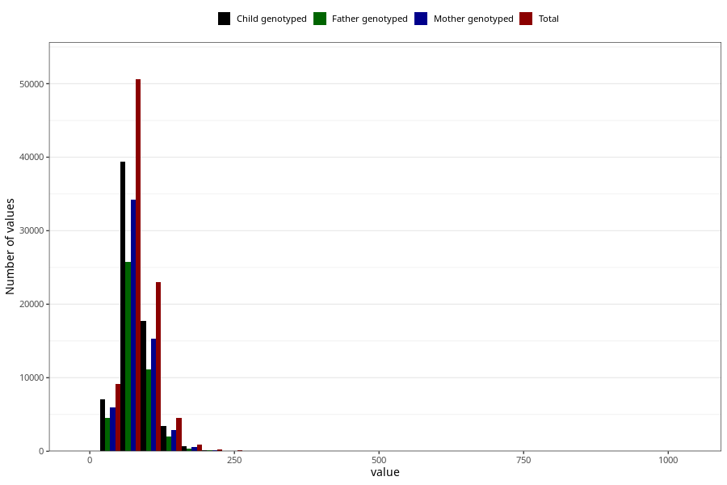

# tot_fett
Variable mapping to questionnaire: q2, question TOT_FETT.
.
- Number of values:

| Value | Total | Child genotyped | Mother genotyped | Father genotyped |
| ----- | ----- | --------------- | ---------------- | ---------------- |
| Missing | 24927 | 14790 | 12674 | 6238 |
| 0.18 | 1 | 1 | 1 |0 |
| 0.43 | 1 | 1 | 1 |0 |
| 1.28 | 1 | 1 | 1 |1 |
| 3.39 | 1 | 1 | 1 |0 |
| 3.45 | 1 | 0 | 0 |0 |
| 3.77 | 1 | 1 | 1 |1 |
| 4 | 1 | 1 | 1 |1 |
| 4.68 | 1 | 1 | 0 |0 |
| 5.36 | 1 | 1 | 0 |0 |
| 5.7 | 1 | 1 | 0 |0 |
| 5.77 | 1 | 1 | 0 |0 |
| 6.95 | 1 | 1 | 1 |1 |
| 8.07 | 1 | 1 | 1 |1 |
| 10.71 | 1 | 0 | 0 |0 |
| 10.88 | 1 | 1 | 0 |1 |
| 11.24 | 1 | 1 | 0 |0 |
| 11.47 | 1 | 1 | 1 |0 |
| 12.05 | 1 | 1 | 1 |1 |
| 12.14 | 1 | 0 | 0 |0 |
| 12.4 | 1 | 1 | 1 |0 |
| 13.28 | 1 | 1 | 1 |1 |
| 13.49 | 1 | 0 | 0 |0 |
| 13.78 | 2 | 2 | 1 |0 |
| 14.44 | 1 | 0 | 0 |0 |
| 14.73 | 1 | 0 | 0 |0 |
| 15.07 | 1 | 1 | 1 |1 |
| 15.14 | 1 | 0 | 0 |0 |
| 15.59 | 2 | 2 | 2 |2 |
| 15.81 | 1 | 1 | 0 |0 |
| 16.05 | 1 | 1 | 1 |1 |
| 16.48 | 1 | 1 | 1 |1 |
| 16.53 | 1 | 0 | 0 |0 |
| 16.55 | 1 | 1 | 1 |1 |
| 16.63 | 2 | 0 | 0 |0 |
| 16.69 | 1 | 0 | 0 |0 |
| 17.11 | 1 | 0 | 0 |0 |
| 17.44 | 1 | 0 | 0 |0 |
| 17.6 | 1 | 1 | 0 |0 |
| 17.73 | 1 | 0 | 0 |0 |
| 17.86 | 1 | 1 | 1 |0 |
| 17.98 | 1 | 1 | 1 |1 |
| 18.01 | 1 | 0 | 0 |0 |
| 18.07 | 1 | 0 | 0 |0 |
| 18.22 | 1 | 1 | 0 |0 |
| 18.35 | 1 | 1 | 1 |1 |
| 18.85 | 2 | 2 | 1 |1 |
| 18.9 | 1 | 1 | 0 |0 |
| 18.95 | 1 | 1 | 0 |0 |
| 19.04 | 1 | 0 | 0 |0 |
| 19.32 | 1 | 1 | 1 |1 |
| 19.33 | 2 | 1 | 1 |1 |
| 19.64 | 1 | 1 | 1 |1 |
| 19.79 | 1 | 1 | 1 |0 |
| 20.01 | 1 | 0 | 0 |0 |
| 20.05 | 1 | 0 | 0 |0 |
| 20.29 | 1 | 1 | 1 |1 |
| 20.36 | 1 | 0 | 0 |0 |
| 20.39 | 1 | 1 | 0 |0 |
| 20.61 | 1 | 0 | 0 |0 |
| 20.72 | 1 | 1 | 1 |1 |
| 20.78 | 1 | 1 | 1 |1 |
| 21.1 | 1 | 1 | 1 |0 |
| 21.13 | 1 | 0 | 0 |0 |
| 21.2 | 1 | 1 | 0 |0 |
| 21.23 | 1 | 1 | 1 |0 |
| 21.37 | 1 | 1 | 1 |1 |
| 21.4 | 1 | 1 | 0 |0 |
| 21.42 | 1 | 0 | 0 |0 |
| 21.67 | 1 | 1 | 1 |0 |
| 21.79 | 1 | 0 | 0 |0 |
| 21.82 | 1 | 0 | 0 |0 |
| 22.02 | 1 | 0 | 0 |0 |
| 22.03 | 1 | 1 | 0 |0 |
| 22.34 | 1 | 1 | 1 |1 |
| 22.38 | 1 | 0 | 0 |0 |
| 22.44 | 1 | 0 | 0 |0 |
| 22.53 | 2 | 1 | 1 |1 |
| 23.02 | 1 | 0 | 0 |0 |
| 23.05 | 1 | 0 | 0 |0 |
| 23.11 | 1 | 0 | 0 |0 |
| 23.12 | 1 | 1 | 1 |1 |
| 23.21 | 1 | 1 | 0 |0 |
| 23.45 | 1 | 0 | 0 |0 |
| 23.46 | 1 | 1 | 1 |1 |
| 23.47 | 1 | 0 | 0 |0 |
| 23.54 | 2 | 0 | 0 |0 |
| 23.74 | 1 | 0 | 0 |0 |
| 23.97 | 1 | 1 | 1 |1 |
| 23.99 | 1 | 1 | 1 |0 |
| 24.11 | 1 | 1 | 0 |1 |
| 24.24 | 1 | 1 | 1 |1 |
| 24.27 | 1 | 0 | 0 |0 |
| 24.32 | 1 | 1 | 1 |1 |
| 24.34 | 1 | 1 | 1 |1 |
| 24.38 | 1 | 1 | 1 |1 |
| 24.5 | 1 | 1 | 1 |1 |
| 24.56 | 1 | 0 | 0 |0 |
| 24.57 | 1 | 1 | 1 |0 |
| 24.58 | 1 | 1 | 1 |0 |
| 24.6 | 1 | 1 | 1 |1 |
| 24.63 | 2 | 2 | 2 |1 |
| 24.79 | 1 | 1 | 0 |0 |
| 24.9 | 1 | 0 | 0 |0 |
| 24.93 | 1 | 1 | 1 |1 |
| 24.96 | 1 | 1 | 1 |0 |
| 25.11 | 1 | 1 | 1 |1 |
| 25.13 | 1 | 1 | 1 |1 |
| 25.23 | 1 | 1 | 1 |1 |
| 25.28 | 1 | 1 | 1 |1 |
| 25.39 | 1 | 0 | 0 |0 |
| 25.41 | 1 | 0 | 0 |0 |
| 25.42 | 1 | 1 | 1 |1 |
| 25.46 | 1 | 1 | 1 |1 |
| 25.58 | 1 | 0 | 0 |0 |
| 25.65 | 1 | 1 | 1 |0 |
| 25.74 | 2 | 2 | 2 |2 |
| 25.76 | 1 | 1 | 1 |1 |
| 25.82 | 1 | 1 | 1 |1 |
| 25.89 | 1 | 1 | 1 |1 |
| 25.94 | 1 | 1 | 1 |0 |
| 25.96 | 2 | 2 | 1 |0 |
| 26 | 1 | 1 | 1 |1 |
| 26.08 | 2 | 1 | 1 |1 |
| 26.09 | 1 | 1 | 1 |1 |
| 26.12 | 2 | 2 | 2 |2 |
| 26.19 | 1 | 1 | 0 |0 |
| 26.23 | 1 | 1 | 1 |0 |
| 26.24 | 1 | 1 | 1 |0 |
| 26.28 | 1 | 0 | 0 |0 |
| 26.34 | 1 | 1 | 0 |0 |
| 26.42 | 1 | 1 | 1 |1 |
| 26.46 | 1 | 1 | 1 |1 |
| 26.53 | 1 | 1 | 1 |1 |
| 26.54 | 1 | 0 | 0 |0 |
| 26.57 | 1 | 1 | 1 |0 |
| 26.64 | 1 | 1 | 1 |1 |
| 26.79 | 1 | 1 | 1 |1 |
| 26.8 | 1 | 1 | 0 |0 |
| 26.84 | 1 | 0 | 0 |0 |
| 26.87 | 1 | 1 | 1 |1 |
| 26.91 | 1 | 1 | 1 |1 |
| 26.96 | 1 | 1 | 0 |0 |
| 27.05 | 1 | 1 | 1 |1 |
| 27.06 | 3 | 3 | 3 |2 |
| 27.07 | 1 | 1 | 1 |1 |
| 27.18 | 2 | 2 | 0 |0 |
| 27.2 | 1 | 1 | 0 |0 |
| 27.27 | 1 | 1 | 0 |0 |
| 27.3 | 1 | 1 | 1 |1 |
| 27.35 | 2 | 2 | 2 |2 |
| 27.4 | 1 | 0 | 0 |0 |
| 27.44 | 1 | 1 | 1 |1 |
| 27.48 | 1 | 1 | 0 |0 |
| 27.5 | 2 | 2 | 2 |1 |
| 27.57 | 1 | 1 | 1 |1 |
| 27.58 | 1 | 1 | 1 |1 |
| 27.63 | 2 | 1 | 1 |1 |
| 27.64 | 1 | 0 | 0 |0 |
| 27.68 | 1 | 0 | 0 |0 |
| 27.71 | 1 | 1 | 1 |1 |
| 27.72 | 2 | 1 | 1 |1 |
| 27.77 | 2 | 1 | 1 |0 |
| 27.82 | 1 | 1 | 0 |0 |
| 27.84 | 2 | 1 | 1 |1 |
| 27.85 | 1 | 1 | 1 |1 |
| 27.86 | 1 | 1 | 0 |0 |
| 27.88 | 1 | 1 | 1 |1 |
| 27.89 | 1 | 0 | 0 |0 |
| 27.9 | 2 | 1 | 1 |1 |
| 28 | 1 | 0 | 0 |0 |
| 28.1 | 2 | 2 | 2 |1 |
| 28.16 | 1 | 1 | 1 |0 |
| 28.18 | 2 | 2 | 0 |0 |
| 28.31 | 1 | 1 | 1 |1 |
| 28.32 | 2 | 1 | 0 |0 |
| 28.35 | 1 | 1 | 1 |0 |
| 28.37 | 2 | 2 | 2 |2 |
| 28.44 | 1 | 1 | 0 |0 |
| 28.45 | 2 | 2 | 2 |1 |
| 28.47 | 1 | 0 | 0 |0 |
| 28.49 | 1 | 1 | 0 |0 |
| 28.53 | 1 | 1 | 0 |0 |
| 28.56 | 1 | 1 | 1 |0 |
| 28.57 | 1 | 0 | 0 |0 |
| 28.62 | 1 | 0 | 0 |0 |
| 28.63 | 1 | 0 | 0 |0 |
| 28.7 | 1 | 1 | 0 |0 |
| 28.83 | 1 | 1 | 1 |1 |
| 28.9 | 1 | 1 | 1 |1 |
| 28.93 | 1 | 0 | 0 |0 |
| 28.97 | 1 | 0 | 0 |0 |
| 28.99 | 1 | 1 | 1 |0 |
| 29 | 1 | 1 | 1 |1 |
| 29.04 | 1 | 1 | 0 |0 |
| 29.08 | 2 | 2 | 1 |0 |
| 29.09 | 1 | 0 | 0 |0 |
| 29.12 | 1 | 1 | 1 |1 |
| 29.13 | 1 | 1 | 1 |1 |
| 29.15 | 1 | 1 | 1 |0 |
| 29.21 | 2 | 2 | 2 |1 |
| 29.25 | 1 | 1 | 1 |1 |
| 29.27 | 1 | 1 | 1 |1 |
| 29.28 | 1 | 1 | 1 |0 |
| 29.29 | 1 | 1 | 1 |1 |
| 29.31 | 1 | 1 | 0 |0 |
| 29.32 | 1 | 0 | 0 |0 |
| 29.34 | 1 | 1 | 0 |0 |
| 29.38 | 1 | 1 | 1 |0 |
| 29.39 | 1 | 1 | 1 |1 |
| 29.4 | 1 | 1 | 1 |1 |
| 29.42 | 1 | 0 | 0 |0 |
| 29.43 | 1 | 1 | 1 |0 |
| 29.44 | 1 | 1 | 1 |1 |
| 29.48 | 1 | 0 | 0 |0 |
| 29.51 | 2 | 2 | 1 |1 |
| 29.53 | 1 | 1 | 1 |1 |
| 29.56 | 2 | 0 | 0 |0 |
| 29.58 | 1 | 1 | 1 |1 |
| 29.59 | 1 | 1 | 0 |0 |
| 29.61 | 2 | 2 | 1 |2 |
| 29.64 | 1 | 0 | 0 |0 |
| 29.73 | 1 | 1 | 0 |0 |
| 29.78 | 1 | 1 | 1 |1 |
| 29.8 | 1 | 1 | 0 |0 |
| 29.85 | 1 | 0 | 0 |0 |
| 29.87 | 1 | 0 | 0 |0 |
| 29.88 | 2 | 0 | 0 |0 |
| 29.92 | 1 | 1 | 0 |0 |
| 29.93 | 1 | 1 | 1 |0 |
| 29.94 | 1 | 1 | 0 |1 |
| 29.96 | 1 | 1 | 1 |1 |
| 29.98 | 1 | 1 | 1 |1 |
| 30.02 | 2 | 1 | 1 |1 |
| 30.03 | 1 | 0 | 0 |0 |
| 30.09 | 2 | 1 | 1 |1 |
| 30.1 | 1 | 1 | 0 |0 |
| 30.11 | 1 | 1 | 1 |1 |
| 30.14 | 1 | 0 | 0 |0 |
| 30.15 | 1 | 0 | 0 |0 |
| 30.19 | 2 | 0 | 0 |0 |
| 30.21 | 1 | 1 | 1 |1 |
| 30.22 | 1 | 1 | 1 |1 |
| 30.23 | 1 | 0 | 0 |0 |
| 30.24 | 1 | 0 | 0 |0 |
| 30.25 | 3 | 1 | 0 |0 |
| 30.28 | 1 | 1 | 1 |0 |
| 30.31 | 1 | 0 | 0 |0 |
| 30.33 | 1 | 0 | 0 |0 |
| 30.35 | 1 | 0 | 0 |0 |
| 30.36 | 1 | 1 | 1 |0 |
| 30.37 | 2 | 1 | 1 |1 |
| 30.4 | 1 | 1 | 1 |1 |
| 30.41 | 1 | 1 | 1 |1 |
| 30.42 | 1 | 1 | 1 |1 |
| 30.45 | 2 | 2 | 1 |0 |
| 30.47 | 1 | 1 | 0 |0 |
| 30.5 | 1 | 1 | 1 |1 |
| 30.52 | 1 | 1 | 1 |1 |
| 30.56 | 1 | 1 | 1 |1 |
| 30.57 | 1 | 1 | 0 |0 |
| 30.58 | 1 | 1 | 0 |0 |
| 30.61 | 2 | 1 | 1 |1 |
| 30.66 | 1 | 1 | 1 |1 |
| 30.68 | 1 | 1 | 1 |1 |
| 30.7 | 1 | 1 | 1 |1 |
| 30.72 | 1 | 0 | 0 |0 |
| 30.75 | 1 | 0 | 0 |0 |
| 30.76 | 1 | 1 | 1 |0 |
| 30.77 | 1 | 1 | 0 |0 |
| 30.8 | 1 | 1 | 1 |1 |
| 30.82 | 1 | 1 | 1 |1 |
| 30.83 | 1 | 0 | 0 |0 |
| 30.85 | 1 | 1 | 1 |0 |
| 30.87 | 1 | 1 | 1 |1 |
| 30.88 | 2 | 1 | 1 |1 |
| 30.89 | 1 | 1 | 0 |0 |
| 30.91 | 2 | 2 | 2 |1 |
| 30.92 | 1 | 1 | 1 |1 |
| 30.95 | 2 | 2 | 0 |0 |
| 30.98 | 1 | 1 | 1 |1 |
| 31.01 | 1 | 1 | 1 |1 |
| 31.02 | 1 | 1 | 1 |0 |
| 31.04 | 1 | 1 | 1 |0 |
| 31.06 | 1 | 0 | 0 |0 |
| 31.09 | 1 | 1 | 1 |1 |
| 31.14 | 1 | 1 | 1 |0 |
| 31.15 | 1 | 0 | 0 |0 |
| 31.16 | 1 | 1 | 1 |1 |
| 31.19 | 1 | 1 | 1 |1 |
| 31.2 | 1 | 1 | 1 |1 |
| 31.21 | 1 | 1 | 1 |1 |
| 31.22 | 1 | 1 | 1 |1 |
| 31.23 | 1 | 1 | 0 |0 |
| 31.29 | 2 | 1 | 1 |0 |
| 31.3 | 2 | 2 | 2 |1 |
| 31.31 | 1 | 1 | 1 |1 |
| 31.33 | 2 | 1 | 1 |1 |
| 31.35 | 1 | 1 | 0 |0 |
| 31.36 | 2 | 1 | 1 |1 |
| 31.39 | 1 | 0 | 0 |0 |
| 31.4 | 1 | 1 | 1 |1 |
| 31.41 | 1 | 1 | 1 |0 |
| 31.43 | 1 | 0 | 0 |0 |
| 31.44 | 1 | 1 | 1 |1 |
| 31.45 | 1 | 1 | 0 |1 |
| 31.46 | 2 | 2 | 2 |2 |
| 31.47 | 1 | 1 | 0 |0 |
| 31.48 | 3 | 3 | 3 |1 |
| 31.52 | 1 | 0 | 0 |0 |
| 31.55 | 1 | 0 | 0 |0 |
| 31.63 | 3 | 2 | 2 |2 |
| 31.64 | 1 | 1 | 1 |1 |
| 31.67 | 2 | 2 | 1 |1 |
| 31.7 | 1 | 0 | 0 |0 |
| 31.74 | 1 | 1 | 0 |0 |
| 31.76 | 1 | 1 | 1 |0 |
| 31.79 | 1 | 1 | 0 |0 |
| 31.8 | 1 | 0 | 0 |0 |
| 31.85 | 1 | 1 | 0 |0 |
| 31.88 | 1 | 0 | 0 |0 |
| 31.91 | 1 | 1 | 1 |1 |
| 31.92 | 1 | 1 | 1 |1 |
| 31.95 | 1 | 1 | 1 |0 |
| 31.97 | 1 | 0 | 0 |0 |
| 31.98 | 2 | 2 | 1 |1 |
| 32 | 2 | 2 | 2 |1 |
| 32.03 | 1 | 1 | 1 |1 |
| 32.04 | 2 | 1 | 1 |1 |
| 32.05 | 2 | 2 | 1 |1 |
| 32.06 | 1 | 1 | 1 |1 |
| 32.08 | 1 | 1 | 1 |1 |
| 32.09 | 2 | 2 | 2 |2 |
| 32.1 | 2 | 2 | 2 |2 |
| 32.12 | 1 | 0 | 0 |0 |
| 32.16 | 1 | 0 | 0 |0 |
| 32.17 | 1 | 0 | 0 |0 |
| 32.19 | 1 | 1 | 1 |0 |
| 32.22 | 1 | 1 | 1 |1 |
| 32.24 | 2 | 2 | 1 |1 |
| 32.25 | 1 | 1 | 1 |1 |
| 32.27 | 1 | 1 | 0 |0 |
| 32.31 | 2 | 1 | 1 |1 |
| 32.33 | 2 | 0 | 0 |0 |
| 32.36 | 2 | 2 | 2 |0 |
| 32.37 | 1 | 1 | 0 |0 |
| 32.39 | 1 | 1 | 1 |1 |
| 32.42 | 1 | 1 | 0 |0 |
| 32.45 | 2 | 2 | 1 |0 |
| 32.46 | 1 | 0 | 0 |0 |
| 32.54 | 1 | 0 | 0 |0 |
| 32.55 | 1 | 0 | 0 |0 |
| 32.56 | 2 | 1 | 1 |1 |
| 32.57 | 1 | 0 | 0 |0 |
| 32.58 | 2 | 1 | 1 |1 |
| 32.6 | 1 | 0 | 0 |0 |
| 32.65 | 3 | 1 | 1 |0 |
| 32.68 | 1 | 0 | 0 |0 |
| 32.69 | 1 | 1 | 1 |0 |
| 32.7 | 2 | 1 | 1 |1 |
| 32.71 | 2 | 2 | 2 |2 |
| 32.74 | 1 | 1 | 0 |0 |
| 32.75 | 2 | 2 | 2 |2 |
| 32.76 | 2 | 2 | 2 |2 |
| 32.77 | 1 | 1 | 1 |1 |
| 32.78 | 1 | 1 | 1 |1 |
| 32.79 | 1 | 1 | 1 |0 |
| 32.83 | 1 | 1 | 1 |0 |
| 32.84 | 1 | 1 | 1 |0 |
| 32.85 | 1 | 1 | 1 |1 |
| 32.86 | 2 | 2 | 1 |1 |
| 32.87 | 1 | 1 | 1 |1 |
| 32.95 | 1 | 1 | 1 |1 |
| 32.97 | 1 | 1 | 1 |1 |
| 32.99 | 1 | 1 | 1 |0 |
| 33.05 | 1 | 1 | 1 |1 |
| 33.06 | 1 | 1 | 1 |1 |
| 33.07 | 1 | 1 | 1 |1 |
| 33.09 | 1 | 1 | 1 |1 |
| 33.11 | 2 | 2 | 2 |1 |
| 33.12 | 2 | 2 | 1 |0 |
| 33.13 | 1 | 0 | 0 |0 |
| 33.14 | 2 | 1 | 1 |1 |
| 33.18 | 1 | 1 | 1 |0 |
| 33.21 | 1 | 0 | 0 |0 |
| 33.22 | 2 | 1 | 0 |0 |
| 33.24 | 4 | 4 | 4 |3 |
| 33.26 | 2 | 2 | 2 |1 |
| 33.27 | 2 | 1 | 1 |1 |
| 33.28 | 1 | 1 | 1 |0 |
| 33.3 | 2 | 2 | 1 |1 |
| 33.31 | 1 | 1 | 1 |1 |
| 33.38 | 1 | 0 | 0 |0 |
| 33.39 | 1 | 1 | 1 |1 |
| 33.41 | 1 | 1 | 1 |1 |
| 33.44 | 1 | 1 | 1 |1 |
| 33.45 | 1 | 0 | 0 |0 |
| 33.48 | 1 | 1 | 1 |1 |
| 33.49 | 2 | 2 | 2 |0 |
| 33.51 | 2 | 0 | 0 |0 |
| 33.52 | 2 | 2 | 2 |1 |
| 33.54 | 1 | 1 | 1 |1 |
| 33.56 | 2 | 2 | 1 |1 |
| 33.58 | 2 | 2 | 2 |2 |
| 33.6 | 3 | 2 | 2 |2 |
| 33.62 | 1 | 1 | 1 |1 |
| 33.64 | 2 | 1 | 1 |1 |
| 33.65 | 1 | 1 | 1 |0 |
| 33.66 | 2 | 2 | 1 |2 |
| 33.67 | 3 | 1 | 1 |1 |
| 33.7 | 1 | 1 | 1 |0 |
| 33.72 | 1 | 1 | 0 |0 |
| 33.75 | 1 | 1 | 1 |1 |
| 33.76 | 1 | 0 | 0 |0 |
| 33.79 | 1 | 0 | 0 |0 |
| 33.81 | 1 | 1 | 1 |1 |
| 33.82 | 1 | 1 | 1 |1 |
| 33.83 | 3 | 3 | 3 |3 |
| 33.85 | 1 | 1 | 1 |1 |
| 33.86 | 1 | 1 | 1 |1 |
| 33.87 | 1 | 1 | 1 |1 |
| 33.88 | 3 | 2 | 2 |2 |
| 33.9 | 1 | 1 | 1 |1 |
| 33.92 | 1 | 1 | 0 |0 |
| 33.96 | 1 | 1 | 1 |0 |
| 33.97 | 1 | 1 | 1 |1 |
| 33.98 | 3 | 3 | 2 |1 |
| 33.99 | 1 | 0 | 0 |0 |
| 34 | 1 | 1 | 1 |1 |
| 34.01 | 3 | 3 | 1 |2 |
| 34.03 | 1 | 1 | 1 |1 |
| 34.04 | 1 | 1 | 1 |1 |
| 34.05 | 2 | 1 | 1 |1 |
| 34.06 | 2 | 2 | 2 |1 |
| 34.08 | 2 | 1 | 0 |1 |
| 34.11 | 1 | 1 | 1 |1 |
| 34.12 | 2 | 1 | 1 |0 |
| 34.14 | 1 | 1 | 1 |0 |
| 34.16 | 3 | 3 | 3 |2 |
| 34.17 | 1 | 1 | 1 |1 |
| 34.19 | 1 | 0 | 0 |0 |
| 34.2 | 1 | 1 | 1 |0 |
| 34.22 | 1 | 0 | 0 |0 |
| 34.23 | 2 | 2 | 1 |1 |
| 34.24 | 2 | 1 | 1 |1 |
| 34.27 | 1 | 1 | 0 |1 |
| 34.3 | 1 | 1 | 0 |0 |
| 34.31 | 3 | 3 | 1 |1 |
| 34.32 | 1 | 1 | 1 |1 |
| 34.34 | 1 | 1 | 1 |1 |
| 34.35 | 2 | 2 | 2 |2 |
| 34.39 | 2 | 2 | 2 |1 |
| 34.4 | 1 | 1 | 1 |0 |
| 34.41 | 1 | 1 | 1 |1 |
| 34.44 | 1 | 1 | 1 |0 |
| 34.47 | 1 | 1 | 1 |0 |
| 34.48 | 1 | 1 | 0 |0 |
| 34.49 | 2 | 2 | 2 |2 |
| 34.5 | 2 | 1 | 1 |1 |
| 34.51 | 1 | 1 | 1 |1 |
| 34.52 | 2 | 1 | 1 |1 |
| 34.53 | 1 | 1 | 1 |1 |
| 34.54 | 4 | 1 | 0 |0 |
| 34.55 | 2 | 2 | 0 |0 |
| 34.56 | 1 | 0 | 0 |0 |
| 34.57 | 1 | 1 | 1 |0 |
| 34.58 | 2 | 2 | 2 |1 |
| 34.59 | 2 | 1 | 1 |1 |
| 34.6 | 1 | 0 | 0 |0 |
| 34.62 | 2 | 0 | 0 |0 |
| 34.66 | 2 | 1 | 1 |1 |
| 34.67 | 1 | 0 | 0 |0 |
| 34.69 | 1 | 1 | 1 |1 |
| 34.71 | 1 | 1 | 1 |1 |
| 34.72 | 2 | 0 | 0 |0 |
| 34.75 | 1 | 1 | 1 |1 |
| 34.77 | 2 | 0 | 0 |0 |
| 34.79 | 1 | 1 | 1 |1 |
| 34.8 | 1 | 1 | 1 |1 |
| 34.81 | 2 | 2 | 1 |1 |
| 34.83 | 2 | 1 | 1 |1 |
| 34.85 | 3 | 3 | 3 |2 |
| 34.86 | 1 | 1 | 1 |0 |
| 34.87 | 1 | 1 | 1 |0 |
| 34.88 | 3 | 2 | 1 |0 |
| 34.9 | 2 | 2 | 1 |1 |
| 34.91 | 1 | 1 | 1 |1 |
| 34.92 | 3 | 2 | 2 |2 |
| 34.94 | 2 | 2 | 2 |2 |
| 34.96 | 4 | 4 | 4 |4 |
| 34.98 | 2 | 0 | 0 |0 |
| 34.99 | 2 | 0 | 0 |0 |
| 35 | 1 | 0 | 0 |0 |
| 35.01 | 1 | 1 | 1 |1 |
| 35.02 | 1 | 1 | 0 |0 |
| 35.03 | 1 | 1 | 1 |1 |
| 35.04 | 2 | 1 | 0 |0 |
| 35.06 | 2 | 0 | 0 |0 |
| 35.07 | 1 | 1 | 0 |0 |
| 35.08 | 1 | 1 | 1 |0 |
| 35.09 | 2 | 1 | 1 |1 |
| 35.1 | 2 | 1 | 0 |1 |
| 35.11 | 1 | 1 | 1 |1 |
| 35.12 | 3 | 3 | 3 |3 |
| 35.13 | 2 | 1 | 1 |1 |
| 35.15 | 1 | 1 | 0 |0 |
| 35.18 | 2 | 0 | 0 |0 |
| 35.19 | 4 | 1 | 1 |0 |
| 35.22 | 3 | 2 | 2 |1 |
| 35.23 | 2 | 1 | 0 |0 |
| 35.26 | 1 | 1 | 1 |0 |
| 35.28 | 1 | 1 | 1 |1 |
| 35.3 | 3 | 2 | 0 |0 |
| 35.31 | 2 | 2 | 2 |2 |
| 35.35 | 1 | 0 | 0 |0 |
| 35.36 | 2 | 2 | 2 |0 |
| 35.37 | 1 | 1 | 1 |1 |
| 35.38 | 1 | 0 | 0 |0 |
| 35.42 | 2 | 1 | 1 |0 |
| 35.45 | 3 | 1 | 0 |0 |
| 35.46 | 3 | 2 | 1 |1 |
| 35.47 | 3 | 3 | 3 |3 |
| 35.49 | 3 | 3 | 3 |3 |
| 35.51 | 4 | 3 | 3 |2 |
| 35.53 | 1 | 1 | 1 |0 |
| 35.54 | 1 | 0 | 0 |0 |
| 35.55 | 2 | 2 | 1 |1 |
| 35.57 | 1 | 1 | 0 |0 |
| 35.58 | 1 | 1 | 1 |1 |
| 35.6 | 1 | 0 | 0 |0 |
| 35.61 | 3 | 3 | 3 |2 |
| 35.62 | 1 | 1 | 1 |1 |
| 35.64 | 3 | 2 | 1 |2 |
| 35.65 | 3 | 1 | 1 |1 |
| 35.66 | 2 | 2 | 2 |1 |
| 35.67 | 2 | 0 | 0 |0 |
| 35.68 | 5 | 5 | 4 |3 |
| 35.69 | 1 | 0 | 0 |0 |
| 35.7 | 1 | 1 | 0 |0 |
| 35.71 | 3 | 3 | 3 |2 |
| 35.72 | 1 | 1 | 0 |0 |
| 35.73 | 1 | 1 | 1 |1 |
| 35.74 | 5 | 3 | 3 |2 |
| 35.76 | 1 | 1 | 1 |1 |
| 35.77 | 1 | 0 | 0 |0 |
| 35.78 | 1 | 1 | 1 |1 |
| 35.79 | 2 | 1 | 0 |0 |
| 35.83 | 5 | 3 | 2 |1 |
| 35.84 | 3 | 2 | 2 |1 |
| 35.85 | 1 | 1 | 1 |1 |
| 35.86 | 2 | 2 | 1 |1 |
| 35.87 | 2 | 0 | 0 |0 |
| 35.88 | 1 | 1 | 1 |1 |
| 35.89 | 1 | 0 | 0 |0 |
| 35.91 | 1 | 1 | 1 |1 |
| 35.95 | 1 | 1 | 1 |0 |
| 35.96 | 2 | 1 | 1 |1 |
| 35.99 | 2 | 2 | 2 |2 |
| 36.01 | 2 | 2 | 2 |2 |
| 36.02 | 1 | 1 | 1 |0 |
| 36.03 | 1 | 0 | 0 |0 |
| 36.05 | 1 | 1 | 1 |0 |
| 36.07 | 1 | 0 | 0 |0 |
| 36.09 | 1 | 0 | 0 |0 |
| 36.11 | 1 | 1 | 1 |1 |
| 36.12 | 1 | 1 | 1 |1 |
| 36.13 | 1 | 1 | 1 |1 |
| 36.14 | 2 | 1 | 1 |1 |
| 36.15 | 1 | 1 | 1 |1 |
| 36.16 | 3 | 3 | 2 |1 |
| 36.18 | 1 | 1 | 1 |1 |
| 36.2 | 2 | 2 | 2 |1 |
| 36.21 | 1 | 1 | 0 |0 |
| 36.23 | 1 | 1 | 1 |1 |
| 36.24 | 1 | 1 | 1 |0 |
| 36.26 | 2 | 1 | 0 |0 |
| 36.27 | 3 | 2 | 2 |1 |
| 36.28 | 1 | 1 | 1 |1 |
| 36.29 | 1 | 1 | 1 |1 |
| 36.3 | 2 | 2 | 2 |1 |
| 36.31 | 2 | 2 | 2 |2 |
| 36.32 | 3 | 2 | 1 |1 |
| 36.33 | 1 | 1 | 0 |0 |
| 36.35 | 3 | 3 | 3 |3 |
| 36.36 | 1 | 1 | 0 |0 |
| 36.4 | 2 | 2 | 2 |1 |
| 36.41 | 2 | 1 | 0 |0 |
| 36.42 | 1 | 0 | 0 |0 |
| 36.43 | 1 | 1 | 1 |0 |
| 36.44 | 1 | 1 | 0 |0 |
| 36.45 | 2 | 2 | 2 |2 |
| 36.46 | 2 | 0 | 0 |0 |
| 36.48 | 2 | 1 | 1 |1 |
| 36.49 | 1 | 1 | 1 |1 |
| 36.52 | 2 | 1 | 0 |0 |
| 36.53 | 2 | 1 | 1 |1 |
| 36.55 | 2 | 1 | 1 |0 |
| 36.56 | 1 | 1 | 1 |0 |
| 36.57 | 2 | 2 | 2 |2 |
| 36.58 | 3 | 0 | 0 |0 |
| 36.59 | 3 | 3 | 3 |2 |
| 36.6 | 1 | 0 | 0 |0 |
| 36.61 | 1 | 1 | 1 |1 |
| 36.62 | 1 | 1 | 1 |1 |
| 36.64 | 3 | 3 | 3 |3 |
| 36.65 | 2 | 1 | 0 |0 |
| 36.67 | 3 | 3 | 3 |1 |
| 36.68 | 1 | 1 | 1 |0 |
| 36.69 | 1 | 1 | 1 |1 |
| 36.73 | 1 | 0 | 0 |0 |
| 36.74 | 1 | 0 | 0 |0 |
| 36.75 | 2 | 2 | 2 |1 |
| 36.76 | 1 | 1 | 1 |0 |
| 36.78 | 1 | 1 | 0 |1 |
| 36.79 | 2 | 1 | 1 |1 |
| 36.81 | 1 | 1 | 1 |1 |
| 36.82 | 2 | 1 | 0 |0 |
| 36.83 | 2 | 2 | 1 |1 |
| 36.84 | 1 | 1 | 1 |1 |
| 36.85 | 1 | 0 | 0 |0 |
| 36.86 | 2 | 2 | 2 |0 |
| 36.87 | 1 | 1 | 1 |1 |
| 36.88 | 4 | 4 | 4 |4 |
| 36.89 | 1 | 1 | 0 |1 |
| 36.9 | 1 | 1 | 1 |1 |
| 36.91 | 1 | 1 | 1 |1 |
| 36.92 | 1 | 0 | 0 |0 |
| 36.93 | 1 | 1 | 1 |1 |
| 36.94 | 5 | 4 | 2 |2 |
| 36.95 | 1 | 1 | 1 |1 |
| 36.96 | 1 | 1 | 1 |1 |
| 36.97 | 1 | 1 | 1 |1 |
| 36.98 | 3 | 2 | 2 |2 |
| 37 | 2 | 1 | 1 |1 |
| 37.02 | 3 | 3 | 1 |1 |
| 37.04 | 1 | 0 | 0 |0 |
| 37.05 | 1 | 0 | 0 |0 |
| 37.06 | 3 | 3 | 3 |1 |
| 37.07 | 4 | 3 | 3 |3 |
| 37.08 | 5 | 4 | 3 |3 |
| 37.09 | 2 | 1 | 1 |1 |
| 37.1 | 1 | 1 | 1 |1 |
| 37.11 | 1 | 0 | 0 |0 |
| 37.12 | 4 | 3 | 3 |3 |
| 37.13 | 2 | 2 | 2 |2 |
| 37.14 | 3 | 3 | 3 |2 |
| 37.15 | 2 | 2 | 2 |2 |
| 37.17 | 2 | 2 | 2 |2 |
| 37.18 | 2 | 2 | 2 |2 |
| 37.19 | 3 | 2 | 1 |0 |
| 37.2 | 3 | 2 | 1 |1 |
| 37.21 | 3 | 2 | 2 |2 |
| 37.22 | 2 | 1 | 1 |1 |
| 37.24 | 3 | 2 | 2 |2 |
| 37.25 | 1 | 1 | 0 |1 |
| 37.26 | 1 | 1 | 1 |1 |
| 37.27 | 1 | 1 | 1 |1 |
| 37.28 | 1 | 1 | 1 |1 |
| 37.3 | 3 | 0 | 0 |0 |
| 37.31 | 2 | 1 | 0 |0 |
| 37.32 | 2 | 2 | 2 |2 |
| 37.33 | 2 | 1 | 1 |0 |
| 37.34 | 1 | 1 | 0 |0 |
| 37.35 | 2 | 1 | 1 |0 |
| 37.37 | 2 | 2 | 1 |2 |
| 37.38 | 1 | 1 | 1 |0 |
| 37.39 | 5 | 3 | 2 |1 |
| 37.4 | 2 | 2 | 2 |2 |
| 37.41 | 3 | 2 | 1 |2 |
| 37.42 | 3 | 3 | 2 |2 |
| 37.44 | 1 | 1 | 1 |0 |
| 37.45 | 1 | 1 | 1 |1 |
| 37.46 | 2 | 1 | 0 |1 |
| 37.48 | 1 | 0 | 0 |0 |
| 37.49 | 1 | 1 | 0 |0 |
| 37.5 | 1 | 0 | 0 |0 |
| 37.51 | 1 | 1 | 1 |1 |
| 37.52 | 6 | 4 | 3 |3 |
| 37.53 | 2 | 0 | 0 |0 |
| 37.55 | 2 | 1 | 1 |1 |
| 37.56 | 2 | 2 | 1 |1 |
| 37.57 | 3 | 2 | 2 |2 |
| 37.58 | 1 | 1 | 1 |1 |
| 37.59 | 2 | 1 | 1 |1 |
| 37.6 | 1 | 0 | 0 |0 |
| 37.61 | 1 | 1 | 1 |1 |
| 37.62 | 4 | 3 | 2 |1 |
| 37.63 | 5 | 5 | 4 |3 |
| 37.64 | 2 | 0 | 0 |0 |
| 37.66 | 2 | 2 | 1 |1 |
| 37.68 | 2 | 2 | 2 |2 |
| 37.69 | 3 | 3 | 2 |2 |
| 37.7 | 1 | 1 | 1 |1 |
| 37.71 | 1 | 1 | 1 |1 |
| 37.72 | 2 | 2 | 1 |2 |
| 37.73 | 1 | 1 | 0 |0 |
| 37.74 | 2 | 2 | 1 |1 |
| 37.75 | 2 | 2 | 2 |1 |
| 37.76 | 1 | 1 | 1 |1 |
| 37.79 | 3 | 3 | 2 |1 |
| 37.8 | 2 | 0 | 0 |0 |
| 37.82 | 2 | 2 | 2 |1 |
| 37.83 | 3 | 2 | 1 |2 |
| 37.84 | 2 | 1 | 0 |0 |
| 37.86 | 3 | 3 | 2 |1 |
| 37.87 | 2 | 1 | 0 |0 |
| 37.88 | 1 | 1 | 1 |1 |
| 37.89 | 1 | 1 | 1 |1 |
| 37.9 | 5 | 3 | 3 |1 |
| 37.91 | 3 | 2 | 2 |1 |
| 37.93 | 1 | 1 | 1 |1 |
| 37.94 | 5 | 4 | 4 |2 |
| 37.95 | 2 | 2 | 2 |2 |
| 37.96 | 3 | 2 | 2 |1 |
| 37.97 | 2 | 2 | 2 |2 |
| 37.98 | 1 | 1 | 1 |1 |
| 37.99 | 1 | 1 | 1 |1 |
| 38 | 1 | 0 | 0 |0 |
| 38.02 | 1 | 1 | 0 |0 |
| 38.03 | 2 | 2 | 1 |1 |
| 38.04 | 1 | 1 | 1 |0 |
| 38.05 | 1 | 1 | 1 |1 |
| 38.06 | 1 | 1 | 1 |1 |
| 38.07 | 1 | 1 | 1 |0 |
| 38.08 | 1 | 1 | 1 |0 |
| 38.09 | 1 | 1 | 1 |1 |
| 38.1 | 3 | 3 | 2 |1 |
| 38.11 | 3 | 1 | 1 |1 |
| 38.13 | 2 | 0 | 0 |0 |
| 38.14 | 1 | 1 | 1 |1 |
| 38.15 | 1 | 1 | 1 |0 |
| 38.16 | 2 | 2 | 2 |1 |
| 38.17 | 1 | 1 | 1 |0 |
| 38.18 | 1 | 1 | 1 |1 |
| 38.19 | 5 | 4 | 3 |3 |
| 38.2 | 4 | 4 | 3 |3 |
| 38.21 | 2 | 2 | 0 |0 |
| 38.22 | 2 | 2 | 2 |2 |
| 38.23 | 3 | 3 | 3 |3 |
| 38.24 | 1 | 0 | 0 |0 |
| 38.25 | 2 | 0 | 0 |0 |
| 38.26 | 3 | 3 | 3 |3 |
| 38.28 | 2 | 2 | 2 |1 |
| 38.29 | 3 | 3 | 3 |3 |
| 38.3 | 2 | 0 | 0 |0 |
| 38.31 | 6 | 5 | 4 |3 |
| 38.33 | 3 | 2 | 2 |2 |
| 38.35 | 1 | 1 | 1 |1 |
| 38.36 | 1 | 1 | 1 |1 |
| 38.37 | 6 | 4 | 4 |3 |
| 38.38 | 1 | 0 | 0 |0 |
| 38.39 | 2 | 2 | 1 |1 |
| 38.4 | 3 | 1 | 0 |0 |
| 38.41 | 3 | 3 | 2 |2 |
| 38.42 | 2 | 2 | 1 |1 |
| 38.44 | 3 | 3 | 3 |3 |
| 38.46 | 1 | 0 | 0 |0 |
| 38.47 | 2 | 2 | 1 |1 |
| 38.48 | 2 | 2 | 2 |2 |
| 38.49 | 5 | 3 | 2 |2 |
| 38.5 | 2 | 2 | 1 |2 |
| 38.51 | 1 | 1 | 1 |1 |
| 38.52 | 2 | 2 | 0 |1 |
| 38.53 | 2 | 2 | 2 |2 |
| 38.57 | 4 | 3 | 3 |2 |
| 38.58 | 2 | 2 | 1 |1 |
| 38.59 | 2 | 1 | 0 |1 |
| 38.6 | 1 | 1 | 0 |0 |
| 38.61 | 1 | 1 | 1 |1 |
| 38.62 | 4 | 3 | 3 |3 |
| 38.63 | 2 | 1 | 1 |1 |
| 38.65 | 2 | 2 | 1 |1 |
| 38.66 | 3 | 2 | 1 |1 |
| 38.67 | 2 | 1 | 1 |1 |
| 38.68 | 1 | 1 | 1 |1 |
| 38.69 | 1 | 1 | 1 |1 |
| 38.7 | 2 | 2 | 2 |2 |
| 38.71 | 1 | 1 | 1 |1 |
| 38.73 | 2 | 2 | 2 |2 |
| 38.75 | 5 | 4 | 3 |3 |
| 38.76 | 2 | 1 | 1 |1 |
| 38.77 | 2 | 1 | 1 |0 |
| 38.78 | 2 | 1 | 1 |0 |
| 38.79 | 2 | 1 | 1 |0 |
| 38.8 | 2 | 2 | 2 |1 |
| 38.81 | 4 | 4 | 4 |3 |
| 38.82 | 1 | 1 | 1 |1 |
| 38.83 | 5 | 4 | 2 |1 |
| 38.85 | 3 | 2 | 2 |2 |
| 38.86 | 1 | 1 | 1 |1 |
| 38.87 | 1 | 1 | 1 |1 |
| 38.88 | 1 | 1 | 1 |1 |
| 38.89 | 3 | 3 | 3 |3 |
| 38.9 | 3 | 2 | 2 |2 |
| 38.91 | 5 | 3 | 3 |2 |
| 38.92 | 2 | 2 | 2 |1 |
| 38.93 | 4 | 4 | 4 |4 |
| 38.94 | 2 | 2 | 2 |1 |
| 38.95 | 5 | 2 | 2 |1 |
| 38.96 | 3 | 0 | 0 |0 |
| 38.97 | 2 | 2 | 2 |1 |
| 38.98 | 1 | 1 | 1 |1 |
| 38.99 | 2 | 2 | 2 |2 |
| 39 | 1 | 1 | 0 |0 |
| 39.01 | 3 | 1 | 1 |1 |
| 39.02 | 3 | 3 | 2 |2 |
| 39.03 | 11 | 10 | 8 |7 |
| 39.04 | 2 | 2 | 2 |1 |
| 39.05 | 1 | 1 | 1 |1 |
| 39.06 | 1 | 1 | 1 |0 |
| 39.08 | 1 | 0 | 0 |0 |
| 39.09 | 4 | 4 | 4 |2 |
| 39.1 | 2 | 2 | 2 |2 |
| 39.11 | 5 | 5 | 5 |2 |
| 39.12 | 2 | 2 | 2 |1 |
| 39.13 | 5 | 3 | 3 |2 |
| 39.14 | 2 | 1 | 1 |0 |
| 39.15 | 2 | 2 | 2 |1 |
| 39.16 | 4 | 3 | 2 |1 |
| 39.17 | 5 | 5 | 5 |4 |
| 39.19 | 3 | 3 | 2 |2 |
| 39.2 | 1 | 1 | 0 |0 |
| 39.21 | 4 | 4 | 4 |2 |
| 39.22 | 3 | 1 | 1 |1 |
| 39.23 | 2 | 1 | 1 |0 |
| 39.24 | 1 | 1 | 1 |1 |
| 39.25 | 3 | 2 | 2 |2 |
| 39.26 | 3 | 3 | 1 |2 |
| 39.27 | 5 | 5 | 5 |4 |
| 39.28 | 1 | 1 | 1 |0 |
| 39.29 | 2 | 2 | 1 |1 |
| 39.31 | 3 | 2 | 2 |2 |
| 39.32 | 1 | 0 | 0 |0 |
| 39.34 | 2 | 1 | 1 |1 |
| 39.35 | 1 | 1 | 1 |1 |
| 39.36 | 2 | 2 | 2 |2 |
| 39.37 | 2 | 1 | 1 |1 |
| 39.38 | 5 | 5 | 5 |4 |
| 39.39 | 4 | 4 | 4 |4 |
| 39.4 | 2 | 1 | 1 |1 |
| 39.41 | 6 | 4 | 2 |1 |
| 39.42 | 2 | 2 | 2 |2 |
| 39.43 | 3 | 2 | 0 |0 |
| 39.44 | 1 | 1 | 1 |1 |
| 39.45 | 2 | 2 | 1 |1 |
| 39.46 | 1 | 0 | 0 |0 |
| 39.47 | 3 | 1 | 1 |0 |
| 39.48 | 3 | 2 | 2 |1 |
| 39.49 | 5 | 0 | 0 |0 |
| 39.5 | 1 | 1 | 1 |1 |
| 39.51 | 2 | 2 | 2 |1 |
| 39.52 | 1 | 0 | 0 |0 |
| 39.53 | 2 | 2 | 2 |2 |
| 39.54 | 2 | 2 | 2 |1 |
| 39.55 | 3 | 3 | 2 |1 |
| 39.56 | 2 | 0 | 0 |0 |
| 39.57 | 8 | 6 | 3 |3 |
| 39.58 | 4 | 3 | 3 |2 |
| 39.59 | 4 | 3 | 3 |2 |
| 39.6 | 6 | 5 | 4 |4 |
| 39.61 | 7 | 6 | 6 |4 |
| 39.62 | 1 | 1 | 0 |0 |
| 39.63 | 2 | 2 | 2 |2 |
| 39.64 | 2 | 2 | 2 |1 |
| 39.65 | 4 | 3 | 2 |2 |
| 39.66 | 1 | 1 | 1 |1 |
| 39.67 | 3 | 2 | 1 |1 |
| 39.68 | 1 | 0 | 0 |0 |
| 39.7 | 3 | 2 | 2 |2 |
| 39.71 | 5 | 5 | 5 |4 |
| 39.72 | 3 | 3 | 2 |1 |
| 39.73 | 3 | 0 | 0 |0 |
| 39.74 | 1 | 1 | 1 |1 |
| 39.75 | 1 | 1 | 1 |1 |
| 39.76 | 1 | 1 | 0 |1 |
| 39.77 | 4 | 3 | 3 |3 |
| 39.78 | 3 | 2 | 2 |1 |
| 39.79 | 2 | 1 | 1 |0 |
| 39.8 | 5 | 3 | 2 |2 |
| 39.81 | 4 | 3 | 2 |1 |
| 39.82 | 2 | 2 | 2 |1 |
| 39.83 | 2 | 2 | 1 |0 |
| 39.84 | 3 | 2 | 2 |2 |
| 39.85 | 1 | 0 | 0 |0 |
| 39.86 | 1 | 1 | 1 |1 |
| 39.87 | 5 | 3 | 3 |2 |
| 39.88 | 1 | 1 | 1 |0 |
| 39.89 | 5 | 2 | 2 |2 |
| 39.91 | 4 | 3 | 3 |3 |
| 39.93 | 3 | 3 | 2 |2 |
| 39.95 | 1 | 1 | 1 |1 |
| 39.96 | 4 | 4 | 4 |2 |
| 39.98 | 1 | 1 | 1 |0 |
| 40 | 4 | 3 | 2 |2 |
| 40.01 | 2 | 2 | 2 |2 |
| 40.02 | 2 | 1 | 0 |0 |
| 40.03 | 2 | 1 | 1 |1 |
| 40.04 | 2 | 2 | 1 |1 |
| 40.05 | 4 | 4 | 4 |2 |
| 40.06 | 2 | 2 | 2 |2 |
| 40.07 | 2 | 2 | 0 |0 |
| 40.08 | 2 | 2 | 2 |2 |
| 40.1 | 5 | 4 | 3 |0 |
| 40.11 | 3 | 3 | 3 |3 |
| 40.12 | 3 | 3 | 3 |2 |
| 40.13 | 3 | 1 | 1 |0 |
| 40.14 | 3 | 2 | 2 |1 |
| 40.15 | 3 | 2 | 2 |2 |
| 40.16 | 4 | 4 | 3 |3 |
| 40.17 | 2 | 1 | 0 |0 |
| 40.18 | 6 | 5 | 5 |4 |
| 40.2 | 3 | 3 | 2 |2 |
| 40.21 | 3 | 1 | 1 |0 |
| 40.22 | 2 | 1 | 1 |1 |
| 40.23 | 4 | 3 | 3 |3 |
| 40.24 | 3 | 2 | 1 |0 |
| 40.25 | 5 | 3 | 3 |2 |
| 40.26 | 1 | 1 | 1 |1 |
| 40.27 | 3 | 2 | 2 |1 |
| 40.28 | 1 | 1 | 1 |0 |
| 40.29 | 4 | 3 | 1 |1 |
| 40.3 | 4 | 3 | 2 |2 |
| 40.31 | 1 | 1 | 0 |0 |
| 40.32 | 1 | 1 | 1 |1 |
| 40.33 | 7 | 6 | 5 |1 |
| 40.34 | 2 | 2 | 2 |2 |
| 40.35 | 4 | 4 | 4 |4 |
| 40.36 | 1 | 1 | 1 |1 |
| 40.37 | 5 | 2 | 1 |1 |
| 40.38 | 3 | 3 | 2 |1 |
| 40.4 | 3 | 2 | 2 |2 |
| 40.41 | 2 | 2 | 2 |2 |
| 40.42 | 3 | 2 | 1 |1 |
| 40.45 | 1 | 1 | 1 |1 |
| 40.46 | 1 | 1 | 1 |1 |
| 40.47 | 4 | 3 | 3 |2 |
| 40.48 | 1 | 1 | 1 |1 |
| 40.49 | 6 | 4 | 3 |2 |
| 40.5 | 4 | 4 | 4 |4 |
| 40.51 | 4 | 3 | 3 |3 |
| 40.52 | 3 | 3 | 1 |1 |
| 40.53 | 3 | 2 | 1 |1 |
| 40.54 | 1 | 1 | 0 |0 |
| 40.56 | 2 | 1 | 1 |1 |
| 40.57 | 2 | 2 | 1 |1 |
| 40.58 | 2 | 2 | 2 |2 |
| 40.59 | 4 | 4 | 3 |2 |
| 40.6 | 4 | 3 | 3 |1 |
| 40.61 | 1 | 1 | 0 |0 |
| 40.62 | 1 | 1 | 1 |1 |
| 40.63 | 6 | 5 | 2 |2 |
| 40.64 | 2 | 1 | 1 |1 |
| 40.65 | 4 | 3 | 2 |2 |
| 40.66 | 4 | 4 | 3 |3 |
| 40.67 | 7 | 7 | 7 |7 |
| 40.68 | 3 | 2 | 2 |2 |
| 40.7 | 7 | 4 | 4 |3 |
| 40.71 | 4 | 1 | 1 |1 |
| 40.72 | 1 | 1 | 1 |1 |
| 40.73 | 3 | 2 | 2 |2 |
| 40.74 | 2 | 1 | 1 |1 |
| 40.75 | 2 | 2 | 1 |1 |
| 40.76 | 3 | 3 | 2 |0 |
| 40.77 | 3 | 3 | 3 |0 |
| 40.78 | 3 | 3 | 3 |2 |
| 40.79 | 2 | 2 | 1 |2 |
| 40.8 | 6 | 4 | 4 |3 |
| 40.81 | 3 | 2 | 2 |1 |
| 40.82 | 1 | 1 | 1 |1 |
| 40.83 | 2 | 2 | 2 |2 |
| 40.84 | 4 | 4 | 3 |3 |
| 40.85 | 2 | 0 | 0 |0 |
| 40.86 | 2 | 2 | 2 |2 |
| 40.87 | 3 | 2 | 2 |1 |
| 40.88 | 4 | 2 | 1 |1 |
| 40.89 | 3 | 3 | 3 |1 |
| 40.9 | 2 | 2 | 2 |2 |
| 40.91 | 5 | 4 | 2 |1 |
| 40.92 | 4 | 4 | 3 |3 |
| 40.93 | 2 | 2 | 1 |1 |
| 40.94 | 1 | 1 | 1 |0 |
| 40.95 | 1 | 1 | 0 |0 |
| 40.96 | 5 | 5 | 5 |4 |
| 40.97 | 4 | 3 | 2 |1 |
| 40.98 | 3 | 3 | 2 |0 |
| 40.99 | 4 | 4 | 4 |3 |
| 41.01 | 4 | 1 | 1 |1 |
| 41.02 | 2 | 2 | 2 |1 |
| 41.03 | 4 | 3 | 3 |2 |
| 41.04 | 7 | 4 | 3 |3 |
| 41.05 | 3 | 3 | 3 |3 |
| 41.06 | 4 | 4 | 4 |3 |
| 41.07 | 4 | 2 | 2 |2 |
| 41.08 | 4 | 2 | 2 |1 |
| 41.09 | 6 | 6 | 4 |1 |
| 41.1 | 5 | 2 | 1 |0 |
| 41.11 | 1 | 1 | 1 |1 |
| 41.12 | 1 | 1 | 1 |1 |
| 41.13 | 1 | 0 | 0 |0 |
| 41.14 | 6 | 4 | 3 |2 |
| 41.15 | 4 | 4 | 4 |3 |
| 41.16 | 5 | 5 | 4 |2 |
| 41.17 | 6 | 5 | 5 |5 |
| 41.18 | 2 | 2 | 2 |0 |
| 41.19 | 3 | 3 | 3 |1 |
| 41.2 | 4 | 2 | 2 |2 |
| 41.21 | 6 | 3 | 3 |2 |
| 41.22 | 2 | 2 | 2 |2 |
| 41.23 | 1 | 1 | 0 |0 |
| 41.24 | 8 | 8 | 6 |5 |
| 41.25 | 3 | 3 | 2 |2 |
| 41.26 | 5 | 5 | 4 |5 |
| 41.27 | 2 | 1 | 0 |0 |
| 41.28 | 1 | 1 | 1 |1 |
| 41.29 | 1 | 0 | 0 |0 |
| 41.3 | 1 | 1 | 1 |0 |
| 41.31 | 2 | 2 | 1 |0 |
| 41.32 | 2 | 2 | 2 |0 |
| 41.33 | 1 | 0 | 0 |0 |
| 41.34 | 4 | 4 | 2 |0 |
| 41.35 | 4 | 2 | 2 |2 |
| 41.36 | 1 | 1 | 1 |0 |
| 41.37 | 3 | 3 | 3 |3 |
| 41.38 | 2 | 1 | 0 |0 |
| 41.4 | 1 | 1 | 1 |1 |
| 41.41 | 4 | 3 | 3 |2 |
| 41.42 | 1 | 1 | 1 |1 |
| 41.43 | 3 | 3 | 2 |2 |
| 41.44 | 3 | 1 | 1 |1 |
| 41.45 | 5 | 4 | 4 |3 |
| 41.46 | 3 | 3 | 2 |2 |
| 41.47 | 4 | 4 | 4 |3 |
| 41.48 | 2 | 2 | 2 |1 |
| 41.49 | 2 | 1 | 1 |1 |
| 41.5 | 3 | 3 | 3 |2 |
| 41.51 | 5 | 4 | 3 |2 |
| 41.52 | 2 | 2 | 2 |2 |
| 41.53 | 2 | 2 | 2 |2 |
| 41.54 | 4 | 4 | 4 |3 |
| 41.55 | 4 | 3 | 3 |2 |
| 41.56 | 10 | 7 | 7 |6 |
| 41.57 | 4 | 3 | 2 |2 |
| 41.58 | 3 | 1 | 1 |1 |
| 41.59 | 6 | 6 | 6 |5 |
| 41.6 | 2 | 1 | 1 |1 |
| 41.61 | 4 | 4 | 4 |4 |
| 41.62 | 5 | 4 | 4 |2 |
| 41.63 | 2 | 2 | 1 |1 |
| 41.64 | 5 | 4 | 2 |4 |
| 41.65 | 5 | 4 | 4 |1 |
| 41.66 | 4 | 3 | 2 |1 |
| 41.67 | 5 | 5 | 5 |5 |
| 41.68 | 8 | 6 | 4 |4 |
| 41.69 | 4 | 4 | 4 |3 |
| 41.7 | 6 | 5 | 5 |4 |
| 41.71 | 1 | 1 | 1 |1 |
| 41.72 | 2 | 2 | 2 |2 |
| 41.73 | 2 | 1 | 1 |0 |
| 41.74 | 4 | 4 | 4 |3 |
| 41.75 | 3 | 2 | 2 |1 |
| 41.76 | 2 | 1 | 1 |0 |
| 41.77 | 4 | 0 | 0 |0 |
| 41.78 | 4 | 2 | 2 |2 |
| 41.79 | 2 | 2 | 2 |2 |
| 41.8 | 3 | 3 | 2 |2 |
| 41.81 | 3 | 2 | 2 |1 |
| 41.82 | 5 | 5 | 4 |3 |
| 41.83 | 3 | 3 | 2 |2 |
| 41.84 | 2 | 2 | 2 |2 |
| 41.85 | 2 | 1 | 1 |1 |
| 41.86 | 6 | 5 | 4 |3 |
| 41.87 | 3 | 3 | 2 |1 |
| 41.88 | 3 | 3 | 2 |1 |
| 41.89 | 3 | 2 | 1 |1 |
| 41.9 | 2 | 2 | 2 |1 |
| 41.91 | 4 | 2 | 1 |0 |
| 41.92 | 3 | 2 | 0 |0 |
| 41.93 | 7 | 5 | 5 |5 |
| 41.94 | 3 | 2 | 2 |1 |
| 41.95 | 2 | 2 | 2 |2 |
| 41.96 | 5 | 4 | 2 |1 |
| 41.98 | 9 | 8 | 6 |6 |
| 41.99 | 1 | 1 | 0 |0 |
| 42 | 5 | 5 | 4 |2 |
| 42.01 | 2 | 1 | 1 |0 |
| 42.02 | 3 | 2 | 2 |0 |
| 42.03 | 1 | 1 | 1 |1 |
| 42.04 | 5 | 4 | 2 |3 |
| 42.05 | 3 | 3 | 3 |3 |
| 42.06 | 2 | 2 | 2 |2 |
| 42.07 | 5 | 5 | 3 |3 |
| 42.08 | 3 | 2 | 2 |1 |
| 42.09 | 3 | 3 | 1 |2 |
| 42.1 | 5 | 5 | 3 |2 |
| 42.11 | 4 | 2 | 2 |2 |
| 42.12 | 2 | 2 | 0 |1 |
| 42.13 | 2 | 2 | 2 |2 |
| 42.14 | 2 | 2 | 1 |1 |
| 42.15 | 1 | 1 | 1 |1 |
| 42.16 | 4 | 3 | 3 |3 |
| 42.17 | 4 | 3 | 3 |1 |
| 42.18 | 3 | 3 | 2 |1 |
| 42.19 | 3 | 3 | 3 |3 |
| 42.2 | 2 | 2 | 2 |2 |
| 42.21 | 6 | 4 | 4 |2 |
| 42.22 | 5 | 5 | 5 |4 |
| 42.23 | 5 | 3 | 3 |3 |
| 42.24 | 6 | 3 | 2 |1 |
| 42.25 | 3 | 2 | 1 |1 |
| 42.26 | 1 | 0 | 0 |0 |
| 42.27 | 4 | 4 | 4 |3 |
| 42.28 | 1 | 1 | 1 |0 |
| 42.29 | 3 | 2 | 2 |2 |
| 42.3 | 3 | 3 | 3 |2 |
| 42.31 | 1 | 1 | 0 |0 |
| 42.32 | 4 | 3 | 3 |1 |
| 42.33 | 1 | 1 | 1 |1 |
| 42.34 | 1 | 1 | 1 |1 |
| 42.35 | 6 | 6 | 6 |5 |
| 42.36 | 7 | 6 | 5 |4 |
| 42.37 | 8 | 7 | 6 |6 |
| 42.38 | 8 | 7 | 5 |4 |
| 42.39 | 7 | 6 | 6 |4 |
| 42.4 | 2 | 2 | 2 |2 |
| 42.41 | 5 | 4 | 4 |4 |
| 42.42 | 4 | 4 | 4 |3 |
| 42.43 | 3 | 2 | 2 |1 |
| 42.44 | 6 | 3 | 3 |3 |
| 42.45 | 3 | 1 | 0 |0 |
| 42.46 | 2 | 1 | 1 |0 |
| 42.47 | 4 | 3 | 3 |3 |
| 42.48 | 2 | 2 | 2 |2 |
| 42.49 | 8 | 6 | 6 |5 |
| 42.5 | 7 | 4 | 4 |3 |
| 42.51 | 3 | 2 | 2 |1 |
| 42.52 | 3 | 2 | 2 |2 |
| 42.53 | 2 | 2 | 2 |0 |
| 42.54 | 4 | 4 | 4 |4 |
| 42.55 | 3 | 1 | 1 |1 |
| 42.56 | 1 | 1 | 1 |1 |
| 42.57 | 6 | 5 | 3 |3 |
| 42.58 | 5 | 2 | 2 |2 |
| 42.59 | 6 | 3 | 3 |2 |
| 42.6 | 4 | 4 | 4 |4 |
| 42.61 | 3 | 3 | 3 |3 |
| 42.62 | 2 | 2 | 1 |1 |
| 42.63 | 4 | 3 | 2 |2 |
| 42.64 | 3 | 2 | 2 |2 |
| 42.65 | 7 | 7 | 6 |5 |
| 42.66 | 4 | 3 | 3 |2 |
| 42.67 | 7 | 6 | 5 |2 |
| 42.68 | 4 | 3 | 2 |2 |
| 42.69 | 1 | 1 | 1 |1 |
| 42.7 | 3 | 2 | 2 |2 |
| 42.71 | 4 | 3 | 3 |2 |
| 42.72 | 5 | 5 | 5 |4 |
| 42.73 | 2 | 1 | 1 |1 |
| 42.74 | 2 | 2 | 2 |1 |
| 42.75 | 5 | 2 | 2 |2 |
| 42.76 | 1 | 1 | 1 |1 |
| 42.77 | 7 | 6 | 5 |4 |
| 42.78 | 5 | 3 | 3 |3 |
| 42.79 | 1 | 0 | 0 |0 |
| 42.8 | 6 | 3 | 3 |0 |
| 42.81 | 2 | 2 | 2 |1 |
| 42.82 | 2 | 2 | 1 |0 |
| 42.83 | 3 | 3 | 3 |3 |
| 42.84 | 8 | 8 | 8 |6 |
| 42.85 | 4 | 3 | 2 |2 |
| 42.86 | 4 | 2 | 2 |2 |
| 42.87 | 2 | 2 | 1 |2 |
| 42.88 | 4 | 3 | 3 |2 |
| 42.89 | 4 | 4 | 3 |2 |
| 42.9 | 5 | 5 | 4 |2 |
| 42.91 | 3 | 3 | 3 |2 |
| 42.92 | 2 | 1 | 1 |1 |
| 42.93 | 5 | 4 | 4 |4 |
| 42.94 | 6 | 5 | 5 |3 |
| 42.95 | 1 | 1 | 0 |0 |
| 42.96 | 4 | 2 | 2 |1 |
| 42.97 | 3 | 2 | 2 |2 |
| 42.98 | 6 | 6 | 5 |3 |
| 42.99 | 5 | 3 | 3 |2 |
| 43 | 4 | 3 | 3 |2 |
| 43.01 | 5 | 5 | 5 |4 |
| 43.02 | 3 | 3 | 3 |2 |
| 43.03 | 2 | 2 | 2 |2 |
| 43.04 | 6 | 3 | 3 |2 |
| 43.05 | 6 | 3 | 3 |2 |
| 43.06 | 4 | 2 | 0 |0 |
| 43.07 | 4 | 3 | 2 |2 |
| 43.08 | 3 | 2 | 2 |1 |
| 43.09 | 4 | 4 | 4 |4 |
| 43.1 | 1 | 1 | 0 |0 |
| 43.11 | 5 | 4 | 4 |2 |
| 43.12 | 5 | 5 | 4 |4 |
| 43.13 | 5 | 5 | 3 |2 |
| 43.14 | 3 | 2 | 1 |1 |
| 43.15 | 7 | 5 | 5 |4 |
| 43.16 | 2 | 2 | 2 |2 |
| 43.17 | 3 | 3 | 3 |2 |
| 43.19 | 3 | 3 | 3 |3 |
| 43.2 | 2 | 2 | 2 |2 |
| 43.21 | 3 | 3 | 2 |1 |
| 43.22 | 3 | 2 | 2 |1 |
| 43.23 | 2 | 2 | 2 |1 |
| 43.24 | 7 | 4 | 3 |3 |
| 43.25 | 4 | 3 | 3 |1 |
| 43.26 | 7 | 6 | 4 |4 |
| 43.27 | 8 | 4 | 4 |2 |
| 43.28 | 2 | 0 | 0 |0 |
| 43.29 | 3 | 3 | 2 |1 |
| 43.3 | 3 | 2 | 2 |2 |
| 43.31 | 4 | 4 | 4 |3 |
| 43.32 | 8 | 4 | 4 |4 |
| 43.33 | 3 | 0 | 0 |0 |
| 43.34 | 5 | 3 | 3 |2 |
| 43.35 | 4 | 4 | 3 |2 |
| 43.36 | 6 | 4 | 2 |3 |
| 43.37 | 5 | 3 | 3 |2 |
| 43.38 | 8 | 6 | 5 |5 |
| 43.39 | 7 | 4 | 4 |3 |
| 43.4 | 2 | 1 | 1 |1 |
| 43.41 | 3 | 3 | 2 |2 |
| 43.42 | 6 | 6 | 5 |3 |
| 43.43 | 2 | 2 | 2 |1 |
| 43.44 | 2 | 2 | 1 |1 |
| 43.45 | 5 | 5 | 5 |3 |
| 43.46 | 4 | 4 | 4 |4 |
| 43.47 | 7 | 3 | 2 |2 |
| 43.48 | 4 | 3 | 3 |2 |
| 43.49 | 3 | 0 | 0 |0 |
| 43.5 | 5 | 2 | 1 |1 |
| 43.51 | 2 | 2 | 0 |1 |
| 43.52 | 2 | 1 | 1 |0 |
| 43.53 | 3 | 2 | 2 |2 |
| 43.54 | 9 | 5 | 5 |3 |
| 43.55 | 4 | 3 | 2 |2 |
| 43.56 | 4 | 2 | 1 |1 |
| 43.57 | 6 | 6 | 6 |4 |
| 43.58 | 5 | 4 | 4 |2 |
| 43.59 | 2 | 2 | 0 |1 |
| 43.6 | 3 | 3 | 3 |2 |
| 43.61 | 2 | 2 | 1 |1 |
| 43.62 | 3 | 3 | 1 |1 |
| 43.63 | 3 | 2 | 2 |2 |
| 43.64 | 4 | 4 | 4 |3 |
| 43.65 | 2 | 2 | 2 |0 |
| 43.66 | 3 | 3 | 2 |2 |
| 43.67 | 4 | 3 | 2 |2 |
| 43.68 | 3 | 3 | 2 |1 |
| 43.69 | 5 | 5 | 4 |2 |
| 43.7 | 4 | 4 | 4 |4 |
| 43.71 | 4 | 3 | 1 |1 |
| 43.72 | 5 | 3 | 3 |2 |
| 43.73 | 4 | 4 | 4 |3 |
| 43.74 | 5 | 4 | 2 |4 |
| 43.75 | 3 | 2 | 2 |2 |
| 43.76 | 10 | 7 | 6 |1 |
| 43.77 | 2 | 2 | 1 |1 |
| 43.78 | 5 | 5 | 4 |3 |
| 43.79 | 7 | 4 | 4 |3 |
| 43.8 | 2 | 2 | 2 |2 |
| 43.81 | 6 | 6 | 5 |3 |
| 43.82 | 3 | 3 | 3 |3 |
| 43.83 | 4 | 3 | 2 |3 |
| 43.84 | 1 | 1 | 1 |1 |
| 43.85 | 6 | 6 | 6 |4 |
| 43.86 | 4 | 4 | 3 |3 |
| 43.87 | 7 | 4 | 4 |3 |
| 43.88 | 7 | 6 | 6 |4 |
| 43.89 | 4 | 4 | 2 |1 |
| 43.9 | 2 | 1 | 1 |1 |
| 43.91 | 5 | 4 | 4 |3 |
| 43.92 | 2 | 1 | 1 |0 |
| 43.93 | 4 | 4 | 3 |3 |
| 43.94 | 8 | 7 | 5 |4 |
| 43.95 | 4 | 4 | 3 |3 |
| 43.96 | 2 | 1 | 1 |1 |
| 43.97 | 9 | 7 | 6 |5 |
| 43.98 | 2 | 2 | 1 |1 |
| 43.99 | 5 | 4 | 2 |2 |
| 44 | 2 | 2 | 2 |2 |
| 44.01 | 5 | 4 | 3 |3 |
| 44.02 | 2 | 2 | 1 |1 |
| 44.03 | 7 | 5 | 5 |4 |
| 44.04 | 5 | 4 | 4 |4 |
| 44.05 | 2 | 2 | 2 |2 |
| 44.06 | 6 | 4 | 2 |0 |
| 44.07 | 3 | 2 | 2 |1 |
| 44.08 | 3 | 3 | 2 |1 |
| 44.09 | 2 | 2 | 2 |1 |
| 44.1 | 2 | 2 | 2 |2 |
| 44.11 | 5 | 5 | 4 |3 |
| 44.12 | 5 | 4 | 3 |2 |
| 44.13 | 2 | 2 | 2 |2 |
| 44.14 | 2 | 2 | 2 |1 |
| 44.15 | 8 | 6 | 5 |3 |
| 44.16 | 7 | 6 | 4 |6 |
| 44.17 | 4 | 4 | 4 |4 |
| 44.18 | 6 | 3 | 3 |1 |
| 44.19 | 1 | 0 | 0 |0 |
| 44.2 | 4 | 3 | 2 |0 |
| 44.21 | 4 | 3 | 3 |3 |
| 44.22 | 4 | 3 | 3 |3 |
| 44.23 | 5 | 5 | 4 |3 |
| 44.24 | 5 | 5 | 4 |4 |
| 44.25 | 5 | 4 | 3 |4 |
| 44.26 | 5 | 4 | 4 |3 |
| 44.27 | 4 | 3 | 3 |2 |
| 44.28 | 4 | 4 | 4 |4 |
| 44.29 | 5 | 5 | 5 |1 |
| 44.3 | 4 | 3 | 3 |2 |
| 44.31 | 4 | 3 | 3 |2 |
| 44.32 | 5 | 4 | 4 |4 |
| 44.33 | 5 | 3 | 3 |3 |
| 44.34 | 7 | 6 | 6 |5 |
| 44.35 | 5 | 4 | 3 |2 |
| 44.36 | 1 | 1 | 1 |0 |
| 44.37 | 6 | 2 | 2 |2 |
| 44.38 | 9 | 5 | 4 |3 |
| 44.39 | 1 | 1 | 0 |0 |
| 44.4 | 3 | 3 | 3 |1 |
| 44.41 | 6 | 6 | 5 |5 |
| 44.42 | 10 | 8 | 8 |4 |
| 44.43 | 10 | 7 | 4 |2 |
| 44.44 | 5 | 5 | 4 |3 |
| 44.45 | 4 | 3 | 3 |2 |
| 44.46 | 9 | 5 | 4 |2 |
| 44.47 | 5 | 5 | 5 |4 |
| 44.48 | 7 | 6 | 6 |6 |
| 44.49 | 8 | 7 | 5 |3 |
| 44.5 | 4 | 4 | 3 |3 |
| 44.51 | 3 | 3 | 3 |2 |
| 44.52 | 3 | 2 | 2 |2 |
| 44.53 | 2 | 2 | 2 |2 |
| 44.54 | 9 | 6 | 5 |3 |
| 44.55 | 5 | 5 | 4 |2 |
| 44.56 | 2 | 1 | 1 |0 |
| 44.57 | 7 | 3 | 3 |3 |
| 44.58 | 5 | 4 | 3 |3 |
| 44.59 | 5 | 3 | 3 |3 |
| 44.6 | 5 | 3 | 1 |2 |
| 44.61 | 7 | 4 | 4 |4 |
| 44.62 | 6 | 2 | 2 |0 |
| 44.63 | 4 | 3 | 3 |2 |
| 44.64 | 8 | 8 | 7 |4 |
| 44.65 | 5 | 4 | 3 |1 |
| 44.66 | 5 | 5 | 4 |3 |
| 44.67 | 2 | 1 | 1 |1 |
| 44.68 | 3 | 2 | 2 |2 |
| 44.69 | 6 | 6 | 5 |2 |
| 44.7 | 6 | 4 | 1 |0 |
| 44.71 | 8 | 8 | 8 |5 |
| 44.72 | 3 | 3 | 3 |3 |
| 44.73 | 4 | 3 | 2 |2 |
| 44.74 | 3 | 3 | 2 |1 |
| 44.75 | 4 | 2 | 2 |1 |
| 44.76 | 4 | 3 | 2 |2 |
| 44.77 | 8 | 8 | 8 |7 |
| 44.78 | 8 | 6 | 5 |5 |
| 44.79 | 5 | 5 | 4 |3 |
| 44.8 | 4 | 4 | 2 |1 |
| 44.81 | 7 | 6 | 6 |4 |
| 44.82 | 4 | 4 | 4 |3 |
| 44.83 | 4 | 3 | 3 |2 |
| 44.84 | 4 | 3 | 2 |3 |
| 44.85 | 3 | 2 | 2 |2 |
| 44.86 | 6 | 5 | 4 |4 |
| 44.87 | 2 | 1 | 1 |1 |
| 44.88 | 5 | 5 | 4 |3 |
| 44.89 | 4 | 3 | 2 |1 |
| 44.9 | 2 | 1 | 1 |1 |
| 44.91 | 5 | 4 | 4 |3 |
| 44.93 | 2 | 0 | 0 |0 |
| 44.94 | 3 | 2 | 2 |2 |
| 44.95 | 5 | 5 | 5 |3 |
| 44.96 | 3 | 3 | 3 |3 |
| 44.97 | 7 | 6 | 3 |5 |
| 44.98 | 4 | 4 | 4 |4 |
| 44.99 | 4 | 4 | 4 |2 |
| 45 | 7 | 7 | 6 |3 |
| 45.01 | 2 | 0 | 0 |0 |
| 45.02 | 9 | 8 | 7 |6 |
| 45.03 | 3 | 2 | 2 |2 |
| 45.04 | 2 | 2 | 1 |1 |
| 45.05 | 6 | 5 | 5 |5 |
| 45.06 | 2 | 2 | 2 |2 |
| 45.07 | 6 | 4 | 3 |2 |
| 45.08 | 5 | 4 | 4 |3 |
| 45.09 | 9 | 7 | 5 |4 |
| 45.1 | 5 | 2 | 2 |1 |
| 45.11 | 7 | 4 | 4 |4 |
| 45.13 | 6 | 5 | 5 |4 |
| 45.14 | 5 | 4 | 3 |3 |
| 45.15 | 6 | 4 | 4 |3 |
| 45.16 | 6 | 5 | 5 |3 |
| 45.17 | 5 | 4 | 4 |4 |
| 45.18 | 8 | 7 | 7 |5 |
| 45.19 | 2 | 2 | 2 |2 |
| 45.2 | 5 | 3 | 3 |1 |
| 45.21 | 6 | 5 | 5 |4 |
| 45.22 | 6 | 5 | 5 |4 |
| 45.23 | 5 | 5 | 5 |5 |
| 45.24 | 7 | 7 | 7 |3 |
| 45.25 | 10 | 8 | 7 |6 |
| 45.26 | 4 | 1 | 1 |1 |
| 45.27 | 9 | 6 | 5 |2 |
| 45.28 | 2 | 2 | 2 |2 |
| 45.29 | 5 | 4 | 4 |4 |
| 45.3 | 8 | 5 | 5 |4 |
| 45.31 | 8 | 5 | 3 |3 |
| 45.32 | 3 | 3 | 3 |1 |
| 45.33 | 6 | 6 | 5 |3 |
| 45.34 | 8 | 6 | 6 |2 |
| 45.35 | 6 | 5 | 5 |3 |
| 45.36 | 3 | 3 | 2 |2 |
| 45.37 | 5 | 4 | 4 |2 |
| 45.38 | 8 | 6 | 5 |5 |
| 45.39 | 3 | 3 | 3 |3 |
| 45.4 | 10 | 9 | 7 |3 |
| 45.41 | 8 | 5 | 5 |4 |
| 45.42 | 8 | 7 | 7 |3 |
| 45.43 | 5 | 5 | 5 |5 |
| 45.44 | 1 | 1 | 1 |1 |
| 45.45 | 9 | 6 | 5 |4 |
| 45.46 | 7 | 6 | 5 |2 |
| 45.47 | 8 | 6 | 6 |2 |
| 45.48 | 2 | 2 | 2 |1 |
| 45.49 | 3 | 3 | 3 |3 |
| 45.5 | 9 | 6 | 6 |6 |
| 45.51 | 1 | 1 | 1 |1 |
| 45.52 | 1 | 1 | 1 |0 |
| 45.53 | 4 | 2 | 2 |2 |
| 45.54 | 2 | 2 | 2 |2 |
| 45.55 | 6 | 6 | 4 |3 |
| 45.56 | 4 | 4 | 3 |3 |
| 45.57 | 4 | 3 | 2 |2 |
| 45.58 | 5 | 3 | 3 |3 |
| 45.59 | 1 | 1 | 1 |1 |
| 45.6 | 4 | 4 | 3 |3 |
| 45.61 | 7 | 5 | 5 |4 |
| 45.62 | 3 | 2 | 2 |1 |
| 45.63 | 6 | 5 | 5 |4 |
| 45.64 | 5 | 5 | 4 |2 |
| 45.65 | 6 | 4 | 3 |2 |
| 45.66 | 5 | 3 | 2 |2 |
| 45.67 | 1 | 0 | 0 |0 |
| 45.68 | 4 | 3 | 0 |0 |
| 45.69 | 3 | 2 | 2 |1 |
| 45.7 | 3 | 3 | 2 |1 |
| 45.71 | 5 | 5 | 4 |1 |
| 45.72 | 6 | 4 | 4 |3 |
| 45.73 | 6 | 3 | 2 |0 |
| 45.74 | 7 | 5 | 4 |3 |
| 45.75 | 9 | 8 | 7 |5 |
| 45.76 | 1 | 1 | 1 |1 |
| 45.77 | 3 | 3 | 3 |3 |
| 45.78 | 3 | 2 | 2 |2 |
| 45.79 | 6 | 4 | 4 |3 |
| 45.8 | 7 | 3 | 3 |0 |
| 45.81 | 9 | 7 | 6 |5 |
| 45.82 | 6 | 6 | 5 |3 |
| 45.83 | 7 | 5 | 5 |3 |
| 45.84 | 8 | 5 | 1 |0 |
| 45.85 | 7 | 4 | 3 |1 |
| 45.86 | 4 | 2 | 1 |0 |
| 45.87 | 8 | 6 | 6 |5 |
| 45.88 | 7 | 5 | 5 |5 |
| 45.89 | 7 | 5 | 3 |3 |
| 45.9 | 2 | 2 | 2 |1 |
| 45.91 | 7 | 6 | 4 |4 |
| 45.92 | 6 | 6 | 4 |1 |
| 45.93 | 6 | 5 | 4 |3 |
| 45.94 | 5 | 4 | 4 |3 |
| 45.95 | 8 | 6 | 6 |4 |
| 45.96 | 4 | 4 | 3 |3 |
| 45.97 | 6 | 5 | 4 |3 |
| 45.98 | 6 | 5 | 2 |1 |
| 45.99 | 5 | 2 | 1 |1 |
| 46 | 5 | 5 | 5 |4 |
| 46.01 | 7 | 5 | 5 |5 |
| 46.02 | 8 | 7 | 5 |2 |
| 46.03 | 3 | 3 | 2 |2 |
| 46.04 | 5 | 5 | 3 |2 |
| 46.05 | 4 | 4 | 4 |2 |
| 46.06 | 7 | 6 | 4 |3 |
| 46.07 | 8 | 7 | 7 |5 |
| 46.08 | 5 | 5 | 5 |4 |
| 46.09 | 9 | 8 | 8 |6 |
| 46.1 | 5 | 3 | 3 |2 |
| 46.11 | 5 | 4 | 4 |4 |
| 46.12 | 7 | 7 | 4 |3 |
| 46.13 | 10 | 7 | 7 |6 |
| 46.14 | 7 | 7 | 7 |5 |
| 46.15 | 6 | 4 | 4 |3 |
| 46.16 | 5 | 4 | 3 |2 |
| 46.17 | 2 | 2 | 2 |1 |
| 46.18 | 4 | 4 | 2 |2 |
| 46.19 | 4 | 4 | 2 |2 |
| 46.2 | 4 | 2 | 2 |2 |
| 46.21 | 4 | 4 | 2 |2 |
| 46.22 | 8 | 4 | 3 |2 |
| 46.23 | 5 | 4 | 4 |3 |
| 46.24 | 7 | 6 | 6 |4 |
| 46.25 | 10 | 7 | 6 |5 |
| 46.26 | 5 | 5 | 5 |4 |
| 46.27 | 8 | 8 | 7 |4 |
| 46.28 | 8 | 6 | 5 |3 |
| 46.29 | 8 | 7 | 7 |5 |
| 46.3 | 8 | 4 | 4 |4 |
| 46.31 | 4 | 2 | 2 |1 |
| 46.32 | 6 | 4 | 4 |4 |
| 46.33 | 10 | 9 | 8 |6 |
| 46.34 | 6 | 2 | 2 |1 |
| 46.35 | 5 | 5 | 5 |3 |
| 46.36 | 5 | 5 | 4 |3 |
| 46.37 | 8 | 3 | 3 |3 |
| 46.38 | 4 | 4 | 3 |2 |
| 46.39 | 6 | 5 | 5 |3 |
| 46.4 | 2 | 2 | 1 |1 |
| 46.41 | 6 | 5 | 4 |4 |
| 46.42 | 5 | 5 | 5 |5 |
| 46.43 | 6 | 4 | 3 |2 |
| 46.44 | 10 | 8 | 8 |5 |
| 46.45 | 7 | 6 | 5 |3 |
| 46.46 | 5 | 4 | 2 |3 |
| 46.47 | 8 | 7 | 7 |5 |
| 46.48 | 7 | 4 | 2 |2 |
| 46.49 | 6 | 5 | 5 |3 |
| 46.5 | 5 | 5 | 4 |3 |
| 46.51 | 7 | 7 | 6 |4 |
| 46.52 | 4 | 3 | 1 |0 |
| 46.53 | 3 | 3 | 2 |0 |
| 46.54 | 11 | 8 | 8 |4 |
| 46.55 | 6 | 4 | 4 |3 |
| 46.56 | 3 | 3 | 3 |2 |
| 46.57 | 6 | 4 | 4 |4 |
| 46.58 | 5 | 3 | 3 |2 |
| 46.59 | 6 | 3 | 3 |1 |
| 46.6 | 8 | 5 | 5 |4 |
| 46.61 | 8 | 6 | 6 |3 |
| 46.62 | 6 | 3 | 3 |1 |
| 46.63 | 6 | 6 | 6 |5 |
| 46.64 | 10 | 10 | 8 |6 |
| 46.65 | 5 | 5 | 3 |4 |
| 46.66 | 6 | 5 | 5 |4 |
| 46.67 | 2 | 2 | 0 |1 |
| 46.68 | 2 | 2 | 2 |1 |
| 46.69 | 5 | 3 | 3 |1 |
| 46.7 | 8 | 6 | 4 |2 |
| 46.71 | 5 | 3 | 3 |3 |
| 46.72 | 5 | 4 | 3 |2 |
| 46.73 | 7 | 4 | 4 |4 |
| 46.74 | 10 | 10 | 10 |6 |
| 46.75 | 7 | 5 | 4 |3 |
| 46.76 | 4 | 4 | 3 |3 |
| 46.77 | 4 | 4 | 4 |3 |
| 46.78 | 5 | 5 | 5 |2 |
| 46.79 | 2 | 0 | 0 |0 |
| 46.8 | 7 | 6 | 4 |3 |
| 46.81 | 10 | 8 | 6 |6 |
| 46.82 | 7 | 4 | 3 |2 |
| 46.83 | 3 | 3 | 3 |3 |
| 46.84 | 7 | 7 | 7 |6 |
| 46.85 | 7 | 5 | 5 |2 |
| 46.86 | 4 | 3 | 3 |3 |
| 46.87 | 9 | 7 | 7 |5 |
| 46.88 | 10 | 9 | 9 |9 |
| 46.89 | 6 | 5 | 5 |5 |
| 46.9 | 4 | 4 | 4 |3 |
| 46.91 | 8 | 5 | 5 |3 |
| 46.92 | 3 | 3 | 3 |0 |
| 46.93 | 5 | 4 | 4 |3 |
| 46.94 | 8 | 5 | 5 |3 |
| 46.95 | 5 | 3 | 3 |1 |
| 46.96 | 7 | 7 | 6 |5 |
| 46.97 | 4 | 3 | 3 |3 |
| 46.98 | 4 | 4 | 4 |3 |
| 46.99 | 12 | 11 | 11 |8 |
| 47 | 6 | 5 | 5 |4 |
| 47.01 | 6 | 5 | 5 |4 |
| 47.02 | 7 | 6 | 4 |3 |
| 47.03 | 7 | 6 | 6 |3 |
| 47.04 | 5 | 4 | 3 |1 |
| 47.05 | 3 | 3 | 2 |2 |
| 47.06 | 11 | 10 | 8 |8 |
| 47.07 | 9 | 7 | 5 |4 |
| 47.08 | 5 | 2 | 2 |1 |
| 47.09 | 5 | 4 | 4 |3 |
| 47.1 | 4 | 4 | 4 |4 |
| 47.11 | 6 | 5 | 1 |0 |
| 47.12 | 3 | 2 | 2 |2 |
| 47.13 | 3 | 2 | 1 |2 |
| 47.14 | 10 | 9 | 5 |6 |
| 47.15 | 8 | 8 | 8 |4 |
| 47.16 | 6 | 5 | 4 |3 |
| 47.17 | 8 | 7 | 6 |3 |
| 47.18 | 4 | 3 | 3 |2 |
| 47.19 | 7 | 7 | 6 |3 |
| 47.2 | 4 | 3 | 2 |1 |
| 47.21 | 8 | 6 | 6 |4 |
| 47.22 | 7 | 6 | 5 |3 |
| 47.23 | 7 | 7 | 6 |5 |
| 47.24 | 5 | 3 | 2 |2 |
| 47.25 | 10 | 9 | 9 |8 |
| 47.26 | 5 | 2 | 2 |2 |
| 47.27 | 2 | 2 | 2 |2 |
| 47.28 | 4 | 3 | 3 |1 |
| 47.29 | 3 | 2 | 2 |1 |
| 47.3 | 6 | 4 | 2 |0 |
| 47.31 | 10 | 9 | 9 |7 |
| 47.32 | 11 | 10 | 7 |7 |
| 47.33 | 6 | 3 | 3 |3 |
| 47.34 | 7 | 6 | 6 |3 |
| 47.35 | 10 | 7 | 6 |2 |
| 47.36 | 7 | 4 | 4 |4 |
| 47.37 | 8 | 7 | 7 |6 |
| 47.38 | 2 | 2 | 2 |1 |
| 47.39 | 5 | 3 | 3 |2 |
| 47.4 | 8 | 6 | 5 |5 |
| 47.41 | 6 | 5 | 5 |3 |
| 47.42 | 12 | 9 | 8 |5 |
| 47.43 | 6 | 6 | 4 |4 |
| 47.44 | 3 | 3 | 2 |1 |
| 47.45 | 6 | 5 | 5 |3 |
| 47.46 | 6 | 5 | 4 |3 |
| 47.47 | 10 | 7 | 4 |4 |
| 47.48 | 5 | 4 | 3 |2 |
| 47.49 | 9 | 8 | 5 |2 |
| 47.5 | 7 | 5 | 5 |3 |
| 47.51 | 9 | 7 | 5 |4 |
| 47.52 | 7 | 5 | 5 |5 |
| 47.53 | 6 | 4 | 2 |1 |
| 47.54 | 6 | 4 | 4 |4 |
| 47.55 | 6 | 5 | 5 |3 |
| 47.56 | 5 | 4 | 4 |4 |
| 47.57 | 11 | 9 | 8 |7 |
| 47.58 | 3 | 3 | 1 |1 |
| 47.59 | 11 | 8 | 6 |5 |
| 47.6 | 9 | 5 | 5 |3 |
| 47.61 | 5 | 4 | 4 |2 |
| 47.62 | 8 | 6 | 5 |3 |
| 47.63 | 1 | 1 | 1 |0 |
| 47.64 | 9 | 7 | 4 |3 |
| 47.65 | 3 | 1 | 1 |0 |
| 47.66 | 13 | 12 | 10 |7 |
| 47.67 | 6 | 5 | 2 |1 |
| 47.68 | 11 | 10 | 7 |7 |
| 47.69 | 2 | 1 | 1 |0 |
| 47.7 | 8 | 6 | 5 |5 |
| 47.71 | 4 | 1 | 1 |1 |
| 47.72 | 7 | 6 | 6 |5 |
| 47.73 | 9 | 7 | 5 |3 |
| 47.74 | 10 | 8 | 6 |5 |
| 47.75 | 4 | 3 | 2 |0 |
| 47.76 | 8 | 6 | 5 |4 |
| 47.77 | 9 | 8 | 8 |6 |
| 47.78 | 5 | 5 | 3 |2 |
| 47.79 | 5 | 2 | 2 |2 |
| 47.8 | 6 | 4 | 4 |2 |
| 47.81 | 6 | 4 | 4 |2 |
| 47.82 | 5 | 4 | 4 |3 |
| 47.83 | 5 | 5 | 5 |4 |
| 47.84 | 6 | 6 | 6 |4 |
| 47.85 | 9 | 7 | 6 |5 |
| 47.86 | 9 | 4 | 3 |3 |
| 47.87 | 8 | 5 | 3 |3 |
| 47.88 | 5 | 5 | 4 |4 |
| 47.89 | 3 | 1 | 1 |1 |
| 47.9 | 9 | 8 | 6 |6 |
| 47.91 | 8 | 5 | 3 |2 |
| 47.92 | 4 | 2 | 1 |1 |
| 47.93 | 6 | 4 | 3 |2 |
| 47.94 | 6 | 3 | 3 |3 |
| 47.95 | 10 | 9 | 8 |6 |
| 47.96 | 8 | 5 | 5 |5 |
| 47.97 | 7 | 4 | 4 |4 |
| 47.98 | 4 | 2 | 2 |1 |
| 47.99 | 9 | 9 | 7 |4 |
| 48 | 9 | 6 | 5 |5 |
| 48.01 | 7 | 6 | 5 |2 |
| 48.02 | 5 | 4 | 4 |3 |
| 48.03 | 9 | 4 | 2 |2 |
| 48.04 | 2 | 0 | 0 |0 |
| 48.05 | 7 | 5 | 5 |3 |
| 48.06 | 7 | 5 | 5 |5 |
| 48.07 | 4 | 4 | 4 |2 |
| 48.08 | 6 | 4 | 4 |2 |
| 48.09 | 7 | 7 | 5 |5 |
| 48.1 | 6 | 5 | 4 |2 |
| 48.11 | 5 | 3 | 2 |3 |
| 48.12 | 6 | 3 | 3 |2 |
| 48.13 | 11 | 8 | 7 |3 |
| 48.14 | 3 | 3 | 2 |2 |
| 48.15 | 7 | 6 | 4 |3 |
| 48.16 | 5 | 2 | 0 |0 |
| 48.17 | 8 | 8 | 8 |6 |
| 48.18 | 8 | 6 | 5 |2 |
| 48.19 | 3 | 2 | 2 |2 |
| 48.2 | 7 | 7 | 4 |3 |
| 48.21 | 6 | 5 | 5 |5 |
| 48.22 | 8 | 4 | 4 |1 |
| 48.23 | 9 | 6 | 6 |6 |
| 48.24 | 9 | 8 | 7 |6 |
| 48.25 | 3 | 3 | 2 |2 |
| 48.26 | 3 | 2 | 2 |1 |
| 48.27 | 13 | 12 | 9 |6 |
| 48.28 | 4 | 1 | 1 |1 |
| 48.29 | 5 | 4 | 4 |4 |
| 48.3 | 6 | 6 | 5 |5 |
| 48.31 | 4 | 4 | 3 |2 |
| 48.32 | 4 | 3 | 3 |3 |
| 48.33 | 3 | 3 | 3 |3 |
| 48.34 | 8 | 5 | 4 |3 |
| 48.35 | 4 | 4 | 4 |4 |
| 48.37 | 13 | 11 | 9 |6 |
| 48.38 | 6 | 4 | 3 |2 |
| 48.39 | 8 | 8 | 8 |5 |
| 48.4 | 7 | 6 | 5 |4 |
| 48.41 | 7 | 6 | 5 |5 |
| 48.42 | 6 | 5 | 5 |4 |
| 48.43 | 3 | 3 | 3 |3 |
| 48.44 | 11 | 9 | 8 |6 |
| 48.45 | 10 | 6 | 5 |4 |
| 48.46 | 5 | 4 | 4 |1 |
| 48.47 | 8 | 6 | 6 |4 |
| 48.48 | 8 | 6 | 5 |4 |
| 48.49 | 6 | 5 | 5 |3 |
| 48.5 | 9 | 6 | 6 |5 |
| 48.51 | 4 | 4 | 3 |3 |
| 48.52 | 6 | 2 | 1 |1 |
| 48.53 | 6 | 5 | 4 |3 |
| 48.54 | 7 | 5 | 5 |3 |
| 48.55 | 2 | 2 | 2 |1 |
| 48.56 | 6 | 6 | 3 |4 |
| 48.57 | 6 | 4 | 4 |2 |
| 48.58 | 1 | 0 | 0 |0 |
| 48.59 | 3 | 2 | 2 |1 |
| 48.6 | 4 | 4 | 2 |2 |
| 48.61 | 5 | 5 | 5 |3 |
| 48.62 | 8 | 6 | 6 |4 |
| 48.63 | 12 | 10 | 6 |6 |
| 48.64 | 1 | 1 | 1 |1 |
| 48.65 | 5 | 4 | 4 |2 |
| 48.66 | 3 | 2 | 2 |0 |
| 48.67 | 2 | 2 | 2 |1 |
| 48.68 | 7 | 7 | 6 |4 |
| 48.69 | 11 | 8 | 8 |6 |
| 48.7 | 8 | 7 | 4 |2 |
| 48.71 | 8 | 5 | 3 |2 |
| 48.72 | 7 | 6 | 5 |4 |
| 48.73 | 11 | 8 | 8 |5 |
| 48.74 | 9 | 7 | 6 |5 |
| 48.75 | 6 | 5 | 5 |3 |
| 48.76 | 8 | 6 | 5 |3 |
| 48.77 | 12 | 10 | 10 |4 |
| 48.78 | 6 | 5 | 4 |3 |
| 48.79 | 4 | 2 | 2 |2 |
| 48.8 | 8 | 6 | 6 |5 |
| 48.81 | 6 | 4 | 3 |1 |
| 48.82 | 6 | 4 | 4 |2 |
| 48.83 | 10 | 7 | 6 |5 |
| 48.84 | 7 | 7 | 6 |5 |
| 48.85 | 10 | 7 | 6 |5 |
| 48.86 | 6 | 5 | 3 |3 |
| 48.87 | 4 | 3 | 3 |3 |
| 48.88 | 6 | 5 | 4 |4 |
| 48.89 | 9 | 7 | 6 |3 |
| 48.9 | 5 | 5 | 2 |3 |
| 48.91 | 7 | 6 | 5 |4 |
| 48.92 | 9 | 7 | 6 |6 |
| 48.93 | 7 | 2 | 2 |2 |
| 48.94 | 7 | 6 | 5 |4 |
| 48.95 | 7 | 3 | 3 |1 |
| 48.96 | 3 | 3 | 3 |1 |
| 48.97 | 7 | 6 | 5 |3 |
| 48.98 | 5 | 1 | 1 |1 |
| 48.99 | 7 | 5 | 4 |2 |
| 49 | 10 | 8 | 8 |6 |
| 49.01 | 11 | 9 | 7 |6 |
| 49.02 | 11 | 10 | 8 |8 |
| 49.03 | 4 | 2 | 1 |1 |
| 49.04 | 5 | 5 | 4 |5 |
| 49.05 | 7 | 5 | 5 |5 |
| 49.06 | 8 | 6 | 4 |3 |
| 49.07 | 8 | 5 | 4 |2 |
| 49.08 | 10 | 8 | 8 |7 |
| 49.09 | 6 | 5 | 5 |5 |
| 49.1 | 17 | 11 | 11 |8 |
| 49.11 | 5 | 4 | 3 |3 |
| 49.12 | 6 | 3 | 3 |3 |
| 49.13 | 3 | 2 | 2 |1 |
| 49.14 | 7 | 4 | 3 |1 |
| 49.15 | 4 | 3 | 3 |1 |
| 49.16 | 6 | 3 | 2 |2 |
| 49.17 | 8 | 6 | 4 |3 |
| 49.18 | 3 | 3 | 2 |1 |
| 49.19 | 13 | 9 | 8 |7 |
| 49.2 | 10 | 7 | 5 |4 |
| 49.21 | 10 | 10 | 10 |7 |
| 49.22 | 8 | 8 | 5 |4 |
| 49.23 | 9 | 7 | 5 |6 |
| 49.24 | 6 | 3 | 3 |3 |
| 49.25 | 8 | 6 | 6 |5 |
| 49.26 | 8 | 7 | 5 |5 |
| 49.27 | 6 | 6 | 5 |4 |
| 49.28 | 6 | 3 | 3 |2 |
| 49.29 | 9 | 3 | 2 |2 |
| 49.3 | 3 | 1 | 0 |0 |
| 49.31 | 10 | 10 | 8 |4 |
| 49.32 | 6 | 6 | 6 |4 |
| 49.33 | 8 | 7 | 6 |3 |
| 49.34 | 15 | 10 | 9 |7 |
| 49.35 | 8 | 5 | 5 |5 |
| 49.36 | 8 | 6 | 6 |6 |
| 49.37 | 2 | 1 | 0 |0 |
| 49.38 | 4 | 4 | 3 |3 |
| 49.39 | 9 | 6 | 5 |5 |
| 49.4 | 12 | 9 | 8 |7 |
| 49.41 | 6 | 4 | 4 |4 |
| 49.42 | 5 | 5 | 3 |3 |
| 49.43 | 8 | 4 | 4 |2 |
| 49.44 | 14 | 14 | 13 |6 |
| 49.45 | 6 | 5 | 5 |5 |
| 49.46 | 8 | 7 | 7 |6 |
| 49.47 | 5 | 4 | 4 |3 |
| 49.48 | 5 | 4 | 3 |2 |
| 49.49 | 5 | 2 | 2 |1 |
| 49.5 | 9 | 7 | 7 |6 |
| 49.51 | 14 | 11 | 7 |6 |
| 49.52 | 11 | 10 | 9 |8 |
| 49.53 | 3 | 2 | 2 |1 |
| 49.54 | 10 | 7 | 7 |5 |
| 49.55 | 6 | 3 | 3 |1 |
| 49.56 | 9 | 5 | 4 |3 |
| 49.57 | 8 | 5 | 4 |4 |
| 49.58 | 6 | 4 | 3 |2 |
| 49.59 | 5 | 2 | 2 |1 |
| 49.6 | 7 | 6 | 5 |5 |
| 49.61 | 5 | 4 | 3 |2 |
| 49.62 | 10 | 6 | 6 |3 |
| 49.63 | 6 | 5 | 5 |4 |
| 49.64 | 6 | 3 | 2 |2 |
| 49.65 | 5 | 4 | 4 |4 |
| 49.66 | 3 | 1 | 0 |0 |
| 49.67 | 4 | 4 | 3 |2 |
| 49.68 | 8 | 6 | 5 |5 |
| 49.69 | 8 | 6 | 6 |4 |
| 49.7 | 6 | 4 | 4 |2 |
| 49.71 | 15 | 10 | 9 |8 |
| 49.72 | 7 | 4 | 3 |2 |
| 49.73 | 7 | 5 | 5 |4 |
| 49.74 | 11 | 7 | 3 |4 |
| 49.75 | 10 | 9 | 8 |6 |
| 49.76 | 9 | 7 | 7 |6 |
| 49.77 | 11 | 8 | 7 |5 |
| 49.78 | 6 | 5 | 4 |4 |
| 49.79 | 6 | 2 | 2 |2 |
| 49.8 | 11 | 9 | 9 |8 |
| 49.81 | 6 | 6 | 6 |3 |
| 49.82 | 9 | 7 | 5 |5 |
| 49.83 | 11 | 10 | 8 |7 |
| 49.84 | 7 | 5 | 4 |2 |
| 49.85 | 10 | 7 | 5 |2 |
| 49.86 | 3 | 3 | 2 |2 |
| 49.87 | 4 | 4 | 4 |3 |
| 49.88 | 9 | 7 | 7 |7 |
| 49.89 | 19 | 12 | 8 |7 |
| 49.9 | 8 | 7 | 5 |4 |
| 49.91 | 9 | 8 | 4 |6 |
| 49.92 | 3 | 2 | 1 |1 |
| 49.93 | 10 | 9 | 6 |4 |
| 49.94 | 11 | 9 | 5 |6 |
| 49.95 | 9 | 4 | 4 |3 |
| 49.96 | 12 | 5 | 5 |2 |
| 49.97 | 7 | 6 | 4 |3 |
| 49.98 | 4 | 3 | 3 |1 |
| 49.99 | 10 | 6 | 5 |3 |
| 50 | 10 | 8 | 7 |6 |
| 50.01 | 4 | 4 | 4 |3 |
| 50.02 | 13 | 9 | 8 |5 |
| 50.03 | 8 | 6 | 5 |5 |
| 50.04 | 6 | 5 | 4 |3 |
| 50.05 | 13 | 9 | 9 |9 |
| 50.06 | 8 | 5 | 5 |5 |
| 50.07 | 5 | 5 | 5 |5 |
| 50.08 | 17 | 13 | 13 |9 |
| 50.09 | 5 | 5 | 5 |3 |
| 50.1 | 8 | 4 | 3 |3 |
| 50.11 | 7 | 5 | 3 |3 |
| 50.12 | 9 | 7 | 6 |5 |
| 50.13 | 8 | 4 | 4 |4 |
| 50.14 | 10 | 8 | 7 |5 |
| 50.15 | 7 | 5 | 3 |3 |
| 50.16 | 7 | 7 | 4 |4 |
| 50.17 | 14 | 9 | 8 |7 |
| 50.18 | 6 | 6 | 4 |4 |
| 50.19 | 14 | 8 | 6 |6 |
| 50.2 | 5 | 3 | 3 |3 |
| 50.21 | 12 | 8 | 5 |4 |
| 50.22 | 8 | 6 | 6 |5 |
| 50.23 | 11 | 10 | 9 |6 |
| 50.24 | 9 | 9 | 8 |7 |
| 50.25 | 9 | 7 | 6 |4 |
| 50.26 | 7 | 4 | 4 |2 |
| 50.27 | 9 | 9 | 7 |5 |
| 50.28 | 9 | 6 | 2 |2 |
| 50.29 | 9 | 6 | 6 |5 |
| 50.3 | 9 | 5 | 4 |3 |
| 50.31 | 5 | 3 | 3 |2 |
| 50.32 | 9 | 7 | 7 |5 |
| 50.33 | 6 | 4 | 3 |3 |
| 50.34 | 7 | 5 | 4 |4 |
| 50.35 | 10 | 9 | 6 |6 |
| 50.36 | 8 | 3 | 2 |1 |
| 50.37 | 6 | 5 | 3 |2 |
| 50.38 | 10 | 9 | 8 |6 |
| 50.39 | 12 | 8 | 7 |6 |
| 50.4 | 7 | 4 | 2 |2 |
| 50.41 | 8 | 5 | 4 |4 |
| 50.42 | 6 | 6 | 4 |3 |
| 50.43 | 8 | 7 | 6 |6 |
| 50.44 | 9 | 4 | 2 |2 |
| 50.45 | 6 | 2 | 1 |1 |
| 50.46 | 11 | 6 | 5 |3 |
| 50.47 | 9 | 8 | 7 |7 |
| 50.48 | 7 | 5 | 4 |4 |
| 50.49 | 4 | 4 | 4 |1 |
| 50.5 | 6 | 5 | 5 |4 |
| 50.51 | 8 | 5 | 3 |2 |
| 50.52 | 9 | 8 | 6 |5 |
| 50.53 | 6 | 6 | 6 |4 |
| 50.54 | 6 | 6 | 6 |4 |
| 50.55 | 10 | 8 | 6 |4 |
| 50.56 | 12 | 9 | 8 |7 |
| 50.57 | 9 | 7 | 6 |3 |
| 50.58 | 12 | 9 | 8 |8 |
| 50.59 | 13 | 9 | 7 |5 |
| 50.6 | 12 | 8 | 7 |5 |
| 50.61 | 8 | 8 | 6 |5 |
| 50.62 | 9 | 7 | 5 |4 |
| 50.63 | 8 | 5 | 4 |3 |
| 50.64 | 6 | 5 | 5 |5 |
| 50.65 | 5 | 4 | 4 |3 |
| 50.66 | 8 | 6 | 5 |5 |
| 50.67 | 9 | 7 | 6 |4 |
| 50.68 | 10 | 7 | 5 |2 |
| 50.69 | 4 | 2 | 2 |2 |
| 50.7 | 6 | 3 | 2 |2 |
| 50.71 | 12 | 8 | 7 |4 |
| 50.72 | 3 | 1 | 1 |1 |
| 50.73 | 7 | 6 | 5 |5 |
| 50.74 | 8 | 8 | 7 |2 |
| 50.75 | 8 | 7 | 6 |4 |
| 50.76 | 9 | 6 | 5 |4 |
| 50.77 | 7 | 4 | 4 |2 |
| 50.78 | 2 | 2 | 2 |2 |
| 50.79 | 6 | 6 | 5 |4 |
| 50.8 | 9 | 8 | 5 |4 |
| 50.81 | 7 | 5 | 5 |2 |
| 50.82 | 18 | 15 | 13 |13 |
| 50.83 | 13 | 9 | 6 |3 |
| 50.84 | 8 | 7 | 6 |3 |
| 50.85 | 7 | 6 | 6 |5 |
| 50.86 | 12 | 5 | 5 |2 |
| 50.87 | 8 | 6 | 5 |4 |
| 50.88 | 8 | 4 | 4 |3 |
| 50.89 | 9 | 8 | 8 |8 |
| 50.9 | 8 | 7 | 4 |2 |
| 50.91 | 14 | 10 | 9 |7 |
| 50.92 | 15 | 7 | 6 |4 |
| 50.93 | 14 | 12 | 9 |7 |
| 50.94 | 12 | 8 | 8 |5 |
| 50.95 | 6 | 5 | 4 |4 |
| 50.96 | 4 | 4 | 4 |2 |
| 50.97 | 8 | 5 | 3 |2 |
| 50.98 | 13 | 8 | 8 |6 |
| 50.99 | 6 | 5 | 4 |2 |
| 51 | 9 | 7 | 6 |3 |
| 51.01 | 9 | 6 | 3 |2 |
| 51.02 | 6 | 4 | 3 |1 |
| 51.03 | 3 | 3 | 3 |2 |
| 51.04 | 10 | 9 | 8 |5 |
| 51.05 | 8 | 8 | 6 |4 |
| 51.06 | 10 | 9 | 9 |8 |
| 51.07 | 10 | 7 | 5 |4 |
| 51.08 | 8 | 7 | 6 |3 |
| 51.09 | 5 | 4 | 4 |4 |
| 51.1 | 8 | 5 | 5 |5 |
| 51.11 | 8 | 8 | 7 |8 |
| 51.12 | 4 | 4 | 2 |3 |
| 51.13 | 9 | 7 | 7 |5 |
| 51.14 | 9 | 6 | 6 |5 |
| 51.15 | 10 | 9 | 8 |7 |
| 51.16 | 6 | 4 | 3 |2 |
| 51.17 | 9 | 8 | 6 |4 |
| 51.18 | 11 | 8 | 8 |5 |
| 51.19 | 8 | 6 | 5 |4 |
| 51.2 | 7 | 6 | 6 |5 |
| 51.21 | 5 | 1 | 1 |1 |
| 51.22 | 11 | 8 | 8 |7 |
| 51.23 | 11 | 6 | 6 |5 |
| 51.24 | 11 | 9 | 8 |5 |
| 51.25 | 9 | 8 | 8 |6 |
| 51.26 | 12 | 9 | 8 |6 |
| 51.27 | 8 | 5 | 5 |4 |
| 51.28 | 5 | 5 | 4 |3 |
| 51.29 | 12 | 7 | 7 |5 |
| 51.3 | 9 | 9 | 9 |7 |
| 51.31 | 6 | 4 | 4 |4 |
| 51.32 | 5 | 2 | 0 |0 |
| 51.33 | 11 | 8 | 8 |5 |
| 51.34 | 8 | 4 | 2 |1 |
| 51.35 | 6 | 4 | 4 |3 |
| 51.36 | 13 | 11 | 10 |11 |
| 51.37 | 7 | 4 | 4 |4 |
| 51.38 | 4 | 3 | 2 |1 |
| 51.39 | 9 | 8 | 7 |5 |
| 51.4 | 8 | 8 | 4 |2 |
| 51.41 | 8 | 6 | 6 |4 |
| 51.42 | 13 | 9 | 9 |5 |
| 51.43 | 8 | 6 | 4 |1 |
| 51.44 | 13 | 11 | 9 |5 |
| 51.45 | 8 | 6 | 5 |3 |
| 51.46 | 6 | 6 | 5 |5 |
| 51.47 | 6 | 3 | 3 |1 |
| 51.48 | 8 | 6 | 5 |4 |
| 51.49 | 11 | 9 | 9 |5 |
| 51.5 | 10 | 7 | 7 |6 |
| 51.51 | 8 | 6 | 6 |5 |
| 51.52 | 11 | 9 | 9 |6 |
| 51.53 | 13 | 8 | 7 |6 |
| 51.54 | 10 | 7 | 5 |3 |
| 51.55 | 9 | 8 | 7 |3 |
| 51.56 | 6 | 6 | 6 |5 |
| 51.57 | 4 | 4 | 4 |3 |
| 51.58 | 10 | 8 | 7 |3 |
| 51.59 | 12 | 8 | 7 |5 |
| 51.6 | 4 | 3 | 2 |1 |
| 51.61 | 4 | 3 | 2 |1 |
| 51.62 | 10 | 8 | 6 |4 |
| 51.63 | 10 | 9 | 7 |5 |
| 51.64 | 8 | 5 | 5 |4 |
| 51.65 | 7 | 6 | 6 |3 |
| 51.66 | 8 | 6 | 5 |4 |
| 51.67 | 10 | 10 | 8 |9 |
| 51.68 | 9 | 7 | 5 |6 |
| 51.69 | 10 | 7 | 6 |5 |
| 51.7 | 9 | 8 | 7 |5 |
| 51.71 | 15 | 13 | 11 |9 |
| 51.72 | 6 | 3 | 3 |3 |
| 51.73 | 5 | 4 | 3 |2 |
| 51.74 | 14 | 11 | 11 |9 |
| 51.75 | 13 | 11 | 9 |8 |
| 51.76 | 3 | 1 | 1 |1 |
| 51.77 | 12 | 10 | 9 |5 |
| 51.78 | 13 | 11 | 11 |4 |
| 51.79 | 11 | 9 | 8 |5 |
| 51.8 | 16 | 14 | 11 |9 |
| 51.81 | 7 | 5 | 3 |3 |
| 51.82 | 10 | 10 | 7 |9 |
| 51.83 | 8 | 8 | 6 |5 |
| 51.84 | 13 | 12 | 11 |9 |
| 51.85 | 5 | 3 | 3 |1 |
| 51.86 | 11 | 6 | 5 |4 |
| 51.87 | 9 | 7 | 5 |4 |
| 51.88 | 4 | 3 | 3 |2 |
| 51.89 | 9 | 5 | 3 |3 |
| 51.9 | 14 | 11 | 11 |7 |
| 51.91 | 9 | 8 | 7 |3 |
| 51.92 | 2 | 2 | 1 |1 |
| 51.93 | 10 | 9 | 8 |7 |
| 51.94 | 6 | 3 | 2 |2 |
| 51.95 | 8 | 6 | 5 |4 |
| 51.96 | 8 | 8 | 5 |4 |
| 51.97 | 8 | 4 | 3 |2 |
| 51.98 | 9 | 6 | 4 |3 |
| 51.99 | 11 | 8 | 7 |6 |
| 52 | 8 | 5 | 3 |1 |
| 52.01 | 11 | 9 | 8 |8 |
| 52.02 | 9 | 8 | 7 |6 |
| 52.03 | 11 | 8 | 5 |5 |
| 52.04 | 20 | 14 | 10 |8 |
| 52.05 | 8 | 7 | 5 |5 |
| 52.06 | 12 | 10 | 7 |6 |
| 52.07 | 9 | 7 | 5 |5 |
| 52.08 | 8 | 5 | 5 |4 |
| 52.09 | 6 | 4 | 4 |3 |
| 52.1 | 8 | 8 | 7 |3 |
| 52.11 | 11 | 9 | 9 |5 |
| 52.12 | 5 | 4 | 3 |3 |
| 52.13 | 8 | 6 | 6 |5 |
| 52.14 | 13 | 11 | 10 |8 |
| 52.15 | 6 | 4 | 3 |3 |
| 52.16 | 16 | 12 | 7 |5 |
| 52.17 | 12 | 11 | 9 |7 |
| 52.18 | 3 | 2 | 1 |1 |
| 52.19 | 11 | 8 | 5 |2 |
| 52.2 | 6 | 5 | 4 |2 |
| 52.21 | 11 | 8 | 5 |3 |
| 52.22 | 13 | 9 | 8 |5 |
| 52.23 | 12 | 6 | 6 |5 |
| 52.24 | 11 | 7 | 5 |5 |
| 52.25 | 13 | 11 | 10 |4 |
| 52.26 | 9 | 8 | 6 |6 |
| 52.27 | 12 | 7 | 7 |6 |
| 52.28 | 8 | 6 | 5 |4 |
| 52.29 | 6 | 5 | 4 |2 |
| 52.3 | 17 | 10 | 9 |4 |
| 52.31 | 18 | 15 | 15 |10 |
| 52.32 | 14 | 11 | 8 |5 |
| 52.33 | 11 | 8 | 4 |2 |
| 52.34 | 7 | 5 | 4 |4 |
| 52.35 | 10 | 8 | 6 |5 |
| 52.36 | 5 | 4 | 4 |3 |
| 52.37 | 13 | 12 | 10 |8 |
| 52.38 | 14 | 12 | 10 |7 |
| 52.39 | 10 | 8 | 6 |6 |
| 52.4 | 7 | 5 | 4 |4 |
| 52.41 | 8 | 8 | 6 |4 |
| 52.42 | 8 | 6 | 6 |5 |
| 52.43 | 11 | 10 | 9 |7 |
| 52.44 | 7 | 6 | 4 |2 |
| 52.45 | 10 | 7 | 6 |4 |
| 52.46 | 8 | 8 | 8 |6 |
| 52.47 | 13 | 10 | 8 |7 |
| 52.48 | 14 | 10 | 9 |9 |
| 52.49 | 7 | 6 | 5 |4 |
| 52.5 | 7 | 5 | 5 |3 |
| 52.51 | 11 | 10 | 8 |6 |
| 52.52 | 7 | 5 | 5 |3 |
| 52.53 | 8 | 7 | 6 |2 |
| 52.54 | 10 | 8 | 6 |7 |
| 52.55 | 9 | 4 | 4 |3 |
| 52.56 | 9 | 7 | 5 |5 |
| 52.57 | 7 | 6 | 5 |3 |
| 52.58 | 13 | 12 | 9 |5 |
| 52.59 | 5 | 4 | 3 |3 |
| 52.6 | 8 | 7 | 7 |7 |
| 52.61 | 9 | 8 | 5 |4 |
| 52.62 | 19 | 16 | 13 |10 |
| 52.63 | 8 | 7 | 6 |6 |
| 52.64 | 8 | 6 | 5 |4 |
| 52.65 | 13 | 11 | 9 |6 |
| 52.66 | 12 | 10 | 8 |9 |
| 52.67 | 8 | 7 | 6 |4 |
| 52.68 | 16 | 12 | 11 |6 |
| 52.69 | 9 | 7 | 6 |3 |
| 52.7 | 11 | 8 | 7 |7 |
| 52.71 | 7 | 5 | 4 |3 |
| 52.72 | 14 | 11 | 6 |5 |
| 52.73 | 20 | 11 | 7 |8 |
| 52.74 | 10 | 8 | 7 |6 |
| 52.75 | 7 | 4 | 3 |4 |
| 52.76 | 7 | 7 | 7 |5 |
| 52.77 | 14 | 10 | 9 |8 |
| 52.78 | 8 | 6 | 6 |6 |
| 52.79 | 7 | 5 | 5 |5 |
| 52.8 | 10 | 8 | 5 |3 |
| 52.81 | 7 | 6 | 5 |3 |
| 52.82 | 13 | 10 | 8 |4 |
| 52.83 | 8 | 6 | 6 |4 |
| 52.84 | 11 | 10 | 7 |6 |
| 52.85 | 12 | 8 | 8 |7 |
| 52.86 | 9 | 7 | 4 |2 |
| 52.87 | 16 | 12 | 10 |7 |
| 52.88 | 13 | 7 | 4 |5 |
| 52.89 | 16 | 12 | 10 |8 |
| 52.9 | 11 | 10 | 10 |6 |
| 52.91 | 13 | 10 | 7 |5 |
| 52.92 | 10 | 8 | 7 |6 |
| 52.93 | 12 | 9 | 8 |6 |
| 52.94 | 6 | 5 | 4 |3 |
| 52.95 | 7 | 7 | 7 |3 |
| 52.96 | 9 | 8 | 7 |6 |
| 52.97 | 11 | 8 | 8 |6 |
| 52.98 | 12 | 9 | 7 |6 |
| 52.99 | 12 | 9 | 8 |6 |
| 53 | 6 | 5 | 4 |2 |
| 53.01 | 7 | 5 | 5 |4 |
| 53.02 | 11 | 9 | 7 |3 |
| 53.03 | 10 | 8 | 6 |5 |
| 53.04 | 9 | 6 | 6 |5 |
| 53.05 | 11 | 10 | 8 |7 |
| 53.06 | 11 | 9 | 9 |5 |
| 53.07 | 15 | 10 | 10 |7 |
| 53.08 | 11 | 8 | 7 |6 |
| 53.09 | 14 | 11 | 10 |7 |
| 53.1 | 6 | 4 | 4 |3 |
| 53.11 | 7 | 6 | 5 |4 |
| 53.12 | 17 | 14 | 12 |11 |
| 53.13 | 8 | 7 | 7 |5 |
| 53.14 | 9 | 7 | 5 |4 |
| 53.15 | 13 | 11 | 10 |8 |
| 53.16 | 12 | 8 | 6 |4 |
| 53.17 | 11 | 9 | 8 |5 |
| 53.18 | 12 | 9 | 8 |7 |
| 53.19 | 12 | 11 | 10 |7 |
| 53.2 | 8 | 6 | 6 |6 |
| 53.21 | 4 | 3 | 2 |2 |
| 53.22 | 15 | 11 | 10 |6 |
| 53.23 | 8 | 6 | 6 |3 |
| 53.24 | 6 | 4 | 4 |4 |
| 53.25 | 13 | 10 | 6 |5 |
| 53.26 | 10 | 8 | 8 |5 |
| 53.27 | 15 | 14 | 14 |8 |
| 53.28 | 10 | 8 | 8 |4 |
| 53.29 | 11 | 7 | 5 |4 |
| 53.3 | 17 | 12 | 10 |8 |
| 53.31 | 9 | 6 | 6 |6 |
| 53.32 | 12 | 12 | 11 |10 |
| 53.33 | 6 | 4 | 3 |2 |
| 53.34 | 7 | 7 | 6 |6 |
| 53.35 | 5 | 2 | 1 |1 |
| 53.36 | 6 | 4 | 4 |3 |
| 53.37 | 13 | 11 | 8 |3 |
| 53.38 | 4 | 2 | 1 |0 |
| 53.39 | 9 | 4 | 4 |1 |
| 53.4 | 6 | 4 | 3 |1 |
| 53.41 | 13 | 8 | 8 |5 |
| 53.42 | 10 | 8 | 7 |6 |
| 53.43 | 14 | 11 | 11 |9 |
| 53.44 | 11 | 9 | 7 |5 |
| 53.45 | 9 | 8 | 7 |7 |
| 53.46 | 12 | 8 | 5 |3 |
| 53.47 | 12 | 8 | 5 |6 |
| 53.48 | 16 | 12 | 11 |9 |
| 53.49 | 11 | 10 | 10 |7 |
| 53.5 | 7 | 6 | 6 |5 |
| 53.51 | 13 | 10 | 10 |7 |
| 53.52 | 14 | 13 | 10 |10 |
| 53.53 | 9 | 8 | 8 |8 |
| 53.54 | 14 | 11 | 6 |3 |
| 53.55 | 6 | 5 | 5 |3 |
| 53.56 | 7 | 4 | 3 |3 |
| 53.57 | 13 | 8 | 6 |5 |
| 53.58 | 10 | 10 | 9 |8 |
| 53.59 | 9 | 9 | 7 |7 |
| 53.6 | 10 | 6 | 6 |5 |
| 53.61 | 13 | 10 | 7 |6 |
| 53.62 | 11 | 10 | 9 |8 |
| 53.63 | 16 | 13 | 12 |10 |
| 53.64 | 11 | 10 | 9 |6 |
| 53.65 | 11 | 8 | 5 |5 |
| 53.66 | 6 | 4 | 4 |4 |
| 53.67 | 9 | 7 | 6 |5 |
| 53.68 | 7 | 7 | 5 |3 |
| 53.69 | 11 | 9 | 6 |7 |
| 53.7 | 11 | 8 | 8 |6 |
| 53.71 | 13 | 9 | 9 |8 |
| 53.72 | 11 | 8 | 6 |3 |
| 53.73 | 7 | 7 | 7 |5 |
| 53.74 | 13 | 11 | 9 |6 |
| 53.75 | 13 | 12 | 11 |9 |
| 53.76 | 15 | 11 | 10 |7 |
| 53.77 | 5 | 3 | 3 |2 |
| 53.78 | 11 | 7 | 5 |4 |
| 53.79 | 5 | 5 | 4 |2 |
| 53.8 | 10 | 7 | 4 |3 |
| 53.81 | 6 | 5 | 4 |4 |
| 53.82 | 9 | 9 | 7 |5 |
| 53.83 | 8 | 8 | 6 |4 |
| 53.84 | 10 | 7 | 6 |5 |
| 53.85 | 11 | 9 | 9 |7 |
| 53.86 | 9 | 8 | 6 |6 |
| 53.87 | 10 | 6 | 6 |4 |
| 53.88 | 11 | 9 | 9 |6 |
| 53.89 | 13 | 10 | 8 |8 |
| 53.9 | 9 | 9 | 9 |7 |
| 53.91 | 11 | 11 | 10 |8 |
| 53.92 | 13 | 11 | 8 |8 |
| 53.93 | 9 | 7 | 6 |3 |
| 53.94 | 9 | 6 | 5 |5 |
| 53.95 | 10 | 4 | 4 |3 |
| 53.96 | 17 | 12 | 9 |8 |
| 53.97 | 11 | 7 | 6 |3 |
| 53.98 | 9 | 6 | 3 |1 |
| 53.99 | 6 | 4 | 3 |3 |
| 54 | 11 | 8 | 6 |6 |
| 54.01 | 11 | 7 | 7 |5 |
| 54.02 | 7 | 3 | 2 |2 |
| 54.03 | 7 | 5 | 5 |3 |
| 54.04 | 9 | 9 | 8 |5 |
| 54.05 | 6 | 4 | 4 |4 |
| 54.06 | 14 | 11 | 11 |8 |
| 54.07 | 7 | 4 | 3 |2 |
| 54.08 | 20 | 13 | 13 |8 |
| 54.09 | 15 | 13 | 13 |9 |
| 54.1 | 10 | 7 | 7 |5 |
| 54.11 | 18 | 12 | 10 |6 |
| 54.12 | 12 | 9 | 9 |6 |
| 54.13 | 18 | 13 | 11 |10 |
| 54.14 | 7 | 5 | 5 |3 |
| 54.15 | 14 | 10 | 9 |8 |
| 54.16 | 13 | 9 | 8 |6 |
| 54.17 | 11 | 7 | 6 |6 |
| 54.18 | 7 | 5 | 5 |3 |
| 54.19 | 21 | 14 | 13 |11 |
| 54.2 | 10 | 6 | 5 |4 |
| 54.21 | 15 | 13 | 13 |8 |
| 54.22 | 11 | 9 | 8 |6 |
| 54.23 | 9 | 6 | 4 |3 |
| 54.24 | 10 | 8 | 7 |8 |
| 54.25 | 10 | 5 | 5 |2 |
| 54.26 | 6 | 3 | 3 |3 |
| 54.27 | 10 | 9 | 8 |6 |
| 54.28 | 10 | 8 | 5 |6 |
| 54.29 | 8 | 6 | 6 |5 |
| 54.3 | 11 | 9 | 9 |6 |
| 54.31 | 8 | 6 | 6 |5 |
| 54.32 | 14 | 8 | 8 |8 |
| 54.33 | 7 | 6 | 6 |6 |
| 54.34 | 6 | 4 | 4 |4 |
| 54.35 | 19 | 14 | 9 |8 |
| 54.36 | 8 | 8 | 7 |5 |
| 54.37 | 9 | 6 | 4 |3 |
| 54.38 | 9 | 7 | 4 |2 |
| 54.39 | 17 | 14 | 12 |8 |
| 54.4 | 9 | 7 | 5 |6 |
| 54.41 | 13 | 10 | 10 |8 |
| 54.42 | 10 | 8 | 7 |5 |
| 54.43 | 8 | 8 | 8 |6 |
| 54.44 | 2 | 2 | 2 |1 |
| 54.45 | 11 | 11 | 7 |5 |
| 54.46 | 9 | 8 | 4 |6 |
| 54.47 | 8 | 8 | 6 |7 |
| 54.48 | 16 | 12 | 9 |8 |
| 54.49 | 9 | 7 | 5 |3 |
| 54.5 | 17 | 13 | 11 |9 |
| 54.51 | 4 | 3 | 1 |1 |
| 54.52 | 14 | 11 | 9 |6 |
| 54.53 | 11 | 10 | 10 |7 |
| 54.54 | 10 | 8 | 5 |4 |
| 54.55 | 14 | 10 | 9 |8 |
| 54.56 | 8 | 7 | 6 |4 |
| 54.57 | 14 | 10 | 7 |4 |
| 54.58 | 11 | 7 | 3 |3 |
| 54.59 | 9 | 8 | 7 |5 |
| 54.6 | 13 | 8 | 7 |5 |
| 54.61 | 2 | 1 | 1 |1 |
| 54.62 | 15 | 14 | 12 |5 |
| 54.63 | 17 | 11 | 10 |8 |
| 54.64 | 10 | 5 | 4 |4 |
| 54.65 | 12 | 10 | 10 |6 |
| 54.66 | 11 | 9 | 6 |5 |
| 54.67 | 13 | 12 | 12 |9 |
| 54.68 | 13 | 11 | 10 |8 |
| 54.69 | 15 | 14 | 13 |8 |
| 54.7 | 9 | 5 | 5 |4 |
| 54.71 | 12 | 12 | 11 |5 |
| 54.72 | 10 | 10 | 9 |4 |
| 54.73 | 14 | 10 | 9 |9 |
| 54.74 | 14 | 13 | 12 |7 |
| 54.75 | 9 | 9 | 9 |6 |
| 54.76 | 8 | 8 | 8 |5 |
| 54.77 | 12 | 8 | 5 |5 |
| 54.78 | 8 | 7 | 6 |5 |
| 54.79 | 11 | 10 | 9 |7 |
| 54.8 | 17 | 13 | 10 |10 |
| 54.81 | 8 | 4 | 4 |2 |
| 54.82 | 10 | 6 | 5 |3 |
| 54.83 | 10 | 8 | 8 |6 |
| 54.84 | 10 | 6 | 6 |3 |
| 54.85 | 21 | 16 | 16 |12 |
| 54.86 | 11 | 9 | 8 |8 |
| 54.87 | 11 | 8 | 8 |5 |
| 54.88 | 4 | 3 | 3 |3 |
| 54.89 | 11 | 9 | 9 |6 |
| 54.9 | 14 | 11 | 9 |6 |
| 54.91 | 9 | 7 | 6 |6 |
| 54.92 | 18 | 12 | 12 |10 |
| 54.93 | 9 | 9 | 7 |5 |
| 54.94 | 16 | 12 | 10 |7 |
| 54.95 | 8 | 6 | 5 |2 |
| 54.96 | 10 | 9 | 7 |8 |
| 54.97 | 11 | 9 | 9 |5 |
| 54.98 | 8 | 7 | 6 |5 |
| 54.99 | 10 | 6 | 4 |4 |
| 55 | 11 | 9 | 8 |7 |
| 55.01 | 12 | 10 | 8 |7 |
| 55.02 | 7 | 7 | 7 |4 |
| 55.03 | 7 | 4 | 4 |4 |
| 55.04 | 10 | 9 | 9 |8 |
| 55.05 | 6 | 6 | 6 |3 |
| 55.06 | 15 | 14 | 11 |8 |
| 55.07 | 15 | 12 | 11 |9 |
| 55.08 | 11 | 9 | 8 |6 |
| 55.09 | 13 | 10 | 10 |8 |
| 55.1 | 15 | 11 | 7 |7 |
| 55.11 | 8 | 4 | 3 |3 |
| 55.12 | 12 | 11 | 10 |8 |
| 55.13 | 11 | 8 | 7 |8 |
| 55.14 | 9 | 8 | 8 |7 |
| 55.15 | 5 | 5 | 5 |2 |
| 55.16 | 8 | 7 | 6 |5 |
| 55.17 | 15 | 12 | 11 |7 |
| 55.18 | 10 | 8 | 7 |6 |
| 55.19 | 5 | 4 | 3 |2 |
| 55.2 | 5 | 5 | 5 |4 |
| 55.21 | 13 | 10 | 9 |5 |
| 55.22 | 12 | 11 | 9 |7 |
| 55.23 | 10 | 8 | 8 |7 |
| 55.24 | 13 | 10 | 10 |7 |
| 55.25 | 8 | 6 | 4 |5 |
| 55.26 | 9 | 7 | 7 |3 |
| 55.27 | 12 | 8 | 7 |5 |
| 55.28 | 11 | 8 | 7 |6 |
| 55.29 | 8 | 8 | 7 |4 |
| 55.3 | 12 | 8 | 7 |5 |
| 55.31 | 8 | 7 | 7 |5 |
| 55.32 | 5 | 3 | 2 |2 |
| 55.33 | 14 | 12 | 8 |5 |
| 55.34 | 8 | 7 | 7 |5 |
| 55.35 | 9 | 7 | 5 |3 |
| 55.36 | 14 | 10 | 9 |8 |
| 55.37 | 10 | 7 | 5 |5 |
| 55.38 | 10 | 8 | 5 |2 |
| 55.39 | 22 | 18 | 16 |10 |
| 55.4 | 17 | 12 | 12 |5 |
| 55.41 | 11 | 7 | 6 |6 |
| 55.42 | 7 | 6 | 6 |4 |
| 55.43 | 9 | 8 | 8 |5 |
| 55.44 | 6 | 6 | 5 |5 |
| 55.45 | 12 | 11 | 8 |5 |
| 55.46 | 16 | 14 | 12 |8 |
| 55.47 | 9 | 7 | 7 |5 |
| 55.48 | 9 | 9 | 8 |6 |
| 55.49 | 12 | 10 | 9 |6 |
| 55.5 | 11 | 9 | 6 |4 |
| 55.51 | 9 | 6 | 6 |6 |
| 55.52 | 9 | 8 | 8 |4 |
| 55.53 | 14 | 11 | 10 |10 |
| 55.54 | 12 | 10 | 8 |4 |
| 55.55 | 10 | 7 | 7 |6 |
| 55.56 | 8 | 6 | 5 |4 |
| 55.57 | 13 | 10 | 8 |5 |
| 55.58 | 18 | 15 | 14 |8 |
| 55.59 | 15 | 12 | 9 |7 |
| 55.6 | 9 | 7 | 7 |3 |
| 55.61 | 9 | 6 | 4 |3 |
| 55.62 | 6 | 4 | 4 |2 |
| 55.63 | 14 | 10 | 9 |6 |
| 55.64 | 6 | 4 | 4 |3 |
| 55.65 | 15 | 9 | 8 |5 |
| 55.66 | 10 | 6 | 5 |3 |
| 55.67 | 13 | 11 | 10 |6 |
| 55.68 | 15 | 13 | 13 |11 |
| 55.69 | 14 | 10 | 10 |9 |
| 55.7 | 12 | 6 | 6 |2 |
| 55.71 | 14 | 11 | 10 |7 |
| 55.72 | 14 | 11 | 8 |6 |
| 55.73 | 10 | 7 | 6 |5 |
| 55.74 | 12 | 11 | 11 |9 |
| 55.75 | 10 | 7 | 7 |5 |
| 55.76 | 15 | 12 | 12 |9 |
| 55.77 | 8 | 7 | 7 |4 |
| 55.78 | 10 | 7 | 7 |5 |
| 55.79 | 6 | 3 | 3 |1 |
| 55.8 | 18 | 12 | 11 |8 |
| 55.81 | 14 | 12 | 11 |8 |
| 55.82 | 13 | 10 | 8 |6 |
| 55.83 | 7 | 6 | 6 |4 |
| 55.84 | 10 | 8 | 8 |5 |
| 55.85 | 13 | 9 | 9 |6 |
| 55.86 | 7 | 5 | 5 |5 |
| 55.87 | 15 | 12 | 9 |6 |
| 55.88 | 11 | 10 | 8 |7 |
| 55.89 | 14 | 11 | 9 |7 |
| 55.9 | 13 | 10 | 9 |7 |
| 55.91 | 18 | 13 | 12 |8 |
| 55.92 | 9 | 5 | 4 |3 |
| 55.93 | 15 | 11 | 11 |6 |
| 55.94 | 13 | 10 | 9 |7 |
| 55.95 | 18 | 14 | 13 |12 |
| 55.96 | 6 | 4 | 4 |4 |
| 55.97 | 15 | 14 | 12 |10 |
| 55.98 | 6 | 3 | 2 |1 |
| 55.99 | 16 | 10 | 9 |7 |
| 56 | 5 | 5 | 4 |3 |
| 56.01 | 9 | 7 | 7 |6 |
| 56.02 | 14 | 13 | 12 |10 |
| 56.03 | 17 | 12 | 11 |8 |
| 56.04 | 9 | 7 | 7 |7 |
| 56.05 | 10 | 9 | 8 |5 |
| 56.06 | 10 | 9 | 5 |6 |
| 56.07 | 14 | 13 | 9 |7 |
| 56.08 | 12 | 12 | 11 |8 |
| 56.09 | 15 | 15 | 12 |9 |
| 56.1 | 9 | 8 | 7 |3 |
| 56.11 | 13 | 8 | 8 |5 |
| 56.12 | 13 | 11 | 10 |8 |
| 56.13 | 20 | 16 | 15 |10 |
| 56.14 | 8 | 6 | 6 |4 |
| 56.15 | 14 | 11 | 8 |7 |
| 56.16 | 9 | 5 | 5 |5 |
| 56.17 | 9 | 9 | 7 |7 |
| 56.18 | 10 | 5 | 4 |2 |
| 56.19 | 20 | 12 | 9 |8 |
| 56.2 | 15 | 11 | 8 |7 |
| 56.21 | 16 | 14 | 13 |11 |
| 56.22 | 13 | 9 | 9 |7 |
| 56.23 | 20 | 17 | 16 |13 |
| 56.24 | 9 | 6 | 6 |4 |
| 56.25 | 10 | 9 | 9 |6 |
| 56.26 | 15 | 10 | 7 |4 |
| 56.27 | 9 | 6 | 3 |4 |
| 56.28 | 9 | 7 | 5 |2 |
| 56.29 | 12 | 11 | 11 |10 |
| 56.3 | 9 | 6 | 5 |5 |
| 56.31 | 12 | 10 | 8 |6 |
| 56.32 | 12 | 10 | 6 |4 |
| 56.33 | 7 | 5 | 5 |3 |
| 56.34 | 11 | 5 | 5 |5 |
| 56.35 | 22 | 19 | 17 |14 |
| 56.36 | 11 | 7 | 5 |4 |
| 56.37 | 11 | 9 | 9 |8 |
| 56.38 | 17 | 13 | 11 |11 |
| 56.39 | 16 | 14 | 13 |10 |
| 56.4 | 17 | 16 | 15 |12 |
| 56.41 | 8 | 8 | 7 |7 |
| 56.42 | 14 | 11 | 10 |10 |
| 56.43 | 10 | 10 | 10 |7 |
| 56.44 | 13 | 10 | 7 |7 |
| 56.45 | 13 | 11 | 8 |4 |
| 56.46 | 9 | 7 | 5 |5 |
| 56.47 | 16 | 14 | 12 |8 |
| 56.48 | 14 | 10 | 10 |5 |
| 56.49 | 15 | 12 | 9 |7 |
| 56.5 | 14 | 9 | 9 |6 |
| 56.51 | 13 | 8 | 8 |7 |
| 56.52 | 19 | 15 | 13 |10 |
| 56.53 | 9 | 6 | 6 |5 |
| 56.54 | 10 | 10 | 9 |6 |
| 56.55 | 9 | 6 | 6 |6 |
| 56.56 | 11 | 10 | 8 |4 |
| 56.57 | 13 | 9 | 8 |7 |
| 56.58 | 15 | 14 | 11 |8 |
| 56.59 | 12 | 10 | 7 |5 |
| 56.6 | 12 | 11 | 11 |10 |
| 56.61 | 9 | 6 | 5 |4 |
| 56.62 | 13 | 11 | 10 |9 |
| 56.63 | 13 | 6 | 5 |3 |
| 56.64 | 14 | 12 | 11 |8 |
| 56.65 | 10 | 9 | 7 |6 |
| 56.66 | 11 | 9 | 9 |6 |
| 56.67 | 12 | 11 | 11 |7 |
| 56.68 | 12 | 11 | 10 |5 |
| 56.69 | 7 | 5 | 4 |3 |
| 56.7 | 12 | 9 | 9 |4 |
| 56.71 | 13 | 13 | 13 |7 |
| 56.72 | 10 | 6 | 6 |4 |
| 56.73 | 16 | 14 | 13 |11 |
| 56.74 | 13 | 9 | 8 |6 |
| 56.75 | 15 | 11 | 8 |4 |
| 56.76 | 10 | 8 | 7 |6 |
| 56.77 | 15 | 12 | 9 |7 |
| 56.78 | 7 | 6 | 6 |5 |
| 56.79 | 16 | 15 | 14 |12 |
| 56.8 | 5 | 4 | 3 |3 |
| 56.81 | 16 | 13 | 12 |10 |
| 56.82 | 12 | 9 | 6 |3 |
| 56.83 | 16 | 12 | 11 |10 |
| 56.84 | 14 | 14 | 8 |7 |
| 56.85 | 12 | 9 | 8 |5 |
| 56.86 | 8 | 6 | 5 |4 |
| 56.87 | 11 | 7 | 7 |4 |
| 56.88 | 7 | 7 | 6 |5 |
| 56.89 | 9 | 7 | 7 |7 |
| 56.9 | 11 | 7 | 7 |5 |
| 56.91 | 17 | 13 | 13 |9 |
| 56.92 | 18 | 12 | 10 |6 |
| 56.93 | 14 | 12 | 12 |9 |
| 56.94 | 21 | 18 | 17 |14 |
| 56.95 | 13 | 11 | 11 |5 |
| 56.96 | 13 | 12 | 9 |8 |
| 56.97 | 13 | 12 | 12 |6 |
| 56.98 | 13 | 9 | 5 |2 |
| 56.99 | 19 | 14 | 9 |7 |
| 57 | 13 | 9 | 7 |6 |
| 57.01 | 11 | 8 | 7 |4 |
| 57.02 | 6 | 5 | 3 |2 |
| 57.03 | 12 | 8 | 7 |4 |
| 57.04 | 11 | 9 | 9 |5 |
| 57.05 | 17 | 13 | 12 |11 |
| 57.06 | 12 | 11 | 11 |5 |
| 57.07 | 7 | 5 | 5 |5 |
| 57.08 | 14 | 14 | 13 |12 |
| 57.09 | 20 | 17 | 16 |10 |
| 57.1 | 25 | 22 | 20 |13 |
| 57.11 | 9 | 6 | 6 |5 |
| 57.12 | 10 | 10 | 9 |8 |
| 57.13 | 15 | 12 | 9 |8 |
| 57.14 | 14 | 12 | 10 |11 |
| 57.15 | 15 | 13 | 11 |9 |
| 57.16 | 15 | 12 | 12 |8 |
| 57.17 | 14 | 11 | 10 |9 |
| 57.18 | 8 | 6 | 5 |5 |
| 57.19 | 4 | 4 | 1 |1 |
| 57.2 | 13 | 12 | 10 |10 |
| 57.21 | 21 | 16 | 12 |11 |
| 57.22 | 10 | 8 | 7 |5 |
| 57.23 | 11 | 9 | 6 |3 |
| 57.24 | 10 | 8 | 7 |8 |
| 57.25 | 10 | 8 | 7 |6 |
| 57.26 | 18 | 15 | 12 |7 |
| 57.27 | 13 | 10 | 9 |5 |
| 57.28 | 10 | 6 | 5 |4 |
| 57.29 | 10 | 8 | 8 |7 |
| 57.3 | 6 | 5 | 4 |3 |
| 57.31 | 13 | 10 | 9 |8 |
| 57.32 | 9 | 7 | 6 |5 |
| 57.33 | 7 | 5 | 5 |4 |
| 57.34 | 6 | 4 | 3 |2 |
| 57.35 | 8 | 5 | 4 |1 |
| 57.36 | 17 | 13 | 11 |7 |
| 57.37 | 16 | 11 | 11 |5 |
| 57.38 | 13 | 11 | 6 |5 |
| 57.39 | 10 | 9 | 7 |5 |
| 57.4 | 10 | 9 | 8 |7 |
| 57.41 | 12 | 11 | 10 |7 |
| 57.42 | 9 | 8 | 8 |5 |
| 57.43 | 8 | 7 | 6 |5 |
| 57.44 | 15 | 9 | 6 |5 |
| 57.45 | 11 | 8 | 7 |4 |
| 57.46 | 10 | 8 | 8 |8 |
| 57.47 | 8 | 4 | 4 |3 |
| 57.48 | 17 | 17 | 16 |12 |
| 57.49 | 17 | 11 | 9 |8 |
| 57.5 | 12 | 9 | 8 |9 |
| 57.51 | 9 | 8 | 7 |5 |
| 57.52 | 11 | 6 | 4 |2 |
| 57.53 | 10 | 9 | 6 |5 |
| 57.54 | 7 | 6 | 6 |5 |
| 57.55 | 8 | 5 | 4 |0 |
| 57.56 | 21 | 17 | 13 |9 |
| 57.57 | 8 | 7 | 7 |6 |
| 57.58 | 6 | 6 | 5 |5 |
| 57.59 | 12 | 9 | 9 |6 |
| 57.6 | 12 | 11 | 9 |6 |
| 57.61 | 6 | 5 | 4 |4 |
| 57.62 | 12 | 9 | 8 |8 |
| 57.63 | 6 | 4 | 4 |3 |
| 57.64 | 14 | 10 | 8 |5 |
| 57.65 | 13 | 12 | 12 |9 |
| 57.66 | 11 | 9 | 9 |9 |
| 57.67 | 7 | 5 | 4 |3 |
| 57.68 | 6 | 5 | 5 |4 |
| 57.69 | 12 | 9 | 8 |7 |
| 57.7 | 7 | 6 | 5 |2 |
| 57.71 | 19 | 13 | 12 |11 |
| 57.72 | 10 | 7 | 6 |4 |
| 57.73 | 10 | 6 | 6 |4 |
| 57.74 | 14 | 9 | 7 |4 |
| 57.75 | 14 | 11 | 10 |9 |
| 57.76 | 9 | 7 | 5 |4 |
| 57.77 | 15 | 15 | 15 |11 |
| 57.78 | 7 | 7 | 5 |3 |
| 57.79 | 10 | 8 | 7 |6 |
| 57.8 | 14 | 13 | 11 |9 |
| 57.81 | 12 | 10 | 10 |7 |
| 57.82 | 19 | 15 | 14 |12 |
| 57.83 | 9 | 7 | 5 |6 |
| 57.84 | 12 | 10 | 8 |6 |
| 57.85 | 19 | 15 | 15 |10 |
| 57.86 | 14 | 10 | 10 |7 |
| 57.87 | 22 | 19 | 17 |14 |
| 57.88 | 14 | 9 | 6 |5 |
| 57.89 | 15 | 6 | 5 |3 |
| 57.9 | 12 | 9 | 9 |7 |
| 57.91 | 9 | 7 | 7 |6 |
| 57.92 | 12 | 9 | 7 |6 |
| 57.93 | 12 | 10 | 10 |8 |
| 57.94 | 7 | 6 | 5 |5 |
| 57.95 | 17 | 13 | 13 |9 |
| 57.96 | 15 | 14 | 13 |11 |
| 57.97 | 10 | 6 | 6 |5 |
| 57.98 | 14 | 11 | 10 |9 |
| 57.99 | 18 | 15 | 12 |11 |
| 58 | 13 | 11 | 9 |7 |
| 58.01 | 13 | 9 | 8 |2 |
| 58.02 | 18 | 12 | 11 |7 |
| 58.03 | 20 | 17 | 14 |11 |
| 58.04 | 6 | 5 | 5 |3 |
| 58.05 | 16 | 11 | 10 |8 |
| 58.06 | 16 | 16 | 14 |12 |
| 58.07 | 13 | 12 | 9 |6 |
| 58.08 | 10 | 8 | 6 |5 |
| 58.09 | 13 | 8 | 6 |5 |
| 58.1 | 10 | 7 | 6 |4 |
| 58.11 | 12 | 7 | 5 |4 |
| 58.12 | 11 | 8 | 8 |8 |
| 58.13 | 17 | 12 | 11 |9 |
| 58.14 | 17 | 11 | 9 |5 |
| 58.15 | 17 | 10 | 8 |6 |
| 58.16 | 14 | 11 | 10 |9 |
| 58.17 | 13 | 8 | 6 |6 |
| 58.18 | 9 | 7 | 7 |6 |
| 58.19 | 13 | 10 | 9 |7 |
| 58.2 | 11 | 8 | 7 |7 |
| 58.21 | 8 | 8 | 7 |5 |
| 58.22 | 11 | 8 | 6 |5 |
| 58.23 | 10 | 7 | 4 |3 |
| 58.24 | 25 | 19 | 14 |9 |
| 58.25 | 12 | 8 | 8 |7 |
| 58.26 | 16 | 12 | 12 |9 |
| 58.27 | 9 | 9 | 8 |6 |
| 58.28 | 8 | 6 | 6 |5 |
| 58.29 | 15 | 11 | 9 |6 |
| 58.3 | 9 | 8 | 8 |7 |
| 58.31 | 14 | 12 | 11 |8 |
| 58.32 | 9 | 7 | 5 |4 |
| 58.33 | 9 | 8 | 8 |7 |
| 58.34 | 22 | 17 | 17 |15 |
| 58.35 | 15 | 14 | 13 |10 |
| 58.36 | 16 | 14 | 13 |9 |
| 58.37 | 9 | 8 | 6 |4 |
| 58.38 | 13 | 10 | 9 |8 |
| 58.39 | 15 | 10 | 9 |9 |
| 58.4 | 6 | 3 | 3 |2 |
| 58.41 | 8 | 7 | 6 |6 |
| 58.42 | 11 | 6 | 4 |4 |
| 58.43 | 13 | 12 | 11 |8 |
| 58.44 | 19 | 16 | 16 |12 |
| 58.45 | 17 | 12 | 9 |6 |
| 58.46 | 12 | 11 | 9 |5 |
| 58.47 | 19 | 15 | 14 |9 |
| 58.48 | 17 | 15 | 12 |9 |
| 58.49 | 13 | 11 | 10 |8 |
| 58.5 | 12 | 11 | 10 |9 |
| 58.51 | 17 | 16 | 15 |12 |
| 58.52 | 13 | 11 | 7 |5 |
| 58.53 | 10 | 7 | 5 |3 |
| 58.54 | 18 | 9 | 9 |6 |
| 58.55 | 13 | 10 | 9 |6 |
| 58.56 | 14 | 10 | 10 |5 |
| 58.57 | 11 | 8 | 6 |3 |
| 58.58 | 15 | 13 | 12 |7 |
| 58.59 | 14 | 12 | 10 |9 |
| 58.6 | 18 | 16 | 15 |12 |
| 58.61 | 14 | 9 | 9 |7 |
| 58.62 | 25 | 17 | 14 |10 |
| 58.63 | 12 | 10 | 8 |8 |
| 58.64 | 12 | 9 | 8 |8 |
| 58.65 | 17 | 13 | 12 |11 |
| 58.66 | 10 | 8 | 6 |4 |
| 58.67 | 12 | 11 | 8 |9 |
| 58.68 | 17 | 14 | 10 |9 |
| 58.69 | 10 | 9 | 7 |6 |
| 58.7 | 11 | 10 | 8 |7 |
| 58.71 | 13 | 9 | 8 |6 |
| 58.72 | 15 | 11 | 11 |10 |
| 58.73 | 19 | 18 | 10 |5 |
| 58.74 | 14 | 13 | 12 |9 |
| 58.75 | 13 | 11 | 11 |7 |
| 58.76 | 10 | 10 | 10 |5 |
| 58.77 | 19 | 17 | 16 |13 |
| 58.78 | 7 | 4 | 4 |2 |
| 58.79 | 16 | 11 | 10 |9 |
| 58.8 | 14 | 12 | 11 |8 |
| 58.81 | 15 | 11 | 9 |6 |
| 58.82 | 22 | 14 | 12 |9 |
| 58.83 | 19 | 17 | 16 |11 |
| 58.84 | 10 | 7 | 6 |3 |
| 58.85 | 9 | 7 | 7 |4 |
| 58.86 | 5 | 2 | 2 |1 |
| 58.87 | 16 | 14 | 10 |6 |
| 58.88 | 15 | 13 | 12 |8 |
| 58.89 | 19 | 13 | 11 |10 |
| 58.9 | 13 | 8 | 8 |5 |
| 58.91 | 19 | 13 | 10 |6 |
| 58.92 | 14 | 11 | 9 |7 |
| 58.93 | 12 | 9 | 9 |7 |
| 58.94 | 11 | 8 | 8 |5 |
| 58.95 | 10 | 7 | 7 |4 |
| 58.96 | 16 | 12 | 10 |8 |
| 58.97 | 15 | 14 | 10 |8 |
| 58.98 | 18 | 13 | 11 |9 |
| 58.99 | 19 | 16 | 13 |10 |
| 59 | 12 | 9 | 9 |6 |
| 59.01 | 19 | 13 | 13 |9 |
| 59.02 | 14 | 13 | 12 |11 |
| 59.03 | 19 | 17 | 16 |12 |
| 59.04 | 13 | 10 | 8 |6 |
| 59.05 | 9 | 6 | 6 |5 |
| 59.06 | 11 | 7 | 6 |5 |
| 59.07 | 15 | 13 | 12 |12 |
| 59.08 | 14 | 8 | 8 |4 |
| 59.09 | 17 | 10 | 10 |8 |
| 59.1 | 13 | 8 | 5 |4 |
| 59.11 | 18 | 10 | 8 |6 |
| 59.12 | 17 | 9 | 8 |8 |
| 59.13 | 10 | 10 | 9 |7 |
| 59.14 | 11 | 8 | 8 |6 |
| 59.15 | 18 | 12 | 10 |8 |
| 59.16 | 13 | 12 | 12 |9 |
| 59.17 | 18 | 14 | 12 |9 |
| 59.18 | 10 | 8 | 7 |6 |
| 59.19 | 7 | 7 | 4 |3 |
| 59.2 | 12 | 8 | 7 |5 |
| 59.21 | 17 | 11 | 9 |8 |
| 59.22 | 11 | 9 | 8 |7 |
| 59.23 | 8 | 7 | 7 |5 |
| 59.24 | 16 | 12 | 10 |8 |
| 59.25 | 18 | 12 | 12 |10 |
| 59.26 | 17 | 16 | 13 |11 |
| 59.27 | 18 | 13 | 11 |9 |
| 59.28 | 7 | 6 | 6 |5 |
| 59.29 | 14 | 11 | 9 |7 |
| 59.3 | 14 | 11 | 10 |6 |
| 59.31 | 19 | 15 | 12 |11 |
| 59.32 | 15 | 11 | 10 |6 |
| 59.33 | 20 | 17 | 14 |12 |
| 59.34 | 18 | 12 | 12 |7 |
| 59.35 | 14 | 11 | 7 |7 |
| 59.36 | 10 | 4 | 3 |4 |
| 59.37 | 16 | 11 | 10 |8 |
| 59.38 | 15 | 10 | 7 |6 |
| 59.39 | 14 | 12 | 12 |9 |
| 59.4 | 15 | 12 | 11 |7 |
| 59.41 | 14 | 10 | 9 |7 |
| 59.42 | 13 | 8 | 7 |6 |
| 59.43 | 14 | 10 | 10 |6 |
| 59.44 | 14 | 12 | 9 |8 |
| 59.45 | 12 | 11 | 9 |8 |
| 59.46 | 15 | 11 | 10 |10 |
| 59.47 | 17 | 15 | 13 |11 |
| 59.48 | 8 | 6 | 5 |1 |
| 59.49 | 11 | 10 | 9 |8 |
| 59.5 | 14 | 11 | 7 |5 |
| 59.51 | 15 | 11 | 8 |4 |
| 59.52 | 16 | 15 | 13 |8 |
| 59.53 | 23 | 15 | 12 |8 |
| 59.54 | 12 | 10 | 9 |7 |
| 59.55 | 16 | 12 | 10 |8 |
| 59.56 | 17 | 14 | 11 |11 |
| 59.57 | 17 | 15 | 12 |8 |
| 59.58 | 15 | 12 | 11 |8 |
| 59.59 | 14 | 12 | 11 |11 |
| 59.6 | 21 | 14 | 14 |10 |
| 59.61 | 12 | 9 | 8 |5 |
| 59.62 | 19 | 18 | 16 |9 |
| 59.63 | 15 | 13 | 10 |8 |
| 59.64 | 14 | 11 | 9 |6 |
| 59.65 | 17 | 12 | 11 |9 |
| 59.66 | 19 | 15 | 15 |13 |
| 59.67 | 15 | 9 | 7 |5 |
| 59.68 | 9 | 7 | 6 |5 |
| 59.69 | 10 | 9 | 9 |6 |
| 59.7 | 9 | 6 | 6 |4 |
| 59.71 | 15 | 14 | 11 |6 |
| 59.72 | 25 | 17 | 17 |12 |
| 59.73 | 3 | 1 | 1 |1 |
| 59.74 | 9 | 7 | 6 |2 |
| 59.75 | 22 | 18 | 15 |12 |
| 59.76 | 20 | 19 | 17 |13 |
| 59.77 | 13 | 12 | 7 |7 |
| 59.78 | 14 | 11 | 10 |8 |
| 59.79 | 15 | 12 | 10 |6 |
| 59.8 | 12 | 10 | 9 |4 |
| 59.81 | 10 | 9 | 8 |8 |
| 59.82 | 10 | 10 | 9 |7 |
| 59.83 | 14 | 12 | 12 |10 |
| 59.84 | 17 | 15 | 13 |9 |
| 59.85 | 14 | 9 | 4 |5 |
| 59.86 | 12 | 12 | 11 |7 |
| 59.87 | 12 | 8 | 7 |5 |
| 59.88 | 10 | 7 | 4 |3 |
| 59.89 | 23 | 20 | 16 |15 |
| 59.9 | 15 | 12 | 10 |7 |
| 59.91 | 21 | 15 | 13 |11 |
| 59.92 | 10 | 7 | 7 |7 |
| 59.93 | 21 | 14 | 12 |7 |
| 59.94 | 18 | 16 | 12 |8 |
| 59.95 | 12 | 8 | 8 |5 |
| 59.96 | 16 | 11 | 10 |8 |
| 59.97 | 14 | 11 | 9 |6 |
| 59.98 | 24 | 21 | 16 |11 |
| 59.99 | 5 | 4 | 4 |3 |
| 60 | 18 | 16 | 14 |12 |
| 60.01 | 14 | 12 | 12 |9 |
| 60.02 | 15 | 12 | 8 |7 |
| 60.03 | 16 | 13 | 12 |9 |
| 60.04 | 15 | 15 | 15 |13 |
| 60.05 | 12 | 7 | 6 |3 |
| 60.06 | 9 | 8 | 8 |5 |
| 60.07 | 23 | 18 | 16 |8 |
| 60.08 | 12 | 9 | 8 |8 |
| 60.09 | 16 | 12 | 11 |10 |
| 60.1 | 15 | 13 | 10 |7 |
| 60.11 | 17 | 13 | 10 |6 |
| 60.12 | 19 | 12 | 12 |9 |
| 60.13 | 10 | 6 | 4 |3 |
| 60.14 | 13 | 10 | 8 |4 |
| 60.15 | 14 | 10 | 9 |9 |
| 60.16 | 10 | 7 | 7 |6 |
| 60.17 | 21 | 14 | 12 |9 |
| 60.18 | 14 | 11 | 9 |8 |
| 60.19 | 15 | 13 | 10 |8 |
| 60.2 | 11 | 7 | 6 |4 |
| 60.21 | 18 | 14 | 9 |7 |
| 60.22 | 8 | 4 | 4 |3 |
| 60.23 | 10 | 8 | 6 |6 |
| 60.24 | 17 | 11 | 8 |6 |
| 60.25 | 19 | 15 | 11 |4 |
| 60.26 | 14 | 14 | 14 |12 |
| 60.27 | 12 | 7 | 6 |4 |
| 60.28 | 17 | 14 | 12 |8 |
| 60.29 | 15 | 15 | 14 |11 |
| 60.3 | 11 | 8 | 6 |5 |
| 60.31 | 9 | 6 | 5 |3 |
| 60.32 | 17 | 13 | 12 |8 |
| 60.33 | 9 | 7 | 6 |3 |
| 60.34 | 21 | 18 | 17 |15 |
| 60.35 | 3 | 3 | 2 |1 |
| 60.36 | 11 | 9 | 6 |3 |
| 60.37 | 22 | 17 | 14 |9 |
| 60.38 | 10 | 10 | 10 |7 |
| 60.39 | 10 | 10 | 10 |7 |
| 60.4 | 11 | 7 | 6 |4 |
| 60.41 | 19 | 17 | 16 |12 |
| 60.42 | 13 | 11 | 11 |10 |
| 60.43 | 14 | 12 | 9 |9 |
| 60.44 | 19 | 16 | 14 |13 |
| 60.45 | 18 | 13 | 11 |8 |
| 60.46 | 17 | 15 | 14 |9 |
| 60.47 | 11 | 9 | 9 |8 |
| 60.48 | 13 | 11 | 8 |6 |
| 60.49 | 18 | 14 | 12 |11 |
| 60.5 | 21 | 15 | 13 |12 |
| 60.51 | 14 | 10 | 9 |7 |
| 60.52 | 11 | 10 | 8 |7 |
| 60.53 | 19 | 15 | 14 |9 |
| 60.54 | 13 | 8 | 6 |7 |
| 60.55 | 18 | 11 | 9 |5 |
| 60.56 | 11 | 7 | 5 |5 |
| 60.57 | 11 | 10 | 7 |6 |
| 60.58 | 14 | 12 | 12 |7 |
| 60.59 | 8 | 6 | 5 |3 |
| 60.6 | 19 | 12 | 12 |10 |
| 60.61 | 17 | 16 | 13 |9 |
| 60.62 | 19 | 15 | 14 |9 |
| 60.63 | 12 | 6 | 6 |4 |
| 60.64 | 16 | 8 | 8 |4 |
| 60.65 | 12 | 12 | 9 |8 |
| 60.66 | 13 | 8 | 7 |4 |
| 60.67 | 9 | 8 | 7 |6 |
| 60.68 | 14 | 11 | 11 |10 |
| 60.69 | 16 | 12 | 12 |10 |
| 60.7 | 11 | 8 | 7 |5 |
| 60.71 | 10 | 6 | 6 |5 |
| 60.72 | 13 | 13 | 12 |10 |
| 60.73 | 19 | 17 | 13 |10 |
| 60.74 | 14 | 11 | 11 |6 |
| 60.75 | 9 | 7 | 6 |6 |
| 60.76 | 9 | 6 | 5 |4 |
| 60.77 | 10 | 8 | 8 |6 |
| 60.78 | 15 | 11 | 10 |9 |
| 60.79 | 18 | 16 | 14 |12 |
| 60.8 | 12 | 10 | 8 |5 |
| 60.81 | 7 | 6 | 5 |4 |
| 60.82 | 19 | 18 | 14 |10 |
| 60.83 | 13 | 11 | 10 |8 |
| 60.84 | 8 | 7 | 4 |3 |
| 60.85 | 16 | 12 | 9 |8 |
| 60.86 | 16 | 10 | 9 |7 |
| 60.87 | 14 | 11 | 10 |8 |
| 60.88 | 13 | 11 | 8 |7 |
| 60.89 | 13 | 10 | 8 |7 |
| 60.9 | 17 | 15 | 8 |6 |
| 60.91 | 12 | 11 | 10 |7 |
| 60.92 | 13 | 11 | 9 |7 |
| 60.93 | 8 | 8 | 6 |5 |
| 60.94 | 13 | 10 | 7 |7 |
| 60.95 | 15 | 11 | 10 |5 |
| 60.96 | 18 | 17 | 17 |15 |
| 60.97 | 15 | 13 | 12 |11 |
| 60.98 | 12 | 8 | 8 |6 |
| 60.99 | 20 | 14 | 13 |12 |
| 61 | 10 | 7 | 6 |6 |
| 61.01 | 16 | 13 | 11 |11 |
| 61.02 | 14 | 11 | 10 |7 |
| 61.03 | 15 | 12 | 10 |5 |
| 61.04 | 14 | 12 | 10 |8 |
| 61.05 | 13 | 13 | 12 |10 |
| 61.06 | 10 | 10 | 9 |8 |
| 61.07 | 13 | 11 | 9 |9 |
| 61.08 | 9 | 7 | 5 |3 |
| 61.09 | 6 | 5 | 5 |5 |
| 61.1 | 15 | 12 | 11 |10 |
| 61.11 | 16 | 13 | 11 |8 |
| 61.12 | 13 | 10 | 9 |7 |
| 61.13 | 17 | 15 | 14 |11 |
| 61.14 | 11 | 10 | 9 |8 |
| 61.15 | 22 | 16 | 13 |13 |
| 61.16 | 9 | 7 | 7 |5 |
| 61.17 | 20 | 17 | 14 |10 |
| 61.18 | 15 | 8 | 6 |5 |
| 61.19 | 12 | 8 | 6 |5 |
| 61.2 | 9 | 9 | 9 |7 |
| 61.21 | 19 | 14 | 11 |8 |
| 61.22 | 15 | 9 | 8 |6 |
| 61.23 | 12 | 10 | 9 |7 |
| 61.24 | 9 | 7 | 5 |3 |
| 61.25 | 9 | 8 | 8 |7 |
| 61.26 | 15 | 11 | 10 |8 |
| 61.27 | 12 | 9 | 7 |7 |
| 61.28 | 17 | 13 | 11 |11 |
| 61.29 | 10 | 5 | 4 |3 |
| 61.3 | 16 | 15 | 12 |10 |
| 61.31 | 11 | 9 | 9 |6 |
| 61.32 | 9 | 9 | 8 |8 |
| 61.33 | 23 | 20 | 17 |12 |
| 61.34 | 16 | 15 | 13 |10 |
| 61.35 | 12 | 9 | 8 |6 |
| 61.36 | 19 | 13 | 12 |9 |
| 61.37 | 14 | 9 | 7 |5 |
| 61.38 | 22 | 17 | 15 |9 |
| 61.39 | 10 | 5 | 3 |3 |
| 61.4 | 13 | 8 | 8 |6 |
| 61.41 | 16 | 14 | 12 |7 |
| 61.42 | 17 | 13 | 11 |6 |
| 61.43 | 22 | 18 | 18 |15 |
| 61.44 | 10 | 8 | 8 |6 |
| 61.45 | 7 | 6 | 5 |4 |
| 61.46 | 17 | 14 | 11 |6 |
| 61.47 | 9 | 7 | 6 |3 |
| 61.48 | 6 | 6 | 4 |4 |
| 61.49 | 13 | 10 | 9 |7 |
| 61.5 | 21 | 16 | 16 |12 |
| 61.51 | 12 | 6 | 5 |4 |
| 61.52 | 18 | 14 | 10 |7 |
| 61.53 | 14 | 8 | 8 |7 |
| 61.54 | 16 | 13 | 12 |10 |
| 61.55 | 16 | 15 | 12 |10 |
| 61.56 | 11 | 7 | 6 |3 |
| 61.57 | 15 | 12 | 11 |8 |
| 61.58 | 16 | 13 | 13 |9 |
| 61.59 | 9 | 7 | 7 |6 |
| 61.6 | 12 | 7 | 6 |4 |
| 61.61 | 18 | 12 | 12 |7 |
| 61.62 | 19 | 16 | 15 |13 |
| 61.63 | 13 | 12 | 8 |9 |
| 61.64 | 10 | 6 | 4 |3 |
| 61.65 | 19 | 14 | 11 |9 |
| 61.66 | 20 | 16 | 16 |14 |
| 61.67 | 8 | 8 | 7 |6 |
| 61.68 | 16 | 11 | 9 |7 |
| 61.69 | 15 | 11 | 9 |8 |
| 61.7 | 6 | 5 | 4 |4 |
| 61.71 | 8 | 6 | 6 |4 |
| 61.72 | 11 | 8 | 8 |7 |
| 61.73 | 13 | 11 | 10 |7 |
| 61.74 | 13 | 10 | 7 |6 |
| 61.75 | 17 | 15 | 14 |10 |
| 61.76 | 12 | 11 | 9 |8 |
| 61.77 | 12 | 6 | 5 |4 |
| 61.78 | 7 | 6 | 4 |4 |
| 61.79 | 14 | 11 | 11 |10 |
| 61.8 | 14 | 11 | 7 |5 |
| 61.81 | 14 | 8 | 8 |7 |
| 61.82 | 20 | 15 | 15 |10 |
| 61.83 | 17 | 12 | 8 |8 |
| 61.84 | 17 | 15 | 13 |8 |
| 61.85 | 16 | 15 | 11 |12 |
| 61.86 | 9 | 7 | 6 |3 |
| 61.87 | 19 | 18 | 16 |15 |
| 61.88 | 21 | 14 | 11 |9 |
| 61.89 | 13 | 12 | 12 |8 |
| 61.9 | 10 | 9 | 9 |7 |
| 61.91 | 14 | 12 | 11 |10 |
| 61.92 | 19 | 12 | 11 |10 |
| 61.93 | 7 | 6 | 6 |6 |
| 61.94 | 14 | 14 | 12 |8 |
| 61.95 | 15 | 12 | 12 |8 |
| 61.96 | 13 | 9 | 7 |5 |
| 61.97 | 18 | 13 | 10 |9 |
| 61.98 | 11 | 8 | 6 |5 |
| 61.99 | 19 | 14 | 12 |10 |
| 62 | 15 | 11 | 11 |9 |
| 62.01 | 21 | 15 | 13 |12 |
| 62.02 | 15 | 10 | 10 |8 |
| 62.03 | 15 | 11 | 11 |5 |
| 62.04 | 15 | 10 | 9 |7 |
| 62.05 | 15 | 12 | 8 |7 |
| 62.06 | 12 | 10 | 9 |7 |
| 62.07 | 11 | 8 | 8 |6 |
| 62.08 | 13 | 10 | 6 |5 |
| 62.09 | 22 | 16 | 14 |11 |
| 62.1 | 12 | 8 | 6 |5 |
| 62.11 | 11 | 6 | 6 |6 |
| 62.12 | 20 | 15 | 14 |9 |
| 62.13 | 15 | 11 | 10 |10 |
| 62.14 | 20 | 15 | 13 |10 |
| 62.15 | 6 | 5 | 5 |3 |
| 62.16 | 12 | 11 | 10 |5 |
| 62.17 | 17 | 11 | 10 |9 |
| 62.18 | 14 | 11 | 8 |6 |
| 62.19 | 9 | 4 | 4 |3 |
| 62.2 | 7 | 7 | 7 |3 |
| 62.21 | 13 | 8 | 7 |5 |
| 62.22 | 11 | 11 | 8 |8 |
| 62.23 | 17 | 13 | 10 |9 |
| 62.24 | 11 | 9 | 9 |4 |
| 62.25 | 19 | 14 | 10 |8 |
| 62.26 | 9 | 8 | 7 |3 |
| 62.27 | 20 | 14 | 14 |8 |
| 62.28 | 18 | 14 | 13 |7 |
| 62.29 | 14 | 10 | 8 |8 |
| 62.3 | 12 | 10 | 9 |8 |
| 62.31 | 10 | 8 | 8 |6 |
| 62.32 | 14 | 10 | 7 |7 |
| 62.33 | 14 | 12 | 11 |8 |
| 62.34 | 14 | 12 | 10 |7 |
| 62.35 | 9 | 5 | 5 |4 |
| 62.36 | 7 | 4 | 4 |2 |
| 62.37 | 9 | 7 | 7 |6 |
| 62.38 | 24 | 19 | 18 |12 |
| 62.39 | 9 | 8 | 8 |6 |
| 62.4 | 13 | 10 | 9 |6 |
| 62.41 | 10 | 8 | 6 |6 |
| 62.42 | 14 | 14 | 13 |10 |
| 62.43 | 11 | 7 | 6 |3 |
| 62.44 | 14 | 10 | 9 |8 |
| 62.45 | 13 | 8 | 8 |7 |
| 62.46 | 15 | 10 | 7 |5 |
| 62.47 | 10 | 8 | 7 |5 |
| 62.48 | 14 | 12 | 11 |5 |
| 62.49 | 13 | 6 | 6 |3 |
| 62.5 | 24 | 18 | 16 |13 |
| 62.51 | 10 | 7 | 5 |4 |
| 62.52 | 13 | 10 | 10 |7 |
| 62.53 | 11 | 9 | 9 |6 |
| 62.54 | 13 | 11 | 8 |6 |
| 62.55 | 11 | 9 | 8 |7 |
| 62.56 | 9 | 7 | 6 |6 |
| 62.57 | 19 | 15 | 15 |10 |
| 62.58 | 13 | 12 | 12 |8 |
| 62.59 | 19 | 18 | 17 |14 |
| 62.6 | 14 | 11 | 7 |6 |
| 62.61 | 14 | 13 | 12 |11 |
| 62.62 | 11 | 8 | 7 |6 |
| 62.63 | 12 | 9 | 8 |7 |
| 62.64 | 16 | 6 | 5 |3 |
| 62.65 | 16 | 13 | 12 |8 |
| 62.66 | 12 | 7 | 7 |4 |
| 62.67 | 15 | 13 | 9 |9 |
| 62.68 | 11 | 11 | 9 |8 |
| 62.69 | 15 | 11 | 11 |6 |
| 62.7 | 16 | 14 | 12 |6 |
| 62.71 | 11 | 9 | 7 |6 |
| 62.72 | 16 | 13 | 9 |7 |
| 62.73 | 13 | 9 | 6 |5 |
| 62.74 | 23 | 16 | 11 |11 |
| 62.75 | 17 | 14 | 11 |9 |
| 62.76 | 10 | 9 | 8 |4 |
| 62.77 | 19 | 17 | 15 |13 |
| 62.78 | 14 | 10 | 10 |8 |
| 62.79 | 17 | 12 | 9 |8 |
| 62.8 | 12 | 10 | 8 |7 |
| 62.81 | 13 | 9 | 8 |7 |
| 62.82 | 18 | 15 | 12 |9 |
| 62.83 | 13 | 7 | 6 |5 |
| 62.84 | 10 | 5 | 5 |5 |
| 62.85 | 13 | 10 | 10 |9 |
| 62.86 | 21 | 18 | 13 |6 |
| 62.87 | 20 | 16 | 12 |9 |
| 62.88 | 18 | 13 | 12 |11 |
| 62.89 | 14 | 11 | 9 |8 |
| 62.9 | 11 | 7 | 6 |5 |
| 62.91 | 18 | 11 | 10 |11 |
| 62.92 | 20 | 15 | 12 |7 |
| 62.93 | 14 | 10 | 8 |8 |
| 62.94 | 14 | 11 | 10 |8 |
| 62.95 | 17 | 15 | 13 |9 |
| 62.96 | 12 | 9 | 9 |8 |
| 62.97 | 10 | 7 | 6 |5 |
| 62.98 | 14 | 12 | 10 |9 |
| 62.99 | 17 | 15 | 15 |12 |
| 63 | 9 | 8 | 8 |6 |
| 63.01 | 12 | 9 | 9 |4 |
| 63.02 | 16 | 12 | 11 |10 |
| 63.03 | 17 | 13 | 11 |6 |
| 63.04 | 15 | 10 | 9 |8 |
| 63.05 | 19 | 16 | 12 |10 |
| 63.06 | 14 | 8 | 6 |5 |
| 63.07 | 8 | 7 | 7 |5 |
| 63.08 | 17 | 10 | 8 |4 |
| 63.09 | 18 | 15 | 14 |10 |
| 63.1 | 15 | 14 | 12 |11 |
| 63.11 | 19 | 16 | 15 |8 |
| 63.12 | 12 | 6 | 5 |6 |
| 63.13 | 16 | 14 | 12 |9 |
| 63.14 | 13 | 13 | 11 |11 |
| 63.15 | 10 | 10 | 8 |6 |
| 63.16 | 19 | 17 | 16 |12 |
| 63.17 | 22 | 19 | 19 |16 |
| 63.18 | 12 | 9 | 8 |8 |
| 63.19 | 11 | 9 | 7 |5 |
| 63.2 | 8 | 7 | 5 |4 |
| 63.21 | 17 | 13 | 12 |9 |
| 63.22 | 13 | 11 | 10 |8 |
| 63.23 | 13 | 8 | 7 |4 |
| 63.24 | 17 | 16 | 15 |11 |
| 63.25 | 23 | 19 | 19 |17 |
| 63.26 | 20 | 17 | 13 |9 |
| 63.27 | 8 | 7 | 5 |3 |
| 63.28 | 19 | 12 | 12 |7 |
| 63.29 | 10 | 7 | 5 |5 |
| 63.3 | 17 | 15 | 14 |9 |
| 63.31 | 11 | 9 | 7 |4 |
| 63.32 | 10 | 8 | 7 |6 |
| 63.33 | 16 | 14 | 13 |9 |
| 63.34 | 11 | 9 | 9 |9 |
| 63.35 | 14 | 13 | 13 |10 |
| 63.36 | 12 | 10 | 9 |7 |
| 63.37 | 18 | 15 | 13 |12 |
| 63.38 | 12 | 11 | 11 |9 |
| 63.39 | 19 | 15 | 13 |10 |
| 63.4 | 15 | 13 | 8 |6 |
| 63.41 | 14 | 7 | 6 |6 |
| 63.42 | 15 | 13 | 11 |9 |
| 63.43 | 11 | 9 | 9 |8 |
| 63.44 | 23 | 18 | 16 |11 |
| 63.45 | 16 | 15 | 15 |13 |
| 63.46 | 17 | 14 | 9 |7 |
| 63.47 | 20 | 15 | 15 |10 |
| 63.48 | 19 | 14 | 11 |8 |
| 63.49 | 15 | 12 | 10 |8 |
| 63.5 | 19 | 12 | 10 |9 |
| 63.51 | 15 | 14 | 13 |9 |
| 63.52 | 16 | 16 | 13 |6 |
| 63.53 | 21 | 14 | 13 |10 |
| 63.54 | 13 | 9 | 5 |5 |
| 63.55 | 17 | 14 | 13 |11 |
| 63.56 | 13 | 9 | 7 |7 |
| 63.57 | 15 | 12 | 8 |4 |
| 63.58 | 17 | 11 | 8 |5 |
| 63.59 | 16 | 8 | 7 |4 |
| 63.6 | 14 | 11 | 7 |8 |
| 63.61 | 18 | 15 | 14 |11 |
| 63.62 | 10 | 8 | 7 |6 |
| 63.63 | 15 | 13 | 10 |8 |
| 63.64 | 13 | 9 | 6 |4 |
| 63.65 | 15 | 13 | 11 |9 |
| 63.66 | 17 | 12 | 12 |6 |
| 63.67 | 10 | 10 | 10 |8 |
| 63.68 | 22 | 17 | 14 |15 |
| 63.69 | 16 | 14 | 13 |12 |
| 63.7 | 15 | 13 | 12 |7 |
| 63.71 | 16 | 15 | 15 |12 |
| 63.72 | 16 | 13 | 10 |8 |
| 63.73 | 21 | 18 | 16 |13 |
| 63.74 | 10 | 10 | 9 |6 |
| 63.75 | 19 | 15 | 13 |8 |
| 63.76 | 13 | 11 | 9 |7 |
| 63.77 | 13 | 10 | 9 |8 |
| 63.78 | 12 | 11 | 10 |8 |
| 63.79 | 14 | 13 | 11 |8 |
| 63.8 | 12 | 8 | 8 |7 |
| 63.81 | 14 | 10 | 9 |6 |
| 63.82 | 17 | 14 | 13 |12 |
| 63.83 | 18 | 13 | 12 |6 |
| 63.84 | 14 | 12 | 10 |10 |
| 63.85 | 19 | 15 | 14 |6 |
| 63.86 | 12 | 9 | 6 |5 |
| 63.87 | 15 | 13 | 12 |12 |
| 63.88 | 19 | 12 | 11 |8 |
| 63.89 | 9 | 5 | 5 |3 |
| 63.9 | 12 | 11 | 9 |7 |
| 63.91 | 26 | 20 | 20 |14 |
| 63.92 | 22 | 15 | 12 |8 |
| 63.93 | 15 | 11 | 10 |8 |
| 63.94 | 9 | 6 | 6 |3 |
| 63.95 | 16 | 11 | 10 |6 |
| 63.96 | 10 | 5 | 4 |2 |
| 63.97 | 10 | 9 | 8 |4 |
| 63.98 | 14 | 11 | 10 |8 |
| 63.99 | 15 | 13 | 13 |10 |
| 64 | 20 | 13 | 9 |7 |
| 64.01 | 23 | 19 | 17 |13 |
| 64.02 | 11 | 9 | 7 |3 |
| 64.03 | 6 | 6 | 5 |3 |
| 64.04 | 13 | 9 | 8 |8 |
| 64.05 | 13 | 9 | 6 |3 |
| 64.06 | 11 | 8 | 8 |4 |
| 64.07 | 13 | 12 | 10 |7 |
| 64.08 | 12 | 10 | 9 |7 |
| 64.09 | 12 | 11 | 10 |8 |
| 64.1 | 16 | 15 | 15 |15 |
| 64.11 | 28 | 19 | 15 |13 |
| 64.12 | 12 | 11 | 11 |10 |
| 64.13 | 22 | 17 | 16 |10 |
| 64.14 | 12 | 10 | 8 |8 |
| 64.15 | 19 | 17 | 15 |14 |
| 64.16 | 16 | 9 | 8 |5 |
| 64.17 | 12 | 9 | 9 |6 |
| 64.18 | 16 | 15 | 12 |10 |
| 64.19 | 17 | 15 | 13 |9 |
| 64.2 | 17 | 14 | 12 |8 |
| 64.21 | 20 | 13 | 11 |6 |
| 64.22 | 12 | 12 | 11 |10 |
| 64.23 | 17 | 12 | 11 |8 |
| 64.24 | 13 | 11 | 10 |8 |
| 64.25 | 17 | 13 | 11 |10 |
| 64.26 | 12 | 11 | 10 |9 |
| 64.27 | 9 | 9 | 8 |5 |
| 64.28 | 22 | 15 | 13 |11 |
| 64.29 | 15 | 12 | 10 |9 |
| 64.3 | 19 | 15 | 11 |11 |
| 64.31 | 16 | 11 | 7 |5 |
| 64.32 | 15 | 12 | 9 |3 |
| 64.33 | 10 | 10 | 9 |6 |
| 64.34 | 15 | 12 | 11 |8 |
| 64.35 | 13 | 10 | 9 |9 |
| 64.36 | 23 | 17 | 15 |12 |
| 64.37 | 15 | 8 | 7 |6 |
| 64.38 | 18 | 12 | 9 |9 |
| 64.39 | 6 | 6 | 6 |5 |
| 64.4 | 14 | 13 | 12 |6 |
| 64.41 | 13 | 13 | 10 |6 |
| 64.42 | 10 | 8 | 7 |4 |
| 64.43 | 15 | 9 | 7 |6 |
| 64.44 | 22 | 17 | 16 |11 |
| 64.45 | 13 | 8 | 8 |6 |
| 64.46 | 15 | 9 | 8 |8 |
| 64.47 | 22 | 13 | 8 |9 |
| 64.48 | 16 | 14 | 14 |9 |
| 64.49 | 12 | 10 | 9 |7 |
| 64.5 | 14 | 12 | 12 |9 |
| 64.51 | 11 | 10 | 9 |7 |
| 64.52 | 17 | 14 | 12 |12 |
| 64.53 | 15 | 10 | 8 |8 |
| 64.54 | 17 | 14 | 14 |10 |
| 64.55 | 10 | 6 | 6 |4 |
| 64.56 | 15 | 10 | 10 |5 |
| 64.57 | 16 | 11 | 10 |9 |
| 64.58 | 11 | 10 | 10 |8 |
| 64.59 | 21 | 17 | 12 |8 |
| 64.6 | 8 | 5 | 3 |3 |
| 64.61 | 16 | 11 | 10 |9 |
| 64.62 | 19 | 14 | 11 |6 |
| 64.63 | 14 | 10 | 9 |5 |
| 64.64 | 19 | 13 | 10 |7 |
| 64.65 | 8 | 7 | 6 |2 |
| 64.66 | 16 | 9 | 9 |8 |
| 64.67 | 19 | 13 | 9 |5 |
| 64.68 | 22 | 18 | 16 |13 |
| 64.69 | 8 | 6 | 4 |5 |
| 64.7 | 12 | 9 | 9 |7 |
| 64.71 | 16 | 11 | 9 |7 |
| 64.72 | 17 | 12 | 11 |11 |
| 64.73 | 18 | 16 | 15 |14 |
| 64.74 | 13 | 8 | 7 |5 |
| 64.75 | 16 | 12 | 9 |6 |
| 64.76 | 25 | 16 | 16 |10 |
| 64.77 | 17 | 12 | 9 |7 |
| 64.78 | 20 | 14 | 10 |10 |
| 64.79 | 17 | 10 | 9 |8 |
| 64.8 | 15 | 13 | 11 |9 |
| 64.81 | 14 | 13 | 12 |10 |
| 64.82 | 13 | 11 | 10 |9 |
| 64.83 | 16 | 11 | 10 |9 |
| 64.84 | 17 | 15 | 13 |6 |
| 64.85 | 25 | 18 | 15 |11 |
| 64.86 | 27 | 23 | 20 |14 |
| 64.87 | 10 | 9 | 8 |6 |
| 64.88 | 29 | 22 | 18 |13 |
| 64.89 | 9 | 7 | 6 |5 |
| 64.9 | 16 | 13 | 12 |10 |
| 64.91 | 14 | 10 | 9 |5 |
| 64.92 | 14 | 12 | 11 |7 |
| 64.93 | 12 | 10 | 8 |7 |
| 64.94 | 12 | 6 | 4 |4 |
| 64.95 | 14 | 13 | 13 |8 |
| 64.96 | 15 | 15 | 11 |7 |
| 64.97 | 11 | 9 | 8 |7 |
| 64.98 | 16 | 12 | 12 |7 |
| 64.99 | 25 | 23 | 21 |16 |
| 65 | 10 | 9 | 9 |7 |
| 65.01 | 22 | 16 | 15 |10 |
| 65.02 | 17 | 13 | 12 |10 |
| 65.03 | 14 | 10 | 10 |6 |
| 65.04 | 23 | 18 | 16 |12 |
| 65.05 | 12 | 11 | 9 |8 |
| 65.06 | 18 | 15 | 14 |11 |
| 65.07 | 14 | 10 | 7 |6 |
| 65.08 | 19 | 17 | 13 |10 |
| 65.09 | 18 | 15 | 13 |12 |
| 65.1 | 16 | 13 | 10 |6 |
| 65.11 | 17 | 14 | 12 |9 |
| 65.12 | 14 | 9 | 8 |8 |
| 65.13 | 9 | 7 | 5 |4 |
| 65.14 | 13 | 10 | 9 |8 |
| 65.15 | 14 | 12 | 8 |5 |
| 65.16 | 17 | 16 | 16 |8 |
| 65.17 | 13 | 11 | 11 |9 |
| 65.18 | 23 | 16 | 15 |8 |
| 65.19 | 18 | 14 | 14 |9 |
| 65.2 | 12 | 11 | 10 |5 |
| 65.21 | 20 | 16 | 12 |9 |
| 65.22 | 14 | 13 | 11 |7 |
| 65.23 | 15 | 13 | 11 |6 |
| 65.24 | 14 | 11 | 10 |7 |
| 65.25 | 15 | 11 | 10 |9 |
| 65.26 | 11 | 7 | 6 |6 |
| 65.27 | 12 | 11 | 10 |5 |
| 65.28 | 12 | 9 | 9 |5 |
| 65.29 | 16 | 11 | 8 |5 |
| 65.3 | 10 | 7 | 5 |6 |
| 65.31 | 10 | 9 | 9 |8 |
| 65.32 | 17 | 15 | 15 |13 |
| 65.33 | 16 | 13 | 12 |7 |
| 65.34 | 13 | 8 | 7 |4 |
| 65.35 | 15 | 13 | 11 |9 |
| 65.36 | 15 | 15 | 15 |11 |
| 65.37 | 23 | 22 | 21 |13 |
| 65.38 | 30 | 23 | 22 |19 |
| 65.39 | 10 | 7 | 7 |7 |
| 65.4 | 9 | 6 | 6 |6 |
| 65.41 | 19 | 13 | 13 |6 |
| 65.42 | 10 | 9 | 8 |7 |
| 65.43 | 17 | 15 | 12 |7 |
| 65.44 | 22 | 18 | 17 |13 |
| 65.45 | 13 | 9 | 9 |9 |
| 65.46 | 19 | 15 | 13 |10 |
| 65.47 | 17 | 14 | 14 |11 |
| 65.48 | 17 | 14 | 13 |11 |
| 65.49 | 11 | 9 | 7 |3 |
| 65.5 | 16 | 15 | 12 |12 |
| 65.51 | 12 | 10 | 10 |8 |
| 65.52 | 10 | 7 | 7 |6 |
| 65.53 | 14 | 13 | 13 |11 |
| 65.54 | 21 | 17 | 15 |11 |
| 65.55 | 16 | 10 | 8 |6 |
| 65.56 | 15 | 12 | 11 |11 |
| 65.57 | 14 | 10 | 8 |4 |
| 65.58 | 16 | 15 | 15 |13 |
| 65.59 | 17 | 14 | 13 |11 |
| 65.6 | 11 | 8 | 8 |8 |
| 65.61 | 14 | 10 | 7 |7 |
| 65.62 | 19 | 11 | 8 |7 |
| 65.63 | 15 | 12 | 12 |9 |
| 65.64 | 25 | 19 | 17 |14 |
| 65.65 | 15 | 11 | 8 |8 |
| 65.66 | 22 | 19 | 17 |13 |
| 65.67 | 14 | 10 | 10 |8 |
| 65.68 | 22 | 17 | 15 |14 |
| 65.69 | 20 | 16 | 12 |12 |
| 65.7 | 16 | 12 | 11 |8 |
| 65.71 | 21 | 16 | 13 |8 |
| 65.72 | 23 | 20 | 13 |13 |
| 65.73 | 16 | 14 | 10 |6 |
| 65.74 | 14 | 9 | 7 |7 |
| 65.75 | 24 | 17 | 15 |9 |
| 65.76 | 21 | 17 | 14 |13 |
| 65.77 | 17 | 13 | 13 |10 |
| 65.78 | 21 | 12 | 11 |8 |
| 65.79 | 16 | 11 | 9 |8 |
| 65.8 | 11 | 8 | 7 |5 |
| 65.81 | 19 | 16 | 14 |9 |
| 65.82 | 14 | 11 | 11 |8 |
| 65.83 | 18 | 15 | 14 |7 |
| 65.84 | 11 | 8 | 6 |6 |
| 65.85 | 8 | 6 | 3 |2 |
| 65.86 | 13 | 9 | 8 |3 |
| 65.87 | 10 | 8 | 5 |4 |
| 65.88 | 12 | 10 | 10 |7 |
| 65.89 | 17 | 13 | 12 |10 |
| 65.9 | 14 | 12 | 10 |9 |
| 65.91 | 13 | 10 | 10 |10 |
| 65.92 | 18 | 16 | 15 |8 |
| 65.93 | 10 | 7 | 5 |2 |
| 65.94 | 19 | 16 | 14 |12 |
| 65.95 | 10 | 6 | 6 |5 |
| 65.96 | 21 | 15 | 12 |11 |
| 65.97 | 16 | 13 | 11 |12 |
| 65.98 | 16 | 12 | 11 |9 |
| 65.99 | 16 | 13 | 10 |6 |
| 66 | 10 | 10 | 10 |7 |
| 66.01 | 9 | 7 | 6 |3 |
| 66.02 | 15 | 14 | 14 |10 |
| 66.03 | 13 | 12 | 11 |9 |
| 66.04 | 18 | 15 | 15 |11 |
| 66.05 | 26 | 22 | 21 |15 |
| 66.06 | 14 | 12 | 11 |10 |
| 66.07 | 14 | 12 | 10 |6 |
| 66.08 | 15 | 14 | 12 |12 |
| 66.09 | 19 | 15 | 13 |10 |
| 66.1 | 15 | 12 | 10 |9 |
| 66.11 | 10 | 8 | 8 |5 |
| 66.12 | 13 | 12 | 10 |8 |
| 66.13 | 12 | 10 | 9 |6 |
| 66.14 | 13 | 10 | 10 |4 |
| 66.15 | 19 | 15 | 13 |9 |
| 66.16 | 18 | 13 | 9 |8 |
| 66.17 | 9 | 6 | 4 |2 |
| 66.18 | 24 | 16 | 15 |12 |
| 66.19 | 8 | 6 | 5 |4 |
| 66.2 | 16 | 14 | 12 |6 |
| 66.21 | 13 | 9 | 8 |5 |
| 66.22 | 12 | 10 | 6 |4 |
| 66.23 | 13 | 12 | 11 |6 |
| 66.24 | 14 | 10 | 6 |6 |
| 66.25 | 9 | 6 | 5 |5 |
| 66.26 | 15 | 12 | 11 |8 |
| 66.27 | 18 | 15 | 15 |13 |
| 66.28 | 18 | 13 | 11 |7 |
| 66.29 | 21 | 19 | 17 |16 |
| 66.3 | 15 | 10 | 8 |7 |
| 66.31 | 24 | 17 | 15 |13 |
| 66.32 | 9 | 8 | 8 |2 |
| 66.33 | 25 | 22 | 22 |19 |
| 66.34 | 14 | 8 | 8 |6 |
| 66.35 | 15 | 12 | 11 |7 |
| 66.36 | 15 | 12 | 10 |6 |
| 66.37 | 14 | 12 | 11 |9 |
| 66.38 | 15 | 13 | 13 |9 |
| 66.39 | 19 | 17 | 16 |12 |
| 66.4 | 23 | 15 | 13 |10 |
| 66.41 | 13 | 10 | 8 |8 |
| 66.42 | 22 | 17 | 15 |13 |
| 66.43 | 19 | 11 | 10 |9 |
| 66.44 | 12 | 10 | 9 |7 |
| 66.45 | 18 | 17 | 17 |13 |
| 66.46 | 24 | 23 | 19 |13 |
| 66.47 | 16 | 10 | 10 |9 |
| 66.48 | 16 | 11 | 11 |7 |
| 66.49 | 19 | 17 | 16 |10 |
| 66.5 | 16 | 14 | 13 |11 |
| 66.51 | 19 | 15 | 13 |10 |
| 66.52 | 20 | 16 | 16 |10 |
| 66.53 | 16 | 14 | 12 |9 |
| 66.54 | 20 | 9 | 8 |7 |
| 66.55 | 15 | 9 | 7 |6 |
| 66.56 | 14 | 12 | 11 |7 |
| 66.57 | 12 | 12 | 8 |7 |
| 66.58 | 12 | 8 | 6 |7 |
| 66.59 | 15 | 12 | 11 |9 |
| 66.6 | 13 | 7 | 7 |4 |
| 66.61 | 11 | 8 | 7 |6 |
| 66.62 | 21 | 16 | 15 |6 |
| 66.63 | 10 | 7 | 4 |3 |
| 66.64 | 16 | 8 | 8 |5 |
| 66.65 | 16 | 9 | 8 |6 |
| 66.66 | 14 | 13 | 12 |11 |
| 66.67 | 16 | 8 | 7 |6 |
| 66.68 | 22 | 20 | 17 |12 |
| 66.69 | 14 | 11 | 11 |10 |
| 66.7 | 15 | 13 | 11 |7 |
| 66.71 | 16 | 15 | 11 |5 |
| 66.72 | 17 | 13 | 11 |8 |
| 66.73 | 16 | 11 | 9 |8 |
| 66.74 | 12 | 10 | 9 |8 |
| 66.75 | 23 | 20 | 18 |11 |
| 66.76 | 19 | 14 | 10 |7 |
| 66.77 | 11 | 9 | 8 |7 |
| 66.78 | 8 | 4 | 4 |2 |
| 66.79 | 15 | 6 | 6 |4 |
| 66.8 | 16 | 14 | 13 |10 |
| 66.81 | 8 | 6 | 4 |3 |
| 66.82 | 14 | 12 | 11 |8 |
| 66.83 | 10 | 8 | 8 |6 |
| 66.84 | 12 | 9 | 9 |6 |
| 66.85 | 19 | 15 | 11 |10 |
| 66.86 | 19 | 15 | 13 |11 |
| 66.87 | 8 | 8 | 7 |7 |
| 66.88 | 13 | 11 | 9 |8 |
| 66.89 | 15 | 9 | 7 |7 |
| 66.9 | 21 | 13 | 11 |8 |
| 66.91 | 17 | 13 | 12 |10 |
| 66.92 | 20 | 17 | 14 |11 |
| 66.93 | 15 | 12 | 11 |9 |
| 66.94 | 28 | 22 | 18 |14 |
| 66.95 | 17 | 14 | 12 |10 |
| 66.96 | 13 | 11 | 9 |4 |
| 66.97 | 18 | 17 | 16 |11 |
| 66.98 | 14 | 12 | 11 |8 |
| 66.99 | 18 | 13 | 11 |10 |
| 67 | 20 | 15 | 13 |12 |
| 67.01 | 15 | 12 | 11 |7 |
| 67.02 | 18 | 13 | 9 |6 |
| 67.03 | 15 | 12 | 12 |8 |
| 67.04 | 17 | 12 | 11 |10 |
| 67.05 | 16 | 12 | 12 |7 |
| 67.06 | 15 | 11 | 10 |8 |
| 67.07 | 12 | 11 | 11 |9 |
| 67.08 | 20 | 12 | 11 |9 |
| 67.09 | 13 | 8 | 6 |5 |
| 67.1 | 9 | 6 | 5 |3 |
| 67.11 | 13 | 11 | 8 |6 |
| 67.12 | 19 | 12 | 10 |8 |
| 67.13 | 13 | 9 | 6 |4 |
| 67.14 | 18 | 15 | 12 |10 |
| 67.15 | 22 | 19 | 17 |16 |
| 67.16 | 11 | 8 | 8 |5 |
| 67.17 | 14 | 12 | 11 |8 |
| 67.18 | 11 | 9 | 9 |8 |
| 67.19 | 16 | 12 | 10 |7 |
| 67.2 | 23 | 15 | 13 |7 |
| 67.21 | 21 | 20 | 18 |15 |
| 67.22 | 16 | 12 | 7 |5 |
| 67.23 | 19 | 16 | 14 |14 |
| 67.24 | 17 | 11 | 8 |9 |
| 67.25 | 17 | 16 | 16 |12 |
| 67.26 | 13 | 10 | 9 |8 |
| 67.27 | 14 | 12 | 12 |11 |
| 67.28 | 17 | 13 | 9 |7 |
| 67.29 | 15 | 12 | 10 |9 |
| 67.3 | 14 | 12 | 12 |7 |
| 67.31 | 16 | 10 | 9 |8 |
| 67.32 | 15 | 10 | 9 |7 |
| 67.33 | 11 | 6 | 6 |4 |
| 67.34 | 23 | 18 | 14 |7 |
| 67.35 | 9 | 9 | 6 |5 |
| 67.36 | 16 | 15 | 12 |6 |
| 67.37 | 15 | 15 | 12 |10 |
| 67.38 | 17 | 15 | 15 |10 |
| 67.39 | 16 | 12 | 10 |8 |
| 67.4 | 21 | 17 | 15 |8 |
| 67.41 | 9 | 7 | 7 |3 |
| 67.42 | 24 | 18 | 15 |14 |
| 67.43 | 17 | 11 | 11 |9 |
| 67.44 | 12 | 9 | 9 |9 |
| 67.45 | 21 | 19 | 17 |14 |
| 67.46 | 17 | 16 | 15 |13 |
| 67.47 | 11 | 8 | 7 |6 |
| 67.48 | 25 | 20 | 15 |15 |
| 67.49 | 21 | 18 | 15 |14 |
| 67.5 | 19 | 12 | 9 |6 |
| 67.51 | 15 | 12 | 11 |8 |
| 67.52 | 16 | 12 | 9 |5 |
| 67.53 | 19 | 14 | 10 |5 |
| 67.54 | 15 | 12 | 9 |6 |
| 67.55 | 23 | 14 | 11 |7 |
| 67.56 | 12 | 11 | 8 |7 |
| 67.57 | 9 | 8 | 8 |4 |
| 67.58 | 12 | 9 | 8 |6 |
| 67.59 | 12 | 10 | 6 |5 |
| 67.6 | 17 | 13 | 12 |9 |
| 67.61 | 21 | 16 | 12 |13 |
| 67.62 | 11 | 7 | 6 |6 |
| 67.63 | 26 | 19 | 16 |10 |
| 67.64 | 14 | 11 | 8 |7 |
| 67.65 | 14 | 10 | 9 |7 |
| 67.66 | 22 | 18 | 15 |11 |
| 67.67 | 17 | 17 | 16 |12 |
| 67.68 | 10 | 10 | 8 |7 |
| 67.69 | 11 | 9 | 9 |7 |
| 67.7 | 24 | 20 | 20 |16 |
| 67.71 | 15 | 9 | 7 |4 |
| 67.72 | 16 | 10 | 7 |5 |
| 67.73 | 17 | 14 | 12 |10 |
| 67.74 | 18 | 13 | 13 |8 |
| 67.75 | 16 | 10 | 9 |7 |
| 67.76 | 12 | 11 | 10 |8 |
| 67.77 | 20 | 15 | 13 |11 |
| 67.78 | 15 | 12 | 6 |4 |
| 67.79 | 15 | 10 | 9 |8 |
| 67.8 | 14 | 12 | 11 |7 |
| 67.81 | 7 | 5 | 5 |3 |
| 67.82 | 14 | 13 | 9 |6 |
| 67.83 | 8 | 6 | 5 |3 |
| 67.84 | 13 | 7 | 5 |4 |
| 67.85 | 17 | 12 | 11 |8 |
| 67.86 | 12 | 8 | 8 |5 |
| 67.87 | 16 | 14 | 13 |10 |
| 67.88 | 13 | 11 | 6 |4 |
| 67.89 | 16 | 10 | 8 |5 |
| 67.9 | 12 | 10 | 10 |6 |
| 67.91 | 13 | 11 | 8 |4 |
| 67.92 | 14 | 11 | 11 |8 |
| 67.93 | 15 | 14 | 12 |9 |
| 67.94 | 16 | 13 | 11 |11 |
| 67.95 | 21 | 18 | 15 |11 |
| 67.96 | 18 | 11 | 11 |10 |
| 67.97 | 18 | 17 | 13 |9 |
| 67.98 | 18 | 16 | 11 |8 |
| 67.99 | 18 | 13 | 13 |12 |
| 68 | 21 | 17 | 14 |11 |
| 68.01 | 15 | 12 | 11 |10 |
| 68.02 | 17 | 13 | 11 |7 |
| 68.03 | 10 | 6 | 6 |5 |
| 68.04 | 15 | 10 | 6 |6 |
| 68.05 | 21 | 12 | 10 |7 |
| 68.06 | 17 | 13 | 10 |8 |
| 68.07 | 16 | 12 | 9 |8 |
| 68.08 | 10 | 8 | 8 |5 |
| 68.09 | 19 | 14 | 14 |13 |
| 68.1 | 15 | 11 | 9 |7 |
| 68.11 | 14 | 10 | 10 |6 |
| 68.12 | 15 | 13 | 12 |10 |
| 68.13 | 21 | 11 | 10 |5 |
| 68.14 | 19 | 15 | 12 |9 |
| 68.15 | 14 | 12 | 12 |7 |
| 68.16 | 16 | 13 | 12 |8 |
| 68.17 | 9 | 8 | 8 |8 |
| 68.18 | 13 | 11 | 9 |8 |
| 68.19 | 15 | 13 | 11 |8 |
| 68.2 | 19 | 14 | 11 |9 |
| 68.21 | 15 | 13 | 13 |12 |
| 68.22 | 14 | 10 | 9 |9 |
| 68.23 | 20 | 16 | 13 |11 |
| 68.24 | 15 | 13 | 12 |10 |
| 68.25 | 8 | 6 | 5 |4 |
| 68.26 | 15 | 13 | 12 |9 |
| 68.27 | 11 | 8 | 6 |4 |
| 68.28 | 12 | 8 | 6 |6 |
| 68.29 | 13 | 12 | 11 |11 |
| 68.3 | 9 | 7 | 6 |4 |
| 68.31 | 13 | 10 | 8 |8 |
| 68.32 | 17 | 14 | 14 |10 |
| 68.33 | 23 | 20 | 19 |11 |
| 68.34 | 13 | 13 | 12 |6 |
| 68.35 | 11 | 9 | 7 |5 |
| 68.36 | 15 | 12 | 11 |9 |
| 68.37 | 18 | 14 | 12 |8 |
| 68.38 | 11 | 7 | 6 |6 |
| 68.39 | 14 | 12 | 11 |8 |
| 68.4 | 21 | 15 | 12 |10 |
| 68.41 | 17 | 12 | 11 |9 |
| 68.42 | 13 | 10 | 9 |6 |
| 68.43 | 18 | 14 | 13 |8 |
| 68.44 | 15 | 9 | 6 |3 |
| 68.45 | 16 | 11 | 10 |8 |
| 68.46 | 13 | 9 | 8 |6 |
| 68.47 | 8 | 7 | 7 |5 |
| 68.48 | 14 | 10 | 8 |6 |
| 68.49 | 18 | 12 | 9 |8 |
| 68.5 | 12 | 9 | 9 |8 |
| 68.51 | 21 | 17 | 16 |12 |
| 68.52 | 21 | 16 | 14 |12 |
| 68.53 | 14 | 8 | 6 |5 |
| 68.54 | 13 | 11 | 11 |9 |
| 68.55 | 18 | 15 | 14 |9 |
| 68.56 | 22 | 15 | 14 |12 |
| 68.57 | 18 | 16 | 12 |9 |
| 68.58 | 20 | 14 | 12 |8 |
| 68.59 | 16 | 14 | 13 |9 |
| 68.6 | 22 | 17 | 17 |14 |
| 68.61 | 22 | 15 | 15 |9 |
| 68.62 | 23 | 17 | 16 |10 |
| 68.63 | 13 | 10 | 6 |6 |
| 68.64 | 13 | 10 | 8 |5 |
| 68.65 | 15 | 15 | 9 |5 |
| 68.66 | 15 | 11 | 10 |6 |
| 68.67 | 19 | 15 | 12 |12 |
| 68.68 | 9 | 6 | 6 |4 |
| 68.69 | 21 | 16 | 13 |9 |
| 68.7 | 21 | 16 | 16 |14 |
| 68.71 | 11 | 7 | 6 |5 |
| 68.72 | 14 | 12 | 10 |8 |
| 68.73 | 13 | 11 | 8 |6 |
| 68.74 | 10 | 9 | 9 |6 |
| 68.75 | 22 | 15 | 14 |11 |
| 68.76 | 20 | 14 | 12 |11 |
| 68.77 | 11 | 7 | 6 |3 |
| 68.78 | 14 | 8 | 7 |5 |
| 68.79 | 17 | 12 | 11 |10 |
| 68.8 | 20 | 15 | 11 |10 |
| 68.81 | 21 | 20 | 20 |12 |
| 68.82 | 29 | 24 | 22 |18 |
| 68.83 | 17 | 12 | 10 |7 |
| 68.84 | 20 | 15 | 14 |8 |
| 68.85 | 24 | 21 | 17 |14 |
| 68.86 | 26 | 20 | 18 |10 |
| 68.87 | 18 | 15 | 12 |10 |
| 68.88 | 14 | 12 | 11 |9 |
| 68.89 | 16 | 12 | 11 |10 |
| 68.9 | 21 | 15 | 14 |11 |
| 68.91 | 22 | 18 | 17 |11 |
| 68.92 | 18 | 13 | 12 |9 |
| 68.93 | 25 | 17 | 16 |12 |
| 68.94 | 19 | 15 | 14 |12 |
| 68.95 | 13 | 12 | 11 |8 |
| 68.96 | 15 | 10 | 9 |8 |
| 68.97 | 26 | 23 | 20 |19 |
| 68.98 | 14 | 10 | 10 |9 |
| 68.99 | 10 | 10 | 10 |10 |
| 69 | 19 | 15 | 14 |9 |
| 69.01 | 19 | 16 | 14 |8 |
| 69.02 | 16 | 13 | 10 |9 |
| 69.03 | 9 | 4 | 4 |3 |
| 69.04 | 18 | 11 | 7 |6 |
| 69.05 | 23 | 21 | 19 |15 |
| 69.06 | 9 | 6 | 6 |4 |
| 69.07 | 14 | 10 | 10 |4 |
| 69.08 | 14 | 12 | 8 |9 |
| 69.09 | 18 | 13 | 10 |8 |
| 69.1 | 14 | 12 | 10 |5 |
| 69.11 | 14 | 10 | 9 |7 |
| 69.12 | 13 | 11 | 9 |8 |
| 69.13 | 19 | 17 | 14 |10 |
| 69.14 | 18 | 16 | 12 |11 |
| 69.15 | 19 | 14 | 12 |11 |
| 69.16 | 16 | 10 | 9 |8 |
| 69.17 | 24 | 20 | 19 |15 |
| 69.18 | 19 | 17 | 16 |14 |
| 69.19 | 16 | 11 | 10 |9 |
| 69.2 | 17 | 14 | 10 |7 |
| 69.21 | 17 | 9 | 7 |4 |
| 69.22 | 7 | 5 | 4 |4 |
| 69.23 | 15 | 11 | 9 |8 |
| 69.24 | 15 | 9 | 6 |6 |
| 69.25 | 15 | 14 | 12 |12 |
| 69.26 | 12 | 9 | 8 |3 |
| 69.27 | 9 | 8 | 8 |7 |
| 69.28 | 16 | 13 | 11 |8 |
| 69.29 | 16 | 13 | 11 |9 |
| 69.3 | 12 | 11 | 9 |8 |
| 69.31 | 15 | 13 | 10 |6 |
| 69.32 | 22 | 19 | 13 |10 |
| 69.33 | 16 | 14 | 14 |8 |
| 69.34 | 21 | 13 | 12 |10 |
| 69.35 | 17 | 17 | 14 |13 |
| 69.36 | 20 | 15 | 12 |9 |
| 69.37 | 22 | 14 | 13 |12 |
| 69.38 | 13 | 9 | 6 |4 |
| 69.39 | 12 | 9 | 8 |7 |
| 69.4 | 16 | 11 | 9 |7 |
| 69.41 | 16 | 14 | 11 |10 |
| 69.42 | 16 | 14 | 12 |8 |
| 69.43 | 17 | 12 | 8 |4 |
| 69.44 | 19 | 17 | 13 |10 |
| 69.45 | 9 | 8 | 8 |5 |
| 69.46 | 7 | 7 | 5 |2 |
| 69.47 | 13 | 8 | 7 |7 |
| 69.48 | 19 | 17 | 14 |10 |
| 69.49 | 14 | 11 | 10 |7 |
| 69.5 | 15 | 9 | 7 |6 |
| 69.51 | 13 | 9 | 9 |6 |
| 69.52 | 23 | 19 | 19 |15 |
| 69.53 | 16 | 9 | 7 |6 |
| 69.54 | 24 | 19 | 17 |13 |
| 69.55 | 25 | 20 | 17 |13 |
| 69.56 | 20 | 18 | 17 |14 |
| 69.57 | 11 | 7 | 6 |2 |
| 69.58 | 9 | 6 | 6 |4 |
| 69.59 | 14 | 9 | 7 |7 |
| 69.6 | 22 | 18 | 14 |13 |
| 69.61 | 19 | 14 | 13 |8 |
| 69.62 | 25 | 18 | 16 |10 |
| 69.63 | 14 | 13 | 11 |9 |
| 69.64 | 20 | 13 | 11 |7 |
| 69.65 | 22 | 19 | 17 |11 |
| 69.66 | 9 | 9 | 9 |8 |
| 69.67 | 12 | 10 | 7 |5 |
| 69.68 | 12 | 9 | 9 |6 |
| 69.69 | 15 | 10 | 9 |7 |
| 69.7 | 18 | 13 | 10 |6 |
| 69.71 | 14 | 12 | 10 |8 |
| 69.72 | 11 | 9 | 8 |9 |
| 69.73 | 17 | 14 | 12 |7 |
| 69.74 | 15 | 12 | 10 |8 |
| 69.75 | 30 | 23 | 20 |16 |
| 69.76 | 11 | 8 | 6 |6 |
| 69.77 | 13 | 8 | 6 |3 |
| 69.78 | 17 | 13 | 13 |9 |
| 69.79 | 14 | 12 | 11 |7 |
| 69.8 | 12 | 8 | 8 |6 |
| 69.81 | 16 | 11 | 9 |9 |
| 69.82 | 16 | 10 | 10 |8 |
| 69.83 | 19 | 11 | 7 |7 |
| 69.84 | 13 | 13 | 11 |10 |
| 69.85 | 8 | 8 | 8 |6 |
| 69.86 | 13 | 12 | 11 |8 |
| 69.87 | 13 | 10 | 9 |8 |
| 69.88 | 15 | 13 | 9 |9 |
| 69.89 | 9 | 9 | 6 |5 |
| 69.9 | 17 | 14 | 12 |11 |
| 69.91 | 22 | 18 | 18 |12 |
| 69.92 | 21 | 15 | 14 |12 |
| 69.93 | 13 | 11 | 7 |6 |
| 69.94 | 21 | 18 | 15 |10 |
| 69.95 | 17 | 16 | 13 |10 |
| 69.96 | 17 | 14 | 12 |11 |
| 69.97 | 17 | 13 | 11 |11 |
| 69.98 | 19 | 11 | 10 |7 |
| 69.99 | 16 | 13 | 10 |10 |
| 70 | 18 | 14 | 14 |12 |
| 70.01 | 13 | 11 | 10 |8 |
| 70.02 | 14 | 11 | 10 |8 |
| 70.03 | 17 | 14 | 12 |6 |
| 70.04 | 10 | 7 | 7 |4 |
| 70.05 | 16 | 8 | 6 |5 |
| 70.06 | 8 | 4 | 4 |2 |
| 70.07 | 20 | 14 | 14 |10 |
| 70.08 | 7 | 6 | 5 |4 |
| 70.09 | 20 | 14 | 14 |11 |
| 70.1 | 14 | 12 | 10 |8 |
| 70.11 | 16 | 13 | 12 |6 |
| 70.12 | 14 | 13 | 12 |10 |
| 70.13 | 20 | 17 | 15 |11 |
| 70.14 | 20 | 14 | 14 |9 |
| 70.15 | 8 | 6 | 6 |3 |
| 70.16 | 18 | 16 | 12 |8 |
| 70.17 | 18 | 13 | 11 |10 |
| 70.18 | 14 | 9 | 9 |8 |
| 70.19 | 11 | 9 | 9 |7 |
| 70.2 | 19 | 14 | 10 |10 |
| 70.21 | 13 | 8 | 7 |4 |
| 70.22 | 15 | 13 | 11 |8 |
| 70.23 | 20 | 15 | 13 |10 |
| 70.24 | 17 | 17 | 17 |10 |
| 70.25 | 17 | 14 | 12 |10 |
| 70.26 | 16 | 12 | 10 |5 |
| 70.27 | 15 | 12 | 7 |5 |
| 70.28 | 16 | 10 | 9 |7 |
| 70.29 | 12 | 8 | 7 |7 |
| 70.3 | 19 | 14 | 13 |9 |
| 70.31 | 15 | 11 | 11 |9 |
| 70.32 | 21 | 18 | 17 |11 |
| 70.33 | 17 | 15 | 12 |10 |
| 70.34 | 14 | 12 | 11 |9 |
| 70.35 | 16 | 11 | 11 |5 |
| 70.36 | 13 | 12 | 12 |8 |
| 70.37 | 22 | 20 | 19 |13 |
| 70.38 | 16 | 12 | 10 |6 |
| 70.39 | 18 | 12 | 9 |8 |
| 70.4 | 15 | 10 | 10 |5 |
| 70.41 | 15 | 11 | 9 |7 |
| 70.42 | 30 | 25 | 20 |12 |
| 70.43 | 19 | 16 | 13 |11 |
| 70.44 | 16 | 11 | 9 |8 |
| 70.45 | 16 | 13 | 12 |9 |
| 70.46 | 19 | 15 | 11 |7 |
| 70.47 | 21 | 18 | 14 |12 |
| 70.48 | 12 | 8 | 8 |6 |
| 70.49 | 13 | 10 | 9 |6 |
| 70.5 | 16 | 13 | 11 |9 |
| 70.51 | 16 | 9 | 8 |6 |
| 70.52 | 14 | 12 | 12 |6 |
| 70.53 | 15 | 12 | 11 |7 |
| 70.54 | 28 | 21 | 17 |14 |
| 70.55 | 19 | 12 | 11 |8 |
| 70.56 | 17 | 14 | 13 |10 |
| 70.57 | 11 | 9 | 9 |6 |
| 70.58 | 13 | 9 | 8 |7 |
| 70.59 | 21 | 17 | 16 |13 |
| 70.6 | 14 | 12 | 11 |6 |
| 70.61 | 13 | 8 | 8 |6 |
| 70.62 | 17 | 13 | 12 |8 |
| 70.63 | 20 | 16 | 15 |10 |
| 70.64 | 11 | 9 | 5 |3 |
| 70.65 | 13 | 9 | 8 |8 |
| 70.66 | 17 | 13 | 13 |10 |
| 70.67 | 18 | 15 | 14 |10 |
| 70.68 | 13 | 10 | 10 |6 |
| 70.69 | 18 | 15 | 12 |8 |
| 70.7 | 24 | 18 | 15 |14 |
| 70.71 | 16 | 14 | 12 |9 |
| 70.72 | 17 | 14 | 12 |10 |
| 70.73 | 16 | 13 | 13 |9 |
| 70.74 | 11 | 5 | 5 |2 |
| 70.75 | 15 | 8 | 7 |5 |
| 70.76 | 17 | 13 | 12 |8 |
| 70.77 | 14 | 9 | 8 |6 |
| 70.78 | 24 | 16 | 15 |13 |
| 70.79 | 19 | 16 | 13 |10 |
| 70.8 | 13 | 11 | 10 |8 |
| 70.81 | 19 | 12 | 12 |9 |
| 70.82 | 18 | 14 | 12 |7 |
| 70.83 | 15 | 14 | 12 |8 |
| 70.84 | 26 | 18 | 16 |11 |
| 70.85 | 20 | 16 | 15 |13 |
| 70.86 | 13 | 10 | 9 |9 |
| 70.87 | 21 | 16 | 11 |8 |
| 70.88 | 26 | 19 | 16 |15 |
| 70.89 | 19 | 12 | 7 |8 |
| 70.9 | 20 | 14 | 12 |10 |
| 70.91 | 8 | 7 | 6 |5 |
| 70.92 | 14 | 11 | 10 |10 |
| 70.93 | 9 | 7 | 6 |4 |
| 70.94 | 16 | 11 | 10 |7 |
| 70.95 | 14 | 12 | 11 |9 |
| 70.96 | 14 | 8 | 8 |4 |
| 70.97 | 11 | 11 | 10 |6 |
| 70.98 | 20 | 14 | 12 |11 |
| 70.99 | 7 | 5 | 5 |5 |
| 71 | 20 | 14 | 13 |8 |
| 71.01 | 13 | 9 | 9 |7 |
| 71.02 | 29 | 19 | 18 |13 |
| 71.03 | 20 | 16 | 13 |11 |
| 71.04 | 23 | 21 | 19 |14 |
| 71.05 | 23 | 19 | 17 |11 |
| 71.06 | 24 | 17 | 14 |6 |
| 71.07 | 22 | 15 | 14 |9 |
| 71.08 | 19 | 17 | 15 |9 |
| 71.09 | 12 | 8 | 6 |4 |
| 71.1 | 14 | 11 | 9 |6 |
| 71.11 | 17 | 14 | 12 |9 |
| 71.12 | 20 | 11 | 9 |7 |
| 71.13 | 15 | 9 | 9 |8 |
| 71.14 | 16 | 14 | 14 |12 |
| 71.15 | 11 | 7 | 6 |6 |
| 71.16 | 14 | 11 | 5 |5 |
| 71.17 | 10 | 9 | 8 |7 |
| 71.18 | 16 | 14 | 11 |10 |
| 71.19 | 12 | 9 | 8 |7 |
| 71.2 | 13 | 13 | 12 |10 |
| 71.21 | 19 | 14 | 14 |8 |
| 71.22 | 17 | 13 | 12 |9 |
| 71.23 | 18 | 14 | 13 |10 |
| 71.24 | 16 | 11 | 11 |10 |
| 71.25 | 15 | 9 | 8 |6 |
| 71.26 | 14 | 11 | 10 |6 |
| 71.27 | 15 | 12 | 9 |8 |
| 71.28 | 17 | 14 | 13 |11 |
| 71.29 | 14 | 13 | 10 |6 |
| 71.3 | 19 | 15 | 14 |11 |
| 71.31 | 13 | 10 | 9 |7 |
| 71.32 | 21 | 16 | 16 |12 |
| 71.33 | 15 | 12 | 11 |7 |
| 71.34 | 22 | 19 | 14 |8 |
| 71.35 | 20 | 18 | 16 |10 |
| 71.36 | 13 | 11 | 9 |9 |
| 71.37 | 15 | 9 | 6 |4 |
| 71.38 | 18 | 13 | 13 |11 |
| 71.39 | 19 | 14 | 13 |10 |
| 71.4 | 7 | 7 | 6 |1 |
| 71.41 | 17 | 12 | 11 |8 |
| 71.42 | 12 | 11 | 11 |9 |
| 71.43 | 15 | 10 | 8 |3 |
| 71.44 | 18 | 17 | 16 |10 |
| 71.45 | 15 | 13 | 9 |5 |
| 71.46 | 20 | 17 | 15 |11 |
| 71.47 | 7 | 4 | 4 |4 |
| 71.48 | 16 | 11 | 11 |7 |
| 71.49 | 21 | 15 | 13 |10 |
| 71.5 | 16 | 11 | 10 |8 |
| 71.51 | 14 | 13 | 10 |8 |
| 71.52 | 12 | 10 | 7 |7 |
| 71.53 | 18 | 13 | 12 |9 |
| 71.54 | 15 | 8 | 8 |7 |
| 71.55 | 18 | 13 | 9 |7 |
| 71.56 | 15 | 11 | 10 |7 |
| 71.57 | 23 | 15 | 13 |8 |
| 71.58 | 13 | 11 | 7 |6 |
| 71.59 | 12 | 11 | 10 |11 |
| 71.6 | 20 | 15 | 14 |9 |
| 71.61 | 25 | 17 | 16 |12 |
| 71.62 | 11 | 9 | 9 |4 |
| 71.63 | 20 | 18 | 15 |11 |
| 71.64 | 22 | 18 | 15 |8 |
| 71.65 | 22 | 15 | 15 |10 |
| 71.66 | 18 | 14 | 13 |9 |
| 71.67 | 8 | 6 | 6 |3 |
| 71.68 | 19 | 13 | 13 |11 |
| 71.69 | 14 | 11 | 11 |7 |
| 71.7 | 19 | 16 | 15 |11 |
| 71.71 | 23 | 20 | 20 |16 |
| 71.72 | 22 | 16 | 14 |12 |
| 71.73 | 23 | 16 | 15 |9 |
| 71.74 | 19 | 13 | 12 |7 |
| 71.75 | 22 | 16 | 12 |7 |
| 71.76 | 18 | 14 | 14 |10 |
| 71.77 | 12 | 7 | 6 |5 |
| 71.78 | 9 | 7 | 7 |5 |
| 71.79 | 18 | 14 | 10 |11 |
| 71.8 | 10 | 9 | 8 |8 |
| 71.81 | 15 | 9 | 9 |6 |
| 71.82 | 23 | 19 | 15 |12 |
| 71.83 | 17 | 12 | 12 |6 |
| 71.84 | 17 | 11 | 11 |7 |
| 71.85 | 23 | 16 | 15 |13 |
| 71.86 | 14 | 11 | 10 |9 |
| 71.87 | 13 | 8 | 7 |4 |
| 71.88 | 23 | 19 | 18 |12 |
| 71.89 | 26 | 23 | 19 |12 |
| 71.9 | 19 | 14 | 12 |7 |
| 71.91 | 13 | 12 | 9 |7 |
| 71.92 | 14 | 11 | 8 |6 |
| 71.93 | 9 | 5 | 5 |3 |
| 71.94 | 17 | 10 | 9 |7 |
| 71.95 | 13 | 8 | 7 |5 |
| 71.96 | 22 | 15 | 13 |10 |
| 71.97 | 11 | 10 | 8 |5 |
| 71.98 | 12 | 9 | 7 |4 |
| 71.99 | 20 | 15 | 11 |11 |
| 72 | 16 | 12 | 10 |9 |
| 72.01 | 25 | 18 | 16 |9 |
| 72.02 | 15 | 14 | 12 |9 |
| 72.03 | 22 | 15 | 10 |8 |
| 72.04 | 11 | 10 | 10 |7 |
| 72.05 | 13 | 7 | 5 |6 |
| 72.06 | 15 | 14 | 13 |11 |
| 72.07 | 22 | 17 | 16 |11 |
| 72.08 | 17 | 11 | 9 |8 |
| 72.09 | 20 | 16 | 11 |9 |
| 72.1 | 17 | 12 | 11 |8 |
| 72.11 | 17 | 15 | 15 |7 |
| 72.12 | 15 | 10 | 8 |8 |
| 72.13 | 12 | 8 | 8 |6 |
| 72.14 | 18 | 14 | 13 |10 |
| 72.15 | 23 | 16 | 15 |10 |
| 72.16 | 15 | 11 | 9 |8 |
| 72.17 | 15 | 12 | 11 |6 |
| 72.18 | 9 | 7 | 7 |7 |
| 72.19 | 15 | 11 | 9 |8 |
| 72.2 | 16 | 13 | 10 |9 |
| 72.21 | 18 | 16 | 15 |13 |
| 72.22 | 15 | 11 | 9 |9 |
| 72.23 | 17 | 9 | 9 |8 |
| 72.24 | 18 | 14 | 14 |9 |
| 72.25 | 20 | 14 | 11 |7 |
| 72.26 | 14 | 13 | 9 |6 |
| 72.27 | 26 | 19 | 17 |10 |
| 72.28 | 19 | 17 | 13 |9 |
| 72.29 | 14 | 11 | 10 |7 |
| 72.3 | 18 | 14 | 11 |10 |
| 72.31 | 17 | 15 | 13 |7 |
| 72.32 | 10 | 9 | 9 |4 |
| 72.33 | 15 | 13 | 11 |9 |
| 72.34 | 14 | 11 | 9 |7 |
| 72.35 | 13 | 9 | 6 |7 |
| 72.36 | 15 | 10 | 9 |6 |
| 72.37 | 13 | 10 | 9 |8 |
| 72.38 | 17 | 13 | 11 |10 |
| 72.39 | 14 | 11 | 10 |9 |
| 72.4 | 19 | 12 | 11 |11 |
| 72.41 | 12 | 11 | 8 |6 |
| 72.42 | 20 | 13 | 11 |8 |
| 72.43 | 10 | 9 | 8 |5 |
| 72.44 | 13 | 9 | 7 |6 |
| 72.45 | 18 | 15 | 14 |12 |
| 72.46 | 23 | 20 | 16 |15 |
| 72.47 | 18 | 12 | 11 |9 |
| 72.48 | 15 | 11 | 11 |6 |
| 72.49 | 18 | 15 | 12 |10 |
| 72.5 | 21 | 19 | 19 |13 |
| 72.51 | 9 | 6 | 6 |2 |
| 72.52 | 17 | 13 | 10 |8 |
| 72.53 | 7 | 6 | 5 |5 |
| 72.54 | 20 | 15 | 13 |11 |
| 72.55 | 11 | 10 | 10 |8 |
| 72.56 | 15 | 11 | 9 |7 |
| 72.57 | 13 | 10 | 9 |7 |
| 72.58 | 18 | 14 | 11 |11 |
| 72.59 | 15 | 11 | 9 |5 |
| 72.6 | 15 | 12 | 9 |6 |
| 72.61 | 24 | 20 | 15 |13 |
| 72.62 | 17 | 13 | 12 |11 |
| 72.63 | 18 | 12 | 10 |8 |
| 72.64 | 11 | 9 | 8 |8 |
| 72.65 | 14 | 10 | 10 |4 |
| 72.66 | 20 | 16 | 14 |14 |
| 72.67 | 18 | 13 | 8 |7 |
| 72.68 | 14 | 8 | 7 |4 |
| 72.69 | 20 | 14 | 9 |9 |
| 72.7 | 10 | 8 | 8 |6 |
| 72.71 | 16 | 15 | 14 |9 |
| 72.72 | 20 | 15 | 14 |13 |
| 72.73 | 20 | 18 | 15 |13 |
| 72.74 | 16 | 13 | 12 |7 |
| 72.75 | 11 | 9 | 6 |6 |
| 72.76 | 14 | 10 | 10 |8 |
| 72.77 | 16 | 10 | 10 |7 |
| 72.78 | 12 | 8 | 7 |7 |
| 72.79 | 17 | 11 | 10 |5 |
| 72.8 | 22 | 17 | 14 |9 |
| 72.81 | 16 | 11 | 9 |6 |
| 72.82 | 14 | 11 | 10 |6 |
| 72.83 | 12 | 10 | 8 |5 |
| 72.84 | 21 | 20 | 17 |15 |
| 72.85 | 13 | 9 | 9 |7 |
| 72.86 | 15 | 9 | 9 |7 |
| 72.87 | 19 | 12 | 11 |10 |
| 72.88 | 17 | 14 | 13 |11 |
| 72.89 | 15 | 9 | 8 |6 |
| 72.9 | 19 | 17 | 15 |11 |
| 72.91 | 25 | 19 | 16 |11 |
| 72.92 | 13 | 10 | 9 |8 |
| 72.93 | 12 | 10 | 9 |8 |
| 72.94 | 14 | 11 | 9 |5 |
| 72.95 | 14 | 7 | 7 |4 |
| 72.96 | 18 | 13 | 12 |9 |
| 72.97 | 12 | 11 | 10 |5 |
| 72.98 | 17 | 10 | 9 |6 |
| 72.99 | 16 | 12 | 12 |7 |
| 73 | 13 | 9 | 9 |7 |
| 73.01 | 16 | 11 | 9 |6 |
| 73.02 | 20 | 16 | 13 |9 |
| 73.03 | 11 | 8 | 7 |6 |
| 73.04 | 13 | 12 | 10 |7 |
| 73.05 | 17 | 14 | 14 |9 |
| 73.06 | 19 | 18 | 18 |14 |
| 73.07 | 14 | 13 | 10 |9 |
| 73.08 | 11 | 8 | 5 |5 |
| 73.09 | 21 | 17 | 15 |11 |
| 73.1 | 9 | 7 | 6 |3 |
| 73.11 | 6 | 2 | 2 |0 |
| 73.12 | 18 | 12 | 10 |7 |
| 73.13 | 21 | 17 | 16 |9 |
| 73.14 | 16 | 13 | 11 |6 |
| 73.15 | 13 | 12 | 12 |8 |
| 73.16 | 15 | 13 | 13 |11 |
| 73.17 | 23 | 17 | 15 |11 |
| 73.18 | 17 | 13 | 11 |7 |
| 73.19 | 15 | 12 | 12 |9 |
| 73.2 | 19 | 15 | 13 |10 |
| 73.21 | 15 | 12 | 11 |7 |
| 73.22 | 11 | 9 | 8 |7 |
| 73.23 | 13 | 10 | 10 |7 |
| 73.24 | 19 | 14 | 11 |5 |
| 73.25 | 23 | 19 | 16 |15 |
| 73.26 | 14 | 14 | 12 |9 |
| 73.27 | 14 | 10 | 9 |7 |
| 73.28 | 10 | 4 | 3 |3 |
| 73.29 | 11 | 10 | 9 |8 |
| 73.3 | 18 | 13 | 13 |12 |
| 73.31 | 15 | 10 | 9 |7 |
| 73.32 | 18 | 11 | 11 |8 |
| 73.33 | 23 | 16 | 14 |9 |
| 73.34 | 15 | 13 | 10 |10 |
| 73.35 | 15 | 12 | 12 |11 |
| 73.36 | 17 | 14 | 14 |10 |
| 73.37 | 16 | 15 | 12 |8 |
| 73.38 | 14 | 9 | 9 |7 |
| 73.39 | 15 | 13 | 9 |7 |
| 73.4 | 19 | 16 | 13 |9 |
| 73.41 | 16 | 13 | 12 |7 |
| 73.42 | 15 | 12 | 12 |10 |
| 73.43 | 11 | 10 | 10 |4 |
| 73.44 | 14 | 11 | 9 |6 |
| 73.45 | 13 | 11 | 11 |9 |
| 73.46 | 12 | 7 | 7 |6 |
| 73.47 | 21 | 15 | 12 |10 |
| 73.48 | 20 | 17 | 16 |11 |
| 73.49 | 17 | 10 | 8 |5 |
| 73.5 | 17 | 12 | 12 |9 |
| 73.51 | 10 | 8 | 7 |5 |
| 73.52 | 23 | 13 | 11 |8 |
| 73.53 | 15 | 10 | 8 |6 |
| 73.54 | 16 | 14 | 11 |8 |
| 73.55 | 12 | 11 | 9 |6 |
| 73.56 | 17 | 12 | 10 |7 |
| 73.57 | 17 | 13 | 9 |8 |
| 73.58 | 12 | 8 | 7 |5 |
| 73.59 | 19 | 14 | 8 |7 |
| 73.6 | 13 | 11 | 10 |6 |
| 73.61 | 10 | 9 | 7 |5 |
| 73.62 | 22 | 16 | 13 |10 |
| 73.63 | 22 | 17 | 14 |9 |
| 73.64 | 27 | 21 | 15 |11 |
| 73.65 | 15 | 12 | 11 |10 |
| 73.66 | 17 | 15 | 13 |7 |
| 73.67 | 14 | 12 | 10 |7 |
| 73.68 | 16 | 12 | 10 |7 |
| 73.69 | 13 | 11 | 10 |8 |
| 73.7 | 16 | 11 | 11 |8 |
| 73.71 | 15 | 12 | 11 |8 |
| 73.72 | 21 | 16 | 13 |11 |
| 73.73 | 12 | 11 | 11 |10 |
| 73.74 | 15 | 12 | 10 |9 |
| 73.75 | 11 | 8 | 7 |6 |
| 73.76 | 19 | 13 | 12 |9 |
| 73.77 | 16 | 13 | 11 |10 |
| 73.78 | 9 | 8 | 8 |5 |
| 73.79 | 16 | 12 | 8 |7 |
| 73.8 | 23 | 16 | 12 |11 |
| 73.81 | 14 | 11 | 9 |5 |
| 73.82 | 13 | 9 | 8 |7 |
| 73.83 | 15 | 13 | 13 |12 |
| 73.84 | 18 | 12 | 10 |7 |
| 73.85 | 17 | 11 | 9 |7 |
| 73.86 | 17 | 15 | 12 |8 |
| 73.87 | 9 | 9 | 7 |7 |
| 73.88 | 14 | 11 | 11 |8 |
| 73.89 | 21 | 17 | 13 |12 |
| 73.9 | 26 | 19 | 15 |13 |
| 73.91 | 11 | 10 | 10 |8 |
| 73.92 | 15 | 11 | 10 |8 |
| 73.93 | 15 | 9 | 8 |6 |
| 73.94 | 19 | 16 | 13 |7 |
| 73.95 | 15 | 11 | 9 |8 |
| 73.96 | 16 | 12 | 12 |11 |
| 73.97 | 11 | 7 | 5 |5 |
| 73.98 | 15 | 12 | 7 |7 |
| 73.99 | 15 | 13 | 12 |9 |
| 74 | 22 | 13 | 11 |9 |
| 74.01 | 19 | 17 | 15 |12 |
| 74.02 | 19 | 15 | 14 |12 |
| 74.03 | 17 | 11 | 10 |7 |
| 74.04 | 9 | 7 | 6 |5 |
| 74.05 | 22 | 14 | 14 |7 |
| 74.06 | 20 | 13 | 8 |3 |
| 74.07 | 16 | 13 | 11 |7 |
| 74.08 | 20 | 17 | 14 |15 |
| 74.09 | 9 | 7 | 7 |5 |
| 74.1 | 27 | 18 | 14 |11 |
| 74.11 | 19 | 15 | 15 |11 |
| 74.12 | 12 | 9 | 8 |8 |
| 74.13 | 20 | 14 | 11 |9 |
| 74.14 | 16 | 13 | 12 |8 |
| 74.15 | 15 | 10 | 7 |5 |
| 74.16 | 20 | 20 | 17 |13 |
| 74.17 | 12 | 7 | 7 |4 |
| 74.18 | 17 | 11 | 9 |5 |
| 74.19 | 18 | 12 | 11 |10 |
| 74.2 | 20 | 17 | 16 |10 |
| 74.21 | 17 | 15 | 14 |7 |
| 74.22 | 13 | 12 | 11 |9 |
| 74.23 | 26 | 16 | 16 |12 |
| 74.24 | 15 | 13 | 8 |8 |
| 74.25 | 15 | 13 | 10 |7 |
| 74.26 | 18 | 14 | 11 |9 |
| 74.27 | 22 | 18 | 17 |9 |
| 74.28 | 22 | 17 | 13 |10 |
| 74.29 | 14 | 10 | 10 |6 |
| 74.3 | 21 | 16 | 12 |8 |
| 74.31 | 14 | 12 | 10 |6 |
| 74.32 | 13 | 9 | 8 |5 |
| 74.33 | 12 | 11 | 11 |10 |
| 74.34 | 16 | 9 | 7 |6 |
| 74.35 | 13 | 9 | 8 |7 |
| 74.36 | 19 | 13 | 12 |11 |
| 74.37 | 9 | 7 | 4 |2 |
| 74.38 | 11 | 10 | 7 |6 |
| 74.39 | 22 | 17 | 17 |13 |
| 74.4 | 19 | 15 | 13 |9 |
| 74.41 | 8 | 7 | 7 |5 |
| 74.42 | 20 | 16 | 14 |9 |
| 74.43 | 15 | 9 | 8 |7 |
| 74.44 | 14 | 11 | 9 |8 |
| 74.45 | 17 | 13 | 9 |5 |
| 74.46 | 13 | 10 | 9 |9 |
| 74.47 | 17 | 15 | 12 |8 |
| 74.48 | 14 | 11 | 9 |8 |
| 74.49 | 22 | 17 | 16 |12 |
| 74.5 | 21 | 13 | 9 |9 |
| 74.51 | 13 | 11 | 8 |7 |
| 74.52 | 16 | 13 | 12 |6 |
| 74.53 | 19 | 18 | 15 |10 |
| 74.54 | 15 | 12 | 11 |9 |
| 74.55 | 19 | 13 | 13 |11 |
| 74.56 | 13 | 12 | 12 |10 |
| 74.57 | 9 | 9 | 9 |8 |
| 74.58 | 14 | 9 | 9 |6 |
| 74.59 | 20 | 14 | 12 |9 |
| 74.6 | 16 | 13 | 11 |10 |
| 74.61 | 15 | 10 | 10 |7 |
| 74.62 | 23 | 20 | 16 |11 |
| 74.63 | 6 | 4 | 4 |4 |
| 74.64 | 14 | 11 | 11 |8 |
| 74.65 | 16 | 10 | 8 |7 |
| 74.66 | 12 | 10 | 9 |7 |
| 74.67 | 26 | 19 | 16 |10 |
| 74.68 | 13 | 10 | 9 |7 |
| 74.69 | 13 | 12 | 11 |9 |
| 74.7 | 14 | 10 | 8 |7 |
| 74.71 | 17 | 14 | 11 |10 |
| 74.72 | 17 | 17 | 15 |13 |
| 74.73 | 18 | 14 | 14 |13 |
| 74.74 | 20 | 12 | 9 |7 |
| 74.75 | 22 | 15 | 12 |10 |
| 74.76 | 21 | 16 | 15 |7 |
| 74.77 | 22 | 20 | 17 |10 |
| 74.78 | 16 | 13 | 10 |9 |
| 74.79 | 14 | 11 | 11 |7 |
| 74.8 | 11 | 9 | 9 |5 |
| 74.81 | 8 | 5 | 3 |3 |
| 74.82 | 14 | 10 | 9 |5 |
| 74.83 | 19 | 13 | 12 |11 |
| 74.84 | 17 | 16 | 13 |12 |
| 74.85 | 11 | 8 | 6 |5 |
| 74.86 | 17 | 12 | 9 |6 |
| 74.87 | 12 | 12 | 10 |7 |
| 74.88 | 19 | 16 | 15 |7 |
| 74.89 | 13 | 9 | 9 |7 |
| 74.9 | 14 | 11 | 9 |9 |
| 74.91 | 25 | 22 | 19 |14 |
| 74.92 | 15 | 14 | 14 |11 |
| 74.93 | 20 | 18 | 13 |9 |
| 74.94 | 16 | 14 | 12 |12 |
| 74.95 | 11 | 9 | 8 |5 |
| 74.96 | 16 | 13 | 13 |6 |
| 74.97 | 9 | 6 | 6 |3 |
| 74.98 | 20 | 19 | 17 |11 |
| 74.99 | 9 | 8 | 7 |6 |
| 75 | 25 | 20 | 19 |17 |
| 75.01 | 12 | 9 | 8 |5 |
| 75.02 | 15 | 13 | 11 |10 |
| 75.03 | 15 | 11 | 11 |8 |
| 75.04 | 16 | 15 | 11 |8 |
| 75.05 | 18 | 14 | 14 |10 |
| 75.06 | 15 | 10 | 8 |6 |
| 75.07 | 20 | 16 | 14 |10 |
| 75.08 | 21 | 17 | 12 |7 |
| 75.09 | 15 | 10 | 7 |6 |
| 75.1 | 21 | 16 | 14 |11 |
| 75.11 | 14 | 12 | 10 |8 |
| 75.12 | 17 | 14 | 10 |8 |
| 75.13 | 17 | 13 | 9 |6 |
| 75.14 | 14 | 8 | 5 |4 |
| 75.15 | 13 | 10 | 7 |6 |
| 75.16 | 26 | 23 | 22 |14 |
| 75.17 | 10 | 8 | 8 |7 |
| 75.18 | 10 | 8 | 8 |6 |
| 75.19 | 18 | 18 | 13 |6 |
| 75.2 | 10 | 8 | 8 |6 |
| 75.21 | 17 | 12 | 12 |10 |
| 75.22 | 23 | 17 | 16 |13 |
| 75.23 | 16 | 12 | 10 |7 |
| 75.24 | 15 | 12 | 9 |7 |
| 75.25 | 14 | 13 | 8 |7 |
| 75.26 | 10 | 7 | 6 |4 |
| 75.27 | 18 | 16 | 14 |12 |
| 75.28 | 15 | 14 | 14 |12 |
| 75.29 | 14 | 10 | 9 |7 |
| 75.3 | 12 | 11 | 7 |5 |
| 75.31 | 18 | 17 | 12 |10 |
| 75.32 | 19 | 16 | 12 |6 |
| 75.33 | 20 | 19 | 16 |12 |
| 75.34 | 13 | 7 | 6 |5 |
| 75.35 | 19 | 15 | 14 |11 |
| 75.36 | 25 | 18 | 17 |11 |
| 75.37 | 14 | 9 | 7 |4 |
| 75.38 | 9 | 7 | 7 |4 |
| 75.39 | 14 | 12 | 8 |6 |
| 75.4 | 15 | 11 | 10 |9 |
| 75.41 | 12 | 11 | 9 |6 |
| 75.42 | 18 | 16 | 15 |12 |
| 75.43 | 14 | 12 | 11 |9 |
| 75.44 | 17 | 14 | 13 |8 |
| 75.45 | 18 | 15 | 12 |5 |
| 75.46 | 15 | 11 | 9 |5 |
| 75.47 | 29 | 22 | 19 |13 |
| 75.48 | 13 | 7 | 6 |5 |
| 75.49 | 20 | 14 | 11 |9 |
| 75.5 | 21 | 16 | 15 |14 |
| 75.51 | 21 | 18 | 17 |15 |
| 75.52 | 11 | 6 | 6 |5 |
| 75.53 | 23 | 16 | 14 |10 |
| 75.54 | 13 | 9 | 8 |4 |
| 75.55 | 13 | 10 | 5 |5 |
| 75.56 | 16 | 15 | 13 |9 |
| 75.57 | 18 | 13 | 12 |11 |
| 75.58 | 14 | 9 | 6 |5 |
| 75.59 | 14 | 8 | 6 |4 |
| 75.6 | 20 | 15 | 13 |6 |
| 75.61 | 17 | 15 | 14 |10 |
| 75.62 | 11 | 8 | 8 |7 |
| 75.63 | 25 | 22 | 20 |17 |
| 75.64 | 13 | 11 | 9 |7 |
| 75.65 | 13 | 12 | 12 |12 |
| 75.66 | 13 | 9 | 7 |5 |
| 75.67 | 17 | 14 | 12 |11 |
| 75.68 | 22 | 18 | 15 |11 |
| 75.69 | 9 | 7 | 5 |3 |
| 75.7 | 13 | 13 | 10 |6 |
| 75.71 | 23 | 19 | 17 |18 |
| 75.72 | 16 | 15 | 13 |10 |
| 75.73 | 13 | 12 | 12 |8 |
| 75.74 | 11 | 5 | 5 |4 |
| 75.75 | 13 | 10 | 6 |6 |
| 75.76 | 15 | 13 | 11 |10 |
| 75.77 | 25 | 22 | 21 |15 |
| 75.78 | 19 | 14 | 12 |10 |
| 75.79 | 13 | 10 | 10 |8 |
| 75.8 | 17 | 13 | 11 |9 |
| 75.81 | 13 | 10 | 10 |8 |
| 75.82 | 12 | 12 | 11 |7 |
| 75.83 | 12 | 9 | 8 |5 |
| 75.84 | 15 | 12 | 12 |8 |
| 75.85 | 10 | 9 | 9 |5 |
| 75.86 | 19 | 17 | 14 |14 |
| 75.87 | 11 | 7 | 6 |5 |
| 75.88 | 20 | 16 | 15 |12 |
| 75.89 | 15 | 11 | 8 |8 |
| 75.9 | 23 | 19 | 17 |13 |
| 75.91 | 9 | 6 | 5 |4 |
| 75.92 | 19 | 16 | 13 |8 |
| 75.93 | 23 | 18 | 16 |10 |
| 75.94 | 15 | 11 | 10 |6 |
| 75.95 | 17 | 15 | 12 |11 |
| 75.96 | 18 | 16 | 14 |8 |
| 75.97 | 15 | 11 | 10 |4 |
| 75.98 | 18 | 13 | 7 |6 |
| 75.99 | 18 | 13 | 12 |11 |
| 76 | 14 | 11 | 11 |11 |
| 76.01 | 19 | 17 | 13 |9 |
| 76.02 | 16 | 14 | 12 |10 |
| 76.03 | 11 | 9 | 8 |5 |
| 76.04 | 17 | 12 | 8 |8 |
| 76.05 | 18 | 12 | 11 |8 |
| 76.06 | 13 | 6 | 5 |4 |
| 76.07 | 13 | 9 | 8 |6 |
| 76.08 | 14 | 10 | 10 |6 |
| 76.09 | 19 | 15 | 13 |13 |
| 76.1 | 6 | 5 | 5 |4 |
| 76.11 | 9 | 7 | 6 |5 |
| 76.12 | 13 | 11 | 7 |6 |
| 76.13 | 13 | 11 | 9 |7 |
| 76.14 | 16 | 11 | 9 |5 |
| 76.15 | 19 | 17 | 15 |9 |
| 76.16 | 21 | 15 | 13 |10 |
| 76.17 | 23 | 21 | 20 |10 |
| 76.18 | 12 | 10 | 7 |5 |
| 76.19 | 19 | 14 | 12 |9 |
| 76.2 | 19 | 18 | 13 |13 |
| 76.21 | 22 | 18 | 18 |10 |
| 76.22 | 17 | 13 | 10 |10 |
| 76.23 | 9 | 8 | 6 |4 |
| 76.24 | 9 | 8 | 8 |7 |
| 76.25 | 16 | 11 | 10 |9 |
| 76.26 | 16 | 14 | 11 |7 |
| 76.27 | 17 | 13 | 10 |9 |
| 76.28 | 19 | 15 | 13 |11 |
| 76.29 | 22 | 18 | 15 |13 |
| 76.3 | 13 | 12 | 12 |8 |
| 76.31 | 19 | 12 | 10 |8 |
| 76.32 | 8 | 8 | 8 |5 |
| 76.33 | 12 | 8 | 8 |5 |
| 76.34 | 16 | 13 | 12 |9 |
| 76.35 | 13 | 9 | 9 |7 |
| 76.36 | 17 | 11 | 10 |7 |
| 76.37 | 29 | 19 | 17 |11 |
| 76.38 | 14 | 11 | 9 |8 |
| 76.39 | 15 | 13 | 13 |8 |
| 76.4 | 18 | 14 | 13 |8 |
| 76.41 | 16 | 12 | 9 |7 |
| 76.42 | 24 | 17 | 14 |12 |
| 76.43 | 16 | 10 | 6 |5 |
| 76.44 | 15 | 14 | 13 |12 |
| 76.45 | 22 | 18 | 13 |13 |
| 76.46 | 13 | 9 | 8 |4 |
| 76.47 | 18 | 12 | 12 |5 |
| 76.48 | 18 | 15 | 11 |9 |
| 76.49 | 12 | 9 | 7 |5 |
| 76.5 | 18 | 13 | 11 |8 |
| 76.51 | 14 | 13 | 12 |6 |
| 76.52 | 14 | 11 | 10 |7 |
| 76.53 | 12 | 8 | 8 |6 |
| 76.54 | 18 | 13 | 10 |8 |
| 76.55 | 17 | 13 | 13 |10 |
| 76.56 | 18 | 13 | 12 |9 |
| 76.57 | 18 | 10 | 10 |8 |
| 76.58 | 16 | 12 | 11 |6 |
| 76.59 | 14 | 10 | 7 |5 |
| 76.6 | 18 | 12 | 11 |10 |
| 76.61 | 17 | 13 | 10 |5 |
| 76.62 | 17 | 15 | 14 |10 |
| 76.63 | 17 | 13 | 10 |8 |
| 76.64 | 14 | 11 | 7 |6 |
| 76.65 | 19 | 16 | 13 |11 |
| 76.66 | 14 | 11 | 11 |6 |
| 76.67 | 10 | 9 | 8 |5 |
| 76.68 | 16 | 13 | 9 |8 |
| 76.69 | 13 | 10 | 7 |5 |
| 76.7 | 13 | 9 | 8 |3 |
| 76.71 | 17 | 12 | 10 |7 |
| 76.72 | 9 | 8 | 6 |6 |
| 76.73 | 12 | 6 | 6 |4 |
| 76.74 | 13 | 7 | 6 |2 |
| 76.75 | 18 | 15 | 13 |12 |
| 76.76 | 28 | 24 | 21 |17 |
| 76.77 | 15 | 15 | 11 |8 |
| 76.78 | 16 | 9 | 9 |7 |
| 76.79 | 16 | 13 | 11 |10 |
| 76.8 | 20 | 15 | 14 |12 |
| 76.81 | 11 | 11 | 11 |7 |
| 76.82 | 18 | 14 | 11 |10 |
| 76.83 | 16 | 11 | 11 |7 |
| 76.84 | 13 | 12 | 9 |6 |
| 76.85 | 19 | 14 | 11 |8 |
| 76.86 | 19 | 16 | 15 |12 |
| 76.87 | 16 | 12 | 11 |9 |
| 76.88 | 12 | 8 | 6 |5 |
| 76.89 | 20 | 14 | 13 |10 |
| 76.9 | 25 | 23 | 19 |11 |
| 76.91 | 17 | 15 | 15 |10 |
| 76.92 | 12 | 6 | 5 |3 |
| 76.93 | 12 | 7 | 6 |4 |
| 76.94 | 13 | 7 | 6 |5 |
| 76.95 | 16 | 12 | 9 |6 |
| 76.96 | 13 | 12 | 12 |7 |
| 76.97 | 13 | 10 | 10 |5 |
| 76.98 | 22 | 18 | 17 |16 |
| 76.99 | 15 | 13 | 10 |6 |
| 77 | 18 | 14 | 12 |7 |
| 77.01 | 12 | 11 | 9 |8 |
| 77.02 | 10 | 8 | 7 |7 |
| 77.03 | 10 | 8 | 7 |4 |
| 77.04 | 14 | 12 | 8 |7 |
| 77.05 | 12 | 11 | 11 |9 |
| 77.06 | 25 | 20 | 20 |18 |
| 77.07 | 16 | 15 | 13 |8 |
| 77.08 | 17 | 14 | 11 |7 |
| 77.09 | 17 | 12 | 9 |6 |
| 77.1 | 14 | 11 | 11 |8 |
| 77.11 | 14 | 11 | 11 |8 |
| 77.12 | 21 | 18 | 14 |8 |
| 77.13 | 18 | 18 | 16 |14 |
| 77.14 | 12 | 9 | 9 |9 |
| 77.15 | 15 | 10 | 9 |9 |
| 77.16 | 23 | 12 | 11 |7 |
| 77.17 | 13 | 9 | 8 |4 |
| 77.18 | 22 | 21 | 18 |12 |
| 77.19 | 17 | 14 | 12 |8 |
| 77.2 | 15 | 12 | 12 |10 |
| 77.21 | 14 | 9 | 9 |7 |
| 77.22 | 17 | 11 | 9 |7 |
| 77.23 | 9 | 7 | 7 |5 |
| 77.24 | 14 | 9 | 8 |7 |
| 77.25 | 10 | 9 | 8 |6 |
| 77.26 | 16 | 10 | 9 |9 |
| 77.27 | 18 | 13 | 10 |7 |
| 77.28 | 19 | 14 | 10 |10 |
| 77.29 | 21 | 16 | 16 |10 |
| 77.3 | 11 | 10 | 9 |9 |
| 77.31 | 17 | 16 | 14 |8 |
| 77.32 | 19 | 13 | 10 |8 |
| 77.33 | 13 | 11 | 10 |8 |
| 77.34 | 13 | 10 | 7 |6 |
| 77.35 | 19 | 19 | 18 |13 |
| 77.36 | 11 | 9 | 8 |6 |
| 77.37 | 18 | 13 | 13 |10 |
| 77.38 | 18 | 17 | 14 |11 |
| 77.39 | 15 | 13 | 12 |7 |
| 77.4 | 12 | 7 | 6 |2 |
| 77.41 | 12 | 7 | 4 |5 |
| 77.42 | 10 | 7 | 6 |3 |
| 77.43 | 17 | 11 | 10 |7 |
| 77.44 | 12 | 11 | 10 |8 |
| 77.45 | 21 | 14 | 13 |11 |
| 77.46 | 20 | 16 | 15 |15 |
| 77.47 | 12 | 8 | 8 |5 |
| 77.48 | 14 | 11 | 9 |7 |
| 77.49 | 8 | 6 | 6 |6 |
| 77.5 | 19 | 16 | 14 |13 |
| 77.51 | 9 | 7 | 6 |4 |
| 77.52 | 14 | 13 | 12 |9 |
| 77.53 | 14 | 11 | 9 |7 |
| 77.54 | 18 | 15 | 13 |10 |
| 77.55 | 20 | 17 | 15 |12 |
| 77.56 | 14 | 8 | 6 |5 |
| 77.57 | 17 | 15 | 12 |9 |
| 77.58 | 7 | 7 | 5 |5 |
| 77.59 | 14 | 10 | 9 |5 |
| 77.6 | 17 | 14 | 10 |7 |
| 77.61 | 19 | 15 | 14 |10 |
| 77.62 | 13 | 10 | 8 |6 |
| 77.63 | 18 | 15 | 15 |12 |
| 77.64 | 14 | 10 | 10 |6 |
| 77.65 | 15 | 12 | 11 |5 |
| 77.66 | 24 | 17 | 15 |10 |
| 77.67 | 15 | 11 | 10 |6 |
| 77.68 | 17 | 14 | 12 |10 |
| 77.69 | 19 | 16 | 14 |12 |
| 77.7 | 13 | 9 | 8 |5 |
| 77.71 | 12 | 8 | 8 |5 |
| 77.72 | 20 | 17 | 14 |10 |
| 77.73 | 16 | 12 | 11 |7 |
| 77.74 | 8 | 5 | 5 |3 |
| 77.75 | 15 | 11 | 11 |6 |
| 77.76 | 18 | 15 | 11 |5 |
| 77.77 | 25 | 15 | 14 |11 |
| 77.78 | 13 | 9 | 8 |4 |
| 77.79 | 12 | 9 | 8 |5 |
| 77.8 | 9 | 9 | 7 |5 |
| 77.81 | 14 | 11 | 8 |5 |
| 77.82 | 13 | 8 | 7 |5 |
| 77.83 | 15 | 13 | 10 |10 |
| 77.84 | 12 | 10 | 10 |7 |
| 77.85 | 15 | 10 | 10 |8 |
| 77.86 | 14 | 9 | 8 |5 |
| 77.87 | 22 | 19 | 18 |14 |
| 77.88 | 22 | 20 | 16 |14 |
| 77.89 | 19 | 18 | 13 |12 |
| 77.9 | 17 | 15 | 13 |12 |
| 77.91 | 13 | 10 | 6 |4 |
| 77.92 | 16 | 12 | 10 |8 |
| 77.93 | 15 | 11 | 11 |8 |
| 77.94 | 17 | 16 | 15 |11 |
| 77.95 | 10 | 9 | 7 |6 |
| 77.96 | 14 | 6 | 5 |2 |
| 77.97 | 15 | 12 | 9 |7 |
| 77.98 | 13 | 8 | 6 |3 |
| 77.99 | 21 | 18 | 15 |12 |
| 78 | 14 | 10 | 10 |4 |
| 78.01 | 15 | 12 | 11 |8 |
| 78.02 | 14 | 14 | 13 |8 |
| 78.03 | 20 | 18 | 18 |10 |
| 78.04 | 13 | 11 | 8 |7 |
| 78.05 | 20 | 17 | 14 |9 |
| 78.06 | 20 | 16 | 14 |12 |
| 78.07 | 24 | 22 | 19 |13 |
| 78.08 | 12 | 9 | 9 |5 |
| 78.09 | 14 | 12 | 12 |8 |
| 78.1 | 15 | 10 | 8 |7 |
| 78.11 | 22 | 20 | 18 |14 |
| 78.12 | 10 | 8 | 7 |6 |
| 78.13 | 10 | 7 | 7 |4 |
| 78.14 | 18 | 12 | 10 |6 |
| 78.15 | 12 | 11 | 11 |3 |
| 78.16 | 14 | 14 | 12 |11 |
| 78.17 | 17 | 13 | 10 |8 |
| 78.18 | 16 | 12 | 10 |7 |
| 78.19 | 12 | 10 | 10 |7 |
| 78.2 | 18 | 12 | 9 |6 |
| 78.21 | 6 | 5 | 3 |2 |
| 78.22 | 16 | 15 | 14 |8 |
| 78.23 | 9 | 8 | 8 |5 |
| 78.24 | 12 | 9 | 6 |4 |
| 78.25 | 10 | 10 | 9 |6 |
| 78.26 | 12 | 10 | 9 |6 |
| 78.27 | 13 | 8 | 8 |5 |
| 78.28 | 14 | 11 | 9 |8 |
| 78.29 | 26 | 19 | 17 |12 |
| 78.3 | 13 | 10 | 6 |5 |
| 78.31 | 11 | 8 | 8 |7 |
| 78.32 | 16 | 8 | 8 |7 |
| 78.33 | 13 | 8 | 7 |5 |
| 78.34 | 18 | 18 | 13 |11 |
| 78.35 | 16 | 14 | 12 |11 |
| 78.36 | 14 | 10 | 10 |7 |
| 78.37 | 12 | 10 | 10 |8 |
| 78.38 | 15 | 10 | 9 |7 |
| 78.39 | 17 | 14 | 14 |9 |
| 78.4 | 18 | 15 | 14 |11 |
| 78.41 | 13 | 10 | 10 |5 |
| 78.42 | 20 | 17 | 12 |9 |
| 78.43 | 17 | 12 | 11 |8 |
| 78.44 | 12 | 11 | 10 |7 |
| 78.45 | 15 | 13 | 11 |8 |
| 78.46 | 12 | 10 | 9 |9 |
| 78.47 | 9 | 8 | 8 |6 |
| 78.48 | 15 | 12 | 12 |7 |
| 78.49 | 11 | 7 | 5 |6 |
| 78.5 | 11 | 8 | 7 |6 |
| 78.51 | 10 | 8 | 8 |7 |
| 78.52 | 17 | 14 | 12 |6 |
| 78.53 | 11 | 6 | 6 |4 |
| 78.54 | 17 | 15 | 10 |9 |
| 78.55 | 17 | 11 | 9 |7 |
| 78.56 | 15 | 12 | 10 |10 |
| 78.57 | 19 | 14 | 13 |10 |
| 78.58 | 17 | 12 | 8 |5 |
| 78.59 | 21 | 18 | 15 |9 |
| 78.6 | 17 | 11 | 10 |7 |
| 78.61 | 13 | 10 | 9 |6 |
| 78.62 | 13 | 11 | 8 |5 |
| 78.63 | 16 | 15 | 13 |8 |
| 78.64 | 12 | 12 | 9 |6 |
| 78.65 | 17 | 16 | 15 |12 |
| 78.66 | 27 | 20 | 18 |9 |
| 78.67 | 12 | 10 | 8 |7 |
| 78.68 | 18 | 12 | 10 |8 |
| 78.69 | 9 | 8 | 8 |5 |
| 78.7 | 20 | 13 | 13 |11 |
| 78.71 | 13 | 12 | 9 |6 |
| 78.72 | 10 | 7 | 6 |5 |
| 78.73 | 12 | 8 | 8 |5 |
| 78.74 | 10 | 7 | 6 |4 |
| 78.75 | 10 | 8 | 7 |6 |
| 78.76 | 22 | 21 | 21 |18 |
| 78.77 | 12 | 8 | 7 |7 |
| 78.78 | 8 | 6 | 6 |3 |
| 78.79 | 20 | 16 | 16 |12 |
| 78.8 | 14 | 13 | 11 |10 |
| 78.81 | 15 | 13 | 11 |6 |
| 78.82 | 18 | 14 | 13 |9 |
| 78.83 | 9 | 8 | 8 |4 |
| 78.84 | 17 | 12 | 11 |7 |
| 78.85 | 7 | 6 | 4 |4 |
| 78.86 | 16 | 7 | 6 |5 |
| 78.87 | 17 | 14 | 12 |10 |
| 78.88 | 18 | 12 | 12 |10 |
| 78.89 | 27 | 18 | 17 |15 |
| 78.9 | 15 | 14 | 12 |10 |
| 78.91 | 9 | 7 | 5 |3 |
| 78.92 | 10 | 8 | 8 |8 |
| 78.93 | 14 | 11 | 10 |6 |
| 78.94 | 11 | 10 | 9 |6 |
| 78.95 | 12 | 9 | 8 |6 |
| 78.96 | 22 | 14 | 11 |7 |
| 78.97 | 23 | 20 | 16 |12 |
| 78.98 | 10 | 7 | 5 |4 |
| 78.99 | 11 | 7 | 6 |5 |
| 79 | 18 | 15 | 14 |9 |
| 79.01 | 12 | 8 | 8 |6 |
| 79.02 | 15 | 10 | 10 |9 |
| 79.03 | 16 | 10 | 8 |4 |
| 79.04 | 17 | 11 | 10 |7 |
| 79.05 | 15 | 15 | 14 |9 |
| 79.06 | 13 | 11 | 10 |8 |
| 79.07 | 15 | 14 | 14 |10 |
| 79.08 | 23 | 19 | 14 |8 |
| 79.09 | 17 | 15 | 12 |8 |
| 79.1 | 12 | 10 | 5 |5 |
| 79.11 | 16 | 14 | 12 |12 |
| 79.12 | 18 | 16 | 13 |7 |
| 79.13 | 9 | 6 | 5 |4 |
| 79.14 | 12 | 9 | 8 |8 |
| 79.15 | 11 | 7 | 7 |5 |
| 79.16 | 14 | 11 | 8 |5 |
| 79.17 | 13 | 11 | 10 |8 |
| 79.18 | 18 | 10 | 9 |8 |
| 79.19 | 16 | 14 | 13 |13 |
| 79.2 | 19 | 15 | 13 |10 |
| 79.21 | 11 | 9 | 7 |6 |
| 79.22 | 14 | 11 | 10 |9 |
| 79.23 | 9 | 7 | 7 |5 |
| 79.24 | 14 | 14 | 12 |6 |
| 79.25 | 12 | 8 | 8 |7 |
| 79.26 | 7 | 5 | 5 |4 |
| 79.27 | 25 | 18 | 18 |13 |
| 79.28 | 14 | 10 | 7 |6 |
| 79.29 | 20 | 16 | 14 |9 |
| 79.3 | 15 | 13 | 13 |7 |
| 79.31 | 10 | 8 | 7 |6 |
| 79.32 | 21 | 17 | 13 |9 |
| 79.33 | 14 | 10 | 9 |7 |
| 79.34 | 14 | 12 | 11 |7 |
| 79.35 | 7 | 6 | 5 |4 |
| 79.36 | 20 | 15 | 12 |8 |
| 79.37 | 16 | 11 | 8 |5 |
| 79.38 | 9 | 4 | 4 |3 |
| 79.39 | 14 | 13 | 13 |7 |
| 79.4 | 21 | 17 | 14 |9 |
| 79.41 | 21 | 13 | 10 |8 |
| 79.42 | 10 | 6 | 6 |4 |
| 79.43 | 16 | 12 | 11 |8 |
| 79.44 | 14 | 9 | 6 |6 |
| 79.45 | 21 | 17 | 17 |15 |
| 79.46 | 16 | 14 | 14 |11 |
| 79.47 | 20 | 18 | 15 |10 |
| 79.48 | 12 | 10 | 10 |7 |
| 79.49 | 19 | 17 | 16 |12 |
| 79.5 | 21 | 14 | 14 |11 |
| 79.51 | 11 | 9 | 7 |6 |
| 79.52 | 11 | 7 | 7 |6 |
| 79.53 | 11 | 6 | 5 |4 |
| 79.54 | 18 | 13 | 12 |6 |
| 79.55 | 28 | 21 | 17 |13 |
| 79.56 | 14 | 9 | 8 |7 |
| 79.57 | 20 | 16 | 15 |14 |
| 79.58 | 22 | 19 | 16 |13 |
| 79.59 | 16 | 12 | 11 |9 |
| 79.6 | 12 | 8 | 6 |6 |
| 79.61 | 14 | 12 | 9 |5 |
| 79.62 | 14 | 10 | 9 |8 |
| 79.63 | 13 | 12 | 10 |5 |
| 79.64 | 17 | 17 | 15 |13 |
| 79.65 | 18 | 16 | 12 |7 |
| 79.66 | 13 | 13 | 10 |6 |
| 79.67 | 16 | 9 | 7 |6 |
| 79.68 | 10 | 7 | 6 |3 |
| 79.69 | 15 | 11 | 11 |6 |
| 79.7 | 19 | 13 | 12 |7 |
| 79.71 | 12 | 10 | 8 |6 |
| 79.72 | 14 | 10 | 9 |6 |
| 79.73 | 20 | 19 | 17 |12 |
| 79.74 | 14 | 12 | 10 |8 |
| 79.75 | 14 | 11 | 8 |5 |
| 79.76 | 15 | 12 | 10 |8 |
| 79.77 | 15 | 10 | 9 |5 |
| 79.78 | 17 | 13 | 11 |8 |
| 79.79 | 13 | 9 | 9 |3 |
| 79.8 | 11 | 10 | 9 |8 |
| 79.81 | 17 | 9 | 9 |6 |
| 79.82 | 16 | 9 | 9 |7 |
| 79.83 | 12 | 11 | 10 |7 |
| 79.84 | 12 | 11 | 10 |8 |
| 79.85 | 13 | 11 | 10 |6 |
| 79.86 | 30 | 25 | 22 |15 |
| 79.87 | 16 | 12 | 10 |7 |
| 79.88 | 19 | 15 | 12 |11 |
| 79.89 | 15 | 13 | 11 |7 |
| 79.9 | 21 | 13 | 12 |11 |
| 79.91 | 16 | 8 | 7 |5 |
| 79.92 | 20 | 16 | 13 |9 |
| 79.93 | 16 | 15 | 14 |10 |
| 79.94 | 22 | 18 | 16 |10 |
| 79.95 | 10 | 7 | 6 |6 |
| 79.96 | 20 | 19 | 17 |11 |
| 79.97 | 12 | 11 | 11 |9 |
| 79.98 | 13 | 11 | 11 |7 |
| 79.99 | 12 | 8 | 7 |5 |
| 80 | 16 | 12 | 10 |9 |
| 80.01 | 12 | 7 | 6 |3 |
| 80.02 | 19 | 17 | 14 |11 |
| 80.03 | 12 | 11 | 8 |6 |
| 80.04 | 13 | 9 | 9 |7 |
| 80.05 | 12 | 6 | 5 |4 |
| 80.06 | 15 | 12 | 10 |6 |
| 80.07 | 11 | 10 | 10 |9 |
| 80.08 | 12 | 6 | 5 |4 |
| 80.09 | 19 | 12 | 8 |5 |
| 80.1 | 13 | 11 | 8 |5 |
| 80.11 | 8 | 7 | 6 |5 |
| 80.12 | 15 | 10 | 9 |7 |
| 80.13 | 11 | 4 | 4 |3 |
| 80.14 | 11 | 10 | 10 |7 |
| 80.15 | 17 | 10 | 9 |7 |
| 80.16 | 14 | 12 | 10 |8 |
| 80.17 | 19 | 13 | 12 |12 |
| 80.18 | 18 | 16 | 14 |11 |
| 80.19 | 15 | 11 | 10 |6 |
| 80.2 | 14 | 12 | 10 |5 |
| 80.21 | 13 | 11 | 11 |6 |
| 80.22 | 21 | 18 | 13 |11 |
| 80.23 | 16 | 11 | 11 |7 |
| 80.24 | 20 | 17 | 14 |9 |
| 80.25 | 20 | 14 | 8 |5 |
| 80.26 | 15 | 10 | 8 |7 |
| 80.27 | 12 | 11 | 8 |6 |
| 80.28 | 20 | 17 | 16 |13 |
| 80.29 | 16 | 15 | 15 |14 |
| 80.3 | 19 | 15 | 13 |11 |
| 80.31 | 14 | 11 | 11 |8 |
| 80.32 | 5 | 5 | 4 |3 |
| 80.33 | 17 | 12 | 10 |8 |
| 80.34 | 10 | 9 | 9 |4 |
| 80.35 | 13 | 12 | 9 |8 |
| 80.36 | 22 | 17 | 15 |15 |
| 80.37 | 16 | 14 | 12 |8 |
| 80.38 | 13 | 9 | 6 |4 |
| 80.39 | 18 | 15 | 12 |6 |
| 80.4 | 17 | 15 | 11 |8 |
| 80.41 | 17 | 12 | 11 |7 |
| 80.42 | 18 | 14 | 11 |9 |
| 80.43 | 17 | 13 | 12 |8 |
| 80.44 | 19 | 17 | 15 |13 |
| 80.45 | 12 | 8 | 7 |4 |
| 80.46 | 10 | 8 | 7 |5 |
| 80.47 | 21 | 18 | 15 |10 |
| 80.48 | 15 | 14 | 12 |13 |
| 80.49 | 18 | 14 | 14 |12 |
| 80.5 | 13 | 9 | 8 |4 |
| 80.51 | 9 | 8 | 6 |5 |
| 80.52 | 19 | 11 | 9 |5 |
| 80.53 | 14 | 11 | 8 |8 |
| 80.54 | 15 | 14 | 9 |6 |
| 80.55 | 12 | 10 | 8 |7 |
| 80.56 | 12 | 10 | 9 |6 |
| 80.57 | 15 | 13 | 13 |10 |
| 80.58 | 16 | 11 | 10 |8 |
| 80.59 | 13 | 12 | 10 |6 |
| 80.6 | 14 | 12 | 10 |5 |
| 80.61 | 10 | 9 | 9 |5 |
| 80.62 | 17 | 14 | 13 |10 |
| 80.63 | 17 | 13 | 13 |10 |
| 80.64 | 19 | 9 | 8 |7 |
| 80.65 | 13 | 7 | 6 |5 |
| 80.66 | 16 | 12 | 9 |6 |
| 80.67 | 13 | 8 | 8 |7 |
| 80.68 | 15 | 13 | 13 |11 |
| 80.69 | 18 | 13 | 13 |12 |
| 80.7 | 20 | 14 | 13 |9 |
| 80.71 | 14 | 14 | 11 |8 |
| 80.72 | 10 | 7 | 6 |4 |
| 80.73 | 12 | 9 | 8 |5 |
| 80.74 | 13 | 11 | 11 |7 |
| 80.75 | 11 | 11 | 8 |5 |
| 80.76 | 25 | 18 | 15 |12 |
| 80.77 | 6 | 4 | 2 |2 |
| 80.78 | 14 | 10 | 9 |6 |
| 80.79 | 19 | 17 | 15 |12 |
| 80.8 | 15 | 11 | 9 |5 |
| 80.81 | 17 | 14 | 12 |9 |
| 80.82 | 21 | 16 | 14 |13 |
| 80.83 | 16 | 14 | 13 |6 |
| 80.84 | 11 | 10 | 9 |6 |
| 80.85 | 7 | 7 | 6 |5 |
| 80.86 | 13 | 10 | 7 |3 |
| 80.87 | 13 | 12 | 12 |10 |
| 80.88 | 23 | 15 | 9 |9 |
| 80.89 | 10 | 9 | 8 |5 |
| 80.9 | 9 | 8 | 6 |5 |
| 80.91 | 14 | 11 | 10 |8 |
| 80.92 | 17 | 16 | 12 |7 |
| 80.93 | 14 | 12 | 11 |9 |
| 80.94 | 20 | 16 | 15 |10 |
| 80.95 | 17 | 12 | 10 |9 |
| 80.96 | 21 | 18 | 14 |12 |
| 80.97 | 11 | 7 | 6 |4 |
| 80.98 | 14 | 11 | 10 |8 |
| 80.99 | 12 | 10 | 8 |4 |
| 81 | 15 | 12 | 10 |6 |
| 81.01 | 12 | 11 | 10 |9 |
| 81.02 | 14 | 13 | 12 |8 |
| 81.03 | 13 | 11 | 9 |9 |
| 81.04 | 7 | 5 | 4 |3 |
| 81.05 | 14 | 11 | 9 |4 |
| 81.06 | 13 | 11 | 11 |8 |
| 81.07 | 14 | 12 | 11 |8 |
| 81.08 | 18 | 12 | 9 |8 |
| 81.09 | 12 | 9 | 8 |5 |
| 81.1 | 20 | 16 | 15 |13 |
| 81.11 | 15 | 10 | 7 |5 |
| 81.12 | 10 | 6 | 6 |5 |
| 81.13 | 11 | 6 | 5 |3 |
| 81.14 | 12 | 6 | 5 |5 |
| 81.15 | 14 | 14 | 12 |10 |
| 81.16 | 18 | 18 | 16 |14 |
| 81.17 | 19 | 13 | 11 |7 |
| 81.18 | 15 | 10 | 9 |4 |
| 81.19 | 11 | 9 | 9 |4 |
| 81.2 | 14 | 12 | 8 |7 |
| 81.21 | 12 | 8 | 7 |3 |
| 81.22 | 6 | 4 | 3 |3 |
| 81.23 | 16 | 11 | 9 |8 |
| 81.24 | 12 | 11 | 9 |7 |
| 81.25 | 18 | 13 | 13 |10 |
| 81.26 | 11 | 9 | 9 |8 |
| 81.27 | 11 | 5 | 4 |2 |
| 81.28 | 17 | 11 | 10 |7 |
| 81.29 | 13 | 11 | 10 |6 |
| 81.3 | 15 | 7 | 4 |4 |
| 81.31 | 13 | 9 | 9 |5 |
| 81.32 | 16 | 9 | 8 |7 |
| 81.33 | 11 | 9 | 7 |5 |
| 81.34 | 14 | 11 | 10 |5 |
| 81.35 | 11 | 9 | 6 |7 |
| 81.36 | 14 | 11 | 6 |6 |
| 81.37 | 16 | 15 | 15 |12 |
| 81.38 | 12 | 7 | 7 |5 |
| 81.39 | 10 | 9 | 8 |5 |
| 81.4 | 11 | 9 | 9 |9 |
| 81.41 | 11 | 11 | 10 |8 |
| 81.42 | 13 | 10 | 10 |8 |
| 81.43 | 16 | 11 | 11 |8 |
| 81.44 | 12 | 9 | 8 |4 |
| 81.45 | 9 | 8 | 7 |5 |
| 81.46 | 14 | 12 | 11 |8 |
| 81.47 | 22 | 20 | 18 |14 |
| 81.48 | 15 | 9 | 7 |7 |
| 81.49 | 23 | 22 | 18 |15 |
| 81.5 | 15 | 14 | 13 |12 |
| 81.51 | 14 | 9 | 9 |6 |
| 81.52 | 11 | 9 | 5 |2 |
| 81.53 | 18 | 13 | 8 |5 |
| 81.54 | 16 | 12 | 10 |9 |
| 81.55 | 19 | 16 | 16 |14 |
| 81.56 | 19 | 16 | 16 |12 |
| 81.57 | 13 | 10 | 8 |5 |
| 81.58 | 21 | 16 | 15 |10 |
| 81.59 | 12 | 9 | 7 |7 |
| 81.6 | 10 | 8 | 7 |3 |
| 81.61 | 17 | 14 | 9 |4 |
| 81.62 | 16 | 11 | 11 |7 |
| 81.63 | 22 | 17 | 15 |11 |
| 81.64 | 10 | 8 | 3 |1 |
| 81.65 | 13 | 12 | 10 |9 |
| 81.66 | 23 | 19 | 15 |10 |
| 81.67 | 17 | 13 | 10 |8 |
| 81.68 | 17 | 13 | 12 |10 |
| 81.69 | 17 | 12 | 9 |7 |
| 81.7 | 19 | 16 | 14 |12 |
| 81.71 | 10 | 10 | 8 |7 |
| 81.72 | 11 | 11 | 11 |10 |
| 81.73 | 10 | 7 | 7 |6 |
| 81.74 | 15 | 13 | 13 |13 |
| 81.75 | 14 | 13 | 12 |11 |
| 81.76 | 17 | 15 | 13 |10 |
| 81.77 | 19 | 17 | 15 |11 |
| 81.78 | 12 | 11 | 10 |5 |
| 81.79 | 16 | 9 | 8 |5 |
| 81.8 | 17 | 12 | 9 |7 |
| 81.81 | 4 | 4 | 4 |3 |
| 81.82 | 12 | 11 | 9 |7 |
| 81.83 | 14 | 9 | 8 |8 |
| 81.84 | 7 | 6 | 5 |4 |
| 81.85 | 18 | 15 | 11 |10 |
| 81.86 | 13 | 10 | 8 |3 |
| 81.87 | 15 | 12 | 8 |6 |
| 81.88 | 15 | 13 | 13 |8 |
| 81.89 | 15 | 9 | 8 |3 |
| 81.9 | 9 | 6 | 5 |2 |
| 81.91 | 16 | 14 | 10 |7 |
| 81.92 | 11 | 11 | 9 |9 |
| 81.93 | 18 | 13 | 11 |10 |
| 81.94 | 16 | 14 | 13 |10 |
| 81.95 | 10 | 9 | 9 |5 |
| 81.96 | 10 | 7 | 5 |5 |
| 81.97 | 14 | 12 | 12 |10 |
| 81.98 | 9 | 6 | 4 |5 |
| 81.99 | 11 | 10 | 9 |4 |
| 82 | 13 | 11 | 11 |6 |
| 82.01 | 12 | 6 | 5 |3 |
| 82.02 | 15 | 12 | 9 |7 |
| 82.03 | 12 | 10 | 9 |5 |
| 82.04 | 13 | 12 | 11 |9 |
| 82.05 | 15 | 12 | 10 |8 |
| 82.06 | 11 | 8 | 7 |6 |
| 82.07 | 15 | 11 | 11 |8 |
| 82.08 | 11 | 8 | 7 |3 |
| 82.09 | 9 | 4 | 4 |2 |
| 82.1 | 16 | 12 | 12 |6 |
| 82.11 | 15 | 12 | 9 |9 |
| 82.12 | 17 | 15 | 15 |11 |
| 82.13 | 18 | 15 | 14 |13 |
| 82.14 | 19 | 17 | 16 |16 |
| 82.15 | 18 | 11 | 9 |8 |
| 82.16 | 17 | 13 | 11 |9 |
| 82.17 | 10 | 6 | 5 |4 |
| 82.18 | 15 | 13 | 13 |6 |
| 82.19 | 10 | 9 | 7 |5 |
| 82.2 | 19 | 18 | 17 |12 |
| 82.21 | 12 | 9 | 8 |5 |
| 82.22 | 11 | 9 | 8 |6 |
| 82.23 | 9 | 8 | 7 |7 |
| 82.24 | 17 | 17 | 16 |12 |
| 82.25 | 15 | 10 | 9 |6 |
| 82.26 | 19 | 13 | 10 |9 |
| 82.27 | 12 | 9 | 6 |6 |
| 82.28 | 12 | 7 | 6 |3 |
| 82.29 | 22 | 18 | 16 |7 |
| 82.3 | 17 | 13 | 12 |9 |
| 82.31 | 14 | 12 | 10 |9 |
| 82.32 | 16 | 14 | 11 |8 |
| 82.33 | 12 | 11 | 11 |6 |
| 82.34 | 10 | 9 | 9 |5 |
| 82.35 | 12 | 8 | 8 |4 |
| 82.36 | 17 | 13 | 11 |7 |
| 82.37 | 12 | 8 | 6 |5 |
| 82.38 | 17 | 12 | 11 |10 |
| 82.39 | 9 | 6 | 4 |3 |
| 82.4 | 10 | 8 | 8 |5 |
| 82.41 | 21 | 17 | 15 |9 |
| 82.42 | 12 | 9 | 7 |3 |
| 82.43 | 13 | 10 | 9 |6 |
| 82.44 | 12 | 10 | 9 |6 |
| 82.45 | 10 | 9 | 8 |6 |
| 82.46 | 8 | 5 | 5 |5 |
| 82.47 | 13 | 8 | 7 |5 |
| 82.48 | 10 | 6 | 6 |5 |
| 82.49 | 19 | 15 | 14 |12 |
| 82.5 | 21 | 13 | 10 |8 |
| 82.51 | 15 | 11 | 7 |6 |
| 82.52 | 9 | 8 | 8 |6 |
| 82.53 | 13 | 11 | 10 |6 |
| 82.54 | 14 | 13 | 12 |8 |
| 82.55 | 7 | 6 | 4 |3 |
| 82.56 | 17 | 14 | 12 |12 |
| 82.57 | 8 | 4 | 3 |3 |
| 82.58 | 16 | 10 | 9 |4 |
| 82.59 | 10 | 9 | 6 |6 |
| 82.6 | 8 | 5 | 4 |3 |
| 82.61 | 15 | 12 | 11 |10 |
| 82.62 | 15 | 13 | 12 |10 |
| 82.63 | 17 | 11 | 10 |8 |
| 82.64 | 13 | 9 | 8 |7 |
| 82.65 | 16 | 11 | 11 |8 |
| 82.66 | 16 | 12 | 10 |6 |
| 82.67 | 21 | 14 | 14 |8 |
| 82.68 | 12 | 10 | 9 |6 |
| 82.69 | 9 | 5 | 4 |4 |
| 82.7 | 14 | 11 | 10 |8 |
| 82.71 | 8 | 4 | 4 |2 |
| 82.72 | 10 | 6 | 5 |3 |
| 82.73 | 17 | 11 | 9 |7 |
| 82.74 | 8 | 6 | 5 |2 |
| 82.75 | 16 | 13 | 10 |10 |
| 82.76 | 18 | 13 | 11 |8 |
| 82.77 | 13 | 8 | 7 |4 |
| 82.78 | 8 | 6 | 6 |4 |
| 82.79 | 12 | 10 | 7 |4 |
| 82.8 | 13 | 10 | 8 |7 |
| 82.81 | 3 | 2 | 2 |1 |
| 82.82 | 17 | 15 | 12 |11 |
| 82.83 | 9 | 8 | 6 |6 |
| 82.84 | 7 | 5 | 4 |4 |
| 82.85 | 9 | 6 | 6 |5 |
| 82.86 | 14 | 13 | 10 |7 |
| 82.87 | 15 | 12 | 10 |9 |
| 82.88 | 12 | 10 | 6 |7 |
| 82.89 | 21 | 17 | 14 |10 |
| 82.9 | 17 | 15 | 13 |11 |
| 82.91 | 12 | 7 | 5 |3 |
| 82.92 | 10 | 7 | 6 |4 |
| 82.93 | 15 | 11 | 11 |10 |
| 82.94 | 17 | 14 | 10 |8 |
| 82.95 | 15 | 9 | 6 |5 |
| 82.96 | 14 | 11 | 11 |10 |
| 82.97 | 12 | 9 | 8 |5 |
| 82.98 | 8 | 6 | 6 |5 |
| 82.99 | 5 | 2 | 2 |2 |
| 83 | 11 | 10 | 9 |5 |
| 83.01 | 13 | 9 | 7 |5 |
| 83.02 | 6 | 3 | 3 |3 |
| 83.03 | 14 | 10 | 10 |8 |
| 83.04 | 18 | 14 | 12 |7 |
| 83.05 | 24 | 21 | 21 |14 |
| 83.06 | 13 | 11 | 10 |6 |
| 83.07 | 14 | 11 | 11 |9 |
| 83.08 | 10 | 8 | 8 |5 |
| 83.09 | 15 | 11 | 10 |8 |
| 83.1 | 9 | 8 | 7 |3 |
| 83.11 | 20 | 18 | 15 |11 |
| 83.12 | 14 | 11 | 10 |6 |
| 83.13 | 12 | 8 | 8 |3 |
| 83.14 | 8 | 6 | 5 |5 |
| 83.15 | 18 | 11 | 10 |8 |
| 83.16 | 22 | 15 | 11 |7 |
| 83.17 | 16 | 12 | 11 |10 |
| 83.18 | 20 | 16 | 13 |9 |
| 83.19 | 18 | 12 | 11 |9 |
| 83.2 | 15 | 13 | 13 |9 |
| 83.21 | 16 | 12 | 11 |10 |
| 83.22 | 19 | 16 | 16 |14 |
| 83.23 | 13 | 9 | 8 |3 |
| 83.24 | 17 | 12 | 11 |8 |
| 83.25 | 14 | 9 | 9 |5 |
| 83.26 | 9 | 6 | 3 |1 |
| 83.27 | 15 | 13 | 11 |8 |
| 83.28 | 19 | 17 | 15 |10 |
| 83.29 | 14 | 9 | 8 |5 |
| 83.3 | 18 | 15 | 13 |11 |
| 83.31 | 19 | 14 | 12 |7 |
| 83.32 | 6 | 5 | 5 |4 |
| 83.33 | 12 | 6 | 5 |4 |
| 83.34 | 23 | 17 | 13 |8 |
| 83.35 | 13 | 11 | 8 |6 |
| 83.36 | 16 | 12 | 11 |9 |
| 83.37 | 5 | 4 | 4 |2 |
| 83.38 | 23 | 17 | 13 |9 |
| 83.39 | 14 | 12 | 9 |8 |
| 83.4 | 13 | 10 | 9 |8 |
| 83.41 | 15 | 11 | 9 |7 |
| 83.42 | 12 | 11 | 6 |5 |
| 83.43 | 13 | 10 | 10 |7 |
| 83.44 | 16 | 10 | 10 |8 |
| 83.45 | 12 | 12 | 11 |5 |
| 83.46 | 10 | 7 | 7 |6 |
| 83.47 | 13 | 9 | 7 |7 |
| 83.48 | 14 | 10 | 8 |3 |
| 83.49 | 21 | 16 | 13 |11 |
| 83.5 | 18 | 16 | 15 |11 |
| 83.51 | 20 | 18 | 16 |11 |
| 83.52 | 14 | 13 | 13 |9 |
| 83.53 | 8 | 5 | 5 |4 |
| 83.54 | 14 | 11 | 9 |4 |
| 83.55 | 8 | 7 | 7 |3 |
| 83.56 | 10 | 7 | 7 |7 |
| 83.57 | 13 | 11 | 10 |9 |
| 83.58 | 11 | 7 | 7 |6 |
| 83.59 | 10 | 8 | 7 |5 |
| 83.6 | 18 | 14 | 13 |8 |
| 83.61 | 18 | 15 | 13 |11 |
| 83.62 | 15 | 11 | 10 |7 |
| 83.63 | 14 | 12 | 9 |8 |
| 83.64 | 15 | 11 | 9 |9 |
| 83.65 | 12 | 11 | 7 |7 |
| 83.66 | 11 | 7 | 7 |4 |
| 83.67 | 7 | 5 | 5 |3 |
| 83.68 | 16 | 13 | 13 |7 |
| 83.69 | 7 | 7 | 6 |6 |
| 83.7 | 17 | 14 | 14 |9 |
| 83.71 | 13 | 9 | 8 |7 |
| 83.72 | 14 | 12 | 11 |8 |
| 83.73 | 20 | 15 | 14 |11 |
| 83.74 | 12 | 8 | 6 |6 |
| 83.75 | 10 | 8 | 7 |7 |
| 83.76 | 18 | 16 | 14 |11 |
| 83.77 | 12 | 8 | 7 |6 |
| 83.78 | 9 | 5 | 5 |3 |
| 83.79 | 17 | 15 | 13 |10 |
| 83.8 | 10 | 10 | 9 |7 |
| 83.81 | 8 | 7 | 7 |6 |
| 83.82 | 7 | 7 | 7 |6 |
| 83.83 | 12 | 9 | 7 |5 |
| 83.84 | 14 | 11 | 10 |7 |
| 83.85 | 21 | 14 | 12 |6 |
| 83.86 | 20 | 13 | 12 |11 |
| 83.87 | 15 | 12 | 9 |5 |
| 83.88 | 19 | 15 | 12 |9 |
| 83.89 | 15 | 15 | 13 |11 |
| 83.9 | 12 | 8 | 5 |4 |
| 83.91 | 16 | 14 | 13 |10 |
| 83.92 | 8 | 7 | 5 |3 |
| 83.93 | 4 | 4 | 4 |4 |
| 83.94 | 16 | 12 | 9 |8 |
| 83.95 | 11 | 9 | 8 |4 |
| 83.96 | 7 | 2 | 1 |0 |
| 83.97 | 22 | 19 | 19 |17 |
| 83.98 | 15 | 13 | 10 |6 |
| 83.99 | 13 | 12 | 11 |7 |
| 84 | 17 | 13 | 12 |9 |
| 84.01 | 5 | 4 | 2 |2 |
| 84.02 | 23 | 20 | 17 |8 |
| 84.03 | 14 | 11 | 8 |7 |
| 84.04 | 9 | 8 | 8 |5 |
| 84.05 | 14 | 10 | 8 |7 |
| 84.06 | 18 | 14 | 13 |11 |
| 84.07 | 13 | 11 | 8 |6 |
| 84.08 | 7 | 5 | 5 |4 |
| 84.09 | 11 | 9 | 8 |6 |
| 84.1 | 13 | 10 | 9 |5 |
| 84.11 | 6 | 6 | 5 |4 |
| 84.12 | 11 | 9 | 8 |5 |
| 84.13 | 14 | 11 | 6 |6 |
| 84.14 | 10 | 7 | 7 |6 |
| 84.15 | 17 | 16 | 13 |12 |
| 84.16 | 14 | 13 | 10 |8 |
| 84.17 | 18 | 14 | 14 |7 |
| 84.18 | 27 | 21 | 18 |13 |
| 84.19 | 18 | 12 | 10 |9 |
| 84.2 | 5 | 3 | 3 |2 |
| 84.21 | 10 | 7 | 7 |7 |
| 84.22 | 19 | 15 | 13 |10 |
| 84.23 | 18 | 15 | 14 |12 |
| 84.24 | 16 | 15 | 13 |10 |
| 84.25 | 11 | 9 | 9 |5 |
| 84.26 | 13 | 9 | 7 |5 |
| 84.27 | 18 | 16 | 13 |10 |
| 84.28 | 16 | 13 | 11 |9 |
| 84.29 | 19 | 17 | 15 |12 |
| 84.3 | 21 | 17 | 17 |10 |
| 84.31 | 15 | 14 | 12 |10 |
| 84.32 | 10 | 8 | 7 |6 |
| 84.33 | 15 | 12 | 8 |9 |
| 84.34 | 13 | 9 | 8 |4 |
| 84.35 | 8 | 4 | 3 |2 |
| 84.36 | 11 | 6 | 6 |5 |
| 84.37 | 20 | 15 | 14 |7 |
| 84.38 | 16 | 12 | 10 |6 |
| 84.39 | 15 | 10 | 8 |7 |
| 84.4 | 14 | 13 | 11 |10 |
| 84.41 | 9 | 7 | 7 |4 |
| 84.42 | 9 | 6 | 4 |3 |
| 84.43 | 14 | 13 | 12 |2 |
| 84.44 | 8 | 7 | 5 |4 |
| 84.45 | 7 | 7 | 7 |4 |
| 84.46 | 10 | 6 | 5 |3 |
| 84.47 | 18 | 11 | 8 |6 |
| 84.48 | 14 | 12 | 11 |10 |
| 84.49 | 12 | 9 | 9 |5 |
| 84.5 | 14 | 7 | 3 |4 |
| 84.51 | 17 | 12 | 11 |8 |
| 84.52 | 15 | 9 | 6 |5 |
| 84.53 | 17 | 11 | 9 |7 |
| 84.54 | 16 | 12 | 8 |4 |
| 84.55 | 17 | 12 | 10 |4 |
| 84.56 | 16 | 10 | 8 |4 |
| 84.57 | 11 | 10 | 10 |8 |
| 84.58 | 10 | 9 | 7 |6 |
| 84.59 | 17 | 15 | 14 |10 |
| 84.6 | 12 | 11 | 8 |6 |
| 84.61 | 20 | 16 | 13 |11 |
| 84.62 | 13 | 11 | 9 |10 |
| 84.63 | 15 | 12 | 12 |10 |
| 84.64 | 19 | 10 | 10 |7 |
| 84.65 | 11 | 10 | 8 |6 |
| 84.66 | 10 | 8 | 8 |7 |
| 84.67 | 12 | 8 | 7 |4 |
| 84.68 | 17 | 15 | 13 |12 |
| 84.69 | 13 | 10 | 8 |8 |
| 84.7 | 10 | 9 | 8 |8 |
| 84.71 | 11 | 9 | 7 |6 |
| 84.72 | 12 | 10 | 9 |7 |
| 84.73 | 12 | 12 | 10 |9 |
| 84.74 | 18 | 14 | 13 |9 |
| 84.75 | 12 | 12 | 9 |9 |
| 84.76 | 20 | 17 | 17 |14 |
| 84.77 | 9 | 7 | 5 |3 |
| 84.78 | 15 | 10 | 10 |8 |
| 84.79 | 8 | 4 | 3 |3 |
| 84.8 | 15 | 11 | 10 |6 |
| 84.81 | 6 | 5 | 5 |5 |
| 84.82 | 12 | 10 | 8 |5 |
| 84.83 | 19 | 9 | 9 |8 |
| 84.84 | 7 | 5 | 5 |4 |
| 84.85 | 13 | 8 | 8 |5 |
| 84.86 | 13 | 10 | 9 |6 |
| 84.87 | 20 | 16 | 14 |12 |
| 84.88 | 8 | 5 | 5 |5 |
| 84.89 | 11 | 9 | 8 |7 |
| 84.9 | 13 | 10 | 9 |8 |
| 84.91 | 12 | 9 | 7 |7 |
| 84.92 | 13 | 11 | 9 |9 |
| 84.93 | 16 | 14 | 14 |11 |
| 84.94 | 15 | 13 | 11 |6 |
| 84.95 | 10 | 7 | 6 |4 |
| 84.96 | 11 | 11 | 9 |7 |
| 84.97 | 13 | 11 | 9 |9 |
| 84.98 | 11 | 9 | 8 |3 |
| 84.99 | 11 | 4 | 3 |3 |
| 85 | 14 | 11 | 9 |6 |
| 85.01 | 13 | 9 | 9 |8 |
| 85.02 | 11 | 8 | 6 |3 |
| 85.03 | 3 | 3 | 2 |1 |
| 85.04 | 10 | 9 | 8 |7 |
| 85.05 | 6 | 4 | 3 |2 |
| 85.06 | 17 | 13 | 13 |10 |
| 85.07 | 9 | 7 | 6 |5 |
| 85.08 | 16 | 14 | 13 |6 |
| 85.09 | 15 | 12 | 11 |10 |
| 85.1 | 11 | 8 | 7 |5 |
| 85.11 | 12 | 8 | 5 |6 |
| 85.12 | 9 | 6 | 5 |2 |
| 85.13 | 16 | 15 | 12 |8 |
| 85.14 | 12 | 9 | 8 |4 |
| 85.15 | 18 | 13 | 12 |11 |
| 85.16 | 8 | 5 | 5 |3 |
| 85.17 | 14 | 12 | 11 |4 |
| 85.18 | 14 | 12 | 7 |3 |
| 85.19 | 12 | 9 | 8 |7 |
| 85.2 | 15 | 14 | 12 |9 |
| 85.21 | 18 | 17 | 16 |11 |
| 85.22 | 17 | 13 | 10 |5 |
| 85.23 | 7 | 6 | 5 |5 |
| 85.24 | 14 | 12 | 11 |7 |
| 85.25 | 14 | 10 | 10 |10 |
| 85.26 | 17 | 14 | 13 |7 |
| 85.27 | 9 | 9 | 7 |6 |
| 85.28 | 12 | 9 | 9 |7 |
| 85.29 | 8 | 6 | 6 |2 |
| 85.3 | 17 | 13 | 10 |7 |
| 85.31 | 14 | 12 | 12 |9 |
| 85.32 | 15 | 13 | 13 |8 |
| 85.33 | 10 | 7 | 7 |6 |
| 85.34 | 7 | 7 | 5 |3 |
| 85.35 | 10 | 7 | 5 |5 |
| 85.36 | 12 | 9 | 7 |4 |
| 85.37 | 12 | 10 | 9 |6 |
| 85.38 | 13 | 10 | 9 |8 |
| 85.39 | 10 | 8 | 6 |4 |
| 85.4 | 13 | 10 | 10 |7 |
| 85.41 | 15 | 11 | 9 |7 |
| 85.42 | 13 | 10 | 8 |7 |
| 85.43 | 16 | 15 | 12 |9 |
| 85.44 | 15 | 11 | 8 |8 |
| 85.45 | 16 | 13 | 12 |11 |
| 85.46 | 12 | 12 | 11 |11 |
| 85.47 | 11 | 8 | 7 |5 |
| 85.48 | 9 | 8 | 6 |5 |
| 85.49 | 16 | 14 | 10 |7 |
| 85.5 | 11 | 8 | 8 |8 |
| 85.51 | 6 | 6 | 5 |5 |
| 85.52 | 18 | 16 | 11 |8 |
| 85.53 | 18 | 14 | 13 |9 |
| 85.54 | 22 | 15 | 15 |10 |
| 85.55 | 20 | 10 | 10 |9 |
| 85.56 | 11 | 8 | 8 |6 |
| 85.57 | 13 | 12 | 8 |8 |
| 85.58 | 8 | 8 | 8 |6 |
| 85.59 | 15 | 10 | 8 |5 |
| 85.6 | 9 | 8 | 8 |6 |
| 85.61 | 11 | 10 | 8 |4 |
| 85.62 | 9 | 5 | 5 |3 |
| 85.63 | 10 | 8 | 8 |5 |
| 85.64 | 14 | 11 | 9 |5 |
| 85.65 | 7 | 5 | 4 |4 |
| 85.66 | 12 | 10 | 9 |8 |
| 85.67 | 10 | 8 | 6 |3 |
| 85.68 | 14 | 11 | 7 |6 |
| 85.69 | 11 | 9 | 6 |5 |
| 85.7 | 18 | 17 | 13 |9 |
| 85.71 | 6 | 5 | 4 |3 |
| 85.72 | 10 | 6 | 6 |6 |
| 85.73 | 15 | 13 | 11 |10 |
| 85.74 | 13 | 12 | 10 |8 |
| 85.75 | 19 | 17 | 14 |12 |
| 85.76 | 11 | 11 | 10 |8 |
| 85.77 | 10 | 7 | 6 |5 |
| 85.78 | 17 | 12 | 11 |8 |
| 85.79 | 12 | 9 | 7 |5 |
| 85.8 | 14 | 11 | 10 |8 |
| 85.81 | 10 | 10 | 9 |9 |
| 85.82 | 11 | 8 | 7 |5 |
| 85.83 | 9 | 9 | 8 |4 |
| 85.84 | 17 | 15 | 14 |8 |
| 85.85 | 10 | 7 | 6 |5 |
| 85.86 | 18 | 17 | 13 |11 |
| 85.87 | 7 | 5 | 5 |4 |
| 85.88 | 18 | 12 | 12 |8 |
| 85.89 | 9 | 8 | 7 |6 |
| 85.9 | 12 | 9 | 7 |4 |
| 85.91 | 12 | 10 | 10 |7 |
| 85.92 | 16 | 10 | 7 |8 |
| 85.93 | 15 | 11 | 11 |6 |
| 85.94 | 8 | 6 | 5 |3 |
| 85.95 | 7 | 4 | 2 |1 |
| 85.96 | 12 | 11 | 10 |7 |
| 85.97 | 5 | 2 | 2 |2 |
| 85.98 | 6 | 5 | 4 |3 |
| 85.99 | 14 | 10 | 8 |4 |
| 86 | 12 | 10 | 9 |6 |
| 86.01 | 13 | 9 | 9 |7 |
| 86.02 | 10 | 8 | 6 |5 |
| 86.03 | 18 | 13 | 13 |12 |
| 86.04 | 12 | 8 | 5 |5 |
| 86.05 | 7 | 4 | 4 |3 |
| 86.06 | 13 | 11 | 10 |6 |
| 86.07 | 16 | 11 | 10 |7 |
| 86.08 | 15 | 11 | 10 |9 |
| 86.09 | 11 | 7 | 7 |3 |
| 86.1 | 13 | 11 | 8 |5 |
| 86.11 | 7 | 5 | 4 |4 |
| 86.12 | 18 | 16 | 12 |13 |
| 86.13 | 8 | 6 | 6 |2 |
| 86.14 | 7 | 6 | 5 |3 |
| 86.15 | 13 | 10 | 7 |7 |
| 86.16 | 14 | 10 | 10 |8 |
| 86.17 | 10 | 8 | 7 |4 |
| 86.18 | 10 | 8 | 7 |7 |
| 86.19 | 11 | 10 | 9 |6 |
| 86.2 | 13 | 11 | 11 |9 |
| 86.21 | 13 | 9 | 9 |6 |
| 86.22 | 17 | 15 | 15 |9 |
| 86.23 | 10 | 6 | 5 |4 |
| 86.24 | 15 | 13 | 13 |8 |
| 86.25 | 10 | 8 | 7 |6 |
| 86.26 | 14 | 11 | 7 |6 |
| 86.27 | 13 | 11 | 10 |8 |
| 86.28 | 12 | 12 | 11 |7 |
| 86.29 | 13 | 9 | 6 |3 |
| 86.3 | 10 | 6 | 6 |6 |
| 86.31 | 8 | 6 | 5 |3 |
| 86.32 | 20 | 17 | 16 |13 |
| 86.33 | 8 | 6 | 5 |2 |
| 86.34 | 15 | 12 | 11 |10 |
| 86.35 | 16 | 14 | 9 |9 |
| 86.36 | 14 | 8 | 8 |7 |
| 86.37 | 12 | 10 | 7 |5 |
| 86.38 | 16 | 9 | 9 |6 |
| 86.39 | 7 | 5 | 4 |2 |
| 86.4 | 17 | 11 | 10 |9 |
| 86.41 | 14 | 14 | 14 |12 |
| 86.42 | 8 | 7 | 6 |5 |
| 86.43 | 9 | 6 | 5 |5 |
| 86.44 | 13 | 10 | 6 |6 |
| 86.45 | 11 | 10 | 7 |3 |
| 86.46 | 15 | 14 | 13 |8 |
| 86.47 | 7 | 7 | 6 |3 |
| 86.48 | 17 | 10 | 9 |6 |
| 86.49 | 16 | 12 | 8 |8 |
| 86.5 | 9 | 8 | 7 |6 |
| 86.51 | 11 | 10 | 10 |10 |
| 86.52 | 9 | 7 | 7 |6 |
| 86.53 | 13 | 11 | 10 |6 |
| 86.54 | 6 | 4 | 4 |2 |
| 86.55 | 16 | 15 | 14 |10 |
| 86.56 | 10 | 10 | 10 |10 |
| 86.57 | 13 | 11 | 8 |9 |
| 86.58 | 19 | 16 | 15 |12 |
| 86.59 | 7 | 4 | 4 |3 |
| 86.6 | 11 | 8 | 7 |4 |
| 86.61 | 7 | 3 | 3 |2 |
| 86.62 | 13 | 12 | 11 |8 |
| 86.63 | 11 | 9 | 8 |6 |
| 86.64 | 6 | 5 | 4 |2 |
| 86.65 | 11 | 7 | 5 |3 |
| 86.66 | 17 | 15 | 13 |9 |
| 86.67 | 14 | 13 | 13 |10 |
| 86.68 | 13 | 7 | 6 |5 |
| 86.69 | 14 | 10 | 9 |9 |
| 86.7 | 11 | 7 | 7 |6 |
| 86.71 | 13 | 11 | 10 |8 |
| 86.72 | 14 | 10 | 9 |4 |
| 86.73 | 9 | 7 | 6 |3 |
| 86.74 | 19 | 15 | 14 |10 |
| 86.75 | 8 | 7 | 6 |4 |
| 86.76 | 19 | 16 | 14 |10 |
| 86.77 | 18 | 13 | 12 |7 |
| 86.78 | 22 | 21 | 17 |15 |
| 86.79 | 12 | 12 | 11 |8 |
| 86.8 | 11 | 9 | 8 |6 |
| 86.81 | 19 | 13 | 11 |8 |
| 86.82 | 9 | 7 | 6 |4 |
| 86.83 | 7 | 4 | 4 |2 |
| 86.84 | 12 | 8 | 7 |4 |
| 86.85 | 13 | 8 | 6 |5 |
| 86.86 | 5 | 3 | 3 |3 |
| 86.87 | 13 | 9 | 6 |5 |
| 86.88 | 8 | 6 | 6 |5 |
| 86.89 | 11 | 8 | 7 |5 |
| 86.9 | 10 | 7 | 7 |3 |
| 86.91 | 11 | 10 | 8 |6 |
| 86.92 | 9 | 7 | 6 |3 |
| 86.93 | 15 | 12 | 11 |7 |
| 86.94 | 10 | 7 | 5 |3 |
| 86.95 | 15 | 13 | 13 |9 |
| 86.96 | 12 | 8 | 8 |6 |
| 86.97 | 6 | 4 | 4 |3 |
| 86.98 | 16 | 14 | 10 |6 |
| 86.99 | 12 | 9 | 9 |8 |
| 87 | 7 | 5 | 5 |3 |
| 87.01 | 22 | 17 | 11 |8 |
| 87.02 | 10 | 6 | 6 |4 |
| 87.03 | 10 | 7 | 5 |6 |
| 87.04 | 12 | 8 | 5 |2 |
| 87.05 | 8 | 6 | 6 |3 |
| 87.06 | 15 | 12 | 11 |9 |
| 87.07 | 16 | 15 | 12 |10 |
| 87.08 | 13 | 8 | 7 |4 |
| 87.09 | 18 | 15 | 13 |9 |
| 87.1 | 10 | 5 | 5 |3 |
| 87.11 | 21 | 13 | 7 |8 |
| 87.12 | 18 | 14 | 12 |9 |
| 87.13 | 14 | 12 | 9 |8 |
| 87.14 | 7 | 5 | 4 |4 |
| 87.15 | 15 | 9 | 9 |4 |
| 87.16 | 12 | 10 | 9 |9 |
| 87.17 | 11 | 6 | 6 |3 |
| 87.18 | 14 | 12 | 8 |5 |
| 87.19 | 18 | 12 | 10 |7 |
| 87.2 | 14 | 12 | 11 |11 |
| 87.21 | 19 | 13 | 13 |9 |
| 87.22 | 6 | 6 | 6 |5 |
| 87.23 | 14 | 12 | 10 |9 |
| 87.24 | 13 | 10 | 7 |5 |
| 87.25 | 8 | 6 | 6 |4 |
| 87.26 | 8 | 8 | 5 |4 |
| 87.27 | 16 | 12 | 8 |7 |
| 87.28 | 9 | 6 | 5 |5 |
| 87.29 | 10 | 7 | 7 |4 |
| 87.3 | 18 | 14 | 14 |14 |
| 87.31 | 8 | 6 | 5 |2 |
| 87.32 | 14 | 11 | 9 |6 |
| 87.33 | 16 | 10 | 8 |5 |
| 87.34 | 10 | 8 | 7 |6 |
| 87.35 | 11 | 9 | 8 |8 |
| 87.36 | 11 | 9 | 7 |5 |
| 87.37 | 11 | 10 | 10 |3 |
| 87.38 | 14 | 12 | 8 |5 |
| 87.39 | 10 | 7 | 6 |5 |
| 87.4 | 10 | 8 | 6 |6 |
| 87.41 | 12 | 9 | 9 |6 |
| 87.42 | 15 | 14 | 12 |9 |
| 87.43 | 17 | 12 | 10 |9 |
| 87.44 | 15 | 11 | 9 |5 |
| 87.45 | 12 | 11 | 10 |9 |
| 87.46 | 9 | 4 | 4 |3 |
| 87.47 | 11 | 9 | 7 |5 |
| 87.48 | 7 | 3 | 3 |1 |
| 87.49 | 30 | 23 | 21 |16 |
| 87.5 | 10 | 10 | 10 |9 |
| 87.51 | 13 | 7 | 7 |4 |
| 87.52 | 8 | 6 | 6 |5 |
| 87.53 | 16 | 8 | 6 |6 |
| 87.54 | 16 | 10 | 9 |8 |
| 87.55 | 11 | 10 | 9 |4 |
| 87.56 | 17 | 13 | 11 |8 |
| 87.57 | 10 | 8 | 8 |4 |
| 87.58 | 16 | 15 | 15 |10 |
| 87.59 | 8 | 7 | 6 |6 |
| 87.6 | 11 | 11 | 10 |5 |
| 87.61 | 7 | 7 | 6 |5 |
| 87.62 | 17 | 14 | 13 |7 |
| 87.63 | 12 | 9 | 7 |6 |
| 87.64 | 11 | 10 | 9 |6 |
| 87.65 | 16 | 13 | 11 |10 |
| 87.66 | 10 | 8 | 6 |4 |
| 87.67 | 19 | 15 | 14 |14 |
| 87.68 | 14 | 11 | 11 |5 |
| 87.69 | 15 | 14 | 10 |7 |
| 87.7 | 14 | 10 | 10 |8 |
| 87.71 | 10 | 9 | 6 |4 |
| 87.72 | 11 | 8 | 7 |6 |
| 87.73 | 9 | 8 | 8 |7 |
| 87.74 | 9 | 6 | 5 |2 |
| 87.75 | 12 | 10 | 8 |6 |
| 87.76 | 20 | 16 | 14 |11 |
| 87.77 | 8 | 5 | 4 |3 |
| 87.78 | 10 | 7 | 5 |3 |
| 87.79 | 10 | 8 | 7 |4 |
| 87.8 | 9 | 6 | 6 |5 |
| 87.81 | 11 | 6 | 6 |4 |
| 87.82 | 11 | 8 | 7 |6 |
| 87.83 | 13 | 11 | 10 |5 |
| 87.84 | 10 | 9 | 7 |6 |
| 87.85 | 18 | 13 | 11 |11 |
| 87.86 | 12 | 9 | 9 |6 |
| 87.87 | 8 | 6 | 4 |4 |
| 87.88 | 9 | 9 | 8 |6 |
| 87.89 | 10 | 9 | 8 |5 |
| 87.9 | 9 | 6 | 6 |6 |
| 87.91 | 12 | 10 | 10 |6 |
| 87.92 | 6 | 4 | 3 |4 |
| 87.93 | 9 | 8 | 7 |5 |
| 87.94 | 9 | 3 | 3 |0 |
| 87.95 | 19 | 15 | 11 |9 |
| 87.96 | 11 | 8 | 8 |5 |
| 87.97 | 10 | 8 | 5 |4 |
| 87.98 | 17 | 14 | 12 |10 |
| 87.99 | 17 | 13 | 12 |8 |
| 88 | 15 | 13 | 12 |10 |
| 88.01 | 11 | 9 | 8 |8 |
| 88.02 | 13 | 11 | 11 |7 |
| 88.03 | 9 | 7 | 3 |2 |
| 88.04 | 12 | 10 | 9 |9 |
| 88.05 | 13 | 13 | 11 |9 |
| 88.06 | 9 | 9 | 9 |7 |
| 88.07 | 16 | 12 | 8 |7 |
| 88.08 | 12 | 10 | 10 |6 |
| 88.09 | 13 | 12 | 10 |8 |
| 88.1 | 5 | 3 | 3 |1 |
| 88.11 | 19 | 16 | 14 |11 |
| 88.12 | 11 | 10 | 8 |6 |
| 88.13 | 8 | 8 | 8 |7 |
| 88.14 | 10 | 8 | 7 |5 |
| 88.15 | 10 | 5 | 4 |3 |
| 88.16 | 8 | 7 | 7 |4 |
| 88.17 | 5 | 3 | 3 |3 |
| 88.18 | 19 | 14 | 11 |9 |
| 88.19 | 13 | 6 | 4 |2 |
| 88.2 | 9 | 6 | 4 |3 |
| 88.21 | 7 | 5 | 4 |3 |
| 88.22 | 14 | 12 | 12 |7 |
| 88.23 | 14 | 9 | 5 |4 |
| 88.24 | 10 | 7 | 5 |2 |
| 88.25 | 8 | 6 | 6 |5 |
| 88.26 | 18 | 13 | 12 |8 |
| 88.27 | 13 | 12 | 10 |9 |
| 88.28 | 18 | 13 | 9 |7 |
| 88.29 | 16 | 13 | 9 |9 |
| 88.3 | 4 | 4 | 4 |3 |
| 88.31 | 17 | 10 | 8 |6 |
| 88.32 | 7 | 6 | 6 |5 |
| 88.33 | 14 | 11 | 11 |5 |
| 88.34 | 11 | 9 | 8 |7 |
| 88.35 | 12 | 8 | 6 |3 |
| 88.36 | 7 | 6 | 6 |4 |
| 88.37 | 11 | 7 | 5 |2 |
| 88.38 | 11 | 9 | 8 |6 |
| 88.39 | 15 | 14 | 12 |11 |
| 88.4 | 13 | 8 | 7 |7 |
| 88.41 | 8 | 6 | 3 |3 |
| 88.42 | 23 | 15 | 12 |8 |
| 88.43 | 13 | 12 | 10 |7 |
| 88.44 | 7 | 5 | 5 |3 |
| 88.45 | 8 | 5 | 4 |2 |
| 88.46 | 11 | 9 | 9 |7 |
| 88.47 | 11 | 9 | 9 |7 |
| 88.48 | 9 | 8 | 6 |6 |
| 88.49 | 14 | 10 | 9 |5 |
| 88.5 | 1 | 0 | 0 |0 |
| 88.51 | 14 | 11 | 9 |8 |
| 88.52 | 9 | 7 | 6 |4 |
| 88.53 | 15 | 13 | 11 |6 |
| 88.54 | 7 | 6 | 6 |3 |
| 88.55 | 9 | 7 | 6 |5 |
| 88.56 | 7 | 5 | 5 |2 |
| 88.57 | 12 | 9 | 7 |6 |
| 88.58 | 11 | 7 | 6 |6 |
| 88.59 | 16 | 12 | 11 |5 |
| 88.6 | 14 | 11 | 11 |9 |
| 88.61 | 6 | 6 | 6 |5 |
| 88.62 | 9 | 7 | 5 |3 |
| 88.63 | 13 | 11 | 11 |8 |
| 88.64 | 14 | 12 | 11 |9 |
| 88.65 | 8 | 7 | 7 |3 |
| 88.66 | 15 | 12 | 10 |5 |
| 88.67 | 8 | 8 | 4 |4 |
| 88.68 | 11 | 9 | 7 |5 |
| 88.69 | 11 | 10 | 9 |6 |
| 88.7 | 15 | 11 | 8 |5 |
| 88.71 | 9 | 6 | 6 |4 |
| 88.72 | 6 | 5 | 5 |2 |
| 88.73 | 10 | 8 | 6 |3 |
| 88.74 | 14 | 10 | 6 |6 |
| 88.75 | 10 | 9 | 8 |6 |
| 88.76 | 15 | 11 | 9 |6 |
| 88.77 | 12 | 10 | 8 |8 |
| 88.78 | 7 | 6 | 5 |4 |
| 88.79 | 7 | 6 | 6 |6 |
| 88.8 | 14 | 13 | 11 |7 |
| 88.81 | 10 | 7 | 7 |4 |
| 88.82 | 13 | 11 | 11 |7 |
| 88.83 | 20 | 11 | 11 |6 |
| 88.84 | 7 | 3 | 3 |2 |
| 88.85 | 13 | 11 | 9 |8 |
| 88.86 | 16 | 12 | 11 |9 |
| 88.87 | 9 | 7 | 7 |3 |
| 88.88 | 11 | 10 | 9 |6 |
| 88.89 | 13 | 11 | 11 |9 |
| 88.9 | 10 | 6 | 5 |6 |
| 88.91 | 13 | 11 | 9 |8 |
| 88.92 | 12 | 9 | 5 |4 |
| 88.93 | 9 | 9 | 6 |3 |
| 88.94 | 14 | 10 | 10 |10 |
| 88.95 | 11 | 7 | 5 |4 |
| 88.96 | 9 | 8 | 7 |4 |
| 88.97 | 6 | 4 | 3 |4 |
| 88.98 | 11 | 6 | 4 |3 |
| 88.99 | 11 | 8 | 8 |2 |
| 89 | 11 | 5 | 4 |3 |
| 89.01 | 9 | 9 | 8 |6 |
| 89.02 | 10 | 10 | 7 |7 |
| 89.03 | 13 | 6 | 6 |6 |
| 89.04 | 5 | 4 | 3 |1 |
| 89.05 | 11 | 8 | 6 |4 |
| 89.06 | 8 | 7 | 6 |4 |
| 89.07 | 9 | 7 | 6 |4 |
| 89.08 | 6 | 5 | 4 |4 |
| 89.09 | 10 | 7 | 6 |6 |
| 89.1 | 10 | 8 | 6 |5 |
| 89.11 | 10 | 9 | 8 |6 |
| 89.12 | 10 | 9 | 6 |5 |
| 89.13 | 15 | 13 | 12 |7 |
| 89.14 | 18 | 14 | 11 |9 |
| 89.15 | 16 | 13 | 11 |8 |
| 89.16 | 12 | 9 | 7 |7 |
| 89.17 | 14 | 9 | 7 |6 |
| 89.18 | 10 | 7 | 7 |6 |
| 89.19 | 11 | 9 | 7 |5 |
| 89.2 | 9 | 5 | 4 |5 |
| 89.21 | 13 | 12 | 11 |6 |
| 89.22 | 11 | 10 | 9 |9 |
| 89.23 | 12 | 9 | 8 |5 |
| 89.24 | 18 | 15 | 15 |11 |
| 89.25 | 19 | 14 | 12 |8 |
| 89.26 | 16 | 13 | 10 |8 |
| 89.27 | 8 | 8 | 7 |5 |
| 89.28 | 11 | 9 | 7 |6 |
| 89.29 | 9 | 8 | 8 |6 |
| 89.3 | 12 | 10 | 7 |4 |
| 89.31 | 14 | 13 | 11 |9 |
| 89.32 | 12 | 9 | 6 |5 |
| 89.33 | 18 | 12 | 12 |8 |
| 89.34 | 12 | 8 | 7 |7 |
| 89.35 | 16 | 12 | 10 |7 |
| 89.36 | 9 | 5 | 5 |4 |
| 89.37 | 9 | 6 | 5 |2 |
| 89.38 | 15 | 12 | 10 |5 |
| 89.39 | 15 | 12 | 10 |6 |
| 89.4 | 14 | 12 | 8 |2 |
| 89.41 | 13 | 9 | 7 |5 |
| 89.42 | 7 | 4 | 2 |2 |
| 89.43 | 12 | 10 | 9 |5 |
| 89.44 | 8 | 7 | 5 |6 |
| 89.45 | 10 | 8 | 8 |6 |
| 89.46 | 9 | 8 | 7 |6 |
| 89.47 | 9 | 6 | 6 |4 |
| 89.48 | 20 | 15 | 13 |11 |
| 89.49 | 10 | 7 | 6 |3 |
| 89.5 | 5 | 4 | 3 |3 |
| 89.51 | 11 | 10 | 8 |7 |
| 89.52 | 17 | 14 | 10 |8 |
| 89.53 | 14 | 10 | 10 |9 |
| 89.54 | 13 | 11 | 10 |8 |
| 89.55 | 17 | 14 | 14 |11 |
| 89.56 | 14 | 10 | 8 |6 |
| 89.57 | 11 | 6 | 3 |0 |
| 89.58 | 8 | 7 | 7 |3 |
| 89.59 | 10 | 9 | 7 |4 |
| 89.6 | 12 | 7 | 7 |5 |
| 89.61 | 9 | 8 | 8 |6 |
| 89.62 | 11 | 8 | 6 |6 |
| 89.63 | 14 | 11 | 8 |5 |
| 89.64 | 11 | 10 | 8 |6 |
| 89.65 | 15 | 13 | 11 |8 |
| 89.66 | 8 | 7 | 7 |6 |
| 89.67 | 12 | 11 | 10 |7 |
| 89.68 | 10 | 8 | 8 |7 |
| 89.69 | 16 | 11 | 9 |7 |
| 89.7 | 11 | 10 | 8 |6 |
| 89.71 | 16 | 11 | 10 |4 |
| 89.72 | 17 | 10 | 8 |6 |
| 89.73 | 9 | 7 | 7 |3 |
| 89.74 | 7 | 5 | 5 |3 |
| 89.75 | 11 | 9 | 7 |3 |
| 89.76 | 12 | 7 | 6 |5 |
| 89.77 | 7 | 7 | 6 |5 |
| 89.78 | 11 | 6 | 5 |3 |
| 89.79 | 11 | 7 | 5 |4 |
| 89.8 | 15 | 10 | 7 |4 |
| 89.81 | 8 | 7 | 7 |6 |
| 89.82 | 10 | 9 | 9 |8 |
| 89.83 | 16 | 11 | 9 |8 |
| 89.84 | 12 | 12 | 12 |8 |
| 89.85 | 13 | 10 | 8 |8 |
| 89.86 | 11 | 9 | 8 |7 |
| 89.87 | 20 | 14 | 11 |10 |
| 89.88 | 5 | 4 | 4 |3 |
| 89.89 | 9 | 4 | 4 |3 |
| 89.9 | 12 | 9 | 6 |6 |
| 89.91 | 9 | 7 | 6 |6 |
| 89.92 | 8 | 6 | 6 |3 |
| 89.93 | 13 | 11 | 8 |6 |
| 89.94 | 9 | 4 | 3 |3 |
| 89.95 | 9 | 7 | 6 |6 |
| 89.96 | 11 | 9 | 9 |8 |
| 89.97 | 13 | 10 | 9 |7 |
| 89.98 | 13 | 11 | 9 |7 |
| 89.99 | 12 | 11 | 9 |8 |
| 90 | 13 | 11 | 10 |7 |
| 90.01 | 15 | 9 | 5 |5 |
| 90.02 | 6 | 5 | 4 |3 |
| 90.03 | 8 | 5 | 2 |1 |
| 90.04 | 12 | 9 | 6 |3 |
| 90.05 | 8 | 7 | 6 |5 |
| 90.06 | 9 | 5 | 5 |5 |
| 90.07 | 13 | 10 | 10 |6 |
| 90.08 | 6 | 5 | 4 |4 |
| 90.09 | 11 | 11 | 11 |5 |
| 90.1 | 13 | 12 | 11 |9 |
| 90.11 | 10 | 6 | 4 |4 |
| 90.12 | 11 | 10 | 9 |6 |
| 90.13 | 10 | 7 | 7 |4 |
| 90.14 | 10 | 7 | 6 |2 |
| 90.15 | 5 | 5 | 4 |3 |
| 90.16 | 10 | 7 | 7 |5 |
| 90.17 | 10 | 6 | 6 |4 |
| 90.18 | 16 | 15 | 13 |8 |
| 90.19 | 8 | 7 | 7 |5 |
| 90.2 | 9 | 7 | 6 |5 |
| 90.21 | 10 | 9 | 8 |5 |
| 90.22 | 17 | 15 | 13 |7 |
| 90.23 | 11 | 11 | 10 |9 |
| 90.24 | 12 | 8 | 7 |6 |
| 90.25 | 8 | 8 | 6 |6 |
| 90.26 | 10 | 8 | 7 |5 |
| 90.27 | 10 | 10 | 9 |6 |
| 90.28 | 8 | 8 | 8 |6 |
| 90.29 | 6 | 5 | 3 |2 |
| 90.3 | 14 | 8 | 7 |6 |
| 90.31 | 11 | 10 | 10 |8 |
| 90.32 | 11 | 8 | 6 |3 |
| 90.33 | 13 | 11 | 9 |9 |
| 90.34 | 7 | 5 | 5 |4 |
| 90.35 | 14 | 12 | 11 |7 |
| 90.36 | 10 | 6 | 6 |4 |
| 90.37 | 9 | 7 | 7 |6 |
| 90.38 | 13 | 10 | 9 |6 |
| 90.39 | 19 | 15 | 14 |10 |
| 90.4 | 10 | 7 | 4 |4 |
| 90.41 | 9 | 6 | 6 |3 |
| 90.42 | 12 | 10 | 8 |6 |
| 90.43 | 12 | 9 | 8 |4 |
| 90.44 | 16 | 13 | 10 |10 |
| 90.45 | 8 | 6 | 5 |4 |
| 90.46 | 6 | 4 | 4 |1 |
| 90.47 | 15 | 13 | 12 |8 |
| 90.48 | 9 | 8 | 6 |5 |
| 90.49 | 19 | 14 | 12 |12 |
| 90.5 | 10 | 10 | 9 |5 |
| 90.51 | 15 | 12 | 11 |8 |
| 90.52 | 10 | 9 | 6 |2 |
| 90.53 | 7 | 6 | 5 |2 |
| 90.54 | 7 | 6 | 5 |4 |
| 90.55 | 10 | 7 | 5 |5 |
| 90.56 | 3 | 3 | 3 |2 |
| 90.57 | 10 | 8 | 6 |2 |
| 90.58 | 14 | 11 | 9 |5 |
| 90.59 | 8 | 7 | 7 |5 |
| 90.6 | 10 | 8 | 8 |6 |
| 90.61 | 11 | 11 | 9 |5 |
| 90.62 | 9 | 5 | 4 |3 |
| 90.63 | 7 | 6 | 6 |3 |
| 90.64 | 7 | 5 | 5 |4 |
| 90.65 | 11 | 6 | 4 |4 |
| 90.66 | 12 | 12 | 10 |8 |
| 90.67 | 11 | 9 | 8 |8 |
| 90.68 | 15 | 14 | 12 |10 |
| 90.69 | 11 | 8 | 6 |3 |
| 90.7 | 13 | 11 | 10 |9 |
| 90.71 | 10 | 7 | 6 |5 |
| 90.72 | 8 | 7 | 7 |5 |
| 90.73 | 14 | 10 | 9 |6 |
| 90.74 | 11 | 8 | 6 |4 |
| 90.75 | 6 | 5 | 4 |2 |
| 90.76 | 9 | 6 | 5 |5 |
| 90.77 | 8 | 7 | 5 |2 |
| 90.78 | 12 | 9 | 8 |6 |
| 90.79 | 13 | 9 | 9 |7 |
| 90.8 | 15 | 9 | 9 |7 |
| 90.81 | 11 | 9 | 8 |6 |
| 90.82 | 11 | 11 | 11 |7 |
| 90.83 | 5 | 5 | 5 |3 |
| 90.84 | 14 | 13 | 13 |8 |
| 90.85 | 10 | 7 | 7 |3 |
| 90.86 | 15 | 11 | 9 |7 |
| 90.87 | 12 | 8 | 7 |5 |
| 90.88 | 14 | 9 | 9 |7 |
| 90.89 | 10 | 6 | 6 |3 |
| 90.9 | 13 | 4 | 4 |2 |
| 90.91 | 3 | 2 | 1 |1 |
| 90.92 | 9 | 9 | 8 |2 |
| 90.93 | 7 | 6 | 6 |5 |
| 90.94 | 11 | 10 | 9 |9 |
| 90.95 | 10 | 5 | 4 |4 |
| 90.96 | 12 | 10 | 10 |10 |
| 90.97 | 3 | 3 | 2 |2 |
| 90.98 | 16 | 11 | 11 |10 |
| 90.99 | 9 | 6 | 5 |4 |
| 91 | 16 | 13 | 12 |10 |
| 91.01 | 11 | 10 | 7 |6 |
| 91.02 | 10 | 6 | 6 |4 |
| 91.03 | 12 | 6 | 6 |4 |
| 91.04 | 11 | 9 | 8 |9 |
| 91.05 | 7 | 7 | 6 |6 |
| 91.06 | 12 | 8 | 7 |5 |
| 91.07 | 9 | 7 | 6 |6 |
| 91.08 | 14 | 9 | 7 |7 |
| 91.09 | 10 | 8 | 7 |4 |
| 91.1 | 11 | 9 | 8 |7 |
| 91.11 | 9 | 9 | 9 |6 |
| 91.12 | 11 | 8 | 7 |6 |
| 91.13 | 7 | 5 | 5 |5 |
| 91.14 | 13 | 9 | 8 |2 |
| 91.15 | 14 | 11 | 10 |8 |
| 91.16 | 10 | 6 | 5 |4 |
| 91.17 | 12 | 7 | 7 |3 |
| 91.18 | 7 | 5 | 3 |1 |
| 91.19 | 7 | 5 | 5 |2 |
| 91.2 | 14 | 12 | 9 |5 |
| 91.21 | 10 | 7 | 7 |7 |
| 91.22 | 14 | 11 | 10 |7 |
| 91.23 | 14 | 10 | 8 |4 |
| 91.24 | 10 | 7 | 4 |4 |
| 91.25 | 10 | 8 | 8 |3 |
| 91.26 | 5 | 4 | 4 |3 |
| 91.27 | 18 | 13 | 12 |12 |
| 91.28 | 18 | 16 | 13 |11 |
| 91.29 | 14 | 11 | 9 |7 |
| 91.3 | 18 | 14 | 13 |6 |
| 91.31 | 6 | 4 | 3 |2 |
| 91.32 | 10 | 6 | 4 |2 |
| 91.33 | 5 | 3 | 3 |1 |
| 91.34 | 12 | 8 | 7 |5 |
| 91.35 | 9 | 8 | 7 |6 |
| 91.36 | 15 | 13 | 12 |10 |
| 91.37 | 9 | 8 | 6 |1 |
| 91.38 | 4 | 1 | 0 |0 |
| 91.39 | 10 | 7 | 7 |7 |
| 91.4 | 8 | 7 | 7 |5 |
| 91.41 | 10 | 7 | 6 |4 |
| 91.42 | 10 | 9 | 7 |5 |
| 91.43 | 9 | 8 | 8 |8 |
| 91.44 | 10 | 8 | 8 |6 |
| 91.45 | 14 | 12 | 12 |10 |
| 91.46 | 8 | 8 | 7 |6 |
| 91.47 | 12 | 10 | 9 |4 |
| 91.48 | 15 | 12 | 8 |7 |
| 91.49 | 10 | 6 | 6 |5 |
| 91.5 | 11 | 11 | 10 |8 |
| 91.51 | 10 | 4 | 3 |2 |
| 91.52 | 8 | 5 | 5 |5 |
| 91.53 | 10 | 6 | 4 |4 |
| 91.54 | 11 | 7 | 6 |3 |
| 91.55 | 14 | 12 | 9 |9 |
| 91.56 | 14 | 13 | 12 |8 |
| 91.57 | 21 | 16 | 14 |11 |
| 91.58 | 20 | 15 | 13 |12 |
| 91.59 | 11 | 5 | 5 |4 |
| 91.6 | 13 | 11 | 11 |8 |
| 91.61 | 8 | 6 | 6 |4 |
| 91.62 | 12 | 6 | 5 |4 |
| 91.63 | 5 | 3 | 3 |3 |
| 91.64 | 12 | 10 | 9 |8 |
| 91.65 | 8 | 6 | 3 |3 |
| 91.66 | 19 | 17 | 15 |9 |
| 91.67 | 11 | 9 | 9 |7 |
| 91.68 | 16 | 13 | 13 |13 |
| 91.69 | 6 | 4 | 4 |3 |
| 91.7 | 12 | 12 | 9 |5 |
| 91.71 | 13 | 10 | 10 |7 |
| 91.72 | 9 | 9 | 7 |6 |
| 91.73 | 12 | 12 | 11 |8 |
| 91.74 | 12 | 10 | 9 |8 |
| 91.75 | 8 | 8 | 8 |7 |
| 91.76 | 8 | 7 | 7 |4 |
| 91.77 | 21 | 16 | 14 |11 |
| 91.78 | 9 | 7 | 6 |6 |
| 91.79 | 9 | 8 | 6 |1 |
| 91.8 | 13 | 10 | 8 |6 |
| 91.81 | 13 | 10 | 9 |7 |
| 91.82 | 9 | 3 | 2 |1 |
| 91.83 | 10 | 8 | 8 |5 |
| 91.84 | 12 | 7 | 5 |2 |
| 91.85 | 12 | 11 | 9 |8 |
| 91.86 | 12 | 12 | 10 |8 |
| 91.87 | 9 | 8 | 6 |5 |
| 91.88 | 6 | 5 | 4 |2 |
| 91.89 | 8 | 7 | 5 |4 |
| 91.9 | 13 | 11 | 10 |7 |
| 91.91 | 11 | 9 | 9 |5 |
| 91.92 | 13 | 12 | 10 |8 |
| 91.93 | 7 | 5 | 4 |3 |
| 91.94 | 10 | 9 | 8 |6 |
| 91.95 | 5 | 4 | 3 |3 |
| 91.96 | 19 | 15 | 8 |7 |
| 91.97 | 6 | 6 | 6 |5 |
| 91.98 | 12 | 12 | 12 |9 |
| 91.99 | 16 | 13 | 10 |8 |
| 92 | 9 | 8 | 7 |6 |
| 92.01 | 8 | 8 | 8 |4 |
| 92.02 | 14 | 9 | 9 |8 |
| 92.03 | 6 | 5 | 4 |3 |
| 92.04 | 9 | 8 | 8 |5 |
| 92.05 | 11 | 9 | 8 |7 |
| 92.06 | 10 | 10 | 9 |6 |
| 92.07 | 10 | 7 | 7 |5 |
| 92.08 | 11 | 7 | 4 |4 |
| 92.09 | 10 | 6 | 6 |5 |
| 92.1 | 12 | 9 | 9 |6 |
| 92.11 | 6 | 5 | 3 |3 |
| 92.12 | 14 | 9 | 9 |5 |
| 92.13 | 4 | 3 | 3 |2 |
| 92.14 | 7 | 6 | 6 |3 |
| 92.15 | 9 | 7 | 7 |7 |
| 92.16 | 12 | 8 | 5 |2 |
| 92.17 | 6 | 2 | 2 |1 |
| 92.18 | 11 | 10 | 9 |4 |
| 92.19 | 7 | 6 | 5 |3 |
| 92.2 | 19 | 13 | 12 |11 |
| 92.21 | 8 | 7 | 7 |5 |
| 92.22 | 11 | 8 | 8 |5 |
| 92.23 | 7 | 7 | 4 |2 |
| 92.24 | 13 | 8 | 8 |4 |
| 92.25 | 10 | 10 | 10 |9 |
| 92.26 | 11 | 9 | 8 |4 |
| 92.27 | 7 | 6 | 6 |5 |
| 92.28 | 11 | 7 | 7 |5 |
| 92.29 | 15 | 12 | 8 |5 |
| 92.3 | 10 | 9 | 8 |6 |
| 92.31 | 9 | 8 | 6 |4 |
| 92.32 | 17 | 13 | 12 |8 |
| 92.33 | 14 | 12 | 8 |2 |
| 92.34 | 12 | 9 | 7 |7 |
| 92.35 | 11 | 7 | 7 |5 |
| 92.36 | 12 | 11 | 10 |9 |
| 92.37 | 13 | 7 | 5 |3 |
| 92.38 | 14 | 12 | 9 |10 |
| 92.39 | 4 | 2 | 2 |2 |
| 92.4 | 14 | 11 | 8 |9 |
| 92.41 | 6 | 4 | 4 |4 |
| 92.42 | 10 | 9 | 7 |4 |
| 92.43 | 11 | 10 | 9 |8 |
| 92.44 | 13 | 12 | 10 |8 |
| 92.45 | 8 | 5 | 5 |3 |
| 92.46 | 18 | 18 | 15 |15 |
| 92.47 | 14 | 12 | 12 |10 |
| 92.48 | 15 | 12 | 10 |6 |
| 92.49 | 16 | 14 | 13 |10 |
| 92.5 | 11 | 7 | 5 |4 |
| 92.51 | 8 | 6 | 5 |5 |
| 92.52 | 14 | 9 | 9 |5 |
| 92.53 | 4 | 3 | 3 |3 |
| 92.54 | 10 | 7 | 6 |4 |
| 92.55 | 17 | 12 | 11 |7 |
| 92.56 | 10 | 7 | 7 |6 |
| 92.57 | 12 | 10 | 9 |5 |
| 92.58 | 10 | 8 | 6 |4 |
| 92.59 | 16 | 12 | 12 |8 |
| 92.6 | 2 | 2 | 2 |2 |
| 92.61 | 8 | 6 | 6 |5 |
| 92.62 | 12 | 6 | 6 |4 |
| 92.63 | 8 | 6 | 5 |4 |
| 92.64 | 11 | 10 | 9 |9 |
| 92.65 | 15 | 11 | 10 |7 |
| 92.66 | 7 | 5 | 5 |3 |
| 92.67 | 15 | 11 | 11 |8 |
| 92.68 | 16 | 13 | 12 |9 |
| 92.69 | 15 | 7 | 7 |4 |
| 92.7 | 17 | 15 | 13 |11 |
| 92.71 | 12 | 7 | 7 |3 |
| 92.72 | 9 | 8 | 6 |6 |
| 92.73 | 9 | 6 | 4 |4 |
| 92.74 | 8 | 7 | 6 |5 |
| 92.75 | 19 | 17 | 16 |13 |
| 92.76 | 4 | 4 | 4 |3 |
| 92.77 | 11 | 10 | 10 |6 |
| 92.78 | 21 | 20 | 19 |16 |
| 92.79 | 5 | 4 | 4 |2 |
| 92.8 | 10 | 8 | 6 |5 |
| 92.81 | 10 | 7 | 5 |4 |
| 92.82 | 8 | 7 | 6 |6 |
| 92.83 | 11 | 9 | 7 |4 |
| 92.84 | 11 | 8 | 8 |6 |
| 92.85 | 13 | 11 | 9 |6 |
| 92.86 | 8 | 8 | 8 |5 |
| 92.87 | 12 | 11 | 9 |7 |
| 92.88 | 6 | 4 | 4 |3 |
| 92.89 | 10 | 8 | 8 |5 |
| 92.9 | 11 | 9 | 8 |5 |
| 92.91 | 11 | 8 | 8 |5 |
| 92.92 | 7 | 4 | 3 |3 |
| 92.93 | 11 | 5 | 5 |4 |
| 92.94 | 11 | 9 | 6 |5 |
| 92.95 | 13 | 11 | 9 |6 |
| 92.96 | 13 | 11 | 11 |6 |
| 92.97 | 13 | 10 | 7 |6 |
| 92.98 | 9 | 7 | 6 |6 |
| 92.99 | 8 | 4 | 3 |3 |
| 93 | 8 | 3 | 2 |1 |
| 93.01 | 9 | 6 | 6 |3 |
| 93.02 | 8 | 6 | 6 |4 |
| 93.03 | 8 | 7 | 6 |6 |
| 93.04 | 9 | 9 | 8 |7 |
| 93.05 | 6 | 5 | 3 |3 |
| 93.06 | 6 | 6 | 6 |5 |
| 93.07 | 13 | 10 | 7 |7 |
| 93.08 | 6 | 4 | 2 |3 |
| 93.09 | 9 | 8 | 8 |7 |
| 93.1 | 23 | 15 | 12 |6 |
| 93.11 | 14 | 10 | 9 |7 |
| 93.12 | 5 | 3 | 2 |1 |
| 93.13 | 7 | 5 | 5 |4 |
| 93.14 | 10 | 10 | 9 |9 |
| 93.15 | 17 | 16 | 15 |8 |
| 93.16 | 17 | 13 | 10 |6 |
| 93.17 | 8 | 8 | 8 |6 |
| 93.18 | 5 | 2 | 2 |1 |
| 93.19 | 9 | 8 | 6 |6 |
| 93.2 | 11 | 9 | 8 |7 |
| 93.21 | 6 | 6 | 5 |2 |
| 93.22 | 13 | 8 | 7 |5 |
| 93.23 | 14 | 13 | 10 |8 |
| 93.24 | 9 | 8 | 8 |5 |
| 93.25 | 7 | 3 | 3 |2 |
| 93.26 | 19 | 15 | 14 |10 |
| 93.27 | 13 | 10 | 6 |4 |
| 93.28 | 8 | 8 | 8 |4 |
| 93.29 | 16 | 11 | 9 |8 |
| 93.3 | 4 | 4 | 3 |4 |
| 93.31 | 7 | 4 | 3 |3 |
| 93.32 | 8 | 6 | 5 |4 |
| 93.33 | 8 | 5 | 4 |4 |
| 93.34 | 11 | 8 | 6 |7 |
| 93.35 | 12 | 9 | 7 |6 |
| 93.36 | 5 | 4 | 3 |2 |
| 93.37 | 14 | 8 | 7 |7 |
| 93.38 | 9 | 9 | 8 |4 |
| 93.39 | 11 | 8 | 8 |4 |
| 93.4 | 15 | 13 | 12 |8 |
| 93.41 | 16 | 12 | 10 |8 |
| 93.42 | 10 | 8 | 7 |6 |
| 93.43 | 14 | 11 | 10 |10 |
| 93.44 | 7 | 5 | 5 |5 |
| 93.45 | 12 | 8 | 8 |3 |
| 93.46 | 6 | 5 | 4 |4 |
| 93.47 | 5 | 3 | 3 |1 |
| 93.48 | 8 | 7 | 7 |5 |
| 93.49 | 10 | 7 | 6 |4 |
| 93.5 | 7 | 4 | 4 |2 |
| 93.51 | 6 | 4 | 4 |4 |
| 93.52 | 9 | 8 | 6 |6 |
| 93.53 | 9 | 8 | 7 |5 |
| 93.54 | 10 | 6 | 5 |2 |
| 93.55 | 13 | 10 | 9 |6 |
| 93.56 | 7 | 6 | 5 |4 |
| 93.57 | 12 | 10 | 8 |4 |
| 93.58 | 3 | 3 | 3 |3 |
| 93.59 | 14 | 8 | 8 |6 |
| 93.6 | 10 | 6 | 6 |2 |
| 93.61 | 11 | 7 | 5 |3 |
| 93.62 | 12 | 11 | 10 |10 |
| 93.63 | 10 | 9 | 9 |7 |
| 93.64 | 12 | 10 | 8 |5 |
| 93.65 | 11 | 8 | 8 |7 |
| 93.66 | 13 | 7 | 6 |6 |
| 93.67 | 9 | 5 | 5 |4 |
| 93.68 | 9 | 9 | 7 |7 |
| 93.69 | 10 | 8 | 7 |5 |
| 93.7 | 13 | 10 | 9 |7 |
| 93.71 | 5 | 3 | 3 |2 |
| 93.72 | 8 | 7 | 5 |4 |
| 93.73 | 12 | 10 | 8 |5 |
| 93.74 | 9 | 8 | 7 |3 |
| 93.75 | 14 | 11 | 10 |6 |
| 93.76 | 12 | 8 | 7 |5 |
| 93.77 | 12 | 10 | 8 |6 |
| 93.78 | 11 | 9 | 6 |5 |
| 93.79 | 8 | 6 | 6 |4 |
| 93.8 | 10 | 8 | 7 |3 |
| 93.81 | 15 | 11 | 10 |5 |
| 93.82 | 11 | 8 | 7 |4 |
| 93.83 | 6 | 3 | 2 |2 |
| 93.84 | 12 | 11 | 8 |5 |
| 93.85 | 12 | 9 | 8 |7 |
| 93.86 | 12 | 9 | 7 |3 |
| 93.87 | 11 | 10 | 8 |6 |
| 93.88 | 9 | 8 | 8 |5 |
| 93.89 | 13 | 12 | 10 |9 |
| 93.9 | 17 | 14 | 11 |9 |
| 93.91 | 12 | 9 | 9 |7 |
| 93.92 | 8 | 7 | 7 |3 |
| 93.93 | 8 | 8 | 8 |5 |
| 93.94 | 6 | 5 | 4 |4 |
| 93.95 | 11 | 4 | 4 |3 |
| 93.96 | 10 | 8 | 8 |4 |
| 93.97 | 8 | 5 | 4 |4 |
| 93.98 | 8 | 7 | 4 |2 |
| 93.99 | 9 | 9 | 8 |5 |
| 94 | 9 | 7 | 4 |3 |
| 94.01 | 8 | 7 | 6 |4 |
| 94.02 | 6 | 6 | 6 |5 |
| 94.03 | 15 | 12 | 10 |8 |
| 94.04 | 8 | 7 | 5 |4 |
| 94.05 | 13 | 11 | 9 |5 |
| 94.06 | 7 | 4 | 4 |2 |
| 94.07 | 9 | 6 | 6 |3 |
| 94.08 | 12 | 7 | 6 |5 |
| 94.09 | 11 | 11 | 11 |9 |
| 94.1 | 14 | 14 | 12 |11 |
| 94.11 | 9 | 7 | 6 |4 |
| 94.12 | 15 | 10 | 6 |5 |
| 94.13 | 14 | 11 | 10 |9 |
| 94.14 | 6 | 4 | 3 |2 |
| 94.15 | 10 | 7 | 6 |4 |
| 94.16 | 11 | 8 | 4 |3 |
| 94.17 | 8 | 8 | 5 |5 |
| 94.18 | 10 | 7 | 7 |5 |
| 94.19 | 8 | 6 | 6 |3 |
| 94.2 | 12 | 10 | 8 |2 |
| 94.21 | 7 | 6 | 6 |5 |
| 94.22 | 8 | 7 | 7 |4 |
| 94.23 | 9 | 8 | 7 |5 |
| 94.24 | 9 | 8 | 8 |5 |
| 94.25 | 12 | 8 | 8 |5 |
| 94.26 | 14 | 11 | 9 |6 |
| 94.27 | 11 | 7 | 6 |3 |
| 94.28 | 11 | 5 | 5 |3 |
| 94.29 | 11 | 10 | 10 |8 |
| 94.3 | 11 | 7 | 6 |4 |
| 94.31 | 4 | 3 | 2 |2 |
| 94.32 | 4 | 4 | 3 |3 |
| 94.33 | 8 | 6 | 3 |2 |
| 94.34 | 11 | 10 | 8 |5 |
| 94.35 | 5 | 3 | 3 |3 |
| 94.36 | 9 | 5 | 5 |5 |
| 94.37 | 12 | 9 | 6 |5 |
| 94.38 | 7 | 4 | 4 |3 |
| 94.39 | 13 | 10 | 8 |8 |
| 94.4 | 11 | 9 | 7 |5 |
| 94.41 | 9 | 4 | 4 |3 |
| 94.42 | 12 | 8 | 7 |7 |
| 94.43 | 9 | 8 | 8 |5 |
| 94.44 | 12 | 7 | 7 |6 |
| 94.45 | 14 | 11 | 11 |4 |
| 94.46 | 7 | 7 | 6 |6 |
| 94.47 | 12 | 11 | 10 |9 |
| 94.48 | 6 | 3 | 3 |3 |
| 94.49 | 13 | 9 | 9 |6 |
| 94.5 | 8 | 5 | 4 |5 |
| 94.51 | 10 | 9 | 8 |5 |
| 94.52 | 7 | 5 | 5 |3 |
| 94.53 | 14 | 9 | 8 |7 |
| 94.54 | 10 | 9 | 8 |8 |
| 94.55 | 10 | 10 | 10 |9 |
| 94.56 | 9 | 6 | 6 |4 |
| 94.57 | 12 | 11 | 7 |5 |
| 94.58 | 15 | 14 | 12 |10 |
| 94.59 | 15 | 11 | 10 |9 |
| 94.6 | 5 | 3 | 3 |2 |
| 94.61 | 9 | 5 | 4 |2 |
| 94.62 | 13 | 11 | 10 |7 |
| 94.63 | 7 | 6 | 5 |4 |
| 94.64 | 7 | 3 | 3 |2 |
| 94.65 | 10 | 9 | 8 |4 |
| 94.66 | 6 | 4 | 4 |3 |
| 94.67 | 9 | 8 | 7 |6 |
| 94.68 | 8 | 6 | 5 |3 |
| 94.69 | 6 | 5 | 5 |1 |
| 94.7 | 9 | 5 | 4 |3 |
| 94.71 | 9 | 8 | 6 |5 |
| 94.72 | 13 | 12 | 9 |7 |
| 94.73 | 13 | 10 | 9 |8 |
| 94.74 | 14 | 11 | 7 |5 |
| 94.75 | 6 | 6 | 6 |5 |
| 94.76 | 12 | 12 | 11 |7 |
| 94.77 | 9 | 6 | 6 |4 |
| 94.78 | 13 | 9 | 8 |6 |
| 94.79 | 11 | 8 | 8 |5 |
| 94.8 | 11 | 8 | 7 |7 |
| 94.81 | 3 | 1 | 1 |1 |
| 94.82 | 11 | 9 | 8 |7 |
| 94.83 | 14 | 12 | 12 |8 |
| 94.84 | 11 | 11 | 10 |8 |
| 94.85 | 10 | 7 | 7 |6 |
| 94.86 | 11 | 6 | 4 |2 |
| 94.87 | 12 | 7 | 7 |7 |
| 94.88 | 12 | 9 | 7 |6 |
| 94.89 | 11 | 9 | 9 |9 |
| 94.9 | 8 | 7 | 6 |4 |
| 94.91 | 10 | 6 | 4 |2 |
| 94.92 | 13 | 8 | 7 |5 |
| 94.93 | 12 | 9 | 8 |6 |
| 94.94 | 12 | 6 | 6 |5 |
| 94.95 | 9 | 6 | 5 |4 |
| 94.96 | 6 | 5 | 5 |5 |
| 94.97 | 7 | 6 | 6 |4 |
| 94.98 | 7 | 5 | 4 |3 |
| 94.99 | 7 | 5 | 4 |3 |
| 95 | 6 | 5 | 4 |2 |
| 95.01 | 13 | 9 | 7 |4 |
| 95.02 | 6 | 4 | 4 |3 |
| 95.03 | 11 | 10 | 9 |6 |
| 95.04 | 11 | 7 | 6 |4 |
| 95.05 | 17 | 14 | 9 |6 |
| 95.06 | 15 | 10 | 9 |7 |
| 95.07 | 12 | 12 | 10 |9 |
| 95.08 | 11 | 11 | 5 |4 |
| 95.09 | 11 | 7 | 5 |4 |
| 95.1 | 14 | 7 | 6 |2 |
| 95.11 | 15 | 13 | 11 |9 |
| 95.12 | 10 | 10 | 9 |6 |
| 95.13 | 8 | 8 | 7 |6 |
| 95.14 | 8 | 6 | 6 |6 |
| 95.15 | 8 | 4 | 3 |3 |
| 95.16 | 9 | 8 | 8 |6 |
| 95.17 | 13 | 13 | 12 |6 |
| 95.18 | 8 | 6 | 5 |4 |
| 95.19 | 10 | 9 | 5 |5 |
| 95.2 | 13 | 13 | 13 |10 |
| 95.21 | 9 | 7 | 7 |7 |
| 95.22 | 12 | 8 | 7 |4 |
| 95.23 | 5 | 5 | 5 |5 |
| 95.24 | 8 | 6 | 4 |4 |
| 95.25 | 11 | 10 | 8 |6 |
| 95.26 | 11 | 8 | 6 |4 |
| 95.27 | 8 | 4 | 4 |4 |
| 95.28 | 7 | 4 | 4 |2 |
| 95.29 | 13 | 9 | 8 |6 |
| 95.3 | 4 | 4 | 3 |1 |
| 95.31 | 14 | 11 | 9 |5 |
| 95.32 | 5 | 4 | 4 |3 |
| 95.33 | 7 | 5 | 5 |2 |
| 95.34 | 6 | 6 | 5 |2 |
| 95.35 | 8 | 8 | 6 |3 |
| 95.36 | 9 | 8 | 6 |2 |
| 95.37 | 7 | 5 | 4 |4 |
| 95.38 | 10 | 8 | 6 |4 |
| 95.39 | 8 | 7 | 7 |6 |
| 95.4 | 4 | 2 | 1 |1 |
| 95.41 | 11 | 11 | 9 |5 |
| 95.42 | 16 | 10 | 8 |7 |
| 95.43 | 6 | 4 | 4 |3 |
| 95.44 | 6 | 6 | 5 |4 |
| 95.45 | 8 | 6 | 6 |3 |
| 95.46 | 11 | 9 | 9 |6 |
| 95.47 | 8 | 4 | 4 |4 |
| 95.48 | 8 | 5 | 4 |3 |
| 95.49 | 7 | 6 | 6 |5 |
| 95.5 | 7 | 5 | 4 |3 |
| 95.51 | 6 | 5 | 4 |2 |
| 95.52 | 10 | 8 | 7 |6 |
| 95.53 | 7 | 6 | 6 |6 |
| 95.54 | 5 | 4 | 4 |1 |
| 95.55 | 5 | 4 | 4 |2 |
| 95.56 | 7 | 5 | 4 |5 |
| 95.57 | 10 | 4 | 4 |3 |
| 95.58 | 10 | 9 | 9 |8 |
| 95.59 | 6 | 4 | 3 |2 |
| 95.6 | 18 | 10 | 5 |2 |
| 95.61 | 8 | 5 | 4 |2 |
| 95.62 | 13 | 11 | 10 |9 |
| 95.63 | 7 | 5 | 4 |2 |
| 95.64 | 9 | 6 | 5 |3 |
| 95.65 | 8 | 7 | 6 |2 |
| 95.66 | 13 | 8 | 8 |7 |
| 95.67 | 13 | 8 | 7 |6 |
| 95.68 | 9 | 6 | 6 |4 |
| 95.69 | 11 | 9 | 7 |6 |
| 95.7 | 8 | 3 | 3 |2 |
| 95.71 | 11 | 10 | 8 |7 |
| 95.72 | 6 | 6 | 6 |2 |
| 95.73 | 3 | 2 | 2 |2 |
| 95.74 | 7 | 6 | 6 |5 |
| 95.75 | 9 | 8 | 6 |3 |
| 95.76 | 14 | 7 | 6 |6 |
| 95.77 | 11 | 8 | 7 |7 |
| 95.78 | 9 | 6 | 6 |6 |
| 95.79 | 8 | 5 | 3 |3 |
| 95.8 | 11 | 7 | 4 |3 |
| 95.81 | 13 | 8 | 5 |4 |
| 95.82 | 14 | 10 | 10 |7 |
| 95.83 | 7 | 7 | 7 |6 |
| 95.84 | 6 | 5 | 4 |3 |
| 95.85 | 8 | 7 | 7 |5 |
| 95.86 | 5 | 4 | 4 |3 |
| 95.87 | 10 | 7 | 7 |6 |
| 95.88 | 8 | 7 | 3 |1 |
| 95.89 | 10 | 7 | 6 |2 |
| 95.9 | 3 | 3 | 3 |3 |
| 95.91 | 3 | 2 | 2 |1 |
| 95.92 | 8 | 7 | 6 |2 |
| 95.93 | 16 | 10 | 9 |7 |
| 95.94 | 10 | 6 | 5 |4 |
| 95.95 | 7 | 4 | 4 |2 |
| 95.96 | 8 | 6 | 6 |4 |
| 95.97 | 11 | 8 | 8 |6 |
| 95.98 | 8 | 7 | 6 |4 |
| 95.99 | 8 | 7 | 5 |4 |
| 96 | 8 | 7 | 6 |5 |
| 96.01 | 5 | 5 | 5 |3 |
| 96.02 | 13 | 10 | 10 |5 |
| 96.03 | 8 | 5 | 5 |4 |
| 96.04 | 6 | 4 | 4 |4 |
| 96.05 | 11 | 9 | 7 |9 |
| 96.06 | 10 | 8 | 8 |6 |
| 96.07 | 5 | 4 | 4 |3 |
| 96.08 | 10 | 7 | 7 |5 |
| 96.09 | 9 | 8 | 8 |6 |
| 96.1 | 3 | 2 | 2 |1 |
| 96.11 | 12 | 6 | 6 |3 |
| 96.12 | 10 | 8 | 6 |4 |
| 96.13 | 7 | 5 | 3 |3 |
| 96.14 | 14 | 11 | 9 |6 |
| 96.15 | 8 | 6 | 6 |6 |
| 96.16 | 16 | 15 | 11 |9 |
| 96.17 | 11 | 9 | 7 |6 |
| 96.18 | 8 | 5 | 4 |2 |
| 96.19 | 10 | 5 | 5 |4 |
| 96.2 | 10 | 10 | 9 |7 |
| 96.21 | 14 | 12 | 11 |5 |
| 96.22 | 7 | 6 | 6 |4 |
| 96.23 | 9 | 8 | 7 |6 |
| 96.24 | 6 | 5 | 4 |1 |
| 96.25 | 11 | 10 | 10 |8 |
| 96.26 | 14 | 11 | 11 |8 |
| 96.27 | 11 | 8 | 7 |6 |
| 96.28 | 8 | 7 | 7 |4 |
| 96.29 | 6 | 6 | 6 |5 |
| 96.3 | 11 | 9 | 7 |4 |
| 96.31 | 8 | 5 | 5 |4 |
| 96.32 | 6 | 4 | 3 |2 |
| 96.33 | 5 | 5 | 5 |3 |
| 96.34 | 8 | 6 | 6 |4 |
| 96.35 | 12 | 9 | 8 |6 |
| 96.36 | 10 | 8 | 6 |6 |
| 96.37 | 3 | 3 | 2 |2 |
| 96.38 | 6 | 4 | 4 |3 |
| 96.39 | 6 | 4 | 3 |3 |
| 96.4 | 9 | 6 | 6 |4 |
| 96.41 | 15 | 11 | 9 |6 |
| 96.42 | 8 | 7 | 6 |3 |
| 96.43 | 10 | 10 | 10 |8 |
| 96.44 | 9 | 7 | 6 |4 |
| 96.45 | 10 | 7 | 5 |2 |
| 96.46 | 14 | 10 | 9 |6 |
| 96.47 | 9 | 7 | 4 |3 |
| 96.48 | 8 | 6 | 6 |4 |
| 96.49 | 12 | 9 | 9 |7 |
| 96.5 | 9 | 6 | 4 |3 |
| 96.51 | 9 | 7 | 6 |3 |
| 96.52 | 10 | 7 | 6 |5 |
| 96.53 | 6 | 4 | 4 |3 |
| 96.54 | 4 | 2 | 2 |2 |
| 96.55 | 4 | 2 | 2 |2 |
| 96.56 | 14 | 10 | 7 |2 |
| 96.57 | 10 | 8 | 8 |5 |
| 96.58 | 9 | 6 | 6 |6 |
| 96.59 | 10 | 6 | 4 |4 |
| 96.6 | 6 | 5 | 5 |3 |
| 96.61 | 5 | 3 | 3 |2 |
| 96.62 | 8 | 6 | 4 |1 |
| 96.63 | 13 | 8 | 7 |5 |
| 96.64 | 10 | 8 | 8 |5 |
| 96.65 | 6 | 4 | 3 |4 |
| 96.66 | 7 | 6 | 6 |3 |
| 96.67 | 9 | 8 | 5 |4 |
| 96.68 | 11 | 9 | 8 |6 |
| 96.69 | 2 | 1 | 1 |1 |
| 96.7 | 5 | 4 | 3 |3 |
| 96.71 | 5 | 4 | 4 |4 |
| 96.72 | 9 | 6 | 6 |3 |
| 96.73 | 6 | 4 | 4 |3 |
| 96.74 | 11 | 6 | 5 |5 |
| 96.75 | 9 | 7 | 7 |5 |
| 96.76 | 13 | 12 | 7 |4 |
| 96.77 | 15 | 9 | 9 |6 |
| 96.78 | 6 | 4 | 4 |4 |
| 96.79 | 10 | 7 | 6 |4 |
| 96.8 | 7 | 4 | 3 |2 |
| 96.81 | 16 | 12 | 11 |5 |
| 96.82 | 9 | 9 | 6 |7 |
| 96.83 | 9 | 8 | 6 |4 |
| 96.84 | 9 | 7 | 7 |7 |
| 96.85 | 13 | 11 | 9 |4 |
| 96.86 | 10 | 7 | 7 |3 |
| 96.87 | 10 | 6 | 6 |4 |
| 96.88 | 7 | 7 | 7 |6 |
| 96.89 | 11 | 8 | 7 |4 |
| 96.9 | 5 | 4 | 4 |2 |
| 96.91 | 7 | 6 | 6 |5 |
| 96.92 | 11 | 8 | 6 |5 |
| 96.93 | 12 | 10 | 10 |7 |
| 96.94 | 6 | 5 | 5 |3 |
| 96.95 | 9 | 9 | 8 |4 |
| 96.96 | 7 | 6 | 5 |4 |
| 96.97 | 6 | 4 | 4 |3 |
| 96.98 | 4 | 3 | 3 |1 |
| 96.99 | 15 | 9 | 8 |5 |
| 97 | 8 | 5 | 4 |4 |
| 97.01 | 13 | 10 | 8 |3 |
| 97.02 | 2 | 2 | 1 |1 |
| 97.03 | 6 | 5 | 4 |2 |
| 97.04 | 6 | 3 | 2 |2 |
| 97.05 | 8 | 7 | 5 |3 |
| 97.06 | 7 | 6 | 5 |3 |
| 97.07 | 9 | 5 | 5 |2 |
| 97.08 | 10 | 8 | 5 |2 |
| 97.09 | 7 | 7 | 7 |4 |
| 97.1 | 7 | 7 | 6 |4 |
| 97.11 | 8 | 8 | 7 |4 |
| 97.12 | 7 | 5 | 5 |5 |
| 97.13 | 9 | 8 | 7 |5 |
| 97.14 | 3 | 2 | 1 |1 |
| 97.15 | 13 | 12 | 10 |6 |
| 97.16 | 6 | 3 | 2 |2 |
| 97.17 | 11 | 7 | 6 |7 |
| 97.18 | 9 | 6 | 5 |4 |
| 97.19 | 11 | 8 | 8 |7 |
| 97.2 | 5 | 2 | 0 |1 |
| 97.21 | 7 | 7 | 7 |7 |
| 97.22 | 9 | 8 | 6 |2 |
| 97.23 | 4 | 3 | 3 |2 |
| 97.24 | 10 | 8 | 7 |6 |
| 97.25 | 11 | 9 | 9 |7 |
| 97.26 | 5 | 4 | 2 |2 |
| 97.27 | 7 | 5 | 5 |4 |
| 97.28 | 12 | 9 | 6 |3 |
| 97.29 | 5 | 4 | 2 |1 |
| 97.3 | 11 | 7 | 5 |1 |
| 97.31 | 6 | 3 | 1 |2 |
| 97.32 | 4 | 4 | 3 |2 |
| 97.33 | 11 | 7 | 6 |5 |
| 97.34 | 10 | 4 | 2 |1 |
| 97.35 | 3 | 2 | 2 |1 |
| 97.36 | 10 | 6 | 5 |4 |
| 97.37 | 6 | 6 | 4 |2 |
| 97.38 | 11 | 8 | 7 |3 |
| 97.39 | 10 | 9 | 8 |5 |
| 97.4 | 10 | 7 | 7 |6 |
| 97.41 | 13 | 13 | 13 |8 |
| 97.42 | 15 | 13 | 13 |10 |
| 97.43 | 7 | 6 | 4 |3 |
| 97.44 | 10 | 7 | 7 |5 |
| 97.45 | 11 | 8 | 8 |6 |
| 97.46 | 3 | 3 | 2 |2 |
| 97.47 | 9 | 7 | 7 |6 |
| 97.48 | 10 | 8 | 7 |5 |
| 97.49 | 15 | 11 | 8 |5 |
| 97.5 | 7 | 6 | 6 |4 |
| 97.51 | 7 | 4 | 3 |3 |
| 97.52 | 7 | 7 | 7 |6 |
| 97.53 | 6 | 6 | 5 |4 |
| 97.54 | 8 | 6 | 4 |3 |
| 97.55 | 9 | 7 | 5 |5 |
| 97.56 | 13 | 9 | 6 |4 |
| 97.57 | 12 | 11 | 10 |6 |
| 97.58 | 8 | 8 | 7 |5 |
| 97.59 | 13 | 6 | 6 |4 |
| 97.6 | 13 | 9 | 7 |5 |
| 97.61 | 10 | 8 | 8 |7 |
| 97.62 | 13 | 8 | 8 |7 |
| 97.63 | 11 | 8 | 7 |8 |
| 97.64 | 4 | 3 | 2 |2 |
| 97.65 | 7 | 6 | 6 |3 |
| 97.66 | 16 | 16 | 13 |8 |
| 97.67 | 11 | 8 | 8 |6 |
| 97.68 | 8 | 7 | 7 |5 |
| 97.69 | 11 | 6 | 5 |3 |
| 97.7 | 6 | 5 | 5 |2 |
| 97.71 | 9 | 6 | 5 |3 |
| 97.72 | 9 | 7 | 5 |3 |
| 97.73 | 8 | 6 | 5 |4 |
| 97.74 | 5 | 5 | 5 |5 |
| 97.75 | 7 | 7 | 5 |4 |
| 97.76 | 9 | 6 | 5 |3 |
| 97.77 | 8 | 6 | 5 |4 |
| 97.78 | 9 | 8 | 8 |5 |
| 97.79 | 14 | 11 | 9 |5 |
| 97.8 | 9 | 6 | 6 |4 |
| 97.81 | 8 | 6 | 4 |3 |
| 97.82 | 9 | 8 | 6 |3 |
| 97.83 | 11 | 10 | 8 |6 |
| 97.84 | 12 | 8 | 6 |7 |
| 97.85 | 7 | 6 | 5 |5 |
| 97.86 | 10 | 6 | 4 |3 |
| 97.87 | 9 | 6 | 5 |4 |
| 97.88 | 7 | 6 | 5 |4 |
| 97.89 | 5 | 4 | 3 |2 |
| 97.9 | 4 | 4 | 3 |1 |
| 97.91 | 11 | 9 | 8 |5 |
| 97.92 | 17 | 13 | 11 |9 |
| 97.93 | 9 | 7 | 7 |5 |
| 97.94 | 6 | 4 | 4 |2 |
| 97.95 | 10 | 9 | 9 |4 |
| 97.96 | 7 | 3 | 3 |3 |
| 97.97 | 8 | 5 | 4 |3 |
| 97.98 | 2 | 1 | 1 |0 |
| 97.99 | 8 | 6 | 5 |2 |
| 98 | 13 | 10 | 9 |6 |
| 98.01 | 9 | 7 | 7 |6 |
| 98.02 | 9 | 7 | 6 |6 |
| 98.03 | 12 | 9 | 8 |7 |
| 98.04 | 15 | 13 | 10 |7 |
| 98.05 | 6 | 5 | 5 |3 |
| 98.06 | 11 | 8 | 7 |4 |
| 98.07 | 14 | 9 | 6 |5 |
| 98.08 | 3 | 3 | 3 |3 |
| 98.09 | 6 | 6 | 5 |3 |
| 98.1 | 6 | 6 | 6 |3 |
| 98.11 | 8 | 6 | 5 |5 |
| 98.12 | 14 | 11 | 10 |9 |
| 98.13 | 6 | 3 | 2 |0 |
| 98.14 | 10 | 6 | 5 |2 |
| 98.15 | 8 | 7 | 6 |3 |
| 98.16 | 12 | 10 | 8 |6 |
| 98.17 | 9 | 8 | 7 |5 |
| 98.18 | 6 | 4 | 4 |3 |
| 98.19 | 7 | 7 | 7 |7 |
| 98.2 | 8 | 6 | 5 |4 |
| 98.21 | 4 | 4 | 4 |3 |
| 98.22 | 12 | 10 | 8 |3 |
| 98.23 | 13 | 11 | 10 |6 |
| 98.24 | 8 | 8 | 7 |5 |
| 98.25 | 4 | 2 | 2 |2 |
| 98.26 | 7 | 4 | 3 |3 |
| 98.27 | 9 | 5 | 5 |4 |
| 98.28 | 9 | 8 | 8 |5 |
| 98.29 | 5 | 4 | 4 |3 |
| 98.3 | 6 | 4 | 4 |3 |
| 98.31 | 6 | 4 | 4 |3 |
| 98.32 | 13 | 12 | 11 |9 |
| 98.33 | 7 | 7 | 6 |5 |
| 98.34 | 5 | 4 | 3 |3 |
| 98.35 | 11 | 7 | 7 |3 |
| 98.36 | 9 | 8 | 7 |5 |
| 98.37 | 8 | 7 | 6 |4 |
| 98.38 | 11 | 9 | 7 |7 |
| 98.39 | 3 | 3 | 3 |3 |
| 98.4 | 6 | 5 | 5 |4 |
| 98.41 | 7 | 7 | 6 |4 |
| 98.42 | 9 | 6 | 6 |6 |
| 98.43 | 6 | 6 | 6 |4 |
| 98.44 | 9 | 8 | 7 |3 |
| 98.45 | 4 | 4 | 4 |4 |
| 98.46 | 8 | 7 | 6 |5 |
| 98.47 | 10 | 9 | 7 |5 |
| 98.48 | 9 | 7 | 6 |4 |
| 98.49 | 6 | 6 | 6 |4 |
| 98.5 | 11 | 8 | 7 |5 |
| 98.51 | 3 | 1 | 1 |1 |
| 98.52 | 8 | 6 | 6 |4 |
| 98.53 | 6 | 4 | 3 |2 |
| 98.54 | 7 | 5 | 4 |4 |
| 98.55 | 6 | 3 | 3 |3 |
| 98.56 | 6 | 5 | 5 |5 |
| 98.57 | 7 | 6 | 4 |3 |
| 98.58 | 9 | 9 | 9 |8 |
| 98.59 | 11 | 8 | 8 |6 |
| 98.6 | 6 | 5 | 4 |5 |
| 98.61 | 8 | 7 | 5 |3 |
| 98.62 | 11 | 9 | 9 |8 |
| 98.63 | 8 | 5 | 4 |3 |
| 98.64 | 6 | 5 | 3 |1 |
| 98.65 | 5 | 5 | 5 |4 |
| 98.66 | 10 | 9 | 8 |7 |
| 98.67 | 6 | 5 | 4 |2 |
| 98.68 | 9 | 7 | 7 |5 |
| 98.69 | 8 | 6 | 3 |1 |
| 98.7 | 10 | 7 | 6 |4 |
| 98.71 | 12 | 6 | 4 |4 |
| 98.72 | 8 | 5 | 3 |2 |
| 98.73 | 4 | 2 | 2 |2 |
| 98.74 | 5 | 3 | 3 |3 |
| 98.75 | 17 | 15 | 13 |10 |
| 98.76 | 10 | 7 | 7 |5 |
| 98.77 | 10 | 8 | 5 |4 |
| 98.78 | 7 | 6 | 5 |3 |
| 98.79 | 7 | 5 | 4 |2 |
| 98.8 | 5 | 4 | 4 |3 |
| 98.81 | 9 | 7 | 6 |5 |
| 98.82 | 8 | 6 | 4 |4 |
| 98.83 | 7 | 4 | 2 |3 |
| 98.84 | 5 | 4 | 4 |3 |
| 98.85 | 14 | 13 | 12 |7 |
| 98.86 | 3 | 2 | 2 |2 |
| 98.87 | 6 | 5 | 4 |4 |
| 98.88 | 5 | 5 | 5 |2 |
| 98.89 | 9 | 6 | 6 |4 |
| 98.9 | 8 | 6 | 5 |2 |
| 98.91 | 2 | 1 | 0 |0 |
| 98.92 | 14 | 9 | 8 |6 |
| 98.93 | 6 | 4 | 4 |2 |
| 98.94 | 8 | 6 | 5 |5 |
| 98.95 | 13 | 12 | 12 |5 |
| 98.96 | 6 | 5 | 2 |1 |
| 98.97 | 6 | 5 | 5 |5 |
| 98.98 | 8 | 6 | 5 |3 |
| 98.99 | 6 | 6 | 5 |6 |
| 99 | 12 | 6 | 6 |5 |
| 99.01 | 4 | 4 | 4 |3 |
| 99.02 | 5 | 5 | 5 |5 |
| 99.03 | 6 | 4 | 3 |4 |
| 99.04 | 13 | 9 | 6 |4 |
| 99.05 | 11 | 9 | 8 |5 |
| 99.06 | 8 | 5 | 5 |3 |
| 99.07 | 6 | 5 | 3 |4 |
| 99.08 | 12 | 10 | 8 |8 |
| 99.09 | 13 | 9 | 7 |6 |
| 99.1 | 3 | 2 | 1 |1 |
| 99.11 | 7 | 5 | 5 |4 |
| 99.12 | 15 | 12 | 11 |9 |
| 99.13 | 9 | 8 | 6 |7 |
| 99.14 | 8 | 8 | 7 |3 |
| 99.15 | 8 | 6 | 6 |4 |
| 99.16 | 11 | 10 | 9 |5 |
| 99.17 | 11 | 8 | 8 |7 |
| 99.18 | 9 | 6 | 5 |4 |
| 99.19 | 7 | 6 | 5 |5 |
| 99.2 | 3 | 2 | 2 |2 |
| 99.21 | 9 | 5 | 5 |4 |
| 99.22 | 8 | 7 | 5 |3 |
| 99.23 | 12 | 10 | 9 |8 |
| 99.24 | 9 | 7 | 5 |2 |
| 99.25 | 11 | 9 | 9 |7 |
| 99.26 | 11 | 10 | 9 |6 |
| 99.27 | 11 | 9 | 6 |6 |
| 99.28 | 7 | 6 | 6 |6 |
| 99.29 | 8 | 7 | 7 |5 |
| 99.3 | 5 | 5 | 4 |4 |
| 99.31 | 9 | 8 | 7 |4 |
| 99.32 | 6 | 3 | 3 |3 |
| 99.33 | 8 | 5 | 4 |1 |
| 99.34 | 10 | 10 | 8 |6 |
| 99.35 | 5 | 5 | 5 |3 |
| 99.36 | 12 | 8 | 7 |4 |
| 99.37 | 4 | 2 | 2 |2 |
| 99.38 | 4 | 4 | 3 |3 |
| 99.39 | 8 | 7 | 7 |4 |
| 99.4 | 6 | 5 | 4 |3 |
| 99.41 | 13 | 11 | 11 |8 |
| 99.42 | 7 | 6 | 6 |4 |
| 99.43 | 7 | 2 | 2 |1 |
| 99.44 | 10 | 5 | 4 |4 |
| 99.45 | 7 | 3 | 1 |1 |
| 99.46 | 5 | 2 | 2 |2 |
| 99.47 | 9 | 7 | 7 |4 |
| 99.48 | 4 | 3 | 3 |3 |
| 99.49 | 7 | 4 | 4 |3 |
| 99.5 | 5 | 4 | 4 |2 |
| 99.51 | 8 | 4 | 4 |3 |
| 99.52 | 6 | 5 | 5 |2 |
| 99.53 | 7 | 4 | 4 |2 |
| 99.54 | 16 | 13 | 12 |7 |
| 99.55 | 6 | 6 | 6 |5 |
| 99.56 | 9 | 5 | 4 |3 |
| 99.57 | 6 | 5 | 5 |3 |
| 99.58 | 8 | 5 | 5 |4 |
| 99.59 | 8 | 4 | 3 |4 |
| 99.6 | 6 | 5 | 4 |2 |
| 99.61 | 7 | 6 | 4 |2 |
| 99.62 | 6 | 2 | 2 |2 |
| 99.63 | 12 | 12 | 10 |8 |
| 99.64 | 8 | 8 | 7 |6 |
| 99.65 | 6 | 4 | 3 |3 |
| 99.66 | 5 | 4 | 2 |0 |
| 99.67 | 9 | 7 | 7 |4 |
| 99.68 | 6 | 5 | 3 |1 |
| 99.69 | 8 | 6 | 5 |5 |
| 99.7 | 6 | 3 | 2 |2 |
| 99.71 | 8 | 6 | 5 |4 |
| 99.72 | 9 | 8 | 8 |6 |
| 99.73 | 9 | 8 | 7 |6 |
| 99.74 | 9 | 6 | 6 |4 |
| 99.75 | 13 | 10 | 10 |6 |
| 99.76 | 5 | 4 | 3 |2 |
| 99.77 | 10 | 7 | 5 |2 |
| 99.78 | 6 | 6 | 6 |4 |
| 99.79 | 5 | 5 | 4 |2 |
| 99.8 | 6 | 4 | 3 |2 |
| 99.81 | 7 | 7 | 6 |6 |
| 99.82 | 10 | 7 | 6 |5 |
| 99.83 | 7 | 5 | 2 |3 |
| 99.84 | 6 | 6 | 6 |3 |
| 99.85 | 10 | 9 | 8 |5 |
| 99.86 | 7 | 5 | 4 |2 |
| 99.87 | 13 | 12 | 9 |4 |
| 99.88 | 6 | 5 | 4 |3 |
| 99.89 | 10 | 7 | 7 |6 |
| 99.9 | 16 | 13 | 10 |6 |
| 99.91 | 6 | 4 | 3 |2 |
| 99.92 | 8 | 7 | 6 |4 |
| 99.93 | 10 | 9 | 9 |8 |
| 99.94 | 8 | 4 | 4 |3 |
| 99.95 | 13 | 12 | 10 |8 |
| 99.96 | 5 | 4 | 3 |2 |
| 99.97 | 8 | 7 | 4 |3 |
| 99.98 | 8 | 6 | 3 |4 |
| 99.99 | 9 | 6 | 6 |4 |
| 100 | 10 | 9 | 8 |4 |
| 100.01 | 9 | 6 | 6 |4 |
| 100.02 | 7 | 6 | 5 |4 |
| 100.03 | 5 | 4 | 3 |2 |
| 100.04 | 3 | 3 | 3 |2 |
| 100.05 | 6 | 5 | 4 |3 |
| 100.06 | 9 | 8 | 7 |4 |
| 100.07 | 11 | 11 | 8 |4 |
| 100.08 | 6 | 3 | 2 |2 |
| 100.09 | 8 | 6 | 5 |2 |
| 100.1 | 11 | 10 | 8 |4 |
| 100.11 | 4 | 4 | 4 |3 |
| 100.12 | 11 | 8 | 8 |6 |
| 100.13 | 5 | 5 | 5 |3 |
| 100.14 | 5 | 2 | 1 |1 |
| 100.15 | 14 | 13 | 11 |9 |
| 100.16 | 10 | 8 | 7 |5 |
| 100.17 | 7 | 4 | 4 |3 |
| 100.18 | 8 | 8 | 7 |4 |
| 100.19 | 9 | 8 | 6 |7 |
| 100.2 | 9 | 7 | 6 |5 |
| 100.21 | 8 | 6 | 5 |5 |
| 100.22 | 8 | 6 | 5 |4 |
| 100.23 | 9 | 5 | 4 |4 |
| 100.24 | 6 | 4 | 4 |2 |
| 100.25 | 7 | 5 | 4 |2 |
| 100.26 | 5 | 2 | 2 |0 |
| 100.27 | 9 | 5 | 4 |1 |
| 100.28 | 4 | 3 | 3 |1 |
| 100.29 | 13 | 8 | 8 |6 |
| 100.3 | 11 | 6 | 5 |4 |
| 100.31 | 8 | 5 | 4 |3 |
| 100.32 | 6 | 5 | 2 |1 |
| 100.33 | 7 | 5 | 3 |1 |
| 100.34 | 9 | 6 | 6 |5 |
| 100.35 | 7 | 4 | 4 |2 |
| 100.36 | 12 | 10 | 7 |5 |
| 100.37 | 10 | 8 | 4 |5 |
| 100.38 | 7 | 7 | 6 |6 |
| 100.39 | 4 | 3 | 3 |3 |
| 100.4 | 16 | 13 | 12 |8 |
| 100.41 | 7 | 3 | 2 |2 |
| 100.42 | 8 | 7 | 7 |6 |
| 100.43 | 4 | 3 | 2 |1 |
| 100.44 | 5 | 5 | 4 |4 |
| 100.45 | 3 | 3 | 2 |2 |
| 100.46 | 7 | 3 | 3 |2 |
| 100.47 | 14 | 10 | 8 |5 |
| 100.48 | 12 | 11 | 9 |9 |
| 100.49 | 7 | 7 | 6 |4 |
| 100.5 | 10 | 8 | 6 |3 |
| 100.51 | 5 | 5 | 4 |3 |
| 100.52 | 10 | 8 | 7 |7 |
| 100.53 | 11 | 7 | 7 |5 |
| 100.54 | 8 | 7 | 6 |5 |
| 100.55 | 8 | 7 | 6 |6 |
| 100.56 | 6 | 5 | 4 |4 |
| 100.57 | 8 | 8 | 7 |5 |
| 100.58 | 9 | 9 | 9 |6 |
| 100.59 | 10 | 4 | 3 |3 |
| 100.6 | 12 | 5 | 2 |2 |
| 100.61 | 5 | 4 | 3 |4 |
| 100.62 | 6 | 6 | 5 |4 |
| 100.63 | 10 | 9 | 9 |8 |
| 100.64 | 6 | 5 | 4 |3 |
| 100.65 | 11 | 7 | 7 |3 |
| 100.66 | 11 | 7 | 6 |6 |
| 100.67 | 8 | 8 | 8 |5 |
| 100.68 | 8 | 7 | 7 |4 |
| 100.69 | 2 | 2 | 2 |2 |
| 100.7 | 6 | 4 | 3 |2 |
| 100.71 | 7 | 6 | 6 |5 |
| 100.72 | 5 | 3 | 3 |2 |
| 100.73 | 9 | 6 | 3 |2 |
| 100.74 | 12 | 11 | 11 |10 |
| 100.75 | 4 | 2 | 2 |1 |
| 100.76 | 8 | 8 | 8 |8 |
| 100.77 | 7 | 5 | 5 |4 |
| 100.78 | 10 | 7 | 6 |4 |
| 100.79 | 5 | 4 | 3 |3 |
| 100.8 | 9 | 8 | 6 |3 |
| 100.81 | 4 | 4 | 3 |1 |
| 100.82 | 11 | 6 | 6 |5 |
| 100.83 | 9 | 6 | 6 |6 |
| 100.84 | 4 | 3 | 2 |1 |
| 100.85 | 5 | 4 | 3 |4 |
| 100.86 | 3 | 1 | 1 |1 |
| 100.87 | 3 | 2 | 2 |1 |
| 100.88 | 9 | 6 | 6 |4 |
| 100.89 | 7 | 6 | 4 |3 |
| 100.9 | 6 | 4 | 3 |3 |
| 100.91 | 5 | 4 | 3 |2 |
| 100.92 | 8 | 6 | 5 |4 |
| 100.93 | 4 | 4 | 3 |2 |
| 100.94 | 11 | 9 | 8 |7 |
| 100.95 | 8 | 5 | 5 |4 |
| 100.96 | 5 | 5 | 4 |5 |
| 100.97 | 7 | 6 | 6 |3 |
| 100.98 | 7 | 7 | 6 |4 |
| 100.99 | 6 | 5 | 5 |3 |
| 101 | 2 | 2 | 2 |1 |
| 101.01 | 4 | 2 | 2 |0 |
| 101.02 | 1 | 1 | 1 |0 |
| 101.03 | 4 | 2 | 2 |1 |
| 101.04 | 11 | 9 | 7 |8 |
| 101.05 | 7 | 6 | 6 |6 |
| 101.06 | 4 | 4 | 4 |2 |
| 101.07 | 8 | 4 | 3 |2 |
| 101.08 | 6 | 5 | 3 |3 |
| 101.09 | 13 | 9 | 8 |5 |
| 101.1 | 8 | 4 | 4 |4 |
| 101.11 | 4 | 2 | 2 |2 |
| 101.12 | 9 | 7 | 7 |4 |
| 101.13 | 9 | 6 | 6 |3 |
| 101.14 | 10 | 6 | 5 |4 |
| 101.15 | 8 | 4 | 4 |3 |
| 101.16 | 11 | 9 | 8 |3 |
| 101.17 | 13 | 10 | 10 |7 |
| 101.18 | 9 | 8 | 6 |7 |
| 101.19 | 6 | 5 | 3 |4 |
| 101.2 | 8 | 6 | 4 |5 |
| 101.21 | 3 | 1 | 1 |0 |
| 101.22 | 6 | 4 | 3 |3 |
| 101.23 | 9 | 7 | 6 |5 |
| 101.24 | 9 | 7 | 6 |5 |
| 101.25 | 13 | 11 | 9 |8 |
| 101.26 | 3 | 2 | 1 |1 |
| 101.27 | 10 | 6 | 6 |4 |
| 101.28 | 6 | 6 | 6 |5 |
| 101.29 | 4 | 4 | 4 |4 |
| 101.3 | 10 | 8 | 7 |4 |
| 101.31 | 7 | 5 | 2 |2 |
| 101.32 | 4 | 4 | 3 |1 |
| 101.33 | 6 | 6 | 3 |2 |
| 101.34 | 5 | 3 | 3 |3 |
| 101.35 | 12 | 12 | 10 |10 |
| 101.36 | 5 | 4 | 4 |1 |
| 101.37 | 6 | 5 | 5 |5 |
| 101.38 | 14 | 13 | 11 |10 |
| 101.39 | 3 | 3 | 3 |2 |
| 101.4 | 4 | 3 | 3 |2 |
| 101.41 | 7 | 6 | 4 |2 |
| 101.42 | 6 | 4 | 3 |1 |
| 101.43 | 6 | 3 | 2 |3 |
| 101.44 | 10 | 5 | 4 |4 |
| 101.45 | 8 | 7 | 5 |5 |
| 101.46 | 5 | 4 | 3 |1 |
| 101.47 | 6 | 6 | 5 |4 |
| 101.48 | 8 | 7 | 5 |3 |
| 101.49 | 12 | 9 | 9 |9 |
| 101.5 | 7 | 7 | 7 |7 |
| 101.51 | 12 | 11 | 9 |7 |
| 101.52 | 7 | 5 | 5 |4 |
| 101.53 | 9 | 8 | 7 |5 |
| 101.54 | 8 | 6 | 6 |4 |
| 101.55 | 7 | 6 | 5 |2 |
| 101.56 | 13 | 10 | 10 |4 |
| 101.57 | 5 | 5 | 5 |4 |
| 101.58 | 4 | 4 | 4 |3 |
| 101.59 | 4 | 3 | 3 |2 |
| 101.6 | 4 | 2 | 2 |1 |
| 101.61 | 16 | 12 | 12 |7 |
| 101.62 | 15 | 10 | 9 |5 |
| 101.63 | 4 | 3 | 3 |1 |
| 101.64 | 4 | 3 | 2 |2 |
| 101.65 | 4 | 2 | 1 |1 |
| 101.66 | 7 | 5 | 5 |1 |
| 101.67 | 11 | 7 | 6 |3 |
| 101.68 | 5 | 4 | 4 |3 |
| 101.69 | 8 | 4 | 3 |2 |
| 101.7 | 8 | 7 | 5 |3 |
| 101.71 | 7 | 5 | 5 |3 |
| 101.72 | 10 | 8 | 7 |5 |
| 101.73 | 5 | 3 | 3 |1 |
| 101.74 | 9 | 8 | 7 |6 |
| 101.75 | 18 | 15 | 14 |10 |
| 101.76 | 7 | 7 | 5 |4 |
| 101.77 | 8 | 5 | 5 |4 |
| 101.78 | 7 | 6 | 5 |5 |
| 101.79 | 6 | 3 | 3 |2 |
| 101.8 | 6 | 6 | 5 |2 |
| 101.81 | 7 | 6 | 5 |4 |
| 101.82 | 3 | 3 | 2 |1 |
| 101.83 | 14 | 8 | 7 |6 |
| 101.84 | 11 | 8 | 6 |5 |
| 101.85 | 14 | 12 | 11 |10 |
| 101.86 | 7 | 4 | 3 |2 |
| 101.87 | 7 | 5 | 4 |2 |
| 101.88 | 5 | 5 | 2 |2 |
| 101.89 | 5 | 3 | 3 |3 |
| 101.9 | 8 | 7 | 6 |4 |
| 101.91 | 5 | 5 | 4 |4 |
| 101.92 | 7 | 6 | 4 |4 |
| 101.93 | 10 | 6 | 4 |3 |
| 101.94 | 9 | 5 | 4 |1 |
| 101.95 | 8 | 8 | 6 |2 |
| 101.96 | 8 | 6 | 5 |4 |
| 101.97 | 3 | 1 | 1 |0 |
| 101.98 | 9 | 6 | 5 |4 |
| 101.99 | 4 | 3 | 2 |2 |
| 102 | 7 | 7 | 6 |6 |
| 102.01 | 5 | 5 | 4 |4 |
| 102.02 | 4 | 2 | 2 |1 |
| 102.03 | 3 | 3 | 3 |2 |
| 102.04 | 6 | 5 | 5 |4 |
| 102.05 | 10 | 8 | 8 |4 |
| 102.06 | 9 | 7 | 3 |4 |
| 102.07 | 6 | 4 | 3 |1 |
| 102.08 | 3 | 1 | 1 |0 |
| 102.09 | 12 | 10 | 9 |7 |
| 102.1 | 12 | 5 | 5 |4 |
| 102.11 | 9 | 6 | 5 |4 |
| 102.12 | 4 | 4 | 4 |3 |
| 102.13 | 6 | 5 | 3 |2 |
| 102.14 | 4 | 3 | 3 |3 |
| 102.15 | 8 | 5 | 5 |3 |
| 102.16 | 4 | 4 | 3 |2 |
| 102.17 | 5 | 3 | 3 |1 |
| 102.18 | 9 | 7 | 6 |6 |
| 102.19 | 8 | 5 | 4 |3 |
| 102.2 | 7 | 7 | 7 |6 |
| 102.21 | 8 | 5 | 3 |3 |
| 102.22 | 11 | 10 | 10 |7 |
| 102.23 | 5 | 4 | 4 |3 |
| 102.24 | 8 | 3 | 3 |1 |
| 102.25 | 9 | 8 | 6 |3 |
| 102.26 | 5 | 4 | 4 |2 |
| 102.27 | 7 | 6 | 4 |2 |
| 102.28 | 12 | 9 | 8 |6 |
| 102.29 | 10 | 7 | 6 |3 |
| 102.3 | 4 | 3 | 1 |0 |
| 102.31 | 10 | 6 | 2 |3 |
| 102.32 | 8 | 6 | 6 |4 |
| 102.33 | 6 | 5 | 5 |5 |
| 102.34 | 11 | 11 | 9 |7 |
| 102.35 | 7 | 6 | 6 |3 |
| 102.36 | 4 | 3 | 3 |2 |
| 102.37 | 9 | 7 | 6 |5 |
| 102.38 | 10 | 7 | 6 |4 |
| 102.39 | 5 | 4 | 3 |1 |
| 102.4 | 6 | 4 | 4 |3 |
| 102.41 | 7 | 6 | 6 |3 |
| 102.42 | 5 | 4 | 4 |4 |
| 102.43 | 6 | 5 | 5 |3 |
| 102.44 | 7 | 5 | 4 |3 |
| 102.45 | 1 | 0 | 0 |0 |
| 102.46 | 7 | 6 | 4 |3 |
| 102.47 | 6 | 4 | 4 |3 |
| 102.48 | 6 | 6 | 6 |6 |
| 102.49 | 7 | 5 | 5 |3 |
| 102.5 | 4 | 4 | 3 |3 |
| 102.51 | 4 | 3 | 3 |2 |
| 102.52 | 6 | 6 | 4 |3 |
| 102.53 | 11 | 6 | 5 |3 |
| 102.54 | 6 | 5 | 4 |4 |
| 102.55 | 9 | 6 | 4 |1 |
| 102.56 | 11 | 8 | 8 |5 |
| 102.57 | 8 | 7 | 7 |6 |
| 102.58 | 5 | 5 | 4 |3 |
| 102.59 | 7 | 6 | 5 |4 |
| 102.6 | 4 | 3 | 3 |2 |
| 102.61 | 6 | 5 | 3 |3 |
| 102.62 | 8 | 7 | 5 |4 |
| 102.63 | 10 | 8 | 8 |8 |
| 102.64 | 9 | 6 | 5 |3 |
| 102.65 | 5 | 3 | 3 |2 |
| 102.66 | 7 | 7 | 6 |5 |
| 102.67 | 5 | 5 | 5 |5 |
| 102.68 | 10 | 8 | 6 |2 |
| 102.69 | 5 | 4 | 4 |2 |
| 102.7 | 7 | 7 | 7 |4 |
| 102.71 | 10 | 7 | 5 |4 |
| 102.72 | 9 | 8 | 8 |6 |
| 102.73 | 5 | 4 | 4 |4 |
| 102.74 | 4 | 3 | 3 |3 |
| 102.75 | 4 | 4 | 4 |3 |
| 102.76 | 7 | 5 | 5 |4 |
| 102.77 | 16 | 15 | 12 |7 |
| 102.78 | 10 | 7 | 6 |7 |
| 102.79 | 5 | 4 | 4 |2 |
| 102.8 | 9 | 5 | 4 |3 |
| 102.81 | 5 | 5 | 4 |2 |
| 102.82 | 5 | 5 | 5 |3 |
| 102.83 | 4 | 3 | 3 |1 |
| 102.84 | 5 | 4 | 3 |0 |
| 102.85 | 15 | 15 | 14 |9 |
| 102.86 | 8 | 7 | 7 |5 |
| 102.87 | 6 | 3 | 3 |2 |
| 102.88 | 8 | 6 | 3 |3 |
| 102.89 | 4 | 3 | 2 |3 |
| 102.9 | 9 | 7 | 7 |4 |
| 102.91 | 7 | 5 | 4 |4 |
| 102.92 | 6 | 5 | 4 |3 |
| 102.93 | 10 | 8 | 8 |6 |
| 102.94 | 12 | 8 | 7 |7 |
| 102.95 | 7 | 6 | 6 |5 |
| 102.96 | 4 | 3 | 2 |2 |
| 102.97 | 5 | 4 | 4 |3 |
| 102.98 | 5 | 4 | 4 |3 |
| 102.99 | 6 | 5 | 3 |3 |
| 103 | 8 | 6 | 4 |5 |
| 103.01 | 11 | 9 | 8 |6 |
| 103.02 | 8 | 7 | 6 |3 |
| 103.03 | 16 | 11 | 7 |7 |
| 103.04 | 5 | 4 | 4 |1 |
| 103.05 | 12 | 7 | 6 |3 |
| 103.06 | 7 | 6 | 5 |3 |
| 103.07 | 5 | 5 | 4 |2 |
| 103.08 | 7 | 3 | 3 |3 |
| 103.09 | 7 | 5 | 5 |3 |
| 103.1 | 5 | 5 | 3 |2 |
| 103.11 | 3 | 3 | 2 |2 |
| 103.12 | 5 | 4 | 4 |3 |
| 103.13 | 8 | 5 | 5 |4 |
| 103.14 | 7 | 5 | 4 |2 |
| 103.15 | 7 | 5 | 4 |3 |
| 103.16 | 5 | 3 | 3 |2 |
| 103.17 | 6 | 4 | 2 |2 |
| 103.18 | 7 | 7 | 7 |5 |
| 103.19 | 8 | 4 | 3 |3 |
| 103.2 | 7 | 7 | 5 |6 |
| 103.21 | 7 | 6 | 5 |3 |
| 103.22 | 4 | 4 | 4 |4 |
| 103.23 | 3 | 1 | 1 |1 |
| 103.24 | 1 | 1 | 1 |1 |
| 103.25 | 5 | 3 | 2 |2 |
| 103.26 | 6 | 4 | 3 |1 |
| 103.27 | 8 | 4 | 4 |2 |
| 103.28 | 4 | 4 | 3 |1 |
| 103.29 | 6 | 6 | 6 |5 |
| 103.3 | 8 | 7 | 6 |4 |
| 103.31 | 5 | 4 | 4 |2 |
| 103.32 | 4 | 3 | 3 |3 |
| 103.33 | 3 | 2 | 2 |2 |
| 103.34 | 6 | 5 | 5 |3 |
| 103.35 | 8 | 7 | 7 |7 |
| 103.36 | 9 | 7 | 5 |4 |
| 103.37 | 7 | 7 | 7 |5 |
| 103.38 | 7 | 5 | 4 |3 |
| 103.39 | 4 | 4 | 3 |1 |
| 103.4 | 5 | 5 | 5 |4 |
| 103.41 | 3 | 2 | 2 |2 |
| 103.42 | 12 | 11 | 10 |8 |
| 103.43 | 11 | 8 | 8 |5 |
| 103.44 | 13 | 8 | 6 |6 |
| 103.45 | 8 | 7 | 6 |5 |
| 103.46 | 7 | 5 | 5 |5 |
| 103.47 | 8 | 6 | 6 |4 |
| 103.48 | 5 | 4 | 3 |4 |
| 103.49 | 7 | 2 | 2 |1 |
| 103.5 | 5 | 2 | 2 |1 |
| 103.51 | 3 | 2 | 2 |2 |
| 103.52 | 9 | 6 | 5 |5 |
| 103.53 | 10 | 9 | 8 |7 |
| 103.54 | 11 | 9 | 7 |6 |
| 103.55 | 3 | 3 | 2 |0 |
| 103.56 | 7 | 6 | 6 |5 |
| 103.57 | 4 | 4 | 4 |3 |
| 103.58 | 7 | 6 | 5 |4 |
| 103.59 | 6 | 3 | 1 |1 |
| 103.6 | 3 | 2 | 2 |0 |
| 103.61 | 7 | 5 | 4 |2 |
| 103.62 | 9 | 7 | 5 |4 |
| 103.63 | 5 | 4 | 4 |4 |
| 103.64 | 7 | 5 | 4 |2 |
| 103.65 | 5 | 2 | 2 |2 |
| 103.66 | 4 | 4 | 3 |2 |
| 103.67 | 7 | 3 | 2 |2 |
| 103.68 | 6 | 4 | 3 |3 |
| 103.69 | 7 | 7 | 7 |5 |
| 103.7 | 8 | 6 | 5 |3 |
| 103.71 | 9 | 9 | 8 |4 |
| 103.72 | 6 | 6 | 3 |4 |
| 103.73 | 6 | 5 | 5 |1 |
| 103.74 | 3 | 3 | 2 |2 |
| 103.75 | 7 | 6 | 6 |6 |
| 103.76 | 6 | 3 | 3 |2 |
| 103.77 | 5 | 3 | 2 |3 |
| 103.78 | 8 | 6 | 6 |3 |
| 103.79 | 8 | 5 | 4 |3 |
| 103.8 | 6 | 4 | 4 |3 |
| 103.81 | 6 | 5 | 5 |3 |
| 103.82 | 5 | 4 | 4 |3 |
| 103.83 | 7 | 7 | 6 |4 |
| 103.84 | 4 | 4 | 3 |3 |
| 103.85 | 7 | 6 | 6 |5 |
| 103.86 | 5 | 5 | 4 |3 |
| 103.87 | 7 | 6 | 4 |3 |
| 103.88 | 8 | 5 | 4 |4 |
| 103.89 | 9 | 6 | 5 |2 |
| 103.9 | 3 | 3 | 3 |3 |
| 103.91 | 3 | 3 | 2 |1 |
| 103.92 | 4 | 3 | 1 |0 |
| 103.93 | 2 | 2 | 2 |1 |
| 103.94 | 6 | 4 | 4 |4 |
| 103.95 | 8 | 7 | 6 |3 |
| 103.96 | 1 | 1 | 0 |0 |
| 103.97 | 4 | 4 | 2 |1 |
| 103.98 | 8 | 5 | 5 |4 |
| 103.99 | 5 | 5 | 5 |1 |
| 104 | 6 | 5 | 5 |3 |
| 104.01 | 8 | 8 | 8 |6 |
| 104.02 | 9 | 6 | 5 |5 |
| 104.03 | 2 | 2 | 1 |1 |
| 104.04 | 5 | 4 | 4 |3 |
| 104.05 | 6 | 5 | 4 |3 |
| 104.06 | 3 | 3 | 2 |1 |
| 104.07 | 8 | 6 | 4 |2 |
| 104.08 | 7 | 6 | 6 |6 |
| 104.09 | 2 | 2 | 1 |1 |
| 104.1 | 7 | 6 | 6 |4 |
| 104.11 | 8 | 8 | 6 |4 |
| 104.12 | 10 | 8 | 8 |4 |
| 104.13 | 1 | 0 | 0 |0 |
| 104.14 | 8 | 7 | 5 |2 |
| 104.15 | 9 | 6 | 6 |5 |
| 104.16 | 9 | 5 | 5 |3 |
| 104.17 | 7 | 5 | 4 |4 |
| 104.18 | 11 | 10 | 10 |9 |
| 104.19 | 1 | 1 | 1 |0 |
| 104.2 | 10 | 9 | 9 |8 |
| 104.21 | 5 | 4 | 4 |3 |
| 104.22 | 7 | 4 | 3 |3 |
| 104.23 | 13 | 8 | 7 |6 |
| 104.24 | 6 | 5 | 5 |2 |
| 104.25 | 6 | 5 | 5 |2 |
| 104.26 | 4 | 3 | 3 |2 |
| 104.27 | 6 | 4 | 3 |3 |
| 104.28 | 9 | 7 | 7 |6 |
| 104.29 | 6 | 4 | 3 |3 |
| 104.3 | 6 | 5 | 5 |3 |
| 104.31 | 11 | 10 | 10 |5 |
| 104.32 | 12 | 8 | 6 |5 |
| 104.33 | 2 | 2 | 1 |1 |
| 104.34 | 2 | 2 | 1 |1 |
| 104.35 | 9 | 8 | 7 |3 |
| 104.36 | 8 | 6 | 5 |5 |
| 104.37 | 6 | 4 | 3 |1 |
| 104.38 | 6 | 2 | 1 |1 |
| 104.39 | 7 | 4 | 4 |3 |
| 104.4 | 11 | 7 | 6 |4 |
| 104.41 | 5 | 4 | 4 |3 |
| 104.42 | 6 | 5 | 5 |3 |
| 104.43 | 10 | 8 | 5 |3 |
| 104.44 | 7 | 6 | 6 |6 |
| 104.45 | 6 | 5 | 3 |0 |
| 104.46 | 7 | 6 | 6 |6 |
| 104.47 | 5 | 4 | 3 |1 |
| 104.48 | 4 | 4 | 4 |3 |
| 104.49 | 5 | 5 | 4 |1 |
| 104.5 | 6 | 5 | 4 |4 |
| 104.51 | 10 | 7 | 7 |4 |
| 104.52 | 9 | 7 | 6 |5 |
| 104.53 | 12 | 9 | 8 |8 |
| 104.54 | 5 | 4 | 2 |2 |
| 104.55 | 7 | 3 | 2 |2 |
| 104.56 | 4 | 1 | 1 |1 |
| 104.57 | 6 | 6 | 5 |3 |
| 104.58 | 6 | 6 | 5 |4 |
| 104.59 | 12 | 11 | 7 |5 |
| 104.6 | 6 | 5 | 5 |5 |
| 104.61 | 9 | 6 | 4 |4 |
| 104.62 | 10 | 9 | 5 |2 |
| 104.63 | 4 | 4 | 4 |4 |
| 104.64 | 8 | 7 | 6 |5 |
| 104.65 | 2 | 2 | 2 |2 |
| 104.66 | 5 | 3 | 3 |3 |
| 104.67 | 2 | 2 | 2 |2 |
| 104.68 | 6 | 6 | 5 |1 |
| 104.69 | 7 | 4 | 4 |2 |
| 104.7 | 4 | 3 | 1 |1 |
| 104.71 | 9 | 7 | 7 |4 |
| 104.72 | 5 | 4 | 4 |4 |
| 104.73 | 8 | 7 | 7 |7 |
| 104.74 | 10 | 9 | 9 |6 |
| 104.75 | 6 | 2 | 2 |2 |
| 104.76 | 6 | 5 | 3 |3 |
| 104.77 | 9 | 5 | 5 |4 |
| 104.78 | 8 | 4 | 4 |3 |
| 104.79 | 4 | 3 | 3 |3 |
| 104.8 | 7 | 5 | 3 |2 |
| 104.81 | 5 | 4 | 4 |3 |
| 104.82 | 7 | 5 | 3 |0 |
| 104.83 | 9 | 7 | 7 |7 |
| 104.84 | 4 | 4 | 4 |4 |
| 104.85 | 6 | 5 | 4 |2 |
| 104.86 | 5 | 2 | 2 |2 |
| 104.87 | 4 | 4 | 3 |2 |
| 104.88 | 9 | 9 | 7 |3 |
| 104.89 | 8 | 6 | 6 |5 |
| 104.9 | 9 | 7 | 6 |5 |
| 104.91 | 7 | 3 | 3 |3 |
| 104.92 | 7 | 5 | 5 |3 |
| 104.93 | 4 | 4 | 3 |2 |
| 104.94 | 4 | 2 | 1 |1 |
| 104.95 | 5 | 4 | 4 |4 |
| 104.96 | 5 | 4 | 4 |3 |
| 104.97 | 10 | 10 | 8 |5 |
| 104.98 | 5 | 5 | 3 |4 |
| 104.99 | 6 | 3 | 3 |2 |
| 105 | 5 | 5 | 5 |2 |
| 105.01 | 9 | 7 | 5 |4 |
| 105.02 | 6 | 6 | 6 |5 |
| 105.03 | 6 | 5 | 5 |2 |
| 105.04 | 5 | 4 | 4 |4 |
| 105.05 | 7 | 7 | 6 |4 |
| 105.06 | 5 | 5 | 3 |2 |
| 105.07 | 6 | 5 | 5 |4 |
| 105.08 | 3 | 3 | 2 |3 |
| 105.09 | 6 | 5 | 5 |5 |
| 105.1 | 3 | 3 | 2 |2 |
| 105.11 | 6 | 2 | 2 |1 |
| 105.12 | 7 | 6 | 6 |5 |
| 105.13 | 2 | 0 | 0 |0 |
| 105.14 | 4 | 3 | 3 |3 |
| 105.15 | 3 | 3 | 2 |1 |
| 105.16 | 7 | 4 | 3 |2 |
| 105.17 | 4 | 4 | 4 |2 |
| 105.18 | 8 | 6 | 6 |4 |
| 105.19 | 5 | 4 | 4 |3 |
| 105.2 | 5 | 4 | 4 |4 |
| 105.21 | 7 | 6 | 6 |4 |
| 105.22 | 2 | 2 | 2 |2 |
| 105.23 | 4 | 4 | 3 |3 |
| 105.24 | 1 | 0 | 0 |0 |
| 105.25 | 9 | 8 | 8 |5 |
| 105.26 | 13 | 11 | 9 |7 |
| 105.27 | 4 | 3 | 3 |3 |
| 105.28 | 7 | 6 | 5 |1 |
| 105.29 | 5 | 5 | 4 |4 |
| 105.3 | 4 | 3 | 3 |3 |
| 105.31 | 9 | 6 | 5 |5 |
| 105.32 | 13 | 10 | 7 |5 |
| 105.33 | 11 | 10 | 6 |6 |
| 105.34 | 4 | 4 | 3 |1 |
| 105.35 | 4 | 4 | 4 |3 |
| 105.36 | 8 | 8 | 6 |5 |
| 105.37 | 2 | 1 | 0 |0 |
| 105.38 | 4 | 3 | 3 |2 |
| 105.39 | 10 | 7 | 5 |6 |
| 105.4 | 5 | 4 | 4 |3 |
| 105.41 | 7 | 6 | 5 |4 |
| 105.42 | 8 | 7 | 3 |3 |
| 105.43 | 2 | 2 | 2 |1 |
| 105.44 | 12 | 9 | 8 |5 |
| 105.45 | 6 | 6 | 6 |3 |
| 105.46 | 4 | 4 | 4 |4 |
| 105.47 | 8 | 7 | 6 |6 |
| 105.48 | 3 | 3 | 3 |2 |
| 105.49 | 7 | 6 | 4 |5 |
| 105.5 | 8 | 6 | 6 |5 |
| 105.51 | 3 | 1 | 1 |0 |
| 105.52 | 6 | 5 | 5 |1 |
| 105.53 | 4 | 1 | 1 |1 |
| 105.54 | 8 | 6 | 6 |4 |
| 105.55 | 10 | 7 | 6 |6 |
| 105.56 | 10 | 8 | 5 |4 |
| 105.57 | 4 | 4 | 3 |1 |
| 105.58 | 9 | 5 | 4 |2 |
| 105.59 | 3 | 2 | 2 |2 |
| 105.6 | 6 | 6 | 5 |4 |
| 105.61 | 11 | 11 | 11 |6 |
| 105.62 | 6 | 6 | 4 |2 |
| 105.63 | 1 | 1 | 1 |0 |
| 105.64 | 7 | 7 | 6 |4 |
| 105.65 | 6 | 4 | 4 |3 |
| 105.66 | 11 | 10 | 9 |8 |
| 105.67 | 6 | 5 | 5 |2 |
| 105.68 | 4 | 3 | 3 |3 |
| 105.69 | 6 | 6 | 6 |4 |
| 105.7 | 4 | 2 | 2 |2 |
| 105.71 | 4 | 3 | 3 |1 |
| 105.72 | 5 | 4 | 4 |4 |
| 105.73 | 4 | 3 | 2 |1 |
| 105.74 | 9 | 6 | 4 |3 |
| 105.75 | 5 | 4 | 3 |2 |
| 105.76 | 8 | 7 | 7 |6 |
| 105.77 | 8 | 6 | 6 |5 |
| 105.78 | 3 | 2 | 2 |2 |
| 105.79 | 4 | 4 | 3 |2 |
| 105.8 | 2 | 2 | 1 |0 |
| 105.81 | 6 | 5 | 4 |2 |
| 105.82 | 6 | 4 | 3 |1 |
| 105.83 | 3 | 3 | 3 |1 |
| 105.84 | 5 | 3 | 2 |0 |
| 105.85 | 4 | 3 | 3 |2 |
| 105.86 | 9 | 9 | 8 |7 |
| 105.87 | 5 | 4 | 3 |3 |
| 105.88 | 7 | 5 | 4 |5 |
| 105.89 | 5 | 5 | 5 |4 |
| 105.9 | 13 | 7 | 7 |3 |
| 105.91 | 9 | 7 | 6 |3 |
| 105.92 | 7 | 6 | 6 |4 |
| 105.93 | 1 | 1 | 1 |1 |
| 105.94 | 6 | 3 | 3 |1 |
| 105.95 | 6 | 6 | 5 |3 |
| 105.96 | 16 | 13 | 12 |9 |
| 105.97 | 6 | 4 | 3 |3 |
| 105.98 | 7 | 7 | 6 |7 |
| 105.99 | 12 | 8 | 7 |5 |
| 106 | 4 | 3 | 2 |2 |
| 106.01 | 10 | 10 | 10 |10 |
| 106.02 | 3 | 2 | 1 |2 |
| 106.03 | 7 | 7 | 6 |5 |
| 106.04 | 9 | 7 | 7 |5 |
| 106.05 | 2 | 2 | 2 |2 |
| 106.06 | 4 | 4 | 3 |2 |
| 106.07 | 5 | 3 | 3 |3 |
| 106.08 | 4 | 3 | 2 |2 |
| 106.09 | 8 | 7 | 7 |2 |
| 106.1 | 2 | 1 | 1 |1 |
| 106.11 | 3 | 2 | 2 |0 |
| 106.12 | 5 | 4 | 4 |1 |
| 106.13 | 5 | 2 | 1 |1 |
| 106.14 | 3 | 3 | 2 |3 |
| 106.15 | 3 | 1 | 1 |1 |
| 106.16 | 8 | 6 | 5 |4 |
| 106.17 | 8 | 5 | 5 |4 |
| 106.18 | 5 | 4 | 2 |2 |
| 106.19 | 10 | 6 | 6 |4 |
| 106.2 | 3 | 3 | 3 |1 |
| 106.21 | 9 | 6 | 6 |4 |
| 106.22 | 5 | 4 | 3 |2 |
| 106.23 | 2 | 2 | 2 |1 |
| 106.24 | 10 | 8 | 7 |4 |
| 106.25 | 6 | 5 | 4 |2 |
| 106.26 | 3 | 2 | 2 |1 |
| 106.27 | 10 | 7 | 7 |4 |
| 106.28 | 4 | 3 | 3 |1 |
| 106.29 | 5 | 2 | 2 |2 |
| 106.3 | 11 | 8 | 5 |5 |
| 106.31 | 1 | 1 | 1 |0 |
| 106.32 | 4 | 3 | 2 |2 |
| 106.33 | 5 | 3 | 2 |1 |
| 106.34 | 2 | 1 | 0 |1 |
| 106.35 | 6 | 5 | 5 |4 |
| 106.36 | 8 | 8 | 7 |5 |
| 106.37 | 5 | 4 | 1 |1 |
| 106.38 | 2 | 2 | 2 |2 |
| 106.39 | 2 | 2 | 2 |2 |
| 106.4 | 3 | 3 | 1 |1 |
| 106.41 | 1 | 0 | 0 |0 |
| 106.42 | 5 | 3 | 3 |3 |
| 106.43 | 7 | 5 | 5 |3 |
| 106.44 | 7 | 6 | 4 |2 |
| 106.45 | 8 | 7 | 5 |3 |
| 106.46 | 5 | 2 | 2 |1 |
| 106.47 | 4 | 4 | 4 |3 |
| 106.48 | 9 | 3 | 2 |2 |
| 106.49 | 9 | 6 | 6 |5 |
| 106.5 | 6 | 4 | 3 |2 |
| 106.51 | 5 | 3 | 3 |0 |
| 106.52 | 10 | 7 | 6 |3 |
| 106.53 | 5 | 3 | 2 |1 |
| 106.54 | 7 | 6 | 6 |6 |
| 106.55 | 3 | 3 | 3 |1 |
| 106.56 | 9 | 6 | 5 |4 |
| 106.57 | 8 | 6 | 3 |2 |
| 106.58 | 6 | 6 | 5 |4 |
| 106.59 | 7 | 6 | 5 |4 |
| 106.6 | 4 | 2 | 1 |1 |
| 106.61 | 4 | 3 | 3 |2 |
| 106.62 | 1 | 1 | 1 |0 |
| 106.63 | 9 | 9 | 6 |4 |
| 106.64 | 6 | 4 | 4 |3 |
| 106.65 | 6 | 1 | 1 |0 |
| 106.66 | 4 | 1 | 1 |1 |
| 106.67 | 5 | 3 | 2 |2 |
| 106.68 | 6 | 4 | 4 |4 |
| 106.69 | 3 | 3 | 3 |3 |
| 106.7 | 5 | 3 | 3 |2 |
| 106.71 | 4 | 3 | 2 |1 |
| 106.72 | 8 | 6 | 6 |3 |
| 106.73 | 10 | 3 | 3 |2 |
| 106.74 | 7 | 3 | 3 |3 |
| 106.75 | 5 | 2 | 2 |1 |
| 106.76 | 8 | 7 | 5 |4 |
| 106.77 | 5 | 5 | 5 |3 |
| 106.78 | 8 | 7 | 7 |4 |
| 106.79 | 5 | 5 | 5 |2 |
| 106.8 | 8 | 6 | 6 |3 |
| 106.81 | 6 | 5 | 4 |2 |
| 106.82 | 8 | 5 | 5 |5 |
| 106.83 | 6 | 5 | 4 |4 |
| 106.84 | 1 | 0 | 0 |0 |
| 106.85 | 5 | 4 | 3 |3 |
| 106.86 | 11 | 6 | 6 |4 |
| 106.87 | 7 | 6 | 5 |3 |
| 106.88 | 9 | 4 | 3 |2 |
| 106.89 | 7 | 5 | 4 |1 |
| 106.9 | 8 | 6 | 5 |3 |
| 106.91 | 3 | 3 | 3 |2 |
| 106.92 | 3 | 2 | 1 |2 |
| 106.93 | 4 | 3 | 3 |1 |
| 106.94 | 6 | 4 | 3 |1 |
| 106.95 | 8 | 7 | 7 |2 |
| 106.96 | 6 | 3 | 1 |1 |
| 106.97 | 6 | 6 | 4 |4 |
| 106.98 | 4 | 2 | 2 |1 |
| 106.99 | 12 | 9 | 8 |4 |
| 107 | 8 | 7 | 6 |4 |
| 107.01 | 3 | 3 | 3 |3 |
| 107.02 | 3 | 2 | 2 |1 |
| 107.03 | 6 | 6 | 6 |4 |
| 107.04 | 10 | 8 | 7 |4 |
| 107.05 | 5 | 3 | 0 |0 |
| 107.06 | 6 | 5 | 4 |3 |
| 107.07 | 4 | 3 | 3 |3 |
| 107.08 | 5 | 4 | 4 |1 |
| 107.09 | 10 | 5 | 4 |3 |
| 107.1 | 9 | 6 | 6 |5 |
| 107.11 | 5 | 3 | 3 |2 |
| 107.12 | 3 | 3 | 2 |1 |
| 107.13 | 7 | 7 | 7 |6 |
| 107.14 | 5 | 5 | 5 |3 |
| 107.15 | 3 | 1 | 1 |1 |
| 107.16 | 7 | 4 | 3 |3 |
| 107.17 | 3 | 2 | 2 |1 |
| 107.18 | 4 | 3 | 3 |1 |
| 107.19 | 5 | 5 | 4 |4 |
| 107.2 | 7 | 5 | 5 |3 |
| 107.21 | 5 | 3 | 3 |2 |
| 107.22 | 10 | 7 | 6 |6 |
| 107.23 | 6 | 4 | 4 |2 |
| 107.24 | 4 | 2 | 2 |2 |
| 107.25 | 6 | 5 | 3 |4 |
| 107.26 | 4 | 3 | 2 |2 |
| 107.27 | 3 | 2 | 2 |2 |
| 107.28 | 3 | 3 | 2 |2 |
| 107.29 | 4 | 4 | 4 |3 |
| 107.3 | 7 | 4 | 4 |3 |
| 107.31 | 5 | 4 | 4 |4 |
| 107.32 | 5 | 3 | 3 |1 |
| 107.33 | 7 | 3 | 3 |0 |
| 107.34 | 7 | 7 | 6 |5 |
| 107.35 | 7 | 5 | 4 |2 |
| 107.36 | 3 | 2 | 2 |1 |
| 107.37 | 5 | 5 | 4 |3 |
| 107.38 | 8 | 4 | 4 |2 |
| 107.39 | 6 | 4 | 3 |2 |
| 107.4 | 8 | 7 | 7 |5 |
| 107.41 | 11 | 9 | 8 |4 |
| 107.42 | 4 | 4 | 4 |1 |
| 107.43 | 7 | 7 | 7 |6 |
| 107.44 | 4 | 4 | 3 |3 |
| 107.45 | 6 | 6 | 4 |1 |
| 107.46 | 11 | 9 | 8 |5 |
| 107.47 | 6 | 3 | 3 |1 |
| 107.48 | 4 | 4 | 3 |4 |
| 107.49 | 5 | 5 | 3 |2 |
| 107.5 | 5 | 4 | 4 |3 |
| 107.51 | 3 | 2 | 2 |2 |
| 107.52 | 7 | 3 | 3 |2 |
| 107.53 | 3 | 3 | 2 |1 |
| 107.54 | 8 | 7 | 7 |5 |
| 107.55 | 5 | 4 | 4 |2 |
| 107.56 | 5 | 4 | 4 |4 |
| 107.57 | 7 | 7 | 5 |6 |
| 107.58 | 3 | 3 | 3 |2 |
| 107.59 | 7 | 6 | 4 |3 |
| 107.6 | 6 | 4 | 4 |3 |
| 107.61 | 3 | 3 | 1 |1 |
| 107.62 | 4 | 3 | 2 |2 |
| 107.63 | 4 | 2 | 2 |1 |
| 107.64 | 7 | 4 | 3 |2 |
| 107.65 | 4 | 4 | 3 |3 |
| 107.66 | 2 | 1 | 1 |1 |
| 107.67 | 4 | 3 | 2 |1 |
| 107.68 | 2 | 1 | 1 |1 |
| 107.69 | 8 | 7 | 6 |6 |
| 107.7 | 2 | 2 | 2 |1 |
| 107.71 | 9 | 3 | 2 |2 |
| 107.72 | 7 | 7 | 6 |4 |
| 107.73 | 8 | 5 | 5 |2 |
| 107.74 | 7 | 7 | 6 |6 |
| 107.75 | 8 | 5 | 5 |3 |
| 107.76 | 3 | 2 | 2 |2 |
| 107.77 | 7 | 6 | 6 |4 |
| 107.78 | 10 | 8 | 8 |5 |
| 107.79 | 6 | 6 | 6 |4 |
| 107.8 | 10 | 8 | 6 |3 |
| 107.81 | 8 | 6 | 5 |4 |
| 107.82 | 9 | 7 | 6 |3 |
| 107.83 | 4 | 3 | 2 |2 |
| 107.84 | 4 | 3 | 3 |2 |
| 107.85 | 7 | 4 | 3 |2 |
| 107.86 | 4 | 3 | 2 |0 |
| 107.87 | 4 | 3 | 1 |1 |
| 107.88 | 7 | 7 | 7 |5 |
| 107.89 | 7 | 5 | 4 |2 |
| 107.9 | 4 | 3 | 2 |2 |
| 107.91 | 8 | 6 | 6 |3 |
| 107.92 | 6 | 6 | 6 |5 |
| 107.93 | 7 | 7 | 5 |4 |
| 107.94 | 1 | 1 | 1 |1 |
| 107.95 | 11 | 8 | 6 |3 |
| 107.96 | 5 | 4 | 3 |3 |
| 107.97 | 7 | 3 | 2 |2 |
| 107.98 | 4 | 3 | 3 |2 |
| 107.99 | 1 | 1 | 0 |0 |
| 108 | 4 | 2 | 2 |1 |
| 108.01 | 3 | 2 | 2 |1 |
| 108.02 | 4 | 2 | 2 |2 |
| 108.03 | 6 | 6 | 5 |5 |
| 108.04 | 9 | 5 | 4 |3 |
| 108.05 | 5 | 3 | 2 |2 |
| 108.06 | 9 | 7 | 7 |5 |
| 108.07 | 5 | 4 | 4 |3 |
| 108.08 | 6 | 5 | 5 |1 |
| 108.09 | 7 | 6 | 5 |2 |
| 108.1 | 4 | 2 | 2 |2 |
| 108.11 | 5 | 4 | 3 |3 |
| 108.12 | 5 | 4 | 3 |2 |
| 108.13 | 8 | 8 | 5 |4 |
| 108.14 | 3 | 2 | 2 |2 |
| 108.15 | 4 | 3 | 3 |3 |
| 108.16 | 3 | 2 | 2 |1 |
| 108.17 | 3 | 0 | 0 |0 |
| 108.18 | 4 | 3 | 1 |1 |
| 108.19 | 5 | 4 | 4 |3 |
| 108.2 | 3 | 2 | 2 |1 |
| 108.21 | 6 | 4 | 4 |2 |
| 108.22 | 10 | 9 | 7 |6 |
| 108.23 | 3 | 3 | 3 |2 |
| 108.24 | 5 | 2 | 1 |0 |
| 108.25 | 2 | 1 | 1 |0 |
| 108.26 | 8 | 4 | 3 |1 |
| 108.27 | 8 | 7 | 5 |4 |
| 108.28 | 6 | 6 | 5 |5 |
| 108.29 | 5 | 5 | 5 |4 |
| 108.3 | 8 | 6 | 5 |4 |
| 108.31 | 7 | 6 | 3 |3 |
| 108.32 | 9 | 9 | 7 |6 |
| 108.33 | 7 | 3 | 2 |2 |
| 108.34 | 6 | 4 | 3 |3 |
| 108.35 | 5 | 3 | 3 |3 |
| 108.36 | 6 | 3 | 2 |1 |
| 108.37 | 9 | 5 | 5 |4 |
| 108.38 | 7 | 7 | 6 |6 |
| 108.39 | 3 | 3 | 2 |0 |
| 108.4 | 4 | 3 | 3 |1 |
| 108.41 | 7 | 4 | 4 |2 |
| 108.42 | 5 | 5 | 4 |2 |
| 108.43 | 8 | 7 | 6 |5 |
| 108.44 | 9 | 7 | 6 |2 |
| 108.45 | 6 | 5 | 5 |5 |
| 108.46 | 5 | 5 | 5 |4 |
| 108.47 | 3 | 3 | 3 |3 |
| 108.48 | 3 | 3 | 3 |2 |
| 108.49 | 2 | 1 | 1 |0 |
| 108.5 | 5 | 2 | 1 |0 |
| 108.51 | 1 | 1 | 1 |1 |
| 108.52 | 2 | 2 | 2 |1 |
| 108.53 | 6 | 5 | 5 |2 |
| 108.54 | 5 | 5 | 5 |3 |
| 108.55 | 6 | 6 | 6 |4 |
| 108.56 | 4 | 1 | 1 |1 |
| 108.57 | 2 | 2 | 0 |0 |
| 108.58 | 7 | 5 | 4 |3 |
| 108.59 | 3 | 2 | 2 |0 |
| 108.6 | 3 | 2 | 0 |0 |
| 108.61 | 2 | 1 | 1 |0 |
| 108.62 | 5 | 5 | 4 |3 |
| 108.63 | 4 | 1 | 1 |0 |
| 108.64 | 3 | 3 | 3 |2 |
| 108.65 | 6 | 4 | 3 |3 |
| 108.66 | 2 | 2 | 2 |1 |
| 108.67 | 7 | 7 | 3 |3 |
| 108.68 | 7 | 3 | 1 |1 |
| 108.69 | 7 | 5 | 4 |2 |
| 108.7 | 6 | 5 | 3 |3 |
| 108.71 | 7 | 5 | 4 |4 |
| 108.72 | 9 | 7 | 5 |3 |
| 108.73 | 3 | 1 | 1 |0 |
| 108.74 | 5 | 5 | 3 |2 |
| 108.75 | 5 | 4 | 3 |1 |
| 108.76 | 2 | 1 | 1 |1 |
| 108.77 | 6 | 6 | 5 |2 |
| 108.78 | 3 | 2 | 1 |0 |
| 108.79 | 11 | 7 | 6 |2 |
| 108.8 | 4 | 4 | 3 |2 |
| 108.81 | 2 | 2 | 2 |1 |
| 108.82 | 5 | 3 | 2 |3 |
| 108.83 | 2 | 2 | 1 |1 |
| 108.84 | 6 | 3 | 3 |2 |
| 108.85 | 5 | 3 | 3 |1 |
| 108.86 | 7 | 5 | 5 |5 |
| 108.87 | 1 | 1 | 0 |0 |
| 108.88 | 5 | 5 | 4 |4 |
| 108.89 | 10 | 8 | 7 |6 |
| 108.9 | 7 | 7 | 4 |3 |
| 108.91 | 11 | 8 | 7 |4 |
| 108.92 | 7 | 5 | 5 |4 |
| 108.93 | 9 | 6 | 5 |5 |
| 108.94 | 5 | 4 | 3 |1 |
| 108.95 | 4 | 2 | 2 |2 |
| 108.96 | 6 | 4 | 3 |4 |
| 108.97 | 7 | 5 | 5 |3 |
| 108.98 | 4 | 4 | 4 |2 |
| 108.99 | 6 | 5 | 5 |4 |
| 109 | 1 | 0 | 0 |0 |
| 109.01 | 7 | 5 | 5 |4 |
| 109.02 | 5 | 4 | 3 |3 |
| 109.03 | 8 | 6 | 5 |4 |
| 109.04 | 6 | 4 | 4 |3 |
| 109.05 | 9 | 7 | 7 |5 |
| 109.06 | 6 | 5 | 5 |4 |
| 109.07 | 5 | 4 | 4 |3 |
| 109.08 | 2 | 0 | 0 |0 |
| 109.09 | 4 | 2 | 1 |0 |
| 109.1 | 6 | 2 | 2 |2 |
| 109.11 | 9 | 7 | 5 |2 |
| 109.12 | 6 | 5 | 3 |1 |
| 109.13 | 4 | 3 | 2 |2 |
| 109.14 | 3 | 2 | 2 |1 |
| 109.15 | 7 | 5 | 5 |3 |
| 109.16 | 3 | 2 | 2 |0 |
| 109.17 | 3 | 3 | 3 |3 |
| 109.18 | 9 | 7 | 5 |5 |
| 109.19 | 6 | 3 | 2 |1 |
| 109.2 | 4 | 2 | 2 |1 |
| 109.21 | 7 | 7 | 6 |4 |
| 109.22 | 5 | 3 | 3 |2 |
| 109.23 | 10 | 7 | 6 |4 |
| 109.24 | 8 | 5 | 5 |2 |
| 109.25 | 3 | 3 | 2 |1 |
| 109.26 | 4 | 2 | 2 |2 |
| 109.27 | 8 | 7 | 6 |6 |
| 109.28 | 9 | 7 | 7 |6 |
| 109.29 | 9 | 9 | 7 |3 |
| 109.3 | 2 | 1 | 1 |0 |
| 109.31 | 8 | 6 | 5 |5 |
| 109.32 | 4 | 4 | 3 |1 |
| 109.33 | 2 | 1 | 0 |0 |
| 109.34 | 7 | 6 | 4 |1 |
| 109.35 | 2 | 2 | 2 |2 |
| 109.36 | 7 | 5 | 5 |3 |
| 109.37 | 6 | 3 | 3 |2 |
| 109.38 | 3 | 3 | 2 |2 |
| 109.39 | 5 | 5 | 4 |4 |
| 109.4 | 3 | 3 | 2 |1 |
| 109.41 | 5 | 4 | 3 |2 |
| 109.42 | 7 | 5 | 4 |3 |
| 109.43 | 9 | 7 | 6 |5 |
| 109.44 | 6 | 3 | 3 |1 |
| 109.45 | 9 | 5 | 4 |1 |
| 109.46 | 5 | 5 | 5 |4 |
| 109.47 | 8 | 7 | 5 |3 |
| 109.48 | 4 | 4 | 2 |1 |
| 109.49 | 4 | 4 | 2 |2 |
| 109.5 | 9 | 6 | 6 |5 |
| 109.51 | 5 | 3 | 3 |2 |
| 109.52 | 5 | 4 | 4 |3 |
| 109.53 | 2 | 1 | 1 |1 |
| 109.54 | 1 | 0 | 0 |0 |
| 109.55 | 9 | 7 | 6 |6 |
| 109.56 | 4 | 3 | 2 |2 |
| 109.57 | 5 | 5 | 4 |5 |
| 109.58 | 8 | 4 | 4 |3 |
| 109.59 | 5 | 4 | 3 |3 |
| 109.6 | 7 | 4 | 4 |2 |
| 109.61 | 7 | 6 | 5 |4 |
| 109.62 | 4 | 3 | 3 |0 |
| 109.63 | 4 | 3 | 2 |2 |
| 109.64 | 2 | 2 | 2 |2 |
| 109.65 | 1 | 1 | 1 |0 |
| 109.66 | 3 | 2 | 2 |1 |
| 109.67 | 6 | 5 | 4 |3 |
| 109.68 | 3 | 2 | 2 |0 |
| 109.69 | 9 | 7 | 7 |6 |
| 109.7 | 7 | 5 | 4 |4 |
| 109.71 | 4 | 3 | 2 |1 |
| 109.72 | 4 | 4 | 4 |4 |
| 109.73 | 3 | 3 | 2 |2 |
| 109.74 | 3 | 2 | 2 |1 |
| 109.75 | 3 | 3 | 3 |1 |
| 109.76 | 12 | 9 | 4 |3 |
| 109.77 | 1 | 1 | 1 |1 |
| 109.78 | 5 | 4 | 4 |2 |
| 109.79 | 5 | 3 | 1 |1 |
| 109.8 | 3 | 2 | 2 |2 |
| 109.81 | 4 | 2 | 2 |1 |
| 109.82 | 9 | 7 | 7 |4 |
| 109.83 | 7 | 6 | 5 |3 |
| 109.84 | 1 | 1 | 1 |1 |
| 109.85 | 5 | 2 | 2 |2 |
| 109.86 | 8 | 5 | 5 |4 |
| 109.87 | 1 | 1 | 1 |1 |
| 109.88 | 10 | 6 | 5 |4 |
| 109.89 | 6 | 3 | 1 |0 |
| 109.9 | 5 | 3 | 3 |2 |
| 109.91 | 10 | 7 | 7 |2 |
| 109.92 | 3 | 2 | 2 |2 |
| 109.93 | 1 | 1 | 1 |1 |
| 109.94 | 7 | 5 | 4 |4 |
| 109.95 | 9 | 7 | 6 |5 |
| 109.96 | 6 | 4 | 1 |1 |
| 109.97 | 4 | 4 | 3 |2 |
| 109.98 | 2 | 1 | 1 |1 |
| 109.99 | 9 | 7 | 5 |4 |
| 110 | 2 | 1 | 1 |1 |
| 110.01 | 7 | 5 | 5 |3 |
| 110.02 | 2 | 2 | 2 |2 |
| 110.03 | 4 | 3 | 3 |3 |
| 110.04 | 4 | 4 | 3 |2 |
| 110.05 | 5 | 5 | 5 |5 |
| 110.06 | 5 | 4 | 4 |1 |
| 110.07 | 5 | 4 | 4 |2 |
| 110.08 | 4 | 3 | 3 |3 |
| 110.09 | 7 | 4 | 4 |1 |
| 110.1 | 9 | 6 | 5 |3 |
| 110.11 | 7 | 6 | 5 |3 |
| 110.12 | 4 | 3 | 3 |2 |
| 110.13 | 4 | 4 | 4 |4 |
| 110.14 | 1 | 1 | 1 |1 |
| 110.15 | 4 | 2 | 1 |1 |
| 110.16 | 6 | 3 | 3 |3 |
| 110.17 | 6 | 4 | 4 |4 |
| 110.18 | 3 | 3 | 2 |2 |
| 110.19 | 6 | 5 | 5 |4 |
| 110.2 | 4 | 3 | 3 |2 |
| 110.21 | 4 | 4 | 4 |3 |
| 110.22 | 4 | 3 | 3 |3 |
| 110.23 | 7 | 6 | 6 |5 |
| 110.24 | 3 | 3 | 3 |2 |
| 110.25 | 5 | 4 | 3 |1 |
| 110.26 | 5 | 4 | 4 |2 |
| 110.27 | 5 | 5 | 4 |5 |
| 110.28 | 5 | 5 | 5 |3 |
| 110.29 | 3 | 2 | 1 |0 |
| 110.3 | 3 | 2 | 2 |1 |
| 110.31 | 2 | 1 | 1 |0 |
| 110.32 | 4 | 3 | 3 |2 |
| 110.33 | 6 | 5 | 4 |2 |
| 110.34 | 5 | 4 | 4 |3 |
| 110.35 | 3 | 3 | 2 |1 |
| 110.36 | 9 | 8 | 6 |3 |
| 110.37 | 4 | 3 | 2 |1 |
| 110.38 | 5 | 5 | 5 |4 |
| 110.39 | 3 | 3 | 3 |3 |
| 110.4 | 6 | 5 | 4 |3 |
| 110.41 | 3 | 2 | 2 |2 |
| 110.42 | 5 | 3 | 3 |2 |
| 110.43 | 5 | 5 | 3 |3 |
| 110.44 | 3 | 3 | 3 |2 |
| 110.45 | 3 | 2 | 2 |2 |
| 110.46 | 8 | 6 | 6 |5 |
| 110.47 | 9 | 6 | 5 |2 |
| 110.48 | 4 | 2 | 2 |2 |
| 110.49 | 4 | 4 | 3 |3 |
| 110.5 | 2 | 1 | 1 |1 |
| 110.51 | 5 | 3 | 3 |1 |
| 110.52 | 6 | 3 | 2 |2 |
| 110.53 | 3 | 3 | 2 |1 |
| 110.54 | 6 | 6 | 5 |5 |
| 110.55 | 12 | 9 | 8 |7 |
| 110.56 | 3 | 2 | 2 |1 |
| 110.57 | 6 | 4 | 3 |3 |
| 110.58 | 3 | 3 | 2 |2 |
| 110.59 | 2 | 2 | 1 |0 |
| 110.6 | 5 | 3 | 3 |2 |
| 110.61 | 4 | 3 | 3 |1 |
| 110.62 | 1 | 1 | 0 |0 |
| 110.63 | 2 | 1 | 1 |0 |
| 110.64 | 2 | 2 | 2 |0 |
| 110.65 | 8 | 5 | 5 |2 |
| 110.66 | 7 | 5 | 5 |3 |
| 110.67 | 3 | 2 | 2 |0 |
| 110.68 | 7 | 7 | 7 |4 |
| 110.69 | 1 | 1 | 1 |1 |
| 110.7 | 4 | 3 | 3 |0 |
| 110.71 | 6 | 4 | 4 |4 |
| 110.72 | 5 | 3 | 3 |3 |
| 110.73 | 5 | 5 | 5 |4 |
| 110.74 | 8 | 5 | 5 |5 |
| 110.75 | 4 | 4 | 4 |3 |
| 110.76 | 6 | 6 | 4 |2 |
| 110.77 | 1 | 1 | 0 |0 |
| 110.78 | 7 | 6 | 6 |5 |
| 110.79 | 7 | 6 | 6 |5 |
| 110.8 | 5 | 4 | 3 |3 |
| 110.81 | 3 | 3 | 3 |1 |
| 110.82 | 8 | 5 | 3 |3 |
| 110.83 | 3 | 3 | 3 |3 |
| 110.84 | 8 | 5 | 4 |3 |
| 110.85 | 5 | 4 | 2 |0 |
| 110.86 | 5 | 5 | 5 |4 |
| 110.87 | 5 | 3 | 3 |3 |
| 110.88 | 5 | 4 | 4 |4 |
| 110.89 | 5 | 2 | 2 |2 |
| 110.9 | 2 | 2 | 0 |1 |
| 110.91 | 4 | 4 | 4 |2 |
| 110.92 | 3 | 2 | 2 |2 |
| 110.93 | 6 | 5 | 3 |2 |
| 110.94 | 1 | 1 | 1 |0 |
| 110.95 | 7 | 6 | 6 |6 |
| 110.96 | 2 | 2 | 2 |2 |
| 110.97 | 6 | 5 | 5 |4 |
| 110.98 | 1 | 1 | 1 |1 |
| 110.99 | 7 | 5 | 5 |3 |
| 111 | 4 | 4 | 3 |3 |
| 111.01 | 8 | 6 | 5 |3 |
| 111.02 | 2 | 2 | 2 |2 |
| 111.03 | 4 | 3 | 3 |3 |
| 111.04 | 4 | 3 | 0 |0 |
| 111.05 | 5 | 5 | 5 |4 |
| 111.07 | 5 | 5 | 4 |2 |
| 111.08 | 3 | 3 | 2 |1 |
| 111.09 | 7 | 6 | 6 |4 |
| 111.1 | 4 | 3 | 2 |3 |
| 111.11 | 6 | 6 | 6 |5 |
| 111.12 | 6 | 3 | 2 |3 |
| 111.13 | 3 | 3 | 3 |2 |
| 111.14 | 7 | 4 | 4 |2 |
| 111.15 | 4 | 3 | 3 |2 |
| 111.16 | 7 | 5 | 5 |4 |
| 111.17 | 9 | 6 | 5 |3 |
| 111.18 | 4 | 4 | 4 |4 |
| 111.19 | 2 | 2 | 1 |1 |
| 111.2 | 3 | 3 | 3 |3 |
| 111.21 | 7 | 6 | 5 |5 |
| 111.22 | 5 | 4 | 4 |0 |
| 111.23 | 3 | 3 | 3 |3 |
| 111.24 | 5 | 4 | 4 |3 |
| 111.25 | 6 | 6 | 4 |4 |
| 111.26 | 6 | 3 | 3 |1 |
| 111.27 | 7 | 5 | 5 |4 |
| 111.28 | 3 | 2 | 2 |2 |
| 111.29 | 4 | 4 | 4 |3 |
| 111.3 | 5 | 3 | 2 |1 |
| 111.31 | 3 | 2 | 2 |2 |
| 111.32 | 4 | 3 | 3 |2 |
| 111.33 | 8 | 6 | 6 |4 |
| 111.34 | 7 | 6 | 6 |4 |
| 111.35 | 7 | 4 | 4 |2 |
| 111.36 | 6 | 5 | 4 |3 |
| 111.37 | 4 | 4 | 3 |3 |
| 111.38 | 5 | 5 | 3 |2 |
| 111.39 | 5 | 4 | 4 |2 |
| 111.4 | 6 | 5 | 4 |1 |
| 111.41 | 10 | 8 | 7 |6 |
| 111.42 | 7 | 4 | 3 |2 |
| 111.43 | 5 | 5 | 5 |2 |
| 111.44 | 6 | 5 | 5 |3 |
| 111.45 | 4 | 4 | 2 |2 |
| 111.46 | 2 | 2 | 1 |1 |
| 111.47 | 6 | 5 | 5 |3 |
| 111.48 | 4 | 3 | 3 |2 |
| 111.49 | 5 | 5 | 5 |1 |
| 111.5 | 11 | 10 | 10 |7 |
| 111.51 | 6 | 5 | 4 |2 |
| 111.52 | 2 | 1 | 1 |0 |
| 111.53 | 5 | 4 | 4 |3 |
| 111.54 | 4 | 4 | 4 |1 |
| 111.55 | 5 | 4 | 3 |3 |
| 111.56 | 8 | 8 | 8 |5 |
| 111.57 | 5 | 4 | 2 |2 |
| 111.58 | 2 | 1 | 1 |1 |
| 111.59 | 7 | 4 | 4 |2 |
| 111.6 | 7 | 5 | 3 |2 |
| 111.61 | 3 | 3 | 2 |2 |
| 111.62 | 4 | 4 | 4 |3 |
| 111.63 | 5 | 4 | 3 |3 |
| 111.64 | 2 | 1 | 1 |0 |
| 111.65 | 5 | 4 | 4 |2 |
| 111.66 | 4 | 1 | 1 |1 |
| 111.67 | 5 | 5 | 5 |5 |
| 111.68 | 4 | 3 | 3 |1 |
| 111.69 | 3 | 2 | 1 |1 |
| 111.7 | 3 | 1 | 1 |0 |
| 111.71 | 7 | 6 | 5 |4 |
| 111.72 | 6 | 6 | 5 |5 |
| 111.73 | 2 | 2 | 1 |1 |
| 111.74 | 6 | 5 | 5 |3 |
| 111.75 | 1 | 1 | 1 |0 |
| 111.76 | 7 | 5 | 4 |2 |
| 111.77 | 3 | 2 | 2 |1 |
| 111.78 | 6 | 4 | 3 |3 |
| 111.79 | 3 | 3 | 3 |1 |
| 111.8 | 7 | 6 | 6 |4 |
| 111.81 | 5 | 5 | 4 |3 |
| 111.82 | 3 | 2 | 2 |1 |
| 111.83 | 3 | 3 | 3 |3 |
| 111.84 | 8 | 7 | 5 |5 |
| 111.85 | 5 | 2 | 1 |1 |
| 111.86 | 6 | 4 | 3 |1 |
| 111.87 | 3 | 1 | 1 |0 |
| 111.88 | 3 | 2 | 2 |1 |
| 111.89 | 11 | 9 | 8 |4 |
| 111.9 | 5 | 4 | 3 |3 |
| 111.91 | 7 | 5 | 4 |3 |
| 111.92 | 2 | 1 | 1 |1 |
| 111.93 | 5 | 2 | 2 |2 |
| 111.94 | 5 | 5 | 5 |4 |
| 111.95 | 5 | 5 | 3 |1 |
| 111.96 | 9 | 8 | 7 |3 |
| 111.97 | 5 | 4 | 3 |3 |
| 111.98 | 4 | 4 | 4 |2 |
| 111.99 | 3 | 3 | 3 |1 |
| 112 | 5 | 5 | 5 |5 |
| 112.01 | 6 | 3 | 3 |1 |
| 112.02 | 2 | 1 | 1 |1 |
| 112.03 | 5 | 4 | 3 |3 |
| 112.04 | 3 | 3 | 1 |1 |
| 112.05 | 10 | 9 | 8 |6 |
| 112.06 | 2 | 2 | 2 |1 |
| 112.07 | 6 | 5 | 4 |2 |
| 112.08 | 3 | 1 | 1 |1 |
| 112.09 | 1 | 0 | 0 |0 |
| 112.1 | 2 | 1 | 1 |1 |
| 112.11 | 7 | 6 | 5 |3 |
| 112.12 | 3 | 2 | 2 |1 |
| 112.13 | 7 | 7 | 6 |4 |
| 112.14 | 6 | 3 | 2 |1 |
| 112.15 | 5 | 3 | 3 |1 |
| 112.16 | 4 | 2 | 2 |2 |
| 112.17 | 8 | 7 | 6 |5 |
| 112.18 | 3 | 3 | 2 |1 |
| 112.19 | 5 | 1 | 1 |1 |
| 112.2 | 2 | 2 | 2 |1 |
| 112.21 | 7 | 6 | 6 |5 |
| 112.22 | 7 | 3 | 2 |2 |
| 112.23 | 1 | 1 | 1 |1 |
| 112.24 | 5 | 5 | 5 |3 |
| 112.25 | 7 | 5 | 4 |4 |
| 112.26 | 3 | 3 | 1 |1 |
| 112.27 | 1 | 1 | 1 |0 |
| 112.28 | 5 | 3 | 2 |2 |
| 112.29 | 5 | 3 | 3 |3 |
| 112.3 | 3 | 3 | 3 |3 |
| 112.31 | 5 | 5 | 2 |2 |
| 112.32 | 5 | 4 | 4 |3 |
| 112.33 | 1 | 1 | 1 |1 |
| 112.34 | 8 | 6 | 6 |3 |
| 112.35 | 5 | 3 | 3 |2 |
| 112.36 | 7 | 5 | 4 |2 |
| 112.37 | 5 | 4 | 3 |3 |
| 112.38 | 6 | 4 | 4 |2 |
| 112.39 | 3 | 1 | 1 |0 |
| 112.4 | 8 | 5 | 5 |5 |
| 112.41 | 9 | 6 | 5 |5 |
| 112.42 | 3 | 2 | 2 |1 |
| 112.43 | 2 | 1 | 1 |0 |
| 112.44 | 9 | 8 | 5 |4 |
| 112.45 | 1 | 1 | 1 |1 |
| 112.46 | 5 | 4 | 4 |3 |
| 112.47 | 7 | 6 | 5 |2 |
| 112.48 | 4 | 4 | 4 |2 |
| 112.49 | 4 | 3 | 3 |3 |
| 112.5 | 2 | 2 | 2 |2 |
| 112.51 | 7 | 5 | 4 |3 |
| 112.52 | 6 | 6 | 5 |3 |
| 112.53 | 3 | 3 | 3 |3 |
| 112.54 | 7 | 6 | 6 |6 |
| 112.55 | 4 | 4 | 4 |4 |
| 112.56 | 2 | 1 | 1 |1 |
| 112.57 | 6 | 6 | 6 |4 |
| 112.58 | 2 | 2 | 2 |1 |
| 112.59 | 3 | 2 | 1 |1 |
| 112.6 | 3 | 3 | 3 |2 |
| 112.61 | 5 | 4 | 4 |4 |
| 112.62 | 8 | 6 | 6 |1 |
| 112.63 | 5 | 3 | 3 |2 |
| 112.64 | 4 | 2 | 1 |1 |
| 112.65 | 4 | 4 | 3 |2 |
| 112.66 | 2 | 2 | 2 |1 |
| 112.67 | 5 | 5 | 5 |4 |
| 112.68 | 4 | 4 | 3 |2 |
| 112.69 | 6 | 4 | 3 |1 |
| 112.7 | 4 | 3 | 2 |2 |
| 112.71 | 2 | 2 | 2 |1 |
| 112.72 | 5 | 4 | 4 |3 |
| 112.73 | 7 | 2 | 1 |1 |
| 112.74 | 8 | 4 | 4 |3 |
| 112.75 | 5 | 2 | 2 |2 |
| 112.76 | 4 | 4 | 3 |3 |
| 112.77 | 2 | 1 | 1 |1 |
| 112.78 | 4 | 3 | 2 |2 |
| 112.79 | 2 | 2 | 2 |1 |
| 112.8 | 4 | 4 | 4 |4 |
| 112.81 | 4 | 3 | 3 |2 |
| 112.82 | 2 | 1 | 0 |0 |
| 112.83 | 4 | 3 | 3 |3 |
| 112.84 | 5 | 2 | 2 |2 |
| 112.85 | 7 | 5 | 5 |4 |
| 112.86 | 5 | 5 | 5 |5 |
| 112.87 | 8 | 6 | 4 |2 |
| 112.88 | 4 | 1 | 1 |1 |
| 112.89 | 1 | 1 | 1 |0 |
| 112.9 | 10 | 6 | 5 |3 |
| 112.91 | 7 | 6 | 5 |5 |
| 112.92 | 4 | 3 | 2 |2 |
| 112.93 | 1 | 0 | 0 |0 |
| 112.94 | 3 | 2 | 2 |0 |
| 112.95 | 3 | 3 | 3 |3 |
| 112.96 | 1 | 1 | 1 |1 |
| 112.97 | 2 | 2 | 1 |0 |
| 112.98 | 3 | 3 | 2 |2 |
| 112.99 | 1 | 1 | 1 |1 |
| 113 | 5 | 5 | 3 |2 |
| 113.01 | 4 | 4 | 3 |2 |
| 113.02 | 4 | 4 | 3 |2 |
| 113.03 | 5 | 4 | 4 |3 |
| 113.04 | 3 | 3 | 3 |2 |
| 113.05 | 6 | 5 | 3 |2 |
| 113.06 | 5 | 3 | 3 |0 |
| 113.07 | 5 | 5 | 5 |3 |
| 113.08 | 3 | 3 | 2 |2 |
| 113.09 | 7 | 5 | 5 |5 |
| 113.1 | 4 | 4 | 4 |2 |
| 113.11 | 2 | 2 | 2 |0 |
| 113.12 | 6 | 5 | 5 |5 |
| 113.13 | 2 | 2 | 2 |2 |
| 113.14 | 10 | 7 | 6 |4 |
| 113.15 | 2 | 2 | 2 |1 |
| 113.16 | 3 | 1 | 1 |1 |
| 113.17 | 6 | 5 | 5 |4 |
| 113.18 | 7 | 7 | 5 |3 |
| 113.19 | 5 | 4 | 3 |3 |
| 113.2 | 3 | 2 | 1 |2 |
| 113.21 | 5 | 3 | 3 |2 |
| 113.22 | 1 | 0 | 0 |0 |
| 113.23 | 5 | 4 | 1 |1 |
| 113.24 | 3 | 3 | 3 |3 |
| 113.26 | 4 | 2 | 2 |2 |
| 113.27 | 2 | 0 | 0 |0 |
| 113.28 | 5 | 5 | 5 |3 |
| 113.29 | 6 | 5 | 5 |4 |
| 113.3 | 6 | 3 | 2 |1 |
| 113.31 | 3 | 2 | 2 |2 |
| 113.32 | 6 | 3 | 2 |1 |
| 113.33 | 6 | 5 | 4 |3 |
| 113.34 | 5 | 4 | 4 |3 |
| 113.35 | 5 | 3 | 2 |1 |
| 113.36 | 1 | 1 | 0 |0 |
| 113.37 | 4 | 4 | 4 |3 |
| 113.39 | 3 | 3 | 2 |1 |
| 113.4 | 4 | 2 | 2 |2 |
| 113.41 | 4 | 1 | 1 |1 |
| 113.42 | 6 | 5 | 5 |3 |
| 113.43 | 8 | 7 | 5 |5 |
| 113.44 | 10 | 10 | 8 |6 |
| 113.45 | 2 | 1 | 1 |0 |
| 113.46 | 3 | 2 | 1 |2 |
| 113.47 | 5 | 3 | 2 |1 |
| 113.48 | 3 | 2 | 1 |1 |
| 113.49 | 3 | 1 | 1 |1 |
| 113.5 | 1 | 1 | 0 |0 |
| 113.51 | 5 | 3 | 3 |1 |
| 113.52 | 3 | 2 | 1 |0 |
| 113.53 | 2 | 1 | 0 |0 |
| 113.54 | 4 | 3 | 2 |0 |
| 113.55 | 5 | 2 | 2 |1 |
| 113.56 | 8 | 6 | 4 |3 |
| 113.57 | 4 | 3 | 2 |1 |
| 113.58 | 3 | 2 | 1 |0 |
| 113.59 | 6 | 4 | 4 |3 |
| 113.6 | 5 | 5 | 4 |3 |
| 113.61 | 2 | 2 | 2 |2 |
| 113.62 | 3 | 1 | 1 |1 |
| 113.63 | 4 | 4 | 4 |4 |
| 113.64 | 6 | 5 | 5 |4 |
| 113.65 | 7 | 5 | 5 |4 |
| 113.66 | 3 | 2 | 1 |2 |
| 113.67 | 8 | 5 | 4 |2 |
| 113.68 | 3 | 2 | 2 |2 |
| 113.69 | 1 | 1 | 1 |1 |
| 113.7 | 4 | 3 | 3 |3 |
| 113.71 | 2 | 0 | 0 |0 |
| 113.72 | 1 | 1 | 0 |0 |
| 113.73 | 8 | 7 | 6 |5 |
| 113.74 | 2 | 2 | 1 |1 |
| 113.75 | 2 | 2 | 2 |1 |
| 113.76 | 5 | 5 | 3 |1 |
| 113.77 | 5 | 5 | 5 |4 |
| 113.78 | 1 | 1 | 1 |1 |
| 113.79 | 4 | 2 | 2 |2 |
| 113.8 | 5 | 4 | 3 |2 |
| 113.81 | 3 | 2 | 2 |1 |
| 113.82 | 1 | 1 | 1 |0 |
| 113.83 | 3 | 3 | 3 |2 |
| 113.84 | 1 | 1 | 1 |1 |
| 113.85 | 5 | 3 | 3 |2 |
| 113.86 | 5 | 3 | 3 |2 |
| 113.87 | 4 | 3 | 2 |2 |
| 113.88 | 3 | 3 | 3 |3 |
| 113.89 | 4 | 2 | 2 |0 |
| 113.9 | 4 | 1 | 1 |1 |
| 113.91 | 8 | 7 | 7 |5 |
| 113.92 | 4 | 3 | 3 |2 |
| 113.93 | 2 | 2 | 2 |1 |
| 113.94 | 3 | 3 | 3 |2 |
| 113.95 | 6 | 6 | 5 |3 |
| 113.96 | 1 | 1 | 1 |1 |
| 113.97 | 4 | 4 | 3 |2 |
| 113.98 | 5 | 5 | 5 |4 |
| 113.99 | 6 | 4 | 2 |1 |
| 114 | 7 | 7 | 7 |5 |
| 114.01 | 3 | 1 | 1 |1 |
| 114.02 | 5 | 5 | 5 |3 |
| 114.03 | 2 | 1 | 1 |0 |
| 114.04 | 2 | 2 | 2 |2 |
| 114.05 | 1 | 1 | 0 |0 |
| 114.06 | 2 | 1 | 1 |1 |
| 114.07 | 2 | 2 | 1 |0 |
| 114.08 | 4 | 4 | 2 |2 |
| 114.09 | 8 | 3 | 3 |1 |
| 114.1 | 3 | 3 | 3 |2 |
| 114.11 | 5 | 4 | 4 |4 |
| 114.12 | 3 | 3 | 3 |1 |
| 114.13 | 5 | 5 | 4 |2 |
| 114.14 | 2 | 0 | 0 |0 |
| 114.15 | 4 | 4 | 4 |3 |
| 114.16 | 4 | 1 | 1 |1 |
| 114.17 | 4 | 4 | 2 |1 |
| 114.18 | 5 | 4 | 3 |3 |
| 114.19 | 3 | 2 | 2 |1 |
| 114.2 | 7 | 5 | 4 |3 |
| 114.21 | 3 | 3 | 3 |2 |
| 114.22 | 4 | 2 | 2 |2 |
| 114.23 | 2 | 0 | 0 |0 |
| 114.24 | 2 | 2 | 1 |1 |
| 114.25 | 8 | 8 | 7 |6 |
| 114.26 | 6 | 3 | 3 |3 |
| 114.27 | 10 | 8 | 7 |6 |
| 114.28 | 9 | 5 | 5 |5 |
| 114.29 | 2 | 1 | 1 |1 |
| 114.3 | 5 | 5 | 5 |3 |
| 114.31 | 3 | 3 | 3 |2 |
| 114.32 | 3 | 2 | 2 |2 |
| 114.33 | 4 | 3 | 2 |2 |
| 114.35 | 2 | 2 | 2 |2 |
| 114.36 | 6 | 3 | 2 |1 |
| 114.37 | 3 | 3 | 3 |3 |
| 114.38 | 5 | 4 | 4 |2 |
| 114.39 | 1 | 1 | 1 |1 |
| 114.4 | 7 | 6 | 5 |4 |
| 114.41 | 3 | 3 | 2 |2 |
| 114.42 | 1 | 0 | 0 |0 |
| 114.43 | 3 | 2 | 2 |2 |
| 114.44 | 5 | 5 | 5 |2 |
| 114.45 | 2 | 1 | 0 |1 |
| 114.46 | 6 | 4 | 4 |3 |
| 114.47 | 5 | 4 | 3 |1 |
| 114.48 | 5 | 3 | 2 |1 |
| 114.49 | 9 | 8 | 4 |2 |
| 114.5 | 7 | 5 | 5 |4 |
| 114.51 | 3 | 2 | 2 |1 |
| 114.52 | 3 | 3 | 3 |0 |
| 114.53 | 2 | 0 | 0 |0 |
| 114.54 | 1 | 1 | 0 |1 |
| 114.55 | 5 | 4 | 2 |2 |
| 114.56 | 6 | 5 | 4 |4 |
| 114.57 | 4 | 3 | 3 |3 |
| 114.58 | 7 | 6 | 5 |4 |
| 114.59 | 7 | 4 | 2 |2 |
| 114.6 | 3 | 3 | 3 |3 |
| 114.61 | 4 | 3 | 3 |3 |
| 114.62 | 3 | 3 | 3 |2 |
| 114.63 | 2 | 2 | 2 |1 |
| 114.64 | 8 | 5 | 5 |4 |
| 114.65 | 4 | 2 | 1 |1 |
| 114.66 | 2 | 2 | 1 |0 |
| 114.67 | 3 | 2 | 2 |2 |
| 114.68 | 6 | 4 | 4 |4 |
| 114.69 | 3 | 2 | 1 |1 |
| 114.7 | 4 | 4 | 4 |2 |
| 114.72 | 4 | 2 | 2 |2 |
| 114.73 | 8 | 7 | 7 |6 |
| 114.74 | 3 | 3 | 2 |2 |
| 114.75 | 2 | 0 | 0 |0 |
| 114.76 | 3 | 2 | 1 |0 |
| 114.77 | 1 | 1 | 0 |0 |
| 114.78 | 4 | 4 | 4 |4 |
| 114.79 | 3 | 3 | 3 |1 |
| 114.8 | 6 | 4 | 3 |3 |
| 114.81 | 3 | 1 | 1 |1 |
| 114.82 | 5 | 5 | 5 |3 |
| 114.83 | 3 | 3 | 3 |2 |
| 114.84 | 7 | 6 | 6 |4 |
| 114.85 | 2 | 1 | 1 |1 |
| 114.86 | 4 | 3 | 3 |3 |
| 114.87 | 4 | 3 | 3 |2 |
| 114.88 | 2 | 2 | 2 |1 |
| 114.89 | 5 | 5 | 4 |3 |
| 114.9 | 2 | 2 | 2 |0 |
| 114.91 | 8 | 5 | 5 |3 |
| 114.92 | 4 | 4 | 4 |4 |
| 114.93 | 7 | 6 | 6 |4 |
| 114.94 | 7 | 6 | 5 |4 |
| 114.95 | 9 | 5 | 5 |1 |
| 114.96 | 1 | 0 | 0 |0 |
| 114.97 | 3 | 3 | 3 |1 |
| 114.98 | 1 | 1 | 1 |1 |
| 114.99 | 2 | 1 | 1 |0 |
| 115 | 5 | 4 | 4 |3 |
| 115.01 | 5 | 5 | 5 |3 |
| 115.02 | 2 | 1 | 1 |1 |
| 115.03 | 2 | 2 | 1 |0 |
| 115.04 | 2 | 2 | 2 |2 |
| 115.05 | 2 | 2 | 2 |1 |
| 115.06 | 3 | 3 | 3 |3 |
| 115.07 | 2 | 2 | 1 |1 |
| 115.08 | 5 | 3 | 2 |2 |
| 115.09 | 4 | 3 | 2 |2 |
| 115.1 | 1 | 1 | 0 |0 |
| 115.11 | 6 | 5 | 5 |3 |
| 115.12 | 5 | 4 | 3 |4 |
| 115.13 | 6 | 6 | 4 |2 |
| 115.14 | 4 | 4 | 2 |2 |
| 115.15 | 4 | 3 | 1 |0 |
| 115.16 | 4 | 4 | 4 |4 |
| 115.17 | 7 | 6 | 5 |3 |
| 115.18 | 3 | 1 | 1 |1 |
| 115.19 | 5 | 5 | 5 |5 |
| 115.2 | 7 | 3 | 2 |0 |
| 115.21 | 2 | 0 | 0 |0 |
| 115.22 | 7 | 6 | 6 |5 |
| 115.23 | 1 | 0 | 0 |0 |
| 115.24 | 6 | 6 | 6 |3 |
| 115.25 | 7 | 5 | 5 |2 |
| 115.26 | 4 | 2 | 1 |1 |
| 115.27 | 3 | 2 | 2 |2 |
| 115.28 | 5 | 5 | 5 |4 |
| 115.29 | 4 | 3 | 3 |2 |
| 115.3 | 5 | 5 | 5 |4 |
| 115.31 | 3 | 3 | 3 |3 |
| 115.32 | 4 | 2 | 1 |0 |
| 115.33 | 11 | 8 | 5 |5 |
| 115.34 | 6 | 3 | 3 |2 |
| 115.35 | 1 | 1 | 0 |0 |
| 115.36 | 8 | 8 | 7 |5 |
| 115.37 | 2 | 2 | 1 |1 |
| 115.38 | 1 | 0 | 0 |0 |
| 115.39 | 2 | 2 | 2 |0 |
| 115.4 | 2 | 1 | 1 |1 |
| 115.41 | 5 | 5 | 3 |3 |
| 115.42 | 1 | 1 | 1 |0 |
| 115.43 | 3 | 3 | 3 |2 |
| 115.44 | 4 | 4 | 2 |1 |
| 115.45 | 3 | 3 | 3 |3 |
| 115.46 | 3 | 2 | 2 |1 |
| 115.47 | 3 | 2 | 2 |1 |
| 115.48 | 4 | 4 | 4 |4 |
| 115.49 | 3 | 3 | 3 |0 |
| 115.5 | 2 | 1 | 1 |1 |
| 115.51 | 2 | 1 | 1 |1 |
| 115.52 | 1 | 1 | 1 |1 |
| 115.53 | 6 | 6 | 6 |4 |
| 115.54 | 2 | 1 | 1 |1 |
| 115.55 | 8 | 4 | 4 |2 |
| 115.56 | 3 | 3 | 3 |2 |
| 115.57 | 6 | 4 | 4 |2 |
| 115.58 | 4 | 3 | 3 |3 |
| 115.59 | 3 | 2 | 2 |2 |
| 115.6 | 4 | 3 | 2 |2 |
| 115.61 | 4 | 0 | 0 |0 |
| 115.62 | 5 | 3 | 3 |2 |
| 115.63 | 2 | 2 | 2 |2 |
| 115.64 | 2 | 2 | 2 |2 |
| 115.65 | 5 | 4 | 3 |3 |
| 115.66 | 2 | 0 | 0 |0 |
| 115.67 | 5 | 5 | 3 |2 |
| 115.68 | 5 | 3 | 3 |1 |
| 115.69 | 2 | 1 | 1 |1 |
| 115.7 | 6 | 5 | 5 |4 |
| 115.71 | 1 | 1 | 1 |1 |
| 115.72 | 2 | 1 | 1 |1 |
| 115.73 | 6 | 6 | 6 |4 |
| 115.74 | 3 | 3 | 3 |3 |
| 115.75 | 4 | 3 | 2 |1 |
| 115.77 | 3 | 2 | 2 |2 |
| 115.78 | 3 | 2 | 2 |1 |
| 115.79 | 2 | 2 | 2 |2 |
| 115.8 | 5 | 1 | 1 |1 |
| 115.81 | 4 | 3 | 3 |3 |
| 115.83 | 3 | 0 | 0 |0 |
| 115.84 | 5 | 3 | 2 |1 |
| 115.85 | 5 | 4 | 4 |3 |
| 115.86 | 5 | 4 | 3 |2 |
| 115.87 | 3 | 3 | 3 |2 |
| 115.88 | 3 | 3 | 3 |0 |
| 115.89 | 3 | 2 | 2 |2 |
| 115.9 | 3 | 3 | 2 |1 |
| 115.91 | 6 | 5 | 5 |3 |
| 115.92 | 6 | 5 | 5 |4 |
| 115.93 | 2 | 2 | 1 |1 |
| 115.94 | 8 | 5 | 4 |4 |
| 115.95 | 2 | 2 | 1 |2 |
| 115.96 | 2 | 2 | 2 |2 |
| 115.97 | 2 | 1 | 1 |1 |
| 115.98 | 1 | 1 | 1 |1 |
| 115.99 | 7 | 4 | 4 |2 |
| 116 | 4 | 4 | 4 |2 |
| 116.01 | 3 | 3 | 3 |2 |
| 116.02 | 5 | 5 | 4 |2 |
| 116.03 | 2 | 2 | 2 |1 |
| 116.04 | 1 | 1 | 0 |1 |
| 116.05 | 1 | 1 | 1 |1 |
| 116.06 | 7 | 6 | 5 |2 |
| 116.07 | 4 | 2 | 1 |1 |
| 116.08 | 5 | 2 | 1 |1 |
| 116.09 | 4 | 3 | 3 |2 |
| 116.1 | 3 | 3 | 3 |2 |
| 116.11 | 2 | 2 | 2 |1 |
| 116.12 | 3 | 2 | 2 |1 |
| 116.13 | 7 | 6 | 6 |4 |
| 116.14 | 3 | 3 | 2 |2 |
| 116.15 | 7 | 6 | 6 |4 |
| 116.16 | 5 | 5 | 5 |5 |
| 116.18 | 5 | 4 | 4 |2 |
| 116.19 | 3 | 2 | 2 |2 |
| 116.2 | 4 | 3 | 3 |3 |
| 116.21 | 5 | 5 | 5 |4 |
| 116.23 | 4 | 3 | 2 |2 |
| 116.24 | 9 | 7 | 6 |5 |
| 116.25 | 2 | 1 | 1 |0 |
| 116.26 | 2 | 2 | 1 |1 |
| 116.27 | 4 | 4 | 3 |2 |
| 116.28 | 2 | 2 | 2 |0 |
| 116.29 | 2 | 1 | 1 |0 |
| 116.3 | 5 | 5 | 4 |3 |
| 116.31 | 2 | 1 | 1 |1 |
| 116.32 | 2 | 1 | 1 |0 |
| 116.33 | 4 | 3 | 2 |1 |
| 116.34 | 6 | 5 | 5 |3 |
| 116.35 | 5 | 1 | 0 |0 |
| 116.36 | 8 | 7 | 5 |4 |
| 116.37 | 6 | 4 | 3 |1 |
| 116.39 | 4 | 3 | 1 |1 |
| 116.4 | 5 | 4 | 4 |2 |
| 116.41 | 6 | 2 | 1 |1 |
| 116.42 | 3 | 2 | 2 |2 |
| 116.44 | 3 | 3 | 3 |2 |
| 116.45 | 3 | 1 | 1 |0 |
| 116.46 | 2 | 2 | 2 |1 |
| 116.47 | 2 | 1 | 1 |0 |
| 116.48 | 3 | 3 | 1 |0 |
| 116.49 | 3 | 2 | 2 |2 |
| 116.51 | 2 | 1 | 1 |0 |
| 116.52 | 5 | 4 | 4 |2 |
| 116.53 | 6 | 5 | 4 |3 |
| 116.54 | 4 | 3 | 3 |3 |
| 116.55 | 4 | 4 | 4 |4 |
| 116.56 | 3 | 2 | 2 |2 |
| 116.57 | 2 | 2 | 1 |0 |
| 116.58 | 4 | 3 | 2 |1 |
| 116.59 | 2 | 2 | 1 |1 |
| 116.6 | 5 | 5 | 5 |4 |
| 116.61 | 4 | 4 | 4 |1 |
| 116.62 | 2 | 2 | 2 |1 |
| 116.63 | 6 | 4 | 3 |0 |
| 116.64 | 2 | 1 | 1 |1 |
| 116.65 | 6 | 4 | 4 |2 |
| 116.66 | 1 | 1 | 1 |1 |
| 116.67 | 3 | 2 | 1 |0 |
| 116.68 | 4 | 3 | 3 |2 |
| 116.69 | 2 | 2 | 2 |2 |
| 116.7 | 3 | 3 | 3 |1 |
| 116.71 | 6 | 6 | 5 |5 |
| 116.72 | 6 | 5 | 5 |3 |
| 116.73 | 1 | 1 | 1 |1 |
| 116.74 | 5 | 5 | 3 |2 |
| 116.75 | 5 | 5 | 5 |4 |
| 116.76 | 1 | 0 | 0 |0 |
| 116.77 | 1 | 1 | 1 |1 |
| 116.78 | 9 | 6 | 6 |1 |
| 116.8 | 5 | 2 | 0 |1 |
| 116.81 | 3 | 3 | 3 |2 |
| 116.82 | 1 | 1 | 1 |1 |
| 116.83 | 2 | 2 | 2 |2 |
| 116.84 | 3 | 3 | 2 |1 |
| 116.85 | 3 | 3 | 2 |1 |
| 116.86 | 7 | 6 | 4 |2 |
| 116.87 | 5 | 3 | 3 |2 |
| 116.88 | 1 | 1 | 1 |1 |
| 116.89 | 1 | 1 | 1 |1 |
| 116.9 | 5 | 3 | 2 |3 |
| 116.91 | 4 | 3 | 3 |3 |
| 116.92 | 4 | 2 | 0 |1 |
| 116.93 | 2 | 2 | 1 |1 |
| 116.94 | 4 | 3 | 3 |3 |
| 116.95 | 3 | 1 | 1 |1 |
| 116.96 | 2 | 2 | 2 |2 |
| 116.97 | 3 | 1 | 1 |1 |
| 116.98 | 6 | 5 | 4 |2 |
| 116.99 | 3 | 3 | 3 |3 |
| 117 | 5 | 4 | 3 |1 |
| 117.01 | 3 | 2 | 2 |1 |
| 117.02 | 3 | 3 | 2 |2 |
| 117.03 | 2 | 2 | 1 |1 |
| 117.04 | 3 | 2 | 2 |1 |
| 117.05 | 1 | 1 | 1 |1 |
| 117.06 | 1 | 1 | 1 |1 |
| 117.07 | 1 | 1 | 1 |1 |
| 117.08 | 4 | 1 | 1 |1 |
| 117.09 | 7 | 4 | 4 |1 |
| 117.1 | 4 | 4 | 4 |3 |
| 117.11 | 3 | 1 | 1 |1 |
| 117.12 | 3 | 2 | 2 |1 |
| 117.13 | 4 | 3 | 3 |3 |
| 117.14 | 1 | 1 | 1 |0 |
| 117.15 | 2 | 2 | 1 |1 |
| 117.16 | 5 | 4 | 2 |2 |
| 117.17 | 6 | 5 | 3 |3 |
| 117.19 | 4 | 3 | 2 |2 |
| 117.2 | 4 | 2 | 2 |0 |
| 117.21 | 2 | 2 | 0 |1 |
| 117.22 | 2 | 1 | 0 |0 |
| 117.23 | 5 | 5 | 5 |2 |
| 117.24 | 3 | 3 | 2 |2 |
| 117.25 | 6 | 4 | 4 |3 |
| 117.26 | 1 | 1 | 1 |0 |
| 117.27 | 8 | 6 | 4 |2 |
| 117.28 | 6 | 3 | 3 |2 |
| 117.29 | 5 | 2 | 2 |1 |
| 117.3 | 3 | 3 | 1 |1 |
| 117.31 | 5 | 5 | 3 |0 |
| 117.32 | 2 | 2 | 2 |2 |
| 117.33 | 4 | 3 | 2 |3 |
| 117.34 | 2 | 1 | 0 |1 |
| 117.35 | 1 | 1 | 1 |1 |
| 117.36 | 6 | 5 | 3 |2 |
| 117.37 | 3 | 3 | 3 |2 |
| 117.38 | 3 | 3 | 2 |0 |
| 117.39 | 3 | 3 | 3 |3 |
| 117.4 | 2 | 2 | 2 |2 |
| 117.41 | 5 | 5 | 3 |2 |
| 117.42 | 1 | 1 | 1 |0 |
| 117.43 | 1 | 1 | 1 |1 |
| 117.44 | 3 | 3 | 3 |2 |
| 117.45 | 2 | 0 | 0 |0 |
| 117.46 | 3 | 1 | 1 |0 |
| 117.47 | 8 | 6 | 6 |6 |
| 117.48 | 2 | 2 | 2 |1 |
| 117.49 | 5 | 2 | 1 |0 |
| 117.5 | 3 | 3 | 3 |2 |
| 117.51 | 1 | 1 | 0 |0 |
| 117.52 | 1 | 1 | 1 |1 |
| 117.53 | 2 | 1 | 1 |0 |
| 117.54 | 5 | 5 | 5 |2 |
| 117.55 | 1 | 0 | 0 |0 |
| 117.56 | 6 | 3 | 2 |1 |
| 117.57 | 5 | 2 | 1 |1 |
| 117.58 | 5 | 3 | 2 |2 |
| 117.59 | 5 | 4 | 4 |2 |
| 117.6 | 4 | 3 | 3 |3 |
| 117.61 | 1 | 0 | 0 |0 |
| 117.62 | 1 | 1 | 1 |1 |
| 117.63 | 5 | 4 | 3 |3 |
| 117.64 | 1 | 1 | 0 |0 |
| 117.65 | 4 | 3 | 3 |2 |
| 117.66 | 7 | 5 | 5 |4 |
| 117.67 | 1 | 1 | 1 |1 |
| 117.68 | 2 | 1 | 1 |1 |
| 117.69 | 7 | 7 | 5 |3 |
| 117.7 | 2 | 1 | 0 |0 |
| 117.71 | 3 | 1 | 1 |1 |
| 117.72 | 2 | 0 | 0 |0 |
| 117.73 | 3 | 3 | 3 |2 |
| 117.74 | 4 | 4 | 4 |3 |
| 117.75 | 2 | 2 | 2 |1 |
| 117.76 | 7 | 7 | 7 |5 |
| 117.77 | 4 | 4 | 4 |4 |
| 117.79 | 4 | 3 | 3 |3 |
| 117.8 | 2 | 2 | 1 |1 |
| 117.81 | 5 | 4 | 4 |3 |
| 117.82 | 3 | 3 | 3 |3 |
| 117.83 | 2 | 2 | 2 |0 |
| 117.84 | 3 | 3 | 3 |2 |
| 117.85 | 5 | 3 | 3 |3 |
| 117.86 | 5 | 5 | 5 |2 |
| 117.87 | 5 | 5 | 4 |3 |
| 117.88 | 2 | 2 | 2 |2 |
| 117.89 | 3 | 3 | 3 |3 |
| 117.9 | 4 | 3 | 3 |3 |
| 117.91 | 4 | 4 | 4 |4 |
| 117.92 | 3 | 2 | 1 |1 |
| 117.93 | 1 | 1 | 1 |1 |
| 117.94 | 1 | 1 | 1 |0 |
| 117.95 | 6 | 6 | 6 |4 |
| 117.96 | 4 | 3 | 2 |1 |
| 117.97 | 5 | 5 | 5 |3 |
| 117.98 | 3 | 2 | 1 |0 |
| 117.99 | 2 | 1 | 1 |1 |
| 118 | 6 | 4 | 3 |3 |
| 118.01 | 2 | 2 | 2 |1 |
| 118.02 | 3 | 3 | 3 |2 |
| 118.03 | 4 | 3 | 2 |1 |
| 118.04 | 4 | 3 | 3 |3 |
| 118.05 | 2 | 1 | 1 |1 |
| 118.06 | 3 | 2 | 2 |2 |
| 118.07 | 5 | 3 | 3 |3 |
| 118.08 | 4 | 2 | 2 |2 |
| 118.09 | 5 | 4 | 4 |3 |
| 118.1 | 4 | 3 | 3 |3 |
| 118.11 | 3 | 3 | 2 |1 |
| 118.12 | 2 | 2 | 2 |1 |
| 118.13 | 6 | 3 | 3 |3 |
| 118.14 | 3 | 2 | 2 |1 |
| 118.15 | 3 | 3 | 3 |3 |
| 118.16 | 4 | 3 | 3 |1 |
| 118.17 | 4 | 3 | 3 |2 |
| 118.18 | 3 | 2 | 2 |2 |
| 118.19 | 2 | 2 | 2 |1 |
| 118.2 | 5 | 4 | 3 |3 |
| 118.21 | 3 | 3 | 2 |1 |
| 118.22 | 2 | 1 | 1 |1 |
| 118.23 | 4 | 2 | 2 |1 |
| 118.24 | 3 | 2 | 2 |2 |
| 118.25 | 2 | 2 | 2 |1 |
| 118.26 | 1 | 0 | 0 |0 |
| 118.27 | 2 | 2 | 2 |2 |
| 118.28 | 2 | 2 | 2 |1 |
| 118.29 | 3 | 1 | 1 |1 |
| 118.3 | 5 | 3 | 3 |3 |
| 118.31 | 2 | 1 | 1 |1 |
| 118.33 | 2 | 2 | 2 |2 |
| 118.34 | 6 | 3 | 3 |2 |
| 118.35 | 4 | 3 | 2 |1 |
| 118.36 | 4 | 2 | 1 |0 |
| 118.37 | 4 | 3 | 2 |2 |
| 118.38 | 3 | 3 | 3 |3 |
| 118.39 | 3 | 2 | 2 |1 |
| 118.4 | 5 | 5 | 3 |0 |
| 118.42 | 4 | 3 | 3 |2 |
| 118.43 | 1 | 1 | 0 |0 |
| 118.44 | 6 | 4 | 3 |1 |
| 118.45 | 3 | 3 | 3 |1 |
| 118.46 | 2 | 2 | 2 |0 |
| 118.47 | 2 | 2 | 1 |1 |
| 118.48 | 4 | 4 | 4 |3 |
| 118.49 | 4 | 1 | 1 |1 |
| 118.5 | 4 | 3 | 3 |2 |
| 118.51 | 5 | 2 | 2 |1 |
| 118.52 | 2 | 1 | 1 |1 |
| 118.53 | 1 | 1 | 1 |0 |
| 118.55 | 1 | 1 | 1 |1 |
| 118.56 | 1 | 1 | 1 |1 |
| 118.57 | 4 | 3 | 3 |2 |
| 118.58 | 3 | 2 | 2 |2 |
| 118.59 | 5 | 4 | 3 |2 |
| 118.6 | 4 | 4 | 4 |4 |
| 118.61 | 8 | 7 | 6 |4 |
| 118.62 | 3 | 2 | 2 |1 |
| 118.63 | 5 | 5 | 5 |4 |
| 118.64 | 1 | 0 | 0 |0 |
| 118.65 | 7 | 6 | 4 |5 |
| 118.66 | 2 | 2 | 2 |1 |
| 118.67 | 4 | 4 | 3 |2 |
| 118.68 | 5 | 5 | 5 |4 |
| 118.69 | 2 | 1 | 1 |1 |
| 118.7 | 2 | 1 | 0 |0 |
| 118.71 | 8 | 7 | 7 |6 |
| 118.72 | 8 | 5 | 4 |3 |
| 118.73 | 5 | 1 | 1 |1 |
| 118.74 | 3 | 1 | 0 |0 |
| 118.75 | 3 | 2 | 2 |1 |
| 118.76 | 6 | 5 | 5 |4 |
| 118.77 | 3 | 3 | 1 |2 |
| 118.78 | 1 | 1 | 0 |0 |
| 118.79 | 1 | 1 | 1 |1 |
| 118.8 | 1 | 0 | 0 |0 |
| 118.81 | 5 | 3 | 2 |2 |
| 118.82 | 5 | 3 | 3 |2 |
| 118.83 | 4 | 4 | 2 |1 |
| 118.84 | 5 | 4 | 2 |1 |
| 118.85 | 2 | 2 | 1 |0 |
| 118.86 | 4 | 4 | 2 |2 |
| 118.87 | 3 | 2 | 2 |1 |
| 118.88 | 3 | 3 | 3 |3 |
| 118.89 | 2 | 2 | 2 |1 |
| 118.9 | 3 | 2 | 2 |1 |
| 118.91 | 5 | 4 | 4 |4 |
| 118.92 | 2 | 1 | 1 |1 |
| 118.93 | 3 | 3 | 3 |1 |
| 118.94 | 3 | 1 | 0 |0 |
| 118.95 | 2 | 2 | 2 |2 |
| 118.96 | 2 | 2 | 2 |1 |
| 118.97 | 5 | 5 | 5 |3 |
| 118.98 | 4 | 4 | 3 |3 |
| 118.99 | 4 | 2 | 2 |1 |
| 119 | 2 | 1 | 1 |1 |
| 119.01 | 4 | 3 | 2 |2 |
| 119.02 | 6 | 4 | 2 |2 |
| 119.03 | 2 | 2 | 2 |2 |
| 119.04 | 2 | 2 | 1 |0 |
| 119.05 | 3 | 1 | 0 |0 |
| 119.06 | 2 | 1 | 1 |0 |
| 119.08 | 6 | 6 | 5 |2 |
| 119.1 | 6 | 6 | 5 |5 |
| 119.11 | 3 | 2 | 1 |0 |
| 119.12 | 4 | 4 | 3 |1 |
| 119.13 | 5 | 5 | 4 |4 |
| 119.14 | 7 | 5 | 4 |3 |
| 119.15 | 9 | 6 | 6 |6 |
| 119.16 | 1 | 1 | 1 |0 |
| 119.18 | 3 | 3 | 3 |3 |
| 119.19 | 2 | 1 | 1 |1 |
| 119.2 | 3 | 2 | 1 |0 |
| 119.21 | 2 | 1 | 1 |1 |
| 119.22 | 5 | 4 | 3 |3 |
| 119.23 | 4 | 4 | 4 |3 |
| 119.24 | 4 | 2 | 2 |2 |
| 119.25 | 4 | 2 | 2 |2 |
| 119.26 | 4 | 4 | 4 |3 |
| 119.27 | 3 | 2 | 2 |2 |
| 119.28 | 3 | 2 | 2 |1 |
| 119.29 | 6 | 5 | 3 |2 |
| 119.3 | 5 | 4 | 4 |2 |
| 119.31 | 2 | 2 | 1 |2 |
| 119.32 | 7 | 5 | 5 |3 |
| 119.33 | 1 | 1 | 1 |1 |
| 119.34 | 5 | 3 | 3 |0 |
| 119.35 | 9 | 8 | 7 |6 |
| 119.36 | 3 | 2 | 1 |1 |
| 119.37 | 2 | 1 | 1 |0 |
| 119.38 | 2 | 0 | 0 |0 |
| 119.39 | 1 | 0 | 0 |0 |
| 119.4 | 2 | 1 | 1 |1 |
| 119.41 | 1 | 1 | 1 |0 |
| 119.43 | 3 | 1 | 1 |1 |
| 119.45 | 5 | 4 | 4 |3 |
| 119.46 | 4 | 3 | 3 |2 |
| 119.47 | 6 | 4 | 4 |4 |
| 119.48 | 4 | 2 | 2 |2 |
| 119.49 | 5 | 3 | 2 |3 |
| 119.5 | 2 | 1 | 1 |1 |
| 119.51 | 6 | 4 | 4 |4 |
| 119.52 | 6 | 4 | 3 |3 |
| 119.53 | 1 | 1 | 1 |1 |
| 119.54 | 2 | 2 | 1 |1 |
| 119.56 | 3 | 3 | 3 |2 |
| 119.57 | 2 | 2 | 2 |2 |
| 119.58 | 4 | 4 | 3 |2 |
| 119.59 | 3 | 2 | 2 |2 |
| 119.6 | 4 | 4 | 3 |2 |
| 119.61 | 3 | 2 | 1 |1 |
| 119.62 | 4 | 2 | 2 |2 |
| 119.63 | 3 | 2 | 2 |2 |
| 119.64 | 5 | 3 | 2 |1 |
| 119.65 | 2 | 2 | 1 |1 |
| 119.66 | 1 | 0 | 0 |0 |
| 119.67 | 3 | 2 | 2 |0 |
| 119.68 | 2 | 2 | 2 |0 |
| 119.69 | 1 | 0 | 0 |0 |
| 119.7 | 3 | 0 | 0 |0 |
| 119.71 | 4 | 3 | 2 |2 |
| 119.73 | 5 | 3 | 3 |2 |
| 119.74 | 3 | 2 | 2 |0 |
| 119.76 | 4 | 2 | 2 |2 |
| 119.78 | 2 | 1 | 1 |1 |
| 119.79 | 5 | 4 | 4 |3 |
| 119.8 | 3 | 1 | 1 |1 |
| 119.81 | 2 | 2 | 1 |1 |
| 119.82 | 7 | 5 | 3 |2 |
| 119.83 | 5 | 5 | 4 |3 |
| 119.84 | 4 | 4 | 4 |4 |
| 119.85 | 6 | 4 | 3 |3 |
| 119.86 | 2 | 1 | 0 |0 |
| 119.87 | 2 | 2 | 1 |1 |
| 119.88 | 3 | 1 | 0 |1 |
| 119.89 | 3 | 3 | 3 |2 |
| 119.9 | 3 | 3 | 2 |3 |
| 119.91 | 5 | 4 | 4 |4 |
| 119.92 | 3 | 3 | 2 |2 |
| 119.93 | 1 | 1 | 0 |1 |
| 119.94 | 11 | 8 | 8 |6 |
| 119.95 | 4 | 3 | 3 |2 |
| 119.96 | 4 | 2 | 2 |1 |
| 119.97 | 1 | 1 | 1 |1 |
| 119.98 | 3 | 2 | 2 |1 |
| 119.99 | 5 | 5 | 4 |4 |
| 120 | 3 | 3 | 2 |1 |
| 120.01 | 2 | 1 | 1 |1 |
| 120.02 | 2 | 1 | 1 |0 |
| 120.03 | 1 | 1 | 1 |1 |
| 120.04 | 5 | 4 | 3 |1 |
| 120.05 | 4 | 3 | 3 |2 |
| 120.06 | 4 | 4 | 4 |4 |
| 120.07 | 3 | 2 | 2 |1 |
| 120.08 | 3 | 3 | 3 |2 |
| 120.09 | 5 | 3 | 3 |2 |
| 120.1 | 1 | 0 | 0 |0 |
| 120.11 | 1 | 1 | 1 |1 |
| 120.12 | 2 | 2 | 2 |1 |
| 120.14 | 1 | 1 | 1 |1 |
| 120.15 | 2 | 1 | 1 |1 |
| 120.16 | 4 | 4 | 1 |1 |
| 120.17 | 1 | 0 | 0 |0 |
| 120.18 | 1 | 0 | 0 |0 |
| 120.19 | 1 | 1 | 1 |0 |
| 120.2 | 3 | 3 | 3 |2 |
| 120.21 | 1 | 1 | 1 |0 |
| 120.22 | 2 | 2 | 2 |2 |
| 120.23 | 5 | 4 | 3 |3 |
| 120.24 | 1 | 1 | 1 |1 |
| 120.25 | 4 | 3 | 2 |0 |
| 120.26 | 1 | 1 | 1 |1 |
| 120.27 | 3 | 2 | 2 |1 |
| 120.28 | 3 | 3 | 3 |2 |
| 120.29 | 4 | 3 | 2 |2 |
| 120.3 | 6 | 5 | 5 |1 |
| 120.31 | 3 | 2 | 2 |2 |
| 120.32 | 5 | 4 | 3 |2 |
| 120.33 | 4 | 4 | 4 |3 |
| 120.34 | 4 | 3 | 3 |0 |
| 120.35 | 4 | 4 | 4 |2 |
| 120.36 | 2 | 2 | 2 |2 |
| 120.38 | 1 | 1 | 1 |0 |
| 120.39 | 3 | 2 | 2 |0 |
| 120.4 | 4 | 2 | 2 |2 |
| 120.41 | 3 | 3 | 2 |2 |
| 120.42 | 3 | 3 | 3 |3 |
| 120.43 | 2 | 2 | 2 |2 |
| 120.44 | 4 | 3 | 3 |3 |
| 120.45 | 2 | 2 | 1 |1 |
| 120.46 | 1 | 1 | 1 |1 |
| 120.47 | 7 | 5 | 5 |3 |
| 120.48 | 6 | 5 | 3 |3 |
| 120.49 | 6 | 5 | 5 |3 |
| 120.5 | 5 | 3 | 3 |3 |
| 120.52 | 6 | 3 | 0 |0 |
| 120.53 | 4 | 4 | 4 |4 |
| 120.54 | 3 | 1 | 1 |0 |
| 120.56 | 1 | 0 | 0 |0 |
| 120.58 | 6 | 4 | 4 |0 |
| 120.59 | 2 | 2 | 2 |2 |
| 120.6 | 4 | 4 | 2 |1 |
| 120.61 | 3 | 3 | 2 |1 |
| 120.62 | 3 | 2 | 1 |0 |
| 120.63 | 6 | 6 | 5 |2 |
| 120.64 | 5 | 4 | 3 |3 |
| 120.65 | 5 | 3 | 3 |2 |
| 120.67 | 5 | 3 | 3 |2 |
| 120.68 | 1 | 0 | 0 |0 |
| 120.69 | 3 | 3 | 3 |3 |
| 120.7 | 6 | 3 | 1 |1 |
| 120.71 | 5 | 5 | 3 |4 |
| 120.72 | 1 | 0 | 0 |0 |
| 120.73 | 4 | 4 | 3 |3 |
| 120.74 | 3 | 2 | 2 |1 |
| 120.75 | 2 | 1 | 1 |0 |
| 120.76 | 3 | 1 | 0 |0 |
| 120.77 | 4 | 3 | 3 |2 |
| 120.78 | 5 | 2 | 2 |2 |
| 120.79 | 3 | 3 | 2 |2 |
| 120.81 | 5 | 4 | 4 |4 |
| 120.82 | 5 | 4 | 3 |0 |
| 120.83 | 5 | 3 | 3 |2 |
| 120.84 | 3 | 3 | 3 |1 |
| 120.85 | 2 | 2 | 2 |0 |
| 120.86 | 3 | 3 | 3 |2 |
| 120.87 | 3 | 2 | 2 |1 |
| 120.88 | 3 | 3 | 2 |1 |
| 120.89 | 6 | 2 | 2 |1 |
| 120.9 | 1 | 0 | 0 |0 |
| 120.91 | 1 | 1 | 0 |0 |
| 120.92 | 5 | 4 | 4 |3 |
| 120.93 | 4 | 4 | 3 |2 |
| 120.94 | 1 | 1 | 0 |0 |
| 120.95 | 4 | 4 | 4 |3 |
| 120.96 | 4 | 4 | 4 |4 |
| 120.97 | 3 | 1 | 1 |1 |
| 120.98 | 2 | 2 | 2 |2 |
| 120.99 | 3 | 2 | 2 |2 |
| 121 | 2 | 1 | 1 |0 |
| 121.01 | 7 | 4 | 3 |2 |
| 121.02 | 3 | 3 | 2 |1 |
| 121.03 | 4 | 4 | 4 |4 |
| 121.04 | 2 | 2 | 1 |0 |
| 121.05 | 4 | 2 | 1 |1 |
| 121.06 | 2 | 1 | 1 |0 |
| 121.07 | 4 | 4 | 3 |1 |
| 121.08 | 1 | 1 | 1 |1 |
| 121.09 | 4 | 4 | 2 |1 |
| 121.1 | 3 | 3 | 3 |2 |
| 121.11 | 5 | 3 | 1 |1 |
| 121.12 | 4 | 4 | 3 |2 |
| 121.13 | 4 | 3 | 2 |2 |
| 121.14 | 2 | 0 | 0 |0 |
| 121.15 | 1 | 0 | 0 |0 |
| 121.16 | 5 | 3 | 3 |2 |
| 121.17 | 5 | 4 | 3 |1 |
| 121.18 | 2 | 2 | 1 |0 |
| 121.2 | 5 | 5 | 5 |3 |
| 121.21 | 4 | 3 | 3 |2 |
| 121.22 | 2 | 0 | 0 |0 |
| 121.23 | 1 | 0 | 0 |0 |
| 121.24 | 2 | 1 | 1 |1 |
| 121.25 | 2 | 2 | 2 |2 |
| 121.26 | 2 | 2 | 2 |2 |
| 121.27 | 1 | 0 | 0 |0 |
| 121.29 | 5 | 4 | 4 |4 |
| 121.3 | 3 | 3 | 3 |2 |
| 121.31 | 2 | 2 | 2 |1 |
| 121.32 | 4 | 4 | 4 |4 |
| 121.33 | 1 | 1 | 1 |1 |
| 121.34 | 3 | 3 | 1 |1 |
| 121.35 | 1 | 1 | 1 |1 |
| 121.36 | 1 | 1 | 1 |1 |
| 121.37 | 7 | 3 | 3 |1 |
| 121.38 | 3 | 2 | 1 |0 |
| 121.39 | 3 | 2 | 2 |1 |
| 121.41 | 3 | 2 | 2 |2 |
| 121.42 | 1 | 1 | 1 |1 |
| 121.43 | 2 | 2 | 2 |2 |
| 121.44 | 3 | 2 | 0 |0 |
| 121.45 | 2 | 2 | 1 |0 |
| 121.46 | 5 | 3 | 2 |2 |
| 121.47 | 5 | 3 | 3 |3 |
| 121.48 | 1 | 1 | 1 |0 |
| 121.49 | 1 | 0 | 0 |0 |
| 121.5 | 1 | 1 | 1 |0 |
| 121.51 | 6 | 5 | 4 |1 |
| 121.52 | 5 | 3 | 3 |3 |
| 121.53 | 7 | 4 | 3 |2 |
| 121.54 | 1 | 1 | 0 |0 |
| 121.55 | 6 | 6 | 6 |4 |
| 121.56 | 2 | 2 | 2 |2 |
| 121.57 | 10 | 7 | 7 |6 |
| 121.59 | 5 | 4 | 3 |4 |
| 121.6 | 3 | 2 | 2 |2 |
| 121.61 | 2 | 2 | 1 |0 |
| 121.63 | 2 | 2 | 2 |2 |
| 121.64 | 3 | 3 | 3 |2 |
| 121.65 | 1 | 1 | 0 |0 |
| 121.66 | 1 | 0 | 0 |0 |
| 121.67 | 1 | 1 | 1 |1 |
| 121.68 | 4 | 3 | 3 |3 |
| 121.69 | 1 | 1 | 1 |1 |
| 121.7 | 2 | 2 | 2 |2 |
| 121.71 | 3 | 3 | 2 |2 |
| 121.72 | 1 | 1 | 1 |1 |
| 121.73 | 4 | 2 | 2 |1 |
| 121.74 | 2 | 0 | 0 |0 |
| 121.75 | 2 | 2 | 2 |0 |
| 121.76 | 1 | 0 | 0 |0 |
| 121.77 | 2 | 2 | 2 |1 |
| 121.78 | 4 | 2 | 1 |1 |
| 121.79 | 4 | 3 | 3 |3 |
| 121.8 | 4 | 3 | 3 |2 |
| 121.81 | 4 | 3 | 3 |3 |
| 121.82 | 2 | 2 | 1 |1 |
| 121.84 | 3 | 2 | 2 |1 |
| 121.85 | 5 | 5 | 4 |3 |
| 121.86 | 3 | 0 | 0 |0 |
| 121.88 | 2 | 2 | 2 |1 |
| 121.89 | 3 | 3 | 3 |2 |
| 121.9 | 4 | 4 | 3 |1 |
| 121.91 | 5 | 3 | 3 |2 |
| 121.92 | 1 | 1 | 1 |0 |
| 121.93 | 4 | 3 | 3 |1 |
| 121.94 | 2 | 1 | 1 |0 |
| 121.95 | 1 | 0 | 0 |0 |
| 121.96 | 6 | 6 | 5 |6 |
| 121.97 | 6 | 4 | 3 |2 |
| 121.98 | 4 | 2 | 2 |0 |
| 121.99 | 3 | 3 | 3 |2 |
| 122 | 4 | 2 | 2 |0 |
| 122.01 | 4 | 4 | 4 |1 |
| 122.02 | 3 | 3 | 2 |2 |
| 122.03 | 1 | 1 | 1 |0 |
| 122.04 | 3 | 2 | 1 |1 |
| 122.05 | 3 | 2 | 2 |1 |
| 122.06 | 3 | 3 | 2 |1 |
| 122.07 | 4 | 3 | 3 |0 |
| 122.08 | 1 | 1 | 1 |1 |
| 122.09 | 5 | 1 | 1 |1 |
| 122.1 | 5 | 5 | 5 |3 |
| 122.11 | 3 | 2 | 2 |2 |
| 122.12 | 5 | 5 | 4 |3 |
| 122.13 | 2 | 2 | 1 |2 |
| 122.14 | 4 | 3 | 1 |1 |
| 122.15 | 3 | 2 | 2 |1 |
| 122.16 | 2 | 2 | 2 |2 |
| 122.17 | 3 | 3 | 3 |2 |
| 122.18 | 1 | 1 | 1 |1 |
| 122.19 | 3 | 1 | 1 |1 |
| 122.2 | 4 | 4 | 4 |3 |
| 122.21 | 5 | 4 | 3 |2 |
| 122.22 | 4 | 4 | 4 |4 |
| 122.23 | 1 | 1 | 1 |1 |
| 122.24 | 2 | 2 | 2 |2 |
| 122.25 | 1 | 1 | 1 |1 |
| 122.26 | 6 | 6 | 5 |3 |
| 122.27 | 2 | 2 | 2 |1 |
| 122.28 | 2 | 1 | 1 |1 |
| 122.29 | 4 | 4 | 4 |2 |
| 122.31 | 2 | 1 | 0 |1 |
| 122.32 | 6 | 6 | 4 |4 |
| 122.33 | 3 | 3 | 3 |2 |
| 122.34 | 3 | 2 | 1 |1 |
| 122.36 | 2 | 1 | 1 |0 |
| 122.37 | 4 | 3 | 2 |0 |
| 122.38 | 4 | 4 | 4 |4 |
| 122.39 | 3 | 2 | 2 |2 |
| 122.4 | 4 | 3 | 3 |0 |
| 122.41 | 6 | 5 | 5 |3 |
| 122.43 | 2 | 1 | 1 |1 |
| 122.44 | 4 | 4 | 4 |2 |
| 122.45 | 2 | 1 | 1 |1 |
| 122.46 | 5 | 5 | 2 |1 |
| 122.47 | 2 | 2 | 2 |1 |
| 122.48 | 3 | 3 | 2 |2 |
| 122.49 | 4 | 4 | 3 |3 |
| 122.5 | 4 | 3 | 2 |3 |
| 122.51 | 6 | 6 | 4 |2 |
| 122.52 | 2 | 1 | 1 |1 |
| 122.53 | 3 | 2 | 1 |1 |
| 122.54 | 5 | 3 | 3 |2 |
| 122.55 | 2 | 1 | 1 |1 |
| 122.58 | 3 | 3 | 3 |1 |
| 122.59 | 5 | 2 | 2 |2 |
| 122.6 | 6 | 4 | 4 |2 |
| 122.61 | 1 | 1 | 1 |0 |
| 122.62 | 2 | 2 | 2 |2 |
| 122.63 | 3 | 3 | 3 |2 |
| 122.64 | 3 | 2 | 2 |2 |
| 122.65 | 3 | 3 | 3 |2 |
| 122.67 | 2 | 1 | 1 |1 |
| 122.68 | 2 | 2 | 2 |2 |
| 122.69 | 3 | 2 | 2 |0 |
| 122.7 | 1 | 1 | 0 |0 |
| 122.71 | 4 | 4 | 3 |2 |
| 122.72 | 2 | 2 | 2 |2 |
| 122.73 | 2 | 2 | 2 |2 |
| 122.74 | 1 | 1 | 0 |0 |
| 122.75 | 3 | 2 | 2 |2 |
| 122.76 | 1 | 0 | 0 |0 |
| 122.77 | 3 | 3 | 2 |1 |
| 122.78 | 2 | 1 | 1 |1 |
| 122.8 | 5 | 3 | 2 |1 |
| 122.81 | 1 | 0 | 0 |0 |
| 122.82 | 4 | 2 | 2 |2 |
| 122.83 | 3 | 2 | 2 |2 |
| 122.84 | 4 | 2 | 1 |1 |
| 122.85 | 3 | 3 | 2 |2 |
| 122.86 | 2 | 2 | 2 |1 |
| 122.87 | 3 | 3 | 2 |1 |
| 122.88 | 4 | 4 | 3 |3 |
| 122.89 | 2 | 2 | 1 |2 |
| 122.9 | 2 | 1 | 1 |1 |
| 122.91 | 1 | 0 | 0 |0 |
| 122.93 | 2 | 2 | 1 |1 |
| 122.94 | 2 | 1 | 1 |0 |
| 122.95 | 2 | 1 | 1 |1 |
| 122.96 | 2 | 2 | 2 |2 |
| 122.97 | 1 | 0 | 0 |0 |
| 122.98 | 2 | 2 | 2 |1 |
| 122.99 | 5 | 4 | 4 |3 |
| 123 | 7 | 5 | 5 |4 |
| 123.01 | 5 | 5 | 3 |3 |
| 123.02 | 2 | 1 | 1 |1 |
| 123.04 | 2 | 1 | 1 |1 |
| 123.05 | 5 | 4 | 4 |3 |
| 123.06 | 1 | 1 | 1 |1 |
| 123.07 | 2 | 2 | 2 |1 |
| 123.08 | 5 | 5 | 4 |3 |
| 123.09 | 5 | 5 | 3 |2 |
| 123.1 | 2 | 2 | 2 |2 |
| 123.11 | 5 | 3 | 2 |3 |
| 123.12 | 3 | 2 | 2 |1 |
| 123.13 | 1 | 1 | 1 |1 |
| 123.14 | 4 | 4 | 4 |4 |
| 123.15 | 6 | 6 | 6 |5 |
| 123.16 | 1 | 1 | 1 |0 |
| 123.17 | 2 | 1 | 1 |1 |
| 123.18 | 3 | 1 | 1 |0 |
| 123.19 | 6 | 5 | 5 |3 |
| 123.2 | 3 | 3 | 1 |1 |
| 123.21 | 4 | 3 | 3 |3 |
| 123.22 | 2 | 2 | 2 |0 |
| 123.23 | 2 | 2 | 1 |0 |
| 123.24 | 2 | 1 | 0 |0 |
| 123.25 | 4 | 2 | 2 |2 |
| 123.26 | 4 | 2 | 2 |1 |
| 123.27 | 1 | 0 | 0 |0 |
| 123.28 | 1 | 1 | 0 |0 |
| 123.29 | 3 | 3 | 2 |0 |
| 123.3 | 3 | 3 | 1 |2 |
| 123.31 | 3 | 1 | 1 |1 |
| 123.32 | 6 | 6 | 6 |6 |
| 123.33 | 3 | 2 | 2 |2 |
| 123.34 | 2 | 1 | 1 |1 |
| 123.35 | 1 | 1 | 1 |1 |
| 123.36 | 3 | 2 | 1 |0 |
| 123.38 | 2 | 2 | 1 |0 |
| 123.4 | 1 | 1 | 1 |1 |
| 123.41 | 5 | 3 | 2 |2 |
| 123.42 | 4 | 3 | 3 |2 |
| 123.43 | 1 | 0 | 0 |0 |
| 123.44 | 5 | 4 | 3 |2 |
| 123.45 | 6 | 5 | 4 |0 |
| 123.46 | 1 | 0 | 0 |0 |
| 123.47 | 3 | 2 | 2 |1 |
| 123.48 | 5 | 4 | 4 |3 |
| 123.49 | 3 | 3 | 2 |1 |
| 123.5 | 3 | 2 | 2 |2 |
| 123.51 | 2 | 1 | 1 |1 |
| 123.52 | 5 | 1 | 1 |0 |
| 123.53 | 4 | 3 | 3 |2 |
| 123.54 | 1 | 0 | 0 |0 |
| 123.55 | 1 | 1 | 1 |1 |
| 123.56 | 1 | 0 | 0 |0 |
| 123.57 | 4 | 4 | 3 |3 |
| 123.58 | 3 | 3 | 3 |1 |
| 123.59 | 5 | 4 | 2 |2 |
| 123.6 | 3 | 3 | 3 |2 |
| 123.61 | 3 | 2 | 2 |1 |
| 123.62 | 1 | 0 | 0 |0 |
| 123.63 | 1 | 1 | 1 |1 |
| 123.64 | 1 | 1 | 1 |1 |
| 123.65 | 5 | 3 | 2 |1 |
| 123.66 | 3 | 3 | 3 |3 |
| 123.67 | 1 | 1 | 0 |0 |
| 123.68 | 4 | 3 | 3 |2 |
| 123.69 | 3 | 2 | 1 |1 |
| 123.7 | 3 | 2 | 2 |0 |
| 123.71 | 6 | 6 | 6 |4 |
| 123.72 | 7 | 7 | 5 |4 |
| 123.73 | 4 | 2 | 2 |1 |
| 123.74 | 1 | 1 | 1 |1 |
| 123.75 | 8 | 8 | 6 |1 |
| 123.76 | 1 | 1 | 0 |0 |
| 123.77 | 7 | 6 | 5 |2 |
| 123.78 | 1 | 0 | 0 |0 |
| 123.79 | 1 | 1 | 1 |1 |
| 123.8 | 4 | 3 | 3 |2 |
| 123.81 | 5 | 2 | 2 |2 |
| 123.82 | 3 | 3 | 3 |3 |
| 123.83 | 2 | 1 | 0 |0 |
| 123.84 | 2 | 2 | 2 |1 |
| 123.85 | 3 | 2 | 2 |2 |
| 123.86 | 7 | 2 | 2 |1 |
| 123.87 | 3 | 1 | 1 |1 |
| 123.88 | 2 | 1 | 1 |1 |
| 123.89 | 2 | 1 | 1 |1 |
| 123.9 | 1 | 1 | 1 |1 |
| 123.91 | 2 | 1 | 1 |0 |
| 123.92 | 3 | 3 | 2 |1 |
| 123.93 | 1 | 0 | 0 |0 |
| 123.94 | 4 | 3 | 2 |1 |
| 123.95 | 3 | 2 | 1 |0 |
| 123.96 | 1 | 1 | 1 |1 |
| 123.97 | 2 | 2 | 1 |0 |
| 123.98 | 4 | 2 | 2 |1 |
| 123.99 | 2 | 2 | 1 |0 |
| 124 | 4 | 3 | 3 |3 |
| 124.01 | 5 | 5 | 4 |2 |
| 124.02 | 1 | 0 | 0 |0 |
| 124.03 | 1 | 0 | 0 |0 |
| 124.04 | 1 | 1 | 1 |1 |
| 124.05 | 1 | 0 | 0 |0 |
| 124.06 | 6 | 5 | 4 |3 |
| 124.07 | 1 | 1 | 1 |1 |
| 124.08 | 3 | 2 | 1 |1 |
| 124.09 | 4 | 3 | 3 |3 |
| 124.1 | 2 | 2 | 2 |1 |
| 124.11 | 1 | 1 | 1 |0 |
| 124.12 | 3 | 2 | 2 |2 |
| 124.13 | 3 | 2 | 2 |1 |
| 124.14 | 2 | 2 | 2 |1 |
| 124.15 | 1 | 0 | 0 |0 |
| 124.16 | 1 | 1 | 1 |1 |
| 124.17 | 2 | 2 | 2 |2 |
| 124.18 | 5 | 2 | 2 |1 |
| 124.19 | 1 | 0 | 0 |0 |
| 124.2 | 2 | 2 | 2 |0 |
| 124.21 | 2 | 1 | 1 |1 |
| 124.22 | 1 | 0 | 0 |0 |
| 124.23 | 6 | 5 | 4 |3 |
| 124.24 | 1 | 0 | 0 |0 |
| 124.25 | 5 | 3 | 3 |3 |
| 124.26 | 6 | 5 | 4 |4 |
| 124.27 | 3 | 2 | 2 |1 |
| 124.28 | 2 | 1 | 1 |1 |
| 124.29 | 3 | 2 | 2 |1 |
| 124.3 | 3 | 3 | 3 |3 |
| 124.31 | 3 | 3 | 3 |1 |
| 124.32 | 3 | 3 | 2 |2 |
| 124.33 | 2 | 2 | 2 |2 |
| 124.34 | 2 | 2 | 2 |2 |
| 124.35 | 2 | 1 | 1 |0 |
| 124.36 | 2 | 2 | 2 |2 |
| 124.37 | 3 | 1 | 1 |1 |
| 124.38 | 6 | 5 | 4 |2 |
| 124.39 | 1 | 0 | 0 |0 |
| 124.4 | 1 | 1 | 1 |1 |
| 124.41 | 4 | 3 | 3 |2 |
| 124.42 | 2 | 1 | 1 |1 |
| 124.43 | 5 | 3 | 1 |0 |
| 124.44 | 4 | 2 | 2 |1 |
| 124.45 | 3 | 3 | 3 |2 |
| 124.46 | 1 | 0 | 0 |0 |
| 124.47 | 5 | 3 | 3 |1 |
| 124.48 | 2 | 2 | 1 |1 |
| 124.49 | 3 | 3 | 2 |0 |
| 124.5 | 3 | 2 | 2 |1 |
| 124.51 | 4 | 3 | 2 |2 |
| 124.52 | 1 | 1 | 1 |1 |
| 124.53 | 2 | 2 | 2 |2 |
| 124.55 | 1 | 1 | 1 |1 |
| 124.56 | 3 | 2 | 1 |0 |
| 124.57 | 5 | 4 | 4 |1 |
| 124.58 | 4 | 4 | 4 |2 |
| 124.59 | 6 | 5 | 4 |2 |
| 124.6 | 1 | 0 | 0 |0 |
| 124.61 | 3 | 3 | 3 |3 |
| 124.62 | 1 | 1 | 1 |1 |
| 124.63 | 2 | 1 | 1 |1 |
| 124.64 | 4 | 2 | 2 |2 |
| 124.65 | 3 | 2 | 2 |0 |
| 124.66 | 3 | 3 | 3 |2 |
| 124.67 | 4 | 4 | 2 |2 |
| 124.68 | 2 | 1 | 1 |0 |
| 124.69 | 1 | 1 | 1 |1 |
| 124.7 | 1 | 0 | 0 |0 |
| 124.71 | 6 | 6 | 6 |4 |
| 124.72 | 2 | 2 | 2 |2 |
| 124.73 | 2 | 0 | 0 |0 |
| 124.74 | 1 | 1 | 1 |0 |
| 124.75 | 2 | 2 | 1 |0 |
| 124.76 | 1 | 1 | 1 |1 |
| 124.77 | 2 | 2 | 2 |1 |
| 124.78 | 2 | 1 | 1 |1 |
| 124.79 | 1 | 1 | 1 |0 |
| 124.8 | 2 | 1 | 1 |1 |
| 124.81 | 4 | 3 | 3 |3 |
| 124.82 | 4 | 3 | 2 |1 |
| 124.83 | 5 | 4 | 3 |3 |
| 124.84 | 2 | 2 | 2 |1 |
| 124.85 | 4 | 2 | 2 |2 |
| 124.86 | 2 | 2 | 0 |0 |
| 124.87 | 2 | 1 | 1 |1 |
| 124.88 | 6 | 3 | 3 |2 |
| 124.89 | 2 | 2 | 2 |2 |
| 124.9 | 2 | 1 | 1 |0 |
| 124.91 | 1 | 0 | 0 |0 |
| 124.92 | 1 | 0 | 0 |0 |
| 124.93 | 1 | 0 | 0 |0 |
| 124.94 | 4 | 4 | 3 |3 |
| 124.95 | 4 | 1 | 1 |1 |
| 124.96 | 2 | 2 | 2 |2 |
| 124.97 | 4 | 4 | 4 |2 |
| 124.98 | 4 | 4 | 4 |4 |
| 124.99 | 3 | 1 | 1 |1 |
| 125 | 6 | 4 | 4 |4 |
| 125.01 | 4 | 4 | 4 |3 |
| 125.02 | 4 | 4 | 4 |3 |
| 125.03 | 2 | 2 | 2 |2 |
| 125.04 | 4 | 4 | 3 |3 |
| 125.06 | 3 | 2 | 1 |1 |
| 125.07 | 7 | 6 | 6 |4 |
| 125.08 | 1 | 0 | 0 |0 |
| 125.09 | 7 | 5 | 4 |4 |
| 125.1 | 2 | 2 | 2 |0 |
| 125.11 | 1 | 1 | 1 |1 |
| 125.12 | 3 | 3 | 2 |2 |
| 125.13 | 2 | 2 | 1 |0 |
| 125.14 | 4 | 4 | 3 |4 |
| 125.15 | 5 | 5 | 5 |4 |
| 125.16 | 1 | 0 | 0 |0 |
| 125.17 | 3 | 3 | 3 |2 |
| 125.18 | 2 | 2 | 1 |1 |
| 125.2 | 2 | 2 | 2 |2 |
| 125.21 | 2 | 1 | 1 |1 |
| 125.22 | 2 | 0 | 0 |0 |
| 125.23 | 3 | 2 | 2 |2 |
| 125.24 | 4 | 3 | 3 |3 |
| 125.25 | 1 | 1 | 1 |0 |
| 125.26 | 1 | 1 | 1 |1 |
| 125.27 | 1 | 0 | 0 |0 |
| 125.28 | 2 | 2 | 2 |1 |
| 125.29 | 6 | 5 | 4 |4 |
| 125.3 | 1 | 1 | 0 |1 |
| 125.31 | 2 | 0 | 0 |0 |
| 125.32 | 2 | 0 | 0 |0 |
| 125.33 | 3 | 3 | 3 |2 |
| 125.34 | 3 | 3 | 3 |1 |
| 125.36 | 1 | 0 | 0 |0 |
| 125.37 | 2 | 2 | 2 |2 |
| 125.38 | 5 | 4 | 2 |0 |
| 125.39 | 2 | 0 | 0 |0 |
| 125.4 | 3 | 1 | 1 |1 |
| 125.41 | 6 | 6 | 6 |5 |
| 125.42 | 2 | 2 | 2 |2 |
| 125.43 | 2 | 1 | 1 |1 |
| 125.44 | 2 | 2 | 1 |1 |
| 125.45 | 4 | 4 | 4 |3 |
| 125.46 | 2 | 2 | 2 |1 |
| 125.47 | 4 | 4 | 4 |2 |
| 125.48 | 3 | 3 | 3 |3 |
| 125.49 | 1 | 1 | 1 |0 |
| 125.5 | 8 | 4 | 4 |3 |
| 125.51 | 1 | 1 | 1 |0 |
| 125.52 | 1 | 0 | 0 |0 |
| 125.53 | 2 | 2 | 2 |2 |
| 125.54 | 4 | 4 | 3 |3 |
| 125.55 | 3 | 3 | 3 |3 |
| 125.56 | 3 | 3 | 2 |2 |
| 125.57 | 1 | 1 | 1 |0 |
| 125.58 | 3 | 3 | 3 |0 |
| 125.59 | 1 | 1 | 1 |0 |
| 125.6 | 3 | 2 | 2 |0 |
| 125.62 | 2 | 2 | 2 |1 |
| 125.63 | 1 | 1 | 1 |0 |
| 125.64 | 3 | 3 | 3 |3 |
| 125.65 | 3 | 3 | 2 |2 |
| 125.66 | 1 | 1 | 1 |0 |
| 125.67 | 4 | 3 | 2 |2 |
| 125.68 | 3 | 1 | 0 |0 |
| 125.69 | 4 | 3 | 3 |3 |
| 125.7 | 1 | 1 | 1 |1 |
| 125.71 | 6 | 5 | 5 |4 |
| 125.72 | 2 | 1 | 1 |1 |
| 125.74 | 2 | 1 | 1 |1 |
| 125.75 | 5 | 4 | 3 |3 |
| 125.76 | 5 | 4 | 3 |3 |
| 125.77 | 1 | 1 | 1 |1 |
| 125.78 | 2 | 1 | 1 |1 |
| 125.79 | 4 | 4 | 2 |2 |
| 125.8 | 2 | 1 | 0 |0 |
| 125.81 | 2 | 1 | 1 |1 |
| 125.82 | 3 | 3 | 1 |1 |
| 125.84 | 2 | 1 | 1 |0 |
| 125.85 | 2 | 2 | 2 |2 |
| 125.87 | 2 | 1 | 1 |1 |
| 125.88 | 2 | 2 | 1 |1 |
| 125.89 | 1 | 1 | 1 |0 |
| 125.9 | 3 | 3 | 3 |2 |
| 125.91 | 4 | 3 | 2 |1 |
| 125.92 | 3 | 1 | 1 |1 |
| 125.94 | 3 | 2 | 1 |0 |
| 125.95 | 1 | 1 | 1 |1 |
| 125.96 | 1 | 0 | 0 |0 |
| 125.97 | 2 | 2 | 2 |0 |
| 125.98 | 3 | 3 | 2 |1 |
| 125.99 | 3 | 3 | 3 |3 |
| 126 | 2 | 1 | 1 |0 |
| 126.01 | 1 | 1 | 1 |0 |
| 126.03 | 1 | 1 | 0 |0 |
| 126.04 | 1 | 1 | 1 |1 |
| 126.05 | 2 | 2 | 2 |1 |
| 126.06 | 2 | 2 | 2 |2 |
| 126.07 | 1 | 0 | 0 |0 |
| 126.08 | 1 | 1 | 1 |1 |
| 126.09 | 2 | 2 | 2 |1 |
| 126.1 | 1 | 1 | 1 |1 |
| 126.11 | 4 | 3 | 2 |2 |
| 126.12 | 3 | 3 | 2 |1 |
| 126.13 | 3 | 3 | 2 |1 |
| 126.14 | 3 | 3 | 3 |2 |
| 126.16 | 2 | 2 | 2 |1 |
| 126.17 | 4 | 2 | 1 |1 |
| 126.18 | 2 | 2 | 1 |1 |
| 126.19 | 2 | 2 | 1 |1 |
| 126.2 | 1 | 1 | 1 |1 |
| 126.21 | 4 | 3 | 2 |1 |
| 126.22 | 2 | 2 | 2 |2 |
| 126.23 | 2 | 2 | 2 |1 |
| 126.24 | 2 | 2 | 2 |0 |
| 126.25 | 1 | 1 | 0 |0 |
| 126.26 | 3 | 1 | 1 |1 |
| 126.27 | 2 | 2 | 1 |1 |
| 126.28 | 2 | 0 | 0 |0 |
| 126.29 | 5 | 5 | 4 |4 |
| 126.3 | 3 | 2 | 2 |2 |
| 126.31 | 2 | 2 | 2 |1 |
| 126.32 | 1 | 1 | 0 |0 |
| 126.33 | 2 | 1 | 0 |0 |
| 126.34 | 2 | 2 | 2 |2 |
| 126.35 | 1 | 1 | 1 |1 |
| 126.36 | 2 | 2 | 1 |1 |
| 126.37 | 7 | 2 | 2 |1 |
| 126.38 | 2 | 2 | 1 |1 |
| 126.39 | 4 | 3 | 2 |2 |
| 126.4 | 4 | 2 | 2 |0 |
| 126.41 | 1 | 1 | 1 |1 |
| 126.42 | 1 | 1 | 1 |1 |
| 126.43 | 4 | 2 | 2 |2 |
| 126.44 | 2 | 2 | 2 |1 |
| 126.45 | 1 | 0 | 0 |0 |
| 126.46 | 5 | 5 | 5 |4 |
| 126.47 | 5 | 2 | 1 |0 |
| 126.48 | 3 | 3 | 3 |2 |
| 126.49 | 1 | 1 | 0 |0 |
| 126.5 | 4 | 2 | 2 |1 |
| 126.51 | 1 | 0 | 0 |0 |
| 126.52 | 4 | 2 | 2 |2 |
| 126.53 | 3 | 3 | 3 |2 |
| 126.54 | 5 | 2 | 2 |1 |
| 126.55 | 3 | 3 | 3 |3 |
| 126.56 | 4 | 3 | 3 |3 |
| 126.57 | 2 | 1 | 0 |1 |
| 126.58 | 1 | 1 | 0 |0 |
| 126.59 | 2 | 2 | 0 |0 |
| 126.61 | 1 | 0 | 0 |0 |
| 126.62 | 2 | 2 | 2 |1 |
| 126.63 | 1 | 0 | 0 |0 |
| 126.64 | 3 | 3 | 3 |1 |
| 126.65 | 3 | 3 | 2 |2 |
| 126.66 | 5 | 4 | 3 |3 |
| 126.67 | 3 | 3 | 3 |0 |
| 126.68 | 1 | 1 | 0 |0 |
| 126.69 | 3 | 3 | 3 |2 |
| 126.7 | 1 | 1 | 1 |1 |
| 126.71 | 1 | 1 | 1 |0 |
| 126.72 | 5 | 4 | 3 |2 |
| 126.74 | 4 | 4 | 2 |2 |
| 126.75 | 1 | 1 | 0 |0 |
| 126.76 | 3 | 2 | 2 |1 |
| 126.77 | 1 | 0 | 0 |0 |
| 126.78 | 1 | 1 | 1 |1 |
| 126.79 | 1 | 1 | 0 |0 |
| 126.81 | 1 | 0 | 0 |0 |
| 126.83 | 1 | 1 | 1 |1 |
| 126.84 | 2 | 2 | 1 |1 |
| 126.85 | 2 | 2 | 2 |2 |
| 126.86 | 1 | 1 | 0 |0 |
| 126.87 | 2 | 1 | 1 |1 |
| 126.89 | 2 | 2 | 2 |1 |
| 126.9 | 1 | 1 | 0 |0 |
| 126.91 | 2 | 2 | 2 |1 |
| 126.92 | 3 | 2 | 2 |2 |
| 126.93 | 3 | 3 | 3 |3 |
| 126.95 | 3 | 2 | 2 |2 |
| 126.96 | 2 | 2 | 2 |1 |
| 126.97 | 3 | 2 | 2 |1 |
| 126.98 | 3 | 2 | 1 |1 |
| 126.99 | 1 | 1 | 1 |1 |
| 127 | 1 | 0 | 0 |0 |
| 127.01 | 2 | 2 | 1 |0 |
| 127.04 | 3 | 3 | 3 |2 |
| 127.05 | 1 | 1 | 1 |1 |
| 127.06 | 3 | 2 | 2 |1 |
| 127.07 | 3 | 0 | 0 |0 |
| 127.08 | 3 | 3 | 3 |2 |
| 127.09 | 4 | 3 | 2 |1 |
| 127.1 | 1 | 1 | 1 |0 |
| 127.11 | 2 | 2 | 1 |1 |
| 127.12 | 2 | 1 | 1 |1 |
| 127.13 | 1 | 1 | 1 |1 |
| 127.14 | 1 | 1 | 0 |0 |
| 127.15 | 5 | 5 | 4 |2 |
| 127.16 | 1 | 0 | 0 |0 |
| 127.17 | 2 | 1 | 1 |1 |
| 127.19 | 3 | 2 | 2 |1 |
| 127.2 | 4 | 4 | 3 |3 |
| 127.21 | 2 | 2 | 2 |2 |
| 127.22 | 4 | 2 | 2 |2 |
| 127.24 | 3 | 3 | 2 |3 |
| 127.25 | 2 | 2 | 2 |2 |
| 127.28 | 5 | 5 | 5 |4 |
| 127.29 | 3 | 2 | 2 |1 |
| 127.3 | 2 | 2 | 1 |0 |
| 127.31 | 1 | 0 | 0 |0 |
| 127.32 | 2 | 0 | 0 |0 |
| 127.34 | 4 | 3 | 3 |3 |
| 127.35 | 3 | 3 | 3 |3 |
| 127.36 | 7 | 5 | 5 |3 |
| 127.37 | 2 | 1 | 0 |0 |
| 127.38 | 4 | 3 | 1 |2 |
| 127.39 | 1 | 1 | 1 |0 |
| 127.4 | 4 | 2 | 2 |2 |
| 127.41 | 1 | 1 | 1 |1 |
| 127.42 | 4 | 2 | 2 |2 |
| 127.43 | 1 | 1 | 1 |1 |
| 127.44 | 1 | 1 | 1 |0 |
| 127.45 | 4 | 4 | 4 |2 |
| 127.46 | 4 | 3 | 3 |3 |
| 127.47 | 1 | 1 | 1 |0 |
| 127.49 | 1 | 1 | 0 |0 |
| 127.5 | 1 | 1 | 1 |0 |
| 127.51 | 2 | 2 | 0 |1 |
| 127.52 | 4 | 4 | 1 |1 |
| 127.53 | 1 | 1 | 1 |0 |
| 127.54 | 2 | 2 | 2 |0 |
| 127.56 | 2 | 2 | 2 |2 |
| 127.57 | 4 | 3 | 3 |3 |
| 127.58 | 2 | 2 | 2 |1 |
| 127.59 | 2 | 1 | 1 |1 |
| 127.6 | 1 | 1 | 1 |1 |
| 127.61 | 4 | 4 | 4 |1 |
| 127.62 | 7 | 6 | 6 |3 |
| 127.63 | 1 | 1 | 1 |1 |
| 127.64 | 2 | 2 | 2 |1 |
| 127.65 | 4 | 3 | 3 |0 |
| 127.66 | 2 | 2 | 2 |2 |
| 127.67 | 1 | 1 | 1 |1 |
| 127.68 | 1 | 1 | 1 |1 |
| 127.69 | 1 | 0 | 0 |0 |
| 127.72 | 2 | 2 | 2 |0 |
| 127.73 | 3 | 3 | 3 |1 |
| 127.75 | 2 | 1 | 1 |1 |
| 127.76 | 3 | 2 | 1 |1 |
| 127.77 | 2 | 1 | 1 |1 |
| 127.78 | 1 | 1 | 1 |1 |
| 127.79 | 2 | 2 | 2 |1 |
| 127.8 | 2 | 1 | 1 |1 |
| 127.81 | 1 | 1 | 1 |0 |
| 127.82 | 1 | 1 | 1 |0 |
| 127.83 | 6 | 3 | 2 |1 |
| 127.86 | 3 | 3 | 2 |2 |
| 127.87 | 3 | 3 | 3 |3 |
| 127.88 | 1 | 1 | 1 |1 |
| 127.89 | 2 | 1 | 1 |1 |
| 127.9 | 2 | 1 | 1 |0 |
| 127.91 | 2 | 2 | 2 |1 |
| 127.92 | 2 | 1 | 1 |0 |
| 127.93 | 4 | 3 | 3 |1 |
| 127.94 | 1 | 1 | 1 |1 |
| 127.95 | 1 | 1 | 1 |1 |
| 127.96 | 3 | 3 | 3 |3 |
| 127.97 | 3 | 3 | 2 |1 |
| 127.98 | 2 | 2 | 2 |1 |
| 127.99 | 2 | 2 | 1 |1 |
| 128 | 1 | 1 | 1 |0 |
| 128.01 | 2 | 1 | 1 |0 |
| 128.02 | 3 | 1 | 1 |0 |
| 128.03 | 2 | 2 | 1 |0 |
| 128.04 | 4 | 4 | 3 |2 |
| 128.06 | 2 | 1 | 1 |1 |
| 128.07 | 3 | 1 | 1 |0 |
| 128.08 | 2 | 2 | 1 |1 |
| 128.09 | 4 | 4 | 4 |1 |
| 128.1 | 2 | 2 | 2 |2 |
| 128.11 | 1 | 1 | 1 |0 |
| 128.12 | 1 | 1 | 1 |1 |
| 128.13 | 3 | 2 | 2 |2 |
| 128.14 | 1 | 1 | 1 |1 |
| 128.15 | 3 | 3 | 3 |2 |
| 128.16 | 3 | 2 | 2 |2 |
| 128.17 | 2 | 2 | 2 |2 |
| 128.18 | 3 | 3 | 3 |2 |
| 128.19 | 1 | 1 | 1 |0 |
| 128.2 | 2 | 1 | 1 |1 |
| 128.21 | 5 | 4 | 3 |3 |
| 128.22 | 5 | 3 | 2 |1 |
| 128.23 | 1 | 1 | 1 |1 |
| 128.25 | 3 | 3 | 3 |3 |
| 128.27 | 1 | 0 | 0 |0 |
| 128.28 | 11 | 9 | 7 |4 |
| 128.29 | 1 | 1 | 1 |0 |
| 128.3 | 1 | 1 | 1 |1 |
| 128.31 | 3 | 1 | 1 |1 |
| 128.32 | 1 | 1 | 1 |1 |
| 128.33 | 2 | 2 | 2 |1 |
| 128.34 | 1 | 1 | 1 |1 |
| 128.35 | 3 | 3 | 3 |2 |
| 128.36 | 2 | 2 | 2 |2 |
| 128.37 | 1 | 0 | 0 |0 |
| 128.38 | 2 | 2 | 2 |1 |
| 128.39 | 1 | 1 | 1 |0 |
| 128.4 | 1 | 1 | 1 |1 |
| 128.41 | 5 | 3 | 3 |2 |
| 128.42 | 3 | 2 | 2 |1 |
| 128.43 | 8 | 7 | 4 |3 |
| 128.45 | 3 | 3 | 2 |0 |
| 128.46 | 1 | 1 | 1 |0 |
| 128.47 | 2 | 2 | 2 |0 |
| 128.48 | 1 | 1 | 1 |1 |
| 128.49 | 1 | 1 | 1 |1 |
| 128.5 | 3 | 3 | 3 |3 |
| 128.51 | 1 | 0 | 0 |0 |
| 128.52 | 2 | 2 | 1 |1 |
| 128.54 | 1 | 1 | 1 |1 |
| 128.55 | 2 | 1 | 1 |0 |
| 128.56 | 3 | 2 | 2 |2 |
| 128.57 | 2 | 1 | 1 |1 |
| 128.58 | 2 | 1 | 1 |1 |
| 128.59 | 2 | 2 | 2 |2 |
| 128.6 | 1 | 1 | 1 |1 |
| 128.61 | 1 | 1 | 1 |0 |
| 128.62 | 2 | 1 | 1 |1 |
| 128.63 | 1 | 1 | 1 |1 |
| 128.64 | 1 | 1 | 1 |1 |
| 128.65 | 4 | 3 | 2 |1 |
| 128.67 | 4 | 3 | 2 |1 |
| 128.69 | 2 | 1 | 1 |1 |
| 128.7 | 4 | 4 | 4 |4 |
| 128.71 | 2 | 2 | 2 |2 |
| 128.73 | 2 | 2 | 2 |1 |
| 128.74 | 3 | 1 | 0 |0 |
| 128.75 | 2 | 1 | 1 |1 |
| 128.76 | 1 | 1 | 0 |0 |
| 128.77 | 1 | 1 | 1 |1 |
| 128.78 | 2 | 2 | 1 |1 |
| 128.8 | 2 | 2 | 2 |1 |
| 128.81 | 3 | 2 | 2 |1 |
| 128.82 | 1 | 0 | 0 |0 |
| 128.83 | 1 | 1 | 1 |0 |
| 128.84 | 1 | 1 | 0 |0 |
| 128.85 | 3 | 3 | 3 |2 |
| 128.86 | 3 | 3 | 1 |1 |
| 128.88 | 1 | 1 | 1 |1 |
| 128.89 | 2 | 2 | 2 |1 |
| 128.91 | 2 | 2 | 2 |2 |
| 128.92 | 1 | 1 | 1 |1 |
| 128.93 | 3 | 3 | 3 |2 |
| 128.94 | 4 | 2 | 2 |2 |
| 128.95 | 2 | 2 | 2 |2 |
| 128.96 | 1 | 0 | 0 |0 |
| 128.97 | 2 | 1 | 1 |0 |
| 128.98 | 2 | 2 | 2 |1 |
| 128.99 | 2 | 1 | 1 |0 |
| 129 | 3 | 3 | 3 |3 |
| 129.01 | 2 | 1 | 0 |0 |
| 129.02 | 1 | 1 | 1 |1 |
| 129.04 | 2 | 0 | 0 |0 |
| 129.05 | 2 | 1 | 1 |1 |
| 129.07 | 2 | 2 | 2 |0 |
| 129.09 | 2 | 2 | 2 |1 |
| 129.1 | 2 | 2 | 2 |2 |
| 129.11 | 3 | 3 | 3 |2 |
| 129.13 | 3 | 1 | 1 |1 |
| 129.14 | 2 | 1 | 1 |1 |
| 129.16 | 1 | 1 | 1 |0 |
| 129.17 | 1 | 1 | 1 |1 |
| 129.18 | 2 | 0 | 0 |0 |
| 129.19 | 2 | 2 | 2 |1 |
| 129.2 | 2 | 2 | 2 |2 |
| 129.21 | 2 | 2 | 2 |1 |
| 129.23 | 4 | 2 | 2 |2 |
| 129.24 | 4 | 4 | 3 |3 |
| 129.25 | 3 | 3 | 3 |2 |
| 129.26 | 2 | 1 | 1 |1 |
| 129.27 | 2 | 0 | 0 |0 |
| 129.28 | 3 | 2 | 2 |2 |
| 129.29 | 2 | 2 | 2 |2 |
| 129.31 | 1 | 1 | 1 |1 |
| 129.32 | 2 | 1 | 1 |0 |
| 129.33 | 1 | 0 | 0 |0 |
| 129.34 | 1 | 1 | 1 |0 |
| 129.36 | 4 | 4 | 3 |1 |
| 129.37 | 5 | 4 | 4 |3 |
| 129.38 | 2 | 0 | 0 |0 |
| 129.39 | 1 | 1 | 1 |0 |
| 129.4 | 2 | 2 | 2 |2 |
| 129.41 | 3 | 2 | 2 |1 |
| 129.42 | 1 | 1 | 0 |0 |
| 129.44 | 1 | 1 | 1 |1 |
| 129.46 | 1 | 0 | 0 |0 |
| 129.48 | 7 | 5 | 4 |2 |
| 129.49 | 2 | 2 | 1 |0 |
| 129.5 | 1 | 0 | 0 |0 |
| 129.52 | 5 | 3 | 3 |2 |
| 129.53 | 3 | 3 | 1 |1 |
| 129.54 | 3 | 3 | 3 |3 |
| 129.55 | 2 | 1 | 1 |1 |
| 129.56 | 1 | 1 | 1 |1 |
| 129.57 | 3 | 2 | 2 |2 |
| 129.58 | 2 | 2 | 1 |2 |
| 129.59 | 2 | 2 | 0 |0 |
| 129.6 | 1 | 1 | 1 |1 |
| 129.61 | 1 | 1 | 0 |1 |
| 129.62 | 3 | 3 | 3 |1 |
| 129.63 | 1 | 1 | 1 |1 |
| 129.64 | 1 | 1 | 1 |1 |
| 129.65 | 2 | 2 | 1 |2 |
| 129.66 | 3 | 3 | 2 |2 |
| 129.67 | 2 | 1 | 1 |1 |
| 129.68 | 2 | 2 | 2 |1 |
| 129.69 | 8 | 6 | 4 |3 |
| 129.7 | 1 | 1 | 1 |0 |
| 129.71 | 3 | 2 | 1 |1 |
| 129.72 | 3 | 3 | 2 |1 |
| 129.73 | 1 | 1 | 1 |0 |
| 129.74 | 6 | 4 | 4 |3 |
| 129.75 | 2 | 2 | 1 |1 |
| 129.76 | 1 | 0 | 0 |0 |
| 129.77 | 2 | 1 | 1 |0 |
| 129.78 | 5 | 4 | 4 |3 |
| 129.79 | 1 | 1 | 1 |1 |
| 129.8 | 1 | 1 | 1 |0 |
| 129.81 | 2 | 2 | 2 |2 |
| 129.82 | 2 | 1 | 0 |0 |
| 129.83 | 2 | 1 | 1 |1 |
| 129.84 | 2 | 1 | 1 |1 |
| 129.85 | 2 | 2 | 1 |1 |
| 129.86 | 3 | 1 | 1 |1 |
| 129.87 | 1 | 1 | 1 |0 |
| 129.89 | 3 | 3 | 2 |2 |
| 129.9 | 4 | 4 | 4 |3 |
| 129.91 | 1 | 1 | 1 |1 |
| 129.93 | 4 | 2 | 2 |2 |
| 129.94 | 5 | 5 | 4 |3 |
| 129.96 | 4 | 3 | 2 |1 |
| 129.97 | 3 | 3 | 3 |1 |
| 129.98 | 1 | 1 | 1 |1 |
| 129.99 | 4 | 3 | 3 |3 |
| 130.01 | 2 | 1 | 1 |0 |
| 130.02 | 2 | 1 | 1 |1 |
| 130.03 | 1 | 0 | 0 |0 |
| 130.04 | 1 | 1 | 1 |0 |
| 130.06 | 2 | 2 | 2 |2 |
| 130.07 | 2 | 2 | 2 |1 |
| 130.08 | 1 | 0 | 0 |0 |
| 130.09 | 2 | 1 | 1 |0 |
| 130.1 | 4 | 3 | 2 |2 |
| 130.12 | 3 | 1 | 1 |1 |
| 130.13 | 1 | 1 | 0 |0 |
| 130.14 | 1 | 1 | 1 |0 |
| 130.15 | 3 | 3 | 2 |2 |
| 130.16 | 1 | 1 | 1 |0 |
| 130.17 | 2 | 1 | 1 |1 |
| 130.18 | 2 | 2 | 2 |2 |
| 130.19 | 1 | 1 | 1 |1 |
| 130.2 | 5 | 4 | 4 |3 |
| 130.21 | 1 | 1 | 1 |1 |
| 130.22 | 1 | 1 | 1 |1 |
| 130.23 | 6 | 5 | 4 |1 |
| 130.24 | 3 | 3 | 1 |0 |
| 130.25 | 2 | 2 | 1 |1 |
| 130.26 | 1 | 1 | 1 |1 |
| 130.3 | 3 | 3 | 2 |1 |
| 130.31 | 2 | 2 | 2 |0 |
| 130.32 | 4 | 3 | 3 |3 |
| 130.33 | 7 | 5 | 5 |3 |
| 130.35 | 2 | 2 | 1 |1 |
| 130.36 | 2 | 1 | 1 |0 |
| 130.38 | 2 | 2 | 1 |0 |
| 130.4 | 1 | 0 | 0 |0 |
| 130.41 | 3 | 2 | 0 |0 |
| 130.42 | 2 | 1 | 1 |1 |
| 130.43 | 2 | 2 | 1 |0 |
| 130.44 | 1 | 1 | 1 |0 |
| 130.45 | 1 | 1 | 1 |1 |
| 130.46 | 1 | 1 | 1 |1 |
| 130.47 | 1 | 1 | 0 |1 |
| 130.49 | 3 | 3 | 3 |2 |
| 130.5 | 2 | 1 | 0 |0 |
| 130.51 | 4 | 2 | 2 |0 |
| 130.52 | 4 | 2 | 2 |1 |
| 130.53 | 2 | 2 | 2 |2 |
| 130.54 | 2 | 2 | 2 |2 |
| 130.55 | 1 | 1 | 1 |1 |
| 130.56 | 2 | 2 | 2 |1 |
| 130.58 | 1 | 1 | 1 |1 |
| 130.59 | 2 | 1 | 1 |1 |
| 130.6 | 1 | 1 | 1 |1 |
| 130.62 | 1 | 1 | 0 |0 |
| 130.63 | 1 | 0 | 0 |0 |
| 130.66 | 1 | 1 | 0 |0 |
| 130.68 | 1 | 1 | 1 |1 |
| 130.69 | 2 | 2 | 2 |2 |
| 130.7 | 3 | 2 | 2 |2 |
| 130.71 | 1 | 1 | 0 |0 |
| 130.72 | 1 | 1 | 0 |0 |
| 130.74 | 4 | 4 | 4 |4 |
| 130.75 | 1 | 1 | 1 |1 |
| 130.76 | 1 | 1 | 1 |1 |
| 130.77 | 3 | 2 | 2 |1 |
| 130.78 | 4 | 3 | 3 |1 |
| 130.79 | 2 | 2 | 2 |1 |
| 130.8 | 2 | 2 | 1 |0 |
| 130.81 | 4 | 3 | 3 |3 |
| 130.82 | 2 | 2 | 2 |2 |
| 130.83 | 1 | 1 | 1 |1 |
| 130.84 | 2 | 1 | 1 |0 |
| 130.85 | 3 | 1 | 1 |0 |
| 130.86 | 1 | 1 | 1 |1 |
| 130.87 | 1 | 1 | 1 |1 |
| 130.89 | 3 | 1 | 1 |1 |
| 130.9 | 1 | 1 | 0 |0 |
| 130.91 | 1 | 0 | 0 |0 |
| 130.92 | 3 | 2 | 2 |2 |
| 130.93 | 2 | 2 | 2 |2 |
| 130.94 | 3 | 2 | 2 |1 |
| 130.96 | 2 | 2 | 1 |1 |
| 130.97 | 1 | 1 | 1 |1 |
| 130.98 | 2 | 2 | 2 |1 |
| 130.99 | 3 | 3 | 3 |1 |
| 131 | 3 | 2 | 2 |1 |
| 131.01 | 1 | 1 | 1 |1 |
| 131.03 | 2 | 2 | 2 |1 |
| 131.04 | 4 | 3 | 2 |1 |
| 131.05 | 1 | 1 | 1 |1 |
| 131.07 | 3 | 3 | 3 |2 |
| 131.08 | 1 | 1 | 1 |1 |
| 131.09 | 1 | 1 | 0 |1 |
| 131.1 | 2 | 1 | 1 |1 |
| 131.11 | 2 | 2 | 2 |2 |
| 131.12 | 3 | 3 | 2 |2 |
| 131.13 | 1 | 1 | 1 |0 |
| 131.14 | 1 | 1 | 1 |1 |
| 131.15 | 1 | 1 | 1 |1 |
| 131.16 | 1 | 1 | 1 |1 |
| 131.17 | 2 | 2 | 2 |2 |
| 131.18 | 2 | 1 | 1 |1 |
| 131.19 | 2 | 1 | 1 |0 |
| 131.2 | 1 | 0 | 0 |0 |
| 131.22 | 1 | 0 | 0 |0 |
| 131.26 | 1 | 0 | 0 |0 |
| 131.27 | 2 | 2 | 2 |2 |
| 131.28 | 2 | 1 | 1 |0 |
| 131.3 | 2 | 1 | 1 |1 |
| 131.32 | 2 | 2 | 2 |2 |
| 131.33 | 3 | 2 | 1 |1 |
| 131.34 | 2 | 1 | 1 |1 |
| 131.36 | 5 | 3 | 2 |2 |
| 131.37 | 3 | 3 | 2 |2 |
| 131.38 | 2 | 1 | 1 |1 |
| 131.39 | 1 | 1 | 1 |1 |
| 131.4 | 2 | 1 | 1 |1 |
| 131.41 | 1 | 1 | 1 |0 |
| 131.42 | 1 | 1 | 1 |1 |
| 131.45 | 1 | 1 | 1 |1 |
| 131.46 | 3 | 3 | 3 |2 |
| 131.47 | 2 | 2 | 2 |1 |
| 131.49 | 2 | 0 | 0 |0 |
| 131.5 | 3 | 3 | 1 |0 |
| 131.51 | 2 | 1 | 0 |0 |
| 131.52 | 3 | 2 | 2 |2 |
| 131.53 | 1 | 1 | 1 |1 |
| 131.54 | 1 | 0 | 0 |0 |
| 131.55 | 3 | 3 | 2 |2 |
| 131.56 | 9 | 6 | 3 |3 |
| 131.57 | 1 | 1 | 1 |1 |
| 131.58 | 1 | 0 | 0 |0 |
| 131.61 | 2 | 2 | 2 |1 |
| 131.63 | 2 | 2 | 2 |1 |
| 131.66 | 6 | 4 | 2 |1 |
| 131.67 | 2 | 2 | 2 |2 |
| 131.68 | 3 | 3 | 1 |1 |
| 131.69 | 1 | 0 | 0 |0 |
| 131.7 | 1 | 1 | 1 |1 |
| 131.71 | 2 | 2 | 2 |1 |
| 131.72 | 4 | 3 | 3 |2 |
| 131.73 | 1 | 0 | 0 |0 |
| 131.74 | 4 | 1 | 1 |1 |
| 131.76 | 3 | 2 | 0 |0 |
| 131.77 | 2 | 1 | 1 |1 |
| 131.78 | 2 | 1 | 1 |0 |
| 131.79 | 1 | 0 | 0 |0 |
| 131.8 | 1 | 0 | 0 |0 |
| 131.81 | 2 | 2 | 2 |2 |
| 131.82 | 5 | 4 | 3 |3 |
| 131.83 | 1 | 1 | 1 |0 |
| 131.84 | 1 | 1 | 1 |1 |
| 131.86 | 1 | 1 | 1 |1 |
| 131.87 | 3 | 2 | 1 |1 |
| 131.88 | 2 | 1 | 1 |1 |
| 131.91 | 3 | 3 | 1 |2 |
| 131.92 | 2 | 2 | 2 |1 |
| 131.93 | 2 | 2 | 2 |0 |
| 131.94 | 2 | 2 | 2 |0 |
| 131.95 | 1 | 1 | 0 |0 |
| 131.96 | 1 | 1 | 1 |0 |
| 131.97 | 1 | 1 | 0 |1 |
| 131.98 | 1 | 1 | 1 |1 |
| 131.99 | 1 | 1 | 1 |0 |
| 132 | 1 | 1 | 1 |0 |
| 132.01 | 1 | 1 | 1 |0 |
| 132.02 | 3 | 2 | 2 |2 |
| 132.03 | 3 | 2 | 2 |1 |
| 132.04 | 1 | 1 | 1 |1 |
| 132.05 | 1 | 0 | 0 |0 |
| 132.06 | 3 | 2 | 1 |1 |
| 132.07 | 2 | 1 | 1 |0 |
| 132.08 | 1 | 1 | 1 |1 |
| 132.09 | 2 | 2 | 2 |1 |
| 132.11 | 3 | 1 | 1 |1 |
| 132.12 | 4 | 2 | 1 |0 |
| 132.13 | 1 | 0 | 0 |0 |
| 132.17 | 3 | 2 | 2 |1 |
| 132.18 | 1 | 1 | 0 |0 |
| 132.2 | 3 | 1 | 1 |1 |
| 132.21 | 3 | 2 | 1 |0 |
| 132.22 | 1 | 1 | 1 |0 |
| 132.24 | 2 | 1 | 1 |1 |
| 132.25 | 2 | 1 | 1 |1 |
| 132.26 | 3 | 1 | 0 |1 |
| 132.27 | 2 | 2 | 2 |1 |
| 132.28 | 2 | 1 | 0 |1 |
| 132.29 | 1 | 1 | 0 |1 |
| 132.3 | 3 | 3 | 3 |2 |
| 132.33 | 1 | 1 | 1 |0 |
| 132.35 | 2 | 1 | 1 |1 |
| 132.36 | 3 | 2 | 2 |2 |
| 132.37 | 2 | 2 | 2 |1 |
| 132.38 | 2 | 1 | 1 |1 |
| 132.39 | 1 | 1 | 1 |1 |
| 132.4 | 1 | 1 | 1 |0 |
| 132.41 | 2 | 1 | 1 |1 |
| 132.42 | 1 | 0 | 0 |0 |
| 132.43 | 5 | 3 | 3 |2 |
| 132.44 | 2 | 2 | 1 |1 |
| 132.45 | 2 | 2 | 2 |2 |
| 132.46 | 1 | 0 | 0 |0 |
| 132.47 | 2 | 1 | 1 |0 |
| 132.48 | 3 | 3 | 3 |1 |
| 132.49 | 2 | 2 | 1 |0 |
| 132.5 | 2 | 2 | 2 |2 |
| 132.51 | 1 | 1 | 1 |1 |
| 132.53 | 3 | 3 | 3 |3 |
| 132.54 | 1 | 1 | 0 |0 |
| 132.55 | 4 | 3 | 3 |3 |
| 132.56 | 1 | 1 | 1 |0 |
| 132.57 | 3 | 2 | 2 |2 |
| 132.59 | 2 | 1 | 1 |1 |
| 132.61 | 3 | 3 | 1 |2 |
| 132.62 | 1 | 1 | 1 |1 |
| 132.63 | 1 | 1 | 1 |0 |
| 132.64 | 1 | 1 | 1 |1 |
| 132.65 | 2 | 2 | 2 |1 |
| 132.67 | 3 | 2 | 2 |1 |
| 132.68 | 1 | 1 | 0 |0 |
| 132.7 | 2 | 2 | 1 |1 |
| 132.71 | 1 | 1 | 1 |0 |
| 132.72 | 2 | 2 | 2 |1 |
| 132.73 | 1 | 1 | 1 |0 |
| 132.76 | 2 | 2 | 2 |1 |
| 132.78 | 2 | 2 | 2 |2 |
| 132.8 | 1 | 1 | 1 |1 |
| 132.81 | 2 | 2 | 1 |1 |
| 132.82 | 4 | 4 | 4 |4 |
| 132.83 | 1 | 1 | 1 |0 |
| 132.85 | 2 | 1 | 1 |0 |
| 132.87 | 1 | 0 | 0 |0 |
| 132.88 | 1 | 1 | 1 |1 |
| 132.91 | 4 | 2 | 2 |1 |
| 132.92 | 3 | 3 | 3 |2 |
| 132.93 | 2 | 1 | 1 |1 |
| 132.94 | 2 | 1 | 1 |0 |
| 132.95 | 1 | 0 | 0 |0 |
| 132.97 | 3 | 2 | 1 |1 |
| 132.99 | 2 | 1 | 1 |1 |
| 133.01 | 1 | 1 | 1 |1 |
| 133.02 | 3 | 3 | 3 |1 |
| 133.03 | 2 | 2 | 1 |0 |
| 133.04 | 3 | 2 | 1 |1 |
| 133.05 | 1 | 1 | 0 |0 |
| 133.06 | 1 | 1 | 0 |0 |
| 133.08 | 2 | 2 | 2 |1 |
| 133.09 | 5 | 5 | 4 |2 |
| 133.11 | 1 | 1 | 1 |1 |
| 133.13 | 3 | 2 | 2 |2 |
| 133.14 | 1 | 1 | 1 |1 |
| 133.15 | 2 | 2 | 2 |2 |
| 133.17 | 3 | 3 | 2 |2 |
| 133.18 | 1 | 1 | 1 |1 |
| 133.19 | 2 | 2 | 1 |0 |
| 133.2 | 2 | 1 | 1 |0 |
| 133.21 | 2 | 1 | 1 |1 |
| 133.22 | 4 | 2 | 2 |2 |
| 133.23 | 1 | 1 | 1 |1 |
| 133.24 | 2 | 2 | 1 |0 |
| 133.25 | 1 | 1 | 1 |1 |
| 133.26 | 1 | 0 | 0 |0 |
| 133.27 | 1 | 1 | 1 |1 |
| 133.28 | 1 | 1 | 1 |0 |
| 133.29 | 3 | 2 | 2 |2 |
| 133.3 | 2 | 2 | 2 |1 |
| 133.31 | 1 | 1 | 1 |0 |
| 133.32 | 2 | 2 | 2 |1 |
| 133.35 | 1 | 1 | 1 |1 |
| 133.36 | 1 | 1 | 1 |0 |
| 133.37 | 1 | 1 | 1 |1 |
| 133.38 | 1 | 0 | 0 |0 |
| 133.39 | 2 | 2 | 2 |1 |
| 133.4 | 1 | 0 | 0 |0 |
| 133.41 | 2 | 2 | 1 |1 |
| 133.42 | 2 | 0 | 0 |0 |
| 133.45 | 1 | 1 | 1 |0 |
| 133.46 | 4 | 3 | 1 |0 |
| 133.47 | 2 | 2 | 2 |2 |
| 133.48 | 1 | 0 | 0 |0 |
| 133.5 | 1 | 0 | 0 |0 |
| 133.52 | 2 | 2 | 2 |2 |
| 133.53 | 2 | 2 | 2 |1 |
| 133.54 | 1 | 1 | 0 |0 |
| 133.55 | 1 | 1 | 1 |1 |
| 133.56 | 1 | 1 | 1 |1 |
| 133.58 | 1 | 1 | 1 |0 |
| 133.59 | 1 | 1 | 1 |0 |
| 133.6 | 4 | 4 | 4 |2 |
| 133.61 | 4 | 4 | 4 |3 |
| 133.62 | 1 | 1 | 1 |1 |
| 133.63 | 3 | 2 | 2 |2 |
| 133.66 | 1 | 1 | 1 |0 |
| 133.67 | 4 | 3 | 3 |2 |
| 133.68 | 4 | 3 | 3 |3 |
| 133.69 | 2 | 2 | 2 |2 |
| 133.7 | 1 | 1 | 1 |0 |
| 133.71 | 3 | 2 | 2 |2 |
| 133.72 | 2 | 2 | 1 |1 |
| 133.73 | 2 | 2 | 2 |2 |
| 133.74 | 2 | 2 | 2 |2 |
| 133.75 | 1 | 0 | 0 |0 |
| 133.76 | 3 | 2 | 1 |0 |
| 133.77 | 1 | 1 | 1 |1 |
| 133.78 | 2 | 1 | 1 |0 |
| 133.8 | 1 | 1 | 1 |0 |
| 133.81 | 1 | 1 | 1 |1 |
| 133.82 | 1 | 1 | 0 |0 |
| 133.83 | 1 | 1 | 1 |1 |
| 133.84 | 1 | 1 | 1 |0 |
| 133.86 | 4 | 2 | 2 |2 |
| 133.87 | 1 | 1 | 1 |1 |
| 133.89 | 3 | 3 | 3 |2 |
| 133.9 | 4 | 2 | 2 |1 |
| 133.91 | 3 | 3 | 3 |1 |
| 133.92 | 4 | 4 | 3 |4 |
| 133.94 | 4 | 1 | 1 |0 |
| 133.95 | 2 | 2 | 1 |1 |
| 133.96 | 2 | 2 | 1 |1 |
| 133.97 | 1 | 1 | 1 |1 |
| 133.98 | 1 | 1 | 1 |1 |
| 133.99 | 1 | 1 | 0 |0 |
| 134 | 3 | 2 | 2 |1 |
| 134.01 | 3 | 3 | 2 |2 |
| 134.02 | 2 | 2 | 2 |1 |
| 134.03 | 3 | 2 | 2 |1 |
| 134.04 | 1 | 0 | 0 |0 |
| 134.07 | 1 | 1 | 0 |1 |
| 134.08 | 3 | 3 | 0 |0 |
| 134.09 | 2 | 2 | 2 |2 |
| 134.11 | 3 | 2 | 2 |1 |
| 134.13 | 3 | 3 | 3 |2 |
| 134.14 | 2 | 1 | 1 |1 |
| 134.16 | 1 | 0 | 0 |0 |
| 134.18 | 3 | 3 | 1 |1 |
| 134.19 | 2 | 2 | 2 |0 |
| 134.2 | 2 | 2 | 1 |0 |
| 134.21 | 1 | 1 | 0 |0 |
| 134.22 | 1 | 0 | 0 |0 |
| 134.23 | 1 | 0 | 0 |0 |
| 134.24 | 1 | 1 | 1 |1 |
| 134.25 | 2 | 2 | 2 |2 |
| 134.26 | 4 | 3 | 3 |2 |
| 134.27 | 2 | 2 | 2 |2 |
| 134.28 | 2 | 1 | 1 |1 |
| 134.29 | 2 | 1 | 1 |1 |
| 134.3 | 5 | 3 | 2 |1 |
| 134.31 | 2 | 2 | 1 |0 |
| 134.32 | 2 | 2 | 1 |1 |
| 134.33 | 2 | 2 | 2 |2 |
| 134.34 | 2 | 2 | 2 |2 |
| 134.35 | 1 | 1 | 1 |1 |
| 134.36 | 2 | 2 | 2 |1 |
| 134.37 | 3 | 3 | 3 |2 |
| 134.38 | 1 | 1 | 1 |1 |
| 134.41 | 2 | 1 | 1 |1 |
| 134.42 | 2 | 1 | 1 |1 |
| 134.44 | 1 | 1 | 1 |1 |
| 134.45 | 1 | 0 | 0 |0 |
| 134.46 | 1 | 1 | 1 |1 |
| 134.47 | 4 | 3 | 2 |0 |
| 134.48 | 1 | 1 | 1 |1 |
| 134.49 | 2 | 2 | 2 |2 |
| 134.51 | 1 | 1 | 1 |1 |
| 134.56 | 4 | 4 | 2 |2 |
| 134.57 | 1 | 1 | 1 |0 |
| 134.58 | 1 | 1 | 1 |0 |
| 134.59 | 2 | 2 | 1 |2 |
| 134.61 | 2 | 1 | 0 |0 |
| 134.62 | 2 | 2 | 2 |1 |
| 134.63 | 2 | 2 | 2 |1 |
| 134.64 | 2 | 1 | 1 |1 |
| 134.65 | 1 | 1 | 1 |1 |
| 134.66 | 1 | 1 | 1 |0 |
| 134.67 | 1 | 1 | 1 |1 |
| 134.68 | 2 | 2 | 1 |2 |
| 134.69 | 1 | 1 | 1 |0 |
| 134.7 | 2 | 0 | 0 |0 |
| 134.71 | 3 | 2 | 1 |1 |
| 134.73 | 1 | 1 | 1 |1 |
| 134.74 | 1 | 1 | 1 |0 |
| 134.77 | 4 | 1 | 1 |0 |
| 134.78 | 2 | 1 | 1 |1 |
| 134.81 | 1 | 1 | 1 |0 |
| 134.83 | 1 | 0 | 0 |0 |
| 134.87 | 2 | 1 | 1 |0 |
| 134.89 | 1 | 1 | 1 |0 |
| 134.9 | 3 | 2 | 2 |1 |
| 134.91 | 4 | 3 | 1 |2 |
| 134.93 | 1 | 0 | 0 |0 |
| 134.94 | 1 | 0 | 0 |0 |
| 134.95 | 3 | 3 | 3 |2 |
| 134.96 | 2 | 2 | 1 |1 |
| 134.98 | 1 | 1 | 1 |0 |
| 134.99 | 3 | 2 | 2 |1 |
| 135.01 | 1 | 0 | 0 |0 |
| 135.02 | 2 | 2 | 2 |0 |
| 135.03 | 1 | 0 | 0 |0 |
| 135.04 | 1 | 1 | 1 |1 |
| 135.05 | 1 | 0 | 0 |0 |
| 135.07 | 2 | 1 | 1 |1 |
| 135.08 | 1 | 0 | 0 |0 |
| 135.09 | 3 | 2 | 2 |0 |
| 135.1 | 1 | 1 | 0 |0 |
| 135.13 | 1 | 1 | 1 |1 |
| 135.14 | 2 | 2 | 2 |1 |
| 135.15 | 1 | 1 | 1 |0 |
| 135.16 | 4 | 3 | 2 |2 |
| 135.17 | 1 | 1 | 0 |0 |
| 135.18 | 4 | 2 | 2 |2 |
| 135.2 | 2 | 1 | 1 |0 |
| 135.21 | 1 | 1 | 1 |1 |
| 135.22 | 2 | 0 | 0 |0 |
| 135.23 | 1 | 1 | 1 |0 |
| 135.24 | 2 | 2 | 2 |1 |
| 135.25 | 3 | 1 | 1 |1 |
| 135.26 | 2 | 1 | 1 |0 |
| 135.28 | 1 | 1 | 1 |1 |
| 135.31 | 2 | 1 | 1 |0 |
| 135.33 | 1 | 1 | 1 |0 |
| 135.34 | 2 | 2 | 2 |2 |
| 135.35 | 1 | 1 | 1 |0 |
| 135.37 | 1 | 0 | 0 |0 |
| 135.38 | 4 | 4 | 4 |4 |
| 135.39 | 2 | 2 | 2 |2 |
| 135.4 | 1 | 0 | 0 |0 |
| 135.42 | 3 | 2 | 1 |0 |
| 135.43 | 1 | 1 | 1 |0 |
| 135.44 | 2 | 1 | 1 |1 |
| 135.45 | 2 | 1 | 1 |1 |
| 135.49 | 1 | 1 | 1 |1 |
| 135.5 | 1 | 1 | 1 |0 |
| 135.51 | 3 | 3 | 3 |1 |
| 135.52 | 3 | 2 | 1 |1 |
| 135.53 | 1 | 1 | 1 |1 |
| 135.54 | 1 | 1 | 1 |1 |
| 135.56 | 3 | 2 | 2 |1 |
| 135.57 | 1 | 1 | 1 |0 |
| 135.58 | 1 | 0 | 0 |0 |
| 135.59 | 2 | 2 | 1 |1 |
| 135.6 | 3 | 3 | 2 |1 |
| 135.61 | 5 | 4 | 4 |1 |
| 135.62 | 1 | 1 | 1 |1 |
| 135.63 | 2 | 1 | 1 |1 |
| 135.64 | 2 | 1 | 1 |0 |
| 135.65 | 3 | 1 | 1 |1 |
| 135.67 | 2 | 2 | 2 |2 |
| 135.68 | 3 | 2 | 2 |2 |
| 135.69 | 1 | 1 | 1 |1 |
| 135.7 | 2 | 1 | 1 |0 |
| 135.71 | 1 | 1 | 1 |0 |
| 135.72 | 3 | 2 | 2 |1 |
| 135.75 | 2 | 2 | 2 |1 |
| 135.76 | 1 | 1 | 0 |1 |
| 135.77 | 1 | 1 | 1 |1 |
| 135.78 | 1 | 1 | 1 |1 |
| 135.79 | 1 | 0 | 0 |0 |
| 135.8 | 2 | 1 | 0 |0 |
| 135.81 | 1 | 1 | 1 |1 |
| 135.83 | 4 | 4 | 4 |3 |
| 135.84 | 1 | 1 | 1 |1 |
| 135.85 | 2 | 2 | 2 |2 |
| 135.86 | 1 | 1 | 1 |1 |
| 135.87 | 2 | 1 | 1 |1 |
| 135.88 | 3 | 3 | 2 |1 |
| 135.89 | 3 | 2 | 2 |1 |
| 135.9 | 3 | 1 | 1 |1 |
| 135.91 | 1 | 1 | 1 |0 |
| 135.93 | 1 | 1 | 1 |1 |
| 135.94 | 1 | 1 | 1 |1 |
| 135.95 | 3 | 2 | 2 |1 |
| 135.96 | 2 | 1 | 1 |1 |
| 135.97 | 2 | 2 | 2 |2 |
| 135.99 | 1 | 1 | 0 |0 |
| 136 | 1 | 1 | 1 |1 |
| 136.01 | 1 | 1 | 1 |1 |
| 136.02 | 1 | 1 | 1 |1 |
| 136.05 | 4 | 4 | 4 |2 |
| 136.07 | 1 | 0 | 0 |0 |
| 136.08 | 4 | 4 | 3 |2 |
| 136.09 | 3 | 2 | 2 |1 |
| 136.1 | 1 | 1 | 0 |0 |
| 136.11 | 1 | 0 | 0 |0 |
| 136.12 | 1 | 1 | 1 |0 |
| 136.14 | 2 | 2 | 2 |2 |
| 136.15 | 2 | 2 | 2 |1 |
| 136.17 | 3 | 2 | 1 |1 |
| 136.18 | 2 | 2 | 2 |1 |
| 136.19 | 4 | 3 | 3 |2 |
| 136.2 | 3 | 2 | 2 |1 |
| 136.21 | 3 | 1 | 0 |0 |
| 136.22 | 3 | 3 | 3 |1 |
| 136.23 | 2 | 2 | 2 |2 |
| 136.25 | 1 | 1 | 1 |0 |
| 136.26 | 1 | 0 | 0 |0 |
| 136.28 | 1 | 0 | 0 |0 |
| 136.29 | 3 | 2 | 2 |2 |
| 136.3 | 1 | 1 | 0 |0 |
| 136.31 | 2 | 2 | 1 |1 |
| 136.32 | 2 | 2 | 2 |2 |
| 136.33 | 2 | 2 | 2 |2 |
| 136.36 | 3 | 2 | 2 |2 |
| 136.37 | 1 | 1 | 0 |1 |
| 136.38 | 1 | 0 | 0 |0 |
| 136.39 | 3 | 3 | 2 |2 |
| 136.4 | 2 | 0 | 0 |0 |
| 136.41 | 1 | 1 | 0 |0 |
| 136.44 | 1 | 1 | 1 |1 |
| 136.45 | 1 | 1 | 1 |0 |
| 136.46 | 1 | 1 | 1 |1 |
| 136.47 | 1 | 1 | 1 |0 |
| 136.48 | 1 | 0 | 0 |0 |
| 136.49 | 1 | 1 | 1 |1 |
| 136.5 | 5 | 3 | 3 |2 |
| 136.52 | 2 | 2 | 1 |1 |
| 136.53 | 1 | 1 | 1 |1 |
| 136.56 | 1 | 1 | 1 |1 |
| 136.59 | 2 | 2 | 2 |2 |
| 136.6 | 3 | 3 | 3 |1 |
| 136.61 | 2 | 2 | 2 |2 |
| 136.62 | 4 | 2 | 2 |2 |
| 136.63 | 3 | 3 | 2 |0 |
| 136.64 | 3 | 3 | 3 |1 |
| 136.65 | 3 | 3 | 2 |2 |
| 136.66 | 1 | 1 | 1 |0 |
| 136.67 | 4 | 3 | 2 |2 |
| 136.69 | 1 | 1 | 0 |0 |
| 136.7 | 1 | 0 | 0 |0 |
| 136.71 | 2 | 2 | 1 |1 |
| 136.74 | 1 | 0 | 0 |0 |
| 136.75 | 1 | 1 | 1 |1 |
| 136.76 | 3 | 2 | 1 |0 |
| 136.77 | 2 | 1 | 1 |1 |
| 136.78 | 1 | 0 | 0 |0 |
| 136.79 | 1 | 0 | 0 |0 |
| 136.8 | 3 | 3 | 3 |1 |
| 136.81 | 2 | 1 | 1 |0 |
| 136.82 | 3 | 2 | 0 |0 |
| 136.83 | 2 | 1 | 1 |0 |
| 136.84 | 2 | 2 | 2 |2 |
| 136.85 | 1 | 1 | 1 |1 |
| 136.86 | 1 | 1 | 1 |1 |
| 136.87 | 2 | 2 | 1 |1 |
| 136.89 | 2 | 2 | 2 |1 |
| 136.9 | 2 | 2 | 2 |1 |
| 136.91 | 1 | 0 | 0 |0 |
| 136.92 | 1 | 1 | 1 |0 |
| 136.93 | 1 | 0 | 0 |0 |
| 136.94 | 6 | 4 | 4 |2 |
| 136.96 | 1 | 1 | 1 |1 |
| 136.97 | 3 | 3 | 3 |3 |
| 136.98 | 2 | 1 | 0 |0 |
| 136.99 | 1 | 1 | 1 |0 |
| 137.01 | 2 | 2 | 2 |2 |
| 137.02 | 2 | 2 | 2 |2 |
| 137.03 | 2 | 1 | 1 |0 |
| 137.04 | 1 | 1 | 1 |1 |
| 137.05 | 1 | 1 | 1 |1 |
| 137.06 | 3 | 3 | 3 |1 |
| 137.07 | 1 | 1 | 0 |0 |
| 137.08 | 3 | 2 | 2 |2 |
| 137.11 | 1 | 1 | 1 |0 |
| 137.12 | 1 | 1 | 1 |1 |
| 137.13 | 1 | 1 | 1 |1 |
| 137.16 | 1 | 1 | 1 |0 |
| 137.17 | 1 | 1 | 1 |1 |
| 137.18 | 1 | 0 | 0 |0 |
| 137.19 | 1 | 1 | 0 |0 |
| 137.2 | 1 | 1 | 1 |0 |
| 137.21 | 2 | 2 | 2 |0 |
| 137.23 | 1 | 1 | 1 |1 |
| 137.24 | 3 | 1 | 1 |1 |
| 137.26 | 1 | 0 | 0 |0 |
| 137.27 | 1 | 1 | 1 |0 |
| 137.28 | 3 | 3 | 2 |2 |
| 137.29 | 1 | 0 | 0 |0 |
| 137.3 | 4 | 4 | 3 |2 |
| 137.31 | 1 | 0 | 0 |0 |
| 137.32 | 1 | 0 | 0 |0 |
| 137.34 | 3 | 2 | 2 |1 |
| 137.35 | 2 | 1 | 1 |1 |
| 137.37 | 2 | 2 | 1 |1 |
| 137.38 | 1 | 0 | 0 |0 |
| 137.41 | 3 | 2 | 2 |0 |
| 137.42 | 1 | 0 | 0 |0 |
| 137.44 | 3 | 2 | 2 |0 |
| 137.45 | 3 | 3 | 3 |2 |
| 137.46 | 1 | 0 | 0 |0 |
| 137.47 | 1 | 0 | 0 |0 |
| 137.48 | 2 | 2 | 2 |2 |
| 137.49 | 2 | 1 | 1 |1 |
| 137.5 | 1 | 0 | 0 |0 |
| 137.51 | 2 | 2 | 2 |2 |
| 137.52 | 4 | 2 | 2 |0 |
| 137.53 | 1 | 0 | 0 |0 |
| 137.54 | 2 | 2 | 2 |2 |
| 137.55 | 2 | 2 | 2 |2 |
| 137.57 | 2 | 2 | 1 |1 |
| 137.58 | 1 | 0 | 0 |0 |
| 137.6 | 4 | 4 | 3 |1 |
| 137.61 | 2 | 2 | 1 |0 |
| 137.62 | 1 | 1 | 1 |1 |
| 137.65 | 3 | 2 | 2 |1 |
| 137.66 | 1 | 1 | 0 |0 |
| 137.67 | 1 | 1 | 1 |1 |
| 137.69 | 2 | 1 | 1 |1 |
| 137.7 | 1 | 1 | 1 |1 |
| 137.71 | 2 | 2 | 2 |1 |
| 137.73 | 1 | 0 | 0 |0 |
| 137.74 | 1 | 1 | 1 |1 |
| 137.76 | 1 | 1 | 1 |1 |
| 137.77 | 1 | 1 | 1 |1 |
| 137.78 | 1 | 1 | 1 |1 |
| 137.79 | 1 | 0 | 0 |0 |
| 137.8 | 2 | 2 | 1 |1 |
| 137.81 | 2 | 1 | 1 |0 |
| 137.82 | 1 | 1 | 1 |0 |
| 137.83 | 2 | 1 | 1 |1 |
| 137.84 | 1 | 1 | 1 |1 |
| 137.86 | 3 | 2 | 2 |2 |
| 137.87 | 2 | 2 | 1 |1 |
| 137.88 | 3 | 3 | 2 |2 |
| 137.89 | 1 | 1 | 0 |0 |
| 137.92 | 1 | 0 | 0 |0 |
| 137.93 | 3 | 3 | 3 |1 |
| 137.95 | 2 | 1 | 1 |1 |
| 137.97 | 2 | 2 | 2 |2 |
| 137.99 | 3 | 2 | 2 |2 |
| 138 | 1 | 1 | 1 |0 |
| 138.01 | 1 | 1 | 1 |1 |
| 138.03 | 1 | 1 | 1 |0 |
| 138.05 | 2 | 2 | 1 |0 |
| 138.06 | 1 | 1 | 1 |1 |
| 138.07 | 5 | 5 | 5 |4 |
| 138.08 | 2 | 2 | 2 |1 |
| 138.1 | 2 | 2 | 2 |1 |
| 138.12 | 1 | 1 | 0 |0 |
| 138.13 | 2 | 1 | 1 |1 |
| 138.16 | 2 | 1 | 1 |1 |
| 138.17 | 1 | 1 | 1 |1 |
| 138.19 | 2 | 2 | 2 |2 |
| 138.2 | 1 | 1 | 1 |1 |
| 138.21 | 1 | 1 | 1 |0 |
| 138.22 | 2 | 2 | 2 |2 |
| 138.23 | 1 | 0 | 0 |0 |
| 138.24 | 2 | 1 | 1 |1 |
| 138.28 | 1 | 1 | 1 |1 |
| 138.29 | 2 | 2 | 2 |2 |
| 138.3 | 1 | 1 | 1 |1 |
| 138.31 | 2 | 2 | 1 |1 |
| 138.33 | 3 | 3 | 2 |1 |
| 138.35 | 1 | 1 | 1 |1 |
| 138.36 | 2 | 2 | 2 |2 |
| 138.38 | 1 | 0 | 0 |0 |
| 138.39 | 2 | 2 | 1 |0 |
| 138.43 | 3 | 2 | 2 |2 |
| 138.45 | 4 | 4 | 4 |1 |
| 138.46 | 1 | 1 | 1 |0 |
| 138.47 | 2 | 2 | 0 |0 |
| 138.48 | 1 | 0 | 0 |0 |
| 138.49 | 3 | 2 | 2 |0 |
| 138.5 | 5 | 3 | 3 |1 |
| 138.51 | 3 | 3 | 3 |2 |
| 138.52 | 2 | 2 | 2 |1 |
| 138.54 | 1 | 1 | 1 |0 |
| 138.56 | 2 | 2 | 2 |1 |
| 138.57 | 1 | 1 | 1 |1 |
| 138.58 | 2 | 2 | 2 |2 |
| 138.59 | 1 | 1 | 1 |1 |
| 138.6 | 2 | 2 | 1 |1 |
| 138.62 | 2 | 2 | 1 |2 |
| 138.63 | 3 | 3 | 2 |1 |
| 138.65 | 1 | 1 | 1 |1 |
| 138.66 | 1 | 1 | 0 |0 |
| 138.68 | 2 | 1 | 1 |1 |
| 138.69 | 1 | 1 | 1 |1 |
| 138.71 | 1 | 1 | 1 |1 |
| 138.73 | 1 | 0 | 0 |0 |
| 138.74 | 2 | 0 | 0 |0 |
| 138.75 | 1 | 1 | 1 |1 |
| 138.76 | 2 | 2 | 2 |2 |
| 138.77 | 3 | 2 | 2 |1 |
| 138.79 | 2 | 1 | 1 |1 |
| 138.8 | 1 | 1 | 0 |0 |
| 138.81 | 1 | 1 | 1 |0 |
| 138.82 | 1 | 0 | 0 |0 |
| 138.83 | 2 | 2 | 1 |1 |
| 138.84 | 1 | 0 | 0 |0 |
| 138.85 | 3 | 3 | 3 |2 |
| 138.86 | 2 | 2 | 1 |1 |
| 138.89 | 2 | 2 | 1 |1 |
| 138.9 | 2 | 1 | 0 |0 |
| 138.91 | 1 | 1 | 1 |1 |
| 138.92 | 1 | 0 | 0 |0 |
| 138.94 | 1 | 0 | 0 |0 |
| 138.95 | 1 | 0 | 0 |0 |
| 138.96 | 3 | 3 | 3 |1 |
| 138.98 | 1 | 1 | 1 |0 |
| 139 | 3 | 3 | 3 |2 |
| 139.02 | 2 | 2 | 1 |0 |
| 139.03 | 1 | 1 | 1 |1 |
| 139.06 | 1 | 1 | 1 |0 |
| 139.07 | 1 | 1 | 1 |0 |
| 139.09 | 4 | 2 | 2 |1 |
| 139.13 | 1 | 0 | 0 |0 |
| 139.14 | 1 | 0 | 0 |0 |
| 139.15 | 1 | 1 | 1 |0 |
| 139.16 | 2 | 1 | 1 |1 |
| 139.17 | 3 | 2 | 1 |1 |
| 139.18 | 1 | 1 | 1 |1 |
| 139.2 | 2 | 2 | 2 |2 |
| 139.21 | 2 | 2 | 1 |1 |
| 139.22 | 2 | 1 | 1 |1 |
| 139.23 | 3 | 2 | 1 |2 |
| 139.24 | 2 | 2 | 2 |2 |
| 139.25 | 1 | 1 | 1 |1 |
| 139.26 | 2 | 2 | 2 |2 |
| 139.27 | 1 | 1 | 1 |1 |
| 139.28 | 3 | 3 | 2 |1 |
| 139.29 | 1 | 1 | 1 |0 |
| 139.3 | 3 | 1 | 1 |1 |
| 139.31 | 2 | 2 | 2 |1 |
| 139.33 | 3 | 3 | 2 |1 |
| 139.34 | 1 | 0 | 0 |0 |
| 139.35 | 1 | 1 | 0 |0 |
| 139.36 | 1 | 1 | 1 |1 |
| 139.37 | 3 | 2 | 2 |1 |
| 139.38 | 1 | 1 | 1 |1 |
| 139.39 | 3 | 3 | 3 |2 |
| 139.4 | 2 | 2 | 1 |0 |
| 139.42 | 1 | 1 | 1 |0 |
| 139.43 | 5 | 4 | 4 |2 |
| 139.44 | 2 | 2 | 2 |2 |
| 139.46 | 1 | 1 | 1 |1 |
| 139.47 | 3 | 3 | 3 |3 |
| 139.48 | 2 | 1 | 1 |1 |
| 139.49 | 2 | 1 | 1 |1 |
| 139.5 | 1 | 1 | 0 |0 |
| 139.51 | 1 | 1 | 1 |0 |
| 139.53 | 3 | 1 | 1 |1 |
| 139.54 | 1 | 1 | 1 |1 |
| 139.55 | 3 | 3 | 3 |0 |
| 139.56 | 1 | 1 | 1 |0 |
| 139.58 | 1 | 0 | 0 |0 |
| 139.59 | 1 | 0 | 0 |0 |
| 139.6 | 1 | 1 | 0 |1 |
| 139.62 | 1 | 0 | 0 |0 |
| 139.63 | 1 | 1 | 1 |1 |
| 139.64 | 1 | 1 | 1 |1 |
| 139.65 | 1 | 1 | 1 |0 |
| 139.67 | 1 | 0 | 0 |0 |
| 139.69 | 1 | 1 | 0 |0 |
| 139.71 | 2 | 2 | 2 |1 |
| 139.72 | 2 | 2 | 2 |1 |
| 139.73 | 2 | 2 | 2 |2 |
| 139.74 | 1 | 1 | 0 |0 |
| 139.76 | 1 | 1 | 1 |0 |
| 139.78 | 1 | 1 | 0 |0 |
| 139.79 | 1 | 1 | 1 |1 |
| 139.8 | 1 | 1 | 1 |1 |
| 139.81 | 2 | 0 | 0 |0 |
| 139.82 | 1 | 1 | 1 |0 |
| 139.84 | 2 | 2 | 2 |0 |
| 139.85 | 2 | 2 | 2 |1 |
| 139.86 | 1 | 1 | 1 |1 |
| 139.88 | 2 | 2 | 2 |1 |
| 139.9 | 1 | 1 | 1 |1 |
| 139.91 | 3 | 3 | 3 |3 |
| 139.92 | 1 | 1 | 1 |0 |
| 139.95 | 2 | 1 | 1 |0 |
| 139.98 | 1 | 1 | 1 |1 |
| 139.99 | 2 | 2 | 2 |2 |
| 140 | 1 | 1 | 1 |0 |
| 140.01 | 1 | 1 | 1 |1 |
| 140.02 | 2 | 2 | 1 |1 |
| 140.03 | 1 | 1 | 0 |0 |
| 140.06 | 2 | 1 | 1 |1 |
| 140.08 | 1 | 1 | 0 |0 |
| 140.09 | 2 | 2 | 2 |2 |
| 140.1 | 1 | 1 | 1 |1 |
| 140.12 | 1 | 1 | 1 |1 |
| 140.15 | 1 | 1 | 0 |0 |
| 140.16 | 1 | 1 | 1 |0 |
| 140.17 | 2 | 0 | 0 |0 |
| 140.18 | 1 | 0 | 0 |0 |
| 140.19 | 1 | 1 | 1 |0 |
| 140.2 | 2 | 1 | 1 |0 |
| 140.21 | 1 | 1 | 1 |1 |
| 140.25 | 1 | 0 | 0 |0 |
| 140.26 | 1 | 0 | 0 |0 |
| 140.27 | 5 | 3 | 2 |2 |
| 140.28 | 1 | 0 | 0 |0 |
| 140.29 | 2 | 1 | 1 |1 |
| 140.32 | 1 | 0 | 0 |0 |
| 140.33 | 2 | 2 | 1 |1 |
| 140.34 | 3 | 2 | 0 |0 |
| 140.35 | 1 | 1 | 1 |0 |
| 140.36 | 2 | 1 | 1 |1 |
| 140.39 | 1 | 1 | 1 |1 |
| 140.4 | 1 | 1 | 0 |0 |
| 140.42 | 1 | 1 | 1 |1 |
| 140.43 | 1 | 1 | 1 |1 |
| 140.45 | 2 | 1 | 1 |1 |
| 140.49 | 1 | 1 | 1 |1 |
| 140.5 | 1 | 1 | 1 |1 |
| 140.51 | 2 | 2 | 2 |2 |
| 140.52 | 1 | 0 | 0 |0 |
| 140.54 | 4 | 3 | 3 |2 |
| 140.55 | 1 | 1 | 1 |1 |
| 140.56 | 1 | 1 | 1 |1 |
| 140.57 | 1 | 1 | 1 |1 |
| 140.58 | 2 | 2 | 2 |2 |
| 140.59 | 1 | 0 | 0 |0 |
| 140.6 | 2 | 1 | 0 |0 |
| 140.64 | 1 | 1 | 1 |0 |
| 140.65 | 2 | 2 | 2 |2 |
| 140.67 | 2 | 2 | 2 |1 |
| 140.7 | 2 | 0 | 0 |0 |
| 140.72 | 2 | 2 | 1 |1 |
| 140.73 | 1 | 1 | 1 |1 |
| 140.74 | 2 | 1 | 1 |1 |
| 140.76 | 2 | 1 | 1 |1 |
| 140.79 | 2 | 1 | 1 |0 |
| 140.81 | 2 | 2 | 2 |1 |
| 140.82 | 2 | 2 | 2 |1 |
| 140.83 | 1 | 1 | 1 |0 |
| 140.84 | 1 | 0 | 0 |0 |
| 140.85 | 1 | 1 | 1 |1 |
| 140.86 | 1 | 0 | 0 |0 |
| 140.87 | 3 | 2 | 1 |0 |
| 140.9 | 2 | 1 | 0 |0 |
| 140.92 | 2 | 1 | 1 |0 |
| 140.94 | 2 | 0 | 0 |0 |
| 140.98 | 2 | 2 | 1 |1 |
| 140.99 | 1 | 0 | 0 |0 |
| 141 | 2 | 2 | 2 |1 |
| 141.01 | 2 | 1 | 1 |0 |
| 141.02 | 1 | 1 | 1 |1 |
| 141.04 | 1 | 1 | 0 |0 |
| 141.06 | 1 | 0 | 0 |0 |
| 141.07 | 1 | 0 | 0 |0 |
| 141.09 | 3 | 3 | 1 |1 |
| 141.11 | 2 | 1 | 1 |0 |
| 141.13 | 1 | 1 | 1 |1 |
| 141.17 | 1 | 0 | 0 |0 |
| 141.18 | 1 | 0 | 0 |0 |
| 141.19 | 2 | 1 | 1 |1 |
| 141.2 | 3 | 3 | 2 |1 |
| 141.21 | 2 | 2 | 1 |1 |
| 141.22 | 3 | 2 | 2 |2 |
| 141.23 | 1 | 0 | 0 |0 |
| 141.24 | 2 | 2 | 2 |1 |
| 141.25 | 1 | 1 | 1 |1 |
| 141.26 | 1 | 1 | 1 |0 |
| 141.27 | 3 | 3 | 3 |3 |
| 141.28 | 3 | 3 | 2 |1 |
| 141.29 | 1 | 1 | 0 |0 |
| 141.32 | 1 | 0 | 0 |0 |
| 141.33 | 2 | 2 | 2 |1 |
| 141.35 | 1 | 0 | 0 |0 |
| 141.36 | 5 | 4 | 3 |2 |
| 141.37 | 2 | 2 | 2 |2 |
| 141.38 | 1 | 0 | 0 |0 |
| 141.4 | 4 | 3 | 3 |3 |
| 141.41 | 1 | 1 | 0 |0 |
| 141.42 | 1 | 1 | 1 |0 |
| 141.43 | 3 | 1 | 1 |0 |
| 141.45 | 2 | 1 | 1 |1 |
| 141.46 | 1 | 1 | 1 |0 |
| 141.47 | 4 | 4 | 4 |3 |
| 141.48 | 1 | 1 | 1 |0 |
| 141.49 | 1 | 1 | 1 |1 |
| 141.5 | 1 | 1 | 0 |0 |
| 141.51 | 1 | 0 | 0 |0 |
| 141.53 | 1 | 1 | 1 |0 |
| 141.54 | 1 | 1 | 1 |1 |
| 141.55 | 1 | 1 | 1 |1 |
| 141.56 | 1 | 1 | 1 |1 |
| 141.58 | 1 | 0 | 0 |0 |
| 141.59 | 1 | 1 | 1 |1 |
| 141.61 | 1 | 1 | 1 |1 |
| 141.62 | 1 | 0 | 0 |0 |
| 141.66 | 2 | 2 | 2 |2 |
| 141.67 | 1 | 1 | 1 |1 |
| 141.68 | 2 | 2 | 2 |1 |
| 141.69 | 1 | 1 | 1 |0 |
| 141.7 | 3 | 1 | 1 |1 |
| 141.71 | 2 | 1 | 1 |1 |
| 141.72 | 1 | 0 | 0 |0 |
| 141.73 | 2 | 0 | 0 |0 |
| 141.74 | 3 | 3 | 3 |2 |
| 141.75 | 1 | 1 | 0 |0 |
| 141.77 | 2 | 2 | 1 |0 |
| 141.78 | 2 | 2 | 1 |0 |
| 141.79 | 1 | 1 | 1 |0 |
| 141.8 | 1 | 1 | 0 |1 |
| 141.82 | 1 | 0 | 0 |0 |
| 141.83 | 4 | 3 | 3 |3 |
| 141.84 | 2 | 2 | 1 |1 |
| 141.85 | 2 | 1 | 1 |1 |
| 141.89 | 1 | 1 | 1 |0 |
| 141.91 | 1 | 1 | 0 |0 |
| 141.93 | 3 | 3 | 3 |3 |
| 141.94 | 1 | 1 | 1 |1 |
| 141.95 | 3 | 2 | 2 |2 |
| 141.96 | 3 | 3 | 3 |3 |
| 141.97 | 2 | 1 | 1 |1 |
| 141.98 | 2 | 1 | 1 |0 |
| 141.99 | 3 | 2 | 2 |2 |
| 142 | 1 | 1 | 1 |1 |
| 142.01 | 1 | 0 | 0 |0 |
| 142.02 | 2 | 0 | 0 |0 |
| 142.03 | 1 | 0 | 0 |0 |
| 142.06 | 1 | 1 | 1 |0 |
| 142.09 | 3 | 3 | 3 |2 |
| 142.1 | 2 | 2 | 2 |2 |
| 142.11 | 1 | 0 | 0 |0 |
| 142.13 | 1 | 1 | 0 |0 |
| 142.14 | 5 | 3 | 3 |1 |
| 142.15 | 1 | 1 | 1 |1 |
| 142.16 | 4 | 4 | 4 |2 |
| 142.18 | 1 | 1 | 1 |1 |
| 142.2 | 1 | 1 | 1 |1 |
| 142.21 | 1 | 1 | 1 |1 |
| 142.22 | 2 | 1 | 1 |1 |
| 142.23 | 1 | 1 | 1 |1 |
| 142.25 | 2 | 2 | 1 |1 |
| 142.27 | 3 | 3 | 2 |2 |
| 142.28 | 2 | 2 | 1 |0 |
| 142.29 | 1 | 1 | 1 |0 |
| 142.3 | 1 | 0 | 0 |0 |
| 142.31 | 1 | 1 | 1 |0 |
| 142.34 | 2 | 1 | 1 |1 |
| 142.35 | 2 | 1 | 0 |0 |
| 142.37 | 1 | 1 | 1 |1 |
| 142.38 | 2 | 2 | 2 |1 |
| 142.39 | 5 | 4 | 4 |3 |
| 142.41 | 2 | 2 | 2 |0 |
| 142.42 | 1 | 1 | 1 |1 |
| 142.44 | 1 | 1 | 1 |1 |
| 142.45 | 2 | 1 | 1 |1 |
| 142.48 | 2 | 2 | 1 |0 |
| 142.52 | 2 | 2 | 2 |0 |
| 142.53 | 1 | 1 | 0 |0 |
| 142.54 | 1 | 1 | 1 |0 |
| 142.57 | 2 | 2 | 1 |0 |
| 142.59 | 1 | 1 | 0 |0 |
| 142.63 | 2 | 2 | 2 |1 |
| 142.65 | 1 | 1 | 0 |1 |
| 142.66 | 2 | 1 | 1 |0 |
| 142.67 | 5 | 5 | 3 |3 |
| 142.7 | 2 | 2 | 2 |1 |
| 142.71 | 1 | 1 | 1 |1 |
| 142.72 | 3 | 2 | 2 |1 |
| 142.73 | 1 | 1 | 1 |1 |
| 142.75 | 2 | 1 | 0 |0 |
| 142.77 | 2 | 0 | 0 |0 |
| 142.8 | 2 | 2 | 1 |1 |
| 142.81 | 2 | 1 | 1 |1 |
| 142.84 | 2 | 1 | 1 |0 |
| 142.86 | 1 | 1 | 0 |0 |
| 142.87 | 1 | 1 | 1 |0 |
| 142.88 | 1 | 1 | 1 |1 |
| 142.89 | 1 | 1 | 1 |1 |
| 142.9 | 1 | 1 | 1 |0 |
| 142.92 | 3 | 3 | 3 |1 |
| 142.93 | 1 | 1 | 1 |1 |
| 142.94 | 1 | 1 | 1 |1 |
| 142.95 | 1 | 1 | 1 |1 |
| 142.99 | 1 | 1 | 1 |0 |
| 143 | 1 | 1 | 1 |1 |
| 143.01 | 1 | 1 | 0 |0 |
| 143.02 | 2 | 1 | 1 |0 |
| 143.03 | 3 | 0 | 0 |0 |
| 143.05 | 1 | 1 | 0 |1 |
| 143.06 | 2 | 1 | 1 |0 |
| 143.08 | 2 | 2 | 2 |2 |
| 143.09 | 1 | 0 | 0 |0 |
| 143.12 | 1 | 1 | 1 |0 |
| 143.13 | 1 | 1 | 0 |0 |
| 143.15 | 2 | 2 | 1 |1 |
| 143.16 | 1 | 1 | 1 |1 |
| 143.17 | 2 | 2 | 2 |1 |
| 143.18 | 1 | 0 | 0 |0 |
| 143.19 | 3 | 3 | 3 |3 |
| 143.2 | 4 | 3 | 2 |3 |
| 143.21 | 1 | 1 | 1 |1 |
| 143.22 | 4 | 4 | 4 |3 |
| 143.24 | 1 | 1 | 1 |1 |
| 143.25 | 3 | 3 | 3 |1 |
| 143.26 | 1 | 1 | 1 |1 |
| 143.28 | 3 | 3 | 3 |2 |
| 143.29 | 2 | 2 | 2 |2 |
| 143.3 | 3 | 1 | 1 |1 |
| 143.34 | 2 | 2 | 2 |2 |
| 143.38 | 1 | 0 | 0 |0 |
| 143.39 | 4 | 2 | 2 |2 |
| 143.4 | 2 | 2 | 2 |1 |
| 143.42 | 1 | 1 | 1 |1 |
| 143.43 | 1 | 1 | 1 |0 |
| 143.44 | 1 | 0 | 0 |0 |
| 143.45 | 1 | 0 | 0 |0 |
| 143.47 | 2 | 2 | 1 |0 |
| 143.48 | 1 | 1 | 0 |1 |
| 143.5 | 1 | 1 | 0 |0 |
| 143.51 | 2 | 1 | 1 |1 |
| 143.52 | 1 | 1 | 1 |1 |
| 143.55 | 3 | 2 | 1 |0 |
| 143.56 | 3 | 3 | 3 |1 |
| 143.58 | 2 | 2 | 2 |0 |
| 143.59 | 1 | 0 | 0 |0 |
| 143.6 | 2 | 0 | 0 |0 |
| 143.61 | 1 | 1 | 0 |0 |
| 143.62 | 3 | 3 | 3 |2 |
| 143.64 | 2 | 2 | 2 |2 |
| 143.68 | 1 | 1 | 1 |1 |
| 143.69 | 2 | 2 | 2 |2 |
| 143.7 | 1 | 1 | 1 |1 |
| 143.72 | 2 | 2 | 2 |0 |
| 143.74 | 2 | 1 | 1 |0 |
| 143.75 | 3 | 3 | 3 |2 |
| 143.76 | 1 | 0 | 0 |0 |
| 143.77 | 1 | 0 | 0 |0 |
| 143.78 | 1 | 1 | 1 |1 |
| 143.79 | 1 | 0 | 0 |0 |
| 143.8 | 2 | 2 | 2 |1 |
| 143.81 | 4 | 2 | 2 |0 |
| 143.82 | 1 | 0 | 0 |0 |
| 143.84 | 1 | 0 | 0 |0 |
| 143.88 | 1 | 0 | 0 |0 |
| 143.89 | 1 | 1 | 1 |0 |
| 143.9 | 2 | 2 | 2 |0 |
| 143.92 | 1 | 1 | 1 |1 |
| 143.94 | 1 | 1 | 1 |1 |
| 143.96 | 1 | 1 | 1 |0 |
| 143.97 | 1 | 0 | 0 |0 |
| 144.02 | 1 | 1 | 1 |1 |
| 144.03 | 1 | 1 | 1 |1 |
| 144.04 | 1 | 0 | 0 |0 |
| 144.05 | 1 | 1 | 1 |1 |
| 144.1 | 1 | 1 | 1 |1 |
| 144.11 | 2 | 1 | 1 |1 |
| 144.15 | 4 | 2 | 1 |1 |
| 144.21 | 1 | 0 | 0 |0 |
| 144.22 | 3 | 1 | 1 |0 |
| 144.24 | 1 | 0 | 0 |0 |
| 144.25 | 1 | 0 | 0 |0 |
| 144.26 | 1 | 0 | 0 |0 |
| 144.27 | 1 | 1 | 0 |0 |
| 144.28 | 1 | 1 | 1 |0 |
| 144.29 | 1 | 1 | 1 |0 |
| 144.3 | 2 | 1 | 1 |1 |
| 144.32 | 1 | 1 | 1 |0 |
| 144.33 | 2 | 2 | 2 |1 |
| 144.34 | 1 | 1 | 0 |0 |
| 144.35 | 1 | 1 | 1 |0 |
| 144.36 | 3 | 2 | 2 |1 |
| 144.38 | 2 | 2 | 2 |1 |
| 144.39 | 1 | 1 | 1 |1 |
| 144.41 | 3 | 1 | 1 |1 |
| 144.45 | 3 | 2 | 2 |2 |
| 144.46 | 1 | 0 | 0 |0 |
| 144.47 | 1 | 1 | 0 |0 |
| 144.48 | 1 | 0 | 0 |0 |
| 144.49 | 2 | 1 | 1 |0 |
| 144.5 | 2 | 2 | 2 |2 |
| 144.51 | 1 | 0 | 0 |0 |
| 144.52 | 1 | 1 | 1 |1 |
| 144.54 | 1 | 1 | 1 |1 |
| 144.57 | 2 | 1 | 1 |1 |
| 144.58 | 1 | 0 | 0 |0 |
| 144.6 | 1 | 0 | 0 |0 |
| 144.62 | 1 | 1 | 1 |1 |
| 144.66 | 1 | 1 | 1 |0 |
| 144.67 | 3 | 3 | 2 |2 |
| 144.68 | 1 | 1 | 1 |0 |
| 144.69 | 2 | 2 | 2 |2 |
| 144.7 | 2 | 1 | 1 |1 |
| 144.72 | 1 | 1 | 1 |1 |
| 144.73 | 1 | 1 | 1 |0 |
| 144.74 | 2 | 2 | 2 |2 |
| 144.78 | 1 | 1 | 1 |0 |
| 144.79 | 2 | 2 | 2 |0 |
| 144.8 | 1 | 1 | 1 |1 |
| 144.81 | 1 | 1 | 1 |0 |
| 144.82 | 1 | 1 | 1 |1 |
| 144.83 | 1 | 0 | 0 |0 |
| 144.86 | 2 | 1 | 1 |1 |
| 144.87 | 3 | 3 | 2 |0 |
| 144.88 | 2 | 2 | 2 |2 |
| 144.9 | 3 | 2 | 2 |1 |
| 144.92 | 1 | 1 | 1 |0 |
| 144.93 | 2 | 2 | 0 |0 |
| 144.95 | 1 | 1 | 1 |1 |
| 144.96 | 1 | 1 | 1 |1 |
| 144.99 | 1 | 1 | 0 |0 |
| 145 | 1 | 1 | 1 |1 |
| 145.01 | 1 | 0 | 0 |0 |
| 145.02 | 1 | 1 | 1 |0 |
| 145.03 | 3 | 2 | 2 |1 |
| 145.04 | 1 | 1 | 1 |1 |
| 145.09 | 3 | 2 | 2 |1 |
| 145.11 | 1 | 1 | 1 |0 |
| 145.14 | 1 | 1 | 1 |0 |
| 145.15 | 3 | 3 | 3 |1 |
| 145.16 | 3 | 3 | 2 |2 |
| 145.18 | 1 | 0 | 0 |0 |
| 145.19 | 2 | 2 | 2 |2 |
| 145.2 | 1 | 1 | 0 |0 |
| 145.22 | 2 | 1 | 1 |1 |
| 145.25 | 1 | 1 | 1 |0 |
| 145.26 | 1 | 1 | 0 |0 |
| 145.29 | 1 | 1 | 0 |0 |
| 145.33 | 1 | 1 | 1 |1 |
| 145.37 | 2 | 1 | 1 |1 |
| 145.38 | 2 | 1 | 1 |1 |
| 145.4 | 1 | 1 | 1 |0 |
| 145.42 | 1 | 1 | 1 |1 |
| 145.43 | 1 | 1 | 1 |1 |
| 145.44 | 2 | 2 | 1 |2 |
| 145.45 | 1 | 1 | 1 |1 |
| 145.47 | 1 | 1 | 1 |1 |
| 145.49 | 1 | 1 | 1 |1 |
| 145.51 | 1 | 1 | 1 |1 |
| 145.55 | 1 | 1 | 0 |0 |
| 145.56 | 2 | 2 | 2 |2 |
| 145.59 | 2 | 2 | 2 |1 |
| 145.61 | 1 | 1 | 1 |1 |
| 145.62 | 1 | 0 | 0 |0 |
| 145.64 | 3 | 2 | 2 |1 |
| 145.65 | 1 | 1 | 1 |1 |
| 145.66 | 1 | 0 | 0 |0 |
| 145.67 | 2 | 1 | 1 |1 |
| 145.7 | 4 | 1 | 1 |1 |
| 145.72 | 1 | 1 | 1 |0 |
| 145.74 | 1 | 0 | 0 |0 |
| 145.77 | 2 | 2 | 2 |2 |
| 145.79 | 1 | 1 | 1 |0 |
| 145.8 | 1 | 1 | 0 |0 |
| 145.81 | 1 | 1 | 1 |0 |
| 145.82 | 2 | 1 | 1 |0 |
| 145.84 | 1 | 0 | 0 |0 |
| 145.85 | 3 | 3 | 3 |1 |
| 145.86 | 1 | 1 | 1 |1 |
| 145.87 | 2 | 2 | 2 |1 |
| 145.92 | 1 | 0 | 0 |0 |
| 145.93 | 1 | 0 | 0 |0 |
| 145.96 | 2 | 1 | 1 |0 |
| 145.97 | 1 | 0 | 0 |0 |
| 145.98 | 1 | 1 | 1 |1 |
| 145.99 | 1 | 1 | 1 |0 |
| 146 | 1 | 1 | 0 |1 |
| 146.02 | 1 | 1 | 1 |1 |
| 146.03 | 2 | 2 | 1 |0 |
| 146.07 | 1 | 0 | 0 |0 |
| 146.08 | 1 | 1 | 1 |1 |
| 146.09 | 1 | 1 | 1 |1 |
| 146.1 | 2 | 1 | 1 |0 |
| 146.11 | 1 | 0 | 0 |0 |
| 146.15 | 2 | 2 | 2 |2 |
| 146.17 | 2 | 2 | 2 |2 |
| 146.18 | 2 | 2 | 2 |2 |
| 146.19 | 1 | 1 | 1 |0 |
| 146.2 | 1 | 1 | 1 |1 |
| 146.21 | 1 | 0 | 0 |0 |
| 146.22 | 2 | 2 | 1 |2 |
| 146.26 | 2 | 1 | 1 |0 |
| 146.27 | 1 | 0 | 0 |0 |
| 146.28 | 1 | 1 | 1 |1 |
| 146.29 | 1 | 0 | 0 |0 |
| 146.31 | 1 | 0 | 0 |0 |
| 146.33 | 1 | 1 | 1 |1 |
| 146.34 | 1 | 1 | 0 |0 |
| 146.36 | 1 | 1 | 1 |1 |
| 146.39 | 2 | 1 | 1 |0 |
| 146.41 | 1 | 1 | 1 |1 |
| 146.43 | 3 | 2 | 2 |1 |
| 146.44 | 1 | 0 | 0 |0 |
| 146.45 | 2 | 1 | 1 |1 |
| 146.46 | 2 | 0 | 0 |0 |
| 146.47 | 2 | 1 | 1 |1 |
| 146.51 | 1 | 0 | 0 |0 |
| 146.53 | 1 | 1 | 0 |1 |
| 146.55 | 2 | 1 | 1 |1 |
| 146.58 | 1 | 1 | 1 |1 |
| 146.6 | 1 | 0 | 0 |0 |
| 146.61 | 1 | 1 | 1 |1 |
| 146.64 | 1 | 1 | 0 |1 |
| 146.65 | 1 | 1 | 0 |0 |
| 146.66 | 1 | 1 | 1 |1 |
| 146.69 | 1 | 1 | 1 |1 |
| 146.7 | 3 | 3 | 3 |1 |
| 146.71 | 2 | 2 | 2 |2 |
| 146.72 | 1 | 0 | 0 |0 |
| 146.74 | 2 | 2 | 1 |0 |
| 146.77 | 2 | 0 | 0 |0 |
| 146.78 | 1 | 1 | 1 |0 |
| 146.8 | 4 | 2 | 2 |0 |
| 146.81 | 1 | 1 | 1 |1 |
| 146.83 | 1 | 1 | 1 |0 |
| 146.85 | 1 | 1 | 1 |1 |
| 146.86 | 4 | 4 | 3 |3 |
| 146.9 | 1 | 0 | 0 |0 |
| 146.92 | 1 | 1 | 1 |1 |
| 146.94 | 2 | 2 | 1 |1 |
| 146.97 | 1 | 1 | 1 |1 |
| 146.99 | 1 | 1 | 1 |1 |
| 147 | 2 | 2 | 2 |2 |
| 147.01 | 1 | 1 | 1 |0 |
| 147.04 | 1 | 0 | 0 |0 |
| 147.09 | 2 | 1 | 1 |0 |
| 147.11 | 2 | 2 | 2 |1 |
| 147.12 | 1 | 1 | 0 |1 |
| 147.14 | 1 | 1 | 1 |0 |
| 147.15 | 2 | 2 | 2 |1 |
| 147.16 | 4 | 1 | 1 |1 |
| 147.18 | 1 | 1 | 1 |1 |
| 147.19 | 2 | 2 | 1 |0 |
| 147.2 | 1 | 1 | 1 |1 |
| 147.21 | 1 | 1 | 1 |1 |
| 147.23 | 1 | 1 | 1 |1 |
| 147.24 | 1 | 1 | 1 |0 |
| 147.25 | 1 | 1 | 1 |1 |
| 147.26 | 2 | 1 | 1 |0 |
| 147.29 | 5 | 3 | 2 |2 |
| 147.3 | 1 | 1 | 1 |1 |
| 147.31 | 2 | 2 | 2 |0 |
| 147.32 | 1 | 1 | 1 |1 |
| 147.33 | 2 | 0 | 0 |0 |
| 147.34 | 1 | 1 | 1 |1 |
| 147.36 | 2 | 1 | 0 |0 |
| 147.38 | 1 | 1 | 0 |0 |
| 147.4 | 2 | 2 | 1 |1 |
| 147.42 | 3 | 3 | 3 |1 |
| 147.44 | 1 | 1 | 1 |0 |
| 147.45 | 1 | 0 | 0 |0 |
| 147.48 | 1 | 0 | 0 |0 |
| 147.49 | 1 | 1 | 1 |1 |
| 147.52 | 2 | 1 | 1 |1 |
| 147.54 | 1 | 0 | 0 |0 |
| 147.55 | 2 | 2 | 0 |0 |
| 147.59 | 1 | 1 | 1 |1 |
| 147.61 | 2 | 1 | 1 |1 |
| 147.62 | 1 | 1 | 1 |0 |
| 147.65 | 2 | 2 | 1 |0 |
| 147.66 | 2 | 2 | 2 |2 |
| 147.68 | 1 | 1 | 1 |0 |
| 147.69 | 1 | 1 | 0 |0 |
| 147.71 | 1 | 1 | 1 |1 |
| 147.72 | 1 | 1 | 1 |1 |
| 147.73 | 2 | 2 | 2 |2 |
| 147.74 | 1 | 1 | 1 |0 |
| 147.75 | 1 | 0 | 0 |0 |
| 147.77 | 1 | 1 | 1 |1 |
| 147.81 | 1 | 1 | 1 |1 |
| 147.82 | 1 | 1 | 1 |1 |
| 147.84 | 2 | 2 | 0 |0 |
| 147.85 | 1 | 1 | 1 |0 |
| 147.86 | 1 | 1 | 1 |1 |
| 147.9 | 2 | 2 | 2 |2 |
| 147.91 | 2 | 2 | 2 |1 |
| 147.92 | 1 | 1 | 1 |0 |
| 147.93 | 1 | 1 | 0 |0 |
| 147.95 | 2 | 2 | 1 |1 |
| 147.97 | 3 | 2 | 1 |1 |
| 148 | 2 | 2 | 2 |1 |
| 148.01 | 1 | 0 | 0 |0 |
| 148.02 | 1 | 1 | 1 |1 |
| 148.03 | 2 | 1 | 1 |1 |
| 148.04 | 2 | 0 | 0 |0 |
| 148.05 | 1 | 1 | 1 |0 |
| 148.06 | 1 | 0 | 0 |0 |
| 148.07 | 2 | 1 | 1 |0 |
| 148.12 | 2 | 1 | 1 |1 |
| 148.13 | 1 | 1 | 0 |0 |
| 148.14 | 1 | 0 | 0 |0 |
| 148.16 | 4 | 4 | 3 |4 |
| 148.17 | 3 | 2 | 1 |1 |
| 148.18 | 1 | 1 | 1 |0 |
| 148.2 | 2 | 1 | 1 |1 |
| 148.21 | 1 | 1 | 1 |1 |
| 148.22 | 1 | 1 | 1 |1 |
| 148.26 | 1 | 0 | 0 |0 |
| 148.27 | 2 | 2 | 1 |1 |
| 148.28 | 1 | 1 | 1 |1 |
| 148.29 | 1 | 1 | 0 |0 |
| 148.31 | 1 | 1 | 1 |0 |
| 148.32 | 1 | 0 | 0 |0 |
| 148.33 | 1 | 1 | 0 |0 |
| 148.35 | 1 | 1 | 1 |0 |
| 148.37 | 2 | 1 | 1 |1 |
| 148.48 | 1 | 1 | 0 |0 |
| 148.49 | 1 | 1 | 0 |0 |
| 148.5 | 3 | 3 | 1 |1 |
| 148.51 | 2 | 2 | 2 |2 |
| 148.53 | 1 | 0 | 0 |0 |
| 148.55 | 2 | 1 | 1 |0 |
| 148.56 | 2 | 2 | 1 |1 |
| 148.57 | 1 | 0 | 0 |0 |
| 148.59 | 2 | 2 | 2 |1 |
| 148.6 | 1 | 0 | 0 |0 |
| 148.61 | 3 | 1 | 1 |1 |
| 148.64 | 1 | 1 | 0 |0 |
| 148.65 | 1 | 1 | 1 |1 |
| 148.66 | 1 | 1 | 1 |0 |
| 148.69 | 1 | 1 | 1 |1 |
| 148.7 | 1 | 1 | 1 |1 |
| 148.71 | 1 | 1 | 1 |0 |
| 148.72 | 1 | 1 | 1 |0 |
| 148.76 | 2 | 2 | 1 |1 |
| 148.77 | 1 | 1 | 1 |1 |
| 148.79 | 1 | 1 | 1 |0 |
| 148.8 | 1 | 1 | 1 |1 |
| 148.81 | 1 | 1 | 1 |1 |
| 148.85 | 1 | 1 | 0 |0 |
| 148.88 | 1 | 1 | 1 |1 |
| 148.9 | 1 | 1 | 1 |0 |
| 148.91 | 1 | 1 | 1 |1 |
| 148.92 | 1 | 1 | 1 |1 |
| 148.93 | 1 | 1 | 1 |1 |
| 148.94 | 1 | 1 | 1 |1 |
| 149 | 1 | 1 | 1 |1 |
| 149.03 | 1 | 0 | 0 |0 |
| 149.04 | 3 | 1 | 1 |1 |
| 149.05 | 2 | 2 | 2 |1 |
| 149.07 | 2 | 2 | 2 |1 |
| 149.09 | 1 | 0 | 0 |0 |
| 149.12 | 2 | 2 | 2 |0 |
| 149.15 | 1 | 1 | 1 |1 |
| 149.16 | 1 | 1 | 1 |1 |
| 149.18 | 2 | 2 | 2 |2 |
| 149.19 | 1 | 1 | 1 |0 |
| 149.21 | 1 | 1 | 1 |1 |
| 149.22 | 1 | 1 | 1 |1 |
| 149.23 | 2 | 2 | 1 |1 |
| 149.31 | 2 | 2 | 2 |1 |
| 149.33 | 4 | 3 | 3 |3 |
| 149.34 | 1 | 1 | 1 |1 |
| 149.35 | 2 | 2 | 2 |0 |
| 149.39 | 1 | 1 | 1 |1 |
| 149.42 | 1 | 0 | 0 |0 |
| 149.44 | 1 | 1 | 1 |1 |
| 149.45 | 1 | 1 | 1 |1 |
| 149.46 | 2 | 0 | 0 |0 |
| 149.49 | 1 | 1 | 1 |0 |
| 149.5 | 1 | 1 | 1 |0 |
| 149.51 | 1 | 0 | 0 |0 |
| 149.52 | 2 | 1 | 1 |0 |
| 149.53 | 2 | 1 | 1 |1 |
| 149.58 | 2 | 2 | 2 |2 |
| 149.59 | 1 | 1 | 1 |1 |
| 149.6 | 1 | 1 | 1 |0 |
| 149.61 | 3 | 2 | 2 |1 |
| 149.62 | 2 | 1 | 1 |1 |
| 149.65 | 1 | 1 | 1 |0 |
| 149.66 | 2 | 2 | 2 |2 |
| 149.69 | 4 | 3 | 2 |2 |
| 149.7 | 1 | 1 | 1 |1 |
| 149.71 | 1 | 1 | 1 |1 |
| 149.73 | 1 | 1 | 1 |1 |
| 149.74 | 2 | 1 | 1 |1 |
| 149.75 | 1 | 0 | 0 |0 |
| 149.76 | 1 | 0 | 0 |0 |
| 149.78 | 1 | 1 | 1 |1 |
| 149.79 | 3 | 3 | 3 |2 |
| 149.8 | 2 | 0 | 0 |0 |
| 149.81 | 1 | 1 | 1 |0 |
| 149.82 | 1 | 1 | 1 |0 |
| 149.84 | 1 | 1 | 1 |1 |
| 149.85 | 1 | 1 | 1 |1 |
| 149.87 | 1 | 1 | 1 |1 |
| 149.89 | 1 | 1 | 1 |0 |
| 149.91 | 1 | 1 | 1 |1 |
| 149.92 | 2 | 2 | 2 |1 |
| 149.93 | 1 | 0 | 0 |0 |
| 149.94 | 1 | 0 | 0 |0 |
| 149.95 | 2 | 2 | 2 |2 |
| 149.97 | 1 | 1 | 1 |1 |
| 149.98 | 2 | 1 | 1 |0 |
| 149.99 | 1 | 1 | 0 |1 |
| 150 | 1 | 1 | 1 |0 |
| 150.01 | 1 | 0 | 0 |0 |
| 150.04 | 1 | 1 | 1 |1 |
| 150.07 | 1 | 1 | 1 |1 |
| 150.08 | 2 | 2 | 2 |1 |
| 150.1 | 2 | 1 | 1 |1 |
| 150.11 | 2 | 2 | 2 |1 |
| 150.12 | 1 | 1 | 1 |1 |
| 150.13 | 3 | 2 | 2 |1 |
| 150.15 | 1 | 1 | 1 |1 |
| 150.17 | 2 | 1 | 1 |1 |
| 150.22 | 1 | 1 | 0 |0 |
| 150.23 | 2 | 2 | 1 |1 |
| 150.29 | 1 | 1 | 1 |1 |
| 150.31 | 1 | 1 | 1 |1 |
| 150.32 | 1 | 0 | 0 |0 |
| 150.35 | 1 | 1 | 1 |0 |
| 150.37 | 1 | 0 | 0 |0 |
| 150.38 | 4 | 1 | 1 |1 |
| 150.39 | 1 | 1 | 0 |0 |
| 150.41 | 1 | 1 | 1 |1 |
| 150.42 | 1 | 1 | 1 |0 |
| 150.44 | 2 | 1 | 1 |1 |
| 150.46 | 1 | 1 | 1 |1 |
| 150.49 | 1 | 0 | 0 |0 |
| 150.5 | 1 | 1 | 0 |0 |
| 150.53 | 2 | 2 | 2 |1 |
| 150.56 | 2 | 1 | 1 |1 |
| 150.57 | 1 | 1 | 1 |1 |
| 150.58 | 1 | 1 | 1 |0 |
| 150.59 | 1 | 1 | 1 |0 |
| 150.61 | 1 | 0 | 0 |0 |
| 150.63 | 2 | 2 | 2 |2 |
| 150.66 | 1 | 1 | 1 |1 |
| 150.69 | 1 | 1 | 1 |1 |
| 150.7 | 1 | 0 | 0 |0 |
| 150.72 | 2 | 2 | 2 |2 |
| 150.73 | 2 | 2 | 2 |2 |
| 150.75 | 2 | 2 | 2 |1 |
| 150.76 | 4 | 2 | 2 |2 |
| 150.77 | 1 | 1 | 1 |1 |
| 150.78 | 1 | 1 | 1 |1 |
| 150.8 | 1 | 0 | 0 |0 |
| 150.81 | 2 | 2 | 2 |0 |
| 150.82 | 1 | 1 | 1 |0 |
| 150.86 | 1 | 1 | 1 |1 |
| 150.87 | 2 | 1 | 1 |1 |
| 150.89 | 1 | 1 | 1 |1 |
| 150.9 | 2 | 2 | 2 |2 |
| 150.91 | 1 | 1 | 1 |0 |
| 150.92 | 1 | 1 | 1 |0 |
| 150.93 | 2 | 2 | 1 |0 |
| 150.94 | 2 | 2 | 2 |0 |
| 150.95 | 1 | 1 | 1 |1 |
| 151.01 | 1 | 1 | 1 |0 |
| 151.02 | 1 | 1 | 1 |1 |
| 151.03 | 1 | 1 | 1 |1 |
| 151.05 | 1 | 1 | 1 |0 |
| 151.06 | 1 | 0 | 0 |0 |
| 151.07 | 1 | 1 | 1 |0 |
| 151.12 | 1 | 1 | 0 |0 |
| 151.15 | 1 | 1 | 1 |1 |
| 151.16 | 1 | 1 | 0 |0 |
| 151.17 | 2 | 0 | 0 |0 |
| 151.2 | 1 | 1 | 0 |0 |
| 151.22 | 3 | 1 | 0 |0 |
| 151.23 | 1 | 1 | 1 |1 |
| 151.24 | 2 | 1 | 1 |0 |
| 151.25 | 4 | 2 | 2 |2 |
| 151.26 | 4 | 2 | 2 |2 |
| 151.27 | 2 | 1 | 1 |1 |
| 151.29 | 1 | 1 | 1 |1 |
| 151.31 | 1 | 1 | 1 |1 |
| 151.34 | 2 | 1 | 1 |1 |
| 151.35 | 1 | 0 | 0 |0 |
| 151.37 | 2 | 2 | 2 |2 |
| 151.38 | 2 | 2 | 2 |1 |
| 151.41 | 1 | 1 | 0 |0 |
| 151.42 | 1 | 1 | 1 |1 |
| 151.43 | 1 | 0 | 0 |0 |
| 151.47 | 1 | 1 | 1 |1 |
| 151.5 | 2 | 1 | 1 |1 |
| 151.51 | 2 | 2 | 1 |1 |
| 151.53 | 1 | 0 | 0 |0 |
| 151.54 | 1 | 1 | 1 |1 |
| 151.55 | 1 | 1 | 1 |1 |
| 151.56 | 2 | 2 | 2 |1 |
| 151.57 | 1 | 0 | 0 |0 |
| 151.59 | 2 | 2 | 2 |1 |
| 151.6 | 2 | 0 | 0 |0 |
| 151.61 | 1 | 0 | 0 |0 |
| 151.62 | 2 | 2 | 2 |1 |
| 151.63 | 1 | 1 | 1 |0 |
| 151.64 | 2 | 0 | 0 |0 |
| 151.65 | 1 | 1 | 1 |1 |
| 151.66 | 1 | 1 | 1 |1 |
| 151.67 | 1 | 1 | 1 |1 |
| 151.7 | 1 | 1 | 0 |0 |
| 151.72 | 1 | 1 | 1 |1 |
| 151.73 | 2 | 1 | 1 |1 |
| 151.76 | 1 | 1 | 1 |0 |
| 151.78 | 2 | 2 | 2 |2 |
| 151.8 | 1 | 1 | 1 |1 |
| 151.83 | 1 | 1 | 1 |1 |
| 151.84 | 1 | 1 | 1 |1 |
| 151.85 | 2 | 1 | 1 |1 |
| 151.86 | 2 | 1 | 1 |0 |
| 151.89 | 2 | 2 | 2 |0 |
| 151.92 | 1 | 0 | 0 |0 |
| 151.96 | 1 | 1 | 0 |0 |
| 151.97 | 1 | 1 | 1 |1 |
| 151.99 | 2 | 1 | 1 |0 |
| 152.07 | 2 | 2 | 2 |1 |
| 152.11 | 2 | 1 | 1 |1 |
| 152.16 | 1 | 1 | 1 |0 |
| 152.18 | 1 | 0 | 0 |0 |
| 152.19 | 1 | 1 | 1 |1 |
| 152.2 | 1 | 0 | 0 |0 |
| 152.22 | 1 | 1 | 1 |0 |
| 152.25 | 1 | 0 | 0 |0 |
| 152.3 | 1 | 1 | 1 |0 |
| 152.32 | 1 | 1 | 1 |0 |
| 152.34 | 1 | 1 | 1 |0 |
| 152.38 | 2 | 2 | 2 |2 |
| 152.39 | 1 | 1 | 1 |0 |
| 152.4 | 1 | 1 | 0 |0 |
| 152.41 | 1 | 1 | 1 |1 |
| 152.43 | 1 | 1 | 0 |0 |
| 152.44 | 1 | 0 | 0 |0 |
| 152.47 | 2 | 1 | 1 |0 |
| 152.5 | 2 | 2 | 2 |2 |
| 152.51 | 1 | 0 | 0 |0 |
| 152.54 | 1 | 1 | 1 |1 |
| 152.56 | 1 | 1 | 1 |0 |
| 152.58 | 1 | 1 | 1 |0 |
| 152.59 | 1 | 0 | 0 |0 |
| 152.6 | 1 | 0 | 0 |0 |
| 152.61 | 3 | 2 | 0 |0 |
| 152.62 | 1 | 1 | 1 |0 |
| 152.64 | 1 | 1 | 1 |1 |
| 152.67 | 1 | 1 | 1 |0 |
| 152.71 | 1 | 0 | 0 |0 |
| 152.72 | 1 | 1 | 0 |0 |
| 152.73 | 1 | 1 | 1 |1 |
| 152.74 | 2 | 2 | 2 |0 |
| 152.75 | 2 | 1 | 1 |1 |
| 152.76 | 1 | 0 | 0 |0 |
| 152.77 | 1 | 1 | 1 |0 |
| 152.78 | 1 | 1 | 1 |1 |
| 152.81 | 2 | 1 | 1 |1 |
| 152.83 | 1 | 0 | 0 |0 |
| 152.84 | 2 | 2 | 2 |1 |
| 152.87 | 1 | 1 | 1 |0 |
| 152.89 | 4 | 3 | 3 |2 |
| 152.92 | 1 | 0 | 0 |0 |
| 152.94 | 1 | 1 | 1 |1 |
| 152.96 | 2 | 2 | 2 |2 |
| 153 | 1 | 1 | 1 |0 |
| 153.1 | 1 | 1 | 1 |1 |
| 153.11 | 4 | 4 | 3 |2 |
| 153.12 | 1 | 0 | 0 |0 |
| 153.13 | 1 | 1 | 1 |1 |
| 153.14 | 2 | 2 | 1 |1 |
| 153.18 | 1 | 1 | 1 |1 |
| 153.19 | 2 | 1 | 1 |1 |
| 153.22 | 3 | 3 | 3 |1 |
| 153.26 | 4 | 4 | 4 |3 |
| 153.31 | 1 | 1 | 1 |1 |
| 153.33 | 1 | 0 | 0 |0 |
| 153.35 | 1 | 1 | 1 |0 |
| 153.39 | 1 | 0 | 0 |0 |
| 153.4 | 1 | 0 | 0 |0 |
| 153.41 | 1 | 1 | 1 |0 |
| 153.42 | 3 | 1 | 1 |1 |
| 153.44 | 2 | 2 | 2 |0 |
| 153.46 | 1 | 1 | 0 |0 |
| 153.47 | 1 | 1 | 1 |0 |
| 153.5 | 1 | 0 | 0 |0 |
| 153.56 | 1 | 0 | 0 |0 |
| 153.61 | 1 | 1 | 1 |0 |
| 153.62 | 1 | 1 | 1 |0 |
| 153.64 | 1 | 1 | 1 |1 |
| 153.65 | 1 | 0 | 0 |0 |
| 153.67 | 1 | 1 | 1 |1 |
| 153.68 | 1 | 1 | 1 |0 |
| 153.72 | 2 | 2 | 2 |1 |
| 153.73 | 1 | 0 | 0 |0 |
| 153.76 | 1 | 1 | 1 |0 |
| 153.77 | 1 | 0 | 0 |0 |
| 153.81 | 1 | 0 | 0 |0 |
| 153.84 | 3 | 2 | 2 |1 |
| 153.85 | 2 | 2 | 1 |1 |
| 153.86 | 2 | 1 | 1 |0 |
| 153.89 | 2 | 1 | 1 |1 |
| 153.93 | 1 | 1 | 1 |0 |
| 153.94 | 2 | 2 | 1 |1 |
| 153.96 | 2 | 2 | 2 |2 |
| 153.97 | 2 | 0 | 0 |0 |
| 153.98 | 1 | 0 | 0 |0 |
| 154.04 | 1 | 0 | 0 |0 |
| 154.09 | 1 | 1 | 1 |1 |
| 154.1 | 1 | 1 | 0 |0 |
| 154.12 | 2 | 1 | 1 |1 |
| 154.15 | 1 | 1 | 1 |0 |
| 154.19 | 1 | 1 | 1 |1 |
| 154.21 | 2 | 2 | 2 |2 |
| 154.25 | 1 | 0 | 0 |0 |
| 154.26 | 3 | 1 | 1 |1 |
| 154.28 | 2 | 2 | 1 |1 |
| 154.29 | 1 | 1 | 1 |1 |
| 154.3 | 1 | 1 | 1 |0 |
| 154.33 | 1 | 1 | 1 |1 |
| 154.35 | 1 | 1 | 1 |0 |
| 154.36 | 1 | 1 | 1 |1 |
| 154.39 | 2 | 2 | 1 |1 |
| 154.45 | 1 | 0 | 0 |0 |
| 154.49 | 1 | 1 | 1 |0 |
| 154.5 | 1 | 1 | 1 |1 |
| 154.54 | 1 | 1 | 1 |1 |
| 154.55 | 2 | 1 | 1 |1 |
| 154.56 | 1 | 1 | 1 |1 |
| 154.59 | 1 | 1 | 1 |1 |
| 154.64 | 2 | 2 | 2 |1 |
| 154.66 | 1 | 0 | 0 |0 |
| 154.67 | 1 | 1 | 1 |0 |
| 154.73 | 2 | 0 | 0 |0 |
| 154.74 | 1 | 1 | 1 |0 |
| 154.75 | 1 | 0 | 0 |0 |
| 154.78 | 1 | 1 | 1 |1 |
| 154.79 | 1 | 1 | 0 |0 |
| 154.8 | 2 | 1 | 1 |1 |
| 154.81 | 1 | 1 | 1 |1 |
| 154.82 | 1 | 1 | 0 |0 |
| 154.84 | 1 | 1 | 1 |1 |
| 154.91 | 1 | 1 | 1 |0 |
| 154.92 | 1 | 0 | 0 |0 |
| 154.94 | 1 | 0 | 0 |0 |
| 154.99 | 2 | 2 | 2 |2 |
| 155.02 | 1 | 0 | 0 |0 |
| 155.03 | 2 | 0 | 0 |0 |
| 155.04 | 1 | 1 | 1 |1 |
| 155.05 | 1 | 0 | 0 |0 |
| 155.06 | 2 | 1 | 1 |1 |
| 155.08 | 2 | 0 | 0 |0 |
| 155.1 | 1 | 1 | 1 |1 |
| 155.17 | 4 | 3 | 3 |3 |
| 155.24 | 3 | 3 | 2 |1 |
| 155.25 | 1 | 1 | 1 |1 |
| 155.26 | 1 | 1 | 1 |1 |
| 155.29 | 1 | 0 | 0 |0 |
| 155.31 | 1 | 0 | 0 |0 |
| 155.34 | 1 | 0 | 0 |0 |
| 155.39 | 1 | 0 | 0 |0 |
| 155.41 | 1 | 1 | 1 |0 |
| 155.44 | 1 | 1 | 1 |1 |
| 155.47 | 1 | 1 | 1 |1 |
| 155.48 | 1 | 1 | 1 |1 |
| 155.5 | 1 | 1 | 1 |1 |
| 155.51 | 1 | 1 | 1 |0 |
| 155.54 | 1 | 1 | 1 |0 |
| 155.56 | 1 | 0 | 0 |0 |
| 155.59 | 1 | 1 | 1 |1 |
| 155.6 | 1 | 1 | 0 |0 |
| 155.63 | 1 | 1 | 0 |0 |
| 155.67 | 1 | 1 | 1 |1 |
| 155.68 | 1 | 1 | 1 |1 |
| 155.71 | 1 | 1 | 1 |0 |
| 155.72 | 1 | 1 | 0 |0 |
| 155.73 | 1 | 1 | 1 |0 |
| 155.74 | 2 | 2 | 2 |0 |
| 155.75 | 1 | 1 | 1 |0 |
| 155.77 | 1 | 1 | 1 |1 |
| 155.79 | 1 | 0 | 0 |0 |
| 155.8 | 2 | 2 | 2 |2 |
| 155.81 | 1 | 1 | 1 |1 |
| 155.83 | 2 | 1 | 1 |1 |
| 155.9 | 1 | 1 | 1 |1 |
| 155.91 | 1 | 1 | 1 |1 |
| 155.93 | 1 | 1 | 1 |0 |
| 155.95 | 1 | 1 | 0 |0 |
| 155.97 | 1 | 1 | 0 |1 |
| 155.99 | 1 | 0 | 0 |0 |
| 156 | 1 | 0 | 0 |0 |
| 156.02 | 2 | 1 | 1 |1 |
| 156.04 | 1 | 1 | 1 |1 |
| 156.07 | 1 | 1 | 1 |1 |
| 156.1 | 1 | 1 | 1 |1 |
| 156.16 | 1 | 1 | 1 |0 |
| 156.17 | 1 | 1 | 1 |0 |
| 156.19 | 1 | 1 | 1 |1 |
| 156.21 | 1 | 1 | 1 |1 |
| 156.24 | 1 | 0 | 0 |0 |
| 156.25 | 1 | 1 | 1 |1 |
| 156.26 | 1 | 1 | 1 |1 |
| 156.27 | 1 | 1 | 1 |1 |
| 156.28 | 2 | 1 | 1 |0 |
| 156.3 | 1 | 1 | 1 |0 |
| 156.34 | 1 | 1 | 1 |1 |
| 156.4 | 1 | 1 | 1 |1 |
| 156.41 | 1 | 1 | 1 |1 |
| 156.42 | 2 | 2 | 2 |2 |
| 156.43 | 2 | 1 | 1 |1 |
| 156.45 | 3 | 3 | 2 |1 |
| 156.46 | 1 | 1 | 1 |0 |
| 156.49 | 1 | 1 | 1 |0 |
| 156.5 | 1 | 1 | 1 |1 |
| 156.53 | 1 | 1 | 1 |1 |
| 156.54 | 1 | 0 | 0 |0 |
| 156.58 | 1 | 1 | 1 |1 |
| 156.59 | 1 | 1 | 1 |1 |
| 156.63 | 2 | 1 | 1 |0 |
| 156.72 | 1 | 1 | 0 |0 |
| 156.73 | 1 | 0 | 0 |0 |
| 156.74 | 2 | 2 | 2 |1 |
| 156.76 | 1 | 0 | 0 |0 |
| 156.78 | 1 | 1 | 1 |1 |
| 156.82 | 1 | 0 | 0 |0 |
| 156.87 | 1 | 1 | 1 |0 |
| 156.88 | 1 | 1 | 1 |0 |
| 156.89 | 2 | 2 | 1 |0 |
| 156.91 | 1 | 0 | 0 |0 |
| 156.92 | 1 | 1 | 0 |0 |
| 156.95 | 1 | 1 | 1 |0 |
| 156.96 | 1 | 1 | 1 |1 |
| 157 | 1 | 1 | 1 |1 |
| 157.03 | 1 | 1 | 1 |1 |
| 157.07 | 2 | 1 | 1 |1 |
| 157.1 | 1 | 1 | 0 |0 |
| 157.12 | 2 | 1 | 0 |1 |
| 157.13 | 1 | 1 | 1 |1 |
| 157.14 | 1 | 1 | 1 |1 |
| 157.16 | 1 | 0 | 0 |0 |
| 157.2 | 1 | 0 | 0 |0 |
| 157.21 | 1 | 1 | 1 |0 |
| 157.22 | 1 | 1 | 1 |1 |
| 157.23 | 1 | 0 | 0 |0 |
| 157.26 | 3 | 2 | 2 |1 |
| 157.28 | 1 | 1 | 1 |1 |
| 157.3 | 1 | 1 | 0 |0 |
| 157.31 | 1 | 0 | 0 |0 |
| 157.33 | 1 | 1 | 1 |1 |
| 157.34 | 1 | 1 | 1 |1 |
| 157.36 | 2 | 2 | 1 |1 |
| 157.37 | 2 | 2 | 2 |2 |
| 157.39 | 1 | 1 | 1 |1 |
| 157.41 | 1 | 0 | 0 |0 |
| 157.44 | 1 | 1 | 1 |1 |
| 157.46 | 1 | 1 | 1 |0 |
| 157.5 | 1 | 1 | 1 |1 |
| 157.52 | 1 | 0 | 0 |0 |
| 157.53 | 1 | 1 | 1 |0 |
| 157.54 | 1 | 1 | 0 |0 |
| 157.55 | 2 | 1 | 1 |1 |
| 157.59 | 1 | 0 | 0 |0 |
| 157.65 | 2 | 2 | 2 |1 |
| 157.66 | 1 | 1 | 1 |0 |
| 157.68 | 2 | 2 | 1 |1 |
| 157.69 | 1 | 0 | 0 |0 |
| 157.7 | 1 | 1 | 1 |0 |
| 157.73 | 2 | 1 | 1 |1 |
| 157.74 | 4 | 2 | 2 |2 |
| 157.75 | 1 | 1 | 1 |1 |
| 157.76 | 2 | 1 | 1 |0 |
| 157.78 | 1 | 1 | 1 |1 |
| 157.82 | 1 | 1 | 1 |1 |
| 157.83 | 1 | 1 | 1 |0 |
| 157.84 | 1 | 1 | 1 |1 |
| 157.85 | 2 | 1 | 1 |1 |
| 157.88 | 1 | 1 | 1 |1 |
| 157.89 | 1 | 1 | 1 |1 |
| 157.97 | 1 | 1 | 1 |1 |
| 157.98 | 1 | 1 | 1 |0 |
| 158.12 | 1 | 1 | 1 |1 |
| 158.14 | 1 | 1 | 1 |1 |
| 158.19 | 1 | 1 | 1 |1 |
| 158.22 | 1 | 1 | 1 |0 |
| 158.25 | 1 | 1 | 1 |1 |
| 158.26 | 1 | 1 | 1 |0 |
| 158.31 | 2 | 2 | 2 |2 |
| 158.32 | 3 | 0 | 0 |0 |
| 158.34 | 1 | 1 | 0 |0 |
| 158.37 | 1 | 0 | 0 |0 |
| 158.4 | 2 | 1 | 1 |1 |
| 158.43 | 1 | 1 | 0 |0 |
| 158.46 | 1 | 1 | 1 |0 |
| 158.48 | 1 | 1 | 1 |0 |
| 158.49 | 1 | 1 | 1 |1 |
| 158.5 | 1 | 1 | 1 |1 |
| 158.52 | 1 | 1 | 1 |1 |
| 158.54 | 1 | 0 | 0 |0 |
| 158.55 | 1 | 1 | 1 |1 |
| 158.57 | 1 | 1 | 1 |1 |
| 158.58 | 1 | 1 | 1 |1 |
| 158.59 | 1 | 1 | 1 |0 |
| 158.6 | 2 | 1 | 1 |1 |
| 158.61 | 2 | 1 | 1 |1 |
| 158.62 | 1 | 0 | 0 |0 |
| 158.64 | 2 | 1 | 1 |0 |
| 158.67 | 1 | 1 | 1 |0 |
| 158.69 | 2 | 2 | 2 |1 |
| 158.7 | 1 | 1 | 1 |1 |
| 158.71 | 1 | 1 | 1 |1 |
| 158.74 | 1 | 0 | 0 |0 |
| 158.75 | 1 | 1 | 1 |0 |
| 158.78 | 2 | 2 | 0 |0 |
| 158.79 | 1 | 0 | 0 |0 |
| 158.8 | 1 | 1 | 1 |1 |
| 158.81 | 1 | 1 | 0 |1 |
| 158.83 | 1 | 1 | 0 |0 |
| 158.84 | 1 | 1 | 1 |1 |
| 158.87 | 1 | 1 | 1 |1 |
| 158.9 | 1 | 1 | 1 |1 |
| 158.91 | 1 | 1 | 1 |1 |
| 158.92 | 1 | 0 | 0 |0 |
| 158.93 | 1 | 1 | 0 |0 |
| 159 | 1 | 1 | 1 |0 |
| 159.07 | 1 | 1 | 1 |1 |
| 159.08 | 1 | 1 | 1 |1 |
| 159.09 | 1 | 1 | 1 |0 |
| 159.16 | 1 | 1 | 1 |0 |
| 159.18 | 2 | 1 | 1 |1 |
| 159.19 | 1 | 1 | 1 |1 |
| 159.22 | 3 | 3 | 2 |2 |
| 159.32 | 1 | 1 | 0 |1 |
| 159.33 | 2 | 1 | 1 |0 |
| 159.38 | 1 | 1 | 1 |1 |
| 159.42 | 1 | 1 | 1 |1 |
| 159.45 | 1 | 1 | 1 |1 |
| 159.47 | 1 | 1 | 1 |1 |
| 159.48 | 2 | 2 | 1 |1 |
| 159.5 | 1 | 1 | 1 |1 |
| 159.54 | 1 | 1 | 0 |0 |
| 159.59 | 1 | 1 | 1 |0 |
| 159.62 | 1 | 0 | 0 |0 |
| 159.66 | 2 | 2 | 2 |2 |
| 159.68 | 2 | 0 | 0 |0 |
| 159.69 | 1 | 1 | 1 |1 |
| 159.71 | 1 | 1 | 1 |1 |
| 159.73 | 2 | 2 | 2 |2 |
| 159.75 | 2 | 2 | 2 |1 |
| 159.76 | 1 | 1 | 1 |1 |
| 159.81 | 1 | 1 | 1 |1 |
| 159.83 | 1 | 1 | 1 |1 |
| 159.84 | 1 | 1 | 0 |0 |
| 159.89 | 1 | 1 | 1 |1 |
| 159.9 | 1 | 1 | 1 |1 |
| 159.91 | 1 | 0 | 0 |0 |
| 159.92 | 3 | 1 | 1 |0 |
| 159.93 | 1 | 1 | 1 |1 |
| 159.97 | 1 | 1 | 1 |1 |
| 159.98 | 1 | 1 | 1 |1 |
| 159.99 | 2 | 1 | 1 |1 |
| 160 | 3 | 1 | 1 |0 |
| 160.06 | 1 | 1 | 1 |0 |
| 160.09 | 1 | 1 | 0 |0 |
| 160.11 | 1 | 0 | 0 |0 |
| 160.15 | 1 | 1 | 1 |0 |
| 160.16 | 1 | 1 | 0 |0 |
| 160.17 | 1 | 1 | 1 |1 |
| 160.18 | 1 | 1 | 1 |1 |
| 160.2 | 1 | 0 | 0 |0 |
| 160.29 | 1 | 1 | 1 |1 |
| 160.38 | 1 | 0 | 0 |0 |
| 160.46 | 1 | 1 | 0 |0 |
| 160.51 | 1 | 0 | 0 |0 |
| 160.52 | 2 | 2 | 1 |0 |
| 160.54 | 2 | 2 | 2 |0 |
| 160.56 | 1 | 1 | 1 |1 |
| 160.59 | 2 | 2 | 2 |1 |
| 160.6 | 1 | 0 | 0 |0 |
| 160.61 | 2 | 2 | 2 |2 |
| 160.63 | 1 | 1 | 1 |1 |
| 160.64 | 2 | 2 | 2 |2 |
| 160.65 | 1 | 1 | 1 |0 |
| 160.7 | 1 | 1 | 1 |1 |
| 160.71 | 1 | 1 | 1 |1 |
| 160.73 | 1 | 1 | 1 |0 |
| 160.74 | 1 | 1 | 1 |1 |
| 160.76 | 1 | 1 | 1 |1 |
| 160.85 | 1 | 0 | 0 |0 |
| 160.86 | 1 | 1 | 1 |1 |
| 160.92 | 1 | 1 | 1 |0 |
| 160.94 | 1 | 0 | 0 |0 |
| 160.95 | 1 | 1 | 1 |1 |
| 160.96 | 2 | 2 | 1 |0 |
| 160.98 | 2 | 2 | 2 |2 |
| 160.99 | 1 | 0 | 0 |0 |
| 161 | 1 | 1 | 1 |1 |
| 161.01 | 1 | 1 | 1 |1 |
| 161.09 | 1 | 0 | 0 |0 |
| 161.1 | 1 | 1 | 1 |1 |
| 161.18 | 2 | 2 | 1 |0 |
| 161.21 | 2 | 1 | 1 |1 |
| 161.25 | 1 | 1 | 0 |0 |
| 161.3 | 1 | 1 | 0 |0 |
| 161.31 | 1 | 0 | 0 |0 |
| 161.32 | 2 | 1 | 1 |0 |
| 161.34 | 1 | 0 | 0 |0 |
| 161.36 | 1 | 1 | 1 |0 |
| 161.39 | 1 | 1 | 1 |0 |
| 161.45 | 2 | 2 | 2 |2 |
| 161.48 | 1 | 1 | 1 |1 |
| 161.49 | 1 | 1 | 1 |1 |
| 161.52 | 1 | 0 | 0 |0 |
| 161.53 | 1 | 0 | 0 |0 |
| 161.54 | 1 | 1 | 1 |0 |
| 161.55 | 2 | 2 | 2 |2 |
| 161.58 | 1 | 1 | 0 |0 |
| 161.62 | 1 | 1 | 1 |1 |
| 161.64 | 2 | 2 | 1 |0 |
| 161.65 | 1 | 1 | 1 |0 |
| 161.68 | 1 | 0 | 0 |0 |
| 161.69 | 1 | 1 | 1 |0 |
| 161.72 | 1 | 1 | 1 |1 |
| 161.77 | 1 | 1 | 0 |0 |
| 161.78 | 1 | 1 | 1 |1 |
| 161.82 | 1 | 0 | 0 |0 |
| 161.98 | 2 | 1 | 1 |1 |
| 162.07 | 1 | 1 | 1 |0 |
| 162.09 | 2 | 2 | 2 |0 |
| 162.13 | 1 | 0 | 0 |0 |
| 162.18 | 1 | 1 | 1 |1 |
| 162.19 | 1 | 1 | 1 |1 |
| 162.25 | 2 | 1 | 1 |0 |
| 162.29 | 2 | 1 | 1 |1 |
| 162.3 | 1 | 1 | 0 |0 |
| 162.32 | 1 | 0 | 0 |0 |
| 162.44 | 2 | 2 | 1 |1 |
| 162.49 | 1 | 1 | 1 |0 |
| 162.51 | 1 | 1 | 1 |1 |
| 162.52 | 1 | 1 | 0 |0 |
| 162.53 | 1 | 0 | 0 |0 |
| 162.58 | 2 | 1 | 1 |1 |
| 162.59 | 1 | 0 | 0 |0 |
| 162.65 | 1 | 0 | 0 |0 |
| 162.68 | 1 | 1 | 1 |0 |
| 162.69 | 1 | 1 | 1 |0 |
| 162.7 | 1 | 1 | 0 |0 |
| 162.74 | 1 | 0 | 0 |0 |
| 162.75 | 1 | 1 | 0 |0 |
| 162.76 | 1 | 1 | 1 |0 |
| 162.81 | 1 | 1 | 1 |1 |
| 162.82 | 1 | 1 | 1 |1 |
| 162.84 | 1 | 1 | 1 |1 |
| 162.89 | 3 | 2 | 2 |0 |
| 162.94 | 1 | 0 | 0 |0 |
| 162.97 | 1 | 1 | 1 |0 |
| 163 | 1 | 1 | 1 |1 |
| 163.02 | 1 | 1 | 1 |1 |
| 163.04 | 1 | 1 | 1 |1 |
| 163.06 | 2 | 2 | 1 |1 |
| 163.1 | 1 | 0 | 0 |0 |
| 163.16 | 1 | 1 | 0 |0 |
| 163.2 | 3 | 1 | 1 |0 |
| 163.25 | 1 | 0 | 0 |0 |
| 163.31 | 2 | 1 | 1 |0 |
| 163.32 | 2 | 2 | 2 |2 |
| 163.39 | 1 | 1 | 0 |0 |
| 163.41 | 1 | 1 | 0 |0 |
| 163.54 | 1 | 1 | 1 |1 |
| 163.57 | 1 | 1 | 1 |0 |
| 163.61 | 1 | 0 | 0 |0 |
| 163.71 | 1 | 1 | 1 |1 |
| 163.73 | 2 | 2 | 2 |1 |
| 163.76 | 1 | 1 | 0 |0 |
| 163.77 | 1 | 1 | 0 |0 |
| 163.8 | 1 | 1 | 0 |0 |
| 163.81 | 3 | 3 | 2 |2 |
| 163.85 | 2 | 0 | 0 |0 |
| 163.86 | 1 | 0 | 0 |0 |
| 163.88 | 2 | 0 | 0 |0 |
| 163.96 | 1 | 0 | 0 |0 |
| 163.98 | 2 | 2 | 2 |1 |
| 164 | 1 | 0 | 0 |0 |
| 164.04 | 1 | 1 | 1 |0 |
| 164.05 | 1 | 1 | 1 |1 |
| 164.06 | 1 | 1 | 1 |0 |
| 164.15 | 1 | 1 | 1 |0 |
| 164.17 | 2 | 2 | 1 |1 |
| 164.18 | 1 | 1 | 1 |0 |
| 164.19 | 1 | 1 | 1 |0 |
| 164.25 | 2 | 1 | 1 |0 |
| 164.4 | 1 | 1 | 1 |0 |
| 164.43 | 1 | 0 | 0 |0 |
| 164.44 | 1 | 0 | 0 |0 |
| 164.49 | 1 | 0 | 0 |0 |
| 164.52 | 1 | 0 | 0 |0 |
| 164.56 | 1 | 1 | 1 |0 |
| 164.58 | 1 | 1 | 0 |0 |
| 164.6 | 2 | 2 | 2 |1 |
| 164.61 | 1 | 1 | 0 |1 |
| 164.68 | 1 | 0 | 0 |0 |
| 164.76 | 1 | 0 | 0 |0 |
| 164.77 | 4 | 2 | 2 |2 |
| 164.78 | 1 | 1 | 0 |0 |
| 164.84 | 1 | 1 | 1 |1 |
| 164.86 | 1 | 0 | 0 |0 |
| 164.92 | 2 | 0 | 0 |0 |
| 165.02 | 2 | 2 | 2 |1 |
| 165.03 | 1 | 1 | 1 |0 |
| 165.04 | 1 | 1 | 1 |1 |
| 165.05 | 1 | 1 | 1 |1 |
| 165.06 | 2 | 0 | 0 |0 |
| 165.07 | 3 | 1 | 1 |1 |
| 165.17 | 1 | 0 | 0 |0 |
| 165.23 | 1 | 1 | 1 |1 |
| 165.24 | 3 | 3 | 3 |2 |
| 165.29 | 1 | 1 | 0 |0 |
| 165.36 | 1 | 1 | 0 |1 |
| 165.37 | 1 | 1 | 1 |1 |
| 165.39 | 1 | 1 | 1 |1 |
| 165.44 | 1 | 1 | 0 |0 |
| 165.49 | 1 | 1 | 1 |1 |
| 165.52 | 1 | 1 | 1 |0 |
| 165.57 | 3 | 2 | 1 |0 |
| 165.65 | 1 | 1 | 1 |0 |
| 165.73 | 2 | 0 | 0 |0 |
| 165.75 | 1 | 1 | 1 |1 |
| 165.83 | 1 | 1 | 1 |1 |
| 165.88 | 1 | 0 | 0 |0 |
| 165.98 | 1 | 0 | 0 |0 |
| 166.02 | 1 | 0 | 0 |0 |
| 166.04 | 2 | 1 | 1 |1 |
| 166.07 | 1 | 0 | 0 |0 |
| 166.08 | 1 | 0 | 0 |0 |
| 166.14 | 1 | 0 | 0 |0 |
| 166.15 | 1 | 1 | 1 |0 |
| 166.18 | 1 | 1 | 1 |1 |
| 166.24 | 2 | 2 | 2 |0 |
| 166.25 | 2 | 0 | 0 |0 |
| 166.27 | 1 | 1 | 1 |0 |
| 166.3 | 1 | 1 | 1 |0 |
| 166.33 | 3 | 2 | 2 |1 |
| 166.35 | 1 | 0 | 0 |0 |
| 166.37 | 1 | 1 | 1 |1 |
| 166.43 | 1 | 1 | 1 |1 |
| 166.46 | 1 | 1 | 1 |1 |
| 166.47 | 1 | 1 | 1 |1 |
| 166.48 | 1 | 1 | 1 |1 |
| 166.51 | 1 | 1 | 1 |1 |
| 166.53 | 1 | 1 | 1 |0 |
| 166.56 | 1 | 1 | 1 |1 |
| 166.58 | 2 | 1 | 0 |1 |
| 166.64 | 1 | 1 | 1 |0 |
| 166.67 | 1 | 1 | 1 |1 |
| 166.68 | 1 | 1 | 1 |1 |
| 166.74 | 1 | 1 | 1 |0 |
| 166.75 | 1 | 1 | 1 |1 |
| 166.79 | 1 | 1 | 1 |1 |
| 166.82 | 1 | 1 | 1 |1 |
| 166.83 | 1 | 1 | 0 |0 |
| 166.88 | 1 | 0 | 0 |0 |
| 166.94 | 1 | 1 | 1 |1 |
| 166.97 | 1 | 1 | 1 |0 |
| 167.01 | 1 | 1 | 1 |0 |
| 167.09 | 2 | 1 | 1 |1 |
| 167.11 | 1 | 0 | 0 |0 |
| 167.12 | 1 | 1 | 0 |0 |
| 167.14 | 1 | 1 | 0 |1 |
| 167.17 | 1 | 1 | 0 |1 |
| 167.18 | 1 | 0 | 0 |0 |
| 167.23 | 1 | 1 | 1 |1 |
| 167.24 | 1 | 1 | 1 |1 |
| 167.25 | 1 | 1 | 1 |1 |
| 167.26 | 1 | 1 | 1 |1 |
| 167.29 | 1 | 1 | 0 |0 |
| 167.3 | 1 | 1 | 0 |0 |
| 167.32 | 1 | 1 | 1 |1 |
| 167.33 | 1 | 1 | 0 |0 |
| 167.34 | 1 | 1 | 1 |0 |
| 167.35 | 2 | 2 | 2 |0 |
| 167.41 | 2 | 1 | 1 |0 |
| 167.45 | 1 | 1 | 1 |1 |
| 167.49 | 1 | 1 | 1 |1 |
| 167.53 | 1 | 1 | 1 |1 |
| 167.54 | 2 | 1 | 1 |0 |
| 167.57 | 2 | 2 | 2 |1 |
| 167.59 | 1 | 1 | 0 |0 |
| 167.62 | 3 | 2 | 2 |2 |
| 167.66 | 1 | 0 | 0 |0 |
| 167.69 | 1 | 1 | 1 |1 |
| 167.75 | 1 | 1 | 0 |0 |
| 167.79 | 1 | 1 | 1 |1 |
| 167.8 | 1 | 1 | 1 |1 |
| 167.81 | 1 | 1 | 0 |0 |
| 167.82 | 2 | 1 | 1 |1 |
| 167.86 | 2 | 1 | 1 |1 |
| 167.88 | 3 | 3 | 2 |1 |
| 167.89 | 1 | 1 | 1 |1 |
| 167.9 | 1 | 1 | 1 |1 |
| 167.91 | 1 | 0 | 0 |0 |
| 167.93 | 1 | 1 | 1 |1 |
| 168.06 | 1 | 1 | 1 |0 |
| 168.09 | 1 | 1 | 1 |1 |
| 168.11 | 1 | 1 | 1 |0 |
| 168.12 | 1 | 0 | 0 |0 |
| 168.14 | 1 | 1 | 1 |1 |
| 168.15 | 1 | 1 | 1 |1 |
| 168.2 | 1 | 1 | 1 |1 |
| 168.22 | 1 | 1 | 1 |0 |
| 168.24 | 1 | 1 | 0 |0 |
| 168.25 | 1 | 0 | 0 |0 |
| 168.26 | 1 | 1 | 1 |0 |
| 168.27 | 1 | 1 | 1 |1 |
| 168.31 | 1 | 1 | 1 |0 |
| 168.33 | 1 | 1 | 1 |0 |
| 168.38 | 1 | 1 | 1 |0 |
| 168.41 | 1 | 0 | 0 |0 |
| 168.44 | 1 | 1 | 1 |1 |
| 168.5 | 3 | 1 | 1 |1 |
| 168.52 | 1 | 1 | 0 |0 |
| 168.58 | 1 | 1 | 0 |0 |
| 168.59 | 2 | 2 | 1 |0 |
| 168.64 | 1 | 1 | 1 |1 |
| 168.65 | 1 | 1 | 1 |0 |
| 168.69 | 2 | 1 | 1 |1 |
| 168.72 | 1 | 1 | 1 |0 |
| 168.77 | 1 | 0 | 0 |0 |
| 168.78 | 1 | 1 | 1 |0 |
| 168.81 | 1 | 1 | 1 |0 |
| 168.82 | 1 | 0 | 0 |0 |
| 168.89 | 1 | 1 | 1 |1 |
| 168.91 | 2 | 1 | 1 |0 |
| 168.98 | 1 | 0 | 0 |0 |
| 168.99 | 1 | 1 | 1 |1 |
| 169.03 | 1 | 1 | 1 |1 |
| 169.12 | 1 | 1 | 1 |1 |
| 169.16 | 1 | 1 | 1 |1 |
| 169.17 | 1 | 1 | 0 |0 |
| 169.19 | 1 | 1 | 1 |0 |
| 169.21 | 1 | 1 | 1 |1 |
| 169.26 | 1 | 1 | 1 |1 |
| 169.35 | 1 | 1 | 1 |0 |
| 169.39 | 1 | 0 | 0 |0 |
| 169.4 | 1 | 1 | 1 |1 |
| 169.45 | 1 | 1 | 1 |1 |
| 169.47 | 1 | 1 | 1 |1 |
| 169.48 | 1 | 1 | 1 |1 |
| 169.49 | 1 | 1 | 1 |1 |
| 169.53 | 1 | 1 | 1 |1 |
| 169.55 | 2 | 1 | 1 |1 |
| 169.66 | 1 | 1 | 1 |1 |
| 169.72 | 1 | 1 | 1 |0 |
| 169.83 | 2 | 2 | 2 |2 |
| 169.91 | 1 | 0 | 0 |0 |
| 169.92 | 1 | 0 | 0 |0 |
| 169.94 | 1 | 1 | 1 |0 |
| 170.07 | 1 | 0 | 0 |0 |
| 170.1 | 1 | 1 | 1 |0 |
| 170.12 | 1 | 1 | 1 |1 |
| 170.15 | 2 | 1 | 1 |1 |
| 170.21 | 1 | 1 | 1 |1 |
| 170.22 | 1 | 1 | 1 |0 |
| 170.26 | 1 | 1 | 0 |0 |
| 170.29 | 1 | 1 | 1 |1 |
| 170.33 | 1 | 1 | 1 |0 |
| 170.36 | 2 | 1 | 1 |1 |
| 170.38 | 1 | 1 | 1 |1 |
| 170.44 | 1 | 1 | 1 |1 |
| 170.48 | 1 | 1 | 1 |1 |
| 170.56 | 1 | 1 | 1 |0 |
| 170.65 | 1 | 1 | 1 |0 |
| 170.67 | 1 | 1 | 1 |0 |
| 170.71 | 1 | 1 | 1 |0 |
| 170.72 | 1 | 0 | 0 |0 |
| 170.74 | 1 | 1 | 1 |0 |
| 170.77 | 1 | 1 | 1 |0 |
| 170.82 | 1 | 1 | 1 |1 |
| 170.86 | 1 | 1 | 1 |0 |
| 170.87 | 2 | 2 | 2 |2 |
| 170.88 | 1 | 0 | 0 |0 |
| 170.93 | 1 | 1 | 1 |1 |
| 170.96 | 1 | 0 | 0 |0 |
| 170.97 | 1 | 1 | 1 |1 |
| 170.98 | 1 | 0 | 0 |0 |
| 170.99 | 1 | 1 | 1 |1 |
| 171.03 | 1 | 1 | 0 |0 |
| 171.05 | 1 | 0 | 0 |0 |
| 171.06 | 1 | 1 | 1 |1 |
| 171.1 | 1 | 1 | 0 |0 |
| 171.13 | 1 | 1 | 1 |1 |
| 171.15 | 1 | 0 | 0 |0 |
| 171.24 | 1 | 1 | 1 |1 |
| 171.28 | 1 | 0 | 0 |0 |
| 171.29 | 1 | 1 | 0 |0 |
| 171.31 | 1 | 1 | 1 |0 |
| 171.41 | 1 | 1 | 1 |0 |
| 171.55 | 1 | 1 | 1 |0 |
| 171.56 | 1 | 0 | 0 |0 |
| 171.62 | 1 | 0 | 0 |0 |
| 171.64 | 1 | 1 | 1 |0 |
| 171.65 | 1 | 1 | 1 |1 |
| 171.69 | 1 | 1 | 1 |0 |
| 171.79 | 1 | 1 | 0 |0 |
| 171.82 | 1 | 1 | 1 |0 |
| 171.91 | 1 | 1 | 1 |1 |
| 171.92 | 1 | 0 | 0 |0 |
| 172.02 | 1 | 1 | 1 |1 |
| 172.03 | 1 | 1 | 1 |0 |
| 172.08 | 1 | 1 | 1 |1 |
| 172.1 | 1 | 1 | 1 |0 |
| 172.14 | 1 | 1 | 1 |1 |
| 172.16 | 1 | 1 | 0 |0 |
| 172.19 | 1 | 1 | 1 |0 |
| 172.2 | 1 | 1 | 1 |1 |
| 172.24 | 1 | 1 | 1 |0 |
| 172.27 | 1 | 0 | 0 |0 |
| 172.32 | 1 | 1 | 1 |1 |
| 172.34 | 1 | 1 | 1 |1 |
| 172.43 | 1 | 1 | 1 |1 |
| 172.44 | 1 | 1 | 1 |0 |
| 172.46 | 1 | 1 | 1 |1 |
| 172.51 | 1 | 1 | 0 |0 |
| 172.52 | 1 | 0 | 0 |0 |
| 172.62 | 1 | 0 | 0 |0 |
| 172.63 | 1 | 0 | 0 |0 |
| 172.69 | 1 | 1 | 1 |0 |
| 172.74 | 1 | 0 | 0 |0 |
| 172.75 | 2 | 0 | 0 |0 |
| 172.76 | 1 | 1 | 0 |0 |
| 172.86 | 1 | 1 | 1 |1 |
| 172.88 | 1 | 0 | 0 |0 |
| 172.89 | 1 | 0 | 0 |0 |
| 172.96 | 1 | 0 | 0 |0 |
| 173.04 | 1 | 1 | 0 |0 |
| 173.07 | 1 | 0 | 0 |0 |
| 173.13 | 1 | 1 | 1 |0 |
| 173.14 | 1 | 0 | 0 |0 |
| 173.21 | 1 | 0 | 0 |0 |
| 173.23 | 3 | 2 | 2 |0 |
| 173.24 | 1 | 1 | 0 |0 |
| 173.25 | 1 | 1 | 1 |1 |
| 173.38 | 1 | 1 | 1 |0 |
| 173.4 | 2 | 2 | 2 |2 |
| 173.42 | 1 | 0 | 0 |0 |
| 173.53 | 2 | 2 | 2 |0 |
| 173.54 | 1 | 1 | 1 |0 |
| 173.55 | 1 | 1 | 0 |0 |
| 173.57 | 1 | 1 | 1 |0 |
| 173.6 | 1 | 0 | 0 |0 |
| 173.62 | 1 | 1 | 1 |1 |
| 173.63 | 1 | 1 | 1 |1 |
| 173.65 | 1 | 1 | 0 |1 |
| 173.71 | 1 | 0 | 0 |0 |
| 173.75 | 1 | 1 | 0 |0 |
| 173.84 | 1 | 1 | 1 |0 |
| 173.86 | 1 | 0 | 0 |0 |
| 173.89 | 1 | 0 | 0 |0 |
| 173.93 | 1 | 1 | 1 |0 |
| 173.98 | 1 | 1 | 1 |0 |
| 174.07 | 1 | 1 | 1 |0 |
| 174.08 | 1 | 0 | 0 |0 |
| 174.15 | 1 | 1 | 1 |1 |
| 174.21 | 1 | 1 | 0 |0 |
| 174.22 | 1 | 0 | 0 |0 |
| 174.24 | 1 | 0 | 0 |0 |
| 174.31 | 1 | 0 | 0 |0 |
| 174.44 | 1 | 1 | 1 |0 |
| 174.47 | 1 | 1 | 1 |1 |
| 174.5 | 1 | 1 | 1 |1 |
| 174.51 | 1 | 1 | 1 |1 |
| 174.55 | 1 | 1 | 1 |1 |
| 174.56 | 1 | 1 | 1 |1 |
| 174.57 | 1 | 1 | 1 |1 |
| 174.63 | 1 | 1 | 1 |0 |
| 174.68 | 1 | 1 | 1 |0 |
| 174.69 | 1 | 1 | 1 |1 |
| 174.73 | 1 | 0 | 0 |0 |
| 174.74 | 1 | 1 | 0 |0 |
| 174.76 | 1 | 1 | 1 |1 |
| 174.78 | 1 | 1 | 1 |1 |
| 174.79 | 1 | 1 | 1 |0 |
| 174.85 | 1 | 1 | 0 |0 |
| 174.89 | 3 | 3 | 3 |2 |
| 174.94 | 1 | 1 | 1 |0 |
| 175.03 | 1 | 1 | 1 |0 |
| 175.07 | 1 | 1 | 1 |0 |
| 175.1 | 1 | 1 | 1 |1 |
| 175.13 | 1 | 1 | 0 |0 |
| 175.15 | 1 | 1 | 1 |1 |
| 175.18 | 1 | 1 | 1 |1 |
| 175.22 | 1 | 0 | 0 |0 |
| 175.23 | 1 | 1 | 1 |1 |
| 175.29 | 1 | 1 | 0 |0 |
| 175.33 | 1 | 1 | 1 |0 |
| 175.41 | 1 | 1 | 1 |1 |
| 175.43 | 1 | 0 | 0 |0 |
| 175.56 | 1 | 1 | 1 |1 |
| 175.58 | 1 | 1 | 1 |0 |
| 175.69 | 1 | 1 | 1 |1 |
| 175.71 | 1 | 0 | 0 |0 |
| 175.8 | 1 | 0 | 0 |0 |
| 175.88 | 1 | 1 | 1 |1 |
| 175.89 | 1 | 1 | 0 |0 |
| 175.91 | 1 | 1 | 1 |1 |
| 176.02 | 1 | 0 | 0 |0 |
| 176.04 | 1 | 1 | 0 |0 |
| 176.05 | 1 | 0 | 0 |0 |
| 176.16 | 1 | 1 | 1 |1 |
| 176.22 | 1 | 1 | 1 |0 |
| 176.25 | 1 | 1 | 0 |0 |
| 176.36 | 2 | 1 | 1 |0 |
| 176.39 | 1 | 1 | 1 |1 |
| 176.43 | 1 | 1 | 1 |1 |
| 176.44 | 3 | 3 | 3 |0 |
| 176.45 | 1 | 1 | 0 |1 |
| 176.53 | 2 | 2 | 2 |2 |
| 176.59 | 1 | 1 | 0 |0 |
| 176.64 | 1 | 1 | 0 |1 |
| 176.68 | 1 | 0 | 0 |0 |
| 176.75 | 1 | 0 | 0 |0 |
| 176.77 | 1 | 1 | 0 |0 |
| 176.84 | 1 | 1 | 1 |0 |
| 176.86 | 1 | 1 | 1 |0 |
| 176.89 | 1 | 1 | 1 |1 |
| 176.91 | 1 | 1 | 1 |1 |
| 177.01 | 1 | 1 | 1 |0 |
| 177.06 | 1 | 0 | 0 |0 |
| 177.1 | 1 | 0 | 0 |0 |
| 177.2 | 1 | 0 | 0 |0 |
| 177.21 | 1 | 0 | 0 |0 |
| 177.31 | 1 | 0 | 0 |0 |
| 177.33 | 1 | 1 | 1 |1 |
| 177.4 | 1 | 0 | 0 |0 |
| 177.44 | 1 | 0 | 0 |0 |
| 177.47 | 1 | 1 | 0 |0 |
| 177.56 | 2 | 1 | 1 |1 |
| 177.57 | 1 | 1 | 0 |0 |
| 177.6 | 1 | 1 | 1 |1 |
| 177.61 | 1 | 1 | 1 |1 |
| 177.75 | 1 | 1 | 1 |1 |
| 177.77 | 1 | 1 | 1 |1 |
| 177.88 | 1 | 1 | 1 |1 |
| 177.96 | 1 | 1 | 0 |0 |
| 177.99 | 1 | 1 | 1 |0 |
| 178.02 | 1 | 1 | 1 |1 |
| 178.08 | 1 | 1 | 0 |1 |
| 178.12 | 1 | 1 | 1 |1 |
| 178.21 | 1 | 1 | 1 |1 |
| 178.42 | 1 | 1 | 1 |0 |
| 178.7 | 1 | 0 | 0 |0 |
| 178.85 | 1 | 1 | 0 |0 |
| 178.91 | 2 | 2 | 2 |2 |
| 179.05 | 1 | 0 | 0 |0 |
| 179.09 | 1 | 0 | 0 |0 |
| 179.23 | 2 | 2 | 1 |1 |
| 179.29 | 1 | 1 | 1 |0 |
| 179.37 | 1 | 1 | 1 |0 |
| 179.48 | 1 | 0 | 0 |0 |
| 179.63 | 1 | 0 | 0 |0 |
| 179.82 | 1 | 1 | 1 |0 |
| 179.86 | 1 | 1 | 1 |1 |
| 179.9 | 1 | 1 | 1 |1 |
| 179.92 | 1 | 1 | 1 |1 |
| 180.14 | 1 | 1 | 0 |0 |
| 180.21 | 1 | 0 | 0 |0 |
| 180.22 | 1 | 0 | 0 |0 |
| 180.33 | 1 | 1 | 1 |1 |
| 180.34 | 1 | 0 | 0 |0 |
| 180.37 | 1 | 1 | 1 |0 |
| 180.47 | 1 | 1 | 1 |1 |
| 180.49 | 2 | 1 | 1 |0 |
| 180.62 | 1 | 1 | 0 |0 |
| 180.64 | 1 | 1 | 0 |0 |
| 180.68 | 1 | 1 | 1 |1 |
| 180.7 | 1 | 1 | 1 |1 |
| 180.84 | 1 | 1 | 1 |1 |
| 180.88 | 1 | 1 | 1 |1 |
| 180.93 | 1 | 1 | 1 |1 |
| 180.98 | 1 | 1 | 1 |0 |
| 181.03 | 1 | 1 | 1 |1 |
| 181.18 | 1 | 0 | 0 |0 |
| 181.22 | 1 | 1 | 1 |1 |
| 181.24 | 1 | 0 | 0 |0 |
| 181.27 | 1 | 1 | 0 |1 |
| 181.32 | 1 | 1 | 1 |1 |
| 181.33 | 1 | 1 | 1 |1 |
| 181.36 | 1 | 1 | 1 |0 |
| 181.38 | 1 | 1 | 1 |0 |
| 181.57 | 1 | 0 | 0 |0 |
| 181.62 | 1 | 1 | 1 |1 |
| 181.69 | 1 | 1 | 1 |1 |
| 181.77 | 1 | 0 | 0 |0 |
| 181.83 | 2 | 2 | 0 |0 |
| 182.01 | 3 | 2 | 2 |1 |
| 182.08 | 1 | 1 | 1 |1 |
| 182.09 | 1 | 1 | 1 |1 |
| 182.2 | 1 | 1 | 1 |1 |
| 182.22 | 1 | 1 | 1 |0 |
| 182.27 | 1 | 1 | 0 |0 |
| 182.31 | 1 | 1 | 0 |0 |
| 182.36 | 1 | 0 | 0 |0 |
| 182.38 | 1 | 0 | 0 |0 |
| 182.4 | 1 | 1 | 1 |0 |
| 182.46 | 1 | 0 | 0 |0 |
| 182.52 | 1 | 1 | 1 |1 |
| 182.63 | 1 | 0 | 0 |0 |
| 182.68 | 1 | 1 | 1 |1 |
| 182.7 | 1 | 1 | 1 |1 |
| 182.77 | 1 | 1 | 1 |0 |
| 182.82 | 2 | 2 | 2 |2 |
| 182.84 | 1 | 1 | 0 |0 |
| 182.85 | 1 | 1 | 1 |1 |
| 182.88 | 1 | 1 | 1 |1 |
| 182.97 | 1 | 1 | 1 |1 |
| 183.07 | 1 | 1 | 1 |1 |
| 183.09 | 1 | 1 | 1 |0 |
| 183.16 | 1 | 1 | 1 |0 |
| 183.18 | 1 | 0 | 0 |0 |
| 183.26 | 1 | 1 | 1 |1 |
| 183.36 | 1 | 0 | 0 |0 |
| 183.47 | 1 | 1 | 1 |0 |
| 183.56 | 1 | 1 | 1 |1 |
| 183.59 | 1 | 1 | 1 |1 |
| 183.63 | 1 | 1 | 1 |0 |
| 183.71 | 1 | 1 | 1 |1 |
| 183.72 | 1 | 0 | 0 |0 |
| 183.75 | 1 | 1 | 1 |0 |
| 183.77 | 1 | 1 | 1 |1 |
| 183.84 | 1 | 1 | 1 |1 |
| 183.91 | 1 | 1 | 1 |0 |
| 184.07 | 1 | 1 | 1 |0 |
| 184.09 | 1 | 1 | 0 |0 |
| 184.14 | 1 | 1 | 1 |1 |
| 184.16 | 1 | 1 | 0 |0 |
| 184.25 | 1 | 1 | 0 |0 |
| 184.31 | 1 | 0 | 0 |0 |
| 184.45 | 1 | 1 | 1 |0 |
| 184.51 | 1 | 1 | 1 |1 |
| 184.58 | 1 | 1 | 0 |0 |
| 184.92 | 1 | 1 | 1 |1 |
| 184.94 | 1 | 1 | 0 |0 |
| 184.95 | 1 | 1 | 1 |0 |
| 185.06 | 1 | 1 | 1 |1 |
| 185.09 | 1 | 0 | 0 |0 |
| 185.13 | 1 | 1 | 1 |1 |
| 185.15 | 1 | 1 | 0 |0 |
| 185.24 | 1 | 1 | 1 |1 |
| 185.31 | 1 | 0 | 0 |0 |
| 185.37 | 1 | 1 | 1 |1 |
| 185.38 | 1 | 0 | 0 |0 |
| 185.47 | 2 | 1 | 1 |0 |
| 185.48 | 1 | 0 | 0 |0 |
| 185.56 | 1 | 1 | 1 |0 |
| 185.62 | 1 | 1 | 1 |1 |
| 185.64 | 2 | 2 | 2 |2 |
| 185.79 | 1 | 1 | 1 |1 |
| 185.84 | 1 | 1 | 1 |0 |
| 185.96 | 2 | 2 | 0 |0 |
| 185.97 | 1 | 1 | 1 |1 |
| 185.98 | 1 | 0 | 0 |0 |
| 186 | 1 | 0 | 0 |0 |
| 186.04 | 1 | 1 | 1 |0 |
| 186.12 | 2 | 2 | 2 |1 |
| 186.13 | 1 | 0 | 0 |0 |
| 186.19 | 1 | 1 | 1 |0 |
| 186.25 | 1 | 1 | 1 |1 |
| 186.44 | 1 | 0 | 0 |0 |
| 186.48 | 1 | 0 | 0 |0 |
| 186.53 | 1 | 1 | 0 |0 |
| 186.55 | 2 | 1 | 1 |0 |
| 186.59 | 1 | 0 | 0 |0 |
| 186.68 | 2 | 0 | 0 |0 |
| 186.85 | 1 | 0 | 0 |0 |
| 186.95 | 1 | 0 | 0 |0 |
| 187.02 | 1 | 1 | 0 |0 |
| 187.04 | 1 | 1 | 1 |1 |
| 187.07 | 1 | 0 | 0 |0 |
| 187.13 | 1 | 1 | 0 |1 |
| 187.14 | 2 | 0 | 0 |0 |
| 187.32 | 1 | 1 | 1 |0 |
| 187.34 | 1 | 1 | 0 |0 |
| 187.36 | 1 | 1 | 1 |1 |
| 187.43 | 1 | 1 | 0 |0 |
| 187.47 | 1 | 1 | 0 |0 |
| 187.59 | 1 | 1 | 1 |1 |
| 187.6 | 1 | 1 | 1 |1 |
| 187.64 | 1 | 1 | 1 |1 |
| 187.75 | 1 | 1 | 1 |1 |
| 187.76 | 1 | 1 | 1 |1 |
| 187.77 | 1 | 1 | 1 |0 |
| 187.88 | 1 | 1 | 1 |0 |
| 187.91 | 1 | 0 | 0 |0 |
| 187.92 | 1 | 1 | 1 |1 |
| 187.96 | 1 | 1 | 0 |0 |
| 188.24 | 1 | 1 | 0 |0 |
| 188.33 | 1 | 0 | 0 |0 |
| 188.41 | 1 | 1 | 1 |0 |
| 188.49 | 1 | 1 | 1 |0 |
| 188.6 | 1 | 1 | 1 |1 |
| 188.61 | 1 | 1 | 1 |1 |
| 188.68 | 1 | 1 | 1 |0 |
| 188.85 | 1 | 0 | 0 |0 |
| 188.89 | 1 | 1 | 1 |1 |
| 188.98 | 1 | 1 | 1 |1 |
| 188.99 | 1 | 1 | 1 |0 |
| 189 | 1 | 0 | 0 |0 |
| 189.02 | 2 | 1 | 0 |1 |
| 189.03 | 2 | 2 | 1 |1 |
| 189.08 | 2 | 0 | 0 |0 |
| 189.12 | 2 | 1 | 1 |1 |
| 189.15 | 1 | 1 | 1 |1 |
| 189.22 | 1 | 1 | 1 |0 |
| 189.27 | 1 | 0 | 0 |0 |
| 189.31 | 1 | 1 | 1 |1 |
| 189.36 | 1 | 0 | 0 |0 |
| 189.51 | 1 | 1 | 1 |0 |
| 189.59 | 1 | 1 | 1 |1 |
| 189.7 | 1 | 1 | 1 |1 |
| 189.8 | 1 | 1 | 1 |0 |
| 189.85 | 1 | 1 | 1 |1 |
| 189.89 | 2 | 1 | 1 |1 |
| 190.03 | 1 | 1 | 1 |1 |
| 190.06 | 1 | 0 | 0 |0 |
| 190.09 | 1 | 1 | 1 |1 |
| 190.12 | 1 | 0 | 0 |0 |
| 190.13 | 1 | 1 | 0 |0 |
| 190.38 | 1 | 1 | 1 |0 |
| 190.56 | 1 | 0 | 0 |0 |
| 190.67 | 1 | 1 | 0 |0 |
| 190.72 | 1 | 1 | 0 |0 |
| 190.77 | 1 | 1 | 1 |1 |
| 190.81 | 1 | 0 | 0 |0 |
| 190.82 | 1 | 1 | 1 |1 |
| 190.88 | 1 | 1 | 1 |1 |
| 191.21 | 1 | 1 | 1 |1 |
| 191.41 | 1 | 0 | 0 |0 |
| 191.47 | 1 | 0 | 0 |0 |
| 191.48 | 1 | 1 | 0 |0 |
| 191.69 | 1 | 1 | 1 |1 |
| 191.7 | 1 | 1 | 0 |0 |
| 191.85 | 1 | 1 | 1 |1 |
| 191.87 | 1 | 1 | 1 |0 |
| 192.13 | 1 | 0 | 0 |0 |
| 192.14 | 1 | 1 | 1 |1 |
| 192.25 | 1 | 1 | 1 |1 |
| 192.3 | 1 | 1 | 1 |1 |
| 192.41 | 1 | 1 | 1 |0 |
| 192.49 | 1 | 1 | 1 |0 |
| 192.68 | 1 | 1 | 1 |1 |
| 192.69 | 1 | 1 | 0 |0 |
| 192.71 | 1 | 0 | 0 |0 |
| 192.91 | 1 | 0 | 0 |0 |
| 192.98 | 1 | 1 | 1 |1 |
| 193.21 | 1 | 0 | 0 |0 |
| 193.33 | 1 | 0 | 0 |0 |
| 193.35 | 1 | 1 | 0 |0 |
| 193.41 | 1 | 1 | 1 |1 |
| 193.43 | 1 | 1 | 1 |1 |
| 193.54 | 1 | 0 | 0 |0 |
| 193.59 | 1 | 1 | 0 |0 |
| 193.65 | 1 | 1 | 1 |1 |
| 193.67 | 1 | 1 | 0 |0 |
| 194.01 | 1 | 0 | 0 |0 |
| 194.02 | 1 | 1 | 1 |1 |
| 194.2 | 1 | 1 | 1 |1 |
| 194.21 | 1 | 1 | 1 |1 |
| 194.29 | 1 | 1 | 1 |1 |
| 194.49 | 1 | 1 | 1 |1 |
| 194.58 | 1 | 1 | 1 |1 |
| 194.6 | 2 | 2 | 2 |0 |
| 194.65 | 1 | 1 | 1 |0 |
| 194.72 | 1 | 1 | 1 |0 |
| 194.77 | 1 | 1 | 1 |1 |
| 194.83 | 1 | 1 | 1 |1 |
| 195.07 | 1 | 1 | 1 |1 |
| 195.14 | 1 | 1 | 1 |0 |
| 195.2 | 1 | 0 | 0 |0 |
| 195.23 | 1 | 1 | 1 |0 |
| 195.37 | 1 | 0 | 0 |0 |
| 195.45 | 2 | 1 | 0 |0 |
| 195.52 | 1 | 1 | 1 |1 |
| 195.6 | 1 | 1 | 1 |1 |
| 195.64 | 1 | 1 | 0 |0 |
| 195.71 | 1 | 0 | 0 |0 |
| 195.75 | 1 | 0 | 0 |0 |
| 195.76 | 1 | 0 | 0 |0 |
| 195.94 | 1 | 1 | 1 |0 |
| 196.14 | 1 | 0 | 0 |0 |
| 196.26 | 1 | 1 | 1 |1 |
| 196.27 | 1 | 1 | 1 |1 |
| 196.39 | 2 | 1 | 1 |0 |
| 196.42 | 1 | 1 | 1 |1 |
| 196.46 | 1 | 1 | 1 |0 |
| 196.51 | 1 | 1 | 1 |1 |
| 196.52 | 1 | 0 | 0 |0 |
| 196.53 | 1 | 1 | 0 |0 |
| 196.77 | 1 | 0 | 0 |0 |
| 196.84 | 1 | 1 | 1 |1 |
| 196.89 | 1 | 0 | 0 |0 |
| 196.91 | 1 | 1 | 1 |1 |
| 196.99 | 1 | 1 | 0 |0 |
| 197.17 | 1 | 0 | 0 |0 |
| 197.2 | 1 | 1 | 1 |1 |
| 197.25 | 1 | 1 | 1 |1 |
| 197.26 | 1 | 1 | 0 |1 |
| 197.31 | 1 | 1 | 1 |1 |
| 197.45 | 1 | 1 | 1 |1 |
| 197.51 | 1 | 0 | 0 |0 |
| 197.59 | 2 | 2 | 2 |2 |
| 197.69 | 1 | 1 | 0 |0 |
| 197.76 | 1 | 1 | 0 |0 |
| 197.8 | 1 | 1 | 1 |0 |
| 197.81 | 1 | 1 | 1 |1 |
| 197.9 | 1 | 1 | 1 |1 |
| 198.07 | 1 | 0 | 0 |0 |
| 198.21 | 1 | 1 | 1 |1 |
| 198.32 | 1 | 1 | 1 |1 |
| 198.36 | 1 | 0 | 0 |0 |
| 198.54 | 1 | 1 | 1 |0 |
| 198.57 | 1 | 1 | 1 |0 |
| 199.2 | 1 | 1 | 1 |0 |
| 199.26 | 1 | 1 | 1 |0 |
| 199.45 | 1 | 1 | 0 |0 |
| 199.5 | 1 | 0 | 0 |0 |
| 199.61 | 1 | 0 | 0 |0 |
| 199.71 | 1 | 1 | 1 |1 |
| 199.74 | 1 | 1 | 1 |0 |
| 199.91 | 1 | 1 | 1 |0 |
| 199.96 | 1 | 1 | 0 |0 |
| 200.17 | 1 | 1 | 1 |1 |
| 200.2 | 1 | 0 | 0 |0 |
| 200.22 | 1 | 0 | 0 |0 |
| 200.34 | 1 | 1 | 1 |1 |
| 200.42 | 2 | 1 | 1 |1 |
| 200.43 | 1 | 1 | 1 |1 |
| 200.45 | 1 | 0 | 0 |0 |
| 200.54 | 1 | 1 | 0 |1 |
| 200.56 | 1 | 1 | 1 |0 |
| 200.73 | 1 | 1 | 1 |1 |
| 200.89 | 2 | 2 | 2 |2 |
| 200.96 | 1 | 0 | 0 |0 |
| 201.3 | 1 | 1 | 1 |1 |
| 201.34 | 2 | 1 | 1 |0 |
| 201.36 | 1 | 1 | 1 |1 |
| 201.46 | 1 | 1 | 0 |0 |
| 201.71 | 1 | 1 | 1 |1 |
| 201.75 | 1 | 0 | 0 |0 |
| 201.94 | 1 | 1 | 1 |0 |
| 202.12 | 1 | 1 | 1 |0 |
| 202.15 | 1 | 1 | 1 |1 |
| 202.18 | 1 | 1 | 1 |1 |
| 202.37 | 1 | 1 | 1 |1 |
| 202.59 | 1 | 0 | 0 |0 |
| 202.6 | 2 | 2 | 2 |0 |
| 202.65 | 1 | 1 | 1 |1 |
| 202.73 | 1 | 1 | 0 |0 |
| 202.85 | 1 | 1 | 1 |1 |
| 203.1 | 1 | 0 | 0 |0 |
| 203.56 | 1 | 1 | 0 |0 |
| 203.57 | 1 | 1 | 1 |1 |
| 203.78 | 1 | 1 | 0 |0 |
| 203.82 | 1 | 1 | 1 |0 |
| 204.05 | 1 | 1 | 1 |0 |
| 204.06 | 2 | 1 | 0 |0 |
| 204.14 | 1 | 0 | 0 |0 |
| 204.3 | 1 | 1 | 1 |1 |
| 204.33 | 1 | 1 | 0 |0 |
| 204.43 | 1 | 1 | 0 |0 |
| 204.46 | 1 | 1 | 1 |0 |
| 204.5 | 1 | 1 | 0 |0 |
| 204.68 | 1 | 1 | 1 |1 |
| 204.74 | 1 | 0 | 0 |0 |
| 204.95 | 1 | 1 | 1 |1 |
| 205.14 | 1 | 0 | 0 |0 |
| 205.17 | 1 | 0 | 0 |0 |
| 205.2 | 2 | 1 | 1 |0 |
| 205.35 | 1 | 1 | 1 |0 |
| 205.45 | 1 | 1 | 1 |1 |
| 205.62 | 1 | 1 | 1 |1 |
| 205.95 | 1 | 1 | 1 |1 |
| 205.99 | 1 | 0 | 0 |0 |
| 206.11 | 1 | 1 | 0 |0 |
| 206.12 | 1 | 1 | 1 |1 |
| 206.16 | 1 | 1 | 1 |1 |
| 206.27 | 1 | 1 | 1 |1 |
| 206.32 | 1 | 1 | 1 |1 |
| 206.46 | 1 | 1 | 1 |1 |
| 206.53 | 1 | 0 | 0 |0 |
| 206.71 | 1 | 1 | 0 |0 |
| 206.83 | 1 | 1 | 1 |1 |
| 206.89 | 1 | 1 | 1 |1 |
| 207.11 | 2 | 2 | 2 |0 |
| 207.12 | 1 | 0 | 0 |0 |
| 207.22 | 1 | 0 | 0 |0 |
| 207.31 | 1 | 0 | 0 |0 |
| 207.56 | 1 | 1 | 1 |0 |
| 207.59 | 1 | 1 | 1 |0 |
| 207.69 | 1 | 1 | 1 |1 |
| 208.11 | 1 | 0 | 0 |0 |
| 208.19 | 1 | 0 | 0 |0 |
| 208.2 | 1 | 1 | 1 |1 |
| 208.47 | 1 | 1 | 1 |1 |
| 208.49 | 1 | 1 | 0 |0 |
| 208.51 | 1 | 0 | 0 |0 |
| 208.73 | 1 | 1 | 1 |0 |
| 208.75 | 1 | 1 | 1 |0 |
| 208.78 | 1 | 0 | 0 |0 |
| 208.86 | 1 | 1 | 1 |1 |
| 208.93 | 1 | 1 | 1 |1 |
| 209.03 | 1 | 0 | 0 |0 |
| 209.23 | 1 | 0 | 0 |0 |
| 209.48 | 1 | 1 | 1 |1 |
| 209.55 | 1 | 1 | 1 |0 |
| 209.86 | 1 | 1 | 0 |0 |
| 209.89 | 1 | 1 | 0 |0 |
| 210.28 | 2 | 1 | 1 |1 |
| 210.34 | 1 | 1 | 1 |0 |
| 210.38 | 1 | 1 | 0 |0 |
| 210.62 | 1 | 1 | 1 |1 |
| 210.72 | 1 | 0 | 0 |0 |
| 210.82 | 1 | 0 | 0 |0 |
| 210.96 | 1 | 1 | 1 |0 |
| 211.28 | 1 | 0 | 0 |0 |
| 211.34 | 1 | 1 | 1 |0 |
| 211.46 | 1 | 0 | 0 |0 |
| 211.59 | 1 | 0 | 0 |0 |
| 211.69 | 1 | 1 | 1 |1 |
| 211.91 | 1 | 0 | 0 |0 |
| 212.19 | 1 | 1 | 1 |0 |
| 212.2 | 1 | 1 | 1 |1 |
| 212.29 | 2 | 2 | 2 |0 |
| 212.5 | 1 | 1 | 1 |0 |
| 212.61 | 1 | 1 | 1 |1 |
| 212.72 | 1 | 1 | 1 |1 |
| 212.96 | 1 | 1 | 1 |1 |
| 213.06 | 1 | 1 | 1 |0 |
| 213.28 | 1 | 1 | 1 |1 |
| 213.51 | 1 | 1 | 0 |0 |
| 213.54 | 1 | 1 | 1 |1 |
| 213.64 | 1 | 1 | 1 |1 |
| 213.8 | 1 | 1 | 0 |0 |
| 213.89 | 1 | 1 | 1 |1 |
| 214.72 | 1 | 0 | 0 |0 |
| 214.76 | 1 | 1 | 0 |0 |
| 214.9 | 1 | 1 | 1 |0 |
| 215.09 | 1 | 1 | 0 |0 |
| 215.27 | 1 | 1 | 0 |0 |
| 215.55 | 1 | 1 | 0 |1 |
| 215.68 | 1 | 1 | 1 |1 |
| 215.91 | 1 | 1 | 1 |1 |
| 215.99 | 1 | 0 | 0 |0 |
| 216.09 | 1 | 1 | 1 |1 |
| 216.18 | 1 | 1 | 1 |1 |
| 216.33 | 1 | 1 | 1 |0 |
| 216.39 | 1 | 0 | 0 |0 |
| 216.68 | 1 | 0 | 0 |0 |
| 217.16 | 1 | 1 | 0 |0 |
| 217.54 | 1 | 0 | 0 |0 |
| 218.08 | 2 | 1 | 0 |0 |
| 218.11 | 1 | 1 | 1 |1 |
| 218.17 | 1 | 0 | 0 |0 |
| 218.27 | 1 | 1 | 0 |0 |
| 218.36 | 2 | 0 | 0 |0 |
| 218.73 | 1 | 0 | 0 |0 |
| 219.37 | 1 | 0 | 0 |0 |
| 219.98 | 1 | 1 | 1 |1 |
| 220.14 | 1 | 1 | 1 |1 |
| 220.22 | 1 | 1 | 0 |0 |
| 220.34 | 1 | 0 | 0 |0 |
| 220.58 | 1 | 0 | 0 |0 |
| 220.73 | 1 | 1 | 1 |1 |
| 220.93 | 1 | 1 | 1 |0 |
| 221.32 | 1 | 1 | 1 |0 |
| 221.53 | 1 | 0 | 0 |0 |
| 221.74 | 1 | 1 | 0 |0 |
| 222.03 | 1 | 1 | 0 |0 |
| 222.17 | 1 | 1 | 1 |0 |
| 222.38 | 1 | 0 | 0 |0 |
| 222.48 | 1 | 0 | 0 |0 |
| 222.66 | 1 | 1 | 1 |1 |
| 223.16 | 1 | 0 | 0 |0 |
| 223.3 | 1 | 0 | 0 |0 |
| 223.4 | 1 | 0 | 0 |0 |
| 223.82 | 1 | 1 | 0 |0 |
| 224.24 | 1 | 0 | 0 |0 |
| 224.26 | 1 | 0 | 0 |0 |
| 224.39 | 1 | 1 | 1 |1 |
| 224.54 | 1 | 1 | 1 |0 |
| 224.9 | 1 | 1 | 1 |0 |
| 225.43 | 1 | 1 | 1 |1 |
| 225.44 | 1 | 0 | 0 |0 |
| 225.47 | 1 | 0 | 0 |0 |
| 225.59 | 1 | 0 | 0 |0 |
| 226.06 | 1 | 1 | 1 |1 |
| 226.1 | 1 | 0 | 0 |0 |
| 226.28 | 1 | 1 | 1 |0 |
| 226.31 | 1 | 1 | 1 |0 |
| 226.9 | 1 | 1 | 1 |1 |
| 227 | 1 | 0 | 0 |0 |
| 227.3 | 1 | 1 | 0 |0 |
| 227.31 | 2 | 1 | 1 |1 |
| 227.56 | 1 | 0 | 0 |0 |
| 227.65 | 1 | 1 | 1 |1 |
| 227.93 | 1 | 1 | 1 |0 |
| 229 | 1 | 1 | 1 |1 |
| 229.85 | 1 | 1 | 1 |1 |
| 229.9 | 1 | 0 | 0 |0 |
| 229.95 | 1 | 1 | 0 |1 |
| 231.5 | 1 | 1 | 0 |0 |
| 231.57 | 1 | 1 | 1 |1 |
| 231.96 | 1 | 1 | 0 |0 |
| 232.01 | 1 | 1 | 0 |0 |
| 232.12 | 1 | 1 | 1 |0 |
| 232.14 | 1 | 1 | 0 |0 |
| 232.21 | 1 | 1 | 1 |1 |
| 232.28 | 1 | 0 | 0 |0 |
| 232.95 | 1 | 1 | 1 |0 |
| 233.73 | 1 | 1 | 1 |0 |
| 233.82 | 1 | 1 | 0 |0 |
| 233.88 | 1 | 1 | 1 |1 |
| 233.99 | 1 | 1 | 0 |0 |
| 234.09 | 1 | 1 | 0 |0 |
| 234.77 | 1 | 1 | 1 |0 |
| 235.35 | 1 | 1 | 0 |0 |
| 235.53 | 1 | 1 | 1 |1 |
| 235.93 | 1 | 0 | 0 |0 |
| 237.68 | 1 | 1 | 1 |0 |
| 237.75 | 1 | 1 | 0 |0 |
| 237.8 | 1 | 1 | 1 |1 |
| 238.22 | 1 | 0 | 0 |0 |
| 238.72 | 1 | 0 | 0 |0 |
| 238.94 | 1 | 0 | 0 |0 |
| 239.52 | 1 | 1 | 0 |0 |
| 240.22 | 1 | 1 | 1 |0 |
| 240.78 | 1 | 1 | 0 |0 |
| 240.8 | 1 | 0 | 0 |0 |
| 240.95 | 1 | 0 | 0 |0 |
| 241.58 | 1 | 1 | 0 |0 |
| 242.12 | 1 | 1 | 1 |1 |
| 242.69 | 1 | 1 | 0 |0 |
| 242.98 | 1 | 1 | 1 |0 |
| 243.65 | 1 | 0 | 0 |0 |
| 243.66 | 1 | 1 | 1 |1 |
| 243.81 | 1 | 1 | 1 |1 |
| 243.97 | 1 | 1 | 1 |0 |
| 244.02 | 1 | 1 | 1 |1 |
| 244.28 | 1 | 0 | 0 |0 |
| 244.38 | 1 | 1 | 1 |1 |
| 244.58 | 1 | 1 | 0 |0 |
| 244.66 | 1 | 1 | 1 |0 |
| 244.94 | 1 | 1 | 1 |0 |
| 246.47 | 1 | 1 | 1 |1 |
| 246.59 | 1 | 0 | 0 |0 |
| 247.64 | 1 | 1 | 0 |1 |
| 248.08 | 1 | 1 | 1 |0 |
| 248.52 | 1 | 1 | 1 |1 |
| 248.68 | 1 | 1 | 1 |1 |
| 248.8 | 1 | 1 | 0 |0 |
| 249.3 | 1 | 1 | 1 |1 |
| 250.53 | 1 | 1 | 0 |1 |
| 250.7 | 1 | 1 | 1 |1 |
| 250.73 | 1 | 0 | 0 |0 |
| 250.76 | 1 | 1 | 1 |1 |
| 250.89 | 1 | 0 | 0 |0 |
| 250.99 | 1 | 0 | 0 |0 |
| 251.15 | 1 | 0 | 0 |0 |
| 251.64 | 1 | 1 | 1 |1 |
| 252.67 | 1 | 0 | 0 |0 |
| 252.91 | 1 | 0 | 0 |0 |
| 253.26 | 2 | 0 | 0 |0 |
| 253.69 | 1 | 1 | 1 |1 |
| 253.76 | 1 | 1 | 1 |1 |
| 253.82 | 1 | 1 | 1 |1 |
| 253.85 | 1 | 1 | 1 |1 |
| 254.15 | 1 | 0 | 0 |0 |
| 254.19 | 1 | 1 | 1 |1 |
| 254.34 | 1 | 0 | 0 |0 |
| 254.45 | 1 | 0 | 0 |0 |
| 255.05 | 1 | 0 | 0 |0 |
| 255.48 | 1 | 1 | 1 |0 |
| 256.74 | 1 | 0 | 0 |0 |
| 257.1 | 1 | 1 | 1 |0 |
| 257.31 | 1 | 1 | 1 |1 |
| 258.11 | 1 | 0 | 0 |0 |
| 258.46 | 1 | 1 | 1 |1 |
| 258.47 | 1 | 1 | 1 |1 |
| 258.74 | 1 | 0 | 0 |0 |
| 259.11 | 1 | 1 | 1 |1 |
| 259.31 | 1 | 1 | 1 |1 |
| 259.5 | 1 | 1 | 1 |1 |
| 259.73 | 1 | 1 | 1 |0 |
| 260.46 | 1 | 1 | 0 |0 |
| 260.48 | 1 | 1 | 1 |0 |
| 261.51 | 1 | 1 | 1 |0 |
| 261.77 | 1 | 0 | 0 |0 |
| 262.03 | 1 | 1 | 1 |0 |
| 262.38 | 1 | 1 | 1 |1 |
| 262.96 | 1 | 0 | 0 |0 |
| 263.76 | 1 | 1 | 1 |0 |
| 264.14 | 1 | 1 | 1 |1 |
| 264.67 | 1 | 1 | 1 |0 |
| 264.81 | 1 | 1 | 0 |0 |
| 267.35 | 1 | 1 | 1 |1 |
| 267.84 | 1 | 1 | 1 |1 |
| 269.04 | 1 | 0 | 0 |0 |
| 269.42 | 1 | 1 | 0 |0 |
| 270.28 | 1 | 1 | 0 |0 |
| 271.14 | 1 | 1 | 1 |0 |
| 272.23 | 1 | 0 | 0 |0 |
| 272.3 | 1 | 1 | 1 |0 |
| 272.53 | 1 | 1 | 1 |1 |
| 274.11 | 1 | 1 | 1 |1 |
| 274.25 | 1 | 1 | 1 |0 |
| 275.13 | 1 | 0 | 0 |0 |
| 275.56 | 1 | 0 | 0 |0 |
| 276.16 | 1 | 1 | 1 |0 |
| 276.63 | 1 | 1 | 1 |1 |
| 277.54 | 1 | 1 | 0 |0 |
| 280.06 | 1 | 1 | 1 |0 |
| 282.29 | 1 | 0 | 0 |0 |
| 283.03 | 1 | 1 | 1 |0 |
| 284.93 | 1 | 1 | 1 |1 |
| 286.28 | 1 | 1 | 1 |0 |
| 288.07 | 1 | 1 | 1 |0 |
| 288.55 | 1 | 1 | 1 |0 |
| 290.63 | 1 | 0 | 0 |0 |
| 292.83 | 1 | 0 | 0 |0 |
| 292.88 | 1 | 1 | 1 |1 |
| 293.12 | 1 | 1 | 1 |0 |
| 293.32 | 1 | 1 | 0 |0 |
| 293.34 | 1 | 1 | 1 |1 |
| 295.17 | 1 | 1 | 1 |0 |
| 295.35 | 1 | 1 | 1 |1 |
| 297.09 | 1 | 0 | 0 |0 |
| 297.82 | 1 | 0 | 0 |0 |
| 298.39 | 1 | 0 | 0 |0 |
| 298.83 | 1 | 0 | 0 |0 |
| 299.69 | 1 | 1 | 1 |0 |
| 302.36 | 1 | 0 | 0 |0 |
| 303.29 | 1 | 1 | 1 |1 |
| 307.81 | 1 | 1 | 1 |1 |
| 309.93 | 1 | 1 | 1 |0 |
| 313.81 | 1 | 1 | 1 |1 |
| 313.85 | 1 | 0 | 0 |0 |
| 317.85 | 1 | 1 | 1 |0 |
| 319.26 | 1 | 1 | 1 |1 |
| 320.67 | 1 | 0 | 0 |0 |
| 323.3 | 1 | 0 | 0 |0 |
| 323.94 | 1 | 1 | 0 |0 |
| 326.77 | 1 | 0 | 0 |0 |
| 327.36 | 1 | 1 | 1 |0 |
| 327.6 | 1 | 1 | 0 |0 |
| 330.41 | 1 | 0 | 0 |0 |
| 330.63 | 1 | 1 | 0 |0 |
| 331.88 | 1 | 1 | 1 |1 |
| 333.77 | 1 | 1 | 0 |0 |
| 335.54 | 1 | 1 | 0 |0 |
| 336.73 | 1 | 1 | 0 |0 |
| 339.1 | 1 | 1 | 0 |0 |
| 339.31 | 1 | 0 | 0 |0 |
| 339.34 | 1 | 0 | 0 |0 |
| 339.97 | 1 | 0 | 0 |0 |
| 340.43 | 1 | 0 | 0 |0 |
| 346.88 | 1 | 1 | 1 |0 |
| 347.41 | 1 | 1 | 1 |1 |
| 348.55 | 1 | 1 | 1 |1 |
| 349.2 | 1 | 1 | 1 |0 |
| 350.49 | 1 | 0 | 0 |0 |
| 350.98 | 1 | 1 | 1 |0 |
| 363.18 | 1 | 0 | 0 |0 |
| 364.97 | 1 | 0 | 0 |0 |
| 374.05 | 1 | 1 | 1 |1 |
| 377.19 | 1 | 1 | 1 |0 |
| 378.14 | 1 | 0 | 0 |0 |
| 378.58 | 1 | 0 | 0 |0 |
| 380.02 | 1 | 0 | 0 |0 |
| 380.8 | 1 | 1 | 1 |1 |
| 382.37 | 1 | 1 | 0 |0 |
| 389.21 | 1 | 1 | 0 |1 |
| 391.64 | 1 | 1 | 0 |0 |
| 401.28 | 1 | 0 | 0 |0 |
| 408.52 | 1 | 0 | 0 |0 |
| 411.87 | 1 | 1 | 0 |0 |
| 428.45 | 1 | 0 | 0 |0 |
| 429.84 | 1 | 1 | 0 |0 |
| 436.22 | 1 | 1 | 1 |1 |
| 442.29 | 1 | 1 | 1 |1 |
| 443.98 | 1 | 1 | 1 |1 |
| 449.59 | 1 | 1 | 1 |0 |
| 452.76 | 1 | 1 | 1 |1 |
| 465.32 | 1 | 1 | 0 |0 |
| 491.87 | 1 | 1 | 0 |0 |
| 493.39 | 1 | 0 | 0 |0 |
| 520.95 | 1 | 0 | 0 |0 |
| 523.95 | 1 | 1 | 0 |0 |
| 535.33 | 1 | 0 | 0 |0 |
| 538.52 | 1 | 0 | 0 |0 |
| 542.07 | 1 | 1 | 0 |0 |
| 555.08 | 1 | 0 | 0 |0 |
| 597.03 | 1 | 0 | 0 |0 |
| 629.27 | 1 | 1 | 0 |0 |
| 657.2 | 1 | 1 | 1 |0 |
| 671.12 | 1 | 1 | 0 |0 |
| 697.16 | 1 | 0 | 0 |0 |
| 700.75 | 1 | 1 | 1 |1 |
| 726.87 | 1 | 1 | 1 |1 |
| 742.83 | 1 | 1 | 1 |0 |
| 770.47 | 1 | 0 | 0 |0 |
| 778.01 | 1 | 0 | 0 |0 |
| 862.5 | 1 | 0 | 0 |0 |
| 862.87 | 1 | 1 | 1 |1 |
| 863.51 | 1 | 0 | 0 |0 |
| 877.04 | 1 | 1 | 1 |1 |
| 907.65 | 1 | 0 | 0 |0 |
| 1021.58 | 1 | 0 | 0 |0 |

