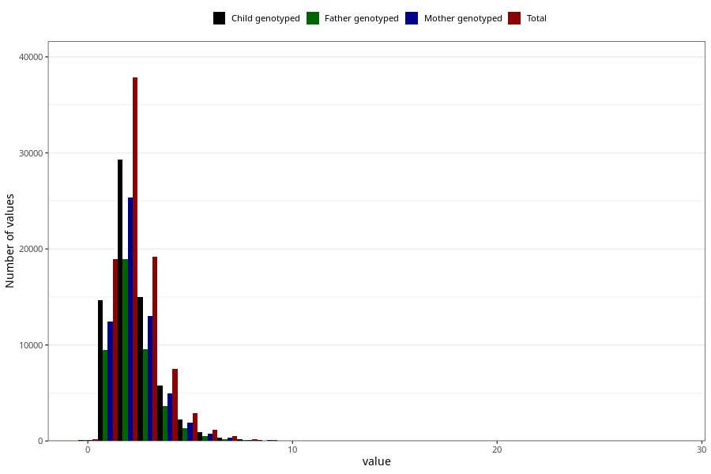

# tot_trans
Variable mapping to questionnaire: q2, question TOT_TRANS.
.
- Number of values:

| Value | Total | Child genotyped | Mother genotyped | Father genotyped |
| ----- | ----- | --------------- | ---------------- | ---------------- |
| Missing | 24927 | 14790 | 12674 | 6238 |
| 0.01 | 2 | 1 | 1 |0 |
| 0.02 | 1 | 1 | 1 |0 |
| 0.05 | 1 | 1 | 1 |1 |
| 0.06 | 4 | 1 | 1 |1 |
| 0.08 | 2 | 1 | 1 |1 |
| 0.1 | 1 | 1 | 1 |0 |
| 0.11 | 1 | 0 | 0 |0 |
| 0.12 | 2 | 2 | 1 |1 |
| 0.13 | 1 | 1 | 0 |0 |
| 0.14 | 1 | 1 | 1 |1 |
| 0.15 | 2 | 1 | 0 |0 |
| 0.19 | 2 | 2 | 2 |1 |
| 0.2 | 1 | 1 | 0 |0 |
| 0.21 | 2 | 0 | 0 |0 |
| 0.22 | 1 | 1 | 1 |0 |
| 0.23 | 4 | 3 | 2 |2 |
| 0.24 | 1 | 1 | 1 |1 |
| 0.25 | 2 | 2 | 2 |1 |
| 0.26 | 2 | 1 | 0 |0 |
| 0.27 | 1 | 1 | 0 |0 |
| 0.28 | 2 | 0 | 0 |0 |
| 0.29 | 3 | 2 | 1 |1 |
| 0.3 | 3 | 2 | 2 |1 |
| 0.31 | 2 | 1 | 0 |0 |
| 0.32 | 2 | 0 | 0 |0 |
| 0.33 | 10 | 7 | 3 |2 |
| 0.34 | 7 | 5 | 3 |1 |
| 0.35 | 7 | 6 | 4 |4 |
| 0.36 | 4 | 3 | 3 |3 |
| 0.37 | 4 | 3 | 2 |2 |
| 0.38 | 7 | 5 | 2 |2 |
| 0.39 | 6 | 6 | 4 |3 |
| 0.4 | 6 | 4 | 2 |2 |
| 0.41 | 11 | 8 | 4 |5 |
| 0.42 | 13 | 9 | 6 |6 |
| 0.43 | 10 | 6 | 5 |4 |
| 0.44 | 9 | 8 | 5 |2 |
| 0.45 | 3 | 3 | 3 |1 |
| 0.46 | 15 | 9 | 9 |6 |
| 0.47 | 12 | 7 | 6 |6 |
| 0.48 | 11 | 9 | 8 |5 |
| 0.49 | 16 | 11 | 8 |6 |
| 0.5 | 23 | 18 | 13 |11 |
| 0.51 | 14 | 8 | 5 |5 |
| 0.52 | 13 | 9 | 5 |4 |
| 0.53 | 16 | 14 | 10 |5 |
| 0.54 | 18 | 11 | 6 |5 |
| 0.55 | 16 | 10 | 5 |3 |
| 0.56 | 23 | 17 | 11 |8 |
| 0.57 | 24 | 17 | 13 |11 |
| 0.58 | 32 | 27 | 16 |13 |
| 0.59 | 35 | 26 | 21 |16 |
| 0.6 | 33 | 24 | 20 |15 |
| 0.61 | 40 | 29 | 20 |17 |
| 0.62 | 25 | 16 | 11 |9 |
| 0.63 | 33 | 23 | 18 |14 |
| 0.64 | 32 | 25 | 19 |16 |
| 0.65 | 39 | 32 | 26 |19 |
| 0.66 | 42 | 33 | 27 |17 |
| 0.67 | 52 | 39 | 35 |27 |
| 0.68 | 57 | 42 | 31 |25 |
| 0.69 | 53 | 42 | 36 |24 |
| 0.7 | 64 | 49 | 36 |27 |
| 0.71 | 54 | 41 | 37 |28 |
| 0.72 | 60 | 41 | 35 |21 |
| 0.73 | 63 | 44 | 31 |25 |
| 0.74 | 62 | 48 | 42 |32 |
| 0.75 | 76 | 55 | 51 |36 |
| 0.76 | 74 | 54 | 47 |36 |
| 0.77 | 73 | 57 | 50 |44 |
| 0.78 | 76 | 46 | 41 |35 |
| 0.79 | 90 | 64 | 55 |40 |
| 0.8 | 94 | 74 | 62 |42 |
| 0.81 | 78 | 61 | 49 |38 |
| 0.82 | 95 | 72 | 56 |41 |
| 0.83 | 81 | 61 | 50 |33 |
| 0.84 | 113 | 84 | 71 |67 |
| 0.85 | 111 | 88 | 75 |49 |
| 0.86 | 103 | 71 | 63 |49 |
| 0.87 | 127 | 96 | 74 |58 |
| 0.88 | 107 | 86 | 72 |54 |
| 0.89 | 118 | 93 | 75 |58 |
| 0.9 | 144 | 113 | 98 |68 |
| 0.91 | 139 | 98 | 80 |53 |
| 0.92 | 147 | 117 | 99 |84 |
| 0.93 | 144 | 111 | 95 |70 |
| 0.94 | 167 | 131 | 103 |80 |
| 0.95 | 179 | 138 | 109 |90 |
| 0.96 | 191 | 141 | 121 |99 |
| 0.97 | 177 | 140 | 119 |96 |
| 0.98 | 190 | 149 | 118 |101 |
| 0.99 | 176 | 133 | 114 |80 |
| 1 | 204 | 155 | 129 |98 |
| 1.01 | 199 | 156 | 137 |100 |
| 1.02 | 202 | 155 | 127 |96 |
| 1.03 | 196 | 153 | 128 |99 |
| 1.04 | 236 | 185 | 156 |129 |
| 1.05 | 202 | 141 | 119 |82 |
| 1.06 | 222 | 179 | 154 |112 |
| 1.07 | 259 | 208 | 186 |140 |
| 1.08 | 237 | 187 | 156 |123 |
| 1.09 | 233 | 176 | 153 |113 |
| 1.1 | 262 | 195 | 162 |130 |
| 1.11 | 257 | 194 | 167 |125 |
| 1.12 | 257 | 199 | 161 |140 |
| 1.13 | 255 | 202 | 177 |138 |
| 1.14 | 259 | 194 | 169 |131 |
| 1.15 | 258 | 201 | 167 |129 |
| 1.16 | 273 | 216 | 185 |150 |
| 1.17 | 293 | 224 | 189 |139 |
| 1.18 | 312 | 245 | 210 |153 |
| 1.19 | 311 | 252 | 212 |164 |
| 1.2 | 316 | 254 | 214 |161 |
| 1.21 | 318 | 242 | 207 |165 |
| 1.22 | 294 | 231 | 200 |150 |
| 1.23 | 302 | 233 | 193 |146 |
| 1.24 | 320 | 248 | 217 |175 |
| 1.25 | 322 | 240 | 209 |163 |
| 1.26 | 351 | 272 | 238 |182 |
| 1.27 | 350 | 275 | 235 |168 |
| 1.28 | 328 | 248 | 200 |169 |
| 1.29 | 327 | 252 | 217 |173 |
| 1.3 | 325 | 261 | 225 |157 |
| 1.31 | 345 | 255 | 226 |168 |
| 1.32 | 396 | 321 | 285 |223 |
| 1.33 | 416 | 331 | 288 |219 |
| 1.34 | 395 | 309 | 259 |205 |
| 1.35 | 355 | 275 | 237 |183 |
| 1.36 | 368 | 263 | 234 |175 |
| 1.37 | 392 | 311 | 270 |199 |
| 1.38 | 413 | 316 | 270 |203 |
| 1.39 | 401 | 311 | 270 |198 |
| 1.4 | 407 | 321 | 274 |221 |
| 1.41 | 441 | 335 | 297 |220 |
| 1.42 | 385 | 312 | 272 |184 |
| 1.43 | 436 | 344 | 293 |216 |
| 1.44 | 478 | 364 | 319 |235 |
| 1.45 | 424 | 328 | 279 |210 |
| 1.46 | 427 | 344 | 299 |216 |
| 1.47 | 408 | 323 | 286 |204 |
| 1.48 | 427 | 329 | 281 |214 |
| 1.49 | 410 | 312 | 264 |207 |
| 1.5 | 426 | 341 | 297 |216 |
| 1.51 | 423 | 329 | 286 |211 |
| 1.52 | 407 | 328 | 279 |208 |
| 1.53 | 456 | 349 | 300 |234 |
| 1.54 | 403 | 320 | 271 |210 |
| 1.55 | 427 | 334 | 280 |208 |
| 1.56 | 439 | 321 | 283 |200 |
| 1.57 | 429 | 326 | 277 |211 |
| 1.58 | 431 | 323 | 278 |221 |
| 1.59 | 468 | 371 | 313 |240 |
| 1.6 | 416 | 319 | 280 |196 |
| 1.61 | 433 | 324 | 279 |212 |
| 1.62 | 437 | 332 | 283 |216 |
| 1.63 | 444 | 347 | 308 |237 |
| 1.64 | 417 | 341 | 302 |238 |
| 1.65 | 417 | 337 | 290 |219 |
| 1.66 | 437 | 338 | 285 |218 |
| 1.67 | 429 | 344 | 301 |233 |
| 1.68 | 416 | 330 | 279 |208 |
| 1.69 | 421 | 336 | 292 |211 |
| 1.7 | 425 | 324 | 283 |203 |
| 1.71 | 423 | 331 | 287 |217 |
| 1.72 | 434 | 354 | 312 |248 |
| 1.73 | 450 | 346 | 295 |226 |
| 1.74 | 410 | 316 | 273 |188 |
| 1.75 | 438 | 341 | 299 |222 |
| 1.76 | 397 | 313 | 274 |199 |
| 1.77 | 428 | 340 | 284 |207 |
| 1.78 | 415 | 319 | 269 |204 |
| 1.79 | 466 | 358 | 309 |248 |
| 1.8 | 419 | 307 | 263 |196 |
| 1.81 | 449 | 350 | 305 |230 |
| 1.82 | 400 | 316 | 273 |214 |
| 1.83 | 409 | 317 | 273 |201 |
| 1.84 | 396 | 298 | 253 |188 |
| 1.85 | 393 | 301 | 260 |201 |
| 1.86 | 418 | 335 | 296 |225 |
| 1.87 | 393 | 315 | 270 |211 |
| 1.88 | 386 | 277 | 245 |182 |
| 1.89 | 447 | 354 | 305 |233 |
| 1.9 | 425 | 342 | 298 |220 |
| 1.91 | 458 | 333 | 281 |233 |
| 1.92 | 380 | 292 | 261 |202 |
| 1.93 | 387 | 295 | 259 |187 |
| 1.94 | 413 | 323 | 270 |196 |
| 1.95 | 423 | 339 | 289 |221 |
| 1.96 | 391 | 310 | 264 |200 |
| 1.97 | 375 | 282 | 244 |177 |
| 1.98 | 412 | 314 | 270 |201 |
| 1.99 | 370 | 294 | 262 |186 |
| 2 | 413 | 314 | 267 |207 |
| 2.01 | 392 | 312 | 260 |194 |
| 2.02 | 408 | 308 | 267 |188 |
| 2.03 | 358 | 267 | 232 |174 |
| 2.04 | 412 | 312 | 265 |209 |
| 2.05 | 405 | 317 | 270 |188 |
| 2.06 | 413 | 312 | 267 |192 |
| 2.07 | 384 | 299 | 254 |185 |
| 2.08 | 378 | 286 | 244 |186 |
| 2.09 | 399 | 301 | 273 |204 |
| 2.1 | 362 | 277 | 237 |181 |
| 2.11 | 348 | 275 | 238 |180 |
| 2.12 | 363 | 283 | 250 |195 |
| 2.13 | 401 | 313 | 278 |207 |
| 2.14 | 367 | 282 | 256 |199 |
| 2.15 | 377 | 294 | 248 |185 |
| 2.16 | 398 | 310 | 261 |193 |
| 2.17 | 337 | 259 | 229 |162 |
| 2.18 | 366 | 281 | 241 |174 |
| 2.19 | 342 | 266 | 236 |164 |
| 2.2 | 335 | 250 | 218 |155 |
| 2.21 | 373 | 285 | 251 |175 |
| 2.22 | 353 | 274 | 239 |168 |
| 2.23 | 344 | 265 | 228 |167 |
| 2.24 | 343 | 274 | 240 |183 |
| 2.25 | 380 | 287 | 246 |194 |
| 2.26 | 334 | 255 | 228 |162 |
| 2.27 | 310 | 238 | 202 |151 |
| 2.28 | 355 | 264 | 230 |185 |
| 2.29 | 333 | 262 | 219 |152 |
| 2.3 | 324 | 255 | 219 |158 |
| 2.31 | 308 | 244 | 221 |174 |
| 2.32 | 332 | 249 | 210 |157 |
| 2.33 | 350 | 278 | 233 |170 |
| 2.34 | 301 | 236 | 208 |152 |
| 2.35 | 344 | 278 | 239 |164 |
| 2.36 | 308 | 245 | 212 |154 |
| 2.37 | 336 | 266 | 233 |170 |
| 2.38 | 336 | 256 | 232 |168 |
| 2.39 | 328 | 232 | 200 |156 |
| 2.4 | 327 | 242 | 205 |156 |
| 2.41 | 314 | 247 | 216 |170 |
| 2.42 | 297 | 228 | 203 |156 |
| 2.43 | 307 | 225 | 194 |140 |
| 2.44 | 307 | 241 | 215 |151 |
| 2.45 | 312 | 236 | 201 |148 |
| 2.46 | 299 | 234 | 197 |143 |
| 2.47 | 300 | 228 | 193 |144 |
| 2.48 | 304 | 231 | 190 |149 |
| 2.49 | 275 | 213 | 182 |128 |
| 2.5 | 322 | 249 | 225 |153 |
| 2.51 | 303 | 237 | 201 |147 |
| 2.52 | 291 | 232 | 206 |149 |
| 2.53 | 281 | 229 | 207 |166 |
| 2.54 | 263 | 204 | 180 |126 |
| 2.55 | 236 | 191 | 158 |118 |
| 2.56 | 290 | 216 | 182 |130 |
| 2.57 | 242 | 183 | 161 |113 |
| 2.58 | 265 | 195 | 172 |136 |
| 2.59 | 265 | 198 | 174 |122 |
| 2.6 | 269 | 226 | 197 |142 |
| 2.61 | 247 | 185 | 155 |117 |
| 2.62 | 266 | 206 | 178 |142 |
| 2.63 | 270 | 215 | 190 |151 |
| 2.64 | 262 | 201 | 172 |127 |
| 2.65 | 259 | 210 | 184 |130 |
| 2.66 | 273 | 221 | 199 |136 |
| 2.67 | 239 | 178 | 160 |122 |
| 2.68 | 258 | 203 | 174 |131 |
| 2.69 | 273 | 212 | 187 |147 |
| 2.7 | 229 | 184 | 164 |119 |
| 2.71 | 267 | 205 | 173 |127 |
| 2.72 | 255 | 184 | 161 |125 |
| 2.73 | 215 | 174 | 158 |122 |
| 2.74 | 246 | 184 | 162 |123 |
| 2.75 | 204 | 161 | 143 |98 |
| 2.76 | 232 | 180 | 154 |111 |
| 2.77 | 222 | 175 | 151 |122 |
| 2.78 | 203 | 158 | 138 |96 |
| 2.79 | 216 | 178 | 155 |114 |
| 2.8 | 196 | 146 | 132 |89 |
| 2.81 | 219 | 177 | 153 |111 |
| 2.82 | 239 | 169 | 146 |104 |
| 2.83 | 190 | 147 | 126 |89 |
| 2.84 | 205 | 163 | 145 |111 |
| 2.85 | 191 | 153 | 127 |94 |
| 2.86 | 175 | 131 | 117 |95 |
| 2.87 | 200 | 139 | 127 |91 |
| 2.88 | 189 | 142 | 118 |88 |
| 2.89 | 183 | 139 | 121 |81 |
| 2.9 | 193 | 153 | 128 |88 |
| 2.91 | 192 | 142 | 121 |96 |
| 2.92 | 188 | 147 | 128 |80 |
| 2.93 | 179 | 138 | 124 |87 |
| 2.94 | 199 | 146 | 129 |95 |
| 2.95 | 201 | 151 | 125 |100 |
| 2.96 | 197 | 164 | 141 |94 |
| 2.97 | 208 | 164 | 148 |105 |
| 2.98 | 180 | 150 | 134 |97 |
| 2.99 | 172 | 127 | 109 |78 |
| 3 | 164 | 138 | 120 |86 |
| 3.01 | 154 | 132 | 113 |83 |
| 3.02 | 154 | 114 | 100 |69 |
| 3.03 | 188 | 146 | 127 |97 |
| 3.04 | 163 | 125 | 101 |71 |
| 3.05 | 186 | 141 | 122 |90 |
| 3.06 | 164 | 122 | 103 |75 |
| 3.07 | 183 | 139 | 117 |92 |
| 3.08 | 161 | 124 | 103 |85 |
| 3.09 | 142 | 116 | 103 |75 |
| 3.1 | 182 | 142 | 127 |95 |
| 3.11 | 161 | 123 | 112 |80 |
| 3.12 | 155 | 129 | 105 |82 |
| 3.13 | 172 | 139 | 127 |95 |
| 3.14 | 142 | 113 | 96 |66 |
| 3.15 | 151 | 116 | 100 |71 |
| 3.16 | 157 | 129 | 111 |73 |
| 3.17 | 141 | 110 | 97 |66 |
| 3.18 | 144 | 114 | 100 |76 |
| 3.19 | 156 | 125 | 105 |69 |
| 3.2 | 142 | 111 | 103 |77 |
| 3.21 | 143 | 113 | 100 |78 |
| 3.22 | 146 | 105 | 91 |66 |
| 3.23 | 137 | 118 | 105 |82 |
| 3.24 | 140 | 117 | 102 |77 |
| 3.25 | 122 | 98 | 83 |62 |
| 3.26 | 133 | 109 | 93 |70 |
| 3.27 | 132 | 99 | 92 |70 |
| 3.28 | 124 | 93 | 77 |57 |
| 3.29 | 125 | 99 | 87 |59 |
| 3.3 | 119 | 98 | 83 |55 |
| 3.31 | 129 | 100 | 92 |68 |
| 3.32 | 120 | 93 | 81 |55 |
| 3.33 | 108 | 83 | 70 |52 |
| 3.34 | 111 | 85 | 74 |61 |
| 3.35 | 123 | 95 | 87 |67 |
| 3.36 | 118 | 85 | 73 |54 |
| 3.37 | 125 | 94 | 86 |60 |
| 3.38 | 120 | 97 | 89 |59 |
| 3.39 | 126 | 102 | 87 |62 |
| 3.4 | 109 | 86 | 79 |61 |
| 3.41 | 121 | 91 | 80 |48 |
| 3.42 | 112 | 91 | 81 |59 |
| 3.43 | 120 | 77 | 67 |56 |
| 3.44 | 103 | 77 | 67 |53 |
| 3.45 | 105 | 81 | 68 |54 |
| 3.46 | 100 | 79 | 66 |50 |
| 3.47 | 100 | 78 | 69 |53 |
| 3.48 | 113 | 93 | 82 |52 |
| 3.49 | 110 | 82 | 70 |42 |
| 3.5 | 106 | 79 | 70 |51 |
| 3.51 | 107 | 82 | 72 |53 |
| 3.52 | 95 | 80 | 70 |53 |
| 3.53 | 97 | 69 | 59 |48 |
| 3.54 | 89 | 60 | 49 |36 |
| 3.55 | 118 | 91 | 82 |63 |
| 3.56 | 70 | 57 | 47 |35 |
| 3.57 | 87 | 64 | 51 |38 |
| 3.58 | 102 | 73 | 71 |49 |
| 3.59 | 91 | 70 | 60 |47 |
| 3.6 | 100 | 72 | 61 |44 |
| 3.61 | 111 | 83 | 71 |58 |
| 3.62 | 82 | 70 | 58 |40 |
| 3.63 | 78 | 66 | 59 |43 |
| 3.64 | 78 | 58 | 54 |37 |
| 3.65 | 90 | 76 | 65 |56 |
| 3.66 | 84 | 67 | 54 |42 |
| 3.67 | 98 | 75 | 67 |47 |
| 3.68 | 85 | 67 | 55 |34 |
| 3.69 | 82 | 69 | 57 |47 |
| 3.7 | 99 | 79 | 69 |47 |
| 3.71 | 70 | 55 | 48 |31 |
| 3.72 | 96 | 75 | 66 |49 |
| 3.73 | 91 | 71 | 65 |45 |
| 3.74 | 90 | 71 | 61 |46 |
| 3.75 | 93 | 74 | 64 |49 |
| 3.76 | 73 | 51 | 43 |29 |
| 3.77 | 77 | 62 | 58 |40 |
| 3.78 | 79 | 58 | 50 |39 |
| 3.79 | 78 | 64 | 57 |38 |
| 3.8 | 71 | 62 | 52 |36 |
| 3.81 | 86 | 64 | 53 |39 |
| 3.82 | 66 | 52 | 42 |35 |
| 3.83 | 78 | 57 | 51 |43 |
| 3.84 | 75 | 60 | 54 |43 |
| 3.85 | 96 | 75 | 66 |46 |
| 3.86 | 98 | 71 | 57 |41 |
| 3.87 | 78 | 57 | 53 |30 |
| 3.88 | 78 | 55 | 50 |38 |
| 3.89 | 81 | 63 | 54 |42 |
| 3.9 | 67 | 56 | 42 |36 |
| 3.91 | 70 | 54 | 50 |32 |
| 3.92 | 77 | 60 | 53 |32 |
| 3.93 | 68 | 51 | 44 |35 |
| 3.94 | 59 | 47 | 39 |34 |
| 3.95 | 83 | 65 | 60 |45 |
| 3.96 | 79 | 64 | 55 |43 |
| 3.97 | 69 | 48 | 43 |37 |
| 3.98 | 89 | 69 | 63 |46 |
| 3.99 | 56 | 37 | 30 |24 |
| 4 | 77 | 62 | 53 |39 |
| 4.01 | 66 | 49 | 43 |28 |
| 4.02 | 54 | 39 | 34 |28 |
| 4.03 | 74 | 59 | 50 |33 |
| 4.04 | 64 | 52 | 46 |37 |
| 4.05 | 62 | 52 | 44 |32 |
| 4.06 | 61 | 41 | 37 |21 |
| 4.07 | 59 | 43 | 35 |26 |
| 4.08 | 57 | 43 | 39 |27 |
| 4.09 | 75 | 65 | 56 |46 |
| 4.1 | 58 | 41 | 32 |29 |
| 4.11 | 70 | 50 | 44 |32 |
| 4.12 | 60 | 44 | 37 |31 |
| 4.13 | 53 | 44 | 39 |34 |
| 4.14 | 65 | 52 | 43 |39 |
| 4.15 | 55 | 40 | 36 |24 |
| 4.16 | 66 | 45 | 43 |27 |
| 4.17 | 58 | 47 | 40 |29 |
| 4.18 | 60 | 46 | 40 |28 |
| 4.19 | 58 | 45 | 40 |26 |
| 4.2 | 68 | 57 | 48 |43 |
| 4.21 | 65 | 51 | 47 |30 |
| 4.22 | 61 | 45 | 41 |24 |
| 4.23 | 56 | 40 | 34 |19 |
| 4.24 | 54 | 45 | 39 |30 |
| 4.25 | 60 | 48 | 41 |26 |
| 4.26 | 48 | 35 | 32 |25 |
| 4.27 | 57 | 44 | 35 |27 |
| 4.28 | 56 | 43 | 34 |25 |
| 4.29 | 42 | 27 | 24 |17 |
| 4.3 | 52 | 40 | 34 |19 |
| 4.31 | 50 | 36 | 33 |27 |
| 4.32 | 44 | 34 | 27 |21 |
| 4.33 | 57 | 44 | 38 |27 |
| 4.34 | 56 | 42 | 39 |27 |
| 4.35 | 38 | 27 | 24 |16 |
| 4.36 | 55 | 45 | 43 |32 |
| 4.37 | 45 | 34 | 29 |22 |
| 4.38 | 48 | 39 | 33 |20 |
| 4.39 | 39 | 36 | 29 |22 |
| 4.4 | 47 | 30 | 25 |21 |
| 4.41 | 44 | 25 | 23 |17 |
| 4.42 | 50 | 39 | 35 |24 |
| 4.43 | 41 | 30 | 28 |21 |
| 4.44 | 38 | 30 | 25 |20 |
| 4.45 | 53 | 36 | 29 |23 |
| 4.46 | 36 | 25 | 21 |17 |
| 4.47 | 48 | 42 | 36 |25 |
| 4.48 | 49 | 38 | 27 |24 |
| 4.49 | 50 | 41 | 34 |22 |
| 4.5 | 35 | 23 | 22 |12 |
| 4.51 | 45 | 28 | 25 |17 |
| 4.52 | 35 | 27 | 24 |20 |
| 4.53 | 47 | 33 | 28 |19 |
| 4.54 | 44 | 31 | 27 |17 |
| 4.55 | 36 | 28 | 23 |21 |
| 4.56 | 42 | 31 | 25 |13 |
| 4.57 | 31 | 24 | 22 |13 |
| 4.58 | 30 | 22 | 22 |17 |
| 4.59 | 32 | 23 | 21 |15 |
| 4.6 | 38 | 30 | 27 |17 |
| 4.61 | 33 | 27 | 25 |16 |
| 4.62 | 41 | 27 | 26 |20 |
| 4.63 | 42 | 34 | 32 |22 |
| 4.64 | 39 | 27 | 22 |18 |
| 4.65 | 42 | 36 | 32 |24 |
| 4.66 | 37 | 26 | 21 |11 |
| 4.67 | 32 | 28 | 25 |21 |
| 4.68 | 32 | 21 | 19 |17 |
| 4.69 | 33 | 25 | 24 |13 |
| 4.7 | 40 | 32 | 25 |18 |
| 4.71 | 35 | 26 | 25 |16 |
| 4.72 | 35 | 28 | 25 |22 |
| 4.73 | 29 | 23 | 18 |15 |
| 4.74 | 33 | 28 | 26 |16 |
| 4.75 | 32 | 25 | 21 |19 |
| 4.76 | 37 | 30 | 28 |17 |
| 4.77 | 26 | 19 | 17 |12 |
| 4.78 | 28 | 23 | 22 |16 |
| 4.79 | 30 | 24 | 20 |14 |
| 4.8 | 32 | 27 | 24 |20 |
| 4.81 | 26 | 24 | 22 |14 |
| 4.82 | 29 | 22 | 19 |11 |
| 4.83 | 26 | 22 | 19 |15 |
| 4.84 | 36 | 32 | 26 |17 |
| 4.85 | 33 | 24 | 18 |11 |
| 4.86 | 29 | 19 | 15 |9 |
| 4.87 | 28 | 23 | 20 |17 |
| 4.88 | 33 | 25 | 24 |15 |
| 4.89 | 26 | 16 | 10 |5 |
| 4.9 | 30 | 26 | 26 |16 |
| 4.91 | 19 | 14 | 13 |13 |
| 4.92 | 36 | 27 | 24 |19 |
| 4.93 | 26 | 22 | 17 |12 |
| 4.94 | 23 | 14 | 11 |4 |
| 4.95 | 24 | 14 | 14 |8 |
| 4.96 | 31 | 22 | 18 |14 |
| 4.97 | 28 | 19 | 17 |11 |
| 4.98 | 31 | 23 | 23 |20 |
| 4.99 | 25 | 23 | 21 |16 |
| 5 | 24 | 17 | 13 |9 |
| 5.01 | 24 | 16 | 13 |10 |
| 5.02 | 29 | 19 | 15 |14 |
| 5.03 | 22 | 18 | 15 |8 |
| 5.04 | 29 | 25 | 21 |13 |
| 5.05 | 27 | 22 | 17 |11 |
| 5.06 | 27 | 20 | 19 |12 |
| 5.07 | 22 | 16 | 14 |9 |
| 5.08 | 27 | 21 | 19 |14 |
| 5.09 | 23 | 17 | 13 |12 |
| 5.1 | 27 | 21 | 19 |11 |
| 5.11 | 22 | 16 | 13 |10 |
| 5.12 | 20 | 15 | 14 |11 |
| 5.13 | 16 | 13 | 11 |7 |
| 5.14 | 20 | 12 | 11 |6 |
| 5.15 | 23 | 19 | 16 |9 |
| 5.16 | 24 | 19 | 13 |7 |
| 5.17 | 18 | 17 | 15 |16 |
| 5.18 | 22 | 14 | 12 |11 |
| 5.19 | 15 | 10 | 8 |4 |
| 5.2 | 17 | 12 | 11 |8 |
| 5.21 | 24 | 18 | 16 |11 |
| 5.22 | 19 | 16 | 15 |12 |
| 5.23 | 19 | 15 | 13 |11 |
| 5.24 | 20 | 17 | 16 |9 |
| 5.25 | 23 | 19 | 16 |11 |
| 5.26 | 25 | 21 | 17 |11 |
| 5.27 | 14 | 11 | 7 |5 |
| 5.28 | 20 | 15 | 14 |9 |
| 5.29 | 13 | 12 | 12 |9 |
| 5.3 | 25 | 17 | 16 |14 |
| 5.31 | 15 | 12 | 9 |5 |
| 5.32 | 15 | 10 | 8 |8 |
| 5.33 | 17 | 14 | 9 |8 |
| 5.34 | 14 | 12 | 9 |6 |
| 5.35 | 28 | 21 | 17 |9 |
| 5.36 | 18 | 14 | 11 |8 |
| 5.37 | 15 | 15 | 13 |10 |
| 5.38 | 23 | 16 | 15 |11 |
| 5.39 | 15 | 13 | 11 |8 |
| 5.4 | 21 | 12 | 8 |8 |
| 5.41 | 13 | 11 | 9 |5 |
| 5.42 | 12 | 11 | 8 |5 |
| 5.43 | 17 | 15 | 10 |8 |
| 5.44 | 17 | 13 | 12 |7 |
| 5.45 | 17 | 13 | 8 |6 |
| 5.46 | 13 | 10 | 7 |6 |
| 5.47 | 15 | 12 | 11 |10 |
| 5.48 | 14 | 12 | 10 |4 |
| 5.49 | 16 | 10 | 10 |6 |
| 5.5 | 21 | 20 | 16 |15 |
| 5.51 | 13 | 10 | 8 |5 |
| 5.52 | 12 | 10 | 10 |6 |
| 5.53 | 11 | 10 | 10 |7 |
| 5.54 | 20 | 12 | 9 |8 |
| 5.55 | 18 | 16 | 14 |10 |
| 5.56 | 11 | 10 | 9 |6 |
| 5.57 | 13 | 11 | 7 |6 |
| 5.58 | 17 | 16 | 13 |10 |
| 5.59 | 13 | 9 | 9 |6 |
| 5.6 | 16 | 11 | 9 |7 |
| 5.61 | 14 | 10 | 8 |7 |
| 5.62 | 16 | 13 | 10 |6 |
| 5.63 | 12 | 5 | 3 |3 |
| 5.64 | 8 | 7 | 7 |3 |
| 5.65 | 9 | 8 | 8 |5 |
| 5.66 | 13 | 12 | 8 |10 |
| 5.67 | 12 | 10 | 10 |6 |
| 5.68 | 19 | 12 | 8 |7 |
| 5.69 | 13 | 10 | 9 |6 |
| 5.7 | 11 | 7 | 7 |4 |
| 5.71 | 18 | 16 | 16 |13 |
| 5.72 | 15 | 8 | 6 |5 |
| 5.73 | 10 | 5 | 3 |2 |
| 5.74 | 14 | 12 | 10 |9 |
| 5.75 | 11 | 11 | 11 |8 |
| 5.76 | 16 | 15 | 13 |10 |
| 5.77 | 10 | 7 | 5 |4 |
| 5.78 | 14 | 10 | 8 |6 |
| 5.79 | 16 | 11 | 9 |7 |
| 5.8 | 15 | 12 | 10 |7 |
| 5.81 | 12 | 9 | 8 |4 |
| 5.82 | 17 | 13 | 10 |8 |
| 5.83 | 16 | 12 | 12 |9 |
| 5.84 | 6 | 6 | 5 |4 |
| 5.85 | 9 | 7 | 7 |4 |
| 5.86 | 13 | 10 | 9 |5 |
| 5.87 | 6 | 4 | 3 |1 |
| 5.88 | 11 | 8 | 7 |5 |
| 5.89 | 8 | 5 | 4 |4 |
| 5.9 | 13 | 8 | 6 |4 |
| 5.91 | 10 | 7 | 5 |3 |
| 5.92 | 8 | 4 | 3 |3 |
| 5.93 | 11 | 9 | 8 |7 |
| 5.94 | 14 | 8 | 6 |3 |
| 5.95 | 6 | 5 | 4 |5 |
| 5.96 | 17 | 13 | 12 |9 |
| 5.97 | 6 | 5 | 3 |2 |
| 5.98 | 8 | 7 | 5 |3 |
| 5.99 | 11 | 6 | 5 |2 |
| 6 | 11 | 9 | 8 |4 |
| 6.01 | 9 | 7 | 7 |6 |
| 6.02 | 18 | 16 | 15 |8 |
| 6.03 | 10 | 8 | 7 |6 |
| 6.04 | 10 | 10 | 8 |9 |
| 6.05 | 11 | 11 | 11 |8 |
| 6.06 | 11 | 8 | 5 |5 |
| 6.07 | 17 | 10 | 6 |6 |
| 6.08 | 8 | 6 | 5 |3 |
| 6.09 | 8 | 6 | 5 |3 |
| 6.1 | 9 | 6 | 6 |6 |
| 6.11 | 10 | 9 | 6 |4 |
| 6.12 | 10 | 10 | 8 |5 |
| 6.13 | 15 | 10 | 10 |9 |
| 6.14 | 2 | 1 | 0 |0 |
| 6.15 | 6 | 6 | 5 |3 |
| 6.16 | 7 | 6 | 6 |5 |
| 6.17 | 8 | 4 | 4 |2 |
| 6.18 | 13 | 10 | 9 |4 |
| 6.19 | 15 | 12 | 8 |6 |
| 6.2 | 11 | 10 | 10 |7 |
| 6.21 | 5 | 3 | 3 |2 |
| 6.22 | 6 | 4 | 2 |1 |
| 6.23 | 13 | 10 | 10 |6 |
| 6.24 | 10 | 8 | 6 |3 |
| 6.25 | 4 | 3 | 2 |2 |
| 6.26 | 6 | 6 | 6 |4 |
| 6.27 | 5 | 3 | 3 |3 |
| 6.28 | 9 | 7 | 6 |6 |
| 6.29 | 11 | 9 | 5 |3 |
| 6.3 | 10 | 8 | 5 |4 |
| 6.31 | 10 | 7 | 6 |4 |
| 6.32 | 7 | 5 | 5 |4 |
| 6.33 | 18 | 13 | 12 |11 |
| 6.34 | 5 | 5 | 5 |3 |
| 6.35 | 9 | 9 | 5 |5 |
| 6.36 | 5 | 3 | 3 |0 |
| 6.37 | 8 | 7 | 6 |6 |
| 6.38 | 12 | 7 | 7 |5 |
| 6.39 | 8 | 7 | 6 |3 |
| 6.4 | 8 | 6 | 4 |4 |
| 6.41 | 7 | 7 | 7 |6 |
| 6.42 | 4 | 3 | 3 |3 |
| 6.43 | 7 | 6 | 6 |3 |
| 6.44 | 6 | 6 | 5 |4 |
| 6.45 | 8 | 6 | 6 |3 |
| 6.46 | 5 | 4 | 2 |1 |
| 6.47 | 7 | 3 | 2 |0 |
| 6.48 | 10 | 9 | 7 |6 |
| 6.49 | 6 | 4 | 4 |2 |
| 6.5 | 5 | 2 | 2 |1 |
| 6.51 | 6 | 3 | 2 |1 |
| 6.52 | 5 | 4 | 3 |2 |
| 6.53 | 5 | 4 | 4 |3 |
| 6.54 | 5 | 3 | 3 |2 |
| 6.55 | 6 | 4 | 3 |3 |
| 6.56 | 5 | 3 | 2 |1 |
| 6.57 | 6 | 2 | 2 |2 |
| 6.58 | 5 | 4 | 3 |3 |
| 6.59 | 5 | 2 | 2 |2 |
| 6.6 | 9 | 5 | 5 |2 |
| 6.61 | 4 | 2 | 2 |2 |
| 6.62 | 2 | 1 | 1 |0 |
| 6.63 | 4 | 3 | 3 |2 |
| 6.64 | 4 | 3 | 3 |2 |
| 6.65 | 11 | 8 | 8 |4 |
| 6.66 | 4 | 1 | 1 |1 |
| 6.67 | 8 | 6 | 6 |5 |
| 6.68 | 3 | 1 | 0 |0 |
| 6.69 | 3 | 3 | 3 |3 |
| 6.7 | 5 | 3 | 3 |3 |
| 6.71 | 6 | 6 | 5 |2 |
| 6.72 | 6 | 6 | 6 |2 |
| 6.73 | 9 | 6 | 5 |3 |
| 6.74 | 7 | 5 | 4 |2 |
| 6.75 | 6 | 6 | 5 |4 |
| 6.76 | 5 | 1 | 1 |0 |
| 6.77 | 5 | 4 | 3 |3 |
| 6.78 | 8 | 6 | 6 |6 |
| 6.79 | 2 | 0 | 0 |0 |
| 6.8 | 4 | 2 | 0 |0 |
| 6.81 | 4 | 4 | 2 |1 |
| 6.82 | 4 | 4 | 3 |3 |
| 6.83 | 5 | 5 | 5 |4 |
| 6.84 | 6 | 6 | 6 |3 |
| 6.85 | 8 | 6 | 5 |4 |
| 6.86 | 7 | 7 | 6 |4 |
| 6.87 | 6 | 5 | 5 |2 |
| 6.88 | 6 | 5 | 4 |2 |
| 6.89 | 4 | 3 | 2 |1 |
| 6.9 | 3 | 3 | 3 |2 |
| 6.91 | 5 | 5 | 4 |1 |
| 6.92 | 5 | 3 | 2 |2 |
| 6.93 | 6 | 5 | 5 |3 |
| 6.94 | 4 | 3 | 3 |1 |
| 6.95 | 2 | 0 | 0 |0 |
| 6.96 | 7 | 5 | 5 |4 |
| 6.97 | 4 | 3 | 2 |2 |
| 6.98 | 6 | 3 | 2 |1 |
| 6.99 | 4 | 4 | 4 |3 |
| 7 | 5 | 0 | 0 |0 |
| 7.01 | 2 | 2 | 1 |0 |
| 7.02 | 2 | 1 | 1 |1 |
| 7.03 | 6 | 4 | 3 |2 |
| 7.04 | 4 | 2 | 2 |2 |
| 7.05 | 5 | 4 | 4 |3 |
| 7.06 | 5 | 4 | 4 |2 |
| 7.07 | 3 | 0 | 0 |0 |
| 7.08 | 4 | 4 | 3 |4 |
| 7.09 | 2 | 2 | 2 |1 |
| 7.1 | 3 | 3 | 3 |3 |
| 7.11 | 7 | 5 | 5 |2 |
| 7.12 | 1 | 1 | 1 |1 |
| 7.13 | 5 | 4 | 3 |3 |
| 7.14 | 4 | 3 | 2 |2 |
| 7.15 | 1 | 1 | 1 |1 |
| 7.16 | 1 | 1 | 0 |0 |
| 7.18 | 3 | 2 | 2 |1 |
| 7.19 | 1 | 1 | 1 |1 |
| 7.2 | 5 | 3 | 2 |2 |
| 7.22 | 3 | 3 | 3 |0 |
| 7.23 | 4 | 4 | 3 |3 |
| 7.24 | 3 | 2 | 1 |1 |
| 7.25 | 3 | 2 | 1 |1 |
| 7.26 | 3 | 2 | 2 |0 |
| 7.27 | 2 | 2 | 1 |1 |
| 7.28 | 4 | 3 | 3 |2 |
| 7.29 | 1 | 0 | 0 |0 |
| 7.3 | 3 | 2 | 2 |0 |
| 7.31 | 1 | 0 | 0 |0 |
| 7.32 | 2 | 2 | 1 |1 |
| 7.33 | 2 | 2 | 2 |1 |
| 7.34 | 3 | 3 | 3 |2 |
| 7.35 | 2 | 1 | 1 |1 |
| 7.36 | 2 | 2 | 1 |1 |
| 7.37 | 2 | 2 | 2 |1 |
| 7.38 | 4 | 4 | 4 |3 |
| 7.4 | 1 | 1 | 1 |1 |
| 7.41 | 4 | 4 | 2 |1 |
| 7.42 | 3 | 3 | 2 |1 |
| 7.43 | 5 | 4 | 4 |0 |
| 7.45 | 3 | 3 | 2 |0 |
| 7.46 | 2 | 2 | 2 |2 |
| 7.47 | 6 | 5 | 5 |4 |
| 7.48 | 5 | 4 | 3 |1 |
| 7.5 | 5 | 4 | 2 |0 |
| 7.51 | 2 | 2 | 1 |0 |
| 7.52 | 4 | 2 | 2 |1 |
| 7.53 | 3 | 3 | 0 |1 |
| 7.54 | 1 | 0 | 0 |0 |
| 7.55 | 6 | 4 | 3 |2 |
| 7.56 | 3 | 1 | 0 |0 |
| 7.57 | 3 | 3 | 3 |0 |
| 7.58 | 3 | 1 | 0 |0 |
| 7.59 | 5 | 3 | 3 |3 |
| 7.61 | 6 | 5 | 4 |2 |
| 7.62 | 1 | 0 | 0 |0 |
| 7.63 | 2 | 1 | 0 |1 |
| 7.65 | 3 | 2 | 2 |1 |
| 7.66 | 3 | 3 | 3 |2 |
| 7.67 | 4 | 3 | 3 |2 |
| 7.68 | 7 | 6 | 6 |5 |
| 7.69 | 1 | 1 | 1 |1 |
| 7.7 | 1 | 1 | 1 |0 |
| 7.71 | 7 | 4 | 3 |2 |
| 7.73 | 3 | 3 | 2 |2 |
| 7.76 | 2 | 2 | 2 |1 |
| 7.77 | 4 | 4 | 3 |3 |
| 7.78 | 2 | 2 | 2 |2 |
| 7.8 | 3 | 2 | 2 |1 |
| 7.81 | 5 | 5 | 3 |1 |
| 7.82 | 5 | 4 | 4 |2 |
| 7.83 | 2 | 1 | 0 |0 |
| 7.84 | 6 | 6 | 4 |1 |
| 7.85 | 3 | 3 | 2 |2 |
| 7.86 | 1 | 1 | 1 |1 |
| 7.87 | 1 | 1 | 0 |0 |
| 7.88 | 2 | 1 | 1 |0 |
| 7.89 | 2 | 1 | 1 |1 |
| 7.92 | 1 | 1 | 1 |1 |
| 7.93 | 1 | 0 | 0 |0 |
| 7.94 | 1 | 1 | 1 |1 |
| 7.95 | 3 | 3 | 2 |2 |
| 7.96 | 1 | 1 | 1 |1 |
| 7.98 | 4 | 2 | 2 |2 |
| 7.99 | 1 | 1 | 1 |0 |
| 8 | 4 | 4 | 4 |4 |
| 8.01 | 1 | 1 | 1 |1 |
| 8.04 | 2 | 1 | 1 |1 |
| 8.06 | 1 | 1 | 1 |1 |
| 8.07 | 3 | 1 | 1 |1 |
| 8.09 | 1 | 0 | 0 |0 |
| 8.1 | 1 | 1 | 1 |0 |
| 8.12 | 1 | 1 | 0 |0 |
| 8.13 | 2 | 2 | 2 |0 |
| 8.14 | 1 | 1 | 1 |1 |
| 8.15 | 4 | 3 | 3 |2 |
| 8.16 | 1 | 1 | 1 |1 |
| 8.17 | 3 | 2 | 1 |1 |
| 8.18 | 2 | 2 | 2 |2 |
| 8.19 | 1 | 0 | 0 |0 |
| 8.2 | 1 | 0 | 0 |0 |
| 8.22 | 1 | 0 | 0 |0 |
| 8.23 | 1 | 1 | 0 |0 |
| 8.24 | 2 | 1 | 0 |0 |
| 8.25 | 1 | 0 | 0 |0 |
| 8.26 | 1 | 1 | 1 |1 |
| 8.27 | 2 | 2 | 2 |2 |
| 8.29 | 1 | 0 | 0 |0 |
| 8.3 | 1 | 1 | 1 |1 |
| 8.31 | 1 | 1 | 1 |1 |
| 8.32 | 1 | 1 | 1 |0 |
| 8.35 | 1 | 1 | 1 |1 |
| 8.38 | 2 | 2 | 2 |1 |
| 8.39 | 4 | 2 | 2 |1 |
| 8.41 | 2 | 2 | 2 |1 |
| 8.43 | 2 | 2 | 2 |1 |
| 8.44 | 2 | 2 | 1 |0 |
| 8.45 | 2 | 0 | 0 |0 |
| 8.46 | 2 | 2 | 2 |2 |
| 8.47 | 1 | 1 | 1 |1 |
| 8.48 | 1 | 1 | 1 |1 |
| 8.49 | 2 | 2 | 0 |0 |
| 8.5 | 3 | 2 | 2 |2 |
| 8.51 | 2 | 2 | 1 |0 |
| 8.52 | 5 | 5 | 3 |3 |
| 8.53 | 1 | 1 | 1 |1 |
| 8.54 | 1 | 1 | 1 |1 |
| 8.55 | 2 | 2 | 2 |2 |
| 8.56 | 2 | 1 | 1 |1 |
| 8.57 | 1 | 1 | 0 |0 |
| 8.59 | 1 | 1 | 1 |0 |
| 8.6 | 1 | 1 | 1 |0 |
| 8.61 | 1 | 1 | 1 |1 |
| 8.62 | 2 | 1 | 1 |1 |
| 8.64 | 2 | 2 | 2 |0 |
| 8.67 | 3 | 2 | 2 |1 |
| 8.7 | 1 | 1 | 1 |1 |
| 8.72 | 2 | 2 | 1 |1 |
| 8.73 | 2 | 2 | 1 |0 |
| 8.74 | 4 | 2 | 1 |1 |
| 8.75 | 2 | 2 | 2 |2 |
| 8.76 | 2 | 1 | 1 |1 |
| 8.77 | 1 | 1 | 1 |0 |
| 8.78 | 1 | 0 | 0 |0 |
| 8.8 | 1 | 1 | 1 |1 |
| 8.81 | 1 | 1 | 1 |0 |
| 8.82 | 2 | 1 | 1 |1 |
| 8.83 | 2 | 1 | 0 |0 |
| 8.84 | 1 | 1 | 1 |0 |
| 8.85 | 2 | 1 | 0 |0 |
| 8.86 | 1 | 0 | 0 |0 |
| 8.87 | 2 | 2 | 2 |1 |
| 8.88 | 1 | 1 | 0 |0 |
| 8.89 | 1 | 1 | 1 |1 |
| 8.9 | 1 | 0 | 0 |0 |
| 8.91 | 3 | 3 | 2 |2 |
| 8.92 | 1 | 1 | 1 |1 |
| 8.94 | 2 | 2 | 1 |2 |
| 8.96 | 1 | 0 | 0 |0 |
| 8.98 | 1 | 1 | 1 |0 |
| 9.04 | 5 | 5 | 5 |5 |
| 9.06 | 1 | 1 | 1 |1 |
| 9.07 | 1 | 1 | 1 |1 |
| 9.1 | 1 | 1 | 1 |0 |
| 9.13 | 1 | 1 | 1 |0 |
| 9.14 | 1 | 1 | 0 |1 |
| 9.18 | 1 | 0 | 0 |0 |
| 9.2 | 1 | 1 | 1 |0 |
| 9.21 | 1 | 1 | 1 |1 |
| 9.22 | 1 | 0 | 0 |0 |
| 9.26 | 1 | 0 | 0 |0 |
| 9.28 | 1 | 0 | 0 |0 |
| 9.29 | 1 | 1 | 1 |1 |
| 9.3 | 1 | 0 | 0 |0 |
| 9.31 | 1 | 1 | 1 |1 |
| 9.33 | 1 | 1 | 1 |0 |
| 9.36 | 1 | 1 | 1 |1 |
| 9.38 | 3 | 3 | 2 |1 |
| 9.39 | 2 | 2 | 2 |1 |
| 9.4 | 1 | 1 | 1 |1 |
| 9.41 | 1 | 1 | 1 |1 |
| 9.42 | 1 | 1 | 1 |0 |
| 9.43 | 1 | 1 | 1 |1 |
| 9.45 | 1 | 1 | 1 |1 |
| 9.47 | 1 | 0 | 0 |0 |
| 9.49 | 3 | 2 | 0 |0 |
| 9.5 | 1 | 1 | 1 |1 |
| 9.51 | 1 | 1 | 0 |0 |
| 9.52 | 1 | 0 | 0 |0 |
| 9.53 | 1 | 0 | 0 |0 |
| 9.55 | 1 | 1 | 1 |0 |
| 9.56 | 1 | 1 | 1 |1 |
| 9.58 | 2 | 1 | 1 |0 |
| 9.61 | 1 | 1 | 1 |0 |
| 9.62 | 1 | 1 | 1 |1 |
| 9.63 | 1 | 1 | 1 |0 |
| 9.66 | 1 | 0 | 0 |0 |
| 9.7 | 2 | 2 | 2 |0 |
| 9.72 | 1 | 1 | 0 |0 |
| 9.73 | 1 | 1 | 1 |1 |
| 9.79 | 1 | 1 | 1 |1 |
| 9.8 | 2 | 2 | 1 |0 |
| 9.83 | 1 | 0 | 0 |0 |
| 9.88 | 1 | 1 | 1 |1 |
| 9.9 | 1 | 1 | 1 |0 |
| 9.94 | 1 | 0 | 0 |0 |
| 9.98 | 2 | 1 | 1 |1 |
| 10.03 | 1 | 0 | 0 |0 |
| 10.04 | 1 | 1 | 0 |0 |
| 10.11 | 1 | 0 | 0 |0 |
| 10.12 | 1 | 0 | 0 |0 |
| 10.14 | 1 | 1 | 0 |0 |
| 10.15 | 1 | 0 | 0 |0 |
| 10.17 | 2 | 2 | 2 |2 |
| 10.25 | 1 | 1 | 1 |1 |
| 10.31 | 2 | 2 | 2 |1 |
| 10.34 | 2 | 2 | 1 |0 |
| 10.37 | 1 | 1 | 0 |1 |
| 10.41 | 1 | 0 | 0 |0 |
| 10.42 | 2 | 1 | 0 |0 |
| 10.59 | 1 | 0 | 0 |0 |
| 10.75 | 1 | 1 | 1 |0 |
| 10.79 | 1 | 1 | 1 |1 |
| 10.82 | 2 | 1 | 1 |0 |
| 10.87 | 1 | 0 | 0 |0 |
| 10.88 | 1 | 0 | 0 |0 |
| 10.91 | 1 | 1 | 1 |1 |
| 10.98 | 1 | 1 | 1 |1 |
| 11.04 | 1 | 1 | 1 |1 |
| 11.07 | 1 | 1 | 1 |0 |
| 11.09 | 1 | 0 | 0 |0 |
| 11.16 | 1 | 1 | 1 |1 |
| 11.17 | 1 | 1 | 0 |0 |
| 11.18 | 1 | 1 | 1 |1 |
| 11.28 | 1 | 0 | 0 |0 |
| 11.34 | 1 | 1 | 0 |0 |
| 11.45 | 1 | 1 | 1 |1 |
| 11.51 | 1 | 1 | 1 |0 |
| 11.56 | 1 | 1 | 1 |0 |
| 11.64 | 1 | 1 | 1 |1 |
| 11.74 | 1 | 0 | 0 |0 |
| 11.79 | 2 | 2 | 2 |1 |
| 12.12 | 1 | 1 | 1 |0 |
| 12.14 | 1 | 0 | 0 |0 |
| 12.29 | 1 | 1 | 1 |0 |
| 12.46 | 1 | 1 | 0 |0 |
| 12.5 | 1 | 1 | 1 |1 |
| 12.69 | 1 | 1 | 0 |0 |
| 12.75 | 1 | 1 | 0 |0 |
| 12.79 | 1 | 1 | 1 |1 |
| 13.06 | 1 | 1 | 1 |1 |
| 13.32 | 1 | 1 | 0 |0 |
| 13.51 | 1 | 0 | 0 |0 |
| 13.57 | 1 | 0 | 0 |0 |
| 13.73 | 1 | 0 | 0 |0 |
| 13.83 | 1 | 1 | 1 |0 |
| 14.67 | 1 | 1 | 1 |1 |
| 15.22 | 1 | 1 | 0 |0 |
| 15.23 | 1 | 1 | 1 |0 |
| 15.42 | 1 | 0 | 0 |0 |
| 15.5 | 1 | 1 | 1 |1 |
| 15.55 | 1 | 0 | 0 |0 |
| 15.86 | 1 | 1 | 0 |0 |
| 16.61 | 1 | 1 | 1 |0 |
| 16.87 | 1 | 0 | 0 |0 |
| 17.61 | 1 | 0 | 0 |0 |
| 17.8 | 1 | 1 | 0 |0 |
| 18.66 | 1 | 1 | 0 |0 |
| 18.68 | 1 | 1 | 1 |0 |
| 19.58 | 1 | 0 | 0 |0 |
| 21.11 | 1 | 1 | 1 |1 |
| 22.7 | 1 | 0 | 0 |0 |
| 23.24 | 1 | 0 | 0 |0 |
| 24.13 | 1 | 1 | 1 |1 |
| 24.44 | 1 | 0 | 0 |0 |
| 25.6 | 1 | 0 | 0 |0 |
| 28.24 | 1 | 0 | 0 |0 |

