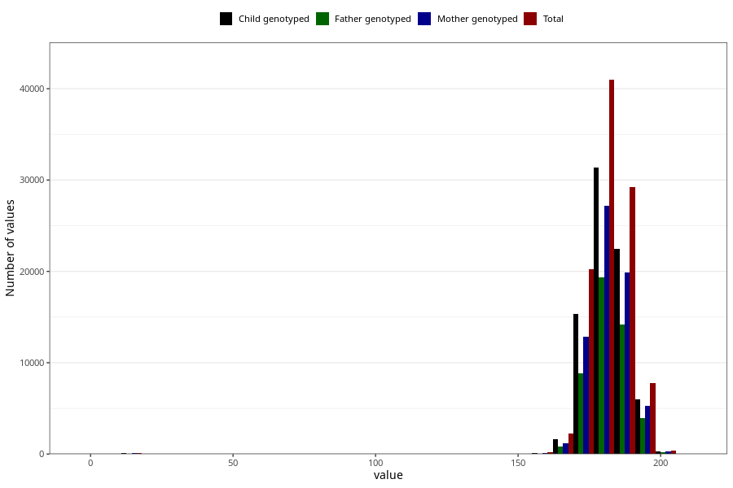

# father_height
Variable mapping to questionnaire: q1m, question AA88.
.
- Number of values:

| Value | Total | Child genotyped | Mother genotyped | Father genotyped |
| ----- | ----- | --------------- | ---------------- | ---------------- |
| Missing | 12223 | 5977 | 4891 | 2791 |
| 1 | 28 | 17 | 14 |11 |
| 2 | 1 | 0 | 0 |0 |
| 6 | 1 | 0 | 0 |0 |
| 7 | 1 | 0 | 0 |0 |
| 16 | 4 | 4 | 4 |1 |
| 17 | 26 | 21 | 15 |12 |
| 18 | 69 | 54 | 49 |30 |
| 19 | 5 | 4 | 3 |4 |
| 22 | 2 | 2 | 0 |0 |
| 64 | 2 | 2 | 2 |1 |
| 66 | 1 | 1 | 0 |0 |
| 68 | 1 | 1 | 0 |0 |
| 69 | 1 | 0 | 0 |0 |
| 70 | 8 | 5 | 5 |1 |
| 71 | 1 | 1 | 1 |1 |
| 72 | 8 | 7 | 4 |3 |
| 73 | 7 | 3 | 3 |1 |
| 74 | 9 | 9 | 7 |3 |
| 75 | 14 | 13 | 7 |7 |
| 76 | 7 | 6 | 5 |3 |
| 77 | 5 | 4 | 3 |2 |
| 78 | 6 | 6 | 6 |3 |
| 79 | 9 | 5 | 3 |0 |
| 80 | 10 | 8 | 7 |2 |
| 81 | 6 | 4 | 4 |3 |
| 82 | 10 | 8 | 6 |6 |
| 83 | 8 | 7 | 7 |4 |
| 84 | 5 | 2 | 2 |1 |
| 85 | 5 | 3 | 3 |2 |
| 86 | 4 | 3 | 3 |2 |
| 87 | 3 | 3 | 2 |2 |
| 88 | 4 | 2 | 2 |0 |
| 89 | 1 | 1 | 0 |1 |
| 90 | 3 | 2 | 1 |1 |
| 91 | 1 | 0 | 0 |0 |
| 92 | 7 | 4 | 4 |1 |
| 93 | 1 | 0 | 0 |0 |
| 94 | 1 | 1 | 1 |1 |
| 96 | 1 | 1 | 1 |0 |
| 125 | 1 | 1 | 1 |1 |
| 138 | 1 | 1 | 1 |1 |
| 148 | 2 | 2 | 1 |0 |
| 150 | 2 | 1 | 1 |1 |
| 152 | 1 | 1 | 1 |1 |
| 153 | 1 | 0 | 0 |0 |
| 154 | 1 | 1 | 1 |0 |
| 155 | 7 | 4 | 3 |0 |
| 156 | 3 | 0 | 0 |0 |
| 157 | 3 | 1 | 0 |0 |
| 158 | 13 | 5 | 2 |2 |
| 159 | 8 | 4 | 1 |1 |
| 160 | 91 | 65 | 40 |30 |
| 161 | 32 | 24 | 16 |11 |
| 162 | 79 | 47 | 28 |19 |
| 163 | 103 | 68 | 40 |25 |
| 164 | 109 | 78 | 55 |42 |
| 165 | 385 | 261 | 178 |116 |
| 166 | 152 | 102 | 69 |41 |
| 167 | 404 | 292 | 216 |140 |
| 168 | 628 | 456 | 344 |239 |
| 169 | 487 | 355 | 279 |182 |
| 170 | 2689 | 2003 | 1606 |1071 |
| 171 | 811 | 611 | 502 |350 |
| 172 | 2417 | 1805 | 1495 |1046 |
| 173 | 2543 | 1932 | 1582 |1140 |
| 174 | 2761 | 2145 | 1821 |1243 |
| 175 | 5226 | 3949 | 3334 |2264 |
| 176 | 3812 | 2866 | 2462 |1752 |
| 177 | 2297 | 1731 | 1464 |1087 |
| 178 | 6531 | 4998 | 4291 |2973 |
| 179 | 3307 | 2512 | 2164 |1582 |
| 180 | 13032 | 9976 | 8631 |6022 |
| 181 | 3305 | 2522 | 2193 |1652 |
| 182 | 5983 | 4646 | 4060 |2909 |
| 183 | 6517 | 4975 | 4397 |3132 |
| 184 | 4841 | 3714 | 3269 |2376 |
| 185 | 6391 | 4902 | 4314 |3021 |
| 186 | 4683 | 3591 | 3174 |2265 |
| 187 | 4145 | 3197 | 2825 |1997 |
| 188 | 2439 | 1884 | 1672 |1164 |
| 189 | 2297 | 1759 | 1572 |1155 |
| 190 | 4393 | 3398 | 3022 |2165 |
| 191 | 1184 | 920 | 799 |595 |
| 192 | 1817 | 1385 | 1235 |918 |
| 193 | 1525 | 1186 | 1067 |790 |
| 194 | 1024 | 772 | 690 |496 |
| 195 | 792 | 608 | 522 |375 |
| 196 | 663 | 493 | 445 |333 |
| 197 | 412 | 322 | 289 |215 |
| 198 | 339 | 270 | 243 |178 |
| 199 | 85 | 69 | 64 |43 |
| 200 | 168 | 132 | 114 |74 |
| 201 | 36 | 24 | 19 |16 |
| 202 | 41 | 29 | 28 |17 |
| 203 | 47 | 34 | 33 |27 |
| 204 | 15 | 11 | 10 |9 |
| 205 | 14 | 10 | 8 |6 |
| 206 | 4 | 4 | 4 |4 |
| 207 | 5 | 4 | 3 |2 |
| 209 | 1 | 0 | 0 |0 |
| 210 | 9 | 6 | 4 |2 |

