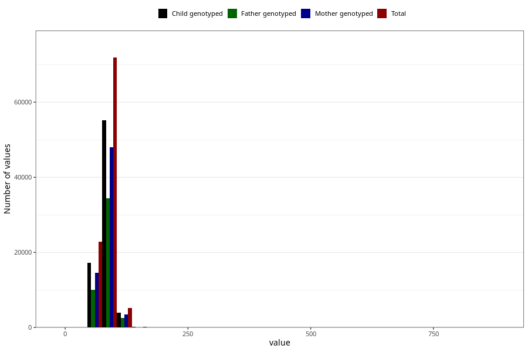

# father_weight
Variable mapping to questionnaire: q1m, question AA89.
.
- Number of values:

| Value | Total | Child genotyped | Mother genotyped | Father genotyped |
| ----- | ----- | --------------- | ---------------- | ---------------- |
| Missing | 13431 | 6902 | 5690 | 3253 |
| 0 | 3 | 2 | 2 |1 |
| 1 | 1 | 1 | 1 |0 |
| 6 | 3 | 3 | 2 |1 |
| 7 | 6 | 4 | 4 |3 |
| 8 | 14 | 10 | 9 |4 |
| 9 | 9 | 7 | 7 |4 |
| 10 | 1 | 1 | 1 |1 |
| 11 | 2 | 1 | 1 |0 |
| 13 | 3 | 2 | 0 |0 |
| 15 | 1 | 0 | 0 |0 |
| 45 | 2 | 1 | 0 |0 |
| 46 | 3 | 1 | 1 |0 |
| 47 | 1 | 0 | 0 |0 |
| 48 | 2 | 2 | 1 |0 |
| 49 | 1 | 1 | 0 |0 |
| 50 | 21 | 12 | 8 |4 |
| 51 | 6 | 5 | 2 |2 |
| 52 | 17 | 10 | 5 |5 |
| 53 | 18 | 13 | 11 |7 |
| 54 | 14 | 10 | 9 |9 |
| 55 | 70 | 46 | 34 |18 |
| 56 | 45 | 33 | 19 |13 |
| 57 | 47 | 28 | 19 |11 |
| 58 | 91 | 58 | 42 |24 |
| 59 | 48 | 33 | 25 |18 |
| 59.5 | 1 | 0 | 0 |0 |
| 60 | 533 | 396 | 318 |204 |
| 61 | 98 | 66 | 57 |37 |
| 62 | 357 | 259 | 204 |130 |
| 62.2 | 1 | 0 | 0 |0 |
| 63 | 401 | 295 | 231 |152 |
| 64 | 366 | 271 | 214 |142 |
| 64.5 | 1 | 1 | 1 |1 |
| 65 | 1413 | 1049 | 862 |572 |
| 65.3 | 2 | 2 | 2 |2 |
| 66 | 381 | 300 | 238 |171 |
| 66.5 | 3 | 2 | 2 |2 |
| 67 | 849 | 645 | 540 |387 |
| 67.5 | 2 | 1 | 1 |1 |
| 68 | 1063 | 807 | 676 |487 |
| 69 | 590 | 447 | 378 |273 |
| 69.5 | 2 | 2 | 2 |2 |
| 69.8 | 1 | 1 | 1 |1 |
| 70 | 3751 | 2837 | 2391 |1580 |
| 70.8 | 1 | 1 | 1 |1 |
| 71 | 682 | 514 | 433 |309 |
| 71.3 | 1 | 1 | 1 |1 |
| 71.5 | 1 | 1 | 1 |1 |
| 72 | 2261 | 1723 | 1459 |1038 |
| 72.4 | 1 | 0 | 0 |0 |
| 72.5 | 5 | 3 | 3 |2 |
| 72.9 | 1 | 1 | 1 |0 |
| 73 | 2008 | 1538 | 1337 |971 |
| 73.4 | 4 | 4 | 2 |1 |
| 73.5 | 2 | 2 | 1 |2 |
| 74 | 1793 | 1356 | 1155 |822 |
| 74.1 | 1 | 1 | 1 |1 |
| 74.3 | 1 | 0 | 0 |0 |
| 74.4 | 1 | 0 | 0 |0 |
| 74.5 | 6 | 1 | 0 |0 |
| 75 | 5836 | 4397 | 3807 |2588 |
| 75.4 | 2 | 2 | 2 |2 |
| 75.5 | 1 | 1 | 1 |1 |
| 75.8 | 1 | 0 | 0 |0 |
| 76 | 2082 | 1618 | 1404 |1022 |
| 76.5 | 7 | 3 | 3 |3 |
| 76.8 | 1 | 1 | 1 |0 |
| 77 | 1786 | 1366 | 1175 |875 |
| 77.1 | 1 | 1 | 1 |1 |
| 77.9 | 1 | 1 | 1 |1 |
| 78 | 3421 | 2607 | 2235 |1564 |
| 78.3 | 1 | 1 | 1 |1 |
| 78.4 | 1 | 0 | 0 |0 |
| 78.5 | 7 | 3 | 1 |1 |
| 79 | 1497 | 1125 | 959 |710 |
| 79.5 | 1 | 1 | 1 |1 |
| 80 | 8739 | 6682 | 5748 |3970 |
| 80.1 | 1 | 1 | 1 |0 |
| 80.3 | 1 | 0 | 0 |0 |
| 80.4 | 1 | 1 | 1 |1 |
| 80.5 | 1 | 1 | 1 |1 |
| 80.6 | 2 | 2 | 1 |2 |
| 81 | 1194 | 909 | 789 |606 |
| 81.1 | 1 | 1 | 1 |1 |
| 81.3 | 2 | 1 | 1 |1 |
| 81.5 | 1 | 1 | 1 |1 |
| 82 | 3560 | 2742 | 2421 |1765 |
| 82.5 | 7 | 3 | 3 |2 |
| 82.9 | 2 | 2 | 2 |2 |
| 83 | 3006 | 2316 | 2025 |1486 |
| 83.2 | 1 | 1 | 0 |1 |
| 83.5 | 2 | 2 | 1 |1 |
| 83.8 | 1 | 1 | 1 |0 |
| 84 | 2495 | 1951 | 1689 |1238 |
| 84.2 | 1 | 1 | 1 |1 |
| 84.3 | 1 | 0 | 0 |0 |
| 84.5 | 6 | 4 | 4 |2 |
| 84.8 | 1 | 1 | 1 |1 |
| 85 | 7172 | 5473 | 4728 |3303 |
| 85.2 | 1 | 0 | 0 |0 |
| 85.4 | 1 | 0 | 0 |0 |
| 85.5 | 2 | 1 | 1 |1 |
| 86 | 2121 | 1642 | 1449 |1060 |
| 86.5 | 4 | 4 | 3 |1 |
| 87 | 2238 | 1690 | 1457 |1055 |
| 87.4 | 1 | 1 | 1 |1 |
| 87.5 | 2 | 1 | 1 |1 |
| 88 | 2256 | 1731 | 1516 |1148 |
| 88.2 | 1 | 0 | 0 |0 |
| 88.4 | 1 | 1 | 0 |0 |
| 88.5 | 1 | 1 | 0 |0 |
| 88.6 | 2 | 1 | 1 |1 |
| 89 | 1251 | 955 | 845 |629 |
| 89.2 | 1 | 1 | 1 |1 |
| 89.4 | 1 | 0 | 0 |0 |
| 89.5 | 2 | 1 | 1 |1 |
| 90 | 7506 | 5759 | 5038 |3497 |
| 90.2 | 1 | 1 | 0 |1 |
| 90.5 | 8 | 6 | 4 |6 |
| 91 | 679 | 509 | 435 |330 |
| 91.3 | 1 | 1 | 0 |1 |
| 91.5 | 6 | 4 | 4 |3 |
| 92 | 2185 | 1677 | 1465 |1050 |
| 92.4 | 2 | 2 | 1 |2 |
| 92.5 | 2 | 1 | 1 |1 |
| 93 | 1787 | 1387 | 1202 |887 |
| 93.2 | 1 | 1 | 1 |0 |
| 93.3 | 1 | 1 | 1 |1 |
| 93.5 | 4 | 3 | 2 |3 |
| 94 | 1297 | 1003 | 863 |639 |
| 94.5 | 6 | 3 | 3 |3 |
| 95 | 4490 | 3491 | 3062 |2136 |
| 95.5 | 1 | 1 | 1 |1 |
| 96 | 1144 | 876 | 779 |573 |
| 96.2 | 1 | 1 | 1 |1 |
| 96.3 | 1 | 0 | 0 |0 |
| 96.5 | 1 | 0 | 0 |0 |
| 96.6 | 1 | 1 | 1 |1 |
| 97 | 1059 | 812 | 698 |529 |
| 97.4 | 1 | 1 | 1 |1 |
| 97.5 | 1 | 1 | 1 |1 |
| 98 | 1384 | 1039 | 908 |658 |
| 98.1 | 1 | 1 | 1 |1 |
| 98.5 | 1 | 1 | 1 |1 |
| 98.6 | 1 | 1 | 1 |0 |
| 99 | 552 | 423 | 367 |276 |
| 99.5 | 1 | 1 | 1 |1 |
| 100 | 3656 | 2823 | 2496 |1722 |
| 100.7 | 1 | 1 | 1 |1 |
| 100.8 | 1 | 1 | 1 |1 |
| 101 | 207 | 143 | 127 |91 |
| 101.5 | 1 | 1 | 1 |1 |
| 102 | 563 | 443 | 391 |298 |
| 103 | 503 | 391 | 336 |250 |
| 103.3 | 1 | 1 | 1 |0 |
| 103.5 | 1 | 0 | 0 |0 |
| 103.6 | 1 | 0 | 0 |0 |
| 104 | 433 | 325 | 278 |212 |
| 105 | 1495 | 1134 | 981 |705 |
| 106 | 281 | 202 | 183 |139 |
| 106.5 | 1 | 1 | 1 |1 |
| 107 | 285 | 213 | 190 |138 |
| 107.5 | 1 | 1 | 1 |1 |
| 108 | 326 | 245 | 216 |157 |
| 108.5 | 1 | 1 | 1 |1 |
| 109 | 116 | 89 | 77 |52 |
| 110 | 1405 | 1060 | 943 |659 |
| 111 | 70 | 51 | 47 |34 |
| 112 | 240 | 182 | 163 |126 |
| 112.5 | 1 | 1 | 1 |1 |
| 113 | 119 | 93 | 87 |72 |
| 114 | 91 | 73 | 66 |52 |
| 115 | 708 | 540 | 473 |347 |
| 115.3 | 2 | 2 | 2 |2 |
| 115.5 | 1 | 1 | 0 |0 |
| 116 | 88 | 65 | 56 |42 |
| 117 | 95 | 69 | 62 |39 |
| 118 | 115 | 84 | 71 |46 |
| 119 | 33 | 26 | 21 |13 |
| 120 | 595 | 465 | 402 |273 |
| 121 | 11 | 6 | 5 |5 |
| 122 | 51 | 36 | 34 |23 |
| 122.4 | 1 | 1 | 1 |1 |
| 123 | 45 | 38 | 35 |28 |
| 124 | 21 | 15 | 12 |11 |
| 125 | 196 | 138 | 119 |94 |
| 126 | 17 | 13 | 12 |10 |
| 127 | 20 | 17 | 16 |11 |
| 128 | 28 | 19 | 15 |12 |
| 129 | 9 | 7 | 7 |6 |
| 130 | 211 | 158 | 131 |94 |
| 131 | 1 | 1 | 1 |1 |
| 132 | 11 | 10 | 8 |7 |
| 132.6 | 1 | 1 | 1 |1 |
| 133 | 9 | 6 | 5 |3 |
| 134 | 6 | 5 | 4 |3 |
| 135 | 53 | 42 | 35 |29 |
| 136 | 9 | 5 | 4 |3 |
| 137 | 3 | 2 | 2 |2 |
| 138 | 11 | 10 | 8 |9 |
| 139 | 2 | 1 | 1 |0 |
| 140 | 57 | 39 | 35 |15 |
| 141 | 1 | 1 | 1 |1 |
| 142 | 3 | 3 | 2 |2 |
| 143 | 5 | 4 | 3 |1 |
| 144 | 4 | 3 | 3 |3 |
| 145 | 14 | 10 | 8 |5 |
| 146 | 1 | 0 | 0 |0 |
| 147 | 1 | 1 | 1 |1 |
| 148 | 3 | 2 | 2 |0 |
| 150 | 34 | 31 | 22 |15 |
| 152 | 2 | 2 | 2 |2 |
| 154 | 1 | 1 | 1 |1 |
| 155 | 5 | 3 | 1 |0 |
| 156 | 1 | 0 | 0 |0 |
| 158 | 1 | 1 | 1 |0 |
| 159 | 1 | 1 | 1 |0 |
| 160 | 6 | 4 | 4 |3 |
| 161 | 1 | 0 | 0 |0 |
| 163 | 2 | 2 | 2 |2 |
| 164 | 1 | 0 | 0 |0 |
| 170 | 6 | 1 | 1 |1 |
| 172 | 1 | 1 | 1 |1 |
| 176 | 4 | 4 | 4 |2 |
| 177 | 1 | 1 | 0 |0 |
| 180 | 6 | 4 | 4 |3 |
| 183 | 1 | 1 | 1 |1 |
| 186 | 1 | 1 | 0 |1 |
| 195 | 2 | 0 | 0 |0 |
| 199 | 1 | 0 | 0 |0 |
| 200 | 1 | 1 | 0 |0 |
| 215 | 1 | 0 | 0 |0 |
| 874 | 1 | 1 | 0 |0 |

