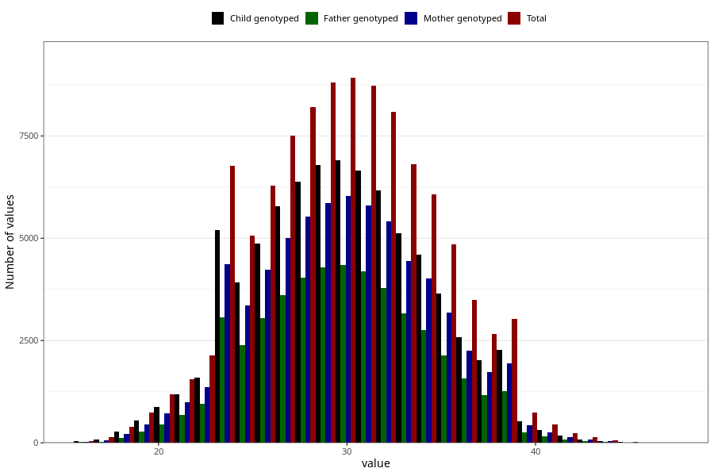

# mother_age_15w
Variable mapping to questionnaire: q1m, question MOR_ALDERUTFYLT_S1.
.
- Number of values:

| Value | Total | Child genotyped | Mother genotyped | Father genotyped |
| ----- | ----- | --------------- | ---------------- | ---------------- |
| Missing | 10478 | 4670 | 3785 | 2268 |
| 16 | 48 | 39 | 29 |17 |
| 17 | 135 | 90 | 70 |29 |
| 18 | 398 | 274 | 220 |125 |
| 19 | 738 | 546 | 443 |275 |
| 20 | 1193 | 882 | 725 |459 |
| 21 | 1551 | 1180 | 1000 |684 |
| 22 | 2144 | 1598 | 1355 |958 |
| 23 | 2944 | 2285 | 1909 |1345 |
| 24 | 3824 | 2922 | 2466 |1721 |
| 25 | 5068 | 3929 | 3362 |2395 |
| 26 | 6296 | 4872 | 4222 |3047 |
| 27 | 7501 | 5791 | 5004 |3603 |
| 28 | 8199 | 6377 | 5528 |4041 |
| 29 | 8800 | 6781 | 5856 |4299 |
| 30 | 8920 | 6903 | 6036 |4356 |
| 31 | 8727 | 6649 | 5799 |4187 |
| 32 | 8088 | 6171 | 5409 |3783 |
| 33 | 6814 | 5120 | 4435 |3156 |
| 34 | 6067 | 4598 | 4022 |2749 |
| 35 | 4848 | 3641 | 3177 |2141 |
| 36 | 3496 | 2584 | 2257 |1567 |
| 37 | 2655 | 2020 | 1738 |1159 |
| 38 | 1802 | 1346 | 1156 |745 |
| 39 | 1227 | 918 | 793 |520 |
| 40 | 736 | 525 | 439 |262 |
| 41 | 453 | 314 | 262 |161 |
| 42 | 237 | 178 | 143 |86 |
| 43 | 137 | 90 | 75 |45 |
| 44 | 61 | 40 | 35 |22 |
| 45 | 22 | 16 | 14 |8 |
| 46 | 11 | 5 | 5 |5 |
| 47 | 5 | 1 | 0 |0 |

