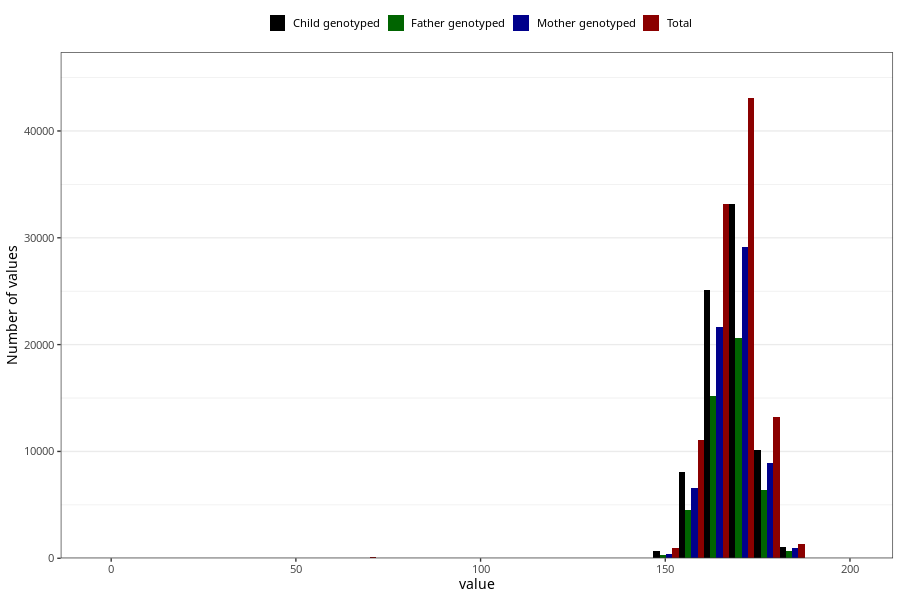

# mother_height
Variable mapping to questionnaire: mfr, question MORS_HOYDE.
.
- Number of values:

| Value | Total | Child genotyped | Mother genotyped | Father genotyped |
| ----- | ----- | --------------- | ---------------- | ---------------- |
| Missing | 10508 | 4993 | 4057 | 2424 |
| 0 | 4 | 2 | 1 |0 |
| 1 | 4 | 3 | 2 |2 |
| 5 | 2 | 0 | 0 |0 |
| 15 | 4 | 2 | 1 |1 |
| 16 | 17 | 11 | 9 |6 |
| 17 | 7 | 7 | 6 |4 |
| 50 | 1 | 0 | 0 |0 |
| 53 | 1 | 1 | 0 |0 |
| 56 | 2 | 1 | 1 |0 |
| 57 | 1 | 1 | 0 |0 |
| 58 | 4 | 4 | 3 |1 |
| 59 | 1 | 1 | 1 |0 |
| 60 | 8 | 5 | 4 |2 |
| 61 | 4 | 3 | 2 |0 |
| 62 | 13 | 10 | 4 |4 |
| 63 | 7 | 4 | 2 |1 |
| 64 | 9 | 5 | 4 |3 |
| 65 | 9 | 7 | 5 |5 |
| 66 | 3 | 3 | 1 |1 |
| 67 | 13 | 9 | 8 |4 |
| 68 | 12 | 5 | 5 |3 |
| 69 | 10 | 8 | 6 |4 |
| 70 | 18 | 16 | 16 |9 |
| 71 | 15 | 11 | 11 |7 |
| 72 | 19 | 15 | 15 |7 |
| 73 | 9 | 6 | 4 |5 |
| 74 | 9 | 7 | 6 |2 |
| 75 | 4 | 2 | 2 |1 |
| 76 | 4 | 4 | 4 |2 |
| 77 | 1 | 1 | 1 |0 |
| 78 | 4 | 1 | 1 |1 |
| 81 | 3 | 2 | 2 |1 |
| 95 | 1 | 1 | 1 |0 |
| 108 | 1 | 1 | 1 |1 |
| 116 | 3 | 1 | 1 |0 |
| 123 | 1 | 0 | 0 |0 |
| 136 | 1 | 1 | 1 |1 |
| 138 | 1 | 1 | 0 |0 |
| 140 | 3 | 1 | 0 |0 |
| 142 | 1 | 0 | 0 |0 |
| 143 | 1 | 0 | 0 |0 |
| 144 | 4 | 3 | 0 |0 |
| 145 | 16 | 9 | 0 |1 |
| 146 | 10 | 8 | 2 |2 |
| 147 | 24 | 12 | 5 |4 |
| 148 | 41 | 25 | 16 |10 |
| 149 | 35 | 21 | 11 |6 |
| 150 | 247 | 161 | 70 |42 |
| 151 | 66 | 49 | 20 |13 |
| 152 | 276 | 178 | 101 |78 |
| 153 | 291 | 209 | 138 |107 |
| 154 | 314 | 215 | 153 |110 |
| 155 | 613 | 441 | 322 |230 |
| 156 | 692 | 490 | 349 |236 |
| 157 | 924 | 653 | 503 |336 |
| 158 | 1900 | 1393 | 1119 |760 |
| 159 | 1198 | 878 | 713 |511 |
| 160 | 5424 | 4026 | 3388 |2367 |
| 161 | 1684 | 1272 | 1081 |739 |
| 162 | 3786 | 2869 | 2448 |1719 |
| 163 | 5358 | 4006 | 3443 |2438 |
| 164 | 5233 | 3967 | 3425 |2390 |
| 165 | 7480 | 5649 | 4838 |3406 |
| 166 | 2971 | 2283 | 2008 |1401 |
| 167 | 6635 | 5052 | 4422 |3127 |
| 168 | 9239 | 7070 | 6196 |4349 |
| 169 | 5134 | 3953 | 3446 |2413 |
| 170 | 10270 | 7866 | 6909 |4933 |
| 171 | 3168 | 2448 | 2160 |1547 |
| 172 | 6159 | 4788 | 4241 |3014 |
| 173 | 4953 | 3841 | 3364 |2402 |
| 174 | 4148 | 3212 | 2849 |1992 |
| 175 | 3968 | 3063 | 2683 |1923 |
| 176 | 2817 | 2155 | 1883 |1363 |
| 177 | 1425 | 1086 | 974 |710 |
| 178 | 2339 | 1822 | 1618 |1117 |
| 179 | 876 | 670 | 587 |436 |
| 180 | 1793 | 1314 | 1171 |839 |
| 181 | 404 | 310 | 270 |191 |
| 182 | 407 | 307 | 278 |197 |
| 183 | 263 | 210 | 191 |123 |
| 184 | 135 | 96 | 83 |64 |
| 185 | 89 | 66 | 58 |39 |
| 186 | 37 | 27 | 26 |16 |
| 187 | 18 | 15 | 11 |10 |
| 188 | 9 | 7 | 6 |3 |
| 189 | 2 | 1 | 1 |1 |
| 190 | 3 | 2 | 1 |1 |
| 196 | 1 | 1 | 0 |0 |
| 198 | 1 | 0 | 0 |0 |

