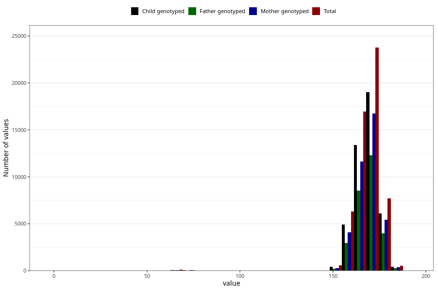

# mother_height_3y
Variable mapping to questionnaire: q6, question GG502.
.
- Number of values:

| Value | Total | Child genotyped | Mother genotyped | Father genotyped |
| ----- | ----- | --------------- | ---------------- | ---------------- |
| Missing | 57529 | 38862 | 33040 | 21778 |
| 1 | 3 | 2 | 2 |2 |
| 16 | 3 | 3 | 2 |2 |
| 17 | 1 | 0 | 0 |0 |
| 51 | 1 | 1 | 1 |1 |
| 53 | 1 | 1 | 1 |1 |
| 55 | 2 | 2 | 2 |0 |
| 57 | 1 | 1 | 1 |0 |
| 58 | 2 | 2 | 2 |1 |
| 59 | 3 | 2 | 1 |0 |
| 60 | 12 | 9 | 9 |5 |
| 61 | 2 | 2 | 2 |2 |
| 62 | 12 | 11 | 9 |7 |
| 63 | 16 | 11 | 11 |5 |
| 64 | 10 | 9 | 8 |6 |
| 65 | 12 | 10 | 10 |9 |
| 66 | 5 | 5 | 4 |4 |
| 67 | 15 | 10 | 8 |7 |
| 68 | 20 | 14 | 14 |7 |
| 69 | 17 | 14 | 14 |9 |
| 70 | 10 | 9 | 9 |8 |
| 71 | 13 | 13 | 12 |10 |
| 72 | 17 | 15 | 14 |8 |
| 73 | 14 | 11 | 10 |9 |
| 74 | 8 | 6 | 5 |1 |
| 75 | 6 | 4 | 4 |0 |
| 76 | 2 | 2 | 2 |1 |
| 77 | 3 | 2 | 2 |2 |
| 78 | 2 | 2 | 2 |2 |
| 80 | 2 | 1 | 1 |0 |
| 81 | 2 | 2 | 2 |1 |
| 83 | 1 | 1 | 1 |1 |
| 97 | 1 | 0 | 0 |0 |
| 105 | 1 | 0 | 0 |0 |
| 121 | 1 | 1 | 1 |0 |
| 128 | 1 | 1 | 1 |0 |
| 143 | 2 | 2 | 1 |1 |
| 144 | 1 | 0 | 0 |0 |
| 145 | 5 | 3 | 2 |1 |
| 146 | 4 | 3 | 1 |1 |
| 147 | 1 | 1 | 1 |0 |
| 148 | 14 | 8 | 4 |4 |
| 149 | 18 | 13 | 8 |4 |
| 150 | 109 | 80 | 46 |27 |
| 151 | 30 | 24 | 10 |9 |
| 152 | 128 | 91 | 60 |50 |
| 153 | 146 | 115 | 79 |58 |
| 154 | 141 | 111 | 91 |72 |
| 155 | 266 | 190 | 147 |114 |
| 156 | 314 | 236 | 165 |120 |
| 157 | 451 | 338 | 277 |192 |
| 158 | 975 | 775 | 645 |456 |
| 159 | 638 | 495 | 420 |309 |
| 160 | 2735 | 2136 | 1819 |1350 |
| 161 | 911 | 726 | 634 |426 |
| 162 | 2002 | 1564 | 1346 |976 |
| 163 | 2934 | 2309 | 2005 |1486 |
| 164 | 2826 | 2219 | 1938 |1395 |
| 165 | 3930 | 3066 | 2626 |1943 |
| 166 | 1544 | 1229 | 1085 |803 |
| 167 | 3729 | 2991 | 2628 |1940 |
| 168 | 5069 | 4023 | 3521 |2550 |
| 169 | 2939 | 2344 | 2030 |1461 |
| 170 | 5490 | 4362 | 3846 |2904 |
| 171 | 1797 | 1439 | 1266 |925 |
| 172 | 3375 | 2744 | 2412 |1772 |
| 173 | 2826 | 2277 | 2021 |1526 |
| 174 | 2264 | 1853 | 1628 |1182 |
| 175 | 2173 | 1727 | 1534 |1126 |
| 176 | 1562 | 1252 | 1090 |834 |
| 177 | 803 | 624 | 564 |415 |
| 178 | 1371 | 1104 | 977 |714 |
| 179 | 506 | 407 | 355 |255 |
| 180 | 1036 | 802 | 722 |530 |
| 181 | 259 | 205 | 184 |131 |
| 182 | 226 | 176 | 156 |111 |
| 183 | 137 | 106 | 97 |65 |
| 184 | 75 | 54 | 44 |33 |
| 185 | 49 | 41 | 36 |28 |
| 186 | 32 | 26 | 23 |18 |
| 187 | 14 | 14 | 12 |8 |
| 188 | 6 | 4 | 3 |1 |
| 189 | 3 | 3 | 2 |2 |
| 190 | 3 | 2 | 1 |1 |
| 191 | 1 | 0 | 0 |0 |
| 192 | 2 | 0 | 0 |0 |

