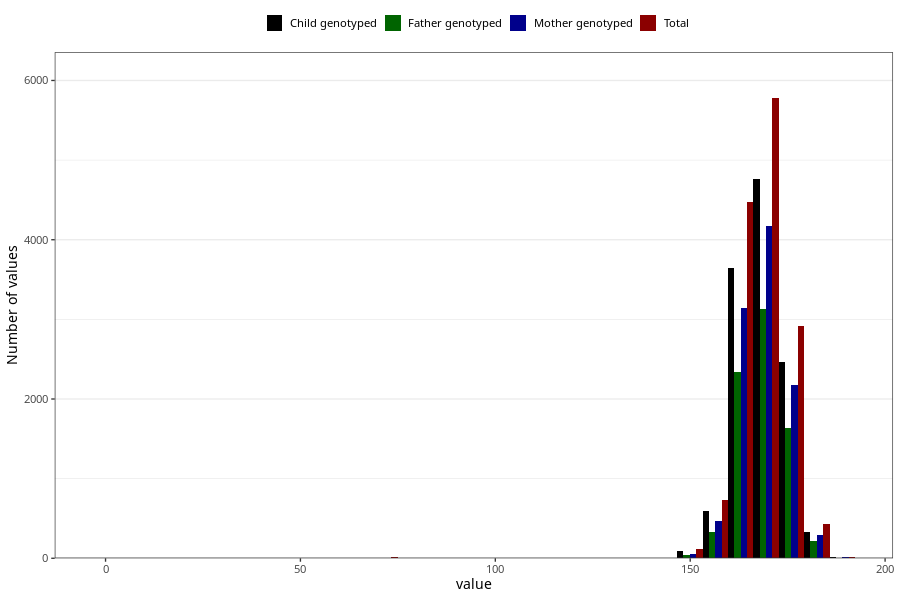

# mother_height_5y
Variable mapping to questionnaire: q7, question LL338.
.
- Number of values:

| Value | Total | Child genotyped | Mother genotyped | Father genotyped |
| ----- | ----- | --------------- | ---------------- | ---------------- |
| Missing | 99119 | 71435 | 61418 | 42486 |
| 1 | 2 | 2 | 1 |0 |
| 63 | 1 | 0 | 0 |0 |
| 65 | 2 | 2 | 2 |2 |
| 66 | 1 | 0 | 0 |0 |
| 67 | 1 | 1 | 1 |1 |
| 68 | 2 | 2 | 2 |2 |
| 69 | 1 | 0 | 0 |0 |
| 70 | 3 | 3 | 2 |2 |
| 71 | 2 | 2 | 2 |2 |
| 72 | 2 | 2 | 2 |2 |
| 73 | 1 | 1 | 1 |1 |
| 74 | 1 | 1 | 0 |1 |
| 78 | 1 | 1 | 1 |1 |
| 80 | 1 | 1 | 0 |1 |
| 100 | 1 | 1 | 0 |0 |
| 104 | 1 | 0 | 0 |0 |
| 105 | 2 | 2 | 1 |1 |
| 108 | 2 | 1 | 1 |1 |
| 109 | 1 | 1 | 0 |0 |
| 110 | 3 | 3 | 2 |2 |
| 115 | 1 | 1 | 0 |1 |
| 116 | 1 | 1 | 1 |0 |
| 117 | 1 | 1 | 1 |1 |
| 119 | 1 | 0 | 0 |0 |
| 120 | 3 | 3 | 3 |2 |
| 138 | 1 | 1 | 1 |1 |
| 143 | 1 | 1 | 0 |1 |
| 146 | 1 | 0 | 0 |0 |
| 147 | 2 | 2 | 1 |0 |
| 148 | 3 | 1 | 0 |0 |
| 149 | 5 | 3 | 1 |0 |
| 150 | 27 | 18 | 9 |5 |
| 151 | 9 | 7 | 2 |1 |
| 152 | 33 | 23 | 15 |16 |
| 153 | 37 | 31 | 21 |18 |
| 154 | 36 | 29 | 23 |18 |
| 155 | 64 | 53 | 40 |29 |
| 156 | 97 | 83 | 63 |43 |
| 157 | 134 | 101 | 82 |66 |
| 158 | 255 | 205 | 170 |119 |
| 159 | 150 | 119 | 93 |61 |
| 160 | 756 | 613 | 536 |384 |
| 161 | 246 | 203 | 164 |122 |
| 162 | 483 | 404 | 346 |261 |
| 163 | 810 | 631 | 549 |411 |
| 164 | 755 | 627 | 553 |399 |
| 165 | 1014 | 821 | 695 |533 |
| 166 | 404 | 340 | 301 |226 |
| 167 | 940 | 770 | 678 |508 |
| 168 | 1312 | 1079 | 954 |707 |
| 169 | 774 | 638 | 556 |406 |
| 170 | 1382 | 1137 | 991 |751 |
| 171 | 483 | 403 | 353 |279 |
| 172 | 887 | 740 | 646 |478 |
| 173 | 680 | 579 | 507 |384 |
| 174 | 599 | 514 | 462 |348 |
| 175 | 508 | 412 | 363 |263 |
| 176 | 417 | 347 | 309 |238 |
| 177 | 196 | 161 | 144 |111 |
| 178 | 378 | 325 | 289 |218 |
| 179 | 143 | 125 | 104 |74 |
| 180 | 255 | 201 | 182 |135 |
| 181 | 62 | 47 | 42 |30 |
| 182 | 54 | 39 | 33 |29 |
| 183 | 29 | 22 | 20 |13 |
| 184 | 18 | 13 | 12 |9 |
| 185 | 10 | 8 | 8 |7 |
| 186 | 8 | 5 | 4 |2 |
| 187 | 2 | 2 | 2 |1 |
| 188 | 2 | 1 | 1 |1 |
| 189 | 1 | 1 | 1 |1 |
| 190 | 3 | 3 | 2 |2 |

