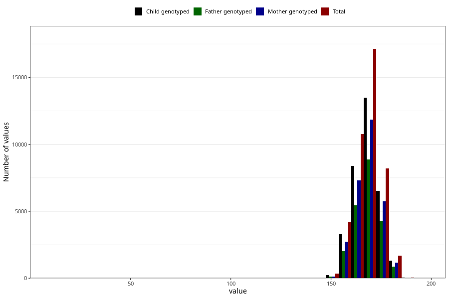

# mother_height_8y
Variable mapping to questionnaire: q9, question NN283.
.
- Number of values:

| Value | Total | Child genotyped | Mother genotyped | Father genotyped |
| ----- | ----- | --------------- | ---------------- | ---------------- |
| Missing | 71242 | 50026 | 42812 | 28586 |
| 15 | 1 | 1 | 1 |1 |
| 16 | 3 | 2 | 2 |1 |
| 17 | 4 | 2 | 2 |0 |
| 57 | 1 | 1 | 0 |0 |
| 58 | 1 | 1 | 1 |1 |
| 61 | 2 | 1 | 1 |0 |
| 63 | 1 | 1 | 1 |1 |
| 65 | 3 | 3 | 3 |1 |
| 67 | 1 | 1 | 1 |1 |
| 68 | 4 | 2 | 2 |2 |
| 69 | 4 | 2 | 2 |1 |
| 70 | 3 | 2 | 2 |2 |
| 71 | 1 | 1 | 1 |1 |
| 72 | 1 | 1 | 1 |1 |
| 73 | 1 | 1 | 1 |1 |
| 74 | 3 | 3 | 2 |1 |
| 75 | 1 | 0 | 0 |0 |
| 100 | 1 | 1 | 1 |1 |
| 114 | 1 | 1 | 1 |1 |
| 121 | 1 | 1 | 1 |1 |
| 125 | 1 | 0 | 0 |0 |
| 127 | 1 | 0 | 0 |0 |
| 128 | 1 | 1 | 1 |0 |
| 140 | 1 | 1 | 0 |0 |
| 143 | 3 | 3 | 0 |0 |
| 144 | 1 | 0 | 0 |0 |
| 145 | 1 | 1 | 1 |0 |
| 146 | 4 | 3 | 1 |1 |
| 147 | 6 | 6 | 4 |1 |
| 148 | 7 | 4 | 2 |2 |
| 149 | 17 | 11 | 6 |3 |
| 150 | 85 | 61 | 30 |19 |
| 151 | 18 | 14 | 7 |6 |
| 152 | 93 | 69 | 39 |33 |
| 153 | 111 | 80 | 54 |46 |
| 154 | 104 | 82 | 69 |52 |
| 155 | 204 | 159 | 118 |88 |
| 156 | 254 | 191 | 143 |104 |
| 157 | 410 | 307 | 254 |195 |
| 158 | 700 | 561 | 459 |339 |
| 159 | 488 | 375 | 309 |225 |
| 160 | 2037 | 1595 | 1365 |1016 |
| 161 | 725 | 579 | 505 |356 |
| 162 | 1545 | 1205 | 1036 |772 |
| 163 | 2160 | 1686 | 1461 |1098 |
| 164 | 2210 | 1738 | 1524 |1121 |
| 165 | 3001 | 2319 | 1989 |1492 |
| 166 | 1112 | 876 | 789 |597 |
| 167 | 2857 | 2230 | 1963 |1486 |
| 168 | 3914 | 3080 | 2675 |1959 |
| 169 | 2254 | 1785 | 1554 |1189 |
| 170 | 4043 | 3158 | 2787 |2129 |
| 171 | 1417 | 1123 | 995 |740 |
| 172 | 2644 | 2116 | 1857 |1377 |
| 173 | 2079 | 1676 | 1459 |1099 |
| 174 | 1717 | 1402 | 1243 |917 |
| 175 | 1574 | 1247 | 1087 |811 |
| 176 | 1196 | 934 | 814 |619 |
| 177 | 590 | 468 | 419 |320 |
| 178 | 1029 | 811 | 713 |517 |
| 179 | 402 | 306 | 272 |199 |
| 180 | 733 | 574 | 512 |377 |
| 181 | 192 | 150 | 136 |97 |
| 182 | 182 | 141 | 126 |96 |
| 183 | 88 | 74 | 66 |50 |
| 184 | 46 | 36 | 33 |24 |
| 185 | 47 | 32 | 30 |24 |
| 186 | 17 | 13 | 11 |8 |
| 187 | 10 | 8 | 7 |5 |
| 188 | 5 | 4 | 3 |2 |
| 189 | 1 | 1 | 1 |1 |
| 190 | 4 | 4 | 1 |1 |
| 197 | 2 | 1 | 1 |1 |

