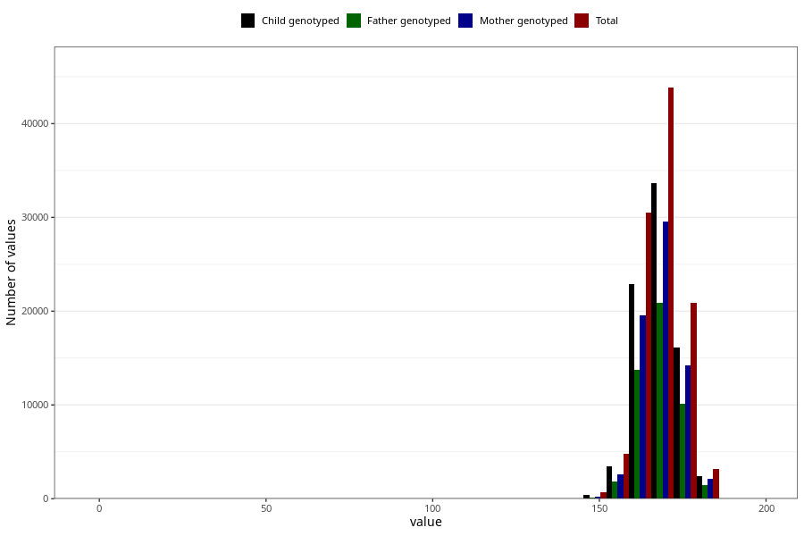

# mother_median_height
- Number of values:

| Value | Total | Child genotyped | Mother genotyped | Father genotyped |
| ----- | ----- | --------------- | ---------------- | ---------------- |
| Missing | 9353 | 4173 | 3342 | 1922 |
| 0 | 1 | 0 | 0 |0 |
| 1 | 1 | 1 | 0 |0 |
| 5 | 2 | 0 | 0 |0 |
| 15 | 1 | 1 | 0 |0 |
| 16 | 9 | 4 | 3 |1 |
| 17 | 3 | 3 | 2 |1 |
| 50 | 1 | 0 | 0 |0 |
| 53 | 1 | 1 | 0 |0 |
| 58 | 2 | 2 | 2 |0 |
| 60 | 4 | 3 | 3 |2 |
| 61 | 1 | 0 | 0 |0 |
| 62 | 7 | 7 | 2 |2 |
| 63 | 5 | 2 | 2 |1 |
| 64 | 2 | 0 | 0 |0 |
| 64.5 | 1 | 1 | 1 |0 |
| 65 | 5 | 5 | 3 |3 |
| 66 | 2 | 2 | 1 |1 |
| 67 | 3 | 1 | 1 |0 |
| 68 | 3 | 0 | 0 |0 |
| 68.5 | 1 | 0 | 0 |0 |
| 69 | 5 | 4 | 4 |3 |
| 70 | 6 | 5 | 5 |2 |
| 71 | 5 | 3 | 3 |2 |
| 72 | 12 | 9 | 9 |3 |
| 72.5 | 1 | 0 | 0 |0 |
| 73 | 5 | 3 | 2 |3 |
| 74 | 2 | 2 | 1 |0 |
| 75 | 2 | 1 | 1 |1 |
| 75.5 | 1 | 0 | 0 |0 |
| 76 | 3 | 3 | 3 |1 |
| 78 | 2 | 0 | 0 |0 |
| 81 | 1 | 1 | 1 |0 |
| 84.5 | 1 | 1 | 1 |1 |
| 85.5 | 1 | 0 | 0 |0 |
| 86 | 1 | 0 | 0 |0 |
| 86.5 | 1 | 1 | 1 |1 |
| 89 | 1 | 1 | 1 |1 |
| 91 | 1 | 1 | 1 |0 |
| 91.5 | 1 | 1 | 1 |1 |
| 92 | 2 | 2 | 1 |2 |
| 93 | 1 | 1 | 1 |1 |
| 94 | 1 | 1 | 1 |0 |
| 95 | 1 | 1 | 1 |0 |
| 95.5 | 1 | 0 | 0 |0 |
| 96.5 | 2 | 1 | 1 |1 |
| 97.5 | 1 | 1 | 1 |0 |
| 106 | 2 | 1 | 1 |0 |
| 107 | 1 | 1 | 1 |0 |
| 108 | 2 | 2 | 1 |0 |
| 109 | 1 | 1 | 1 |0 |
| 109.5 | 1 | 0 | 0 |0 |
| 110 | 9 | 6 | 5 |3 |
| 111 | 2 | 2 | 2 |2 |
| 111.5 | 1 | 1 | 1 |0 |
| 112 | 3 | 1 | 1 |1 |
| 113 | 5 | 3 | 2 |0 |
| 113.5 | 2 | 2 | 1 |1 |
| 114 | 7 | 5 | 5 |3 |
| 114.5 | 1 | 1 | 1 |0 |
| 115 | 4 | 3 | 3 |3 |
| 115.5 | 2 | 2 | 2 |2 |
| 116 | 3 | 2 | 0 |0 |
| 116.5 | 2 | 2 | 2 |1 |
| 117 | 16 | 13 | 12 |8 |
| 117.5 | 1 | 1 | 1 |1 |
| 118 | 9 | 6 | 6 |2 |
| 118.5 | 2 | 0 | 0 |0 |
| 119 | 6 | 6 | 6 |5 |
| 119.5 | 2 | 2 | 1 |1 |
| 120 | 8 | 8 | 8 |6 |
| 120.5 | 1 | 1 | 1 |1 |
| 121 | 12 | 10 | 10 |7 |
| 121.5 | 5 | 4 | 3 |2 |
| 122 | 5 | 5 | 5 |4 |
| 122.5 | 1 | 1 | 1 |0 |
| 123 | 8 | 6 | 5 |5 |
| 123.5 | 5 | 5 | 4 |1 |
| 124 | 3 | 3 | 3 |1 |
| 125 | 2 | 1 | 1 |0 |
| 125.5 | 1 | 1 | 1 |1 |
| 126 | 1 | 1 | 0 |1 |
| 126.5 | 1 | 1 | 1 |1 |
| 127 | 2 | 2 | 2 |1 |
| 128 | 2 | 1 | 1 |0 |
| 130 | 1 | 1 | 1 |0 |
| 131 | 1 | 1 | 1 |1 |
| 132.5 | 1 | 1 | 1 |1 |
| 137 | 1 | 1 | 0 |0 |
| 138 | 2 | 0 | 0 |0 |
| 140 | 3 | 1 | 0 |0 |
| 140.5 | 1 | 1 | 1 |0 |
| 142 | 1 | 0 | 0 |0 |
| 143 | 3 | 2 | 0 |0 |
| 143.5 | 1 | 1 | 0 |0 |
| 144 | 3 | 2 | 0 |1 |
| 145 | 14 | 7 | 1 |0 |
| 146 | 7 | 5 | 1 |1 |
| 147 | 22 | 13 | 5 |3 |
| 147.5 | 1 | 1 | 0 |0 |
| 148 | 36 | 20 | 10 |10 |
| 148.5 | 4 | 3 | 2 |0 |
| 149 | 32 | 20 | 12 |6 |
| 149.5 | 7 | 6 | 5 |4 |
| 150 | 225 | 149 | 62 |37 |
| 150.5 | 8 | 6 | 2 |2 |
| 151 | 66 | 44 | 20 |12 |
| 151.5 | 11 | 7 | 3 |3 |
| 152 | 261 | 168 | 93 |73 |
| 152.5 | 14 | 11 | 3 |2 |
| 153 | 271 | 191 | 129 |98 |
| 153.5 | 19 | 15 | 8 |6 |
| 154 | 310 | 212 | 149 |108 |
| 154.5 | 29 | 22 | 16 |14 |
| 155 | 559 | 398 | 294 |201 |
| 155.5 | 39 | 34 | 22 |19 |
| 156 | 652 | 449 | 312 |214 |
| 156.5 | 63 | 51 | 41 |23 |
| 157 | 866 | 608 | 480 |323 |
| 157.5 | 104 | 80 | 61 |45 |
| 158 | 1785 | 1307 | 1052 |714 |
| 158.5 | 117 | 89 | 74 |48 |
| 159 | 1166 | 840 | 681 |482 |
| 159.5 | 200 | 161 | 136 |98 |
| 160 | 5104 | 3762 | 3166 |2208 |
| 160.5 | 167 | 129 | 109 |81 |
| 161 | 1631 | 1239 | 1045 |707 |
| 161.5 | 236 | 180 | 155 |100 |
| 162 | 3473 | 2621 | 2234 |1572 |
| 162.5 | 372 | 294 | 244 |179 |
| 163 | 5030 | 3743 | 3224 |2284 |
| 163.5 | 426 | 331 | 278 |189 |
| 164 | 4991 | 3763 | 3260 |2258 |
| 164.5 | 502 | 392 | 338 |252 |
| 165 | 6934 | 5222 | 4447 |3147 |
| 165.5 | 289 | 228 | 197 |145 |
| 166 | 2827 | 2172 | 1921 |1349 |
| 166.5 | 389 | 297 | 254 |176 |
| 167 | 6257 | 4739 | 4160 |2943 |
| 167.5 | 584 | 466 | 410 |276 |
| 168 | 8702 | 6658 | 5820 |4093 |
| 168.5 | 491 | 379 | 325 |207 |
| 169 | 4888 | 3778 | 3282 |2306 |
| 169.5 | 534 | 411 | 360 |262 |
| 170 | 9598 | 7309 | 6424 |4604 |
| 170.5 | 322 | 267 | 239 |167 |
| 171 | 3150 | 2427 | 2154 |1538 |
| 171.5 | 331 | 266 | 237 |163 |
| 172 | 5759 | 4454 | 3932 |2789 |
| 172.5 | 425 | 348 | 301 |218 |
| 173 | 4617 | 3583 | 3144 |2251 |
| 173.5 | 387 | 321 | 285 |202 |
| 174 | 3889 | 3004 | 2667 |1859 |
| 174.5 | 270 | 207 | 186 |119 |
| 175 | 3691 | 2825 | 2477 |1786 |
| 175.5 | 237 | 190 | 166 |122 |
| 176 | 2631 | 2011 | 1763 |1290 |
| 176.5 | 153 | 115 | 104 |70 |
| 177 | 1357 | 1038 | 949 |690 |
| 177.5 | 122 | 91 | 78 |49 |
| 178 | 2181 | 1683 | 1488 |1029 |
| 178.5 | 107 | 89 | 80 |56 |
| 179 | 817 | 619 | 540 |399 |
| 179.5 | 94 | 77 | 64 |46 |
| 180 | 1718 | 1260 | 1124 |801 |
| 180.5 | 37 | 26 | 21 |13 |
| 181 | 405 | 311 | 278 |197 |
| 181.5 | 26 | 17 | 14 |9 |
| 182 | 395 | 295 | 264 |192 |
| 182.5 | 18 | 15 | 13 |9 |
| 183 | 242 | 193 | 178 |113 |
| 183.5 | 11 | 8 | 8 |6 |
| 184 | 126 | 90 | 76 |57 |
| 184.5 | 7 | 3 | 3 |2 |
| 185 | 85 | 64 | 55 |37 |
| 185.5 | 3 | 1 | 1 |0 |
| 186 | 36 | 27 | 26 |17 |
| 186.5 | 4 | 4 | 3 |1 |
| 187 | 14 | 12 | 9 |9 |
| 187.5 | 2 | 1 | 1 |0 |
| 188 | 8 | 6 | 5 |3 |
| 189 | 1 | 1 | 1 |1 |
| 190 | 3 | 2 | 1 |1 |
| 196 | 1 | 1 | 0 |0 |

