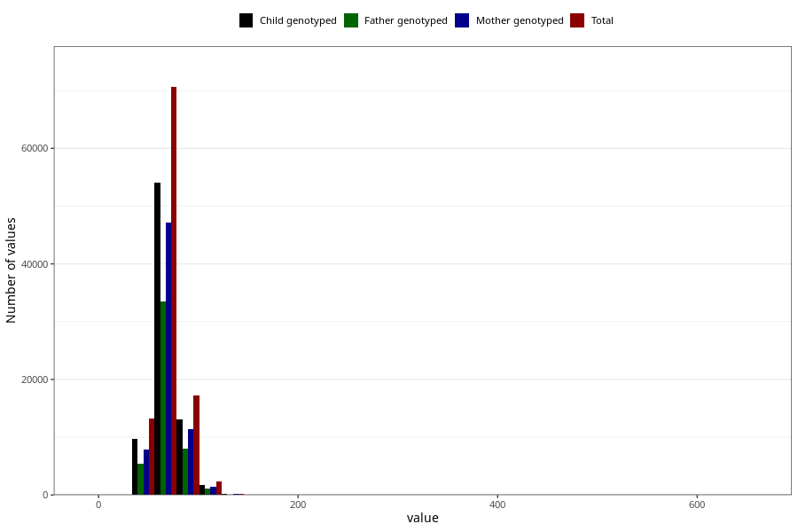

# mother_median_weight
- Number of values:

| Value | Total | Child genotyped | Mother genotyped | Father genotyped |
| ----- | ----- | --------------- | ---------------- | ---------------- |
| Missing | 9991 | 4598 | 3718 | 2156 |
| 0 | 1 | 0 | 0 |0 |
| 3 | 1 | 1 | 1 |0 |
| 4 | 1 | 1 | 1 |1 |
| 5 | 2 | 2 | 2 |1 |
| 5.1 | 1 | 0 | 0 |0 |
| 6 | 1 | 1 | 0 |1 |
| 7 | 2 | 2 | 2 |1 |
| 8 | 1 | 1 | 1 |1 |
| 10 | 1 | 0 | 0 |0 |
| 23.5 | 1 | 1 | 1 |0 |
| 27.5 | 1 | 1 | 1 |0 |
| 28 | 2 | 0 | 0 |0 |
| 31.25 | 1 | 1 | 0 |0 |
| 31.45 | 1 | 1 | 0 |0 |
| 31.5 | 1 | 1 | 1 |1 |
| 32 | 1 | 1 | 1 |0 |
| 32.5 | 1 | 0 | 0 |0 |
| 34 | 1 | 0 | 0 |0 |
| 34.65 | 1 | 1 | 1 |0 |
| 34.9 | 1 | 0 | 0 |0 |
| 35.5 | 1 | 1 | 1 |1 |
| 36.7 | 1 | 1 | 1 |1 |
| 37 | 3 | 0 | 0 |0 |
| 37.5 | 2 | 2 | 2 |2 |
| 37.75 | 1 | 1 | 0 |0 |
| 38 | 6 | 3 | 3 |1 |
| 39 | 6 | 4 | 2 |1 |
| 39.75 | 1 | 0 | 0 |0 |
| 40 | 21 | 12 | 4 |3 |
| 40.5 | 2 | 2 | 2 |2 |
| 40.6 | 1 | 1 | 0 |0 |
| 40.75 | 1 | 1 | 0 |0 |
| 41 | 18 | 8 | 5 |1 |
| 41.3 | 1 | 1 | 1 |1 |
| 41.5 | 3 | 2 | 1 |0 |
| 42 | 38 | 23 | 11 |5 |
| 42.15 | 1 | 1 | 0 |0 |
| 42.35 | 1 | 1 | 1 |0 |
| 42.4 | 1 | 1 | 1 |0 |
| 42.5 | 7 | 7 | 3 |3 |
| 42.7 | 1 | 1 | 0 |0 |
| 42.75 | 2 | 2 | 2 |2 |
| 43 | 49 | 33 | 15 |10 |
| 43.5 | 6 | 6 | 4 |4 |
| 43.75 | 1 | 1 | 1 |1 |
| 44 | 70 | 43 | 22 |13 |
| 44.25 | 4 | 3 | 2 |2 |
| 44.3 | 1 | 1 | 1 |1 |
| 44.35 | 1 | 1 | 1 |0 |
| 44.4 | 1 | 0 | 0 |0 |
| 44.45 | 1 | 0 | 0 |0 |
| 44.5 | 16 | 13 | 8 |6 |
| 44.6 | 1 | 0 | 0 |0 |
| 44.65 | 1 | 0 | 0 |0 |
| 44.75 | 1 | 0 | 0 |0 |
| 44.8 | 1 | 1 | 1 |1 |
| 45 | 139 | 73 | 46 |24 |
| 45.15 | 1 | 0 | 0 |0 |
| 45.3 | 1 | 1 | 1 |0 |
| 45.5 | 20 | 15 | 13 |8 |
| 45.55 | 1 | 1 | 1 |1 |
| 45.7 | 1 | 1 | 1 |1 |
| 45.75 | 2 | 1 | 1 |1 |
| 45.8 | 1 | 1 | 1 |0 |
| 45.9 | 3 | 3 | 2 |2 |
| 46 | 148 | 93 | 71 |46 |
| 46.15 | 1 | 0 | 0 |0 |
| 46.2 | 1 | 1 | 0 |0 |
| 46.25 | 4 | 3 | 3 |3 |
| 46.3 | 1 | 0 | 0 |0 |
| 46.4 | 1 | 0 | 0 |0 |
| 46.5 | 30 | 23 | 17 |12 |
| 46.7 | 1 | 0 | 0 |0 |
| 46.75 | 6 | 5 | 4 |3 |
| 46.9 | 1 | 1 | 1 |1 |
| 47 | 180 | 127 | 92 |61 |
| 47.1 | 1 | 1 | 0 |1 |
| 47.2 | 1 | 1 | 1 |1 |
| 47.25 | 7 | 5 | 4 |3 |
| 47.3 | 1 | 1 | 1 |1 |
| 47.35 | 1 | 1 | 1 |1 |
| 47.4 | 2 | 2 | 2 |0 |
| 47.5 | 52 | 40 | 28 |19 |
| 47.55 | 1 | 0 | 0 |0 |
| 47.65 | 2 | 1 | 0 |1 |
| 47.7 | 1 | 1 | 1 |1 |
| 47.75 | 6 | 6 | 6 |3 |
| 47.8 | 1 | 1 | 0 |0 |
| 47.9 | 1 | 1 | 1 |0 |
| 48 | 348 | 257 | 190 |120 |
| 48.1 | 4 | 4 | 3 |3 |
| 48.15 | 1 | 1 | 1 |0 |
| 48.2 | 1 | 1 | 1 |0 |
| 48.25 | 9 | 6 | 4 |4 |
| 48.3 | 2 | 2 | 0 |0 |
| 48.4 | 1 | 0 | 0 |0 |
| 48.45 | 1 | 1 | 1 |1 |
| 48.5 | 75 | 55 | 43 |26 |
| 48.6 | 1 | 0 | 0 |0 |
| 48.65 | 1 | 1 | 0 |0 |
| 48.7 | 2 | 2 | 0 |1 |
| 48.75 | 13 | 8 | 6 |3 |
| 48.8 | 1 | 0 | 0 |0 |
| 48.95 | 2 | 0 | 0 |0 |
| 49 | 374 | 251 | 178 |127 |
| 49.05 | 1 | 1 | 0 |0 |
| 49.1 | 2 | 2 | 2 |1 |
| 49.15 | 2 | 1 | 1 |0 |
| 49.2 | 3 | 1 | 1 |1 |
| 49.25 | 9 | 6 | 5 |5 |
| 49.3 | 3 | 2 | 2 |1 |
| 49.35 | 1 | 0 | 0 |0 |
| 49.5 | 104 | 78 | 59 |35 |
| 49.55 | 1 | 1 | 1 |1 |
| 49.6 | 2 | 1 | 0 |0 |
| 49.65 | 3 | 2 | 1 |0 |
| 49.7 | 2 | 2 | 2 |1 |
| 49.75 | 11 | 7 | 4 |4 |
| 50 | 896 | 629 | 489 |314 |
| 50.05 | 2 | 2 | 1 |1 |
| 50.1 | 2 | 1 | 1 |1 |
| 50.15 | 1 | 1 | 1 |1 |
| 50.2 | 4 | 1 | 1 |1 |
| 50.25 | 16 | 14 | 11 |11 |
| 50.3 | 2 | 2 | 1 |1 |
| 50.4 | 4 | 4 | 3 |2 |
| 50.45 | 2 | 0 | 0 |0 |
| 50.5 | 140 | 101 | 88 |61 |
| 50.6 | 3 | 2 | 1 |1 |
| 50.65 | 2 | 1 | 1 |1 |
| 50.7 | 5 | 4 | 3 |1 |
| 50.75 | 21 | 19 | 14 |12 |
| 50.8 | 3 | 3 | 3 |3 |
| 50.9 | 4 | 4 | 3 |3 |
| 50.95 | 1 | 1 | 0 |0 |
| 51 | 551 | 384 | 301 |207 |
| 51.05 | 2 | 1 | 0 |0 |
| 51.1 | 4 | 4 | 1 |1 |
| 51.15 | 3 | 2 | 2 |0 |
| 51.2 | 4 | 3 | 3 |2 |
| 51.25 | 31 | 24 | 15 |10 |
| 51.3 | 5 | 4 | 3 |3 |
| 51.35 | 2 | 0 | 0 |0 |
| 51.4 | 5 | 4 | 3 |2 |
| 51.5 | 177 | 144 | 114 |87 |
| 51.55 | 1 | 1 | 1 |1 |
| 51.6 | 2 | 2 | 2 |2 |
| 51.65 | 5 | 5 | 3 |2 |
| 51.7 | 4 | 3 | 3 |2 |
| 51.75 | 32 | 27 | 18 |8 |
| 51.8 | 3 | 3 | 3 |3 |
| 51.85 | 1 | 0 | 0 |0 |
| 51.9 | 5 | 3 | 1 |0 |
| 51.95 | 1 | 1 | 1 |1 |
| 52 | 1087 | 792 | 652 |446 |
| 52.1 | 10 | 9 | 9 |6 |
| 52.15 | 2 | 1 | 0 |0 |
| 52.2 | 11 | 7 | 7 |5 |
| 52.25 | 34 | 30 | 23 |18 |
| 52.3 | 7 | 7 | 7 |4 |
| 52.35 | 2 | 1 | 0 |0 |
| 52.4 | 4 | 4 | 4 |4 |
| 52.45 | 1 | 1 | 1 |0 |
| 52.5 | 256 | 205 | 170 |118 |
| 52.55 | 1 | 1 | 1 |1 |
| 52.6 | 3 | 0 | 0 |0 |
| 52.65 | 5 | 4 | 3 |2 |
| 52.7 | 8 | 5 | 4 |3 |
| 52.75 | 44 | 36 | 34 |25 |
| 52.8 | 2 | 2 | 2 |1 |
| 52.85 | 1 | 1 | 1 |1 |
| 52.9 | 12 | 11 | 10 |8 |
| 52.95 | 2 | 2 | 2 |1 |
| 53 | 1172 | 843 | 694 |498 |
| 53.05 | 2 | 2 | 2 |2 |
| 53.1 | 10 | 10 | 9 |7 |
| 53.15 | 6 | 5 | 2 |2 |
| 53.2 | 7 | 6 | 5 |3 |
| 53.25 | 51 | 42 | 34 |27 |
| 53.3 | 7 | 6 | 5 |4 |
| 53.35 | 2 | 1 | 1 |0 |
| 53.4 | 5 | 3 | 2 |2 |
| 53.45 | 1 | 1 | 1 |0 |
| 53.5 | 312 | 246 | 210 |154 |
| 53.55 | 4 | 2 | 1 |1 |
| 53.6 | 6 | 4 | 4 |2 |
| 53.65 | 2 | 1 | 1 |1 |
| 53.7 | 7 | 5 | 3 |4 |
| 53.75 | 42 | 33 | 29 |15 |
| 53.8 | 8 | 7 | 5 |3 |
| 53.85 | 5 | 4 | 4 |3 |
| 53.9 | 6 | 4 | 4 |4 |
| 53.95 | 2 | 2 | 2 |2 |
| 54 | 1370 | 1017 | 874 |592 |
| 54.05 | 2 | 2 | 1 |0 |
| 54.1 | 7 | 4 | 1 |2 |
| 54.15 | 4 | 4 | 4 |4 |
| 54.2 | 10 | 10 | 9 |4 |
| 54.25 | 62 | 51 | 42 |33 |
| 54.3 | 8 | 6 | 4 |2 |
| 54.35 | 7 | 7 | 6 |3 |
| 54.4 | 10 | 8 | 5 |3 |
| 54.45 | 1 | 1 | 1 |0 |
| 54.5 | 352 | 265 | 225 |165 |
| 54.55 | 3 | 3 | 3 |1 |
| 54.6 | 10 | 8 | 5 |5 |
| 54.65 | 7 | 4 | 4 |3 |
| 54.7 | 4 | 3 | 2 |2 |
| 54.75 | 44 | 35 | 31 |27 |
| 54.8 | 9 | 8 | 7 |6 |
| 54.85 | 5 | 4 | 2 |1 |
| 54.9 | 1 | 0 | 0 |0 |
| 54.95 | 1 | 1 | 1 |1 |
| 55 | 1965 | 1453 | 1214 |850 |
| 55.05 | 5 | 3 | 2 |2 |
| 55.1 | 7 | 5 | 4 |3 |
| 55.15 | 5 | 4 | 3 |2 |
| 55.2 | 6 | 6 | 4 |4 |
| 55.25 | 64 | 55 | 46 |36 |
| 55.3 | 5 | 3 | 1 |1 |
| 55.35 | 5 | 3 | 3 |1 |
| 55.4 | 9 | 8 | 7 |4 |
| 55.45 | 1 | 1 | 1 |1 |
| 55.5 | 419 | 322 | 284 |206 |
| 55.55 | 3 | 2 | 1 |1 |
| 55.6 | 17 | 13 | 12 |8 |
| 55.65 | 7 | 5 | 4 |4 |
| 55.7 | 9 | 8 | 6 |5 |
| 55.75 | 69 | 51 | 40 |26 |
| 55.8 | 13 | 10 | 8 |7 |
| 55.85 | 7 | 4 | 4 |3 |
| 55.9 | 7 | 5 | 5 |4 |
| 55.95 | 2 | 2 | 1 |1 |
| 56 | 1750 | 1298 | 1104 |753 |
| 56.05 | 3 | 2 | 2 |2 |
| 56.1 | 12 | 11 | 10 |8 |
| 56.15 | 4 | 3 | 3 |3 |
| 56.2 | 14 | 8 | 8 |7 |
| 56.25 | 60 | 43 | 37 |28 |
| 56.3 | 7 | 7 | 7 |6 |
| 56.35 | 6 | 6 | 4 |3 |
| 56.4 | 11 | 8 | 6 |3 |
| 56.45 | 6 | 4 | 3 |2 |
| 56.5 | 509 | 392 | 344 |244 |
| 56.55 | 7 | 5 | 2 |2 |
| 56.6 | 11 | 8 | 6 |6 |
| 56.65 | 8 | 8 | 6 |6 |
| 56.7 | 12 | 9 | 8 |6 |
| 56.75 | 81 | 69 | 58 |45 |
| 56.8 | 8 | 6 | 6 |4 |
| 56.85 | 11 | 5 | 5 |4 |
| 56.9 | 14 | 10 | 7 |7 |
| 56.95 | 1 | 1 | 1 |1 |
| 57 | 2001 | 1511 | 1291 |913 |
| 57.05 | 9 | 5 | 5 |5 |
| 57.1 | 13 | 9 | 9 |5 |
| 57.15 | 7 | 5 | 4 |4 |
| 57.2 | 14 | 9 | 8 |5 |
| 57.25 | 81 | 67 | 59 |42 |
| 57.3 | 11 | 7 | 5 |4 |
| 57.35 | 4 | 2 | 2 |2 |
| 57.4 | 16 | 12 | 12 |8 |
| 57.45 | 5 | 4 | 3 |2 |
| 57.5 | 587 | 455 | 398 |288 |
| 57.55 | 6 | 5 | 5 |3 |
| 57.6 | 21 | 16 | 14 |13 |
| 57.65 | 6 | 6 | 5 |4 |
| 57.7 | 16 | 15 | 10 |7 |
| 57.75 | 86 | 68 | 61 |50 |
| 57.8 | 15 | 13 | 10 |6 |
| 57.85 | 5 | 5 | 4 |3 |
| 57.9 | 18 | 13 | 10 |8 |
| 57.95 | 2 | 2 | 2 |1 |
| 58 | 2655 | 1969 | 1678 |1174 |
| 58.05 | 6 | 4 | 3 |1 |
| 58.1 | 22 | 17 | 15 |11 |
| 58.15 | 14 | 11 | 11 |5 |
| 58.2 | 12 | 10 | 8 |8 |
| 58.25 | 74 | 57 | 45 |33 |
| 58.3 | 18 | 13 | 12 |9 |
| 58.35 | 6 | 5 | 4 |3 |
| 58.4 | 8 | 6 | 4 |4 |
| 58.45 | 6 | 6 | 5 |3 |
| 58.5 | 631 | 488 | 428 |317 |
| 58.55 | 5 | 4 | 3 |3 |
| 58.6 | 24 | 19 | 18 |10 |
| 58.65 | 12 | 12 | 11 |10 |
| 58.7 | 9 | 7 | 6 |6 |
| 58.75 | 98 | 75 | 68 |56 |
| 58.8 | 16 | 11 | 9 |6 |
| 58.85 | 5 | 5 | 5 |4 |
| 58.9 | 15 | 11 | 7 |4 |
| 58.95 | 5 | 3 | 3 |2 |
| 59 | 2121 | 1602 | 1392 |960 |
| 59.05 | 7 | 7 | 5 |5 |
| 59.1 | 17 | 14 | 13 |12 |
| 59.15 | 7 | 6 | 6 |5 |
| 59.2 | 14 | 11 | 9 |6 |
| 59.25 | 82 | 65 | 55 |34 |
| 59.3 | 9 | 9 | 7 |5 |
| 59.35 | 8 | 7 | 7 |6 |
| 59.4 | 8 | 5 | 4 |4 |
| 59.5 | 644 | 506 | 444 |311 |
| 59.55 | 7 | 6 | 6 |3 |
| 59.6 | 14 | 11 | 9 |8 |
| 59.65 | 10 | 7 | 6 |7 |
| 59.7 | 11 | 9 | 8 |2 |
| 59.75 | 70 | 53 | 45 |34 |
| 59.8 | 17 | 15 | 12 |11 |
| 59.85 | 5 | 4 | 3 |3 |
| 59.9 | 10 | 6 | 5 |3 |
| 59.95 | 3 | 3 | 3 |1 |
| 60 | 3800 | 2792 | 2403 |1669 |
| 60.05 | 6 | 5 | 3 |3 |
| 60.1 | 25 | 18 | 14 |13 |
| 60.15 | 12 | 11 | 10 |10 |
| 60.2 | 29 | 21 | 17 |14 |
| 60.25 | 78 | 52 | 48 |36 |
| 60.3 | 15 | 11 | 9 |8 |
| 60.35 | 10 | 9 | 8 |6 |
| 60.4 | 25 | 21 | 19 |10 |
| 60.45 | 3 | 1 | 1 |1 |
| 60.5 | 646 | 532 | 459 |335 |
| 60.55 | 4 | 4 | 2 |1 |
| 60.6 | 16 | 15 | 13 |12 |
| 60.65 | 8 | 5 | 4 |2 |
| 60.7 | 13 | 11 | 11 |9 |
| 60.75 | 99 | 73 | 66 |54 |
| 60.8 | 2 | 2 | 2 |1 |
| 60.85 | 11 | 9 | 9 |5 |
| 60.9 | 11 | 11 | 10 |9 |
| 60.95 | 3 | 2 | 2 |2 |
| 61 | 1934 | 1456 | 1253 |866 |
| 61.05 | 13 | 9 | 6 |7 |
| 61.1 | 24 | 21 | 20 |13 |
| 61.15 | 10 | 9 | 8 |4 |
| 61.2 | 28 | 24 | 21 |12 |
| 61.25 | 101 | 81 | 69 |52 |
| 61.3 | 8 | 8 | 8 |6 |
| 61.35 | 5 | 2 | 2 |0 |
| 61.4 | 12 | 10 | 7 |8 |
| 61.45 | 2 | 2 | 2 |0 |
| 61.5 | 710 | 549 | 469 |355 |
| 61.55 | 7 | 5 | 4 |4 |
| 61.6 | 12 | 7 | 7 |7 |
| 61.65 | 14 | 13 | 11 |8 |
| 61.7 | 10 | 10 | 9 |6 |
| 61.75 | 98 | 86 | 77 |55 |
| 61.8 | 12 | 11 | 9 |5 |
| 61.85 | 12 | 8 | 8 |6 |
| 61.9 | 12 | 10 | 9 |4 |
| 61.95 | 5 | 4 | 4 |4 |
| 62 | 3039 | 2272 | 1959 |1361 |
| 62.05 | 7 | 4 | 3 |2 |
| 62.1 | 21 | 17 | 14 |12 |
| 62.15 | 10 | 10 | 9 |6 |
| 62.2 | 15 | 13 | 11 |8 |
| 62.25 | 141 | 112 | 101 |72 |
| 62.3 | 14 | 13 | 12 |9 |
| 62.35 | 10 | 9 | 6 |5 |
| 62.4 | 17 | 12 | 11 |7 |
| 62.45 | 5 | 5 | 4 |1 |
| 62.5 | 875 | 675 | 578 |422 |
| 62.55 | 8 | 6 | 6 |5 |
| 62.6 | 15 | 10 | 9 |6 |
| 62.65 | 14 | 12 | 10 |9 |
| 62.7 | 17 | 16 | 14 |13 |
| 62.75 | 107 | 87 | 79 |57 |
| 62.8 | 13 | 10 | 9 |7 |
| 62.85 | 12 | 11 | 9 |4 |
| 62.9 | 7 | 5 | 5 |4 |
| 62.95 | 12 | 8 | 8 |8 |
| 63 | 2947 | 2219 | 1951 |1380 |
| 63.05 | 5 | 5 | 5 |3 |
| 63.1 | 24 | 20 | 17 |10 |
| 63.15 | 14 | 11 | 11 |6 |
| 63.2 | 27 | 22 | 19 |18 |
| 63.25 | 137 | 108 | 96 |71 |
| 63.3 | 14 | 9 | 9 |6 |
| 63.35 | 8 | 6 | 4 |3 |
| 63.4 | 20 | 13 | 11 |9 |
| 63.45 | 2 | 1 | 1 |1 |
| 63.5 | 805 | 639 | 566 |423 |
| 63.55 | 4 | 2 | 2 |2 |
| 63.6 | 19 | 12 | 9 |7 |
| 63.65 | 20 | 15 | 14 |13 |
| 63.7 | 13 | 10 | 10 |6 |
| 63.75 | 118 | 94 | 87 |62 |
| 63.8 | 17 | 14 | 13 |10 |
| 63.85 | 13 | 12 | 9 |7 |
| 63.9 | 14 | 12 | 10 |6 |
| 63.95 | 7 | 6 | 6 |2 |
| 64 | 2702 | 2062 | 1823 |1294 |
| 64.05 | 12 | 7 | 6 |5 |
| 64.1 | 16 | 14 | 12 |10 |
| 64.15 | 18 | 17 | 15 |12 |
| 64.2 | 26 | 22 | 19 |14 |
| 64.25 | 126 | 101 | 84 |65 |
| 64.3 | 12 | 9 | 9 |5 |
| 64.35 | 7 | 7 | 7 |6 |
| 64.4 | 13 | 10 | 9 |6 |
| 64.45 | 9 | 8 | 7 |5 |
| 64.5 | 812 | 625 | 546 |410 |
| 64.55 | 3 | 3 | 2 |1 |
| 64.6 | 14 | 11 | 10 |9 |
| 64.65 | 10 | 10 | 10 |5 |
| 64.7 | 11 | 10 | 9 |8 |
| 64.75 | 124 | 99 | 89 |62 |
| 64.8 | 7 | 6 | 6 |3 |
| 64.85 | 9 | 8 | 7 |5 |
| 64.9 | 15 | 11 | 11 |7 |
| 64.95 | 3 | 3 | 3 |2 |
| 65 | 3706 | 2821 | 2477 |1704 |
| 65.05 | 8 | 4 | 4 |4 |
| 65.1 | 19 | 14 | 12 |9 |
| 65.15 | 15 | 12 | 10 |8 |
| 65.2 | 14 | 10 | 10 |6 |
| 65.25 | 134 | 104 | 86 |66 |
| 65.3 | 15 | 12 | 11 |10 |
| 65.35 | 12 | 10 | 7 |5 |
| 65.4 | 18 | 16 | 14 |12 |
| 65.45 | 2 | 2 | 2 |2 |
| 65.5 | 652 | 523 | 455 |328 |
| 65.55 | 4 | 1 | 1 |0 |
| 65.6 | 18 | 11 | 10 |8 |
| 65.65 | 14 | 14 | 12 |11 |
| 65.7 | 15 | 13 | 11 |10 |
| 65.75 | 103 | 81 | 73 |54 |
| 65.8 | 12 | 9 | 8 |9 |
| 65.85 | 10 | 10 | 9 |7 |
| 65.9 | 8 | 6 | 5 |4 |
| 65.95 | 5 | 2 | 2 |1 |
| 66 | 2029 | 1571 | 1368 |951 |
| 66.05 | 6 | 4 | 4 |2 |
| 66.1 | 15 | 10 | 8 |4 |
| 66.15 | 12 | 10 | 8 |7 |
| 66.2 | 15 | 11 | 10 |6 |
| 66.25 | 106 | 86 | 81 |61 |
| 66.3 | 15 | 13 | 11 |9 |
| 66.35 | 6 | 6 | 6 |5 |
| 66.4 | 13 | 9 | 9 |8 |
| 66.45 | 6 | 5 | 5 |4 |
| 66.5 | 766 | 627 | 547 |419 |
| 66.55 | 5 | 4 | 4 |2 |
| 66.6 | 26 | 20 | 18 |12 |
| 66.65 | 14 | 11 | 9 |7 |
| 66.7 | 11 | 10 | 7 |7 |
| 66.75 | 109 | 87 | 71 |57 |
| 66.8 | 8 | 7 | 5 |3 |
| 66.85 | 9 | 8 | 7 |5 |
| 66.9 | 13 | 9 | 8 |7 |
| 67 | 2456 | 1857 | 1632 |1152 |
| 67.05 | 9 | 8 | 7 |7 |
| 67.1 | 12 | 11 | 10 |6 |
| 67.15 | 13 | 7 | 6 |5 |
| 67.2 | 22 | 18 | 16 |12 |
| 67.25 | 101 | 83 | 75 |60 |
| 67.3 | 18 | 15 | 13 |9 |
| 67.35 | 11 | 9 | 8 |6 |
| 67.4 | 16 | 11 | 9 |9 |
| 67.45 | 7 | 6 | 4 |4 |
| 67.5 | 822 | 649 | 555 |414 |
| 67.55 | 11 | 6 | 6 |2 |
| 67.6 | 12 | 9 | 7 |6 |
| 67.65 | 14 | 12 | 11 |8 |
| 67.7 | 14 | 11 | 10 |7 |
| 67.75 | 105 | 85 | 73 |58 |
| 67.8 | 9 | 6 | 4 |2 |
| 67.85 | 12 | 8 | 7 |7 |
| 67.9 | 20 | 16 | 12 |12 |
| 67.95 | 6 | 5 | 4 |2 |
| 68 | 2680 | 2078 | 1816 |1238 |
| 68.05 | 5 | 5 | 5 |5 |
| 68.1 | 28 | 21 | 20 |17 |
| 68.15 | 6 | 5 | 4 |3 |
| 68.2 | 30 | 25 | 21 |14 |
| 68.25 | 111 | 88 | 76 |52 |
| 68.3 | 15 | 13 | 11 |9 |
| 68.35 | 11 | 8 | 8 |6 |
| 68.4 | 15 | 12 | 11 |7 |
| 68.45 | 3 | 3 | 2 |1 |
| 68.5 | 682 | 518 | 454 |330 |
| 68.55 | 5 | 5 | 5 |3 |
| 68.6 | 24 | 21 | 19 |16 |
| 68.65 | 10 | 8 | 8 |6 |
| 68.7 | 12 | 10 | 7 |6 |
| 68.75 | 96 | 81 | 74 |51 |
| 68.8 | 14 | 12 | 10 |6 |
| 68.85 | 10 | 9 | 8 |5 |
| 68.9 | 8 | 8 | 7 |4 |
| 68.95 | 7 | 4 | 3 |2 |
| 69 | 2116 | 1585 | 1361 |945 |
| 69.05 | 4 | 3 | 2 |3 |
| 69.1 | 21 | 18 | 17 |12 |
| 69.15 | 15 | 9 | 9 |8 |
| 69.2 | 16 | 14 | 14 |8 |
| 69.25 | 84 | 67 | 62 |50 |
| 69.3 | 10 | 9 | 8 |7 |
| 69.35 | 6 | 6 | 5 |4 |
| 69.4 | 12 | 10 | 9 |5 |
| 69.45 | 6 | 5 | 5 |3 |
| 69.5 | 570 | 459 | 412 |283 |
| 69.55 | 9 | 6 | 5 |4 |
| 69.6 | 18 | 15 | 14 |11 |
| 69.65 | 9 | 8 | 8 |7 |
| 69.7 | 10 | 7 | 6 |5 |
| 69.75 | 84 | 67 | 59 |36 |
| 69.8 | 14 | 9 | 7 |5 |
| 69.85 | 10 | 7 | 5 |3 |
| 69.9 | 17 | 14 | 13 |11 |
| 69.95 | 4 | 3 | 2 |2 |
| 70 | 3226 | 2393 | 2100 |1458 |
| 70.05 | 10 | 7 | 7 |4 |
| 70.1 | 19 | 13 | 12 |10 |
| 70.15 | 15 | 12 | 11 |10 |
| 70.2 | 22 | 16 | 10 |9 |
| 70.25 | 90 | 68 | 56 |38 |
| 70.3 | 10 | 8 | 7 |4 |
| 70.35 | 2 | 2 | 2 |1 |
| 70.4 | 20 | 18 | 17 |14 |
| 70.45 | 10 | 9 | 8 |6 |
| 70.5 | 520 | 422 | 373 |265 |
| 70.55 | 4 | 3 | 3 |2 |
| 70.6 | 26 | 18 | 16 |14 |
| 70.65 | 7 | 7 | 7 |6 |
| 70.7 | 11 | 9 | 7 |5 |
| 70.75 | 69 | 54 | 43 |32 |
| 70.8 | 7 | 6 | 5 |2 |
| 70.85 | 6 | 6 | 6 |5 |
| 70.9 | 10 | 7 | 5 |5 |
| 70.95 | 5 | 5 | 4 |3 |
| 71 | 1413 | 1059 | 939 |653 |
| 71.05 | 11 | 9 | 8 |6 |
| 71.1 | 16 | 12 | 10 |8 |
| 71.15 | 11 | 8 | 8 |4 |
| 71.2 | 24 | 19 | 14 |11 |
| 71.25 | 72 | 56 | 50 |32 |
| 71.3 | 11 | 8 | 6 |5 |
| 71.35 | 7 | 5 | 5 |4 |
| 71.4 | 14 | 11 | 10 |7 |
| 71.45 | 7 | 5 | 5 |3 |
| 71.5 | 521 | 412 | 360 |269 |
| 71.55 | 7 | 7 | 6 |6 |
| 71.6 | 19 | 16 | 15 |11 |
| 71.65 | 11 | 8 | 7 |8 |
| 71.7 | 9 | 7 | 6 |5 |
| 71.75 | 67 | 53 | 45 |28 |
| 71.8 | 17 | 13 | 13 |10 |
| 71.85 | 6 | 5 | 5 |4 |
| 71.9 | 13 | 9 | 9 |5 |
| 71.95 | 2 | 2 | 1 |0 |
| 72 | 2046 | 1533 | 1360 |949 |
| 72.05 | 12 | 9 | 8 |5 |
| 72.1 | 17 | 13 | 13 |9 |
| 72.15 | 7 | 4 | 4 |1 |
| 72.2 | 17 | 12 | 11 |5 |
| 72.25 | 94 | 79 | 62 |46 |
| 72.3 | 19 | 15 | 13 |9 |
| 72.35 | 8 | 8 | 7 |5 |
| 72.4 | 11 | 9 | 6 |4 |
| 72.45 | 1 | 1 | 1 |1 |
| 72.5 | 583 | 472 | 419 |303 |
| 72.55 | 6 | 6 | 6 |4 |
| 72.6 | 18 | 15 | 13 |10 |
| 72.65 | 11 | 9 | 7 |7 |
| 72.7 | 10 | 7 | 7 |6 |
| 72.75 | 63 | 52 | 47 |35 |
| 72.8 | 10 | 8 | 7 |6 |
| 72.85 | 3 | 3 | 2 |0 |
| 72.9 | 13 | 11 | 9 |5 |
| 72.95 | 6 | 3 | 2 |1 |
| 73 | 1643 | 1227 | 1067 |753 |
| 73.05 | 6 | 5 | 4 |4 |
| 73.1 | 16 | 12 | 10 |7 |
| 73.15 | 10 | 10 | 7 |7 |
| 73.2 | 24 | 23 | 19 |17 |
| 73.25 | 56 | 43 | 39 |26 |
| 73.3 | 10 | 7 | 6 |6 |
| 73.35 | 3 | 3 | 3 |3 |
| 73.4 | 18 | 16 | 13 |9 |
| 73.45 | 10 | 8 | 5 |3 |
| 73.5 | 508 | 416 | 373 |261 |
| 73.55 | 3 | 3 | 3 |1 |
| 73.6 | 19 | 16 | 16 |11 |
| 73.65 | 4 | 3 | 2 |1 |
| 73.7 | 12 | 7 | 6 |5 |
| 73.75 | 60 | 46 | 39 |32 |
| 73.8 | 9 | 6 | 6 |4 |
| 73.85 | 3 | 1 | 1 |1 |
| 73.9 | 3 | 3 | 3 |2 |
| 73.95 | 5 | 2 | 1 |0 |
| 74 | 1554 | 1178 | 1037 |712 |
| 74.05 | 3 | 3 | 3 |2 |
| 74.1 | 22 | 17 | 16 |14 |
| 74.15 | 8 | 7 | 5 |5 |
| 74.2 | 15 | 13 | 13 |9 |
| 74.25 | 69 | 57 | 46 |36 |
| 74.3 | 14 | 12 | 9 |9 |
| 74.35 | 3 | 2 | 2 |2 |
| 74.4 | 13 | 12 | 12 |8 |
| 74.45 | 4 | 4 | 3 |3 |
| 74.5 | 444 | 354 | 312 |229 |
| 74.55 | 3 | 3 | 3 |2 |
| 74.6 | 9 | 8 | 7 |5 |
| 74.65 | 3 | 2 | 2 |2 |
| 74.7 | 11 | 10 | 9 |8 |
| 74.75 | 44 | 40 | 35 |28 |
| 74.8 | 9 | 9 | 8 |6 |
| 74.85 | 5 | 5 | 5 |4 |
| 74.9 | 14 | 9 | 9 |7 |
| 74.95 | 2 | 2 | 2 |1 |
| 75 | 2092 | 1575 | 1390 |970 |
| 75.05 | 5 | 3 | 3 |2 |
| 75.1 | 16 | 11 | 10 |8 |
| 75.15 | 6 | 3 | 3 |2 |
| 75.2 | 14 | 12 | 9 |9 |
| 75.25 | 65 | 48 | 38 |25 |
| 75.3 | 8 | 5 | 5 |4 |
| 75.35 | 5 | 3 | 3 |2 |
| 75.4 | 7 | 6 | 6 |2 |
| 75.45 | 6 | 4 | 4 |3 |
| 75.5 | 379 | 308 | 264 |182 |
| 75.55 | 1 | 1 | 1 |0 |
| 75.6 | 8 | 7 | 7 |5 |
| 75.65 | 3 | 3 | 3 |2 |
| 75.7 | 11 | 10 | 8 |8 |
| 75.75 | 35 | 27 | 26 |22 |
| 75.8 | 9 | 8 | 8 |7 |
| 75.85 | 6 | 3 | 3 |2 |
| 75.9 | 9 | 8 | 8 |6 |
| 75.95 | 3 | 1 | 1 |1 |
| 76 | 1197 | 896 | 783 |556 |
| 76.05 | 5 | 2 | 2 |1 |
| 76.1 | 15 | 10 | 9 |5 |
| 76.15 | 8 | 6 | 5 |5 |
| 76.2 | 16 | 14 | 11 |12 |
| 76.25 | 42 | 36 | 32 |23 |
| 76.3 | 4 | 4 | 3 |3 |
| 76.35 | 4 | 3 | 3 |3 |
| 76.4 | 9 | 7 | 6 |4 |
| 76.45 | 4 | 4 | 4 |2 |
| 76.5 | 407 | 326 | 289 |220 |
| 76.55 | 4 | 3 | 2 |2 |
| 76.6 | 18 | 14 | 12 |10 |
| 76.65 | 9 | 8 | 6 |7 |
| 76.7 | 13 | 11 | 8 |4 |
| 76.75 | 43 | 30 | 24 |22 |
| 76.8 | 9 | 7 | 7 |2 |
| 76.85 | 7 | 5 | 5 |4 |
| 76.9 | 4 | 3 | 3 |2 |
| 76.95 | 3 | 1 | 1 |0 |
| 77 | 1003 | 784 | 682 |491 |
| 77.1 | 8 | 6 | 5 |1 |
| 77.15 | 8 | 6 | 5 |6 |
| 77.2 | 13 | 11 | 8 |8 |
| 77.25 | 45 | 34 | 31 |20 |
| 77.3 | 3 | 3 | 2 |1 |
| 77.35 | 7 | 6 | 6 |4 |
| 77.4 | 10 | 7 | 6 |5 |
| 77.45 | 4 | 2 | 2 |2 |
| 77.5 | 363 | 289 | 242 |188 |
| 77.55 | 3 | 3 | 3 |2 |
| 77.6 | 11 | 7 | 6 |4 |
| 77.65 | 8 | 6 | 3 |3 |
| 77.7 | 8 | 6 | 5 |2 |
| 77.75 | 34 | 29 | 23 |17 |
| 77.8 | 14 | 11 | 8 |7 |
| 77.85 | 10 | 8 | 7 |7 |
| 77.9 | 4 | 3 | 3 |3 |
| 78 | 1221 | 939 | 824 |559 |
| 78.05 | 6 | 6 | 6 |4 |
| 78.1 | 6 | 3 | 3 |3 |
| 78.15 | 9 | 4 | 4 |3 |
| 78.2 | 14 | 10 | 10 |9 |
| 78.25 | 39 | 29 | 26 |21 |
| 78.3 | 7 | 5 | 5 |3 |
| 78.35 | 4 | 2 | 1 |2 |
| 78.4 | 4 | 4 | 4 |2 |
| 78.45 | 3 | 3 | 3 |2 |
| 78.5 | 298 | 233 | 207 |164 |
| 78.55 | 1 | 1 | 1 |1 |
| 78.6 | 8 | 7 | 7 |3 |
| 78.65 | 3 | 1 | 1 |0 |
| 78.7 | 9 | 6 | 5 |2 |
| 78.75 | 34 | 26 | 24 |19 |
| 78.8 | 7 | 6 | 5 |4 |
| 78.85 | 3 | 3 | 3 |2 |
| 78.9 | 9 | 8 | 6 |5 |
| 78.95 | 6 | 5 | 4 |4 |
| 79 | 943 | 727 | 642 |449 |
| 79.05 | 5 | 3 | 2 |2 |
| 79.1 | 13 | 12 | 11 |9 |
| 79.15 | 4 | 3 | 3 |2 |
| 79.2 | 9 | 8 | 8 |8 |
| 79.25 | 41 | 34 | 29 |21 |
| 79.3 | 10 | 7 | 6 |5 |
| 79.35 | 3 | 1 | 1 |1 |
| 79.4 | 8 | 5 | 5 |3 |
| 79.45 | 8 | 7 | 6 |4 |
| 79.5 | 285 | 223 | 202 |148 |
| 79.55 | 6 | 5 | 4 |5 |
| 79.6 | 12 | 10 | 9 |7 |
| 79.65 | 4 | 3 | 3 |3 |
| 79.7 | 5 | 3 | 3 |2 |
| 79.75 | 29 | 24 | 21 |16 |
| 79.8 | 12 | 11 | 11 |7 |
| 79.85 | 4 | 4 | 4 |4 |
| 79.9 | 11 | 9 | 9 |7 |
| 79.95 | 2 | 2 | 2 |2 |
| 80 | 1621 | 1234 | 1083 |733 |
| 80.05 | 6 | 6 | 5 |5 |
| 80.1 | 17 | 15 | 14 |11 |
| 80.15 | 6 | 5 | 4 |3 |
| 80.2 | 11 | 10 | 9 |5 |
| 80.25 | 31 | 23 | 20 |16 |
| 80.3 | 5 | 5 | 5 |4 |
| 80.35 | 1 | 1 | 0 |0 |
| 80.4 | 9 | 6 | 5 |2 |
| 80.45 | 1 | 1 | 1 |1 |
| 80.5 | 233 | 178 | 155 |101 |
| 80.55 | 5 | 4 | 4 |3 |
| 80.6 | 5 | 4 | 4 |2 |
| 80.65 | 1 | 1 | 1 |0 |
| 80.7 | 11 | 9 | 6 |6 |
| 80.75 | 28 | 23 | 19 |15 |
| 80.8 | 10 | 8 | 8 |3 |
| 80.85 | 4 | 3 | 3 |3 |
| 80.9 | 5 | 5 | 4 |4 |
| 80.95 | 2 | 1 | 1 |1 |
| 81 | 602 | 463 | 402 |288 |
| 81.05 | 2 | 2 | 1 |1 |
| 81.1 | 12 | 7 | 6 |6 |
| 81.15 | 8 | 7 | 6 |4 |
| 81.2 | 4 | 4 | 3 |2 |
| 81.25 | 22 | 16 | 15 |9 |
| 81.3 | 9 | 8 | 8 |5 |
| 81.35 | 5 | 3 | 3 |1 |
| 81.4 | 4 | 3 | 2 |2 |
| 81.45 | 1 | 1 | 1 |1 |
| 81.5 | 253 | 202 | 166 |119 |
| 81.55 | 5 | 4 | 4 |3 |
| 81.6 | 11 | 11 | 10 |7 |
| 81.65 | 4 | 3 | 2 |2 |
| 81.7 | 8 | 6 | 6 |5 |
| 81.75 | 35 | 29 | 27 |18 |
| 81.8 | 4 | 3 | 2 |2 |
| 81.85 | 8 | 4 | 4 |4 |
| 81.9 | 8 | 8 | 6 |5 |
| 81.95 | 1 | 1 | 0 |0 |
| 82 | 834 | 615 | 535 |360 |
| 82.05 | 4 | 2 | 2 |1 |
| 82.1 | 8 | 6 | 5 |3 |
| 82.15 | 4 | 2 | 2 |2 |
| 82.2 | 6 | 3 | 2 |2 |
| 82.25 | 24 | 17 | 15 |11 |
| 82.3 | 3 | 2 | 2 |1 |
| 82.35 | 5 | 4 | 4 |2 |
| 82.4 | 6 | 6 | 4 |5 |
| 82.5 | 260 | 205 | 178 |127 |
| 82.55 | 7 | 4 | 4 |1 |
| 82.6 | 6 | 3 | 1 |0 |
| 82.65 | 3 | 2 | 2 |1 |
| 82.7 | 8 | 7 | 6 |3 |
| 82.75 | 28 | 22 | 19 |14 |
| 82.8 | 6 | 5 | 4 |4 |
| 82.85 | 2 | 1 | 1 |1 |
| 82.9 | 1 | 1 | 1 |1 |
| 83 | 712 | 515 | 448 |319 |
| 83.05 | 3 | 3 | 2 |1 |
| 83.1 | 4 | 4 | 4 |3 |
| 83.15 | 4 | 4 | 4 |3 |
| 83.2 | 6 | 5 | 3 |3 |
| 83.25 | 22 | 21 | 19 |13 |
| 83.3 | 9 | 8 | 8 |6 |
| 83.35 | 1 | 1 | 0 |0 |
| 83.4 | 4 | 4 | 4 |4 |
| 83.45 | 3 | 3 | 1 |0 |
| 83.5 | 216 | 171 | 149 |107 |
| 83.55 | 1 | 1 | 1 |0 |
| 83.6 | 9 | 6 | 6 |0 |
| 83.65 | 4 | 2 | 2 |2 |
| 83.7 | 11 | 8 | 7 |6 |
| 83.75 | 24 | 15 | 13 |11 |
| 83.8 | 6 | 5 | 4 |3 |
| 83.85 | 2 | 1 | 1 |1 |
| 83.9 | 3 | 3 | 2 |2 |
| 83.95 | 1 | 0 | 0 |0 |
| 84 | 643 | 497 | 427 |292 |
| 84.05 | 4 | 4 | 4 |3 |
| 84.1 | 6 | 4 | 4 |2 |
| 84.15 | 6 | 5 | 3 |3 |
| 84.2 | 3 | 3 | 3 |2 |
| 84.25 | 27 | 21 | 17 |13 |
| 84.3 | 7 | 6 | 5 |4 |
| 84.35 | 6 | 4 | 4 |2 |
| 84.4 | 5 | 5 | 4 |2 |
| 84.45 | 2 | 2 | 2 |1 |
| 84.5 | 173 | 136 | 115 |87 |
| 84.55 | 1 | 0 | 0 |0 |
| 84.6 | 5 | 5 | 5 |5 |
| 84.65 | 6 | 5 | 5 |5 |
| 84.7 | 5 | 5 | 5 |4 |
| 84.75 | 21 | 14 | 12 |5 |
| 84.8 | 2 | 1 | 0 |0 |
| 84.85 | 4 | 4 | 4 |4 |
| 84.9 | 6 | 3 | 3 |2 |
| 84.95 | 5 | 4 | 1 |1 |
| 85 | 1050 | 780 | 656 |447 |
| 85.1 | 2 | 0 | 0 |0 |
| 85.15 | 7 | 7 | 7 |2 |
| 85.2 | 5 | 5 | 5 |3 |
| 85.25 | 18 | 15 | 10 |7 |
| 85.3 | 10 | 9 | 9 |6 |
| 85.35 | 8 | 7 | 6 |7 |
| 85.4 | 4 | 3 | 3 |1 |
| 85.5 | 145 | 108 | 98 |76 |
| 85.55 | 4 | 4 | 4 |2 |
| 85.6 | 5 | 4 | 3 |3 |
| 85.65 | 4 | 4 | 4 |2 |
| 85.7 | 2 | 1 | 1 |1 |
| 85.75 | 15 | 12 | 12 |6 |
| 85.8 | 3 | 1 | 1 |0 |
| 85.85 | 6 | 5 | 4 |3 |
| 85.9 | 2 | 1 | 0 |0 |
| 86 | 528 | 395 | 350 |239 |
| 86.05 | 3 | 2 | 2 |2 |
| 86.1 | 5 | 4 | 3 |1 |
| 86.15 | 3 | 1 | 1 |1 |
| 86.2 | 1 | 1 | 0 |0 |
| 86.25 | 13 | 10 | 9 |4 |
| 86.3 | 6 | 4 | 4 |3 |
| 86.35 | 1 | 1 | 0 |0 |
| 86.4 | 3 | 2 | 1 |1 |
| 86.45 | 2 | 1 | 1 |1 |
| 86.5 | 137 | 109 | 96 |71 |
| 86.55 | 2 | 2 | 2 |2 |
| 86.6 | 7 | 7 | 7 |4 |
| 86.65 | 4 | 4 | 3 |1 |
| 86.7 | 10 | 9 | 8 |7 |
| 86.75 | 18 | 15 | 15 |11 |
| 86.8 | 6 | 4 | 3 |2 |
| 86.85 | 1 | 1 | 1 |1 |
| 86.9 | 2 | 2 | 2 |2 |
| 86.95 | 2 | 2 | 2 |2 |
| 87 | 482 | 387 | 326 |247 |
| 87.05 | 3 | 2 | 1 |2 |
| 87.1 | 8 | 7 | 7 |6 |
| 87.15 | 3 | 3 | 2 |1 |
| 87.2 | 4 | 2 | 2 |2 |
| 87.25 | 16 | 14 | 10 |6 |
| 87.3 | 8 | 5 | 3 |3 |
| 87.35 | 3 | 1 | 1 |1 |
| 87.4 | 4 | 3 | 3 |1 |
| 87.45 | 1 | 0 | 0 |0 |
| 87.5 | 159 | 113 | 96 |66 |
| 87.55 | 3 | 2 | 2 |2 |
| 87.6 | 3 | 3 | 3 |2 |
| 87.65 | 6 | 4 | 4 |3 |
| 87.75 | 10 | 5 | 4 |3 |
| 87.8 | 5 | 4 | 3 |2 |
| 87.85 | 1 | 1 | 1 |1 |
| 87.9 | 3 | 3 | 2 |2 |
| 87.95 | 1 | 1 | 1 |1 |
| 88 | 480 | 356 | 316 |219 |
| 88.05 | 2 | 1 | 1 |1 |
| 88.1 | 2 | 0 | 0 |0 |
| 88.15 | 6 | 6 | 2 |1 |
| 88.2 | 5 | 4 | 4 |1 |
| 88.25 | 15 | 12 | 12 |6 |
| 88.3 | 4 | 3 | 3 |2 |
| 88.35 | 2 | 2 | 2 |2 |
| 88.4 | 3 | 2 | 2 |2 |
| 88.5 | 146 | 117 | 98 |70 |
| 88.55 | 3 | 2 | 2 |2 |
| 88.6 | 7 | 6 | 6 |3 |
| 88.65 | 1 | 1 | 1 |1 |
| 88.7 | 4 | 3 | 1 |1 |
| 88.75 | 13 | 7 | 7 |5 |
| 88.8 | 2 | 2 | 2 |1 |
| 88.85 | 2 | 2 | 2 |2 |
| 88.9 | 2 | 2 | 1 |1 |
| 88.95 | 1 | 1 | 1 |1 |
| 89 | 441 | 347 | 309 |225 |
| 89.1 | 9 | 9 | 8 |5 |
| 89.15 | 3 | 2 | 2 |1 |
| 89.2 | 1 | 1 | 1 |0 |
| 89.25 | 10 | 8 | 8 |4 |
| 89.3 | 4 | 1 | 1 |1 |
| 89.4 | 7 | 6 | 6 |4 |
| 89.5 | 141 | 107 | 100 |75 |
| 89.55 | 3 | 2 | 2 |1 |
| 89.6 | 4 | 4 | 4 |0 |
| 89.65 | 5 | 5 | 5 |3 |
| 89.7 | 4 | 4 | 4 |2 |
| 89.75 | 6 | 5 | 5 |4 |
| 89.8 | 4 | 2 | 2 |1 |
| 89.85 | 2 | 2 | 2 |1 |
| 89.9 | 1 | 1 | 1 |1 |
| 89.95 | 1 | 1 | 1 |0 |
| 90 | 773 | 546 | 476 |335 |
| 90.05 | 5 | 4 | 4 |3 |
| 90.1 | 4 | 0 | 0 |0 |
| 90.15 | 3 | 3 | 3 |3 |
| 90.2 | 9 | 7 | 6 |4 |
| 90.25 | 7 | 5 | 3 |5 |
| 90.3 | 6 | 4 | 3 |1 |
| 90.35 | 1 | 1 | 1 |1 |
| 90.4 | 1 | 0 | 0 |0 |
| 90.45 | 1 | 1 | 1 |1 |
| 90.5 | 98 | 74 | 63 |43 |
| 90.6 | 4 | 3 | 2 |1 |
| 90.65 | 4 | 3 | 3 |2 |
| 90.7 | 3 | 3 | 3 |2 |
| 90.75 | 11 | 9 | 8 |4 |
| 90.8 | 2 | 2 | 1 |0 |
| 90.85 | 2 | 0 | 0 |0 |
| 90.9 | 1 | 1 | 1 |1 |
| 90.95 | 1 | 1 | 1 |1 |
| 91 | 283 | 209 | 181 |130 |
| 91.05 | 1 | 0 | 0 |0 |
| 91.1 | 1 | 1 | 1 |1 |
| 91.15 | 5 | 5 | 3 |1 |
| 91.2 | 6 | 6 | 6 |5 |
| 91.25 | 10 | 8 | 8 |6 |
| 91.3 | 4 | 4 | 3 |2 |
| 91.35 | 1 | 0 | 0 |0 |
| 91.4 | 2 | 2 | 2 |2 |
| 91.45 | 1 | 1 | 1 |0 |
| 91.5 | 110 | 88 | 76 |57 |
| 91.55 | 1 | 1 | 1 |1 |
| 91.6 | 5 | 5 | 4 |3 |
| 91.65 | 2 | 2 | 2 |2 |
| 91.7 | 2 | 2 | 2 |1 |
| 91.75 | 9 | 6 | 6 |4 |
| 91.8 | 3 | 2 | 1 |1 |
| 91.85 | 2 | 2 | 2 |2 |
| 91.9 | 1 | 0 | 0 |0 |
| 92 | 375 | 287 | 251 |190 |
| 92.05 | 2 | 2 | 2 |2 |
| 92.1 | 2 | 2 | 2 |2 |
| 92.15 | 4 | 4 | 4 |4 |
| 92.2 | 2 | 0 | 0 |0 |
| 92.25 | 8 | 8 | 7 |6 |
| 92.3 | 4 | 3 | 3 |3 |
| 92.35 | 1 | 1 | 1 |1 |
| 92.4 | 5 | 5 | 4 |2 |
| 92.45 | 1 | 1 | 1 |0 |
| 92.5 | 111 | 83 | 67 |40 |
| 92.55 | 2 | 2 | 2 |0 |
| 92.6 | 3 | 3 | 3 |3 |
| 92.65 | 1 | 1 | 1 |0 |
| 92.7 | 2 | 2 | 2 |0 |
| 92.75 | 12 | 9 | 8 |3 |
| 92.8 | 1 | 1 | 1 |0 |
| 92.85 | 1 | 1 | 1 |0 |
| 92.9 | 2 | 1 | 0 |0 |
| 92.95 | 1 | 1 | 0 |0 |
| 93 | 316 | 241 | 199 |134 |
| 93.05 | 4 | 3 | 3 |2 |
| 93.1 | 3 | 3 | 3 |0 |
| 93.15 | 1 | 1 | 1 |0 |
| 93.2 | 1 | 1 | 1 |1 |
| 93.25 | 7 | 6 | 5 |3 |
| 93.35 | 1 | 1 | 1 |1 |
| 93.4 | 7 | 5 | 5 |3 |
| 93.45 | 1 | 1 | 1 |1 |
| 93.5 | 73 | 52 | 46 |36 |
| 93.55 | 1 | 0 | 0 |0 |
| 93.6 | 4 | 4 | 3 |2 |
| 93.65 | 1 | 0 | 0 |0 |
| 93.7 | 3 | 3 | 3 |2 |
| 93.75 | 10 | 9 | 6 |4 |
| 93.8 | 4 | 3 | 3 |1 |
| 93.9 | 1 | 1 | 1 |0 |
| 94 | 287 | 219 | 190 |130 |
| 94.1 | 4 | 2 | 2 |1 |
| 94.15 | 2 | 2 | 2 |2 |
| 94.2 | 1 | 1 | 0 |0 |
| 94.25 | 12 | 11 | 8 |6 |
| 94.3 | 4 | 2 | 2 |1 |
| 94.35 | 2 | 2 | 1 |0 |
| 94.45 | 1 | 0 | 0 |0 |
| 94.5 | 84 | 69 | 62 |49 |
| 94.55 | 3 | 2 | 2 |1 |
| 94.6 | 4 | 4 | 4 |3 |
| 94.7 | 2 | 1 | 1 |1 |
| 94.75 | 6 | 4 | 4 |2 |
| 94.8 | 4 | 4 | 4 |4 |
| 94.9 | 2 | 1 | 1 |1 |
| 95 | 480 | 347 | 311 |199 |
| 95.05 | 1 | 0 | 0 |0 |
| 95.1 | 3 | 2 | 2 |1 |
| 95.15 | 1 | 1 | 0 |0 |
| 95.2 | 4 | 3 | 3 |2 |
| 95.25 | 6 | 4 | 4 |4 |
| 95.3 | 5 | 3 | 3 |3 |
| 95.4 | 1 | 1 | 1 |1 |
| 95.45 | 1 | 1 | 1 |1 |
| 95.5 | 70 | 55 | 49 |31 |
| 95.55 | 1 | 1 | 1 |0 |
| 95.6 | 4 | 4 | 2 |2 |
| 95.65 | 2 | 2 | 2 |1 |
| 95.75 | 3 | 3 | 3 |1 |
| 95.85 | 1 | 1 | 0 |0 |
| 95.9 | 1 | 1 | 1 |1 |
| 95.95 | 1 | 1 | 1 |1 |
| 96 | 262 | 192 | 174 |110 |
| 96.05 | 1 | 0 | 0 |0 |
| 96.1 | 2 | 2 | 2 |0 |
| 96.15 | 4 | 3 | 3 |3 |
| 96.2 | 2 | 2 | 2 |2 |
| 96.25 | 7 | 5 | 3 |1 |
| 96.3 | 5 | 4 | 4 |3 |
| 96.5 | 62 | 52 | 43 |29 |
| 96.6 | 2 | 2 | 2 |2 |
| 96.7 | 5 | 3 | 3 |2 |
| 96.75 | 7 | 6 | 4 |5 |
| 96.85 | 1 | 0 | 0 |0 |
| 96.9 | 1 | 1 | 1 |1 |
| 97 | 226 | 167 | 136 |98 |
| 97.1 | 1 | 0 | 0 |0 |
| 97.15 | 2 | 2 | 2 |2 |
| 97.2 | 3 | 3 | 3 |1 |
| 97.25 | 6 | 5 | 5 |5 |
| 97.5 | 81 | 63 | 52 |36 |
| 97.6 | 4 | 4 | 4 |1 |
| 97.75 | 4 | 4 | 3 |2 |
| 97.8 | 2 | 2 | 2 |2 |
| 97.85 | 3 | 3 | 3 |2 |
| 97.9 | 1 | 0 | 0 |0 |
| 98 | 257 | 192 | 165 |121 |
| 98.05 | 1 | 1 | 1 |1 |
| 98.1 | 5 | 3 | 3 |3 |
| 98.2 | 1 | 1 | 1 |1 |
| 98.25 | 2 | 1 | 1 |1 |
| 98.3 | 2 | 1 | 1 |1 |
| 98.35 | 2 | 2 | 2 |0 |
| 98.4 | 4 | 3 | 2 |2 |
| 98.45 | 1 | 0 | 0 |0 |
| 98.5 | 58 | 44 | 35 |25 |
| 98.7 | 2 | 2 | 2 |1 |
| 98.75 | 8 | 7 | 7 |5 |
| 98.8 | 1 | 0 | 0 |0 |
| 98.9 | 1 | 1 | 0 |0 |
| 98.95 | 1 | 0 | 0 |0 |
| 99 | 177 | 137 | 110 |81 |
| 99.05 | 1 | 1 | 0 |0 |
| 99.1 | 2 | 2 | 1 |0 |
| 99.2 | 4 | 3 | 3 |3 |
| 99.25 | 5 | 5 | 4 |4 |
| 99.35 | 2 | 2 | 2 |1 |
| 99.4 | 2 | 2 | 2 |2 |
| 99.45 | 2 | 2 | 1 |1 |
| 99.5 | 49 | 38 | 36 |24 |
| 99.55 | 1 | 0 | 0 |0 |
| 99.6 | 5 | 3 | 3 |2 |
| 99.65 | 1 | 1 | 1 |1 |
| 99.7 | 1 | 1 | 0 |0 |
| 99.75 | 3 | 3 | 2 |1 |
| 99.8 | 5 | 3 | 3 |1 |
| 99.9 | 4 | 3 | 3 |1 |
| 99.95 | 2 | 2 | 2 |2 |
| 100 | 313 | 225 | 196 |134 |
| 100.1 | 2 | 2 | 1 |1 |
| 100.2 | 2 | 2 | 1 |0 |
| 100.25 | 2 | 1 | 1 |1 |
| 100.3 | 3 | 3 | 3 |1 |
| 100.5 | 37 | 35 | 34 |23 |
| 100.6 | 2 | 2 | 1 |1 |
| 100.7 | 2 | 2 | 2 |2 |
| 100.75 | 2 | 2 | 1 |0 |
| 100.8 | 2 | 1 | 1 |0 |
| 100.85 | 2 | 1 | 1 |1 |
| 101 | 103 | 79 | 69 |56 |
| 101.1 | 3 | 3 | 2 |2 |
| 101.2 | 2 | 2 | 1 |0 |
| 101.25 | 2 | 2 | 2 |1 |
| 101.4 | 1 | 1 | 1 |1 |
| 101.45 | 1 | 0 | 0 |0 |
| 101.5 | 36 | 28 | 22 |16 |
| 101.6 | 1 | 1 | 1 |0 |
| 101.75 | 2 | 2 | 2 |1 |
| 101.85 | 1 | 1 | 1 |1 |
| 101.9 | 1 | 1 | 1 |1 |
| 101.95 | 1 | 1 | 1 |0 |
| 102 | 135 | 97 | 86 |59 |
| 102.1 | 3 | 3 | 3 |1 |
| 102.15 | 2 | 2 | 1 |1 |
| 102.2 | 1 | 1 | 1 |1 |
| 102.25 | 4 | 3 | 3 |1 |
| 102.4 | 1 | 1 | 1 |1 |
| 102.45 | 2 | 2 | 1 |1 |
| 102.5 | 53 | 44 | 38 |27 |
| 102.55 | 1 | 1 | 1 |1 |
| 102.6 | 1 | 1 | 1 |0 |
| 102.7 | 1 | 0 | 0 |0 |
| 102.75 | 4 | 3 | 3 |2 |
| 102.8 | 2 | 2 | 1 |0 |
| 102.85 | 1 | 1 | 0 |0 |
| 102.9 | 1 | 1 | 1 |0 |
| 102.95 | 1 | 1 | 0 |0 |
| 103 | 134 | 99 | 85 |54 |
| 103.2 | 1 | 1 | 1 |0 |
| 103.25 | 5 | 3 | 3 |3 |
| 103.3 | 1 | 1 | 1 |0 |
| 103.35 | 1 | 1 | 1 |1 |
| 103.5 | 34 | 23 | 19 |18 |
| 103.6 | 1 | 1 | 1 |1 |
| 103.7 | 1 | 1 | 1 |1 |
| 103.75 | 1 | 1 | 1 |0 |
| 103.8 | 1 | 0 | 0 |0 |
| 103.9 | 1 | 1 | 1 |0 |
| 104 | 127 | 94 | 81 |55 |
| 104.25 | 2 | 1 | 1 |1 |
| 104.4 | 1 | 1 | 1 |1 |
| 104.5 | 20 | 15 | 14 |10 |
| 104.6 | 2 | 2 | 2 |2 |
| 104.7 | 1 | 1 | 1 |1 |
| 104.75 | 2 | 2 | 2 |2 |
| 105 | 185 | 142 | 123 |92 |
| 105.2 | 2 | 2 | 0 |0 |
| 105.5 | 25 | 20 | 18 |16 |
| 105.6 | 1 | 1 | 1 |1 |
| 105.7 | 3 | 3 | 3 |3 |
| 105.75 | 1 | 1 | 1 |1 |
| 105.85 | 1 | 0 | 0 |0 |
| 106 | 95 | 70 | 64 |44 |
| 106.2 | 1 | 1 | 1 |0 |
| 106.25 | 2 | 2 | 1 |1 |
| 106.3 | 1 | 1 | 1 |1 |
| 106.35 | 1 | 1 | 1 |1 |
| 106.5 | 22 | 17 | 13 |6 |
| 106.6 | 1 | 1 | 1 |1 |
| 106.65 | 2 | 1 | 1 |1 |
| 106.7 | 1 | 1 | 1 |1 |
| 106.75 | 2 | 2 | 2 |2 |
| 106.8 | 1 | 1 | 1 |1 |
| 107 | 75 | 54 | 43 |32 |
| 107.1 | 2 | 2 | 2 |0 |
| 107.25 | 1 | 1 | 1 |1 |
| 107.3 | 2 | 1 | 1 |1 |
| 107.35 | 1 | 1 | 1 |1 |
| 107.4 | 1 | 0 | 0 |0 |
| 107.5 | 25 | 20 | 17 |11 |
| 107.6 | 2 | 1 | 1 |1 |
| 107.7 | 1 | 1 | 1 |1 |
| 107.75 | 4 | 3 | 2 |2 |
| 107.8 | 2 | 1 | 1 |1 |
| 108 | 77 | 56 | 47 |34 |
| 108.1 | 1 | 0 | 0 |0 |
| 108.25 | 2 | 2 | 1 |1 |
| 108.35 | 1 | 0 | 0 |0 |
| 108.4 | 1 | 0 | 0 |0 |
| 108.5 | 27 | 22 | 18 |13 |
| 108.75 | 1 | 1 | 1 |1 |
| 108.8 | 2 | 2 | 0 |0 |
| 108.85 | 1 | 1 | 1 |0 |
| 108.9 | 1 | 1 | 1 |0 |
| 108.95 | 1 | 0 | 0 |0 |
| 109 | 83 | 64 | 54 |36 |
| 109.25 | 2 | 2 | 0 |0 |
| 109.3 | 3 | 2 | 2 |2 |
| 109.35 | 1 | 1 | 1 |1 |
| 109.5 | 16 | 12 | 12 |10 |
| 109.55 | 1 | 1 | 0 |0 |
| 109.75 | 2 | 1 | 0 |0 |
| 109.85 | 1 | 1 | 1 |0 |
| 109.9 | 1 | 1 | 1 |1 |
| 110 | 150 | 111 | 96 |67 |
| 110.05 | 1 | 1 | 1 |1 |
| 110.25 | 2 | 2 | 1 |1 |
| 110.5 | 9 | 8 | 8 |6 |
| 110.6 | 2 | 2 | 1 |1 |
| 110.7 | 1 | 1 | 1 |1 |
| 111 | 43 | 33 | 30 |22 |
| 111.1 | 1 | 1 | 1 |1 |
| 111.25 | 1 | 0 | 0 |0 |
| 111.3 | 2 | 2 | 1 |0 |
| 111.45 | 2 | 1 | 1 |1 |
| 111.5 | 10 | 9 | 8 |4 |
| 111.6 | 2 | 2 | 2 |2 |
| 111.75 | 1 | 0 | 0 |0 |
| 111.8 | 1 | 1 | 1 |0 |
| 111.85 | 1 | 0 | 0 |0 |
| 112 | 66 | 45 | 36 |28 |
| 112.15 | 1 | 1 | 1 |1 |
| 112.2 | 1 | 1 | 1 |0 |
| 112.25 | 2 | 2 | 2 |1 |
| 112.3 | 1 | 1 | 1 |0 |
| 112.5 | 16 | 14 | 13 |6 |
| 112.55 | 1 | 1 | 1 |1 |
| 112.8 | 1 | 1 | 1 |1 |
| 113 | 58 | 39 | 36 |25 |
| 113.1 | 1 | 1 | 1 |1 |
| 113.2 | 2 | 1 | 1 |0 |
| 113.25 | 2 | 1 | 1 |1 |
| 113.5 | 15 | 13 | 9 |8 |
| 113.75 | 2 | 2 | 1 |2 |
| 114 | 51 | 34 | 27 |16 |
| 114.25 | 2 | 2 | 2 |2 |
| 114.3 | 1 | 1 | 1 |1 |
| 114.5 | 11 | 9 | 7 |4 |
| 114.6 | 1 | 1 | 1 |0 |
| 114.65 | 1 | 0 | 0 |0 |
| 114.8 | 2 | 1 | 1 |1 |
| 115 | 80 | 61 | 53 |42 |
| 115.1 | 1 | 1 | 1 |1 |
| 115.25 | 2 | 1 | 1 |1 |
| 115.5 | 8 | 7 | 7 |6 |
| 115.75 | 2 | 1 | 1 |0 |
| 116 | 44 | 37 | 29 |20 |
| 116.25 | 1 | 1 | 1 |1 |
| 116.5 | 8 | 7 | 6 |5 |
| 116.6 | 1 | 1 | 1 |1 |
| 116.7 | 1 | 0 | 0 |0 |
| 116.8 | 1 | 1 | 0 |0 |
| 117 | 38 | 29 | 22 |17 |
| 117.05 | 1 | 1 | 1 |0 |
| 117.1 | 1 | 1 | 1 |0 |
| 117.2 | 1 | 1 | 1 |1 |
| 117.25 | 1 | 0 | 0 |0 |
| 117.5 | 9 | 6 | 6 |4 |
| 117.6 | 1 | 0 | 0 |0 |
| 117.65 | 1 | 1 | 0 |0 |
| 118 | 29 | 23 | 21 |13 |
| 118.2 | 1 | 1 | 1 |1 |
| 118.5 | 7 | 6 | 5 |3 |
| 118.75 | 2 | 2 | 1 |1 |
| 119 | 18 | 12 | 12 |9 |
| 119.15 | 2 | 0 | 0 |0 |
| 119.2 | 1 | 1 | 1 |1 |
| 119.35 | 1 | 1 | 1 |1 |
| 119.5 | 15 | 13 | 11 |9 |
| 119.6 | 3 | 2 | 2 |2 |
| 119.75 | 1 | 1 | 0 |0 |
| 120 | 63 | 43 | 37 |24 |
| 120.25 | 1 | 1 | 1 |0 |
| 120.5 | 4 | 3 | 3 |0 |
| 120.75 | 1 | 1 | 1 |1 |
| 120.85 | 1 | 1 | 1 |1 |
| 120.9 | 1 | 1 | 1 |1 |
| 121 | 17 | 11 | 9 |7 |
| 121.25 | 1 | 1 | 1 |0 |
| 121.5 | 6 | 5 | 3 |3 |
| 121.6 | 2 | 1 | 1 |1 |
| 121.75 | 1 | 1 | 0 |0 |
| 121.8 | 1 | 0 | 0 |0 |
| 122 | 16 | 15 | 13 |8 |
| 122.25 | 1 | 0 | 0 |0 |
| 122.5 | 9 | 8 | 7 |5 |
| 122.75 | 1 | 0 | 0 |0 |
| 123 | 25 | 14 | 12 |8 |
| 123.05 | 1 | 1 | 1 |1 |
| 123.1 | 1 | 1 | 1 |0 |
| 123.5 | 3 | 3 | 1 |2 |
| 124 | 22 | 11 | 9 |7 |
| 124.25 | 1 | 1 | 1 |0 |
| 124.5 | 5 | 4 | 3 |1 |
| 124.7 | 1 | 0 | 0 |0 |
| 125 | 29 | 18 | 14 |13 |
| 125.1 | 1 | 1 | 1 |1 |
| 125.15 | 1 | 1 | 0 |0 |
| 125.5 | 6 | 5 | 4 |5 |
| 126 | 17 | 9 | 7 |2 |
| 126.2 | 1 | 1 | 1 |1 |
| 126.35 | 1 | 1 | 1 |0 |
| 126.7 | 1 | 1 | 1 |1 |
| 126.75 | 1 | 1 | 0 |1 |
| 127 | 15 | 8 | 7 |2 |
| 127.5 | 7 | 6 | 5 |2 |
| 128 | 11 | 7 | 6 |5 |
| 128.05 | 1 | 1 | 1 |1 |
| 128.15 | 1 | 1 | 1 |1 |
| 128.5 | 4 | 2 | 2 |2 |
| 128.6 | 1 | 1 | 1 |1 |
| 129 | 15 | 13 | 11 |6 |
| 129.1 | 1 | 1 | 1 |1 |
| 129.5 | 2 | 2 | 2 |0 |
| 130 | 19 | 16 | 15 |11 |
| 130.1 | 1 | 0 | 0 |0 |
| 130.5 | 6 | 4 | 4 |2 |
| 131 | 4 | 1 | 0 |0 |
| 131.25 | 1 | 1 | 1 |0 |
| 131.5 | 2 | 1 | 1 |0 |
| 131.75 | 1 | 1 | 1 |0 |
| 132 | 9 | 5 | 4 |3 |
| 132.5 | 1 | 1 | 1 |1 |
| 133 | 6 | 5 | 5 |3 |
| 133.5 | 1 | 1 | 1 |1 |
| 134 | 7 | 6 | 5 |2 |
| 134.5 | 2 | 1 | 1 |0 |
| 135 | 7 | 4 | 2 |3 |
| 136 | 3 | 2 | 2 |1 |
| 136.2 | 1 | 0 | 0 |0 |
| 137 | 5 | 4 | 3 |3 |
| 137.5 | 2 | 1 | 1 |0 |
| 138 | 4 | 3 | 3 |3 |
| 138.5 | 1 | 1 | 1 |1 |
| 138.9 | 1 | 1 | 0 |1 |
| 139 | 2 | 0 | 0 |0 |
| 140 | 13 | 10 | 7 |7 |
| 140.7 | 1 | 1 | 1 |0 |
| 141 | 1 | 1 | 1 |1 |
| 142 | 2 | 0 | 0 |0 |
| 143 | 1 | 0 | 0 |0 |
| 143.2 | 1 | 1 | 0 |0 |
| 143.5 | 1 | 1 | 1 |1 |
| 144 | 3 | 2 | 2 |1 |
| 145 | 7 | 2 | 2 |2 |
| 147 | 1 | 0 | 0 |0 |
| 150 | 7 | 4 | 4 |4 |
| 150.6 | 1 | 1 | 1 |1 |
| 153 | 1 | 1 | 1 |0 |
| 154 | 1 | 1 | 1 |1 |
| 156 | 1 | 1 | 1 |1 |
| 160 | 4 | 1 | 1 |0 |
| 173 | 1 | 1 | 0 |0 |
| 390 | 1 | 1 | 1 |1 |
| 419 | 1 | 1 | 1 |1 |
| 573 | 1 | 0 | 0 |0 |
| 650 | 1 | 1 | 0 |0 |

