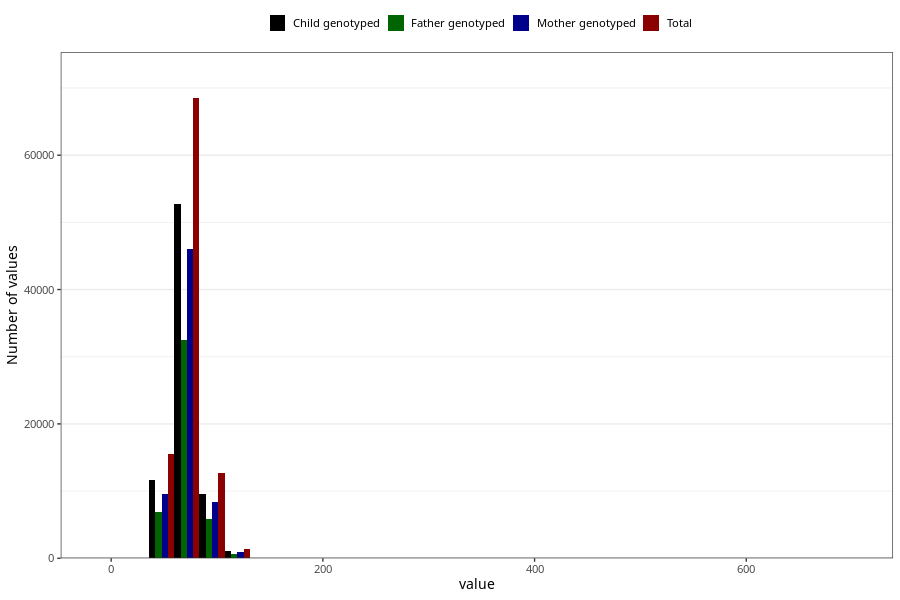

# mother_weight_15w
Variable mapping to questionnaire: q1m, question AA86.
.
- Number of values:

| Value | Total | Child genotyped | Mother genotyped | Father genotyped |
| ----- | ----- | --------------- | ---------------- | ---------------- |
| Missing | 15302 | 8218 | 6854 | 4369 |
| 1 | 1 | 0 | 0 |0 |
| 2 | 1 | 1 | 1 |0 |
| 3 | 2 | 1 | 1 |0 |
| 5 | 11 | 8 | 8 |6 |
| 6 | 17 | 13 | 10 |11 |
| 7 | 15 | 11 | 10 |5 |
| 8 | 5 | 4 | 3 |3 |
| 11 | 1 | 0 | 0 |0 |
| 22 | 2 | 1 | 1 |0 |
| 27 | 1 | 1 | 1 |1 |
| 29 | 1 | 0 | 0 |0 |
| 30 | 1 | 1 | 1 |1 |
| 33 | 1 | 0 | 0 |0 |
| 34 | 1 | 1 | 1 |0 |
| 37 | 1 | 1 | 0 |0 |
| 38 | 3 | 3 | 1 |1 |
| 39 | 4 | 3 | 1 |1 |
| 40 | 7 | 3 | 2 |2 |
| 41 | 5 | 2 | 1 |0 |
| 42 | 26 | 19 | 10 |6 |
| 43 | 28 | 13 | 6 |1 |
| 44 | 35 | 21 | 10 |10 |
| 45 | 82 | 56 | 32 |26 |
| 46 | 101 | 69 | 46 |29 |
| 47 | 144 | 96 | 66 |43 |
| 48 | 204 | 148 | 111 |71 |
| 49 | 274 | 207 | 157 |112 |
| 50 | 461 | 320 | 247 |159 |
| 51 | 503 | 358 | 279 |193 |
| 52 | 818 | 604 | 469 |318 |
| 53 | 968 | 725 | 576 |422 |
| 54 | 1290 | 984 | 796 |586 |
| 55 | 1569 | 1175 | 973 |700 |
| 56 | 1838 | 1402 | 1189 |840 |
| 57 | 2129 | 1621 | 1351 |967 |
| 58 | 2495 | 1870 | 1601 |1141 |
| 59 | 2587 | 1947 | 1662 |1207 |
| 60 | 3375 | 2592 | 2227 |1543 |
| 61 | 2926 | 2234 | 1952 |1352 |
| 62 | 3606 | 2762 | 2406 |1749 |
| 63 | 3549 | 2742 | 2392 |1728 |
| 64 | 3705 | 2820 | 2435 |1716 |
| 65 | 4339 | 3382 | 2934 |2121 |
| 66 | 3534 | 2738 | 2375 |1680 |
| 67 | 3757 | 2880 | 2517 |1781 |
| 68 | 3776 | 2905 | 2535 |1810 |
| 69 | 3260 | 2525 | 2227 |1539 |
| 70 | 3825 | 2944 | 2575 |1772 |
| 71 | 2846 | 2227 | 1946 |1388 |
| 72 | 3160 | 2456 | 2154 |1542 |
| 73 | 2933 | 2217 | 1951 |1355 |
| 74 | 2729 | 2102 | 1812 |1310 |
| 75 | 3011 | 2294 | 2001 |1438 |
| 76 | 2346 | 1829 | 1604 |1137 |
| 77 | 1926 | 1488 | 1312 |931 |
| 78 | 2123 | 1632 | 1424 |1018 |
| 79 | 1702 | 1306 | 1144 |771 |
| 80 | 1915 | 1479 | 1294 |892 |
| 81 | 1332 | 1010 | 908 |632 |
| 82 | 1548 | 1209 | 1057 |742 |
| 83 | 1261 | 947 | 838 |608 |
| 84 | 1190 | 906 | 802 |561 |
| 85 | 1246 | 912 | 779 |534 |
| 86 | 1040 | 785 | 683 |478 |
| 87 | 867 | 680 | 589 |423 |
| 88 | 843 | 644 | 552 |377 |
| 89 | 745 | 558 | 484 |336 |
| 90 | 869 | 650 | 558 |383 |
| 91 | 592 | 460 | 383 |269 |
| 92 | 601 | 466 | 412 |289 |
| 93 | 518 | 396 | 339 |235 |
| 94 | 485 | 382 | 325 |218 |
| 95 | 565 | 426 | 380 |258 |
| 96 | 432 | 307 | 269 |185 |
| 97 | 378 | 276 | 243 |170 |
| 98 | 397 | 296 | 263 |178 |
| 99 | 289 | 224 | 190 |136 |
| 100 | 296 | 237 | 205 |146 |
| 101 | 209 | 162 | 146 |101 |
| 102 | 257 | 184 | 159 |107 |
| 103 | 184 | 128 | 108 |74 |
| 104 | 216 | 158 | 130 |93 |
| 105 | 194 | 143 | 125 |79 |
| 106 | 180 | 141 | 123 |83 |
| 107 | 150 | 117 | 99 |68 |
| 108 | 141 | 106 | 86 |65 |
| 109 | 102 | 83 | 76 |59 |
| 110 | 141 | 100 | 89 |63 |
| 111 | 84 | 69 | 57 |43 |
| 112 | 100 | 80 | 64 |42 |
| 113 | 76 | 62 | 53 |32 |
| 114 | 81 | 63 | 57 |46 |
| 115 | 85 | 69 | 55 |39 |
| 116 | 62 | 45 | 36 |25 |
| 117 | 54 | 38 | 34 |22 |
| 118 | 53 | 33 | 29 |17 |
| 119 | 49 | 36 | 32 |21 |
| 120 | 82 | 62 | 56 |44 |
| 121 | 30 | 24 | 20 |14 |
| 122 | 37 | 24 | 20 |8 |
| 123 | 22 | 13 | 10 |6 |
| 124 | 26 | 17 | 16 |8 |
| 125 | 32 | 24 | 20 |14 |
| 126 | 21 | 16 | 14 |11 |
| 127 | 25 | 22 | 14 |11 |
| 128 | 23 | 17 | 15 |10 |
| 129 | 20 | 11 | 11 |5 |
| 130 | 16 | 11 | 9 |3 |
| 131 | 10 | 6 | 5 |5 |
| 132 | 9 | 7 | 6 |5 |
| 133 | 7 | 5 | 5 |4 |
| 134 | 7 | 6 | 4 |4 |
| 135 | 7 | 5 | 5 |3 |
| 136 | 6 | 3 | 1 |2 |
| 137 | 5 | 3 | 2 |2 |
| 138 | 4 | 3 | 3 |3 |
| 139 | 5 | 5 | 3 |2 |
| 140 | 7 | 6 | 5 |4 |
| 141 | 4 | 2 | 2 |1 |
| 142 | 4 | 2 | 2 |1 |
| 144 | 2 | 1 | 0 |0 |
| 147 | 2 | 0 | 0 |0 |
| 148 | 3 | 0 | 0 |0 |
| 149 | 2 | 1 | 1 |1 |
| 150 | 4 | 2 | 2 |1 |
| 152 | 1 | 1 | 1 |1 |
| 155 | 1 | 1 | 1 |0 |
| 158 | 1 | 1 | 1 |1 |
| 164 | 1 | 0 | 0 |0 |
| 165 | 1 | 0 | 0 |0 |
| 170 | 1 | 1 | 1 |1 |
| 172 | 1 | 1 | 1 |1 |
| 180 | 2 | 1 | 0 |0 |
| 190 | 1 | 1 | 1 |0 |
| 599 | 1 | 0 | 0 |0 |
| 692 | 1 | 1 | 1 |1 |

