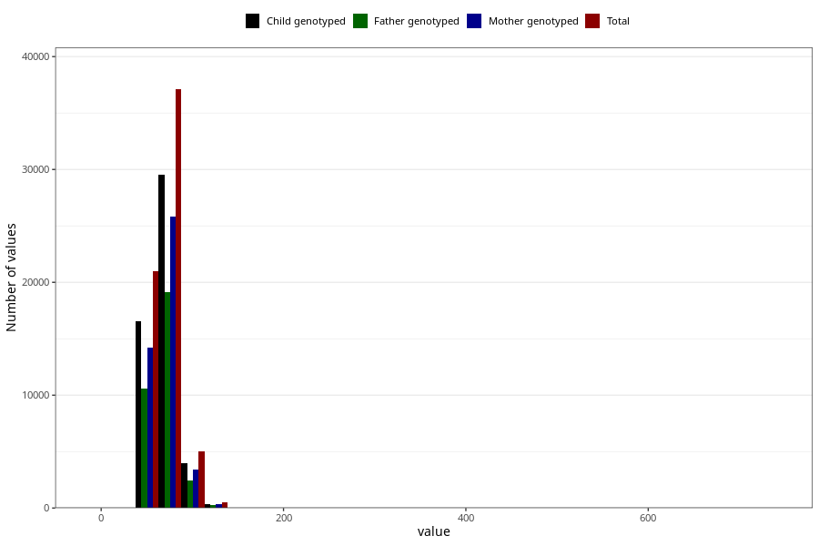

# mother_weight_18m
Variable mapping to questionnaire: q5, question EE924.
.
- Number of values:

| Value | Total | Child genotyped | Mother genotyped | Father genotyped |
| ----- | ----- | --------------- | ---------------- | ---------------- |
| Missing | 49927 | 32868 | 27907 | 17793 |
| 0 | 1 | 0 | 0 |0 |
| 3 | 1 | 1 | 1 |1 |
| 4 | 1 | 1 | 1 |1 |
| 5.2 | 1 | 1 | 0 |0 |
| 5.3 | 1 | 1 | 1 |0 |
| 5.5 | 1 | 1 | 1 |0 |
| 5.7 | 2 | 0 | 0 |0 |
| 5.8 | 1 | 1 | 0 |0 |
| 6 | 7 | 5 | 3 |1 |
| 6.3 | 1 | 0 | 0 |0 |
| 7.3 | 1 | 1 | 1 |1 |
| 7.4 | 1 | 0 | 0 |0 |
| 9 | 1 | 0 | 0 |0 |
| 10 | 4 | 3 | 3 |2 |
| 10.5 | 1 | 1 | 1 |0 |
| 11 | 3 | 2 | 2 |2 |
| 13 | 1 | 1 | 1 |0 |
| 20.6 | 1 | 1 | 0 |0 |
| 34 | 1 | 1 | 1 |1 |
| 35 | 1 | 1 | 1 |0 |
| 36 | 1 | 1 | 1 |1 |
| 37 | 1 | 1 | 1 |0 |
| 37.5 | 1 | 0 | 0 |0 |
| 38 | 1 | 1 | 1 |1 |
| 39 | 1 | 1 | 1 |1 |
| 39.8 | 1 | 1 | 1 |1 |
| 40 | 12 | 11 | 8 |5 |
| 40.2 | 1 | 1 | 1 |1 |
| 41 | 8 | 4 | 2 |2 |
| 41.3 | 1 | 1 | 0 |0 |
| 42 | 13 | 13 | 9 |5 |
| 42.2 | 1 | 1 | 0 |0 |
| 42.5 | 1 | 0 | 0 |0 |
| 42.7 | 1 | 1 | 1 |1 |
| 42.9 | 1 | 1 | 0 |1 |
| 43 | 26 | 18 | 11 |10 |
| 43.1 | 1 | 1 | 0 |0 |
| 43.5 | 7 | 7 | 4 |4 |
| 43.7 | 1 | 1 | 1 |1 |
| 44 | 25 | 20 | 13 |9 |
| 44.2 | 1 | 1 | 1 |1 |
| 44.5 | 6 | 5 | 1 |1 |
| 45 | 72 | 53 | 41 |26 |
| 45.3 | 1 | 1 | 1 |0 |
| 45.4 | 1 | 1 | 1 |1 |
| 45.5 | 10 | 8 | 7 |6 |
| 45.7 | 1 | 1 | 0 |0 |
| 45.8 | 3 | 3 | 2 |2 |
| 46 | 70 | 51 | 38 |23 |
| 46.2 | 3 | 2 | 0 |0 |
| 46.3 | 3 | 1 | 1 |1 |
| 46.4 | 1 | 0 | 0 |0 |
| 46.5 | 10 | 8 | 6 |4 |
| 46.6 | 1 | 1 | 0 |0 |
| 46.7 | 1 | 0 | 0 |0 |
| 46.8 | 1 | 1 | 0 |0 |
| 47 | 126 | 100 | 82 |53 |
| 47.1 | 1 | 1 | 0 |0 |
| 47.2 | 2 | 1 | 0 |0 |
| 47.3 | 4 | 3 | 3 |3 |
| 47.4 | 1 | 0 | 0 |0 |
| 47.5 | 36 | 28 | 23 |17 |
| 47.7 | 3 | 2 | 2 |1 |
| 47.8 | 5 | 4 | 2 |2 |
| 47.9 | 1 | 0 | 0 |0 |
| 48 | 190 | 146 | 121 |87 |
| 48.1 | 1 | 1 | 1 |1 |
| 48.2 | 1 | 1 | 0 |0 |
| 48.3 | 1 | 1 | 1 |1 |
| 48.4 | 1 | 1 | 1 |1 |
| 48.5 | 37 | 30 | 25 |19 |
| 48.6 | 1 | 1 | 1 |0 |
| 48.7 | 2 | 1 | 1 |0 |
| 48.8 | 2 | 2 | 2 |1 |
| 48.9 | 1 | 1 | 1 |1 |
| 49 | 228 | 166 | 127 |97 |
| 49.1 | 3 | 3 | 3 |2 |
| 49.2 | 2 | 1 | 1 |1 |
| 49.3 | 1 | 1 | 1 |1 |
| 49.5 | 22 | 16 | 12 |7 |
| 49.6 | 5 | 4 | 4 |2 |
| 49.7 | 3 | 2 | 2 |2 |
| 49.8 | 9 | 6 | 5 |4 |
| 49.9 | 1 | 1 | 1 |0 |
| 50 | 594 | 440 | 370 |257 |
| 50.1 | 6 | 4 | 2 |3 |
| 50.2 | 5 | 5 | 3 |1 |
| 50.3 | 4 | 3 | 2 |3 |
| 50.4 | 8 | 6 | 6 |5 |
| 50.5 | 55 | 44 | 37 |26 |
| 50.6 | 5 | 5 | 4 |2 |
| 50.7 | 6 | 5 | 4 |4 |
| 50.8 | 9 | 5 | 5 |5 |
| 50.9 | 2 | 2 | 0 |0 |
| 51 | 382 | 288 | 238 |183 |
| 51.2 | 9 | 7 | 5 |4 |
| 51.3 | 9 | 8 | 6 |4 |
| 51.4 | 7 | 6 | 5 |4 |
| 51.5 | 60 | 46 | 37 |29 |
| 51.6 | 4 | 3 | 3 |2 |
| 51.7 | 5 | 5 | 3 |2 |
| 51.8 | 8 | 7 | 6 |5 |
| 51.9 | 4 | 2 | 2 |2 |
| 52 | 770 | 618 | 510 |381 |
| 52.1 | 6 | 5 | 2 |3 |
| 52.2 | 9 | 6 | 5 |4 |
| 52.3 | 7 | 4 | 3 |3 |
| 52.4 | 12 | 11 | 10 |5 |
| 52.5 | 110 | 92 | 77 |55 |
| 52.6 | 5 | 5 | 3 |3 |
| 52.7 | 6 | 6 | 4 |4 |
| 52.8 | 12 | 10 | 7 |5 |
| 52.9 | 4 | 3 | 2 |1 |
| 53 | 829 | 650 | 539 |409 |
| 53.2 | 11 | 7 | 4 |3 |
| 53.3 | 15 | 10 | 8 |8 |
| 53.4 | 15 | 10 | 8 |8 |
| 53.5 | 125 | 101 | 83 |60 |
| 53.6 | 10 | 8 | 6 |5 |
| 53.7 | 6 | 4 | 3 |3 |
| 53.8 | 16 | 12 | 10 |7 |
| 53.9 | 3 | 3 | 3 |0 |
| 54 | 983 | 789 | 664 |486 |
| 54.2 | 17 | 14 | 11 |7 |
| 54.3 | 7 | 4 | 2 |3 |
| 54.4 | 6 | 5 | 4 |4 |
| 54.5 | 149 | 122 | 94 |68 |
| 54.6 | 14 | 12 | 9 |5 |
| 54.7 | 4 | 4 | 2 |1 |
| 54.8 | 6 | 4 | 4 |3 |
| 54.9 | 1 | 1 | 1 |1 |
| 55 | 1333 | 1045 | 914 |666 |
| 55.1 | 7 | 5 | 4 |4 |
| 55.2 | 13 | 7 | 6 |4 |
| 55.3 | 13 | 7 | 6 |5 |
| 55.4 | 14 | 12 | 11 |8 |
| 55.5 | 139 | 110 | 94 |72 |
| 55.6 | 11 | 6 | 5 |3 |
| 55.7 | 17 | 10 | 10 |8 |
| 55.8 | 13 | 11 | 11 |7 |
| 55.9 | 2 | 0 | 0 |0 |
| 56 | 1110 | 861 | 734 |533 |
| 56.1 | 6 | 6 | 4 |2 |
| 56.2 | 12 | 11 | 9 |9 |
| 56.3 | 8 | 5 | 4 |3 |
| 56.4 | 10 | 9 | 6 |5 |
| 56.5 | 200 | 158 | 135 |112 |
| 56.6 | 17 | 16 | 12 |13 |
| 56.7 | 17 | 15 | 12 |13 |
| 56.8 | 12 | 9 | 9 |8 |
| 56.9 | 4 | 3 | 3 |2 |
| 57 | 1377 | 1069 | 948 |692 |
| 57.1 | 15 | 12 | 11 |9 |
| 57.2 | 16 | 12 | 12 |10 |
| 57.3 | 19 | 15 | 12 |10 |
| 57.4 | 18 | 15 | 12 |9 |
| 57.5 | 206 | 159 | 136 |112 |
| 57.6 | 9 | 9 | 6 |4 |
| 57.7 | 13 | 8 | 6 |5 |
| 57.8 | 15 | 11 | 9 |8 |
| 57.9 | 6 | 6 | 6 |3 |
| 58 | 1852 | 1463 | 1278 |959 |
| 58.1 | 10 | 8 | 8 |6 |
| 58.2 | 19 | 15 | 11 |8 |
| 58.3 | 17 | 13 | 9 |7 |
| 58.4 | 15 | 14 | 13 |9 |
| 58.5 | 234 | 193 | 170 |121 |
| 58.6 | 16 | 14 | 12 |7 |
| 58.7 | 13 | 10 | 8 |6 |
| 58.8 | 24 | 18 | 15 |12 |
| 58.9 | 11 | 8 | 5 |4 |
| 59 | 1268 | 1025 | 891 |661 |
| 59.1 | 13 | 10 | 9 |7 |
| 59.2 | 19 | 15 | 12 |8 |
| 59.3 | 14 | 11 | 8 |4 |
| 59.4 | 6 | 5 | 5 |4 |
| 59.5 | 139 | 104 | 93 |67 |
| 59.6 | 17 | 12 | 12 |8 |
| 59.7 | 7 | 6 | 6 |6 |
| 59.8 | 17 | 14 | 10 |8 |
| 59.9 | 6 | 5 | 4 |3 |
| 60 | 2790 | 2217 | 1922 |1443 |
| 60.1 | 13 | 11 | 10 |8 |
| 60.2 | 39 | 34 | 32 |19 |
| 60.3 | 19 | 13 | 13 |10 |
| 60.4 | 13 | 12 | 10 |8 |
| 60.5 | 186 | 149 | 128 |104 |
| 60.6 | 3 | 0 | 0 |0 |
| 60.7 | 11 | 8 | 7 |6 |
| 60.8 | 23 | 22 | 18 |13 |
| 60.9 | 9 | 6 | 5 |3 |
| 61 | 1234 | 979 | 869 |630 |
| 61.1 | 7 | 6 | 6 |3 |
| 61.2 | 35 | 28 | 25 |20 |
| 61.3 | 20 | 17 | 13 |9 |
| 61.4 | 24 | 19 | 15 |14 |
| 61.5 | 268 | 197 | 172 |120 |
| 61.6 | 11 | 8 | 8 |6 |
| 61.7 | 17 | 13 | 13 |12 |
| 61.8 | 23 | 20 | 16 |15 |
| 61.9 | 11 | 9 | 7 |5 |
| 62 | 2094 | 1678 | 1465 |1113 |
| 62.1 | 10 | 8 | 8 |6 |
| 62.2 | 24 | 22 | 20 |13 |
| 62.3 | 21 | 20 | 18 |14 |
| 62.4 | 20 | 14 | 12 |8 |
| 62.5 | 335 | 256 | 221 |170 |
| 62.6 | 9 | 6 | 5 |5 |
| 62.7 | 13 | 9 | 8 |6 |
| 62.8 | 21 | 14 | 14 |11 |
| 62.9 | 10 | 10 | 8 |7 |
| 63 | 2114 | 1659 | 1463 |1072 |
| 63.1 | 12 | 10 | 8 |6 |
| 63.2 | 26 | 18 | 16 |13 |
| 63.3 | 20 | 15 | 14 |11 |
| 63.4 | 25 | 19 | 17 |13 |
| 63.5 | 305 | 230 | 194 |148 |
| 63.6 | 8 | 7 | 6 |4 |
| 63.7 | 13 | 12 | 12 |10 |
| 63.8 | 21 | 11 | 9 |6 |
| 63.9 | 15 | 11 | 9 |8 |
| 64 | 1775 | 1429 | 1248 |933 |
| 64.1 | 7 | 6 | 6 |5 |
| 64.2 | 28 | 16 | 13 |9 |
| 64.3 | 12 | 7 | 6 |6 |
| 64.4 | 23 | 20 | 17 |12 |
| 64.5 | 250 | 198 | 169 |130 |
| 64.6 | 9 | 7 | 5 |5 |
| 64.7 | 8 | 7 | 7 |6 |
| 64.8 | 13 | 11 | 9 |8 |
| 64.9 | 10 | 9 | 7 |5 |
| 65 | 2791 | 2207 | 1956 |1434 |
| 65.1 | 10 | 9 | 9 |7 |
| 65.2 | 27 | 22 | 21 |21 |
| 65.3 | 11 | 8 | 8 |6 |
| 65.4 | 15 | 13 | 12 |9 |
| 65.5 | 232 | 179 | 154 |116 |
| 65.6 | 20 | 16 | 13 |6 |
| 65.7 | 14 | 12 | 10 |7 |
| 65.8 | 24 | 19 | 14 |9 |
| 65.9 | 10 | 8 | 6 |6 |
| 66 | 1350 | 1071 | 931 |699 |
| 66.1 | 14 | 9 | 9 |4 |
| 66.2 | 18 | 16 | 16 |13 |
| 66.3 | 23 | 14 | 12 |8 |
| 66.4 | 19 | 15 | 14 |11 |
| 66.5 | 210 | 174 | 154 |114 |
| 66.6 | 21 | 16 | 13 |14 |
| 66.7 | 25 | 18 | 16 |13 |
| 66.8 | 25 | 19 | 17 |14 |
| 66.9 | 9 | 6 | 6 |4 |
| 67 | 1754 | 1395 | 1232 |885 |
| 67.1 | 11 | 7 | 7 |5 |
| 67.2 | 27 | 21 | 17 |14 |
| 67.3 | 18 | 17 | 16 |9 |
| 67.4 | 24 | 21 | 19 |14 |
| 67.5 | 275 | 230 | 205 |150 |
| 67.6 | 7 | 3 | 2 |1 |
| 67.7 | 15 | 10 | 10 |7 |
| 67.8 | 18 | 12 | 12 |10 |
| 67.9 | 8 | 7 | 7 |5 |
| 68 | 1988 | 1594 | 1393 |1057 |
| 68.1 | 13 | 9 | 8 |6 |
| 68.2 | 30 | 22 | 22 |15 |
| 68.3 | 18 | 11 | 9 |6 |
| 68.4 | 22 | 19 | 16 |11 |
| 68.5 | 282 | 245 | 208 |155 |
| 68.6 | 13 | 10 | 9 |5 |
| 68.7 | 21 | 19 | 17 |11 |
| 68.8 | 17 | 15 | 12 |10 |
| 68.9 | 16 | 12 | 11 |10 |
| 69 | 1347 | 1102 | 971 |716 |
| 69.1 | 9 | 7 | 6 |3 |
| 69.2 | 22 | 15 | 13 |7 |
| 69.3 | 23 | 18 | 16 |12 |
| 69.4 | 14 | 12 | 10 |6 |
| 69.5 | 160 | 130 | 118 |93 |
| 69.6 | 11 | 7 | 7 |3 |
| 69.7 | 16 | 13 | 11 |10 |
| 69.8 | 22 | 17 | 13 |9 |
| 69.9 | 10 | 7 | 4 |3 |
| 70 | 2598 | 2087 | 1819 |1320 |
| 70.1 | 28 | 23 | 22 |18 |
| 70.2 | 34 | 28 | 24 |13 |
| 70.3 | 19 | 17 | 13 |11 |
| 70.4 | 20 | 17 | 15 |11 |
| 70.5 | 133 | 108 | 93 |80 |
| 70.6 | 25 | 20 | 18 |15 |
| 70.7 | 5 | 5 | 5 |4 |
| 70.8 | 14 | 10 | 9 |7 |
| 70.9 | 10 | 9 | 8 |5 |
| 71 | 871 | 708 | 618 |458 |
| 71.1 | 8 | 6 | 6 |3 |
| 71.2 | 32 | 27 | 26 |16 |
| 71.3 | 14 | 10 | 10 |6 |
| 71.4 | 20 | 17 | 16 |11 |
| 71.5 | 188 | 154 | 131 |91 |
| 71.6 | 14 | 12 | 11 |8 |
| 71.7 | 5 | 4 | 4 |2 |
| 71.8 | 21 | 20 | 19 |17 |
| 71.9 | 8 | 6 | 6 |4 |
| 72 | 1520 | 1207 | 1046 |766 |
| 72.1 | 8 | 7 | 6 |4 |
| 72.2 | 12 | 9 | 9 |7 |
| 72.3 | 32 | 29 | 29 |23 |
| 72.4 | 22 | 18 | 16 |13 |
| 72.5 | 206 | 171 | 153 |114 |
| 72.6 | 17 | 14 | 13 |11 |
| 72.7 | 4 | 3 | 2 |1 |
| 72.8 | 15 | 9 | 6 |5 |
| 72.9 | 12 | 9 | 9 |7 |
| 73 | 1216 | 1002 | 882 |636 |
| 73.1 | 10 | 9 | 9 |7 |
| 73.2 | 26 | 21 | 18 |10 |
| 73.3 | 19 | 15 | 15 |11 |
| 73.4 | 22 | 19 | 16 |10 |
| 73.5 | 173 | 133 | 113 |91 |
| 73.6 | 7 | 7 | 6 |3 |
| 73.7 | 5 | 3 | 3 |3 |
| 73.8 | 16 | 14 | 12 |4 |
| 73.9 | 2 | 0 | 0 |0 |
| 74 | 1119 | 855 | 748 |564 |
| 74.1 | 11 | 10 | 9 |7 |
| 74.2 | 22 | 17 | 15 |13 |
| 74.3 | 15 | 13 | 12 |7 |
| 74.4 | 18 | 14 | 12 |7 |
| 74.5 | 141 | 113 | 96 |75 |
| 74.6 | 21 | 17 | 13 |10 |
| 74.7 | 5 | 4 | 4 |3 |
| 74.8 | 8 | 6 | 5 |2 |
| 74.9 | 2 | 1 | 0 |0 |
| 75 | 1781 | 1411 | 1244 |927 |
| 75.1 | 13 | 11 | 10 |5 |
| 75.2 | 20 | 15 | 13 |11 |
| 75.3 | 12 | 11 | 9 |9 |
| 75.4 | 15 | 12 | 9 |7 |
| 75.5 | 109 | 99 | 90 |69 |
| 75.6 | 14 | 10 | 10 |7 |
| 75.7 | 10 | 9 | 8 |7 |
| 75.8 | 12 | 9 | 9 |9 |
| 75.9 | 5 | 5 | 5 |2 |
| 76 | 808 | 636 | 564 |408 |
| 76.1 | 6 | 6 | 3 |3 |
| 76.2 | 22 | 17 | 16 |13 |
| 76.3 | 5 | 4 | 4 |2 |
| 76.4 | 14 | 9 | 7 |7 |
| 76.5 | 122 | 101 | 89 |69 |
| 76.6 | 8 | 8 | 6 |4 |
| 76.7 | 10 | 10 | 8 |6 |
| 76.8 | 16 | 11 | 11 |8 |
| 76.9 | 9 | 7 | 7 |7 |
| 77 | 708 | 572 | 507 |384 |
| 77.1 | 9 | 5 | 4 |4 |
| 77.2 | 14 | 12 | 11 |6 |
| 77.3 | 15 | 13 | 12 |9 |
| 77.4 | 15 | 13 | 13 |11 |
| 77.5 | 94 | 68 | 62 |45 |
| 77.6 | 7 | 7 | 6 |4 |
| 77.7 | 4 | 3 | 3 |2 |
| 77.8 | 15 | 13 | 10 |6 |
| 77.9 | 5 | 2 | 2 |1 |
| 78 | 1078 | 856 | 742 |538 |
| 78.1 | 9 | 7 | 6 |5 |
| 78.2 | 18 | 15 | 12 |9 |
| 78.3 | 16 | 11 | 9 |8 |
| 78.4 | 9 | 6 | 6 |5 |
| 78.5 | 82 | 61 | 50 |39 |
| 78.6 | 16 | 14 | 11 |10 |
| 78.7 | 4 | 4 | 4 |2 |
| 78.8 | 12 | 9 | 9 |8 |
| 78.9 | 10 | 9 | 7 |6 |
| 79 | 688 | 552 | 476 |363 |
| 79.1 | 15 | 13 | 12 |10 |
| 79.2 | 13 | 12 | 12 |10 |
| 79.3 | 12 | 10 | 10 |8 |
| 79.4 | 9 | 9 | 9 |8 |
| 79.5 | 78 | 64 | 59 |46 |
| 79.6 | 9 | 7 | 7 |4 |
| 79.7 | 5 | 4 | 2 |1 |
| 79.8 | 6 | 5 | 5 |2 |
| 79.9 | 5 | 5 | 4 |3 |
| 80 | 1613 | 1255 | 1096 |810 |
| 80.1 | 13 | 9 | 8 |7 |
| 80.2 | 17 | 14 | 13 |11 |
| 80.3 | 12 | 9 | 9 |6 |
| 80.4 | 11 | 9 | 8 |5 |
| 80.5 | 64 | 49 | 38 |34 |
| 80.6 | 13 | 10 | 10 |5 |
| 80.7 | 7 | 4 | 3 |1 |
| 80.8 | 5 | 4 | 3 |2 |
| 80.9 | 5 | 4 | 4 |3 |
| 81 | 366 | 286 | 260 |190 |
| 81.1 | 7 | 5 | 5 |3 |
| 81.2 | 18 | 15 | 10 |7 |
| 81.3 | 4 | 3 | 2 |2 |
| 81.4 | 5 | 4 | 4 |4 |
| 81.5 | 78 | 63 | 55 |37 |
| 81.6 | 6 | 6 | 5 |2 |
| 81.7 | 9 | 9 | 8 |6 |
| 81.8 | 4 | 3 | 3 |3 |
| 81.9 | 5 | 4 | 4 |4 |
| 82 | 652 | 509 | 455 |327 |
| 82.1 | 5 | 4 | 3 |3 |
| 82.2 | 8 | 7 | 7 |6 |
| 82.3 | 19 | 16 | 11 |9 |
| 82.4 | 5 | 2 | 1 |1 |
| 82.5 | 90 | 70 | 62 |46 |
| 82.6 | 7 | 5 | 4 |4 |
| 82.7 | 6 | 4 | 3 |2 |
| 82.8 | 3 | 1 | 1 |1 |
| 82.9 | 4 | 3 | 3 |1 |
| 83 | 518 | 407 | 362 |262 |
| 83.1 | 3 | 3 | 2 |2 |
| 83.2 | 16 | 13 | 11 |11 |
| 83.3 | 9 | 8 | 6 |6 |
| 83.4 | 7 | 5 | 2 |2 |
| 83.5 | 63 | 50 | 43 |32 |
| 83.6 | 7 | 6 | 5 |4 |
| 83.7 | 3 | 3 | 3 |2 |
| 83.8 | 8 | 7 | 6 |4 |
| 83.9 | 6 | 5 | 5 |3 |
| 84 | 487 | 390 | 339 |255 |
| 84.1 | 3 | 2 | 2 |1 |
| 84.2 | 13 | 9 | 8 |6 |
| 84.3 | 8 | 5 | 4 |3 |
| 84.4 | 9 | 7 | 5 |4 |
| 84.5 | 53 | 44 | 38 |32 |
| 84.6 | 6 | 5 | 5 |5 |
| 84.7 | 4 | 4 | 3 |3 |
| 84.8 | 4 | 3 | 3 |1 |
| 84.9 | 1 | 1 | 1 |1 |
| 85 | 916 | 717 | 623 |467 |
| 85.1 | 5 | 4 | 4 |2 |
| 85.2 | 8 | 7 | 4 |2 |
| 85.3 | 5 | 4 | 4 |3 |
| 85.4 | 14 | 11 | 7 |2 |
| 85.5 | 49 | 33 | 25 |21 |
| 85.6 | 11 | 7 | 6 |5 |
| 85.7 | 3 | 2 | 2 |2 |
| 85.8 | 1 | 1 | 1 |1 |
| 85.9 | 2 | 2 | 2 |1 |
| 86 | 356 | 277 | 241 |180 |
| 86.1 | 5 | 5 | 4 |2 |
| 86.2 | 14 | 9 | 9 |6 |
| 86.3 | 12 | 11 | 9 |3 |
| 86.4 | 9 | 5 | 5 |4 |
| 86.5 | 53 | 39 | 32 |23 |
| 86.6 | 4 | 4 | 3 |3 |
| 86.7 | 6 | 6 | 6 |5 |
| 86.8 | 3 | 3 | 2 |0 |
| 86.9 | 5 | 4 | 2 |3 |
| 87 | 345 | 279 | 239 |172 |
| 87.1 | 2 | 2 | 2 |2 |
| 87.2 | 7 | 6 | 6 |4 |
| 87.3 | 8 | 6 | 6 |4 |
| 87.4 | 2 | 2 | 2 |2 |
| 87.5 | 46 | 38 | 31 |25 |
| 87.6 | 8 | 4 | 3 |3 |
| 87.7 | 4 | 1 | 1 |1 |
| 87.8 | 5 | 4 | 2 |3 |
| 87.9 | 1 | 1 | 1 |0 |
| 88 | 359 | 286 | 242 |181 |
| 88.1 | 7 | 5 | 3 |3 |
| 88.2 | 5 | 4 | 4 |3 |
| 88.3 | 5 | 3 | 3 |1 |
| 88.4 | 7 | 5 | 4 |1 |
| 88.5 | 46 | 35 | 31 |19 |
| 88.6 | 8 | 8 | 7 |5 |
| 88.7 | 9 | 7 | 7 |2 |
| 88.8 | 3 | 1 | 1 |0 |
| 88.9 | 2 | 2 | 2 |2 |
| 89 | 269 | 210 | 187 |127 |
| 89.1 | 6 | 5 | 4 |3 |
| 89.2 | 5 | 3 | 2 |1 |
| 89.3 | 6 | 5 | 4 |3 |
| 89.4 | 5 | 5 | 3 |1 |
| 89.5 | 24 | 20 | 19 |14 |
| 89.6 | 8 | 6 | 5 |5 |
| 89.7 | 5 | 4 | 4 |4 |
| 89.8 | 1 | 1 | 1 |1 |
| 89.9 | 2 | 2 | 2 |1 |
| 90 | 796 | 622 | 546 |387 |
| 90.1 | 4 | 4 | 4 |4 |
| 90.2 | 10 | 9 | 9 |7 |
| 90.3 | 9 | 8 | 8 |5 |
| 90.4 | 5 | 4 | 4 |2 |
| 90.5 | 28 | 21 | 16 |15 |
| 90.6 | 6 | 5 | 4 |3 |
| 90.7 | 2 | 2 | 0 |1 |
| 90.8 | 2 | 2 | 2 |1 |
| 90.9 | 1 | 0 | 0 |0 |
| 91 | 159 | 129 | 112 |84 |
| 91.1 | 3 | 2 | 2 |1 |
| 91.2 | 4 | 4 | 4 |3 |
| 91.3 | 4 | 4 | 3 |3 |
| 91.4 | 4 | 3 | 3 |3 |
| 91.5 | 29 | 24 | 21 |18 |
| 91.6 | 5 | 3 | 2 |1 |
| 91.7 | 2 | 2 | 1 |2 |
| 91.8 | 10 | 9 | 7 |6 |
| 92 | 283 | 220 | 192 |136 |
| 92.1 | 7 | 6 | 5 |5 |
| 92.2 | 6 | 3 | 3 |3 |
| 92.3 | 5 | 5 | 4 |2 |
| 92.4 | 3 | 2 | 2 |1 |
| 92.5 | 33 | 29 | 25 |23 |
| 92.6 | 4 | 3 | 3 |2 |
| 92.7 | 3 | 2 | 2 |2 |
| 92.8 | 6 | 5 | 4 |2 |
| 93 | 194 | 160 | 138 |102 |
| 93.1 | 2 | 2 | 2 |0 |
| 93.2 | 6 | 4 | 4 |3 |
| 93.3 | 5 | 4 | 4 |3 |
| 93.4 | 6 | 5 | 4 |1 |
| 93.5 | 29 | 21 | 16 |12 |
| 93.6 | 2 | 2 | 2 |1 |
| 93.7 | 3 | 2 | 2 |2 |
| 93.8 | 1 | 1 | 0 |0 |
| 93.9 | 2 | 2 | 2 |2 |
| 94 | 217 | 181 | 161 |119 |
| 94.2 | 6 | 4 | 2 |1 |
| 94.3 | 4 | 3 | 3 |1 |
| 94.4 | 2 | 2 | 2 |1 |
| 94.5 | 20 | 16 | 14 |7 |
| 94.6 | 4 | 3 | 2 |0 |
| 94.7 | 4 | 3 | 3 |2 |
| 94.8 | 3 | 2 | 2 |1 |
| 94.9 | 1 | 0 | 0 |0 |
| 95 | 424 | 329 | 282 |202 |
| 95.1 | 4 | 3 | 3 |2 |
| 95.2 | 3 | 3 | 2 |1 |
| 95.3 | 2 | 2 | 2 |2 |
| 95.4 | 5 | 3 | 1 |0 |
| 95.5 | 18 | 13 | 12 |10 |
| 95.6 | 2 | 1 | 1 |1 |
| 95.8 | 2 | 1 | 1 |1 |
| 95.9 | 1 | 1 | 1 |1 |
| 96 | 134 | 111 | 92 |73 |
| 96.1 | 5 | 4 | 2 |4 |
| 96.2 | 5 | 4 | 4 |2 |
| 96.3 | 4 | 4 | 1 |2 |
| 96.4 | 5 | 2 | 1 |1 |
| 96.5 | 18 | 16 | 13 |10 |
| 96.6 | 3 | 3 | 2 |1 |
| 96.7 | 6 | 5 | 5 |4 |
| 96.8 | 2 | 1 | 1 |1 |
| 97 | 162 | 133 | 117 |87 |
| 97.1 | 2 | 2 | 1 |1 |
| 97.2 | 5 | 4 | 2 |1 |
| 97.3 | 4 | 3 | 3 |1 |
| 97.4 | 1 | 1 | 0 |0 |
| 97.5 | 21 | 19 | 16 |14 |
| 97.6 | 4 | 4 | 3 |3 |
| 97.7 | 2 | 1 | 1 |1 |
| 97.8 | 1 | 0 | 0 |0 |
| 97.9 | 2 | 1 | 1 |1 |
| 98 | 217 | 175 | 160 |103 |
| 98.1 | 2 | 2 | 2 |1 |
| 98.2 | 5 | 4 | 3 |1 |
| 98.3 | 5 | 4 | 4 |2 |
| 98.4 | 3 | 2 | 1 |1 |
| 98.5 | 23 | 15 | 13 |11 |
| 98.6 | 1 | 0 | 0 |0 |
| 98.7 | 5 | 3 | 2 |2 |
| 98.8 | 3 | 2 | 2 |1 |
| 98.9 | 4 | 3 | 3 |2 |
| 99 | 121 | 91 | 72 |50 |
| 99.1 | 2 | 1 | 1 |1 |
| 99.2 | 3 | 1 | 1 |1 |
| 99.3 | 4 | 1 | 1 |0 |
| 99.4 | 6 | 6 | 5 |5 |
| 99.5 | 12 | 11 | 8 |7 |
| 99.6 | 5 | 4 | 3 |3 |
| 99.7 | 1 | 0 | 0 |0 |
| 99.8 | 2 | 2 | 2 |2 |
| 99.9 | 1 | 1 | 1 |1 |
| 100 | 330 | 254 | 225 |151 |
| 100.1 | 4 | 4 | 4 |2 |
| 100.2 | 7 | 7 | 4 |3 |
| 100.3 | 1 | 1 | 0 |0 |
| 100.4 | 3 | 1 | 1 |0 |
| 100.5 | 10 | 9 | 9 |7 |
| 100.6 | 2 | 1 | 1 |1 |
| 100.7 | 2 | 1 | 1 |1 |
| 100.9 | 2 | 2 | 2 |0 |
| 101 | 36 | 29 | 28 |21 |
| 101.2 | 2 | 2 | 2 |2 |
| 101.3 | 4 | 3 | 2 |0 |
| 101.4 | 2 | 2 | 2 |2 |
| 101.5 | 5 | 3 | 3 |2 |
| 101.6 | 2 | 2 | 1 |1 |
| 101.8 | 1 | 1 | 1 |1 |
| 102 | 81 | 64 | 57 |40 |
| 102.1 | 1 | 1 | 0 |0 |
| 102.2 | 3 | 3 | 2 |2 |
| 102.3 | 2 | 1 | 1 |1 |
| 102.4 | 2 | 1 | 1 |0 |
| 102.5 | 9 | 8 | 6 |3 |
| 102.6 | 5 | 5 | 5 |4 |
| 102.7 | 2 | 2 | 1 |1 |
| 102.9 | 2 | 1 | 0 |0 |
| 103 | 72 | 56 | 51 |36 |
| 103.1 | 2 | 1 | 1 |1 |
| 103.2 | 2 | 2 | 1 |1 |
| 103.4 | 1 | 1 | 1 |0 |
| 103.5 | 14 | 13 | 13 |11 |
| 103.8 | 3 | 2 | 2 |1 |
| 103.9 | 1 | 1 | 1 |1 |
| 104 | 65 | 51 | 45 |30 |
| 104.3 | 1 | 0 | 0 |0 |
| 104.4 | 1 | 0 | 0 |0 |
| 104.5 | 3 | 2 | 2 |2 |
| 104.7 | 2 | 0 | 0 |0 |
| 104.8 | 2 | 2 | 1 |1 |
| 104.9 | 1 | 0 | 0 |0 |
| 105 | 159 | 125 | 100 |79 |
| 105.1 | 1 | 1 | 1 |0 |
| 105.3 | 2 | 1 | 1 |1 |
| 105.4 | 1 | 0 | 0 |0 |
| 105.5 | 7 | 6 | 6 |5 |
| 105.6 | 2 | 2 | 2 |1 |
| 105.7 | 2 | 1 | 1 |1 |
| 105.8 | 2 | 2 | 2 |2 |
| 106 | 56 | 43 | 38 |29 |
| 106.2 | 1 | 1 | 0 |0 |
| 106.3 | 2 | 2 | 1 |1 |
| 106.5 | 7 | 6 | 5 |2 |
| 106.6 | 1 | 1 | 1 |1 |
| 107 | 42 | 33 | 28 |20 |
| 107.2 | 1 | 1 | 0 |0 |
| 107.3 | 1 | 1 | 0 |0 |
| 107.4 | 3 | 3 | 3 |1 |
| 107.5 | 3 | 3 | 2 |1 |
| 107.9 | 1 | 1 | 0 |1 |
| 108 | 55 | 43 | 38 |27 |
| 108.1 | 1 | 0 | 0 |0 |
| 108.2 | 1 | 1 | 1 |0 |
| 108.3 | 2 | 2 | 2 |2 |
| 108.4 | 2 | 1 | 1 |0 |
| 108.5 | 2 | 2 | 2 |1 |
| 108.7 | 1 | 1 | 1 |1 |
| 108.8 | 2 | 2 | 2 |2 |
| 109 | 32 | 23 | 19 |10 |
| 109.5 | 6 | 4 | 2 |1 |
| 109.8 | 2 | 1 | 1 |1 |
| 110 | 196 | 160 | 131 |98 |
| 110.3 | 2 | 1 | 0 |0 |
| 110.4 | 3 | 3 | 2 |2 |
| 110.5 | 7 | 6 | 5 |4 |
| 110.6 | 1 | 1 | 1 |1 |
| 110.9 | 1 | 0 | 0 |0 |
| 111 | 20 | 12 | 12 |10 |
| 111.1 | 2 | 2 | 2 |2 |
| 111.2 | 2 | 2 | 0 |0 |
| 111.4 | 1 | 1 | 1 |1 |
| 111.5 | 2 | 1 | 1 |1 |
| 111.8 | 1 | 1 | 1 |1 |
| 111.9 | 1 | 1 | 1 |1 |
| 112 | 32 | 25 | 23 |17 |
| 112.3 | 1 | 1 | 1 |1 |
| 112.4 | 1 | 1 | 1 |1 |
| 112.5 | 3 | 3 | 3 |3 |
| 112.6 | 2 | 1 | 1 |1 |
| 112.8 | 1 | 0 | 0 |0 |
| 113 | 26 | 25 | 22 |16 |
| 113.1 | 2 | 1 | 1 |1 |
| 113.5 | 5 | 5 | 5 |5 |
| 113.6 | 1 | 1 | 1 |1 |
| 113.8 | 1 | 1 | 1 |1 |
| 114 | 27 | 21 | 18 |14 |
| 114.1 | 2 | 1 | 0 |1 |
| 114.2 | 1 | 1 | 0 |0 |
| 114.4 | 1 | 1 | 1 |1 |
| 114.6 | 1 | 1 | 1 |1 |
| 114.8 | 1 | 1 | 1 |0 |
| 115 | 60 | 47 | 40 |29 |
| 115.2 | 1 | 1 | 1 |0 |
| 115.3 | 1 | 1 | 1 |0 |
| 115.4 | 2 | 1 | 1 |0 |
| 115.5 | 5 | 4 | 4 |3 |
| 115.9 | 1 | 1 | 0 |1 |
| 116 | 16 | 12 | 11 |10 |
| 116.3 | 1 | 0 | 0 |0 |
| 116.4 | 1 | 1 | 1 |0 |
| 116.5 | 5 | 5 | 5 |4 |
| 117 | 16 | 14 | 14 |8 |
| 117.4 | 2 | 2 | 0 |0 |
| 117.5 | 1 | 1 | 1 |1 |
| 118 | 34 | 30 | 25 |16 |
| 118.2 | 1 | 1 | 1 |1 |
| 118.4 | 1 | 0 | 0 |0 |
| 118.5 | 2 | 1 | 0 |0 |
| 119 | 13 | 9 | 8 |5 |
| 119.4 | 1 | 1 | 1 |1 |
| 119.5 | 2 | 2 | 2 |0 |
| 120 | 81 | 64 | 58 |44 |
| 120.1 | 1 | 1 | 0 |0 |
| 120.4 | 1 | 1 | 1 |0 |
| 120.9 | 1 | 1 | 0 |0 |
| 121 | 3 | 2 | 2 |1 |
| 121.3 | 2 | 2 | 2 |0 |
| 121.4 | 1 | 1 | 1 |1 |
| 122 | 4 | 3 | 3 |1 |
| 122.3 | 1 | 1 | 1 |1 |
| 122.5 | 1 | 1 | 1 |1 |
| 123 | 8 | 4 | 4 |3 |
| 123.2 | 1 | 0 | 0 |0 |
| 123.5 | 1 | 1 | 1 |1 |
| 123.6 | 1 | 0 | 0 |0 |
| 124 | 6 | 5 | 4 |2 |
| 124.3 | 1 | 1 | 1 |1 |
| 124.5 | 1 | 1 | 1 |0 |
| 124.8 | 2 | 2 | 0 |0 |
| 125 | 36 | 27 | 24 |15 |
| 125.3 | 3 | 2 | 2 |2 |
| 125.6 | 1 | 1 | 1 |1 |
| 126 | 7 | 7 | 4 |2 |
| 126.3 | 1 | 1 | 0 |0 |
| 127 | 10 | 10 | 8 |6 |
| 127.5 | 1 | 1 | 0 |0 |
| 127.6 | 1 | 1 | 0 |0 |
| 128 | 11 | 7 | 6 |2 |
| 129 | 6 | 4 | 4 |4 |
| 130 | 30 | 23 | 20 |12 |
| 130.1 | 1 | 1 | 1 |1 |
| 130.2 | 1 | 1 | 1 |1 |
| 130.4 | 1 | 1 | 1 |0 |
| 130.5 | 1 | 0 | 0 |0 |
| 131 | 3 | 3 | 3 |2 |
| 131.2 | 1 | 1 | 0 |0 |
| 131.4 | 1 | 1 | 1 |0 |
| 131.5 | 1 | 1 | 1 |0 |
| 132 | 4 | 3 | 3 |2 |
| 132.5 | 2 | 2 | 2 |2 |
| 133 | 5 | 3 | 3 |3 |
| 133.2 | 1 | 1 | 0 |0 |
| 133.4 | 1 | 1 | 1 |1 |
| 134 | 3 | 3 | 3 |2 |
| 135 | 11 | 6 | 5 |6 |
| 135.2 | 1 | 1 | 1 |1 |
| 135.5 | 1 | 0 | 0 |0 |
| 135.8 | 1 | 1 | 1 |1 |
| 136.5 | 1 | 1 | 1 |0 |
| 137 | 1 | 0 | 0 |0 |
| 138 | 2 | 1 | 1 |0 |
| 138.5 | 1 | 1 | 1 |0 |
| 139 | 1 | 1 | 1 |1 |
| 139.2 | 1 | 1 | 1 |0 |
| 140 | 9 | 7 | 4 |5 |
| 140.5 | 1 | 1 | 0 |0 |
| 141.3 | 1 | 1 | 1 |1 |
| 141.4 | 1 | 0 | 0 |0 |
| 142 | 4 | 2 | 2 |2 |
| 144 | 3 | 2 | 2 |1 |
| 145 | 3 | 2 | 2 |2 |
| 146 | 3 | 2 | 2 |1 |
| 147 | 1 | 0 | 0 |0 |
| 150 | 7 | 5 | 5 |2 |
| 153 | 1 | 1 | 1 |1 |
| 154 | 1 | 1 | 1 |1 |
| 159 | 1 | 1 | 1 |1 |
| 159.2 | 1 | 1 | 1 |1 |
| 160 | 1 | 1 | 1 |1 |
| 162 | 1 | 1 | 1 |1 |
| 164 | 1 | 0 | 0 |0 |
| 165 | 1 | 0 | 0 |0 |
| 167.5 | 1 | 1 | 1 |1 |
| 168 | 1 | 0 | 0 |0 |
| 170 | 1 | 1 | 1 |1 |
| 172 | 1 | 1 | 1 |1 |
| 175 | 2 | 1 | 1 |0 |
| 178 | 1 | 1 | 1 |0 |
| 182 | 1 | 1 | 1 |1 |
| 192 | 1 | 1 | 1 |0 |
| 400 | 1 | 0 | 0 |0 |
| 520 | 1 | 0 | 0 |0 |
| 570 | 1 | 1 | 0 |0 |
| 590 | 1 | 0 | 0 |0 |
| 730 | 1 | 1 | 1 |0 |

