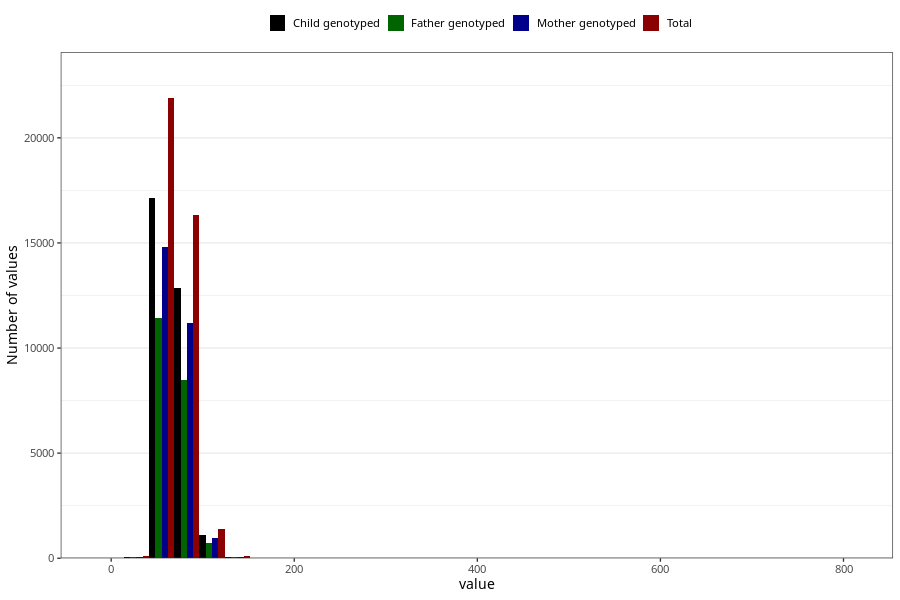

# mother_weight_5y
Variable mapping to questionnaire: q7, question LL339.
.
- Number of values:

| Value | Total | Child genotyped | Mother genotyped | Father genotyped |
| ----- | ----- | --------------- | ---------------- | ---------------- |
| Missing | 73743 | 52070 | 44641 | 29460 |
| 1 | 1 | 1 | 0 |0 |
| 3.6 | 1 | 1 | 1 |0 |
| 5 | 5 | 5 | 3 |2 |
| 5.1 | 1 | 0 | 0 |0 |
| 5.3 | 1 | 0 | 0 |0 |
| 5.5 | 1 | 1 | 1 |1 |
| 5.7 | 1 | 1 | 1 |1 |
| 5.9 | 1 | 1 | 0 |0 |
| 6 | 2 | 1 | 0 |0 |
| 6.2 | 1 | 1 | 1 |1 |
| 6.3 | 2 | 1 | 1 |0 |
| 6.7 | 1 | 1 | 1 |0 |
| 7.4 | 1 | 1 | 1 |1 |
| 7.7 | 1 | 0 | 0 |0 |
| 8.5 | 1 | 1 | 0 |0 |
| 9 | 1 | 0 | 0 |0 |
| 10 | 1 | 0 | 0 |0 |
| 12 | 1 | 0 | 0 |0 |
| 14.6 | 1 | 1 | 1 |1 |
| 15 | 1 | 1 | 1 |1 |
| 15.4 | 1 | 1 | 1 |1 |
| 15.5 | 1 | 0 | 0 |0 |
| 16 | 2 | 1 | 1 |1 |
| 16.4 | 1 | 0 | 0 |0 |
| 16.5 | 1 | 1 | 0 |0 |
| 16.8 | 1 | 0 | 0 |0 |
| 17 | 6 | 5 | 4 |2 |
| 17.4 | 1 | 0 | 0 |0 |
| 17.5 | 1 | 1 | 0 |0 |
| 18 | 7 | 7 | 4 |4 |
| 18.2 | 1 | 1 | 1 |1 |
| 18.5 | 1 | 1 | 1 |1 |
| 18.6 | 1 | 1 | 1 |1 |
| 18.7 | 1 | 1 | 1 |1 |
| 18.9 | 2 | 1 | 1 |1 |
| 19 | 6 | 2 | 2 |2 |
| 19.2 | 1 | 1 | 1 |1 |
| 19.5 | 2 | 1 | 1 |1 |
| 19.8 | 1 | 1 | 1 |1 |
| 20 | 15 | 11 | 9 |7 |
| 20.2 | 2 | 1 | 1 |0 |
| 20.5 | 1 | 1 | 1 |0 |
| 20.6 | 1 | 1 | 1 |0 |
| 21 | 10 | 8 | 6 |3 |
| 21.5 | 1 | 0 | 0 |0 |
| 21.7 | 1 | 1 | 1 |0 |
| 21.8 | 1 | 0 | 0 |0 |
| 22 | 3 | 2 | 2 |2 |
| 22.5 | 2 | 2 | 2 |2 |
| 22.7 | 1 | 1 | 1 |1 |
| 23.5 | 1 | 1 | 0 |0 |
| 24 | 2 | 2 | 2 |2 |
| 24.2 | 1 | 1 | 1 |0 |
| 24.8 | 1 | 1 | 1 |0 |
| 25 | 5 | 4 | 2 |2 |
| 26.2 | 1 | 1 | 1 |1 |
| 28.5 | 1 | 1 | 1 |0 |
| 29 | 1 | 1 | 1 |1 |
| 33 | 1 | 1 | 1 |1 |
| 37 | 1 | 1 | 0 |0 |
| 39 | 1 | 1 | 1 |0 |
| 39.5 | 1 | 1 | 0 |0 |
| 39.9 | 1 | 1 | 0 |0 |
| 40 | 2 | 1 | 1 |1 |
| 40.2 | 1 | 1 | 0 |0 |
| 41 | 1 | 1 | 1 |1 |
| 42 | 6 | 5 | 2 |2 |
| 42.5 | 1 | 1 | 0 |0 |
| 42.6 | 1 | 1 | 1 |1 |
| 42.7 | 1 | 1 | 0 |0 |
| 42.9 | 1 | 1 | 1 |1 |
| 43 | 15 | 13 | 11 |9 |
| 43.5 | 1 | 1 | 1 |0 |
| 43.9 | 1 | 0 | 0 |0 |
| 44 | 13 | 9 | 5 |4 |
| 44.5 | 4 | 4 | 4 |3 |
| 45 | 31 | 20 | 13 |11 |
| 45.2 | 1 | 1 | 1 |1 |
| 45.3 | 1 | 0 | 0 |0 |
| 45.5 | 4 | 2 | 2 |2 |
| 45.7 | 1 | 1 | 1 |1 |
| 45.8 | 1 | 1 | 0 |0 |
| 46 | 22 | 17 | 12 |8 |
| 46.1 | 1 | 1 | 1 |1 |
| 46.2 | 1 | 0 | 0 |0 |
| 46.3 | 1 | 0 | 0 |0 |
| 46.5 | 6 | 5 | 3 |4 |
| 46.6 | 1 | 1 | 1 |1 |
| 46.7 | 3 | 3 | 1 |2 |
| 46.8 | 1 | 0 | 0 |0 |
| 46.9 | 1 | 1 | 1 |1 |
| 47 | 59 | 43 | 35 |24 |
| 47.1 | 1 | 1 | 1 |1 |
| 47.2 | 2 | 2 | 2 |2 |
| 47.3 | 3 | 3 | 2 |2 |
| 47.4 | 1 | 1 | 1 |1 |
| 47.5 | 17 | 15 | 11 |9 |
| 47.6 | 1 | 1 | 1 |1 |
| 47.8 | 4 | 4 | 3 |2 |
| 47.9 | 1 | 0 | 0 |0 |
| 48 | 97 | 76 | 62 |45 |
| 48.2 | 2 | 2 | 1 |0 |
| 48.3 | 2 | 1 | 1 |1 |
| 48.5 | 15 | 10 | 7 |5 |
| 48.6 | 2 | 1 | 0 |0 |
| 48.7 | 1 | 1 | 1 |1 |
| 48.8 | 2 | 1 | 1 |1 |
| 48.9 | 1 | 1 | 1 |1 |
| 49 | 96 | 74 | 59 |46 |
| 49.3 | 4 | 2 | 2 |1 |
| 49.4 | 2 | 2 | 2 |2 |
| 49.5 | 24 | 18 | 17 |7 |
| 49.7 | 3 | 2 | 2 |1 |
| 49.8 | 1 | 1 | 1 |1 |
| 49.9 | 2 | 1 | 0 |0 |
| 50 | 321 | 250 | 194 |136 |
| 50.1 | 2 | 2 | 2 |1 |
| 50.2 | 4 | 3 | 3 |2 |
| 50.4 | 2 | 1 | 0 |0 |
| 50.5 | 18 | 16 | 11 |9 |
| 50.6 | 2 | 1 | 1 |1 |
| 50.7 | 1 | 1 | 1 |1 |
| 50.8 | 3 | 2 | 2 |2 |
| 50.9 | 3 | 0 | 0 |0 |
| 51 | 186 | 138 | 111 |78 |
| 51.1 | 2 | 2 | 2 |2 |
| 51.2 | 4 | 3 | 2 |2 |
| 51.3 | 6 | 3 | 3 |2 |
| 51.4 | 2 | 2 | 2 |1 |
| 51.5 | 41 | 31 | 24 |18 |
| 51.6 | 3 | 2 | 2 |2 |
| 51.7 | 3 | 2 | 1 |1 |
| 51.8 | 5 | 4 | 4 |4 |
| 51.9 | 1 | 1 | 1 |1 |
| 52 | 409 | 323 | 278 |217 |
| 52.2 | 13 | 9 | 6 |4 |
| 52.3 | 10 | 7 | 6 |2 |
| 52.4 | 5 | 4 | 4 |3 |
| 52.5 | 63 | 51 | 45 |33 |
| 52.6 | 5 | 3 | 3 |3 |
| 52.7 | 2 | 2 | 1 |1 |
| 52.8 | 8 | 7 | 6 |4 |
| 52.9 | 5 | 4 | 3 |2 |
| 53 | 459 | 353 | 293 |231 |
| 53.1 | 7 | 5 | 4 |4 |
| 53.2 | 13 | 13 | 10 |9 |
| 53.3 | 3 | 2 | 1 |1 |
| 53.4 | 11 | 8 | 7 |6 |
| 53.5 | 77 | 61 | 48 |36 |
| 53.6 | 3 | 2 | 2 |1 |
| 53.7 | 6 | 5 | 4 |3 |
| 53.8 | 9 | 7 | 6 |5 |
| 53.9 | 5 | 4 | 4 |2 |
| 54 | 504 | 393 | 338 |260 |
| 54.1 | 4 | 4 | 2 |1 |
| 54.2 | 8 | 4 | 2 |3 |
| 54.3 | 6 | 3 | 3 |2 |
| 54.4 | 6 | 6 | 6 |4 |
| 54.5 | 62 | 53 | 45 |41 |
| 54.6 | 7 | 5 | 4 |3 |
| 54.7 | 6 | 4 | 3 |2 |
| 54.8 | 6 | 4 | 4 |2 |
| 54.9 | 2 | 2 | 1 |1 |
| 55 | 716 | 547 | 479 |352 |
| 55.1 | 1 | 1 | 1 |0 |
| 55.2 | 4 | 3 | 3 |2 |
| 55.3 | 4 | 3 | 2 |2 |
| 55.4 | 11 | 10 | 9 |7 |
| 55.5 | 85 | 64 | 50 |35 |
| 55.6 | 13 | 9 | 7 |7 |
| 55.7 | 8 | 6 | 6 |6 |
| 55.8 | 6 | 6 | 5 |3 |
| 55.9 | 5 | 4 | 3 |3 |
| 56 | 695 | 538 | 469 |387 |
| 56.1 | 8 | 8 | 6 |3 |
| 56.2 | 12 | 11 | 8 |8 |
| 56.3 | 6 | 6 | 6 |5 |
| 56.4 | 7 | 7 | 6 |6 |
| 56.5 | 122 | 99 | 84 |60 |
| 56.6 | 8 | 6 | 5 |4 |
| 56.7 | 16 | 8 | 8 |7 |
| 56.8 | 10 | 7 | 4 |4 |
| 56.9 | 5 | 4 | 3 |2 |
| 57 | 804 | 638 | 563 |441 |
| 57.1 | 5 | 4 | 3 |3 |
| 57.2 | 11 | 7 | 6 |6 |
| 57.3 | 15 | 10 | 7 |8 |
| 57.4 | 13 | 12 | 9 |6 |
| 57.5 | 142 | 112 | 97 |75 |
| 57.6 | 8 | 7 | 5 |6 |
| 57.7 | 5 | 4 | 4 |4 |
| 57.8 | 17 | 12 | 8 |5 |
| 57.9 | 6 | 5 | 5 |3 |
| 58 | 1113 | 868 | 759 |576 |
| 58.1 | 15 | 10 | 10 |5 |
| 58.2 | 25 | 17 | 12 |10 |
| 58.3 | 16 | 13 | 11 |8 |
| 58.4 | 11 | 9 | 7 |4 |
| 58.5 | 136 | 108 | 90 |76 |
| 58.6 | 10 | 7 | 7 |3 |
| 58.7 | 10 | 8 | 7 |5 |
| 58.8 | 12 | 6 | 4 |4 |
| 58.9 | 9 | 5 | 4 |2 |
| 59 | 792 | 625 | 544 |420 |
| 59.1 | 15 | 11 | 8 |5 |
| 59.2 | 16 | 12 | 11 |7 |
| 59.3 | 13 | 10 | 10 |6 |
| 59.4 | 7 | 5 | 3 |3 |
| 59.5 | 85 | 60 | 55 |40 |
| 59.6 | 11 | 6 | 5 |6 |
| 59.7 | 9 | 7 | 6 |4 |
| 59.8 | 13 | 10 | 8 |6 |
| 59.9 | 5 | 4 | 3 |2 |
| 60 | 1747 | 1366 | 1175 |893 |
| 60.1 | 12 | 10 | 9 |7 |
| 60.2 | 30 | 22 | 20 |17 |
| 60.3 | 17 | 15 | 14 |12 |
| 60.4 | 9 | 8 | 7 |5 |
| 60.5 | 128 | 100 | 91 |73 |
| 60.6 | 3 | 2 | 2 |2 |
| 60.7 | 6 | 6 | 5 |3 |
| 60.8 | 13 | 11 | 9 |9 |
| 60.9 | 8 | 7 | 7 |5 |
| 61 | 770 | 621 | 538 |409 |
| 61.1 | 10 | 9 | 4 |4 |
| 61.2 | 22 | 18 | 15 |9 |
| 61.3 | 24 | 20 | 17 |14 |
| 61.4 | 9 | 7 | 6 |6 |
| 61.5 | 175 | 139 | 129 |103 |
| 61.6 | 7 | 4 | 4 |4 |
| 61.7 | 15 | 13 | 11 |10 |
| 61.8 | 21 | 15 | 13 |9 |
| 61.9 | 5 | 4 | 4 |4 |
| 62 | 1359 | 1069 | 941 |718 |
| 62.1 | 17 | 10 | 7 |7 |
| 62.2 | 21 | 17 | 14 |10 |
| 62.3 | 24 | 21 | 18 |14 |
| 62.4 | 13 | 10 | 9 |7 |
| 62.5 | 234 | 181 | 156 |110 |
| 62.6 | 8 | 7 | 7 |5 |
| 62.7 | 17 | 15 | 14 |14 |
| 62.8 | 14 | 9 | 8 |6 |
| 62.9 | 6 | 5 | 5 |5 |
| 63 | 1289 | 1018 | 888 |690 |
| 63.1 | 16 | 14 | 13 |9 |
| 63.2 | 38 | 27 | 23 |18 |
| 63.3 | 18 | 15 | 15 |10 |
| 63.4 | 19 | 11 | 10 |9 |
| 63.5 | 207 | 172 | 156 |129 |
| 63.6 | 9 | 8 | 7 |4 |
| 63.7 | 11 | 8 | 8 |7 |
| 63.8 | 16 | 13 | 10 |7 |
| 63.9 | 8 | 5 | 5 |4 |
| 64 | 1115 | 888 | 773 |595 |
| 64.1 | 14 | 10 | 8 |5 |
| 64.2 | 28 | 25 | 24 |17 |
| 64.3 | 22 | 20 | 17 |13 |
| 64.4 | 15 | 12 | 11 |9 |
| 64.5 | 163 | 123 | 109 |82 |
| 64.6 | 10 | 7 | 6 |6 |
| 64.7 | 18 | 12 | 10 |8 |
| 64.8 | 20 | 19 | 16 |8 |
| 64.9 | 4 | 4 | 4 |3 |
| 65 | 1783 | 1380 | 1199 |950 |
| 65.1 | 10 | 7 | 7 |5 |
| 65.2 | 14 | 11 | 10 |7 |
| 65.3 | 19 | 15 | 14 |13 |
| 65.4 | 22 | 18 | 15 |13 |
| 65.5 | 157 | 119 | 100 |83 |
| 65.6 | 7 | 7 | 6 |6 |
| 65.7 | 19 | 13 | 12 |8 |
| 65.8 | 13 | 11 | 10 |9 |
| 65.9 | 4 | 4 | 4 |2 |
| 66 | 801 | 620 | 532 |418 |
| 66.1 | 10 | 6 | 5 |3 |
| 66.2 | 21 | 18 | 16 |14 |
| 66.3 | 21 | 18 | 18 |11 |
| 66.4 | 15 | 12 | 12 |8 |
| 66.5 | 155 | 121 | 105 |82 |
| 66.6 | 18 | 16 | 13 |11 |
| 66.7 | 19 | 16 | 15 |12 |
| 66.8 | 14 | 10 | 8 |7 |
| 66.9 | 8 | 6 | 4 |4 |
| 67 | 1104 | 899 | 785 |600 |
| 67.1 | 11 | 8 | 7 |6 |
| 67.2 | 24 | 19 | 17 |11 |
| 67.3 | 18 | 17 | 12 |8 |
| 67.4 | 10 | 9 | 9 |6 |
| 67.5 | 189 | 162 | 142 |111 |
| 67.6 | 17 | 11 | 9 |7 |
| 67.7 | 14 | 8 | 7 |6 |
| 67.8 | 13 | 11 | 9 |6 |
| 67.9 | 10 | 8 | 6 |6 |
| 68 | 1360 | 1050 | 921 |712 |
| 68.1 | 13 | 12 | 11 |12 |
| 68.2 | 25 | 15 | 12 |10 |
| 68.3 | 31 | 27 | 25 |20 |
| 68.4 | 22 | 15 | 13 |8 |
| 68.5 | 183 | 146 | 126 |97 |
| 68.6 | 7 | 5 | 4 |3 |
| 68.7 | 20 | 16 | 14 |10 |
| 68.8 | 15 | 10 | 9 |6 |
| 68.9 | 7 | 6 | 5 |4 |
| 69 | 922 | 717 | 618 |495 |
| 69.1 | 13 | 10 | 7 |5 |
| 69.2 | 22 | 15 | 14 |9 |
| 69.3 | 10 | 9 | 7 |3 |
| 69.4 | 18 | 12 | 10 |10 |
| 69.5 | 108 | 90 | 79 |66 |
| 69.6 | 6 | 5 | 5 |4 |
| 69.7 | 16 | 12 | 9 |7 |
| 69.8 | 19 | 15 | 10 |7 |
| 69.9 | 5 | 4 | 3 |2 |
| 70 | 1709 | 1357 | 1190 |904 |
| 70.1 | 23 | 18 | 16 |11 |
| 70.2 | 27 | 20 | 20 |16 |
| 70.3 | 11 | 11 | 11 |10 |
| 70.4 | 13 | 10 | 9 |9 |
| 70.5 | 99 | 72 | 66 |51 |
| 70.6 | 8 | 5 | 5 |4 |
| 70.7 | 2 | 1 | 1 |0 |
| 70.8 | 15 | 14 | 13 |11 |
| 70.9 | 8 | 7 | 6 |4 |
| 71 | 492 | 397 | 352 |276 |
| 71.1 | 7 | 6 | 6 |6 |
| 71.2 | 25 | 22 | 19 |14 |
| 71.3 | 16 | 11 | 10 |7 |
| 71.4 | 14 | 11 | 9 |8 |
| 71.5 | 102 | 80 | 72 |49 |
| 71.6 | 7 | 7 | 6 |5 |
| 71.7 | 3 | 3 | 3 |3 |
| 71.8 | 18 | 15 | 15 |11 |
| 71.9 | 9 | 9 | 7 |6 |
| 72 | 1012 | 790 | 695 |510 |
| 72.1 | 15 | 9 | 8 |5 |
| 72.2 | 27 | 22 | 19 |14 |
| 72.3 | 17 | 14 | 13 |8 |
| 72.4 | 14 | 11 | 8 |8 |
| 72.5 | 124 | 100 | 85 |64 |
| 72.6 | 10 | 9 | 7 |6 |
| 72.7 | 5 | 5 | 5 |4 |
| 72.8 | 10 | 7 | 7 |5 |
| 72.9 | 4 | 3 | 1 |0 |
| 73 | 714 | 566 | 486 |360 |
| 73.1 | 9 | 6 | 5 |6 |
| 73.2 | 21 | 19 | 16 |12 |
| 73.3 | 9 | 6 | 6 |6 |
| 73.4 | 30 | 28 | 24 |14 |
| 73.5 | 91 | 73 | 63 |45 |
| 73.6 | 10 | 10 | 8 |10 |
| 73.7 | 2 | 2 | 1 |0 |
| 73.8 | 17 | 11 | 11 |10 |
| 73.9 | 4 | 4 | 2 |1 |
| 74 | 674 | 520 | 457 |361 |
| 74.1 | 7 | 6 | 6 |3 |
| 74.2 | 21 | 18 | 15 |11 |
| 74.3 | 13 | 10 | 8 |5 |
| 74.4 | 15 | 13 | 12 |9 |
| 74.5 | 90 | 64 | 53 |43 |
| 74.6 | 13 | 12 | 12 |10 |
| 74.7 | 1 | 0 | 0 |0 |
| 74.8 | 8 | 6 | 5 |4 |
| 74.9 | 5 | 4 | 3 |2 |
| 75 | 1102 | 861 | 744 |562 |
| 75.1 | 6 | 4 | 3 |3 |
| 75.2 | 21 | 16 | 13 |9 |
| 75.3 | 7 | 6 | 5 |4 |
| 75.4 | 9 | 7 | 7 |3 |
| 75.5 | 78 | 60 | 52 |38 |
| 75.6 | 13 | 9 | 9 |4 |
| 75.7 | 3 | 2 | 2 |2 |
| 75.8 | 12 | 10 | 10 |10 |
| 75.9 | 4 | 4 | 3 |2 |
| 76 | 497 | 393 | 336 |252 |
| 76.1 | 2 | 2 | 2 |1 |
| 76.2 | 22 | 21 | 19 |15 |
| 76.3 | 9 | 6 | 6 |5 |
| 76.4 | 16 | 11 | 11 |9 |
| 76.5 | 60 | 44 | 43 |34 |
| 76.6 | 9 | 9 | 8 |7 |
| 76.7 | 9 | 7 | 6 |4 |
| 76.8 | 10 | 9 | 8 |5 |
| 76.9 | 5 | 2 | 2 |2 |
| 77 | 445 | 349 | 304 |239 |
| 77.1 | 8 | 6 | 6 |5 |
| 77.2 | 12 | 10 | 6 |4 |
| 77.3 | 8 | 7 | 6 |7 |
| 77.4 | 14 | 9 | 9 |6 |
| 77.5 | 61 | 48 | 41 |37 |
| 77.6 | 10 | 7 | 5 |4 |
| 77.7 | 9 | 6 | 5 |5 |
| 77.8 | 7 | 6 | 5 |4 |
| 77.9 | 5 | 2 | 2 |2 |
| 78 | 639 | 512 | 457 |343 |
| 78.1 | 7 | 3 | 3 |2 |
| 78.2 | 16 | 11 | 11 |11 |
| 78.3 | 10 | 8 | 7 |6 |
| 78.4 | 3 | 2 | 1 |1 |
| 78.5 | 69 | 53 | 46 |35 |
| 78.6 | 9 | 8 | 6 |3 |
| 78.7 | 1 | 1 | 1 |1 |
| 78.8 | 13 | 11 | 10 |8 |
| 78.9 | 4 | 3 | 3 |3 |
| 79 | 387 | 287 | 253 |183 |
| 79.1 | 6 | 3 | 3 |3 |
| 79.2 | 13 | 8 | 8 |7 |
| 79.3 | 11 | 9 | 8 |5 |
| 79.4 | 8 | 5 | 5 |4 |
| 79.5 | 52 | 39 | 33 |22 |
| 79.6 | 5 | 3 | 3 |3 |
| 79.7 | 1 | 1 | 1 |1 |
| 79.8 | 15 | 10 | 9 |7 |
| 79.9 | 5 | 3 | 3 |3 |
| 80 | 985 | 795 | 682 |519 |
| 80.1 | 23 | 18 | 15 |9 |
| 80.2 | 21 | 14 | 13 |9 |
| 80.3 | 7 | 6 | 5 |4 |
| 80.4 | 11 | 8 | 8 |3 |
| 80.5 | 48 | 37 | 33 |23 |
| 80.6 | 4 | 2 | 2 |0 |
| 80.7 | 4 | 4 | 2 |2 |
| 80.8 | 4 | 3 | 2 |2 |
| 80.9 | 3 | 3 | 3 |2 |
| 81 | 191 | 150 | 129 |98 |
| 81.1 | 4 | 3 | 1 |2 |
| 81.2 | 8 | 7 | 7 |6 |
| 81.3 | 14 | 13 | 12 |9 |
| 81.4 | 7 | 3 | 3 |3 |
| 81.5 | 37 | 27 | 24 |18 |
| 81.6 | 8 | 6 | 5 |1 |
| 81.7 | 6 | 5 | 5 |4 |
| 81.8 | 3 | 3 | 3 |2 |
| 81.9 | 5 | 4 | 2 |2 |
| 82 | 380 | 299 | 263 |190 |
| 82.1 | 7 | 6 | 4 |5 |
| 82.2 | 13 | 11 | 10 |8 |
| 82.3 | 9 | 5 | 5 |4 |
| 82.4 | 11 | 11 | 7 |7 |
| 82.5 | 46 | 38 | 31 |26 |
| 82.6 | 7 | 5 | 4 |3 |
| 82.7 | 7 | 5 | 5 |5 |
| 82.8 | 1 | 1 | 1 |1 |
| 82.9 | 2 | 1 | 1 |1 |
| 83 | 322 | 249 | 221 |167 |
| 83.1 | 4 | 3 | 3 |3 |
| 83.2 | 11 | 9 | 5 |6 |
| 83.3 | 5 | 5 | 5 |4 |
| 83.4 | 15 | 13 | 12 |8 |
| 83.5 | 43 | 36 | 30 |24 |
| 83.6 | 3 | 2 | 2 |2 |
| 83.7 | 5 | 4 | 3 |1 |
| 83.8 | 4 | 4 | 4 |4 |
| 83.9 | 5 | 3 | 3 |3 |
| 84 | 282 | 223 | 201 |153 |
| 84.1 | 3 | 1 | 0 |0 |
| 84.2 | 13 | 10 | 10 |7 |
| 84.3 | 10 | 9 | 9 |7 |
| 84.4 | 3 | 3 | 3 |3 |
| 84.5 | 34 | 28 | 25 |20 |
| 84.6 | 4 | 3 | 3 |2 |
| 84.7 | 6 | 5 | 5 |4 |
| 84.8 | 3 | 3 | 2 |1 |
| 84.9 | 6 | 4 | 3 |3 |
| 85 | 559 | 438 | 376 |291 |
| 85.1 | 2 | 1 | 1 |1 |
| 85.2 | 14 | 13 | 10 |6 |
| 85.3 | 5 | 5 | 5 |2 |
| 85.4 | 6 | 5 | 5 |4 |
| 85.5 | 34 | 23 | 21 |16 |
| 85.6 | 7 | 5 | 5 |5 |
| 85.7 | 4 | 2 | 2 |1 |
| 85.8 | 1 | 1 | 1 |1 |
| 85.9 | 3 | 2 | 1 |1 |
| 86 | 185 | 145 | 127 |95 |
| 86.1 | 4 | 2 | 1 |2 |
| 86.2 | 4 | 4 | 2 |1 |
| 86.3 | 6 | 5 | 3 |0 |
| 86.4 | 6 | 6 | 5 |5 |
| 86.5 | 23 | 21 | 18 |15 |
| 86.6 | 5 | 4 | 4 |3 |
| 86.7 | 5 | 5 | 4 |4 |
| 86.8 | 2 | 2 | 2 |1 |
| 86.9 | 3 | 3 | 3 |2 |
| 87 | 186 | 151 | 127 |103 |
| 87.1 | 4 | 3 | 2 |2 |
| 87.2 | 4 | 4 | 3 |2 |
| 87.3 | 3 | 1 | 1 |1 |
| 87.4 | 7 | 6 | 5 |3 |
| 87.5 | 23 | 18 | 17 |11 |
| 87.6 | 3 | 2 | 1 |1 |
| 87.7 | 4 | 4 | 4 |2 |
| 87.8 | 2 | 2 | 2 |1 |
| 87.9 | 3 | 2 | 1 |1 |
| 88 | 224 | 170 | 153 |112 |
| 88.1 | 6 | 6 | 5 |5 |
| 88.2 | 4 | 3 | 3 |2 |
| 88.3 | 3 | 2 | 1 |1 |
| 88.4 | 2 | 2 | 2 |2 |
| 88.5 | 20 | 18 | 13 |10 |
| 88.6 | 6 | 6 | 5 |5 |
| 88.7 | 2 | 2 | 2 |2 |
| 88.8 | 3 | 3 | 3 |3 |
| 88.9 | 1 | 1 | 1 |1 |
| 89 | 178 | 142 | 128 |92 |
| 89.1 | 4 | 4 | 4 |2 |
| 89.2 | 5 | 4 | 4 |2 |
| 89.3 | 7 | 5 | 4 |3 |
| 89.4 | 3 | 2 | 2 |1 |
| 89.5 | 25 | 18 | 14 |13 |
| 89.6 | 1 | 1 | 1 |1 |
| 89.7 | 4 | 3 | 3 |2 |
| 89.8 | 4 | 4 | 3 |2 |
| 90 | 512 | 410 | 363 |272 |
| 90.1 | 7 | 6 | 6 |6 |
| 90.2 | 12 | 10 | 8 |8 |
| 90.3 | 4 | 2 | 2 |2 |
| 90.4 | 2 | 1 | 1 |1 |
| 90.5 | 18 | 17 | 14 |7 |
| 90.6 | 1 | 1 | 1 |1 |
| 90.7 | 4 | 4 | 3 |3 |
| 90.8 | 3 | 2 | 2 |2 |
| 90.9 | 2 | 2 | 2 |2 |
| 91 | 70 | 56 | 48 |30 |
| 91.1 | 2 | 0 | 0 |0 |
| 91.2 | 5 | 4 | 4 |2 |
| 91.3 | 1 | 1 | 1 |1 |
| 91.4 | 8 | 6 | 6 |3 |
| 91.5 | 18 | 14 | 14 |8 |
| 91.6 | 2 | 2 | 2 |1 |
| 91.7 | 3 | 3 | 2 |2 |
| 91.8 | 5 | 4 | 3 |3 |
| 92 | 139 | 102 | 87 |59 |
| 92.1 | 2 | 0 | 0 |0 |
| 92.2 | 3 | 2 | 2 |1 |
| 92.3 | 3 | 2 | 2 |1 |
| 92.4 | 2 | 2 | 2 |1 |
| 92.5 | 16 | 14 | 12 |5 |
| 92.7 | 1 | 1 | 1 |1 |
| 92.8 | 1 | 1 | 1 |1 |
| 92.9 | 3 | 3 | 3 |2 |
| 93 | 131 | 98 | 79 |66 |
| 93.1 | 3 | 3 | 2 |0 |
| 93.2 | 2 | 1 | 1 |0 |
| 93.4 | 5 | 4 | 4 |3 |
| 93.5 | 16 | 13 | 9 |9 |
| 93.8 | 2 | 2 | 2 |1 |
| 94 | 114 | 92 | 78 |56 |
| 94.1 | 5 | 4 | 4 |3 |
| 94.2 | 6 | 5 | 4 |3 |
| 94.3 | 3 | 2 | 2 |2 |
| 94.4 | 3 | 3 | 2 |2 |
| 94.5 | 12 | 8 | 7 |4 |
| 94.6 | 1 | 1 | 1 |0 |
| 94.7 | 2 | 1 | 1 |0 |
| 94.8 | 2 | 2 | 2 |1 |
| 95 | 271 | 210 | 182 |131 |
| 95.2 | 6 | 5 | 4 |4 |
| 95.3 | 6 | 4 | 4 |4 |
| 95.4 | 1 | 1 | 1 |1 |
| 95.5 | 7 | 6 | 6 |5 |
| 95.6 | 4 | 4 | 3 |1 |
| 95.7 | 1 | 1 | 1 |0 |
| 95.8 | 2 | 2 | 2 |2 |
| 96 | 92 | 69 | 58 |43 |
| 96.1 | 4 | 1 | 1 |0 |
| 96.2 | 9 | 6 | 6 |4 |
| 96.4 | 1 | 1 | 1 |0 |
| 96.5 | 10 | 10 | 9 |9 |
| 96.7 | 2 | 1 | 1 |1 |
| 96.8 | 2 | 2 | 2 |2 |
| 96.9 | 1 | 1 | 0 |0 |
| 97 | 83 | 60 | 55 |46 |
| 97.1 | 1 | 0 | 0 |0 |
| 97.2 | 3 | 3 | 3 |2 |
| 97.3 | 3 | 2 | 2 |2 |
| 97.4 | 1 | 1 | 1 |0 |
| 97.5 | 8 | 5 | 4 |1 |
| 97.6 | 4 | 3 | 3 |1 |
| 97.7 | 1 | 1 | 1 |0 |
| 97.8 | 1 | 1 | 1 |1 |
| 98 | 125 | 95 | 79 |57 |
| 98.1 | 2 | 2 | 1 |1 |
| 98.3 | 4 | 4 | 3 |2 |
| 98.4 | 4 | 2 | 2 |2 |
| 98.5 | 16 | 14 | 10 |9 |
| 98.6 | 1 | 1 | 1 |1 |
| 98.8 | 3 | 2 | 2 |1 |
| 98.9 | 1 | 1 | 0 |0 |
| 99 | 67 | 55 | 44 |36 |
| 99.2 | 1 | 1 | 1 |1 |
| 99.3 | 1 | 0 | 0 |0 |
| 99.4 | 1 | 1 | 1 |1 |
| 99.5 | 6 | 4 | 4 |2 |
| 99.6 | 3 | 2 | 2 |2 |
| 99.7 | 3 | 1 | 1 |1 |
| 99.8 | 3 | 2 | 2 |1 |
| 99.9 | 1 | 1 | 1 |1 |
| 100 | 185 | 145 | 125 |95 |
| 100.1 | 1 | 1 | 0 |0 |
| 100.2 | 1 | 1 | 1 |1 |
| 100.3 | 1 | 1 | 1 |0 |
| 100.4 | 1 | 1 | 1 |1 |
| 100.5 | 7 | 6 | 5 |4 |
| 100.6 | 1 | 1 | 1 |1 |
| 100.7 | 2 | 2 | 2 |1 |
| 101 | 26 | 21 | 19 |15 |
| 101.1 | 1 | 1 | 0 |0 |
| 101.2 | 3 | 3 | 3 |1 |
| 101.3 | 3 | 2 | 2 |2 |
| 101.4 | 1 | 1 | 1 |0 |
| 101.5 | 11 | 8 | 7 |5 |
| 101.7 | 2 | 2 | 2 |1 |
| 101.8 | 1 | 0 | 0 |0 |
| 101.9 | 2 | 1 | 1 |1 |
| 102 | 50 | 40 | 37 |29 |
| 102.1 | 1 | 0 | 0 |0 |
| 102.2 | 4 | 3 | 2 |2 |
| 102.5 | 1 | 0 | 0 |0 |
| 102.6 | 1 | 0 | 0 |0 |
| 102.7 | 3 | 3 | 3 |3 |
| 102.9 | 1 | 1 | 0 |0 |
| 103 | 45 | 41 | 38 |30 |
| 103.3 | 2 | 2 | 2 |1 |
| 103.4 | 1 | 1 | 0 |0 |
| 103.5 | 6 | 2 | 2 |2 |
| 103.6 | 1 | 1 | 1 |0 |
| 103.7 | 1 | 1 | 1 |1 |
| 103.9 | 1 | 1 | 1 |1 |
| 104 | 34 | 27 | 25 |18 |
| 104.1 | 1 | 1 | 1 |1 |
| 104.2 | 2 | 2 | 1 |1 |
| 104.3 | 3 | 2 | 2 |2 |
| 104.4 | 1 | 1 | 1 |1 |
| 104.5 | 2 | 2 | 2 |2 |
| 104.6 | 1 | 1 | 1 |1 |
| 104.9 | 1 | 1 | 1 |1 |
| 105 | 85 | 66 | 58 |43 |
| 105.1 | 2 | 2 | 1 |1 |
| 105.2 | 1 | 1 | 1 |0 |
| 105.4 | 2 | 1 | 1 |1 |
| 105.5 | 4 | 4 | 4 |4 |
| 105.6 | 1 | 1 | 1 |1 |
| 105.8 | 2 | 2 | 2 |1 |
| 106 | 31 | 26 | 22 |16 |
| 106.2 | 3 | 3 | 3 |3 |
| 106.5 | 5 | 4 | 3 |2 |
| 107 | 29 | 24 | 24 |15 |
| 107.1 | 1 | 1 | 1 |1 |
| 107.2 | 4 | 4 | 3 |2 |
| 107.3 | 1 | 0 | 0 |0 |
| 107.5 | 4 | 2 | 2 |2 |
| 107.6 | 1 | 0 | 0 |0 |
| 107.8 | 4 | 3 | 2 |2 |
| 108 | 33 | 22 | 19 |16 |
| 108.1 | 1 | 1 | 1 |1 |
| 108.3 | 1 | 1 | 0 |0 |
| 108.5 | 6 | 5 | 5 |3 |
| 109 | 26 | 22 | 20 |15 |
| 109.3 | 1 | 1 | 1 |1 |
| 109.4 | 1 | 1 | 1 |1 |
| 109.5 | 2 | 1 | 1 |1 |
| 109.7 | 1 | 1 | 0 |0 |
| 109.8 | 1 | 1 | 1 |1 |
| 110 | 109 | 86 | 73 |53 |
| 110.1 | 1 | 1 | 0 |0 |
| 110.2 | 1 | 1 | 1 |0 |
| 110.5 | 1 | 1 | 1 |0 |
| 110.6 | 1 | 1 | 1 |1 |
| 111 | 12 | 10 | 10 |9 |
| 111.1 | 2 | 2 | 2 |0 |
| 111.2 | 1 | 1 | 1 |1 |
| 111.4 | 1 | 1 | 0 |0 |
| 111.6 | 1 | 0 | 0 |0 |
| 111.7 | 1 | 1 | 1 |1 |
| 112 | 26 | 21 | 17 |13 |
| 112.2 | 1 | 0 | 0 |0 |
| 112.5 | 3 | 3 | 2 |1 |
| 112.6 | 1 | 1 | 1 |0 |
| 113 | 14 | 8 | 8 |6 |
| 113.3 | 2 | 1 | 0 |0 |
| 113.4 | 1 | 1 | 1 |1 |
| 113.5 | 2 | 1 | 1 |1 |
| 113.6 | 1 | 1 | 1 |1 |
| 114 | 21 | 14 | 13 |8 |
| 114.5 | 1 | 0 | 0 |0 |
| 114.8 | 1 | 0 | 0 |0 |
| 114.9 | 1 | 1 | 1 |0 |
| 115 | 47 | 38 | 29 |20 |
| 115.2 | 1 | 1 | 1 |0 |
| 115.4 | 1 | 0 | 0 |0 |
| 115.5 | 4 | 4 | 3 |4 |
| 116 | 12 | 9 | 7 |6 |
| 117 | 3 | 3 | 3 |1 |
| 117.2 | 1 | 1 | 1 |1 |
| 117.4 | 1 | 1 | 1 |0 |
| 118 | 9 | 7 | 6 |3 |
| 118.2 | 1 | 1 | 1 |1 |
| 118.5 | 1 | 1 | 0 |0 |
| 118.6 | 1 | 1 | 0 |0 |
| 118.7 | 1 | 1 | 1 |0 |
| 119 | 5 | 3 | 2 |2 |
| 119.5 | 1 | 1 | 1 |0 |
| 119.6 | 1 | 1 | 1 |1 |
| 119.9 | 1 | 1 | 1 |1 |
| 120 | 56 | 46 | 37 |29 |
| 120.2 | 2 | 1 | 1 |0 |
| 120.3 | 1 | 1 | 0 |0 |
| 120.5 | 2 | 2 | 2 |1 |
| 120.7 | 2 | 1 | 1 |1 |
| 121 | 2 | 1 | 1 |0 |
| 121.1 | 1 | 0 | 0 |0 |
| 121.3 | 1 | 0 | 0 |0 |
| 122 | 2 | 2 | 2 |1 |
| 122.4 | 1 | 1 | 1 |0 |
| 123 | 4 | 4 | 3 |1 |
| 123.4 | 1 | 1 | 1 |0 |
| 123.5 | 2 | 1 | 1 |1 |
| 124 | 4 | 3 | 3 |2 |
| 124.5 | 1 | 1 | 1 |1 |
| 124.7 | 1 | 1 | 1 |1 |
| 125 | 20 | 14 | 13 |9 |
| 126 | 1 | 1 | 1 |1 |
| 126.5 | 1 | 1 | 1 |0 |
| 127 | 6 | 4 | 3 |1 |
| 127.5 | 2 | 1 | 1 |1 |
| 127.7 | 1 | 1 | 1 |0 |
| 128 | 6 | 3 | 3 |2 |
| 128.1 | 1 | 1 | 1 |0 |
| 129 | 3 | 2 | 2 |2 |
| 130 | 14 | 11 | 10 |7 |
| 131 | 1 | 0 | 0 |0 |
| 132 | 4 | 2 | 1 |1 |
| 132.2 | 1 | 1 | 1 |1 |
| 133 | 1 | 0 | 0 |0 |
| 133.6 | 1 | 1 | 1 |0 |
| 134 | 2 | 1 | 0 |0 |
| 134.5 | 1 | 1 | 1 |0 |
| 135 | 2 | 2 | 2 |2 |
| 136 | 2 | 2 | 1 |1 |
| 136.3 | 1 | 1 | 1 |1 |
| 137 | 1 | 1 | 1 |0 |
| 138 | 1 | 1 | 1 |1 |
| 138.3 | 1 | 1 | 1 |1 |
| 140 | 7 | 5 | 2 |2 |
| 143 | 2 | 2 | 2 |2 |
| 143.1 | 1 | 1 | 1 |0 |
| 143.2 | 1 | 1 | 0 |0 |
| 145 | 2 | 1 | 1 |1 |
| 146.2 | 1 | 0 | 0 |0 |
| 150 | 5 | 3 | 3 |3 |
| 153 | 3 | 3 | 2 |1 |
| 155 | 1 | 1 | 1 |1 |
| 157 | 1 | 1 | 1 |1 |
| 160 | 3 | 1 | 1 |0 |
| 163 | 1 | 1 | 1 |0 |
| 163.5 | 1 | 1 | 1 |0 |
| 164 | 2 | 0 | 0 |0 |
| 165 | 5 | 5 | 4 |4 |
| 169 | 2 | 1 | 1 |1 |
| 171 | 1 | 1 | 1 |0 |
| 171.2 | 1 | 0 | 0 |0 |
| 172 | 2 | 2 | 1 |2 |
| 173 | 1 | 0 | 0 |0 |
| 175 | 1 | 1 | 1 |0 |
| 176 | 1 | 1 | 1 |1 |
| 190 | 1 | 0 | 0 |0 |
| 192 | 1 | 1 | 1 |1 |
| 490.2 | 1 | 1 | 1 |1 |
| 500.5 | 1 | 1 | 0 |0 |
| 580 | 1 | 1 | 1 |1 |
| 600 | 1 | 1 | 1 |1 |
| 670 | 1 | 1 | 1 |1 |
| 680 | 1 | 0 | 0 |0 |
| 700 | 2 | 0 | 0 |0 |
| 720 | 1 | 0 | 0 |0 |
| 750 | 1 | 1 | 1 |1 |
| 780.8 | 1 | 0 | 0 |0 |
| 800 | 1 | 1 | 1 |1 |

