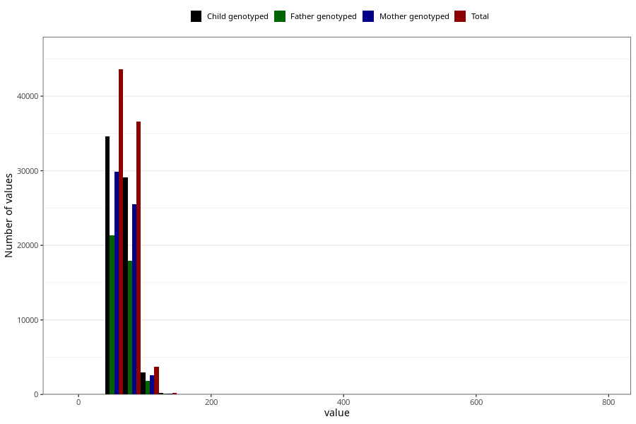

# mother_weight_6m
Variable mapping to questionnaire: q4, question DD673.
.
- Number of values:

| Value | Total | Child genotyped | Mother genotyped | Father genotyped |
| ----- | ----- | --------------- | ---------------- | ---------------- |
| Missing | 29494 | 16489 | 13672 | 9089 |
| 5 | 3 | 2 | 0 |1 |
| 5.4 | 1 | 1 | 1 |0 |
| 6 | 3 | 2 | 2 |2 |
| 6.3 | 1 | 1 | 1 |1 |
| 7 | 1 | 1 | 1 |0 |
| 7.5 | 1 | 1 | 1 |1 |
| 7.6 | 1 | 0 | 0 |0 |
| 9 | 1 | 1 | 1 |1 |
| 10 | 2 | 1 | 1 |1 |
| 32 | 1 | 1 | 1 |0 |
| 36 | 1 | 1 | 1 |0 |
| 37 | 3 | 3 | 3 |1 |
| 38 | 2 | 0 | 0 |0 |
| 38.4 | 1 | 1 | 1 |0 |
| 38.5 | 1 | 0 | 0 |0 |
| 39 | 3 | 2 | 2 |2 |
| 39.4 | 1 | 1 | 0 |0 |
| 40 | 10 | 7 | 5 |5 |
| 40.2 | 2 | 2 | 2 |2 |
| 40.5 | 1 | 1 | 1 |0 |
| 41 | 10 | 6 | 3 |3 |
| 41.2 | 1 | 1 | 1 |1 |
| 41.5 | 1 | 0 | 0 |0 |
| 41.6 | 1 | 1 | 1 |1 |
| 42 | 35 | 28 | 16 |8 |
| 42.2 | 1 | 1 | 0 |0 |
| 42.5 | 4 | 2 | 2 |2 |
| 42.7 | 1 | 1 | 0 |0 |
| 42.8 | 1 | 1 | 1 |0 |
| 43 | 42 | 31 | 18 |9 |
| 43.1 | 1 | 1 | 1 |1 |
| 43.5 | 8 | 7 | 5 |5 |
| 43.7 | 1 | 1 | 1 |1 |
| 44 | 48 | 35 | 26 |20 |
| 44.2 | 3 | 3 | 2 |2 |
| 44.5 | 18 | 16 | 13 |8 |
| 44.6 | 1 | 1 | 1 |1 |
| 44.8 | 1 | 1 | 1 |1 |
| 44.9 | 1 | 1 | 1 |0 |
| 45 | 102 | 79 | 55 |35 |
| 45.1 | 1 | 1 | 1 |1 |
| 45.2 | 1 | 1 | 0 |0 |
| 45.3 | 1 | 1 | 0 |0 |
| 45.5 | 13 | 9 | 8 |8 |
| 45.6 | 2 | 2 | 1 |1 |
| 45.7 | 3 | 1 | 1 |1 |
| 45.8 | 2 | 2 | 1 |0 |
| 46 | 114 | 92 | 79 |52 |
| 46.1 | 1 | 0 | 0 |0 |
| 46.2 | 2 | 2 | 2 |2 |
| 46.3 | 3 | 3 | 3 |2 |
| 46.5 | 25 | 18 | 13 |12 |
| 46.6 | 3 | 3 | 3 |2 |
| 46.7 | 4 | 4 | 2 |0 |
| 46.8 | 3 | 3 | 1 |0 |
| 46.9 | 1 | 1 | 1 |1 |
| 47 | 178 | 133 | 108 |62 |
| 47.1 | 2 | 2 | 1 |0 |
| 47.2 | 2 | 1 | 0 |0 |
| 47.3 | 3 | 3 | 3 |2 |
| 47.4 | 3 | 3 | 2 |2 |
| 47.5 | 30 | 23 | 16 |12 |
| 47.6 | 2 | 2 | 2 |2 |
| 47.7 | 2 | 2 | 1 |1 |
| 47.8 | 1 | 1 | 1 |1 |
| 47.9 | 3 | 1 | 1 |1 |
| 48 | 275 | 207 | 164 |110 |
| 48.1 | 2 | 1 | 0 |0 |
| 48.2 | 7 | 5 | 5 |4 |
| 48.3 | 4 | 2 | 2 |1 |
| 48.4 | 2 | 2 | 2 |2 |
| 48.5 | 51 | 39 | 32 |26 |
| 48.6 | 6 | 4 | 3 |2 |
| 48.7 | 5 | 4 | 2 |1 |
| 48.8 | 4 | 2 | 2 |2 |
| 48.9 | 7 | 6 | 4 |2 |
| 49 | 349 | 278 | 215 |152 |
| 49.1 | 1 | 1 | 1 |1 |
| 49.2 | 3 | 3 | 2 |2 |
| 49.3 | 6 | 5 | 4 |3 |
| 49.4 | 1 | 0 | 0 |0 |
| 49.5 | 74 | 59 | 48 |33 |
| 49.6 | 3 | 2 | 2 |1 |
| 49.7 | 8 | 5 | 4 |3 |
| 49.8 | 6 | 4 | 4 |4 |
| 49.9 | 1 | 1 | 1 |0 |
| 50 | 815 | 622 | 516 |365 |
| 50.1 | 7 | 4 | 3 |2 |
| 50.2 | 10 | 9 | 7 |7 |
| 50.3 | 10 | 7 | 7 |5 |
| 50.4 | 6 | 6 | 5 |4 |
| 50.5 | 67 | 47 | 40 |35 |
| 50.6 | 10 | 8 | 6 |4 |
| 50.7 | 4 | 4 | 4 |3 |
| 50.8 | 13 | 11 | 10 |7 |
| 50.9 | 7 | 5 | 3 |2 |
| 51 | 606 | 472 | 393 |288 |
| 51.1 | 2 | 2 | 1 |1 |
| 51.2 | 18 | 15 | 12 |9 |
| 51.3 | 7 | 5 | 5 |3 |
| 51.4 | 14 | 12 | 10 |8 |
| 51.5 | 104 | 82 | 70 |55 |
| 51.6 | 7 | 7 | 3 |3 |
| 51.7 | 8 | 6 | 6 |6 |
| 51.8 | 14 | 10 | 8 |7 |
| 51.9 | 11 | 11 | 6 |6 |
| 52 | 993 | 763 | 632 |435 |
| 52.1 | 5 | 5 | 5 |2 |
| 52.2 | 10 | 7 | 6 |5 |
| 52.3 | 22 | 17 | 13 |11 |
| 52.4 | 17 | 13 | 10 |7 |
| 52.5 | 143 | 115 | 98 |72 |
| 52.6 | 14 | 12 | 11 |6 |
| 52.7 | 7 | 6 | 6 |5 |
| 52.8 | 8 | 8 | 7 |6 |
| 52.9 | 4 | 3 | 3 |3 |
| 53 | 1145 | 903 | 766 |542 |
| 53.1 | 9 | 8 | 6 |5 |
| 53.2 | 21 | 14 | 12 |10 |
| 53.3 | 12 | 9 | 9 |8 |
| 53.4 | 23 | 16 | 12 |9 |
| 53.5 | 171 | 130 | 110 |78 |
| 53.6 | 14 | 13 | 9 |7 |
| 53.7 | 9 | 7 | 6 |5 |
| 53.8 | 8 | 6 | 5 |3 |
| 53.9 | 9 | 7 | 6 |5 |
| 54 | 1328 | 1037 | 889 |635 |
| 54.1 | 8 | 7 | 6 |3 |
| 54.2 | 22 | 16 | 14 |9 |
| 54.3 | 12 | 12 | 11 |9 |
| 54.4 | 17 | 14 | 12 |8 |
| 54.5 | 183 | 148 | 124 |101 |
| 54.6 | 20 | 15 | 13 |12 |
| 54.7 | 9 | 9 | 8 |8 |
| 54.8 | 15 | 12 | 9 |6 |
| 54.9 | 8 | 6 | 5 |4 |
| 55 | 1873 | 1482 | 1251 |905 |
| 55.1 | 11 | 7 | 7 |7 |
| 55.2 | 14 | 11 | 8 |7 |
| 55.3 | 18 | 14 | 12 |11 |
| 55.4 | 19 | 16 | 12 |11 |
| 55.5 | 175 | 142 | 130 |92 |
| 55.6 | 29 | 22 | 16 |12 |
| 55.7 | 13 | 9 | 8 |5 |
| 55.8 | 18 | 11 | 11 |8 |
| 55.9 | 7 | 6 | 5 |4 |
| 56 | 1613 | 1265 | 1085 |761 |
| 56.1 | 5 | 4 | 3 |3 |
| 56.2 | 31 | 24 | 19 |11 |
| 56.3 | 20 | 17 | 16 |11 |
| 56.4 | 26 | 22 | 19 |15 |
| 56.5 | 247 | 187 | 166 |129 |
| 56.6 | 28 | 25 | 23 |14 |
| 56.7 | 26 | 23 | 22 |17 |
| 56.8 | 23 | 20 | 17 |17 |
| 56.9 | 8 | 8 | 5 |5 |
| 57 | 1888 | 1491 | 1298 |917 |
| 57.1 | 16 | 12 | 11 |10 |
| 57.2 | 29 | 22 | 22 |17 |
| 57.3 | 24 | 19 | 15 |13 |
| 57.4 | 29 | 25 | 22 |19 |
| 57.5 | 272 | 209 | 184 |135 |
| 57.6 | 14 | 13 | 12 |8 |
| 57.7 | 16 | 11 | 8 |4 |
| 57.8 | 25 | 23 | 20 |15 |
| 57.9 | 10 | 9 | 8 |6 |
| 58 | 2275 | 1811 | 1567 |1109 |
| 58.1 | 19 | 15 | 11 |7 |
| 58.2 | 36 | 25 | 22 |15 |
| 58.3 | 20 | 17 | 15 |12 |
| 58.4 | 25 | 14 | 13 |8 |
| 58.5 | 263 | 205 | 177 |136 |
| 58.6 | 20 | 18 | 17 |12 |
| 58.7 | 12 | 10 | 8 |6 |
| 58.8 | 35 | 31 | 28 |22 |
| 58.9 | 21 | 15 | 14 |9 |
| 59 | 1912 | 1521 | 1351 |928 |
| 59.1 | 15 | 13 | 11 |9 |
| 59.2 | 26 | 20 | 17 |10 |
| 59.3 | 22 | 16 | 12 |11 |
| 59.4 | 26 | 20 | 19 |12 |
| 59.5 | 194 | 152 | 129 |104 |
| 59.6 | 23 | 19 | 17 |13 |
| 59.7 | 15 | 13 | 12 |11 |
| 59.8 | 36 | 27 | 27 |23 |
| 59.9 | 9 | 9 | 8 |8 |
| 60 | 3378 | 2671 | 2328 |1635 |
| 60.1 | 29 | 24 | 20 |12 |
| 60.2 | 41 | 34 | 29 |19 |
| 60.3 | 23 | 20 | 19 |16 |
| 60.4 | 29 | 18 | 15 |13 |
| 60.5 | 285 | 221 | 190 |149 |
| 60.6 | 13 | 8 | 8 |7 |
| 60.7 | 15 | 12 | 11 |7 |
| 60.8 | 32 | 20 | 16 |11 |
| 60.9 | 15 | 10 | 9 |9 |
| 61 | 1918 | 1522 | 1318 |949 |
| 61.1 | 13 | 12 | 12 |9 |
| 61.2 | 47 | 41 | 34 |19 |
| 61.3 | 29 | 22 | 18 |17 |
| 61.4 | 33 | 26 | 22 |20 |
| 61.5 | 352 | 280 | 251 |173 |
| 61.6 | 15 | 13 | 13 |11 |
| 61.7 | 19 | 9 | 7 |3 |
| 61.8 | 31 | 26 | 25 |18 |
| 61.9 | 16 | 13 | 12 |7 |
| 62 | 2761 | 2212 | 1924 |1351 |
| 62.1 | 16 | 12 | 10 |8 |
| 62.2 | 32 | 28 | 27 |23 |
| 62.3 | 45 | 39 | 30 |20 |
| 62.4 | 28 | 23 | 19 |16 |
| 62.5 | 408 | 327 | 282 |212 |
| 62.6 | 11 | 10 | 8 |7 |
| 62.7 | 22 | 16 | 12 |7 |
| 62.8 | 39 | 27 | 23 |17 |
| 62.9 | 9 | 7 | 5 |4 |
| 63 | 2648 | 2143 | 1892 |1337 |
| 63.1 | 14 | 9 | 8 |7 |
| 63.2 | 42 | 32 | 26 |17 |
| 63.3 | 22 | 17 | 14 |9 |
| 63.4 | 42 | 36 | 31 |25 |
| 63.5 | 361 | 286 | 260 |202 |
| 63.6 | 22 | 17 | 12 |6 |
| 63.7 | 14 | 11 | 10 |7 |
| 63.8 | 26 | 22 | 18 |16 |
| 63.9 | 18 | 11 | 11 |5 |
| 64 | 2489 | 1999 | 1778 |1253 |
| 64.1 | 15 | 12 | 11 |9 |
| 64.2 | 27 | 21 | 17 |12 |
| 64.3 | 29 | 24 | 21 |15 |
| 64.4 | 25 | 19 | 18 |14 |
| 64.5 | 324 | 262 | 228 |173 |
| 64.6 | 19 | 15 | 13 |8 |
| 64.7 | 27 | 23 | 22 |17 |
| 64.8 | 31 | 25 | 19 |16 |
| 64.9 | 15 | 10 | 10 |8 |
| 65 | 3520 | 2847 | 2467 |1694 |
| 65.1 | 9 | 8 | 8 |5 |
| 65.2 | 35 | 27 | 26 |18 |
| 65.3 | 21 | 17 | 16 |13 |
| 65.4 | 29 | 24 | 20 |18 |
| 65.5 | 294 | 240 | 208 |154 |
| 65.6 | 25 | 21 | 20 |15 |
| 65.7 | 21 | 17 | 14 |11 |
| 65.8 | 27 | 20 | 19 |13 |
| 65.9 | 13 | 9 | 6 |6 |
| 66 | 1840 | 1496 | 1317 |950 |
| 66.1 | 18 | 15 | 12 |8 |
| 66.2 | 34 | 25 | 21 |14 |
| 66.3 | 30 | 24 | 19 |16 |
| 66.4 | 30 | 27 | 21 |16 |
| 66.5 | 283 | 209 | 181 |151 |
| 66.6 | 24 | 21 | 18 |12 |
| 66.7 | 33 | 28 | 25 |19 |
| 66.8 | 24 | 17 | 14 |8 |
| 66.9 | 6 | 4 | 4 |3 |
| 67 | 2274 | 1782 | 1586 |1104 |
| 67.1 | 11 | 8 | 6 |3 |
| 67.2 | 37 | 27 | 25 |21 |
| 67.3 | 24 | 21 | 19 |15 |
| 67.4 | 21 | 15 | 14 |10 |
| 67.5 | 319 | 244 | 212 |170 |
| 67.6 | 14 | 10 | 9 |8 |
| 67.7 | 16 | 11 | 8 |7 |
| 67.8 | 39 | 35 | 31 |21 |
| 67.9 | 11 | 9 | 7 |6 |
| 68 | 2476 | 2016 | 1760 |1244 |
| 68.1 | 14 | 11 | 10 |9 |
| 68.2 | 42 | 33 | 28 |20 |
| 68.3 | 27 | 23 | 22 |15 |
| 68.4 | 32 | 24 | 19 |14 |
| 68.5 | 289 | 231 | 201 |163 |
| 68.6 | 14 | 11 | 10 |7 |
| 68.7 | 21 | 16 | 15 |14 |
| 68.8 | 31 | 26 | 25 |19 |
| 68.9 | 10 | 7 | 6 |3 |
| 69 | 1942 | 1540 | 1353 |937 |
| 69.1 | 10 | 9 | 7 |6 |
| 69.2 | 27 | 24 | 19 |16 |
| 69.3 | 25 | 21 | 18 |15 |
| 69.4 | 28 | 24 | 21 |12 |
| 69.5 | 246 | 198 | 168 |131 |
| 69.6 | 16 | 10 | 9 |8 |
| 69.7 | 12 | 10 | 9 |4 |
| 69.8 | 37 | 31 | 27 |18 |
| 69.9 | 9 | 7 | 6 |5 |
| 70 | 3101 | 2470 | 2167 |1516 |
| 70.1 | 32 | 25 | 23 |15 |
| 70.2 | 49 | 38 | 33 |22 |
| 70.3 | 17 | 13 | 12 |9 |
| 70.4 | 30 | 26 | 20 |17 |
| 70.5 | 228 | 172 | 148 |108 |
| 70.6 | 20 | 19 | 16 |10 |
| 70.7 | 7 | 6 | 6 |5 |
| 70.8 | 16 | 13 | 12 |8 |
| 70.9 | 14 | 12 | 12 |8 |
| 71 | 1367 | 1105 | 959 |689 |
| 71.1 | 18 | 14 | 14 |11 |
| 71.2 | 41 | 30 | 29 |20 |
| 71.3 | 31 | 23 | 21 |12 |
| 71.4 | 25 | 20 | 18 |16 |
| 71.5 | 223 | 183 | 153 |113 |
| 71.6 | 22 | 19 | 18 |16 |
| 71.7 | 5 | 3 | 3 |3 |
| 71.8 | 23 | 18 | 13 |11 |
| 71.9 | 15 | 11 | 10 |8 |
| 72 | 1984 | 1585 | 1394 |920 |
| 72.1 | 5 | 4 | 4 |4 |
| 72.2 | 40 | 34 | 27 |20 |
| 72.3 | 27 | 24 | 19 |15 |
| 72.4 | 22 | 14 | 14 |11 |
| 72.5 | 210 | 155 | 142 |95 |
| 72.6 | 15 | 13 | 12 |9 |
| 72.7 | 8 | 8 | 8 |6 |
| 72.8 | 17 | 13 | 13 |10 |
| 72.9 | 7 | 5 | 3 |4 |
| 73 | 1681 | 1364 | 1202 |850 |
| 73.1 | 14 | 11 | 9 |8 |
| 73.2 | 20 | 20 | 18 |15 |
| 73.3 | 19 | 14 | 14 |12 |
| 73.4 | 39 | 31 | 21 |18 |
| 73.5 | 221 | 175 | 161 |119 |
| 73.6 | 25 | 18 | 14 |9 |
| 73.7 | 4 | 3 | 3 |1 |
| 73.8 | 27 | 22 | 22 |13 |
| 73.9 | 13 | 11 | 9 |8 |
| 74 | 1645 | 1304 | 1141 |801 |
| 74.1 | 13 | 8 | 7 |6 |
| 74.2 | 31 | 22 | 22 |18 |
| 74.3 | 25 | 20 | 17 |13 |
| 74.4 | 22 | 20 | 18 |11 |
| 74.5 | 169 | 136 | 124 |92 |
| 74.6 | 20 | 16 | 15 |8 |
| 74.7 | 8 | 7 | 7 |4 |
| 74.8 | 17 | 11 | 7 |5 |
| 74.9 | 17 | 13 | 13 |9 |
| 75 | 2291 | 1845 | 1607 |1139 |
| 75.1 | 8 | 5 | 3 |3 |
| 75.2 | 22 | 16 | 12 |11 |
| 75.3 | 23 | 17 | 15 |9 |
| 75.4 | 20 | 15 | 14 |12 |
| 75.5 | 127 | 97 | 85 |63 |
| 75.6 | 24 | 17 | 15 |11 |
| 75.7 | 4 | 3 | 3 |2 |
| 75.8 | 16 | 10 | 10 |5 |
| 75.9 | 9 | 7 | 7 |3 |
| 76 | 1186 | 953 | 841 |563 |
| 76.1 | 14 | 11 | 10 |8 |
| 76.2 | 20 | 17 | 16 |13 |
| 76.3 | 16 | 15 | 12 |11 |
| 76.4 | 22 | 16 | 14 |11 |
| 76.5 | 132 | 112 | 100 |72 |
| 76.6 | 10 | 10 | 9 |6 |
| 76.7 | 8 | 7 | 4 |2 |
| 76.8 | 18 | 10 | 9 |8 |
| 76.9 | 9 | 9 | 8 |6 |
| 77 | 984 | 791 | 688 |491 |
| 77.1 | 8 | 7 | 6 |5 |
| 77.2 | 20 | 16 | 15 |11 |
| 77.3 | 11 | 8 | 7 |5 |
| 77.4 | 29 | 22 | 21 |14 |
| 77.5 | 124 | 98 | 76 |56 |
| 77.6 | 13 | 10 | 10 |7 |
| 77.7 | 11 | 8 | 6 |4 |
| 77.8 | 22 | 18 | 16 |12 |
| 77.9 | 4 | 4 | 2 |1 |
| 78 | 1336 | 1059 | 923 |667 |
| 78.1 | 7 | 7 | 5 |5 |
| 78.2 | 21 | 15 | 12 |9 |
| 78.3 | 15 | 12 | 12 |9 |
| 78.4 | 17 | 14 | 13 |10 |
| 78.5 | 138 | 106 | 90 |67 |
| 78.6 | 16 | 10 | 9 |6 |
| 78.7 | 6 | 5 | 4 |3 |
| 78.8 | 18 | 14 | 13 |12 |
| 78.9 | 15 | 11 | 11 |10 |
| 79 | 959 | 773 | 678 |454 |
| 79.1 | 12 | 10 | 8 |5 |
| 79.2 | 24 | 21 | 21 |14 |
| 79.3 | 11 | 9 | 8 |9 |
| 79.4 | 21 | 14 | 11 |7 |
| 79.5 | 91 | 72 | 65 |45 |
| 79.6 | 14 | 14 | 13 |9 |
| 79.7 | 5 | 5 | 3 |3 |
| 79.8 | 20 | 17 | 16 |10 |
| 79.9 | 10 | 7 | 5 |5 |
| 80 | 1680 | 1315 | 1158 |806 |
| 80.1 | 15 | 13 | 10 |6 |
| 80.2 | 24 | 19 | 18 |13 |
| 80.3 | 20 | 17 | 15 |11 |
| 80.4 | 19 | 13 | 10 |7 |
| 80.5 | 88 | 66 | 54 |45 |
| 80.6 | 13 | 10 | 10 |7 |
| 80.7 | 8 | 7 | 6 |4 |
| 80.8 | 10 | 7 | 6 |5 |
| 80.9 | 6 | 5 | 5 |4 |
| 81 | 559 | 440 | 385 |257 |
| 81.1 | 8 | 7 | 7 |5 |
| 81.2 | 21 | 14 | 11 |6 |
| 81.3 | 15 | 13 | 9 |9 |
| 81.4 | 19 | 15 | 13 |12 |
| 81.5 | 93 | 77 | 68 |49 |
| 81.6 | 5 | 3 | 3 |3 |
| 81.7 | 12 | 11 | 10 |10 |
| 81.8 | 12 | 10 | 9 |7 |
| 81.9 | 7 | 5 | 4 |4 |
| 82 | 887 | 700 | 611 |424 |
| 82.1 | 11 | 9 | 9 |8 |
| 82.2 | 18 | 16 | 13 |11 |
| 82.3 | 11 | 7 | 5 |4 |
| 82.4 | 14 | 12 | 11 |9 |
| 82.5 | 85 | 71 | 65 |51 |
| 82.6 | 9 | 9 | 7 |4 |
| 82.7 | 8 | 7 | 6 |4 |
| 82.8 | 8 | 6 | 6 |4 |
| 82.9 | 5 | 2 | 2 |1 |
| 83 | 742 | 590 | 525 |359 |
| 83.1 | 7 | 6 | 4 |2 |
| 83.2 | 10 | 9 | 8 |7 |
| 83.3 | 8 | 4 | 4 |3 |
| 83.4 | 22 | 19 | 14 |11 |
| 83.5 | 98 | 77 | 63 |49 |
| 83.6 | 5 | 2 | 2 |2 |
| 83.7 | 9 | 7 | 6 |3 |
| 83.8 | 4 | 4 | 3 |3 |
| 83.9 | 3 | 2 | 2 |2 |
| 84 | 665 | 534 | 475 |324 |
| 84.1 | 4 | 3 | 3 |3 |
| 84.2 | 15 | 11 | 10 |10 |
| 84.3 | 12 | 9 | 7 |8 |
| 84.4 | 16 | 13 | 13 |9 |
| 84.5 | 72 | 54 | 51 |39 |
| 84.6 | 7 | 5 | 5 |3 |
| 84.7 | 6 | 5 | 4 |3 |
| 84.8 | 5 | 5 | 4 |4 |
| 84.9 | 7 | 6 | 6 |4 |
| 85 | 1039 | 821 | 702 |479 |
| 85.1 | 8 | 5 | 3 |3 |
| 85.2 | 8 | 4 | 3 |3 |
| 85.3 | 9 | 8 | 7 |2 |
| 85.4 | 8 | 8 | 7 |7 |
| 85.5 | 60 | 47 | 41 |32 |
| 85.6 | 11 | 10 | 5 |6 |
| 85.7 | 6 | 5 | 4 |4 |
| 85.8 | 4 | 3 | 3 |2 |
| 85.9 | 1 | 1 | 1 |1 |
| 86 | 515 | 406 | 366 |254 |
| 86.1 | 8 | 8 | 7 |6 |
| 86.2 | 15 | 13 | 13 |10 |
| 86.3 | 9 | 7 | 6 |4 |
| 86.4 | 13 | 11 | 11 |8 |
| 86.5 | 57 | 43 | 34 |28 |
| 86.6 | 7 | 7 | 7 |2 |
| 86.7 | 9 | 6 | 5 |3 |
| 86.8 | 4 | 3 | 3 |3 |
| 86.9 | 6 | 5 | 3 |3 |
| 87 | 487 | 388 | 342 |234 |
| 87.1 | 5 | 3 | 1 |1 |
| 87.2 | 11 | 5 | 4 |4 |
| 87.3 | 10 | 7 | 6 |5 |
| 87.4 | 9 | 9 | 7 |7 |
| 87.5 | 51 | 37 | 33 |25 |
| 87.6 | 7 | 4 | 3 |3 |
| 87.7 | 9 | 7 | 5 |3 |
| 87.8 | 6 | 4 | 2 |2 |
| 87.9 | 3 | 1 | 1 |0 |
| 88 | 484 | 385 | 331 |221 |
| 88.1 | 5 | 4 | 3 |3 |
| 88.2 | 16 | 11 | 9 |6 |
| 88.3 | 5 | 5 | 5 |3 |
| 88.4 | 2 | 2 | 2 |1 |
| 88.5 | 26 | 20 | 16 |10 |
| 88.6 | 3 | 2 | 2 |1 |
| 88.7 | 3 | 2 | 2 |2 |
| 88.8 | 9 | 7 | 7 |7 |
| 88.9 | 4 | 4 | 3 |1 |
| 89 | 402 | 318 | 260 |173 |
| 89.1 | 7 | 4 | 2 |1 |
| 89.2 | 15 | 13 | 12 |8 |
| 89.3 | 2 | 2 | 2 |1 |
| 89.4 | 5 | 2 | 2 |1 |
| 89.5 | 34 | 21 | 14 |13 |
| 89.6 | 6 | 4 | 3 |3 |
| 89.7 | 7 | 7 | 7 |7 |
| 89.8 | 1 | 1 | 1 |0 |
| 89.9 | 1 | 1 | 1 |1 |
| 90 | 825 | 662 | 564 |392 |
| 90.1 | 9 | 8 | 7 |4 |
| 90.2 | 14 | 11 | 9 |6 |
| 90.3 | 5 | 5 | 2 |1 |
| 90.4 | 5 | 3 | 3 |1 |
| 90.5 | 42 | 38 | 31 |25 |
| 90.6 | 2 | 1 | 0 |0 |
| 90.7 | 1 | 0 | 0 |0 |
| 90.8 | 3 | 3 | 3 |3 |
| 90.9 | 1 | 0 | 0 |0 |
| 91 | 252 | 199 | 179 |118 |
| 91.1 | 1 | 1 | 1 |1 |
| 91.2 | 12 | 11 | 9 |8 |
| 91.3 | 5 | 5 | 5 |2 |
| 91.4 | 5 | 5 | 4 |4 |
| 91.5 | 29 | 23 | 19 |12 |
| 91.6 | 7 | 6 | 5 |6 |
| 91.7 | 2 | 2 | 2 |1 |
| 91.8 | 2 | 2 | 2 |1 |
| 91.9 | 2 | 1 | 1 |1 |
| 92 | 384 | 315 | 273 |186 |
| 92.1 | 5 | 5 | 4 |3 |
| 92.2 | 7 | 5 | 5 |3 |
| 92.3 | 10 | 9 | 8 |4 |
| 92.4 | 5 | 4 | 4 |1 |
| 92.5 | 34 | 27 | 25 |17 |
| 92.6 | 7 | 6 | 5 |4 |
| 92.7 | 3 | 2 | 2 |1 |
| 92.8 | 2 | 2 | 1 |1 |
| 92.9 | 1 | 1 | 1 |1 |
| 93 | 298 | 232 | 200 |141 |
| 93.1 | 4 | 3 | 2 |2 |
| 93.2 | 8 | 7 | 6 |3 |
| 93.3 | 5 | 5 | 4 |3 |
| 93.4 | 13 | 11 | 8 |3 |
| 93.5 | 27 | 24 | 20 |13 |
| 93.6 | 4 | 3 | 2 |2 |
| 93.7 | 3 | 2 | 2 |0 |
| 93.8 | 2 | 2 | 2 |0 |
| 94 | 303 | 230 | 210 |147 |
| 94.1 | 7 | 6 | 6 |4 |
| 94.2 | 5 | 3 | 3 |3 |
| 94.3 | 4 | 3 | 2 |0 |
| 94.4 | 4 | 4 | 3 |4 |
| 94.5 | 25 | 20 | 19 |15 |
| 94.6 | 6 | 6 | 5 |5 |
| 94.7 | 4 | 4 | 2 |2 |
| 94.8 | 3 | 3 | 2 |1 |
| 94.9 | 1 | 1 | 1 |1 |
| 95 | 481 | 385 | 342 |233 |
| 95.1 | 3 | 2 | 2 |2 |
| 95.2 | 4 | 4 | 3 |1 |
| 95.3 | 6 | 3 | 3 |1 |
| 95.4 | 4 | 3 | 3 |2 |
| 95.5 | 21 | 15 | 13 |10 |
| 95.6 | 5 | 5 | 5 |5 |
| 95.7 | 1 | 1 | 1 |1 |
| 95.8 | 3 | 2 | 2 |1 |
| 95.9 | 2 | 2 | 2 |1 |
| 96 | 230 | 176 | 151 |97 |
| 96.1 | 2 | 2 | 1 |0 |
| 96.2 | 3 | 2 | 2 |2 |
| 96.3 | 2 | 1 | 1 |1 |
| 96.4 | 4 | 4 | 4 |3 |
| 96.5 | 24 | 19 | 18 |9 |
| 96.6 | 2 | 2 | 2 |1 |
| 96.8 | 7 | 4 | 4 |1 |
| 96.9 | 1 | 1 | 1 |0 |
| 97 | 219 | 179 | 158 |101 |
| 97.1 | 4 | 1 | 1 |1 |
| 97.2 | 2 | 2 | 2 |2 |
| 97.3 | 4 | 2 | 2 |1 |
| 97.4 | 2 | 2 | 1 |2 |
| 97.5 | 13 | 12 | 10 |8 |
| 97.6 | 3 | 2 | 2 |2 |
| 97.7 | 3 | 2 | 2 |2 |
| 97.8 | 10 | 6 | 6 |3 |
| 97.9 | 4 | 2 | 2 |2 |
| 98 | 271 | 197 | 176 |107 |
| 98.1 | 1 | 1 | 1 |1 |
| 98.2 | 8 | 3 | 3 |3 |
| 98.3 | 3 | 3 | 2 |2 |
| 98.4 | 7 | 6 | 3 |2 |
| 98.5 | 23 | 20 | 20 |15 |
| 98.6 | 3 | 2 | 1 |2 |
| 98.7 | 6 | 5 | 4 |2 |
| 98.8 | 3 | 2 | 2 |1 |
| 98.9 | 2 | 2 | 1 |2 |
| 99 | 158 | 126 | 104 |72 |
| 99.2 | 3 | 2 | 2 |2 |
| 99.3 | 4 | 2 | 2 |2 |
| 99.4 | 4 | 4 | 2 |0 |
| 99.5 | 17 | 13 | 10 |7 |
| 99.6 | 5 | 4 | 4 |4 |
| 99.8 | 6 | 6 | 5 |3 |
| 99.9 | 2 | 2 | 2 |2 |
| 100 | 293 | 238 | 215 |159 |
| 100.1 | 3 | 2 | 1 |1 |
| 100.2 | 4 | 3 | 1 |0 |
| 100.3 | 1 | 1 | 1 |0 |
| 100.4 | 3 | 3 | 2 |2 |
| 100.5 | 11 | 10 | 9 |7 |
| 100.8 | 3 | 3 | 3 |3 |
| 100.9 | 3 | 3 | 2 |2 |
| 101 | 71 | 58 | 46 |35 |
| 101.1 | 1 | 1 | 1 |1 |
| 101.2 | 3 | 2 | 2 |1 |
| 101.3 | 5 | 4 | 4 |4 |
| 101.4 | 4 | 4 | 2 |2 |
| 101.5 | 3 | 2 | 1 |1 |
| 101.6 | 1 | 1 | 1 |0 |
| 101.7 | 1 | 0 | 0 |0 |
| 102 | 117 | 95 | 80 |59 |
| 102.1 | 2 | 2 | 1 |0 |
| 102.2 | 3 | 2 | 1 |1 |
| 102.3 | 2 | 1 | 1 |1 |
| 102.4 | 4 | 2 | 2 |1 |
| 102.5 | 15 | 14 | 8 |4 |
| 102.6 | 2 | 1 | 1 |1 |
| 102.7 | 1 | 1 | 1 |1 |
| 102.8 | 3 | 3 | 2 |2 |
| 102.9 | 1 | 1 | 1 |1 |
| 103 | 95 | 80 | 66 |55 |
| 103.2 | 4 | 2 | 2 |2 |
| 103.4 | 3 | 2 | 2 |2 |
| 103.5 | 10 | 8 | 8 |5 |
| 103.6 | 1 | 1 | 1 |0 |
| 103.7 | 2 | 1 | 1 |0 |
| 103.8 | 1 | 1 | 0 |0 |
| 103.9 | 1 | 1 | 0 |0 |
| 104 | 103 | 87 | 76 |49 |
| 104.2 | 3 | 3 | 2 |1 |
| 104.3 | 2 | 1 | 1 |1 |
| 104.4 | 1 | 1 | 1 |1 |
| 104.5 | 8 | 7 | 7 |6 |
| 104.7 | 2 | 2 | 2 |2 |
| 104.8 | 2 | 2 | 2 |1 |
| 105 | 178 | 140 | 124 |85 |
| 105.2 | 2 | 0 | 0 |0 |
| 105.3 | 4 | 2 | 2 |2 |
| 105.4 | 5 | 4 | 3 |2 |
| 105.5 | 10 | 6 | 4 |2 |
| 105.6 | 4 | 4 | 2 |2 |
| 105.7 | 2 | 2 | 1 |1 |
| 105.8 | 3 | 3 | 3 |3 |
| 106 | 92 | 79 | 69 |49 |
| 106.2 | 2 | 2 | 2 |2 |
| 106.5 | 4 | 3 | 3 |3 |
| 106.6 | 1 | 1 | 1 |0 |
| 106.9 | 1 | 0 | 0 |0 |
| 107 | 79 | 65 | 58 |31 |
| 107.3 | 2 | 2 | 2 |2 |
| 107.5 | 9 | 6 | 6 |4 |
| 107.6 | 1 | 1 | 1 |1 |
| 107.7 | 1 | 1 | 1 |0 |
| 107.8 | 2 | 1 | 1 |0 |
| 108 | 69 | 55 | 45 |32 |
| 108.4 | 2 | 2 | 1 |0 |
| 108.5 | 11 | 11 | 9 |9 |
| 108.6 | 1 | 1 | 1 |0 |
| 108.8 | 2 | 2 | 2 |2 |
| 108.9 | 1 | 1 | 1 |1 |
| 109 | 59 | 46 | 40 |32 |
| 109.2 | 2 | 2 | 2 |1 |
| 109.3 | 1 | 1 | 1 |1 |
| 109.4 | 1 | 0 | 0 |0 |
| 109.6 | 1 | 1 | 1 |1 |
| 109.8 | 1 | 0 | 0 |0 |
| 110 | 173 | 126 | 111 |76 |
| 110.1 | 1 | 1 | 0 |0 |
| 110.3 | 1 | 1 | 1 |0 |
| 110.5 | 4 | 3 | 2 |2 |
| 110.6 | 1 | 1 | 1 |1 |
| 110.7 | 1 | 1 | 1 |0 |
| 110.8 | 1 | 1 | 1 |1 |
| 110.9 | 1 | 1 | 0 |0 |
| 111 | 32 | 26 | 24 |14 |
| 111.1 | 1 | 0 | 0 |0 |
| 111.2 | 2 | 2 | 1 |1 |
| 111.4 | 1 | 1 | 1 |1 |
| 111.5 | 3 | 3 | 3 |1 |
| 111.6 | 2 | 2 | 2 |1 |
| 111.8 | 1 | 1 | 1 |1 |
| 111.9 | 1 | 1 | 1 |1 |
| 112 | 56 | 48 | 43 |33 |
| 112.3 | 1 | 1 | 1 |1 |
| 112.5 | 4 | 4 | 4 |1 |
| 113 | 43 | 33 | 30 |23 |
| 113.1 | 1 | 1 | 0 |0 |
| 113.4 | 1 | 1 | 1 |0 |
| 113.5 | 2 | 0 | 0 |0 |
| 113.6 | 1 | 0 | 0 |0 |
| 114 | 43 | 36 | 30 |26 |
| 114.3 | 2 | 1 | 0 |1 |
| 114.5 | 3 | 3 | 2 |2 |
| 114.8 | 1 | 0 | 0 |0 |
| 115 | 75 | 54 | 49 |35 |
| 115.2 | 1 | 1 | 1 |0 |
| 115.5 | 3 | 3 | 3 |3 |
| 115.6 | 2 | 2 | 1 |1 |
| 115.9 | 1 | 1 | 1 |1 |
| 116 | 25 | 17 | 15 |10 |
| 116.2 | 1 | 1 | 1 |1 |
| 116.5 | 5 | 5 | 4 |3 |
| 116.6 | 1 | 1 | 1 |0 |
| 116.8 | 1 | 0 | 0 |0 |
| 117 | 41 | 33 | 27 |23 |
| 117.4 | 2 | 1 | 0 |0 |
| 118 | 37 | 28 | 22 |19 |
| 118.2 | 1 | 0 | 0 |0 |
| 118.5 | 3 | 2 | 1 |1 |
| 119 | 21 | 15 | 14 |11 |
| 119.4 | 1 | 1 | 1 |1 |
| 119.5 | 2 | 2 | 2 |2 |
| 119.7 | 1 | 1 | 1 |1 |
| 119.8 | 1 | 1 | 1 |1 |
| 120 | 73 | 62 | 52 |42 |
| 120.2 | 3 | 2 | 2 |2 |
| 120.3 | 1 | 1 | 1 |1 |
| 120.9 | 1 | 1 | 1 |1 |
| 121 | 15 | 12 | 11 |5 |
| 121.5 | 1 | 1 | 1 |0 |
| 122 | 20 | 16 | 9 |4 |
| 122.3 | 1 | 0 | 0 |0 |
| 122.4 | 1 | 1 | 1 |0 |
| 122.5 | 1 | 1 | 0 |0 |
| 123 | 16 | 10 | 9 |6 |
| 123.1 | 1 | 1 | 1 |1 |
| 123.3 | 1 | 1 | 1 |1 |
| 123.5 | 2 | 2 | 2 |1 |
| 123.6 | 1 | 1 | 1 |0 |
| 124 | 14 | 11 | 7 |6 |
| 124.1 | 1 | 1 | 1 |1 |
| 124.2 | 1 | 1 | 0 |0 |
| 124.3 | 2 | 2 | 2 |1 |
| 124.4 | 1 | 1 | 1 |1 |
| 124.7 | 1 | 1 | 1 |1 |
| 125 | 31 | 26 | 21 |15 |
| 125.6 | 1 | 1 | 1 |1 |
| 126 | 22 | 15 | 11 |8 |
| 126.1 | 1 | 1 | 0 |0 |
| 126.4 | 1 | 0 | 0 |0 |
| 126.5 | 2 | 2 | 1 |1 |
| 126.7 | 1 | 1 | 0 |0 |
| 126.8 | 1 | 0 | 0 |0 |
| 127 | 6 | 6 | 6 |4 |
| 127.2 | 1 | 1 | 1 |1 |
| 127.4 | 1 | 0 | 0 |0 |
| 128 | 14 | 10 | 8 |3 |
| 128.2 | 2 | 2 | 1 |1 |
| 129 | 2 | 1 | 1 |1 |
| 130 | 22 | 18 | 15 |13 |
| 130.5 | 1 | 0 | 0 |0 |
| 131 | 2 | 2 | 2 |1 |
| 132 | 7 | 7 | 6 |5 |
| 132.2 | 1 | 0 | 0 |0 |
| 133 | 4 | 3 | 2 |1 |
| 133.5 | 1 | 1 | 1 |1 |
| 133.8 | 1 | 1 | 1 |1 |
| 134 | 2 | 2 | 2 |2 |
| 134.2 | 1 | 1 | 0 |1 |
| 134.5 | 1 | 0 | 0 |0 |
| 135 | 8 | 6 | 5 |5 |
| 135.5 | 1 | 1 | 1 |0 |
| 136 | 1 | 1 | 1 |1 |
| 137 | 2 | 0 | 0 |0 |
| 138 | 3 | 3 | 2 |1 |
| 138.9 | 1 | 0 | 0 |0 |
| 139 | 1 | 1 | 1 |1 |
| 139.5 | 2 | 1 | 1 |1 |
| 140 | 2 | 1 | 1 |0 |
| 141 | 2 | 0 | 0 |0 |
| 141.1 | 1 | 1 | 1 |0 |
| 141.7 | 1 | 1 | 1 |1 |
| 142 | 1 | 1 | 1 |1 |
| 142.2 | 1 | 1 | 1 |0 |
| 144 | 2 | 2 | 2 |1 |
| 145 | 1 | 1 | 1 |1 |
| 147 | 1 | 0 | 0 |0 |
| 148.7 | 1 | 1 | 1 |1 |
| 150 | 3 | 2 | 2 |2 |
| 154.6 | 1 | 1 | 1 |0 |
| 155 | 1 | 1 | 1 |0 |
| 157 | 2 | 2 | 1 |1 |
| 158 | 1 | 0 | 0 |0 |
| 162 | 1 | 1 | 1 |1 |
| 170 | 1 | 0 | 0 |0 |
| 173.5 | 1 | 0 | 0 |0 |
| 530 | 1 | 0 | 0 |0 |
| 540 | 1 | 1 | 0 |0 |
| 570 | 1 | 1 | 0 |0 |
| 720 | 1 | 0 | 0 |0 |
| 785 | 1 | 1 | 0 |0 |

