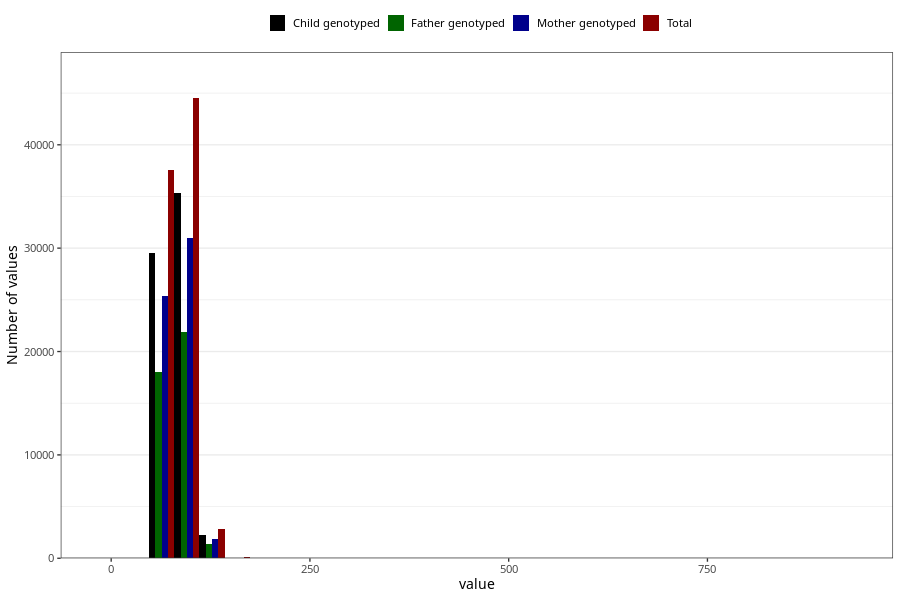

# mother_weight_end
Variable mapping to questionnaire: mfr, question MORS_VEKT_SLUTT.
.
- Number of values:

| Value | Total | Child genotyped | Mother genotyped | Father genotyped |
| ----- | ----- | --------------- | ---------------- | ---------------- |
| Missing | 28496 | 16143 | 13405 | 8865 |
| 0 | 4 | 2 | 1 |0 |
| 3 | 1 | 1 | 1 |0 |
| 5 | 1 | 0 | 0 |0 |
| 6 | 6 | 4 | 4 |3 |
| 6.5 | 1 | 1 | 0 |0 |
| 6.7 | 1 | 1 | 1 |0 |
| 6.8 | 1 | 1 | 0 |0 |
| 7 | 10 | 9 | 8 |4 |
| 7.5 | 1 | 1 | 1 |1 |
| 8 | 8 | 5 | 2 |2 |
| 8.6 | 1 | 1 | 1 |1 |
| 8.8 | 1 | 1 | 1 |0 |
| 9 | 2 | 1 | 1 |1 |
| 9.2 | 1 | 0 | 0 |0 |
| 10 | 2 | 2 | 2 |1 |
| 11 | 1 | 1 | 1 |1 |
| 13 | 2 | 2 | 1 |1 |
| 15 | 1 | 1 | 1 |0 |
| 16 | 1 | 0 | 0 |0 |
| 18 | 1 | 0 | 0 |0 |
| 20 | 2 | 2 | 2 |2 |
| 20.5 | 1 | 0 | 0 |0 |
| 40 | 1 | 1 | 1 |0 |
| 42 | 1 | 0 | 0 |0 |
| 43 | 2 | 0 | 0 |0 |
| 44 | 2 | 1 | 1 |0 |
| 45 | 3 | 1 | 1 |0 |
| 46 | 4 | 1 | 0 |0 |
| 48 | 6 | 4 | 2 |1 |
| 48.8 | 1 | 1 | 0 |1 |
| 49 | 8 | 5 | 4 |3 |
| 49.4 | 1 | 0 | 0 |0 |
| 49.9 | 1 | 1 | 1 |0 |
| 50 | 21 | 14 | 7 |6 |
| 50.5 | 1 | 0 | 0 |0 |
| 50.9 | 1 | 1 | 1 |0 |
| 51 | 12 | 9 | 7 |4 |
| 51.5 | 2 | 2 | 2 |2 |
| 51.7 | 1 | 1 | 0 |0 |
| 52 | 36 | 25 | 15 |11 |
| 52.3 | 1 | 1 | 0 |0 |
| 52.5 | 5 | 3 | 2 |1 |
| 52.7 | 1 | 1 | 1 |1 |
| 52.8 | 1 | 1 | 1 |1 |
| 53 | 31 | 19 | 10 |7 |
| 53.2 | 2 | 2 | 0 |0 |
| 53.4 | 1 | 1 | 0 |0 |
| 53.5 | 2 | 2 | 0 |0 |
| 53.6 | 1 | 1 | 1 |1 |
| 54 | 51 | 42 | 29 |23 |
| 54.2 | 2 | 2 | 2 |1 |
| 54.4 | 1 | 1 | 0 |0 |
| 54.5 | 6 | 5 | 4 |5 |
| 54.6 | 2 | 2 | 2 |2 |
| 54.9 | 2 | 2 | 2 |1 |
| 55 | 59 | 41 | 29 |21 |
| 55.2 | 2 | 2 | 1 |0 |
| 55.3 | 1 | 1 | 1 |0 |
| 55.5 | 4 | 4 | 3 |2 |
| 55.8 | 2 | 1 | 1 |1 |
| 56 | 91 | 61 | 42 |28 |
| 56.1 | 1 | 0 | 0 |0 |
| 56.2 | 1 | 1 | 1 |1 |
| 56.5 | 13 | 11 | 11 |8 |
| 56.8 | 3 | 1 | 1 |1 |
| 56.9 | 2 | 2 | 2 |1 |
| 57 | 107 | 81 | 50 |34 |
| 57.1 | 1 | 1 | 1 |1 |
| 57.2 | 1 | 1 | 1 |0 |
| 57.4 | 2 | 2 | 2 |2 |
| 57.5 | 11 | 10 | 8 |4 |
| 57.6 | 2 | 2 | 1 |0 |
| 57.7 | 2 | 1 | 1 |1 |
| 57.8 | 1 | 1 | 1 |0 |
| 58 | 215 | 160 | 111 |70 |
| 58.2 | 4 | 3 | 3 |2 |
| 58.3 | 1 | 0 | 0 |0 |
| 58.4 | 2 | 1 | 1 |1 |
| 58.5 | 16 | 14 | 9 |7 |
| 58.6 | 5 | 4 | 2 |1 |
| 58.7 | 3 | 3 | 2 |2 |
| 58.8 | 7 | 4 | 3 |3 |
| 58.9 | 5 | 4 | 4 |3 |
| 59 | 232 | 172 | 141 |89 |
| 59.1 | 1 | 0 | 0 |0 |
| 59.2 | 5 | 4 | 3 |3 |
| 59.3 | 8 | 6 | 4 |4 |
| 59.4 | 2 | 1 | 0 |0 |
| 59.5 | 15 | 10 | 8 |5 |
| 59.6 | 6 | 5 | 4 |3 |
| 59.7 | 3 | 2 | 1 |1 |
| 59.8 | 6 | 6 | 5 |5 |
| 59.9 | 3 | 2 | 2 |1 |
| 60 | 388 | 284 | 219 |147 |
| 60.1 | 2 | 2 | 1 |1 |
| 60.2 | 4 | 4 | 4 |4 |
| 60.3 | 4 | 4 | 4 |3 |
| 60.4 | 5 | 1 | 1 |1 |
| 60.5 | 30 | 20 | 19 |14 |
| 60.6 | 4 | 3 | 3 |3 |
| 60.7 | 2 | 1 | 1 |1 |
| 60.8 | 6 | 4 | 4 |4 |
| 60.9 | 4 | 1 | 1 |1 |
| 61 | 265 | 195 | 163 |113 |
| 61.1 | 4 | 3 | 3 |3 |
| 61.2 | 5 | 4 | 3 |3 |
| 61.3 | 3 | 2 | 1 |0 |
| 61.4 | 5 | 3 | 2 |1 |
| 61.5 | 49 | 34 | 30 |20 |
| 61.6 | 4 | 3 | 2 |1 |
| 61.7 | 1 | 1 | 0 |0 |
| 61.8 | 15 | 14 | 11 |7 |
| 61.9 | 3 | 2 | 2 |1 |
| 62 | 637 | 468 | 384 |273 |
| 62.1 | 5 | 4 | 3 |1 |
| 62.2 | 12 | 10 | 8 |5 |
| 62.3 | 8 | 7 | 7 |6 |
| 62.4 | 9 | 6 | 4 |3 |
| 62.5 | 58 | 38 | 28 |23 |
| 62.6 | 2 | 1 | 1 |1 |
| 62.7 | 4 | 4 | 3 |2 |
| 62.8 | 5 | 3 | 3 |2 |
| 62.9 | 3 | 2 | 1 |1 |
| 63 | 630 | 466 | 399 |271 |
| 63.1 | 6 | 6 | 6 |5 |
| 63.2 | 10 | 9 | 7 |7 |
| 63.3 | 4 | 1 | 1 |1 |
| 63.4 | 9 | 7 | 5 |4 |
| 63.5 | 96 | 80 | 66 |50 |
| 63.6 | 7 | 5 | 3 |2 |
| 63.7 | 5 | 3 | 2 |2 |
| 63.8 | 10 | 8 | 7 |4 |
| 63.9 | 7 | 7 | 6 |2 |
| 64 | 738 | 582 | 484 |337 |
| 64.1 | 5 | 4 | 2 |1 |
| 64.2 | 10 | 6 | 5 |5 |
| 64.3 | 12 | 8 | 6 |6 |
| 64.4 | 11 | 9 | 7 |6 |
| 64.5 | 90 | 75 | 67 |47 |
| 64.6 | 6 | 5 | 4 |3 |
| 64.7 | 5 | 4 | 4 |1 |
| 64.8 | 13 | 9 | 6 |3 |
| 64.9 | 5 | 5 | 4 |3 |
| 65 | 1141 | 850 | 712 |516 |
| 65.1 | 4 | 2 | 1 |1 |
| 65.2 | 13 | 10 | 8 |5 |
| 65.3 | 12 | 10 | 9 |4 |
| 65.4 | 13 | 9 | 8 |6 |
| 65.5 | 93 | 81 | 68 |55 |
| 65.6 | 7 | 5 | 4 |3 |
| 65.7 | 9 | 9 | 6 |3 |
| 65.8 | 20 | 17 | 16 |10 |
| 65.9 | 8 | 7 | 6 |5 |
| 66 | 663 | 514 | 433 |327 |
| 66.1 | 9 | 6 | 4 |4 |
| 66.2 | 7 | 5 | 4 |2 |
| 66.3 | 13 | 9 | 9 |7 |
| 66.4 | 17 | 15 | 13 |11 |
| 66.5 | 91 | 71 | 59 |45 |
| 66.6 | 12 | 11 | 10 |8 |
| 66.7 | 9 | 8 | 8 |7 |
| 66.8 | 15 | 13 | 13 |10 |
| 66.9 | 2 | 2 | 1 |1 |
| 67 | 1264 | 996 | 852 |594 |
| 67.1 | 8 | 7 | 6 |4 |
| 67.2 | 22 | 21 | 15 |10 |
| 67.3 | 18 | 13 | 7 |5 |
| 67.4 | 15 | 13 | 10 |9 |
| 67.5 | 148 | 118 | 102 |74 |
| 67.6 | 5 | 5 | 4 |4 |
| 67.7 | 13 | 12 | 11 |11 |
| 67.8 | 31 | 26 | 21 |17 |
| 67.9 | 9 | 8 | 8 |5 |
| 68 | 1620 | 1261 | 1082 |780 |
| 68.1 | 9 | 7 | 4 |5 |
| 68.2 | 24 | 16 | 14 |6 |
| 68.3 | 24 | 15 | 13 |7 |
| 68.4 | 18 | 12 | 11 |8 |
| 68.5 | 157 | 113 | 94 |66 |
| 68.6 | 24 | 21 | 18 |14 |
| 68.7 | 13 | 8 | 4 |2 |
| 68.8 | 22 | 19 | 14 |10 |
| 68.9 | 19 | 15 | 14 |8 |
| 69 | 1549 | 1192 | 1036 |723 |
| 69.1 | 11 | 10 | 10 |8 |
| 69.2 | 26 | 23 | 18 |11 |
| 69.3 | 22 | 17 | 15 |9 |
| 69.4 | 16 | 13 | 12 |9 |
| 69.5 | 203 | 165 | 137 |97 |
| 69.6 | 18 | 16 | 14 |9 |
| 69.7 | 14 | 12 | 10 |10 |
| 69.8 | 20 | 15 | 13 |10 |
| 69.9 | 20 | 15 | 15 |10 |
| 70 | 2378 | 1883 | 1624 |1152 |
| 70.1 | 18 | 16 | 15 |14 |
| 70.2 | 26 | 18 | 14 |10 |
| 70.3 | 17 | 14 | 13 |10 |
| 70.4 | 16 | 12 | 8 |5 |
| 70.5 | 144 | 116 | 97 |75 |
| 70.6 | 22 | 18 | 17 |14 |
| 70.7 | 16 | 15 | 13 |11 |
| 70.8 | 21 | 17 | 15 |14 |
| 70.9 | 20 | 18 | 16 |13 |
| 71 | 1313 | 1054 | 919 |658 |
| 71.1 | 14 | 10 | 10 |9 |
| 71.2 | 29 | 25 | 22 |19 |
| 71.3 | 14 | 8 | 8 |5 |
| 71.4 | 16 | 14 | 11 |7 |
| 71.5 | 158 | 113 | 95 |74 |
| 71.6 | 28 | 22 | 20 |15 |
| 71.7 | 8 | 5 | 4 |3 |
| 71.8 | 19 | 18 | 14 |12 |
| 71.9 | 10 | 8 | 7 |6 |
| 72 | 2586 | 2003 | 1725 |1184 |
| 72.1 | 19 | 14 | 13 |11 |
| 72.2 | 26 | 22 | 16 |12 |
| 72.3 | 28 | 22 | 16 |13 |
| 72.4 | 25 | 20 | 19 |13 |
| 72.5 | 247 | 200 | 176 |125 |
| 72.6 | 27 | 19 | 16 |11 |
| 72.7 | 11 | 10 | 8 |7 |
| 72.8 | 24 | 21 | 16 |13 |
| 72.9 | 20 | 14 | 14 |11 |
| 73 | 1998 | 1605 | 1391 |991 |
| 73.1 | 13 | 10 | 9 |9 |
| 73.2 | 31 | 23 | 21 |17 |
| 73.3 | 20 | 18 | 18 |14 |
| 73.4 | 30 | 27 | 24 |18 |
| 73.5 | 193 | 148 | 128 |86 |
| 73.6 | 22 | 19 | 15 |11 |
| 73.7 | 10 | 8 | 7 |5 |
| 73.8 | 31 | 23 | 21 |15 |
| 73.9 | 13 | 9 | 9 |9 |
| 74 | 2409 | 1899 | 1658 |1168 |
| 74.1 | 14 | 13 | 9 |8 |
| 74.2 | 33 | 25 | 24 |19 |
| 74.3 | 23 | 20 | 19 |16 |
| 74.4 | 24 | 21 | 19 |13 |
| 74.5 | 216 | 176 | 155 |107 |
| 74.6 | 30 | 25 | 23 |14 |
| 74.7 | 18 | 11 | 10 |7 |
| 74.8 | 25 | 22 | 20 |10 |
| 74.9 | 15 | 11 | 10 |8 |
| 75 | 3035 | 2405 | 2087 |1482 |
| 75.1 | 18 | 12 | 10 |8 |
| 75.2 | 24 | 22 | 18 |11 |
| 75.3 | 27 | 22 | 18 |12 |
| 75.4 | 24 | 21 | 17 |13 |
| 75.5 | 180 | 143 | 122 |88 |
| 75.6 | 34 | 31 | 28 |18 |
| 75.7 | 15 | 13 | 12 |9 |
| 75.8 | 25 | 17 | 13 |8 |
| 75.9 | 27 | 24 | 19 |15 |
| 76 | 1977 | 1558 | 1357 |970 |
| 76.1 | 17 | 12 | 10 |10 |
| 76.2 | 21 | 15 | 13 |12 |
| 76.3 | 25 | 19 | 16 |11 |
| 76.4 | 32 | 24 | 22 |14 |
| 76.5 | 187 | 144 | 123 |97 |
| 76.6 | 36 | 26 | 25 |22 |
| 76.7 | 17 | 13 | 11 |10 |
| 76.8 | 33 | 26 | 25 |17 |
| 76.9 | 24 | 18 | 15 |12 |
| 77 | 1611 | 1262 | 1093 |782 |
| 77.1 | 13 | 12 | 9 |5 |
| 77.2 | 32 | 30 | 25 |21 |
| 77.3 | 16 | 15 | 13 |7 |
| 77.4 | 22 | 19 | 17 |13 |
| 77.5 | 139 | 114 | 101 |76 |
| 77.6 | 33 | 27 | 21 |16 |
| 77.7 | 23 | 23 | 21 |15 |
| 77.8 | 34 | 28 | 25 |21 |
| 77.9 | 11 | 6 | 5 |4 |
| 78 | 2865 | 2292 | 2019 |1435 |
| 78.1 | 16 | 12 | 11 |6 |
| 78.2 | 36 | 31 | 28 |19 |
| 78.3 | 29 | 23 | 16 |12 |
| 78.4 | 24 | 21 | 20 |16 |
| 78.5 | 224 | 174 | 157 |100 |
| 78.6 | 42 | 34 | 28 |19 |
| 78.7 | 23 | 19 | 18 |16 |
| 78.8 | 33 | 21 | 16 |10 |
| 78.9 | 20 | 16 | 14 |11 |
| 79 | 2233 | 1832 | 1611 |1138 |
| 79.1 | 25 | 20 | 19 |9 |
| 79.2 | 30 | 22 | 21 |17 |
| 79.3 | 22 | 18 | 16 |10 |
| 79.4 | 16 | 14 | 13 |10 |
| 79.5 | 251 | 209 | 174 |130 |
| 79.6 | 35 | 28 | 22 |18 |
| 79.7 | 19 | 17 | 15 |12 |
| 79.8 | 56 | 42 | 37 |31 |
| 79.9 | 37 | 32 | 28 |16 |
| 80 | 3649 | 2854 | 2515 |1756 |
| 80.1 | 34 | 27 | 23 |17 |
| 80.2 | 43 | 39 | 33 |27 |
| 80.3 | 16 | 12 | 9 |8 |
| 80.4 | 27 | 22 | 20 |15 |
| 80.5 | 171 | 136 | 116 |84 |
| 80.6 | 43 | 31 | 29 |21 |
| 80.7 | 14 | 12 | 11 |11 |
| 80.8 | 18 | 17 | 15 |10 |
| 80.9 | 15 | 14 | 11 |9 |
| 81 | 1466 | 1162 | 1038 |716 |
| 81.1 | 10 | 10 | 10 |6 |
| 81.2 | 29 | 24 | 19 |13 |
| 81.3 | 25 | 18 | 16 |11 |
| 81.4 | 28 | 25 | 21 |14 |
| 81.5 | 206 | 163 | 151 |115 |
| 81.6 | 25 | 17 | 17 |17 |
| 81.7 | 13 | 10 | 9 |6 |
| 81.8 | 21 | 19 | 15 |12 |
| 81.9 | 19 | 12 | 10 |7 |
| 82 | 2663 | 2089 | 1855 |1317 |
| 82.1 | 17 | 16 | 14 |13 |
| 82.2 | 29 | 22 | 17 |15 |
| 82.3 | 35 | 28 | 22 |20 |
| 82.4 | 30 | 24 | 23 |18 |
| 82.5 | 224 | 175 | 159 |116 |
| 82.6 | 19 | 16 | 16 |14 |
| 82.7 | 17 | 11 | 11 |7 |
| 82.8 | 14 | 13 | 11 |8 |
| 82.9 | 13 | 9 | 9 |7 |
| 83 | 2117 | 1677 | 1460 |1029 |
| 83.1 | 12 | 11 | 10 |6 |
| 83.2 | 35 | 24 | 21 |14 |
| 83.3 | 16 | 12 | 11 |8 |
| 83.4 | 33 | 26 | 21 |17 |
| 83.5 | 182 | 144 | 128 |92 |
| 83.6 | 26 | 22 | 21 |15 |
| 83.7 | 16 | 10 | 9 |7 |
| 83.8 | 15 | 13 | 13 |11 |
| 83.9 | 8 | 6 | 6 |6 |
| 84 | 2080 | 1669 | 1473 |1053 |
| 84.1 | 15 | 10 | 9 |6 |
| 84.2 | 36 | 29 | 26 |18 |
| 84.3 | 23 | 18 | 12 |11 |
| 84.4 | 29 | 27 | 21 |16 |
| 84.5 | 174 | 136 | 117 |82 |
| 84.6 | 37 | 28 | 25 |19 |
| 84.7 | 16 | 16 | 14 |11 |
| 84.8 | 14 | 12 | 11 |10 |
| 84.9 | 16 | 15 | 13 |9 |
| 85 | 2753 | 2184 | 1892 |1334 |
| 85.1 | 7 | 7 | 7 |4 |
| 85.2 | 21 | 16 | 14 |11 |
| 85.3 | 18 | 13 | 13 |9 |
| 85.4 | 20 | 18 | 16 |9 |
| 85.5 | 136 | 116 | 100 |76 |
| 85.6 | 33 | 27 | 21 |19 |
| 85.7 | 23 | 18 | 12 |11 |
| 85.8 | 17 | 15 | 14 |11 |
| 85.9 | 12 | 11 | 9 |7 |
| 86 | 1888 | 1529 | 1343 |943 |
| 86.1 | 11 | 9 | 8 |8 |
| 86.2 | 28 | 23 | 23 |19 |
| 86.3 | 15 | 12 | 11 |7 |
| 86.4 | 26 | 19 | 16 |16 |
| 86.5 | 167 | 133 | 116 |87 |
| 86.6 | 22 | 20 | 19 |15 |
| 86.7 | 17 | 14 | 13 |10 |
| 86.8 | 14 | 11 | 11 |9 |
| 86.9 | 10 | 9 | 9 |6 |
| 87 | 1399 | 1132 | 993 |723 |
| 87.1 | 16 | 10 | 9 |7 |
| 87.2 | 22 | 19 | 14 |11 |
| 87.3 | 20 | 14 | 13 |11 |
| 87.4 | 16 | 14 | 14 |8 |
| 87.5 | 126 | 101 | 90 |68 |
| 87.6 | 26 | 21 | 19 |17 |
| 87.7 | 21 | 17 | 14 |12 |
| 87.8 | 17 | 12 | 8 |7 |
| 87.9 | 12 | 9 | 6 |6 |
| 88 | 1366 | 1095 | 967 |679 |
| 88.1 | 8 | 7 | 6 |5 |
| 88.2 | 20 | 16 | 12 |7 |
| 88.3 | 12 | 11 | 9 |7 |
| 88.4 | 20 | 17 | 13 |9 |
| 88.5 | 110 | 92 | 84 |66 |
| 88.6 | 15 | 8 | 8 |6 |
| 88.7 | 12 | 11 | 9 |7 |
| 88.8 | 21 | 17 | 14 |11 |
| 88.9 | 14 | 9 | 6 |5 |
| 89 | 1561 | 1252 | 1094 |771 |
| 89.1 | 18 | 15 | 15 |9 |
| 89.2 | 23 | 19 | 16 |14 |
| 89.3 | 15 | 14 | 11 |10 |
| 89.4 | 12 | 6 | 6 |4 |
| 89.5 | 149 | 111 | 100 |74 |
| 89.6 | 20 | 15 | 13 |10 |
| 89.7 | 17 | 12 | 11 |7 |
| 89.8 | 17 | 14 | 12 |7 |
| 89.9 | 25 | 19 | 18 |14 |
| 90 | 2304 | 1825 | 1604 |1108 |
| 90.1 | 8 | 5 | 5 |4 |
| 90.2 | 32 | 28 | 28 |21 |
| 90.3 | 22 | 15 | 15 |15 |
| 90.4 | 9 | 8 | 7 |6 |
| 90.5 | 108 | 88 | 73 |56 |
| 90.6 | 14 | 12 | 10 |8 |
| 90.7 | 12 | 8 | 8 |5 |
| 90.8 | 11 | 9 | 8 |4 |
| 90.9 | 3 | 2 | 2 |1 |
| 91 | 900 | 701 | 631 |431 |
| 91.1 | 7 | 7 | 6 |4 |
| 91.2 | 21 | 17 | 16 |13 |
| 91.3 | 21 | 16 | 15 |13 |
| 91.4 | 11 | 11 | 9 |5 |
| 91.5 | 109 | 87 | 72 |53 |
| 91.6 | 16 | 12 | 10 |10 |
| 91.7 | 7 | 4 | 4 |3 |
| 91.8 | 13 | 8 | 7 |6 |
| 91.9 | 6 | 6 | 5 |4 |
| 92 | 1642 | 1318 | 1159 |835 |
| 92.1 | 9 | 7 | 5 |6 |
| 92.2 | 13 | 10 | 8 |5 |
| 92.3 | 7 | 6 | 5 |3 |
| 92.4 | 13 | 10 | 10 |8 |
| 92.5 | 132 | 108 | 95 |70 |
| 92.6 | 18 | 14 | 14 |12 |
| 92.7 | 11 | 8 | 5 |5 |
| 92.8 | 12 | 10 | 9 |7 |
| 92.9 | 2 | 0 | 0 |0 |
| 93 | 1218 | 950 | 835 |569 |
| 93.1 | 7 | 7 | 7 |5 |
| 93.2 | 18 | 14 | 14 |10 |
| 93.3 | 10 | 7 | 5 |3 |
| 93.4 | 17 | 14 | 12 |8 |
| 93.5 | 105 | 82 | 73 |59 |
| 93.6 | 15 | 13 | 11 |8 |
| 93.7 | 9 | 7 | 4 |5 |
| 93.8 | 10 | 5 | 3 |2 |
| 93.9 | 4 | 3 | 1 |2 |
| 94 | 1121 | 880 | 781 |537 |
| 94.1 | 13 | 12 | 10 |4 |
| 94.2 | 22 | 21 | 18 |14 |
| 94.3 | 14 | 11 | 10 |9 |
| 94.4 | 7 | 6 | 6 |4 |
| 94.5 | 93 | 66 | 59 |37 |
| 94.6 | 13 | 12 | 8 |4 |
| 94.7 | 13 | 11 | 11 |6 |
| 94.8 | 7 | 7 | 6 |3 |
| 94.9 | 4 | 2 | 2 |2 |
| 95 | 1376 | 1115 | 971 |667 |
| 95.1 | 6 | 3 | 3 |3 |
| 95.2 | 15 | 15 | 14 |13 |
| 95.3 | 12 | 12 | 11 |8 |
| 95.4 | 11 | 8 | 6 |4 |
| 95.5 | 53 | 40 | 32 |23 |
| 95.6 | 10 | 7 | 5 |4 |
| 95.7 | 13 | 9 | 8 |4 |
| 95.8 | 8 | 7 | 6 |5 |
| 95.9 | 3 | 2 | 2 |0 |
| 96 | 948 | 734 | 648 |476 |
| 96.1 | 10 | 9 | 7 |5 |
| 96.2 | 12 | 10 | 8 |6 |
| 96.3 | 9 | 8 | 7 |7 |
| 96.4 | 20 | 19 | 18 |12 |
| 96.5 | 76 | 57 | 48 |38 |
| 96.6 | 16 | 13 | 12 |6 |
| 96.7 | 10 | 8 | 8 |7 |
| 96.8 | 9 | 7 | 6 |4 |
| 96.9 | 4 | 3 | 3 |1 |
| 97 | 846 | 674 | 596 |421 |
| 97.1 | 4 | 4 | 4 |2 |
| 97.2 | 11 | 7 | 6 |6 |
| 97.3 | 4 | 4 | 3 |2 |
| 97.4 | 6 | 3 | 3 |3 |
| 97.5 | 85 | 65 | 56 |40 |
| 97.6 | 13 | 10 | 9 |6 |
| 97.7 | 8 | 8 | 6 |6 |
| 97.8 | 6 | 4 | 3 |1 |
| 97.9 | 4 | 3 | 3 |3 |
| 98 | 943 | 742 | 647 |429 |
| 98.1 | 5 | 5 | 5 |4 |
| 98.2 | 9 | 8 | 7 |6 |
| 98.3 | 10 | 8 | 6 |4 |
| 98.4 | 7 | 6 | 5 |3 |
| 98.5 | 97 | 75 | 65 |39 |
| 98.6 | 12 | 10 | 7 |8 |
| 98.7 | 12 | 8 | 6 |2 |
| 98.8 | 7 | 6 | 5 |4 |
| 98.9 | 7 | 5 | 5 |4 |
| 99 | 687 | 541 | 475 |323 |
| 99.1 | 6 | 5 | 4 |1 |
| 99.2 | 15 | 10 | 10 |7 |
| 99.3 | 12 | 9 | 9 |7 |
| 99.4 | 9 | 6 | 4 |3 |
| 99.5 | 69 | 58 | 50 |39 |
| 99.6 | 13 | 10 | 9 |6 |
| 99.7 | 16 | 13 | 10 |7 |
| 99.8 | 25 | 18 | 15 |11 |
| 99.9 | 22 | 19 | 17 |10 |
| 100 | 962 | 740 | 640 |434 |
| 100.1 | 5 | 4 | 4 |2 |
| 100.2 | 9 | 8 | 7 |3 |
| 100.3 | 15 | 13 | 11 |7 |
| 100.4 | 10 | 9 | 7 |7 |
| 100.5 | 40 | 29 | 24 |17 |
| 100.6 | 11 | 7 | 6 |2 |
| 100.7 | 6 | 5 | 5 |4 |
| 100.8 | 7 | 6 | 6 |3 |
| 100.9 | 2 | 2 | 2 |1 |
| 101 | 407 | 323 | 280 |204 |
| 101.3 | 5 | 5 | 3 |2 |
| 101.4 | 5 | 4 | 4 |3 |
| 101.5 | 46 | 32 | 29 |21 |
| 101.6 | 7 | 2 | 0 |0 |
| 101.8 | 8 | 7 | 5 |5 |
| 101.9 | 2 | 2 | 1 |1 |
| 102 | 585 | 463 | 407 |276 |
| 102.1 | 3 | 3 | 3 |2 |
| 102.2 | 4 | 3 | 3 |2 |
| 102.3 | 6 | 5 | 4 |4 |
| 102.4 | 8 | 6 | 5 |5 |
| 102.5 | 53 | 44 | 35 |25 |
| 102.6 | 3 | 3 | 3 |3 |
| 102.7 | 4 | 4 | 3 |1 |
| 102.8 | 5 | 3 | 2 |1 |
| 102.9 | 6 | 6 | 4 |4 |
| 103 | 500 | 411 | 364 |253 |
| 103.1 | 4 | 4 | 4 |4 |
| 103.2 | 3 | 3 | 1 |1 |
| 103.3 | 5 | 5 | 5 |5 |
| 103.4 | 8 | 5 | 5 |4 |
| 103.5 | 44 | 34 | 27 |20 |
| 103.6 | 4 | 3 | 3 |2 |
| 103.7 | 2 | 2 | 2 |2 |
| 103.8 | 4 | 3 | 3 |1 |
| 103.9 | 3 | 2 | 2 |2 |
| 104 | 483 | 393 | 343 |240 |
| 104.1 | 1 | 1 | 1 |1 |
| 104.2 | 3 | 3 | 3 |3 |
| 104.3 | 4 | 3 | 3 |3 |
| 104.4 | 4 | 4 | 4 |4 |
| 104.5 | 43 | 30 | 26 |20 |
| 104.6 | 6 | 6 | 6 |5 |
| 104.7 | 3 | 3 | 3 |3 |
| 104.8 | 3 | 2 | 2 |1 |
| 104.9 | 1 | 1 | 1 |1 |
| 105 | 627 | 483 | 421 |291 |
| 105.1 | 1 | 1 | 1 |1 |
| 105.2 | 2 | 1 | 0 |0 |
| 105.3 | 3 | 3 | 2 |3 |
| 105.4 | 3 | 2 | 2 |1 |
| 105.5 | 25 | 21 | 15 |12 |
| 105.6 | 2 | 1 | 1 |0 |
| 105.7 | 6 | 4 | 4 |4 |
| 105.8 | 4 | 4 | 4 |2 |
| 105.9 | 6 | 4 | 4 |4 |
| 106 | 359 | 296 | 248 |182 |
| 106.2 | 4 | 3 | 3 |2 |
| 106.3 | 4 | 3 | 3 |2 |
| 106.4 | 3 | 1 | 1 |1 |
| 106.5 | 36 | 32 | 22 |14 |
| 106.6 | 3 | 3 | 3 |3 |
| 106.7 | 2 | 2 | 2 |0 |
| 106.8 | 1 | 1 | 1 |1 |
| 107 | 336 | 263 | 229 |153 |
| 107.1 | 1 | 0 | 0 |0 |
| 107.2 | 6 | 6 | 4 |3 |
| 107.3 | 2 | 2 | 1 |1 |
| 107.4 | 7 | 7 | 6 |4 |
| 107.5 | 35 | 28 | 25 |17 |
| 107.6 | 3 | 3 | 3 |2 |
| 107.7 | 1 | 1 | 1 |1 |
| 107.8 | 2 | 2 | 1 |1 |
| 107.9 | 4 | 3 | 3 |2 |
| 108 | 349 | 276 | 237 |176 |
| 108.1 | 1 | 1 | 1 |0 |
| 108.2 | 3 | 2 | 1 |0 |
| 108.3 | 3 | 3 | 3 |3 |
| 108.4 | 3 | 2 | 2 |2 |
| 108.5 | 22 | 16 | 13 |9 |
| 108.6 | 1 | 1 | 1 |1 |
| 108.7 | 3 | 3 | 3 |3 |
| 108.8 | 5 | 4 | 4 |4 |
| 109 | 185 | 159 | 140 |99 |
| 109.1 | 2 | 2 | 2 |1 |
| 109.2 | 5 | 2 | 2 |2 |
| 109.3 | 2 | 0 | 0 |0 |
| 109.4 | 3 | 2 | 2 |1 |
| 109.5 | 11 | 8 | 8 |2 |
| 109.7 | 1 | 1 | 1 |1 |
| 109.8 | 1 | 1 | 1 |1 |
| 109.9 | 1 | 1 | 1 |1 |
| 110 | 465 | 378 | 337 |239 |
| 110.2 | 4 | 3 | 3 |1 |
| 110.3 | 1 | 0 | 0 |0 |
| 110.4 | 1 | 1 | 1 |0 |
| 110.5 | 20 | 11 | 8 |6 |
| 110.6 | 1 | 1 | 1 |1 |
| 110.8 | 3 | 3 | 3 |3 |
| 110.9 | 1 | 0 | 0 |0 |
| 111 | 154 | 119 | 105 |69 |
| 111.1 | 2 | 2 | 2 |2 |
| 111.2 | 2 | 2 | 2 |1 |
| 111.3 | 1 | 1 | 1 |1 |
| 111.4 | 1 | 1 | 1 |1 |
| 111.5 | 5 | 3 | 2 |2 |
| 111.6 | 1 | 1 | 1 |1 |
| 111.7 | 1 | 1 | 0 |0 |
| 111.8 | 2 | 1 | 1 |0 |
| 112 | 288 | 217 | 190 |129 |
| 112.1 | 2 | 2 | 2 |2 |
| 112.2 | 1 | 1 | 1 |1 |
| 112.3 | 4 | 2 | 1 |0 |
| 112.4 | 2 | 2 | 1 |1 |
| 112.5 | 18 | 16 | 15 |9 |
| 112.6 | 3 | 1 | 1 |0 |
| 112.7 | 1 | 0 | 0 |0 |
| 112.8 | 4 | 2 | 2 |1 |
| 112.9 | 1 | 1 | 1 |1 |
| 113 | 182 | 141 | 114 |84 |
| 113.1 | 1 | 1 | 1 |1 |
| 113.2 | 1 | 1 | 1 |1 |
| 113.4 | 1 | 1 | 1 |1 |
| 113.5 | 12 | 7 | 7 |6 |
| 113.6 | 2 | 1 | 1 |1 |
| 113.7 | 1 | 1 | 0 |0 |
| 113.8 | 3 | 3 | 3 |3 |
| 114 | 178 | 134 | 117 |87 |
| 114.1 | 1 | 1 | 1 |1 |
| 114.2 | 1 | 0 | 0 |0 |
| 114.5 | 12 | 10 | 7 |4 |
| 114.6 | 2 | 2 | 1 |1 |
| 114.8 | 1 | 1 | 1 |1 |
| 114.9 | 1 | 1 | 1 |0 |
| 115 | 278 | 222 | 196 |133 |
| 115.2 | 2 | 2 | 1 |1 |
| 115.3 | 1 | 1 | 1 |0 |
| 115.5 | 13 | 13 | 13 |7 |
| 115.6 | 3 | 3 | 2 |2 |
| 115.7 | 1 | 1 | 1 |1 |
| 116 | 168 | 131 | 112 |78 |
| 116.1 | 1 | 1 | 0 |0 |
| 116.4 | 2 | 2 | 2 |0 |
| 116.5 | 13 | 7 | 6 |4 |
| 116.6 | 2 | 2 | 2 |2 |
| 116.7 | 1 | 0 | 0 |0 |
| 116.8 | 1 | 1 | 1 |0 |
| 117 | 173 | 140 | 119 |77 |
| 117.2 | 2 | 2 | 2 |2 |
| 117.3 | 2 | 1 | 1 |1 |
| 117.4 | 1 | 1 | 1 |0 |
| 117.5 | 12 | 10 | 9 |5 |
| 117.6 | 3 | 2 | 1 |1 |
| 117.7 | 1 | 1 | 1 |0 |
| 117.9 | 2 | 1 | 0 |0 |
| 118 | 154 | 118 | 100 |70 |
| 118.2 | 1 | 1 | 1 |0 |
| 118.3 | 1 | 1 | 1 |1 |
| 118.4 | 2 | 1 | 1 |1 |
| 118.5 | 5 | 4 | 4 |2 |
| 118.9 | 1 | 1 | 1 |1 |
| 119 | 82 | 64 | 55 |38 |
| 119.5 | 4 | 3 | 2 |1 |
| 119.8 | 1 | 1 | 1 |1 |
| 119.9 | 2 | 2 | 2 |1 |
| 120 | 251 | 198 | 165 |115 |
| 120.1 | 1 | 1 | 1 |1 |
| 120.2 | 2 | 2 | 1 |1 |
| 120.3 | 1 | 1 | 1 |0 |
| 120.4 | 1 | 1 | 1 |0 |
| 120.5 | 7 | 5 | 4 |3 |
| 120.6 | 1 | 1 | 1 |1 |
| 120.7 | 1 | 1 | 1 |0 |
| 120.8 | 1 | 1 | 1 |1 |
| 121 | 60 | 46 | 42 |29 |
| 121.2 | 1 | 1 | 1 |1 |
| 121.4 | 1 | 0 | 0 |0 |
| 121.5 | 5 | 4 | 2 |2 |
| 121.6 | 1 | 1 | 0 |0 |
| 121.7 | 1 | 1 | 1 |1 |
| 121.8 | 1 | 0 | 0 |0 |
| 122 | 68 | 54 | 48 |37 |
| 122.1 | 2 | 2 | 2 |1 |
| 122.4 | 3 | 3 | 3 |2 |
| 122.5 | 4 | 3 | 3 |3 |
| 122.6 | 1 | 1 | 1 |0 |
| 122.7 | 1 | 1 | 1 |1 |
| 123 | 73 | 56 | 52 |34 |
| 123.1 | 1 | 1 | 1 |1 |
| 123.5 | 8 | 7 | 5 |3 |
| 123.6 | 2 | 2 | 2 |1 |
| 123.7 | 1 | 1 | 1 |0 |
| 123.8 | 1 | 1 | 0 |0 |
| 124 | 66 | 52 | 45 |33 |
| 124.5 | 5 | 3 | 3 |3 |
| 124.8 | 2 | 2 | 2 |1 |
| 125 | 112 | 87 | 74 |51 |
| 125.2 | 1 | 0 | 0 |0 |
| 125.3 | 2 | 2 | 2 |2 |
| 125.4 | 1 | 0 | 0 |0 |
| 125.5 | 4 | 4 | 4 |4 |
| 126 | 36 | 33 | 29 |23 |
| 126.3 | 1 | 1 | 0 |0 |
| 126.5 | 6 | 5 | 4 |3 |
| 126.6 | 1 | 1 | 0 |0 |
| 127 | 44 | 32 | 25 |15 |
| 127.1 | 1 | 1 | 1 |1 |
| 127.5 | 2 | 2 | 2 |2 |
| 127.6 | 1 | 1 | 1 |1 |
| 127.7 | 1 | 1 | 1 |1 |
| 128 | 48 | 34 | 30 |24 |
| 128.2 | 1 | 1 | 1 |1 |
| 128.4 | 1 | 0 | 0 |0 |
| 128.5 | 6 | 5 | 4 |2 |
| 128.8 | 1 | 0 | 0 |0 |
| 128.9 | 1 | 1 | 1 |1 |
| 129 | 32 | 28 | 23 |17 |
| 129.3 | 1 | 1 | 1 |1 |
| 129.5 | 2 | 2 | 2 |1 |
| 130 | 85 | 62 | 52 |38 |
| 130.5 | 3 | 2 | 1 |1 |
| 130.7 | 1 | 0 | 0 |0 |
| 131 | 15 | 13 | 12 |8 |
| 131.5 | 2 | 2 | 2 |1 |
| 131.7 | 1 | 1 | 1 |0 |
| 132 | 27 | 15 | 13 |10 |
| 132.2 | 1 | 1 | 1 |1 |
| 132.3 | 1 | 0 | 0 |0 |
| 132.5 | 1 | 0 | 0 |0 |
| 132.6 | 2 | 2 | 2 |1 |
| 133 | 12 | 7 | 5 |2 |
| 133.5 | 1 | 1 | 1 |0 |
| 134 | 22 | 20 | 16 |13 |
| 134.5 | 1 | 1 | 1 |1 |
| 135 | 28 | 18 | 14 |14 |
| 135.6 | 2 | 2 | 2 |1 |
| 135.7 | 1 | 1 | 1 |1 |
| 135.8 | 1 | 1 | 1 |1 |
| 136 | 17 | 13 | 10 |5 |
| 136.5 | 1 | 0 | 0 |0 |
| 137 | 17 | 14 | 10 |8 |
| 138 | 19 | 13 | 11 |10 |
| 138.5 | 2 | 2 | 1 |1 |
| 139 | 6 | 5 | 4 |2 |
| 139.2 | 1 | 1 | 1 |1 |
| 140 | 25 | 19 | 13 |10 |
| 140.2 | 1 | 1 | 1 |1 |
| 140.3 | 1 | 1 | 1 |1 |
| 141 | 3 | 3 | 3 |2 |
| 141.3 | 2 | 1 | 1 |1 |
| 141.5 | 2 | 1 | 0 |0 |
| 142 | 9 | 7 | 6 |4 |
| 143 | 6 | 5 | 5 |4 |
| 144 | 3 | 2 | 1 |0 |
| 144.5 | 1 | 1 | 1 |0 |
| 145 | 9 | 6 | 5 |4 |
| 145.5 | 1 | 1 | 1 |0 |
| 145.7 | 1 | 1 | 1 |0 |
| 146 | 5 | 3 | 3 |1 |
| 147 | 6 | 6 | 6 |4 |
| 147.5 | 1 | 1 | 1 |1 |
| 148 | 2 | 1 | 1 |1 |
| 148.5 | 1 | 0 | 0 |0 |
| 149 | 6 | 5 | 5 |2 |
| 150 | 7 | 5 | 3 |2 |
| 151.3 | 1 | 1 | 1 |0 |
| 152 | 3 | 3 | 3 |3 |
| 153 | 1 | 1 | 1 |1 |
| 155 | 4 | 2 | 2 |1 |
| 158 | 2 | 2 | 1 |0 |
| 160 | 3 | 1 | 1 |1 |
| 162 | 1 | 1 | 1 |1 |
| 167 | 1 | 0 | 0 |0 |
| 168 | 3 | 2 | 1 |1 |
| 168.8 | 1 | 0 | 0 |0 |
| 169 | 3 | 3 | 3 |3 |
| 170 | 3 | 3 | 3 |3 |
| 172 | 2 | 2 | 2 |0 |
| 173 | 2 | 2 | 2 |2 |
| 177 | 1 | 1 | 1 |1 |
| 178 | 1 | 1 | 1 |1 |
| 183 | 1 | 1 | 1 |0 |
| 185 | 1 | 0 | 0 |0 |
| 189.4 | 1 | 0 | 0 |0 |
| 192 | 1 | 1 | 0 |0 |
| 200 | 1 | 0 | 0 |0 |
| 592.3 | 1 | 0 | 0 |0 |
| 655 | 1 | 0 | 0 |0 |
| 690 | 1 | 1 | 0 |0 |
| 700 | 1 | 0 | 0 |0 |
| 763 | 1 | 1 | 1 |0 |
| 800 | 1 | 1 | 0 |0 |
| 834 | 1 | 0 | 0 |0 |
| 850.3 | 1 | 0 | 0 |0 |
| 870.9 | 1 | 0 | 0 |0 |
| 920 | 1 | 0 | 0 |0 |

