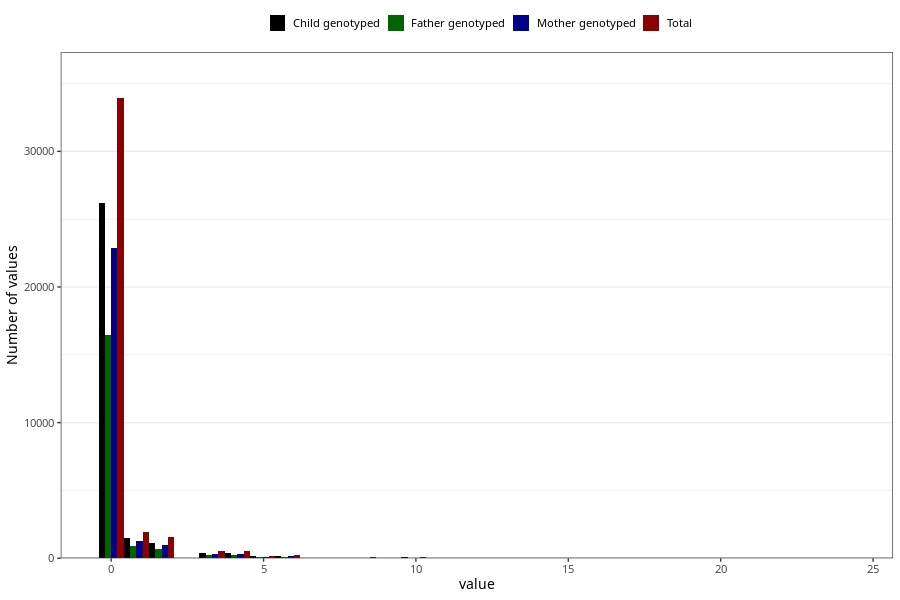

# coffee_before_boiled
Variable mapping to questionnaire: q1m, question AA1383.
.
- Number of values:

| Value | Total | Child genotyped | Mother genotyped | Father genotyped |
| ----- | ----- | --------------- | ---------------- | ---------------- |
| Missing | 74472 | 53344 | 45635 | 31469 |
| Consumption have been reported by a mark but no amount given | 3 | 1 | 0 |0 |
| 0 | 33923 | 26162 | 22848 |16472 |
| 1 | 1941 | 1465 | 1244 |875 |
| 2 | 1556 | 1134 | 972 |699 |
| 3 | 523 | 388 | 340 |228 |
| 4 | 542 | 387 | 333 |222 |
| 5 | 192 | 137 | 111 |67 |
| 6 | 215 | 163 | 139 |100 |
| 7 | 35 | 28 | 25 |17 |
| 8 | 77 | 47 | 39 |22 |
| 9 | 3 | 2 | 2 |1 |
| 10 | 107 | 67 | 56 |32 |
| 12 | 20 | 18 | 14 |9 |
| 14 | 3 | 2 | 1 |0 |
| 15 | 4 | 3 | 3 |1 |
| 16 | 1 | 1 | 1 |1 |
| 20 | 5 | 5 | 5 |2 |
| 24 | 1 | 1 | 1 |1 |

