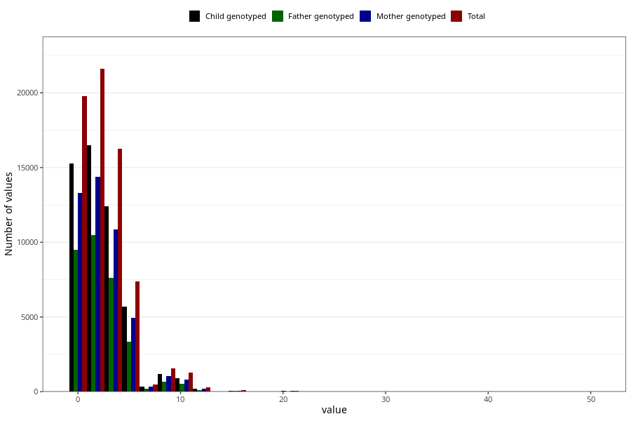

# coffee_before_filter
Variable mapping to questionnaire: q1m, question AA1377.
.
- Number of values:

| Value | Total | Child genotyped | Mother genotyped | Father genotyped |
| ----- | ----- | --------------- | ---------------- | ---------------- |
| Missing | 44800 | 30648 | 25757 | 17636 |
| Consumption have been reported by a mark but no amount given | 3 | 2 | 1 |1 |
| 0 | 19801 | 15286 | 13316 |9508 |
| 1 | 8501 | 6501 | 5618 |4106 |
| 2 | 13102 | 10010 | 8758 |6377 |
| 3 | 7135 | 5415 | 4725 |3367 |
| 4 | 9127 | 6995 | 6153 |4266 |
| 5 | 3747 | 2846 | 2484 |1663 |
| 6 | 3647 | 2824 | 2473 |1665 |
| 7 | 475 | 361 | 330 |216 |
| 8 | 1513 | 1145 | 996 |653 |
| 9 | 36 | 30 | 27 |16 |
| 10 | 1247 | 918 | 796 |517 |
| 11 | 11 | 9 | 8 |8 |
| 12 | 284 | 218 | 193 |129 |
| 13 | 3 | 3 | 3 |2 |
| 14 | 20 | 15 | 14 |12 |
| 15 | 68 | 52 | 45 |34 |
| 16 | 26 | 18 | 17 |8 |
| 18 | 4 | 4 | 4 |4 |
| 20 | 60 | 45 | 42 |26 |
| 24 | 5 | 4 | 4 |3 |
| 25 | 2 | 2 | 1 |0 |
| 30 | 5 | 3 | 3 |1 |
| 50 | 1 | 1 | 1 |0 |

