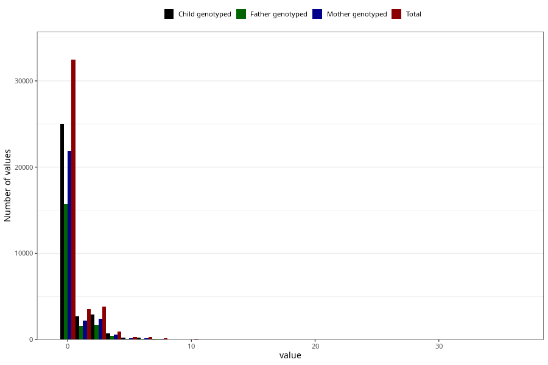

# coffee_before_instant
Variable mapping to questionnaire: q1m, question AA1380.
.
- Number of values:

| Value | Total | Child genotyped | Mother genotyped | Father genotyped |
| ----- | ----- | --------------- | ---------------- | ---------------- |
| Missing | 72047 | 51528 | 44211 | 30444 |
| Consumption have been reported by a mark but no amount given | 2 | 1 | 0 |0 |
| 0 | 32455 | 25018 | 21912 |15733 |
| 1 | 3571 | 2665 | 2184 |1590 |
| 2 | 3019 | 2261 | 1880 |1341 |
| 3 | 824 | 618 | 530 |374 |
| 4 | 937 | 700 | 581 |414 |
| 5 | 277 | 198 | 166 |112 |
| 6 | 270 | 196 | 167 |112 |
| 7 | 26 | 22 | 16 |13 |
| 8 | 100 | 82 | 67 |49 |
| 9 | 4 | 2 | 2 |2 |
| 10 | 68 | 48 | 41 |26 |
| 12 | 14 | 8 | 6 |3 |
| 14 | 2 | 2 | 2 |2 |
| 15 | 4 | 3 | 1 |2 |
| 16 | 1 | 1 | 1 |1 |
| 24 | 1 | 1 | 1 |0 |
| 36 | 1 | 1 | 1 |0 |

