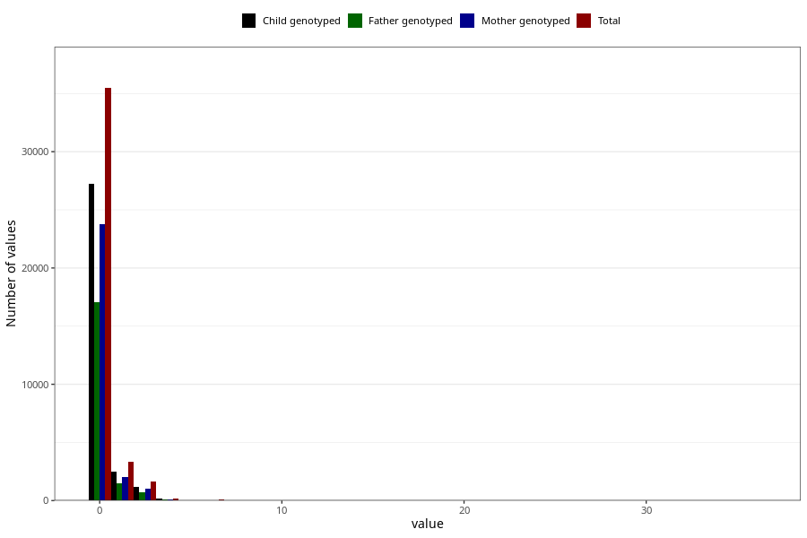

# coffee_during_instant
Variable mapping to questionnaire: q1m, question AA1381.
.
- Number of values:

| Value | Total | Child genotyped | Mother genotyped | Father genotyped |
| ----- | ----- | --------------- | ---------------- | ---------------- |
| Missing | 72921 | 52170 | 44744 | 30842 |
| 0 | 35475 | 27275 | 23753 |17089 |
| 1 | 3312 | 2488 | 2056 |1454 |
| 2 | 1399 | 1034 | 887 |613 |
| 3 | 218 | 152 | 130 |85 |
| 4 | 173 | 138 | 117 |77 |
| 5 | 34 | 25 | 20 |18 |
| 6 | 62 | 48 | 41 |28 |
| 7 | 8 | 6 | 4 |4 |
| 8 | 8 | 8 | 8 |4 |
| 10 | 10 | 8 | 6 |3 |
| 14 | 1 | 1 | 1 |1 |
| 24 | 1 | 1 | 1 |0 |
| 36 | 1 | 1 | 1 |0 |

