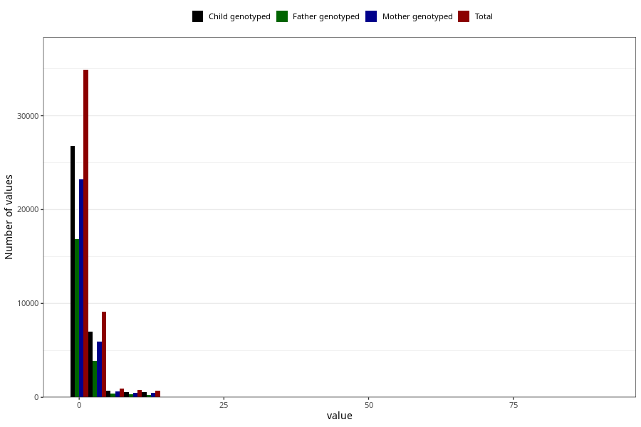

# coke_before
Variable mapping to questionnaire: q1m, question AA1392.
.
- Number of values:

| Value | Total | Child genotyped | Mother genotyped | Father genotyped |
| ----- | ----- | --------------- | ---------------- | ---------------- |
| Missing | 67199 | 47769 | 40957 | 28459 |
| Consumption have been reported by a mark but no amount given | 11 | 6 | 4 |2 |
| 0 | 26983 | 20726 | 18091 |13273 |
| 1 | 7901 | 6054 | 5161 |3580 |
| 2 | 4463 | 3462 | 2991 |1981 |
| 3 | 885 | 645 | 541 |339 |
| 4 | 3747 | 2866 | 2436 |1556 |
| 5 | 382 | 290 | 251 |157 |
| 6 | 439 | 342 | 296 |188 |
| 7 | 78 | 56 | 51 |39 |
| 8 | 507 | 384 | 331 |233 |
| 9 | 17 | 15 | 13 |12 |
| 10 | 220 | 155 | 143 |84 |
| 11 | 10 | 5 | 2 |2 |
| 12 | 681 | 513 | 445 |280 |
| 13 | 1 | 1 | 1 |1 |
| 14 | 6 | 5 | 5 |3 |
| 15 | 20 | 16 | 13 |7 |
| 16 | 24 | 11 | 8 |4 |
| 18 | 1 | 0 | 0 |0 |
| 20 | 13 | 11 | 9 |7 |
| 23 | 1 | 0 | 0 |0 |
| 24 | 23 | 14 | 12 |6 |
| 25 | 1 | 1 | 1 |1 |
| 28 | 2 | 2 | 2 |1 |
| 30 | 1 | 1 | 1 |0 |
| 32 | 1 | 1 | 1 |1 |
| 36 | 2 | 1 | 1 |1 |
| 40 | 1 | 1 | 1 |0 |
| 50 | 1 | 1 | 1 |1 |
| 80 | 1 | 0 | 0 |0 |
| 90 | 1 | 1 | 0 |0 |

