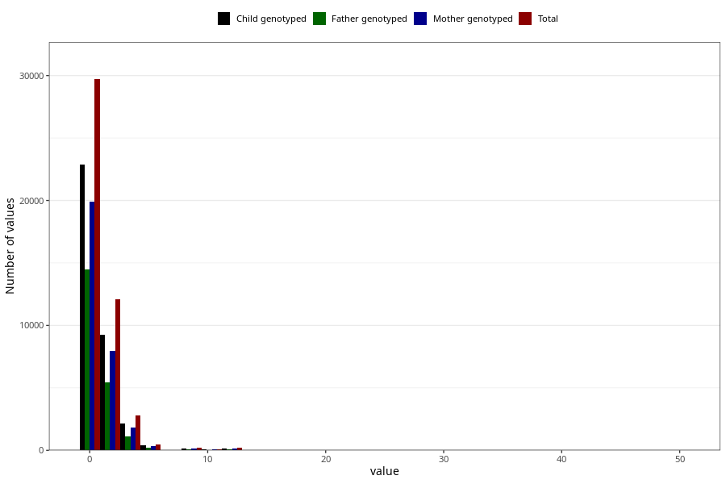

# coke_during
Variable mapping to questionnaire: q1m, question AA1393.
.
- Number of values:

| Value | Total | Child genotyped | Mother genotyped | Father genotyped |
| ----- | ----- | --------------- | ---------------- | ---------------- |
| Missing | 67925 | 48309 | 41343 | 28715 |
| Consumption have been reported by a mark but no amount given | 6 | 3 | 3 |1 |
| 0 | 29709 | 22858 | 19919 |14473 |
| 1 | 8391 | 6386 | 5511 |3826 |
| 2 | 3701 | 2848 | 2466 |1618 |
| 3 | 630 | 464 | 391 |248 |
| 4 | 2148 | 1662 | 1419 |894 |
| 5 | 232 | 172 | 151 |89 |
| 6 | 266 | 205 | 186 |112 |
| 7 | 44 | 30 | 27 |18 |
| 8 | 227 | 169 | 142 |89 |
| 9 | 11 | 8 | 6 |7 |
| 10 | 94 | 63 | 52 |30 |
| 11 | 2 | 1 | 0 |0 |
| 12 | 203 | 154 | 132 |87 |
| 13 | 1 | 0 | 0 |0 |
| 15 | 6 | 4 | 4 |0 |
| 16 | 5 | 4 | 4 |2 |
| 18 | 1 | 1 | 1 |0 |
| 20 | 7 | 5 | 3 |3 |
| 24 | 6 | 2 | 2 |0 |
| 25 | 1 | 1 | 1 |1 |
| 28 | 1 | 1 | 1 |1 |
| 30 | 1 | 1 | 1 |0 |
| 36 | 2 | 2 | 2 |2 |
| 37 | 1 | 1 | 1 |1 |
| 50 | 2 | 1 | 1 |1 |

