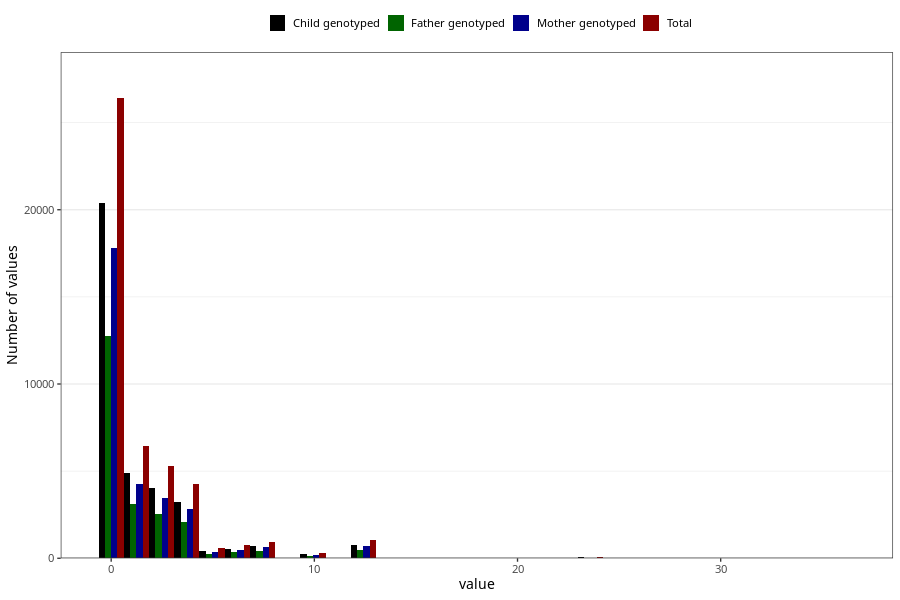

# diet_coke_before
Variable mapping to questionnaire: q1m, question AA1398.
.
- Number of values:

| Value | Total | Child genotyped | Mother genotyped | Father genotyped |
| ----- | ----- | --------------- | ---------------- | ---------------- |
| Missing | 67413 | 48002 | 40889 | 28012 |
| Consumption have been reported by a mark but no amount given | 6 | 4 | 2 |1 |
| 0 | 26403 | 20365 | 17808 |12746 |
| 1 | 6435 | 4887 | 4242 |3120 |
| 2 | 4307 | 3276 | 2837 |2083 |
| 3 | 982 | 728 | 645 |451 |
| 4 | 4289 | 3246 | 2833 |2058 |
| 5 | 570 | 414 | 356 |269 |
| 6 | 748 | 558 | 488 |343 |
| 7 | 82 | 62 | 56 |35 |
| 8 | 830 | 633 | 577 |407 |
| 9 | 29 | 17 | 14 |9 |
| 10 | 330 | 238 | 206 |134 |
| 11 | 3 | 2 | 2 |2 |
| 12 | 1018 | 786 | 695 |469 |
| 13 | 2 | 1 | 0 |0 |
| 14 | 8 | 5 | 5 |4 |
| 15 | 25 | 18 | 16 |12 |
| 16 | 38 | 32 | 27 |22 |
| 17 | 2 | 2 | 2 |1 |
| 18 | 13 | 8 | 7 |3 |
| 20 | 21 | 15 | 13 |10 |
| 22 | 1 | 1 | 1 |0 |
| 24 | 53 | 45 | 43 |24 |
| 25 | 2 | 1 | 1 |1 |
| 28 | 2 | 1 | 0 |0 |
| 30 | 5 | 4 | 2 |1 |
| 36 | 6 | 4 | 2 |1 |

