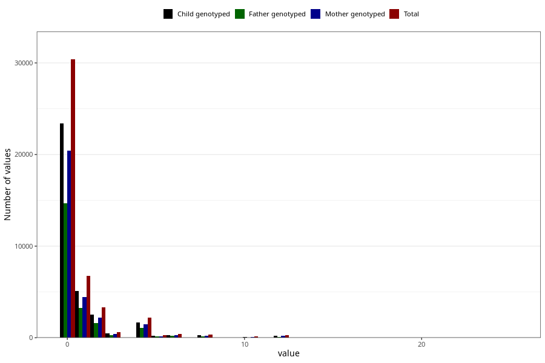

# diet_coke_during
Variable mapping to questionnaire: q1m, question AA1399.
.
- Number of values:

| Value | Total | Child genotyped | Mother genotyped | Father genotyped |
| ----- | ----- | --------------- | ---------------- | ---------------- |
| Missing | 68772 | 49006 | 41787 | 28636 |
| Consumption have been reported by a mark but no amount given | 4 | 3 | 1 |0 |
| 0 | 30386 | 23417 | 20451 |14690 |
| 1 | 6752 | 5126 | 4432 |3246 |
| 2 | 3320 | 2514 | 2203 |1600 |
| 3 | 643 | 472 | 416 |304 |
| 4 | 2172 | 1655 | 1460 |1057 |
| 5 | 297 | 208 | 176 |131 |
| 6 | 413 | 307 | 268 |184 |
| 7 | 40 | 28 | 25 |14 |
| 8 | 342 | 264 | 234 |165 |
| 9 | 13 | 9 | 8 |5 |
| 10 | 138 | 95 | 81 |42 |
| 11 | 2 | 1 | 0 |0 |
| 12 | 269 | 209 | 191 |116 |
| 14 | 2 | 1 | 1 |1 |
| 15 | 15 | 9 | 9 |8 |
| 16 | 16 | 14 | 12 |10 |
| 18 | 5 | 3 | 3 |1 |
| 20 | 3 | 3 | 3 |2 |
| 22 | 1 | 1 | 1 |0 |
| 24 | 17 | 10 | 7 |6 |
| 25 | 1 | 0 | 0 |0 |

