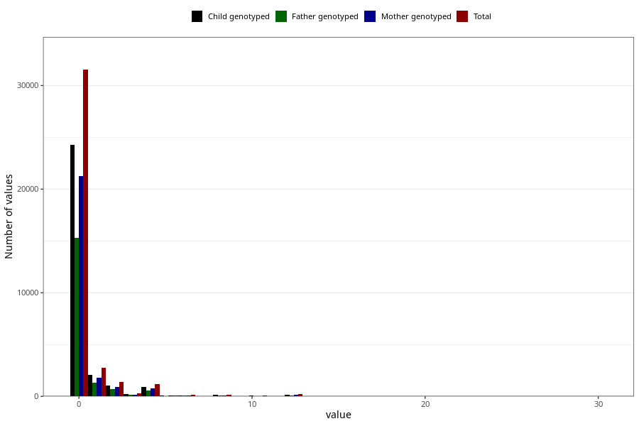

# diet_soda_before
Variable mapping to questionnaire: q1m, question AA1401.
.
- Number of values:

| Value | Total | Child genotyped | Mother genotyped | Father genotyped |
| ----- | ----- | --------------- | ---------------- | ---------------- |
| Missing | 75658 | 54195 | 46335 | 31891 |
| Consumption have been reported by a mark but no amount given | 4 | 3 | 3 |2 |
| 0 | 31529 | 24299 | 21233 |15277 |
| 1 | 2764 | 2091 | 1807 |1347 |
| 2 | 1421 | 1079 | 920 |673 |
| 3 | 275 | 194 | 165 |125 |
| 4 | 1176 | 899 | 791 |551 |
| 5 | 110 | 82 | 70 |40 |
| 6 | 155 | 111 | 102 |76 |
| 7 | 19 | 16 | 15 |9 |
| 8 | 171 | 139 | 119 |78 |
| 9 | 5 | 5 | 5 |5 |
| 10 | 80 | 58 | 50 |28 |
| 12 | 222 | 161 | 134 |99 |
| 13 | 1 | 0 | 0 |0 |
| 14 | 2 | 2 | 1 |1 |
| 15 | 5 | 3 | 1 |1 |
| 16 | 7 | 7 | 7 |5 |
| 18 | 5 | 4 | 4 |3 |
| 20 | 4 | 2 | 2 |2 |
| 24 | 9 | 5 | 5 |5 |
| 30 | 1 | 0 | 0 |0 |

