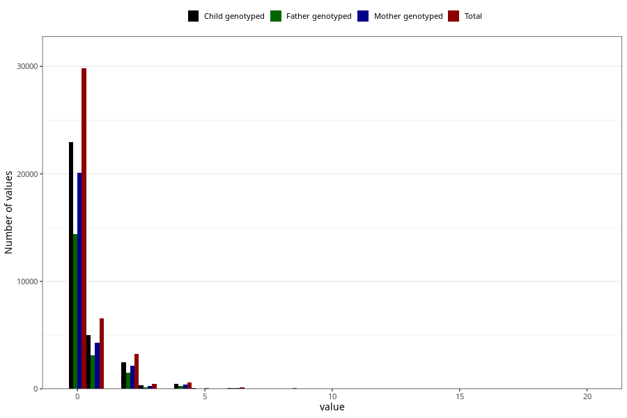

# herbal_tea_during
Variable mapping to questionnaire: q1m, question AA1390.
.
- Number of values:

| Value | Total | Child genotyped | Mother genotyped | Father genotyped |
| ----- | ----- | --------------- | ---------------- | ---------------- |
| Missing | 72641 | 51925 | 44375 | 30587 |
| 0 | 29810 | 22970 | 20102 |14399 |
| 1 | 6562 | 4990 | 4312 |3145 |
| 2 | 3255 | 2480 | 2136 |1523 |
| 3 | 439 | 319 | 265 |171 |
| 4 | 598 | 440 | 391 |274 |
| 5 | 74 | 53 | 43 |29 |
| 6 | 148 | 111 | 89 |54 |
| 7 | 13 | 10 | 8 |4 |
| 8 | 51 | 37 | 31 |19 |
| 10 | 15 | 11 | 9 |6 |
| 11 | 2 | 0 | 0 |0 |
| 12 | 9 | 7 | 6 |6 |
| 15 | 1 | 0 | 0 |0 |
| 16 | 3 | 1 | 1 |1 |
| 20 | 2 | 1 | 1 |0 |

