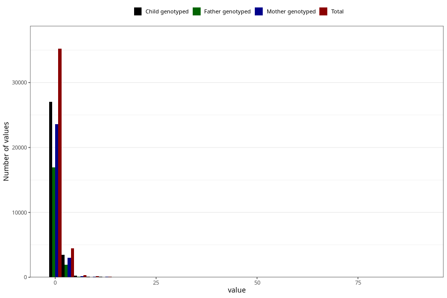

# soda_before
Variable mapping to questionnaire: q1m, question AA1395.
.
- Number of values:

| Value | Total | Child genotyped | Mother genotyped | Father genotyped |
| ----- | ----- | --------------- | ---------------- | ---------------- |
| Missing | 73318 | 52393 | 44869 | 31100 |
| Consumption have been reported by a mark but no amount given | 6 | 4 | 2 |1 |
| 0 | 28762 | 22036 | 19255 |14030 |
| 1 | 6458 | 5008 | 4327 |2941 |
| 2 | 2742 | 2137 | 1835 |1199 |
| 3 | 359 | 272 | 228 |144 |
| 4 | 1393 | 1088 | 912 |577 |
| 5 | 168 | 124 | 106 |71 |
| 6 | 109 | 76 | 61 |46 |
| 7 | 20 | 12 | 10 |8 |
| 8 | 103 | 71 | 55 |35 |
| 9 | 2 | 2 | 2 |1 |
| 10 | 50 | 37 | 29 |17 |
| 11 | 5 | 3 | 2 |1 |
| 12 | 110 | 82 | 69 |43 |
| 14 | 1 | 1 | 1 |0 |
| 15 | 3 | 2 | 2 |1 |
| 16 | 3 | 1 | 1 |1 |
| 17 | 1 | 1 | 1 |1 |
| 18 | 2 | 1 | 0 |0 |
| 20 | 3 | 1 | 1 |1 |
| 24 | 2 | 1 | 1 |0 |
| 28 | 1 | 1 | 0 |0 |
| 30 | 1 | 0 | 0 |0 |
| 90 | 1 | 1 | 0 |0 |

