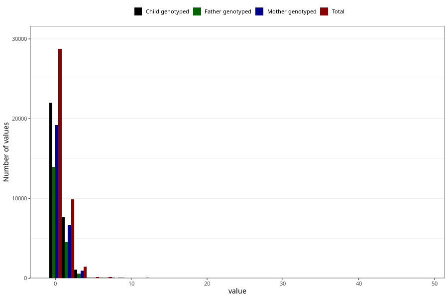

# soda_during
Variable mapping to questionnaire: q1m, question AA1396.
.
- Number of values:

| Value | Total | Child genotyped | Mother genotyped | Father genotyped |
| ----- | ----- | --------------- | ---------------- | ---------------- |
| Missing | 73074 | 52221 | 44683 | 30922 |
| Consumption have been reported by a mark but no amount given | 5 | 3 | 1 |0 |
| 0 | 28746 | 22032 | 19203 |13966 |
| 1 | 7261 | 5627 | 4900 |3364 |
| 2 | 2616 | 2037 | 1761 |1168 |
| 3 | 309 | 223 | 193 |114 |
| 4 | 1116 | 858 | 731 |477 |
| 5 | 145 | 108 | 93 |64 |
| 6 | 119 | 87 | 77 |53 |
| 7 | 23 | 16 | 14 |8 |
| 8 | 79 | 57 | 45 |33 |
| 9 | 7 | 5 | 5 |5 |
| 10 | 41 | 32 | 25 |18 |
| 11 | 5 | 3 | 3 |2 |
| 12 | 62 | 39 | 29 |20 |
| 14 | 1 | 1 | 1 |0 |
| 15 | 2 | 0 | 0 |0 |
| 16 | 3 | 2 | 2 |1 |
| 17 | 1 | 0 | 0 |0 |
| 20 | 3 | 1 | 1 |1 |
| 24 | 2 | 0 | 0 |0 |
| 28 | 1 | 1 | 0 |0 |
| 48 | 2 | 2 | 2 |2 |

