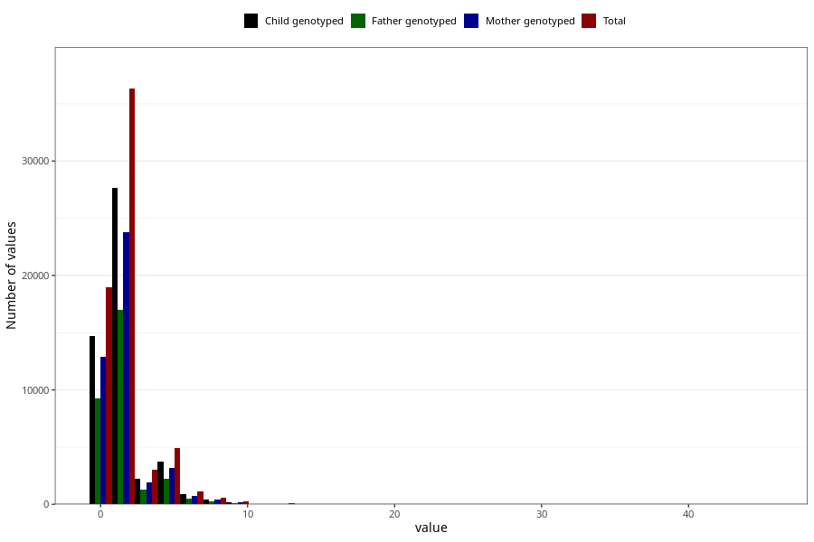

# tea_before
Variable mapping to questionnaire: q1m, question AA1386.
.
- Number of values:

| Value | Total | Child genotyped | Mother genotyped | Father genotyped |
| ----- | ----- | --------------- | ---------------- | ---------------- |
| Missing | 48365 | 33500 | 28671 | 19549 |
| Consumption have been reported by a mark but no amount given | 12 | 6 | 4 |4 |
| 0 | 18956 | 14667 | 12855 |9231 |
| 1 | 20427 | 15559 | 13470 |9644 |
| 2 | 15896 | 12087 | 10345 |7333 |
| 3 | 3002 | 2239 | 1892 |1319 |
| 4 | 4159 | 3195 | 2748 |1934 |
| 5 | 752 | 552 | 453 |310 |
| 6 | 1159 | 868 | 743 |501 |
| 7 | 76 | 52 | 45 |30 |
| 8 | 482 | 381 | 335 |222 |
| 9 | 18 | 15 | 10 |8 |
| 10 | 212 | 159 | 132 |87 |
| 11 | 3 | 0 | 0 |0 |
| 12 | 69 | 49 | 44 |31 |
| 14 | 6 | 6 | 6 |5 |
| 15 | 3 | 3 | 1 |1 |
| 16 | 7 | 6 | 5 |3 |
| 18 | 1 | 0 | 0 |0 |
| 20 | 9 | 6 | 5 |4 |
| 24 | 3 | 3 | 3 |1 |
| 25 | 1 | 0 | 0 |0 |
| 30 | 1 | 1 | 1 |0 |
| 34 | 1 | 0 | 0 |0 |
| 40 | 2 | 1 | 1 |1 |
| 45 | 1 | 0 | 0 |0 |

