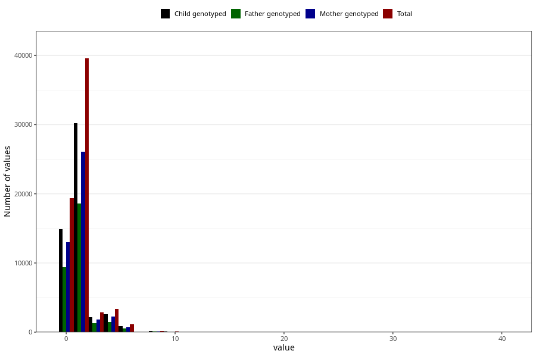

# tea_during
Variable mapping to questionnaire: q1m, question AA1387.
.
- Number of values:

| Value | Total | Child genotyped | Mother genotyped | Father genotyped |
| ----- | ----- | --------------- | ---------------- | ---------------- |
| Missing | 46803 | 32340 | 27602 | 18802 |
| Consumption have been reported by a mark but no amount given | 12 | 7 | 6 |5 |
| 0 | 19385 | 14890 | 12975 |9378 |
| 1 | 23429 | 17917 | 15536 |11214 |
| 2 | 16142 | 12314 | 10570 |7371 |
| 3 | 2890 | 2155 | 1841 |1289 |
| 4 | 3382 | 2561 | 2239 |1487 |
| 5 | 449 | 329 | 277 |181 |
| 6 | 718 | 531 | 465 |320 |
| 7 | 49 | 36 | 30 |20 |
| 8 | 223 | 175 | 148 |104 |
| 9 | 9 | 8 | 7 |3 |
| 10 | 91 | 61 | 47 |27 |
| 11 | 2 | 2 | 1 |1 |
| 12 | 24 | 18 | 15 |9 |
| 14 | 3 | 3 | 3 |3 |
| 15 | 1 | 1 | 0 |0 |
| 16 | 3 | 3 | 3 |1 |
| 18 | 1 | 0 | 0 |0 |
| 20 | 4 | 3 | 3 |3 |
| 23 | 1 | 0 | 0 |0 |
| 30 | 1 | 1 | 1 |0 |
| 40 | 1 | 0 | 0 |0 |

