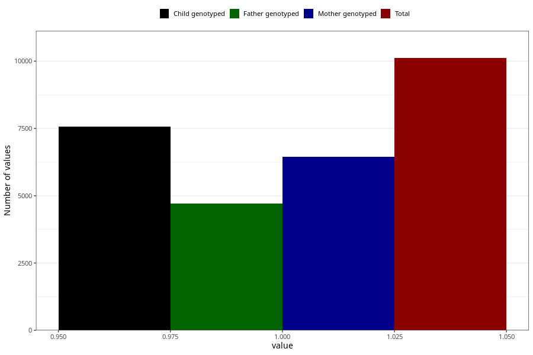

# abdominal_pain_13w_15w
Variable mapping to questionnaire: q1m, question AA189.
.
- Number of values:

| Value | Total | Child genotyped | Mother genotyped | Father genotyped |
| ----- | ----- | --------------- | ---------------- | ---------------- |
| Missing | 103508 | 75790 | 65313 | 45505 |
| 1 | 10115 | 7565 | 6456 |4713 |

