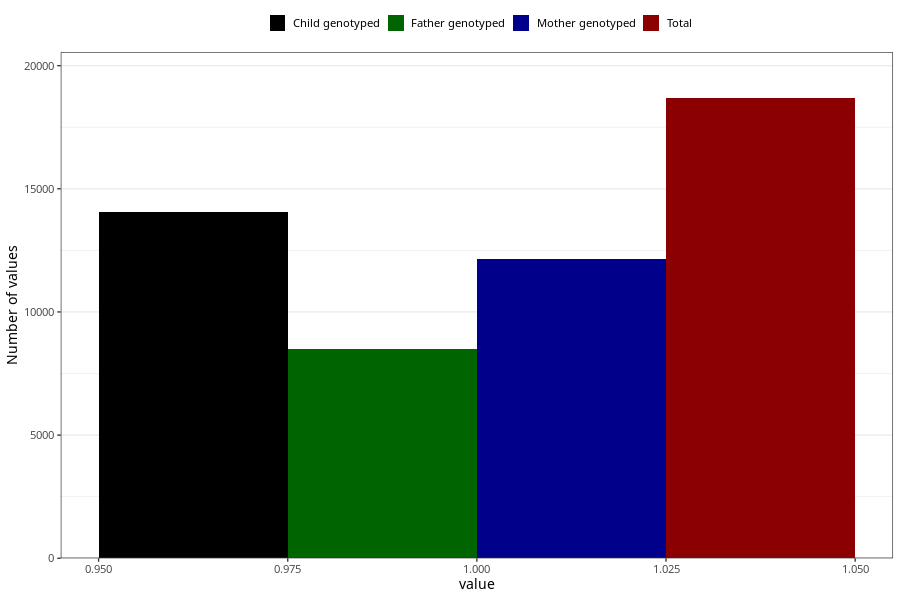

# heartburn_13w_15w
Variable mapping to questionnaire: q1m, question AA309.
.
- Number of values:

| Value | Total | Child genotyped | Mother genotyped | Father genotyped |
| ----- | ----- | --------------- | ---------------- | ---------------- |
| Missing | 94943 | 69302 | 59625 | 41713 |
| 1 | 18680 | 14053 | 12144 |8505 |

