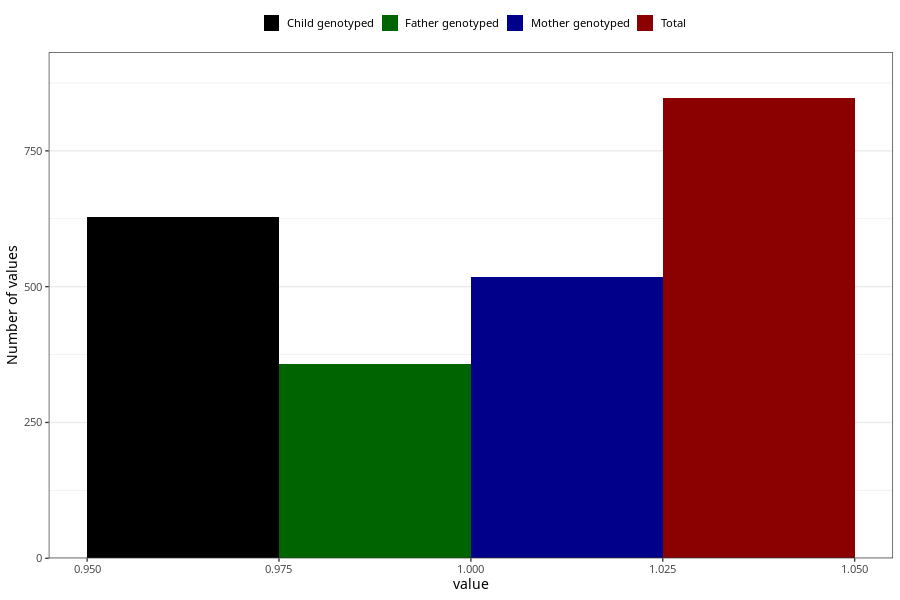

# influenza_before_4w
Variable mapping to questionnaire: q1m, question AA376.
.
- Number of values:

| Value | Total | Child genotyped | Mother genotyped | Father genotyped |
| ----- | ----- | --------------- | ---------------- | ---------------- |
| Missing | 112776 | 82727 | 71252 | 49860 |
| 1 | 847 | 628 | 517 |358 |

