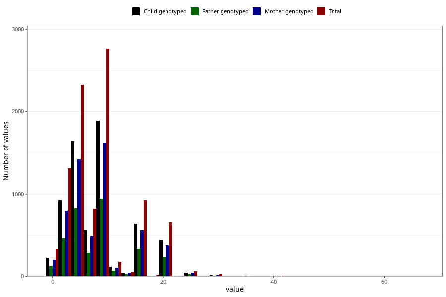

# mother_smoking_beginning_cigarettes_per_day
Variable mapping to questionnaire: mfr, question ROYK_BEG_ANT.
.
- Number of values:

| Value | Total | Child genotyped | Mother genotyped | Father genotyped |
| ----- | ----- | --------------- | ---------------- | ---------------- |
| Missing | 104155 | 76793 | 66087 | 46886 |
| 1 | 326 | 224 | 198 |124 |
| 2 | 627 | 448 | 389 |233 |
| 3 | 685 | 475 | 404 |230 |
| 4 | 495 | 355 | 316 |180 |
| 5 | 1830 | 1286 | 1104 |646 |
| 6 | 379 | 259 | 229 |141 |
| 7 | 438 | 304 | 261 |143 |
| 8 | 342 | 233 | 196 |108 |
| 9 | 25 | 17 | 15 |9 |
| 10 | 2398 | 1640 | 1411 |822 |
| 11 | 15 | 13 | 11 |8 |
| 12 | 158 | 104 | 93 |60 |
| 13 | 41 | 31 | 28 |21 |
| 14 | 11 | 9 | 9 |3 |
| 15 | 907 | 630 | 558 |329 |
| 16 | 6 | 4 | 2 |1 |
| 17 | 7 | 4 | 3 |1 |
| 18 | 12 | 7 | 6 |6 |
| 19 | 1 | 1 | 1 |0 |
| 20 | 656 | 443 | 379 |227 |
| 22 | 2 | 2 | 2 |1 |
| 23 | 8 | 7 | 7 |4 |
| 25 | 60 | 42 | 40 |24 |
| 30 | 23 | 14 | 12 |5 |
| 35 | 5 | 3 | 3 |2 |
| 40 | 7 | 4 | 3 |2 |
| 41 | 1 | 1 | 0 |0 |
| 45 | 1 | 1 | 1 |1 |
| 58 | 1 | 1 | 1 |1 |
| 67 | 1 | 0 | 0 |0 |

