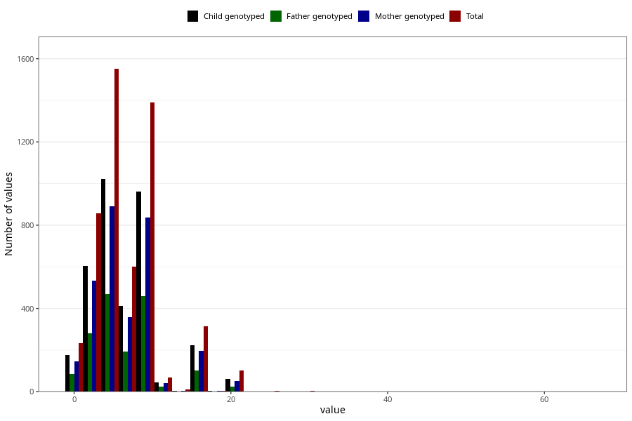

# mother_smoking_end_cigarettes_per_day
Variable mapping to questionnaire: mfr, question ROYK_AVSL_ANT.
.
- Number of values:

| Value | Total | Child genotyped | Mother genotyped | Father genotyped |
| ----- | ----- | --------------- | ---------------- | ---------------- |
| Missing | 108476 | 79829 | 68702 | 48573 |
| 1 | 235 | 176 | 147 |86 |
| 2 | 399 | 285 | 249 |128 |
| 3 | 459 | 320 | 283 |154 |
| 4 | 330 | 216 | 188 |98 |
| 5 | 1221 | 807 | 702 |370 |
| 6 | 281 | 185 | 162 |95 |
| 7 | 319 | 228 | 197 |99 |
| 8 | 209 | 147 | 124 |69 |
| 9 | 12 | 7 | 5 |4 |
| 10 | 1169 | 808 | 708 |388 |
| 11 | 6 | 4 | 4 |3 |
| 12 | 63 | 40 | 37 |22 |
| 13 | 9 | 3 | 3 |0 |
| 14 | 3 | 2 | 2 |0 |
| 15 | 312 | 223 | 195 |103 |
| 16 | 1 | 1 | 1 |0 |
| 17 | 1 | 1 | 1 |0 |
| 18 | 4 | 3 | 2 |2 |
| 19 | 1 | 1 | 1 |0 |
| 20 | 102 | 63 | 53 |23 |
| 23 | 2 | 1 | 1 |0 |
| 25 | 4 | 2 | 1 |0 |
| 30 | 3 | 2 | 1 |1 |
| 41 | 1 | 1 | 0 |0 |
| 67 | 1 | 0 | 0 |0 |

