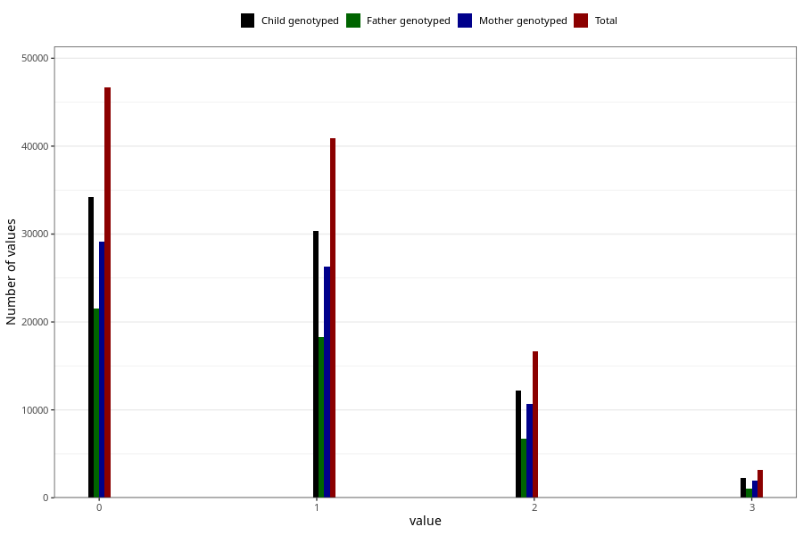

# n_previous_live_births
Variable mapping to questionnaire: mfr, question LEVENDEFODTE_5.
.
- Number of values:

| Value | Total | Child genotyped | Mother genotyped | Father genotyped |
| ----- | ----- | --------------- | ---------------- | ---------------- |
| Missing | 5400 | 3812 | 3264 | 2366 |
| 4 or more | 799 | 561 | 472 |225 |
| 0 | 46669 | 34202 | 29088 |21551 |
| 1 | 40948 | 30316 | 26318 |18302 |
| 2 | 16669 | 12242 | 10720 |6699 |
| 3 | 3138 | 2222 | 1907 |1075 |

