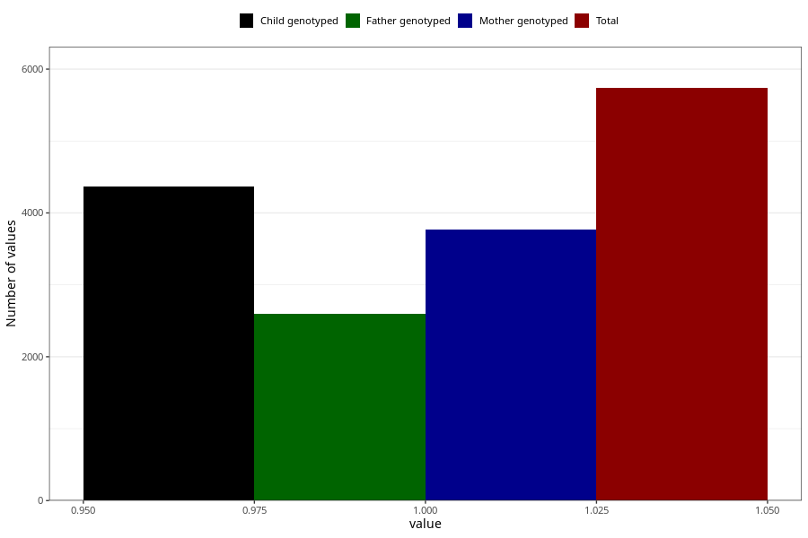

# pelvic_girdle_pain_9w_12w
Variable mapping to questionnaire: q1m, question AA178.
.
- Number of values:

| Value | Total | Child genotyped | Mother genotyped | Father genotyped |
| ----- | ----- | --------------- | ---------------- | ---------------- |
| Missing | 107886 | 78988 | 68000 | 47618 |
| 1 | 5737 | 4367 | 3769 |2600 |

