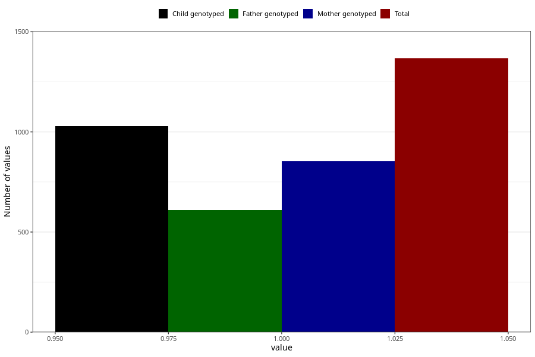

# pelvic_girdle_pain_before_4w
Variable mapping to questionnaire: q1m, question AA176.
.
- Number of values:

| Value | Total | Child genotyped | Mother genotyped | Father genotyped |
| ----- | ----- | --------------- | ---------------- | ---------------- |
| Missing | 112256 | 82327 | 70917 | 49609 |
| 1 | 1367 | 1028 | 852 |609 |

