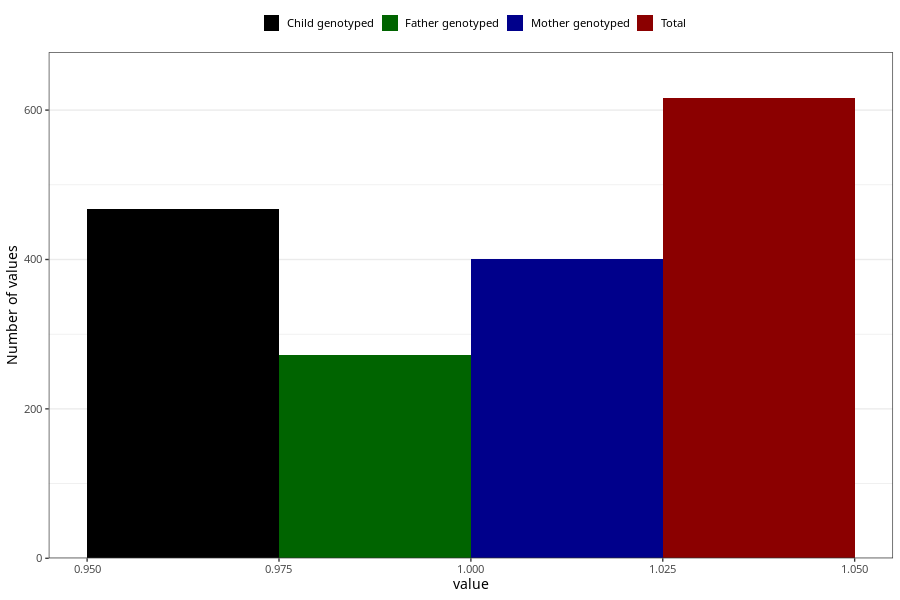

# pneumonia_bronchitis_13w_15w
Variable mapping to questionnaire: q1m, question AA389.
.
- Number of values:

| Value | Total | Child genotyped | Mother genotyped | Father genotyped |
| ----- | ----- | --------------- | ---------------- | ---------------- |
| Missing | 113007 | 82888 | 71369 | 49946 |
| 1 | 616 | 467 | 400 |272 |

