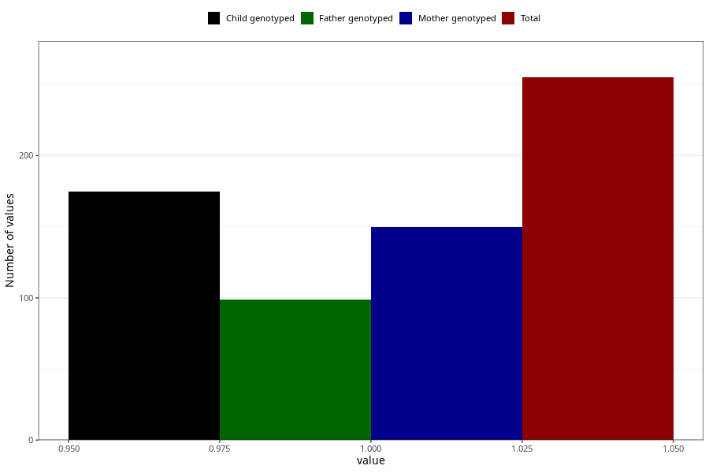

# pneumonia_bronchitis_before_4w
Variable mapping to questionnaire: q1m, question AA386.
.
- Number of values:

| Value | Total | Child genotyped | Mother genotyped | Father genotyped |
| ----- | ----- | --------------- | ---------------- | ---------------- |
| Missing | 113368 | 83180 | 71619 | 50119 |
| 1 | 255 | 175 | 150 |99 |

