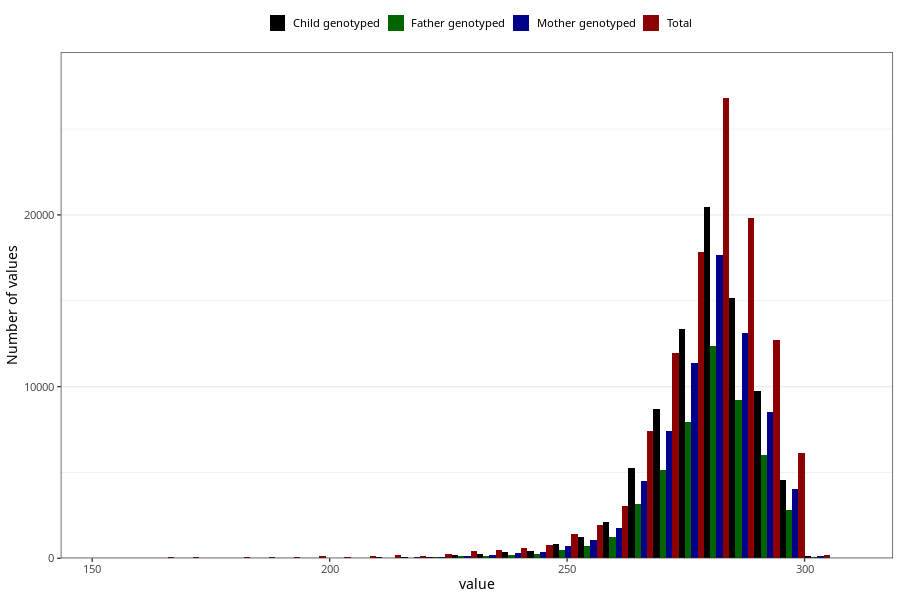

# pregnancy_duration
- Number of values:

| Value | Total | Child genotyped | Mother genotyped | Father genotyped |
| ----- | ----- | --------------- | ---------------- | ---------------- |
| Missing | 789 | 332 | 290 | 197 |
| 154 | 9 | 0 | 0 |0 |
| 155 | 14 | 1 | 1 |1 |
| 156 | 12 | 0 | 0 |0 |
| 157 | 6 | 0 | 0 |0 |
| 158 | 5 | 1 | 1 |1 |
| 159 | 4 | 0 | 0 |0 |
| 160 | 7 | 0 | 0 |0 |
| 161 | 9 | 0 | 0 |0 |
| 162 | 9 | 0 | 0 |0 |
| 163 | 4 | 0 | 0 |0 |
| 164 | 6 | 0 | 0 |0 |
| 165 | 16 | 5 | 2 |3 |
| 166 | 13 | 0 | 0 |0 |
| 167 | 9 | 0 | 0 |0 |
| 168 | 9 | 0 | 0 |0 |
| 169 | 9 | 0 | 0 |0 |
| 170 | 11 | 0 | 0 |0 |
| 171 | 15 | 3 | 3 |3 |
| 172 | 9 | 0 | 0 |0 |
| 173 | 4 | 0 | 0 |0 |
| 174 | 7 | 1 | 1 |0 |
| 175 | 5 | 0 | 0 |0 |
| 176 | 3 | 0 | 0 |0 |
| 177 | 11 | 0 | 0 |0 |
| 178 | 6 | 2 | 2 |0 |
| 179 | 11 | 1 | 1 |0 |
| 180 | 11 | 0 | 0 |0 |
| 181 | 13 | 1 | 1 |0 |
| 182 | 18 | 6 | 4 |4 |
| 183 | 11 | 3 | 2 |2 |
| 184 | 6 | 0 | 0 |0 |
| 185 | 9 | 0 | 0 |0 |
| 186 | 10 | 1 | 1 |0 |
| 187 | 10 | 1 | 1 |0 |
| 188 | 17 | 2 | 2 |2 |
| 189 | 13 | 3 | 3 |2 |
| 190 | 16 | 3 | 3 |2 |
| 191 | 15 | 5 | 4 |4 |
| 192 | 23 | 4 | 2 |1 |
| 193 | 14 | 2 | 2 |2 |
| 194 | 30 | 4 | 4 |1 |
| 195 | 16 | 0 | 0 |0 |
| 196 | 14 | 0 | 0 |0 |
| 197 | 15 | 3 | 1 |2 |
| 198 | 23 | 4 | 4 |2 |
| 199 | 15 | 1 | 1 |1 |
| 200 | 17 | 2 | 2 |2 |
| 201 | 35 | 5 | 2 |1 |
| 202 | 15 | 3 | 1 |1 |
| 203 | 13 | 3 | 3 |3 |
| 204 | 15 | 1 | 1 |0 |
| 205 | 21 | 4 | 4 |0 |
| 206 | 14 | 3 | 1 |0 |
| 207 | 42 | 9 | 9 |8 |
| 208 | 24 | 6 | 6 |2 |
| 209 | 22 | 3 | 2 |2 |
| 210 | 30 | 3 | 2 |0 |
| 211 | 36 | 13 | 10 |5 |
| 212 | 31 | 6 | 6 |4 |
| 213 | 31 | 10 | 8 |7 |
| 214 | 28 | 7 | 7 |5 |
| 215 | 31 | 12 | 8 |5 |
| 216 | 33 | 14 | 14 |11 |
| 217 | 35 | 15 | 15 |11 |
| 218 | 24 | 10 | 7 |5 |
| 219 | 27 | 11 | 9 |8 |
| 220 | 37 | 14 | 11 |9 |
| 221 | 44 | 25 | 21 |16 |
| 222 | 39 | 14 | 13 |9 |
| 223 | 41 | 13 | 11 |7 |
| 224 | 57 | 20 | 18 |12 |
| 225 | 40 | 19 | 14 |10 |
| 226 | 57 | 21 | 15 |11 |
| 227 | 57 | 27 | 23 |13 |
| 228 | 66 | 24 | 20 |15 |
| 229 | 65 | 29 | 25 |18 |
| 230 | 81 | 40 | 31 |28 |
| 231 | 75 | 32 | 29 |21 |
| 232 | 69 | 32 | 25 |21 |
| 233 | 89 | 40 | 35 |27 |
| 234 | 96 | 52 | 45 |31 |
| 235 | 98 | 46 | 39 |26 |
| 236 | 105 | 53 | 44 |30 |
| 237 | 125 | 75 | 67 |45 |
| 238 | 114 | 62 | 46 |31 |
| 239 | 121 | 60 | 52 |32 |
| 240 | 115 | 69 | 54 |41 |
| 241 | 143 | 81 | 67 |49 |
| 242 | 132 | 70 | 62 |38 |
| 243 | 143 | 76 | 61 |36 |
| 244 | 154 | 90 | 80 |54 |
| 245 | 178 | 102 | 90 |66 |
| 246 | 175 | 89 | 76 |49 |
| 247 | 187 | 92 | 81 |51 |
| 248 | 210 | 128 | 108 |71 |
| 249 | 197 | 129 | 103 |68 |
| 250 | 243 | 149 | 124 |92 |
| 251 | 272 | 149 | 117 |93 |
| 252 | 323 | 205 | 163 |115 |
| 253 | 327 | 223 | 201 |129 |
| 254 | 353 | 224 | 183 |120 |
| 255 | 340 | 210 | 179 |129 |
| 256 | 429 | 262 | 230 |145 |
| 257 | 461 | 305 | 256 |174 |
| 258 | 512 | 338 | 277 |184 |
| 259 | 546 | 377 | 316 |232 |
| 260 | 601 | 426 | 349 |249 |
| 261 | 646 | 451 | 384 |271 |
| 262 | 711 | 511 | 413 |289 |
| 263 | 786 | 562 | 492 |335 |
| 264 | 1007 | 709 | 610 |438 |
| 265 | 1117 | 787 | 683 |474 |
| 266 | 1307 | 920 | 779 |547 |
| 267 | 1510 | 1057 | 907 |621 |
| 268 | 1689 | 1200 | 1010 |725 |
| 269 | 1864 | 1353 | 1149 |779 |
| 270 | 2102 | 1486 | 1246 |859 |
| 271 | 2300 | 1656 | 1401 |991 |
| 272 | 2738 | 1994 | 1708 |1175 |
| 273 | 2979 | 2214 | 1904 |1339 |
| 274 | 3239 | 2383 | 2011 |1404 |
| 275 | 3345 | 2452 | 2077 |1522 |
| 276 | 3509 | 2633 | 2251 |1579 |
| 277 | 3787 | 2896 | 2481 |1686 |
| 278 | 3944 | 3006 | 2556 |1749 |
| 279 | 4043 | 3039 | 2579 |1798 |
| 280 | 4281 | 3287 | 2842 |2035 |
| 281 | 4510 | 3455 | 2995 |2093 |
| 282 | 4634 | 3532 | 3089 |2191 |
| 283 | 4757 | 3617 | 3093 |2131 |
| 284 | 4575 | 3530 | 3086 |2122 |
| 285 | 4522 | 3440 | 2971 |2076 |
| 286 | 4237 | 3229 | 2817 |1983 |
| 287 | 3921 | 3028 | 2596 |1848 |
| 288 | 3754 | 2860 | 2487 |1769 |
| 289 | 3365 | 2579 | 2253 |1541 |
| 290 | 3121 | 2385 | 2076 |1464 |
| 291 | 2834 | 2140 | 1879 |1296 |
| 292 | 2439 | 1884 | 1637 |1180 |
| 293 | 2268 | 1753 | 1522 |1115 |
| 294 | 2046 | 1552 | 1377 |968 |
| 295 | 1775 | 1354 | 1192 |838 |
| 296 | 1676 | 1232 | 1102 |747 |
| 297 | 1412 | 1032 | 888 |607 |
| 298 | 703 | 524 | 460 |342 |
| 299 | 392 | 289 | 264 |176 |
| 300 | 201 | 154 | 138 |96 |
| 301 | 90 | 61 | 56 |44 |
| 302 | 37 | 31 | 29 |19 |
| 303 | 26 | 18 | 13 |9 |
| 304 | 20 | 18 | 17 |12 |
| 305 | 21 | 15 | 13 |11 |
| 306 | 7 | 6 | 5 |5 |
| 307 | 13 | 11 | 9 |8 |
| 308 | 11 | 9 | 8 |4 |

