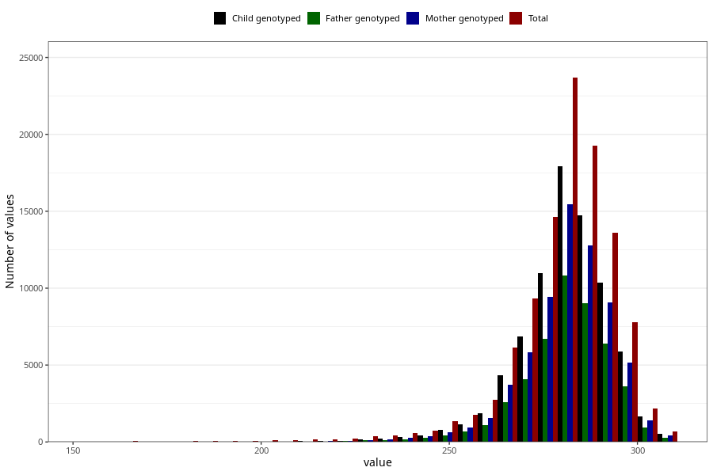

# pregnancy_duration_mens
Variable mapping to questionnaire: mfr, question SVLEN_SM_DG.
.
- Number of values:

| Value | Total | Child genotyped | Mother genotyped | Father genotyped |
| ----- | ----- | --------------- | ---------------- | ---------------- |
| Missing | 7343 | 4842 | 4125 | 2817 |
| 154 | 3 | 0 | 0 |0 |
| 155 | 12 | 1 | 1 |0 |
| 156 | 9 | 0 | 0 |0 |
| 157 | 6 | 0 | 0 |0 |
| 158 | 8 | 1 | 1 |1 |
| 159 | 3 | 1 | 1 |1 |
| 160 | 6 | 1 | 1 |0 |
| 161 | 9 | 0 | 0 |0 |
| 162 | 8 | 0 | 0 |0 |
| 163 | 8 | 1 | 1 |1 |
| 164 | 5 | 0 | 0 |0 |
| 165 | 9 | 0 | 0 |0 |
| 166 | 10 | 3 | 0 |2 |
| 167 | 5 | 1 | 1 |1 |
| 168 | 6 | 0 | 0 |0 |
| 169 | 8 | 0 | 0 |0 |
| 170 | 9 | 0 | 0 |0 |
| 171 | 9 | 0 | 0 |0 |
| 172 | 6 | 0 | 0 |0 |
| 173 | 4 | 0 | 0 |0 |
| 174 | 7 | 0 | 0 |0 |
| 175 | 8 | 1 | 1 |1 |
| 176 | 5 | 0 | 0 |0 |
| 177 | 3 | 0 | 0 |0 |
| 178 | 9 | 2 | 1 |0 |
| 179 | 5 | 0 | 0 |0 |
| 180 | 10 | 2 | 1 |1 |
| 181 | 12 | 1 | 1 |0 |
| 182 | 13 | 2 | 2 |2 |
| 183 | 10 | 2 | 1 |1 |
| 184 | 6 | 1 | 1 |0 |
| 185 | 15 | 1 | 1 |0 |
| 186 | 9 | 0 | 0 |0 |
| 187 | 14 | 5 | 5 |3 |
| 188 | 12 | 2 | 2 |0 |
| 189 | 10 | 2 | 1 |1 |
| 190 | 11 | 2 | 2 |1 |
| 191 | 20 | 2 | 1 |1 |
| 192 | 19 | 2 | 2 |1 |
| 193 | 7 | 1 | 1 |1 |
| 194 | 14 | 2 | 1 |1 |
| 195 | 12 | 3 | 2 |2 |
| 196 | 11 | 0 | 0 |0 |
| 197 | 18 | 2 | 2 |2 |
| 198 | 16 | 3 | 2 |1 |
| 199 | 16 | 1 | 0 |0 |
| 200 | 19 | 4 | 4 |3 |
| 201 | 24 | 6 | 4 |3 |
| 202 | 10 | 1 | 1 |0 |
| 203 | 18 | 0 | 0 |0 |
| 204 | 21 | 3 | 3 |0 |
| 205 | 16 | 5 | 4 |2 |
| 206 | 21 | 4 | 2 |1 |
| 207 | 23 | 6 | 5 |1 |
| 208 | 23 | 5 | 3 |2 |
| 209 | 20 | 5 | 5 |2 |
| 210 | 20 | 5 | 4 |1 |
| 211 | 30 | 9 | 9 |6 |
| 212 | 26 | 5 | 4 |3 |
| 213 | 27 | 11 | 9 |9 |
| 214 | 33 | 8 | 6 |4 |
| 215 | 33 | 7 | 6 |2 |
| 216 | 26 | 8 | 8 |5 |
| 217 | 40 | 10 | 10 |10 |
| 218 | 31 | 7 | 5 |3 |
| 219 | 29 | 13 | 10 |7 |
| 220 | 34 | 15 | 14 |10 |
| 221 | 37 | 19 | 15 |14 |
| 222 | 42 | 19 | 16 |9 |
| 223 | 37 | 13 | 13 |10 |
| 224 | 46 | 15 | 14 |8 |
| 225 | 58 | 23 | 17 |14 |
| 226 | 46 | 22 | 18 |15 |
| 227 | 46 | 19 | 16 |14 |
| 228 | 76 | 38 | 28 |18 |
| 229 | 64 | 31 | 26 |20 |
| 230 | 62 | 24 | 18 |15 |
| 231 | 63 | 28 | 25 |18 |
| 232 | 65 | 27 | 23 |16 |
| 233 | 75 | 44 | 41 |27 |
| 234 | 90 | 46 | 37 |30 |
| 235 | 89 | 42 | 39 |22 |
| 236 | 81 | 40 | 36 |24 |
| 237 | 109 | 58 | 50 |27 |
| 238 | 106 | 62 | 51 |31 |
| 239 | 102 | 45 | 34 |21 |
| 240 | 144 | 82 | 70 |42 |
| 241 | 134 | 86 | 68 |52 |
| 242 | 118 | 68 | 59 |40 |
| 243 | 136 | 80 | 70 |42 |
| 244 | 151 | 96 | 78 |49 |
| 245 | 152 | 87 | 64 |50 |
| 246 | 167 | 98 | 86 |65 |
| 247 | 173 | 107 | 93 |59 |
| 248 | 183 | 111 | 92 |61 |
| 249 | 229 | 117 | 97 |71 |
| 250 | 226 | 125 | 97 |70 |
| 251 | 257 | 166 | 139 |93 |
| 252 | 261 | 158 | 128 |95 |
| 253 | 299 | 187 | 154 |103 |
| 254 | 326 | 217 | 191 |128 |
| 255 | 350 | 230 | 189 |128 |
| 256 | 378 | 239 | 211 |155 |
| 257 | 400 | 265 | 220 |161 |
| 258 | 456 | 289 | 242 |164 |
| 259 | 497 | 339 | 294 |200 |
| 260 | 585 | 403 | 334 |225 |
| 261 | 565 | 396 | 323 |236 |
| 262 | 649 | 457 | 378 |253 |
| 263 | 715 | 499 | 435 |308 |
| 264 | 870 | 595 | 505 |347 |
| 265 | 987 | 710 | 599 |430 |
| 266 | 1064 | 756 | 656 |444 |
| 267 | 1165 | 821 | 696 |467 |
| 268 | 1314 | 955 | 809 |577 |
| 269 | 1495 | 1073 | 922 |626 |
| 270 | 1694 | 1248 | 1043 |703 |
| 271 | 1802 | 1331 | 1122 |801 |
| 272 | 2068 | 1519 | 1288 |909 |
| 273 | 2282 | 1682 | 1445 |1019 |
| 274 | 2441 | 1840 | 1576 |1119 |
| 275 | 2670 | 1993 | 1697 |1186 |
| 276 | 2930 | 2213 | 1888 |1340 |
| 277 | 3190 | 2386 | 2058 |1435 |
| 278 | 3381 | 2569 | 2218 |1602 |
| 279 | 3455 | 2616 | 2250 |1585 |
| 280 | 3850 | 2912 | 2499 |1777 |
| 281 | 3860 | 2929 | 2503 |1779 |
| 282 | 4164 | 3140 | 2745 |1905 |
| 283 | 4064 | 3073 | 2639 |1843 |
| 284 | 4289 | 3278 | 2832 |1933 |
| 285 | 3984 | 3041 | 2634 |1853 |
| 286 | 4050 | 3113 | 2666 |1904 |
| 287 | 3990 | 3104 | 2699 |1898 |
| 288 | 3758 | 2828 | 2466 |1741 |
| 289 | 3468 | 2669 | 2311 |1639 |
| 290 | 3303 | 2496 | 2191 |1541 |
| 291 | 2993 | 2336 | 2042 |1458 |
| 292 | 2699 | 2042 | 1800 |1256 |
| 293 | 2430 | 1832 | 1589 |1117 |
| 294 | 2167 | 1657 | 1458 |1024 |
| 295 | 1916 | 1460 | 1255 |891 |
| 296 | 1650 | 1247 | 1095 |796 |
| 297 | 1364 | 1033 | 914 |626 |
| 298 | 1155 | 875 | 739 |493 |
| 299 | 933 | 712 | 635 |442 |
| 300 | 759 | 579 | 523 |346 |
| 301 | 608 | 456 | 390 |272 |
| 302 | 506 | 383 | 331 |227 |
| 303 | 391 | 305 | 257 |172 |
| 304 | 365 | 291 | 253 |167 |
| 305 | 293 | 209 | 177 |120 |
| 306 | 259 | 199 | 178 |118 |
| 307 | 225 | 171 | 147 |88 |
| 308 | 175 | 134 | 123 |83 |

