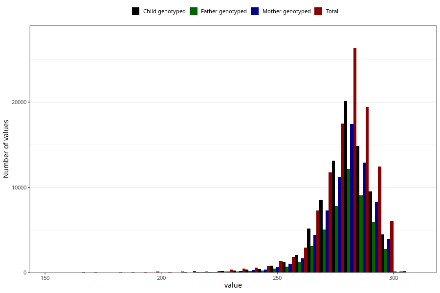

# pregnancy_duration_ultrasound
Variable mapping to questionnaire: mfr, question SVLEN_UL_DG.
.
- Number of values:

| Value | Total | Child genotyped | Mother genotyped | Father genotyped |
| ----- | ----- | --------------- | ---------------- | ---------------- |
| Missing | 2996 | 1843 | 1575 | 1080 |
| 154 | 7 | 0 | 0 |0 |
| 155 | 4 | 1 | 1 |1 |
| 156 | 8 | 0 | 0 |0 |
| 157 | 2 | 0 | 0 |0 |
| 158 | 3 | 0 | 0 |0 |
| 159 | 4 | 0 | 0 |0 |
| 160 | 5 | 0 | 0 |0 |
| 161 | 5 | 0 | 0 |0 |
| 162 | 6 | 0 | 0 |0 |
| 163 | 1 | 0 | 0 |0 |
| 164 | 6 | 0 | 0 |0 |
| 165 | 15 | 5 | 2 |3 |
| 166 | 12 | 0 | 0 |0 |
| 167 | 8 | 0 | 0 |0 |
| 168 | 9 | 0 | 0 |0 |
| 169 | 8 | 0 | 0 |0 |
| 170 | 7 | 0 | 0 |0 |
| 171 | 13 | 3 | 3 |3 |
| 172 | 9 | 0 | 0 |0 |
| 173 | 4 | 0 | 0 |0 |
| 174 | 5 | 1 | 1 |0 |
| 175 | 4 | 0 | 0 |0 |
| 176 | 2 | 0 | 0 |0 |
| 177 | 11 | 0 | 0 |0 |
| 178 | 6 | 2 | 2 |0 |
| 179 | 11 | 1 | 1 |0 |
| 180 | 9 | 0 | 0 |0 |
| 181 | 13 | 1 | 1 |0 |
| 182 | 16 | 6 | 4 |4 |
| 183 | 11 | 3 | 2 |2 |
| 184 | 6 | 0 | 0 |0 |
| 185 | 6 | 0 | 0 |0 |
| 186 | 9 | 1 | 1 |0 |
| 187 | 10 | 1 | 1 |0 |
| 188 | 17 | 2 | 2 |2 |
| 189 | 13 | 3 | 3 |2 |
| 190 | 16 | 3 | 3 |2 |
| 191 | 13 | 5 | 4 |4 |
| 192 | 23 | 4 | 2 |1 |
| 193 | 12 | 2 | 2 |2 |
| 194 | 30 | 4 | 4 |1 |
| 195 | 15 | 0 | 0 |0 |
| 196 | 14 | 0 | 0 |0 |
| 197 | 14 | 3 | 1 |2 |
| 198 | 23 | 4 | 4 |2 |
| 199 | 15 | 1 | 1 |1 |
| 200 | 17 | 2 | 2 |2 |
| 201 | 34 | 4 | 1 |1 |
| 202 | 15 | 3 | 1 |1 |
| 203 | 10 | 3 | 3 |3 |
| 204 | 15 | 1 | 1 |0 |
| 205 | 21 | 4 | 4 |0 |
| 206 | 13 | 3 | 1 |0 |
| 207 | 42 | 9 | 9 |8 |
| 208 | 23 | 6 | 6 |2 |
| 209 | 22 | 3 | 2 |2 |
| 210 | 29 | 3 | 2 |0 |
| 211 | 35 | 13 | 10 |5 |
| 212 | 31 | 6 | 6 |4 |
| 213 | 31 | 10 | 8 |7 |
| 214 | 28 | 7 | 7 |5 |
| 215 | 31 | 12 | 8 |5 |
| 216 | 33 | 14 | 14 |11 |
| 217 | 34 | 15 | 15 |11 |
| 218 | 23 | 10 | 7 |5 |
| 219 | 27 | 11 | 9 |8 |
| 220 | 37 | 14 | 11 |9 |
| 221 | 44 | 25 | 21 |16 |
| 222 | 38 | 13 | 12 |9 |
| 223 | 41 | 13 | 11 |7 |
| 224 | 52 | 19 | 17 |11 |
| 225 | 38 | 19 | 14 |10 |
| 226 | 55 | 19 | 15 |11 |
| 227 | 57 | 27 | 23 |13 |
| 228 | 64 | 24 | 20 |15 |
| 229 | 62 | 27 | 23 |18 |
| 230 | 78 | 39 | 31 |28 |
| 231 | 68 | 28 | 25 |18 |
| 232 | 68 | 32 | 25 |21 |
| 233 | 84 | 38 | 33 |25 |
| 234 | 95 | 52 | 45 |31 |
| 235 | 97 | 46 | 39 |26 |
| 236 | 101 | 53 | 44 |30 |
| 237 | 122 | 74 | 66 |45 |
| 238 | 108 | 57 | 42 |27 |
| 239 | 121 | 60 | 52 |32 |
| 240 | 114 | 68 | 53 |40 |
| 241 | 138 | 79 | 66 |47 |
| 242 | 130 | 69 | 61 |37 |
| 243 | 141 | 75 | 60 |36 |
| 244 | 153 | 90 | 80 |54 |
| 245 | 177 | 101 | 89 |65 |
| 246 | 171 | 86 | 73 |46 |
| 247 | 177 | 86 | 75 |47 |
| 248 | 208 | 127 | 107 |70 |
| 249 | 190 | 123 | 97 |64 |
| 250 | 235 | 142 | 118 |87 |
| 251 | 267 | 145 | 115 |92 |
| 252 | 316 | 202 | 160 |113 |
| 253 | 317 | 216 | 194 |126 |
| 254 | 346 | 221 | 182 |119 |
| 255 | 332 | 205 | 175 |125 |
| 256 | 420 | 258 | 226 |144 |
| 257 | 451 | 297 | 248 |169 |
| 258 | 501 | 330 | 270 |180 |
| 259 | 531 | 368 | 311 |230 |
| 260 | 585 | 415 | 341 |243 |
| 261 | 632 | 441 | 375 |265 |
| 262 | 700 | 502 | 406 |284 |
| 263 | 774 | 554 | 486 |331 |
| 264 | 993 | 703 | 606 |434 |
| 265 | 1097 | 773 | 671 |467 |
| 266 | 1288 | 917 | 776 |544 |
| 267 | 1483 | 1040 | 894 |614 |
| 268 | 1660 | 1177 | 995 |717 |
| 269 | 1835 | 1333 | 1130 |768 |
| 270 | 2062 | 1452 | 1216 |839 |
| 271 | 2268 | 1634 | 1381 |974 |
| 272 | 2685 | 1965 | 1686 |1164 |
| 273 | 2933 | 2175 | 1868 |1312 |
| 274 | 3182 | 2341 | 1976 |1378 |
| 275 | 3270 | 2396 | 2033 |1492 |
| 276 | 3448 | 2587 | 2212 |1550 |
| 277 | 3733 | 2859 | 2449 |1669 |
| 278 | 3871 | 2951 | 2508 |1714 |
| 279 | 3977 | 2990 | 2541 |1771 |
| 280 | 4215 | 3238 | 2804 |2009 |
| 281 | 4438 | 3397 | 2950 |2060 |
| 282 | 4562 | 3487 | 3050 |2161 |
| 283 | 4666 | 3553 | 3037 |2091 |
| 284 | 4497 | 3473 | 3033 |2089 |
| 285 | 4442 | 3391 | 2928 |2047 |
| 286 | 4148 | 3158 | 2759 |1946 |
| 287 | 3845 | 2972 | 2551 |1817 |
| 288 | 3686 | 2810 | 2441 |1736 |
| 289 | 3295 | 2534 | 2211 |1511 |
| 290 | 3071 | 2346 | 2042 |1440 |
| 291 | 2772 | 2096 | 1840 |1275 |
| 292 | 2389 | 1847 | 1604 |1155 |
| 293 | 2222 | 1720 | 1495 |1093 |
| 294 | 1998 | 1517 | 1346 |947 |
| 295 | 1734 | 1323 | 1161 |821 |
| 296 | 1644 | 1204 | 1079 |732 |
| 297 | 1382 | 1012 | 872 |595 |
| 298 | 679 | 506 | 445 |327 |
| 299 | 376 | 278 | 253 |168 |
| 300 | 191 | 149 | 133 |93 |
| 301 | 87 | 58 | 53 |41 |
| 302 | 33 | 28 | 27 |19 |
| 303 | 15 | 9 | 6 |5 |
| 304 | 16 | 14 | 13 |9 |
| 305 | 11 | 8 | 6 |4 |
| 306 | 2 | 2 | 2 |2 |
| 307 | 9 | 8 | 7 |7 |
| 308 | 7 | 7 | 6 |3 |

