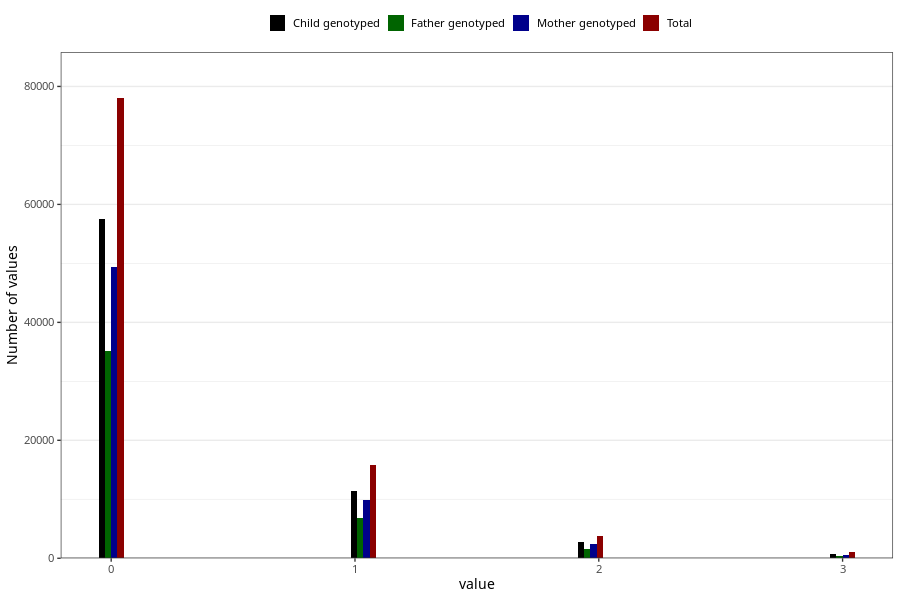

# previous_miscarriages_before_12w
Variable mapping to questionnaire: mfr, question SPABORT_12_5.
.
- Number of values:

| Value | Total | Child genotyped | Mother genotyped | Father genotyped |
| ----- | ----- | --------------- | ---------------- | ---------------- |
| Missing | 14549 | 10535 | 9173 | 6207 |
| 4 or more | 551 | 401 | 333 |216 |
| 0 | 78014 | 57452 | 49357 |35078 |
| 1 | 15758 | 11467 | 9899 |6742 |
| 2 | 3746 | 2778 | 2375 |1575 |
| 3 | 1005 | 722 | 632 |400 |

