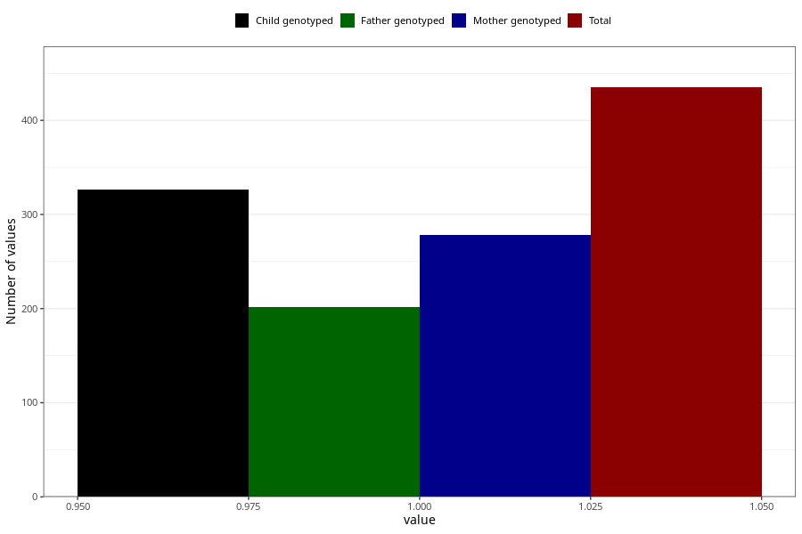

# protein_in_urine_before_4w
Variable mapping to questionnaire: q1m, question AA406.
.
- Number of values:

| Value | Total | Child genotyped | Mother genotyped | Father genotyped |
| ----- | ----- | --------------- | ---------------- | ---------------- |
| Missing | 113188 | 83029 | 71491 | 50016 |
| 1 | 435 | 326 | 278 |202 |

