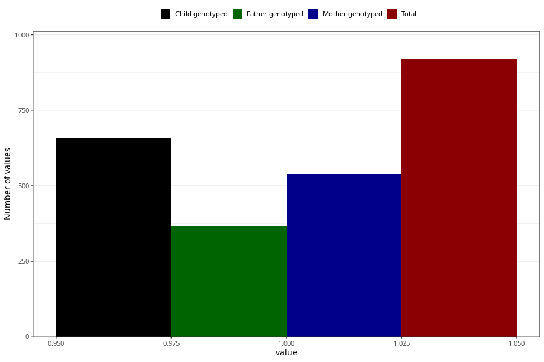

# sugar_in_urine_13w_15w
Variable mapping to questionnaire: q1m, question AA399.
.
- Number of values:

| Value | Total | Child genotyped | Mother genotyped | Father genotyped |
| ----- | ----- | --------------- | ---------------- | ---------------- |
| Missing | 112704 | 82695 | 71230 | 49849 |
| 1 | 919 | 660 | 539 |369 |

