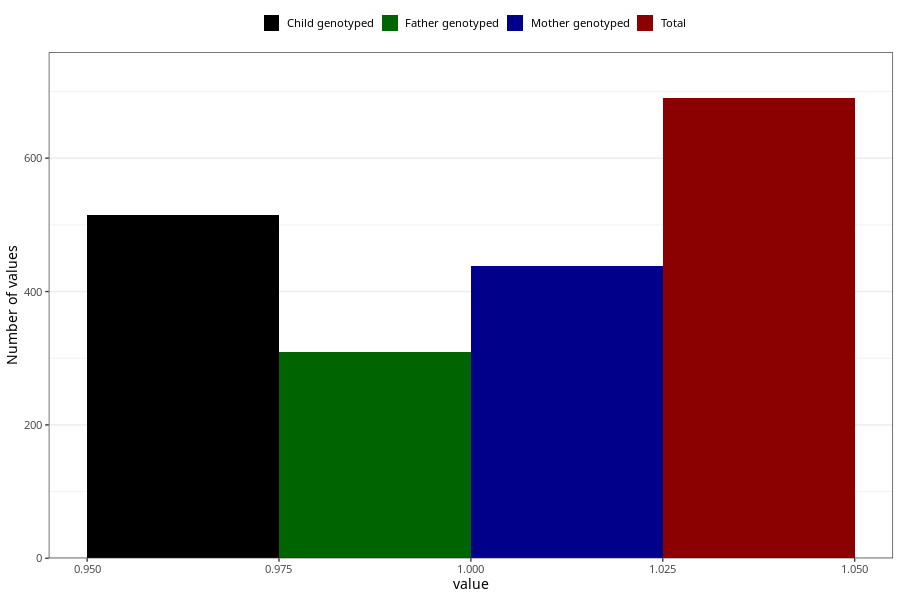

# sugar_in_urine_9w_12w
Variable mapping to questionnaire: q1m, question AA398.
.
- Number of values:

| Value | Total | Child genotyped | Mother genotyped | Father genotyped |
| ----- | ----- | --------------- | ---------------- | ---------------- |
| Missing | 112933 | 82840 | 71331 | 49908 |
| 1 | 690 | 515 | 438 |310 |

