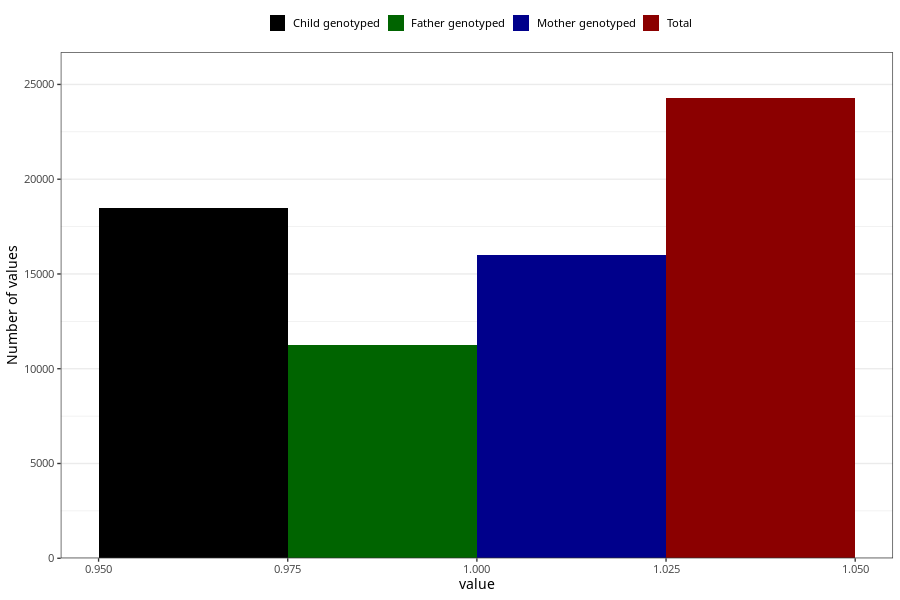

# unusual_tiredness_before_4w
Variable mapping to questionnaire: q1m, question AA286.
.
- Number of values:

| Value | Total | Child genotyped | Mother genotyped | Father genotyped |
| ----- | ----- | --------------- | ---------------- | ---------------- |
| Missing | 89347 | 64874 | 55785 | 38948 |
| 1 | 24276 | 18481 | 15984 |11270 |

