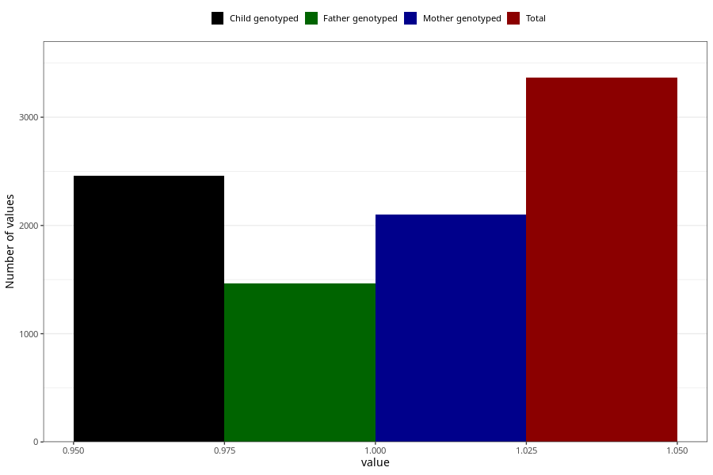

# vaginal_catarrh_unusual_discharge_13w_15w
Variable mapping to questionnaire: q1m, question AA249.
.
- Number of values:

| Value | Total | Child genotyped | Mother genotyped | Father genotyped |
| ----- | ----- | --------------- | ---------------- | ---------------- |
| Missing | 110258 | 80893 | 69671 | 48752 |
| 1 | 3365 | 2462 | 2098 |1466 |

